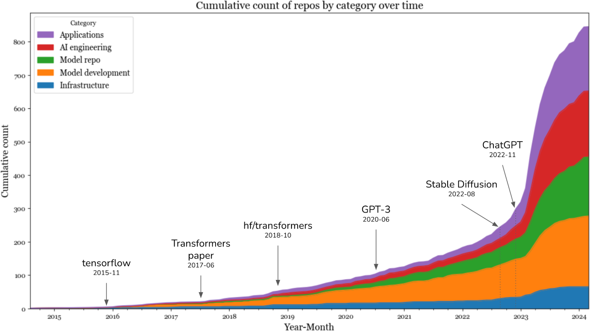
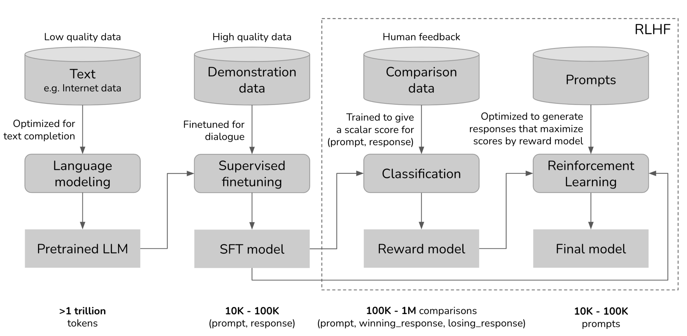
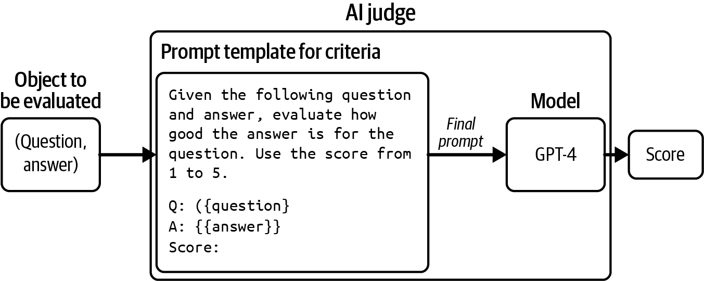
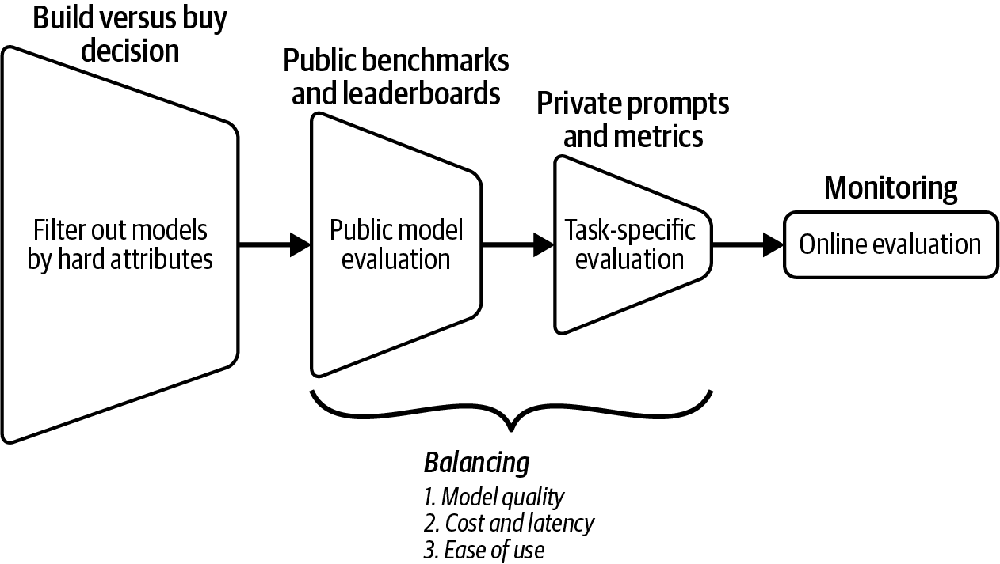
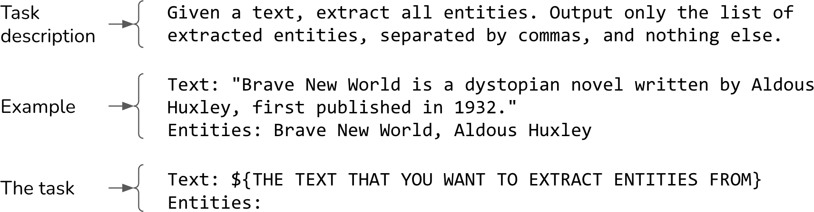
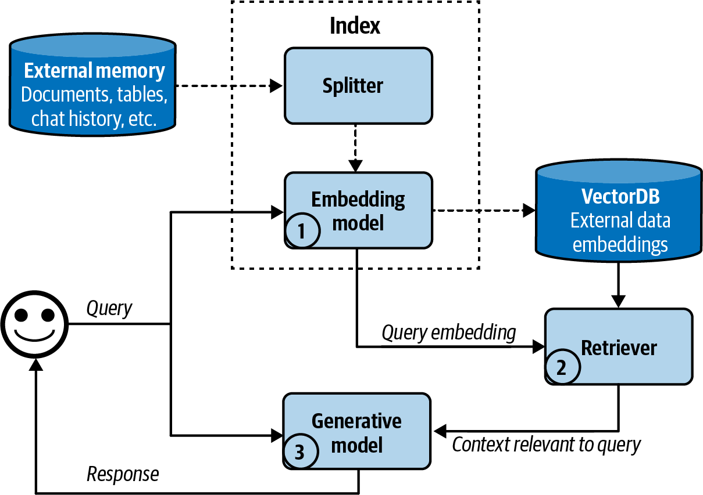
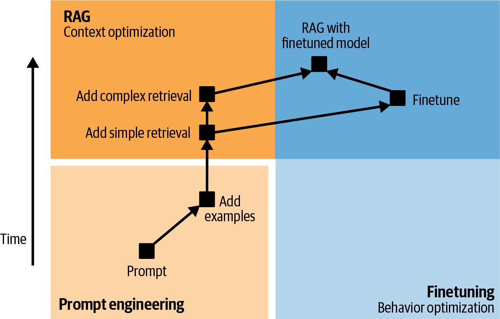
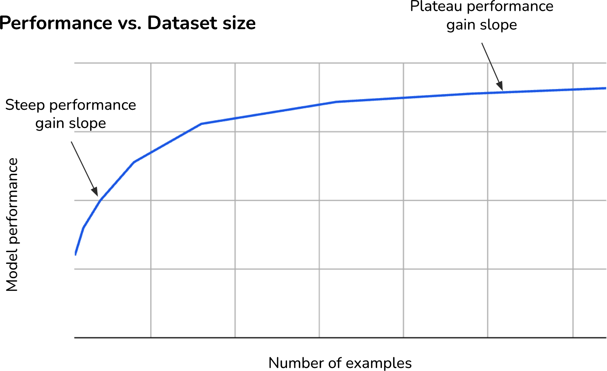
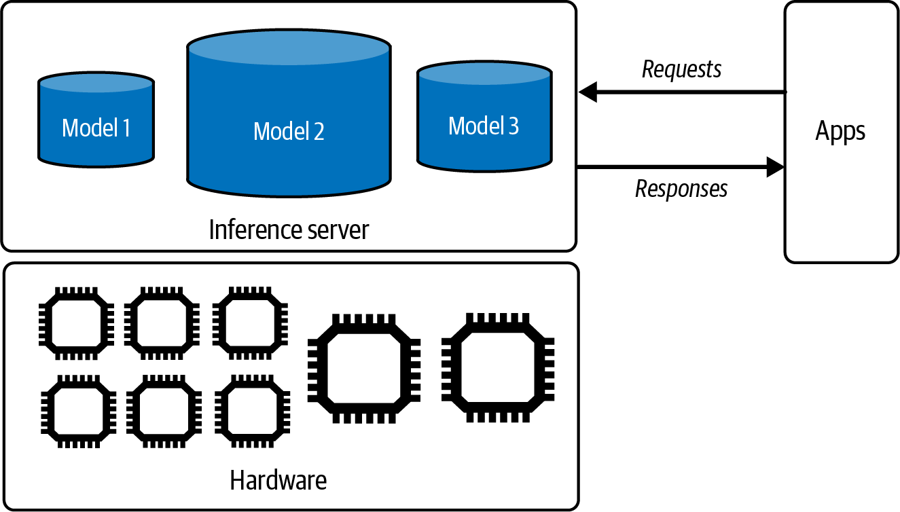
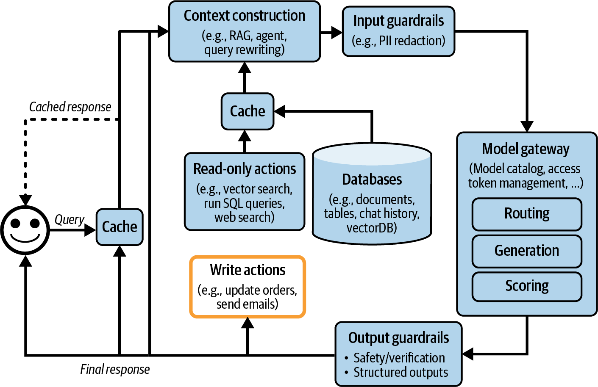

# Chapter Summaries

These are the summaries of each chapter taken from the book. Some of the summaries might not make sense to readers without having first read the originating chapters, but I hope that they will give you a sense of what the book is about.

* [Chapter 1. Introduction to Building AI Applications with Foundation Models](#chapter-1-introduction-to-building-ai-applications-with-foundation-models)
* [Chapter 2. Understanding Foundation Models](#chapter-2-understanding-foundation-models)
* [Chapter 3. Chapter 3. Evaluation Methodology](#chapter-3-evaluation-methodology)
* [Chapter 4. Evaluate AI Systems](#chapter-4-evaluate-ai-systems)
* [Chapter 5. Prompt Engineering](#chapter-5-prompt-engineering)
* [Chapter 6. RAG and Agents](#chapter-6-rag-and-agents)
* [Chapter 7. Finetuning](#chapter-7-finetuning)
* [Chapter 8. Dataset Engineering](#chapter-8-dataset-engineering)
* [Chapter 9. Inference Optimization](#chapter-9-inference-optimization)
* [Chapter 10. AI Engineering Architecture and User Feedback](#chapter-10-ai-engineering-architecture-and-user-feedback)

## Chapter 1. Introduction to Building AI Applications with Foundation Models

 
<i>Figure 1-15. Cumulative count of repositories by category over time. Image originally from my <a href="https://huyenchip.com/2024/03/14/ai-oss.html">study</a> of 900+ AIE repos with at least 500 GitHub stars.</i>

 

I meant this chapter to serve two purposes. One is to explain the emergence of AI engineering as a discipline, thanks to the availability of foundation models. Two is to give an overview of the process needed to build applications on top of these models. I hope that this chapter achieved this goal. As an overview chapter, it only lightly touched on many concepts. These concepts will be explored further in the rest of the book.

The chapter discussed the rapid evolution of AI in recent years. It walked through some of the most notable transformations, starting with the transition from language models to large language models, thanks to a training approach called self-supervision. It then traced how language models incorporated other data modalities to become foundation models, and how foundation models gave rise to AI engineering.

The rapid growth of AI engineering is motivated by the many applications that the emerging capabilities of foundation models enable. This chapter discussed some of the most successful application patterns, both for consumers and enterprises. Despite the incredible number of AI applications already in production, we're still in the early stages of AI engineering, with countless more innovations yet to be built.

Before building an application, an important yet often overlooked question is whether you should build it. This chapter discussed this question together with major considerations for building AI applications.

While AI engineering is a new term, it evolved out of ML engineering, which is the overarching discipline involved with building applications with all ML models. Many principles from ML engineering are still applicable to AI engineering. However, AI engineering also brings with it new challenges and solutions. The last section of the chapter discusses the AI engineering stack, including how it has changed from ML engineering.

One aspect of AI engineering that is especially challenging to capture in writing is the incredible amount of collective energy, creativity, and engineering talent that the community brings. This collective enthusiasm can often be overwhelming, as it's impossible to keep up-to-date with new techniques, discoveries, and engineering feats that seem to happen constantly.

One consolidation is that since AI is great at information aggregation, it can help us aggregate and summarize all these new updates. But tools can only help to a certain extent. The more overwhelming a space is, the more important it is to have a framework to help us navigate it. This book aims to provide such a framework.

The rest of the book will explore this framework step-by-step, starting with the fundamental building block of AI engineering: the foundation models that make so many amazing applications possible.

## Chapter 2. Understanding Foundation Models

 
<i>The overall training workflow with pre-training, SFT, and RLHF. Image originally from my <a href="https://huyenchip.com/2023/05/02/rlhf.html">RLHF blog post</a> (May 2023)</i>

 

This chapter discussed the core design decisions when building a foundation model. Since most people will be using ready-made foundation models instead of training one from scratch, I skipped the nitty-gritty training details in favor of modeling factors that help you determine what models to use and how to use them.

A crucial factor affecting a model's performance is its training data. Large models require a large amount of training data, which can be expensive and time-consuming to acquire. Model providers, therefore, often leverage whatever data is available. This leads to models that can perform well on the many tasks present in the training data, which may not include the specific task you want. This chapter went over why it's often necessary to curate training data to develop models targeting specific languages, especially low-resource languages, and specific domains.

After sourcing the data, model development can begin. While model training often dominates the headlines, an important step prior to that is architecting the model. The chapter looked into modeling choices, such as model architecture and model size. The dominating architecture for language-based foundation models is transformer. This chapter explored the problems that the transformer architecture was designed to address, as well as its limitations.

The scale of a model can be measured by three key numbers: the number of parameters, the number of training tokens, and the number of FLOPs needed for training. Two aspects that influence the amount of compute needed to train a model are the model size and the data size. The scaling law helps determine the optimal number of parameters and number of tokens given a compute budget. This chapter also looked at the scaling bottlenecks. Up until now, scaling up a model generally makes it better. But how long will this continue to be true?

Due to the low quality of training data and self-supervision during pre-training, the resulting model might produce outputs that don't align with what users want. This is addressed by post-training, which consists of two steps: supervised finetuning and preference finetuning. Human preference is diverse and impossible to capture in a single mathematical formula, so existing solutions are far from foolproof.

This chapter also covered one of my favorite topics: sampling, the process by which a model generates output tokens. Sampling makes AI models probabilistic. This probabilistic nature is what makes models like ChatGPT and Gemini great for creative tasks and fun to talk to. However, this probabilistic nature also causes inconsistency and hallucinations.

Working with AI models requires building your workflows around their probabilistic nature. The rest of this book will explore how to make AI engineering, if not deterministic, at least systematic. The first step towards systematic AI engineering is to establish a solid evaluation pipeline to help us detect failures and unexpected changes. Evaluation for foundation models is so crucial that I dedicated two chapters to it, starting with the next chapter.

## Chapter 3. Evaluation Methodology

 
<i>Figure 3-8. An example of an AI judge that evaluates the quality of an answer given a question.</i>

 

The stronger AI models become, the higher the potential for catastrophic failures, which makes evaluation even more important. At the same time, evaluating open-ended, powerful models is challenging. These challenges make many teams turn towards human evaluation. Having humans in the loop for sanity checks is always helpful, and in many cases, human evaluation is essential. However, this chapter focused on different approaches to automatic evaluation.

This chapter starts with a discussion on why foundation models are harder to evaluate than traditional ML models. While many new evaluation techniques are being developed, investments in evaluation still lag behind investments in model and application development.

Since many foundation models have a language model component, we zoomed into language modeling metrics, including perplexity and cross entropy. Many people I've talked to find these metrics confusing, so I included a section on how to interpret these metrics and leverage them in evaluation and data processing.

This chapter then shifted the focus to the different approaches to evaluate open-ended responses, including functional correctness, similarity scores, and AI-as-a-judge. The first two evaluation approaches are exact, while AI-as-a-judge evaluation is subjective.

Unlike exact evaluation, subjective metrics are highly dependent on the judge. Their scores need to be interpreted in the context of what judges are being used. Scores aimed to measure the same quality by different AI judges might not be comparable. AI judges, like all AI applications, should be iterated upon, meaning their judgments change. This makes them unreliable as benchmarks to track an application's changes over time. While promising, AI judges should be supplemented with exact evaluation, human evaluation, or both.

When evaluating models, you can evaluate each model independently, and then rank them by their scores. Alternatively, you can rank them using comparative signals: which of the two models is better? Comparative evaluation is common in sports, especially chess, and is gaining traction in AI evaluation. Both comparative evaluation and the post-training alignment process need preference signals, which are expensive to collect. This motivated the development of preference models: specialized AI judges that predict which response users prefer.

While language modeling metrics and hand-designed similarity measurements have existed for some time, AI-as-a-judge and comparative evaluation have only gained adoption with the emergence of foundation models. Many teams are figuring out how to incorporate them into their evaluation pipelines. Figuring out how to build a reliable evaluation pipeline to evaluate open-ended applications is the topic of the next chapter.

## Chapter 4. Evaluate AI Systems

 
<i>Figure 4-5. An overview of the evaluation workflow to evaluate models for your application.</i>

 

This is one of the hardest, but I believe one of the most important, topics that I've written about with regard to AI. Not having a reliable evaluation pipeline is one of the biggest blockers to AI adoption. While evaluation takes time, a reliable evaluation pipeline will enable you to reduce risks, discover opportunities to improve performance, and benchmark progresses, which will all save you time and headaches down the line.

Given an increasing number of readily available foundation models, for most application developers, the challenge is no longer in developing models but in selecting the right models for your application. This chapter discussed a list of criteria that are often used to evaluate models for applications, and how they are evaluated. It discussed how to evaluate both domain-specific capabilities and generation capabilities, including factual consistency and safety. Many criteria to evaluate foundation models evolved from traditional NLP, including fluency, coherence, and faithfulness.

To help answer the question of whether to host a model or to use a model API, this chapter outlined the pros and cons of each approach along seven axes, including data privacy, data lineage, performance, functionality, control, and cost. This decision, like all the build versus buy decisions, is unique to every team, depending on not only what the team needs but also what the team wants.

This chapter also explored the thousands of available public benchmarks. Public benchmarks can help you weed out bad models, but won't help you find the best models for your applications. Public benchmarks are also likely contaminated, as their data is included in the training data of many models. There are public leaderboards that aggregate multiple benchmarks to rank models, but how benchmarks are selected and aggregated is not a clear process. The lessons learned from public leaderboards are helpful for model selection, as model selection is akin to creating a private leaderboard to rank models based on your needs.

This chapter ends with how to use all the evaluation techniques and criteria discussed in the last chapter and how to create an evaluation pipeline for your application. No perfect evaluation method exists. It's impossible to capture the ability of a high-dimensional system using one- or few-dimensional scores. There are many limitations and biases associated with evaluating modern AI systems. However, this doesn't mean we shouldn't do it. Combining different methods and approaches can help mitigate many of these challenges.

Even though dedicated discussions on evaluation end here, evaluation will come up again and again, not just throughout the book but also throughout your application development process. Chapter 6 explores on evaluating retrieval and agentic systems, while Chapters 7 and 9 focus on calculating a model's memory usage, latency, and costs. Data quality verification is addressed in Chapter 8, and using user feedback to evaluate production applications in Chapter 10.

With that, let's move onto the actual model adaptation process, starting with a topic that many people associate with AI engineering: prompt engineering.

## Chapter 5. Prompt Engineering

 
<i>Figure 5-1. A simple example to show to anatomy of a prompt.</i>

 

Foundation models can do many things, but you must tell them exactly what you want. The process of crafting an instruction to get a model to do what you want is called prompt engineering. How much crafting is needed depends on how sensitive the model is to prompts. If a small change can cause a big change in the model's response, more crafting will be necessary.

You can think of prompt engineering as human–AI communication. Anyone can communicate, but not everyone can communicate well. Prompt engineering is easy to get started, which misleads many into thinking that it's easy to do it well.

The first part of this chapter discusses the anatomy of a prompt, why in-context learning works, and best prompt engineering practices. Whether you're communicating with AI or other humans, clear instructions with examples and relevant information are essential. Simple tricks like asking the model to slow down and think step by step can yield surprising improvements. Just like humans, AI models have their quirks and biases, which need to be considered for a productive relationship with them.

Foundation models are useful because they can follow instructions. However, this ability also opens them up to prompt attacks in which bad actors get models to follow malicious instructions. This chapter discusses different attack approaches and potential defenses against them. As security is an ever-evolving cat-and-mouse game, no security measurements will be foolproof. Security risks will remain a significant roadblock for AI adoption in high-stakes environments.

This chapter also discusses techniques to write better instructions to get models to do what you want. However, to accomplish a task, a model needs not just instructions but also relevant context. How to provide a model with relevant information will be discussed in the next chapter.

## Chapter 6. RAG and Agents

 
<i>Figure 6-3. A high-level view of how an embedding-based, or semantic, retriever works.</i>

 

Given the popularity of RAG and the potential of agents, early readers have mentioned that this is the chapter they're most excited about.

This chapter started with RAG, the pattern that emerged first between the two. Many tasks require extensive background knowledge that often exceeds a model's context window. For example, code copilots might need access to entire codebases, and research assistants may need to analyze multiple books. Originally developed to overcome a model's context limitations, RAG also enables more efficient use of information, improving response quality while reducing costs. From the early days of foundation models, it was clear that the RAG pattern would be immensely valuable for a wide range of applications, and it has since been rapidly adopted across both consumer and enterprise use cases.

RAG employs a two-step process. It first retrieves relevant information from external memory and then uses this information to generate more accurate responses. The success of a RAG system depends on the quality of its retriever. Term-based retrievers, such as Elasticsearch and BM25, are much lighter to implement and can provide strong baselines. Embedding-based retrievers are more computationally intensive but have the potential to outperform term-based algorithms.

Embedding-based retrieval is powered by vector search, which is also the backbone of many core internet applications such as search and recommender systems. Many vector search algorithms developed for these applications can be used for RAG.

The RAG pattern can be seen as a special case of agent where the retriever is a tool the model can use. Both patterns allow a model to circumvent its context limitation and stay more up-to-date, but the agentic pattern can do even more than that. An agent is defined by its environment and the tools it can access. In an AI-powered agent, AI is the planner that analyzes its given task, considers different solutions, and picks the most promising one. A complex task can require many steps to solve, which requires a powerful model to plan. A model's ability to plan can be augmented with reflection and a memory system to help it keep track of its progress.

The more tools you give a model, the more capabilities the model has, enabling it to solve more challenging tasks. However, the more automated the agent becomes, the more catastrophic its failures. Tool use exposes agents to many security risks discussed in the Chapter 5. For agents to work in the real world, rigorous defensive mechanisms need to be put in place.

Both RAG and agents work with a lot of information, which often exceeds the maximum context length of the underlying model. This necessitates the introduction of a memory system for managing and using all the information a model has. This chapter ended with a short discussion on what this component looks like.

RAG and agents are both prompt-based methods, as they influence the model's quality solely through inputs without modifying the model itself. While they can enable many incredible applications, modifying the underlying model can open up even more possibilities. How to do so will be the topic of the next chapter.

## Chapter 7. Finetuning

 
<i>Figure 7-3. Example application development flows. After simple retrieval (such as term-based retrieval), whether to experiment with more complex retrieval (such as hybrid search) or finetuning depends on each application and its failure modes.</i>

 

Outside of the evaluation chapters, finetuning has been the most challenging chapter to write. It touched on a wide range of concepts, both old (transfer learning) and new (PEFT), fundamental (low-rank factorization) and experimental (model merging), mathematical (memory calculation) and tactical (hyperparameter tuning). Arranging all these different aspects into a coherent structure while keeping them accessible was difficult.

The process of finetuning itself isn't hard. Many finetuning frameworks handle the training process for you. These frameworks can even suggest common finetuning methods with sensible default hyperparameters.

However, the context surrounding finetuning is complex. It starts with whether you should even finetune a model. This chapter started with the reasons for finetuning and the reasons for not finetuning. It also discussed one question that I have been asked many times: when to finetune and when to do RAG.

In its early days, finetuning was similar to pre-training—both involved updating the model's entire weights. However, as models increased in size, full finetuning became impractical for most practitioners. The more parameters to update during finetuning, the more memory finetuning needs. Most practitioners don't have access to sufficient resources (hardware, time, and data) to do full finetuning with foundation models.

Many finetuning techniques have been developed with the same motivation: to achieve strong performance on a minimal memory footprint. For example, PEFT reduces finetuning's memory requirements by reducing the number of trainable parameters. Quantized training, on the other hand, mitigates this memory bottleneck by reducing the number of bits needed to represent each value.

After giving an overview of PEFT, the chapter zoomed into LoRA—why it works and how it works. LoRA has many properties that make it popular among practitioners. On top of being parameter-efficient and data-efficient, it's also modular, making it much easier to serve and combine multiple LoRA models.

The idea of combining finetuned models brought the chapter to model merging, whose goal is to combine multiple models into one model that works better than these models separately. This chapter discussed the many use cases of model merging, from on-device deployment to model upscaling, and general approaches to model merging.

A comment I often hear from practitioners is that finetuning is easy, but getting data for finetuning is hard. Obtaining high-quality annotated data, especially instruction data, is challenging. The next chapter will dive into these challenges.

## Chapter 8. Dataset Engineering

 
<i>Figure 8-3. The performance gain curve with different dataset sizes can help you esti‐ mate the impact of additional training examples on your model’s performance.</i>

 

Even though the actual process of creating training data is incredibly intricate, the principles of creating a dataset are surprisingly straightforward. To build a dataset to train a model, you start by thinking through the behaviors you want your model to learn and then design a dataset to show these behaviors. Due to the importance of data, teams are introducing dedicated data roles responsible for acquiring appropriate datasets while ensuring privacy and compliance.

What data you need depends not only on your use case but also on the training phase. Pre-training requires different data from instruction finetuning and preferred finetuning. However, dataset design across training phases shares the same three core criteria: quality, coverage, and quantity.

While how much data a model is trained on is what has been grabbing headlines, having high-quality data with sufficient coverage is just as important. A small amount of high-quality data can outperform a large amount of noisy data. Similarly, many teams have found that increasing the diversity of their datasets is a key to improving their models' performance.

Due to the challenge of acquiring high-quality data, many teams have turned to synthetic data. While generating data programmatically has long been a goal, it wasn't until AI could create realistic, complex data that synthetic data became a practical solution for many more use cases. This chapter discussed different techniques for data synthesis with a deep dive into synthesizing instruction data for finetuning.

Just like real data, synthetic data must be evaluated to ensure its quality before being used to train models. Evaluating AI-generated data is just as tricky as evaluating other AI outputs, and people are more likely to use generated data that they can reliably evaluate.

Data is hard because many steps in dataset creation aren't easily automatable. It's hard to annotate data, but it's even harder to create annotation guidelines. It's hard to automate data generation, but it's even harder to automate verifying it. While data synthesis helps generate more data, you can't automate thinking through what data you want. You can't easily automate annotation guidelines. You can't automate paying attention to details.

Challenging problems lead to creative solutions. One thing that stood out to me when doing research for this chapter is how much creativity is involved in dataset design. There are so many ways people construct and evaluate data. I hope that the range of data synthesis and verification techniques discussed in this chapter will give you inspiration for how to design your dataset.

Let's say that you've curated a wonderful dataset that allows you to train an amazing model, how should you serve this model? The next chapter will discuss how to optimize inference for latency and cost.

## Chapter 9. Inference Optimization

 
<i>Figure 9-1. A simple inference service.</i>

 

A model's usability depends heavily on its inference cost and latency. Cheaper inference makes AI-powered decisions more affordable, while faster inference enables the integration of AI into more applications. Given the massive potential impact of inference optimization, it has attracted a remarkable number of talented individuals who continually come up with innovative approaches.

Before we start making things more efficient, it's necessary to understand how efficiency is measured. This chapter started with common efficiency metrics for latency, throughput, and utilization. For language model-based inference, latency can be broken into **time to first token** (TTFT), which is influenced by the prefilling phase, and **time per output token** (TPOT), which is influenced by the decoding phase. Throughput metrics are directly related to cost. There's a tradeoff between latency and throughput. You can potentially reduce cost if you're okay with increased latency, and reducing latency often involves increasing cost.

How efficiently a model can run depends on the hardware it is run on. For this reason, this chapter also provided a quick overview of AI hardware and what it takes to optimize models on different accelerators.

This chapter then continued with different techniques for inference optimization. Given the availability of model APIs, most application developers will use these APIs with their built-in optimization instead of implementing these techniques themselves. While these techniques might not be relevant to all application developers, I believe that understanding what techniques are possible can be helpful for evaluating the efficiency of model APIs.

In this chapter, I focused on optimization at the model level and the inference service level. Model-level optimization often requires changing the model itself, which can lead to changes in the model behaviors. Inference service-level optimization, on the other hand, typically keeps the model intact and only changes how it's served.

Model-level techniques include model-agnostic techniques like quantization and distillation. Different model architectures require their own optimization. For example, because a key bottleneck of transformer models is in the attention mechanism, many optimization techniques involve making attention more efficient, including KV cache management and writing attention kernels. A big bottleneck for an autoregressive language model is in its autoregressive decoding process, and consequently, many techniques have been developed to address it, too.

Inference service-level techniques include various batching and parallelism strategies. There are also techniques developed especially for autoregressive language models, including prefilling/decoding decoupling and prompt caching.

The choice of optimization techniques depends on your workloads. For example, KV caching is significantly more important for workloads with long contexts than those with short contexts. Prompt caching, on the other hand, is crucial for workloads involving long, overlapping prompt segments or multi-turn conversations. The choice also depends on your performance requirements. For instance, if low latency is a higher priority than cost, you might want to scale up replica parallelism. While more replicas require additional machines, each machine handles fewer requests, allowing it to allocate more resources per request and, thus, improve response time.

However, across various use cases, the most impactful techniques are typically quantization (which generally works well across models), tensor parallelism (which both reduces latency and enables serving larger models), replica parallelism (which is relatively straightforward to implement), and attention mechanism optimization (which can significantly accelerate transformer models).

Inference optimization concludes the list of model adaptation techniques covered in this book. The next chapter will explore how to integrate these techniques into a cohesive system.

## Chapter 10. AI Engineering Architecture and User Feedback

 
<i>Figure 10-10. A common generative AI application architecture.</i>

 
If each previous chapter focused on a specific aspect of AI engineering, this chapter looked into the process of building applications on top of foundation models as a whole.

The chapter consisted of two parts. The first part discussed a common architecture for AI applications. While the exact architecture for an application might vary, this high-level architecture provides a framework for understanding how different components fit together. I used the step-by-step approach in building this architecture to discuss the challenges at each step and what techniques you can use to address them.

While it's necessary to separate components to keep your system modular and maintainable, this separation is fluid. There are many ways in which components can overlap in functionalities. For example, guardrails can be implemented in the inference service, the model gateway, or as a standalone component.

Each additional component can potentially make your system more capable, safer, or faster, but will also increase the system's complexity, exposing it to new failure modes. One integral part of any complex system is monitoring and observability. Observability involves understanding how your system fails, designing metrics and alerts around failures, and ensuring that your system is designed in a way that makes these failures detectable and traceable. While many observability best practices and tools from software engineering and traditional machine learning are applicable to AI engineering applications, foundation models introduce new failure modes, which require additional metrics and design considerations.

At the same time, the conversational interface enables new types of user feedback, which you can leverage for analytics, product improvement, and the data flywheel. The second part of the chapter discussed various forms of conversational feedback and how to design your application to effectively collect it.

Traditionally, user feedback design has been seen as a product responsibility rather than an engineering one, and as a result, it is often overlooked by engineers. However, since user feedback is a crucial source of data for continuously improving AI models, more AI engineers are now becoming involved in the process to ensure they receive the data they need. This reinforces the idea from Chapter 1 that, compared to traditional ML engineering, AI engineering is moving closer to product. This is because of both the increasing importance of data flywheel and product experience as competitive advantages.

Many AI challenges are, at their core, system problems. To solve them, it's often necessary to step back and consider the system as a whole. A single problem might be addressed by different components working independently, or a solution could require the collaboration of multiple components. A thorough understanding of the system is essential to solving real problems, unlocking new possibilities, and ensuring safety.
