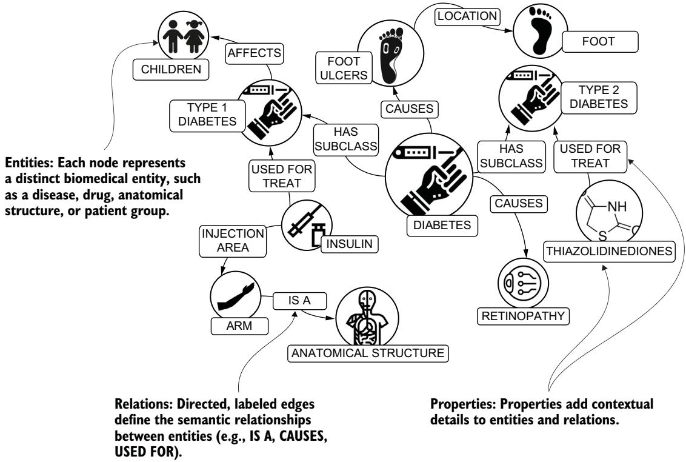
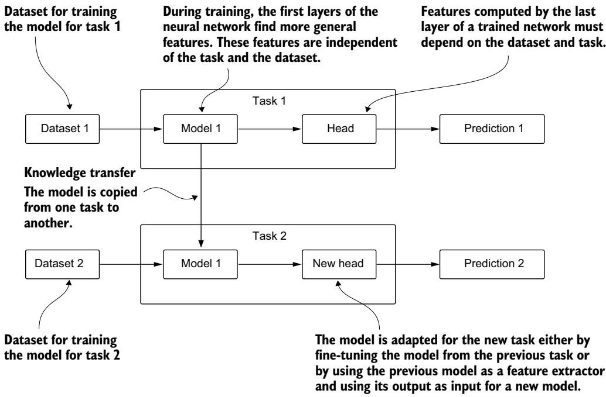
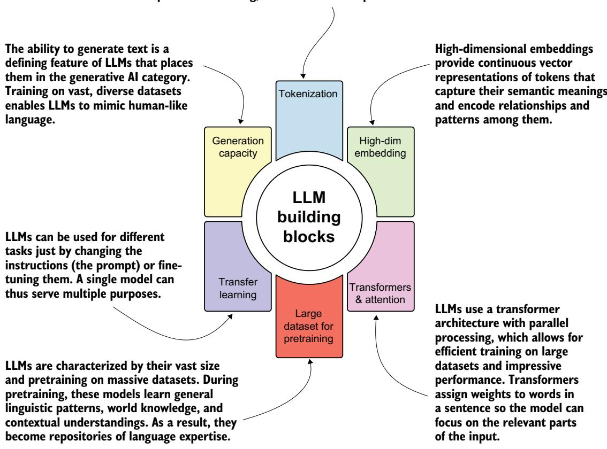
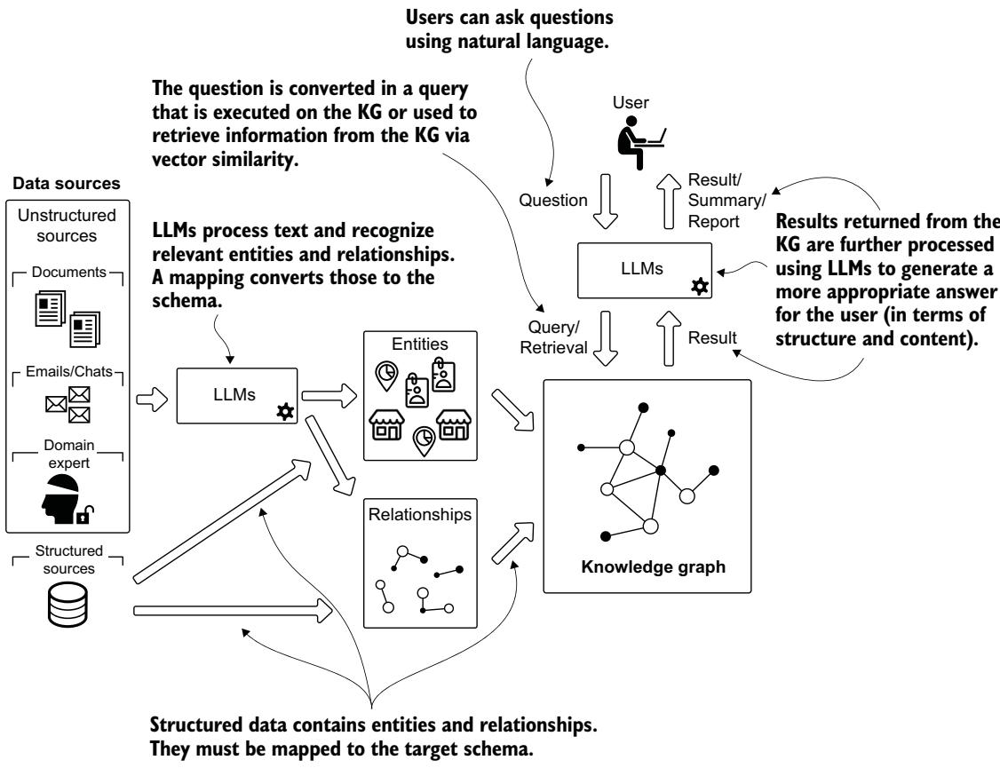
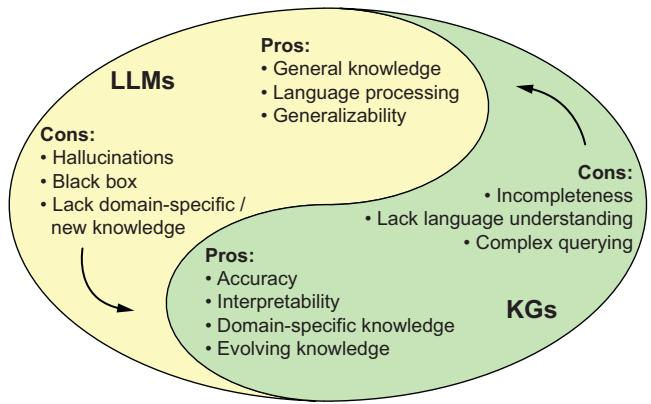
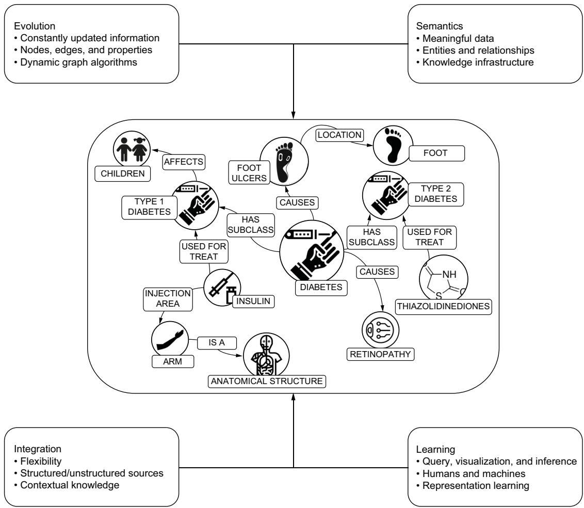

Part 1

# Foundations of hybrid intelligent systems

he convergence of knowledge graphs (KGs) and large language models (LLMs) marks a pivotal moment in the development of intelligent systems. This part of the book lays the foundation for understanding how these complementary technologies can work together to create more powerful and effective solutions.

The integration of these technologies addresses the key limitations of each approach while amplifying their strengths. KGs provide the explicit, verifiable, and updatable knowledge representation that LLMs often lack; and LLMs offer the natural language understanding and generation capabilities that make complex knowledge structures more accessible. This synergy enables the development of intelligent systems that can

Handle both structured and unstructured data effectively

 Combine multiple types of reasoning strategies

Provide explainable and verifiable results

 Continuously update their knowledge base

Interact naturally with users while maintaining accuracy and reliability

Chapter 1 introduces the powerful combination of KGs and LLMs, establishing their complementary nature and illustrating how they can enhance each other's capabilities through concrete examples and use cases. It sets the stage for understanding the transformative potential of this hybrid approach.

Chapter 2 explores the fundamental concepts of intelligent systems, diving deep into different types of knowledge representation and reasoning strategies. It illustrates how KGs and LLMs can work together in practice, examining their roles in knowledge acquisition, representation, and various forms of reasoning.

The frameworks and concepts introduced in these chapters provide the foundation for the practical implementations and advanced applications discussed throughout the remainder of the book.

### Knowledge graphs and LLMs: A killer combination

### This chapter covers

Introducing knowledge graphs

Introducing large language models

Building data-driven applications using knowledge graphs and large language models

Generative artificial intelligence (GenAI), powered by large language models (LLMs) like Google’s Gemini and OpenAI’s GPT, has transformed how we work and live, revolutionizing business after business. Despite this success, generative AI falls short in domains where specific domain knowledge, high accuracy, and explainability are essential. And it has other significant limitations, including hallucinations and a lack of context and relations. This is where knowledge graphs (KGs) come in, providing contextual information—such as experiences, environmental characteristics, cultural aspects, and social norms—needed to build the “third wave of AI” [1] for mission-critical applications.

KGs are sophisticated graph structures that represent real-world entities (people, places, diseases, proteins), define meaningful connections between them, and provide context. KGs provide structured, explainable knowledge representation but are challenging to build and query; LLMs offer natural language processing capabilities but suffer from hallucinations, stale information, and a lack of domain-specific grounding. Together, they are a “killer combination”: LLMs can extract entities and relationships from unstructured text to build KGs more efficiently, providing more autonomous and powerful graph querying and analysis. Meanwhile, KGs provide reliable, up-to-date domain knowledge to ground LLM responses and prevent hallucinations.

Blending KGs and LLMs is a powerful approach to building sophisticated datadriven applications that can harmonize disparate data sources, provide natural language interfaces, and deliver contextually grounded intelligent responses. In this book, you’ll learn to adopt business-focused approaches, model KG schemas, use LLMs for entity extraction, validate information integrity, and create conversational AI systems that can answer complex domain-specific questions using structured and unstructured data.

### 1.1 Knowledge graphs

KGs incorporate a structured representation of human knowledge into machines, enabling more intelligent behavior. This is achieved by creating a sophisticated graph structure with these elements:

Nodes represent real-world entities (people, places, organizations, diseases, proteins, genes).

Relationships define meaningful connections between these nodes (a person born in a place, a disease causing symptoms, a gene encoding a protein).

Properties provide context (birth dates, geographic coordinates, organizational history, disease descriptions in multiple languages).

Figure 1.1 shows a healthcare KG in which entities (diseases, drugs, compounds, anatomical structures) are connected through meaningful relationships. This explicit representation enables machines to perform reasoning and inference on the structured knowledge, supporting complex intelligent systems for decision-making.

Despite their effectiveness and advantages in supporting the development of intelligent systems, KGs haven’t been widely adopted for several reasons, including the following:

They are expensive to build and maintain in terms of time, effort, and money.

Intricate access patterns are required to navigate multiple hops.

 Their results scatter information across multiple nodes and relationships.

Building a KG requires recognizing and extracting relevant entities and connections from heterogeneous data sources, structured and unstructured. Dealing with structured data sources is vastly less complicated than working with unstructured data. In structured or semistructured data (from relational databases or files in CSV, XML, or JSON format), items are isolated, identified, and often typed. Such data must still be mapped from the original schemas to a common graph schema, but the process is controllable and predictable.

  
Figure 1.1 Example KG in the healthcare domain. Nodes (circles) represent entities, such as people, diseases, and anatomic parts. Edges (relationships) represent meaningful connections among entities. Nodes and edges have properties describing relevant details.

Unstructured data is another story. Extracting information from text has always been a complex task for the following reasons:

Multiple languages—Each language has its own grammatical rules, vocabulary, idioms, and nuances. Processing text in multiple languages requires a system that understands and manages these differences. Additionally, languages can have unique writing systems (e.g., Latin, Cyrillic, Chinese), requiring support for various scripts and encodings.

Typos—Human-written text often contains typographical errors, misspellings, and other mistakes requiring sophisticated algorithms to understand the intended meaning.

 Pronouns—Resolving what a pronoun refers to (coreference resolution) is vital for accurate comprehension. For example, in the sentence “John saw Bob and he waved,” it is unclear whether “he” refers to John or Bob.

Different writing styles—Authors use synonyms, varied sentence structures, and unique expressions, making it hard for systems to maintain consistency and accurately interpret different writing styles.

 Domain-specific terminology and concepts—Many specialized fields use unique vocabularies, technical jargon, and concepts that require domain expertise to understand and extract accurately.

Accurately extracting and interpreting information from human languages requires advanced techniques and robust systems. But building a KG is just the beginning. It holds vast, interconnected information (knowledge) that must be accessed correctly to obtain the right answers to questions and support intelligent systems. Flexibility in defining the schema for a KG helps with handling heterogeneous data sources and complex domain connections but complicates access by those who don’t know how to query it properly. Predefined queries and analyses can help build specific intelligent systems but limit the types of users and the support these systems can provide. And results are often difficult to interpret by non-experts and across user interfaces.

Let’s look at some examples. The best-known early adopter of KGs was Google, which used them to enhance user searches by providing “relevant” connected information. This approach emphasizes searching for things, not just strings, but it’s limited to search applications.

Many analysts use KGs to answer complex investigative questions. But due to the complexity of the graph querying process and the need for specific interfaces, this use is confined to a smaller user base.

Imagine individuals posing questions to a KG using natural language, and the intelligent system finding the correct answers by querying the graph effectively and then transforming the results into simple summaries. We construct this scenario throughout this book.

### 1.2 Large language models

LLMs, which specialize in handling natural language, can eliminate barriers to the evolution of intelligent systems that use KGs as the core technology. These systems can help users accomplish tasks in complex domains.

The foundation of LLMs is transfer learning: the ability to reuse patterns learned in generic tasks (such as predicting masked tokens) for specific tasks (such as relation extraction) [2] (see figure 1.2). This breakthrough shifted the paradigm from training many small, task-specific models to training a few large models that are reusable across multiple tasks, significantly reducing the training data and computational resources required for supervised learning.

Pretrained language models (PLMs) trained with transformer architectures [3] on large-scale corpora demonstrated the capacity to perform natural language processing (NLP) tasks with a single big model. Enhancements in model scaling led to increased model capacities, and further investigations of scaling effects expanded the parameter scale. The term large language model refers to a PLM with significant scale—typically tens or hundreds of billions of parameters. The emergence of LLMs such as GPT-2 [5], which are trained on enormous volumes of textual data, transformed the field of AI. Their modern counterparts, including GPT-4 [5], Gopher [6], and PaLM [7],

Transfer learning

  
Figure 1.2 In transfer learning, a model (or part of it) trained on a specific task is used as part of the training and predictions for another task.

breathe new life into the phrase “unreasonable effectiveness of data” [8]. Their performance is deemed “unreasonable” for three interconnected reasons:

1 Model complexity (a.k.a. number of parameters)

2 Size—and, in the case of GPT, quality—of the training corpus

3 Their ability to reduce tasks requiring human intelligence to next token prediction

As shown in the paper “Scaling Laws for Neural Language Models” [9], larger neural models (i.e., those with more trainable parameters) require fewer data samples to reach the same performance in terms of the test-set loss. The same paper proves that the size of the training corpus is of paramount importance. Not surprisingly, the more data the model has to learn from, the better it gets. But data quality is equally crucial. Traditional machine learning typically followed a model-centric paradigm, focusing on identifying the best model architecture and fine-tuning hyperparameters. However, faulty data can lead to faulty predictions. A data-centric paradigm prioritizes data engineering to improve both the quality and quantity of data used for training highcomplexity ML models. With these improvements, we can formulate tasks in natural language, and LLMs generate accurate answers with minimal model engineering required (see figure 1.3).

Tokenization breaks text into units called tokens, simplifying text representation and making it easier for models to understand and process language. This process improves operational efficiency, preserves meaning, and enhances LLM performance.

  
Figure 1.3 LLM building blocks and differentiating characteristics

### 1.3 KGs and LLMs: Stronger together

KGs and LLMs support each other in delivering better service, and together they can enhance the implementation of powerful, intelligent systems. We are particularly interested in these ways that LLMs can assist KG-based solutions:

Building KGs—Specifically, extracting relevant concepts and connections from unstructured data. This task has traditionally required training custom NLP models for specific domains. LLMs have simplified this process by providing a model that can serve multiple purposes with minimal configuration (such as the prompt); see figure 1.4. We discuss building KGs in parts 2 and 3.

 Querying KGs—Extracting knowledge can involve multiple steps, or hops, from the starting concept to the destination. Such hops often require understanding the schema and query language. LLMs help by extracting relevant, precise information to support querying and search. We discuss this in part 5.

Summarizing—Information extracted from KGs can be returned in text form rather than in a table, graph, chart, or other format.

  
Figure 1.4 KGs building with and without LLMs and LLMs support for querying and retrieval

KGs can also help overcome LLM limitations related to domain-specific accuracy, transparency, and timeliness. Here are some drawbacks of LLMs that can be mitigated by integrating KGs [10]:

Hallucinations—KGs provide structured, verified knowledge that acts as a factual foundation, significantly reducing LLMs’ tendency to generate plausible but incorrect information. LLMs complement this by offering sophisticated query mechanisms, such as text-to-cypher translation, which enables natural language questions to be converted into precise graph queries that extract reliable information directly from the structured knowledge base.

 Stale information—KGs enable dynamic knowledge updates through advanced retrieval-augmented architectures. LLMs cannot be constantly retrained, but KGs can be continuously updated and accessed via techniques such as KG-based prompting and GraphRAG systems. GraphRAG organizes knowledge into meaningful clusters and community summaries, providing LLMs with the most current information available in constantly updated KGs.

 Explainability—KGs provide transparent information paths and structured reasoning that users can trace and validate, building trust through explainable AI processes. Combined with LLMs’ natural language processing, this creates systems where knowledge extraction is understandable and repeatable, and findings can be summarized in an intelligible, human-readable format.

Figure 1.5 summarizes how these two technologies support and complement each other.

  
Figure 1.5 Summary of how LLMs and KGs can complement each other. Inspired by [11].

### 1.4 The paradigm shift in data-driven applications

Traditional paradigms build systems for specific purposes with structured, homoge neous databases. This approach works for tailored needs but is impractical for complex domains that need to adapt to user characteristics and integrate heterogeneous data. KGs capture connections, enabling relationship discovery through graph pattern matching and traversal. Both the Resource Description Framework (RDF) and Labeled Property Graphs (LPGs) provide machine-readable formats that humans can interpret. KGs emphasize rich, meaningful data representations usable by both humans and machines, enabling a paradigm shift where intelligent behavior is encoded in a unique source of truth.

According to McKinsey & Company [12], addressing data fragmentation can cut annual data spending by 5% to 15% in the short term. KGs overcome siloed data issues, creating knowledge sources while lowering barriers to data access and enhancing governance.

#### 1.4.1 The four pillars of knowledge graphs

To encode this paradigm shift in a concrete implementation, we propose a new definition of a KG that includes all the features which affect the technical and business sides:

DEFINITION A knowledge graph is an ever-evolving graph data structure composed of a set of typed entities, their attributes, and meaningful named relationships. Built for a specific domain, it integrates both structured and unstructured data to craft knowledge for humans and machines.

This definition provides the groundwork for the four pillars of KGs:

 Evolution—KGs allow us to continuously ingest, integrate, and unify information into a single source. The graph structure can be easily extended, evolving according to the needs of the analysis and our purposes. A KG can seamlessly incorporate new interactions or content without needing a complete overhaul of the existing structure.

 Semantics—A KG makes the meaning of the data—its semantics—explicit, modeling information in a knowledge infrastructure characterized by typed entities and meaningful relationships. New data is combined with existing data and is immediately available for analysis. Contextual knowledge emerges from this infrastructure and drives business activities and decisions. Such knowledge connects typed entities describing categorizations and supports, for instance, identity, transitive, or inverse relationships. This expressiveness in representing data opens the doors to explainability [13]. KGs provide a backbone for reasoning mechanisms ranging from consistency checking to causal inference.

 Integration—The KG serves as the central reference for all structured and unstructured data related to a domain. Because a KG represents information by focusing on the meaning of data, users can overcome challenges related to data types, formats, and provenance, connecting information from multiple data sources.

 Learning—A KG represents the core information and big picture of a domain. Humans can analyze, visualize, and query graph data to extract insights. Inference rules and machine learning algorithms are performed on top of the KG to infer new information not explicitly encoded within the KG. Analysts can use methods such as centrality and connectivity analysis to identify influential nodes, network analysis to detect the shortest path between nodes, and community analysis to recognize groups of similar nodes.

Figure 1.6 shows the four pillars that characterize a KG.  
  
Figure 1.6 The four pillars of KGs: evolution, semantics, integration, and learning

### 1.5 Building data-driven applications using KGs and LLMs

In this section, we look at several examples of potential applications for KGs and LLMs in critical areas.

NOTE We frequently mention healthcare in this book because its characteristics, issues, and requirements can easily be applied to other domains. Healthcare also offers abundant publicly available data, so we can discuss real-world examples using datasets that are comparable to actual use cases.

#### 1.5.1 Example use case: Drug discovery and development

Drug development integrates knowledge from numerous domains, from biology to chemistry, and bringing a new drug to market is costly and has a high chance of failure. Fast, practical approaches are essential to guide research in new drug development.

Challenge—Integration of medical and pharmaceutical data must ensure data integrity, accuracy, and consistency while correctly contextualizing data points.

 KG-based solution—Models interactions between biological entities at different scales, connecting genes, diseases, and drugs using relationship types. Typed relationships with multiple rules better represent domain meaning, enabling transitive bonds and inference.

Role of LLMs—Process unstructured data from scientific publications, clinical reports, and databases, ensuring consistency in integrated knowledge bases. LLMs expand KGs by analyzing literature and inferring potential relationships, as well as performing sophisticated text mining for chemical structures and experimental results.

Integrating LLMs enhances data integration, augments KGs, facilitates hypothesis generation, improves information retrieval, and enables advanced text mining. These capabilities ultimately accelerate the development of new therapeutics.

#### 1.5.2 Example use case: Conversational AI for customer support

Personalized assistant systems must answer user queries and be able to ask follow-up questions. An effective tool needs to combine general expertise with specific user requests, managing vast amounts of information efficiently.

 Challenge—Despite advancements in natural language generation (NLG) techniques, answers from language models can be repetitive and uninformative (Zhang et al. [14]). For a conversational system to provide useful suggestions and information, it needs to extract relevant entities and relationships from the text while being supported by external and internal structured knowledge to ground the conversation.

 KG-based solution—Zhang et al. [14] claim that “conversations often develop around knowledge.” In particular, natural conversations evolve around concepts that form this knowledge. KGs connect such concepts and establish meaningful relationships between them. KGs can ground conversations, integrate information, and support response generation: NLP technologies extract entities and relationships, and the graph-based background context of the dialogue drives the conversational flow.

Role of LLMs—LLMs can handle a wide range of topics and provide coherent responses, making them valuable for building sophisticated conversational systems. However, without additional contextual grounding, their responses can become generic and lack depth.

By integrating LLMs with knowledge sources such as KGs, the conversational system can enhance its responses. LLMs can use structured information in KGs to provide more accurate and contextually relevant answers. This integration allows the system to navigate complex queries, offer precise information, and maintain a natural conversational flow.

#### 1.5.3 Deciding whether to use a KG

Despite their diversity, the previous scenarios share common challenges. The following questions can help you understand whether a KG is the right solution to address your business and technical challenges.

Consider KGs if you answer yes to these questions:

Do I need to harmonize disparate data silos into consistent overviews?

 Do I need to connect data meaningfully across structured and unstructured sources?

Do I need flexible data representations where structure evolves?

Do I need to track pipeline provenance and consistency?

Do I need to equip advanced search and recommendation services?

 Do I need to visualize network structures, showing communities and interdependencies?

Do I need to apply ML models that benefit from the relational nature of data? Consider LLMs if you answer yes to these questions:

Do I need to extract entities and relationships from unstructured data?

Do I need to interpret complex user queries for accurate answers?

Do I need to provide conversational interfaces?

Do I need to summarize comprehensive results into text?

If you answer yes to even one of these, you need LLMs to empower your KG-based solution.

### 1.6 Knowledge graph technologies

In this book, we adopt a technologically agnostic approach and provide code examples that interchange two common paradigms in creating and querying KGs:

RDF and the SPARQL query language, both defined by the World Wide Web Consortium (W3C). RDF is a data model that focuses on knowledge representation, where the graph is encoded as a collection of statements or triplets. It aims to standardize data publication and sharing on the web. The core of intelligent systems is based on reasoning performed on the semantic layer.

The LPG approach and query languages such as openCypher (https://opency pher.org/) and Gremlin (https://tinkerpop.apache.org/gremlin.html). The LPG representation focuses on the structure (properties and relationships) of the graph. Nodes and edges have properties, emphasizing the features of the graph data.

RDF excels at data interoperability and consistency across systems through standardized statements, offering powerful hypergraph and federation features that enable linking different RDF graphs with rich contextual information. LPG implementations provide advantages in pathfinding queries and graph traversal operations. In LPG, each edge has a unique identity and properties, whereas in RDF, relationships are global predicates that can be reused across statements throughout the knowledge base.

RDF and LPG are distinct paradigms but can be complementary depending on the use case. RDF excels in scenarios requiring semantic consistency, web-scale interoperability, and the use of ontologies for knowledge inference, and LPG provides rich property-based representations and efficient graph traversals.

#### 1.6.1 Taxonomies and ontologies

Modern implementations of KGs must use traditional features of graph data and, as defined by [15], the organizing principle enabled by semantics, turning the latent knowledge of a graph into a KG. Graph models can be instantiated from a collection of statements (RDF) or through the LPG model. But just incorporating this structural information does not fully capture the relationships within the data. We can inject these semantic features into KGs using taxonomies and ontologies:

 Taxonomies represent the hierarchical dimension of the data, organizing categories in broader–narrower relationships. For example, in a taxonomy, a “Vehicle” category might be broader than a “Car” category, which in turn is broader than a “Sedan” category. Complex KGs can integrate multiple taxonomies.

Ontologies introduce more complex relationships beyond simple hierarchies. We can clarify identity, difference, and more intricate interconnections between entities. For instance, an ontology might specify that “Car” and “Automobile” are identical (synonyms), whereas “Car” and “Bicycle” are disjoint (cannot be the same). Ontologies support class definitions including union, complement, disjointness, and cardinality restrictions. They capture the domain’s conceptual structure. Without an ontology, a vocabulary remains vague because it does not encode the intrinsic relationships between concepts.

Traditional approaches to defining taxonomies and ontologies are rigid and complex and make these systems less adaptable to evolving knowledge and diverse data sources. Modern KGs adopt a pragmatic approach characterized by “just enough semantics.” This involves selecting a subset of ontology features that address current issues without being overly prescriptive. For example, in a healthcare KG, practitioners might focus on a specific medical domain—such as oncology or cardiology— while leaving room to expand into other specialties as needed.

Rather than enforcing rigid, complete taxonomies, modern KGs integrate partial ontologies that can be extended organically. This flexibility enables dynamic, scalable knowledge representation that adapts to real-world constraints and evolving business needs.

### 1.7 How do we teach KGs and LLMs?

This book will equip you with essential tools for creating and using KGs while demonstrating how to use LLMs for advanced intelligent applications. You will learn to do the following:

Adopt a business-need mindset focusing on goals, then data, and then algorithms.

Model KG schemas, considering future extensions, taxonomies, and ontologies.

 Import data from structured sources and map entities/relationships to schemas.

Use LLMs to extract domain-relevant entities and relationships from text.

Validate ingested information, ensuring integrity and accuracy.

 Perform analysis using the latest ML technologies, such as graph neural networks.

 Query and visualize graph portions, using LLMs for natural language questions.

We’ll explain these concepts through concrete, practical examples drawn from our direct experience.

#### Summary

KGs are ever-evolving graph data structures containing typed entities, attributes, and meaningful relationships. They are built for specific domains from structured and unstructured data to craft knowledge for humans and machines.

KGs have four pillars: evolution, semantics, integration, and learning.

KGs represent a core abstraction for incorporating human knowledge into machines, and LLMs provide natural language understanding. LLMs and KGs empower each other by overcoming their individual limitations.

KG and LLM adoption represents a paradigm shift where intelligent behavior is encoded once in a unique source of trust. This empowers data representation for different applications and diverse tasks.

 Two key technologies represent KGs: the Resource Description Framework (RDF) and labeled property graphs (LPG).

 Taxonomies and ontologies play fundamental roles by incorporating semantic metadata that makes traditional graphs smarter.