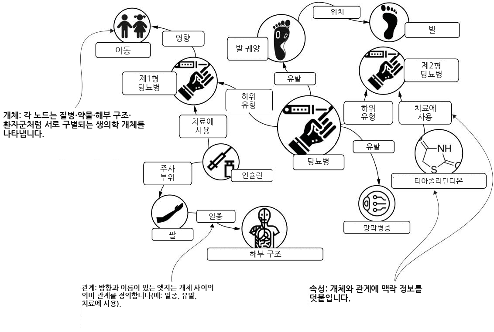
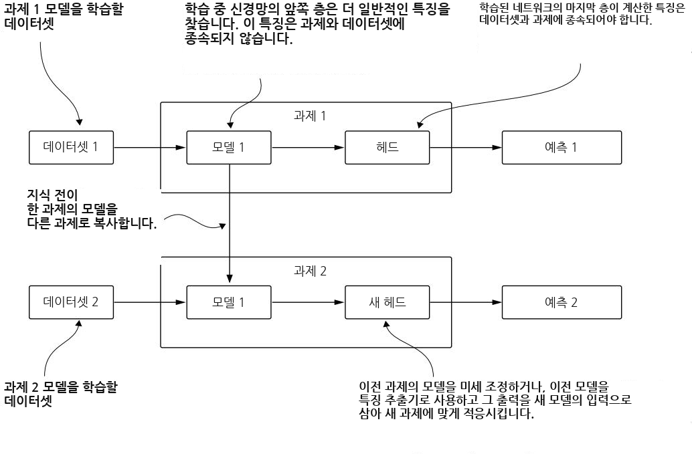
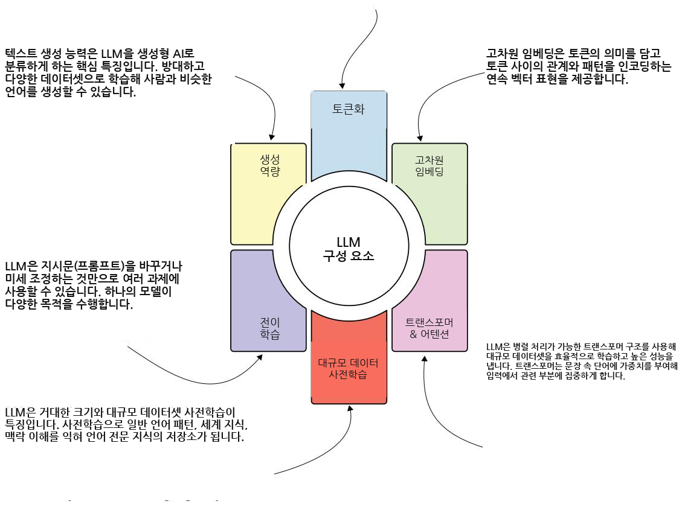
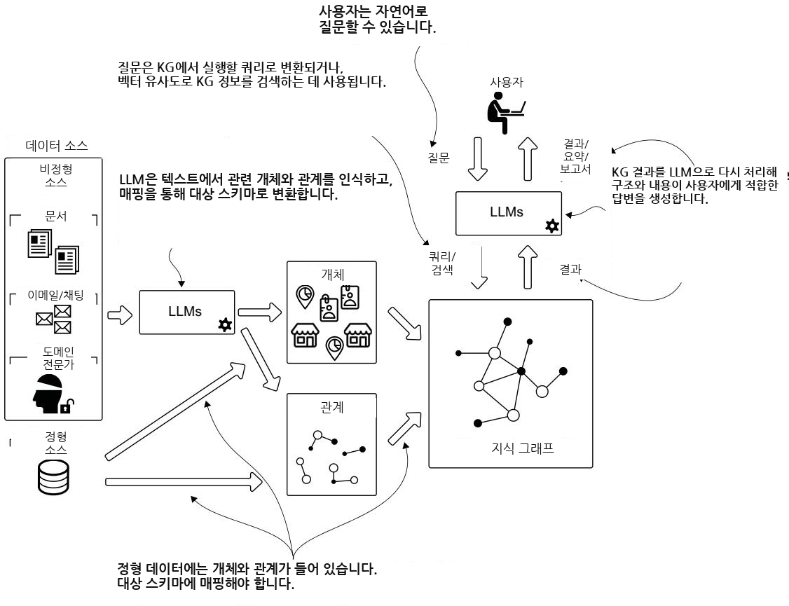
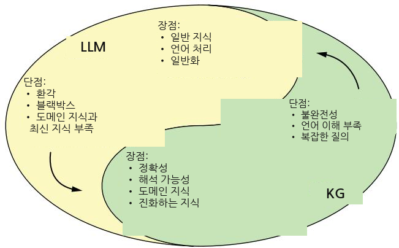
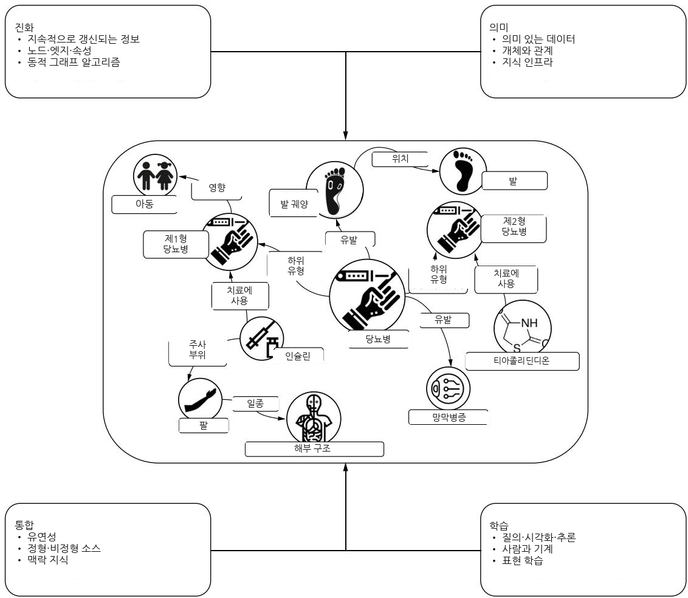

Part 1

# 하이브리드 지능형 시스템의 기초

지식 그래프(KG)와 대규모 언어 모델(LLM)의 융합은 지능형 시스템 개발에서 중대한 전환점을 나타냅니다. 이 책의 이 부분은 이러한 상호 보완적 기술들이 어떻게 함께 작동하여 더 강력하고 효과적인 솔루션을 만들 수 있는지 이해하기 위한 토대를 마련합니다.

이러한 기술들의 통합은 각 접근법의 핵심 한계를 해결하는 동시에 그 강점을 증폭합니다. KG는 LLM이 종종 결여하고 있는 명시적이고 검증 가능하며 갱신 가능한 지식 표현을 제공하고, LLM은 복잡한 지식 구조를 더 쉽게 접근 가능하게 만드는 자연어 이해 및 생성 능력을 제공합니다. 이러한 시너지는 다음을 수행할 수 있는 지능형 시스템의 개발을 가능하게 합니다.

구조화 데이터와 비구조화 데이터를 모두 효과적으로 처리합니다.

 여러 유형의 추론 전략을 결합합니다.

설명 가능하고 검증 가능한 결과를 제공합니다.

 지식 베이스를 지속적으로 갱신합니다.

정확성과 신뢰성을 유지하면서 사용자와 자연스럽게 상호작용합니다.

1장에서는 KG와 LLM의 강력한 결합을 소개하고, 이들의 상호 보완적 성격을 확립하며, 구체적인 예와 사용 사례를 통해 이들이 서로의 능력을 어떻게 향상시킬 수 있는지 보여줍니다. 또한 이러한 하이브리드 접근법의 변혁적 잠재력을 이해하기 위한 기반을 마련합니다.

2장에서는 지능형 시스템의 기본 개념을 탐구하며, 다양한 유형의 지식 표현과 추론 전략을 깊이 있게 다룹니다. 또한 지식 획득, 표현, 그리고 다양한 형태의 추론에서 KG와 LLM의 역할을 검토하면서, 이들이 실제로 어떻게 함께 작동할 수 있는지 보여줍니다.

이 장들에서 소개된 프레임워크와 개념은 책의 나머지 부분 전반에서 논의되는 실제 구현과 고급 응용을 위한 토대를 제공합니다.

### 지식 그래프와 LLM: 강력한 조합

### 이 장에서 다루는 내용

지식 그래프 소개

대규모 언어 모델 소개

지식 그래프와 대규모 언어 모델을 사용한 데이터 기반 애플리케이션 구축

Google의 Gemini와 OpenAI의 GPT 같은 LLM이 구동하는 생성형 인공지능 (Generative artificial intelligence, GenAI)은 우리가 일하고 생활하는 방식을 변화시켰으며, 수많은 비즈니스를 혁신해 왔습니다. 이러한 성공에도 불구하고, 생성형 AI는 특정 도메인 지식, 높은 정확도, 설명 가능성이 필수적인 영역에서는 한계를 보입니다. 또한 환각 (hallucination), 맥락과 관계의 부족을 포함한 다른 중대한 한계도 있습니다. 바로 이 지점에서 지식 그래프 (knowledge graph, KG)가 등장하며, 미션 크리티컬 애플리케이션을 위한 “AI의 제3의 물결” [1]을 구축하는 데 필요한 경험, 환경적 특성, 문화적 측면, 사회적 규범과 같은 맥락 정보를 제공합니다.

지식 그래프는 실제 세계의 엔터티 (사람, 장소, 질병, 단백질)를 표현하고, 이들 사이의 의미 있는 연결을 정의하며, 맥락을 제공하는 정교한 그래프 구조입니다. 지식 그래프는 구조화되고 설명 가능한 지식 표현을 제공하지만 구축하고 질의하기가 어렵습니다. LLM은 자연어 처리 능력을 제공하지만 환각, 오래된 정보, 도메인별 기반 지식의 부족이라는 문제를 겪습니다. 이 둘은 함께 “강력한 조합”을 이룹니다. LLM은 비정형 텍스트에서 엔터티와 관계를 추출하여 지식 그래프를 더 효율적으로 구축할 수 있으며, 더 자율적이고 강력한 그래프 질의와 분석을 가능하게 합니다. 한편 지식 그래프는 LLM 응답의 근거를 제공하고 환각을 방지하기 위해 신뢰할 수 있고 최신성을 갖춘 도메인 지식을 제공합니다.

지식 그래프와 LLM을 결합하는 것은 이질적인 데이터 소스를 조화시키고, 자연어 인터페이스를 제공하며, 맥락에 기반한 지능적 응답을 전달할 수 있는 정교한 데이터 기반 애플리케이션을 구축하는 강력한 접근법입니다. 이 책에서는 비즈니스 중심 접근법을 채택하고, 지식 그래프 스키마를 모델링하며, 엔터티 추출에 LLM을 사용하고, 정보 무결성을 검증하며, 구조화 데이터와 비정형 데이터를 사용하여 복잡한 도메인별 질문에 답할 수 있는 대화형 AI 시스템을 만드는 방법을 배우게 됩니다.

### 1.1 지식 그래프

지식 그래프 (knowledge graph, KG)는 인간 지식의 구조화된 표현을 기계에 통합하여 더 지능적인 행동을 가능하게 합니다. 이는 다음 요소를 갖춘 정교한 그래프 구조를 생성함으로써 달성됩니다.

노드는 실제 세계의 엔터티(사람, 장소, 조직, 질병, 단백질, 유전자)를 나타냅니다.

관계는 이러한 노드 사이의 의미 있는 연결(어떤 장소에서 태어난 사람, 증상을 유발하는 질병, 단백질을 인코딩하는 유전자)을 정의합니다.

속성은 맥락(생년월일, 지리 좌표, 조직의 역사, 여러 언어로 된 질병 설명)을 제공합니다.

그림 1.1은 엔터티(질병, 약물, 화합물, 해부학적 구조)가 의미 있는 관계를 통해 연결된 의료 분야의 지식 그래프를 보여줍니다. 이러한 명시적 표현은 기계가 구조화된 지식에 대해 추론과 추론을 수행할 수 있게 하며, 의사결정을 위한 복잡한 지능형 시스템을 지원합니다.

지능형 시스템 개발을 지원하는 데 효과성과 장점이 있음에도 불구하고, 지식 그래프는 다음을 포함한 여러 이유로 널리 채택되지 못했습니다.

시간, 노력, 비용 측면에서 구축하고 유지하는 데 비용이 많이 듭니다.

여러 홉을 탐색하려면 복잡한 접근 패턴이 필요합니다.

 그 결과는 여러 노드와 관계에 걸쳐 정보를 흩어 놓습니다.

지식 그래프를 구축하려면 구조화 및 비정형의 이질적 데이터 소스에서 관련 엔터티와 연결을 인식하고 추출해야 합니다. 구조화 데이터 소스를 다루는 것은 비정형 데이터를 다루는 것보다 훨씬 덜 복잡합니다. 구조화 또는 반구조화 데이터(관계형 데이터베이스 또는 CSV, XML, JSON 형식의 파일에서 온 데이터)에서는 항목이 분리되고 식별되며 종종 유형이 지정되어 있습니다. 이러한 데이터도 여전히 원래 스키마에서 공통 그래프 스키마로 매핑되어야 하지만, 그 과정은 제어 가능하고 예측 가능합니다.

  
그림 1.1 의료 도메인의 예시 지식 그래프. 노드(원)는 사람, 질병, 해부학적 부위와 같은 엔터티를 나타냅니다. 에지(관계)는 엔터티 간의 의미 있는 연결을 나타냅니다. 노드와 에지는 관련 세부 정보를 설명하는 속성을 가집니다.

비정형 데이터는 전혀 다른 문제입니다. 텍스트에서 정보를 추출하는 일은 다음과 같은 이유로 항상 복잡한 작업이었습니다.

여러 언어—각 언어에는 고유한 문법 규칙, 어휘, 관용구, 뉘앙스가 있습니다. 여러 언어로 된 텍스트를 처리하려면 이러한 차이를 이해하고 관리하는 시스템이 필요합니다. 또한 언어에는 고유한 문자 체계(예: 라틴 문자, 키릴 문자, 중국어)가 있을 수 있으므로 다양한 문자와 인코딩을 지원해야 합니다.

오타—사람이 작성한 텍스트에는 의도한 의미를 이해하기 위해 정교한 알고리즘이 필요한 인쇄상 오류, 철자 오류 및 기타 실수가 포함되는 경우가 많습니다.

 대명사—대명사가 무엇을 가리키는지 해결하는 것(상호참조 해소, coreference resolution)은 정확한 이해에 필수적입니다. 예를 들어, “John saw Bob and he waved”라는 문장에서 “he”가 John을 가리키는지 Bob을 가리키는지는 명확하지 않습니다.

다양한 문체—저자들은 동의어, 다양한 문장 구조, 고유한 표현을 사용하므로, 시스템이 일관성을 유지하고 서로 다른 문체를 정확하게 해석하기 어렵습니다.

 도메인별 용어와 개념—많은 전문 분야에서는 고유한 어휘, 기술 전문용어, 그리고 정확히 이해하고 추출하기 위해 도메인 전문성이 필요한 개념을 사용합니다.

인간 언어에서 정보를 정확하게 추출하고 해석하려면 고급 기법과 견고한 시스템이 필요합니다. 그러나 지식 그래프(KG)를 구축하는 것은 시작에 불과합니다. 지식 그래프는 질문에 대한 올바른 답을 얻고 지능형 시스템을 지원하기 위해 올바르게 접근해야 하는 방대하고 상호 연결된 정보(지식)를 담고 있습니다. 지식 그래프의 스키마를 정의할 때의 유연성은 이질적인 데이터 소스와 복잡한 도메인 연결을 처리하는 데 도움이 되지만, 이를 제대로 질의하는 방법을 모르는 사람들이 접근하는 것은 복잡하게 만듭니다. 미리 정의된 질의와 분석은 특정 지능형 시스템을 구축하는 데 도움이 될 수 있지만, 이러한 시스템이 지원할 수 있는 사용자 유형과 지원 범위를 제한합니다. 또한 결과는 비전문가가 해석하기 어렵고, 사용자 인터페이스 전반에서도 해석하기 어려운 경우가 많습니다.

몇 가지 예를 살펴보겠습니다. 지식 그래프의 가장 잘 알려진 초기 도입자는 Google이었으며, Google은 “관련성 있는” 연결 정보를 제공함으로써 사용자 검색을 향상하는 데 이를 사용했습니다. 이 접근법은 단순한 문자열이 아니라 사물을 검색하는 데 중점을 두지만, 검색 애플리케이션에 한정됩니다.

많은 분석가는 복잡한 조사 질문에 답하기 위해 지식 그래프를 사용합니다. 그러나 그래프 질의 과정의 복잡성과 특정 인터페이스의 필요성 때문에, 이러한 사용은 더 작은 사용자 기반으로 제한됩니다.

개인들이 자연어를 사용하여 지식 그래프에 질문을 제기하고, 지능형 시스템이 그래프를 효과적으로 질의하여 올바른 답을 찾은 뒤 그 결과를 간단한 요약으로 변환하는 상황을 상상해 보십시오. 우리는 이 책 전반에 걸쳐 이러한 시나리오를 구축합니다.

### 1.2 대규모 언어 모델

자연어 처리에 특화된 LLM은 지식 그래프를 핵심 기술로 사용하는 지능형 시스템의 발전을 가로막는 장벽을 제거할 수 있습니다. 이러한 시스템은 사용자가 복잡한 도메인에서 과업을 수행하도록 도울 수 있습니다.

LLM의 기반은 전이 학습 (transfer learning)입니다. 이는 마스크된 토큰 예측과 같은 일반적 과업에서 학습한 패턴을 관계 추출과 같은 특정 과업에 재사용하는 능력을 의미합니다 [2](그림 1.2 참조). 이러한 돌파구는 많은 수의 작은 과업별 모델을 학습하는 방식에서 여러 과업에 걸쳐 재사용할 수 있는 소수의 대형 모델을 학습하는 방식으로 패러다임을 전환시켰으며, 지도 학습에 필요한 학습 데이터와 계산 자원을 크게 줄였습니다.

대규모 말뭉치에서 Transformer 아키텍처 [3]로 학습된 사전 학습 언어 모델 (pretrained language models, PLMs)은 하나의 대형 모델로 자연어 처리 (natural language processing, NLP) 과업을 수행할 수 있는 역량을 보여주었습니다. 모델 스케일링의 향상은 모델 역량의 증가로 이어졌고, 스케일링 효과에 대한 추가 연구는 파라미터 규모를 확장했습니다. 대규모 언어 모델이라는 용어는 상당한 규모, 일반적으로 수백억 또는 수천억 개의 파라미터를 가진 PLM을 가리킵니다. 방대한 양의 텍스트 데이터로 학습된 GPT-2 [5]와 같은 LLM의 등장은 AI 분야를 변화시켰습니다. GPT-4 [5], Gopher [6], PaLM [7]을 포함한 현대의 대응 모델들은

전이 학습

  
그림 1.2 전이 학습에서는 특정 과업으로 학습된 모델 또는 그 일부가 다른 과업의 학습과 예측의 일부로 사용됩니다.

“데이터의 비합리적 효과성(unreasonable effectiveness of data)”이라는 표현 [8]에 새로운 생명을 불어넣었습니다. 이들의 성능은 서로 연결된 세 가지 이유로 “비합리적”이라고 여겨집니다.

1 모델 복잡도, 즉 파라미터 수

2 학습 말뭉치의 크기, 그리고 GPT의 경우 품질

3 인간 지능을 필요로 하는 과업을 다음 토큰 예측으로 환원하는 능력

논문 “Scaling Laws for Neural Language Models” [9]에서 보인 바와 같이, 더 큰 신경망 모델, 즉 학습 가능한 파라미터가 더 많은 모델은 테스트 세트 손실 측면에서 동일한 성능에 도달하는 데 더 적은 데이터 샘플을 필요로 합니다. 같은 논문은 학습 말뭉치의 크기가 가장 중요하다는 점을 입증합니다. 당연하게도, 모델이 학습할 수 있는 데이터가 많을수록 모델은 더 좋아집니다. 그러나 데이터 품질 역시 마찬가지로 중요합니다. 전통적인 머신러닝은 일반적으로 모델 중심 패러다임을 따랐으며, 최적의 모델 아키텍처를 식별하고 하이퍼파라미터를 미세조정하는 데 초점을 맞추었습니다. 그러나 결함 있는 데이터는 결함 있는 예측으로 이어질 수 있습니다. 데이터 중심 패러다임은 고복잡도 ML 모델 학습에 사용되는 데이터의 품질과 양을 모두 개선하기 위해 데이터 엔지니어링을 우선시합니다. 이러한 개선을 통해 우리는 과업을 자연어로 공식화할 수 있으며, LLM은 최소한의 모델 엔지니어링만으로 정확한 답변을 생성합니다(그림 1.3 참조).

토큰화 (tokenization)는 텍스트를 토큰 (token)이라는 단위로 나누어 텍스트 표현을 단순화하고, 모델이 언어를 더 쉽게 이해하고 처리할 수 있도록 합니다. 이 과정은 운영 효율성을 향상시키고, 의미를 보존하며, LLM 성능을 높입니다.

  
그림 1.3 LLM 구성 요소와 차별화 특성

### 1.3 지식 그래프(KG)와 LLM: 함께할 때 더 강력함

KG와 LLM은 더 나은 서비스를 제공하는 데 서로를 지원하며, 함께 강력하고 지능적인 시스템의 구현을 향상시킬 수 있습니다. 우리는 특히 LLM이 KG 기반 솔루션을 지원할 수 있는 다음과 같은 방식에 관심이 있습니다.

KG 구축—구체적으로, 비정형 데이터에서 관련 개념과 연결을 추출하는 것입니다. 이 작업은 전통적으로 특정 도메인에 맞춘 사용자 정의 NLP 모델을 학습해야 했습니다. LLM은 최소한의 구성(예: 프롬프트)으로 여러 목적을 수행할 수 있는 모델을 제공함으로써 이 과정을 단순화했습니다. 그림 1.4를 참조하십시오. 우리는 2부와 3부에서 KG 구축을 논의합니다.

 KG 질의—지식 추출은 시작 개념에서 목적지까지 여러 단계 또는 홉(hop)을 포함할 수 있습니다. 이러한 홉은 종종 스키마와 질의 언어에 대한 이해를 필요로 합니다. LLM은 질의와 검색을 지원하기 위해 관련성 있고 정확한 정보를 추출함으로써 도움을 줍니다. 우리는 이를 5부에서 논의합니다.

요약—KG에서 추출된 정보는 표, 그래프, 차트 또는 다른 형식이 아니라 텍스트 형태로 반환될 수 있습니다.

  
그림 1.4 LLM을 사용한 경우와 사용하지 않은 경우의 KG 구축, 그리고 질의와 검색을 위한 LLM 지원

KG는 또한 도메인별 정확성, 투명성, 최신성과 관련된 LLM의 한계를 극복하는 데 도움을 줄 수 있습니다. 다음은 KG를 통합함으로써 완화될 수 있는 LLM의 몇 가지 단점입니다 [10].

환각(hallucinations)—KG는 사실적 기반으로 작용하는 구조화되고 검증된 지식을 제공하여, LLM이 그럴듯하지만 부정확한 정보를 생성하는 경향을 크게 줄입니다. LLM은 텍스트-투-사이퍼(text-to-cypher) 번역과 같은 정교한 질의 메커니즘을 제공함으로써 이를 보완하며, 이를 통해 자연어 질문을 구조화된 지식 베이스에서 신뢰할 수 있는 정보를 직접 추출하는 정밀한 그래프 질의로 변환할 수 있습니다.

 오래된 정보—KG는 고급 검색 증강 아키텍처를 통해 동적인 지식 업데이트를 가능하게 합니다. LLM은 지속적으로 재학습될 수 없지만, KG는 KG 기반 프롬프팅 및 GraphRAG 시스템과 같은 기법을 통해 지속적으로 업데이트되고 접근될 수 있습니다. GraphRAG는 지식을 의미 있는 클러스터와 커뮤니티 요약으로 조직하여, 지속적으로 업데이트되는 KG에서 이용 가능한 최신 정보를 LLM에 제공합니다.

 설명 가능성—KG는 사용자가 추적하고 검증할 수 있는 투명한 정보 경로와 구조화된 추론을 제공하여, 설명 가능한 AI 과정을 통해 신뢰를 구축합니다. 이것이 LLM의 자연어 처리와 결합되면, 지식 추출이 이해 가능하고 반복 가능하며, 발견 사항이 명료하고 사람이 읽을 수 있는 형식으로 요약될 수 있는 시스템이 만들어집니다.

그림 1.5는 이 두 기술이 어떻게 서로를 지원하고 보완할 수 있는지를 요약합니다.

  
그림 1.5 LLM과 KG가 서로를 보완할 수 있는 방식의 요약. [11]에서 영감을 받음.

### 1.4 데이터 기반 애플리케이션의 패러다임 전환

전통적인 패러다임은 구조화된 동질적 데이터베이스를 사용하여 특정 목적을 위한 시스템을 구축합니다. 이 접근법은 맞춤형 요구에는 효과적이지만, 사용자 특성에 적응하고 이질적 데이터를 통합해야 하는 복잡한 도메인에는 실용적이지 않습니다. KG는 연결을 포착하여 그래프 패턴 매칭과 순회를 통해 관계 발견을 가능하게 합니다. 자원 기술 프레임워크 (Resource Description Framework, RDF)와 레이블드 속성 그래프 (Labeled Property Graphs, LPGs)는 모두 인간이 해석할 수 있는 기계 판독 가능 형식을 제공합니다. KG는 인간과 기계가 모두 사용할 수 있는 풍부하고 의미 있는 데이터 표현을 강조하며, 지능적 행동이 고유한 단일 진실 공급원에 인코딩되는 패러다임 전환을 가능하게 합니다.

McKinsey & Company [12]에 따르면, 데이터 단편화 문제를 해결하면 단기적으로 연간 데이터 지출을 5%에서 15%까지 줄일 수 있습니다. KG는 사일로화된 데이터 문제를 극복하여 지식 소스를 생성하는 동시에 데이터 접근 장벽을 낮추고 거버넌스를 강화합니다.

#### 1.4.1 지식 그래프의 네 가지 기둥

이러한 패러다임 전환을 구체적인 구현으로 인코딩하기 위해, 우리는 기술적 측면과 비즈니스 측면에 영향을 미치는 모든 특징을 포함하는 KG의 새로운 정의를 제안합니다.

정의 지식 그래프는 유형화된 엔티티, 그 속성, 그리고 의미 있는 명명된 관계들의 집합으로 구성된, 끊임없이 진화하는 그래프 데이터 구조입니다. 특정 도메인을 위해 구축되며, 구조화 데이터와 비구조화 데이터를 모두 통합하여 인간과 기계를 위한 지식을 구성합니다.

이 정의는 KG의 네 가지 기둥을 위한 토대를 제공합니다.

 진화—KG는 정보를 지속적으로 수집, 통합, 단일 소스로 일원화할 수 있게 합니다. 그래프 구조는 쉽게 확장될 수 있으며, 분석의 필요와 우리의 목적에 따라 진화합니다. KG는 기존 구조를 완전히 개편할 필요 없이 새로운 상호작용이나 콘텐츠를 원활하게 통합할 수 있습니다.

 의미론 (semantics)—KG는 데이터의 의미, 즉 의미론을 명시적으로 드러내며, 유형화된 엔티티와 의미 있는 관계로 특징지어지는 지식 인프라 안에서 정보를 모델링합니다. 새로운 데이터는 기존 데이터와 결합되며 즉시 분석에 활용될 수 있습니다. 맥락적 지식은 이러한 인프라에서 나타나 비즈니스 활동과 의사결정을 이끕니다. 이러한 지식은 범주화를 설명하는 유형화된 엔티티를 연결하며, 예를 들어 동일성, 추이적 관계, 또는 역관계를 지원합니다. 데이터를 표현하는 이러한 표현력은 설명가능성 (explainability) [13]으로 향하는 문을 엽니다. KG는 일관성 검사부터 인과 추론 (causal inference)에 이르는 추론 메커니즘의 중추를 제공합니다.

 통합—KG는 도메인과 관련된 모든 구조화 및 비구조화 데이터의 중앙 참조점 역할을 합니다. KG는 데이터의 의미에 초점을 맞추어 정보를 표현하기 때문에, 사용자는 여러 데이터 소스의 정보를 연결하면서 데이터 유형, 형식, 출처와 관련된 문제를 극복할 수 있습니다.

 학습—KG는 도메인의 핵심 정보와 큰 그림을 표현합니다. 인간은 그래프 데이터를 분석, 시각화, 질의하여 통찰을 추출할 수 있습니다. 추론 규칙과 기계 학습 알고리즘은 KG 위에서 수행되어 KG 안에 명시적으로 인코딩되지 않은 새로운 정보를 추론합니다. 분석가는 중심성 및 연결성 분석과 같은 방법을 사용하여 영향력 있는 노드를 식별하고, 네트워크 분석을 통해 노드 사이의 최단 경로를 탐지하며, 커뮤니티 분석을 통해 유사한 노드들의 집단을 인식할 수 있습니다.

그림 1.6은 KG를 특징짓는 네 가지 기둥을 보여줍니다.  
  
그림 1.6 KG의 네 가지 기둥: 진화, 의미론, 통합, 학습

### 1.5 KG와 LLM을 사용한 데이터 기반 애플리케이션 구축

이 절에서는 핵심 영역에서 KG와 LLM의 잠재적 애플리케이션에 대한 여러 예를 살펴봅니다.

참고 이 책에서는 헬스케어를 자주 언급하는데, 그 특성, 문제, 요구사항이 다른 도메인에도 쉽게 적용될 수 있기 때문입니다. 또한 헬스케어는 공개적으로 이용 가능한 데이터가 풍부하므로, 실제 사용 사례와 비교 가능한 데이터셋을 사용하여 현실 세계의 예를 논의할 수 있습니다.

#### 1.5.1 사용 사례 예: 신약 발굴 및 개발

의약품 개발은 생물학에서 화학에 이르기까지 수많은 도메인의 지식을 통합하며, 새로운 의약품을 시장에 출시하는 일은 비용이 많이 들고 실패 가능성도 높습니다. 새로운 의약품 개발 연구를 안내하기 위해서는 신속하고 실용적인 접근법이 필수적입니다.

과제—의료 및 제약 데이터의 통합은 데이터 포인트를 올바르게 맥락화하면서 데이터 무결성, 정확성, 일관성을 보장해야 합니다.

 KG 기반 솔루션—서로 다른 규모의 생물학적 개체 간 상호작용을 모델링하고, 관계 유형을 사용하여 유전자, 질병, 의약품을 연결합니다. 여러 규칙을 갖춘 유형화된 관계는 도메인 의미를 더 잘 표현하여 추이적 결합과 추론을 가능하게 합니다.

LLM의 역할—과학 출판물, 임상 보고서, 데이터베이스의 비정형 데이터를 처리하여 통합 지식 베이스의 일관성을 보장합니다. LLM은 문헌을 분석하고 잠재적 관계를 추론함으로써 KG를 확장할 뿐 아니라, 화학 구조와 실험 결과에 대한 정교한 텍스트 마이닝 (text mining)을 수행합니다.

LLM을 통합하면 데이터 통합이 향상되고, KG가 보강되며, 가설 생성이 촉진되고, 정보 검색이 개선되며, 고급 텍스트 마이닝이 가능해집니다. 이러한 역량은 궁극적으로 새로운 치료제 개발을 가속화합니다.

#### 1.5.2 예시 사용 사례: 고객 지원을 위한 대화형 AI

개인화된 어시스턴트 시스템은 사용자 질의에 답하고 후속 질문을 할 수 있어야 합니다. 효과적인 도구는 방대한 양의 정보를 효율적으로 관리하면서 일반적 전문성과 구체적인 사용자 요청을 결합해야 합니다.

 과제—자연어 생성 (natural language generation, NLG) 기법의 발전에도 불구하고, 언어 모델의 답변은 반복적이고 정보성이 부족할 수 있습니다(Zhang et al. [14]). 대화형 시스템이 유용한 제안과 정보를 제공하려면, 대화를 기반에 두기 위해 외부 및 내부의 구조화된 지식의 지원을 받으면서 텍스트에서 관련 엔티티와 관계를 추출해야 합니다.

 KG 기반 해결책—Zhang et al. [14]은 “대화는 종종 지식을 중심으로 전개된다”고 주장합니다. 특히 자연스러운 대화는 이러한 지식을 구성하는 개념들을 중심으로 발전합니다. KG는 그러한 개념들을 연결하고 그들 사이에 의미 있는 관계를 설정합니다. KG는 대화를 기반에 두고, 정보를 통합하며, 응답 생성을 지원할 수 있습니다. 즉, NLP 기술은 엔티티와 관계를 추출하고, 대화의 그래프 기반 배경 맥락이 대화 흐름을 이끕니다.

LLM의 역할—LLM은 광범위한 주제를 처리하고 일관된 응답을 제공할 수 있으므로, 정교한 대화형 시스템을 구축하는 데 유용합니다. 그러나 추가적인 맥락 기반 grounding이 없으면, 그 응답은 일반적이고 깊이가 부족해질 수 있습니다.

LLM을 KG와 같은 지식 출처와 통합함으로써 대화형 시스템은 응답을 향상시킬 수 있습니다. LLM은 KG의 구조화된 정보를 사용하여 더 정확하고 맥락적으로 적절한 답변을 제공할 수 있습니다. 이러한 통합을 통해 시스템은 복잡한 질의를 탐색하고, 정확한 정보를 제공하며, 자연스러운 대화 흐름을 유지할 수 있습니다.

#### 1.5.3 KG 사용 여부 결정하기

다양성에도 불구하고 앞선 시나리오들은 공통된 과제를 공유합니다. 다음 질문들은 KG가 비즈니스 및 기술적 과제를 해결하는 데 적합한 솔루션인지 이해하는 데 도움이 될 수 있습니다.

다음 질문들에 예라고 답한다면 KG를 고려하십시오.

서로 다른 데이터 사일로를 일관된 개요로 조화시켜야 합니까?

 구조화된 출처와 비구조화된 출처 전반에서 데이터를 의미 있게 연결해야 합니까?

구조가 진화하는 유연한 데이터 표현이 필요합니까?

파이프라인의 출처와 일관성을 추적해야 합니까?

고급 검색 및 추천 서비스 기능을 갖추어야 합니까?

 커뮤니티와 상호의존성을 보여 주는 네트워크 구조를 시각화해야 합니까?

데이터의 관계적 특성에서 이점을 얻는 ML 모델을 적용해야 합니까? 다음 질문들에 예라고 답한다면 LLM을 고려하십시오.

비구조화 데이터에서 엔터티와 관계를 추출해야 합니까?

정확한 답변을 위해 복잡한 사용자 질의를 해석해야 합니까?

대화형 인터페이스를 제공해야 합니까?

포괄적인 결과를 텍스트로 요약해야 합니까?

이 중 하나라도 예라고 답한다면 KG 기반 솔루션을 강화하기 위해 LLM이 필요합니다.

### 1.6 지식 그래프 기술

이 책에서는 기술 중립적 접근법을 채택하며, 지식 그래프(KG)를 생성하고 질의하는 두 가지 일반적인 패러다임을 서로 바꾸어 사용하는 코드 예제를 제공합니다.

World Wide Web Consortium(W3C)에서 정의한 RDF와 SPARQL 질의 언어입니다. RDF는 지식 표현에 초점을 맞춘 데이터 모델로, 그래프가 명제 또는 트리플의 모음으로 인코딩됩니다. 이는 웹에서 데이터 공개와 공유를 표준화하는 것을 목표로 합니다. 지능형 시스템의 핵심은 의미 계층(semantic layer)에서 수행되는 추론에 기반합니다.

LPG 접근법과 openCypher(https://opency pher.org/) 및 Gremlin(https://tinkerpop.apache.org/gremlin.html)과 같은 질의 언어입니다. LPG 표현은 그래프의 구조(속성과 관계)에 초점을 맞춥니다. 노드와 엣지는 속성을 가지며, 그래프 데이터의 특징을 강조합니다.

RDF는 표준화된 명제를 통해 시스템 간 데이터 상호운용성과 일관성에서 뛰어나며, 풍부한 맥락 정보를 갖춘 서로 다른 RDF 그래프를 연결할 수 있게 하는 강력한 하이퍼그래프(hypergraph) 및 연합(federation) 기능을 제공합니다. LPG 구현은 경로 탐색 질의와 그래프 순회 작업에서 장점을 제공합니다. LPG에서는 각 엣지가 고유한 식별성과 속성을 가지는 반면, RDF에서는 관계가 지식 베이스 전체의 명제들에서 재사용될 수 있는 전역 술어입니다.

RDF와 LPG는 서로 다른 패러다임이지만, 사용 사례에 따라 상호 보완적일 수 있습니다. RDF는 의미론적 일관성, 웹 규모의 상호운용성, 지식 추론을 위한 온톨로지 사용이 필요한 시나리오에서 뛰어나며, LPG는 풍부한 속성 기반 표현과 효율적인 그래프 순회를 제공합니다.

#### 1.6.1 분류체계와 온톨로지

KG의 현대적 구현은 그래프 데이터의 전통적 특징과, [15]에서 정의한 바와 같이 의미론에 의해 가능해지는 조직화 원리를 사용해야 하며, 이를 통해 그래프의 잠재 지식을 KG로 전환합니다. 그래프 모델은 명제들의 집합(RDF)에서 인스턴스화될 수도 있고 LPG 모델을 통해 인스턴스화될 수도 있습니다. 그러나 이러한 구조적 정보를 단순히 통합하는 것만으로는 데이터 내의 관계를 완전히 포착할 수 없습니다. 우리는 분류체계 (taxonomies)와 온톨로지 (ontologies)를 사용하여 이러한 의미론적 특징을 KG에 주입할 수 있습니다.

 분류체계는 데이터의 계층적 차원을 나타내며, 범주들을 더 넓은 범주와 더 좁은 범주의 관계로 조직화합니다. 예를 들어, 어떤 분류체계에서 “Vehicle” 범주는 “Car” 범주보다 더 넓을 수 있으며, “Car” 범주는 다시 “Sedan” 범주보다 더 넓을 수 있습니다. 복잡한 KG는 여러 분류체계를 통합할 수 있습니다.

온톨로지는 단순한 계층을 넘어서는 더 복잡한 관계를 도입합니다. 우리는 엔티티 간의 동일성, 차이, 그리고 더 정교한 상호연결을 명확히 할 수 있습니다. 예를 들어, 온톨로지는 “Car”와 “Automobile”이 동일하다(동의어)고 명시할 수 있는 반면, “Car”와 “Bicycle”은 서로소(같을 수 없음)라고 명시할 수 있습니다. 온톨로지는 합집합, 여집합, 서로소성, 카디널리티 (cardinality) 제약을 포함한 클래스 정의를 지원합니다. 온톨로지는 도메인의 개념적 구조를 포착합니다. 온톨로지가 없으면 어휘는 개념 간의 내재적 관계를 인코딩하지 않기 때문에 모호한 상태로 남습니다.

분류체계와 온톨로지를 정의하는 전통적 접근법은 경직되고 복잡하며, 이러한 시스템이 진화하는 지식과 다양한 데이터 소스에 덜 적응적이게 만듭니다. 현대의 KG는 “충분한 만큼의 의미론 (just enough semantics)”으로 특징지어지는 실용적 접근법을 채택합니다. 이는 지나치게 규범적이지 않으면서 현재의 문제를 해결하는 온톨로지 기능의 부분집합을 선택하는 것을 포함합니다. 예를 들어, 의료 KG에서 실무자들은 종양학이나 심장학과 같은 특정 의학 도메인에 집중하는 동시에, 필요에 따라 다른 전문 분야로 확장할 여지를 남겨둘 수 있습니다.

현대의 KG는 경직되고 완전한 분류체계를 강제하기보다, 유기적으로 확장될 수 있는 부분 온톨로지를 통합합니다. 이러한 유연성은 현실 세계의 제약과 진화하는 비즈니스 요구에 적응하는 동적이고 확장 가능한 지식 표현을 가능하게 합니다.

### 1.7 KG와 LLM을 어떻게 가르칠 것인가?

이 책은 고급 지능형 애플리케이션을 위해 LLM을 사용하는 방법을 보여주는 동시에, KG를 생성하고 사용하는 데 필요한 핵심 도구를 제공합니다. 여러분은 다음을 수행하는 방법을 배우게 됩니다.

목표, 그다음 데이터, 그다음 알고리즘에 초점을 맞추는 비즈니스 요구 중심의 사고방식을 채택합니다.

미래의 확장, 분류체계, 온톨로지를 고려하여 KG 스키마를 모델링합니다.

 구조화된 소스에서 데이터를 가져오고 엔터티/관계를 스키마에 매핑합니다.

LLM을 사용하여 텍스트에서 도메인 관련 엔터티와 관계를 추출합니다.

수집된 정보를 검증하여 무결성과 정확성을 보장합니다.

 그래프 신경망과 같은 최신 ML 기술을 사용하여 분석을 수행합니다.

 자연어 질문을 위해 LLM을 사용하여 그래프의 일부를 질의하고 시각화합니다.

우리는 직접 경험에서 도출한 구체적이고 실용적인 예를 통해 이러한 개념을 설명할 것입니다.

#### 요약

KG는 유형이 지정된 엔터티, 속성, 의미 있는 관계를 포함하는 끊임없이 진화하는 그래프 데이터 구조입니다. KG는 인간과 기계를 위한 지식을 구축하기 위해 구조화 데이터와 비구조화 데이터로부터 특정 도메인에 맞게 구축됩니다.

KG에는 진화, 의미론, 통합, 학습이라는 네 가지 기둥이 있습니다.

KG는 인간 지식을 기계에 통합하기 위한 핵심 추상화를 나타내며, LLM은 자연어 이해를 제공합니다. LLM과 KG는 각자의 한계를 극복함으로써 서로를 강화합니다.

KG와 LLM의 도입은 지능적 행동이 고유한 신뢰 원천에 한 번 인코딩되는 패러다임 전환을 의미합니다. 이는 다양한 애플리케이션과 다양한 작업을 위한 데이터 표현을 가능하게 합니다.

 두 가지 핵심 기술이 KG를 대표합니다. 바로 자원 기술 프레임워크 (Resource Description Framework, RDF)와 레이블 속성 그래프 (labeled property graphs, LPG)입니다.

 분류체계 (taxonomies)와 온톨로지 (ontologies)는 전통적인 그래프를 더 지능적으로 만드는 의미론적 메타데이터를 통합함으로써 근본적인 역할을 합니다.
