# Intelligent systems: A hybrid approach

### This chapter covers

Design concepts and architecture for intelligent advisor systems

How hybrid systems use the complementary strengths of KGs and LLMs

Combining KGs and LLMs in intelligent advisor systems

This chapter explores the foundational concepts behind intelligence and intelligent behavior. At the core of our discussion lies the application of knowledge graphs (KGs) and large language models (LLMs) to solve highly complex problems by combining existing knowledge and context with reasoning and natural language understanding capabilities to build intelligent systems.

To make informed decisions about the trustworthiness and safety of intelligent systems for critical applications, we must understand how these systems operate internally, avoiding attributing capacities they lack while using their genuine capabilities. By dissecting the functioning of these systems, we can better understand their limitations and take advantage of their potential.

### 2.1 What is intelligence?

What is intelligence? It is the ability to acquire and apply knowledge: to learn from experience, solve problems, and interact with the environment. This natural process, honed by evolution, gives humans a competitive edge over other species. Humans do this effortlessly and unconsciously, but to design an intelligent system and a detailed structure for each element, we must dissect these processes by breaking down the various tasks and components.

The first goal of an intelligent agent is to get examples, evidence, and rules from the world, memorize them, and use them to act or make decisions. From the outside, an intelligent system is a black box that accomplishes complex tasks. The first step in understanding it is to break it into simpler and smaller components based on their primary functions. We start by decomposing an intelligent agent into two components that accomplish the most relevant activities:

 Knowledge representation is the “language” that AI systems use to structure, encode, and communicate information about the domain they are modelling. AI systems need it to reason or predict, and we use it to interpret the results they produce. The choice of how to represent knowledge can significantly affect the capabilities and limitations of the AI system.

Reasoning is the cognitive process of analyzing information, applying rules, and drawing conclusions based on evidence or premises. There are various types, such as deductive and inductive reasoning, each serving different purposes in problem-solving and decision-making. AI systems, particularly those combining KGs and LLMs, are increasingly adept at mimicking and even enhancing this fundamental cognitive skill.

Figure 2.1 depicts a high-level architecture of a generic intelligent system. This schema is the mental model for the chapter. It highlights how multiple instances of the two components can coexist in a single intelligent agent; they can interact in sequence and in parallel, and the same knowledge representation can be used for multiple reasoning engines or as a communication pattern among models. The output of one process can be the input for another, creating a cycle of knowledge refinement.

There’s often a trade-off between how expressive a knowledge representation is and how efficiently it can be processed. Effective knowledge representation also often depends on the domain and task. Knowledge representation and reasoning are interconnected and influence each other.

One of our central arguments is that KGs serve as fundamental data structures for efficiently representing knowledge, deriving fresh insights, and laying the groundwork for precise and effective reasoning. When used in combination with LLMs, they

Complex intelligent systems combine multiple reasoning engines used in parallel or sequence. Reasoning can help in planning how to use multiple engines.

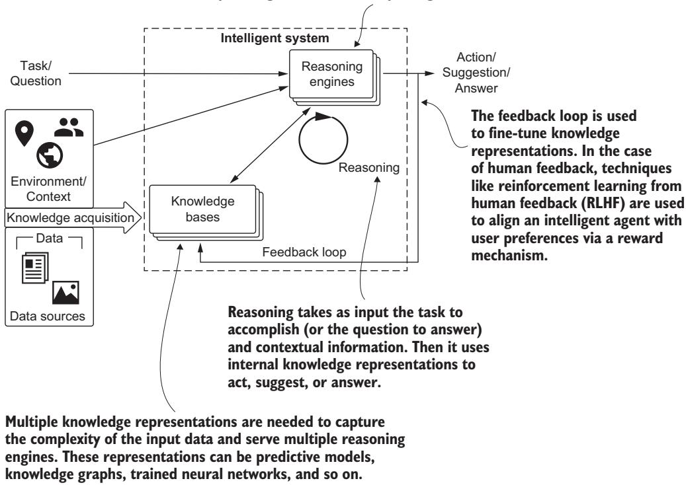  
Figure 2.1 A high-level schema of an intelligent system. It is made of two component types: knowledge bases and reasoning engines. Each type can have multiple instances based on the system’s tasks.

can improve how data sources are converted into knowledge and facilitate interpreting tasks and providing answers to users.

In this chapter, we will design a basic intelligent system that can do the following:

Gather and effectively represent knowledge

Autonomously reason using that knowledge

Answer questions and support informed decisions

Many concepts discussed here apply broadly to generative AI, but our emphasis is on LLMs.

### 2.2 Designing an intelligent system

To define an intelligent system, we’ll implement a high-level architecture and identify its most critical aspects. To do that, let’s consider a concrete task. Suppose you have been tasked to create an autonomous medical diagnostic system that will support doctors in choosing a sequence of actions (e.g., queries, medical tests, therapies) to diagnose diseases and heal patients. We will use this complex scenario to understand the type of system we will build and its structure. Such a system combines global generic knowledge with contextualized information and provides more accurate and specific answers.

To unlock the power of machine learning (ML), we need to build a system of algorithms and tools in which the output of one algorithm is often used as the input of another, or the output of two algorithms is combined. We will examine how approaches that include KGs and LLMs enable practitioners to implement more efficient, explainable, and effective systems.

#### 2.2.1 What is an intelligent system?

We prefer the definition of an intelligent system offered by Geoff Hulten [1]:

DEFINITION Intelligent systems connect users to AI and ML to achieve meaningful objectives. An intelligent system is one in which intelligence evolves and improves over time, particularly when it improves by watching how users interact with the system.

This definition emphasizes the pivotal role of the user. The primary objective of the intelligent system is to support users in accomplishing complex tasks—not by replacing them, but by enhancing their decision-making capabilities. For example, an autonomous medical diagnosis system is designed to assist physicians in making informed decisions rather than replace their expertise. This contrasts with other types of intelligent systems, such as self-driving cars, where the aim is to make the machine function independently of the user.

An intelligent system must also have the ability to learn from user interactions and explicit feedback, as well as utilize contextual information. The system should continuously develop, use, and maintain an evolving knowledge base. This evolution is driven not only by data sources but also by ongoing interactions with users. Figure 2.2 provides a high-level overview of an intelligent system (shown as a black box for now) and how it interacts with users and other systems.

#### 2.2.2 Categories of intelligent systems

The distinction between supporting users and acting on their behalf defines two main categories of intelligent systems: intelligent autonomous systems and intelligent advisory systems (IASs) [2]. In an intelligent autonomous system, the machine performs tasks independently, effectively replacing the user in decision-making and execution. Key features of autonomous systems include the following:

Full automation—The system operates without human input (or with minimal input), making all decisions based on its programming and sensory data.

 Real-time decision-making—The system must analyze data and make decisions in real time.

Adaptability—Autonomous systems often need to adapt to changing environments and unexpected situations.

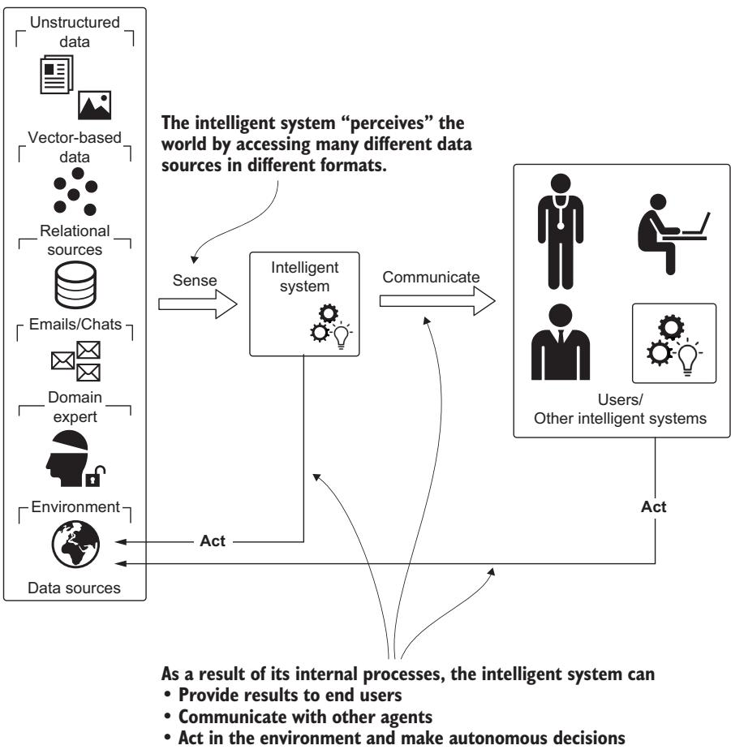  
Figure 2.2 An intelligent system and its interactions with other elements. It acquires knowledge by observing the environment and ingesting data from existing sources. Interna processes provide results to the end user.

On the other hand, an intelligent advisor system’s role is to provide information and recommendations. Key features of advisor systems include the following:

Decision support—The system provides insights, suggestions, and recommenda tions to help users make informed choices, but it does not execute actions on its own.

 Context awareness—The system uses contextual information, such as user preferences or specific scenarios, to tailor its advice to the situation at hand.

User interaction—These systems are designed for easy interaction, allowing users to explore options, ask questions, and receive detailed explanations to aid their decision-making.

Figure 2.3 illustrates the differences between these two types of intelligent systems.  
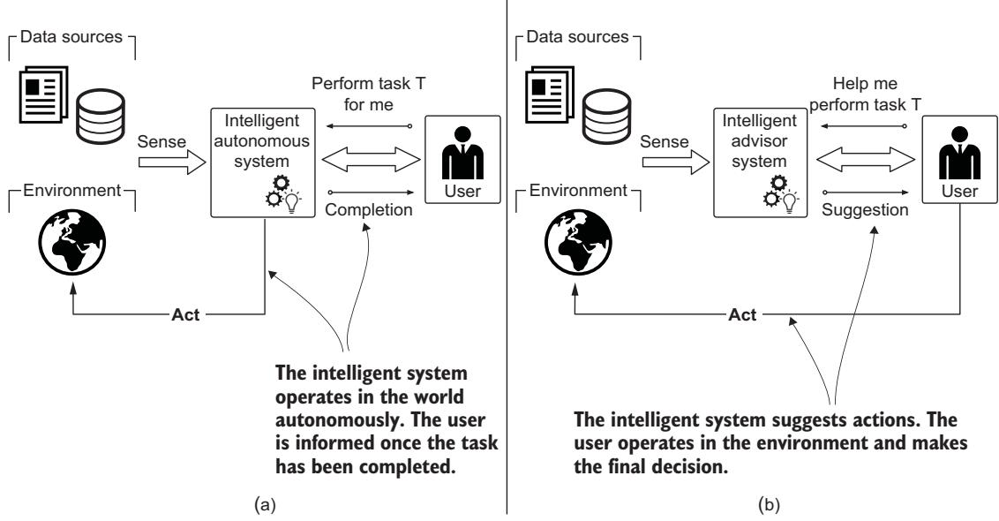  
Figure 2.3 Differences between (a) an intelligent autonomous system and (b) an intelligent advisor system. The first acts on behalf of users, whereas the second only makes suggestions. In both cases, the intelligent system supports or helps the end user; it is not meant to replace the user.

We focus primarily on IASs, as their features align closely with the strengths of KGs that we have outlined previously: enhanced decision support, deep context awareness, and an interactive user experience. IASs allow us to fully exploit the capabilities of KGs, providing users with more powerful and effective decision-support tools. Examples of IASs can be found in various fields:

 In law enforcement, predictive policing systems analyze crime data to identify potential hotspots or forecast where crimes are likely to occur.

 In financial services, IASs analyze transaction patterns, flagging suspicious activities that could indicate fraud.

In biomedical scenarios, these systems can provide a list of potential diagnoses and recommend treatment options based on available data.

It’s important to note that in all these cases, although the systems offer valuable insights, the humans—using them—make the final decisions about what actions to take.

#### 2.2.3 Characteristics of an intelligent system

An intelligent system must include four key characteristics that should drive both design and implementation:

A meaningful objective—The system should exist for a specific, achievable pur pose that is meaningful to end users. This objective must drive the entire development process.

The intelligent experience—The system must present intelligent outputs to users in ways that achieve desired outcomes. This requires interfaces that adapt based on predictions, maximize value when intelligence is correct, and minimize costs when mistakes occur. The interface must also facilitate implicit and explicit user feedback.

Knowledge creation and update—Intelligent behavior requires the capability to build, maintain, and reason with knowledge continuously. Combining LLMs and KGs enables proper handling of evolving knowledge and user feedback.

Orchestration—Intelligent systems involve multiple algorithms and tools working together, with the output of one becoming input for another. This includes managing how the system acquires knowledge from sources, controls risk, and maintains quality throughout its lifecycle.

Continuing our design process, we need to consider key aspects that drive our architectural decisions:

 Focus on autonomous advisor systems. Our intelligent system should suggest actions rather than accomplish actions on behalf of users.

Use an established knowledge base. This includes research papers, existing ontologies, and structured data sources rather than generic knowledge. The system shouldn’t provide generic answers but should use domain-specific understand ing refined by experts.

Learn from experience. The system should extend its knowledge base using feedback from the results of suggested actions.

We now have all the elements to design our intelligent system, as summarized in figure 2.4. The next two sections focus on the key processes of an intelligent system:

Knowledge acquisition—Collecting information from data sources, the environment, or domain experts

Reasoning—Converting acquired knowledge into actionable expertise

Through these processes, we’ll explain how intelligent system elements interact and compare how KGs and LLMs store, process, and use data.

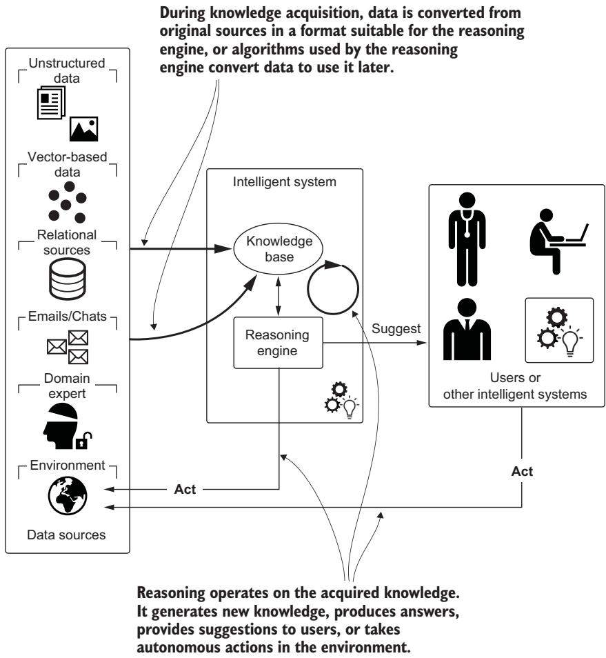  
Figure 2.4 Extended model of an intelligent system. The focus is on the core components (the knowledge base and the reasoning engine) and the core processes (knowledge acquisition and reasoning).

### 2.3 Knowledge acquisition and representation

Knowledge acquisition enables the IAS to “learn” from existing data available within the domain where the system will be deployed, from user feedback, and from the environment. This process converts raw data into structured knowledge representations that are tailored to the system’s requirements and used during the reasoning phase. The result is stored in one or more knowledge bases. How knowledge is acquired, represented, and stored depends on the underlying reasoning mechanisms, which is where LLMs and KGs diverge significantly. Figure 2.5 shows the components of our mental model covered in this section.

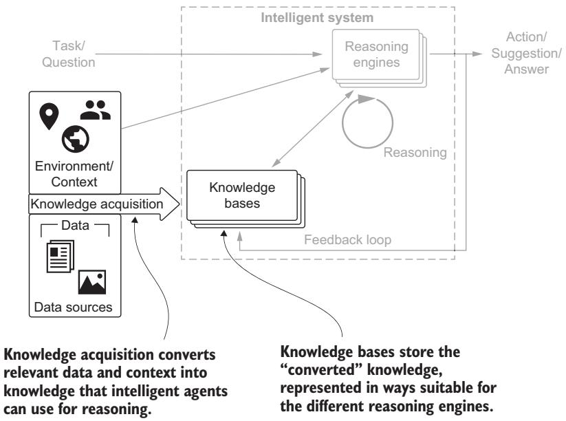  
Figure 2.5 In this section, we focus on the knowledge acquisition part of our mental model. It allows the intelligent system to acquire data and convert it into knowledge.

For KGs, knowledge acquisition typically involves transforming raw, structured, or semistructured data into a graph-based format, where entities are represented as nodes and their relationships are captured as edges. The structure and semantics of the domain—defined by ontologies or schemas—are essential in guiding this transformation. The process often involves a domain expert to better understand the semantics of the data and the intrinsic relationships among entities. Converting heterogeneous data sources into a unified, explicit schema demands meticulous work to ensure that the resulting KG accurately reflects the domain it represents. However, this preparation pays off in terms of flexibility.

In contrast, LLMs acquire knowledge by ingesting vast amounts of unstructured text data, which is encoded into dense, high-dimensional vector spaces during training. Unlike KGs, LLMs do not require extensive data preparation (considering the enormous amount of data), and the process is mostly unsupervised; the main effort consists of selecting the data sources and cleaning them. Information is encoded as statistical patterns rather than as explicit relationships defined by schemas. This implicit approach allows LLMs to grasp subtle contextual meanings and complex linguistic relationships, but makes the knowledge opaque and difficult to inspect or modify.

Figures 2.6 and 2.7 compare the acquisition process for KGs and LLMs, respectively. There are clear differences in terms of model complexity and the role of domain experts.

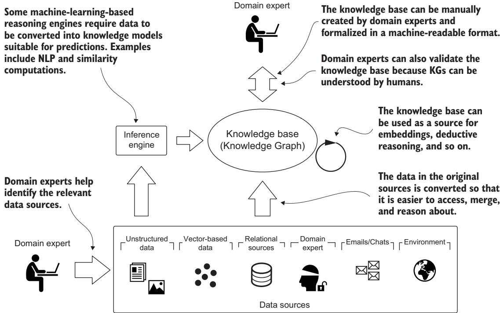

Figure 2.6 Knowledge acquisition for KGs: converting available data into an explicit knowledge representation through structured entities, relationships, and properties. This process involves a domain expert who identifies relevant data sources, supports the data model, and evaluates the results.  
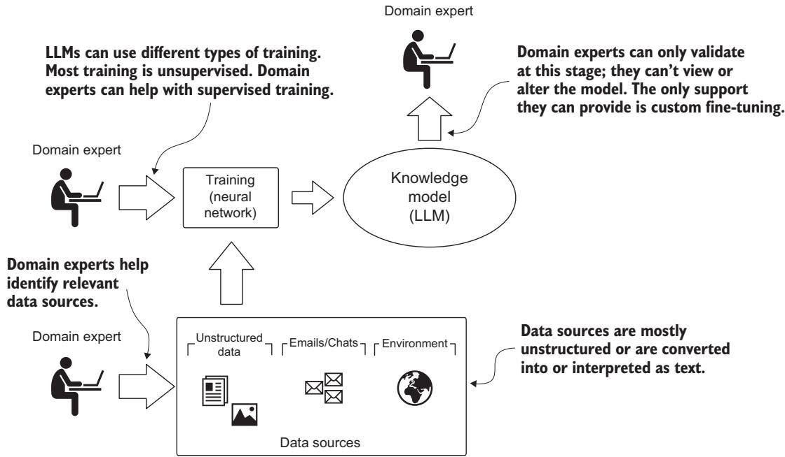  
Figure 2.7 Knowledge acquisition for LLMs: converting text data into an implicit knowledge representation through statistical parameters. Domain experts are involved during data source selection and result evaluation.

A few key differences must be considered when designing systems that use both technologies:

 Access—LLMs store knowledge through implicit representation using billions of parameters in continuous vector spaces, making it opaque and inaccessible to humans. KGs use explicit knowledge representation through nodes, relationships, and properties that are directly interpretable by both humans and machines.

Updates—Updating a KG involves adding, removing, or modifying nodes and relationships. Updating an LLM is far more complex, requiring retraining or fine-tuning the model.

Capabilities—LLMs are inherently adept at understanding and generating human language. KGs depend heavily on how developers design their access patterns and domain schemas.

Although there are clear advantages and limitations to each method of knowledge acquisition and representation, these differences are also complementary. A hybrid approach to the development of intelligent systems can overcome the limitations of both, and they can empower each other by offering solutions for a wider set of tasks. This new paradigm embraces a broader spectrum of computational tasks and uses diverse forms of knowledge representations, from structured data models to numerical parameters. In this era, reasoning is no longer confined to formal inference mechanisms but also includes probabilistic, contextual, and pattern-based computations that LLMs excel at. This shift allows AI systems to reason with explicit, structured knowledge (as in traditional expert systems) and, at the same time, unstructured, ambiguous, and contextual knowledge derived from language and experience.

### 2.4 Reasoning

In an IAS, the reasoning engine delivers insights and suggestions. The user provides input by formulating a request that contains the desired goals and further information required. Figure 2.8 shows the reasoning component in our mental model.

We must consider some important open questions:

How do we deal with uncertainty? Not all the information we have is true, accurate, or unequivocal. Reasoning accuracy depends on the certainty of the initial statements.

How can we infer some of the knowledge we need? Under some circumstances, we can derive new information from the available data.

How can we abstract from what we have seen to a broader understanding of the domain?

We’ll describe the learning process with an example taken from Alessandro Negro’s book, Graph-Powered Machine Learning [3]. Consider the implementation of a spam filter for email. A pure programming solution is to write a program that memorizes all emails labeled as spam by a human user and stores the result in a knowledge base. When a new email arrives, the pseudo-agent searches for a match in the knowledge base. If a match is found, the new email is rerouted to the spam folder. Otherwise, the email passes through the filter untouched. This approach can work and, in some scenarios, can be useful. But it is not a proper learning process because it lacks the ability to generalize and to transform individual examples into a broader model. In this specific use case, this means the ability to label unseen emails even though they are not the same as the previously labeled emails. This process is also referred to as inductive reasoning or inductive inference.

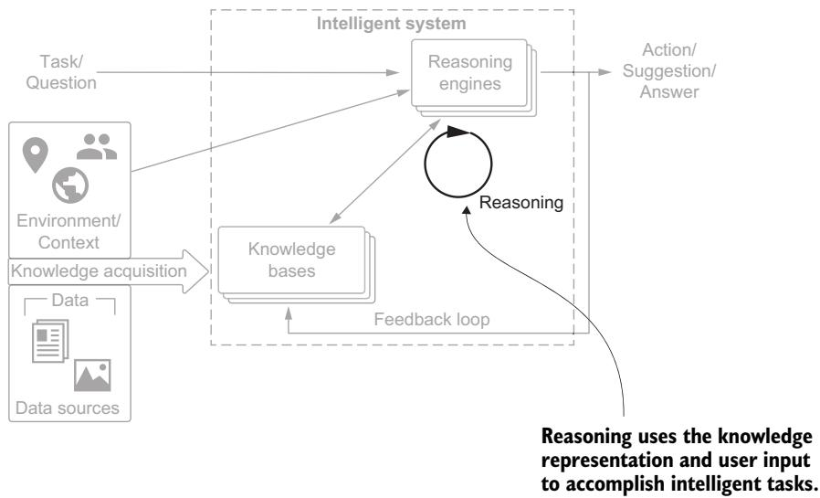  
Figure 2.8 Reasoning uses the knowledge base(s) to accomplish the tasks that the intelligent system is designed to do for end users.

#### Deductive and inductive reasoning

Deductive reasoning is a basic form of reasoning. It begins with a general statement or hypothesis and examines the possibilities to reach a specific, logical conclusion. For example, consider the reasoning: “All men are mortal. Alessandro is a man. Therefore, Alessandro is mortal.” With deductive reasoning, the hypothesis must be correct. It is assumed that the premises, “All men are mortal” and “Alessandro is a man,” are true. Therefore, the conclusion is logical and true.

Inductive reasoning makes broad generalizations from specific observations. It starts with data that includes samples of reality and then draws conclusions. For example, “The coin I pulled from the bag is a penny. The second and the third coins from the bag are pennies. Therefore, all the coins in the bag are pennies.” Note that even if all the premises are true in the original statement, inductive reasoning can lead to false conclusions. Here’s an example: “Harold is a grandfather. Harold is bald. Therefore, all grandfathers are bald.” In this case, the conclusion does not follow logically from the statements.

Because ChatGPT and similar tools can mimic human conversation, people often think that they possess extensive reasoning capabilities. Let’s look at a quick example. We used Claude.ai (https://claude.ai), which offers one of the best “reasoning” tools powered by LLMs, to verify our assumptions.

NOTE The version of Claude.ai we tested is 3.5 Sonnet. Considering the speed of improvements, we’re pretty sure that by the time this book is printed, running the same experiment will generate a different result.

We used the following prompt.

Listing 2.1 Prompt for checking reasoning capabilities   
A farmer stands at the side of the river with a sheep. There is a boat with   
enough room for one person and one animal. How can the farmer get himself and   
the sheep to the other side of the river using the boat in the smallest   
number of trips?

We selected this example because it is a simpler version of a well-known problem (which includes a wolf and a head of lettuce in addition to the farmer and the sheep), and we are confident that the training data used to train the LLM included many similar examples. So, we expect the probabilistic reasoning engine to go in the direction of the full problem instead of “understanding” what we asked for. The answer confirmed our assumption. Figure 2.9 is a snapshot of the results from Claude.ai.

  
Figure 2.9 Result from Claude.ai when we prompted it with the contents of listing 2.1

The answer contains some reasoning issues: there is no sense in the farmer going back and forth without sheep. The problem was solved completely after step 1, but because the problem formulation is very similar to (but not the same as) one from the data sources used during Claude.ai’s training, the proposed solution is “probabilistically” the closest.

This example illustrates the limitations of LLMs in certain types of reasoning. Wu et al. [4] tested a suite of 11 different tasks: coding to drawing, logic to spatial, and chess to arithmetic. They observed interesting performance with counterfactual variants—as they deviated from the default or well-known tasks—like the farmer and the sheep without wolf and lettuce, but they found that performance substantially and consistently degraded compared to the default conditions. Although current LLMs possess some abstract task-solving skills, they often rely on narrow, nontransferable procedures.

Thus, as we said earlier, KGs and LLMs can be the foundation for different types of reasoning, complementing each other in intelligent systems. We can use KGs for tasks that require precise, rule-based reasoning and explicit knowledge representation, and LLMs for tasks involving pattern recognition, context understanding, handling ambiguity or incomplete information, and reasoning about graph structures and their derived metrics. However, neither approach inherently possesses common-sense reasoning capabilities comparable to those of humans, and they often fail to make intuitive leaps or understand the implicit context that would be obvious to a person. These limitations underscore the importance of carefully considering the strengths and weaknesses of each approach when designing intelligent systems and potentially developing a powerful hybrid IAS.

### 2.5 Reasoning engines

Let’s extend our framework to explore how the knowledge base and reasoning engine interact in the development of an intelligent system (see figure 2.10). The depicted reasoning engine is generic; it can use a single type of reasoning—deductive, inductive, or otherwise—or a combination of reasoning strategies. Importantly, this engine not only reads from the knowledge base but also writes back to it. The actions (or suggestions) generated by the engine influence the environment, which in turn produces new observations. These observations are processed by the reasoning engine to build new knowledge, driving subsequent actions or suggestions. This feedback loop creates an iterative process, where the system continuously improves its ability to respond to environmental changes.

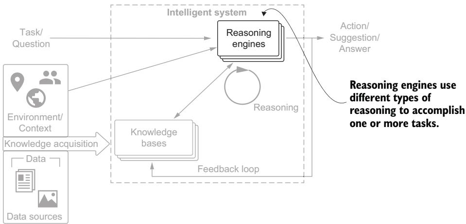  
Figure 2.10 Multiple reasoning engines, each with different types of reasoning strategies, can contribute to delivering the tasks required to implement the intelligent system.

#### 2.5.1 Limitations of a pure deductive reasoning engine

Let’s look at an example of applying the deductive reasoning process in the context of automated medical diagnosis. Imagine a patient visiting a virtual doctor: our intelligent system. The system must propose a series of actions (e.g., medical tests, treatments, queries) to diagnose the illness and suggest a course of therapy.

This sequence of actions is computed using the knowledge base, which contains information about the costs and outcomes of potential actions, probabilistic relationships between diseases and symptoms, and the patient’s preferences. The deductive reasoner can logically infer optimal actions when the knowledge base encodes all necessary data. In this idealized scenario, the deductive reasoner can outperform other reasoning methods.

However, a major limitation of deductive reasoning is that it requires a highly complete and accurate knowledge base, which is rarely available. In figure 2.11, the knowledge base is constructed by transforming data sources into logical statements that guide decision-making.

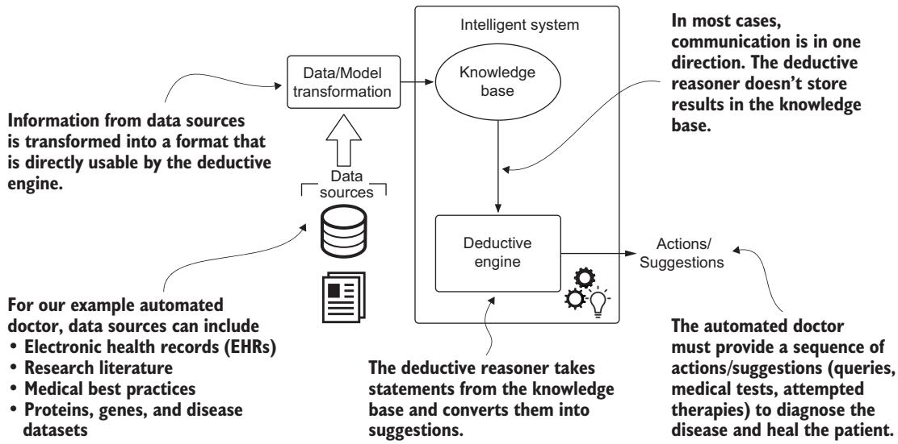  
Figure 2.11 The deductive reasoner. The knowledge base is created by transforming data sources. The deductive reasoner uses logical statements applied to segments of the knowledge base to act or to provide suggestions.

#### 2.5.2 Using inductive reasoning and ML

Inductive reasoning, powered by ML, addresses some of the limitations of purely deductive reasoning. Inductive reasoning can enhance the system in two key ways:

By learning and building relevant ontologies and relationships, ML expands the knowledge base, enabling it to handle a broader range of cases.

By providing inference under uncertainty, ML allows the system to generalize from incomplete data and make predictions even when not all information is available.

Figure 2.12 shows how an inductive reasoner works. The first step transforms raw data into a structured format, often with the help of ML algorithms. For example, natural language processing (NLP), powered by LLMs, converts unstructured text into structured data that can be incorporated into the knowledge base. This step can contribute to the creation or extension of a KG. The second step uses this knowledge to make

This process can, for instance, use natural language processing to convert research papers, reports, and other textual sources, and extract entities and relationships.

Creating the knowledge base requires the inference engine to process the data to create predictive models, generalize, or adjust the model to suit the needs of a more complex reasoning engine.  
The inference engine can abstract and generalize from the original knowledge, providing actions or making suggestions even when not all possible information is available.  
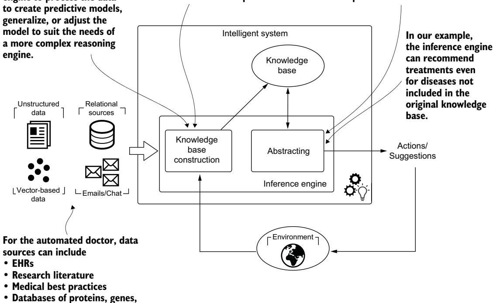

• Databases of proteins, genes, and diseases

Figure 2.12 An inductive reasoner. Constructing the knowledge base requires more effort; it is not a simple transformation. This reasoning engine can abstract from the knowledge base and work under some level of uncertainty.

predictions or generate actions through inductive reasoning, which abstracts patterns from available observations.

In traditional ML approaches, this process often requires manually selecting features from the knowledge base to train prediction models. This can be a tedious and sometimes infeasible task, especially in complex domains.

#### 2.5.3 The role of LLMs in the reasoning engine

Unlike purely deductive systems that require complete knowledge bases and explicit rules, LLMs can use their probabilistic reasoning capabilities to generate contextually relevant suggestions even when critical information is missing. Consider a medical scenario where a patient presents with nonspecific symptoms that could indicate anything from stress to serious neurological conditions. Traditional deductive reasoning would struggle with such an ambiguous presentation, especially when patient records are incomplete. An LLM, however, can draw on patterns learned from vast medical literature to evaluate multiple diagnostic possibilities simultaneously. The LLM’s strength lies in its ability to reason probabilistically with uncertainty. It can weigh the likelihood of different conditions based on available data and, rather than providing a single definitive answer, recommend a prioritized diagnostic approach.

This probabilistic reasoning capability enables LLMs to bridge knowledge gaps that would halt a purely deductive reasoning process. When integrated with KG-based reasoning engines, an LLM acts as a reasoning layer that can interpret ambiguous inputs and provide nuanced recommendations that account for the inherent uncertainty in complex decision-making scenarios. This hybrid approach enables IASs to function effectively in real-world environments where information is often incomplete or uncertain.

### 2.6 A KG approach to IASs

Where do KGs fit in the development of IASs? The short answer is, everywhere. In recent years, academia and industry have used KGs extensively as a form of structured human knowledge [5–8]. In addition to this graph-based representation, several reasoning and analysis algorithms have been devised to derive insights from KGs.

The idea of using a graph to support decision-making processes is not new. Stokman and de Vries [9] anticipated that with knowledge-based systems, it would be possible to construct computer programs that advise professional users with a limited domain of expertise. In this context, they speculated that “The structuring of knowledge in a graph can be seen as the construction of a knowledge-based system integrating knowledge from different sources” [9].

In recent years, KGs have become a standard approach to merge distributed data sources into a single connected source of truth [10]. And with the advent of generative AI and LLMs, KGs can mitigate hallucinations and provide up-to-date data, among other benefits [11].

But simply viewing KGs as aggregators of knowledge overlooks the goal for which they were introduced: building intelligent systems. We consider this a bottom-up approach to KG construction. It begins with data from various sources, consolidates that data into a single source of truth, and then initiates the discovery process. It expects the data to tell a story without any idea of what the end user is looking for. Figure 2.13 summarizes this approach.

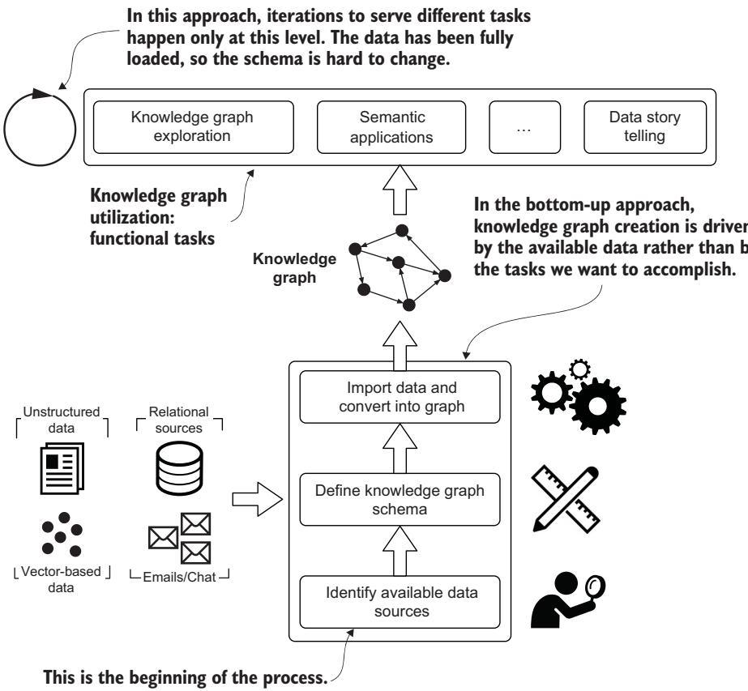  
Figure 2.13 A bottom-up approach to KG creation. It begins with importing all the data, rather than first considering the functional tasks we want to achieve.

Our experience is that this bottom-up approach often leads to the failure of KG adoption. There are too many data sources, each with different structures and identifiers, and significant effort is required to normalize the data into a single homogeneous structure. Much of the content is task-specific and therefore not relevant to global thinking.

Developing intelligent agents requires us to represent knowledge (in our case, as a KG) in a way that is effective and capable of capturing and handling the intrinsic complexity of the domain in which the agent must operate. This approach should be driven by business objectives rather than by available data. Building on established ML project methodologies, CRISP-DM [12], we can use a purpose-driven approach for

KG construction. Figure 2.14 illustrates how a KG serves as the central knowledge representation in this process.

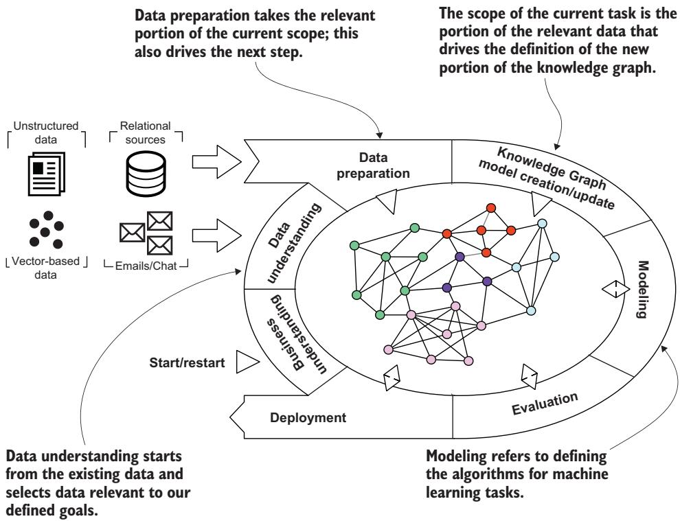  
Figure 2.14 CRISP-DM revisited, applied to KG platforms. The KG is used as a model of the knowledge base for the intelligent system. It is the center of the revisited CRISP-DM process.

This approach emphasizes that everything starts from the business understanding. These goals drive the data understanding, allowing us to focus on the specific portion of the data we need rather than blindly importing all available data sources. This determines the requirements for defining the content and structure of the KG. In this context, the KG represents a self-sufficient, domain-specific, customizable source of truth that copies and transforms the data we need. During acquisition, LLMs extract relevant entities and relationships from unstructured data and provide generic understanding, such as sentiment analysis or topic identification.

In the modeling phase, we use and test one or more algorithms to reach specific goals; in the next phase, the results are evaluated. LLMs can be involved in reasoning on top of KGs to understand users’ questions and provide answers in natural language. The output of these two phases is composed of a set of algorithms, a set of trained or pretrained models, and a report describing the tests and the overall quality of the trained models.

If everything goes well, we incorporate the graph schema and model, the pipelines for ingestion and post-processing, the algorithms, and the predictive models into a product and then deploy. Then a new round can start—but this time we do not start from an empty KG.

DEFINITION A predictive model is a formula for estimating an unknown value of interest: the target. It represents in an efficient format the result of the learning process on the training dataset, and we access it to perform the actual prediction.

In the second round, we work by difference and extension, ensuring that the results of the previous iteration are not affected. The schemaless approach for the graph allows for extensions with new nodes and relationship types, without compromising previous data and functionalities.

DEFINITION Schemaless refers to the flexibility of storing data in a database or a generic data structure with fewer (or no) constraints on how data items are formatted and related to each other. Graph databases are generally considered schemaless because their elements (nodes and relationships) and attributes can store practically everything.

In the book, we frequently use schemas to drive the process between scenarios and use cases. These schemas are repurposed, and the different phases are highlighted as examples of how this process works in practice.

#### Summary

Intelligence is fundamentally about acquiring and applying knowledge, making knowledge representation and reasoning the core components of intelligent system architecture.

Intelligent systems are categorized as either autonomous systems that act independently or advisory systems that support human decision-making.

Knowledge acquisition differs between KGs and LLMs: KGs use explicit, structured representations requiring domain expertise but offering interpretability, whereas LLMs use implicit statistical patterns that capture language understanding but lack transparency.

Hybrid systems combining KGs and LLMs use their complementary strengths: KGs provide structured reasoning and explicit knowledge, and LLMs handle ambiguity, context, and natural language understanding.

LLMs enhance reasoning engines by bridging knowledge gaps and providing contextual interpretation, making intelligent systems more robust with incomplete or ambiguous information.

Purpose-driven KG development starting from business objectives is more effective than bottom-up data integration strategies, which often lead to project failure.