# 지능형 시스템: 하이브리드 접근법 — 쉬운 해설판

> 이 문서는 Alessandro Negro의 저서 *Knowledge Graphs and LLMs in Action* 2장을 한국어로 풀어 쓴 해설판입니다. 원문의 모든 문단·그림·정의·수식·인용을 빠짐없이 담되, 딱딱한 직역 대신 따뜻한 대화체 합니다체로 "설명하면서 옮기는" 방식으로 다시 썼습니다. 원문에 없는 주장이나 데이터는 더하지 않았습니다.
>
> 이 장을 관통하는 두 주인공을 먼저 소개합니다. **대규모 언어 모델(LLM)** 은 어마어마한 텍스트를 읽고 사람 말을 유창하게 이해하고 생성하지만, 가끔 사실을 그럴듯하게 지어내기도 하는 박학다식한 달변가에 가깝습니다. 반면 **지식 그래프(KG)** 는 검증된 사실을 노드와 관계로 또박또박 정리해 둔, 언제든 확인 가능한 사실 대장(색인)에 가깝습니다. 이 장의 핵심 메시지는, 이 둘의 강점이 서로 반대라서 오히려 함께 쓰면 서로의 약점을 메워 준다는 것입니다.

---

### 이 장에서 다루는 것 — 지능형 자문 시스템의 설계 지도

이 장은 다음 세 가지를 다룹니다.

- 지능형 자문 시스템(intelligent advisor system)을 위한 설계 개념과 아키텍처
- 하이브리드 시스템이 KG와 LLM의 상호 보완적 강점을 어떻게 활용하는가
- 지능형 자문 시스템 안에서 KG와 LLM을 결합하는 방법

이 장은 "지능"과 "지능적 행동"이라는 개념의 밑바탕을 탐구합니다. 논의의 중심에는 **지식 그래프(knowledge graph, KG)** 와 **대규모 언어 모델(large language model, LLM)** 의 응용이 있습니다. 이미 존재하는 지식·맥락과 추론·자연어 이해 능력을 한데 결합해, 아주 복잡한 문제를 풀어내는 지능형 시스템을 만드는 것이 목표입니다.

핵심 애플리케이션에 쓰이는 지능형 시스템이 얼마나 믿을 만하고 안전한지 제대로 판단하려면, 그 시스템이 내부에서 어떻게 작동하는지를 이해해야 합니다. 그래야 시스템에 없는 능력을 있다고 착각하지 않으면서도, 실제로 가진 진짜 능력은 십분 활용할 수 있습니다. 이렇게 작동 방식을 하나하나 해부해 보면, 시스템의 한계를 더 잘 파악하고 그 잠재력을 제대로 끌어낼 수 있습니다.

---

### 2.1 지능이란 무엇인가? — 지식과 추론이라는 두 축

지능이란 무엇일까요? 그것은 **지식을 습득하고 적용하는 능력**, 즉 경험에서 배우고, 문제를 풀고, 환경과 상호작용하는 능력입니다. 진화가 갈고닦은 이 자연스러운 과정 덕분에 인간은 다른 종보다 경쟁 우위를 갖게 되었습니다. 인간은 이 일을 힘들이지 않고 무의식적으로 해냅니다. 하지만 지능형 시스템을 설계하고 각 요소의 세부 구조를 짜려면, 이 과정을 여러 작업과 구성 요소로 잘게 쪼개어 해부해야 합니다.

지능적 에이전트의 첫 번째 목표는 세상에서 예시·증거·규칙을 얻어 기억하고, 그것을 이용해 행동하거나 의사결정을 내리는 것입니다. 바깥에서 보면 지능형 시스템은 복잡한 과제를 척척 해내는 하나의 블랙박스처럼 보입니다. 이것을 이해하는 첫걸음은, 주된 기능을 기준으로 시스템을 더 단순하고 작은 구성 요소로 나누는 것입니다. 우리는 지능적 에이전트를 가장 중요한 활동을 담당하는 두 가지 구성 요소로 분해하는 데서 출발합니다.

**지식 표현(knowledge representation)** 은 AI 시스템이 자신이 모델링하는 영역(도메인)에 관한 정보를 구조화하고, 부호화하고, 전달할 때 사용하는 "언어"입니다. AI 시스템은 추론하거나 예측하려면 이 언어가 필요하고, 우리도 시스템이 내놓은 결과를 해석하려면 이 언어를 봐야 합니다. 지식을 어떻게 표현할지 선택하는 일은 AI 시스템의 능력과 한계에 매우 큰 영향을 줍니다.

**추론(reasoning)** 은 정보를 분석하고, 규칙을 적용하고, 증거나 전제를 바탕으로 결론을 이끌어내는 인지 과정입니다. 추론에는 여러 종류가 있는데, 예를 들어 **연역적 추론(deductive reasoning)** 과 **귀납적 추론(inductive reasoning)** 이 있고, 각각 문제 해결과 의사결정에서 서로 다른 역할을 합니다. AI 시스템, 특히 KG와 LLM을 결합한 시스템은 이 근본적인 인지 능력을 흉내 내는 것을 넘어 오히려 강화하는 데까지 점점 능숙해지고 있습니다.

그림 2.1은 일반적인 지능형 시스템의 큰 그림(고수준 아키텍처)을 보여 줍니다. 이 도식은 이 장 전체를 관통하는 사고의 틀(멘탈 모델)입니다. 여기서 알 수 있듯이, 두 가지 구성 요소는 하나의 지능적 에이전트 안에서 여러 개가 동시에 존재할 수 있습니다. 이들은 순차적으로도, 병렬적으로도 상호작용할 수 있고, 같은 지식 표현이 여러 추론 엔진에 쓰이거나 모델들 사이의 소통 방식으로 쓰일 수도 있습니다. 한 과정의 출력이 다른 과정의 입력이 되어, 지식이 점점 정교해지는 순환 고리를 만들어 냅니다.

지식 표현이 얼마나 표현력이 풍부한가와, 그것을 얼마나 효율적으로 처리할 수 있는가 사이에는 흔히 **상충 관계(trade-off)** 가 존재합니다. 또한 효과적인 지식 표현은 도메인과 과제에 따라 달라지는 경우가 많습니다. 지식 표현과 추론은 서로 긴밀히 얽혀 있으며, 서로에게 영향을 줍니다.

우리의 핵심 주장 중 하나는, KG가 지식을 효율적으로 표현하고, 새로운 통찰을 이끌어내며, 정밀하고 효과적인 추론의 토대를 놓는 근본적인 데이터 구조라는 것입니다. 그리고 KG를 LLM과 결합해서 쓰면,

복잡한 지능형 시스템은 여러 추론 엔진을 병렬 또는 순차적으로 조합해 사용합니다. 추론은 이 여러 엔진을 어떻게 활용할지 계획하는 데도 도움을 줄 수 있습니다.

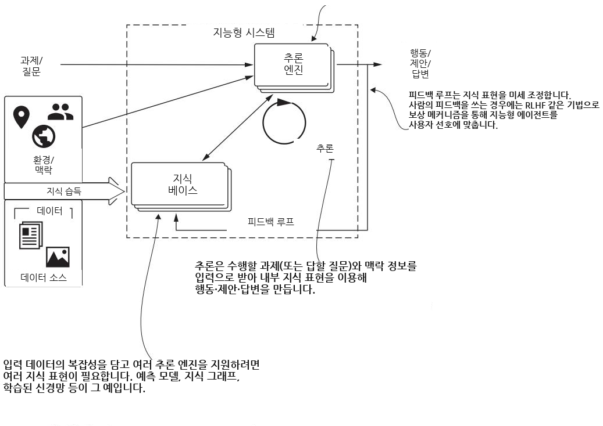

그림 2.1 지능형 시스템의 고수준 도식. 지식 베이스(knowledge base)와 추론 엔진(reasoning engine)이라는 두 가지 구성 요소 유형으로 이루어지며, 각 유형은 시스템이 수행할 과제에 따라 여러 인스턴스를 가질 수 있습니다.

(앞 문단에서 이어집니다) KG와 LLM을 함께 쓰면 데이터 소스를 지식으로 변환하는 방식이 더 좋아지고, 과제를 해석하고 사용자에게 답을 제공하는 일도 한결 수월해집니다.

이 장에서 우리는 다음을 할 수 있는 기본적인 지능형 시스템을 설계할 것입니다.

- 지식을 수집하고 효과적으로 표현하기
- 그 지식을 사용해 자율적으로 추론하기
- 질문에 답하고, 정보에 근거한 의사결정을 지원하기

여기서 다루는 개념 중 상당수는 생성형 AI 전반에 폭넓게 적용되지만, 우리의 초점은 LLM에 맞춰져 있습니다.

---

### 2.2 지능형 시스템 설계하기 — 의료 진단 시나리오로 구조 잡기

지능형 시스템을 정의하기 위해, 우리는 고수준 아키텍처를 구현하고 그중에서 가장 중요한 측면들을 짚어 볼 것입니다. 이를 위해 구체적인 과제 하나를 떠올려 보겠습니다. 여러분이 **자율 의료 진단 시스템**을 만들라는 임무를 받았다고 해봅시다. 이 시스템은 의사가 질병을 진단하고 환자를 치료하기 위해 일련의 조치(예: 질문, 의학 검사, 치료법)를 선택하도록 돕습니다. 우리는 이 복잡한 시나리오를 사례로 삼아, 우리가 만들 시스템이 어떤 유형이고 어떤 구조를 갖는지 이해할 것입니다. 이런 시스템은 전역적이고 일반적인 지식을 특정 맥락의 정보와 결합해, 더 정확하고 구체적인 답을 제공합니다.

**머신러닝(machine learning, ML)** 의 힘을 온전히 끌어내려면, 한 알고리즘의 출력이 다른 알고리즘의 입력으로 쓰이거나 두 알고리즘의 출력이 결합되는, 그런 알고리즘과 도구들의 시스템을 구축해야 합니다. 앞으로 우리는 KG와 LLM을 포함한 접근법들이 어떻게 실무자로 하여금 더 효율적이고, 설명 가능하며, 효과적인 시스템을 구현하게 해주는지 살펴보겠습니다.

#### 2.2.1 지능형 시스템이란 무엇인가? — 사용자를 돕고 스스로 진화하는 시스템

우리는 Geoff Hulten이 제시한 지능형 시스템의 정의를 선호합니다 [1].

> **정의** 지능형 시스템(intelligent system)은 사용자를 AI 및 ML과 연결하여 의미 있는 목표를 달성하게 하는 시스템입니다. 지능형 시스템이란, 시간이 지남에 따라 그 지능이 진화하고 향상되는 시스템, 특히 사용자가 시스템과 어떻게 상호작용하는지를 관찰함으로써 스스로 개선되는 시스템을 말합니다.

이 정의는 **사용자의 핵심적 역할**을 강조합니다. 지능형 시스템의 일차적 목표는 사용자를 대체하는 것이 아니라, 사용자가 복잡한 과제를 완수하도록 돕는 것, 즉 의사결정 능력을 향상시키는 것입니다. 예를 들어 자율 의료 진단 시스템은 의사의 전문성을 대체하는 것이 아니라, 의사가 정보에 근거한 결정을 내리도록 보조하기 위해 설계됩니다. 이는 자율주행차처럼 사용자와 무관하게 기계 스스로 작동하는 것을 목표로 하는 다른 유형의 지능형 시스템과 대비됩니다.

지능형 시스템은 또한 사용자 상호작용과 명시적 피드백으로부터 배우고, 맥락 정보를 활용할 수 있어야 합니다. 시스템은 진화하는 지식 베이스를 끊임없이 발전시키고, 사용하고, 유지해야 합니다. 이 진화는 데이터 소스뿐 아니라 사용자와의 지속적인 상호작용에 의해서도 추동됩니다. 그림 2.2는 지능형 시스템(지금은 블랙박스로 표현)의 큰 그림과, 그것이 사용자 및 다른 시스템과 어떻게 상호작용하는지를 보여 줍니다.

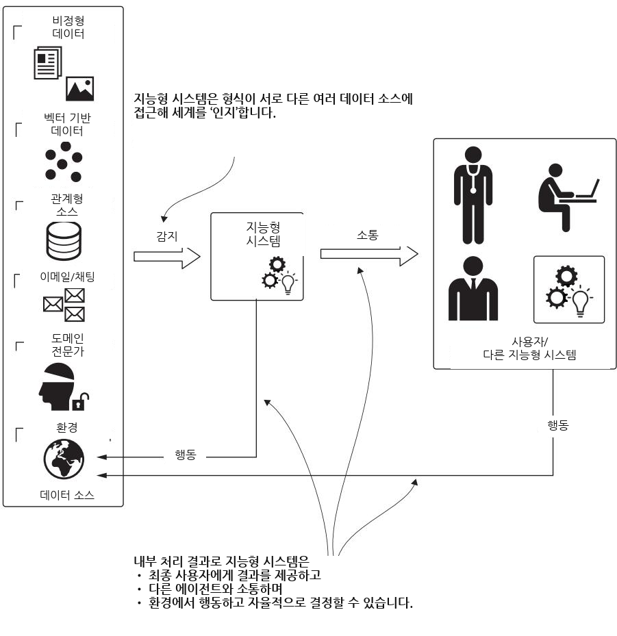

그림 2.2 지능형 시스템과 다른 요소들 사이의 상호작용. 이 시스템은 환경을 관찰하고 기존 소스로부터 데이터를 받아들여 지식을 습득하며, 내부 과정을 통해 최종 사용자에게 결과를 제공합니다.

#### 2.2.2 지능형 시스템의 분류 — 자율 시스템과 자문 시스템

사용자를 **지원**하는가, 아니면 사용자를 **대신해 행동**하는가 하는 구분은 지능형 시스템을 두 가지 주요 범주로 나눕니다. 바로 **지능형 자율 시스템(intelligent autonomous system)** 과 **지능형 자문 시스템(intelligent advisory system, IAS)** 입니다 [2]. 지능형 자율 시스템에서는 기계가 과제를 독립적으로 수행하며, 의사결정과 실행에서 사실상 사용자를 대체합니다. 자율 시스템의 핵심 특징은 다음과 같습니다.

- **완전 자동화** — 시스템은 사람의 입력 없이(또는 최소한의 입력만으로) 작동하며, 자신의 프로그래밍과 센서 데이터에 근거해 모든 결정을 내립니다.
- **실시간 의사결정** — 시스템은 데이터를 분석하고 실시간으로 결정을 내려야 합니다.
- **적응성** — 자율 시스템은 변화하는 환경과 예기치 못한 상황에 적응해야 하는 경우가 많습니다.

한편 지능형 자문 시스템의 역할은 정보와 권고를 제공하는 것입니다. 자문 시스템의 핵심 특징은 다음과 같습니다.

- **의사결정 지원** — 시스템은 통찰·제안·권고를 제공해 사용자가 정보에 근거한 선택을 하도록 돕지만, 스스로 조치를 실행하지는 않습니다.
- **맥락 인식** — 시스템은 사용자 선호나 특정 시나리오 같은 맥락 정보를 활용해, 눈앞의 상황에 맞게 조언을 조정합니다.
- **사용자 상호작용** — 이런 시스템은 손쉬운 상호작용을 위해 설계되어, 사용자가 여러 선택지를 탐색하고, 질문하고, 상세한 설명을 받아 의사결정에 도움을 얻을 수 있게 합니다.

그림 2.3은 이 두 유형의 지능형 시스템의 차이를 보여 줍니다.

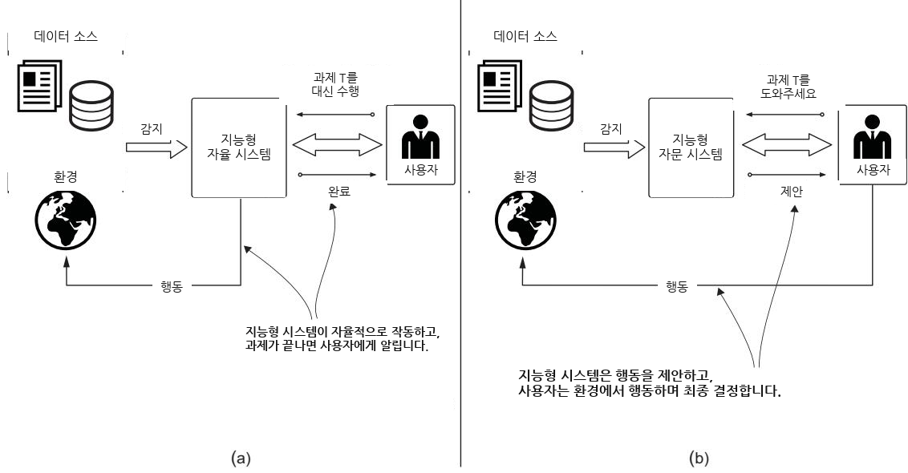

그림 2.3 (a) 지능형 자율 시스템과 (b) 지능형 자문 시스템의 차이. 앞의 것은 사용자를 대신해 행동하는 반면, 뒤의 것은 제안만 합니다. 두 경우 모두 지능형 시스템은 최종 사용자를 지원하거나 돕기 위한 것이지, 사용자를 대체하려는 것이 아닙니다.

우리는 주로 IAS(지능형 자문 시스템)에 초점을 둡니다. 그 특징이 앞서 설명한 KG의 강점 — 강화된 의사결정 지원, 깊은 맥락 인식, 상호작용적 사용자 경험 — 과 딱 맞아떨어지기 때문입니다. IAS는 KG의 능력을 온전히 활용할 수 있게 해주어, 사용자에게 더 강력하고 효과적인 의사결정 지원 도구를 제공합니다. IAS의 사례는 여러 분야에서 찾을 수 있습니다.

- **법 집행** 분야에서는 예측 치안(predictive policing) 시스템이 범죄 데이터를 분석해 잠재적 우범 지역을 식별하거나 범죄가 일어날 만한 곳을 예측합니다.
- **금융 서비스** 분야에서는 IAS가 거래 패턴을 분석해, 사기를 시사할 수 있는 의심스러운 활동에 표시를 답니다.
- **생의학** 시나리오에서는 이런 시스템이 가능한 진단 목록을 제시하고, 확보된 데이터를 바탕으로 치료 선택지를 권고할 수 있습니다.

이 모든 경우에서 중요한 점은, 시스템이 가치 있는 통찰을 제공하더라도 **어떤 조치를 취할지에 대한 최종 결정은 그것을 사용하는 사람이 내린다**는 것입니다.

#### 2.2.3 지능형 시스템의 특성 — 설계를 이끄는 네 가지 축

지능형 시스템은 설계와 구현 모두를 이끌어야 하는 네 가지 핵심 특성을 갖추어야 합니다.

- **의미 있는 목표** — 시스템은 최종 사용자에게 의미 있는, 구체적이고 달성 가능한 목적을 위해 존재해야 합니다. 이 목표가 개발 과정 전체를 이끌어야 합니다.
- **지능적 경험** — 시스템은 원하는 성과를 이끌어내는 방식으로 지능적 출력을 사용자에게 제시해야 합니다. 이를 위해서는 예측에 따라 적응하는 인터페이스, 즉 지능이 맞았을 때는 가치를 극대화하고 실수가 났을 때는 비용을 최소화하는 인터페이스가 필요합니다. 인터페이스는 또한 암묵적·명시적 사용자 피드백을 원활히 받아들일 수 있어야 합니다.
- **지식 생성과 갱신** — 지능적 행동에는 지식을 지속적으로 구축하고, 유지하고, 그것으로 추론하는 능력이 필요합니다. LLM과 KG를 결합하면 진화하는 지식과 사용자 피드백을 제대로 다룰 수 있습니다.
- **오케스트레이션** — 지능형 시스템에서는 여러 알고리즘과 도구가 함께 작동하며, 한쪽의 출력이 다른 쪽의 입력이 됩니다. 여기에는 시스템이 소스로부터 지식을 습득하는 방식을 관리하고, 위험을 통제하며, 전체 생애 주기에 걸쳐 품질을 유지하는 일이 포함됩니다.

설계 과정을 이어가려면, 우리의 아키텍처 결정을 이끄는 핵심 측면들을 고려해야 합니다.

- **자율 자문 시스템에 집중한다.** 우리의 지능형 시스템은 사용자를 대신해 조치를 완수하기보다는 조치를 제안해야 합니다.
- **정립된 지식 베이스를 사용한다.** 여기에는 일반적인 상식 지식이 아니라 연구 논문, 기존 온톨로지, 구조화된 데이터 소스가 포함됩니다. 시스템은 뭉뚱그린 일반적 답을 내놓는 대신, 전문가가 다듬은 도메인 특화 이해를 사용해야 합니다.
- **경험에서 배운다.** 시스템은 제안한 조치의 결과에서 얻은 피드백을 이용해 자신의 지식 베이스를 확장해야 합니다.

이제 우리는 지능형 시스템을 설계할 모든 요소를 갖추었습니다. 이는 그림 2.4에 요약되어 있습니다. 다음 두 절에서는 지능형 시스템의 핵심 과정에 초점을 맞춥니다.

- **지식 습득(knowledge acquisition)** — 데이터 소스, 환경, 도메인 전문가로부터 정보를 수집하는 것
- **추론(reasoning)** — 습득한 지식을 실행 가능한 전문성으로 변환하는 것

이 과정들을 통해, 우리는 지능형 시스템의 요소들이 어떻게 상호작용하는지 설명하고, KG와 LLM이 데이터를 저장·처리·사용하는 방식을 비교할 것입니다.

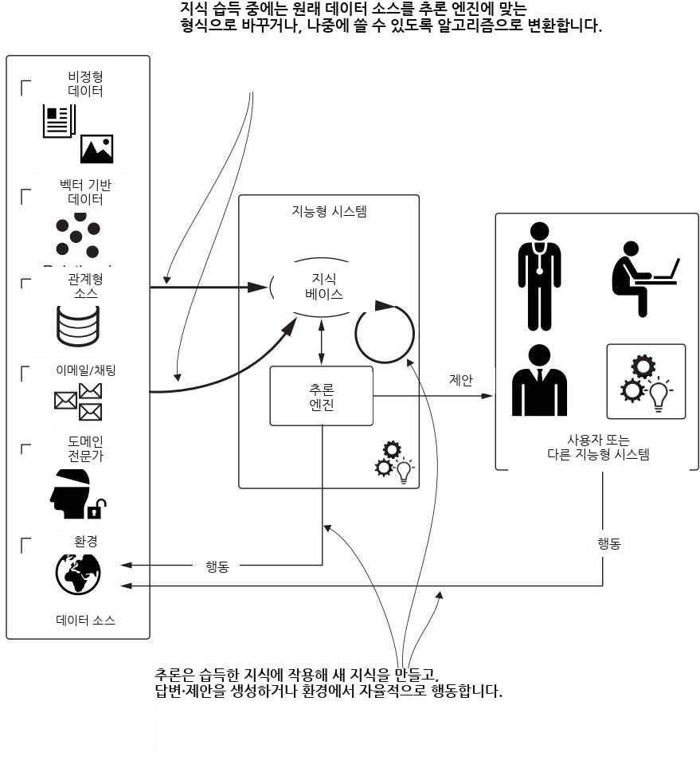

그림 2.4 지능형 시스템의 확장 모델. 핵심 구성 요소(지식 베이스와 추론 엔진)와 핵심 과정(지식 습득과 추론)에 초점을 맞춥니다.

---

### 2.3 지식 습득과 표현 — KG와 LLM이 갈라지는 지점

지식 습득은 IAS가 시스템이 배치될 도메인 안에 존재하는 데이터로부터, 그리고 사용자 피드백과 환경으로부터 "배울" 수 있게 해줍니다. 이 과정은 원시 데이터(raw data)를 시스템 요구사항에 맞게 다듬어진 구조화된 지식 표현으로 변환하며, 이렇게 만들어진 지식은 추론 단계에서 사용됩니다. 그 결과는 하나 이상의 지식 베이스에 저장됩니다. 지식을 어떻게 습득하고, 표현하고, 저장하는가는 그 밑바탕에 깔린 추론 메커니즘에 따라 달라지는데, 바로 이 지점에서 LLM과 KG가 크게 갈라집니다. 그림 2.5는 이 절에서 다룰 멘탈 모델의 구성 요소들을 보여 줍니다.

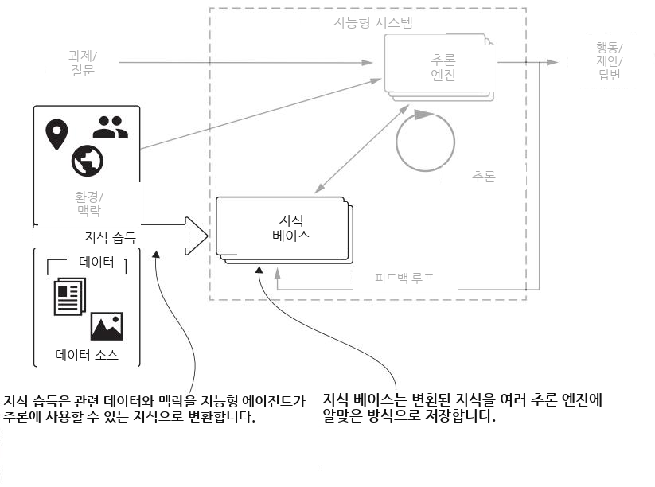

그림 2.5 이 절에서는 멘탈 모델 중 지식 습득 부분에 집중합니다. 이 부분 덕분에 지능형 시스템은 데이터를 습득하고 그것을 지식으로 변환할 수 있습니다.

**KG의 경우**, 지식 습득은 대개 원시·구조화·반구조화 데이터를 그래프 기반 형식으로 변환하는 일을 뜻합니다. 이 형식에서는 **개체(entity)** 가 노드로 표현되고, 개체들 사이의 관계가 간선(엣지)으로 포착됩니다. 온톨로지나 스키마로 정의되는 도메인의 구조와 의미론(semantics)이 이 변환을 이끄는 데 필수적입니다. 이 과정에는 흔히 도메인 전문가가 참여해, 데이터의 의미와 개체들 사이의 내재적 관계를 더 잘 이해하도록 돕습니다. 이질적인 데이터 소스들을 하나의 통일된 명시적 스키마로 변환하려면, 그 결과 KG가 자신이 표현하려는 도메인을 정확히 반영하도록 꼼꼼한 작업이 필요합니다. 하지만 이 준비 과정은 유연성이라는 형태로 충분히 값을 치릅니다.

**반면 LLM은** 방대한 양의 비구조화 텍스트 데이터를 받아들여 지식을 습득하는데, 이 데이터는 학습 과정에서 조밀한 고차원 벡터 공간으로 부호화됩니다. KG와 달리 LLM은 (다루는 데이터 양이 워낙 어마어마하다는 점을 감안하면) 광범위한 데이터 준비를 요구하지 않으며, 그 과정은 대부분 비지도(unsupervised) 방식입니다. 주된 노력은 데이터 소스를 고르고 그것을 정제하는 데 들어갑니다. 정보는 스키마로 정의된 명시적 관계가 아니라 통계적 패턴으로 부호화됩니다. 이런 암묵적 방식 덕분에 LLM은 미묘한 맥락적 의미와 복잡한 언어적 관계를 포착할 수 있지만, 대신 지식이 불투명해져서 들여다보거나 수정하기가 어렵습니다.

그림 2.6과 2.7은 각각 KG와 LLM의 습득 과정을 비교합니다. 모델의 복잡도와 도메인 전문가의 역할이라는 면에서 뚜렷한 차이가 있습니다.

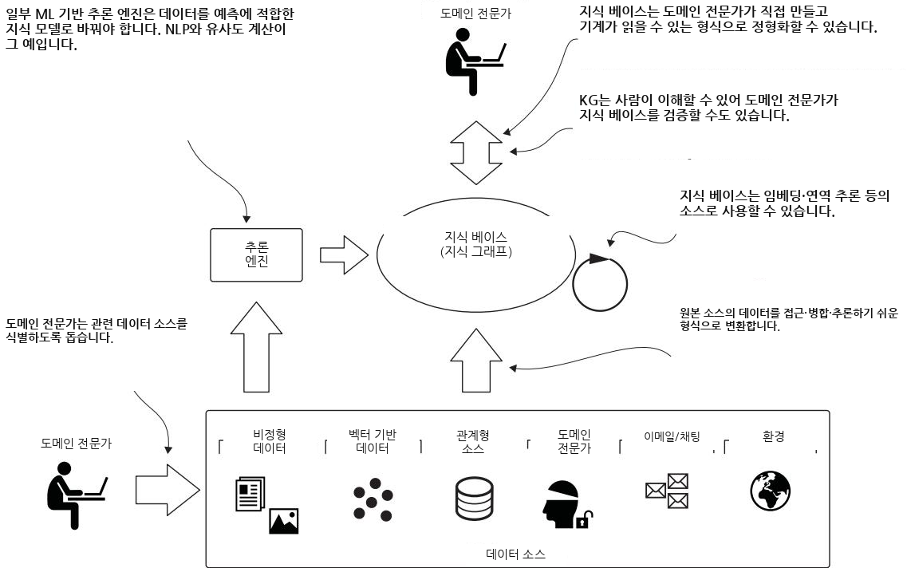

그림 2.6 KG를 위한 지식 습득: 확보된 데이터를 구조화된 개체·관계·속성을 통해 명시적 지식 표현으로 변환합니다. 이 과정에는 관련 데이터 소스를 식별하고, 데이터 모델을 뒷받침하며, 결과를 평가하는 도메인 전문가가 참여합니다.

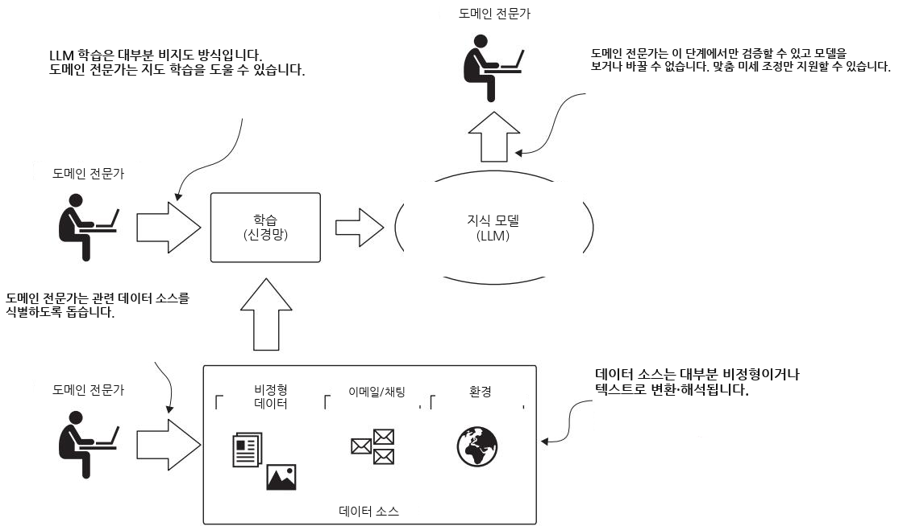

그림 2.7 LLM을 위한 지식 습득: 텍스트 데이터를 통계적 매개변수를 통해 암묵적 지식 표현으로 변환합니다. 도메인 전문가는 데이터 소스 선택과 결과 평가 단계에 참여합니다.

두 기술을 함께 쓰는 시스템을 설계할 때 반드시 고려해야 할 몇 가지 핵심 차이가 있습니다.

- **접근성(Access)** — LLM은 연속적인 벡터 공간 속 수십억 개의 매개변수를 이용한 암묵적 표현으로 지식을 저장하므로, 그 지식은 불투명하고 사람이 접근하기 어렵습니다. 반면 KG는 노드·관계·속성을 통한 명시적 지식 표현을 사용하므로, 사람과 기계 모두가 직접 해석할 수 있습니다.
- **갱신(Updates)** — KG를 갱신하는 일은 노드와 관계를 추가·삭제·수정하는 것입니다. LLM을 갱신하는 일은 훨씬 더 복잡해서, 모델을 재학습하거나 미세 조정(fine-tuning)해야 합니다.
- **능력(Capabilities)** — LLM은 본질적으로 사람의 언어를 이해하고 생성하는 데 능숙합니다. KG는 개발자가 접근 패턴과 도메인 스키마를 어떻게 설계하느냐에 크게 좌우됩니다.

지식 습득과 표현의 두 방식 각각에는 뚜렷한 장점과 한계가 있지만, 이 차이들은 동시에 서로 **상호 보완적**이기도 합니다. 지능형 시스템 개발에 하이브리드 접근법을 쓰면 양쪽의 한계를 극복할 수 있고, 둘은 서로에게 힘을 실어 주어 더 넓은 범위의 과제에 대한 해법을 제공합니다. 이 새로운 패러다임은 더 폭넓은 계산 과제를 끌어안고, 구조화된 데이터 모델에서 수치 매개변수에 이르기까지 다양한 형태의 지식 표현을 사용합니다. 이 시대에 추론은 더 이상 형식적 추론 메커니즘에 갇혀 있지 않고, LLM이 특히 잘하는 확률적·맥락적·패턴 기반 계산까지 포함합니다. 이 전환 덕분에 AI 시스템은 (전통적인 전문가 시스템처럼) 명시적이고 구조화된 지식으로 추론하는 동시에, 언어와 경험에서 나온 비구조화되고 모호하며 맥락적인 지식으로도 추론할 수 있게 됩니다.

---

### 2.4 추론 — 불확실성·추론·일반화라는 세 가지 열린 질문

IAS에서 추론 엔진은 통찰과 제안을 전달합니다. 사용자는 원하는 목표와 필요한 추가 정보를 담은 요청을 만들어 입력을 제공합니다. 그림 2.8은 우리 멘탈 모델 속 추론 구성 요소를 보여 줍니다.

우리는 몇 가지 중요한 열린 질문을 고려해야 합니다.

- **불확실성을 어떻게 다룰 것인가?** 우리가 가진 정보가 모두 참이거나, 정확하거나, 명료한 것은 아닙니다. 추론의 정확도는 처음 진술들이 얼마나 확실한가에 달려 있습니다.
- **필요한 지식 중 일부를 어떻게 추론해낼 것인가?** 어떤 상황에서는 확보된 데이터로부터 새로운 정보를 이끌어낼 수 있습니다.
- **우리가 본 것으로부터 어떻게 도메인에 대한 더 넓은 이해로 추상화할 것인가?**

우리는 Alessandro Negro의 저서 *Graph-Powered Machine Learning* [3]에서 가져온 예시로 학습 과정을 설명하겠습니다. 이메일 스팸 필터의 구현을 떠올려 보세요. 순수한 프로그래밍 방식의 해법은, 사람 사용자가 스팸으로 표시한 모든 이메일을 외워서 그 결과를 지식 베이스에 저장하는 프로그램을 짜는 것입니다. 새 이메일이 도착하면, 이 유사 에이전트는 지식 베이스에서 일치하는 항목을 찾습니다. 일치가 발견되면 새 이메일은 스팸 폴더로 보내지고, 그렇지 않으면 필터를 그대로 통과합니다. 이 방식은 작동할 수 있고, 어떤 시나리오에서는 유용할 수도 있습니다. 하지만 이것은 제대로 된 학습 과정이 아닙니다. **일반화하는 능력**, 즉 개별 사례들을 더 넓은 모델로 변환하는 능력이 없기 때문입니다. 이 구체적인 사용 사례에서 그것은, 이전에 표시된 이메일과 똑같지 않더라도 처음 보는 이메일에 라벨을 붙일 수 있는 능력을 뜻합니다. 이 과정을 **귀납적 추론(inductive reasoning)** 또는 귀납적 추론(inductive inference)이라고도 부릅니다.

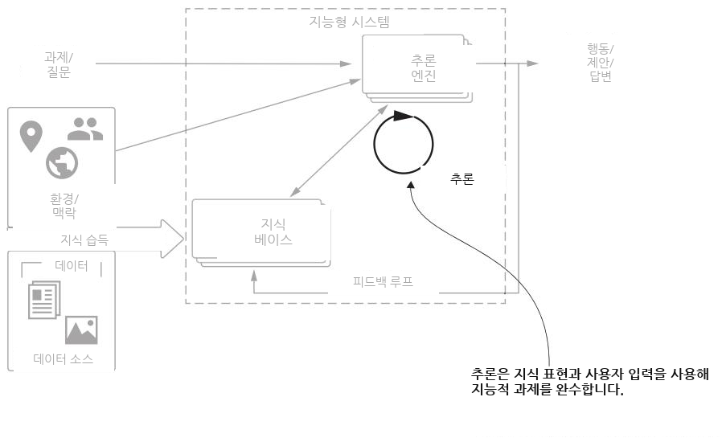

그림 2.8 추론은 하나 이상의 지식 베이스를 사용해, 지능형 시스템이 최종 사용자를 위해 수행하도록 설계된 과제들을 완수합니다.

#### 연역적 추론과 귀납적 추론 — 확실한 결론 대 위험한 일반화

**연역적 추론(deductive reasoning)** 은 추론의 기본적인 형태입니다. 일반적인 진술 또는 가설에서 출발해, 여러 가능성을 따져 구체적이고 논리적인 결론에 도달합니다. 예를 들어 다음 추론을 봅시다. "모든 사람은 죽는다. Alessandro는 사람이다. 따라서 Alessandro는 죽는다." 연역적 추론에서는 가설이 반드시 옳아야 합니다. 여기서는 "모든 사람은 죽는다"와 "Alessandro는 사람이다"라는 전제가 참이라고 가정합니다. 따라서 그 결론은 논리적이며 참입니다.

**귀납적 추론(inductive reasoning)** 은 구체적인 관찰들로부터 폭넓은 일반화를 이끌어냅니다. 현실의 표본을 담은 데이터에서 출발해 결론을 도출합니다. 예를 들어 "주머니에서 꺼낸 동전은 1센트짜리(페니)다. 두 번째와 세 번째로 꺼낸 동전도 페니다. 따라서 주머니 안의 모든 동전은 페니다." 여기서 주의할 점은, 원래 진술의 전제가 모두 참이더라도 귀납적 추론은 거짓 결론으로 이어질 수 있다는 것입니다. 다음 예를 봅시다. "Harold는 할아버지다. Harold는 대머리다. 따라서 모든 할아버지는 대머리다." 이 경우 결론은 진술들로부터 논리적으로 따라 나오지 않습니다.

ChatGPT 같은 도구들이 사람의 대화를 흉내 낼 수 있다 보니, 사람들은 흔히 이들이 폭넓은 추론 능력을 지녔다고 생각합니다. 간단한 예를 하나 살펴봅시다. 우리는 우리의 가정을 검증하기 위해, LLM이 구동하는 최고의 "추론" 도구 중 하나인 Claude.ai(https://claude.ai)를 사용했습니다.

> **참고** 우리가 테스트한 Claude.ai 버전은 3.5 Sonnet입니다. 개선 속도를 감안하면, 이 책이 인쇄될 무렵 같은 실험을 돌리면 다른 결과가 나오리라고 거의 확신합니다.

우리는 다음 프롬프트를 사용했습니다.

```text
리스팅 2.1 추론 능력을 확인하기 위한 프롬프트
A farmer stands at the side of the river with a sheep. There is a boat with
enough room for one person and one animal. How can the farmer get himself and
the sheep to the other side of the river using the boat in the smallest
number of trips?
```

우리가 이 예시를 고른 이유는, 이것이 잘 알려진 문제(농부와 양에 더해 늑대와 양배추 한 통이 등장하는 문제)의 더 단순한 변형이고, LLM을 학습시킨 훈련 데이터에 이와 비슷한 예시가 많이 포함되었으리라 확신하기 때문입니다. 그래서 우리는 확률적 추론 엔진이 우리가 실제로 물은 것을 "이해"하기보다, 그 완전한(늑대·양배추가 있는) 문제 쪽으로 방향을 틀 것이라고 예상했습니다. 답변은 우리의 가정을 확인시켜 주었습니다. 그림 2.9는 Claude.ai의 결과를 캡처한 것입니다.

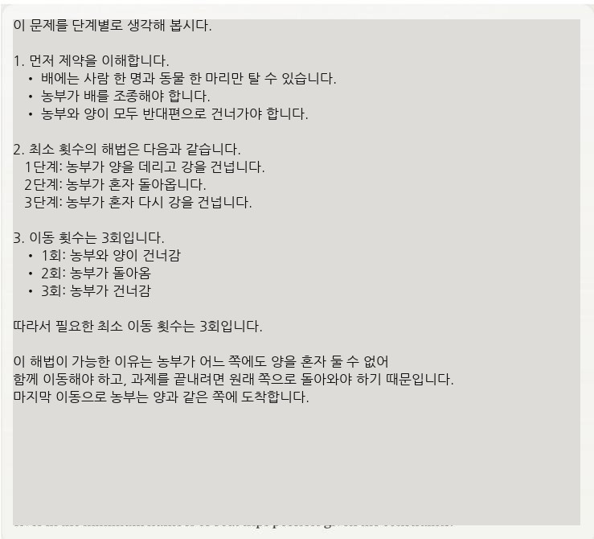

그림 2.9 리스팅 2.1의 내용을 프롬프트로 입력했을 때 Claude.ai가 내놓은 결과.

이 답변에는 몇 가지 추론상의 문제가 있습니다. 농부가 양 없이 강을 왔다 갔다 하는 것은 아무 의미가 없습니다. 문제는 1단계 이후에 이미 완전히 풀렸는데도, 문제 서술이 Claude.ai의 학습에 쓰인 데이터 소스 속 문제와 매우 비슷하지만(똑같지는 않지만) 보니, 제안된 해법이 "확률적으로" 가장 가까운 쪽으로 흘러간 것입니다.

이 예시는 특정 유형의 추론에서 LLM이 지닌 한계를 잘 보여 줍니다. Wu 등 [4]은 코딩에서 그림 그리기, 논리에서 공간 추론, 체스에서 산술에 이르기까지 서로 다른 11개 과제로 이루어진 묶음을 테스트했습니다. 그들은 반사실적(counterfactual) 변형 — 기본값이나 잘 알려진 과제에서 벗어난 경우, 이를테면 늑대와 양배추가 빠진 농부와 양 문제 같은 것 — 에서 흥미로운 성능을 관찰했지만, 기본 조건에 비해 성능이 상당히 그리고 일관되게 저하되는 것을 발견했습니다. 현재의 LLM이 어느 정도 추상적인 과제 해결 능력을 지니고 있긴 하지만, 이들은 흔히 좁고 전이되지 않는 절차에 의존합니다.

따라서 앞서 말했듯이, KG와 LLM은 서로 다른 유형의 추론을 위한 토대가 될 수 있으며, 지능형 시스템 안에서 서로를 보완합니다. 우리는 정밀하고 규칙 기반의 추론과 명시적 지식 표현이 필요한 과제에는 KG를, 패턴 인식·맥락 이해·모호하거나 불완전한 정보 처리·그래프 구조와 거기서 파생된 지표에 대한 추론이 필요한 과제에는 LLM을 사용할 수 있습니다. 다만 두 접근법 중 어느 쪽도 인간에 견줄 만한 상식적 추론 능력을 본질적으로 갖추고 있지는 않으며, 이들은 사람에게는 당연할 직관적 도약을 하거나 암묵적 맥락을 이해하는 데 흔히 실패합니다. 이러한 한계는, 지능형 시스템을 설계하고 나아가 강력한 하이브리드 IAS를 개발할 때 각 접근법의 강점과 약점을 신중히 고려하는 일이 얼마나 중요한지를 강조해 줍니다.

---

### 2.5 추론 엔진 — 지식 베이스와 피드백 루프

이제 지식 베이스와 추론 엔진이 지능형 시스템 개발에서 어떻게 상호작용하는지 살펴보기 위해 우리의 프레임워크를 확장해 봅시다(그림 2.10 참조). 그림에 표현된 추론 엔진은 일반형입니다. 즉 연역적·귀납적 등 한 가지 유형의 추론만 쓸 수도 있고, 여러 추론 전략을 조합해 쓸 수도 있습니다. 중요한 점은, 이 엔진이 지식 베이스에서 읽기만 하는 게 아니라 거기에 다시 쓰기도 한다는 것입니다. 엔진이 만들어낸 조치(또는 제안)는 환경에 영향을 주고, 그 환경은 다시 새로운 관찰을 만들어 냅니다. 이 관찰들을 추론 엔진이 처리해 새로운 지식을 쌓고, 그것이 이어지는 조치나 제안을 이끕니다. 이 **피드백 루프(feedback loop)** 는 반복적인 과정을 만들어 내며, 그 안에서 시스템은 환경 변화에 대응하는 능력을 끊임없이 향상시킵니다.

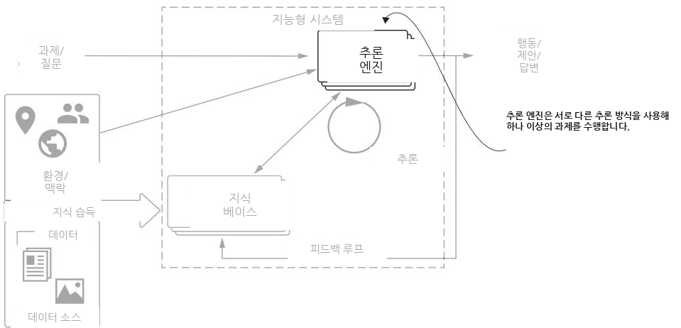

그림 2.10 서로 다른 유형의 추론 전략을 지닌 여러 추론 엔진이, 지능형 시스템을 구현하는 데 필요한 과제들을 함께 수행하는 데 기여할 수 있습니다.

#### 2.5.1 순수 연역적 추론 엔진의 한계 — 완벽한 지식 베이스라는 비현실적 전제

자동화된 의료 진단이라는 맥락에서 연역적 추론 과정을 적용하는 예를 살펴봅시다. 한 환자가 가상의 의사, 즉 우리의 지능형 시스템을 찾아왔다고 상상해 보세요. 시스템은 병을 진단하고 치료 방향을 제안하기 위해 일련의 조치(예: 의학 검사, 치료, 질문)를 제안해야 합니다.

이 조치의 순서는 지식 베이스를 사용해 계산됩니다. 이 지식 베이스에는 가능한 조치들의 비용과 결과, 질병과 증상 사이의 확률적 관계, 그리고 환자의 선호에 관한 정보가 담겨 있습니다. **연역적 추론기(deductive reasoner)** 는 지식 베이스가 필요한 모든 데이터를 부호화하고 있을 때, 최적의 조치를 논리적으로 추론해낼 수 있습니다. 이런 이상적인 시나리오에서는 연역적 추론기가 다른 추론 방법보다 더 뛰어난 성능을 낼 수 있습니다.

하지만 연역적 추론의 큰 한계는, 매우 완전하고 정확한 지식 베이스를 요구한다는 점입니다. 그런 지식 베이스는 현실에서 좀처럼 구하기 어렵습니다. 그림 2.11에서는 데이터 소스를 의사결정을 이끄는 논리적 진술로 변환함으로써 지식 베이스가 구성됩니다.

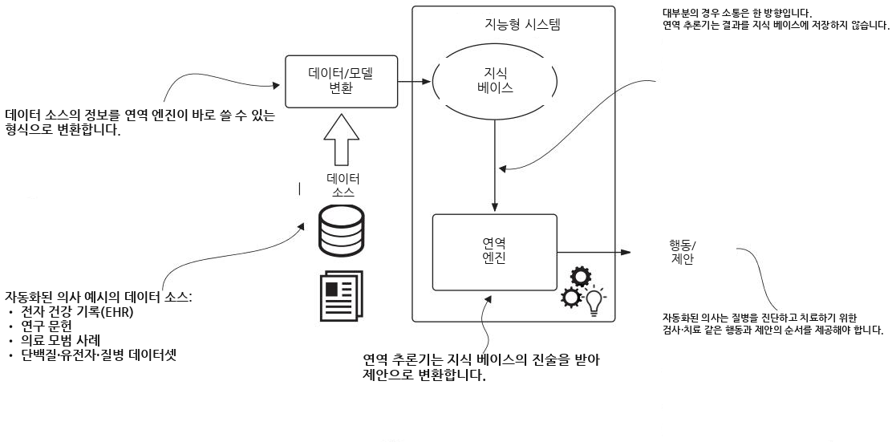

그림 2.11 연역적 추론기. 지식 베이스는 데이터 소스를 변환해 만들어집니다. 연역적 추론기는 지식 베이스의 일부에 적용되는 논리적 진술을 사용해 행동하거나 제안을 제공합니다.

#### 2.5.2 귀납적 추론과 ML 활용하기 — 불확실성 아래에서의 일반화

ML이 구동하는 귀납적 추론은 순수 연역적 추론의 한계 중 일부를 해결합니다. 귀납적 추론은 두 가지 핵심 방식으로 시스템을 강화할 수 있습니다.

- 관련 온톨로지와 관계를 학습하고 구축함으로써, ML은 지식 베이스를 확장해 더 넓은 범위의 사례를 다룰 수 있게 합니다.
- 불확실성 아래에서의 추론을 제공함으로써, ML은 시스템이 불완전한 데이터로부터 일반화하고, 모든 정보가 갖춰지지 않았을 때도 예측을 내리게 합니다.

그림 2.12는 귀납적 추론기가 어떻게 작동하는지를 보여 줍니다. 첫 번째 단계는 원시 데이터를 흔히 ML 알고리즘의 도움을 받아 구조화된 형식으로 변환합니다. 예를 들어 LLM이 구동하는 **자연어 처리(natural language processing, NLP)** 는 비구조화 텍스트를 지식 베이스에 통합할 수 있는 구조화된 데이터로 변환합니다. 이 단계는 KG를 생성하거나 확장하는 데 기여할 수 있습니다. 두 번째 단계는 이 지식을 사용해 예측을 수행합니다.

이 과정은 예컨대 자연어 처리를 이용해 연구 논문, 보고서, 그 밖의 텍스트 소스를 변환하고, 개체와 관계를 추출할 수 있습니다.

지식 베이스를 만들려면 추론 엔진이 데이터를 처리해 예측 모델을 만들고, 일반화하거나, 더 복잡한 추론 엔진의 필요에 맞게 모델을 조정해야 합니다.

추론 엔진은 원래의 지식으로부터 추상화하고 일반화할 수 있어, 가능한 모든 정보가 갖춰지지 않았을 때도 행동하거나 제안을 제공할 수 있습니다.

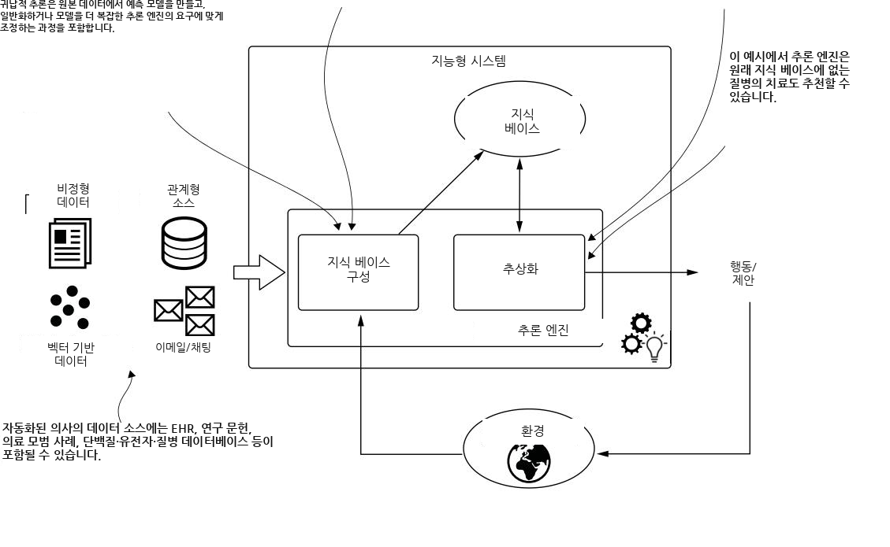

- 단백질, 유전자, 질병 데이터베이스

그림 2.12 귀납적 추론기. 지식 베이스를 구성하는 데는 더 많은 노력이 들며, 단순한 변환이 아닙니다. 이 추론 엔진은 지식 베이스로부터 추상화하고, 어느 정도의 불확실성 아래에서도 작동할 수 있습니다.

(앞 문단에서 이어집니다) 그런 다음 귀납적 추론을 통해 예측을 하거나 조치를 생성하는데, 귀납적 추론은 확보된 관찰들로부터 패턴을 추상화합니다.

전통적인 ML 방식에서는 이 과정을 위해 지식 베이스에서 특징(feature)을 수동으로 골라 예측 모델을 학습시켜야 하는 경우가 많습니다. 이는 지루한 작업이고, 특히 복잡한 도메인에서는 때때로 실현 불가능한 일이기도 합니다.

#### 2.5.3 추론 엔진에서 LLM의 역할 — 지식의 빈틈을 메우는 확률적 추론

완전한 지식 베이스와 명시적 규칙을 요구하는 순수 연역적 시스템과 달리, LLM은 확률적 추론 능력을 이용해 결정적인 정보가 빠져 있을 때도 맥락적으로 적절한 제안을 만들어낼 수 있습니다. 어떤 환자가 스트레스에서부터 심각한 신경학적 질환에 이르기까지 무엇이든 시사할 수 있는 비특이적 증상을 보이며 찾아온 의료 시나리오를 떠올려 보세요. 전통적인 연역적 추론은 이렇게 모호한 양상, 특히 환자 기록이 불완전할 때 애를 먹습니다. 하지만 LLM은 방대한 의학 문헌에서 배운 패턴을 끌어와, 여러 진단 가능성을 동시에 평가할 수 있습니다. LLM의 강점은 **불확실성을 안고 확률적으로 추론하는 능력**에 있습니다. LLM은 확보된 데이터를 바탕으로 서로 다른 질환의 가능성을 저울질할 수 있고, 하나의 확정적인 답을 내놓기보다 우선순위가 매겨진 진단 접근법을 권고할 수 있습니다.

이러한 확률적 추론 능력 덕분에 LLM은 순수 연역적 추론 과정이라면 멈춰 버릴 지식의 빈틈을 메울 수 있습니다. KG 기반 추론 엔진과 통합되면, LLM은 모호한 입력을 해석하고, 복잡한 의사결정 시나리오에 내재된 불확실성을 감안한 섬세한 권고를 제공하는 추론 계층으로 작동합니다. 이 하이브리드 접근법은 정보가 흔히 불완전하거나 불확실한 실제 환경에서도 IAS가 효과적으로 기능할 수 있게 해줍니다.

---

### 2.6 IAS에 대한 KG 접근법 — 상향식의 함정과 목적 주도 방식

KG는 IAS 개발에서 어디에 자리 잡을까요? 짧게 답하면, **모든 곳**입니다. 최근 몇 년간 학계와 산업계는 KG를 구조화된 인간 지식의 한 형태로 폭넓게 활용해 왔습니다 [5–8]. 이 그래프 기반 표현에 더해, KG에서 통찰을 이끌어내기 위한 여러 추론·분석 알고리즘도 고안되었습니다.

그래프를 이용해 의사결정 과정을 뒷받침한다는 발상은 새로운 것이 아닙니다. Stokman과 de Vries [9]는 지식 기반 시스템을 이용하면, 전문 지식의 범위가 제한된 전문 사용자에게 조언하는 컴퓨터 프로그램을 만들 수 있으리라고 일찍이 내다보았습니다. 이 맥락에서 그들은 "지식을 그래프로 구조화하는 일은, 서로 다른 소스의 지식을 통합하는 지식 기반 시스템을 구축하는 것으로 볼 수 있다"라고 추측했습니다 [9].

최근 몇 년 사이 KG는 분산된 데이터 소스들을 하나의 연결된 진실의 원천으로 합치는 표준적인 접근법이 되었습니다 [10]. 그리고 생성형 AI와 LLM의 등장과 함께, KG는 여러 이점 가운데서도 특히 환각(hallucination)을 완화하고 최신 데이터를 제공할 수 있습니다 [11].

하지만 KG를 단지 지식의 집계자(aggregator)로만 보는 것은, 애초에 KG가 도입된 목표, 즉 지능형 시스템을 구축한다는 목표를 간과하는 것입니다. 우리는 이렇게 데이터부터 쌓아 올리는 방식을 KG 구축의 **상향식(bottom-up) 접근법**이라 부릅니다. 이 방식은 여러 소스에서 온 데이터로 시작해, 그 데이터를 하나의 진실의 원천으로 통합한 뒤, 발견(discovery) 과정을 개시합니다. 최종 사용자가 무엇을 찾는지에 대한 아무런 생각 없이, 데이터가 알아서 이야기를 들려주기를 기대하는 것입니다. 그림 2.13은 이 접근법을 요약합니다.

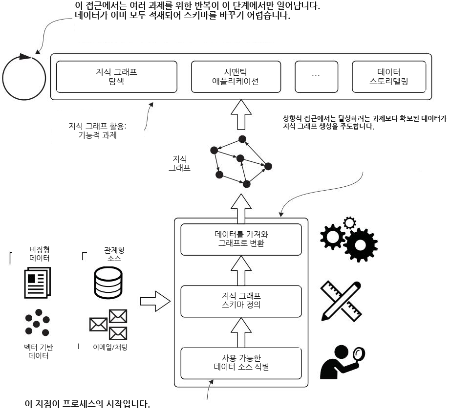

그림 2.13 KG 생성의 상향식 접근법. 우리가 달성하려는 기능적 과제를 먼저 고려하는 대신, 모든 데이터를 가져오는 데서 시작합니다.

우리의 경험에 따르면, 이 상향식 접근법은 흔히 KG 도입의 실패로 이어집니다. 데이터 소스가 너무 많고 저마다 구조와 식별자가 다르며, 그 데이터를 하나의 동질적인 구조로 정규화하는 데 상당한 노력이 듭니다. 게다가 내용의 상당 부분은 특정 과제에만 해당하는 것이어서 전역적 사고에는 관련이 없습니다.

지능적 에이전트를 개발하려면, 지식을(우리 경우에는 KG로) 효과적이고, 에이전트가 작동해야 할 도메인의 내재적 복잡성을 포착하고 다룰 수 있는 방식으로 표현해야 합니다. 이 접근법은 확보된 데이터가 아니라 비즈니스 목표에 의해 추동되어야 합니다. 정립된 ML 프로젝트 방법론인 **CRISP-DM** [12]을 기반으로, 우리는 KG 구축을 위한 **목적 주도(purpose-driven) 접근법**을 사용할 수 있습니다. 그림 2.14는 이 과정에서 KG가 어떻게 중심 지식 표현으로 기능하는지를 보여 줍니다.

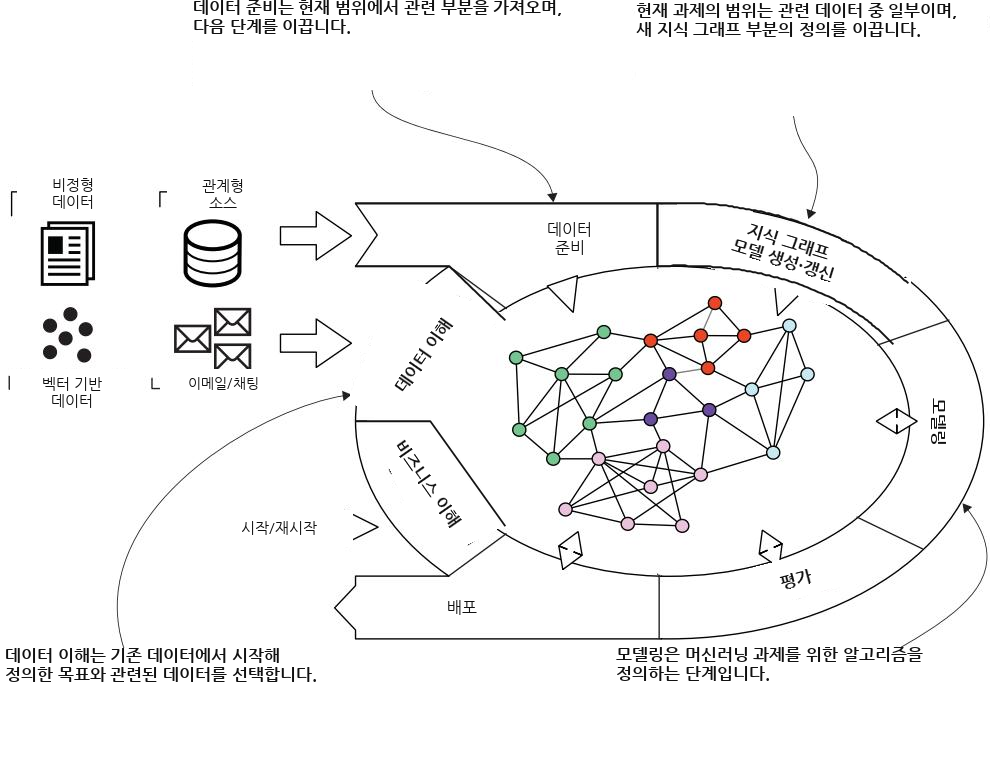

그림 2.14 KG 플랫폼에 적용한, 재해석된 CRISP-DM. KG는 지능형 시스템의 지식 베이스 모델로 사용되며, 재해석된 CRISP-DM 과정의 중심에 놓입니다.

이 접근법은 모든 것이 **비즈니스 이해(business understanding)** 에서 출발한다는 점을 강조합니다. 이 목표가 데이터 이해를 이끌어, 확보 가능한 모든 데이터 소스를 무작정 가져오는 대신 우리가 필요로 하는 데이터의 특정 부분에 집중하게 해줍니다. 이것이 KG의 내용과 구조를 정의하기 위한 요구사항을 결정합니다. 이 맥락에서 KG는 우리가 필요로 하는 데이터를 복사하고 변환한, 자족적이고(self-sufficient) 도메인 특화되며 맞춤 설정 가능한 진실의 원천을 나타냅니다. 습득 단계에서 LLM은 비구조화 데이터로부터 관련 개체와 관계를 추출하고, 감성 분석이나 주제 식별 같은 일반적 이해를 제공합니다.

**모델링(modeling) 단계**에서 우리는 구체적인 목표에 도달하기 위해 하나 이상의 알고리즘을 사용하고 시험합니다. 그다음 단계에서 그 결과를 평가합니다. LLM은 사용자의 질문을 이해하고 자연어로 답을 제공하기 위해 KG 위에서 추론하는 데 참여할 수 있습니다. 이 두 단계의 산출물은 일련의 알고리즘, 일련의 학습되거나 사전 학습된 모델, 그리고 시험 내용과 학습된 모델들의 전반적 품질을 기술한 보고서로 구성됩니다.

모든 것이 잘 진행되면, 우리는 그래프 스키마와 모델, 수집(ingestion) 및 후처리 파이프라인, 알고리즘, 예측 모델을 하나의 제품으로 통합한 뒤 배포합니다. 그러면 새로운 라운드가 시작될 수 있는데, 이번에는 빈 KG에서 출발하지 않습니다.

> **정의** 예측 모델(predictive model)이란, 관심 있는 미지의 값 — 목표값(target) — 을 추정하기 위한 공식입니다. 이는 훈련 데이터셋에 대한 학습 과정의 결과를 효율적인 형식으로 나타낸 것이며, 우리는 실제 예측을 수행하기 위해 이 모델에 접근합니다.

두 번째 라운드에서 우리는 차이(difference)와 확장(extension)의 방식으로 작업하며, 이전 반복의 결과가 훼손되지 않도록 보장합니다. 그래프의 **스키마리스(schemaless)** 접근법은 기존 데이터와 기능을 손상시키지 않으면서 새로운 노드와 관계 유형으로 확장하는 것을 가능하게 합니다.

> **정의** 스키마리스(schemaless)란, 데이터 항목이 어떻게 형식화되고 서로 어떻게 관련되는지에 대한 제약이 더 적거나(혹은 전혀 없이) 데이터베이스나 일반적인 데이터 구조에 데이터를 저장할 수 있는 유연성을 가리킵니다. 그래프 데이터베이스는 그 요소(노드와 관계)와 속성이 사실상 무엇이든 저장할 수 있기 때문에 일반적으로 스키마리스로 간주됩니다.

이 책에서 우리는 시나리오와 사용 사례 사이의 과정을 이끌기 위해 스키마를 자주 사용합니다. 이 스키마들은 여러 용도로 재활용되며, 서로 다른 단계들이 이 과정이 실제로 어떻게 작동하는지를 보여 주는 예시로 강조됩니다.

---

#### 요약 — 이 장의 핵심 정리

- 지능이란 근본적으로 지식을 습득하고 적용하는 것에 관한 것이며, 그래서 지식 표현과 추론이 지능형 시스템 아키텍처의 핵심 구성 요소가 됩니다.
- 지능형 시스템은 독립적으로 행동하는 자율 시스템과, 인간의 의사결정을 지원하는 자문 시스템으로 분류됩니다.
- 지식 습득 방식은 KG와 LLM 사이에서 다릅니다. KG는 도메인 전문성을 요구하지만 해석 가능성을 제공하는 명시적·구조화된 표현을 사용하는 반면, LLM은 언어 이해를 포착하지만 투명성이 부족한 암묵적 통계 패턴을 사용합니다.
- KG와 LLM을 결합한 하이브리드 시스템은 둘의 상호 보완적 강점을 활용합니다. KG는 구조화된 추론과 명시적 지식을 제공하고, LLM은 모호성·맥락·자연어 이해를 다룹니다.
- LLM은 지식의 빈틈을 메우고 맥락적 해석을 제공함으로써 추론 엔진을 강화하며, 이를 통해 지능형 시스템이 불완전하거나 모호한 정보 속에서도 더 견고하게 작동하도록 만듭니다.
- 비즈니스 목표에서 출발하는 목적 주도 KG 개발은, 흔히 프로젝트 실패로 이어지는 상향식 데이터 통합 전략보다 더 효과적입니다.

---

## 핵심 용어 해설

| 용어 (영문) | 뜻풀이 |
| --- | --- |
| 지식 그래프 (Knowledge Graph, KG) | 검증된 사실을 노드(개체)와 간선(관계)으로 명시적으로 표현한 데이터 구조. 사람과 기계 모두 직접 해석·수정 가능. |
| 대규모 언어 모델 (Large Language Model, LLM) | 방대한 텍스트를 학습해 언어를 이해·생성하는 모델. 지식을 벡터 공간의 매개변수로 암묵적으로 저장하며 불투명함. |
| 지식 표현 (Knowledge representation) | AI 시스템이 도메인 정보를 구조화·부호화·전달하는 데 쓰는 "언어". 시스템의 능력과 한계를 좌우함. |
| 추론 (Reasoning) | 정보를 분석하고 규칙을 적용해 증거·전제로부터 결론을 이끌어내는 인지 과정. |
| 연역적 추론 (Deductive reasoning) | 일반 전제에서 출발해 구체적·논리적 결론에 도달. 전제가 참이면 결론도 참. |
| 귀납적 추론 (Inductive reasoning) | 구체적 관찰에서 폭넓은 일반화를 이끌어냄. 전제가 참이어도 결론이 거짓일 수 있음. |
| 지능형 자문 시스템 (Intelligent Advisory System, IAS) | 정보와 권고를 제공하되 최종 결정은 사용자가 내리는 시스템. 이 책의 주된 초점. |
| 지능형 자율 시스템 (Intelligent autonomous system) | 사용자를 대신해 독립적으로 판단·실행하는 시스템(예: 자율주행차). |
| 지식 습득 (Knowledge acquisition) | 데이터 소스·환경·전문가로부터 정보를 수집해 구조화된 지식으로 변환하는 과정. |
| 도메인 전문가 (Domain expert) | 데이터의 의미와 개체 간 관계를 이해하도록 돕고 결과를 평가하는 전문가. |
| 개체 (Entity) | KG에서 노드로 표현되는 대상. 개체 간 관계는 간선으로 표현됨. |
| 스키마리스 (Schemaless) | 데이터 형식·관계에 제약이 적거나 없는 저장 방식의 유연성. 그래프 DB의 특성. |
| 예측 모델 (Predictive model) | 미지의 목표값을 추정하는 공식. 훈련 데이터에 대한 학습 결과를 효율적으로 나타냄. |
| CRISP-DM | 정립된 ML/데이터 마이닝 프로젝트 방법론. 비즈니스 이해에서 출발하는 목적 주도 KG 구축의 토대. |
| 피드백 루프 (Feedback loop) | 조치→환경 변화→새 관찰→새 지식→새 조치로 이어지는 반복적 개선 순환. |
| 자연어 처리 (Natural Language Processing, NLP) | 비구조화 텍스트를 구조화된 데이터로 변환하는 기술. LLM이 구동함. |
| 상향식 접근법 (Bottom-up approach) | 목적을 먼저 정하지 않고 모든 데이터부터 통합하는 KG 구축 방식. 흔히 실패로 이어짐. |
| 목적 주도 접근법 (Purpose-driven approach) | 비즈니스 목표가 데이터 이해와 KG 구조를 이끄는 구축 방식. |
| 환각 (Hallucination) | LLM이 사실이 아닌 내용을 그럴듯하게 지어내는 현상. KG가 이를 완화할 수 있음. |

---

## 참고문헌 (References)

원문의 인용 번호 [1]–[12]는 본문에 그대로 유지되어 있으며, 상세 서지 정보는 원서의 참고문헌 목록을 따릅니다.

- [1] Geoff Hulten, 지능형 시스템의 정의 관련
- [2] 지능형 자율 시스템 대 지능형 자문 시스템 분류
- [3] Alessandro Negro, *Graph-Powered Machine Learning*
- [4] Wu 등, LLM의 반사실적 과제 성능 평가
- [5]–[8] KG를 구조화된 인간 지식으로 활용한 학계·산업계 연구
- [9] Stokman & de Vries, 지식 기반 시스템과 그래프 구조화
- [10] 분산 데이터 소스를 단일 진실의 원천으로 병합하는 KG
- [11] 생성형 AI·LLM에서 KG의 환각 완화 및 최신 데이터 제공
- [12] CRISP-DM 방법론
