# 구조화된 데이터 소스에서 지식 그래프 구축하기


이 책의 이 부분은 서로 다른 구조화된 데이터 소스로부터 지식 그래프 (knowledge graph, KG)를 구축하는 복잡하지만 필수적인 과정을 다룹니다. 이는 비정형 정보로 지식 그래프를 풍부하게 하고 대규모 언어 모델 (large language model, LLM)과 결합하기 전에 필요한 근본적인 단계입니다. 조직은 방대한 데이터 저장소를 유지하며, 각각은 고유한 스키마, 구조, 저장 형식을 가지고 있습니다. 과제는 이 데이터의 의미론적 의미와 관계를 보존하면서 이를 일관된 지식 그래프로 조화시키는 것입니다. 우리는 이 과정을 안내하면서 다양한 구조화된 데이터 소스를 통합된 지식 표현으로 변환하는 방법을 보여줍니다.

핵심 주제는 데이터 품질과 검증의 중요성입니다. 이는 하위 응용의 품질이 기반이 되는 지식 표현의 신뢰성에 달려 있기 때문입니다. 데이터 무결성을 확인하고, 정확한 엔터티 매칭 (entity matching)을 보장하며, 지식 그래프의 의미론적 정확성을 검증하는 방법을 배우게 됩니다.

3장에서는 의료 사례를 제시하며, 환자 증상을 기반으로 임상의가 희귀 질환을 진단하는 데 도움이 되는 지식 그래프를 구축합니다. 이 장은 온톨로지 (ontology)를 통한 의미론적 통합과 같은 기본 개념을 소개하고, 지식 그래프 기술을 비교하며, 실습 중심의 구현 지침을 제공합니다.

4장에서는 단순한 네트워크에서 생의학 응용 전반에 걸친 포괄적인 다중 소스 통합으로 나아가는 발전 과정을 탐구합니다. 이 장은 커뮤니티 탐지 (community detection) 알고리즘과 도메인 특화 지표를 포함한 고급 분석 방법론을 보여주며, 결과 해석과 의사결정 지원을 위한 대규모 언어 모델의 통합을 소개합니다.

이 장들의 예시는 지식 그래프 구축의 기술적 측면을 보여줄 뿐만 아니라, 이러한 원칙이 어떤 도메인에서든 실제 문제를 해결하는 데 어떻게 적용될 수 있는지도 설명합니다.

### 온톨로지로부터 첫 번째 지식 그래프 만들기

### 이 장에서 다루는 내용


사용 사례에 기반하여 최적의 KG 기술 선택하기

 임상의의 활동을 지원하기 위한 KG 구축하기

KG 위에서 분석 및 온톨로지 기반 추론 수행하기

KG 구축은 형식(XML, CSV, JSON), 저장 기술(관계형 또는 문서 지향), 정보 구문(예: 2022-08-09 또는 2022년 8월 9일), 특히 데이터의 의미가 서로 다른 데이터 소스로부터 정보를 추출하고 통합해야 하므로 복잡합니다. 예를 들어 의료 분야에서는 동일한 개념을 식별하는 다양한 표현(type 2 diabetes와 ketosisresistant diabetes), 서로 다른 개념을 정의하는 동일한 약어(PE가 physical examination 또는 pulmonary embolism을 의미하는 경우), 정보의 세분성(necrosis 또는 lobular necrosis)이 데이터 통합의 장애물이 됩니다.

KG를 구축할 때 우리는 다양한 소스의 데이터를 통합적이고, 탄탄한 근거를 갖추며, 의미 있는 표현으로 나타내는 것을 목표로 합니다. 이때 개별 정보 조각들은 일관된 관점으로 통합됩니다. 데이터 의미와 관련된 문제는 의미론적 통합 (semantic integration)을 사용하여 해결할 수 있습니다. 일반적인 전략은 하나 이상의 온톨로지를 들어오는 데이터에 대한 참조 스키마와 어휘로 채택하는 것입니다. 온톨로지를 사용하면 데이터 안에 기술된 엔터티 간의 공식 명칭, 속성, 범주, 관계와 같은 요소를 포함하는 표준 어휘를 사용하여 데이터를 모델링할 수 있습니다.

온톨로지는 의미론적으로 이질적인 정보 사이의 중개자 역할을 합니다. 매핑 (mapping)은 데이터 소스의 로컬 스키마를 온톨로지의 참조 스키마와 연결합니다. 각 데이터 요소를 온톨로지가 표현하는 개념에 매핑할 수 있으며, 이러한 주석 (annotation)은 서로 다른 출처의 데이터 요소들을 한데 모읍니다.

이 장은 참조 온톨로지를 사용하여 KG를 구축하기 위한 지침을 제공하며, 임상의가 희귀 질환을 식별하도록 돕는 데 초점을 맞춥니다. 우리는 데이터 이해와 준비, 인간 표현형 온톨로지 (Human Phenotype Ontology, HPO; https://hpo.jax.org/app/) 및 HPO로 주석 처리된 데이터셋의 수집과 처리를 강조합니다. HPO 소스는 질병과 그에 관련된 표현형 이상 사이의 연결에 관한 정보를 제공합니다. 이러한 이상은 전형적인 인간 특성에서 벗어나는 관찰 가능한 신체적 또는 생화학적 특징을 나타내며, 유전적 돌연변이, 환경적 영향 또는 이 둘의 조합에서 비롯될 수 있습니다. 또한 우리는 KG 기술 간의 차이를 살펴보고 가장 적합한 선택지를 고르기 위한 청사진을 제공합니다. 마지막으로, 희귀 질환 진단에서 임상의를 지원하기 위해 온톨로지 기반 추론을 포함한 일련의 분석을 개괄합니다.

그림 3.1은 이 장을 이해하기 위한 개념적 모델을 제공합니다. 중앙에는 예시 맥락에서 KG를 생성하는 단계가 표시되어 있으며, 하단에는 여러 시나리오에서 사용할 수 있는 KG 구축을 위한 추상적 파이프라인이 제시되어 있습니다. 이 파이프라인의 구성 요소는 2장에서 소개된 CRISP-DM 모델의 한 버전에서 가져온 것입니다(그림 3.2에 다시 표시됨).

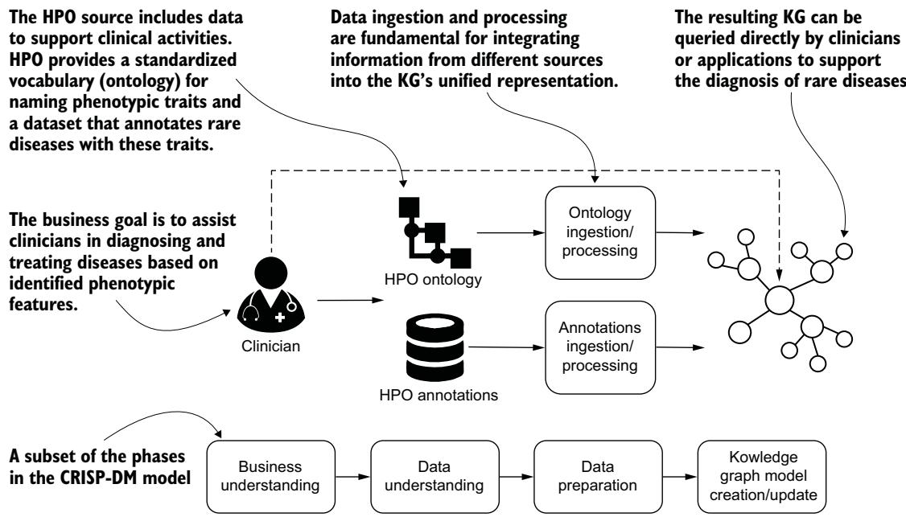  
그림 3.1 비즈니스 목표 이해에서 임상의의 활동을 지원하는 지식 그래프 질의 정의에 이르기까지, CRISP-DM 모델의 구체화로서 지식 그래프 구축 과정에 대한 정신 모델

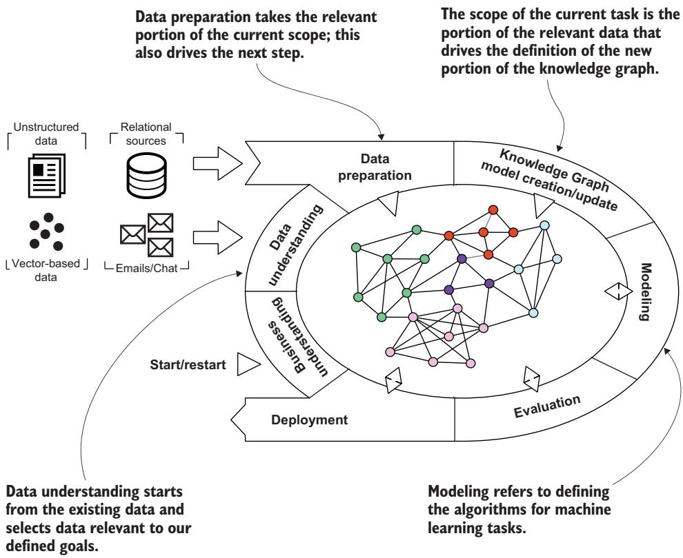  
그림 3.2 지식 그래프에 맞게 조정된 CRISP-DM 모델. 비즈니스 이해, 데이터 이해, 데이터 준비, 지식 그래프 모델 생성/업데이트를 포함한 이러한 구성 요소의 하위 집합은 이 장에서 설명하는 핵심 단계입니다.

### 3.1 지식 그래프 구축: 준비 운동


KG를 생성하기 전에, 해결하고자 하는 문제를 분석하고, 응용 도메인의 개요를 구축하며, 데이터를 탐색합니다.

#### 3.1.1 비즈니스 및 도메인 이해


우리 KG의 대상 페르소나는 임상의입니다. 임상의는 질병을 진단하고 치료하는 의료 전문가입니다. 임상의가 수행하는 가장 복잡한 활동 중 하나는 증상(표현형 특성)을 바탕으로 질병을 정확히 식별하는 것이며, 특히 희귀 증후군의 경우 더욱 그렇습니다(그림 3.3 참조).

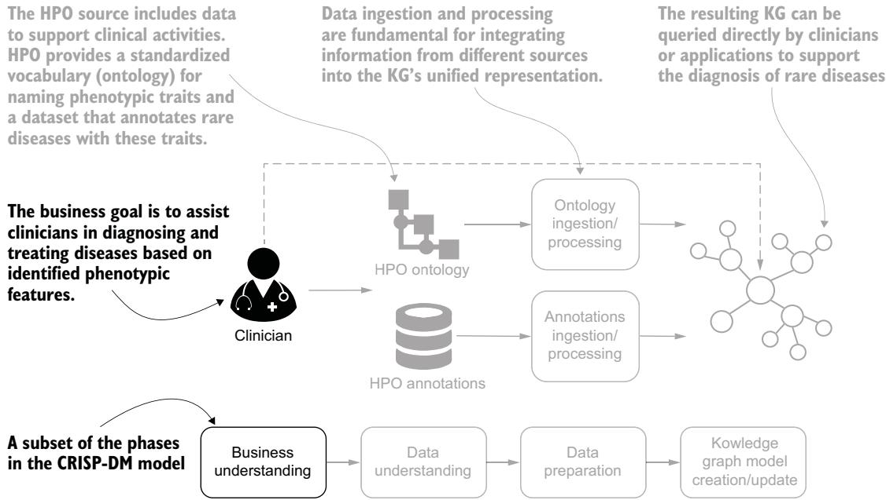  
그림 3.3 임상의의 활동을 지원하는 KG를 만들기 위한 비즈니스 도메인 이해. 이 단계는 기술적 측면과 엄밀히 관련되어 있지는 않지만, 다음 단계들을 위해 근본적으로 중요합니다.

진단에 도달하기 위해 특정 검사를 처방하는 것 외에도, 임상의는 이용 가능한 정보로 구성된 구조화된 지식 베이스를 사용할 수 있습니다. 이는 다음 두 가지 특징을 가져야 합니다.

표현형 도메인에 대한 맥락적 설명—예를 들어, 동일한 기관이나 시스템과 관련된 표현형 이상은 명시적으로 연결되어야 합니다.

표현형 이상과 질병 간의 관계를 설명하는 데이터. 임상의가 연결의 출처에 접근할 수 있도록 이 정보는 추적되어야 합니다.

우리는 이러한 특징을 통합한 KG를 구축하고자 합니다. 응용 도메인을 더 잘 이해하기 위해, 몇 가지 정의를 제시합니다.

정의 질병을 가진 개인의 표현형은 그 개인에게서 발현되는 모든 표현형 특징의 총합이라고 할 수 있습니다 [1].

정의 질병은 (1) 특정 상태에 대한 일련의 원인, (2) 시간적 경과, (3) 표현형 특징의 집합, (4) 특정 치료에 대한 특징적 반응으로 특징지어지는 엔터티입니다.

예를 들어, 감기는 발열과 피로를 포함한 뚜렷한 표현형 특징으로 특징지어집니다. 시간적 경과는 며칠에서 일주일 정도까지이며, 아스피린과 같은 치료는 회복을 지원할 수 있습니다.

그러나 임상의의 업무에는 불명확한 영역도 포함됩니다. 예를 들어, 당뇨병은 질병으로 분류될 수도 있고 다른 희귀 증후군의 표현형 특징으로 분류될 수도 있습니다(그림 3.4 참조). 우리는 이러한 종류의 불확실성을 임상의가 다루도록 어떻게 도울 수 있는지에 대한 예로 이 사용 사례를 다룰 것입니다.

제1형 당뇨병은 질병으로도, 표현형 특징으로도 간주될 수 있습니다. 두 경우를 구분하기 위해 서로 다른 두 ID가 사용됩니다.  
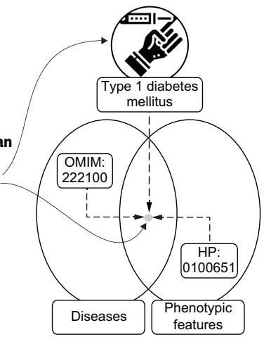  
그림 3.4 제1형 당뇨병은 질병 또는 표현형 특징으로 간주될 수 있습니다. 맥락에 따라 서로 다른 두 ID가 채택될 수 있습니다.

#### 3.1.2 데이터 이해


우리의 데이터 출처는 Human Phenotype Ontology (HPO) 저장소입니다. 이 저장소는 우리의 예시를 위해 두 가지 정보 집합을 제공합니다(그림 3.5). 첫 번째는 hpo.owl (http://purl.obolibrary.org/obo/hp.owl)이라는 RDF/XML 파일에 들어 있는 것으로, 표현형 이상에 관한 표준화된 정보를 포함하는 온톨로지 (ontology)입니다. 이러한 표준화는 상호운용성을 가능하게 하며 여러 출처의 데이터를 통합할 수 있게 합니다. 목록 3.1은 제1형 당뇨병과 관련된 hpo.owl 파일의 일부를 보여 주며, 가독성을 높이기 위해 데이터는 Turtle (Terse RDF Triple Language)로 직렬화되어 있습니다.

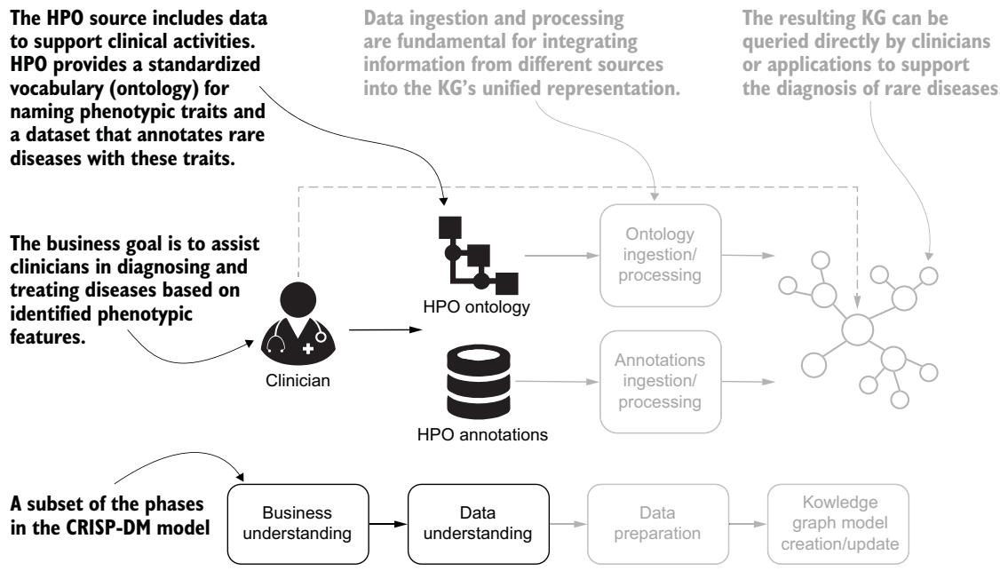  
그림 3.5 임상의의 활동을 지원하기 위한 데이터 이해. 이 탐색 단계는 KG를 구축하는 데 필요한 핵심 정보를 얻습니다.

```csv
Listing 3.1 Type I diabetes mellitus details in hpo.owl
Defines Type I diabetes mellitus,
identified by URI obo:HP_0100651, Describes the
obo:HP_0100651 a owl:Class ;  as an ontology class ^^xsd:string ; disease innatural language
obo:IAO_0000115 "A chronic condition in which the pancreas produces
little or no insulin…" ^^xsd:string ; <
oboInOwl:created_by "doelkens"^^xsd:string ; oboInOwl:creation_date "2010-12-29T06:37:55Z"^^xsd:string Shows metadatarelated to the
> oboInOwl:hasDbXref "MSH:D003922"^^xsd:string, author (“doelkens”)
"SNOMEDCT_US:46635009" ^^xsd:string, of this entry
"UMLS:C0011854" ^^xsd:string ;
oboInOwl:hasExactSynonym "Diabetes mellitus Type I"^^xsd:string,
"Juvenile diabetes mellitus" ^^xsd:string,
"Type 1 diabetes",
"Type I diabetes";
oboInOwl:hasRelatedSynonym "Insulin-dependent diabetes
mellitus"^^xsd:string ;
oboInOwl:id "HP:0100651"^^xsd:string ;
rdfs:comment "The onset of type 1 diabetes is typically during
adolescence…" ^^xsd:string ;
rdfs:subClassOf obo:HP_0000819 < Defines Type I diabetes mellitus as a
subclass of the phenotypic feature
IDs of external data sources that identified by the obo:HP_0000819 URI,
refer to this form of diabetes which corresponds to diabetes mellitus
```

OWL 파일을 읽는 것은 어려울 수 있습니다. 목록 3.2에 나타난 것처럼, 우리는 rdflib Python 라이브러리를 사용하여 이 파일을 주어, 술어, 목적어를 포함하는 트리플 (triple)의 집합으로 탐색할 수 있습니다.

#### 목록 3.2 rdflib Python 라이브러리를 사용한 OWL 파일 처리


```python
from rdflib import Graph, URIRef
g = Graph()
g.parse("hp.owl", format="xml")
g.bind("obo", "http://purl.obolibrary.org/obo/")
g.bind("rdf", "http://www.w3.org/1999/02/22-rdf-syntax-ns#")
g.bind("rdfs", "http://www.w3.org/2000/01/rdf-schema#")
g.bind("xsd", "http://www.w3.org/2001/XMLSchema#")
subject_uri = URIRef("http://purl.obolibrary.org/obo/HP_0100651")
filtered_statements = g.triples((subject_uri, None, None))
for subject, predicate, obj in filtered_statements:
```

print(   
f"({g.qname(subject)}, {g.qname(predicate)}, "   
f"{g.qname(obj) if isinstance(obj, URIRef) else obj})"   
)   
print()

이 스크립트의 출력은 다음과 같습니다(긴 문자열은 명확성을 위해 잘랐습니다).

#### 목록 3.3 트리플 집합으로 표시된 OWL 파일 예시


(obo:HP\_0410050, rdf:type, owl:Class)   
(obo:HP\_0410050, owl:equivalentClass, N25507ac984704bd78a0effd951947a7f)   
(obo:HP\_0410050, rdfs:subClassOf, obo:HP\_0011013)   
(obo:HP\_0410050, obo:IAO\_0000115, A decrease in the level of…)   
(obo:HP\_0410050, dc:date, 2018-01-27T00:26:24+00:00)   
(obo:HP\_0410050, dcterms:creator, ns1:0000-0001-5208-3432)   
(obo:HP\_0410050, oboInOwl:hasExactSynonym, Decreased level of 1,5-AG…)   
(obo:HP\_0410050, oboInOwl:hasExactSynonym, Decreased level of 1,5-anhydro…)   
(obo:HP\_0410050, rdfs:label, Decreased level of 1,5 anhydroglucitol in serum)

HPO 저장소에서 얻은 두 번째 정보 집합은 탭으로 구분된 값(tab-separated values, TSV) 파일인 phenotype.hpoa에 포함되어 있으며, 희귀 증후군을 포함한 다양한 질병과 관련하여 인식되고, 발견되고, 주석이 달린 표현형 특징을 모아 둔 것입니다. 이러한 주석에는 질병과 관련된 각 특징의 발병 연령과 빈도를 명확히 하는 수식 정보가 포함됩니다. 다음 목록은 이 주석 파일의 예시를 보여 줍니다.

#### Listing 3.4 phenotype.hpoa 파일의 예시


database\_id disease\_name qualifier hpo\_id reference evidence   
onset frequency sex modifier aspect biocuration   
OMIM:222100 Diabetes mellitus, insulin-dependent-1   
HP:0410050 PMID:9357814;PMID:17659063;PMID:16731998   
PCS 30/30 P   
HPO:NicoleVasilevsky[2018-02-23];HPO:NicoleVasilevsky[2018-03-02]   
OMIM:222100 Diabetes mellitus, insulin-dependent-1   
HP:0000103 OMIM:222100   
IEA P HPO:iea[2009-02-17]

이 파일에는 다음 필드가 포함됩니다.

database\_id (OMIM:222100)—Online Mendelian Inheritance in Man (OMIM) 및 Orphanet과 같은 온톨로지의 질병 식별자입니다.

disease\_name (Diabetes mellitus, insulin-dependent-1)—관련 온톨로지의 질병명입니다.

hpo\_id (HP:0410050)—관련 표현형 이상에 대한 HPO 식별자입니다.

reference (PMID:9357814;PMID:17659063.PMID:16731998)—주석에 사용된 정보의 출처입니다. 이는 관련 PubMed ID (PMID)로 표시된 논문에서 온 것일 수 있습니다.

evidence (PCS)—주석을 뒷받침하는 증거 수준입니다. PCS는 출판된 임상 연구(published clinical study)를 의미합니다.

frequency (30/30)—공통의 통계적 특성을 가진 사람들의 집단 내에서 영향을 받은 환자 수입니다. 30/30은 지정된 질병을 가진 30명의 환자 중 30명에게 HPO 용어가 지칭하는 표현형 이상이 발견되었음을 나타냅니다.

aspect (p)—표현형 측면입니다. P는 표현형 이상을 의미합니다.

biocuration (HPO:NicoleVasilevsky[2018-02-23];HPO:NicoleVasilevsky [2018-03-02])—주석을 작성한 연구 센터 또는 사용자와 주석이 작성된 날짜입니다.

자세한 내용은 https://mng.bz/EwAo 를 참조하십시오.

### 3.2 지식 그래프 기술의 이해


데이터를 이해했으므로, 다음 단계는 사용 가능한 출처로부터 데이터를 수집하고 처리하는 것입니다. 그러나 먼저 우리의 사용 사례에 대해 정보에 근거한 결정을 내릴 수 있도록 다양한 지식 그래프 (KG) 기술을 살펴보겠습니다.

KG를 생성하는 가장 널리 쓰이는 접근법 두 가지는 자원 기술 프레임워크 (Resource Description Framework, RDF)와 레이블 속성 그래프 (Labeled Property Graph, LPG)입니다. RDF는 웹에서의 데이터 교환을 위해 월드 와이드 웹 컨소시엄(World Wide Web Consortium, W3C)이 정의하고 규제하는 표준 프레임워크입니다. RDF에서는 각 진술이 주어(subject), 술어(predicate), 목적어(object)라는 세 요소로 구성됩니다(트리플 (triple)). 주어는 그래프의 노드(정점)이고, 술어는 관계(간선)를 나타내며, 목적어는 또 다른 노드입니다. 이 프레임워크는 KG를 진술들의 집합으로 모델링하며, 우리는 웹 기술을 사용하여 정보를 표현하고 저장하며 교환할 수 있습니다. RDF는 특정 지식 영역을 설명하는 온톨로지 (ontology)를 생성하는 데 특히 적합합니다.

LPG는 그래프 데이터에 대한 빠른 질의 기반 순회와 경로 분석 기능을 제공합니다. 그래프의 노드 및 관계와 연관된 키-값 쌍 형태의 구조화된 정보는 데이터 저장과 접근의 효율성을 보장합니다.

RDF에서는 관계(트리플)가 전역적으로 정의되므로, 술어에 적용된 메타데이터는 그래프 전체에서 해당 관계의 모든 인스턴스에 영향을 미칩니다. 이러한 한계를 해결하기 위해 RDF는 예를 들어 명명된 그래프 (named graph)를 지원하며, 이를 통해 트리플 그룹을 하나의 엔터티로 취급하고 맥락별 정보를 제공할 수 있습니다. 반면 LPG는 노드 사이의 고유한 간선을 지원하여, 메타데이터와 속성을 개별 관계에 부착할 수 있게 합니다. 이는 간선별 정보를 표현하기 위한 유연한 모델입니다. RDF-DEV 커뮤니티 그룹은 사용자가 간선에 속성을 추가할 수 있도록 하는 RDF\*(“RDF-star”) 명세를 작업하고 있으며, 이를 통해 RDF와 LPG 기술을 조화시키고 있습니다.

LPG는 RDF의 고급 의미론 (semantics)을 표현할 수 없습니다. 이 문제를 해결하기 위해 Neo4j와 같은 벤더들은 RDF와 LPG 사이의 간극을 줄일 수 있는 도구를 제공합니다. Neosemantics 플러그인을 사용하면 Neo4j에서 RDF와 그 어휘(OWL, RDFS, SKOS 등)를 사용하여 기본 추론을 실행할 수 있습니다. Amazon Neptune과 같은 다른 벤더들은 RDF 데이터에 대해 Cypher 질의(LPG 그래프의 질의 언어)를 실행할 수 있게 하는 대안적 전략을 사용합니다. 다음 절에서는 우리의 예시 사용 사례에 RDF와 LPG를 채택할 때의 한계와 기회를 제시합니다.

#### 3.2.1 RDF인가 LPG인가? 목표 중심 논의


지식 그래프 (KG)를 구축하기 위한 최적의 기술을 선택하려면, 사용 가능한 정보(우리의 경우 HPO 온톨로지와 주석 (annotations) 데이터)에 대한 더 나은 이해와 명확한 목표가 필요합니다. 우리는 RDF가 온톨로지를 만드는 데 특히 적합하다고 언급했습니다. 이것이 HPO 온톨로지가 RDF를 사용하여 직렬화되는 이유입니다. HPO 파일의 파일 확장자는 .owl입니다. OWL은 웹 온톨로지 언어(Web Ontology Language)를 의미하며, 그 주된 목표는 표현력 있는 클래스 정의와 속성 정의를 지원하기 위해 RDF에서 사용할 수 있는 의미론적 정보를 풍부하게 하는 것입니다. OWL 온톨로지는 널리 사용되며, GPT와 Claude를 포함한 많은 LLM이 이를 기반으로 학습되었기 때문에 이러한 모델이 OWL 기반 데이터를 해석하고 추론하기가 더 쉬워집니다.

우리 사용 사례의 임상의들은 지식이 어떻게 모델링되는지에는 관심이 없습니다. 그들은 표현형 특징 (phenotypic features)의 명확한 표현, 가능하다면 계층 구조를 가진 표현에 관심이 있습니다. 주석 처리된 데이터의 핵심 정보는 흔히 과학 문헌에서 나오며, 특정 표현형 특징이 질병과 함께 식별되는 사례들로 구성됩니다. 예를 들어, “Diabetes Mellitus, Insulin-dependent-1”(OMIM:222100)과 “Decreased level of 1,5 anhydroglucitol in serum”(HP:0410050) 사이의 연결을 보여 주는 항목은 “A kinetic mass balance model for 1,5-anhydroglucitol: applications to monitoring of glycemic control” [3] (PMID: 9357814)이라는 제목의 임상 연구에 발표되었으며, 2018년 2월 Nicole Vasilevsky가 생성했습니다. 이를 모델링하는 가장 좋은 방법은 세부 정보를 질병과 표현형 특징 사이의 관계에 포함하는 것입니다. 데이터를 이러한 방식으로 모델링하면 여러 관계를 만들 수 있으며, 각각은 출처 정보 (provenance)와 날짜로 특징지어지는 특정 주석을 나타낼 수 있습니다.

그림 3.6은 표 구조의 주석 데이터를 KG의 엣지로 변환할 수 있는 방법을 보여 줍니다. 질병과 표현형 특징은 노드로 표현되며, 주석 작성자, 생성일, 출처에 관한 정보는 엣지의 속성(그림의 HAS\_PHENOTYPIC\_FEATURE)으로 지정됩니다.

HPO 주석 파일의 한 행에 대한 단순화된 예입니다. 이 항목은 질병(OMIM:222100)과 관련 표현형 특징(HP:0410050) 사이의 연관을 설명합니다.  
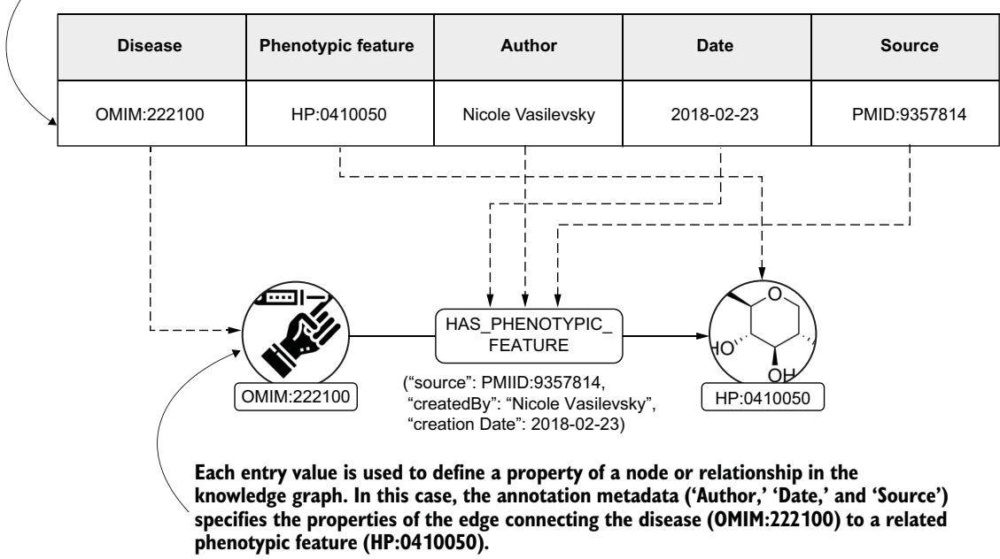  
그림 3.6 표 행에서 KG 엣지로의 데이터 변환. 표의 정보는 KG에서 노드와 엣지의 속성을 정의하도록 조정됩니다.

#### 연습문제


예시 사용 사례에서 임상의의 활동을 지원하기에 가장 적합한 기술을 선택할 수 있는지 확인해 보십시오. 주요 요구사항을 다시 상기하면 다음과 같습니다.

임상의의 목표는 질병, 특히 희귀 병리를 진단할 때 이용 가능한 데이터를 활용하여 충분한 정보를 바탕으로 의사결정을 내리는 것입니다.

임상의는 전체 임상 도메인을 표현하는 지식 베이스 (knowledge base)에는 관심이 없습니다. 이들은 비정상적인 표현형 특징 또는 그 조합이 탐지하기 쉽지 않은 질병과 연관될 수 있는 사례를 보고자 합니다. 이러한 이유로, 정보의 출처와 날짜를 포함하여 그러한 사례를 보고하는 정보를 원합니다.

이 메타데이터 (metadata)를 사용하여, 임상의는 특정 표현형 특징이 질병과 연관된 모든 사례를 쉽게 비교하고자 합니다.

올바른 기술의 선택에는 유일한 정답이 있는 것은 아니지만, 가장 적합한 기술을 선택하면 정의된 목표에 더 직접적인 방식으로 도달하는 데 도움이 됩니다. 이 연습문제는 다양한 도메인과 응용에 맞게 조정할 수 있습니다.

#### 3.2.2 RDF와 LPG를 사용한 엣지 속성 표현


우리 관점에서 LPG는 표현형 특징과 질병을 연결하는 엣지에 관한 정보를 강조하므로 데이터를 표현하는 데 가장 적합한 해결책입니다. LPG가 가장 적합한 기술인 이유를 명확히 하기 위해 RDF와 LPG를 구체적으로 비교해 보겠습니다. 목표는 주석 (annotation)과 관련된 모든 정보(출처, 저자, 생성일 포함)를 검색하는 것입니다. 앞서 언급했듯이, 다음 절에서 설명하는 바와 같이 RDF를 사용하여 이러한 데이터를 표현하는 여러 메커니즘을 사용할 수 있습니다.

#### RDF: N-ARY RELATIONS


특정 간선과 관련된 데이터를 모델링하는 표준적인 접근법은 n항 관계 (n-ary relations)를 채택하는 것입니다. 이 접근법을 사용하면 데이터를 연결하기 위한 새로운 개념을 생성합니다. 우리의 예에서는 이것이 주석으로 정의됩니다. 목록 3.5의 RDF 표현과 목록 3.6의 관련 SPARQL 질의를 살펴보겠습니다.

목록 3.5 n항 관계의 예   
\_:Annotation rdf:type :PhenotypicAnnotation ;   
:forDisease OMIM:222100 ;   
:phenotypicFeature HP:0410050 ;   
:source PMID:9357814 ;   
:createdBy "Nicole Vasilevsky" ;   
:creationDate "2018-02-23"^^xsd:date .

이 RDF 조각은 Turtle 구문을 사용하여 표현형 주석 (phenotypic annotation)을 나타냅니다. 이 주석은 빈 노드 (blank node)(\_:Annotation)로 표현되며, 이는 전역 식별자를 할당하지 않고 관련 정보를 묶는 데 사용되는 이름 없는 리소스입니다. 빈 노드는 존재하지만 특정 이름이 필요하지 않은 어떤 것에 대한 자리표시자로 간주할 수 있으며, 프로그래밍에서의 익명 객체와 매우 유사합니다.

빈 노드는 :PhenotypicAnnotation으로 유형이 지정되며, 질병(OMIM ID로 식별됨)을 표현형 특징(HPO에서 가져옴)에 연결합니다. 추가 메타데이터에는 데이터 출처(PubMed ID), 주석의 저자, 생성일이 포함됩니다. 이러한 구조는 생의학 데이터셋에서 출처 추적 (provenance tracking)과 의미적 상호운용성 (semantic interoperability)을 지원합니다.

목록 3.6 n항 관계 맥락에서의 SPARQL 질의   
SELECT ?source ?author ?date   
WHERE {   
?annotation a :PhenotypicAnnotation ;   
:forDisease OMIM:222100 ;   
:phenotypicFeature HP:0410050 ;   
:source ?source ;   
:createdBy ?author ;   
:creationDate ?date .

이 SPARQL 질의는 특정 표현형 주석에 관한 메타데이터를 검색합니다. 주어진 질병(OMIM:222100)과 표현형 특징(HP:0410050)을 기준으로 주석을 필터링한 다음, 정보의 출처, 주석을 생성한 저자, 그리고 생성된 날짜를 반환합니다.

많은 경우 데이터 소비자는 원래 스키마의 변경 사항을 쉽게 해석하고 이에 적응할 수 있습니다. 그러나 온톨로지가 발전함에 따라 그 복잡성이 증가할 수 있으며, 이로 인해 하위 호환성 (backward compatibility) 및 장기 유지보수와 관련된 문제가 발생할 가능성이 있습니다.

#### RDF: 명명된 그래프


RDF 명명된 그래프 (named graphs)는 이 진술이 명명된 (하위) 그래프의 일부이며 RDF 그래프의 노드로 간주될 수 있음을 지정하는 네 번째 요소를 포함합니다. 따라서 우리는 주석과 관련된 데이터를 첨부하기 위해 새로운 진술을 생성할 수 있습니다. 이 접근법은 목록 3.7에 제시되어 있으며, SPARQL 질의는 목록 3.8에 정의되어 있습니다.

#### 목록 3.7 명명된 그래프의 예


```batch
:Graph1 {
OMIM:222100 :hasPhenotypicFeature HP:0410050
}
:Graph1
:source PMID:9357814 ;
:createdBy "Nicole Vasilevsky" ;
:creationDate "2018-02-23"^^xsd:date .
```

이 RDF 예시는 TriG 구문을 사용하여 명명된 그래프 :Graph1을 정의합니다. 간단히 말해, TriG는 RDF 진술을 하나의 레이블(명명된 그래프) 아래에 묶고 메타데이터를 추가할 수 있게 합니다. 이 그래프에서 트리플은 질병 OMIM:222100이 표현형 특징 HP:0410050을 가진다고 단언합니다. 이 단언에 관한 메타데이터는 :Graph1에 첨부되어 있으며, 여기에는 출처(PMID:9357814), 생성자("Nicole Vasilevsky"), 생성일이 포함됩니다.

#### 목록 3.8 명명된 그래프의 맥락에서 SPARQL 질의


SELECT ?source ?author ?date   
WHERE {   
GRAPH :Graph1 {   
OMIM:222100 :hasPhenotypicFeature HP:0410050 .   
}   
:Graph1 :source ?source ;   
:createdBy ?author ;   
:creationDate ?date .   
}

이 SPARQL 질의는 명명된 그래프에 저장된 특정 표현형 주석에 관한 메타데이터를 검색합니다. 이 질의는 그래프 :Graph1에서 다음을 단언하는 트리플을 찾습니다.

OMIM:222100은 표현형 특징 HP:0410050을 가집니다. 그런 다음 :Graph1에 관한 메타데이터를 질의하고 출처, 작성자, 생성일을 반환합니다.

명명된 그래프는 맥락적 메타데이터와 출처를 표현하는 데 강력하지만, 복잡성을 더할 수 있습니다. 특히 많은 수의 명명된 그래프를 관리하면 데이터 저장과 교환에서 비효율이 발생할 수 있습니다. 명명된 그래프 내 개별 문장에 대한 세밀한 업데이트 또한 어려울 수 있습니다.

#### RDF-STAR


앞서 언급했듯이, RDF-star는 RDF와 LPG와 같은 속성 그래프 모델 간의 간극을 좁히는 RDF의 확장입니다. 이 접근 방식은 다음 두 목록에 제시되어 있습니다.

#### 목록 3.9 RDF-star의 예


<<OMIM:222100 :hasPhenotypicFeature HP:0410050>>   
:source PMID: 9357814 ;   
:createdBy "Nicole Vasilevsky" ;   
:creationDate “2018-02-23”^^xsd:date .

목록 3.10 RDF-star 맥락에서의 SPARQL-star 질의 예

SELECT ?source ?author ?date {   
<<OMIM:222100 :hasPhenotypicFeature HP:0410050>>   
:source ?source ;   
:createdBy ?author ;   
:creationDate ? date .   
}

RDF-star는 간선에 속성을 부여하는 단계의 하나를 나타내며, 더 읽기 쉬운 SPARQL 질의를 사용합니다. 그러나 질의 성능은 개선되어야 합니다. 또한 Orlandi 등 [2]이 지적했듯이, “새로운 구문 확장을 사용하려면 RDF 엔진의 특정 구현이 필요하며, 따라서 이 접근 방식의 채택을 제한합니다.”

RDF 문장을 주석화하는 다른 방법으로는 구체화 (reification)와 싱글턴 속성 (singleton properties)이 있습니다. 이러한 방법은 실제 응용에서는 덜 사용되며, 명명 그래프 (named graphs)와 n항 관계 (n-ary relations)처럼 더 확장 가능하고 유지보수하기 쉬운 대안이 선호됩니다.

#### LPG

LPG 접근 방식은 키-값 쌍을 사용하여 주석 세부 정보를 관계 내부에 직접 표현합니다. 이러한 모델링 접근 방식의 예와 이에 해당하는 Cypher 쿼리를 다음에 제시합니다.

#### 목록 3.11 LPG 표현 예시


(d { id: "OMIM:222100" })   
-[:HAS\_PHENOTYPIC\_FEATURE {   
source: "PMID:9357814"

createdBy: "Nicole Vasilevsky";   
creationDate: "2018-02-23}]->   
(p { id: "HP:0410050" })

두 노드는 엔티티를 나타냅니다. 즉, 질병(OMIM:222100)과 표현형(HP:0410050)입니다. 관계 :HAS\_PHENOTYPIC\_FEATURE는 이들을 연결하며, 주석의 출처("PMID:9357814"), 작성자("Nicole Vasilevsky"), 생성 날짜("2018-02-23")를 설명하는 키-값 쌍을 포함합니다.

#### 목록 3.12 Cypher 쿼리 예시


MATCH (d)-[r:HAS\_PHENOTYPIC\_FEATURE]->(p)   
WHERE d.id = "OMIM:222100" and p.id = "HP:0410050"   
RETURN r.source, r.createdBy, r.creationDate

이 Cypher 쿼리는 질병 노드와 표현형 노드 사이의 :HAS\_PHENOTYPIC\_FEATURE 관계에 첨부된 메타데이터를 검색합니다. 이 쿼리는 그래프에서 패턴을 매칭하고, 노드 ID를 기준으로 필터링하며, 관계에 저장된 주석 세부 정보를 반환합니다.

이러한 예시가 보여주듯이, LPG 모델은 표현력이 높고 접근하기 쉬운 방식으로 메타데이터가 풍부한 관계를 모델링하는 데 매우 적합합니다. 이러한 이유로, 우리는 KG 시스템을 구축하기 위한 핵심 도구로 LPG와 Cypher를 채택할 것입니다.

### 3.3 지식 그래프 구축하기


이제 첫 번째 KG를 구축하는 방법의 세부 사항을 살펴보겠습니다. 이 과정은 두 단계로 이루어집니다. 온톨로지를 로드하고, 온톨로지를 참조 기준으로 사용하여 데이터 소스를 수집하는 것입니다.

참고 KG를 구축하려면 GitHub 저장소(https://github.com/alenegro81/knowledge-graphs-and-llms-in-action/tree/ main/chapters/ch03)의 코드를 실행하거나 Neo4j 브라우저를 사용하여 이 절의 Cypher 쿼리를 테스트할 수 있습니다. 이 코드는 Neo4j(Neo4j Desktop 1.6.1 애플리케이션으로 설치한 버전 5.20.0 Enterprise Edition), APOC 라이브러리(버전 5.20.0), Neosemantics 플러그인(버전 5.20.0)을 사용하여 테스트되었습니다. Neo4j와 그 플러그인을 설치하는 세부 사항은 온라인 부록 B에 제공되어 있습니다. 우리는 각 쿼리를 설명하지만, 독자가 Cypher 쿼리 언어에 대한 기본적인 이해를 갖추고 있다고 가정합니다. 결과는 2025년 2월에 사용 가능했던 HPO 버전에서 도출되었습니다.

#### 3.3.1 neosemantics를 사용한 온톨로지 수집 및 처리


그림 3.7은 온톨로지 수집 및 처리 단계를 보여줍니다. 첫 번째 단계는 다음 명령을 사용하여 HPO 데이터베이스를 생성하고 초기화하는 것입니다.

리스팅 3.13 Neo4j에서 HPO 데이터베이스 생성   
CREATE DATABASE hpo IF NOT EXISTS

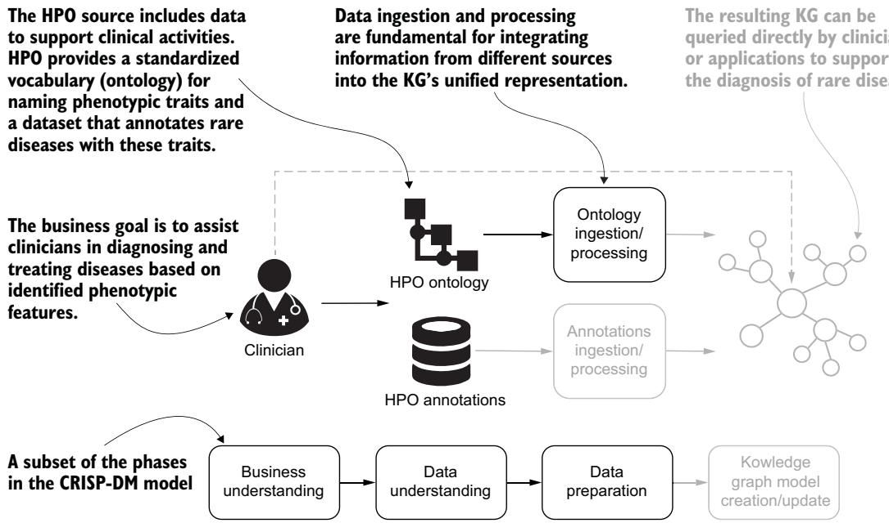  
그림 3.7 온톨로지 수집 및 처리

다음 리스팅에서는 Resource로 레이블이 지정된 노드의 uri 및 id 속성의 고유성을 보장하는 제약 조건을 설정합니다. 또한 KG 구축 단계와 정보 검색 중에 이 정보에 대한 접근성을 높이기 위해 HpoPhenotype 및 HpoDisease 노드의 id 속성에 대한 인덱스를 생성합니다. HpoPhenotype 및 HpoDisease 레이블은 우리의 표현형 이상 및 질병 노드를 정의합니다.

```sql
Listing 3.14 Creating constraints and indexes
CREATE CONSTRAINT n10s_unique_uri IF NOT EXISTS FOR (r:Resource) REQUIRE
r.uri IS UNIQUE;
CREATE CONSTRAINT IF NOT EXISTS FOR (n:Resource) REQUIRE (n.id) IS UNIQUE;
CREATE INDEX disease_id IF NOT EXISTS FOR (n:HpoDisease) ON (n.id);
CREATE INDEX phenotype_id IF NOT EXISTS FOR (n:HpoPhenotype) ON (n.id);
```

두 번째 단계에서는 Neosemantics 컴포넌트에 대한 초기 구성을 정의합니다.

#### Listing 3.15 Neosemantics 플러그인 구성


```javascript
CALL n10s.graphconfig.init();
CALL n10s.graphconfig.set({ handleVocabUris: "IGNORE" });
CALL n10s.graphconfig.set({ applyNeo4jNaming: True });
```

이 구성은 데이터 가져오기를 위한 두 가지 주요 규칙을 정의합니다. 첫 번째 규칙은 가져오기 단계에서 네임스페이스를 무시합니다(네임스페이스는 유사한 표현을 사용하는 서로 다른 온톨로지를 추적하는 데 도움이 될 수 있습니다). 두 번째 규칙은 LPG 관계의 표준 표현을 따라 관계 유형을 대문자로 인코딩합니다.

다음 단계는 HPO 어휘를 로드하는 것입니다.

Listing 3.16 HPO 어휘를 Neo4j에 로드하기

```javascript
CALL n10s.rdf.import.fetch("http://purl.obolibrary.org/obo/hp.owl","RDF/XML");
```

우리의 테스트에서 이 명령은 899,558개의 문을 Neo4j에 로드했습니다. 주석 데이터를 처리하고 로드하기 전에, 리소스의 원래 URI에서 계산된 Hpo-Phenotype 레이블과 id 속성으로 노드를 보강할 수 있습니다.

Listing 3.17 노드 보강하기

MATCH (n:Resource)   
WHERE n.uri STARTS WITH "http://purl.obolibrary.org/obo/HP"   
SET n:HpoPhenotype,   
n.id = coalesce(n.id,   
replace(apoc.text.replace(n.uri,'(.\*)obo/',''),'\_', ':'))

n.id를 다음으로 설정합니다   
HP:0000001   
<

지식 그래프 (KG)의 현재 상태를 검토해 보겠습니다. Listing 3.18은 이 그래프의 작은 부분을 검색하는 코드를 보여 주며, 이는 그림 3.8에 제시되어 있습니다. Neo4j 브라우저에서 코드를 실행하여 이를 탐색할 수 있습니다.

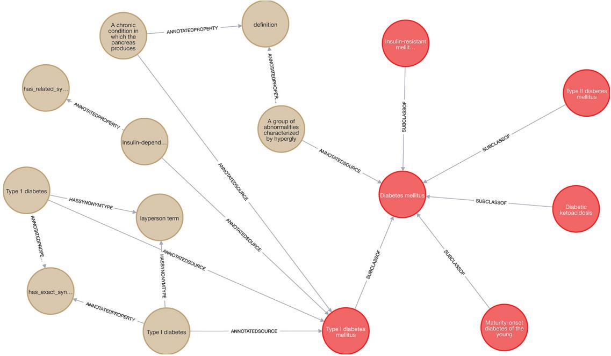

그림 3.8 저장 모델로 LPG를 사용하여 그래프 데이터베이스에 로드된 HPO 온톨로지의 일부입니다. 우리는 두 가지 유형의 정보를 구분할 수 있습니다. 즉, 온톨로지 정보(왼쪽)와 표현형 특징과 관련된 도메인 특화 정보(오른쪽)입니다.

#### 목록 3.18 현재 단계에서 KG의 일부를 보여줍니다


MATCH path1=(n:HpoPhenotype)<-[:SUBCLASSOF]-(m:HpoPhenotype)   
WHERE n.label = "Diabetes mellitus"   
WITH path1   
MATCH path2=(i:HpoPhenotype)<-[:ANNOTATEDSOURCE]-(j)   
WHERE i.label in ["Diabetes mellitus", "Type I diabetes mellitus"]   
WITH path1, path2, j   
MATCH path3=(j)-[:ANNOTATEDPROPERTY|HASSYNONYMTYPE]-()   
RETURN path1, path2, path3

경고 목록 3.18의 쿼리는 장의 지침을 한 단계씩 따라가며 실행하는 경우에만 작동합니다. 저장소 코드를 사용하여 전체 수집 과정을 실행하면 최종 데이터 정제 단계로 인해 쿼리가 실패합니다.

HPO 온톨로지는 다양한 유형의 정보를 제공합니다. 그림 3.8의 왼쪽은 노드의 성격에 관한 온톨로지 정보를 보여 주며, 오른쪽은 당뇨병과 관련된 계층적 연결에 대한 세부 정보를 포함합니다.

#### 3.3.2 주석 수집 및 처리


KG 구축을 완료하려면 주석 파일을 수집하고 처리해야 합니다. 이 파일의 표현형 이상은 관련 질병과 연결되어 있으며, 해당 용어들은 다른 온톨로지에서 가져온 것입니다. 그림 3.9는 데이터 처리 및 모델링의 두 번째 단계를 보여 줍니다.

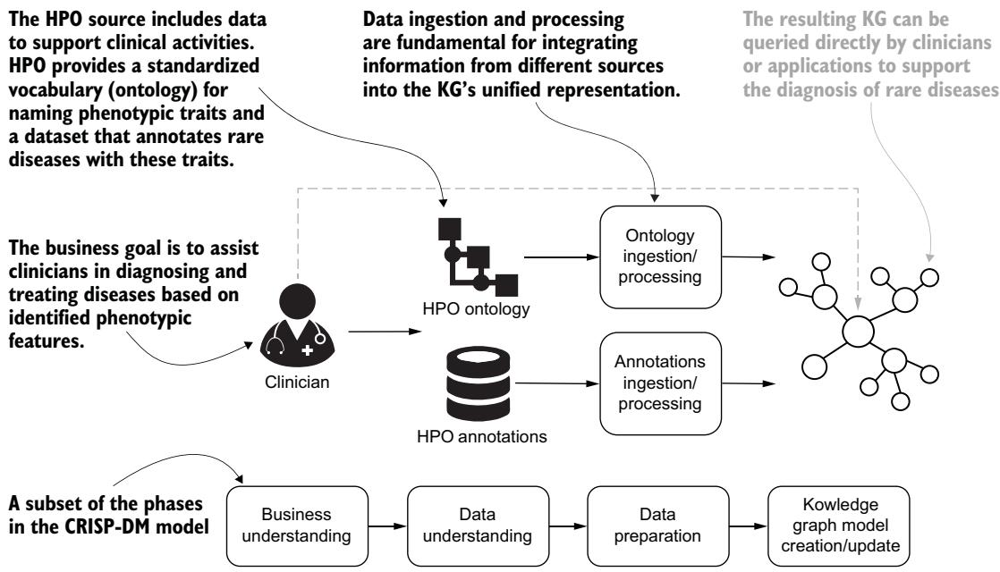  
그림 3.9 KG 구축을 완료하기 위한 주석 데이터셋의 수집 및 처리

RDF 데이터 모델을 사용하여 생성된 hpo.owl 파일과 달리, 다음 파일은 탭으로 구분된 값 (tab-separated values, TSV)으로 구성된 HPO 주석 (HPO annotation, HPOA; https://mng.bz/NwQN) 형식으로 제공됩니다. HPOA 파일에는 다음과 같은 유용한 정보가 포함되어 있습니다.

질병과 여러 표현형 특징 또는 이상 사이의 명시적 연관성

 전자 주석에서 추론되었거나 출판된 임상 연구 또는 추적 가능한 저자 진술에서 나온 것과 같이, 이러한 연관성을 뒷받침하는 증거

발병 연령

질병과 표현형 특징이 함께 나타나는 빈도

온톨로지 출처를 설명하는 추가 메타데이터

이 TSV 파일을 사용하면 기존 지식을 기반으로 서로 다른 파일 유형을 통합할 수 있습니다. 목록 3.19–3.24의 Cypher 쿼리를 통해 GitHub의 주석 파일에서 정보를 로드하고, 처리하며, 통합할 수 있습니다. 먼저 질병 노드를 생성합니다.

#### 목록 3.19 HpoDisease 노드 생성


```sql
LOAD CSV FROM 'https://mng.bz/qRyr' AS row
FIELDTERMINATOR '\t'
WITH row Skips the first five rows of the file
SKIP 5 < because they are file metadata
MERGE (dis:Resource:HpoDisease {id: row[0]})
ON CREATE SET dis.label = row[1];
```

다음으로 질병 노드와 표현형 특징 노드 사이의 관계를 생성합니다.

#### 목록 3.20 HpoDisease와 HpoPhenotype 노드 사이의 관계 생성


```sql
LOAD CSV FROM 'https://mng.bz/qRyr' AS row
FIELDTERMINATOR '\t'
WITH row
SKIP 5
MATCH (dis:HpoDisease)
WHERE dis.id = row[0]
MATCH (phe:HpoPhenotype)
WHERE phe.id = row[3]
MERGE (dis)-[:HAS_PHENOTYPIC_FEATURE]->(phe)
```

이러한 관계를 생성하면 hpo.owl 파일과 phenotype.hpoa 파일의 정보가 통합됩니다. 다음 코드는 이 통합 과정의 결과를 질의합니다.

#### 목록 3.21 연관성 찾기


MERGE (dis:HpoDisease)-[:HAS\_PHENOTYPIC\_FEATURE]->(phe:HpoPhenotype)   
RETURN dis.label, collect(phe.label)   
LIMIT 3

질의 결과는 표 3.1에 보고되어 있습니다.

표 3.1 HpoDisease 노드와 HpoPhenotype 노드 사이의 샘플 연관성
<table><tr><td>HpoDisease 항목</td><td>연관된 HpoPhenotype 항목</td></tr><tr><td>발달성 및 간질성 뇌병증 96</td><td>태아수종, 상염색체 우성 유전, 영아기 사망, 간질성 연축, 원발성 소두증, 폭발-억제 양상의 EEG, 지적 장애, 중증, 재태 연령 대비 작음, 간질성 뇌병증, 신생아 호흡곤란, 긴장성 발작</td></tr><tr><td>적혈구 누출로 인한 가족성 가성고칼륨혈증 2</td><td>전신 근력 약화, 고칼륨혈증, 주기성 마비, 근육 경련, 용혈성 빈혈, 손 떨림, 상염색체 우성-</td></tr><tr><td>면역글로불린 카파 경쇄 결핍</td><td>유전 만성 설사, 재발성 감염, 재발성 호흡기 감염, 순환 면역글로불린 카파 사슬 결여, 소아기 발병, 설사, 상염색체 열성 유전</td></tr></table>

다음 코드는 키-값 쌍 형태로 관계 속성을 추가합니다.

목록 3.22 HAS\_PHENOTYPIC\_FEATURE 관계에 속성 추가   
LOAD CSV FROM 'https://mng.bz/qRyr' AS row   
FIELDTERMINATOR '\t'   
WITH row   
SKIP 5   
MATCH (dis:HpoDisease)-[rel:HAS\_PHENOTYPIC\_FEATURE]->(phe:HpoPhenotype)   
WHERE phe.id = row[3] and dis.id = row[0]   
FOREACH(\_ IN CASE WHEN row[4] is not null THEN [1] ELSE [] END|   
SET rel.source = row[4])   
FOREACH(\_ IN CASE WHEN row[5] is not null THEN [1] ELSE [] END|   
SET rel.evidence = row[5])   
FOREACH(\_ IN CASE WHEN row[6] is not null THEN [1] ELSE [] END|   
SET rel.onset = row[6])   
FOREACH(\_ IN CASE WHEN row[7] is not null THEN [1] ELSE [] END|   
SET rel.frequency = row[7])   
FOREACH(\_ IN CASE WHEN row[8] is not null THEN [1] ELSE [] END|   
SET rel.sex = row[8])   
FOREACH(\_ IN CASE WHEN row[9] is not null THEN [1] ELSE [] END|   
SET rel.modifier = row[9])   
FOREACH(\_ IN CASE WHEN row[10] is not null THEN [1] ELSE [] END|   
SET rel.aspect = row[10])   
FOREACH(\_ IN CASE WHEN row[11] is not null THEN [1] ELSE [] END|   
SET rel.biocuration = row[11])

이는 관계 정보를 풍부하게 하는 유연한 접근법입니다. 이 스크립트는 Neo4j 그래프에서 기존 노드와 관계를 매칭하고, 입력 파일의 각 행에 값이 존재하는지에 따라 추가 관계 속성을 설정합니다. 각 FOREACH 블록은 TSV의 해당 열이 null이 아닐 때에만 관계에 새 속성을 추가합니다. 이를 통해 스크립트는 누락 데이터에 견고해지며, 값을 null로 덮어쓰는 일을 피할 수 있습니다.

다음으로 질병과 표현형 특징 사이의 관계에 연결된 속성의 의미를 명확히 하기 위해 다음 질의의 정보를 통합합니다.

#### 목록 3.23 HAS\_PHENOTYPIC\_FEATURE에 더 많은 속성 보강하기


CALL apoc.periodic.iterate(   
"MATCH (dis:HpoDisease)-[rel:HAS\_PHENOTYPIC\_FEATURE]->(phe:HpoPhenotype)   
RETURN rel",   
"SET rel.createdBy = apoc.text.regexGroups(   
rel.biocuration, 'HPO:(\\w+)\\['   
)[0][1],   
rel.creationDate = apoc.text.regexGroups(   
rel.biocuration, '\\[(\\d{4}-\\d{2}-\\d{2})\\]   
)[0][1],   
rel.aspectName = CASE   
WHEN rel.aspect = 'P' THEN 'Phenotypic abnormality'   
WHEN rel.aspect = 'I' THEN 'Inheritance'   
END,   
rel.aspectDescription = CASE   
WHEN rel.aspect = 'P' THEN   
'Terms with the P aspect are located in the Phenotypic abnormality ' +   
'subontology'   
WHEN rel.aspect = 'I' THEN   
'Terms with the I aspect are from the Inheritance subontology   
END,   
rel.evidenceName = CASE   
WHEN rel.evidence = 'IEA' THEN   
'Inferred from electronic annotation'   
WHEN rel.evidence = 'PCS' THEN   
'Published clinical study   
WHEN rel.evidence = 'TAS' THEN   
'Traceable author statement'   
END,   
rel.evidenceDescription = CASE   
WHEN rel.evidence = 'IEA' THEN   
'Annotations extracted by parsing the Clinical Features sections ' +   
'of the Online Mendelian Inheritance in Man resource are assigned ' +   
'the evidence code IEA.'   
WHEN rel.evidence = 'PCS' THEN   
'PCS is used for information extracted from articles in the medical ' +   
'literature. Generally, annotations of this type will include the ' +   
'pubmed id of the published study in the DB\_Reference field.'   
WHEN rel.evidence = 'TAS' THEN   
'TAS is used for information gleaned from knowledge bases such as ' +   
'OMIM or Orphanet that have derived the information from a ' +   
'published source.'   
END,   
rel.url = CASE   
WHEN rel.source STARTS WITH 'PMID:' THEN   
'https://pubmed.ncbi.nlm.nih.gov/' + apoc.text.replace(   
rel.source, '(.\*)PMID:', ''   
)

WHEN rel.source STARTS WITH 'OMIM:' THEN   
'https://omim.org/entry/' + apoc.text.replace(   
rel.source, '(.\*)OMIM:', ''   
)   
END",   
{batchSize: 1000}

이 질의는 apoc.periodic.iterate를 사용하여 HAS\_PHENOTYPIC \_FEATURE 관계를 배치 단위로 처리하고 업데이트합니다. 예를 들어, 정규 표현식을 사용하여 큐레이터와 생성일을 추출함으로써 biocuration 속성에서 메타데이터를 생성합니다. 또한 이 질의는 그래프 탐색 중 가독성을 높이기 위해 속성을 추가합니다. 주석 파일에는 aspect(P 또는 I 값) 및 evidence(IEA, PCS 또는 TAS 값)와 관련된 정보가 축약된 형태로 포함되어 있습니다. 이 데이터를 명확히 하기 위해 우리는 'Phenotypic abnormality' 또는 'Inheritance' 값을 가질 수 있는 aspectName과 같은 속성을 추가합니다. 목표는 사람이 정보에 더 쉽게 접근할 수 있도록 하는 것입니다.

KG 구축의 마지막 단계는 온톨로지에서 왔지만 우리의 목적에는 필요하지 않은 노드와 관계를 제거하여 KG를 정리하는 것입니다.

#### 목록 3.24 불필요한 노드와 관계를 제거하여 KG 정리하기


CALL apoc.periodic.iterate(   
"MATCH (n:Resource) RETURN id(n) as id",   
"MATCH (n)   
WHERE id(n) = id AND   
NOT 'HpoPhenotype' in labels(n) AND   
NOT 'HpoDisease' in labels(n)   
DETACH DELETE n",   
{batchSize:10000})   
YIELD batches, total return batches, total

### 3.4 데이터 질의하기


임상의는 이제 환자에게서 표현형 이상을 탐지하는 것에서 시작하여 희귀질환 진단을 지원하는 도구로 KG를 사용할 수 있습니다. 특정 특성을 입력함으로써 임상의는 KG에 질의하여 희귀 병리를 식별할 수 있습니다. 이 질의 단계는 우리의 정신 모델 (mental model)의 마지막 단계이며 그림 3.10에 제시되어 있습니다.

임상의가 환자 한 명을 진료한다고 상상해 보십시오. 그 환자는 제1형 당뇨병을 앓고 있는 남아입니다. 환자의 임상 병력은 전자의무기록 (electronic health record, EHR)으로 병원 데이터베이스에 저장되어 있습니다. 병원은 KG 패러다임 변화를 수용했으므로, 환자 정보는 HPO와 OMIM(유전 질환 및 희귀질환의 온라인 카탈로그)에 포함된 용어를 사용하여 저장됩니다. 제1형 당뇨병은 표현형 특성이자 질병으로 분류되므로, 해당 정보는 두 가지 서로 다른 식별 코드를 사용하여 저장됩니다.

HP:0100651(표현형 특성): https://hpo.jax.org/app/browse/term/ HP:0100651.

 OMIM:222100(질병): https://www.omim.org/entry/222100.

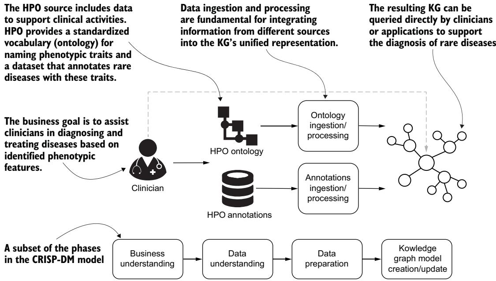  
그림 3.10 임상의의 활동을 지원하기 위해 생성된 KG에 질의하기

임상의는 환자에게서 제1형 당뇨병의 전형적인 표현형 특성을 인식하며, 이는 다음 목록의 질의를 사용하여 KG에서도 탐색할 수 있습니다. 그림 3.11은 그 결과를 보여 줍니다.

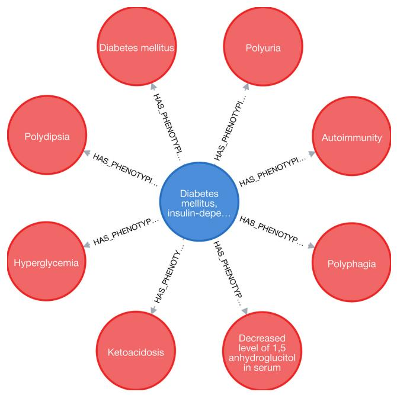  
그림 3.11 제1형 당뇨병과 관련된 모든 표현형 특성을 가져오는 질의의 결과

#### 목록 3.25 제1형 당뇨병과 관련된 표현형 특성 질의하기

MATCH path=(dis:HpoDisease)-[:HAS\_PHENOTYPIC\_FEATURE]->(phe:HpoPhenotype)   
WHERE dis.id = "OMIM:222100"   
RETURN path

중심 노드는 제1형 당뇨병을 정의하며, 다른 노드들은 관련된 표현형 특성을 정의합니다. 그러나 의학적 검사 중 임상의는 제1형 당뇨병과 직접 연결되어 있지 않은 표현형 특성으로 분류되는 새로운 증상을 인식합니다.

성장 지연: https://hpo.jax.org/app/browse/term/HP:0001510.

무릎 비대: https://hpo.jax.org/app/browse/term/HP:0030866.

감각신경성 청각 장애: https://hpo.jax.org/app/browse/term/ HP:0000407.

소양증: https://hpo.jax.org/app/browse/term/HP:0000989.

임상의는 KG의 정보를 사용하여 이러한 표현형 특성과 연결된 다른 병리 (pathologies)를 식별하고자 합니다. 이 작업을 수행하기 위해 임상의는 다음 질의를 실행하며, 그 결과는 표 3.2에 나열되어 있습니다.

#### 목록 3.26 특정 표현형 특성과 관련된 질병 찾기


```sql
MATCH (phe:HpoPhenotype)
WHERE phe.label IN [
"Growth delay",
"Large knee",
"Sensorineural hearing impairment",
"Pruritus",
"Type I diabetes mellitus"
]
WITH phe
MATCH path=(dis:HpoDisease)-[:HAS_PHENOTYPIC_FEATURE]->(phe)
UNWIND dis as nodes
RETURN
dis.id as disease_id,
dis.label as disease_name,
collect(phe.label) as features,
count(nodes) as num_of_features
ORDER BY num_of_features DESC, disease_name
LIMIT 5
```

표 3.2 임상의가 식별한 표현형 특성과 일치하는 상위 질병
<table><tr><td>disease_id</td><td>disease_name</td><td>특성</td><td>특성 수</td></tr><tr><td>OMIM:619269</td><td>청각 손실 및 당뇨병을 동반한 치아연골이형성증 2</td><td>성장 지연, 감각신경성 청각 장애, 소양증, 큰 무릎, 제1형 당뇨병</td><td>5</td></tr><tr><td>OMIM:618500</td><td>췌장 무발생을 동반하거나 동반하지 않는 전전뇌증 12</td><td>감각신경성 청각 장애, 성장 지연, 제1형 당뇨병</td><td>3</td></tr><tr><td>OMIM:614700</td><td>3-메틸글루타콘산뇨증, VIII형</td><td>성장 지연, 감각신경성 청각 장애</td><td>2</td></tr><tr><td>OMIM:616192</td><td>무엽성 전전뇌증</td><td>성장 지연, 감각신경성 청각 장애</td><td>2</td></tr><tr><td>OMIM:602782</td><td>알파-지중해빈혈/지적장애 증후군, X-연관</td><td>성장 지연, 감각신경성 청각 장애</td><td>2</td></tr></table>

이러한 결과는 청각 손실 및 당뇨병을 동반한 치아연골이형성증 2의 진단으로 이어집니다. 이러한 결과를 출발점으로 임상의는 해당 표현형 특성이 이 질병과 연관되는 빈도를 확인하고, 더 많은 잠재적 정보원을 식별하기 위해 추가 조사를 수행할 수 있습니다.

#### 연습문제


리스팅 3.26의 쿼리를 확장하여 evidence\_name, evidence\_description, source, url을 포함한 관계 속성을 검색하십시오.

### 3.5 KG에 대한 추론


이전 사례에서는 KG에 저장된 정보로부터 결과를 얻는 방법을 보였습니다. 그러나 KG의 가장 강력한 도구 중 하나는 추론 (inference)이며, 이는 논리 규칙에 기반한 연역적 추론(deductive reasoning)(2장 참조)을 사용하여 암묵적 정보로부터 결과를 도출합니다. 예를 들어, 다음 질문을 생각해 보십시오. 어떤 질병들이 내분비계의 이상을 특징으로 합니까?

일부 주석은 이 표현형 특징과 명시적으로 연결되어 있습니다. 그러나 임상의는 갑상선을 포함하는 더 구체적인 표현형 형질에도 관심을 가질 것입니다. 이를 위해 HPO의 계층적 표현을 사용할 수 있습니다. 다음 쿼리는 내분비계 이상(id=HP:0000818)의 하위 클래스를 나타내는 표현형 특징의 부분집합을 검색합니다.

#### 목록 3.27 내분비계 이상 하위 클래스 찾기

MATCH (p:HpoPhenotype)<-[:SUBCLASSOF\*1..3]-(n:HpoPhenotype) <   
WHERE p.id = "HP:0000818"   
RETURN p,n 다른 표현형 노드(p)보다   
하위 클래스 수준에서 1단계에서 3단계까지   
더 구체적인 모든 표현형 노드(n)를 찾습니다.

이 계층적 구조를 사용하면 다음 Neosemantics 절차(목록 3.28)를 통해 내분비계 이상과 암묵적으로 연결된 주석을 추론할 수 있습니다. 표 3.3은 결과의 일부를 보여줍니다.

목록 3.28 이상 하위 클래스와 관련된 표현형 특징 찾기   
MATCH (cat:HpoPhenotype {label: "Abnormality of the endocrine system"}) <   
CALL n10s.inference.nodesInCategory(cat, {   
inCatRel: "HAS\_PHENOTYPIC\_FEATURE", 최상위   
subCatRel: "SUBCLASSOF"}) < 표현형 노드를 찾습니다   
YIELD node as dis 이 표현형에   
WHERE dis.label IN [ 직접 또는 간접적으로   
"Congenital atransferrinemia", 연결된 질병을 가져옵니다   
"Deafness, autosomal recessive 4, with enlarged vestibular aqueduct",   
"Diabetes mellitus, transient neonatal, 1",   
"Edema, familial idiopathic, prepubertal",   
"Familial dysalbuminemic hyperthyroxinemia" 재현 가능한 출력을 위해   
] < 선택된 질병만 유지합니다   
MATCH (dis)-[:HAS\_PHENOTYPIC\_FEATURE]->(phe:HpoPhenotype) <   
RETURN dis.label as disease, collect(DISTINCT phe.label) as features   
ORDER BY size(features) ASC, disease   
해당 질병의   
표현형 특징을 매칭합니다.

표 3.3 “내분비계 이상” 표현형 특징과 암묵적으로 연결된 주석 결과의 부분집합. 이 표현형 특징의 직접 또는 추론된 하위 클래스인 표현형 특징은 굵게 강조되어 있습니다.
<table><tr><td>질병</td><td>특징</td></tr><tr><td>선천성 무트랜스페린혈증</td><td>빈혈, 췌장 이상, 재발성 감염, 관절염, 심혈관계 이상, 갑상선기능저하증</td></tr><tr><td>상염색체 열성 난청 4, 확대된 전정수도관 동반</td><td>확대된 전정수도관, 선천성 발병, 갑상선종, 상염색체 열성 유전, 달팽이관 제II형 불완전 분할, 감각신경성 청각 장애</td></tr><tr><td>일과성 신생아 당뇨병 1</td><td>일과성 신생아 당뇨병, 상염색체 우성 유전, 탈수, 고혈당증, 자궁내 성장 지연, 중증 성장부전</td></tr><tr><td>가족성 특발성 사춘기 전 부종</td><td>당뇨병, 비뇨생식계 이상, 과민성, 구토, 상염색체 우성 유전, 부종</td></tr><tr><td>가족성 이상알부민성 고티록신혈증</td><td>순환 유리 T4 농도 이상, 갑상선자극호르몬 수치 이상, 상염색체 우성 유전, 상염색체 열성 유전, 정상갑상선 고티록신혈증, 순환 유리 T4 농도 증가</td></tr></table>

이러한 결과는 하위 클래스 관계와 표현형 특징에 대한 추론이 온톨로지 기반 그래프 안에서 의미 있는 질병 연관성을 어떻게 드러낼 수 있는지를 보여줍니다. Neosemantics 플러그인의 사용은 생의학 쿼리를 풍부하게 하는 의미론적 추론의 힘을 강조하며, 우리가 직접 연결을 넘어 도메인 지식의 구조를 활용할 수 있게 합니다.

#### 요약


지식 그래프(KG) 구축은 해결하고자 하는 문제에 대한 명확한 구상, 참조 도메인에 대한 이해, 그리고 데이터 발굴, 탐색, 이해를 포함하는 단계를 필요로 하는 복잡한 과정입니다.

그 결과로 생성되는 KG는 서로 다른 출처의 데이터를 통합적이고, 충분한 근거를 갖추며, 의미 있게 표현한 것이어야 하며, 개별 정보 조각들이 하나의 고유한 관점으로 융합되어야 합니다.

 자원 기술 프레임워크(Resource Description Framework, RDF)와 레이블 속성 그래프(Labeled Property Graph, LPG)는 KG 구축을 위한 가장 대표적인 두 가지 기술입니다.

– RDF 데이터 모델은 지식 표현에 초점을 맞추며, 특히 온톨로지 구축에 적합합니다.

– LPG 접근법은 그래프 데이터에 대한 빠른 쿼리 기반 순회와 경로 분석을 제공하며, 데이터 저장 및 접근의 효율성을 강조합니다.

– RDF와 LPG의 차이를 이해하는 것은 특정 목적에 가장 적합한 기술을 선택하는 데 매우 중요합니다.