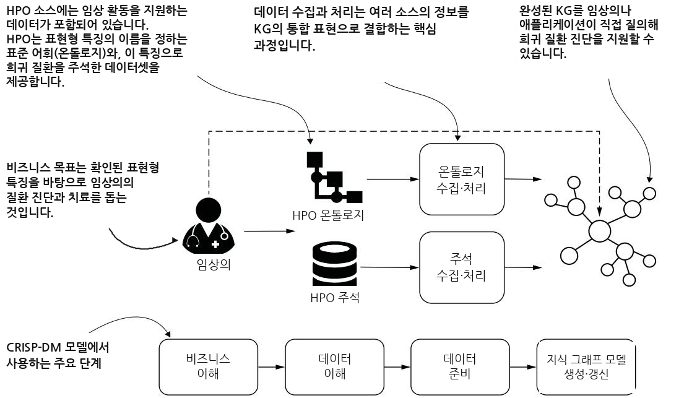
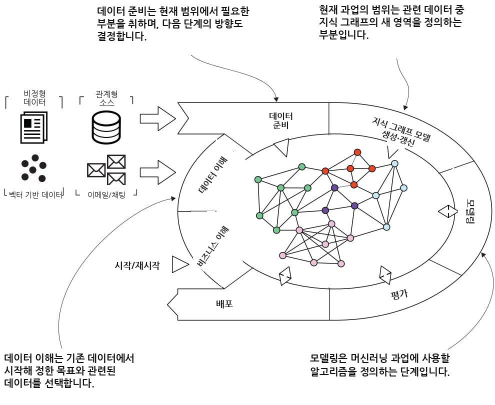
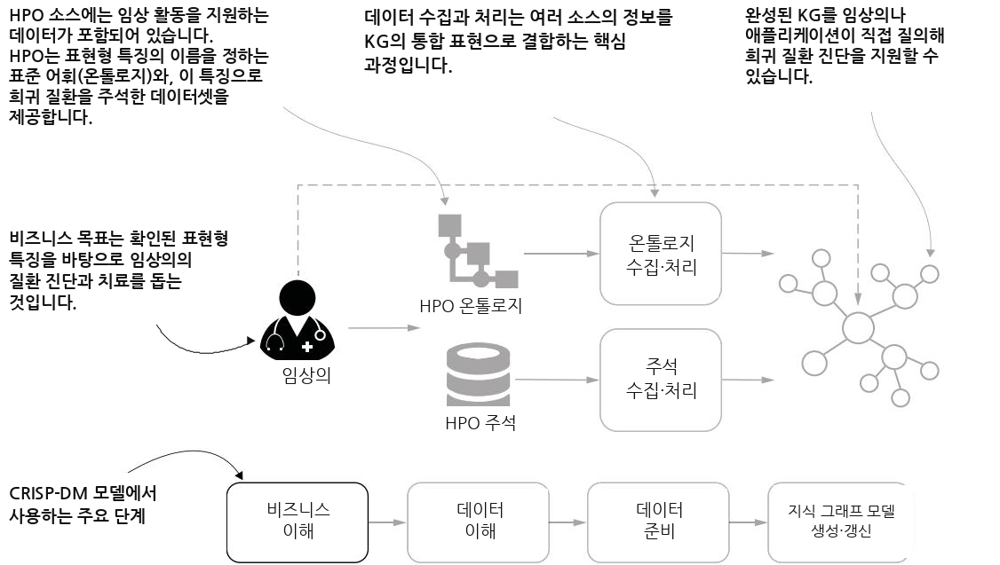
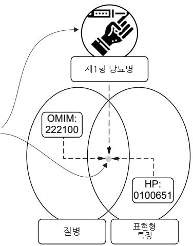
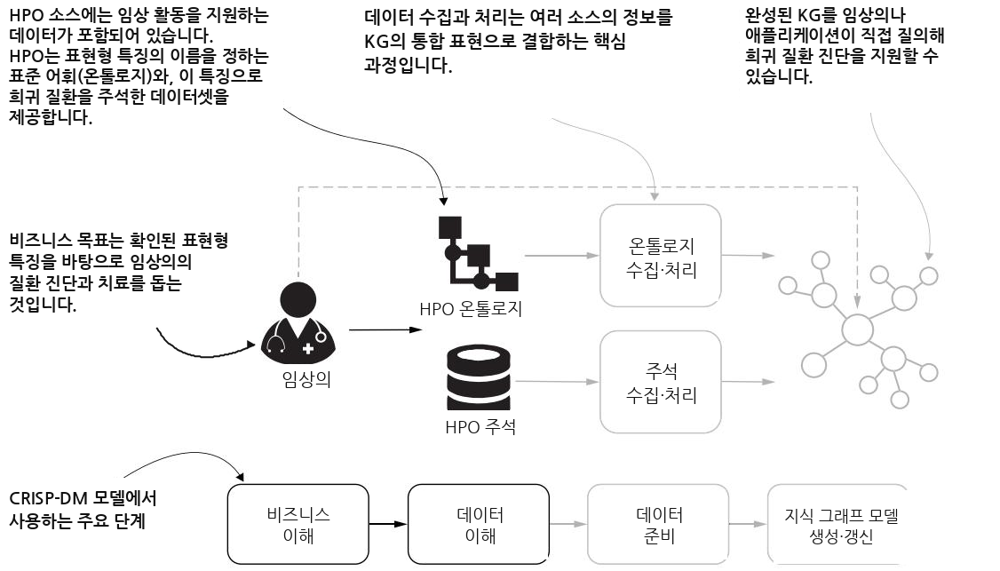
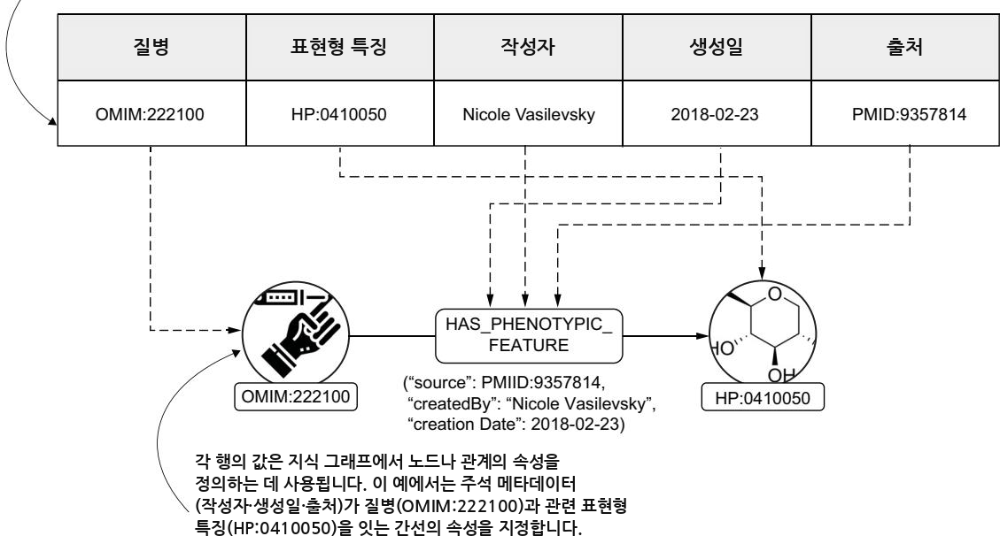
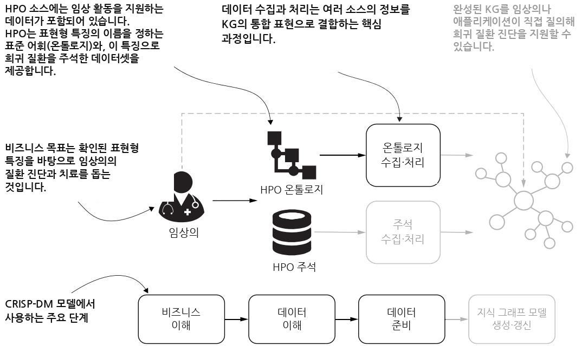
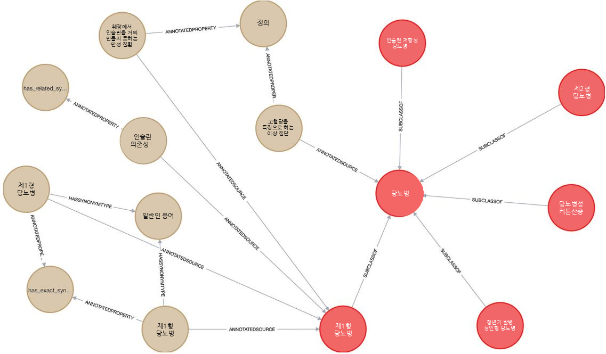
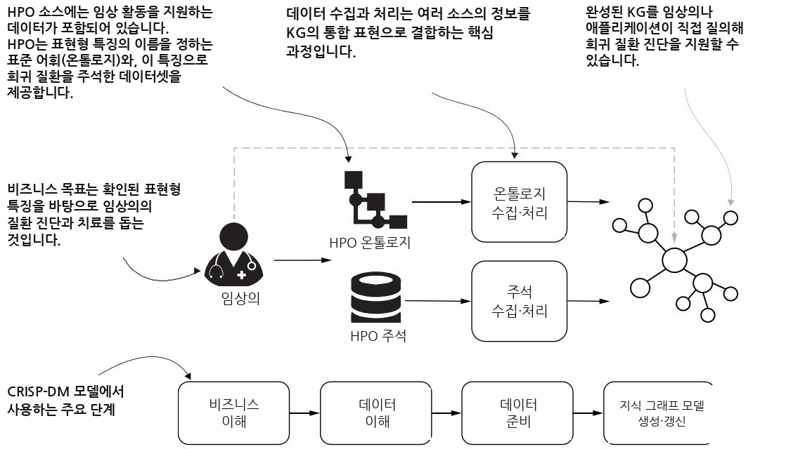
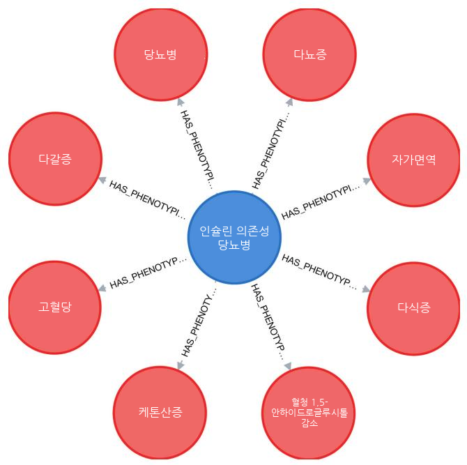

# 온톨로지로 첫 번째 지식 그래프 만들기 — 쉬운 해설판

> 이 글은 Alessandro Negro의 *Knowledge Graphs and LLMs in Action* 3장 "Create
> your first knowledge graph from ontologies"의 전체 내용을 빠짐없이 담되, 전문
> 용어와 코드, 스키마를 하나하나 풀어쓴 해설판입니다. 이 장은 이론이 아니라 **직접
> 지식 그래프를 만들어 보는 실습** 장이므로, 코드와 데이터 구조를 정확히 짚어가며
> 설명하겠습니다.

시작하기 전에, 이 책 1장에서 세워둔 두 주인공을 다시 떠올려 두면 좋습니다. **LLM(대규모 언어 모델)** 은 방대한 글을 읽어 박학다식하지만 가끔 없는 사실을 그럴듯하게 지어내는 달변가이고, **지식 그래프(knowledge graph, KG)** 는 검증된 사실만 구조적으로 정리한 사실 대장입니다. 이 장에서는 그 사실 대장을 **어떻게 처음부터 손으로 만드는가** 를 다룹니다. 아직 LLM은 본격적으로 등장하지 않지만, 나중에 LLM과 결합할 재료(신뢰할 수 있는 지식 그래프)를 짓는 과정이라고 생각하면 됩니다.

---

## Part(파트) 도입 — 구조화된 데이터로 지식 그래프 짓기

이 부(part)는 서로 다른 구조화된 데이터 소스들로부터 지식 그래프를 만드는, 복잡하지만 꼭 필요한 과정을 다룹니다. 이것은 비정형 정보로 그래프를 더 풍부하게 하고 대규모 언어 모델과 결합하기 **이전에** 반드시 거쳐야 하는 기초 단계입니다. 조직들은 저마다 고유한 스키마, 구조, 저장 형식을 가진 방대한 데이터 저장소를 유지합니다. 여기서의 도전 과제는 이 데이터를 **의미(semantic meaning)** 와 관계를 보존하면서 하나의 일관된 지식 그래프로 조화롭게 통합하는 것입니다. 이 부에서는 다양한 구조화 데이터 소스를 어떻게 통일된 지식 표현으로 변환하는지 단계별로 안내합니다.

핵심 주제 하나는 **데이터 품질과 검증(data quality and validation)** 의 중요성입니다. 왜냐하면 하위 응용(downstream applications)의 품질은 바탕이 되는 지식 표현의 신뢰성에 달려 있기 때문입니다. 여러분은 데이터 무결성을 확인하고, 개체 매칭(entity matching)을 정확히 수행하며, 지식 그래프의 의미적 정확성을 검증하는 방법을 배우게 됩니다.

이 부는 크게 두 장으로 이어집니다. **3장** 은 의료(healthcare) 예제를 제시합니다. 환자의 증상을 바탕으로 임상의가 희귀 질환을 진단하도록 돕는 지식 그래프를 만들어 봅니다. 온톨로지를 통한 의미 통합 같은 기초 개념을 소개하고, 지식 그래프 기술들을 비교하며, 직접 손으로 구현하는 실습 지침을 제공합니다. **4장** 은 단순 네트워크에서 여러 소스를 아우르는 포괄적 통합으로 나아가는 과정을 생의학(biomedical) 응용을 통해 탐구합니다. 커뮤니티 탐지 알고리즘과 도메인 특화 지표를 포함한 고급 분석 방법론을 보여주고, 결과 해석과 의사결정 지원을 위해 대규모 언어 모델을 통합하는 방법을 소개합니다.

이 두 장의 예제는 지식 그래프 구축의 기술적 측면을 보여줄 뿐 아니라, 그 원리들이 **어떤 도메인에서든** 현실 문제를 푸는 데 어떻게 적용될 수 있는지도 함께 보여줍니다.

---

### 온톨로지로 첫 번째 지식 그래프 만들기 — 장 소개

이 장의 제목 그대로, 우리는 **온톨로지(ontology)** 를 출발점으로 삼아 첫 번째 지식 그래프를 직접 만들어 봅니다. 온톨로지가 무엇인지는 곧 자세히 설명하겠지만, 지금은 "어떤 분야의 개념·속성·관계를 표준 어휘로 정의해 둔 사전 겸 설계도" 정도로 기억해 두면 됩니다.

### 이 장에서 다루는 것 — 학습 목표 미리보기

이 장은 세 가지를 목표로 합니다.

- 사용 사례(use case)에 근거해 **가장 알맞은 지식 그래프 기술을 고르는 법**
- 임상의의 활동을 지원하는 **지식 그래프를 실제로 구성하는 법**
- 지식 그래프 위에서 **분석과 온톨로지 기반 추론(ontology-based reasoning)을 수행하는 법**

지식 그래프 구축이 왜 복잡할까요? 정보를 추출하고 통합해야 하는 데이터 소스들이 여러 면에서 제각각이기 때문입니다. 형식이 다르고(XML, CSV, JSON), 저장 기술이 다르며(관계형 또는 문서 지향형), 정보를 적는 문법이 다르고(예: `2022-08-09` 또는 `9 August 2022`), 무엇보다 **데이터가 뜻하는 의미**가 다릅니다. 의료 분야를 예로 들면, 같은 개념을 가리키는 표현이 여러 개이거나(제2형 당뇨병 vs. 케토시스 저항성 당뇨병), 똑같은 약어가 서로 다른 개념을 정의하거나(PE가 신체검사(physical examination)일 수도, 폐색전증(pulmonary embolism)일 수도), 정보의 세분성(necrosis 즉 괴사냐, lobular necrosis 즉 소엽성 괴사냐)이 다른 경우가 흔합니다. 이 모든 것이 데이터 통합을 가로막는 장애물입니다.

지식 그래프를 만들 때 우리가 지향하는 것은, 여러 소스에서 온 데이터를 **통일되고(unified), 근거가 탄탄하며(well-grounded), 의미 있는(meaningful)** 하나의 표현으로 묶는 것입니다. 개별 정보 조각들이 하나의 일관된 관점으로 통합되어야 합니다. 그런데 데이터의 "의미"와 관련된 문제는 **의미 통합(semantic integration)** 으로 해결할 수 있습니다. 흔히 쓰는 전략은 하나 이상의 온톨로지를 들어오는 데이터의 **기준 스키마이자 어휘(reference schema and vocabulary)** 로 채택하는 것입니다. **온톨로지(ontology)** 란 데이터 안에서 기술되는 개체들의 공식 명칭, 속성, 범주, 개체 간 관계 같은 요소를 포함하는 표준 어휘로 데이터를 모델링하게 해 주는 틀입니다.

온톨로지는 의미적으로 이질적인 정보들 사이에서 **중개자(intermediary)** 역할을 합니다. 데이터 소스의 로컬 스키마를 온톨로지의 기준 스키마로 이어주는 것이 바로 **매핑(mapping)** 입니다. 우리는 각 데이터 요소를 온톨로지가 표현하는 개념에 매핑할 수 있고, 이 주석(annotation)들이 서로 다른 출처에서 온 데이터 요소들을 한자리에 모아줍니다.

이 장은 기준 온톨로지를 사용해 지식 그래프를 짓는 지침을 제공하는데, 초점은 임상의가 **희귀 질환(rare disease)** 을 식별하도록 돕는 데 있습니다. 우리는 데이터 이해와 준비 과정을 강조하면서, **인간 표현형 온톨로지(Human Phenotype Ontology, HPO; https://hpo.jax.org/app/)** 와 HPO로 주석이 달린 데이터셋을 수집·처리합니다. HPO 소스는 질환과 그에 연관된 **표현형 이상(phenotypic abnormalities)** 사이의 연결 정보를 제공합니다. 이 이상들은 전형적인 인간 특성에서 벗어난, 관찰 가능한 신체적·생화학적 특징을 뜻하며, 유전적 돌연변이나 환경적 영향, 또는 둘의 조합에서 비롯될 수 있습니다. 아울러 우리는 지식 그래프 기술들 사이의 차이를 살펴보고, 가장 알맞은 선택지를 고르기 위한 청사진을 제시합니다. 마지막으로 온톨로지 기반 추론을 포함한 일련의 분석을 정리하여, 임상의의 희귀 질환 진단을 지원합니다.

그림 3.1은 이 장의 **멘탈 모델(mental model)**, 즉 머릿속 지도를 제공합니다. 가운데는 우리 예제 맥락에서 지식 그래프를 만드는 단계들을 보여주고, 아래쪽은 다양한 시나리오에서 재사용할 수 있는 지식 그래프 구축의 추상적 파이프라인을 나타냅니다. 이 파이프라인의 구성 요소들은 2장에서 소개하고 그림 3.2에서 다시 보여주는 **CRISP-DM 모델** 의 한 변형에서 가져온 것입니다.



그림 3.1 지식 그래프 구축 과정을 CRISP-DM 모델의 구체화(specification)로 나타낸 멘탈 모델. 비즈니스 목표를 이해하는 것에서 시작해, 임상의의 활동을 지원하는 KG 질의를 정의하는 데까지 이른다.



그림 3.2 지식 그래프에 맞게 조정한 CRISP-DM 모델. 비즈니스 이해(business understanding), 데이터 이해(data understanding), 데이터 준비(data preparation), KG 모델 생성/갱신(KG model creation/update)을 포함한 일부 구성 요소가 이 장에서 다루는 핵심 단계다.

---

### 3.1 지식 그래프 짓기: 준비 운동 — 문제와 도메인 파악하기

지식 그래프를 만들기 전에, 우리는 먼저 풀고 싶은 문제를 분석하고, 응용 도메인의 큰 그림을 그리며, 쓸 만한 데이터를 찾아 나섭니다. 운동 전 준비 운동처럼, 코드를 짜기 전에 상황을 이해하는 단계입니다.

#### 3.1.1 비즈니스와 도메인 이해 — 임상의는 무엇을 필요로 하는가

우리 지식 그래프의 **타깃 페르소나(target persona)**, 즉 주 사용자는 **임상의(clinician)** 입니다. 질병을 진단하고 치료하는 의료 전문가죠. 임상의의 가장 복잡한 업무 중 하나는 증상(표현형 특징, phenotypic traits)을 바탕으로 질병을 정확히 식별하는 것이며, 특히 희귀 증후군의 경우 이 일이 몹시 까다롭습니다(그림 3.3 참조).



그림 3.3 임상의 활동을 지원하는 KG를 만들기 위해 비즈니스 도메인을 이해하는 단계. 이 단계는 기술적 측면과 엄밀히 연관되지는 않지만, 다음 단계들을 위한 근본적인 토대가 된다.

진단에 이르기 위해 특정 검사를 처방하는 것에 더해, 임상의는 가용 정보를 구조화한 **지식 베이스(knowledge base)** 를 활용할 수 있습니다. 이 지식 베이스는 다음 두 가지 기능을 갖추어야 합니다.

- **표현형 도메인의 맥락적 서술** — 예를 들어 같은 장기나 계통(system)에 관련된 표현형 이상들은 서로 명시적으로 연결되어 있어야 합니다.
- **표현형 이상과 질병 사이의 관계를 서술하는 데이터** — 이 정보는 임상의가 그 연결의 출처(source)에 접근할 수 있도록 반드시 추적 가능하게 기록되어야 합니다.

우리가 만들려는 지식 그래프는 바로 이 두 기능을 담아야 합니다. 응용 도메인을 더 잘 이해하기 위해, 몇 가지 정의를 짚고 넘어가겠습니다.

> **정의** — 어떤 질병을 가진 개인의 **표현형(phenotype)** 은, 그 개인이 나타내는 모든 표현형적 특징의 총합이라 할 수 있다 [1].

> **정의** — **질병(disease)** 은 (1) 특정 상태를 일으키는 원인들의 집합, (2) 시간적 경과(time course), (3) 표현형적 특징들의 묶음, (4) 특정 치료에 대한 특징적 반응으로 규정되는 개체다.

예를 들어 감기(common cold)는 발열과 피로 같은 뚜렷한 표현형적 특징으로 규정됩니다. 시간적 경과는 며칠에서 일주일 정도이며, 아스피린 같은 치료가 회복을 도울 수 있습니다.

그런데 임상의의 일에는 **회색 지대(gray areas)** 도 있습니다. 예를 들어 **당뇨병(diabetes mellitus)** 은 하나의 질병으로 분류될 수도 있고, 다른 희귀 증후군의 표현형적 특징으로 분류될 수도 있습니다(그림 3.4 참조). 우리는 임상의가 이런 종류의 불확실성을 다루도록 어떻게 도울 수 있는지를 보여주는 예시로 이 사용 사례를 다루겠습니다.



그림 3.4 제1형 당뇨병(Type 1 diabetes mellitus)은 질병으로 볼 수도, 표현형적 특징으로 볼 수도 있다. 맥락에 따라 서로 다른 두 개의 ID를 채택할 수 있다.

#### 3.1.2 데이터 이해 — HPO가 제공하는 두 갈래 정보

우리의 데이터 소스는 **인간 표현형 온톨로지(HPO)** 저장소입니다. 이 저장소는 우리 예제를 위해 두 종류의 정보를 제공합니다(그림 3.5). 첫 번째는 `hpo.owl`이라는 **RDF/XML** 파일(http://purl.obolibrary.org/obo/hp.owl)로, 표현형 이상에 관한 표준화된 정보를 담은 온톨로지입니다. 이런 표준화 덕분에 상호운용성(interoperability)이 가능해지고, 여러 소스의 데이터를 통합할 수 있게 됩니다. 리스팅 3.1은 `hpo.owl` 파일 중 제1형 당뇨병에 해당하는 부분을 보여주는데, 가독성을 위해 **Turtle(Terse RDF Triple Language)** 형식으로 직렬화(serialize)했습니다.



그림 3.5 임상의 활동을 지원하기 위해 데이터를 이해하는 단계. 이 탐색적(explorative) 단계에서 지식 그래프를 구성하는 데 필요한 핵심 정보를 얻는다.

아래 리스팅 3.1은 PDF에서 코드 바깥에 배치된 도해용 주석(callout)을 제외하고 Turtle 본문만 복원한 것입니다. 이 조각은 제1형 당뇨병을 URI `obo:HP_0100651`로 식별되는 **온톨로지 클래스(owl:Class)** 로 정의하고, 자연어 설명(`obo:IAO_0000115`), 작성자·작성일 같은 메타데이터, 외부 데이터베이스 상호참조(`hasDbXref`), 동의어(`hasExactSynonym`, `hasRelatedSynonym`), 그리고 이것이 상위 표현형 특징 `obo:HP_0000819`(당뇨병)의 하위 클래스임(`rdfs:subClassOf`)을 선언합니다.

#### Listing 3.1 hpo.owl에 들어 있는 제1형 당뇨병 상세 정보

```turtle
obo:HP_0100651 a owl:Class ;
    rdfs:label "Type I diabetes mellitus"^^xsd:string ;
    obo:IAO_0000115 "A chronic condition in which the pancreas produces little or no insulin…"^^xsd:string ;
    oboInOwl:created_by "doelkens"^^xsd:string ;
    oboInOwl:creation_date "2010-12-29T06:37:55Z"^^xsd:string ;
    oboInOwl:hasDbXref "MSH:D003922"^^xsd:string,
        "SNOMEDCT_US:46635009"^^xsd:string,
        "UMLS:C0011854"^^xsd:string ;
    oboInOwl:hasExactSynonym "Diabetes mellitus Type I"^^xsd:string,
        "Juvenile diabetes mellitus"^^xsd:string,
        "Type 1 diabetes",
        "Type I diabetes" ;
    oboInOwl:hasRelatedSynonym "Insulin-dependent diabetes mellitus"^^xsd:string ;
    oboInOwl:id "HP:0100651"^^xsd:string ;
    rdfs:comment "The onset of type 1 diabetes is typically during adolescence…"^^xsd:string ;
    rdfs:subClassOf obo:HP_0000819 .
```

**OWL 파일을 읽는 것은 만만치 않은 일**입니다. 그래서 `rdflib`라는 파이썬 라이브러리를 써서 이 파일을 **트리플(triple)** 의 모음으로 탐색할 수 있습니다. 트리플이란 주어(subject), 술어(predicate), 목적어(object) 이 세 요소로 이루어진 문장 단위이며, 리스팅 3.2에 그 처리 방법이 나와 있습니다.

#### Listing 3.2 rdflib 파이썬 라이브러리로 OWL 파일 처리하기

아래 코드는 `rdflib`로 `hp.owl`을 파싱해 그래프 객체(`g`)로 만든 뒤, 자주 쓰는 네임스페이스(obo, rdf, rdfs, xsd)에 짧은 접두어를 묶어(`bind`) 두고, 특정 주어 URI(`HP_0100651`)와 관련된 트리플만 골라 출력합니다.

```python
from rdflib import Graph, URIRef
g = Graph()
g.parse("hp.owl", format="xml")
g.bind("obo", "http://purl.obolibrary.org/obo/")
g.bind("rdf", "http://www.w3.org/1999/02/22-rdf-syntax-ns#")
g.bind("rdfs", "http://www.w3.org/2000/01/rdf-schema#")
g.bind("xsd", "http://www.w3.org/2001/XMLSchema#")
subject_uri = URIRef("http://purl.obolibrary.org/obo/HP_0100651")
filtered_statements = g.triples((subject_uri, None, None))
for subject, predicate, obj in filtered_statements:
    print(
        f"({g.qname(subject)}, {g.qname(predicate)}, "
        f"{g.qname(obj) if isinstance(obj, URIRef) else obj})"
    )
    print()
```

`for`문 안에서는 각 트리플을 `(주어, 술어, 목적어)` 형태로 출력합니다. 목적어가 URI일 때는 짧은 이름(`qname`)으로 바꾸고, 아니면 값 그대로 보여 줍니다. 이 스크립트의 출력은 다음과 같습니다(가독성을 위해 긴 문자열은 잘라냈습니다).

#### Listing 3.3 OWL 파일을 트리플 집합으로 나타낸 예시

아래 각 줄은 하나의 트리플입니다. 예를 들어 첫 줄은 "`obo:HP_0410050`이라는 개체의 타입(`rdf:type`)은 `owl:Class`이다"라는 뜻이고, 세 번째 줄은 그것이 `obo:HP_0011013`의 하위 클래스라는 뜻입니다. `rdfs:label`은 사람이 읽을 이름표를, `hasExactSynonym`은 정확한 동의어를 담습니다.

```text
(obo:HP_0410050, rdf:type, owl:Class)
(obo:HP_0410050, owl:equivalentClass, N25507ac984704bd78a0effd951947a7f)
(obo:HP_0410050, rdfs:subClassOf, obo:HP_0011013)
(obo:HP_0410050, obo:IAO_0000115, A decrease in the level of…)
(obo:HP_0410050, dc:date, 2018-01-27T00:26:24+00:00)
(obo:HP_0410050, dcterms:creator, ns1:0000-0001-5208-3432)
(obo:HP_0410050, oboInOwl:hasExactSynonym, Decreased level of 1,5-AG…)
(obo:HP_0410050, oboInOwl:hasExactSynonym, Decreased level of 1,5-anhydro…)
(obo:HP_0410050, rdfs:label, Decreased level of 1,5 anhydroglucitol in serum)
```

HPO 저장소에서 오는 두 번째 정보는 `phenotype.hpoa`라는 **탭 구분 값(tab-separated-values, TSV)** 파일에 담겨 있습니다. 이 파일은 여러 질병(희귀 증후군 포함)과 연관된, 인정되고 발견되고 주석 처리된 표현형 특징들을 모아 둡니다. 이 주석들에는 각 특징의 발병 연령(age of onset)과 질병과 함께 나타나는 빈도(frequency)를 명확히 해 주는 **수식어(modifier)** 가 포함됩니다. 다음 리스팅은 이 주석 파일의 예시입니다.

#### Listing 3.4 phenotype.hpoa 파일의 예시

아래는 원본 그대로의 표본입니다. 첫 두 줄은 열(column) 이름들이고, 그 아래로 실제 데이터 행이 이어집니다. 탭으로 구분되지만 여기서는 줄바꿈되어 보입니다.

```text
database_id disease_name qualifier hpo_id reference evidence
onset frequency sex modifier aspect biocuration
OMIM:222100 Diabetes mellitus, insulin-dependent-1
HP:0410050 PMID:9357814;PMID:17659063;PMID:16731998
PCS 30/30 P
HPO:NicoleVasilevsky[2018-02-23];HPO:NicoleVasilevsky[2018-03-02]
OMIM:222100 Diabetes mellitus, insulin-dependent-1
HP:0000103 OMIM:222100
IEA P HPO:iea[2009-02-17]
```

이 파일은 다음 필드들을 포함합니다.

- **database_id (`OMIM:222100`)** — 질병 식별자. Online Mendelian Inheritance in Man(OMIM)이나 Orphanet 같은 온톨로지에서 온 것입니다.
- **disease_name (`Diabetes mellitus, insulin-dependent-1`)** — 관련 온톨로지에서 가져온 질병 이름입니다.
- **hpo_id (`HP:0410050`)** — 연관된 표현형 이상의 HPO 식별자입니다.
- **reference (`PMID:9357814;PMID:17659063;PMID:16731998`)** — 주석에 쓰인 정보의 출처입니다. 관련 PubMed ID(PMID)로 표시된 논문일 수 있습니다.
- **evidence (`PCS`)** — 주석을 뒷받침하는 증거 수준입니다. PCS는 발표된 임상 연구(published clinical study)를 뜻합니다.
- **frequency (`30/30`)** — 공통 통계적 특성을 가진 사람들 무리 안에서 영향을 받은 환자 수의 셈입니다. `30/30`은 해당 질병을 가진 30명의 환자 중 30명 모두에게서 그 HPO 용어가 가리키는 표현형 이상이 발견됐다는 뜻입니다.
- **aspect (`p`)** — 표현형 측면(phenotypic aspect). P는 표현형 이상(phenotypic abnormality)을 의미합니다.
- **biocuration (`HPO:NicoleVasilevsky[2018-02-23];HPO:NicoleVasilevsky[2018-03-02]`)** — 주석을 만든 연구센터 또는 사용자, 그리고 주석이 만들어진 날짜입니다.

더 자세한 내용은 https://mng.bz/EwAo 를 참고하세요.

---

### 3.2 지식 그래프 기술 이해하기 — RDF와 LPG, 두 갈래 길

이제 데이터를 이해했으니, 다음 단계는 가용 소스로부터 데이터를 수집하고 처리하는 것입니다. 하지만 그 전에, 우리 사용 사례에 맞는 정보에 근거한 결정을 내리기 위해 서로 다른 지식 그래프 기술들을 살펴보겠습니다.

지식 그래프를 만드는 가장 인기 있는 두 접근법은 **자원 기술 프레임워크(Resource Description Framework, RDF)** 와 **레이블드 속성 그래프(Labeled Property Graph, LPG)** 입니다. RDF는 웹상의 데이터 교환을 위해 **월드와이드웹 컨소시엄(W3C)** 이 정의하고 규정한 표준 프레임워크입니다. RDF에서 각 문장(statement)은 세 요소, 즉 주어·술어·목적어로 이루어진 **트리플** 입니다. 주어는 그래프의 노드(정점, vertex)이고, 술어는 관계(간선, edge)를 나타내며, 목적어는 또 다른 노드입니다. 이 프레임워크는 지식 그래프를 문장들의 모음으로 모델링하며, 우리는 웹 기술을 써서 정보를 표현·저장·교환할 수 있습니다. RDF는 특정 지식 도메인을 서술하는 온톨로지를 만드는 데 특히 적합합니다.

**LPG** 는 그래프 데이터에 대한 빠른 질의 기반 순회(query-based traversal)와 경로 분석(path analysis) 기능을 제공합니다. 노드와 관계에 결합된 **키–값 쌍(key–value pairs)** 형태의 구조화된 정보 덕분에, 데이터 저장과 접근의 효율이 보장됩니다.

RDF에서 관계(트리플)는 **전역적으로(globally)** 정의됩니다. 그래서 어떤 술어에 적용된 메타데이터는 그래프 전체에 걸쳐 그 관계의 모든 인스턴스에 영향을 줍니다. 이 한계를 다루기 위해 RDF는 예컨대 **명명된 그래프(named graphs)** 를 지원하는데, 이는 트리플 묶음을 하나의 개체처럼 다루면서 맥락별(context-specific) 정보를 제공하게 해 줍니다. 반면 LPG는 노드 사이에 **고유한 간선(unique edges)** 을 지원하여, 개별 관계마다 메타데이터와 속성을 붙일 수 있게 합니다. 이는 간선 고유의 정보를 표현하기에 유연한 모델입니다. RDF-DEV 커뮤니티 그룹은 사용자가 간선에 속성을 추가할 수 있게 해 RDF와 LPG 기술을 화해시키는 **RDF\*("RDF-star")** 명세를 작업하고 있습니다.

LPG는 RDF의 고급 의미론(advanced semantics)을 표현하지 못합니다. 이 문제를 해결하기 위해 Neo4j 같은 벤더는 RDF와 LPG 사이의 간극을 줄여 주는 도구를 제공합니다. **Neosemantics 플러그인** 은 Neo4j 안에서 RDF와 그 어휘들(OWL, RDFS, SKOS 등)을 사용해 기본적인 추론(inference)을 실행하게 해 줍니다. Amazon Neptune 같은 다른 벤더는 RDF 데이터 위에서 **Cypher 질의(LPG 그래프의 질의 언어)** 를 실행하게 해 주는 대안 전략을 씁니다. 다음 절에서는 우리 예제 사용 사례에 RDF와 LPG를 채택할 때의 한계와 기회를 살펴보겠습니다.

#### 3.2.1 RDF냐 LPG냐? 목표 중심의 논의 — 어느 쪽이 우리에게 맞나

지식 그래프를 짓기에 가장 좋은 기술을 고르려면, 가용 정보(우리 경우 HPO 온톨로지와 주석 데이터)를 더 잘 이해하고 명확한 목표를 가져야 합니다. 앞서 RDF가 온톨로지를 만드는 데 특히 적합하다고 했는데, 바로 그 이유로 HPO 온톨로지가 RDF로 직렬화되어 있는 것입니다. HPO 파일의 확장자는 `.owl`입니다. OWL은 **웹 온톨로지 언어(Web Ontology Language)** 를 뜻하며, 그 주된 목표는 RDF에서 이용 가능한 의미 정보를 풍부하게 하여 표현력 있는 클래스 정의와 속성 정의를 지원하는 것입니다. OWL 온톨로지는 널리 쓰이며, GPT와 Claude를 포함한 많은 LLM이 이 온톨로지들로 학습되었습니다. 그래서 이들 모델이 OWL 기반 데이터를 해석하고 그 위에서 추론하기가 더 쉽습니다.

우리 사용 사례의 임상의들은 지식이 **어떻게 모델링되는지**에는 관심이 없습니다. 그들이 원하는 것은 표현형 특징의 **모호하지 않은 표현**, 가능하면 계층적 구조로 정리된 표현입니다. 주석 데이터의 핵심 정보는 흔히 과학 문헌에서 오며, 특정 표현형 특징이 어떤 질병과 함께 식별된 사례들로 이루어집니다. 예를 들어 "제1형 인슐린 의존성 당뇨병(Diabetes Mellitus, Insulin-dependent-1, OMIM:222100)"과 "혈청 내 1,5 anhydroglucitol 수치 감소(Decreased level of 1,5 anhydroglucitol in serum, HP:0410050)" 사이의 연결을 보여주는 항목은, "A kinetic mass balance model for 1,5-anhydroglucitol: applications to monitoring of glycemic control" [3] (PMID: 9357814)라는 임상 연구에서 발표되었고, 2018년 2월 Nicole Vasilevsky가 만들었습니다. 이 정보를 모델링하는 가장 좋은 방법은 그 세부 정보를 **질병과 표현형 특징 사이의 관계 안에** 통합해 넣는 것입니다. 이렇게 모델링하면, 각각이 출처와 날짜로 특징지어지는 특정 주석을 나타내는 **여러 개의 관계** 를 만들 수 있습니다.

그림 3.6은 표(table) 구조로 된 주석 데이터를 어떻게 지식 그래프의 간선으로 변환하는지 보여줍니다. 질병과 표현형 특징은 노드로 표현되고, 주석 작성자·생성일·출처에 관한 정보는 간선(그림에서는 `HAS_PHENOTYPIC_FEATURE`)의 속성으로 지정됩니다.



그림 3.6 표의 한 행에서 KG 간선으로의 데이터 변환. 표 안의 정보가 KG 노드와 간선의 속성을 정의하는 데 맞게 조정된다.

#### Exercise(연습문제) — 가장 알맞은 기술을 직접 골라보기

예제 사용 사례에서 임상의의 활동을 지원할 가장 좋은 기술을 직접 골라 보세요. 주요 요구사항을 다시 정리하면 다음과 같습니다.

- 임상의의 목표는 가용 데이터를 사용해, 질병(특히 희귀 병리)을 진단할 때 정보에 근거한 결정을 내리는 것입니다.
- 임상의는 임상 도메인 **전체** 를 표현하는 지식 베이스에는 관심이 없습니다. 그들은 이상 표현형 특징(또는 그 조합)이 발견하기 어려운 질병과 연관될 수 있는 사례들을 보고 싶어 합니다. 이 때문에 그런 사례들을 그 출처와 날짜까지 포함해 보고하는 정보를 원합니다.
- 이 메타데이터를 사용해, 임상의는 특정 표현형 특징이 어떤 질병과 연관된 모든 사례를 쉽게 비교하고 싶어 합니다.

올바른 기술 선택에는 유일한 정답이 없습니다. 하지만 가장 알맞은 것을 고르면 정해진 목표에 더 직접적인 방식으로 도달하는 데 도움이 됩니다. 이 연습은 다른 도메인과 응용에도 응용해 볼 수 있습니다.

#### 3.2.2 RDF와 LPG로 간선 속성을 표현하기 — 네 가지 방식 비교

우리의 관점에서 볼 때, 데이터를 표현하기에 가장 좋은 해법은 **LPG** 입니다. LPG는 표현형 특징과 질병을 잇는 **간선에 대한 정보** 를 강조하기 때문입니다. 왜 LPG가 가장 알맞은 기술인지 분명히 하기 위해, RDF와 LPG를 구체적으로 비교해 보겠습니다. 목표는 어떤 주석과 관련된 모든 정보(출처, 작성자, 생성일 포함)를 조회하는 것입니다. 앞서 언급했듯이 RDF에서는 이런 데이터를 표현하는 여러 메커니즘을 쓸 수 있는데, 다음 절들에서 하나씩 살펴봅니다.

#### RDF: N항 관계(N-ARY RELATIONS) — 새 개념을 만들어 잇기

특정 간선에 관련된 데이터를 모델링하는 표준 접근법은 **N항 관계(n-ary relations)** 를 채택하는 것입니다. 이 접근법에서는 데이터를 연결하기 위한 **새로운 개념** 을 하나 만드는데, 우리 예제에서는 그것을 주석(annotation)으로 정의합니다. 리스팅 3.5의 RDF 표현과 리스팅 3.6의 관련 SPARQL 질의를 살펴보세요.

아래 리스팅 3.5는 Turtle 구문으로 표현한 표현형 주석입니다. `_:Annotation`은 **공백 노드(blank node)** 로, 전역 식별자를 부여하지 않은 채 관련 정보를 묶기 위해 쓰는 이름 없는 자원입니다.

#### Listing 3.5 N항 관계의 예시

```turtle
_:Annotation rdf:type :PhenotypicAnnotation ;
    :forDisease OMIM:222100 ;
    :phenotypicFeature HP:0410050 ;
    :source PMID:9357814 ;
    :createdBy "Nicole Vasilevsky" ;
    :creationDate "2018-02-23"^^xsd:date .
```

이 RDF 조각은 Turtle 구문을 써서 표현형 주석 하나를 나타냅니다. 이 주석은 공백 노드(`_:Annotation`)로 표현되는데, 공백 노드란 존재하지만 특정 이름이 필요하지 않은 무언가를 위한 자리표시자(placeholder)로, 프로그래밍의 익명 객체와 비슷하다고 보면 됩니다.

이 공백 노드는 `:PhenotypicAnnotation` 타입으로 지정되며, 질병(OMIM ID로 식별)과 표현형 특징(HPO에서 온 것)을 이어줍니다. 추가 메타데이터로는 데이터 출처(PubMed ID), 주석 작성자, 생성일이 있습니다. 이 구조는 생의학 데이터셋에서 출처 추적(provenance tracking)과 의미적 상호운용성을 지원합니다.

아래 리스팅 3.6은 이 구조를 조회하는 SPARQL 질의입니다.

#### Listing 3.6 N항 관계 맥락의 SPARQL 질의

```sparql
SELECT ?source ?author ?date
WHERE {
    ?annotation a :PhenotypicAnnotation ;
        :forDisease OMIM:222100 ;
        :phenotypicFeature HP:0410050 ;
        :source ?source ;
        :createdBy ?author ;
        :creationDate ?date .
}
```

이 SPARQL 질의는 특정 표현형 주석에 관한 메타데이터를 조회합니다. 주어진 질병(OMIM:222100)과 표현형 특징(HP:0410050)으로 주석을 걸러낸 뒤, 정보의 출처, 주석을 만든 작성자, 만든 날짜를 반환합니다.

많은 경우 데이터 소비자는 원래 스키마의 변경을 쉽게 해석하고 적응할 수 있습니다. 그러나 온톨로지가 진화하면서 그 복잡도가 커질 수 있고, 이는 잠재적으로 하위 호환성(backward compatibility)과 장기 유지보수와 관련된 어려움을 낳을 수 있습니다.

#### RDF: 명명된 그래프(NAMED GRAPHS) — 네 번째 요소를 더하기

**RDF 명명된 그래프(named graphs)** 는 이 문장이 어떤 명명된 (하위)그래프의 일부임을 명시하는 **네 번째 요소** 를 포함하며, 그 자체를 RDF 그래프의 한 노드로 간주할 수 있습니다. 따라서 우리는 주석과 관련된 데이터를 붙이기 위해 새로운 문장을 만들 수 있습니다. 이 접근법은 리스팅 3.7로 표현되고, SPARQL 질의는 리스팅 3.8에 정의됩니다.

#### Listing 3.7 명명된 그래프의 예시

```trig
:Graph1 {
    OMIM:222100 :hasPhenotypicFeature HP:0410050 .
}
:Graph1
    :source PMID:9357814 ;
    :createdBy "Nicole Vasilevsky" ;
    :creationDate "2018-02-23"^^xsd:date .
```

이 RDF 예시는 **TriG 구문** 을 써서 명명된 그래프 `:Graph1`을 정의합니다. 쉽게 말해 TriG는 RDF 문장들을 하나의 이름표(명명된 그래프) 아래에 묶고 메타데이터를 붙일 수 있게 해 줍니다. 이 그래프 안에서 트리플은 질병 OMIM:222100이 표현형 특징 HP:0410050을 가진다고 단언합니다. 이 단언에 대한 메타데이터는 `:Graph1`에 붙는데, 출처(PMID:9357814), 작성자("Nicole Vasilevsky"), 생성일이 포함됩니다.

#### Listing 3.8 명명된 그래프 맥락에서의 SPARQL 질의

```sparql
SELECT ?source ?author ?date
WHERE {
    GRAPH :Graph1 {
        OMIM:222100 :hasPhenotypicFeature HP:0410050 .
    }
    :Graph1 :source ?source ;
        :createdBy ?author ;
        :creationDate ?date .
}
```

이 SPARQL 질의는 명명된 그래프에 저장된 특정 표현형 주석에 관한 메타데이터를 조회합니다. 그래프 `:Graph1` 안을 들여다보아 OMIM:222100이 표현형 특징 HP:0410050을 가진다는 트리플을 찾습니다. 그런 다음 `:Graph1`에 관한 메타데이터를 질의하여 출처, 작성자, 생성일을 반환합니다.

명명된 그래프는 맥락적 메타데이터와 출처를 표현하는 데 강력하지만, 복잡도를 더할 수 있습니다. 특히 명명된 그래프가 아주 많아지면 데이터 저장과 교환의 비효율로 이어질 수 있습니다. 명명된 그래프 안의 개별 문장에 대한 세밀한(fine-grained) 갱신도 까다로울 수 있습니다.

#### RDF-STAR — 간선에 속성을 붙이는 확장

앞서 말했듯 **RDF-star** 는 RDF와 LPG 같은 속성 그래프 모델 사이의 간극을 좁히는 RDF의 확장입니다. 이 접근법은 다음 두 리스팅으로 설명됩니다.

#### Listing 3.9 RDF-star의 예시

여기서 이중 꺾쇠(`<< >>`)는 트리플 하나를 통째로 감싸 그것을 다시 주어로 삼는 문법입니다. 즉 "OMIM:222100이 HP:0410050을 표현형 특징으로 가진다"는 트리플 자체에 출처·작성자·생성일 속성을 붙입니다. PDF에는 `PMID:`와 숫자 사이에 공백이 있지만, QName으로 해석될 수 있도록 실행 가능한 `PMID:9357814`로 바로잡았습니다.

```turtle
<<OMIM:222100 :hasPhenotypicFeature HP:0410050>>
    :source PMID:9357814 ;
    :createdBy "Nicole Vasilevsky" ;
    :creationDate "2018-02-23"^^xsd:date .
```

#### Listing 3.10 RDF-star 맥락에서의 SPARQL-star 질의

PDF의 마지막 변수는 `? date`로 인쇄되어 있지만, SPARQL 변수 이름에는 공백을 둘 수 없으므로 `?date`로 바로잡았습니다. `WHERE` 키워드는 SPARQL에서 생략할 수 있습니다.

```sparql
SELECT ?source ?author ?date {
    <<OMIM:222100 :hasPhenotypicFeature HP:0410050>>
        :source ?source ;
        :createdBy ?author ;
        :creationDate ?date .
}
```

RDF-star는 간선에 속성을 붙이는 방향으로 한 걸음 나아간 것이고, 더 읽기 좋은 SPARQL 질의를 씁니다. 그러나 질의 성능은 아직 개선이 필요하며, Orlandi 등(Orlandi et al.) [2]이 지적한 대로 "새로운 구문 확장을 사용하려면 RDF 엔진의 특정 구현이 필요하고, 따라서 이 접근법의 채택이 제한된다."

RDF 문장에 주석을 다는 다른 방법들도 있습니다. **재구체화(reification)** 와 **싱글턴 속성(singleton properties)** 등이 그것인데, 이들은 현실 응용에서 덜 쓰입니다. 실무에서는 명명된 그래프나 N항 관계처럼 더 확장성 있고 유지보수하기 좋은 대안이 선호됩니다.

#### LPG — 관계 안에 곧바로 속성을 담기

**LPG 접근법** 은 주석의 세부 정보를 관계 안에 곧바로 **키–값 쌍** 으로 표현합니다. 이 모델링 방식의 예시와 그에 대응하는 Cypher 질의를 다음에 보입니다.

#### Listing 3.11 LPG 표현의 예시

PDF의 조각에는 속성 사이의 쉼표와 `creationDate`의 닫는 따옴표가 빠져 있습니다. 아래에서는 Cypher 패턴으로 읽을 수 있도록 문장부호를 바로잡았습니다. 노드 `d`는 질병, 노드 `p`는 표현형이고, 그 사이의 `:HAS_PHENOTYPIC_FEATURE` 관계 안에 출처·작성자·생성일이 키–값으로 들어갑니다. 이 리스팅은 완전한 실행문이 아니라 **패턴 표현** 이므로 실제로 생성하려면 앞에 `CREATE` 또는 `MERGE`를 붙여야 합니다.

```cypher
(d { id: "OMIM:222100" })
-[:HAS_PHENOTYPIC_FEATURE {
    source: "PMID:9357814",
    createdBy: "Nicole Vasilevsky",
    creationDate: "2018-02-23"
}]->
(p { id: "HP:0410050" })
```

두 노드는 개체를 나타냅니다. 질병(OMIM:222100)과 표현형(HP:0410050)입니다. 관계 `:HAS_PHENOTYPIC_FEATURE`가 이 둘을 잇고, 주석의 출처("PMID:9357814"), 작성자("Nicole Vasilevsky"), 생성일("2018-02-23")을 서술하는 키–값 쌍을 포함합니다.

#### Listing 3.12 Cypher 질의 예시

```cypher
MATCH (d)-[r:HAS_PHENOTYPIC_FEATURE]->(p)
WHERE d.id = "OMIM:222100" and p.id = "HP:0410050"
RETURN r.source, r.createdBy, r.creationDate
```

이 Cypher 질의는 질병 노드와 표현형 노드 사이의 `:HAS_PHENOTYPIC_FEATURE` 관계에 붙은 메타데이터를 조회합니다. 그래프에서 이 패턴을 매칭하고, 노드 ID로 걸러낸 뒤, 관계에 저장된 주석 세부 정보를 반환합니다.

이 예시들이 보여주듯, LPG 모델은 메타데이터가 풍부한 관계를 표현력 있고 접근하기 쉬운 방식으로 모델링하기에 매우 적합합니다. 이런 이유로 우리는 지식 그래프 시스템을 짓는 핵심 도구로 **LPG와 Cypher** 를 채택하겠습니다.

---

### 3.3 지식 그래프 짓기 — 온톨로지 적재와 주석 수집, 두 단계

이제 첫 지식 그래프를 짓는 세부로 들어가 봅시다. 과정은 두 단계입니다. **온톨로지를 적재하는 단계** 와, 그 온톨로지를 기준으로 삼아 **데이터 소스를 수집(ingest)하는 단계** 입니다.

> **참고(NOTE)** — 지식 그래프를 만들려면, GitHub 저장소(https://github.com/alenegro81/knowledge-graphs-and-llms-in-action/tree/main/chapters/ch03)의 코드를 실행하거나, 이 절의 Cypher 질의들을 Neo4j 브라우저에서 테스트하면 됩니다. 이 코드는 Neo4j(버전 5.20.0 Enterprise Edition, Neo4j Desktop 1.6.1 애플리케이션으로 설치), APOC 라이브러리(버전 5.20.0), Neosemantics 플러그인(버전 5.20.0)으로 테스트되었습니다. Neo4j와 플러그인 설치 방법은 온라인 부록 B에 있습니다. 각 질의는 설명하지만, Cypher 질의 언어에 대한 기본 이해가 있다고 가정합니다. 결과는 2025년 2월에 이용 가능했던 HPO 버전에서 도출되었습니다.

#### 3.3.1 Neosemantics로 온톨로지 수집·처리하기 — 데이터베이스 준비부터 어휘 적재까지

그림 3.7은 온톨로지 수집·처리 단계를 보여줍니다. 첫 단계는 다음 명령으로 HPO 데이터베이스를 만들고 초기화하는 것입니다.

#### Listing 3.13 Neo4j에 HPO 데이터베이스 만들기

```cypher
CREATE DATABASE hpo IF NOT EXISTS
```



그림 3.7 온톨로지 수집 및 처리(Ontology ingestion and processing)

다음 리스팅에서는 `Resource` 레이블이 붙은 노드의 `uri`와 `id` 속성이 유일함을 보장하는 **제약조건(constraint)** 을 세웁니다. 또 `HpoPhenotype`과 `HpoDisease` 노드의 `id` 속성에 대한 **인덱스(index)** 를 만들어, 지식 그래프 구축 단계와 정보 검색 단계에서 이 정보에 더 빠르게 접근하도록 합니다. `HpoPhenotype`과 `HpoDisease` 레이블은 각각 우리의 표현형 이상 노드와 질병 노드를 정의합니다.

#### Listing 3.14 제약조건과 인덱스 만들기

```cypher
CREATE CONSTRAINT n10s_unique_uri IF NOT EXISTS FOR (r:Resource) REQUIRE r.uri IS UNIQUE;
CREATE CONSTRAINT IF NOT EXISTS FOR (n:Resource) REQUIRE (n.id) IS UNIQUE;
CREATE INDEX disease_id IF NOT EXISTS FOR (n:HpoDisease) ON (n.id);
CREATE INDEX phenotype_id IF NOT EXISTS FOR (n:HpoPhenotype) ON (n.id);
```

두 번째 단계는 Neosemantics 컴포넌트의 초기 설정을 정의하는 것입니다.

#### Listing 3.15 Neosemantics 플러그인 설정하기

```cypher
CALL n10s.graphconfig.init();
CALL n10s.graphconfig.set({ handleVocabUris: "IGNORE" });
CALL n10s.graphconfig.set({ applyNeo4jNaming: True });
```

이 설정은 데이터 임포트를 위한 두 가지 주요 규칙을 정의합니다. 첫 번째 규칙은 임포트 단계에서 **네임스페이스(namespace)를 무시** 합니다(네임스페이스는 비슷한 표현을 쓰는 서로 다른 온톨로지들을 구분해 추적하는 데 도움을 줄 수 있습니다). 두 번째 규칙은 관계 타입을 **대문자로 인코딩** 하여, LPG 관계의 표준 표기를 따릅니다.

다음 단계는 HPO 어휘를 적재하는 것입니다.

#### Listing 3.16 HPO 어휘를 Neo4j에 적재하기

```cypher
CALL n10s.rdf.import.fetch("http://purl.obolibrary.org/obo/hp.owl","RDF/XML");
```

우리의 테스트에서 이 명령은 Neo4j에 **899,558개의 문장** 을 적재했습니다. 주석 데이터를 처리·적재하기 전에, 우리는 노드에 `HpoPhenotype` 레이블과, 자원의 원래 URI에서 계산한 `id` 속성을 붙여 노드를 풍부하게 할 수 있습니다.

아래 리스팅 3.17은 `uri`가 `http://purl.obolibrary.org/obo/HP`로 시작하는 모든 `Resource` 노드를 찾아, `HpoPhenotype` 레이블을 붙이고, URI를 가공해 `HP:0000001` 같은 `id`를 설정합니다. `coalesce`는 기존 `id`가 있으면 그대로 두고 없을 때만 새 값을 넣게 해 줍니다.

#### Listing 3.17 노드 보강하기

```cypher
MATCH (n:Resource)
WHERE n.uri STARTS WITH "http://purl.obolibrary.org/obo/HP"
SET n:HpoPhenotype,
       n.id = coalesce(n.id,
   replace(apoc.text.replace(n.uri,'(.*)obo/',''),'_', ':'))
```

이제 지식 그래프의 현재 상태를 점검해 봅시다. 리스팅 3.18은 이 그래프의 작은 일부를 조회하는 코드로, 그림 3.8에 그 결과가 나와 있습니다. Neo4j 브라우저에서 이 코드를 실행해 직접 탐색해 볼 수 있습니다.



그림 3.8 LPG를 저장 모델로 삼아 그래프 데이터베이스에 적재된 HPO 온톨로지의 일부. 두 종류의 정보를 구별할 수 있다. 온톨로지 정보(왼쪽)와, 표현형 특징과 관련된 도메인 특화 정보(오른쪽)다.

#### Listing 3.18 현재 단계의 KG 일부 보여주기

아래 질의는 "Diabetes mellitus"의 하위 클래스 경로(`path1`), 관련 주석 소스 경로(`path2`), 그리고 동의어 타입 등의 경로(`path3`)를 함께 조회합니다.

```cypher
MATCH path1=(n:HpoPhenotype)<-[:SUBCLASSOF]-(m:HpoPhenotype)
WHERE n.label = "Diabetes mellitus"
WITH path1
MATCH path2=(i:HpoPhenotype)<-[:ANNOTATEDSOURCE]-(j)
WHERE i.label in ["Diabetes mellitus", "Type I diabetes mellitus"]
WITH path1, path2, j
MATCH path3=(j)-[:ANNOTATEDPROPERTY|HASSYNONYMTYPE]-()
RETURN path1, path2, path3
```

> **경고(WARNING)** — 리스팅 3.18의 질의는 이 장의 지침을 한 단계씩 따라가며 실행할 때만 작동합니다. 저장소 코드로 전체 수집 과정을 한꺼번에 실행하면, 마지막 데이터 정리(data cleaning) 단계 때문에 이 질의는 실패합니다.

HPO 온톨로지는 여러 종류의 정보를 제공합니다. 그림 3.8의 왼쪽은 노드의 성격에 관한 온톨로지 정보를 보여주고, 오른쪽은 당뇨병과 관련된 계층적 연결의 세부 정보를 담습니다.

#### 3.3.2 주석 수집과 처리 — TSV 파일로 그래프 완성하기

지식 그래프 구축을 마무리하려면, 주석 파일을 수집하고 처리해야 합니다. 이 파일의 표현형 이상들은 연관된 질병들과 이어지는데, 그 질병 용어들은 다른 온톨로지에서 옵니다. 그림 3.9는 데이터 처리·모델링의 두 번째 단계를 보여줍니다.



그림 3.9 지식 그래프 구축을 마무리하기 위해 주석 데이터셋을 수집·처리하는 단계

RDF 데이터 모델로 생성된 `hpo.owl` 파일과 달리, 다음 파일은 **HPO 주석(HPOA; https://mng.bz/NwQN)** 형식으로 제공되며 탭 구분 값(TSV)으로 이루어집니다. 이 HPOA 파일은 다음과 같은 가치 있는 정보를 포함합니다.

- 질병과 여러 표현형 특징(또는 이상) 사이의 **명시적 연관**
- 이 연관을 뒷받침하는 **증거** — 예컨대 전자 주석에서 추론되었는지, 발표된 임상 연구에서 왔는지, 추적 가능한 저자 진술에서 왔는지
- **발병 연령**
- 질병과 표현형 특징이 함께 나타나는 **빈도**
- 온톨로지 출처를 서술하는 **추가 메타데이터**

이 TSV 파일을 다루면, 기존 지식에 기반해 서로 다른 파일 형식을 통합해 넣을 수 있습니다. 리스팅 3.19\~3.24의 Cypher 질의들은 GitHub의 주석 파일에서 정보를 적재·처리·통합하게 해 줍니다. 먼저 질병 노드를 만듭니다.

#### Listing 3.19 HpoDisease 노드 만들기

아래 질의는 원격 CSV를 탭 구분자로 읽고, 파일 메타데이터인 앞 다섯 줄은 건너뛴 뒤(`SKIP 5`), 각 행의 첫 열(`row[0]`)을 `id`로 하는 질병 노드를 만들고(`MERGE`), 처음 만들 때만 두 번째 열(`row[1]`)을 이름표로 설정합니다.

```cypher
LOAD CSV FROM 'https://github.com/obophenotype/human-phenotype-ontology/releases/latest/download/phenotype.hpoa' AS row
FIELDTERMINATOR '\t'
WITH row
SKIP 5  // #A
MERGE (dis:Resource:HpoDisease {id: row[0]})
ON CREATE SET dis.label = row[1]
```

다음으로 질병 노드와 표현형 특징 노드 사이의 관계를 만듭니다.

#### Listing 3.20 HpoDisease와 HpoPhenotype 노드 사이 관계 만들기

이 질의는 같은 파일을 다시 읽어, 각 행의 질병 `id`(`row[0]`)와 표현형 `id`(`row[3]`)에 해당하는 노드를 찾아 그 둘 사이에 `:HAS_PHENOTYPIC_FEATURE` 관계를 만듭니다.

```cypher
LOAD CSV FROM 'https://github.com/obophenotype/human-phenotype-ontology/releases/latest/download/phenotype.hpoa' AS row
FIELDTERMINATOR '\t'
WITH row
SKIP 5
MATCH (dis:HpoDisease)
WHERE dis.id = row[0]
MATCH (phe:HpoPhenotype)
WHERE phe.id = row[3]
MERGE (dis)-[:HAS_PHENOTYPIC_FEATURE]->(phe)
```

이 관계들을 만드는 것은 `hpo.owl` 파일과 `phenotype.hpoa` 파일의 정보를 통합하는 일입니다. 다음 코드는 이 통합 과정의 결과를 질의합니다.

#### Listing 3.21 연관 찾기

PDF에는 첫 키워드가 `MERGE`로 인쇄되어 있지만, 이 리스팅의 목적은 통합 결과를 **조회** 하는 것입니다. 바인딩되지 않은 노드로 `MERGE`를 실행하면 일치하는 패턴이 없을 때 새 노드와 관계를 만들 수 있으므로, 아래에서는 노트북의 검증된 교정본처럼 `MATCH`를 사용합니다.

```cypher
MATCH (dis:HpoDisease)-[:HAS_PHENOTYPIC_FEATURE]->(phe:HpoPhenotype)
RETURN dis.label AS disease, collect(phe.label) AS features
LIMIT 3
```

이 질의의 결과는 표 3.1에 정리되어 있습니다.

표 3.1 HpoDisease 노드와 HpoPhenotype 노드 사이의 연관 표본
<table><tr><td>HpoDisease 항목</td><td>연관된 HpoPhenotype 항목들</td></tr><tr><td>Developmental and epileptic encephalopathy 96</td><td>Hydrops fetalis, Autosomal dominant inheritance, Death in infancy, Epileptic spasm, Primary microcephaly, EEG with burst suppression, Intellectual disability profound, Small for gestational age, Epileptic encephalopathy, Neonatal respiratory distress, Tonic seizure</td></tr><tr><td>Pseudohyperkalemia, familial, 2, due to red cell leak</td><td>Generalized muscle weakness, Hyperkalemia, Periodic paralysis, Muscle spasm, Hemolytic anemia, Hand tremor, Autosomal dominant inheritance</td></tr><tr><td>Immunoglobulin kappa light chain deficiency</td><td>Chronic diarrhea, Recurrent infections, Recurrent respiratory infections, Absent circulating immunoglobulin kappa chain, Childhood onset, Diarrhea, Autosomal recessive inheritance</td></tr></table>

다음 코드는 관계에 **키–값 쌍** 형태의 속성을 추가합니다.

#### Listing 3.22 HAS_PHENOTYPIC_FEATURE 관계에 속성 추가하기

아래 질의는 각 행에서 해당 질병–표현형 관계를 찾아, 4번\~11번 열의 값이 비어 있지 않을 때만 각각 `source`, `evidence`, `onset`, `frequency`, `sex`, `modifier`, `aspect`, `biocuration` 속성을 관계에 설정합니다. `FOREACH(... CASE WHEN ... [1] ELSE [] END | ...)` 관용구는 "값이 있을 때만 실행"을 표현하는 Cypher의 조건부 갱신 기법입니다.

```cypher
LOAD CSV FROM 'https://github.com/obophenotype/human-phenotype-ontology/releases/latest/download/phenotype.hpoa' AS row
FIELDTERMINATOR '\t'
WITH row
SKIP 5
MATCH (dis:HpoDisease)-[rel:HAS_PHENOTYPIC_FEATURE]->(phe:HpoPhenotype)
WHERE phe.id = row[3] and dis.id = row[0]
FOREACH(ignoreMe IN CASE WHEN row[4] is not null THEN [1] ELSE [] END|
  SET rel.source = row[4])
FOREACH(ignoreMe IN CASE WHEN row[5] is not null THEN [1] ELSE [] END|
  SET rel.evidence = row[5])
FOREACH(ignoreMe IN CASE WHEN row[6] is not null THEN [1] ELSE [] END|
  SET rel.onset = row[6])
FOREACH(ignoreMe IN CASE WHEN row[7] is not null THEN [1] ELSE [] END|
  SET rel.frequency = row[7])
FOREACH(ignoreMe IN CASE WHEN row[8] is not null THEN [1] ELSE [] END|
  SET rel.sex = row[8])
FOREACH(ignoreMe IN CASE WHEN row[9] is not null THEN [1] ELSE [] END|
  SET rel.modifier = row[9])
FOREACH(ignoreMe IN CASE WHEN row[10] is not null THEN [1] ELSE [] END|
  SET rel.aspect = row[10])
FOREACH(ignoreMe IN CASE WHEN row[11] is not null THEN [1] ELSE [] END|
  SET rel.biocuration = row[11])
```

이것은 관계 정보를 풍부하게 하는 유연한 접근법입니다. 이 스크립트는 Neo4j 그래프에서 기존 노드와 관계를 매칭하고, 입력 파일 각 행의 값 존재 여부에 따라 추가 관계 속성을 설정합니다. 각 `FOREACH` 블록은 TSV의 해당 열이 널(null)이 아닐 때만 관계에 새 속성을 추가합니다. 이 덕분에 스크립트는 누락 데이터에 견고하고, 값을 널로 덮어쓰는 일을 피합니다.

다음으로, 질병과 표현형 특징 사이 관계에 결합된 속성들의 의미를 명확히 하기 위해 다음 질의의 정보를 통합합니다.

#### Listing 3.23 HAS_PHENOTYPIC_FEATURE에 속성을 더 추가해 풍부하게 하기

아래 질의는 `apoc.periodic.iterate`로 관계들을 배치 단위로 순회하며 여러 속성을 채웁니다. `biocuration`에서 정규식으로 큐레이터(`createdBy`)와 생성일(`creationDate`)을 뽑아내고, 약어로만 적힌 `aspect`(P/I)와 `evidence`(IEA/PCS/TAS)를 사람이 읽기 좋은 이름·설명으로 풀어 주며, 출처가 PMID/OMIM인지에 따라 열람용 URL도 만들어 줍니다.

```cypher
CALL apoc.periodic.iterate(
    "MATCH (dis:HpoDisease)-[rel:HAS_PHENOTYPIC_FEATURE]->(phe:HpoPhenotype) RETURN rel",
    "SET rel.createdBy = apoc.text.regexGroups(rel.biocuration, 'HPO:(\\w+)\\[')[0][1],
     rel.creationDate = apoc.text.regexGroups(rel.biocuration, '\\[(\\d{4}-\\d{2}-\\d{2})\\]')[0][1],
     rel.aspectName =
     CASE
         WHEN rel.aspect = 'P' THEN 'Phenotypic abnormality'
         WHEN rel.aspect = 'I' THEN 'Inheritance'
     END,
     rel.aspectDescription =
     CASE
         WHEN rel.aspect = 'P' THEN 'Terms with the P aspect are located in the Phenotypic abnormality subontology'
         WHEN rel.aspect = 'I' THEN 'Terms with the I aspect are from the Inheritance subontology'
     END,
     rel.evidenceName =
     CASE
         WHEN rel.evidence = 'IEA' THEN 'Inferred from electronic annotation'
         WHEN rel.evidence = 'PCS' THEN 'Published clinical study'
         WHEN rel.evidence = 'TAS' THEN 'Traceable author statement'
     END,
     rel.evidenceDescription =
     CASE
         WHEN rel.evidence = 'IEA' THEN 'Annotations extracted by parsing the Clinical Features sections of the Online Mendelian Inheritance in Man resource are assigned the evidence code IEA.'
         WHEN rel.evidence = 'PCS' THEN 'PCS is used for information extracted from articles in the medical literature. Generally, annotations of this type will include the pubmed id of the published study in the DB_Reference field.'
         WHEN rel.evidence = 'TAS' THEN 'TAS is used for information gleaned from knowledge bases such as OMIM or Orphanet that have derived the information from a published source.'
     END,
     rel.url =
     CASE
         WHEN rel.source STARTS WITH 'PMID:' THEN 'https://pubmed.ncbi.nlm.nih.gov/' + apoc.text.replace(rel.source, '(.*)PMID:', '')
         WHEN rel.source STARTS WITH 'OMIM:' THEN 'https://omim.org/entry/' + apoc.text.replace(rel.source, '(.*)OMIM:', '')
     END",
{batchSize: 1000})
```

이 질의는 `apoc.periodic.iterate`를 사용해 `HAS_PHENOTYPIC_FEATURE` 관계들을 배치(batch)로 처리·갱신합니다. 예를 들어 정규 표현식으로 큐레이터와 생성일을 추출해 `biocuration` 속성으로부터 메타데이터를 만듭니다. 또한 그래프 탐색 중 가독성을 높이는 속성들을 추가합니다. 주석 파일은 `aspect`(P 또는 I 값)와 `evidence`(IEA, PCS, TAS 값)에 관련된 정보를 축약해 담고 있습니다. 이 데이터를 명확히 하기 위해, 값이 `'Phenotypic abnormality'` 또는 `'Inheritance'`가 될 수 있는 `aspectName` 같은 속성을 추가합니다. 목표는 사람이 정보에 더 쉽게 접근하게 하는 것입니다.

지식 그래프 구축의 마지막 단계는, 온톨로지에서 왔지만 우리 목적에는 필요 없는 노드와 관계를 제거해 그래프를 **정리(clean)** 하는 것입니다.

#### Listing 3.24 불필요한 노드와 관계를 제거해 KG 정리하기

아래 질의는 모든 `Resource` 노드를 배치로 순회하며, `HpoPhenotype`도 `HpoDisease`도 아닌 노드를 `DETACH DELETE`로 관계까지 함께 삭제합니다.

```cypher
CALL apoc.periodic.iterate(
    "MATCH (n:Resource) RETURN id(n) as id",
    "MATCH (n)
     WHERE id(n) = id AND
           NOT 'HpoPhenotype' in labels(n) AND
           NOT 'HpoDisease' in labels(n)
     DETACH DELETE n",
     {batchSize:10000})
YIELD batches, total return batches, total
```

---

### 3.4 데이터 질의하기 — 임상의가 실제로 그래프에 물어보기

이제 임상의는 이 지식 그래프를 희귀 질환 진단의 지원 도구로 쓸 수 있습니다. 시작은 환자에게서 표현형 이상을 감지하는 것입니다. 특정 특징들을 입력함으로써, 임상의는 지식 그래프에 질의해 희귀 병리를 식별할 수 있습니다. 이 질의 단계는 우리 멘탈 모델의 마지막 단계이며 그림 3.10에 나와 있습니다.

한 임상의가 환자를 본다고 상상해 봅시다. 제1형 당뇨병을 앓는 소년입니다. 이 환자의 임상 이력은 병원 데이터베이스에 **전자 건강 기록(electronic health record, EHR)** 으로 저장됩니다. 이 병원은 지식 그래프 패러다임 전환을 받아들였기 때문에, 환자 정보는 HPO와 OMIM(유전 질환과 희귀 질환의 온라인 카탈로그)에 포함된 용어로 저장됩니다. 제1형 당뇨병은 표현형 특징으로도, 질병으로도 분류되므로 정보는 서로 다른 두 개의 식별 코드로 저장됩니다.

- **HP:0100651 (표현형 특징)**: https://hpo.jax.org/app/browse/term/HP:0100651
- **OMIM:222100 (질병)**: https://www.omim.org/entry/222100


그림 3.10 임상의 활동을 지원하기 위해 생성된 KG에 질의하기(Querying the generated KG)

임상의는 환자에게서 제1형 당뇨병의 전형적인 표현형 특징들을 알아봅니다. 이것들은 다음 리스팅의 질의로 지식 그래프에서도 탐색할 수 있습니다. 그림 3.11이 그 결과를 보여줍니다.



그림 3.11 제1형 당뇨병과 관련된 모든 표현형 특징을 가져오는 질의의 결과

#### Listing 3.25 제1형 당뇨병과 연관된 표현형 특징 질의하기

이 질의는 `id`가 `OMIM:222100`인 질병에서 출발해 `:HAS_PHENOTYPIC_FEATURE`로 이어지는 모든 경로를 반환합니다.

```cypher
MATCH path=(dis:HpoDisease)-[:HAS_PHENOTYPIC_FEATURE]->(phe:HpoPhenotype)
WHERE dis.id = "OMIM:222100"
RETURN path
```

중심 노드는 제1형 당뇨병을 정의하고, 다른 노드들은 연관된 표현형 특징들을 정의합니다. 그런데 진료 중에 임상의는 제1형 당뇨병에 직접 연결되지 **않은**, 표현형 특징으로 분류되는 새로운 증상들을 알아챕니다.

- **성장 지연(Growth delay)**: https://hpo.jax.org/app/browse/term/HP:0001510
- **큰 무릎(Large knee)**: https://hpo.jax.org/app/browse/term/HP:0030866
- **감각신경성 청력 손상(Sensorineural hearing impairment)**: https://hpo.jax.org/app/browse/term/HP:0000407
- **가려움증(Pruritus)**: https://hpo.jax.org/app/browse/term/HP:0000989

임상의는 이 표현형 특징들과 연결된 다른 병리들을 식별하는 데 지식 그래프의 정보를 쓰고 싶어 합니다. 이 작업을 위해 다음 질의를 실행하는데, 그 결과가 표 3.2에 정리됩니다.

#### Listing 3.26 특정 표현형 특징과 연관된 질병 찾기

아래 질의는 다섯 개의 표현형 이름에 해당하는 노드를 먼저 찾은 뒤, 그것들을 특징으로 가지는 질병을 모으고, 각 질병이 이 목록 중 몇 개의 특징과 맞아떨어지는지(`num_of_features`)를 세어 많은 순으로 정렬해 상위 5개를 반환합니다.

```cypher
MATCH (phe:HpoPhenotype)
WHERE phe.label in ["Growth delay", "Large knee", "Sensorineural hearing impairment", "Pruritus", "Type I diabetes mellitus"]
WITH phe
MATCH path=(dis:HpoDisease)-[:HAS_PHENOTYPIC_FEATURE]->(phe)
UNWIND dis as nodes
RETURN dis.id as disease_id,
dis.label as disease_name,
collect(phe.label) as features,
count(nodes) as num_of_features
ORDER BY num_of_features DESC, disease_name
LIMIT 5
```

표 3.2 임상의가 식별한 표현형 특징에 매칭되는 상위 질병들
<table><tr><td>disease_id</td><td>disease_name</td><td>features</td><td>num_of_features</td></tr><tr><td>OMIM:619269</td><td>Ondontochondrodysplasia 2 with hearing loss and diabetes</td><td>Growth delay, Sensorineural hearing impairment, Pruritus, Large knee, Type I diabetes mellitus</td><td>5</td></tr><tr><td>OMIM:618500</td><td>Holoprosencephaly 12 with or without pancreatic agenesis</td><td>Sensorineural hearing impairment, Growth delay, Type I diabetes mellitus</td><td>3</td></tr><tr><td>OMIM:614700</td><td>3-methylglutaconic aciduria, type VIII</td><td>Growth delay, Sensorineural hearing impairment</td><td>2</td></tr><tr><td>OMIM:616192</td><td>Alobar holoprosencephaly</td><td>Growth delay, Sensorineural hearing impairment</td><td>2</td></tr><tr><td>OMIM:602782</td><td>Alpha-Thalassemia/mental retardation syndrome, X-linked</td><td>Growth delay, Sensorineural hearing impairment</td><td>2</td></tr></table>

이 결과들은 **"청력 손실과 당뇨병을 동반한 치아연골이형성증 2형(Ondontochondrodysplasia 2 with hearing loss and diabetes)"** 이라는 진단으로 이어집니다. 이 결과에서 출발해, 임상의는 이 표현형 특징들이 이 질병과 얼마나 자주 연관되는지 조사하고, 더 많은 잠재적 정보 출처를 식별하기 위한 추가 조사를 수행할 수 있습니다.

#### Exercise(연습문제) — 관계 속성까지 함께 조회하기

리스팅 3.26의 질의를 확장하여, `evidence_name`, `evidence_description`, `source`, `url`을 포함한 관계 속성들을 조회해 보세요.

---

### 3.5 KG 위에서 추론하기 — 명시되지 않은 사실을 논리로 끌어내기

앞선 사례에서 우리는 지식 그래프에 저장된 정보로부터 결과를 얻는 법을 보였습니다. 그런데 지식 그래프의 가장 강력한 도구 중 하나는 **추론(inference)** 입니다. 이는 논리 규칙에 기반한 **연역적 추론(deductive reasoning, 2장 참조)** 을 사용해, 명시되지 않은(implicit) 정보로부터 결과를 도출합니다. 예를 들어 다음 질문을 생각해 봅시다. "**내분비계의 이상으로 규정되는 질병은 무엇인가?**"

일부 주석은 이 표현형 특징에 명시적으로 연결되어 있습니다. 하지만 임상의라면 갑상선(thyroid)을 포함하는 더 구체적인 표현형 특징들에도 관심이 있을 것입니다. 이를 위해 우리는 HPO의 **계층적 표현(hierarchical representation)** 을 활용할 수 있습니다. 다음 질의는 내분비계 이상(id=HP:0000818)의 하위 클래스를 나타내는 표현형 특징의 부분집합을 조회합니다.

#### Listing 3.27 내분비계 이상의 하위 클래스 찾기

아래 질의에서 `[:SUBCLASSOF*1..3]`은 "하위 클래스 관계를 1\~3단계까지 따라간다"는 뜻입니다. 즉 `HP:0000818`(내분비계 이상)보다 한 단계에서 세 단계까지 더 구체적인 모든 표현형 노드(`n`)를 찾습니다.

```cypher
MATCH (p:HpoPhenotype)<-[:SUBCLASSOF*1..3]-(n:HpoPhenotype)// #A
WHERE p.id = "HP:0000818"
RETURN p,n
```

이 계층 구조를 사용하면, 다음의 Neosemantics 프로시저(리스팅 3.28)를 통해 내분비계의 이상과 **암묵적으로(implicitly)** 연결된 주석들을 추론할 수 있습니다. 표 3.3이 결과의 일부를 보여줍니다.

#### Listing 3.28 하위 클래스 이상들과 관련된 표현형 특징 찾기

아래 질의는 "Abnormality of the endocrine system"이라는 최상위 표현형 노드를 잡고, `n10s.inference.nodesInCategory`로 그 카테고리(직접 또는 간접)에 연결된 질병들을 찾습니다. `inCatRel`은 질병을 표현형에 잇는 관계, `subCatRel`은 하위 클래스 관계를 지정합니다. 그 뒤 재현 가능한 출력을 위해 선택된 질병들만 남기고, 각 질병의 표현형 특징을 모아 반환합니다.

```cypher
MATCH (cat:HpoPhenotype {label: "Abnormality of the endocrine system"})
CALL n10s.inference.nodesInCategory(cat, {
inCatRel: "HAS_PHENOTYPIC_FEATURE",
subCatRel: "SUBCLASSOF"})
YIELD node as dis
WHERE dis.label IN [
"Congenital atransferrinemia",
"Deafness, autosomal recessive 4, with enlarged vestibular aqueduct",
"Diabetes mellitus, transient neonatal, 1",
"Edema, familial idiopathic, prepubertal",
"Familial dysalbuminemic hyperthyroxinemia"
]
MATCH (dis)-[:HAS_PHENOTYPIC_FEATURE]->(phe:HpoPhenotype)
RETURN dis.label as disease, collect(DISTINCT phe.label) as features
ORDER BY size(features) ASC, disease
```

표 3.3 "내분비계 이상(Abnormality of the endocrine system)" 표현형 특징에 암묵적으로 연결된 주석 결과의 일부. 이 표현형 특징의 직접 또는 추론된 하위 클래스인 표현형 특징은 굵게 강조되어 있다.
<table><tr><td>disease</td><td>features</td></tr><tr><td>Congenital atransferrinemia</td><td>Anemia, Abnormality of the pancreas, Recurrent infections, Arthritis, Abnormality of the cardiovascular system, <strong>Hypothyroidism</strong></td></tr><tr><td>Deafness, autosomal recessive 4, with enlarged vestibular aqueduct</td><td>Enlarged vestibular aqueduct, Congenital onset, <strong>Goiter</strong>, Autosomal recessive inheritance, Incomplete partition of the cochlea type II, Sensorineural hearing impairment</td></tr><tr><td>Diabetes mellitus, transient neonatal, 1</td><td><strong>Transient neonatal diabetes mellitus</strong>, Autosomal dominant inheritance, Dehydration, <strong>Hyperglycemia</strong>, Intrauterine growth retardation, Severe failure to thrive</td></tr><tr><td>Edema, familial idiopathic, prepubertal</td><td><strong>Diabetes mellitus</strong>, Abnormality of the genitourinary system, Irritability, Vomiting, Autosomal dominant inheritance, Edema</td></tr><tr><td>Familial dysalbuminemic hyperthyroxinemia</td><td><strong>Abnormal circulating free T4 concentration</strong>, <strong>Abnormal thyroid-stimulating hormone level</strong>, Autosomal dominant inheritance, Autosomal recessive inheritance, <strong>Euthyroid hyperthyroxinemia</strong>, <strong>Increased circulating free T4 concentration</strong></td></tr></table>

이 결과들은 하위 클래스 관계와 표현형 특징에 대한 추론이, 온톨로지 주도(ontology-driven) 그래프 안에서 의미 있는 질병 연관을 어떻게 드러낼 수 있는지 보여줍니다. Neosemantics 플러그인의 사용은 **의미적 추론(semantic inference)** 이 생의학 질의를 풍부하게 하는 힘을 부각합니다. 덕분에 우리는 직접 연결을 넘어, 도메인 지식의 구조 자체를 파고들 수 있게 됩니다.

---

#### Summary(요약) — 이 장의 핵심 정리

- 지식 그래프 구축은 복잡한 과정으로, 풀고자 하는 문제에 대한 명확한 생각, 기준 도메인에 대한 이해, 그리고 데이터 정찰·탐색·이해를 포함하는 단계가 필요합니다.
- 그 결과로 만들어지는 지식 그래프는 서로 다른 소스에서 온 데이터를 **통일되고 근거가 탄탄하며 의미 있게** 표현해야 하며, 개별 정보 조각들이 하나의 고유한 관점으로 융합되어야 합니다.
- **자원 기술 프레임워크(RDF)** 와 **레이블드 속성 그래프(LPG)** 는 지식 그래프를 만드는 가장 두드러진 두 기술입니다.
  - RDF 데이터 모델은 지식 표현(knowledge representation)에 초점을 두며, 온톨로지를 구성하기에 특히 적합합니다.
  - LPG 접근법은 그래프 데이터에 대한 빠른 질의 기반 순회와 경로 분석을 제공하며, 데이터 저장과 접근의 효율을 강조합니다.
  - RDF와 LPG의 차이를 이해하는 것은 여러분의 특정 목적에 가장 좋은 기술을 고르는 데 결정적입니다.

---

## 핵심 용어 해설

| 한국어 용어 | 영어 | 뜻풀이 |
| --- | --- | --- |
| 지식 그래프 | knowledge graph, KG | 검증된 사실을 노드와 관계로 구조화해 표현한 지식 베이스 |
| 온톨로지 | ontology | 어떤 도메인의 공식 명칭·속성·범주·관계를 표준 어휘로 정의한 참조 스키마 |
| 의미 통합 | semantic integration | 표현이 달라도 같은 개념을 하나의 의미로 묶어 데이터를 통합하는 작업 |
| 매핑 | mapping | 데이터 소스의 로컬 스키마를 온톨로지의 기준 스키마에 잇는 대응 관계 |
| 표현형 | phenotype | 개인이 나타내는 모든 표현형적 특징의 총합 |
| 표현형 이상 | phenotypic abnormality | 전형적 인간 특성에서 벗어난, 관찰 가능한 신체적·생화학적 특징 |
| 질병 | disease | 원인·시간 경과·표현형 특징·치료 반응으로 규정되는 개체 |
| 인간 표현형 온톨로지 | Human Phenotype Ontology, HPO | 표현형 이상과 질병 연관을 표준화해 제공하는 온톨로지 저장소 |
| RDF | Resource Description Framework | 트리플(주어·술어·목적어)로 지식을 표현하는 W3C 표준 프레임워크 |
| LPG | Labeled Property Graph | 노드·관계에 키–값 속성을 붙이는, 빠른 순회에 강한 그래프 모델 |
| 트리플 | triple | 주어·술어·목적어 세 요소로 이루어진 RDF의 문장 단위 |
| OWL | Web Ontology Language | RDF의 의미 정보를 풍부히 해 표현력 있는 클래스·속성 정의를 지원하는 언어 |
| Turtle | Terse RDF Triple Language | 사람이 읽기 좋은 RDF 직렬화 형식 |
| SPARQL | SPARQL | RDF 데이터를 조회하는 질의 언어 |
| Cypher | Cypher | LPG(예: Neo4j)를 조회하는 질의 언어 |
| Neosemantics | Neosemantics (n10s) | Neo4j에서 RDF/OWL을 다루고 기본 추론을 실행하게 해 주는 플러그인 |
| 명명된 그래프 | named graph | 트리플 묶음을 하나의 개체로 다뤄 맥락 정보를 붙이는 RDF 기법 |
| N항 관계 | n-ary relation | 데이터를 잇기 위해 새 개념(노드)을 도입하는 RDF 모델링 방식 |
| 공백 노드 | blank node | 전역 식별자 없이 관련 정보를 묶는 이름 없는 RDF 자원 |
| RDF-star | RDF\* | 트리플 자체에 속성을 붙일 수 있게 한 RDF 확장 |
| 추론 | inference | 명시되지 않은 정보를 논리 규칙으로 도출하는 연역적 추리 |
| 하위 클래스 | subclass | 상위 개념을 더 구체화한 개념(예: SUBCLASSOF 관계) |
| 전자 건강 기록 | electronic health record, EHR | 병원 데이터베이스에 저장되는 환자의 임상 이력 |
| 증거 | evidence | 주석을 뒷받침하는 근거 수준(IEA/PCS/TAS 등) |
| 출처 추적 | provenance tracking | 정보의 출처·작성자·날짜를 추적 가능하게 기록하는 것 |
