# From simple networks to multisource integration

### This chapter covers

Building and integrating complex knowledge graphs

Exploring examples of knowledge graphs

 Understanding analysis and query techniques

 Analyzing KG results with LLMs

This chapter extends our understanding of how to construct increasingly large and complex knowledge graphs (KGs) and use them to develop intelligent advisor systems (IASs). Whereas in chapter 3, we had a single knowledge base in the form of an ontology, from this point on, we will create KGs from multiple structured data sources that are available in graph-friendly formats. This approach will let us focus on graph modeling decisions, integration strategies, and analysis methods.

NOTE Appendix C on the book’s website offers comprehensive guidance on ingesting and transforming raw data from multiple complex sources.

The examples in the following sections cover transforming structured and semistructured schemas and data formats into a homogeneous graph, reconciling and matching names and identifiers, post-processing techniques to merge entities and relationships, and analyzing the resulting KG to find relevant information. We use biomedical data sources, but the techniques and patterns are directly transferable to other domains.

LLMs play complementary but limited roles in this phase of the KG lifecycle. The structured nature of the data sources in this chapter (CSV files, relational databases, and APIs) means traditional data integration techniques will be the primary approach, with LLMs serving as auxiliary tools rather than core components of the construction pipeline.

### 4.1 Biomedical knowledge graphs and applications

Imagine that you are tasked with addressing one of these situations:

Starting from known relationships between diseases and proteins, can we discover new connections?

 Can we discover meaningful relationships between micro-RNAs and diseases without expensive in vitro tests?

What are the key processes involved in celiac disease (or another disease)?

Is it possible to repurpose existing drugs without multiyear studies?

How can we support precision medicine, which uses patient-specific information?

All of these tasks can be addressed by organizing existing biomedical knowledge in the form of graphs and determining whether the graphs contain the knowledge to answer complex questions.

Let’s start by delimiting the context of our example domain. Biomedical science deals with the organs and systems of the human body, focusing primarily on diseases, gene expression, proteins, drugs, and related topics. As reported by Nicholson and Green [1], KGs can help researchers tackle biomedical problems such as finding new uses for existing drugs [2], diagnosing patients [3], identifying associations between diseases and biomolecules [4], identifying proteins’ functions [5], prioritizing cancer genes, [6] and recommending safer drugs for patients [7, 8]. Each application has different business goals and, according to our CRISP-DM model, is built using different data sources.

For each type of application, we’ll present a case study with the code to import and merge the source databases and then query and analyze the resulting graphs. This exercise will teach you how to select data sources to feed a KG and determine whether the information is sufficient to accomplish the required tasks. Figure 4.1 summarizes the various applications and the most relevant information stored as nodes and relationships.

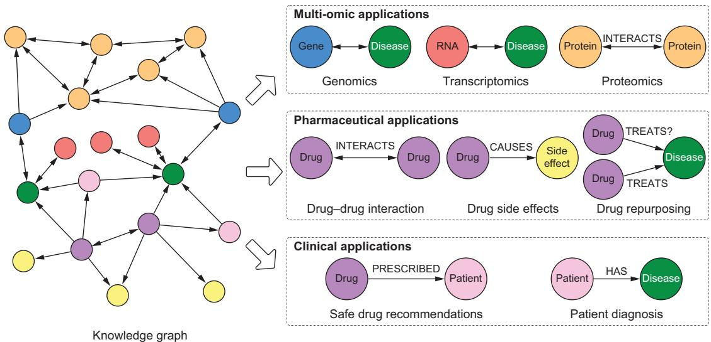  
Figure 4.1 The primary types of biomedical applications for KGs, grouped by business goal. They have many data sources in common.

### 4.2 Multi-omic applications of KGs

Multi-omic refers to a biological analysis approach that uses many “omics” datasets, such as genomes, proteomes, and transcriptomes (see figure 4.2). The suffix ome in molecular biology means a totality: for instance, genome refers to all the genetic information of an organism.

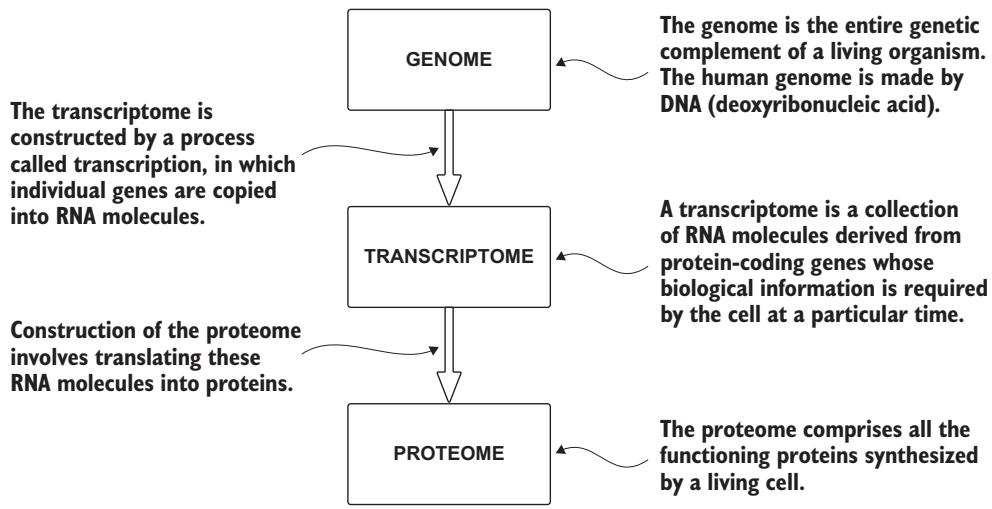  
Figure 4.2 The three primary 'omics' data types used in biomedical KGs. Genome (DNA), transcriptome (RNA), and proteome (protein) data are biologically connected through transcription and translation.

#### Genome, transcriptome, and proteome

These terms and related concepts are used throughout this chapter:

Genome—The entire genetic complement of a living organism. Most genomes are made of DNA (deoxyribonucleic acid), but a few viruses have RNA (ribonucleic acid) genomes. DNA and RNA are polymeric molecules made up of chains of monomeric subunits called nucleotides.

Transcriptome—A collection of RNA molecules that direct the synthesis of the proteome. The transcriptome is constructed by the process called transcription, in which individual genes are copied into RNA molecules.

Proteome—The final product of genome expression that comprises all the functioning proteins synthesized by a living cell. It is the culmination of genome expression and also the starting point for the biochemical activities that constitute cellular life.

Many multi-omic applications use KGs to study the genome, how genes are expressed in the transcriptome, and how the products of those transcripts interact in the proteome. These include detecting miRNA-disease associations [4], gene–symptom prioritization [9], and predicting protein–protein interactions [10, 11, 12].

For example, Yang et al. [9] proposed a KG model to identify candidate genes associated with given symptoms. The researchers merged many heterogeneous data sources. To unify and integrate disease terms, they mapped the disease identifiers from the different databases to Unified Medical Language System (UMLS; https:// www.nlm.nih.gov/research/umls/index.html) codes. Figure 4.3 shows the process.

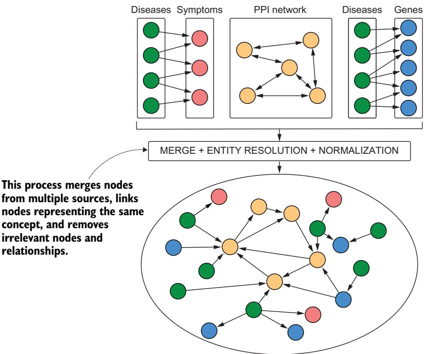  
Figure 4.3 An extract from an image by Yang et al. [9], illustrating how the researchers combined data sources to create a holistic KG

In another case, protein–protein interaction (PPI) networks and protein–disease association have been successfully used in the computational discovery of disease pathways (groups of proteins associated with a specific disease) [12]. This is a perfect use case for developing IASs, where KGs play a key role, because trying to understand each disease protein in isolation cannot fully explain most human diseases. Let’s look at how to construct and analyze this simpler type of KG before moving to more complex scenarios that require merging multiple data sources.

#### 4.2.1 Creating a KG from the PPI and protein-disease networks

The goal is to discover disease pathways starting from known pathways. The approach proposed by Agrawal et al. [12] begins with a KG, as shown in Figure 4.4. Diseases are connected to associated known proteins, which are connected in the PPI network. For instance, figure 4.5 shows the connections between celiac disease1 and relevant genes.

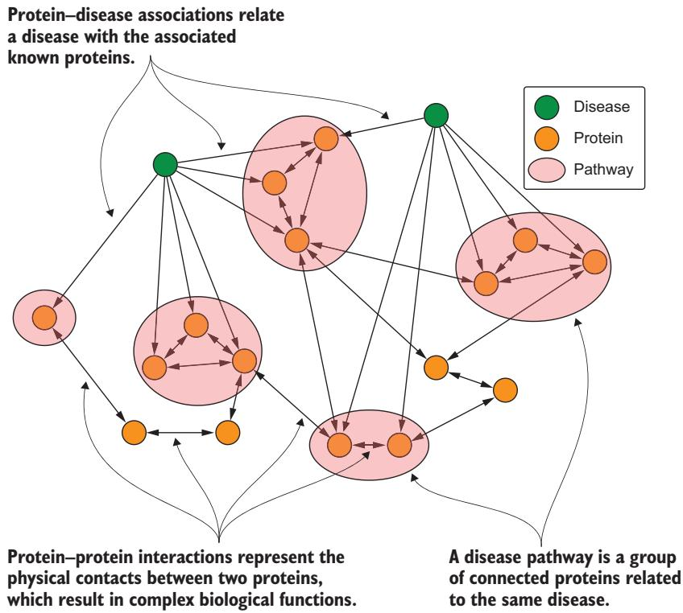  
Figure 4.4 A disease pathway is a subgraph of the PPI network defined by a set of proteins associated with the disease.

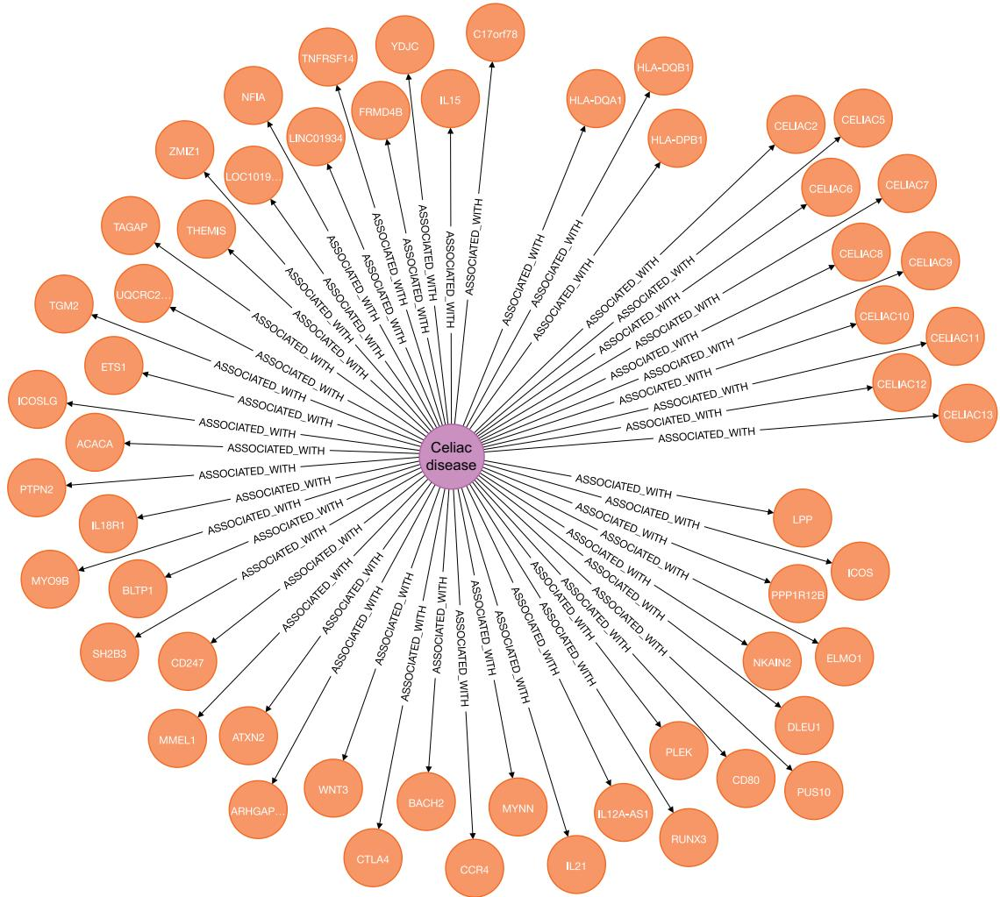  
Figure 4.5 A small portion of the KG built by Agrawal [12]. We started from celiac disease and found the associated genes.

Now let’s look at the discovery process to understand what we will do with this simple KG. Figure 4.6 shows the starting point and the result. We have a set of known pathways, and the IAS must predict and report a set of potential proteins and related pathways associated with the disease. The proteins can be part of an existing pathway or form a new one. The resulting KG is composed of a monopartite graph (the PPI network) and a bipartite graph (the disease–protein association network).

In this case, we have the data source we need: we can use Disease Pathways in the Human Interactome from the Stanford Network Analytics Project (SNAP; http:// snap.stanford.edu/pathways/). Agrawal [12] created this simpler network starting from more complex data sources, and we can import and explore it. Then we will combine it with another dataset to make the resulting KG easier for humans to read.

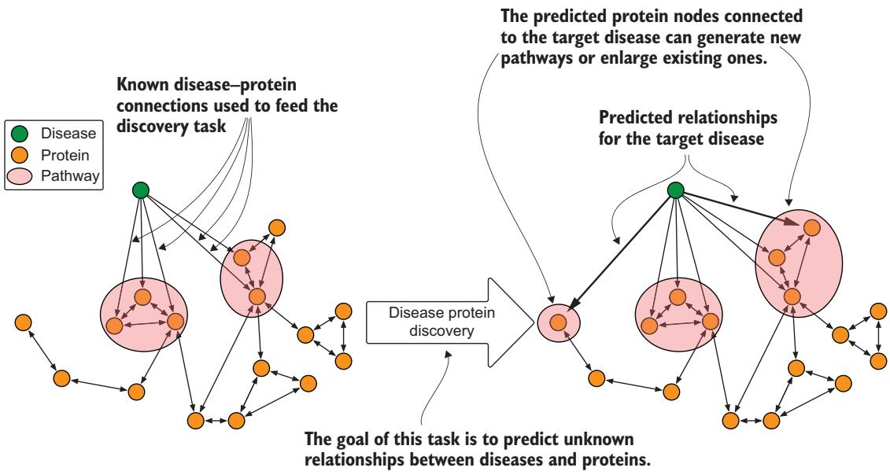  
Figure 4.6 The discovery process to find proteins related to diseases

The following node key constraints ensure that all nodes with a particular label have an ID value and that it is unique.

```sql
Listing 4.1 Creating the constraints
CREATE CONSTRAINT protein_key IF NOT EXISTS FOR
If you aren’t sure a constraint exists,
(n:Protein) REQUIRE (n.id) IS NODE KEY;
add IF NOT EXISTS to ensure that it
CREATE CONSTRAINT disease_key IF NOT EXISTS FOR is created only if it doesn’t exist.
(n:Disease) REQUIRE (n.id) IS NODE KEY;
```

The first file we’ll import into our dataset is the human protein–protein interaction (PPI) network compiled by Menche et al. [13] and Chatr-Aryamontri et al. [14]. The resulting graph contains 342,354 experimentally documented interactions among 21,559 proteins in humans. Listings 4.2–4.4 assume that the files have been downloaded from SNAP, decompressed, and moved to a PPI directory in the import directory in Neo4j.

Listing 4.2 Importing the PPI network   
:auto LOAD CSV FROM 'file:///PPI/bio-pathways-network.csv' AS line   
CALL {   
WITH line   
MERGE (f:Protein {id: trim(line[0])})   
MERGE (s:Protein {id: trim(line[1])})   
MERGE (f)-[:INTERACTS\_WITH]->(s)   
} IN TRANSACTIONS OF 100 ROWS

#### Exercise

Run the necessary queries to verify the numbers of proteins and connections among them. Do this before the next step because it adds new proteins.

Next we’ll import protein–disease associations in the form of tuples (u, d), where the alteration of protein u is linked to disease d. These associations come from DisGeNET (www.disgenet.org), a platform that centralizes knowledge about diseases. It contains more than 21,000 protein–disease associations divided among the 519 diseases that each have at least 10 disease proteins.

#### Listing 4.3 Importing pathways

:auto LOAD CSV WITH HEADERS   
FROM 'file:///PPI/bio-pathways-associations.csv' AS line   
CALL {   
WITH line   
WITH trim(line["Associated Gene IDs"]) AS proteins,   
trim(line["Disease Name"]) AS diseaseName,   
trim(line["Disease ID"]) AS diseaseId   
MERGE (d:Disease {id: diseaseId, name: diseaseName})   
WITH d, proteins   
UNWIND split(proteins, ",") AS protein   
WITH d, protein   
MERGE (p:Protein {id: trim(protein)})   
MERGE (d)-[:ASSOCIATED\_WITH]->(p)   
} IN TRANSACTIONS OF 100 ROWS

#### Exercise

Run some checks to verify the numbers. You should notice a change in the number of proteins. Can you identify the new proteins? Hint: Use the NOT EXISTS clause.

The last file we’ll download from the SNAP dataset contains the disease categories. Diseases are subdivided into categories and subcategories using the Disease Ontology (https://disease-ontology.org/) and also mapped to UMLS codes. Of the 519 diseases pulled from DisGeNET, 290 have a UMLS code that maps to a code in the ontology. The dataset uses the second level of the ontology, which consists of 10 categories, including cancers (68 diseases), nervous system diseases (44), cardiovascular system diseases (33), and immune system diseases (21).

#### Listing 4.4 Importing disease classes

:auto LOAD CSV WITH HEADERS   
➥FROM 'file:///PPI/bio-pathways-diseaseclasses.csv' AS line   
CALL {

WITH line   
WITH line["Disease ID"] as diseaseId, line["Disease Class"] as class   
MATCH (d:Disease {id:diseaseId})   
SET d.class = class   
} IN TRANSACTIONS OF 100 ROWS

#### Exercise

After the import check, review the numbers for each disease’s classes and the list of diseases without classes.

We’ve ingested the data from the SNAP dataset, but it uses codes to identify proteins. To improve readability, we can import gene information (https://ftp.ncbi.nih.gov/ gene/DATA/gene\_info.gz) from the NIH. After downloading the file, decompress it and move it to the same directory as the PPI.

#### Listing 4.5 Importing gene information

:auto LOAD CSV WITH HEADERS FROM 'file:///PPI/gene\_info' AS line   
FIELDTERMINATOR '\t'   
CALL {   
WITH line   
WITH trim(line["GeneID"]) AS proteinId, trim(line["Symbol"]) AS symbol,   
trim(line["description"]) AS description   
WITH proteinId, symbol, description   
MATCH (p:Protein {id:proteinId})   
SET p.name = symbol, p.description = description   
} IN TRANSACTIONS OF 100 ROWS

#### 4.2.2 High-level analysis of the resulting KGs

The next step is to inspect the KG, to evaluate the quality of the graph and explore the database. If you haven’t been following along, you can download a Neo4j backup from https://mng.bz/5v7O. The next listing shows how to import this database using Neo4j 5.x.

#### Listing 4.6 Creating the PPI database from a Neo4j backup

#### Add the following line to the neo4j.conf file   
#### dbms.databases.seed\_from\_uri\_providers=URLConnectionSeedProvider   
#### then run the following command   
CREATE DATABASE ppi OPTIONS { existingData: "use",   
➥seedUri: "https://mng.bz/5v7O"}

Our analysis of the graph starts with a generic evaluation of the PPI network. Our preferred algorithm for this type of evaluation is the weakly connected component (WCC): a community detection algorithm that finds disconnected subgraphs within a graph. To

run this analysis, we will use the graph data science (GDS) library available on Neo4j (see online appendix B for installation instructions).

First we mark connected proteins using INTERACTS\_WITH.

Listing 4.7 Marking proteins in the PPI network

MATCH (p:Protein)-[:INTERACTS\_WITH]-()   
SET p:PPIProtein

Now we need to create an in-memory representation of the graph, known as a projection.

call gds.graph.project( Name of the List of node types we would like to   
'ppi-graph', < in-memory graph include. In this example, there is   
'PPIProtein', < only one, but it can be a list.   
{   
INTERACTS\_WITH: { < Here we have the list of relationships we   
orientation: 'UNDIRECTED' would like to include in the analysis.

Once the subgraph has been created in memory, we can run the WCC algorithm using the following query.

#### Listing 4.9 Running the WCC on the PPI network

CALL gds.wcc.write('ppi-graph', { writeProperty: 'componentId' }) YIELD nodePropertiesWritten, componentCount, componentDistribution;

The results of the query are shown in table 4.1. Percentiles indicate the value below which a percentage of data points fall: for example, p99: 21521 means that 99% of the connected components have fewer than 21,521 proteins.

Table 4.1 Summary results of the query in listing 4.9
<table><tr><td rowspan=1 colspan=1>nodePropertiesWritten</td><td rowspan=1 colspan=4>componentCount</td><td rowspan=1 colspan=1>componentDistribution</td></tr><tr><td rowspan=8 colspan=1>21559</td><td rowspan=1 colspan=4>27</td><td rowspan=1 colspan=1>y</td></tr><tr><td rowspan=2 colspan=4></td><td rowspan=1 colspan=1>&quot;p99&quot;: 21521,</td></tr><tr><td rowspan=1 colspan=3></td><td rowspan=1 colspan=1>&quot;min&quot;: 1,</td></tr><tr><td rowspan=1 colspan=2></td><td rowspan=4 colspan=3></td><td rowspan=1 colspan=1>&quot;max&quot;: 21521,&quot;mean&quot;: 798.481,</td></tr><tr><td></td><td rowspan=3 colspan=1>&quot;p90&quot;: 3,&quot;p50&quot;: 1,&quot;p999&quot;: 21521,&quot;p95&quot;: 4,</td></tr><tr><td rowspan=1 colspan=2></td></tr><tr><td rowspan=2 colspan=4></td><td rowspan=1 colspan=1></td></tr><tr><td rowspan=1 colspan=1>&quot;p75&quot;: 2}</td></tr></table>

The output of our algorithm shows that the proteins in the PPI network are highly connected. The 21,559 proteins in the graphs can be grouped into 27 non-overlapping subgraphs. Of those, one is very large, with 21,521 proteins. The other subgraphs are single nodes or islands of up to four components.

WCC assigns proteins to the same group just because they are connected. There may be groups of proteins connected more densely to each other than other proteins outside of this “community.” To find them, we can use another graph clustering method: the Louvain modularity algorithm [15]. This is one of the fastest modularitybased algorithms and works well with large graphs. It reveals hierarchies of communities at different scales, which is useful for understanding the global functioning of a network. It works by maximizing the modularity score for each community—that is, how well groups have been partitioned into communities—by evaluating how much more densely connected the nodes are, compared to how connected they would be in a random network.

The next query runs the GDS implementation of Louvain on the same in-memory graph as earlier. If you have restarted the database or didn’t run it before, you must execute the query in listing 4.8 before running this one.

#### Listing 4.10 Running Louvain on the PPI network

```javascript
CALL gds.louvain.write('ppi-graph',
writeProperty: 'componentLouvainId' })
YIELD communityCount, modularity, modularities, communityDistribution
```

The results of this algorithm, shown in table 4.2, tell a different story than those in table 4.1.

Table 4.2 Summary results of the query in listing 4.10
<table><tr><td rowspan=1 colspan=1>communityCount</td><td rowspan=1 colspan=2>modularity</td><td rowspan=1 colspan=1>communityDistribution</td></tr><tr><td rowspan=1 colspan=1>48</td><td rowspan=1 colspan=2>0.5464241018027929</td><td rowspan=1 colspan=1>{</td></tr><tr><td rowspan=6 colspan=1></td><td rowspan=1 colspan=2></td><td rowspan=1 colspan=1>&quot;p99&quot;: 3533,</td></tr><tr><td rowspan=5 colspan=2></td><td rowspan=1 colspan=1>&quot;min&quot;: 1,</td></tr><tr><td rowspan=3 colspan=1>&quot;max&quot;: 3533,&quot;mean&quot;:449.1458333333333,&quot;p90&quot;: 1817,&quot;p50&quot;: 3,&quot;p999&quot;: 3533,&quot;p95&quot;: 2336,</td></tr><tr><td rowspan=1 colspan=1></td></tr><tr><td rowspan=1 colspan=1></td></tr><tr><td rowspan=1 colspan=1>&quot;p75&quot;: 311}</td></tr></table>

We have some large communities with more than 3,500 proteins as well as smaller ones. The average size is around 450 proteins per community. The modularity score, which considers all the communities, is around 0.40 (40%). The next query lets us inspect the contents of the communities.

Listing 4.11 Inspecting the top 10 communities   
MATCH (p:PPIProtein)   
WITH p.componentLouvainId as communityId, count(p) as members   
ORDER BY members desc   
LIMIT 10   
MATCH (p:PPIProtein)-[:INTERACTS\_WITH]-(o)   
WHERE p.componentLouvainId = communityId   
WITH communityId, members, p.name as name, count(o) as connections   
ORDER BY connections DESC   
RETURN communityId, members, collect(name)[..20] as keyMembers

This query shows the top 20 most connected elements for each community identified by Louvain. The large cluster includes proteins like APP, NTRK1, GRB2, EGFR, and HSP90AA1; another includes ELAVL1, MOV10, NXF1, VCP, and SHMT2. A little googling (because we are not experts) shows that these groups make sense.

These algorithms are easy to use but generic: they treat each node and relationship the same way. Next we will introduce several techniques that are contextualized to our domain and goal, and that use the meaning of each node and each relationship. The book’s code includes a library of these tools.

#### 4.2.3 Domain-specific analysis of the PPI and disease KG

The earlier algorithms analyzed how the PPI network is structured. Now we’ll consider subnetworks: the disease pathways. Translated into graph theory, given the PPI network, $G = \left( V , E \right)$ , where nodes V represent proteins and edges E denote protein– protein interactions. The disease pathway for disease d is an undirected subgraph, $H_{\mathrm{d} } = \left( V_{\mathrm{d} } , E_{\mathrm{d} } \right)$ of the PPI network specified by the set of proteins $V_{\mathrm{d} }$ associated with d and by the set of protein–protein interactions:

$$
E_{d} = \{ ( u , v ) | ( u , v ) \in E a n d u , v \in V_{d} \}
$$

Using our graph, we can extract this subnetwork via a simple query.

#### Listing 4.12 Extracting disease pathways from the KG

```perl
MATCH (d:Disease {id:$id})-[:ASSOCIATED_WITH]->(p)
WITH collect(p) as proteins
UNWIND proteins as m0
UNWIND proteins as m1
OPTIONAL MATCH (m0)-[r:INTERACTS_WITH]->(m1)
RETURN DISTINCT m0, r, m1
```

This is a monopartite subnetwork, meaning it doesn’t contain connections between proteins and diseases. Disease pathways related to different diseases can also overlap.

For certain measures, we need to consider how this subnetwork is connected to the rest of the PPI network. We can compute the pathway boundary

$$
B_{d} = \{ ( u , v ) | ( u , v ) \in E { \mathrm { ~ a n d ~ } } u \in V_{d} { \mathrm { ~ a n d ~ } } v \in V_{d} \backslash V \}
$$

where V \V represents all nodes that are in the global set V but not in $V_{\mathrm { { d} } } ,$ which translates to all nodes not associated with the target disease.

The measures we will consider characterize connectivity of disease proteins: both inside the disease pathways and outside, toward the other proteins in the PPI Network. Other metrics consider the distance and concentration in the pathways. All the measures are calculated for each disease, to characterize each one and find relevant patterns. They can also be collected, and their statistical information can give us a broader overview of the network and how it is distributed over different diseases.

#### LARGEST PATHWAY COMPONENT

The first measure is the relative size of the largest pathway component. This measure computes the fraction of disease proteins that lie in $H_{\mathrm{d} } { }^{\prime} \mathbf{s}$ largest connected component

$$
{ \mathrm{relativeLargestCC} } ( d ) = { \frac { \left| { \mathrm{nodes} } ( \operatorname { l a r g e s t C C } ( H_{d} ) ) \right| } { \left| V_{d} \right| } }
$$

where nodes(largestCC(H )) returns the nodes in the largest WCCs of $H_{\mathrm{d} }$ . The code uses the networkx function in the next listing. (The complete code is available in the book’s code repository in chapter/ch04/analysis/multiomic\_analysis.py.)

#### Listing 4.13 Finding the size of the largest pathway component

Python class created to analyze the PPI   
network. It extends a base class that   
contains the main functions for analyzing   
command-line arguments and handling   
class MultiOmicAnalysis(GraphDBBase): < connections with the Neo4j database.   
def \_\_init\_\_(self, argv, database):   
super().\_\_init\_\_(command=\_\_file \_, argv=argv)   
self.\_\_database = database Loads the disease pathway,   
which is a subgraph of   
def load\_hd(self, disease): < the PPI network   
query = """   
MATCH (d:Disease {id:\$id})-[:ASSOCIATED\_WITH]->(p)   
WITH collect(p) as proteins   
UNWIND proteins as m0 Gets a query   
UNWIND proteins as m1 representing a   
OPTIONAL MATCH (m0)-[r:INTERACTS\_WITH]->(m1) subgraph and   
return distinct m0, r, m1 loads it as a   
IIIIII networkx graph   
param = {"id": disease}   
return self.load\_graph\_and\_get\_nx\_graph(query, param) Converts   
the query   
def load\_graph\_and\_get\_nx\_graph(self, query, param={}): result into   
data = self.get\_raw\_data(query, param) a networkx   
G = networkx\_utility.graph\_undirected\_from\_cypher(data) graph   
return G   
Returns a list of nodes and   
def get\_raw\_data(self, query, param): < relationships for further processing   
with self.\_driver.session(database = self.\_\_database) as session:   
results = session.run(query, param)   
return results.graph()

```python
def compute_largest_components(self, networkx_graph): <
largest_cc = max(nx.connected_components(networkx_graph), key=len)
return largest_cc
Computes all connected components
and returns the largest one
if name == _main__':
analysis = MultiOmicAnalysis(argv=sys.argv[1:], database="ppi")
disease_id = 'celiac disease' < A disease to analyze (the full
networkx_graph = analysis.load_Hd(disease_id) code analyzes all diseases)
nodes_count = networkx_graph.nodes.__len __()
largest_cc = analysis.compute_largest_components(networkx_graph)
relative_size_of_largest_cc =
float(largest_cc_size.__len__())/nodes_count < Computes the relative size of the
largest component, normalized
over the total number of nodes
```

#### DENSITY

The second metric we’ll calculate is the density of the pathway. As the name suggests, it measures how densely connected the proteins are in the disease pathways:

$$
\mathrm{density} ( d ) = \frac { 2 | E_{d} | } { | V_{d} | ( | V_{d} | - 1 ) }
$$

The denominator computes the number of possible edges, and the numerator considers the real edges. The resulting value is in [0; 1]: a higher density indicates that a higher fraction of all possible edges appear between nodes in $H_{\mathrm{d} }$

#### Listing 4.14 Calculating the density of the pathway

```python
def compute_density(networkx_graph): 4 Computes the density for a disease
nodes_count = networkx_graph.nodes.__len__() represented by the related subgraph
edges_count = networkx_graph.edges.__len__() extracted from the full PPI network
density_pathway =
2.0 * float(edges_count) / (nodes_count * (nodes_count - 1))
if name == _main ':
analysis = MultiOmicAnalysis(argv=sys.argv[1:], database="ppi")
disease_id = 'celiac disease'
networkx_graph = analysis.load_hd(disease_id)
density_pathway = compute_density(networkx_graph)
```

#### CONDUCTANCE

The third metric is conductance [16]: the independence of the disease pathway (the subgraph) from the rest of the graph. It uses the edges connecting a node inside the subgraph with a node outside, regardless of direction:

$$
{ \mathrm{conductance} } \left( d \right) = { \frac { | B_{d} | } { \left( | B_{d} | + 2 | E_{d} | \right) } }
$$

The resulting value is in [0; 1]: lower conductance means the pathway is a tighter-knit community, separated from the rest of the network.

Listing 4.15 Computing conductance   
def compute\_bd(self, disease): < Computes Bd using   
query = """ a Cypher query   
MATCH (d:Disease {id:\$id})-[:ASSOCIATED\_WITH]->(p)   
WITH collect(p) as proteins   
MATCH (m0)-[r:INTERACTS\_WITH]-(m1)   
WHERE m0 in proteins and not m1 in proteins   
RETURN count(DISTINCT r) as bd   
IIIIII Returns a pandas dataframe with   
param = {'id': disease} columns representing the values   
return self.get\_data(query, param)["bd"][0] returned; useful when a Cypher   
query returns values instead of   
def get\_data(self, query, param={}): < nodes and relationships   
with self.\_driver.session(database=self.\_\_database) as session:   
results = session.run(query, param)   
data = pd.DataFrame(results.values(), columns=results.keys())   
return data   
if \_\_name == ' \_main \_':   
analysis = MultiOmicAnalysis(argv=sys.argv[1:], database="ppi")   
disease\_id = 'celiac disease   
networkx\_graph = analysis.load\_hd(disease\_id)   
bd = analysis.compute\_bd(disease\_id)   
edges\_count = networkx\_graph.edges.\_\_len\_\_() Computes   
conductance = float(bd) / (bd + 2 \* edges\_count) < conductance

#### ANALYZING DISEASE PATHWAYS AND CLUSTERS

Now that we’ve computed metrics for each subgraph—the disease pathways—let’s look at them as a whole. A common way to do so is to perform a frequency analysis that splits the results into buckets, as shown in figure 4.7.

(a) Largest CC  
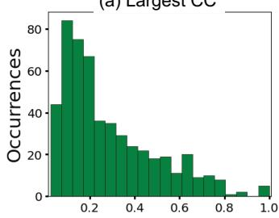

(b) Density  
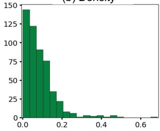

(c) Conductance  
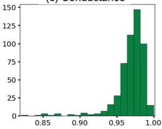  
Figure 4.7 Distributions of the three key measures for disease pathways

We can see that disease pathways are fragmented in the PPI network, with a median of 16 connected components per disease and a median of only 21% of the proteins in the largest pathway component (figure 4.7a). Only about 10% of pathways have more than 60% of their proteins in the largest pathway component. The disease pathways are not well connected internally, with a median density of only 0.07 (the overall PPI network density is 0.0015), and 90% of diseases have a density below 0.17 (figure 4.7b). On the other hand, the disease pathways are well connected externally, with a median conductance of 0.96 (figure 4.7c).

These overlapping subgraphs obtained by considering disease pathways are very different from what we obtain by clustering using WCC or Louvain. To verify this theory, let’s run the same measures on the clusters we computed using Louvain; the results are shown in figure 4.8.

(a) Largest CC  
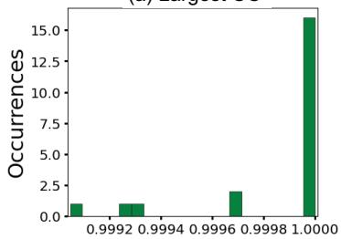

(b) Density  
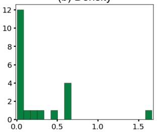

(c) Conductance  
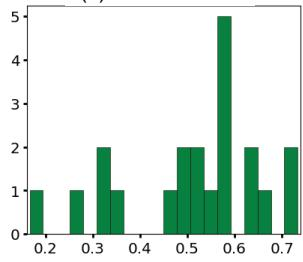  
Figure 4.8 Distribution of the three key measures for the clusters obtained via the Louvain algorithm

These clusters tell us a different story. As expected, most of the proteins reside in a large, connected component (figure 4.8a). Density is related to the overall connectivity of the network, so the changes are only related to the different structures of the clusters. Conductance has improved: the clusters are better connected internally than externally.

The next section introduces the second type of applications (pharmaceuticals) and new algorithms for extracting information from KGs. We’ll focus on edges and paths in addition to single nodes.

### 4.3 Pharmaceutical applications of KGs

The cost of developing a new therapeutic drug has been estimated at \$1.4 billion [17]. The process typically takes 15 years from first compound to market [18], and the likelihood of success is remarkably low [19].

Drug analysis and repurposing can drastically reduce the duration, failure rates, and costs of approval. Such an analysis uses preexisting information on approved drugs, including toxicology profiling, preclinical models, clinical trials, and postrelease surveillance. There are numerous examples where KGs have been used to predict drug interactions [20], identify molecular targets with which a drug might interact [21], and determine new diseases that can be treated with established drugs [22].

Dai et al. [21] used recommendation systems, in particular collaborative filtering, to infer drug–disease associations. Other researchers used these techniques to infer drug–target interactions [23, 24] and drug–disease treatments [25, 26]. Despite reported success, these approaches are limited to the drugs and diseases contained in the graph. Enriching the KG by combining these approaches with representations of chemical structures, biological processes, and other relevant knowledge might let researchers make predictions about novel compounds.

Himmelstein et al. [2] constructed a graph encoding knowledge from 29 public resources to connect compounds, diseases, genes, anatomies, pathways, biological processes, molecular functions, cellular components, pharmacological classes, side effects, and symptoms. They called the graph Hetionet (from “hetnet,” short for “heterogeneous network”). The graph database is publicly available (https://het.io/) in a Neo4j format. So, for this example, we don’t need to create a database from multiple sources, because the researchers did the work for us. Instead, we’ll discuss the importance of a properly designed KG with a coherent schema, and ways to analyze the KG to evaluate the completeness of its information.

We’ve made a Neo4j 5.x backup for the database that you can download from https://mng.bz/648e. The following listing shows how to import it.

#### Listing 4.16 Creating the Het.io database

#### Add the following line to the neo4j.conf file   
#### dbms.databases.seed\_from\_uri\_providers=URLConnectionSeedProvider   
#### then run the following command   
CREATE DATABASE hetionet OPTIONS { existingData: "use",   
➥seedUri: "https://mng.bz/648e"}

The imported KG consists of 47,031 nodes of 11 types and 2,250,197 relationships of 24 types. The nodes consist of 1,552 small-molecule compounds and 137 complex diseases, as well as genes, anatomies, pathways, biological processes, molecular functions, cellular components, perturbations, pharmacologic classes, drug side effects, and disease symptoms. The edges represent relationships between these nodes and encompass the collective knowledge produced by millions of studies over the last half century [2]. Figure 4.9 shows the full schema of the dataset.

For example, Compound–binds–Gene edges represent a compound binding to a protein encoded by a gene. Hetionet includes 11,571 edges, and for each, the reference is stored as a relationship attribute.

#### Exercise

Explore the imported graph and examine how the nodes are distributed across the different node types. Do the same for relationships. Be careful: the relationships can be more complex. Refer to the schema to make accurate queries.

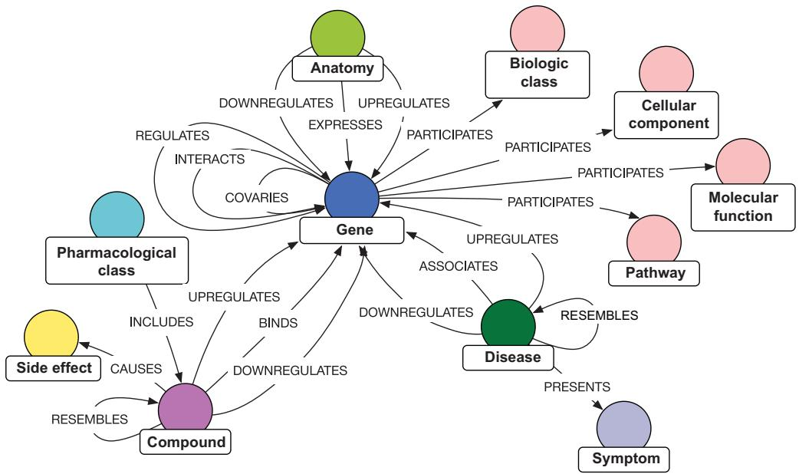  
Figure 4.9 Het.io KG schema. The details of the nodes and relationships are available at https://mng.bz/EwgD.

#### Metapaths and degree-weighted path count (DWPC)

The path-exploration examples that follow use a new metric to order by relevance: degree-weighted path count (DWPC). It was introduced by Himmelstein [27], adapting an existing method originally developed for social network analysis, called PathPredict [28]. DWPC quantifies the prevalence of metapaths in Hetionet.

As shown in panel (a) of the following figure, a schema is represented using real nodes and existing relationships. A metapath, on the other hand, represents classes sequence of nodes and relationships that describe potential real paths between a node of the first type and a node of the last type. We can “query” the schema, searching for patterns of connection among source types and destination types. For example, we can produce a list of possible metapaths for a generic pattern like (Gene)— a—(Disease) of max length 4, as shown in panel (b).

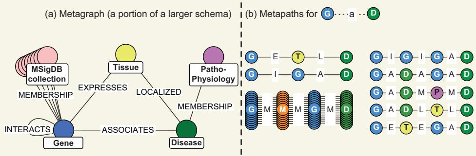  
Metagraph (a) and metapath (b) excerpts for Hetionet. A metagraph describes the structure of the database, indicating the types of nodes and the types of relationships. Metapaths describe paths and indicate types of nodes and relationships.

Again, note that these are descriptions of paths, not real instances of paths.

Now that we have explored the example KG, we can begin computing metrics. The simplest metapath-based metric is path count (PC): the number of paths, of a specified metapath, between the defined source and target nodes. PC does not adjust for the extent of graph connectivity along the path: each path has a value of 1. For example, figure 4.10a shows part of the KG where a specific gene, IRF1, relates to a specific disease, multiple sclerosis. All the paths belong to one of the potential metapaths for the generic pattern (Gene)—a—(Disease). In figure 4.10b, the paths related to each metapath are grouped. The first group has an intermediate node of type Tissue and only one path, so the PC is 1. The second group has another gene as intermediate node; in this group, the graph has three paths so the PC is 3.

(a) Hypothetical graph  
(b) Calculating and weighting path counts  
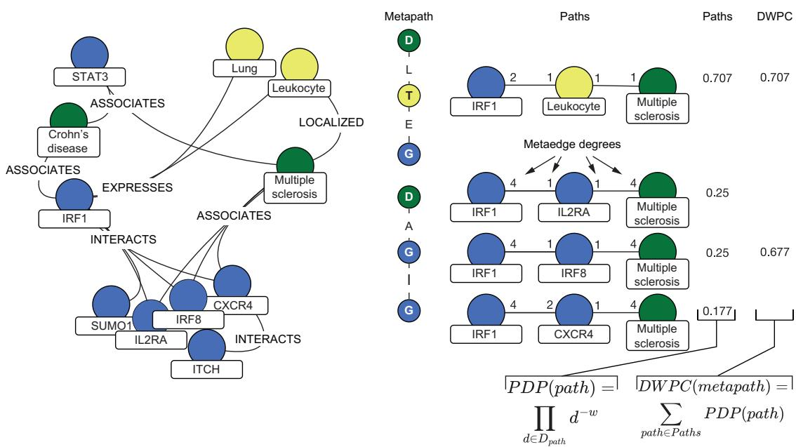  
Figure 4.10 (a) Extracting paths based on a defined metapath, and (b) computing the path-degree product (PDP) and DWPC

DWPC, on the other hand, associates an individual value with each path, called the path-degree product (PDP). It is calculated using the following formula

$$
\mathrm{PDP} \left( \mathrm{path} \right) = \prod_{d \in { \cal D} _ { \mathrm{path} } } d^{- w}
$$

and calculated as follows:

1 Extract all metaedge-specific degrees along the path $( D_{\mathrm{path} } )$ , where each edge in the path contributes two degrees. In figure 4.10, the edge between IRF1 and IL2RA has the two degree values 4 and 1: IRF1 has four outgoing edges of type INTERACTS, and IL2RA has one incoming edge of type INTERACTS. The edge between IRF1 and CXCR4 has the degree values 4 and 2, because CXCR4 has two incoming edges of type INTERACTS.

2 Raise each degree to the –w power, where $w \geq 0$ and is called the damping exponent.

3 Multiply all exponentiated degrees to yield the PDP.

Let’s consider the path $( \mathrm{IRF1} ) { - } [ ] { - } ( \mathrm{CXCR4} ) { - } [ ] { - }$ (Muliple sclerosis) in figure 4.10. Suppose $w = 0 . 5$ Then the computation looks like this:

$$
4^{- 0 . 5} * 2^{- 0 . 5} * 1^{- 0 . 5} * 4^{- 0 . 5} = 0 . 1 6 7 \cong 0 . 1 7 7
$$

Figure 4.10 shows the values for the other paths. The DWPC equals the sum of the PDPs for the specific metapath:

$$
\mathrm{DWPC}_{m} \left( s , t \right) = \sum_{\mathrm{path} \in \mathrm{Paths}_{m} \left( s , t \right) } \mathrm { P D P ( p a t h ) }
$$

These metrics evaluate path prevalence while also ignoring “well-known nodes”—a common issue during KG analysis.

#### 4.3.1 Deep analysis of the Hetionet knowledge graph

At this stage, we have all the ingredients to perform a deep analysis of the Hetionet graph. We’ll use Cypher queries and the DWPC metric to identify prominent gene ontology (GO) processes in a set of disease-associated genes.

NOTE The following analysis was inspired by the Thinklab project started by Daniel Himmelstein (https://think-lab.github.io/d/220/).

We'll use celiac disease (CD) again as an example. CD is a common (prevalence 1:100), chronic, immune-mediated enteropathy caused by intolerance to gluten that develops in genetically predisposed individuals. We can see the 48 genes associated with CD with the query MATCH p = (:Disease {name: 'celiac disease'})-[rel: ASSOCIATES\_DaG]-() RETURN p.

Next we’ll compute the DWPC between CD and each GO process in which at least two celiac-related genes participate. The results are further restricted to processes with at least five participating genes. Here’s the Cypher query.

Listing 4.17 GO process enrichment for CD   
MATCH path = (n0:Disease)-[:ASSOCIATES\_DaG]-(n1)-[:PARTICIPATES\_GpBP]-   
➥(n2:BiologicalProcess) < Searches for   
WHERE n0.name = 'celiac disease' < Restricts to ‘celiac DaG-GpBP paths   
WITH disease’ as source   
[   
size([(n0)-[:ASSOCIATES\_DaG]-() | n0]),   
size([()-[:ASSOCIATES\_DaG]-(n1) | n1]),   
size([(n1)-[:PARTICIPATES\_GpBP]-() | n1]),   
size([()-[:PARTICIPATES\_GpBP]-(n2) | n2]) Computes relationship-related   
] < degrees necessary for DWPC   
AS degrees, path, n2   
WITH   
n2.identifier AS go\_id, Returns the GO   
n2.name AS go\_name, process ID and name Counts   
count(path) AS PC, < paths Computes   
sum(reduce(pdp = 1.0, d in degrees| pdp \* d ^ -0.4)) AS DWPC, < DWPC   
size([(n2)-[:PARTICIPATES\_GpBP]-() | n2]) AS n\_genes < Counts the genes   
WHERE n\_genes >= 5 AND PC >= 2 4 in the GO process   
RETURN   
go\_id, go\_name, PC, DWPC, n\_genes Filters out GO processes with fewer   
ORDER BY DWPC DESC than five generic genes involved and   
LIMIT 10 fewer than two celiac-related genes  
When we ran it, the query returned the top 10 GO processes listed in table 4.3.

Table 4.3 Results of the query in listing 4.17
<table><tr><td rowspan=1 colspan=2>GO ID</td><td rowspan=1 colspan=1>GO name</td><td rowspan=1 colspan=1>PC</td><td rowspan=1 colspan=1>DWPC</td><td rowspan=1 colspan=1># genes</td></tr><tr><td rowspan=3 colspan=2>GO:0031295GO:0031294GO:0002507</td><td rowspan=3 colspan=1>T cell costimulationlymphocyte costimulationtolerance induction</td><td rowspan=1 colspan=1>10</td><td rowspan=1 colspan=1>0.03347</td><td rowspan=1 colspan=1>75</td></tr><tr><td rowspan=1 colspan=1>10</td><td rowspan=1 colspan=1>0.03329</td><td rowspan=1 colspan=1>76</td></tr><tr><td rowspan=1 colspan=1>3</td><td rowspan=1 colspan=1>0.03276</td><td rowspan=1 colspan=1>12</td></tr><tr><td rowspan=1 colspan=2>GO:0050870</td><td rowspan=1 colspan=1>positive regulation of T cell activation</td><td rowspan=1 colspan=1>14</td><td rowspan=1 colspan=1>0.02925</td><td rowspan=1 colspan=1>201</td></tr><tr><td rowspan=1 colspan=2>GO:0034112</td><td rowspan=1 colspan=1>positive regulation of homotypic cell-cell adhesion</td><td rowspan=1 colspan=1>14</td><td rowspan=1 colspan=1>0.02902</td><td rowspan=1 colspan=1>205</td></tr><tr><td rowspan=1 colspan=2>GO:1903039</td><td rowspan=1 colspan=1>positive regulation of leukocyte cell-cell adhesion</td><td rowspan=1 colspan=1>14</td><td rowspan=1 colspan=1>0.02891</td><td rowspan=1 colspan=1>207</td></tr><tr><td rowspan=3 colspan=2>GO:0051249GO:0002684</td><td rowspan=1 colspan=1>regulation of lymphocyte activation</td><td rowspan=1 colspan=1>18</td><td rowspan=1 colspan=1>0.02763</td><td rowspan=3 colspan=1>381880</td></tr><tr><td rowspan=2 colspan=1>positive regulation of the immune system process</td><td rowspan=2 colspan=1>21</td><td rowspan=2 colspan=1>0.02718</td></tr><tr><td rowspan=1 colspan=1></td></tr><tr><td rowspan=3 colspan=2>GO:0022409GO:0050863</td><td rowspan=2 colspan=1>positive regulation of cell-cell adhesion</td><td rowspan=2 colspan=1>14</td><td rowspan=2 colspan=1>0.02716</td><td rowspan=2 colspan=1>242</td></tr><tr><td rowspan=1 colspan=1></td></tr><tr><td rowspan=1 colspan=1>regulation of T cell activation</td><td rowspan=1 colspan=1>16</td><td rowspan=1 colspan=1>0.02701</td><td rowspan=1 colspan=1>290</td></tr></table>

The GO process with ID GO:0002684 has a high PC value and is connected to 880 genes. Ordering by PC, this process would be listed first. However, it is involved in many other processes, not just CD; ordering by DWPC, it is near the bottom of the results list. At the top is GO:0031295, “T cell costimulation,” which is very relevant for the disease we are investigating.

Let’s refine our search by considering more complex paths, including protein interaction relationships. The query in the next listing only considers associations between diseases and genes derived from genome-wide association studies (GWASs) [29, 30], which are less biased by existing knowledge. We also add protein interaction to the metapath to identify genes in the neighborhood of the interactome for CD. Finally, the query considers only genes that are upregulated in celiac-affected tissues.

Listing 4.18 Tissue-specific interactomics   
MATCH path = (n0:Disease)-[e1:ASSOCIATES\_DaG]-(n1)-[:INTERACTS\_GiG]-(n2)-   
➥[:PARTICIPATES\_GpBP]-(n3:BiologicalProcess)   
WHERE n0.name = 'celiac disease'   
AND 'GWAS Catalog' in e1.sources   
AND exists((n0)-[:LOCALIZES\_DlA]-()-[:UPREGULATES\_AuG]-(n2))   
WITH   
[   
size([(n0)-[:ASSOCIATES\_DaG]-() | n0]),   
size([()-[:ASSOCIATES\_DaG]-(n1) | n1]),   
size([(n1)-[:INTERACTS\_GiG]-() | n1]),   
size([()-[:INTERACTS\_GiG]-(n2) | n2]),   
size([(n2)-[:PARTICIPATES\_GpBP]-() | n2]),   
size([()-[:PARTICIPATES\_GpBP]-(n3) | n3])   
] AS degrees, path, n3 as target   
WITH   
target.identifier AS go\_id,   
target.name AS go\_name,   
count(path) AS PC,   
sum(reduce(pdp = 1.0, d in degrees| pdp \* d ^ -0.4)) AS DWPC,   
size([(target)-[:PARTICIPATES\_GpBP]-() | target]) AS n\_genes   
WHERE 5 <= n\_genes <= 100 AND PC >= 2   
RETURN   
go\_id, go\_name, PC, DWPC, n\_genes   
ORDER BY DWPC DESC   
LIMIT 10

The query results are shown in table 4.4.

Table 4.4 Results of the query in listing 4.18
<table><tr><td>GO ID</td><td>GO name</td><td>PC</td><td>DWPC</td><td># genes</td></tr><tr><td>GO:0031295</td><td>T cell costimulation</td><td>10</td><td>0.00665</td><td>75</td></tr><tr><td>GO:0031294</td><td>lymphocyte costimulation</td><td>10</td><td>0.00662</td><td>76</td></tr><tr><td>GO:0010560</td><td>positive regulation of glycoprotein biosynthetic process</td><td>6</td><td>0.00342</td><td>17</td></tr><tr><td>GO:0033689</td><td>negative regulation of osteoblast proliferation</td><td>4</td><td>0.00341</td><td>9</td></tr><tr><td>GO:1903020</td><td>positive regulation of glycoprotein metabolic process</td><td>6</td><td>0.00327</td><td>19</td></tr><tr><td>GO:0006573</td><td>valine metabolic process</td><td>5</td><td>0.00277</td><td>8</td></tr><tr><td>GO:0070884</td><td>regulation of calcineurin-NFAT signaling cascade</td><td>2</td><td>0.00277</td><td>19</td></tr><tr><td>GO:0010559</td><td>regulation of glycoprotein biosynthetic process</td><td>7</td><td>0.00272</td><td>35</td></tr><tr><td>GO:1903018</td><td>regulation of glycoprotein metabolic process</td><td>7</td><td>0.00257</td><td>40</td></tr><tr><td>GO:0070098</td><td>chemokine-mediated signaling pathway</td><td>9</td><td>0.00256</td><td>72</td></tr></table>

The results are even more specific. The first two are the same, but adding the protein interaction returned other disease-specific aspects, such as a strong dominance of processes related to glycoproteins. If we’re interested in the “positive regulation of glycoprotein biosynthetic process” relationship, we can retrieve the paths behind the DWPC.

#### Listing 4.19 Finding the paths behind a DWPC

MATCH path = (n0:Disease)-[e1:ASSOCIATES\_DaG]-(n1)-[:INTERACTS\_GiG]-(n2)-   
➥[:PARTICIPATES\_GpBP]-(n3:BiologicalProcess)   
WHERE n0.name = 'celiac disease'   
AND n3.name = 'positive regulation of glycoprotein biosynthetic process   
AND 'GWAS Catalog' in e1.sources   
AND exists((n0)-[:LOCALIZES\_DlA]-()-[:UPREGULATES\_AuG]-(n2))   
RETURN path

The result is shown in figure 4.11.

#### Exercise

By modifying the queries, you can perform the same analysis on different diseases. Try running some and doing research to evaluate how much knowledge this KG captures. Thinklab offers many other interesting queries to explore.

As we’ve seen, KGs can capture knowledge that is easy to navigate and use. Our analysis provided a quantitative evaluation of the stored information.

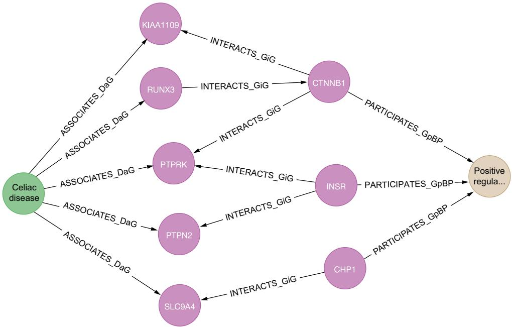  
Figure 4.11 Result of the query in listing 4.19 showing the paths between CD and “positive regulation of glycoprotein biosynthetic process”

#### 4.3.2 LLM-assisted interpretation of pathway analysis results

Although the DWPC-based queries provide quantitative rankings of biological processes, translating these results into clinically actionable insights requires domain expertise and contextual understanding. LLMs can serve as intelligent interpreters, helping to synthesize complex pathway analysis results into coherent biological narratives and clinical recommendations.

Let’s demonstrate this using the GO process enrichment results from our CD analysis. The query returned processes like “T cell costimulation,” “tolerance induction,” and “positive regulation of glycoprotein biosynthetic process” with varying DWPC scores. An LLM can help interpret these findings in their broader biological context.

#### Listing 4.20 Example LLM analysis prompt

You are a biomedical research assistant analyzing gene ontology pathway enrichment results for celiac disease. Please interpret the following results from a knowledge graph analysis and provide insights for clinical researchers:

QUERY RESULTS:

\- T cell costimulation (DWPC: 0.03347, PC: 10, Genes: 75)

\- lymphocyte costimulation (DWPC: 0.03329, PC: 10, Genes: 76)

\- positive regulation of T cell activation (DWPC: 0.02925, PC: 14, Genes: 201)

\- positive regulation of glycoprotein biosynthetic process

➥(DWPC: 0.00342, PC: 6, Genes: 17)

CONTEXT: These pathways were identified through DWPC analysis of celiac disease-associated genes in a protein-protein interaction network. DWPC scores indicate pathway relevance while accounting for node degree bias.

ANALYSIS REQUEST:

1. Interpret the biological significance of these top-ranked pathways in celiac disease

2. Explain the relationship between these processes and celiac disease pathogenesis

3. Identify potential therapeutic implications

4. Highlight any unexpected findings that warrant further investigation

5. Suggest follow-up research questions based on these results

The LLM translates raw analytical results into a comprehensive analysis, explaining how T cell costimulation relates to CD’s autoimmune nature, why tolerance induction appears disrupted, and how glycoprotein regulation connects to gluten intolerance mechanisms. This interpretation transforms results into actionable biological insights. The first part of the results obtained using Claude.ai Sonnet 4.0 (https://claude.ai/ new) are shown in the next sidebar.

#### Partial Claude.ai results for biological significance of top-ranked pathways

T Cell and Lymphocyte Costimulation Pathways (DWPC: 0.03347 and 0.03329). These pathways represent the core immunological dysfunction in celiac disease. The high DWPC scores and substantial gene counts (75-76 genes) indicate that dysregulated costimulatory signaling is central to disease pathogenesis. In celiac disease, antigen-presenting cells present gliadin peptides to T cells through HLA-DQ2/DQ8 molecules, and aberrant costimulation leads to inappropriate T cell activation rather than tolerance.

Tolerance Induction (DWPC: 0.03276) Despite having fewer genes (12), this pathway shows a remarkably high DWPC score, suggesting it’s highly interconnected within the celiac disease network. This likely reflects the fundamental breakdown of oral tolerance to dietary antigens - a hallmark of celiac disease pathogenesis.

Positive Regulation of T Cell Activation (DWPC: 0.02925) With 201 genes involved, this represents the broadest immunological dysregulation. The sustained T cell activation drives the chronic inflammatory response that characterizes celiac disease, leading to villous atrophy and clinical symptoms.

This approach demonstrates how LLMs can complement KG analytics by providing a contextual interpretation that transforms quantitative results into qualitative understanding, bridging the gap between computational analysis and applications.

### 4.4 Clinical applications of KGs

Clinical applications are still in the early stages of using KGs. In this case, the longterm goal is to use and analyze the KG to support patient care, primarily through precision medicine. The precision medicine initiative is a long-term research endeavor to understand how a person’s genetics, environment, and lifestyle can help determine the best approach to prevent or treat diseases. Implementing precision medicine requires the integration of omics data, such as proteomics, genomics, transcriptomics, into the clinical decision-making process, which involves patient data, such as electronic health records (EHRs). The quantity and diversity of biomedical data, the spread of clinically relevant knowledge across multiple biomedical databases and publications, and privacy concerns pose challenges to data integration [31].

EHRs are designed to contain information from all clinicians involved in a patient’s care. They can be challenging to interpret, there is considerable subjectivity, and information a clinician deems irrelevant may be omitted or not pursued, leading to missing information [32]. So, KGs used in clinical applications merge EHRs with multi-omics datasets, multiple ontologies, and other data sources. The key elements are nodes representing patients, drugs, and diseases; edges encode relationships such as a patient being treated with certain drugs or diagnosed with a disease.

Another example that uses EHRs and graphs is patient journey mapping, also called patient experience mapping [33]. This is a rapidly growing approach for better understanding how people enter, experience, and exit health services. It is often compared with clinical pathways [34], which establish the standard of care for a patient’s clinical presentation with a specific disease and are often linked to a companion patient journey map. Figure 4.12 illustrates the scope of a single patient journey for a complex diseases like cancer.

  
Figure 4.12 A single patient’s clinical oncology journey (courtesy of David Hughes; https://www.graphable.ai/blog/patient-journey-mapping)

The community is working hard to find solutions to the privacy and security concerns related to using EHRs. Some approaches use a huge set of patient data to extract statistical information about diseases, symptoms, or treatment outcomes [32]. These statistical relationships, along with their related weights, are stored in the KG, but not the actual patient data. This increases the guarantee of privacy [35].

Another approach is to build a deidentified, generic clinical KG based on nonsensitive data, anonymized data, experimental results, and statistical information derived from real data. Patient EHR data is used only when strictly necessary and with patient consent.

The Clinical Knowledge Graph (CKG) from Albertos Santos et al [31] is a platform with a KG at its core. CKG harmonizes and integrates data by connecting 33 node labels with 51 relationship types (see figure 4.13). It enables queries that could give insights into altered functions, suggest drugs for regulated proteins, and reveal possible confounding factors.

  
Figure 4.13 The schema for the Clinical Knowledge Graph (https://www.nature.com/articles/ s41587-021-01145-6)

CKG is available in Neo4j format at https://github.com/MannLabs/CKG. We upgraded to the latest version available while writing this book, and you can import the provided dump (https://mng.bz/oZQZ) to your machine using the following code.

Listing 4.21 Importing the CKG database   
#### Add the following line to the neo4j.conf file   
#### dbms.databases.seed\_from\_uri\_providers=URLConnectionSeedProvider   
#### then run the following   
CREATE DATABASE ckg OPTIONS { existingData: "use",   
➥seedUri: "https://mng.bz/oZQZ"}

Let’s run a query to show how simple it is to extract valuable insights from a KG like CKG. Suppose your current clinical study is targeting a set of proteins, and you are planning a clinical trial. A portion of the patients eligible for the trial suffer from cardiomyopathy-related diseases. You want to check whether known associations exist between your proteins and any cardiomyopathy-related disease.

Listing 4.22 Finding known protein–disease associations   
WITH Defines the list of proteins   
['A1BG\~P04217','A2M\~P01023','ACACB\~O00763', we are interested in   
'ACTC1\~P68032','ADIPOQ\~Q15848','AGT\~P01019',   
'AIFM2\~Q9BRQ8','APOA2\~V9GYM3'] as proteins, < Defines the minimum   
3 as minScore, < association strength threshold   
"DOID:0050700" as parentDisease < Defines the target   
MATCH (protein:Protein)-[r]-(disease:Disease) < disease DOID   
WHERE (   
(protein.name+"\~"+protein.id) IN proteins) AND Matches any type of protein–   
toFloat(r.score)> minScore AND disease association   
((disease)-[:HAS\_PARENT\*0..]->(:Disease {id: parentDisease})) <   
RETURN   
(protein.name+"\~"+protein.id) AS node1, Matches any disease related   
disease.name+" <"+disease.id+">" AS node2, to cardiomyopathy   
r.score AS weight, type(r) AS type,   
r.source AS source   
ORDER BY weight DESC

The results in table 4.5 show a specific protein that is strongly associated with several types of intrinsic cardiomyopathies. This finding provides a specific starting point for possible further investigations.

NOTE DOID is the disease ontology identifier, as defined at www.diseaseontology.org.

Table 4.5 Protein–disease associations from the query in listing 4.22
<table><tr><td>nodel</td><td>node2</td><td>weight</td><td>type</td><td>source</td></tr><tr><td>&quot;ACTC1~P68032&quot;</td><td>&quot;intrinsic cardiomyopathy &lt;DOID:0060036&gt;&quot;</td><td>5</td><td>&quot;ASSOCIATED WITH&quot;</td><td>&quot;DISEASES&quot;</td></tr><tr><td>&quot;ACTC1~P68032&quot;</td><td>&quot;left ventricular noncompaction &lt;DOID:0060480&gt;&quot;</td><td>5</td><td>&quot;ASSOCIATED WITH&quot;</td><td>&quot;DISEASES&quot;</td></tr><tr><td>&quot;ACTC1~P68032&quot;</td><td>&quot;familial hypertrophic cardiomyopathy &lt;DOID:0080326&gt;&quot;</td><td>5</td><td>&quot;ASSOCIATED WITH&quot;</td><td>&quot;DISEASES&quot;</td></tr><tr><td>&quot;ACTC1~P68032&quot;</td><td>&quot;hypertrophic cardiomyopathy &lt;DOID:11984&gt;&quot;</td><td>5</td><td>&quot;ASSOCIATED WITH&quot;</td><td>&quot;DISEASES&quot;</td></tr><tr><td>&quot;ACTC1~P68032&quot;</td><td>&quot;dilated cardiomyopathy &lt;DOID:12930&gt;&quot;</td><td>5</td><td>&quot;ASSOCIATED WITH&quot;</td><td>&quot;DISEASES&quot;</td></tr><tr><td>&quot;ACTC1~P68032&quot;</td><td>&quot;restrictive cardiomyopathy &lt;DOID:397&gt;&quot;</td><td>5</td><td>&quot;ASSOCIATED WITH&quot;</td><td>&quot;DISEASES&quot;</td></tr></table>

#### 4.4.1 LLM-guided clinical decision support analysis

Clinical KGs contain complex relationships between patients, treatments, and outcomes that require careful interpretation. LLMs can help clinicians and researchers synthesize multidimensional clinical data into coherent treatment recommendations and research directions. Using our CKG analysis, which identified strong associations between the ACTC1 protein and various cardiomyopathies, an LLM can provide clinical context and decision support.

#### Listing 4.23 Example LLM clinical analysis prompt

You are a clinical informatics specialist analyzing protein-disease associations from electronic health records integrated with biomedical knowledge graphs. Provide clinical decision support based on these findings:

CLINICAL SCENARIO: Research study targeting proteins in patients with cardiomyopathy-related diseases

KNOWLEDGE GRAPH FINDINGS:

\- ACTC1\~P68032 shows strong associations (score: 5.0) with:

\* Intrinsic cardiomyopathy (DOID:0060036)

\* Left ventricular noncompaction (DOID:0060480)

\* Familial hypertrophic cardiomyopathy (DOID:0080326)

\* Hypertrophic cardiomyopathy (DOID:11984)

\* Dilated cardiomyopathy (DOID:12930)

\* Restrictive cardiomyopathy (DOID:397)

TARGET PROTEIN LIST:   
➥['A1BG\~P04217','A2M\~P01023','ACACB\~O00763','ACTC1\~P68032','ADIPOQ\~Q15848',   
➥'AGT\~P01019','AIFM2\~Q9BRQ8','APOA2\~V9GYM3']

CLINICAL REQUEST:

1. Interpret the clinical significance of ACTC1's broad cardiomyopathy   
associations

2. What does this suggest about patient stratification for clinical trials?

3. Identify potential safety considerations for the research study

4. Recommend additional screening or monitoring protocols

5. Suggest companion biomarkers or genetic testing approaches

6. Propose modifications to inclusion/exclusion criteria based on these findings

This LLM-assisted analysis helps translate computational discoveries from KGs into practical clinical decision-making, informing patient care and research protocols. The results are too lengthy to include; you can use this prompt as an exercise with one of your favorite LLM tools.

NOTE We do not suggest using results from LLMs without proper interpretation by physicians and researchers. Our purpose is to show how LLMs can convert complex data extracted from large KGs into interpretable insights. Remember, our goal is to empower humans via IASs, not to replace them!

#### Summary

Knowledge graphs built from structured data sources require systematic integration of heterogeneous datasets. This process involves entity resolution, schema alignment, and data quality validation to create coherent and queryable knowledge representations.

Clustering algorithms like weakly connected components (WCCs) and Louvain provide insights into the global structure and community organization of any multisource KG.

Subgraph analysis measures like density, conductance, and relative size of largest connected components offer quantitative approaches to evaluate KG quality and completeness across domains.

Advanced path-based metrics such as degree-weighted path count (DWPC) enable more sophisticated analysis of relationship patterns and entity relevance than simple path-counting approaches.

Comprehensive KGs like Hetionet, the PPI network, and CKG serve as valuable testbeds for demonstrating integration techniques and analytical approaches.

LLM-assisted interpretation of KG analysis results helps translate quantitative metrics into actionable domain-specific insights and research hypotheses.