# 단순 네트워크에서 다중 소스 통합으로

### 이 장에서 다루는 내용


복잡한 지식 그래프 구축 및 통합

지식 그래프의 예 탐구

 분석 및 질의 기법 이해

 LLM을 활용한 KG 결과 분석

이 장에서는 점점 더 크고 복잡한 지식 그래프(KG)를 구축하고 이를 활용하여 지능형 자문 시스템(IAS)을 개발하는 방법에 대한 이해를 확장합니다. 3장에서는 온톨로지 형태의 단일 지식 베이스를 다루었지만, 이 지점부터는 그래프에 적합한 형식으로 제공되는 여러 구조화된 데이터 소스로부터 KG를 생성할 것입니다. 이러한 접근 방식은 그래프 모델링 결정, 통합 전략, 분석 방법에 집중할 수 있게 해 줍니다.

참고: 책의 웹사이트에 있는 부록 C는 여러 복잡한 소스로부터 원시 데이터를 수집하고 변환하는 방법에 대한 포괄적인 지침을 제공합니다.

다음 절의 예시는 구조화 및 반구조화 스키마와 데이터 형식을 동질적인 그래프로 변환하는 방법, 이름과 식별자를 조정하고 매칭하는 방법, 엔티티와 관계를 병합하기 위한 후처리 기법, 그리고 관련 정보를 찾기 위해 생성된 KG를 분석하는 방법을 다룹니다. 우리는 생의학 데이터 소스를 사용하지만, 이러한 기법과 패턴은 다른 도메인에도 직접 적용할 수 있습니다.

LLM은 KG 생애주기의 이 단계에서 보완적이지만 제한적인 역할을 합니다. 이 장의 데이터 소스(CSV 파일, 관계형 데이터베이스, API)가 구조화되어 있다는 점은 전통적인 데이터 통합 기법이 주된 접근 방식이 되며, LLM은 구축 파이프라인의 핵심 구성 요소가 아니라 보조 도구로 기능함을 의미합니다.

### 4.1 생물의학 지식 그래프와 응용


다음 상황 중 하나를 해결해야 한다고 상상해 봅니다.

질병과 단백질 사이의 알려진 관계에서 출발하여, 새로운 연결을 발견할 수 있습니까?

 값비싼 체외 (in vitro) 실험 없이 마이크로 RNA와 질병 사이의 의미 있는 관계를 발견할 수 있습니까?

셀리악병(또는 다른 질병)에 관여하는 핵심 과정은 무엇입니까?

다년간의 연구 없이 기존 약물을 재창출할 수 있습니까?

환자별 정보를 사용하는 정밀 의학 (precision medicine)을 어떻게 지원할 수 있습니까?

이러한 모든 과제는 기존의 생물의학 지식을 그래프 형태로 조직하고, 그 그래프가 복잡한 질문에 답할 수 있는 지식을 포함하고 있는지 판단함으로써 해결할 수 있습니다.

예시 도메인의 맥락을 한정하는 것부터 시작해 보겠습니다. 생물의학은 인체의 장기와 시스템을 다루며, 주로 질병, 유전자 발현, 단백질, 약물 및 관련 주제에 초점을 둡니다. Nicholson과 Green [1]이 보고한 바와 같이, KG는 연구자들이 기존 약물의 새로운 용도 찾기 [2], 환자 진단 [3], 질병과 생체분자 사이의 연관성 식별 [4], 단백질 기능 식별 [5], 암 유전자 우선순위화 [6], 환자에게 더 안전한 약물 추천 [7, 8]과 같은 생물의학 문제를 해결하는 데 도움을 줄 수 있습니다. 각 응용은 서로 다른 비즈니스 목표를 가지며, 우리의 CRISP-DM 모델에 따르면 서로 다른 데이터 소스를 사용하여 구축됩니다.

각 응용 유형에 대해, 소스 데이터베이스를 가져오고 병합한 다음 결과 그래프를 질의하고 분석하는 코드를 포함한 사례 연구를 제시하겠습니다. 이 연습을 통해 KG에 공급할 데이터 소스를 선택하는 방법과 해당 정보가 요구되는 과제를 수행하기에 충분한지 판단하는 방법을 배울 수 있습니다. 그림 4.1은 다양한 응용과 노드 및 관계로 저장되는 가장 관련성 높은 정보를 요약합니다.

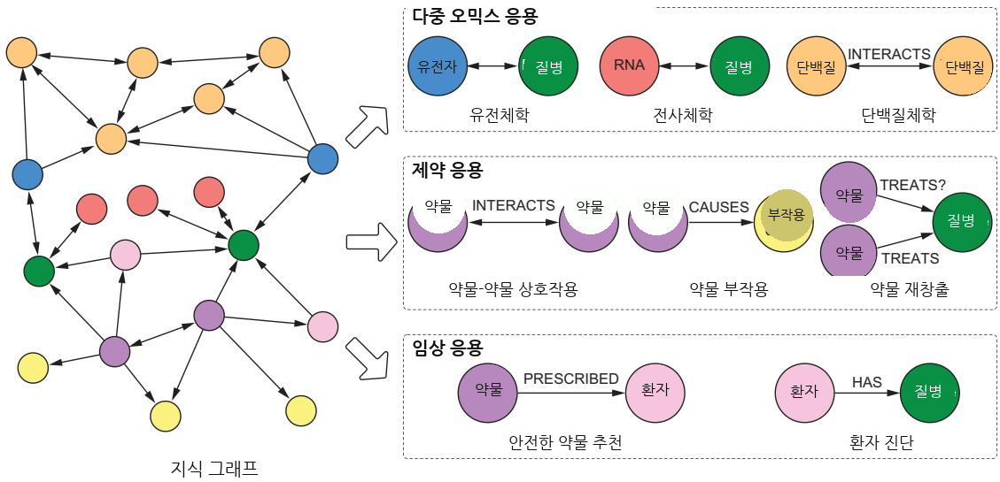  
그림 4.1 비즈니스 목표별로 그룹화한 KG의 주요 생물의학 응용 유형. 이들은 많은 데이터 소스를 공통으로 갖습니다.

### 4.2 KG의 다중 오믹 응용


다중 오믹 (multi-omic)은 유전체, 단백질체, 전사체와 같은 많은 “오믹스” 데이터셋을 사용하는 생물학적 분석 접근법을 의미합니다(그림 4.2 참조). 분자생물학에서 접미사 ome은 전체성을 의미합니다. 예를 들어, genome은 한 유기체의 모든 유전 정보를 가리킵니다.

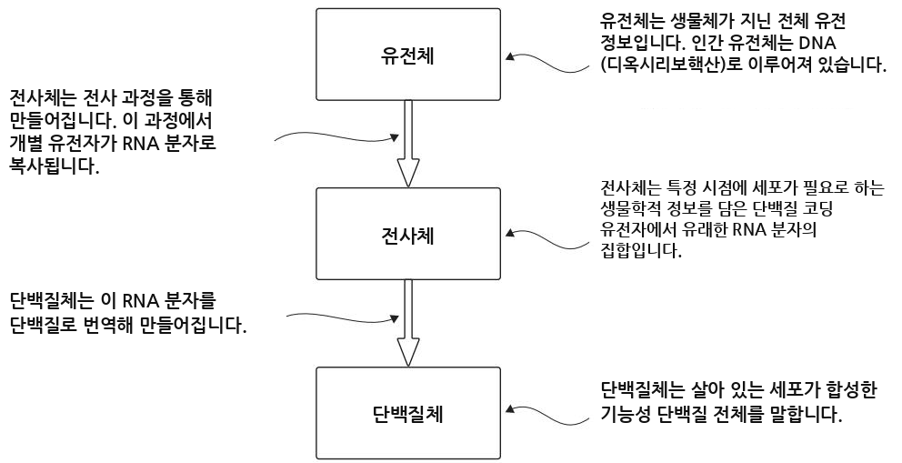  
그림 4.2 생물의학 KG에서 사용되는 세 가지 주요 ‘오믹스’ 데이터 유형. 유전체(DNA), 전사체(RNA), 단백질체(단백질) 데이터는 전사와 번역을 통해 생물학적으로 연결되어 있습니다.

#### 유전체, 전사체, 단백질체


이러한 용어와 관련 개념은 이 장 전반에서 사용됩니다.

유전체(Genome)—생물체의 전체 유전적 구성 요소입니다. 대부분의 유전체는 DNA(디옥시리보핵산)로 이루어져 있지만, 일부 바이러스는 RNA(리보핵산) 유전체를 가지고 있습니다. DNA와 RNA는 뉴클레오타이드라고 불리는 단량체 하위 단위의 사슬로 이루어진 고분자 분자입니다.

전사체(Transcriptome)—단백질체의 합성을 지시하는 RNA 분자들의 집합입니다. 전사체는 전사라고 불리는 과정에 의해 구성되며, 이 과정에서 개별 유전자가 RNA 분자로 복사됩니다.

단백질체(Proteome)—살아 있는 세포가 합성한 모든 기능성 단백질로 이루어진 유전체 발현의 최종 산물입니다. 이는 유전체 발현의 정점이자, 세포 생명을 구성하는 생화학적 활동의 출발점이기도 합니다.

많은 다중 오믹스 응용은 KG를 사용하여 유전체, 유전자가 전사체에서 어떻게 발현되는지, 그리고 이러한 전사 산물의 산물이 단백질체에서 어떻게 상호작용하는지를 연구합니다. 여기에는 miRNA-질병 연관성 탐지 [4], 유전자–증상 우선순위 지정 [9], 단백질–단백질 상호작용 예측 [10, 11, 12]이 포함됩니다.

예를 들어, Yang et al. [9]은 주어진 증상과 관련된 후보 유전자를 식별하기 위한 KG 모델을 제안했습니다. 연구자들은 많은 이질적 데이터 소스를 병합했습니다. 질병 용어를 통일하고 통합하기 위해, 그들은 서로 다른 데이터베이스의 질병 식별자를 Unified Medical Language System(UMLS; https://www.nlm.nih.gov/research/umls/index.html) 코드에 매핑했습니다. 그림 4.3은 이 과정을 보여줍니다.

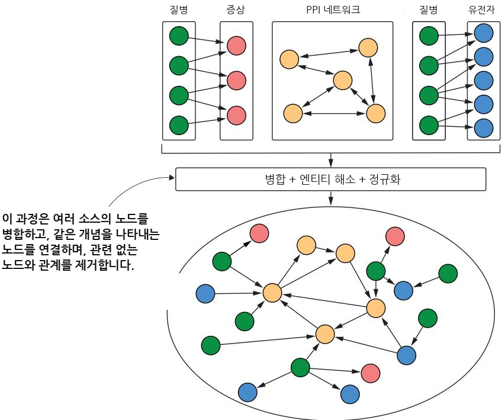  
그림 4.3 연구자들이 전체론적 KG를 만들기 위해 데이터 소스를 결합한 방식을 보여주는 Yang et al. [9]의 이미지 발췌

또 다른 사례에서는 단백질–단백질 상호작용(PPI) 네트워크와 단백질–질병 연관성이 질병 경로(특정 질병과 관련된 단백질 집단)의 컴퓨터 기반 발견에 성공적으로 사용되었습니다 [12]. 이는 IAS를 개발하기에 완벽한 사용 사례이며, 여기서 KG는 핵심적인 역할을 합니다. 각 질병 단백질을 고립적으로 이해하려고 해서는 대부분의 인간 질병을 충분히 설명할 수 없기 때문입니다. 여러 데이터 소스를 병합해야 하는 더 복잡한 시나리오로 넘어가기 전에, 이처럼 더 단순한 유형의 KG를 구성하고 분석하는 방법을 살펴보겠습니다.

#### 4.2.1 PPI 및 단백질-질병 네트워크로부터 KG 생성하기


목표는 알려진 경로에서 출발하여 질병 경로를 발견하는 것입니다. Agrawal 등 [12]이 제안한 접근법은 그림 4.4에 보인 것처럼 KG에서 시작합니다. 질병은 관련된 알려진 단백질과 연결되며, 이 단백질들은 PPI 네트워크에서 서로 연결됩니다. 예를 들어, 그림 4.5는 셀리악병1과 관련 유전자 사이의 연결을 보여 줍니다.

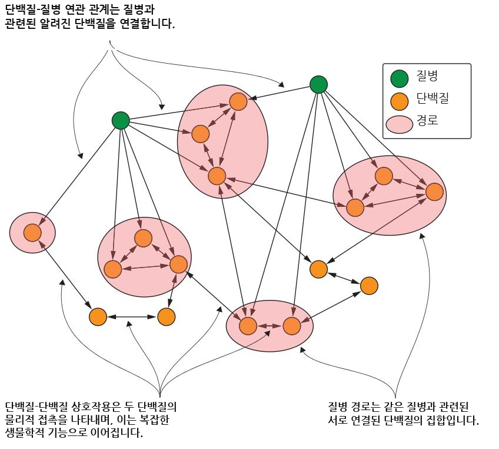  
그림 4.4 질병 경로는 해당 질병과 연관된 단백질 집합으로 정의되는 PPI 네트워크의 부분그래프입니다.

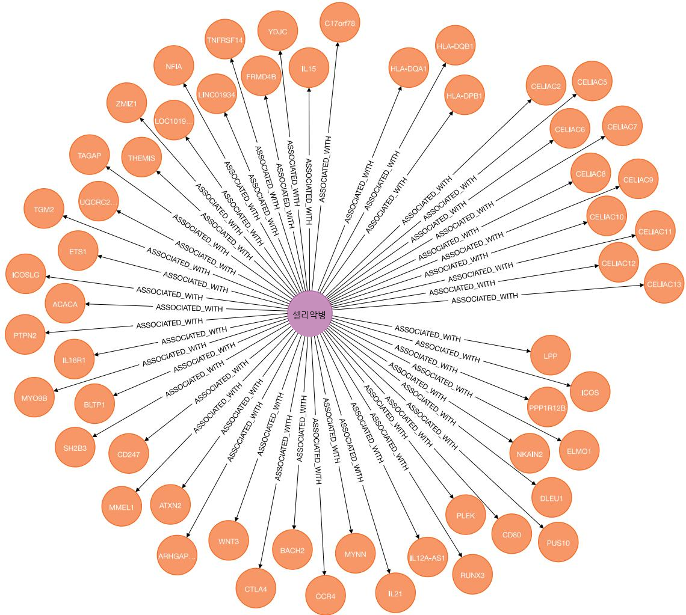  
그림 4.5 Agrawal [12]이 구축한 KG의 작은 일부입니다. 우리는 셀리악병에서 시작하여 관련 유전자들을 찾았습니다.

이제 이 단순한 KG로 무엇을 할 것인지 이해하기 위해 발견 과정을 살펴보겠습니다. 그림 4.6은 시작점과 결과를 보여 줍니다. 우리에게는 알려진 경로 집합이 있으며, IAS는 질병과 연관된 잠재적 단백질 및 관련 경로의 집합을 예측하고 보고해야 합니다. 단백질은 기존 경로의 일부일 수도 있고 새로운 경로를 형성할 수도 있습니다. 결과 KG는 단일분할 그래프 (monopartite graph)(PPI 네트워크)와 이분 그래프 (bipartite graph)(질병–단백질 연관 네트워크)로 구성됩니다.

이 경우 우리에게 필요한 데이터 소스가 있습니다. Stanford Network Analytics Project(SNAP; http:// snap.stanford.edu/pathways/)의 Disease Pathways in the Human Interactome을 사용할 수 있습니다. Agrawal [12]은 더 복잡한 데이터 소스에서 출발하여 이 더 단순한 네트워크를 만들었으며, 우리는 이를 가져와 탐색할 수 있습니다. 그런 다음 결과 KG를 사람이 더 쉽게 읽을 수 있도록 다른 데이터셋과 결합할 것입니다.

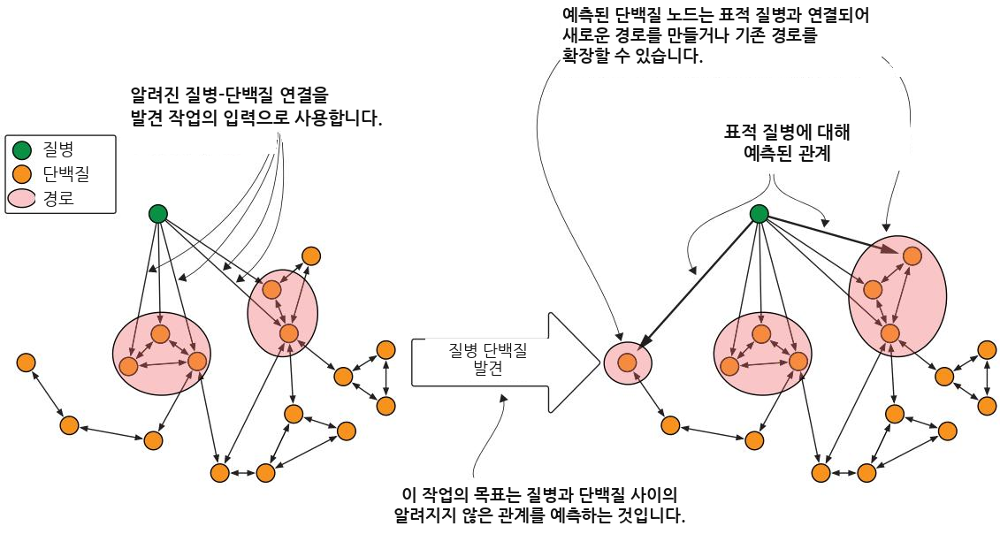  
그림 4.6 질병과 관련된 단백질을 찾기 위한 발견 과정

다음 노드 키 제약 조건은 특정 레이블을 가진 모든 노드가 ID 값을 가지며, 그 값이 고유함을 보장합니다.

```sql
Listing 4.1 Creating the constraints
CREATE CONSTRAINT protein_key IF NOT EXISTS FOR
If you aren’t sure a constraint exists,
(n:Protein) REQUIRE (n.id) IS NODE KEY;
add IF NOT EXISTS to ensure that it
CREATE CONSTRAINT disease_key IF NOT EXISTS FOR is created only if it doesn’t exist.
(n:Disease) REQUIRE (n.id) IS NODE KEY;
```

우리 데이터셋으로 가져올 첫 번째 파일은 Menche 등 [13]과 Chatr-Aryamontri 등 [14]이 편집한 인간 단백질–단백질 상호작용(PPI) 네트워크입니다. 결과 그래프에는 인간의 21,559개 단백질 사이에서 실험적으로 문서화된 342,354개의 상호작용이 포함되어 있습니다. 목록 4.2–4.4는 파일이 SNAP에서 다운로드되고 압축 해제된 뒤 Neo4j의 가져오기 디렉터리 내 PPI 디렉터리로 이동되었다고 가정합니다.

목록 4.2 PPI 네트워크 가져오기   
:auto LOAD CSV FROM 'file:///PPI/bio-pathways-network.csv' AS line   
CALL {   
WITH line   
MERGE (f:Protein {id: trim(line[0])})   
MERGE (s:Protein {id: trim(line[1])})   
MERGE (f)-[:INTERACTS\_WITH]->(s)   
} IN TRANSACTIONS OF 100 ROWS

#### 연습문제


단백질과 그들 사이의 연결 수를 확인하는 데 필요한 쿼리를 실행하십시오. 다음 단계에서는 새로운 단백질이 추가되므로 그 전에 이를 수행하십시오.

다음으로 단백질–질병 연관성을 튜플 (u, d)의 형태로 가져옵니다. 여기서 단백질 u의 변이는 질병 d와 연결됩니다. 이러한 연관성은 질병에 관한 지식을 중앙화하는 플랫폼인 DisGeNET (www.disgenet.org)에서 가져온 것입니다. 이 데이터에는 각각 최소 10개의 질병 단백질을 가진 519개 질병에 나뉘어 있는 21,000개 이상의 단백질–질병 연관성이 포함되어 있습니다.

#### 목록 4.3 경로 가져오기


:auto LOAD CSV WITH HEADERS   
FROM 'file:///PPI/bio-pathways-associations.csv' AS line   
CALL {   
WITH line   
WITH trim(line["Associated Gene IDs"]) AS proteins,   
trim(line["Disease Name"]) AS diseaseName,   
trim(line["Disease ID"]) AS diseaseId   
MERGE (d:Disease {id: diseaseId, name: diseaseName})   
WITH d, proteins   
UNWIND split(proteins, ",") AS protein   
WITH d, protein   
MERGE (p:Protein {id: trim(protein)})   
MERGE (d)-[:ASSOCIATED\_WITH]->(p)   
} IN TRANSACTIONS OF 100 ROWS

#### 연습문제


숫자를 확인하기 위해 몇 가지 검사를 실행하십시오. 단백질 수에 변화가 있음을 확인할 수 있을 것입니다. 새 단백질을 식별할 수 있습니까? 힌트: NOT EXISTS 절을 사용하십시오.

SNAP 데이터셋에서 마지막으로 다운로드할 파일에는 질병 범주가 포함되어 있습니다. 질병은 Disease Ontology (https://disease-ontology.org/)를 사용하여 범주와 하위 범주로 세분화되며, UMLS 코드에도 매핑됩니다. DisGeNET에서 가져온 519개 질병 중 290개는 온톨로지의 코드에 매핑되는 UMLS 코드를 가지고 있습니다. 이 데이터셋은 온톨로지의 두 번째 수준을 사용하며, 여기에는 암(68개 질병), 신경계 질환(44개), 심혈관계 질환(33개), 면역계 질환(21개)을 포함한 10개 범주가 포함됩니다.

#### 목록 4.4 질병 클래스 가져오기


:auto LOAD CSV WITH HEADERS   
➥FROM 'file:///PPI/bio-pathways-diseaseclasses.csv' AS line   
CALL {

WITH line   
WITH line["Disease ID"] as diseaseId, line["Disease Class"] as class   
MATCH (d:Disease {id:diseaseId})   
SET d.class = class   
} IN TRANSACTIONS OF 100 ROWS

#### 연습문제


가져오기 확인 후, 각 질병의 클래스별 수치와 클래스가 없는 질병 목록을 검토합니다.

SNAP 데이터셋에서 데이터를 수집했지만, 이 데이터셋은 단백질을 식별하기 위해 코드를 사용합니다. 가독성을 높이기 위해 NIH에서 유전자 정보(https://ftp.ncbi.nih.gov/ gene/DATA/gene\_info.gz)를 가져올 수 있습니다. 파일을 다운로드한 후 압축을 해제하고 PPI와 동일한 디렉터리로 이동합니다.

#### 목록 4.5 유전자 정보 가져오기


:auto LOAD CSV WITH HEADERS FROM 'file:///PPI/gene\_info' AS line   
FIELDTERMINATOR '\t'   
CALL {   
WITH line   
WITH trim(line["GeneID"]) AS proteinId, trim(line["Symbol"]) AS symbol,   
trim(line["description"]) AS description   
WITH proteinId, symbol, description   
MATCH (p:Protein {id:proteinId})   
SET p.name = symbol, p.description = description   
} IN TRANSACTIONS OF 100 ROWS

#### 4.2.2 결과 KG에 대한 고수준 분석


다음 단계는 KG를 검사하여 그래프의 품질을 평가하고 데이터베이스를 탐색하는 것입니다. 앞의 과정을 따라오지 않았다면 https://mng.bz/5v7O 에서 Neo4j 백업을 다운로드할 수 있습니다. 다음 목록은 Neo4j 5.x를 사용하여 이 데이터베이스를 가져오는 방법을 보여줍니다.

#### 목록 4.6 Neo4j 백업에서 PPI 데이터베이스 생성

#### neo4j.conf 파일에 다음 줄 추가

#### dbms.databases.seed\_from\_uri\_providers=URLConnectionSeedProvider

#### 그런 다음 다음 명령을 실행합니다

CREATE DATABASE ppi OPTIONS { existingData: "use",   
➥seedUri: "https://mng.bz/5v7O"}

그래프에 대한 우리의 분석은 PPI 네트워크에 대한 일반적인 평가로 시작합니다. 이러한 유형의 평가에 우리가 선호하는 알고리즘은 약결합요소 (weakly connected component, WCC)입니다. 이는 그래프 내에서 연결되지 않은 하위 그래프를 찾는 커뮤니티 탐지 (community detection) 알고리즘입니다. 이 분석을

실행하기 위해 Neo4j에서 사용할 수 있는 그래프 데이터 과학 (graph data science, GDS) 라이브러리를 사용합니다(설치 지침은 온라인 부록 B 참조).

먼저 INTERACTS\_WITH를 사용하여 연결된 단백질을 표시합니다.

리스팅 4.7 PPI 네트워크에서 단백질 표시하기

MATCH (p:Protein)-[:INTERACTS\_WITH]-()   
SET p:PPIProtein

이제 프로젝션 (projection)이라고 알려진 그래프의 인메모리 표현 (in-memory representation)을 생성해야 합니다.

call gds.graph.project( 포함하려는 노드 유형 목록의 이름   
'ppi-graph', < 인메모리 그래프입니다. 이 예에서는   
'PPIProtein', < 하나뿐이지만 목록일 수도 있습니다.   
{   
INTERACTS\_WITH: { < 여기에 분석에 포함하려는 관계 목록이 있습니다.   
orientation: 'UNDIRECTED' 분석에 포함하려는 관계입니다.

하위 그래프가 메모리에 생성되면 다음 쿼리를 사용하여 WCC 알고리즘을 실행할 수 있습니다.

#### 목록 4.9 PPI 네트워크에서 WCC 실행


CALL gds.wcc.write('ppi-graph', { writeProperty: 'componentId' }) YIELD nodePropertiesWritten, componentCount, componentDistribution;

쿼리 결과는 표 4.1에 제시되어 있습니다. 백분위수는 해당 비율의 데이터 포인트가 그보다 작은 값을 의미합니다. 예를 들어 p99: 21521은 연결 요소의 99%가 21,521개 미만의 단백질을 가진다는 뜻입니다.

표 4.1 목록 4.9의 쿼리에 대한 요약 결과
<table><tr><td rowspan=1 colspan=1>nodePropertiesWritten</td><td rowspan=1 colspan=4>componentCount</td><td rowspan=1 colspan=1>componentDistribution</td></tr><tr><td rowspan=8 colspan=1>21559</td><td rowspan=1 colspan=4>27</td><td rowspan=1 colspan=1>y</td></tr><tr><td rowspan=2 colspan=4></td><td rowspan=1 colspan=1>&quot;p99&quot;: 21521,</td></tr><tr><td rowspan=1 colspan=3></td><td rowspan=1 colspan=1>&quot;min&quot;: 1,</td></tr><tr><td rowspan=1 colspan=2></td><td rowspan=4 colspan=3></td><td rowspan=1 colspan=1>&quot;max&quot;: 21521,&quot;mean&quot;: 798.481,</td></tr><tr><td></td><td rowspan=3 colspan=1>&quot;p90&quot;: 3,&quot;p50&quot;: 1,&quot;p999&quot;: 21521,&quot;p95&quot;: 4,</td></tr><tr><td rowspan=1 colspan=2></td></tr><tr><td rowspan=2 colspan=4></td><td rowspan=1 colspan=1></td></tr><tr><td rowspan=1 colspan=1>&quot;p75&quot;: 2}</td></tr></table>

우리 알고리즘의 출력은 PPI 네트워크의 단백질들이 매우 높은 수준으로 연결되어 있음을 보여 줍니다. 그래프의 21,559개 단백질은 서로 겹치지 않는 27개의 하위 그래프로 묶일 수 있습니다. 이 중 하나는 21,521개의 단백질을 포함하는 매우 큰 하위 그래프입니다. 나머지 하위 그래프는 단일 노드이거나 최대 네 개의 구성 요소로 이루어진 섬입니다.

WCC는 단백질들이 연결되어 있다는 이유만으로 같은 그룹에 배정합니다. 이 “커뮤니티” 바깥의 다른 단백질들보다 서로 더 조밀하게 연결된 단백질 그룹이 있을 수 있습니다. 이를 찾기 위해 우리는 또 다른 그래프 클러스터링 (graph clustering) 방법인 루뱅 모듈성 알고리즘 (Louvain modularity algorithm) [15]을 사용할 수 있습니다. 이는 가장 빠른 모듈성 기반 알고리즘 중 하나이며 대규모 그래프에서도 잘 작동합니다. 이 알고리즘은 서로 다른 규모에서 커뮤니티의 계층 구조를 드러내며, 이는 네트워크의 전역적 기능을 이해하는 데 유용합니다. 이 알고리즘은 각 커뮤니티의 모듈성 점수, 즉 그룹들이 커뮤니티로 얼마나 잘 분할되었는지를 최대화하는 방식으로 작동하며, 이를 위해 노드들이 무작위 네트워크에서 연결되었을 경우와 비교하여 얼마나 더 조밀하게 연결되어 있는지를 평가합니다.

다음 쿼리는 앞서와 동일한 인메모리 그래프에서 Louvain의 GDS 구현을 실행합니다. 데이터베이스를 재시작했거나 이전에 실행하지 않았다면, 이 쿼리를 실행하기 전에 목록 4.8의 쿼리를 실행해야 합니다.

#### 목록 4.10 PPI 네트워크에서 Louvain 실행하기


```javascript
CALL gds.louvain.write('ppi-graph',
writeProperty: 'componentLouvainId' })
YIELD communityCount, modularity, modularities, communityDistribution
```

표 4.2에 나타난 이 알고리즘의 결과는 표 4.1의 결과와는 다른 양상을 보여 줍니다.

표 4.2 목록 4.10의 쿼리 요약 결과
<table><tr><td rowspan=1 colspan=1>communityCount</td><td rowspan=1 colspan=2>modularity</td><td rowspan=1 colspan=1>communityDistribution</td></tr><tr><td rowspan=1 colspan=1>48</td><td rowspan=1 colspan=2>0.5464241018027929</td><td rowspan=1 colspan=1>{</td></tr><tr><td rowspan=6 colspan=1></td><td rowspan=1 colspan=2></td><td rowspan=1 colspan=1>&quot;p99&quot;: 3533,</td></tr><tr><td rowspan=5 colspan=2></td><td rowspan=1 colspan=1>&quot;min&quot;: 1,</td></tr><tr><td rowspan=3 colspan=1>&quot;max&quot;: 3533,&quot;mean&quot;:449.1458333333333,&quot;p90&quot;: 1817,&quot;p50&quot;: 3,&quot;p999&quot;: 3533,&quot;p95&quot;: 2336,</td></tr><tr><td rowspan=1 colspan=1></td></tr><tr><td rowspan=1 colspan=1></td></tr><tr><td rowspan=1 colspan=1>&quot;p75&quot;: 311}</td></tr></table>

3,500개가 넘는 단백질을 포함하는 큰 커뮤니티도 있고 더 작은 커뮤니티도 있습니다. 평균 크기는 커뮤니티당 약 450개 단백질입니다. 모든 커뮤니티를 고려하는 모듈성 (modularity) 점수는 약 0.40(40%)입니다. 다음 쿼리를 통해 커뮤니티의 내용을 살펴볼 수 있습니다.

목록 4.11 상위 10개 커뮤니티 살펴보기   
MATCH (p:PPIProtein)   
WITH p.componentLouvainId as communityId, count(p) as members   
ORDER BY members desc   
LIMIT 10   
MATCH (p:PPIProtein)-[:INTERACTS\_WITH]-(o)   
WHERE p.componentLouvainId = communityId   
WITH communityId, members, p.name as name, count(o) as connections   
ORDER BY connections DESC   
RETURN communityId, members, collect(name)[..20] as keyMembers

이 쿼리는 Louvain이 식별한 각 커뮤니티에서 가장 많이 연결된 상위 20개 요소를 보여 줍니다. 큰 클러스터에는 APP, NTRK1, GRB2, EGFR, HSP90AA1 같은 단백질이 포함되며, 다른 클러스터에는 ELAVL1, MOV10, NXF1, VCP, SHMT2가 포함됩니다. 우리가 전문가가 아니므로 간단히 구글링해 보면, 이러한 그룹들이 타당하다는 것을 알 수 있습니다.

이러한 알고리즘은 사용하기 쉽지만 범용적입니다. 즉, 각 노드와 관계를 동일한 방식으로 취급합니다. 다음으로는 우리의 도메인과 목표에 맞게 맥락화되고, 각 노드와 각 관계의 의미를 활용하는 몇 가지 기법을 소개하겠습니다. 이 책의 코드에는 이러한 도구들의 라이브러리가 포함되어 있습니다.

#### 4.2.3 PPI 및 질병 KG의 도메인 특화 분석

앞선 알고리즘들은 PPI 네트워크가 어떻게 구조화되어 있는지를 분석했습니다. 이제 우리는 하위 네트워크, 즉 질병 경로를 고려하겠습니다. 이를 그래프 이론으로 옮기면, PPI 네트워크 $G = \left( V, E \right)$가 주어졌을 때, 노드 V는 단백질을 나타내고 엣지 E는 단백질–단백질 상호작용을 나타냅니다. 질병 d에 대한 질병 경로는 d와 연관된 단백질 집합 $V_{\mathrm{d}}$와 단백질–단백질 상호작용 집합으로 지정되는 PPI 네트워크의 무방향 부분 그래프 $H_{\mathrm{d}} = \left( V_{\mathrm{d}}, E_{\mathrm{d}} \right)$입니다.

$$
E_d = \{ (u, v) | (u, v) \in E \text{ and } u, v \in V_d \}
$$

우리의 그래프를 사용하면 간단한 쿼리를 통해 이 하위 네트워크를 추출할 수 있습니다.

#### 목록 4.12 지식 그래프(KG)에서 질병 경로 추출


```perl
MATCH (d:Disease {id:$id})-[:ASSOCIATED_WITH]->(p)
WITH collect(p) as proteins
UNWIND proteins as m0
UNWIND proteins as m1
OPTIONAL MATCH (m0)-[r:INTERACTS_WITH]->(m1)
RETURN DISTINCT m0, r, m1
```

이는 단일부 하위 네트워크 (monopartite subnetwork)로, 단백질과 질병 사이의 연결을 포함하지 않는다는 의미입니다. 서로 다른 질병과 관련된 질병 경로들은 서로 겹칠 수도 있습니다.

특정 척도의 경우, 이 하위 네트워크가 PPI 네트워크의 나머지 부분과 어떻게 연결되는지를 고려해야 합니다. 우리는 경로 경계 (pathway boundary)를 다음과 같이 계산할 수 있습니다.

$$
B_{d} = \{ (u, v) | (u, v) \in E \text{ and } u \in V_{d} \text{ and } v \in V \backslash V_{d} \}
$$

여기서 $V \backslash V_{d}$는 전역 집합 $V$에는 있지만 $V_{d}$에는 없는 모든 노드를 나타내며, 이는 대상 질병과 연관되지 않은 모든 노드에 해당합니다.

우리가 고려할 척도들은 질병 단백질의 연결성을 특성화합니다. 즉, 질병 경로 내부에서의 연결성과 PPI 네트워크의 다른 단백질들을 향한 외부 연결성을 모두 다룹니다. 다른 지표들은 경로 내 거리와 집중도를 고려합니다. 모든 척도는 각 질병을 특성화하고 관련 패턴을 찾기 위해 질병별로 계산됩니다. 또한 이러한 척도들을 모을 수 있으며, 그 통계 정보는 네트워크와 그것이 서로 다른 질병들에 걸쳐 어떻게 분포되어 있는지에 대한 더 폭넓은 개요를 제공할 수 있습니다.

#### 가장 큰 경로 구성요소


첫 번째 척도는 가장 큰 경로 구성요소의 상대적 크기입니다. 이 척도는 $H_d$의 가장 큰 연결 구성요소에 속하는 질병 단백질의 비율을 계산합니다.

$$
\mathrm{relativeLargestCC}(d) = \frac{\left|\mathrm{nodes}(\operatorname{largestCC}(H_d))\right|}{\left|V_d\right|}
$$

여기서 nodes(largestCC(H_d))는 $H_d$의 가장 큰 약한 연결 요소 (WCC)에 있는 노드들을 반환합니다. 코드는 다음 목록에서 networkx 함수를 사용합니다. (전체 코드는 책의 코드 저장소 chapter/ch04/analysis/multiomic\_analysis.py에서 확인할 수 있습니다.)

#### 목록 4.13 가장 큰 경로 구성요소의 크기 찾기


PPI 네트워크를 분석하기 위해 생성된 Python 클래스입니다.   
명령줄 인수를 분석하고 Neo4j 데이터베이스와의   
연결을 처리하는 주요 함수를 포함한   
기본 클래스를 확장합니다.   
class MultiOmicAnalysis(GraphDBBase): <   
def \_\_init\_\_(self, argv, database):   
super().\_\_init\_\_(command=\_\_file \_, argv=argv)   
self.\_\_database = database 질병 경로를 로드하며,   
이는 PPI 네트워크의   
부분 그래프입니다.   
def load\_hd(self, disease): <   
query = """   
MATCH (d:Disease {id:\$id})-[:ASSOCIATED\_WITH]->(p)   
WITH collect(p) as proteins   
UNWIND proteins as m0 쿼리를 가져옵니다.   
UNWIND proteins as m1 부분 그래프를   
OPTIONAL MATCH (m0)-[r:INTERACTS\_WITH]->(m1) 나타내는   
return distinct m0, r, m1 쿼리이며,   
IIIIII 이를 networkx 그래프로   
param = {"id": disease} 로드합니다.   
return self.load\_graph\_and\_get\_nx\_graph(query, param) 쿼리   
결과를   
def load\_graph\_and\_get\_nx\_graph(self, query, param={}): networkx   
data = self.get\_raw\_data(query, param) 그래프로   
G = networkx\_utility.graph\_undirected\_from\_cypher(data) 변환합니다.   
return G   
추가 처리를 위해 노드와   
def get\_raw\_data(self, query, param): < 관계의 목록을 반환합니다.   
with self.\_driver.session(database = self.\_\_database) as session:   
results = session.run(query, param)   
return results.graph()

```python
def compute_largest_components(self, networkx_graph): <
largest_cc = max(nx.connected_components(networkx_graph), key=len)
return largest_cc
Computes all connected components
and returns the largest one
if name == _main__':
analysis = MultiOmicAnalysis(argv=sys.argv[1:], database="ppi")
disease_id = 'celiac disease' < A disease to analyze (the full
networkx_graph = analysis.load_Hd(disease_id) code analyzes all diseases)
nodes_count = networkx_graph.nodes.__len __()
largest_cc = analysis.compute_largest_components(networkx_graph)
relative_size_of_largest_cc =
float(largest_cc_size.__len__())/nodes_count < Computes the relative size of the
largest component, normalized
over the total number of nodes
```

#### 밀도


두 번째로 계산할 지표는 경로의 밀도입니다. 이름이 시사하듯이, 이는 질병 경로에서 단백질들이 얼마나 조밀하게 연결되어 있는지를 측정합니다.

$$
\mathrm{density}(d) = \frac{2 | E_{d} |}{| V_{d} | ( | V_{d} | - 1 )}
$$

분모는 가능한 간선의 수를 계산하고, 분자는 실제 간선을 고려합니다. 결과값은 [0; 1] 범위에 있으며, 밀도가 높을수록 $H_{\mathrm{d}}$의 노드들 사이에 나타나는 가능한 모든 간선의 비율이 더 높음을 나타냅니다.

#### 목록 4.14 경로의 밀도 계산


```python
def compute_density(networkx_graph): 4 Computes the density for a disease
nodes_count = networkx_graph.nodes.__len__() represented by the related subgraph
edges_count = networkx_graph.edges.__len__() extracted from the full PPI network
density_pathway =
2.0 * float(edges_count) / (nodes_count * (nodes_count - 1))
if name == _main ':
analysis = MultiOmicAnalysis(argv=sys.argv[1:], database="ppi")
disease_id = 'celiac disease'
networkx_graph = analysis.load_hd(disease_id)
density_pathway = compute_density(networkx_graph)
```

#### 전도도

세 번째 지표는 전도도 (conductance) [16]입니다. 이는 그래프의 나머지 부분으로부터 질병 경로(부분그래프)가 얼마나 독립적인지를 나타냅니다. 방향과 관계없이 부분그래프 내부의 노드와 외부의 노드를 연결하는 간선을 사용합니다.

$$
\mathrm{conductance}\left(d\right)=\frac{|B_{d}|}{\left(|B_{d}|+2|E_{d}|\right)}
$$

결과값은 [0; 1] 범위에 있습니다. 전도도가 낮을수록 해당 경로가 네트워크의 나머지 부분과 분리된 더 긴밀하게 연결된 커뮤니티임을 의미합니다.

목록 4.15 전도도 계산   
def compute\_bd(self, disease): < Cypher 쿼리를 사용하여 Bd를 계산합니다   
query = """   
MATCH (d:Disease {id:\$id})-[:ASSOCIATED\_WITH]->(p)   
WITH collect(p) as proteins   
MATCH (m0)-[r:INTERACTS\_WITH]-(m1)   
WHERE m0 in proteins and not m1 in proteins   
RETURN count(DISTINCT r) as bd   
IIIIII 반환된 값을 나타내는 열을 포함한 pandas 데이터프레임을 반환합니다   
param = {'id': disease}   
return self.get\_data(query, param)["bd"][0] Cypher 쿼리가 노드와 관계 대신 값을 반환할 때 유용합니다   
def get\_data(self, query, param={}): <   
with self.\_driver.session(database=self.\_\_database) as session:   
results = session.run(query, param)   
data = pd.DataFrame(results.values(), columns=results.keys())   
return data   
if \_\_name == ' \_main \_':   
analysis = MultiOmicAnalysis(argv=sys.argv[1:], database="ppi")   
disease\_id = 'celiac disease   
networkx\_graph = analysis.load\_hd(disease\_id)   
bd = analysis.compute\_bd(disease\_id)   
edges\_count = networkx\_graph.edges.\_\_len\_\_()   
conductance = float(bd) / (bd + 2 \* edges\_count) < 전도도를 계산합니다

#### 질병 경로와 클러스터 분석


이제 각 부분그래프, 즉 질병 경로에 대한 지표를 계산했으므로, 이를 전체적으로 살펴보겠습니다. 이를 수행하는 일반적인 방법은 그림 4.7에 나타난 것처럼 결과를 버킷으로 나누는 빈도 분석을 수행하는 것입니다.

(a) 최대 CC  
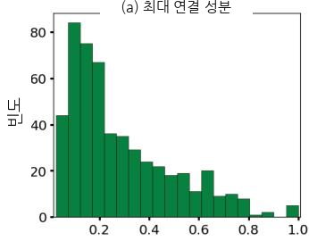

(b) 밀도  
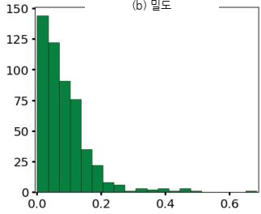

(c) 전도도  
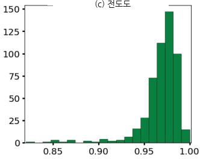  
그림 4.7 질병 경로에 대한 세 가지 핵심 측정값의 분포

PPI 네트워크에서 질병 경로가 단편화되어 있음을 확인할 수 있으며, 질병당 연결 요소의 중앙값은 16이고 최대 경로 구성요소에 포함된 단백질의 중앙값은 21%에 불과합니다(그림 4.7a). 경로 중 약 10%만이 최대 경로 구성요소에 단백질의 60% 이상을 포함합니다. 질병 경로는 내부적으로 잘 연결되어 있지 않으며, 밀도의 중앙값은 0.07에 불과합니다(전체 PPI 네트워크 밀도는 0.0015). 또한 질병의 90%는 밀도가 0.17 미만입니다(그림 4.7b). 반면, 질병 경로는 외부적으로 잘 연결되어 있으며, 전도도의 중앙값은 0.96입니다(그림 4.7c).

질병 경로를 고려하여 얻은 이러한 중첩 부분그래프는 WCC 또는 Louvain을 사용하여 클러스터링할 때 얻는 결과와 매우 다릅니다. 이 이론을 검증하기 위해 Louvain을 사용하여 계산한 클러스터에 동일한 측정값을 적용해 보겠습니다. 결과는 그림 4.8에 제시되어 있습니다.

(a) 최대 CC  
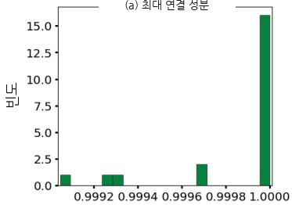

(b) 밀도  
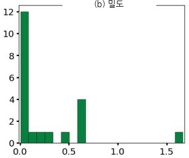

(c) 전도도  
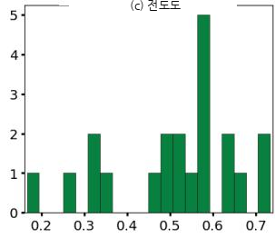  
그림 4.8 Louvain 알고리즘을 통해 얻은 클러스터에 대한 세 가지 핵심 측정값의 분포

이러한 클러스터는 우리에게 다른 양상을 보여줍니다. 예상대로 대부분의 단백질은 크고 연결된 구성요소에 존재합니다(그림 4.8a). 밀도는 네트워크의 전체 연결성과 관련되어 있으므로, 변화는 클러스터의 서로 다른 구조와만 관련됩니다. 전도도는 개선되었습니다. 즉, 클러스터는 외부보다 내부적으로 더 잘 연결되어 있습니다.

다음 절에서는 두 번째 유형의 응용 분야(제약)와 KG에서 정보를 추출하기 위한 새로운 알고리즘을 소개합니다. 우리는 단일 노드뿐만 아니라 에지와 경로에도 초점을 맞출 것입니다.

### 4.3 KG의 제약 응용 분야


새로운 치료제 개발 비용은 14억 달러로 추정되었습니다 [17]. 이 과정은 일반적으로 최초 화합물부터 시장 출시까지 15년이 걸리며 [18], 성공 가능성은 현저히 낮습니다 [19].

약물 분석과 재창출 (repurposing)은 승인 기간, 실패율, 승인 비용을 크게 줄일 수 있습니다. 이러한 분석은 독성학 프로파일링, 전임상 모델, 임상시험, 출시 후 감시를 포함하여 승인된 약물에 관한 기존 정보를 사용합니다. KG가 약물 상호작용을 예측하고 [20], 약물이 상호작용할 수 있는 분자 표적을 식별하며 [21], 기존 약물로 치료할 수 있는 새로운 질병을 결정하는 데 사용된 사례는 많습니다 [22].

Dai 등 [21]은 약물–질병 연관성을 추론하기 위해 추천 시스템, 특히 협업 필터링 (collaborative filtering)을 사용했습니다. 다른 연구자들은 이러한 기법을 사용하여 약물–표적 상호작용 [23, 24]과 약물–질병 치료 [25, 26]를 추론했습니다. 보고된 성공에도 불구하고, 이러한 접근법은 그래프에 포함된 약물과 질병으로 제한됩니다. 이러한 접근법을 화학 구조, 생물학적 과정, 기타 관련 지식의 표현과 결합하여 KG를 풍부하게 하면 연구자들이 신규 화합물에 대해 예측할 수 있을지도 모릅니다.

Himmelstein 등 [2]은 화합물, 질병, 유전자, 해부학적 구조, 경로, 생물학적 과정, 분자 기능, 세포 구성요소, 약리학적 분류, 부작용, 증상을 연결하기 위해 29개의 공개 자원에서 얻은 지식을 인코딩한 그래프를 구축했습니다. 그들은 이 그래프를 Hetionet(“이질적 네트워크”의 약어인 “hetnet”에서 유래)이라고 불렀습니다. 그래프 데이터베이스는 Neo4j 형식으로 공개되어 있습니다(https://het.io/). 따라서 이 예제에서는 연구자들이 우리를 대신해 그 작업을 수행했기 때문에 여러 소스에서 데이터베이스를 생성할 필요가 없습니다. 대신 일관된 스키마를 갖춘 적절히 설계된 KG의 중요성과, 정보의 완전성을 평가하기 위해 KG를 분석하는 방법을 논의하겠습니다.

우리는 https://mng.bz/648e 에서 다운로드할 수 있는 이 데이터베이스의 Neo4j 5.x 백업을 만들었습니다. 다음 목록은 이를 가져오는 방법을 보여줍니다.

#### 목록 4.16 Het.io 데이터베이스 생성

#### neo4j.conf 파일에 다음 줄을 추가합니다

#### dbms.databases.seed\_from\_uri\_providers=URLConnectionSeedProvider

#### 그런 다음 다음 명령을 실행합니다

CREATE DATABASE hetionet OPTIONS { existingData: "use",   
➥seedUri: "https://mng.bz/648e"}

가져온 KG는 11개 유형의 노드 47,031개와 24개 유형의 관계 2,250,197개로 구성됩니다. 노드는 1,552개의 소분자 화합물과 137개의 복합 질병뿐만 아니라 유전자, 해부학적 구조, 경로, 생물학적 과정, 분자 기능, 세포 구성 요소, 교란, 약리학적 분류, 약물 부작용, 질병 증상으로 구성됩니다. 에지는 이러한 노드 간의 관계를 나타내며, 지난 반세기 동안 수백만 건의 연구가 생산한 집단 지식을 포괄합니다 [2]. 그림 4.9는 데이터셋의 전체 스키마를 보여줍니다.

예를 들어, Compound–binds–Gene 에지는 유전자가 인코딩한 단백질에 화합물이 결합하는 것을 나타냅니다. Hetionet에는 11,571개의 에지가 포함되어 있으며, 각 에지에 대해 참조 문헌이 관계 속성으로 저장됩니다.

#### 연습문제


가져온 그래프를 탐색하고 노드가 서로 다른 노드 유형에 걸쳐 어떻게 분포되어 있는지 살펴보십시오. 관계에 대해서도 동일하게 수행하십시오. 주의하십시오. 관계는 더 복잡할 수 있습니다. 정확한 쿼리를 작성하려면 스키마를 참조하십시오.

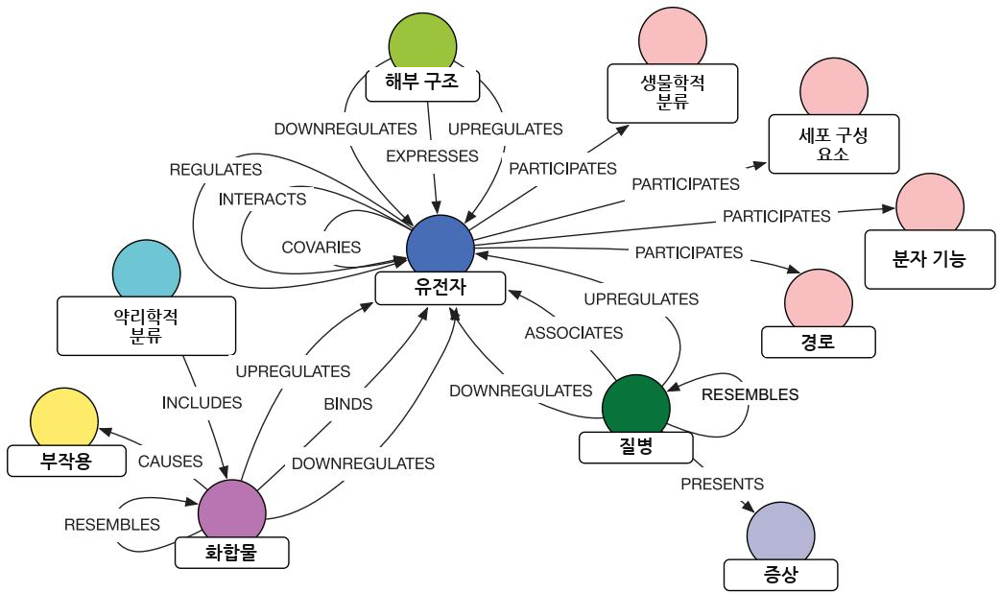  
그림 4.9 Het.io KG 스키마. 노드와 관계의 세부 정보는 https://mng.bz/EwgD 에서 확인할 수 있습니다.

#### 메타경로와 차수 가중 경로 수 (DWPC)


이어지는 경로 탐색 예제에서는 관련성을 기준으로 정렬하기 위해 새로운 지표인 차수 가중 경로 수 (degree-weighted path count, DWPC)를 사용합니다. 이 지표는 Himmelstein [27]이 도입한 것으로, 원래 소셜 네트워크 분석을 위해 개발된 기존 방법인 PathPredict [28]를 각색한 것입니다. DWPC는 Hetionet에서 메타경로 (metapath)의 출현 정도를 정량화합니다.

다음 그림의 패널 (a)에 나타난 것처럼, 스키마는 실제 노드와 기존 관계를 사용하여 표현됩니다. 반면 메타경로는 첫 번째 유형의 노드와 마지막 유형의 노드 사이에 존재할 수 있는 실제 경로를 설명하는 노드 및 관계의 클래스 시퀀스를 나타냅니다. 우리는 스키마를 “쿼리”하여 소스 유형과 대상 유형 사이의 연결 패턴을 검색할 수 있습니다. 예를 들어, 패널 (b)에 표시된 것처럼 최대 길이가 4인 (Gene)— a—(Disease)와 같은 일반 패턴에 대해 가능한 메타경로 목록을 생성할 수 있습니다.

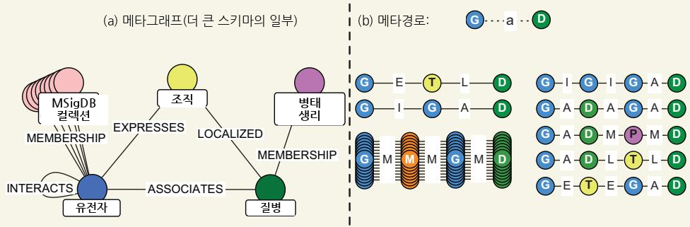  
Hetionet의 메타그래프 (a) 및 메타경로 (b) 발췌. 메타그래프는 데이터베이스의 구조를 설명하며, 노드의 유형과 관계의 유형을 나타냅니다. 메타경로는 경로를 설명하고 노드 및 관계의 유형을 나타냅니다.

다시 한 번 강조하면, 이것들은 경로의 설명이지 실제 경로 인스턴스가 아닙니다.

이제 예제 KG를 탐색했으므로 지표를 계산하기 시작할 수 있습니다. 가장 단순한 메타경로 기반 지표는 경로 수 (path count, PC)입니다. 이는 정의된 소스 노드와 대상 노드 사이에서 지정된 메타경로에 해당하는 경로의 수입니다. PC는 경로를 따라 그래프 연결성이 어느 정도인지에 대해 조정하지 않습니다. 각 경로는 1의 값을 갖습니다. 예를 들어, 그림 4.10a는 특정 유전자 IRF1이 특정 질병인 다발성 경화증과 관련되는 KG의 일부를 보여 줍니다. 모든 경로는 일반 패턴 (Gene)—a—(Disease)에 대한 가능한 메타경로 중 하나에 속합니다. 그림 4.10b에서는 각 메타경로와 관련된 경로들이 그룹화되어 있습니다. 첫 번째 그룹에는 Tissue 유형의 중간 노드가 있으며 경로가 하나뿐이므로 PC는 1입니다. 두 번째 그룹에는 또 다른 유전자가 중간 노드로 있습니다. 이 그룹에서 그래프에는 세 개의 경로가 있으므로 PC는 3입니다.

(a) 가설적 그래프  
(b) 경로 수 계산 및 가중치 부여  
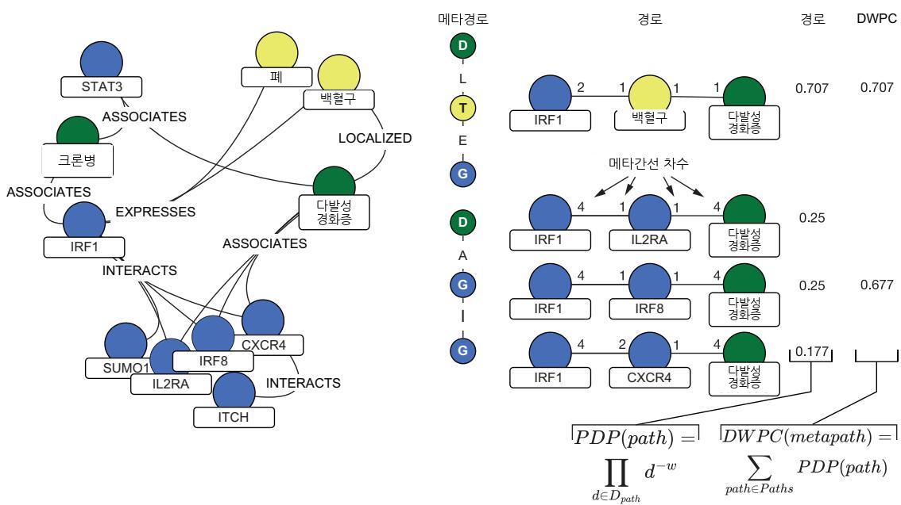  
그림 4.10 (a) 정의된 메타경로를 기반으로 경로를 추출하고, (b) 경로-차수 곱 (PDP)과 DWPC를 계산하는 과정

반면 DWPC는 각 경로에 경로-차수 곱 (path-degree product, PDP)이라고 하는 개별 값을 연결합니다. 이는 다음 공식으로 계산됩니다.

$$
\mathrm{PDP}\left(\mathrm{path}\right) = \prod_{d \in {\cal D}_{\mathrm{path}}} d^{-w}
$$

그리고 다음과 같이 계산됩니다.

1 경로를 따라 모든 메타에지별 차수 (metaedge-specific degrees) $(D_{\mathrm{path}})$ 를 추출합니다. 이때 경로의 각 에지는 두 개의 차수를 기여합니다. 그림 4.10에서 IRF1과 IL2RA 사이의 에지는 4와 1이라는 두 차수 값을 갖습니다. IRF1은 INTERACTS 유형의 나가는 에지를 네 개 갖고, IL2RA는 INTERACTS 유형의 들어오는 에지를 한 개 갖기 때문입니다. IRF1과 CXCR4 사이의 에지는 차수 값 4와 2를 갖는데, 이는 CXCR4가 INTERACTS 유형의 들어오는 에지를 두 개 갖기 때문입니다.

2 각 차수를 $-w$ 거듭제곱합니다. 여기서 $w \geq 0$ 이며 감쇠 지수 (damping exponent)라고 합니다.

3 거듭제곱된 모든 차수를 곱하여 PDP를 산출합니다.

그림 4.10의 경로 $(\mathrm{IRF1}){-}[]{-}(\mathrm{CXCR4}){-}[]{-}$ (다발성 경화증)를 고려해 보겠습니다. $w = 0.5$ 라고 가정하면 계산은 다음과 같습니다.

$$
4^{-0.5} * 2^{-0.5} * 1^{-0.5} * 4^{-0.5} = 0.167 \cong 0.177
$$

그림 4.10은 다른 경로들의 값을 보여 줍니다. DWPC는 특정 메타경로에 대한 PDP들의 합과 같습니다.

$$
\mathrm{DWPC}_{m}\left(s,t\right) = \sum_{\mathrm{path} \in \mathrm{Paths}_{m}\left(s,t\right)} \mathrm{PDP}(\mathrm{path})
$$

이러한 지표는 경로의 유병성을 평가하는 동시에 KG 분석 중 흔히 발생하는 문제인 “잘 알려진 노드”를 무시합니다.

#### 4.3.1 Hetionet 지식 그래프의 심층 분석

이 단계에서 우리는 Hetionet 그래프를 심층 분석하는 데 필요한 모든 요소를 갖추고 있습니다. Cypher 쿼리와 DWPC 지표를 사용하여 질병 관련 유전자 집합에서 두드러진 유전자 온톨로지 (gene ontology, GO) 과정을 식별하겠습니다.

NOTE 다음 분석은 Daniel Himmelstein이 시작한 Thinklab 프로젝트(https://think-lab.github.io/d/220/)에서 영감을 받았습니다.

다시 셀리악병 (celiac disease, CD)을 예로 사용하겠습니다. CD는 흔한(유병률 1:100) 만성 면역 매개 장질환으로, 유전적으로 소인이 있는 개인에게서 글루텐 불내성으로 인해 발생합니다. `MATCH p = (:Disease {name: 'celiac disease'})-[rel: ASSOCIATES\_DaG]-() RETURN p` 쿼리를 사용하면 CD와 관련된 48개 유전자를 확인할 수 있습니다.

다음으로, 최소 두 개의 셀리악 관련 유전자가 참여하는 각 GO 과정과 CD 사이의 DWPC를 계산하겠습니다. 결과는 참여 유전자가 최소 다섯 개인 과정으로 추가 제한됩니다. Cypher 쿼리는 다음과 같습니다.

Listing 4.17 CD에 대한 GO 과정 풍부도 분석   
MATCH path = (n0:Disease)-[:ASSOCIATES\_DaG]-(n1)-[:PARTICIPATES\_GpBP]-   
➥(n2:BiologicalProcess) < 검색 대상   
WHERE n0.name = 'celiac disease' < 소스를 ‘celiac disease’로 제한   
WITH   
[   
size([(n0)-[:ASSOCIATES\_DaG]-() | n0]),   
size([()-[:ASSOCIATES\_DaG]-(n1) | n1]),   
size([(n1)-[:PARTICIPATES\_GpBP]-() | n1]),   
size([()-[:PARTICIPATES\_GpBP]-(n2) | n2]) DWPC에 필요한 관계 관련   
] < 차수를 계산   
AS degrees, path, n2   
WITH   
n2.identifier AS go\_id, GO 과정 ID와 이름을 반환   
n2.name AS go\_name, 경로 수를 계산   
count(path) AS PC, < 경로 수   
sum(reduce(pdp = 1.0, d in degrees| pdp \* d ^ -0.4)) AS DWPC, < DWPC 계산   
size([(n2)-[:PARTICIPATES\_GpBP]-() | n2]) AS n\_genes < GO 과정 내 유전자 수를 계산   
WHERE n\_genes >= 5 AND PC >= 2 4   
RETURN   
go\_id, go\_name, PC, DWPC, n\_genes 참여하는 일반 유전자가 다섯 개 미만이고   
ORDER BY DWPC DESC 셀리악 관련 유전자가 두 개 미만인 GO 과정을 필터링하여 제외   
LIMIT 10   
이를 실행했을 때, 쿼리는 표 4.3에 나열된 상위 10개 GO 과정을 반환했습니다.

표 4.3 목록 4.17의 질의 결과
<table><tr><td rowspan=1 colspan=2>GO ID</td><td rowspan=1 colspan=1>GO 이름</td><td rowspan=1 colspan=1>PC</td><td rowspan=1 colspan=1>DWPC</td><td rowspan=1 colspan=1>유전자 수</td></tr><tr><td rowspan=3 colspan=2>GO:0031295GO:0031294GO:0002507</td><td rowspan=3 colspan=1>T 세포 공동자극림프구 공동자극관용 유도</td><td rowspan=1 colspan=1>10</td><td rowspan=1 colspan=1>0.03347</td><td rowspan=1 colspan=1>75</td></tr><tr><td rowspan=1 colspan=1>10</td><td rowspan=1 colspan=1>0.03329</td><td rowspan=1 colspan=1>76</td></tr><tr><td rowspan=1 colspan=1>3</td><td rowspan=1 colspan=1>0.03276</td><td rowspan=1 colspan=1>12</td></tr><tr><td rowspan=1 colspan=2>GO:0050870</td><td rowspan=1 colspan=1>T 세포 활성화의 양성 조절</td><td rowspan=1 colspan=1>14</td><td rowspan=1 colspan=1>0.02925</td><td rowspan=1 colspan=1>201</td></tr><tr><td rowspan=1 colspan=2>GO:0034112</td><td rowspan=1 colspan=1>동형 세포-세포 부착의 양성 조절</td><td rowspan=1 colspan=1>14</td><td rowspan=1 colspan=1>0.02902</td><td rowspan=1 colspan=1>205</td></tr><tr><td rowspan=1 colspan=2>GO:1903039</td><td rowspan=1 colspan=1>백혈구 세포-세포 부착의 양성 조절</td><td rowspan=1 colspan=1>14</td><td rowspan=1 colspan=1>0.02891</td><td rowspan=1 colspan=1>207</td></tr><tr><td rowspan=3 colspan=2>GO:0051249GO:0002684</td><td rowspan=1 colspan=1>림프구 활성화의 조절</td><td rowspan=1 colspan=1>18</td><td rowspan=1 colspan=1>0.02763</td><td rowspan=3 colspan=1>381880</td></tr><tr><td rowspan=2 colspan=1>면역계 과정의 양성 조절</td><td rowspan=2 colspan=1>21</td><td rowspan=2 colspan=1>0.02718</td></tr><tr><td rowspan=1 colspan=1></td></tr><tr><td rowspan=3 colspan=2>GO:0022409GO:0050863</td><td rowspan=2 colspan=1>세포-세포 부착의 양성 조절</td><td rowspan=2 colspan=1>14</td><td rowspan=2 colspan=1>0.02716</td><td rowspan=2 colspan=1>242</td></tr><tr><td rowspan=1 colspan=1></td></tr><tr><td rowspan=1 colspan=1>T 세포 활성화의 조절</td><td rowspan=1 colspan=1>16</td><td rowspan=1 colspan=1>0.02701</td><td rowspan=1 colspan=1>290</td></tr></table>

ID가 GO:0002684인 GO 과정 (GO process)은 높은 PC 값을 가지며 880개의 유전자와 연결되어 있습니다. PC를 기준으로 정렬하면 이 과정이 첫 번째로 나열될 것입니다. 그러나 이 과정은 CD뿐만 아니라 많은 다른 과정에도 관여합니다. DWPC를 기준으로 정렬하면 결과 목록의 하단에 가깝습니다. 최상단에는 GO:0031295, 즉 “T 세포 공동자극”이 있으며, 이는 우리가 조사하고 있는 질병과 매우 관련이 높습니다.

단백질 상호작용 관계를 포함하여 더 복잡한 경로를 고려함으로써 검색을 정교화해 보겠습니다. 다음 목록의 쿼리는 기존 지식에 의한 편향이 더 적은 전장유전체 연관 연구 (genome-wide association studies, GWASs) [29, 30]에서 도출된 질병과 유전자 간의 연관만을 고려합니다. 또한 CD에 대한 상호작용체 (interactome)의 이웃에 있는 유전자를 식별하기 위해 메타경로 (metapath)에 단백질 상호작용을 추가합니다. 마지막으로, 이 쿼리는 셀리악병에 영향을 받은 조직에서 상향 조절되는 유전자만 고려합니다.

목록 4.18 조직 특이적 상호작용체학   
MATCH path = (n0:Disease)-[e1:ASSOCIATES\_DaG]-(n1)-[:INTERACTS\_GiG]-(n2)-   
➥[:PARTICIPATES\_GpBP]-(n3:BiologicalProcess)   
WHERE n0.name = 'celiac disease'   
AND 'GWAS Catalog' in e1.sources   
AND exists((n0)-[:LOCALIZES\_DlA]-()-[:UPREGULATES\_AuG]-(n2))   
WITH   
[   
size([(n0)-[:ASSOCIATES\_DaG]-() | n0]),   
size([()-[:ASSOCIATES\_DaG]-(n1) | n1]),   
size([(n1)-[:INTERACTS\_GiG]-() | n1]),   
size([()-[:INTERACTS\_GiG]-(n2) | n2]),   
size([(n2)-[:PARTICIPATES\_GpBP]-() | n2]),   
size([()-[:PARTICIPATES\_GpBP]-(n3) | n3])   
] AS degrees, path, n3 as target   
WITH   
target.identifier AS go\_id,   
target.name AS go\_name,   
count(path) AS PC,   
sum(reduce(pdp = 1.0, d in degrees| pdp \* d ^ -0.4)) AS DWPC,   
size([(target)-[:PARTICIPATES\_GpBP]-() | target]) AS n\_genes   
WHERE 5 <= n\_genes <= 100 AND PC >= 2   
RETURN   
go\_id, go\_name, PC, DWPC, n\_genes   
ORDER BY DWPC DESC   
LIMIT 10

쿼리 결과는 표 4.4에 제시되어 있습니다.

표 4.4 목록 4.18의 쿼리 결과
<table><tr><td>GO ID</td><td>GO 이름</td><td>PC</td><td>DWPC</td><td>유전자 수</td></tr><tr><td>GO:0031295</td><td>T 세포 공동자극</td><td>10</td><td>0.00665</td><td>75</td></tr><tr><td>GO:0031294</td><td>림프구 공동자극</td><td>10</td><td>0.00662</td><td>76</td></tr><tr><td>GO:0010560</td><td>당단백질 생합성 과정의 양성 조절</td><td>6</td><td>0.00342</td><td>17</td></tr><tr><td>GO:0033689</td><td>조골세포 증식의 음성 조절</td><td>4</td><td>0.00341</td><td>9</td></tr><tr><td>GO:1903020</td><td>당단백질 대사 과정의 양성 조절</td><td>6</td><td>0.00327</td><td>19</td></tr><tr><td>GO:0006573</td><td>발린 대사 과정</td><td>5</td><td>0.00277</td><td>8</td></tr><tr><td>GO:0070884</td><td>칼시뉴린-NFAT 신호전달 연쇄반응의 조절</td><td>2</td><td>0.00277</td><td>19</td></tr><tr><td>GO:0010559</td><td>당단백질 생합성 과정의 조절</td><td>7</td><td>0.00272</td><td>35</td></tr><tr><td>GO:1903018</td><td>당단백질 대사 과정의 조절</td><td>7</td><td>0.00257</td><td>40</td></tr><tr><td>GO:0070098</td><td>케모카인 매개 신호전달 경로</td><td>9</td><td>0.00256</td><td>72</td></tr></table>

결과는 훨씬 더 구체적입니다. 처음 두 항목은 동일하지만, 단백질 상호작용을 추가함으로써 당단백질과 관련된 과정의 강한 우세와 같은 다른 질병 특이적 측면이 반환되었습니다. “당단백질 생합성 과정의 양성 조절” 관계에 관심이 있다면, DWPC의 기반이 되는 경로를 검색할 수 있습니다.

#### 목록 4.19 DWPC 이면의 경로 찾기


MATCH path = (n0:Disease)-[e1:ASSOCIATES\_DaG]-(n1)-[:INTERACTS\_GiG]-(n2)-   
➥[:PARTICIPATES\_GpBP]-(n3:BiologicalProcess)   
WHERE n0.name = 'celiac disease'   
AND n3.name = 'positive regulation of glycoprotein biosynthetic process   
AND 'GWAS Catalog' in e1.sources   
AND exists((n0)-[:LOCALIZES\_DlA]-()-[:UPREGULATES\_AuG]-(n2))   
RETURN path

결과는 그림 4.11에 나와 있습니다.

#### 연습문제


쿼리를 수정하면 서로 다른 질병에 대해 동일한 분석을 수행할 수 있습니다. 몇 가지를 실행해 보고 연구를 수행하여 이 지식 그래프 (KG)가 얼마나 많은 지식을 포착하는지 평가해 보십시오. Thinklab은 탐색할 수 있는 다른 흥미로운 쿼리도 많이 제공합니다.

앞서 살펴본 바와 같이, 지식 그래프는 탐색하고 활용하기 쉬운 지식을 포착할 수 있습니다. 우리의 분석은 저장된 정보에 대한 정량적 평가를 제공했습니다.

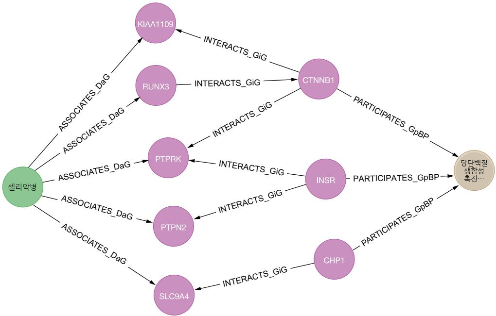  
그림 4.11 목록 4.19의 쿼리 결과로, CD와 “당단백질 생합성 과정의 양성 조절” 사이의 경로를 보여줍니다.

#### 4.3.2 경로 분석 결과의 LLM 지원 해석


DWPC 기반 쿼리는 생물학적 과정의 정량적 순위를 제공하지만, 이러한 결과를 임상적으로 실행 가능한 통찰로 전환하려면 도메인 전문성과 맥락적 이해가 필요합니다. LLM은 지능형 해석자로 기능하여, 복잡한 경로 분석 결과를 일관된 생물학적 서사와 임상적 권고로 종합하는 데 도움을 줄 수 있습니다.

우리의 CD 분석에서 얻은 GO 과정 풍부화 결과를 사용하여 이를 시연해 보겠습니다. 쿼리는 “T 세포 공동자극”, “내성 유도”, “당단백질 생합성 과정의 양성 조절”과 같은 과정들을 다양한 DWPC 점수와 함께 반환했습니다. LLM은 이러한 발견을 더 넓은 생물학적 맥락에서 해석하는 데 도움을 줄 수 있습니다.

#### 목록 4.20 LLM 분석 프롬프트 예시


당신은 셀리악병 (celiac disease)에 대한 유전자 온톨로지 (gene ontology) 경로 풍부화 결과를 분석하는 생의학 연구 보조자입니다. 지식 그래프 (knowledge graph) 분석에서 얻은 다음 결과를 해석하고 임상 연구자들을 위한 통찰을 제공하십시오.

쿼리 결과:

\- T 세포 공동자극 (DWPC: 0.03347, PC: 10, 유전자: 75)

\- 림프구 공동자극 (DWPC: 0.03329, PC: 10, 유전자: 76)

\- T 세포 활성화의 양성 조절 (DWPC: 0.02925, PC: 14, 유전자: 201)

\- 당단백질 생합성 과정의 양성 조절

➥(DWPC: 0.00342, PC: 6, 유전자: 17)

맥락: 이러한 경로들은 단백질-단백질 상호작용 네트워크에서 셀리악병 관련 유전자에 대한 DWPC 분석을 통해 식별되었습니다. DWPC 점수는 노드 차수 편향 (node degree bias)을 고려하면서 경로 관련성을 나타냅니다.

분석 요청:

1. 셀리악병에서 이러한 상위 순위 경로들의 생물학적 중요성을 해석하십시오.

2. 이러한 과정들과 셀리악병 발병기전 사이의 관계를 설명하십시오.

3. 잠재적 치료적 함의를 식별하십시오.

4. 추가 조사가 필요한 예상 밖의 발견을 강조하십시오.

5. 이러한 결과를 바탕으로 후속 연구 질문을 제안하십시오.

LLM은 원시 분석 결과를 포괄적 분석으로 번역하여, T 세포 공동자극이 CD의 자가면역적 성격과 어떻게 관련되는지, 내성 유도가 왜 교란된 것으로 보이는지, 그리고 당단백질 조절이 글루텐 불내성 기전과 어떻게 연결되는지를 설명합니다. 이러한 해석은 결과를 실행 가능한 생물학적 통찰로 전환합니다. Claude.ai Sonnet 4.0(https://claude.ai/ new)을 사용하여 얻은 결과의 첫 부분은 다음 사이드바에 제시되어 있습니다.

#### 최상위 순위 경로의 생물학적 의의에 대한 Claude.ai 부분 결과


T 세포 및 림프구 공동자극 (costimulation) 경로(DWPC: 0.03347 및 0.03329). 이러한 경로는 셀리악병의 핵심 면역학적 기능 이상을 나타냅니다. 높은 DWPC 점수와 상당한 유전자 수(75–76개 유전자)는 조절 장애가 있는 공동자극 신호전달이 질병 병인의 중심에 있음을 시사합니다. 셀리악병에서 항원제시세포 (antigen-presenting cells)는 HLA-DQ2/DQ8 분자를 통해 글리아딘 펩타이드를 T 세포에 제시하며, 비정상적인 공동자극은 관용이 아니라 부적절한 T 세포 활성화로 이어집니다.

관용 유도(DWPC: 0.03276). 이 경로는 더 적은 수의 유전자(12개)를 포함함에도 불구하고 현저히 높은 DWPC 점수를 보이며, 이는 셀리악병 네트워크 내에서 고도로 상호연결되어 있음을 시사합니다. 이는 식이 항원에 대한 경구 관용 (oral tolerance)의 근본적 붕괴를 반영하는 것으로 보이며, 이는 셀리악병 병인의 특징입니다.

T 세포 활성화의 양성 조절(DWPC: 0.02925). 201개의 유전자가 관여하는 이 경로는 가장 광범위한 면역학적 조절 장애를 나타냅니다. 지속적인 T 세포 활성화는 셀리악병을 특징짓는 만성 염증 반응을 유도하여 융모 위축과 임상 증상으로 이어집니다.

이 접근법은 LLM이 정량적 결과를 정성적 이해로 전환하는 맥락적 해석을 제공함으로써, 계산 분석과 응용 사이의 간극을 메우고 지식 그래프 분석 (KG analytics)을 어떻게 보완할 수 있는지를 보여줍니다.

### 4.4 KG의 임상 응용


임상 응용은 아직 KG 활용의 초기 단계에 있습니다. 이 경우 장기적 목표는 주로 정밀의학 (precision medicine)을 통해 환자 진료를 지원하기 위해 KG를 사용하고 분석하는 것입니다. 정밀의학 이니셔티브는 개인의 유전적 특성, 환경, 생활양식이 질병을 예방하거나 치료하는 최선의 접근법을 결정하는 데 어떻게 도움을 줄 수 있는지를 이해하기 위한 장기 연구 과업입니다. 정밀의학을 구현하려면 단백체학, 유전체학, 전사체학과 같은 오믹스 데이터를 임상 의사결정 과정에 통합해야 하며, 이 과정에는 전자의무기록 (electronic health records, EHRs)과 같은 환자 데이터가 포함됩니다. 생의학 데이터의 양과 다양성, 여러 생의학 데이터베이스와 출판물 전반에 분산된 임상적으로 관련 있는 지식, 그리고 개인정보 보호 우려는 데이터 통합에 과제를 제기합니다 [31].

EHR은 환자 진료에 관여하는 모든 임상의의 정보를 포함하도록 설계되어 있습니다. EHR은 해석하기 어려울 수 있고, 상당한 주관성이 존재하며, 임상의가 관련 없다고 판단한 정보는 생략되거나 추적되지 않을 수 있어 정보 누락으로 이어집니다 [32]. 따라서 임상 응용에 사용되는 KG는 EHR을 다중 오믹스 데이터셋, 여러 온톨로지 및 기타 데이터 소스와 병합합니다. 핵심 요소는 환자, 약물, 질병을 나타내는 노드이며, 에지는 환자가 특정 약물로 치료받거나 질병을 진단받는 것과 같은 관계를 인코딩합니다.

EHR과 그래프를 사용하는 또 다른 예는 환자 경험 매핑 (patient experience mapping)이라고도 불리는 환자 여정 매핑 (patient journey mapping)입니다 [33]. 이는 사람들이 보건의료 서비스에 어떻게 진입하고, 경험하며, 퇴장하는지를 더 잘 이해하기 위한 빠르게 성장하는 접근법입니다. 이는 종종 임상 경로 (clinical pathways) [34]와 비교되는데, 임상 경로는 특정 질병에 대한 환자의 임상 양상에 맞는 표준 진료를 수립하며, 흔히 동반 환자 여정 지도와 연결됩니다. 그림 4.12는 암과 같은 복합 질환에서 단일 환자 여정의 범위를 보여줍니다.

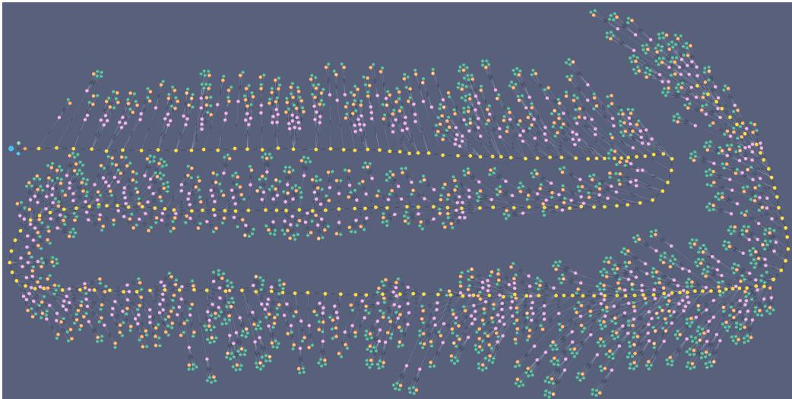  
그림 4.12 단일 환자의 임상 종양학 여정(David Hughes 제공; https://www.graphable.ai/blog/patient-journey-mapping)

커뮤니티는 EHR 사용과 관련된 개인정보 보호 및 보안 우려에 대한 해결책을 찾기 위해 많은 노력을 기울이고 있습니다. 일부 접근법은 질병, 증상 또는 치료 결과에 관한 통계 정보를 추출하기 위해 방대한 환자 데이터 집합을 사용합니다 [32]. 이러한 통계적 관계와 관련 가중치는 KG에 저장되지만, 실제 환자 데이터는 저장되지 않습니다. 이는 개인정보 보호의 보장 수준을 높입니다 [35].

또 다른 접근법은 민감하지 않은 데이터, 익명화된 데이터, 실험 결과, 실제 데이터에서 도출된 통계 정보를 기반으로 비식별화된 일반 임상 KG를 구축하는 것입니다. 환자 EHR 데이터는 엄격히 필요한 경우와 환자 동의가 있는 경우에만 사용됩니다.

Albertos Santos 등 [31]의 임상 지식 그래프 (Clinical Knowledge Graph, CKG)는 KG를 핵심으로 하는 플랫폼입니다. CKG는 33개의 노드 라벨을 51개의 관계 유형과 연결함으로써 데이터를 조화시키고 통합합니다(그림 4.13 참조). 이는 변경된 기능에 대한 통찰을 제공하고, 조절된 단백질에 대한 약물을 제안하며, 가능한 교란 요인을 드러낼 수 있는 질의를 가능하게 합니다.

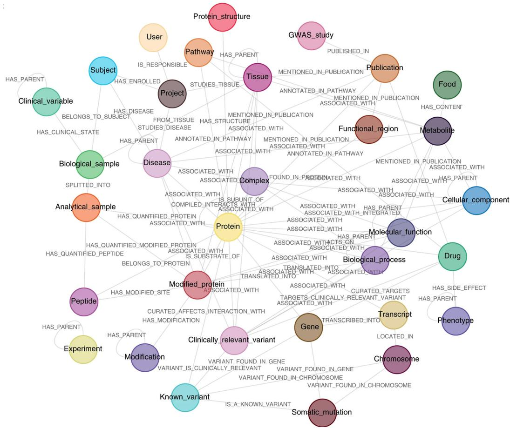  
그림 4.13 임상 지식 그래프의 스키마(https://www.nature.com/articles/ s41587-021-01145-6)

CKG는 https://github.com/MannLabs/CKG 에서 Neo4j 형식으로 제공됩니다. 우리는 이 책을 집필하는 동안 제공되던 최신 버전으로 업그레이드했으며, 다음 코드를 사용하여 제공된 덤프(https://mng.bz/oZQZ)를 사용자의 머신으로 가져올 수 있습니다.

목록 4.21 CKG 데이터베이스 가져오기

#### neo4j.conf 파일에 다음 줄을 추가합니다

#### dbms.databases.seed\_from\_uri\_providers=URLConnectionSeedProvider

#### 그런 다음 다음을 실행합니다   

CREATE DATABASE ckg OPTIONS { existingData: "use",   
➥seedUri: "https://mng.bz/oZQZ"}

CKG와 같은 지식 그래프 (KG)에서 가치 있는 통찰을 추출하는 것이 얼마나 간단한지 보여 주기 위해 쿼리를 실행해 보겠습니다. 현재 임상 연구가 일련의 단백질을 표적으로 하고 있으며, 임상시험을 계획하고 있다고 가정합니다. 해당 시험에 적격한 환자 중 일부는 심근병증 관련 질환을 앓고 있습니다. 여러분의 단백질과 심근병증 관련 질환 사이에 알려진 연관성이 존재하는지 확인하고자 합니다.

목록 4.22 알려진 단백질–질환 연관성 찾기   
WITH 단백질 목록을 정의합니다   
['A1BG\~P04217','A2M\~P01023','ACACB\~O00763', 우리가 관심 있는   
'ACTC1\~P68032','ADIPOQ\~Q15848','AGT\~P01019',   
'AIFM2\~Q9BRQ8','APOA2\~V9GYM3'] as proteins, < 최소 연관성   
3 as minScore, < 강도 임곗값을 정의합니다   
"DOID:0050700" as parentDisease < 대상 질환   
MATCH (protein:Protein)-[r]-(disease:Disease) < DOID를 정의합니다   
WHERE (   
(protein.name+"\~"+protein.id) IN proteins) AND 모든 유형의 단백질–   
toFloat(r.score)> minScore AND 질환 연관성을 매칭합니다   
((disease)-[:HAS\_PARENT\*0..]->(:Disease {id: parentDisease})) <   
RETURN   
(protein.name+"\~"+protein.id) AS node1, 심근병증과 관련된   
disease.name+" <"+disease.id+">" AS node2, 모든 질환을 매칭합니다   
r.score AS weight, type(r) AS type,   
r.source AS source   
ORDER BY weight DESC

표 4.5의 결과는 여러 유형의 내인성 심근병증과 강하게 연관된 특정 단백질을 보여 줍니다. 이 발견은 가능한 추가 조사를 위한 구체적인 출발점을 제공합니다.

참고 DOID는 www.diseaseontology.org에 정의된 질병 온톨로지 식별자입니다.

표 4.5 목록 4.22의 질의에서 얻은 단백질–질병 연관성
<table><tr><td>노드1</td><td>노드2</td><td>가중치</td><td>유형</td><td>출처</td></tr><tr><td>&quot;ACTC1~P68032&quot;</td><td>&quot;내인성 심근병증 (intrinsic cardiomyopathy) &lt;DOID:0060036&gt;&quot;</td><td>5</td><td>&quot;연관됨&quot;</td><td>&quot;DISEASES&quot;</td></tr><tr><td>&quot;ACTC1~P68032&quot;</td><td>&quot;좌심실 비치밀화 (left ventricular noncompaction) &lt;DOID:0060480&gt;&quot;</td><td>5</td><td>&quot;연관됨&quot;</td><td>&quot;DISEASES&quot;</td></tr><tr><td>&quot;ACTC1~P68032&quot;</td><td>&quot;가족성 비대성 심근병증 (familial hypertrophic cardiomyopathy) &lt;DOID:0080326&gt;&quot;</td><td>5</td><td>&quot;연관됨&quot;</td><td>&quot;DISEASES&quot;</td></tr><tr><td>&quot;ACTC1~P68032&quot;</td><td>&quot;비대성 심근병증 (hypertrophic cardiomyopathy) &lt;DOID:11984&gt;&quot;</td><td>5</td><td>&quot;연관됨&quot;</td><td>&quot;DISEASES&quot;</td></tr><tr><td>&quot;ACTC1~P68032&quot;</td><td>&quot;확장성 심근병증 (dilated cardiomyopathy) &lt;DOID:12930&gt;&quot;</td><td>5</td><td>&quot;연관됨&quot;</td><td>&quot;DISEASES&quot;</td></tr><tr><td>&quot;ACTC1~P68032&quot;</td><td>&quot;제한성 심근병증 (restrictive cardiomyopathy) &lt;DOID:397&gt;&quot;</td><td>5</td><td>&quot;연관됨&quot;</td><td>&quot;DISEASES&quot;</td></tr></table>

#### 4.4.1 LLM 기반 임상 의사결정 지원 분석


임상 KG는 환자, 치료, 결과 간의 복잡한 관계를 포함하고 있어 신중한 해석이 필요합니다. LLM은 임상의와 연구자가 다차원적 임상 데이터를 일관된 치료 권고 및 연구 방향으로 종합하는 데 도움을 줄 수 있습니다. ACTC1 단백질과 다양한 심근병증 사이의 강한 연관성을 확인한 우리의 CKG 분석을 활용하면, LLM은 임상적 맥락과 의사결정 지원을 제공할 수 있습니다.

#### 목록 4.23 LLM 임상 분석 프롬프트 예시


당신은 생물의학 지식 그래프와 통합된 전자건강기록에서 단백질-질병 연관성을 분석하는 임상 정보학 전문가입니다. 다음 발견을 바탕으로 임상 의사결정 지원을 제공하십시오.

임상 시나리오: 심근병증 관련 질환 환자의 단백질을 표적으로 하는 연구

지식 그래프 발견:

\- ACTC1\~P68032는 다음과 강한 연관성(점수: 5.0)을 보입니다.

\* 내재성 심근병증(DOID:0060036)

\* 좌심실 비치밀화(DOID:0060480)

\* 가족성 비대성 심근병증(DOID:0080326)

\* 비대성 심근병증(DOID:11984)

\* 확장성 심근병증(DOID:12930)

\* 제한성 심근병증(DOID:397)

표적 단백질 목록:   
➥['A1BG\~P04217','A2M\~P01023','ACACB\~O00763','ACTC1\~P68032','ADIPOQ\~Q15848',   
➥'AGT\~P01019','AIFM2\~Q9BRQ8','APOA2\~V9GYM3']

임상 요청:

1. ACTC1의 광범위한 심근병증 연관성이 갖는 임상적 의미를 해석하십시오.

2. 이것이 임상시험을 위한 환자 층화에 대해 무엇을 시사합니까?

3. 연구에서 고려해야 할 잠재적 안전성 사항을 식별하십시오.

4. 추가 선별검사 또는 모니터링 프로토콜을 권고하십시오.

5. 동반 바이오마커 또는 유전검사 접근법을 제안하십시오.

6. 이러한 발견을 바탕으로 포함/제외 기준의 수정을 제안하십시오.

이 LLM 보조 분석은 KG에서 얻은 계산적 발견을 실제 임상 의사결정으로 전환하는 데 도움을 주며, 환자 진료와 연구 프로토콜에 정보를 제공합니다. 결과는 포함하기에는 너무 길기 때문에, 이 프롬프트를 여러분이 선호하는 LLM 도구 중 하나로 연습해 볼 수 있습니다.

참고: 우리는 의사와 연구자의 적절한 해석 없이 LLM의 결과를 사용하는 것을 제안하지 않습니다. 우리의 목적은 LLM이 대규모 KG에서 추출된 복잡한 데이터를 해석 가능한 통찰로 변환할 수 있음을 보여주는 것입니다. 우리의 목표는 IAS를 통해 인간에게 역량을 부여하는 것이지, 인간을 대체하는 것이 아님을 기억하십시오!

#### 요약


구조화된 데이터 소스로부터 구축된 지식 그래프는 이질적인 데이터셋의 체계적 통합을 필요로 합니다. 이 과정에는 일관되고 질의 가능한 지식 표현을 만들기 위한 엔터티 해소 (entity resolution), 스키마 정렬 (schema alignment), 데이터 품질 검증이 포함됩니다.

약하게 연결된 구성요소 (weakly connected components, WCCs)와 루뱅 (Louvain) 같은 클러스터링 알고리즘은 모든 다중 소스 지식 그래프의 전역 구조와 커뮤니티 조직에 대한 통찰을 제공합니다.

밀도, 전도도 (conductance), 최대 연결 구성요소의 상대적 크기와 같은 부분그래프 분석 척도는 도메인 전반에서 지식 그래프의 품질과 완전성을 평가하기 위한 정량적 접근법을 제공합니다.

차수 가중 경로 수 (degree-weighted path count, DWPC)와 같은 고급 경로 기반 지표는 단순한 경로 계수 접근법보다 관계 패턴과 엔터티 관련성을 더 정교하게 분석할 수 있게 합니다.

Hetionet, PPI 네트워크, CKG와 같은 포괄적 지식 그래프는 통합 기법과 분석 접근법을 보여 주기 위한 가치 있는 시험대 역할을 합니다.

LLM의 도움을 받는 지식 그래프 분석 결과 해석은 정량적 지표를 실행 가능한 도메인 특화 통찰과 연구 가설로 변환하는 데 도움을 줍니다.