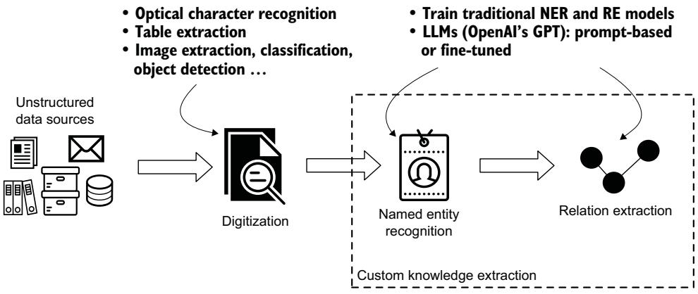
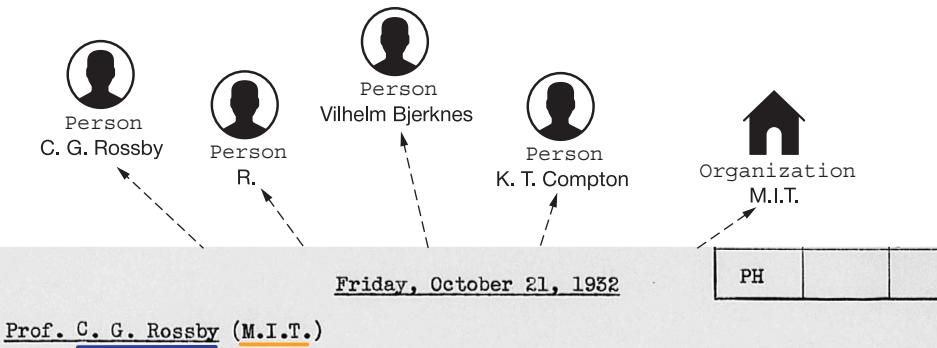
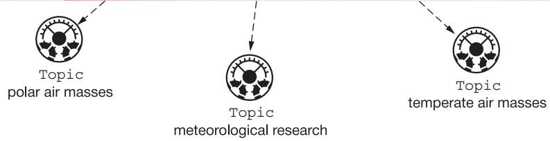
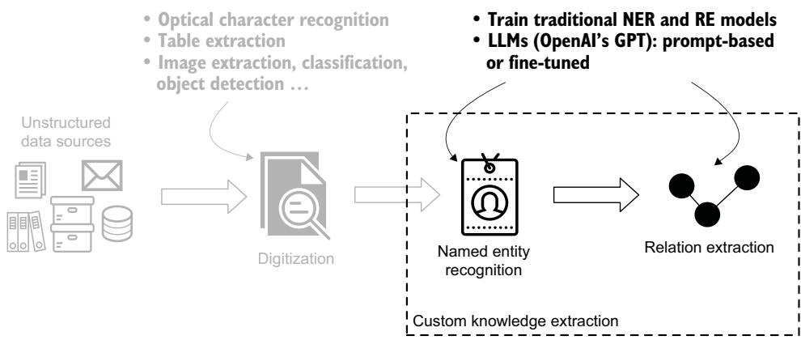
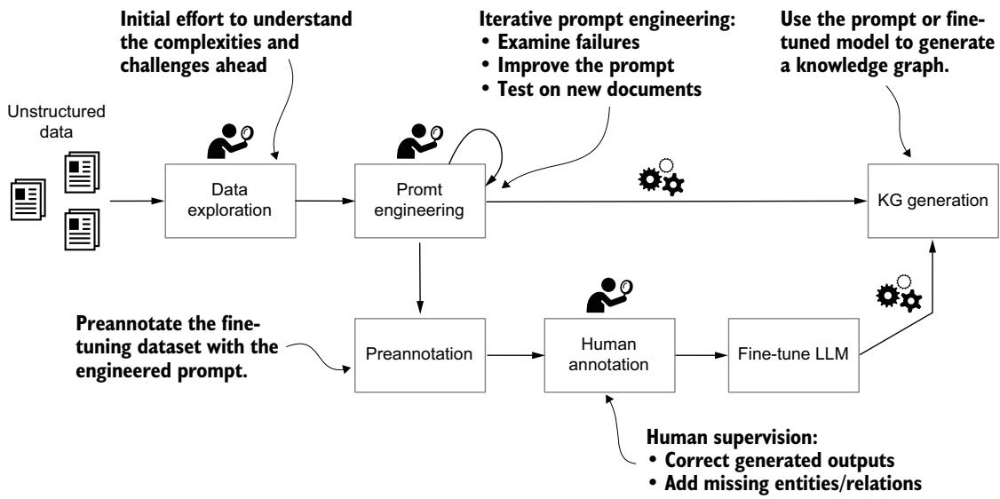

# Building knowledge graphs from text

ransforming unstructured textual data into structured knowledge is an exciting frontier in the development of intelligent systems. This part of the book explores the combination of knowledge graphs (KGs) and large language models (LLMs) in extracting, structuring, and representing knowledge from text, demonstrating how these technologies complement each other to unlock value from unstructured information.

Unstructured text comprises 80% to 90% of enterprise data today. The integration of LLMs has revolutionized this domain, helping us understand and extract meaningful information from content in natural language and reducing the need for human labor. Combining these capabilities with traditional natural language processing (NLP) techniques and KG technologies lets us create systems that can understand context and maintain structured, verifiable knowledge representations.

Chapter 5 demonstrates converting text to KGs and introduces named entity recognition (NER) and relationship extraction using modern LLM-based methods. A case study shows how to extract structured knowledge from historical documents.

Chapter 6 focuses on the workflow from document processing and OCR scanning to graph analytics. We demonstrate a schema design and advanced techniques for data cleaning, entity resolution, and network analysis.

Chapter 7 explores named entity disambiguation (NED). A case study shows how to link entities to structured knowledge bases, enabling conceptual search and intelligent advisory systems.

Chapter 8 shows an approach to NED that combines LLMs with domain ontologies, enhancing the LLMs with structured domain knowledge for contextually aware disambiguation.

The techniques presented here demonstrate the synergy between traditional knowledge representation and modern AI capabilities, establishing the groundwork for building intelligent knowledge systems.

### Extracting domain-specific knowledge from unstructured data

### This chapter covers

Building knowledge graphs from unstructured data

Complexities of managing archives: the Rockefeller Archive Center example

Using large language models to extract entities and relationships

Until now, we have discussed knowledge graphs (KGs) based on structured data such as tables, knowledge bases, and so forth, but what about unstructured data? Think about emails, chats, laws, research papers, news articles, social media, and more—the world is overflowing with information and knowledge in an unstructured form. Using these data sources could provide valuable information for your business.

The task of transforming unstructured data into knowledge consists of data ingestion and processing, various natural language processing (NLP) techniques, data enrichment, machine learning (ML) processing, and data modeling to build downstream applications. Conceptually, this process has two main challenges:

 Knowledge representation (as discussed in chapter 2) refers to how information is modeled so that computers (and humans) can access it autonomously to solve tasks. If properly designed, it speeds up processing by making concepts (re)usable and extendable. In this context, a KG represents an ordered and connected version of information that’s otherwise isolated, distributed, and disorganized.

Knowledge learning uses a combination of frameworks and technologies, such as NLP and large language models (LLMs), to mine insights from unstructured documents.

To illustrate the complexities involved in building KGs from textual data, this chapter dives into an example project and shows how to overcome some of the challenges of mining unstructured information.

### 5.1 The archives challenge

An archive covers a wide range of topics and concepts spanning current and historical data, and incorporates data sources of different complexities and linguistic styles. The data is typically unstructured, including sources such as books, reports, meeting minutes, grant assignments, and so on. In this chapter and the next, we will focus on a subset of historical data on the origins of modern scientific disciplines held by the Rockefeller Archive Center (RAC).

The RAC is not just a repository of historical and current documents; it is also a research center dedicated to the study of philanthropy and the research sectors influenced by American foundations, individual donors, and civil society organizations. It holds the records of more than 40 philanthropic foundations, research institutions, and cultural organizations, including the Rockefeller Foundation and the Ford Foundation, and makes them accessible to researchers worldwide.

#### The Rockefeller Foundation

The Rockefeller Foundation was founded in 1913 as one of the earliest major philanthropic institutions in the United States by John D. Rockefeller, his son, and their business advisor, Frederick Taylor Gates. Rockefeller was, in his epoch, the wealthiest American of all time: at his peak, he controlled 90% of oil production in the country. He was worried that his heirs might "dissipate their inheritances or become intoxicated with power" [1], so Gates encouraged the idea of creating “permanent corporate philanthropies for the good of Mankind.” Toward that end, Rockefeller and other industrialists, including steel magnate Andrew Carnegie, defined the modern approach of targeted philanthropy and created the foundations that bear their names.

We aim to shed light on how grant-making processes function behind the scenes. To achieve this, we’ll design a high-quality domain-specific knowledge extraction system, following the steps outlined in the mental model in figure 5.1.

  
Figure 5.1 Path from domain-specific unstructured textual data to structured knowledge. Each step relies on state-of-the-art machine learning models, such as optical character recognition for document digitization, named entity recognition, and relation extraction systems.

The Rockefeller Foundation’s process of selecting projects for funding relied on program officers who pinpointed areas of research worthy of grants. These officers developed deep knowledge about their specializations by building networks of researchers as well as searching for recommendations outside of those networks. They wrote notes about meetings, phone calls, and dinners in their diaries, often hastily and on typewriters, using shortcuts, abbreviations, and domain-specific nomenclature. These diaries represent a treasure trove of detailed knowledge as well as professional and personal observations. If mined and modeled properly, we could use this information to answer questions like these:

Are there any patterns that typically precede the funding of an idea?

Do granted projects tend to follow recommendations from influential scientists or previous grantees?

How many internal discussions take place before a grant is awarded?

Are there trends in funding subdisciplines? Do they change over time?

This chapter showcases how we can adjust state-of-the-art ML technologies to a specific domain and mine complex knowledge from unstructured data. In the following chapter, we use this extracted information to produce a KG and answer complex questions about relational information previously locked in unstructured documents.

### 5.2 Key concepts of knowledge extraction

Transforming textual data into structured KGs centers on two fundamental processes: identifying entities within the text and extracting the relationships that connect them. These interconnected components form the structural backbone of any KG. This section focuses on these building blocks of knowledge extraction.

#### 5.2.1 Recognizing named entities

The first step from text (or other unstructured data source) to a KG is named entity rec ognition (NER). NER is an ML classification system trained to identify mentions of named entities in raw text and assign them to predefined categories. Recognizing named entities has many business use cases:

Discovering insights by connecting documents from various data sources (for example, connecting people mentioned in financial documents with information from business registries)

Improving a company’s information management and data governance

Laying the basis for a data compliance system

Improving search capabilities

Relating causes with effects (for example, weather conditions and flight delays)

Many open source NLP libraries offer models with generic entity categories (Person, Location, Organization, and so on) out of the box. However, these are rarely enough. For example, figure 5.2 shows an entry from the diary of Rockefeller Foundation



R. is a former student of Vilhelm Bjerknes (Prof. Mech. and Math. Physics, Univ. of Oslo) and in his student days was closely associated with Rossland.

The essential data concerning the aerological research project at MIT are contained in Pres. K.T.Compton's memorandum. R. feels that this kxxxk project forms an essential part of the general orogram of meteorological research which he is directing. R. pointed out the geographical importance of the proposed work. There is no kite station of the Weather Bureau in New England, and this region is particularly interesting since it forms the intersection of the Pacific Storm track and the Gulf storm track. It is a strategic point at which to apply, on this continent, Bjerknes' theory of the conflict between polar air masses and temperate air masses.

  
Figure 5.2 A snippet of Warren Weaver's diary entry with highlighted relevant named entities

program officer Warren Weaver. In this case, identifying mentions of people and organizations is important, but just as important is recognizing conversation topics. Further, a Topic entity can be one of three subtypes: a research discipline, a technology, or a disease.

The example diary entry mentions four topics of the discipline type: “aerological research,” “meteorological research,” “polar air masses,” and “temperate air masses.” A simple dictionary-based NER system would not be able to identify them. To handle this task, we need a custom entity-extraction system. And we can achieve that either by training a custom NER model or, as we’ll see, by taking advantage of LLMs.

#### 5.2.2 Extracting relations

The second step on our path from textual data to a KG is relation extraction (RE): identifying semantic relations between entity pairs within textual documents. For example, consider the following sentence: “Jane Austen, Victorian era writer, is currently employed by Google.” This text mentions named entities of classes PERSON (“Jane Austen”) and ORGANIZATION (“Google”), and those entities are closely related: one is the employee of the other. Capturing this relatedness is the making of a true KG.

NOTE There are many ways to model this kind of relationship, such as Jane Austen – WORKS\_FOR -> Google and EMPLOYS: Jane Austen <– EMPLOYS - Google. The important thing is to be consistent across documents.

### 5.3 Building KGs with large language models

So far, we’ve discussed “traditional” NLP: building task-specific training datasets, identifying the best model architectures, fine-tuning the hyperparameters, and so on. Part of this process is improving the quality of the training data. Doing so is, to put it mildly, arduous.

In late 2022, OpenAI published its first models from the GPT-3.5 series, including a chatbot, ChatGPT, with astonishing capabilities: based on a question or a task description formulated in natural language, it can help you draft a letter, summarize an article, answer factual questions, translate a recipe, generate a specified image, write Python code, and much more. This type of generative model is called a large language model, built on the Transformer architecture [2]. Its key concept is transfer learning: the ability to reuse linguistic patterns and knowledge learned in a generic task (such as predicting randomly masked tokens) in another task (such as RE). This significantly reduces the training dataset size required for supervised learning. The same accuracy can be achieved with less human-labeled data because we don’t have to train the model from scratch, but the weights learned on massive datasets are reused.

What makes LLMs exceptional is the model complexity (number of parameters) and the size and quality of the training corpus. Larger neural models (i.e., more trainable parameters) require fewer data samples to reach the same performance in terms of the test-set loss [3]. Not surprisingly, the more data the model has to learn from, the better it gets. But it’s not just about data quantity, but also data quality. In traditional ML, the primary focus was often on identifying the best model architecture and fine-tuning its hyperparameters. This model-centric approach, in an extreme form, ignores potential data quality issues—and it should not be surprising that if we put in faulty data, we get faulty predictions. Over time, a data-centric paradigm [3] has gained traction, focusing on data engineering to improve the quality (and quantity) of data used to train high-complexity ML models. As a result, today’s LLMs are so powerful that we can formulate a task in natural language (prompt engineering), and the model generates an answer. No model engineering is required.

Although LLMs in general, and OpenAI’s GPT family of models in particular, have formidable capabilities, we must keep some limitations in mind when designing a system that depends on them. The most important for our example is hallucinations: the tendency of the model to make up “facts” and do false reasoning in cases when there is no justification for the response in the training data. For example, if we ask ChatGPT about the costs of NASA’s SLS rocket, but its training data does not contain this sort of information, it will choose a random number and claim that this is the cost. The OpenAI team is working on limiting this behavior, but it remains an open issue at the time of writing.

Despite their achievements, we wouldn’t call these models “AI”; there is a long way to go to achieve true artificial intelligence. Rather, we suggest using LLMs to build more comprehensive, cleaner KGs by asking them to extract high-quality named entities, relations, and properties; see the mental model in figure 5.3 as a reminder.

  
Figure 5.3 Mental model of transforming textual data into structured knowledge: NER and RE using an LLM

#### 5.3.1 Using LLMs

LLMs can be used to help build KGs out of the box, via prompt-based inference, or we can fine-tune them to produce more accurate, stable output specific to our domain. LLMs typically perform well out of the box if we simply formulate the task in natural language and (optionally) provide an example. The task formulation is referred to as a prompt, and the iterative process of identifying the most performant prompt for the given task is called prompt engineering.

In this chapter, we are interested in text completion: we give the model a prompt, and it generates a text according to the context and task formulation in the prompt. Our goal is to use the power of GPT to identify entities and their relations from textual inputs. The process is outlined schematically in figure 5.4.

  
Figure 5.4 The two roles of LLMs in KG generation from textual data: the prompt-based approach (upper branch) and the fine-tuning approach (lower branch)

As usual in data science projects, we start with data exploration: we need to understand the domain we’re dealing with, the challenges ahead, and reasonable expectations for the outcomes. For example, remember the diary entry earlier in this chapter? The interviewee, C. G. Rossby, was introduced by full name only at the beginning of the entry and was later referred to as “R.” Therefore, we need to design our knowledge extraction system in a way that can resolve these uncommon ways of referencing people.

The next step is prompt engineering. Typically, it takes several iterations to identify the most valuable prompt: changing a few words can sometimes have a significant effect on performance. We need to describe the task as precisely as possible to limit ambiguity, which would give the model a chance to be too inventive in its answers.

After prompt engineering, we’ll either be satisfied with the quality of the replies and proceed directly to KG generation, or we’ll find that the task is too complex to rely purely on a prompt-based approach. In that case, we’ll prepare a small training dataset consisting of prompts (limited to pure input documents without task descriptions) and expected outputs. (Our prompt engineering work won’t be wasted because we can use it to preannotate the dataset before we have humans complete the annotations.) Once the dataset is ready, we can use OpenAI’s API to fine-tune the model. If we are satisfied after the first iteration, we can use it to produce a KG. If it’s not good enough yet, we can repeat the process: add more training data and try again. This process costs time and money, but we’ll get a model that is specialized to our domain, providing more stable and accurate outputs.

#### 5.3.2 Prompt engineering examples

Let’s take a closer look at prompt engineering. The following prompt asks GPT to identify all entities and their relations.

Listing 5.1 Prompt version 1; identifying entities and relations   
prompt\_segments = dict()   
General task   
formulation   
prompt\_segments['task'] = <   
"""You are an expert on constructing Knowledge   
➥Graphs from texts using named entity recognition and relation extraction.   
➥Given a prompt, identify as many entities and relations among them as   
➥possible and output a list of relations in the format [ENTITY 1, ENTITY 1   
➥TYPE, RELATION, ENTITY 2, ENTITY 2 TYPE].   
➥The relations are directed, so the order matters."""   
prompt\_segments['example'] = "J.R.Smith (Prof. Phys.) is employed by MIT   
➥and mentioned another scientist, Mary Hodge, who works on cyclotron   
➥research." < An example: especially useful   
for complex tasks such as RE   
prompt\_segments['example\_output'] = < States the   
"""["J. R. Smith", "person", "has expected output   
➥title", "Professor of Physics", "title"]   
["J. R. Smith", "person", "works for", "MIT", "organization"]   
["J. R. Smith", "person", "talked about", "Mary", "person"]   
["Mary", "person", "works on", "cyclotron", "occupation"]"""   
We can deploy the prompt on a snippet of a diary entry using the following OpenAI   
API call.

```python
Listing 5.2 OpenAI API call
import os
import time
from dotenv import load_dotenv
from openai import OpenAI
from listing_2 import prompt_segments
Loads the OpenAI API
_ = load_dotenv() <
key from the .env file
OPENAI_MODEL = "gpt-4o-mini"
```

```python
def openai_query(client, prompt_segments: dict, Function to run the stateless
➥query: str): ChatGPT API query
messages = [
{"role": "system", "content": prompt_segments['task']},
{"role": "user", "content": prompt_segments['example']},
{"role": "assistant", "content": prompt_segments['example_output']},
{"role": "user", "content": query}
]
t_start = time.time()
response = client.chat.completions.create(model=OPENAI_MODEL,
➥messages=messages, temperature=0., max_tokens=2000) < Specifies
print(response.choices[0].message.content) the model,
print(f"\nTime: {round(time.time() - t_start, 1)} sec\n") temperature,
and other
return response.choices[0].message.content parameters
if name == " _main _":
client = OpenAI(api_key=os.environ['OPENAI_API_KEY'])
text = """ < Text to
➥JOHNS HOPKINS UNIVERSITY Chemistry Department: process
➥Wednesday, November 9, 1932
➥WW visits the Dept. with Dr. Frazer (Baker Prof. Chem.). There are 239
➥undergraduate and 116 graduate students of chemistry, the latter group in-
➥cluding holders of the special State fellowships in chemistry under the
➥New Plan. D.H. Andrews (Prof.Chem.) is a physical chemist specializing in
➥thermodynamics. He is not present at the time of WW's call, but one of his
➥assistants explains his work. He is measuring specific heats of organic
➥compounds by a straight calorimetric method. This work is in its early
➥stages. He is also interested in making mechanical models of various atoms
➥from which can be demonstrated the theory of the Raman spectra.
➥J.B.Mayer (Assoc. in Chem.) is a former student of G. N. Lewis and works
➥with Max Born at Gottingen summers. He specializes in the energetics of
➥crystal lattices. His wife, last summer, prepared the new edition of
➥Born's treatise on this subject. In Mayer's laboratory Mrs. Wintner, wife
➥of the mathematician, is working on an experimental problem. Andrews says
➥that Mayer is young and impresses one as an enthusiastic and able man.
➥"""
openai_query(client, prompt_segments, text)
```

The results are encouraging. For example, the extracted relations featuring D. H.   
Andrews and J. B. Mayer are shown next.

#### Listing 5.3 GPT output of the prompt in listing 5.2

["D.H. Andrews", "person", "has title", "Prof. Chem.", "title"]   
["D.H. Andrews", "person", "specializes in", "thermodynamics", "field"]   
["D.H. Andrews", "person", "is measuring", "specific heats of organic   
➥compounds", "research"]   
["D.H. Andrews", "person", "is interested in", "mechanical models of   
➥various atoms", "research"]

["D.H. Andrews", "person", "demonstrates", "theory of the Raman spectra",   
➥"theory"]   
["J.B. Mayer", "person", "has title", "Assoc. in Chem.", "title"]   
["J.B. Mayer", "person", "is a former student of", "G. N. Lewis", "person"]   
["J.B. Mayer", "person", "works with", "Max Born", "person"]   
["J.B. Mayer", "person", "works at", "Gottingen", "location"]   
["J.B. Mayer", "person", "specializes in", "energetics of crystal   
➥lattices", "field"]

Impressive! D. H. Andrews is indeed a professor of chemistry, and he is involved in all the identified research topics. Similarly, for J. B. Mayer, we learn his title, specialization, and whom he studied under. We also have full names in these relations, even though the diary entry only mentions “Mayer” or “he.” In traditional RE, an NER model would identify entity mentions (“Mayer”). Then we’d need to use the coreference resolution model to link “Mayer” and “he” to a full name, and finally use RE to obtain relations and resolved names. Here, due to the generative nature of LLMs, the coreference resolution is done implicitly: the model generates output based on its understanding of the document’s entire context. Finally, notice that the titles were resolved from “Prof. Chem.” and “Assoc. in Chem.” to “Professor of Chemistry” and “Associate in Chemistry.” The model deduced the correct full titles from their shortened versions—no traditional NER model could do that.

Now let’s look at the entity relation types. Notice the extreme granularity (level of detail): specializes in, is measuring, is interested in, and demonstrates are all accurate, but is this output useful for a KG? They all represent the same concept. A human would probably assign them the same relation type, such as works on, but GPT provided us with four different types! And this was just from one short paragraph. Imagine what the KG schema would look like if we processed thousands of pages and then wanted to find answers to questions such as “Who works on research of organic compounds?” We would have to know and list all the semantically identical (or very similar) relation types in the Cypher query to avoid returning results that didn’t represent the umbrella term works on. That would be impractical, to put it mildly.

The same is true for the node labels. The four research topics from this paragraph have been assigned three different labels: field, research, theory. In essence, they are correct. But what are they really? They are all research topics of Professor Andrews, so a human might call each one a topic or occupation and have a single corresponding node label in the graph for all of them.

Finally, did you notice that the output is missing Mayer’s personality traits? Or that the model ignored the mention of “straight calorimetric method,” a relation featuring the “theory of Raman spectra”? We decided to try again. We used the same prompt and model configuration to generate entities and relations from the same text, to test prediction stability: that is, whether the LLM would produce the same output the second time. The answer was no. For example, in our second round of output, theory of Raman spectra, correctly identified in the first run, was missing, along with straight calorimetric method. The model acknowledged that Andrews talked about Mayer’s personality traits (we got the relation ["D.H. Andrews", "person", "describes", "J.B. Mayer", "person"]) but didn’t capture what he said about Mayer. This result demonstrates the issue of instability in predictions based solely on generic prompts of the style “Identify all entities and relations among them” when mining knowledge from documents to produce a KG for downstream analysis and tasks.

So, let’s test a new version of the prompt, shown in listing 5.4. To address the normalization issue, we include lists of entity classes and relation types, including explanations of some of the underperforming relation types.

TIP Instead of using these simple lists, we could state the full, authoritative KG schema here, but this approach leaves the door open for output that includes entities and relations we haven’t thought of.

We also add two notes to the task description to help guide the model and improve prediction stability: one explaining the habit of referring to people by their initials, and the other mentioning aliasing for university and department names.

#### Listing 5.4 Prompt version 2: identifying specific entities and relations

```python
prompt_segments = dict()
prompt_segments['task'] = """ The same task description List of the most
... < as in listing 5.1. important entity
classes
Entities of interest: person, location, organization, date, occupation
➥(a.k.a. person's work, specialization, research discipline, interests,
➥occupation, technology). <
➥Top relations of interest: "works for", "works with", <
➥"student of" (link students with their teachers/advisors), "talked about"
➥(a person talking about another person), "talked with" (a person talking
➥with another person), "works on" (assignment of persons to
➥their occupation, work, specialization, research List of the
➥discipline, interests etc.). most important
relation classes
➥Note that persons are often first referenced by their full name, and
➥then mentioned only by their surname or initials, for example: "A. N.
➥Richards" becomes "Richards", "ANR", or just "R.".
➥Note that organizations (universities, their departments) are often
➥shortened, for example: "University of California" is written as "U. of
➥Cal." or just "U. Cal.", "Department of Physics" is written as "Dept.
Phys."
➥etc."""
Same as in
prompt_segments['example'] = "... < listing 5.1
prompt_segments['example_output'] = """..."""
```

The results show that stating the entities and relations of interest in the prompt guides the LLM to produce more normalized output. The following are the extracted relations for D. H. Andrews and J. B. Mayer.

#### Listing 5.5 GPT output of the prompt in listing 5.4

```python
["D. H. Andrews", "person", "has title", "Professor of Chemistry", "title"]
["D. H. Andrews", "person", "works on", "thermodynamics", "occupation"]
["D. H. Andrews", "person", "measures", "specific heats of organic
➥compounds", "occupation"]
["D. H. Andrews", "person", "is interested in", "mechanical models of
➥various atoms", "occupation"]
["D. H. Andrews", "person", "talked about", "Raman spectra", "occupation"]
["J. B. Mayer", "person", "has title", "Associate in Chemistry", "title"]
["J. B. Mayer", "person", "is a former student of", "G. N. Lewis",
➥"person"]
["J. B. Mayer", "person", "works with", "Max Born", "person"]
["J. B. Mayer", "person", "specializes in", "energetics of crystal
➥lattices", "occupation"]
```

All the topics related to work have the same entity label: occupation. Titles are provided in their full form: Professor of Chemistry and Associate in Chemistry. And we have a single instance of the works on relation, which is an improvement, although we still also have measures and specializes in. This time we have Raman spectra instead of theory of Raman spectra; both are correct, but at the very least we expect consistency across runs and documents. And where is the relation featuring the “straight calorimetric method”? Although these are great results after a few minutes of tweaking the prompt, we can do better.

Let’s try one more iteration, this time expanding the example in the hope that it will provide clearer guidelines and prediction stability. The works on relations are important to us, so we add another mention of occupation. We also give an example of student of because the previous prompt failed on this relation.

#### Listing 5.6 Prompt version 3: more complex examples

```python
prompt_segments = dict()
The same task formulation
prompt_segments['task'] = """ " " "I < as in listing 5.1
prompt_segments['example'] = "J.R.Smith, Prof. Phys. is employed by MIT and
➥mentioned another colleague Mary Hodge, who studies along with her
➥master's student John Smith radioisotopes produced by cyclotron."
prompt_segments['example_output'] = """["J. R. Smith", "person", "has
➥title", "Professor of Physics", "title"]
["J. R. Smith", "person", "works for", "MIT", "organization"]
["J. R. Smith", "person", "talked about", "Mary Hodge", "person"]
["Mary Hodge", "person", "works for", "MIT", "organization"]
["John Smith", "person", "student of", "Mary Hodge", "person"]
["Mary Hodge", "person", "works on", "radioisotopes", "occupation"]
["Mary Hodge", "person", "works on", "cyclotron", "occupation"]"""
```

Let’s again inspect in detail the output related to D. H. Andrews and J. B. Mayer.

#### Listing 5.7 GPT output of the prompt in listing 5.6 Listing 5.7 GPT output of the prompt in listing 5.6

["D. H. Andrews", "person", "has title", "Professor of Chemistry", "title"]   
["D. H. Andrews", "person", "works for", "Johns Hopkins University   
➥Chemistry Department", "organization"]   
["D. H. Andrews", "person", "works on", "thermodynamics", "occupation"]   
["D. H. Andrews", "person", "works on", "specific heats of organic   
➥compounds", "occupation"]   
["D. H. Andrews", "person", "works on", "calorimetric method",   
➥"occupation"]   
["J. B. Mayer", "person", "has title", "Associate in Chemistry", "title"]   
["J. B. Mayer", "person", "works for", "Johns Hopkins University Chemistry   
➥Department", "organization"]   
["J. B. Mayer", "person", "student of", "G. N. Lewis", "person"]   
["J. B. Mayer", "person", "works with", "Max Born", "person"]   
["Max Born", "person", "works at", "Gottingen", "location"]   
["J. B. Mayer", "person", "works on", "energetics of crystal lattices",   
➥"occupation"]

Eureka! We achieved everything we wanted: a high level of stability in terms of assignment of entity and relation classes, and correct identification of all the relations we care about.

NOTE This example illustrates what prompt evolution can look like. In the real project, we did a couple more iterations and changed the output format to JSON so that each entity and relation can have properties where relevant. That allowed us to extract more complex knowledge, such as the sentiment of each TALKED\_ABOUT relation (stored as a property) as well as business titles (an attribute of the WORK\_FOR relation). For the final version of the prompt used to generate the KG presented in this chapter, check out the book’s code repository.

Note that we designed the prompts in this chapter for ChatGPT models and tested them on GPT-4o mini. By the time you read this book, newer models will be available. That’s why we focus on fundamental principles rather than model specifics—you should be able to adapt the example prompts to the current state of the art.

#### 5.3.3 Prompt engineering guidelines

LLMs are rapidly evolving, so there is no point in sharing technical guidelines that may quickly become obsolete. However, certain general learning points will be transferable to newer models. The key principles we discovered when working on the RAC project are summarized in the following good practices of prompt engineering.

#### TASK DESCRIPTION AND DOMAIN-SPECIFIC GUIDANCE

A well-explained task is very important for the quality and stability of the output. It is worth experimenting with different formulations and adding specifics of the current dataset, such as, in our example, referring to people by abbreviations and initials.

#### NAMING OF ENTITY AND RELATION CLASSES

In the prompt, include lists of the entity and relation classes you’re most interested in. This helps clarify the task and provide more normalized outputs. The chosen terminology matters a lot! If you notice that an entity or relation class underperforms, try renaming it. For example, at first we called the subject of conversations in diary entries Topic, but we realized that this term was too generic to be used as an entity class. When we renamed it Occupation, otherwise identical prompts produced much more comprehensive and stable results.

#### COMPLEX AND REPRESENTATIVE EXAMPLES

In complex tasks such as entity RE, it is useful to provide an example of input and expected output as part of the prompt. It can be a condensed version of the actual text you need to process, containing examples of important entities and relations. Include complex linguistic formulations that appear in the dataset, and focus on relations that the model struggles with. Also make the example as representative as possible: be sure the example contains all of your key relation types.

#### LLM CONFIGURATION

Experiment with different LLMs and choose the best option for you. Also test their parameters, especially temperature. The higher the temperature, the more varied and creative the output produced (and the greater the propensity for hallucinations). Lower temperatures yield more deterministic output. So, creative tasks such as text generation are better performed with higher temperature values, whereas tasks such as code generation require a lower temperature (around 0.2). For fact-focused tasks such as extracting entities and relations from a document, we use temperature 0.

#### TESTING PREDICTION STABILITY

Remember that LLMs are generative models, so by definition, they can have and do have “moods”: the same prompt can produce different results if run repeatedly on the same text. You can limit this behavior with careful prompt engineering (a non-ambiguous task formulation) and by setting very low values for temperature (as just discussed). If you choose a non-zero temperature, consider testing prediction stability by running the same prompt on the same test dataset multiple times and evaluating the overlap. If there’s one thing you don’t want when mining factual knowledge, it’s unstable prediction behavior and low confidence in the resulting KG!

#### UNIT-TESTING THE PROMPT

Prompt engineering should be a quick, straightforward task, but sometimes it may take you a lot of iterations to get the result you want. So, just as with code development, consider setting up a simple unit-testing system: each time you update the prompt, add the text snippet and the expected output to the test list; and every few iterations, run this list of tests in bulk, calculate the success rate, and output the failures so you can inspect them. This way, you won't lose any achievements from previous iterations.

#### EYEBALLING A MINI-KG

Each time you reach a prompt milestone, we recommend deploying the prompt on a small sample of documents (a few dozen pages) and producing a KG. Why? Well, we humans are sensory creatures, and seeing and touching are sometimes more useful than assuming and imagining. We find that a quick look at a mini-KG can help us discover opportunities for improvement.

DEFINITION Prompt engineering is an iterative process. When you’ve aggregated enough prompt improvements to feel as though you’ve made significant progress toward addressing the original task, you’ve reached a prompt milestone.

For example, while navigating the RAC graph, we noticed many organization names in abbreviated forms, such as U. of PA. GPT, given its significant general knowledge acquired during training, should be able to fill in the blanks and identify this as the University of Pennsylvania, if properly instructed. Similarly, we saw people’s names abbreviated in the form S. And several people seemingly worked for the same organization, but it was just Department of Physics—which university? For the next iteration, we considered these failures and added complexity to the prompt example to guide GPT to give us the desired output.

#### EVALUATION

When you’re satisfied with the prompt, do a quantitative evaluation. Process a few dozen pages of text, nominate someone as quality assurance manager, and ask them to go through the predictions and mark them as correct, incorrect, or missing entities and relations. Then calculate per-class precision, recall, and F1 score for entities and relations.

The QA manager is well positioned to spot systemic failures that couldn’t be identified when testing on a handful of examples. Another option is to use an LLM as a judge: instead of asking a human, give this task to another powerful LLM. It will make mistakes, but human-level performance is not 100% either. Whichever way you decide to go, a proper evaluation will give you confidence in the prediction quality before you spend time and money producing a KG from a big dataset, will serve as a basis for monitoring future model drift, and will give you one more chance to improve your prompt.

#### INITIAL EXPLORATIVE KG

To do prompt engineering, you need a minimal understanding of the data, its content, and the knowledge you want to extract from it. But we’ve seen many use cases where companies had only a vague idea of the content; they knew it must include something useful, but didn’t know exactly what to mine—that is, what the KG schema should be. In such cases, you need to dive into the data and spend some time on exploration and understanding. This potentially long and tedious task can be streamlined if you design a quick generic entity and RE prompt (ask the LLM to extract all entities and relations, and give it short example to demonstrate the output format), produce a KG from a sample of documents, and then explore it, navigate it, and draw inspiration from it. Yes, it will be highly unnormalized, but it will help you quickly understand the content of the dataset, identify the kinds of entities and relations you can mine from it, and start prompt engineering.

#### BE AMBITIOUS

Think big! Don’t assume that something would be too difficult for the LLM—just try it. Remember that LLMs are trained on a vast amount of data and have deep linguistic understanding and general knowledge. They can handle things like typos in names, deduce from the context that “Prof. Chem.” is the title Professor of Chemistry, and figure out that a mention of “Stanford” means Stanford University rather than the name of a location or person. So when you provide an example in the prompt, be ambitious. Provide relations with full, clean entity names so you get a cleaner, more accurate KG from the start, reducing the need for entity cleansing and resolution during post-processing.

#### DON’T OVERTHINK

Prompt engineering is a simplistic technique called zero-shot learning (just a task description) or one-shot learning (when you provide one example). We expect a model pretrained on large amounts of data to perform well on a specific domain and tasks based on a task description and one or two examples. Despite the power of LLMs, this is challenging when we’re dealing with complex reasoning tasks: there will always be imperfections because one-shot learning simply cannot prepare the model for all the complexities and ambiguities in the full dataset.

So our last bit of advice is this: don’t overengineer and overthink prompt development. Do a couple of quick iterations, verify every milestone by producing and eyeballing a mini-KG to identify possible systemic failures and candidates for prompt improvements, and move on. When you get to the point that, despite all your best efforts, prompt engineering is not yielding satisfactory results, it’s better to invest the remaining project time in fine-tuning the LLM rather than making never-ending prompt improvements.

#### 5.3.4 KG building: Traditional NLP or LLMs?

At this point, you may be wondering how to determine whether to follow the traditional NLP path or the LLM path. Does traditional NLP have a place in the modern world of AI? Let’s start by looking at the pros and cons of each approach.

Traditional NLP offers these advantages:

Prediction speed—Smaller, simpler models generate faster predictions, even on a CPU.

Infrastructure simplicity and costs—Simple and cheap infrastructure is enough to train and deploy models, often with no need for GPUs.

 Prediction costs—Due to the simpler, cheaper infrastructure, prediction costs are very low.

 Security—It’s easier and cheaper to configure on-premises solutions for isolated secure deployments.

These are the disadvantages of traditional NLP:

In-house expertise—Design, training, deployment, and maintenance require highly specialized data science expertise.

Complex NLP pipeline configuration—Specialized, customized models are required: for example, NER, RE, coreference resolution, entity resolution, and disambiguation.

 Data annotation complexity and cost—Each model must be trained for your domain with your specific data, which requires building multiple high-quality training datasets. This process takes time, data science expertise, and infrastructure and software. The initial investment is very high, and the outcomes are not guaranteed, especially for complex tasks like RE.

#### LLMs have the following advantages:

Initial domain customization costs—The road to production on your specific domain is much quicker thanks to transfer learning and prompt engineering.

Shallow learning curve—You can quickly get started and build know-how without expert data scientists. Anyone with minimal technical skills can learn to do prompt engineering and fine-tuning.

All-in-one NLP—No need to engineer a sequence of separate (but dependent) processing steps to achieve the goal; one pass through the data does it all.

 Generative nature —In addition to the simpler processing pipeline, the results are high quality thanks to transfer learning and the generative nature of LLMs. Their contextual and linguistic understanding and reasoning lead to cleaner, more accurate KGs than any traditional NLP model, right out of the box.

Simpler post-processing—The generative nature and language understanding of LLMs mean less post-processing is required (cleansing, normalization, entity resolution).

#### LLMs also have some disadvantages:

Prediction speed—Massive models imply much slower prediction speed, despite being served on powerful GPUs.

Infrastructure complexity—Because GPUs are a must-have not just for training but also for prediction, infrastructure complexity and costs are higher.

 Fine-tuning costs—If prompt engineering is insufficient, the model must be finetuned. This means higher costs for preparing a training dataset, infrastructure, and prediction. (OpenAI charges 10 times more for running predictions with a custom model; even for on-premise deployments, you need to consider costs related to maintaining and managing model versions.)

Prediction costs on very large datasets—For small to medium-sized datasets, using LLMs will probably be cheaper than the initial investment to create a custom traditional NLP pipeline. But the numbers can look quite different if you have a massive dataset.

Security/on-premises deployment costs —If you work in a high-security domain, good luck, especially if you can’t use a cloud provider and have to set up, deploy, and maintain your own GPU cluster.

NOTE These days, many closed source as well as open source LLMs are made available through hyperscalers such as Amazon Web Services, Azure, and Google Cloud Platform, which alleviates some of the pain points we just mentioned.

To answer the introductory question, “Does traditional NLP have a place in the modern world of AI?” we believe the answer is “Absolutely!” Despite foreseeing a great future for the use of LLMs with KGs, we believe substantial space remains for other technologies (such as NLP), especially considering security requirements, costs (massive datasets), and streaming scenarios (prediction speed). If you cannot use LLMs in production for some reason, consider using them for tasks such as training custom NLP models; use them to increase the efficiency of your data annotation process by doing preannotation based on quick prompt engineering.

#### Summary

 Producing KGs from unstructured textual data requires identifying custom domain-specific named entities and relations among them.

With traditional NLP, a range of models, such as named entity recognition, relation extraction, and coreference resolution, must be trained and chained in a complex workflow. Training requires a high initial investment for building high-quality human-annotated training datasets, and specialized data science skills to train, evaluate, deploy, and monitor the models.

LLMs, such as OpenAI’s GPT, can be used out of the box with iterative prompt engineering (or fine-tuning) to build accurate, domain-specific KGs with much lower initial costs compared to traditional NLP.

 Traditional NLP and LLMs both have their pros and cons, depending on the concrete domain and business considerations. They can also coexist side by side, or one can be used to prepare a training dataset for the other.

The generative nature of LLMs means that we get cleaner, more accurate KGs with minimal need for entity normalization and resolution.