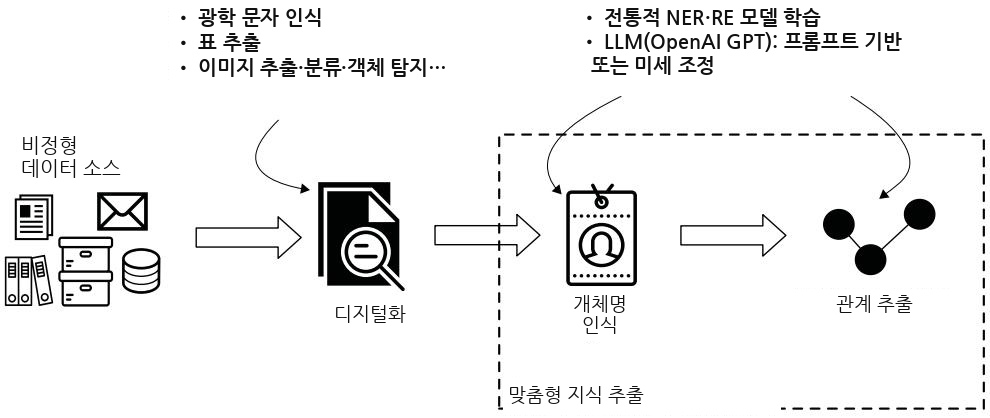
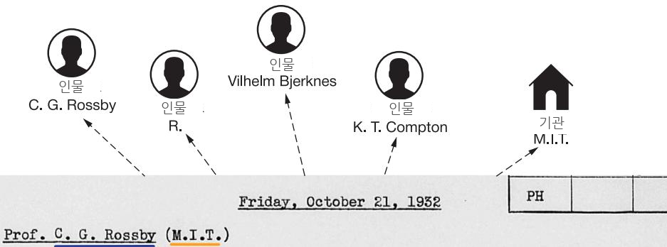
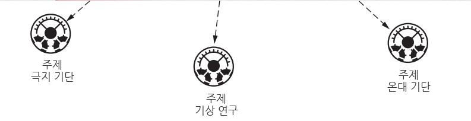
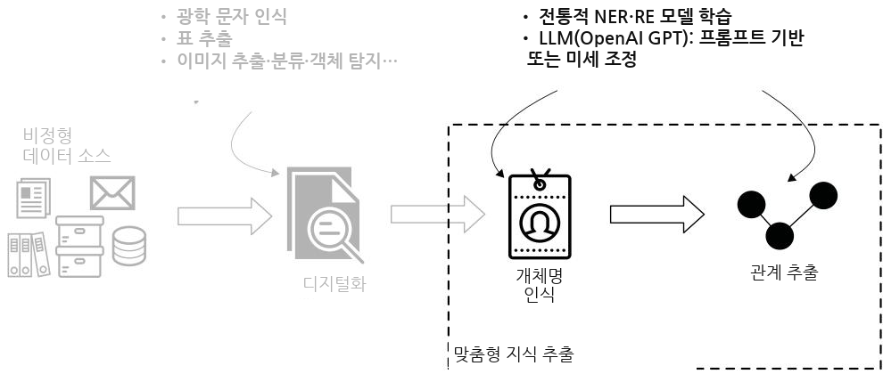
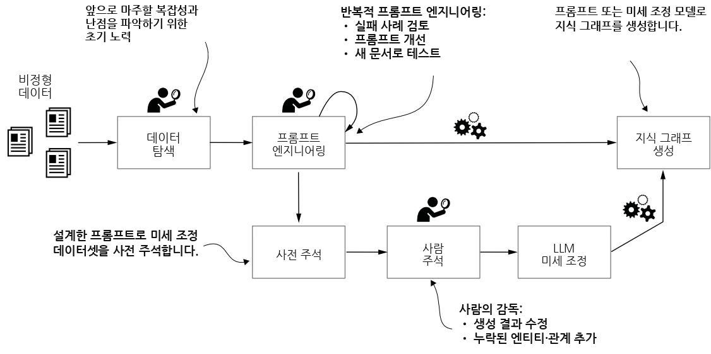

# 텍스트로부터 지식 그래프 구축하기


비정형 텍스트 데이터를 구조화된 지식으로 변환하는 것은 지능형 시스템 개발에서 흥미로운 최전선입니다. 이 책의 이 부분에서는 텍스트에서 지식을 추출하고, 구조화하며, 표현하는 과정에서 지식 그래프 (knowledge graphs, KGs)와 대규모 언어 모델 (large language models, LLMs)의 결합을 탐구하고, 이러한 기술들이 비정형 정보로부터 가치를 끌어내기 위해 어떻게 서로를 보완하는지 보여줍니다.

오늘날 비정형 텍스트는 기업 데이터의 80%에서 90%를 차지합니다. LLM의 통합은 이 영역에 혁신을 가져왔으며, 자연어 콘텐츠에서 의미 있는 정보를 이해하고 추출하도록 돕고 인간 노동의 필요성을 줄였습니다. 이러한 역량을 전통적인 자연어 처리 (natural language processing, NLP) 기법 및 지식 그래프 기술과 결합하면 맥락을 이해하고 구조화되고 검증 가능한 지식 표현을 유지할 수 있는 시스템을 만들 수 있습니다.

5장에서는 텍스트를 지식 그래프로 변환하는 방법을 보여주고, 현대적인 LLM 기반 방법을 사용한 개체명 인식 (named entity recognition, NER)과 관계 추출을 소개합니다. 사례 연구는 역사 문서에서 구조화된 지식을 추출하는 방법을 보여줍니다.

6장은 문서 처리와 OCR 스캔에서 그래프 분석에 이르는 워크플로에 초점을 맞춥니다. 우리는 스키마 설계와 데이터 정제, 엔터티 해소 (entity resolution), 네트워크 분석을 위한 고급 기법을 보여줍니다.

7장은 개체명 중의성 해소 (named entity disambiguation, NED)를 탐구합니다. 사례 연구는 엔터티를 구조화된 지식 베이스에 연결하여 개념 검색과 지능형 자문 시스템을 가능하게 하는 방법을 보여줍니다.

8장은 LLM을 도메인 온톨로지 (domain ontologies)와 결합하는 개체명 중의성 해소 접근법을 보여주며, 맥락 인식 중의성 해소를 위해 구조화된 도메인 지식으로 LLM을 강화합니다.

여기에서 제시된 기법들은 전통적인 지식 표현과 현대 AI 역량 사이의 시너지를 보여주며, 지능형 지식 시스템을 구축하기 위한 토대를 마련합니다.

### 비정형 데이터에서 도메인 특화 지식 추출

### 이 장에서 다루는 내용


비정형 데이터로부터 지식 그래프 구축

아카이브 관리의 복잡성: 록펠러 아카이브 센터 사례

대규모 언어 모델을 사용한 개체 및 관계 추출

지금까지 우리는 표, 지식 베이스 등과 같은 정형 데이터를 기반으로 한 지식 그래프 (knowledge graph, KG)에 대해 논의해 왔습니다. 그렇다면 비정형 데이터는 어떨까요? 이메일, 채팅, 법률, 연구 논문, 뉴스 기사, 소셜 미디어 등을 생각해 보십시오. 세상은 비정형 형태의 정보와 지식으로 넘쳐나고 있습니다. 이러한 데이터 소스를 활용하면 비즈니스에 가치 있는 정보를 제공할 수 있습니다.

비정형 데이터를 지식으로 변환하는 작업은 데이터 수집 및 처리, 다양한 자연어 처리 (natural language processing, NLP) 기법, 데이터 보강, 기계 학습 (machine learning, ML) 처리, 그리고 다운스트림 애플리케이션 구축을 위한 데이터 모델링으로 구성됩니다. 개념적으로 이 과정에는 두 가지 주요 과제가 있습니다.

 지식 표현 (knowledge representation)(2장에서 논의한 바와 같이)은 컴퓨터(및 인간)가 과제를 해결하기 위해 정보를 자율적으로 접근할 수 있도록 정보를 모델링하는 방식을 의미합니다. 적절히 설계되면 개념을 (재)사용 가능하고 확장 가능하게 만들어 처리 속도를 높입니다. 이러한 맥락에서 KG는 그렇지 않으면 고립되고, 분산되어 있으며, 무질서한 정보를 정돈되고 연결된 형태로 표현한 것입니다.

지식 학습 (knowledge learning)은 NLP와 대규모 언어 모델 (large language model, LLM)과 같은 프레임워크와 기술의 조합을 사용하여 비정형 문서에서 통찰을 채굴합니다.

텍스트 데이터로부터 KG를 구축하는 데 수반되는 복잡성을 설명하기 위해, 이 장에서는 예제 프로젝트를 자세히 살펴보고 비정형 정보를 채굴할 때 발생하는 일부 과제를 어떻게 극복할 수 있는지 보여 줍니다.

### 5.1 아카이브 과제


아카이브는 현재 및 역사적 데이터를 아우르는 광범위한 주제와 개념을 포괄하며, 서로 다른 복잡성과 언어적 스타일을 지닌 데이터 소스를 포함합니다. 데이터는 일반적으로 비정형이며, 책, 보고서, 회의록, 보조금 배정 문서 등의 소스를 포함합니다. 이 장과 다음 장에서는 록펠러 아카이브 센터 (Rockefeller Archive Center, RAC)가 보유한 현대 과학 분야의 기원에 관한 역사적 데이터의 일부에 초점을 맞춥니다.

RAC는 단순히 역사적 문서와 현재 문서의 저장소가 아니라, 자선 활동과 미국 재단, 개인 기부자, 시민사회 조직의 영향을 받은 연구 부문을 연구하는 데 전념하는 연구 센터이기도 합니다. RAC는 록펠러 재단과 포드 재단을 포함하여 40개 이상의 자선 재단, 연구 기관, 문화 조직의 기록을 보유하고 있으며, 이를 전 세계 연구자들이 접근할 수 있도록 제공합니다.

#### 록펠러 재단


록펠러 재단은 1913년에 존 D. 록펠러와 그의 아들, 그리고 그들의 사업 고문이었던 프레더릭 테일러 게이츠에 의해 미국에서 가장 초기의 주요 자선 기관 중 하나로 설립되었습니다. 록펠러는 그 시대에 역사상 가장 부유한 미국인이었습니다. 전성기에는 미국 석유 생산의 90%를 지배했습니다. 그는 자신의 상속자들이 “상속 재산을 탕진하거나 권력에 도취될” 수 있다고 우려했기 때문에 [1], 게이츠는 “인류의 선을 위한 영구적인 기업형 자선 조직”을 만든다는 구상을 장려했습니다. 이를 위해 록펠러와 철강 거물 앤드루 카네기를 포함한 다른 산업가들은 표적형 자선 활동의 현대적 접근 방식을 정의하고 자신들의 이름을 딴 재단을 설립했습니다.

우리는 보조금 지급 절차가 이면에서 어떻게 작동하는지 밝히고자 합니다. 이를 달성하기 위해 그림 5.1의 정신 모형 (mental model)에 제시된 단계를 따라, 고품질의 도메인 특화 지식 추출 시스템을 설계할 것입니다.

  
그림 5.1 도메인 특화 비정형 텍스트 데이터에서 구조화된 지식으로 이어지는 경로. 각 단계는 문서 디지털화를 위한 광학 문자 인식 (optical character recognition), 개체명 인식 (named entity recognition), 관계 추출 시스템과 같은 최신 기계학습 모델에 의존합니다.

록펠러 재단이 지원할 프로젝트를 선정하는 과정은 보조금을 받을 만한 연구 영역을 정확히 찾아내는 프로그램 담당관들에게 의존했습니다. 이 담당관들은 연구자 네트워크를 구축하고, 그 네트워크 밖에서도 추천을 탐색함으로써 자신의 전문 분야에 대한 깊은 지식을 발전시켰습니다. 이들은 회의, 전화 통화, 저녁 식사에 관한 메모를 일기에 기록했는데, 대개 서둘러 타자기로 작성했으며 축약 표현, 약어, 도메인 특화 명명법을 사용했습니다. 이러한 일기는 상세한 지식뿐 아니라 직업적·개인적 관찰의 보고를 이룹니다. 적절히 채굴하고 모델링한다면, 우리는 이 정보를 사용하여 다음과 같은 질문에 답할 수 있습니다.

어떤 아이디어에 대한 지원이 이루어지기 전에 일반적으로 나타나는 패턴이 있습니까?

지원받은 프로젝트는 영향력 있는 과학자나 이전 수혜자의 추천을 따르는 경향이 있습니까?

보조금이 수여되기 전에 내부 논의는 얼마나 많이 이루어집니까?

세부 학문 분야에 대한 지원에는 추세가 있습니까? 그 추세는 시간이 지나면서 변화합니까?

이 장은 최신 ML 기술을 특정 도메인에 맞게 조정하고 비정형 데이터에서 복잡한 지식을 채굴하는 방법을 보여줍니다. 다음 장에서는 이렇게 추출한 정보를 사용하여 KG를 생성하고, 이전에는 비정형 문서 안에 갇혀 있던 관계 정보에 관한 복잡한 질문에 답합니다.

### 5.2 지식 추출의 핵심 개념


텍스트 데이터를 구조화된 KG로 변환하는 작업은 두 가지 근본적인 과정, 즉 텍스트 내에서 개체 (entity)를 식별하고 이들을 연결하는 관계를 추출하는 데 중점을 둡니다. 이러한 상호 연결된 구성 요소는 모든 KG의 구조적 중추를 형성합니다. 이 절에서는 지식 추출의 이러한 기본 구성 요소에 초점을 맞춥니다.

#### 5.2.1 명명 개체 인식


텍스트(또는 다른 비정형 데이터 소스)에서 KG로 나아가는 첫 번째 단계는 명명 개체 인식 (named entity recognition, NER)입니다. NER은 원시 텍스트에서 명명 개체의 언급을 식별하고 이를 사전 정의된 범주에 할당하도록 학습된 ML 분류 시스템입니다. 명명 개체를 인식하는 것은 많은 비즈니스 활용 사례를 가집니다.

다양한 데이터 소스의 문서를 연결하여 통찰을 발견하는 것(예를 들어, 금융 문서에 언급된 사람들을 사업자 등록부의 정보와 연결하는 것)

기업의 정보 관리 및 데이터 거버넌스를 개선하는 것

데이터 컴플라이언스 시스템의 기반을 마련하는 것

검색 기능을 개선하는 것

원인과 결과를 관련짓는 것(예를 들어, 기상 조건과 항공편 지연)

많은 오픈 소스 NLP 라이브러리는 일반적인 개체 범주(Person, Location, Organization 등)를 갖춘 모델을 기본으로 제공합니다. 그러나 이것만으로는 충분한 경우가 드뭅니다. 예를 들어, 그림 5.2는 록펠러 재단의 일기 항목 하나를 보여 줍니다.



R.은 Vilhelm Bjerknes(오슬로 대학교 역학 및 수리물리학 교수)의 이전 학생이며, 학생 시절 Rossland와 밀접하게 교류했습니다.

MIT의 항공학 연구 프로젝트에 관한 핵심 데이터는 K.T. Compton 총장의 메모에 포함되어 있습니다. R.은 이 kxxxk 프로젝트가 자신이 지휘하고 있는 기상학 연구의 일반 프로그램에서 필수적인 부분을 이룬다고 느낍니다. R.은 제안된 작업의 지리적 중요성을 지적했습니다. 뉴잉글랜드에는 Weather Bureau의 연 관측소가 없으며, 이 지역은 태평양 폭풍 경로와 멕시코만 폭풍 경로가 교차하는 지점이기 때문에 특히 흥미롭습니다. 이곳은 이 대륙에서 극지 기단과 온대 기단 사이의 충돌에 관한 Bjerknes의 이론을 적용하기에 전략적인 지점입니다.

  
그림 5.2 관련 명명 개체가 강조 표시된 Warren Weaver의 일기 항목 일부

프로그램 책임자 Warren Weaver의 일기입니다. 이 경우 사람과 조직의 언급을 식별하는 것도 중요하지만, 대화 주제를 인식하는 것 역시 그만큼 중요합니다. 나아가 Topic 개체는 연구 분야, 기술, 질병이라는 세 가지 하위 유형 중 하나일 수 있습니다.

예시 일기 항목은 분야 유형에 해당하는 네 가지 주제, 즉 “항공학 연구”, “기상학 연구”, “극지 기단”, “온대 기단”을 언급합니다. 단순한 사전 기반 NER 시스템은 이를 식별할 수 없을 것입니다. 이 작업을 처리하려면 맞춤형 개체 추출 시스템이 필요합니다. 그리고 우리는 맞춤형 NER 모델을 학습하거나, 앞으로 살펴보듯이 LLM을 활용함으로써 이를 달성할 수 있습니다.

#### 5.2.2 관계 추출


텍스트 데이터에서 지식 그래프(KG)로 나아가는 두 번째 단계는 관계 추출 (relation extraction, RE)입니다. 이는 텍스트 문서 내 개체 쌍 사이의 의미적 관계를 식별하는 작업입니다. 예를 들어, 다음 문장을 생각해 보겠습니다. “Jane Austen, Victorian era writer, is currently employed by Google.” 이 텍스트는 PERSON 클래스의 명명된 개체(“Jane Austen”)와 ORGANIZATION 클래스의 명명된 개체(“Google”)를 언급하며, 이들 개체는 밀접하게 관련되어 있습니다. 한쪽은 다른 쪽의 직원입니다. 이러한 관련성을 포착하는 것이 진정한 지식 그래프를 만드는 일입니다.

참고 이러한 종류의 관계를 모델링하는 방법은 Jane Austen – WORKS\_FOR -> Google 및 EMPLOYS: Jane Austen <– EMPLOYS - Google처럼 다양합니다. 중요한 것은 문서 전반에서 일관성을 유지하는 것입니다.

### 5.3 대규모 언어 모델로 KG 구축하기


지금까지 우리는 “전통적” 자연어 처리 (NLP)에 대해 논의했습니다. 즉, 과업별 학습 데이터셋을 구축하고, 최적의 모델 아키텍처를 식별하며, 하이퍼파라미터를 미세조정하는 등의 과정입니다. 이 과정의 일부는 학습 데이터의 품질을 개선하는 것입니다. 완곡하게 말해도, 그렇게 하는 일은 매우 고된 작업입니다.

2022년 말, OpenAI는 GPT-3.5 시리즈의 첫 모델들을 공개했으며, 여기에는 놀라운 능력을 지닌 챗봇인 ChatGPT도 포함되었습니다. 자연어로 작성된 질문이나 과업 설명을 바탕으로, 이 모델은 편지 초안을 작성하고, 기사를 요약하며, 사실 질문에 답하고, 레시피를 번역하며, 지정된 이미지를 생성하고, Python 코드를 작성하는 등 훨씬 더 많은 일을 도와줄 수 있습니다. 이러한 유형의 생성 모델을 대규모 언어 모델 (large language model)이라고 하며, Transformer 아키텍처를 기반으로 구축됩니다 [2]. 핵심 개념은 전이 학습 (transfer learning)입니다. 이는 무작위로 마스킹된 토큰을 예측하는 것과 같은 일반 과업에서 학습한 언어적 패턴과 지식을 관계 추출 (RE)과 같은 다른 과업에서 재사용할 수 있는 능력입니다. 이는 지도 학습 (supervised learning)에 필요한 학습 데이터셋의 크기를 크게 줄입니다. 모델을 처음부터 학습할 필요가 없고, 대규모 데이터셋에서 학습된 가중치를 재사용하기 때문에, 사람이 라벨링한 데이터가 더 적어도 동일한 정확도를 달성할 수 있습니다.

LLM을 탁월하게 만드는 것은 모델 복잡도, 즉 매개변수의 수와 학습 말뭉치의 규모 및 품질입니다. 더 큰 신경망 모델, 즉 학습 가능한 매개변수가 더 많은 모델은 테스트 세트 손실 [3] 측면에서 동일한 성능에 도달하는 데 더 적은 데이터 샘플을 필요로 합니다. 당연히 모델이 학습할 데이터가 많을수록 성능은 더 좋아집니다. 그러나 이는 단지 데이터의 양에 관한 문제가 아니라 데이터의 품질에 관한 문제이기도 합니다. 전통적인 기계학습 (ML)에서는 주된 초점이 종종 최적의 모델 아키텍처를 식별하고 그 하이퍼파라미터를 미세조정하는 데 있었습니다. 이러한 모델 중심 접근법은 극단적인 형태에서는 잠재적인 데이터 품질 문제를 무시합니다. 그리고 결함 있는 데이터를 넣으면 결함 있는 예측이 나온다는 것은 놀라운 일이 아닙니다. 시간이 지나면서 데이터 중심 패러다임 (data-centric paradigm) [3]이 주목을 받게 되었고, 이는 고복잡도 ML 모델을 학습하는 데 사용되는 데이터의 품질과 양을 개선하기 위한 데이터 엔지니어링에 초점을 둡니다. 그 결과, 오늘날의 LLM은 매우 강력해져서 우리가 자연어로 과업을 작성하면, 즉 프롬프트 엔지니어링 (prompt engineering)을 수행하면, 모델이 답을 생성합니다. 모델 엔지니어링은 필요하지 않습니다.

LLM 전반, 특히 OpenAI의 GPT 계열 모델은 강력한 능력을 갖추고 있지만, 이를 기반으로 하는 시스템을 설계할 때는 몇 가지 한계를 염두에 두어야 합니다. 우리의 예에서 가장 중요한 한계는 환각 (hallucination)입니다. 이는 학습 데이터 안에 응답을 정당화할 근거가 없을 때 모델이 “사실”을 지어내고 잘못된 추론을 하는 경향을 말합니다. 예를 들어 ChatGPT에 NASA의 SLS 로켓 비용을 질문했지만 학습 데이터에 이러한 종류의 정보가 포함되어 있지 않다면, 모델은 임의의 숫자를 선택하고 그것이 비용이라고 주장할 것입니다. OpenAI 팀은 이러한 행동을 제한하기 위해 노력하고 있지만, 이 글을 쓰는 시점에도 여전히 미해결 문제로 남아 있습니다.

이러한 성과에도 불구하고, 우리는 이 모델들을 “AI”라고 부르지는 않을 것입니다. 진정한 인공지능에 도달하기까지는 갈 길이 멉니다. 오히려 우리는 LLM에 고품질의 개체명, 관계, 속성을 추출하도록 요청함으로써 더 포괄적이고 더 정제된 지식 그래프를 구축하는 데 LLM을 사용할 것을 제안합니다. 상기 차원에서 그림 5.3의 정신 모델을 참고하십시오.

  
그림 5.3 텍스트 데이터를 구조화된 지식으로 변환하는 정신 모델: LLM을 사용한 개체명 인식과 관계 추출

#### 5.3.1 LLM 사용


LLM은 프롬프트 기반 추론을 통해 별도의 추가 작업 없이 지식 그래프 (KG)를 구축하는 데 사용할 수 있으며, 또는 도메인에 특화된 더 정확하고 안정적인 출력을 생성하도록 미세조정 (fine-tuning)할 수도 있습니다. LLM은 일반적으로 과제를 자연어로 구성하고 (선택적으로) 예시를 제공하기만 해도 별도의 추가 작업 없이 잘 수행합니다. 이러한 과제 구성을 프롬프트라고 하며, 주어진 과제에 대해 가장 성능이 좋은 프롬프트를 식별하는 반복적 과정을 프롬프트 엔지니어링이라고 합니다.

이 장에서 우리는 텍스트 완성에 관심을 둡니다. 즉, 모델에 프롬프트를 제공하면 모델은 프롬프트의 맥락과 과제 구성에 따라 텍스트를 생성합니다. 우리의 목표는 GPT의 능력을 사용하여 텍스트 입력에서 개체와 그 관계를 식별하는 것입니다. 이 과정은 그림 5.4에 도식적으로 제시되어 있습니다.

  
그림 5.4 텍스트 데이터로부터 KG를 생성할 때 LLM의 두 가지 역할: 프롬프트 기반 접근법(위쪽 가지)과 미세조정 접근법(아래쪽 가지)

데이터 과학 프로젝트에서 일반적으로 그렇듯이, 우리는 데이터 탐색으로 시작합니다. 다루고 있는 도메인, 앞으로의 과제, 그리고 결과에 대한 합리적인 기대치를 이해해야 합니다. 예를 들어, 이 장 앞부분의 일기 항목을 기억해 보십시오. 인터뷰 대상자인 C. G. Rossby는 항목의 시작 부분에서만 전체 이름으로 소개되었고, 이후에는 “R.”로 지칭되었습니다. 따라서 우리는 사람을 지칭하는 이러한 흔치 않은 방식을 해결할 수 있는 방식으로 지식 추출 시스템을 설계해야 합니다.

다음 단계는 프롬프트 엔지니어링입니다. 일반적으로 가장 가치 있는 프롬프트를 식별하려면 여러 차례의 반복이 필요합니다. 몇 단어를 바꾸는 것만으로도 때로는 성능에 상당한 영향을 미칠 수 있습니다. 모델이 답변에서 지나치게 창의적으로 반응할 여지를 줄 수 있는 모호성을 제한하기 위해, 우리는 과제를 가능한 한 정확하게 설명해야 합니다.

프롬프트 엔지니어링 이후에는 응답의 품질에 만족하여 곧바로 KG 생성으로 진행하거나, 과제가 너무 복잡하여 순수하게 프롬프트 기반 접근법에만 의존할 수 없다는 사실을 알게 될 것입니다. 이 경우, 우리는 프롬프트(과제 설명 없이 순수 입력 문서로 제한됨)와 기대 출력으로 구성된 작은 학습 데이터셋을 준비합니다. (프롬프트 엔지니어링 작업은 낭비되지 않습니다. 사람이 주석 작업을 완료하기 전에 이를 사용하여 데이터셋을 사전 주석 처리할 수 있기 때문입니다.) 데이터셋이 준비되면 OpenAI의 API를 사용하여 모델을 미세조정할 수 있습니다. 첫 번째 반복 후 만족스럽다면 이를 사용하여 KG를 생성할 수 있습니다. 아직 충분히 좋지 않다면, 더 많은 학습 데이터를 추가하고 다시 시도하는 과정을 반복할 수 있습니다. 이 과정에는 시간과 비용이 들지만, 우리 도메인에 특화되어 더 안정적이고 정확한 출력을 제공하는 모델을 얻게 됩니다.

#### 5.3.2 프롬프트 엔지니어링 예시


프롬프트 엔지니어링 (prompt engineering)을 더 자세히 살펴보겠습니다. 다음 프롬프트는 GPT에 모든 엔티티와 그 관계를 식별하도록 요청합니다.

리스트 5.1 프롬프트 버전 1; 엔티티와 관계 식별   
prompt\_segments = dict()   
일반 과제   
정식화   
prompt\_segments['task'] = <   
"""당신은 명명 엔티티 인식과 관계 추출을 사용하여 텍스트로부터 지식   
➥그래프 (Knowledge Graphs)를 구축하는 전문가입니다.   
➥프롬프트가 주어지면 가능한 한 많은 엔티티와 그들 사이의 관계를   
➥식별하고, [ENTITY 1, ENTITY 1   
➥TYPE, RELATION, ENTITY 2, ENTITY 2 TYPE] 형식으로 관계 목록을 출력하십시오.   
➥관계는 방향성을 가지므로 순서가 중요합니다."""   
prompt\_segments['example'] = "J.R.Smith (Prof. Phys.)는 MIT에 고용되어 있으며   
➥사이클로트론 연구를 수행하는 또 다른 과학자 Mary Hodge를 언급했습니다." < 예시: 관계 추출과 같은 복잡한 과제에 특히 유용함   
prompt\_segments['example\_output'] = < 다음을 명시함   
"""["J. R. Smith", "person", "has expected output   
➥title", "Professor of Physics", "title"]   
["J. R. Smith", "person", "works for", "MIT", "organization"]   
["J. R. Smith", "person", "talked about", "Mary", "person"]   
["Mary", "person", "works on", "cyclotron", "occupation"]"""   
다음 OpenAI   
API 호출을 사용하여 일기 항목의 일부에 프롬프트를 배포할 수 있습니다.

```python
Listing 5.2 OpenAI API call
import os
import time
from dotenv import load_dotenv
from openai import OpenAI
from listing_2 import prompt_segments
Loads the OpenAI API
_ = load_dotenv() <
key from the .env file
OPENAI_MODEL = "gpt-4o-mini"
```

```python
def openai_query(client, prompt_segments: dict, Function to run the stateless
➥query: str): ChatGPT API query
messages = [
{"role": "system", "content": prompt_segments['task']},
{"role": "user", "content": prompt_segments['example']},
{"role": "assistant", "content": prompt_segments['example_output']},
{"role": "user", "content": query}
]
t_start = time.time()
response = client.chat.completions.create(model=OPENAI_MODEL,
➥messages=messages, temperature=0., max_tokens=2000) < Specifies
print(response.choices[0].message.content) the model,
print(f"\nTime: {round(time.time() - t_start, 1)} sec\n") temperature,
and other
return response.choices[0].message.content parameters
if name == " _main _":
client = OpenAI(api_key=os.environ['OPENAI_API_KEY'])
text = """ < Text to
➥JOHNS HOPKINS UNIVERSITY Chemistry Department: process
➥Wednesday, November 9, 1932
➥WW visits the Dept. with Dr. Frazer (Baker Prof. Chem.). There are 239
➥undergraduate and 116 graduate students of chemistry, the latter group in-
➥cluding holders of the special State fellowships in chemistry under the
➥New Plan. D.H. Andrews (Prof.Chem.) is a physical chemist specializing in
➥thermodynamics. He is not present at the time of WW's call, but one of his
➥assistants explains his work. He is measuring specific heats of organic
➥compounds by a straight calorimetric method. This work is in its early
➥stages. He is also interested in making mechanical models of various atoms
➥from which can be demonstrated the theory of the Raman spectra.
➥J.B.Mayer (Assoc. in Chem.) is a former student of G. N. Lewis and works
➥with Max Born at Gottingen summers. He specializes in the energetics of
➥crystal lattices. His wife, last summer, prepared the new edition of
➥Born's treatise on this subject. In Mayer's laboratory Mrs. Wintner, wife
➥of the mathematician, is working on an experimental problem. Andrews says
➥that Mayer is young and impresses one as an enthusiastic and able man.
➥"""
openai_query(client, prompt_segments, text)
```

결과는 고무적입니다. 예를 들어, D. H.   
Andrews와 J. B. Mayer가 포함된 추출된 관계는 다음과 같습니다.

#### 목록 5.3 목록 5.2의 프롬프트에 대한 GPT 출력


["D.H. Andrews", "사람", "직함을 가짐", "화학 교수", "직함"]   
["D.H. Andrews", "사람", "전문 분야", "열역학", "분야"]   
["D.H. Andrews", "사람", "측정 중임", "유기   
➥화합물의 비열", "연구"]   
["D.H. Andrews", "사람", "관심을 가짐", "다양한 원자의   
➥기계적 모델", "연구"]

["D.H. Andrews", "사람", "입증함", "라만 스펙트럼 이론",   
➥"이론"]   
["J.B. Mayer", "사람", "직함을 가짐", "화학 준회원", "직함"]   
["J.B. Mayer", "사람", "이전 지도교수", "G. N. Lewis", "사람"]   
["J.B. Mayer", "사람", "함께 일함", "Max Born", "사람"]   
["J.B. Mayer", "사람", "근무지", "Gottingen", "위치"]   
["J.B. Mayer", "사람", "전문 분야", "결정   
➥격자의 에너지론", "분야"]

인상적입니다! D. H. Andrews는 실제로 화학 교수이며, 식별된 모든 연구 주제에 관여하고 있습니다. 마찬가지로 J. B. Mayer에 대해서도 그의 직함, 전문 분야, 그리고 그가 누구 밑에서 공부했는지를 알 수 있습니다. 또한 일기 항목에는 “Mayer” 또는 “he”만 언급되어 있음에도, 이러한 관계에는 전체 이름이 포함되어 있습니다. 전통적인 관계 추출 (RE)에서는 NER 모델이 개체 언급(“Mayer”)을 식별합니다. 그런 다음 상호참조 해결 (coreference resolution) 모델을 사용하여 “Mayer”와 “he”를 전체 이름에 연결해야 하며, 마지막으로 RE를 사용하여 관계와 해결된 이름을 얻어야 합니다. 여기서는 LLM의 생성적 특성으로 인해 상호참조 해결이 암묵적으로 수행됩니다. 즉, 모델이 문서 전체 맥락에 대한 이해를 바탕으로 출력을 생성합니다. 마지막으로, 직함이 “Prof. Chem.” 및 “Assoc. in Chem.”에서 “Professor of Chemistry”와 “Associate in Chemistry”로 해결되었다는 점에 주목하십시오. 모델은 축약된 형태에서 올바른 전체 직함을 추론했습니다. 전통적인 NER 모델은 이를 수행할 수 없습니다.

이제 개체 관계 유형을 살펴보겠습니다. 극단적인 세분성(상세 수준)에 주목하십시오. 전문 분야, 측정 중임, 관심을 가짐, 입증함은 모두 정확하지만, 이러한 출력이 KG에 유용할까요? 이들은 모두 동일한 개념을 나타냅니다. 사람이라면 아마도 이를 연구함과 같은 동일한 관계 유형으로 할당했을 것입니다. 그러나 GPT는 네 가지 서로 다른 유형을 제공했습니다! 그리고 이것은 단지 하나의 짧은 단락에서 나온 결과일 뿐입니다. 수천 페이지를 처리한 뒤 “유기 화합물 연구를 하는 사람은 누구인가?”와 같은 질문에 대한 답을 찾고자 한다면 KG 스키마가 어떤 모습일지 상상해 보십시오. 포괄 용어인 연구함을 나타내지 않는 결과가 반환되는 것을 피하려면, Cypher 쿼리에서 의미적으로 동일한(또는 매우 유사한) 모든 관계 유형을 알고 나열해야 할 것입니다. 완곡하게 말해도 이는 비현실적입니다.

노드 레이블도 마찬가지입니다. 이 단락의 네 가지 연구 주제에는 field, research, theory라는 세 가지 서로 다른 레이블이 할당되었습니다. 본질적으로 이것들은 맞습니다. 하지만 실제로 그것들은 무엇일까요? 모두 Andrews 교수의 연구 주제이므로, 사람이라면 각각을 주제 또는 직업이라고 부르고, 그래프에서 이들 모두에 대해 하나의 대응되는 노드 레이블을 부여할 수 있습니다.

마지막으로, 출력에 Mayer의 성격 특성이 빠져 있다는 점을 알아차리셨습니까? 또는 모델이 “straight calorimetric method”에 대한 언급, 즉 “theory of Raman spectra”를 특징으로 하는 관계를 무시했다는 점은 어떻습니까? 우리는 다시 시도하기로 했습니다. 예측 안정성, 즉 LLM이 두 번째에도 동일한 출력을 생성하는지 테스트하기 위해 동일한 프롬프트와 모델 구성을 사용하여 동일한 텍스트에서 엔터티와 관계를 생성했습니다. 답은 아니었습니다. 예를 들어, 두 번째 출력에서는 첫 번째 실행에서 올바르게 식별되었던 theory of Raman spectra가 straight calorimetric method와 함께 누락되었습니다. 모델은 Andrews가 Mayer의 성격 특성에 대해 이야기했다는 점은 인정했지만(우리는 ["D.H. Andrews", "person", "describes", "J.B. Mayer", "person"] 관계를 얻었습니다), 그가 Mayer에 대해 무엇이라고 말했는지는 포착하지 못했습니다. 이 결과는 다운스트림 분석과 작업을 위한 KG를 생성하기 위해 문서에서 지식을 마이닝할 때, “모든 엔터티와 그들 사이의 관계를 식별하라”와 같은 스타일의 일반 프롬프트에만 기반한 예측에서 발생하는 불안정성 문제를 보여줍니다.

따라서 목록 5.4에 제시된 프롬프트의 새 버전을 테스트해 보겠습니다. 정규화 문제를 해결하기 위해, 성능이 낮은 일부 관계 유형에 대한 설명을 포함하여 엔터티 클래스와 관계 유형의 목록을 포함합니다.

TIP 이러한 단순 목록을 사용하는 대신, 여기에서 완전하고 권위 있는 KG 스키마를 명시할 수도 있지만, 이 접근 방식은 우리가 생각하지 못한 엔터티와 관계를 포함하는 출력이 나올 가능성을 열어 둡니다.

또한 모델을 안내하고 예측 안정성을 개선하는 데 도움이 되도록 작업 설명에 두 가지 주석을 추가합니다. 하나는 사람을 이니셜로 지칭하는 관습을 설명하는 것이고, 다른 하나는 대학명과 학과명에 대한 별칭 지정 (aliasing)을 언급하는 것입니다.

#### 목록 5.4 프롬프트 버전 2: 특정 엔터티와 관계 식별


```python
prompt_segments = dict()
prompt_segments['task'] = """ The same task description List of the most
... < as in listing 5.1. important entity
classes
Entities of interest: person, location, organization, date, occupation
➥(a.k.a. person's work, specialization, research discipline, interests,
➥occupation, technology). <
➥Top relations of interest: "works for", "works with", <
➥"student of" (link students with their teachers/advisors), "talked about"
➥(a person talking about another person), "talked with" (a person talking
➥with another person), "works on" (assignment of persons to
➥their occupation, work, specialization, research List of the
➥discipline, interests etc.). most important
relation classes
➥Note that persons are often first referenced by their full name, and
➥then mentioned only by their surname or initials, for example: "A. N.
➥Richards" becomes "Richards", "ANR", or just "R.".
➥Note that organizations (universities, their departments) are often
➥shortened, for example: "University of California" is written as "U. of
➥Cal." or just "U. Cal.", "Department of Physics" is written as "Dept.
Phys."
➥etc."""
Same as in
prompt_segments['example'] = "... < listing 5.1
prompt_segments['example_output'] = """..."""
```

결과는 프롬프트에서 관심 있는 엔터티와 관계를 명시하면 LLM이 더 정규화된 출력을 생성하도록 안내한다는 것을 보여 줍니다. 다음은 D. H. Andrews와 J. B. Mayer에 대해 추출된 관계입니다.

#### 목록 5.5 목록 5.4의 프롬프트에 대한 GPT 출력


```python
["D. H. Andrews", "person", "has title", "Professor of Chemistry", "title"]
["D. H. Andrews", "person", "works on", "thermodynamics", "occupation"]
["D. H. Andrews", "person", "measures", "specific heats of organic
➥compounds", "occupation"]
["D. H. Andrews", "person", "is interested in", "mechanical models of
➥various atoms", "occupation"]
["D. H. Andrews", "person", "talked about", "Raman spectra", "occupation"]
["J. B. Mayer", "person", "has title", "Associate in Chemistry", "title"]
["J. B. Mayer", "person", "is a former student of", "G. N. Lewis",
➥"person"]
["J. B. Mayer", "person", "works with", "Max Born", "person"]
["J. B. Mayer", "person", "specializes in", "energetics of crystal
➥lattices", "occupation"]
```

연구와 관련된 모든 주제는 동일한 엔터티 레이블인 occupation을 가집니다. 직함은 Professor of Chemistry와 Associate in Chemistry처럼 전체 형태로 제공됩니다. 또한 works on 관계의 인스턴스가 하나만 존재하는데, 이는 개선된 점입니다. 다만 여전히 measures와 specializes in도 함께 존재합니다. 이번에는 theory of Raman spectra 대신 Raman spectra가 있습니다. 둘 다 맞지만, 적어도 실행과 문서 전반에서 일관성은 기대합니다. 그리고 “straight calorimetric method”가 포함된 관계는 어디에 있습니까? 프롬프트를 몇 분간 조정한 뒤 얻은 결과로서는 훌륭하지만, 우리는 더 잘할 수 있습니다.

한 번 더 반복해 보겠습니다. 이번에는 예시를 확장하여 더 명확한 지침과 예측 안정성을 제공하기를 기대합니다. works on 관계는 우리에게 중요하므로 occupation에 대한 언급을 하나 더 추가합니다. 또한 이전 프롬프트가 이 관계에서 실패했기 때문에 student of의 예시도 제공합니다.

#### 목록 5.6 프롬프트 버전 3: 더 복잡한 예시


```python
prompt_segments = dict()
The same task formulation
prompt_segments['task'] = """ " " "I < as in listing 5.1
prompt_segments['example'] = "J.R.Smith, Prof. Phys. is employed by MIT and
➥mentioned another colleague Mary Hodge, who studies along with her
➥master's student John Smith radioisotopes produced by cyclotron."
prompt_segments['example_output'] = """["J. R. Smith", "person", "has
➥title", "Professor of Physics", "title"]
["J. R. Smith", "person", "works for", "MIT", "organization"]
["J. R. Smith", "person", "talked about", "Mary Hodge", "person"]
["Mary Hodge", "person", "works for", "MIT", "organization"]
["John Smith", "person", "student of", "Mary Hodge", "person"]
["Mary Hodge", "person", "works on", "radioisotopes", "occupation"]
["Mary Hodge", "person", "works on", "cyclotron", "occupation"]"""
```

D. H. Andrews와 J. B. Mayer와 관련된 출력을 다시 자세히 살펴보겠습니다.

#### 목록 5.7 목록 5.6의 프롬프트에 대한 GPT 출력 목록 5.7 목록 5.6의 프롬프트에 대한 GPT 출력


["D. H. Andrews", "사람", "직함 보유", "화학 교수", "직함"]   
["D. H. Andrews", "사람", "소속", "존스 홉킨스 대학교   
➥화학과", "조직"]   
["D. H. Andrews", "사람", "연구 주제", "열역학", "직무"]   
["D. H. Andrews", "사람", "연구 주제", "유기   
➥화합물의 비열", "직무"]   
["D. H. Andrews", "사람", "연구 주제", "열량측정법",   
➥"직무"]   
["J. B. Mayer", "사람", "직함 보유", "화학 연구원", "직함"]   
["J. B. Mayer", "사람", "소속", "존스 홉킨스 대학교 화학   
➥과", "조직"]   
["J. B. Mayer", "사람", "지도교수", "G. N. Lewis", "사람"]   
["J. B. Mayer", "사람", "공동 연구", "Max Born", "사람"]   
["Max Born", "사람", "근무지", "괴팅겐", "위치"]   
["J. B. Mayer", "사람", "연구 주제", "결정 격자의 에너지론",   
➥"직무"]

유레카! 우리는 원하던 모든 것을 달성했습니다. 엔터티 및 관계 클래스의 할당 측면에서 높은 수준의 안정성을 얻었고, 우리가 관심을 두는 모든 관계를 정확히 식별했습니다.

참고 이 예시는 프롬프트 진화 (prompt evolution)가 어떤 모습일 수 있는지를 보여 줍니다. 실제 프로젝트에서는 몇 차례 더 반복했고, 각 엔터티와 관계가 필요한 경우 속성을 가질 수 있도록 출력 형식을 JSON으로 변경했습니다. 이를 통해 각 TALKED\_ABOUT 관계의 감성(속성으로 저장됨)과 직책(WORK\_FOR 관계의 속성) 같은 더 복잡한 지식을 추출할 수 있었습니다. 이 장에서 제시한 지식 그래프(KG)를 생성하는 데 사용한 프롬프트의 최종 버전은 이 책의 코드 저장소를 확인하십시오.

이 장의 프롬프트는 ChatGPT 모델용으로 설계했으며 GPT-4o mini에서 테스트했다는 점에 유의하십시오. 여러분이 이 책을 읽을 때쯤에는 더 새로운 모델이 제공될 것입니다. 그래서 우리는 모델별 세부 사항보다 기본 원리에 초점을 맞춥니다. 여러분은 예시 프롬프트를 최신 기술 수준에 맞게 조정할 수 있어야 합니다.

#### 5.3.3 프롬프트 엔지니어링 지침


LLM은 빠르게 발전하고 있으므로, 금세 쓸모없어질 수 있는 기술적 지침을 공유하는 것은 의미가 없습니다. 그러나 특정한 일반적 학습 사항은 더 새로운 모델에도 적용될 수 있습니다. RAC 프로젝트를 진행하면서 우리가 발견한 핵심 원칙은 다음의 프롬프트 엔지니어링 모범 사례로 요약됩니다.

#### 과제 설명 및 도메인별 지침


잘 설명된 과제는 출력의 품질과 안정성에 매우 중요합니다. 서로 다른 표현 방식을 실험하고, 예컨대 우리의 사례에서처럼 사람을 약어와 이니셜로 지칭하는 등 현재 데이터셋의 구체적인 사항을 추가해 볼 가치가 있습니다.

#### 엔터티 및 관계 클래스의 명명


프롬프트에는 가장 관심 있는 엔터티 및 관계 클래스의 목록을 포함하십시오. 이는 과제를 명확히 하고 더 정규화된 출력을 제공하는 데 도움이 됩니다. 선택한 용어는 매우 중요합니다! 엔터티 또는 관계 클래스의 성능이 낮다는 것을 발견하면 이름을 바꾸어 보십시오. 예를 들어, 처음에 우리는 일기 항목에서 대화의 주제를 Topic이라고 불렀지만, 이 용어가 엔터티 클래스로 사용하기에는 너무 일반적이라는 것을 깨달았습니다. 이를 Occupation으로 이름을 바꾸자, 그 외에는 동일한 프롬프트가 훨씬 더 포괄적이고 안정적인 결과를 생성했습니다.

#### 복잡하고 대표적인 예시


엔터티 관계 추출(RE)과 같은 복잡한 작업에서는 프롬프트의 일부로 입력과 기대 출력의 예시를 제공하는 것이 유용합니다. 이는 처리해야 하는 실제 텍스트의 축약본일 수 있으며, 중요한 엔터티와 관계의 예시를 포함해야 합니다. 데이터셋에 나타나는 복잡한 언어적 표현을 포함하고, 모델이 어려움을 겪는 관계에 초점을 맞추십시오. 또한 예시를 가능한 한 대표적으로 만드십시오. 즉, 예시가 핵심 관계 유형을 모두 포함하도록 해야 합니다.

#### LLM 구성

다양한 LLM을 실험해 보고 자신에게 가장 적합한 옵션을 선택하십시오. 또한 해당 매개변수, 특히 temperature를 테스트하십시오. temperature가 높을수록 생성되는 출력은 더 다양하고 창의적입니다(그리고 환각이 발생할 가능성도 더 큽니다). 낮은 temperature는 더 결정론적인 출력을 산출합니다. 따라서 텍스트 생성과 같은 창의적 작업은 더 높은 temperature 값에서 더 잘 수행되는 반면, 코드 생성과 같은 작업은 더 낮은 temperature(약 0.2)를 필요로 합니다. 문서에서 엔터티와 관계를 추출하는 것과 같이 사실 중심의 작업에는 temperature 0을 사용합니다.

#### 예측 안정성 테스트


LLM은 생성 모델이므로, 정의상 “기분”을 가질 수 있고 실제로도 그렇다는 점을 기억해야 합니다. 동일한 프롬프트라도 같은 텍스트에 대해 반복 실행하면 서로 다른 결과를 생성할 수 있습니다. 신중한 프롬프트 엔지니어링(모호하지 않은 과제 정식화)과 매우 낮은 temperature 값 설정(방금 논의한 바와 같이)을 통해 이러한 동작을 제한할 수 있습니다. 0이 아닌 temperature를 선택한다면, 동일한 테스트 데이터셋에 동일한 프롬프트를 여러 번 실행하고 중복도를 평가하여 예측 안정성을 테스트하는 것을 고려해야 합니다. 사실적 지식을 마이닝할 때 원하지 않는 것이 하나 있다면, 그것은 불안정한 예측 동작과 그 결과로 생성된 지식 그래프(KG)에 대한 낮은 신뢰도입니다!

#### 프롬프트 단위 테스트하기


프롬프트 엔지니어링은 빠르고 간단한 작업이어야 하지만, 때로는 원하는 결과를 얻기까지 많은 반복이 필요할 수 있습니다. 따라서 코드 개발과 마찬가지로 간단한 단위 테스트 (unit-testing) 시스템을 설정하는 것을 고려하십시오. 프롬프트를 업데이트할 때마다 텍스트 조각과 기대 출력을 테스트 목록에 추가하고, 몇 번 반복할 때마다 이 테스트 목록을 일괄 실행하여 성공률을 계산하며, 실패 사례를 출력해 검토할 수 있도록 합니다. 이렇게 하면 이전 반복에서 얻은 성과를 잃지 않을 수 있습니다.

#### 미니 지식 그래프(KG) 훑어보기


프롬프트 이정표에 도달할 때마다, 작은 문서 표본(수십 페이지)에 프롬프트를 배포하고 KG를 생성해 볼 것을 권장합니다. 왜일까요? 우리 인간은 감각적 존재이며, 때로는 가정하고 상상하는 것보다 직접 보고 만져 보는 것이 더 유용하기 때문입니다. 우리는 미니 KG를 빠르게 살펴보는 것만으로도 개선 기회를 발견하는 데 도움이 될 수 있음을 확인했습니다.

정의 프롬프트 엔지니어링 (prompt engineering)은 반복적 과정입니다. 원래 과제를 해결하는 데 상당한 진전을 이루었다고 느낄 만큼 충분한 프롬프트 개선 사항을 축적했다면, 프롬프트 이정표에 도달한 것입니다.

예를 들어, RAC 그래프를 탐색하는 동안 U. of PA.와 같이 축약된 형태의 조직명이 많이 보인다는 점을 발견했습니다. GPT는 학습 중에 획득한 상당한 일반 지식을 바탕으로, 적절히 지시받는다면 빈칸을 채워 이것이 University of Pennsylvania임을 식별할 수 있어야 합니다. 마찬가지로 사람 이름이 S.와 같은 형태로 축약되어 있는 것도 보았습니다. 또한 여러 사람이 같은 조직에서 일하는 것처럼 보였지만, 그것은 단지 Department of Physics일 뿐이었습니다. 어느 대학의 물리학과일까요? 다음 반복에서는 이러한 실패를 고려하고, GPT가 우리가 원하는 출력을 제공하도록 안내하기 위해 프롬프트 예시에 복잡성을 추가했습니다.

#### 평가

프롬프트에 만족하면 정량적 평가를 수행합니다. 수십 페이지의 텍스트를 처리하고, 누군가를 품질 보증 (quality assurance) 관리자로 지정한 뒤, 예측 결과를 검토하여 엔티티와 관계가 올바른지, 잘못되었는지, 또는 누락되었는지를 표시하도록 요청합니다. 그런 다음 엔티티와 관계에 대해 클래스별 정밀도, 재현율, F1 점수를 계산합니다.

QA 관리자는 몇 개의 예시로 테스트할 때는 식별할 수 없었던 체계적 실패를 발견하기에 좋은 위치에 있습니다. 또 다른 선택지는 LLM을 판정자로 사용하는 것입니다. 즉, 사람에게 요청하는 대신 이 작업을 다른 강력한 LLM에 맡기는 것입니다. LLM도 실수를 하겠지만, 인간 수준의 성능 역시 100%는 아닙니다. 어떤 방식을 선택하든, 적절한 평가는 대규모 데이터셋에서 지식 그래프 (KG)를 생성하는 데 시간과 비용을 투입하기 전에 예측 품질에 대한 확신을 제공하고, 향후 모델 드리프트 (model drift)를 모니터링하기 위한 기준으로 작용하며, 프롬프트를 개선할 기회를 한 번 더 제공할 것입니다.

#### 초기 탐색적 KG


프롬프트 엔지니어링을 수행하려면 데이터, 그 내용, 그리고 그로부터 추출하고자 하는 지식에 대한 최소한의 이해가 필요합니다. 그러나 우리는 기업들이 콘텐츠에 대해 막연한 생각만 가지고 있었던 많은 사용 사례를 보았습니다. 그들은 그 안에 유용한 무언가가 반드시 포함되어 있을 것이라고는 알았지만, 정확히 무엇을 채굴해야 하는지, 즉 KG 스키마가 어떠해야 하는지는 알지 못했습니다. 이러한 경우에는 데이터 속으로 들어가 탐색하고 이해하는 데 시간을 들여야 합니다. 이 잠재적으로 길고 지루한 작업은 빠르고 범용적인 엔티티 및 관계 추출 (RE) 프롬프트를 설계하고(LLM에 모든 엔티티와 관계를 추출하도록 요청하며, 출력 형식을 보여 주는 짧은 예시를 제공합니다), 문서 표본으로부터 KG를 생성한 다음, 이를 탐색하고, 살펴보고, 그로부터 영감을 얻는다면 간소화할 수 있습니다. 물론 이는 매우 정규화되지 않은 형태일 것이지만, 데이터셋의 내용을 빠르게 이해하고, 그로부터 채굴할 수 있는 엔티티와 관계의 종류를 식별하며, 프롬프트 엔지니어링을 시작하는 데 도움이 될 것입니다.

#### 야심을 가지십시오


크게 생각하십시오! 어떤 일이 LLM에게 너무 어려울 것이라고 가정하지 말고, 일단 시도해 보십시오. LLM은 방대한 양의 데이터로 학습되었으며 깊은 언어적 이해와 일반 지식을 갖추고 있음을 기억하십시오. LLM은 이름의 오타와 같은 것을 처리할 수 있고, 문맥으로부터 “Prof. Chem.”이 화학 교수(Professor of Chemistry)라는 직함임을 추론할 수 있으며, “Stanford”라는 언급이 장소나 사람의 이름이 아니라 Stanford University를 의미한다는 점을 파악할 수 있습니다. 따라서 프롬프트에서 예시를 제공할 때는 야심을 가지십시오. 완전하고 정제된 엔티티 이름을 포함한 관계를 제공하여 처음부터 더 정제되고 정확한 KG를 얻도록 하십시오. 그러면 후처리 중 엔티티 정제 및 해소의 필요성을 줄일 수 있습니다.

#### 지나치게 생각하지 마십시오


프롬프트 엔지니어링 (prompt engineering)은 제로샷 학습 (zero-shot learning, 단지 과제 설명만 제공) 또는 원샷 학습 (one-shot learning, 하나의 예시를 제공하는 경우)이라고 불리는 단순한 기법입니다. 우리는 대량의 데이터로 사전학습된 모델이 과제 설명과 한두 개의 예시를 바탕으로 특정 도메인과 과제에서 잘 수행하기를 기대합니다. LLM의 강력함에도 불구하고, 복잡한 추론 과제를 다룰 때 이는 어려운 일입니다. 원샷 학습만으로는 전체 데이터셋에 존재하는 모든 복잡성과 모호성에 대비하도록 모델을 준비시킬 수 없기 때문에, 항상 불완전한 부분이 생기기 마련입니다.

따라서 우리의 마지막 조언은 다음과 같습니다. 프롬프트 개발을 과도하게 설계하거나 지나치게 생각하지 마십시오. 몇 차례 빠르게 반복하고, 가능한 시스템적 실패와 프롬프트 개선 후보를 식별하기 위해 미니 KG를 생성하고 직접 살펴보면서 각 이정표를 검증한 뒤, 다음 단계로 넘어가십시오. 최선을 다했음에도 프롬프트 엔지니어링이 만족스러운 결과를 내지 못하는 지점에 이르면, 끝없는 프롬프트 개선에 매달리기보다는 남은 프로젝트 시간을 LLM 미세조정 (fine-tuning)에 투자하는 편이 더 낫습니다.

#### 5.3.4 KG 구축: 전통적 NLP인가, LLM인가?


이 시점에서 전통적 NLP 경로를 따를지 LLM 경로를 따를지를 어떻게 결정해야 하는지 궁금할 수 있습니다. 현대 AI 세계에서 전통적 NLP가 설 자리가 있을까요? 각 접근법의 장단점을 살펴보는 것부터 시작하겠습니다.

전통적 NLP는 다음과 같은 장점을 제공합니다.

예측 속도—더 작고 단순한 모델은 CPU에서도 더 빠르게 예측을 생성합니다.

인프라 단순성과 비용—모델을 학습하고 배포하는 데 단순하고 저렴한 인프라만으로 충분하며, GPU가 필요하지 않은 경우가 많습니다.

 예측 비용—더 단순하고 저렴한 인프라 덕분에 예측 비용이 매우 낮습니다.

 보안—격리된 보안 배포를 위해 온프레미스 솔루션을 구성하기가 더 쉽고 저렴합니다.

다음은 전통적 NLP의 단점입니다.

사내 전문성—설계, 학습, 배포, 유지관리에는 고도로 전문화된 데이터 과학 전문성이 필요합니다.

복잡한 NLP 파이프라인 구성—전문화되고 맞춤화된 모델이 필요합니다. 예를 들어 NER, RE, 상호참조 해소 (coreference resolution), 엔티티 해소 (entity resolution), 중의성 해소 (disambiguation)가 필요합니다.

 데이터 주석 복잡성과 비용—각 모델은 특정 데이터를 사용하여 해당 도메인에 맞게 학습되어야 하며, 이를 위해 여러 개의 고품질 학습 데이터셋을 구축해야 합니다. 이 과정에는 시간, 데이터 과학 전문성, 인프라와 소프트웨어가 필요합니다. 초기 투자가 매우 크며, 특히 RE와 같은 복잡한 작업에서는 결과가 보장되지 않습니다.

#### LLM에는 다음과 같은 장점이 있습니다:


초기 도메인 맞춤화 비용—전이 학습 (transfer learning)과 프롬프트 엔지니어링 (prompt engineering) 덕분에 특정 도메인에서 프로덕션에 이르는 길이 훨씬 더 빨라집니다.

낮은 학습 곡선—전문 데이터 과학자 없이도 빠르게 시작하고 노하우를 구축할 수 있습니다. 최소한의 기술 역량을 가진 사람이라면 누구나 프롬프트 엔지니어링과 미세조정 (fine-tuning)을 수행하는 방법을 배울 수 있습니다.

올인원 NLP—목표를 달성하기 위해 별개의, 그러나 상호 의존적인 처리 단계들의 순서를 설계할 필요가 없습니다. 데이터를 한 번 통과시키는 것만으로 모든 작업이 이루어집니다.

 생성적 특성—더 단순한 처리 파이프라인에 더해, LLM의 전이 학습과 생성적 특성 덕분에 결과의 품질이 높습니다. LLM의 맥락적·언어적 이해와 추론은 별도의 추가 설정 없이도 어떤 전통적 NLP 모델보다 더 정제되고 정확한 지식 그래프 (KGs)를 생성합니다.

더 단순한 후처리 (post-processing)—LLM의 생성적 특성과 언어 이해 능력은 필요한 후처리 작업(정제, 정규화, 엔터티 해소 (entity resolution))을 줄여 줍니다.

#### LLM에는 몇 가지 단점도 있습니다:


예측 속도—대규모 모델은 강력한 GPU에서 서비스되더라도 예측 속도가 훨씬 느리다는 것을 의미합니다.

인프라 복잡성—GPU는 학습뿐만 아니라 예측에도 필수적이므로 인프라 복잡성과 비용이 더 높습니다.

 미세조정 (fine-tuning) 비용—프롬프트 엔지니어링 (prompt engineering)이 충분하지 않다면 모델을 미세조정해야 합니다. 이는 학습 데이터셋 준비, 인프라, 예측에 더 높은 비용이 든다는 뜻입니다. (OpenAI는 사용자 지정 모델로 예측을 실행하는 데 10배 더 많은 비용을 부과합니다. 온프레미스 (on-premise) 배포에서도 모델 버전 유지 및 관리와 관련된 비용을 고려해야 합니다.)

매우 큰 데이터셋에서의 예측 비용—소규모에서 중간 규모의 데이터셋에서는 LLM을 사용하는 것이 맞춤형 전통 NLP 파이프라인을 만들기 위한 초기 투자보다 아마 더 저렴할 것입니다. 그러나 매우 큰 데이터셋이 있다면 수치는 상당히 달라질 수 있습니다.

보안/온프레미스 배포 비용—고보안 도메인에서 일한다면, 특히 클라우드 제공업체를 사용할 수 없어 자체 GPU 클러스터를 설정, 배포, 유지해야 하는 경우 쉽지 않습니다.

참고 오늘날에는 많은 폐쇄형 소스 LLM뿐만 아니라 오픈소스 LLM도 Amazon Web Services, Azure, Google Cloud Platform과 같은 하이퍼스케일러 (hyperscalers)를 통해 제공되며, 이는 방금 언급한 몇 가지 어려움을 완화합니다.

도입부의 질문인 “전통적 NLP가 현대 AI 세계에서 자리를 갖고 있는가?”에 답하자면, 우리의 답은 “물론입니다!”입니다. LLM을 KG와 함께 사용하는 데 큰 미래가 있다고 예상하지만, 특히 보안 요구사항, 비용(대규모 데이터셋), 스트리밍 시나리오(예측 속도)를 고려하면 다른 기술(예: NLP)에도 상당한 여지가 남아 있다고 봅니다. 어떤 이유로든 프로덕션에서 LLM을 사용할 수 없다면, 맞춤형 NLP 모델 학습과 같은 작업에 LLM을 사용하는 것을 고려하십시오. 빠른 프롬프트 엔지니어링을 기반으로 사전 주석 (preannotation)을 수행하여 데이터 주석 프로세스의 효율성을 높이는 데 활용할 수 있습니다.

#### 요약


 비정형 텍스트 데이터로부터 지식 그래프 (knowledge graphs, KGs)를 생성하려면 맞춤형 도메인 특화 개체명(named entities)과 그들 사이의 관계를 식별해야 합니다.

전통적인 NLP에서는 개체명 인식(named entity recognition), 관계 추출(relation extraction), 상호참조 해소(coreference resolution)와 같은 다양한 모델을 학습하고 복잡한 워크플로로 연결해야 합니다. 학습에는 고품질의 인간 주석 학습 데이터셋을 구축하기 위한 높은 초기 투자가 필요하며, 모델을 학습, 평가, 배포, 모니터링하기 위한 전문적인 데이터 과학 역량도 필요합니다.

OpenAI의 GPT와 같은 LLM은 반복적인 프롬프트 엔지니어링(또는 미세조정 (fine-tuning))을 통해 바로 사용할 수 있으며, 전통적인 NLP에 비해 훨씬 낮은 초기 비용으로 정확한 도메인 특화 지식 그래프를 구축할 수 있습니다.

 전통적인 NLP와 LLM은 구체적인 도메인과 비즈니스 고려 사항에 따라 각각 장단점이 있습니다. 또한 둘은 나란히 공존할 수도 있고, 하나를 사용하여 다른 하나를 위한 학습 데이터셋을 준비할 수도 있습니다.

LLM의 생성적 특성은 엔티티 정규화와 해소의 필요성을 최소화하면서 더 깔끔하고 정확한 지식 그래프를 얻을 수 있음을 의미합니다.