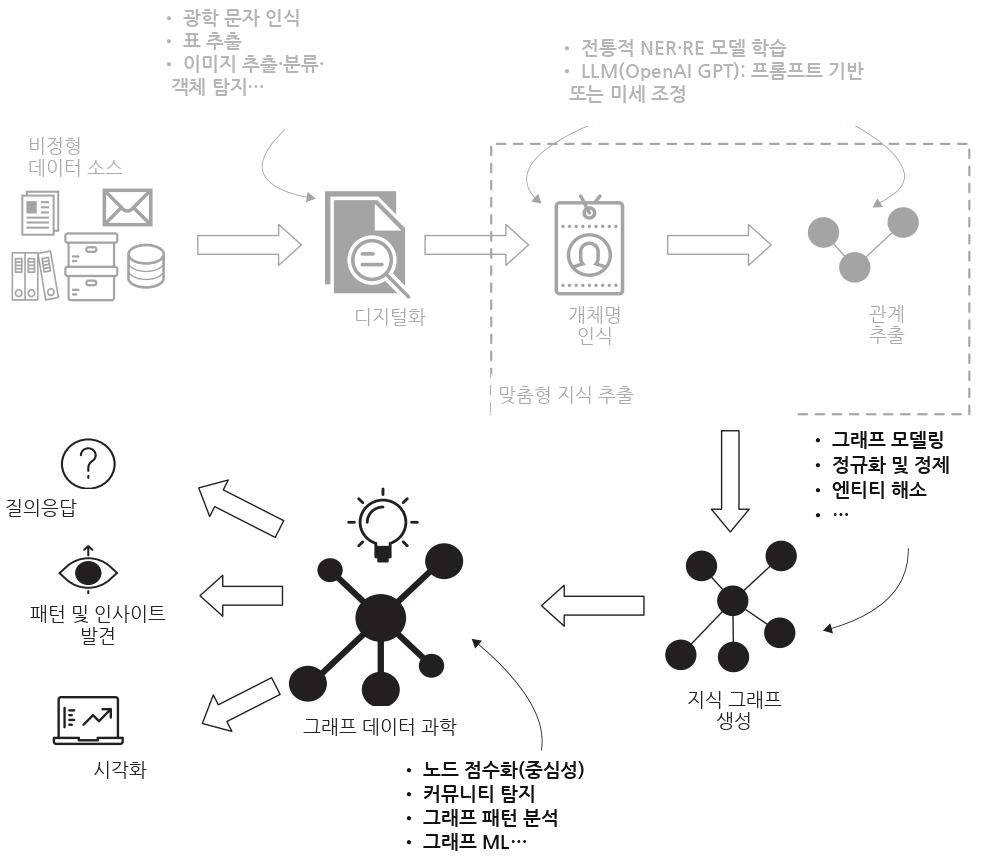
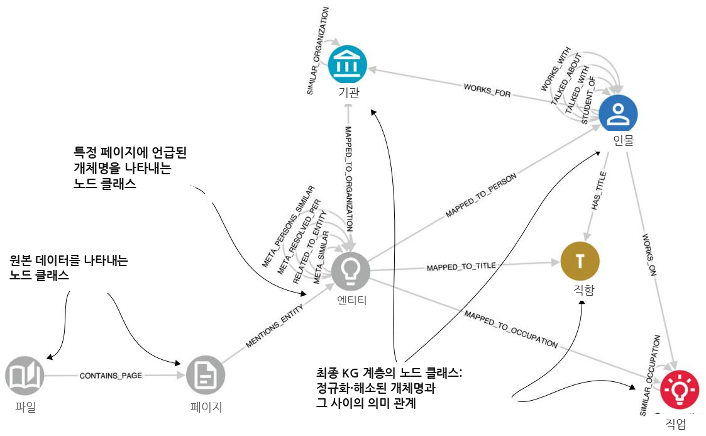
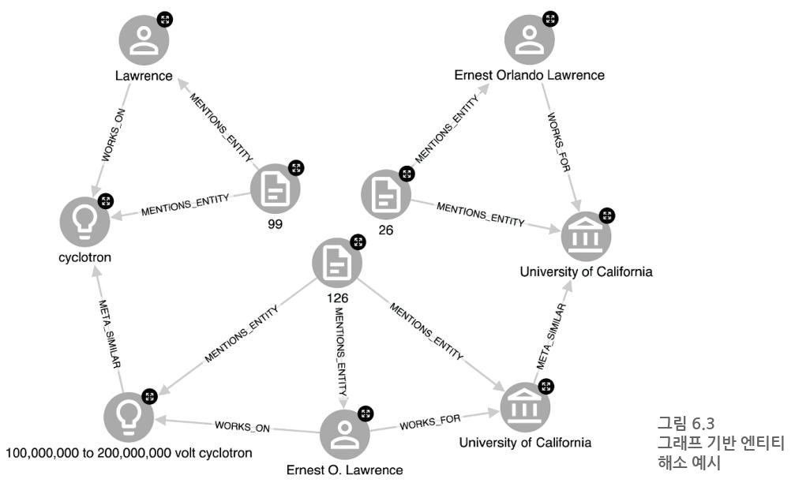
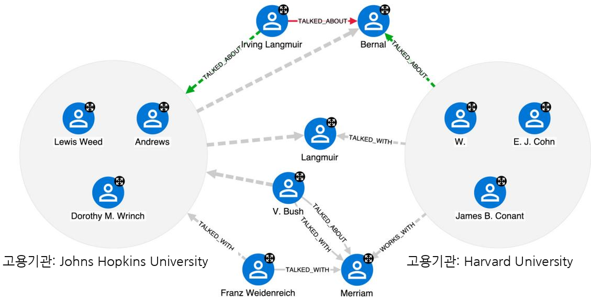

# 대규모 언어 모델로 지식 그래프 구축하기

### 이 장에서 다루는 내용

 아카이브를 지식 그래프 (knowledge graph)로 변환하기

그래프 모델링

데이터 정규화 및 정제

 엔터티 해소 (entity resolution)

지적 네트워크 분석

이전 장에서는 대규모 언어 모델 (LLMs)을 포함한 최신 머신러닝 (ML) 기술을 사용하여 비정형 데이터에서 복잡한 관계형 지식을 추출하는 방법을 논의했습니다. 구체적으로, 록펠러 아카이브 센터 (Rockefeller Archive Center, RAC)의 역사적 타자 문서에서 지식을 추출하는 과정을 살펴보았습니다. 간단히 다시 상기하면, 이 문서들은 록펠러 재단 (Rockefeller Foundation, RF)의 프로그램 담당자들과 다양한 대학 및 기타 기관의 연구자들 사이에서 이루어진 대화에 대한 상세한 설명을 담고 있습니다. RF는 이러한 회의에서 수집한 정보를 활용하여 연구 프로젝트에 자금을 지원할지 여부를 결정했습니다. RAC 사용 사례와 프로젝트 목표에 대한 자세한 설명은 5장을 다시 참조하십시오.

그림 6.1의 정신 모델이 강조하듯이, 우리는 이전에 멈춘 지점에서 이어서 진행합니다. 즉, 텍스트 문서에서 지식을 추출했으며, 이제 이를 지식 그래프 (KG)로 변환하는 방법과 KG를 조직의 이익을 위해 활용하는 방법을 탐구합니다.

  
그림 6.1 도메인 특화 비정형 텍스트 데이터에서 KG 인사이트로 이어지는 경로. 이 단계들은 문서 디지털화를 위한 광학 문자 인식 (optical character recognition), 명명 엔터티 인식 (named entity recognition) 및 관계 추출 시스템, 엔터티 해소, GraphML과 같은 최신 ML 모델에 의존합니다.

### 6.1 아카이브를 KG로 변환하기

다음은 이 프로젝트에서 우리가 여전히 처리해야 하는 과제들의 목록입니다.

아날로그 타자 문서—아날로그 문서는 스캔한 뒤 광학 문자 인식 (OCR) 시스템으로 처리하여 디지털 텍스트 말뭉치 (corpus)를 생성해야 합니다. Amazon 및 Microsoft와 같은 클라우드 제공업체의 기술과 오픈 소스 Tesseract OCR 라이브러리를 포함하여 다양한 OCR 기술을 사용할 수 있습니다.

 역사적 문서—논의된 연구 분야 중 상당수는 더 이상 연구되지 않습니다. 따라서 중의성 해소와 엔터티 해소를 위한 참조로 사용할 수 있을 만큼 포괄적인 명명 엔터티 인식 (NER) 사전이나 지식 베이스를 구축할 가능성은 없습니다.

 드문 언어적 관례—프로그램 담당자들은 특정한 글쓰기 스타일을 가지고 있었습니다. 예를 들어, 그들 중 일부는 “J. R. Smith” 대신 “S.”를, “University of California” 대신 “U.Cal.”을 사용하는 것처럼 사람과 조직을 약어로 지칭했습니다. 우리가 테스트한 기성 상호참조 (coreference) 모델 중 어떤 것도 이러한 축약된 이름을 정식 형태로 해소할 수 없었습니다. 그러나 GPT는 우리의 프롬프트에 응답하여 암묵적으로 NER, 엔터티 해소, 관계 추출 (RE) 작업을 성공적으로 수행했습니다.

 도메인 특화 명명 엔터티—우리는 자연과학 도메인의 연구 프로젝트 설명을 다루고 있습니다. 주요 사용자 정의 명명 엔터티는 직업 (Occupations)이며, 연구 분야, 기술, 치료법, 질병을 포함하고, 이들은 세분성 수준이 다양합니다. 이러한 엔터티에 대해 사용할 수 있는 전통적인 NER 모델은 없습니다(질병은 예외입니다). 그러나 우리는 사용자 정의 ML 기반 NER를 구현한 다음, 예를 들어 의미적으로 유사한 직업을 군집화하는 비지도 엔터티 해소 시스템을 설계하여 추가적인 다운스트림 분석을 가능하게 할 수 있습니다.

높은 관계 복잡성—이 문서들에 담긴 관계 지식은 밀도가 높고 복잡합니다. 한 페이지에도 관련 관계가 수십 개 포함될 수 있습니다. 쓸모없는 지식을 검색하지 않으면서 더 높은 정확도를 달성할 기회를 놓치지 않도록 RE 스키마를 적절히 정의하는 것이 매우 중요합니다. 이는 대규모 데이터셋에 수동으로 레이블을 지정하여 RE 모델을 학습할 때 특히 중요하지만, 이 작업을 위해 LLM을 안내하는 데 RE 스키마를 사용할 때도 중요합니다.

 KG 정규화, 정제, 엔터티 해소, 중의성 해소—이 작업들은 상당한 노력을 필요로 합니다. 예를 들어, 각 문서는 동일한 이름의 서로 다른 변형을 사용할 수 있고, 일부 대화에는 자신의 연구를 의미적으로 유사하지만 서로 다른 단어로 말하는 여러 참여자가 있으며, 대화는 종종 수개월 또는 수년에 걸쳐 이어지는 연쇄의 일부입니다. 안타깝게도 이러한 종류의 분석은 이 책의 범위를 벗어나며, 여기서는 상호작용 네트워크를 생성하고 분석하는 데 초점을 맞출 것입니다.

비정형 데이터 소스의 매칭/연결—이상적으로는 임원 일지에서 추출한 지식을 또 다른 데이터 소스인 이사회 의사록과 단일 KG 안에서 조정(매칭)하고자 합니다. 이렇게 하면 어떤 대화가 어떤 보조금 지원으로 이어졌는지 식별하고, “아이디어에 대한 자금 지원에 일반적으로 선행하는 패턴이 있는가?”와 같은 질문에 답할 수 있습니다. 다시 말해, 이는 이 책의 범위를 벗어나지만, 비정형 데이터 소스를 사용할 때 앞으로 열리는 가능성을 보여주는 예시가 됩니다.

이러한 과제들이 벅차 보일 수 있지만, 우리는 LLM 시대에 살고 있다는 점에서 행운이라고 할 수 있습니다. 그리 멀지 않은 과거에는 이러한 장애물을 극복하기 위해 전통적인 ML 모델과 전략을 구축하는 데 상당한 자원을 투입해야 했을 것입니다. 오늘날에는 이 장의 나머지 부분에서 살펴보겠지만, 적절한 지식 표현 시스템 (knowledge representation system), LLM 모델, 프롬프트 엔지니어링 (prompt engineering)을 선택함으로써 이들 중 많은 문제를 해결할 수 있습니다.

#### 6.1.1 그래프 모델링

RAC 프로젝트의 KG 스키마는 그림 6.2에 제시되어 있습니다(이 책을 위해 단순화했습니다). 우리는 KG의 한 측면인 영향 네트워크 (influence networks)에 초점을 맞출 것입니다. 이는 RF 대표자들이 인터뷰한 사람들 사이의 관계, 예컨대 누가 누구와 또 다른 누구에 대해 이야기했는지와 같은 관계입니다.

우리는 그래프를 세 계층으로 설계하기로 했습니다.

문서 수준 계층—초기 데이터 수집의 결과입니다. 각 일기 파일은 파일 이름, 위치, 작성자와 같은 속성을 가진 File 노드로 표현되며, 각 Page 노드는 OCR 모델이 각 파일에서 추출한 결과로서 페이지의 최종 정제 텍스트와 같은 속성을 가집니다.

메타그래프 (metagraph) 계층—병합되지 않은 GPT 엔터티(Entity 노드)와 그들 사이의 관계, 그리고 이들이 추출된 원본 페이지와의 연결입니다.

KG 계층—최종적으로 정규화되고 정제되며 해소된 엔터티(Person, Title, Organization, Occupation)와 그들 사이의 관계(WORKS\_ON, WORKS\_FOR 등)입니다.

  
그림 6.2 록펠러 아카이브 센터 프로젝트의 단순화된 KG 스키마

앞서 논의했듯이, LLM은 원하는 출력을 생성하기 위해 최선을 다하지만, KG를 직접 생성하는 데 사용할 수는 없습니다. 먼저 정규화와 엔터티 해소 (entity resolution) 단계를 수행해야 하며, 이 스키마가 그것을 가능하게 합니다.

#### 6.1.2 메타그래프 (metagraph) 생성하기

메타그래프를 생성하는 방법을 간단히 논의해 보겠습니다. 몇 페이지보다 긴 텍스트를 다룰 때 첫 번째 단계는 최대 토큰 한도에 도달하거나 매우 긴 텍스트에서 처리 품질이 저하되는 것을 피하기 위해 청킹 전략 (chunking strategy)을 정의하는 것입니다. 여기서는 가장 단순한 접근법, 즉 페이지별 분할을 보여줍니다.

참고 이 프로젝트에는 10,000페이지가 넘는 문서가 있었지만, 이 예제에서는 워런 위버(Warren Weaver)의 일기 150페이지 부분집합을 선택했습니다. OCR 처리된 데이터셋과 전체 수집 코드는 이 책의 코드 저장소에서 찾을 수 있습니다. 문서들은 타자기로 작성되었고 1939년의 것이므로, 디지털화 과정에서 일부 엔터티 이름의 철자가 잘못 인식되었을 수 있습니다.

각 페이지가 처리된 후, 우리는 식별된 모든 엔터티 언급(스키마에서 name 속성을 가진 Entity라고 불리는 노드)을 생성하되 병합하지는 않으며, 이를 해당 페이지에 연결하고, 주어진 페이지에서 추출된 관계(관계 클래스를 나타내는 type 속성을 가진 RELATED\_TO\_ENTITY라고 불림)를 생성합니다. 이를 통해 각 엔터티 언급에 대한 지식을 기반으로 정규화와 엔터티 해소를 수행할 수 있습니다. 그런 다음 최종 KG를 생성할 때, 이러한 엔터티와 관계의 출처에 관한 기저 정보를 보존하면서도 모든 페이지에 걸쳐 해소된 모든 엔터티 언급에 대해 추출된 모든 지식을 쉽게 집계할 수 있습니다. 이는 선택된 엔터티와 관계가 식별된 원문 텍스트 조각을 필요할 때 보여줄 수 있게 함으로써, 그래프 시각화 플랫폼을 쉽게 설명 가능한 방식으로 설계할 수 있게 해 줍니다. 또한 KG 시스템을 유지 관리하는 데이터 과학자에게도 유용한데, 그래프의 노드와 관계의 출처를 쉽게 추적할 수 있고, 예를 들어 필요에 따라 엔터티 해소를 미세조정할 수 있기 때문입니다. 최종 KG는 언제든지 메타그래프로부터 다시 생성할 수 있습니다.

#### 6.1.3 정규화와 정제

메타그래프가 생성되면 클래스별 상위 엔터티, 상위 관계 클래스 등과 같은 통계를 검토할 수 있습니다. 이를 통해 지식 구조를 빠르게 개관할 수 있습니다. 또한 향후 그래프 연결성을 높일 기회가 보이면 이를 구현합니다. 예를 들어 대소문자가 중요하지 않은 경우(예: 직업) 엔터티 이름을 소문자로 변환합니다. 이러한 유형의 정규화는 데이터(KG)의 일관성과 문서 간 효율적인 통합을 보장하는 데 중요합니다. 마찬가지로 GPT는 사람의 직함을 별도로 처리하라는 지시를 받았음에도 때때로 이를 이름의 일부로 포함했으므로, 동일한 사람이 KG에서 여러 노드로 표현되는 것을 피하기 위해(한 번은 직함이 있는 형태로, 한 번은 직함이 없는 형태로) 사람 이름에서 관련 없는 토큰을 제거하는 정제 전략을 구현했습니다. 이러한 경우를 수정하기 위한 Cypher 쿼리는 다음과 같습니다.

목록 6.1 사람과 직업 정규화하기   
from neo4j import GraphDatabase   
URI = "bolt://localhost:7687"   
AUTH = ("neo4j", "password")   
NEO4J\_DB = "neo4j"   
REMOVE\_TITLES = ["dr.", "prof.", "dean", "president", "pres.", "sir",   
➥"mr.", "mrs."]   
QUERY\_NORM\_PERSONS = """ < Person 이름을 정제합니다: 직함/학위를 제거합니다   
➥ MATCH (e:Entity {label: "Person"})   
➥ WITH e, CASE WHEN ANY(title IN \$remove\_titles WHERE toLower(e.name)   
STARTS WITH title) THEN apoc.text.join(split(e.name, " ")[1..], " ")   
ELSE e.name END AS name   
SET e.name\_normalized = name   
➥"""   
Occupation을 소문자로 변환합니다   
QUERY\_NORM\_OCCUPATIONS = """ < 엔터티 이름   
➥MATCH (e:Entity {label: "Occupation"})   
➥ET e.name\_normalized = toLower(e.name)   
➥"""   
if \_\_name == "\_ \_main\_\_":   
with GraphDatabase.driver(URI, auth=AUTH) as driver: 쿼리를   
with driver.session(database=NEO4J\_DB) as session: ≤ 실행합니다   
print("Person 이름 정규화 중")   
session.run(QUERY\_NORM\_PERSONS, remove\_titles=REMOVE\_TITLES)   
print("Occupation 정규화 중")   
session.run(QUERY\_NORM\_OCCUPATIONS)

우리는 name\_normalized라는 새 노드 속성을 생성하며, 이는 나중에 KG 계층의 최종 노드에 연결할 때 정규화되지 않은 name 속성 대신 사용됩니다.

#### 6.1.4 그래프 기반 엔티티 해소

LLM의 생성적 특성은 더 정제되고 정확한 KG를 생성하는 데 도움이 됩니다. 한 가지 이유는 전통적인 NER 및 RE 모델과 달리, 프롬프트나 미세조정에 의해 적절히 안내될 경우 LLM은 완전하고 정제된 엔티티 이름만 반환하기 때문입니다. 이는 표준 NLP 파이프라인의 핵심 과제인 공지시어 해소 (coreference resolution)가 암묵적으로 수행되는 것으로 생각할 수 있으며, 따라서 엔티티 해소의 필요성을 줄여 줍니다.

줄여 주지만, 없애지는 않습니다. 우리는 여전히 문서 간 엔티티를 해소할 수 있어야 합니다. 한 문서의 “Eleanor Smith”가 다른 문서의 “E. Smith”와 동일 인물입니까? 따라서 모든 KG 생성 과정에서 중요한 부분은 엔티티 해소 (entity resolution), 더 나아가 엔티티 중의성 해소 (entity disambiguation)입니다. 즉, 각 주어를 지식 베이스의 구체적인 개념에 연결하는 것입니다.

이 경우 우리는 그래프 구조를 활용하여 그래프 기반 엔티티 해소 시스템을 설계합니다. 전체 논의는 이 장의 범위를 벗어나지만, 일반적인 접근 방식과 초기 기준선을 개략적으로 설명하겠습니다. 메타그래프 계층의 엔티티 언급 대부분은 다른 언급과 하나 이상의 관계를 가지며, 그중 대부분은 엔티티 해소에 유용합니다. WORKS\_FOR 관계를 생각해 보십시오. 두 이름(“Eleanor Smith”와 “E. Smith”) 사이에 높은 수준의 문자열 유사성이 있고 둘 다 같은 대학에서 일한다면, 이는 강한 신호입니다. 마찬가지로, 동일하거나 매우 유사한 이름을 가진 사람들이 같은 연구 주제를 다루고 있을 가능성은 낮습니다. 이러한 유형의 신호를 여러 개 모을 수 있다면, 이 해소에 대한 우리의 신뢰도는 높아집니다.

이 접근 방식은 먼저 문자열 유사성을 기반으로 메타그래프 계층의 노드들을 연결하는 데 의존합니다. 우리는 두 노드가 동일하거나 매우 유사한 문자열 표현을 가지는 경우 META\_SIMILAR 관계로 연결합니다. 또한 유사도 임계값을 정의할 때 도메인 지식도 활용합니다. 예를 들어, 사람의 이름은 이름, 중간 이름(들), 성으로 구성된다는 것을 알고 있습니다. 중간 이름은 흔히 축약되거나 생략되며, 이름에도 마찬가지가 적용됩니다. 그러나 성에만 의존하면 많은 거짓 양성이 발생할 것입니다. 성과 최소한 이름(또는 그 약어)의 조합은 두 언급이 동일 인물일 수 있다는 더 높은 신뢰도를 제공합니다. 이러한 고려 사항을 사용하여 사람 이름의 언급을 나타내는 노드 사이에 META\_SIMILAR 엣지를 생성하기 위한 규칙 집합을 정의할 수 있습니다. 유사한 추론은 Organizations와 같은 다른 엔티티에도 적용할 수 있습니다.

TIP 때때로 이름에는 일반적인 단어가 포함됩니다. 예를 들어, 많은 재단의 Organization 이름에는 Foundation이라는 키워드가 포함되어 있으므로, 이들 사이에 유사도 링크를 생성하는 것은 역효과를 낳을 수 있습니다. SIMILAR 관계를 생성하기 전에 상황을 분석하고 불용어 (stopword) 목록을 정의하는 것이 중요합니다. 서로 다른 데이터셋과 도메인에는 조정된 접근 방식이 필요합니다.

가설은 이제 충분합니다. 그림 6.3에 제시된 구체적 사례를 살펴보겠습니다. 26, 99, 126페이지에서 핵물리학자 어니스트 로렌스(사이클로트론 발명으로 노벨상을 수상했습니다)에 대한 세 가지 언급, 즉 Ernest Orlando Lawrence, Ernest O. Lawrence, Lawrence를 볼 수 있습니다.

이 세 이름이 동일한 사람을 가리킨다는 것을 어떻게 알 수 있을까요? 방금 논의한 규칙과 패턴에 기반한 강한 문자열 유사성이 있습니다. 또한 Ernest Orlando Lawrence와 Ernest O. Lawrence가 세 홉 떨어져 있음을 볼 수 있는데, 두 경우 모두 University of California의 직원으로 식별되기 때문입니다. 마찬가지로 WORKS\_ON 관계와 Occupations인 cyclotron과 100,000,000 to 200,000,000 volt cyclotron 사이의 유사성을 통해 마지막 언급인 Lawrence와의 관계를 찾을 수 있습니다. 그러나 Ernest Orlando Lawrence와 Lawrence는 여섯 홉 떨어져 있다는 점에 주목하십시오. 이러한 종류의 순회는 관계형 데이터베이스에서는 훨씬 더 어려울 것입니다.

훨씬 더 “그래프다운” 접근법을 원하십니까? 지적 네트워크 관계인 TALKED\_ABOUT 및 TALKED\_WITH를 활용하고 Louvain과 같은 그래프 커뮤니티 탐지 알고리즘을 실행하여 상호작용하거나 일반적으로 연결된 사람들의 클러스터를 식별하는 것은 어떻습니까? 그 근거는 남극에서 해양 연구를 수행하는 John Doe가 아마도 우주론을 전문으로 하는 John Doe와는 다른 상호작용 네트워크의 일부일 것이라는 점입니다. 커뮤니티 소속 여부는 이들이 동일 인물인지 판단하는 데 도움이 되는 또 다른 신호를 제공합니다.

ML을 추가하는 것은 어떻습니까? 한 가지 명확한 선택지는 유사한 Occupations를 식별하기 위한 의미 유사도 접근법을 설계하는 것입니다. 문자열 유사성이 전혀 없더라도, 예를 들어 fertility와 human ovulation처럼 주제가 매우 관련되어 있다면 META\_SIMILAR 링크를 생성할 수 있습니다. 흔한 선택은 GPT가 제공하는 임베딩을 사용하고 그 유사성을 기반으로 클러스터링하는 것입니다(우리는 병합적 클러스터링 접근법으로 매우 좋은 결과를 얻었습니다).

그래프 기반 개체 해소 (entity resolution)에는 많은 선택지가 있으며, 우리는 이제 표면을 살짝 다루었을 뿐입니다. 사람을 해소하기 위한 기준선 접근법을 마무리하려면 다음 몇 가지 요소가 필요합니다.

우리가 정의한 기준(문자열 유사성과 RE 출력물을 통한 관련성)을 충족하는 사람 언급들 사이에 META\_PERSONS\_SIMILAR 관계를 생성합니다.

META PERSONS\_SIMILAR 메타그래프에서 약연결 성분 (weakly connected components, WCC) 알고리즘을 실행하여 동일한 KG 개체(최종 그래프 계층)로 해소되어야 하는 언급 그룹을 식별합니다.

각 WCC 그룹에 대해 이를 대표할 공통 이름을 선택합니다. 우리는 가장 긴 이름을 선택합니다(앞의 예에서는 Ernest Orlando Lawrence입니다).

완전히 해소된 개체로 최종 KG 계층을 생성합니다.

이러한 작업은 간단합니다. 전체 흐름은 우리 코드 저장소를 참조하십시오.

### 6.2 지적 네트워크 분석: 그래프의 가치

우리는 마침내 목표인 KG에 도달했습니다. 이제 무엇을 해야 할까요? 이를 어떻게 사용할 수 있을까요? 이 시점에서는 KG의 일반적 가치가 명확해야 하므로, 여기서는 분석적 측면인 그래프 데이터 과학 (graph data science)을 살펴보겠습니다.

KG의 특정 부분은 그래프 분석에 적합하며, 특히 TALKED\_ABOUT, TALKED\_WITH, WORKS\_WITH, STUDENT\_OF 관계로 형성된 사람들(과학자들)의 지적 네트워크가 그렇습니다. 우리는 Neo4j의 Graph Data Science 라이브러리를 사용하여 PageRank, 고유벡터 중심성 (Eigenvector centrality), 노드 차수 (node degree), 매개 중심성 (betweenness centrality)과 같은 그래프 알고리즘으로 이 네트워크를 분석하고, 다음을 식별했습니다.

영향자—다른 사람들의 연구를 추천한다는 측면에서 두드러지는 사람들

 피영향자—다른 사람들의 추천(또는 직업적 소문)의 인기 있는 대상

가교자—서로 다른 사람들의 커뮤니티를 연결하는 역할을 하는 사람들

탐색과 분석을 안내하는 데 도움이 되도록 다양한 시각화 스타일링 옵션을 설계할 수 있습니다.

그림 6.4는 추출된 지적 네트워크에서 가장 큰 연결 성분을 매개 중심성에 기반한 스타일링으로 나타낸 것입니다. 즉, 임의의 노드 쌍 사이의 더 많은 최단 경로가 특정 노드를 통과할수록 해당 노드는 더 크게 표시됩니다. 이 스타일링은 연구자 집단을 나타내는 서로 다른 하위 그래프들 사이에서 가교 역할을 하는 사람들을 강조합니다. 이러한 하위 그래프들은 그렇지 않으면 매우 느슨하게 연결되거나 심지어 단절되었을 것입니다. 당연하게도 원자물리학의 아버지인 Niels Bohr와 사이클로트론 (cyclotron)이라는 입자 가속기의 발명자인 Ernest Lawrence 같은 유명 과학자들이 그중에 포함됩니다. 그러나 덜 유명한 사람들도 강조되며, 이는 조사할 가치가 있는 다른, 잠재적으로 놀라운 통찰로 이어집니다.

  
그림 6.4 지적 영향 네트워크는 TALKED\_ABOUT, TALKED\_WITH, WORKS\_WITH, STUDENT\_OF 관계로 구성됩니다. 노드 스타일링은 해당 노드의 매개 중심성 점수에 기반합니다.

또한 우리는 지적 네트워크를 사용하여 “사이클로트론 연구와 그 자금 조달과 관련하여 누가 중요한 역할을 했는가?”와 같은 보다 초점이 분명한 질문에도 답할 수 있습니다. 이 질문은 간단한 몇 홉 질의로 답할 수 있습니다(리스팅 6.2).

리스팅 6.2 사이클로트론 연구와 관련된 영향 네트워크 표시   
MATCH path = ()<-[:WORKS\_ON|WORKS\_FOR]-(p2:Person)   
➥-[:TALKED\_ABOUT|TALKED\_WITH|WORKS\_WITH|STUDENT\_OF\*1..2]->   
(p:Person)-[:WORKS\_ON]->()-[:SIMILAR\_OCCUPATION\*0..1]-(o:Occupation)   
WHERE o.name = toLower(\$occupation) AND   
➥NOT ANY(x IN nodes(path1) WHERE x.name = "WW")   
RETURN path

매칭된 경로 안에서 우리는 사이클로트론 연구를 수행하는 사람과 어떤 다른 사람 사이에 최대 두 홉의 거리를 허용합니다. 이는 더 복잡한 추천 패턴을 탐색할 수 있게 해 줍니다. 이 사이클로트론 관련 연구 영향 네트워크의 그래프 표현은 직업 및 대학 소속과 같은 정보와 함께 그림 6.5에 제시되어 있습니다. 전체 영향 네트워크 그래프에서 계산된 PageRank 중심성을 사용하여 노드의 크기를 조정했습니다. Ernest Lawrence와 Niels Bohr 외에도 Harvard College Observatory의 천문학자이자 소장이었던 Harlow Shapley, 그리고 유기화학자이자 Harvard University의 제23대 총장이었던 James B. Conant를 포함한 다른 중요한 인물들이 근처에 나타나는 것을 볼 수 있습니다(Harvard는 사이클로트론을 건설했으며, Conant 총장은 이후 General Leslie Groves와의 비밀 협상 끝에 최초의 핵폭탄 개발을 돕기 위해 이를 미국 정부에 \$1에 매각했습니다).

또한 의외의 요소도 있습니다. 비교생리학의 선구자인 Laurence Irving이 등장한다는 점에 주목하십시오(GPT가 그의 이름을 Lawrence로 잘못 표기했는데, 이는 같은 페이지에 Ernest Lawrence가 등장했기 때문에 생긴 혼동으로 보입니다). 그가 사이클로트론 발명의 영향 네트워크에서 어떤 역할을 했을 가능성이 있을까요? 그렇다면 예상 밖의 일일 것입니다. 더 자세히 살펴보면, 이는 관계 추출 (RE) 작업의 실패 사례임을 알 수 있습니다. 그는 이 하위 그래프에 나타나서는 안 됩니다. 이는 LLM이 마법이 아니라는 중요한 사실을 상기시켜 줍니다. LLM은 실제로 실수를 하며, 때로는 어처구니없는 실수도 합니다. 따라서 KG 애플리케이션을 설계할 때 분석가가 그래프의 내용을 검증하거나 무효화할 수 있도록 피드백 루프를 마련하는 것이 중요합니다.

마지막으로 예를 하나 더 들어 결론을 맺겠습니다. 특정 도메인에 경험이 있는 사람, 이 경우에는 프로젝트 담당관 Warren Weaver가 자리를 떠나고 새로운 사람이 채용되었다고 상상해 보십시오. 그들은 Johns Hopkins University와 Harvard University에 걸친 물리학 연구 프로젝트를 처리하라는 요청을 받습니다.

  
그림 6.5 사이클로트론 연구의 2홉 인근에 있는 영향 네트워크. Person 노드의 크기는 그래프에서 인기 있는 노드를 강조하기 위해 전역 PageRank 중심성을 기준으로 합니다.

그들은 누구에게 먼저 접근해야 할까요? 이상적으로는 Johns Hopkins와 Harvard 양쪽에서 물리학 도메인에 노출된 사람에게 비공식적으로 의견을 타진해야 합니다. 이 질문은 영향 네트워크의 관련 부분을 살펴봄으로써 답할 수 있습니다. 즉, 두 대학의 모든 직원(WORKS\_FOR 관계)을 가져온 뒤, 그들 사이의 연결(관계 TALKED\_ABOUT, TALKED\_WITH, WORKS\_WITH, STUDENT\_OF)을 예컨대 최대 3홉까지 검색하되, 그중 적어도 한 명은 물리학 연구를 수행하는 경우를 찾습니다. 그 결과는 그림 6.6에 제시되어 있습니다.

이것이 더 큰 네트워크였다면, 이 하위 그래프에서 매개 중심성 알고리즘을 실행하여 중요한 연결자를 식별하는 데 도움을 받을 수 있었겠지만, 이 경우에는 단순한 작업입니다. 두 대학 사이에서 유용한 연결자로 보이는 사람은 처음 보아도 몇 명에 불과합니다. 좋은 출발점은 Irving Langmuir일 수 있습니다. 그는 1932년 노벨 화학상을 수상한 화학자, 물리학자, 공학자로, X선을 사용해 인슐린과 단백질 구조를 연구한 Dorothy M. Wrinch에 대해 긍정적으로 이야기했으며, 두 대학 모두와 직접적인 1홉 연결을 가지고 있습니다. 이 과학자를 나타내는 노드가 Irving Langmuir와 Langmuir 두 개라는 점에 주목하십시오. 이는 한 페이지에서 그의 성만 언급되었고, 개체 해소에 사용할 수 있는 추가 관계가 없었기 때문입니다. 또한 감정을 나타내는 TALKED\_ABOUT 관계의 속성을 조사해 보면, Bernal은 Dorothy Wrinch에 대해 부정적인 태도를 가지고 있고 Irving Langmuir는 Bernal에 대해 부정적인 태도를 가지고 있음을 발견할 수 있습니다. 균형 잡힌 통찰을 얻기 위해서는 두 사람 모두를 인터뷰하고자 할 수 있습니다.

  
그림 6.6 사람들 사이의 거리가 세 홉을 넘지 않는, Johns Hopkins University와 Harvard University를 연결하는 물리학 연구 영향 네트워크

### 6.3 Rockefeller Archive Center 프로젝트의 다음 단계

이전 절의 결과는 훨씬 더 큰 데이터 소스에서 가져온 150페이지만을 기반으로 하지만, 지식 그래프(KG)의 인상적인 복잡성을 보여줍니다. 완전한 프로덕션 품질의 프로젝트에서는 더 많은 작업이 필요합니다.

지식 추출을 개선합니다. 프롬프트 엔지니어링을 더 많이 반복하거나 LLM을 미세조정하면 KG의 정확도가 향상될 것입니다.

여러 페이지 문서를 처리합니다. 각 일기에는 수백 페이지가 있지만, LLM에 보내고 LLM에서 가져올 수 있는 데이터 양에는 토큰 제한이 있습니다. RAC 프로젝트에서는 ChatGPT-3.5-Turbo를 사용하여 개별 일기 항목의 경계를 식별했으며, 이러한 항목은 일반적으로 세 페이지 미만을 포함하므로 동시에 처리할 수 있었습니다.

엔터티 해소(entity resolution)를 수행합니다. 이 장에서 제시한 기준선 접근법을 개선하고, 이를 다른 엔터티로 확장하며, WikiData 또는 유사한 지식 베이스를 대상으로 한 엔터티 중의성 해소(entity disambiguation)로 보완할 수 있습니다.

보조금을 추가합니다. 이사회 회의록에서 RF가 수여한 보조금에 대한 세부 정보를 마이닝하고, 보조금을 일기 속 대화와 연결하면 “승인된 프로젝트는 영향력 있는 과학자나 이전 수혜자의 추천을 거치는 경향이 있는가?”와 같은 질문에 답할 수 있습니다.

전문 분야(Occupations)의 엔터티 해소를 수행합니다. 이들은 다양한 세분성을 가진 명명 엔터티입니다. 예를 들어 핵물리학, 동위원소, 중질소가 있지만, 동위원소와 중질소는 모두 핵물리학의 일부이며 중질소는 질소의 동위원소입니다. 복잡한 질문에 답하려면 이들을 연결(해소)할 수 있어야 하며, 이를 통해 해당 주제의 전체 역사에 접근할 수 있어야 합니다. 우리는 전문 분야의 임베딩을 생성하고(SentenceBERT 또는 GPT 사용), 응집적 계층 군집화(agglomerative hierarchical clustering)를 사용해 이를 군집화함으로써 가장 좋은 결과를 얻었습니다.

대화를 생성합니다. 고품질 관계 추출(RE)과 기타 정보를 사용하여 Conversation 노드를 만들 수 있습니다. Conversation에는 날짜, 인터뷰어, 피인터뷰자(들), 그리고 주제(피인터뷰자의 전문 분야)가 필요합니다. Conversation이 확보되면, 그 후속 연결 사슬을 식별하고 이를 보조금과 연결할 수 있습니다. 두 작업 모두 전문 분야의 비지도 해소 덕분에 달성 가능합니다.

이제 RAC 프로젝트의 전체 범위가 분명해졌습니다. 역사적 타자 문서에서의 최첨단 지식 마이닝, 비정형 데이터 소스의 조정, 엔터티 해소 시스템, 그래프 모델링, 그래프 데이터 과학, 복잡한 시각화와 스타일링까지—도전적이고 어렵지만, 무엇보다도 재미있습니다!

### 6.4 LLM 시대에서 지식 그래프의 가치

초강력 대규모 언어 모델 (Large Language Models)의 시대에, 왜 우리가 중간 단계 없이 이러한 모델에 데이터를 제공하고 직접 질문하지 않고 지식 그래프 (KG)를 구축하는지 궁금할 수 있습니다. 이 질문에 대한 답은 복잡하며, 이 책—지식 그래프에 대한 우리의 증언—이 그 큰 답입니다. 그러나 이 장과 관련된 더 간략한 답도 제시할 수 있으며, 이는 다음과 같이 요약됩니다.

설명 가능성 (Explainability)—잘 설계된 지식 그래프에 기반한 애플리케이션은 본질적으로 설명 가능하다는 점에서 큰 이점을 가집니다. 이러한 애플리케이션은 사용자가 기반 데이터와 추론을 점검하고 검증할 수 있는 도구를 제공하며, 필요할 경우 전체 “사고”의 사슬을 제공하면서 상충하는 정보 출처를 처리하도록 구성될 수 있습니다.

탈신비화, 또는 탈블랙박스화 (de-black-boxing)—사람들은 고급 ML 모델을 맹목적으로 신뢰해야 하는 블랙박스로 보는 경우가 많습니다. 만약 우리가 단순히 데이터셋으로 LLM을 미세조정 (fine-tuning)하고 질문을 던진다면, 응답의 신뢰도를 평가할 방법이 없을 것입니다. 그리고 “AI”가 우리 데이터의 중요한 정보 일부를 놓치지 않을 것이라고 확신할 수 있을까요? 그 대신 이러한 모델의 언어 이해 능력을 사용하여 문서에서 특정한 사실 정보를 추출하고 지식 그래프를 생성하면, 생성된 통찰에 대한 신뢰를 얻을 수 있습니다.

민주화 (Democratization)—LLM은 학습과 미세조정에 비용이 많이 드는 거대한 존재입니다. 우리는 지식 그래프를 LLM 활용을 민주화하는 한 가지 방법으로 생각할 수 있으며, 이를 통해 막대한 자금이 없는 조직도 LLM의 이점을 누릴 수 있습니다. 즉, 비용이 많이 드는 모델은 지식 그래프를 생성하는 데 단 한 번만 사용하고, 이후에는 다운스트림 작업과 분석을 위해 그 지식 그래프를 오랫동안 사용할 수 있습니다(아마도 가끔 저비용 배치 업데이트를 수행하면서).

탐색 가능성 (Explorability)—그래프는 사용자가 자신의 (관계형) 데이터를 새로운 각도에서 보고 다룰 수 있게 합니다. 그래프는 전역적 관점을 제공할 뿐만 아니라 드릴다운 조사도 가능하게 합니다. 또한 지식 그래프의 시각화와 탐색 가능성은 사람들이 가설을 세운 뒤 자신의 이론을 검증하거나 반증하도록 자극합니다.

고급 분석 (Advanced analytics)—아마도 가장 중요한 점은, 지식 그래프가 사용자 질문에 대한 답변 생성 과정을 완전히 통제할 수 있게 하면서도 데이터 과학자와 분석가가 다운스트림 그래프 기반 분석 및 ML을 수행할 수 있도록 한다는 것입니다.

#### 요약

지식 그래프 스키마 설계, 즉 그래프 모델링은 사용 사례에 맞게 정보가 최적으로 저장되도록 보장합니다. 잘 설계된 스키마는 KG 생성, 개체 및 관계 정제, 정규화, 해소를 단순화하며, 효율적인 다운스트림 분석과 인사이트 발견을 보장합니다.

텍스트 문서에서 고품질의 개체 관계를 추출하면 비지도 (unsupervised) 그래프 기반 개체 해소 접근법을 설계하는 데 도움이 됩니다.

다양한 그래프 데이터 과학 및 그래프 ML 기법은 LLM과 같은 블랙박스 도구에 지나치게 의존하지 않고도 KG의 패턴을 분석하고 인사이트를 도출하는 데 도움이 될 수 있습니다.