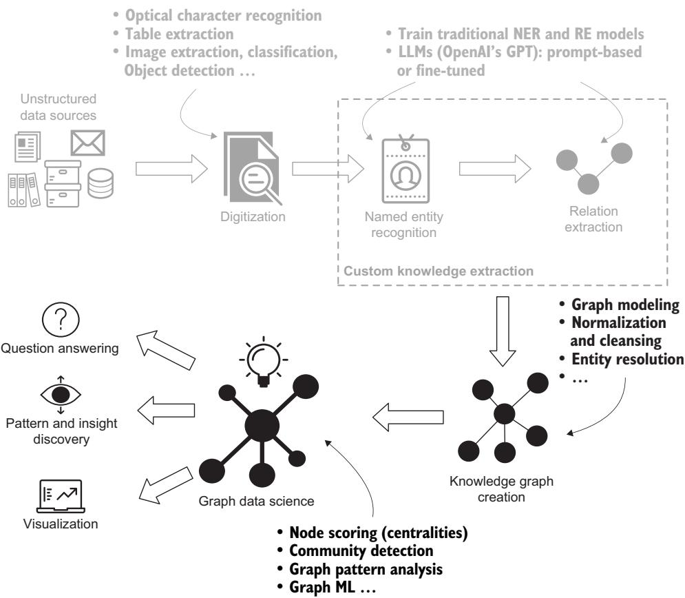
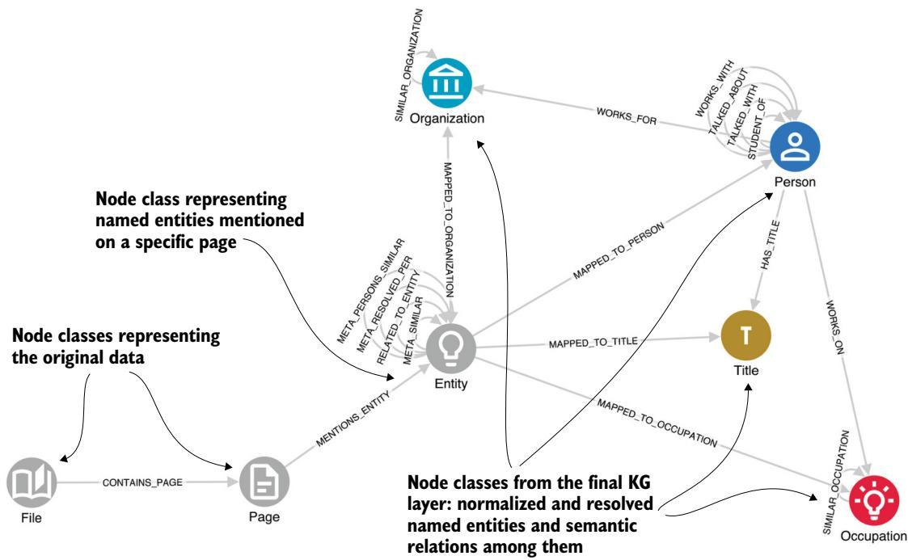
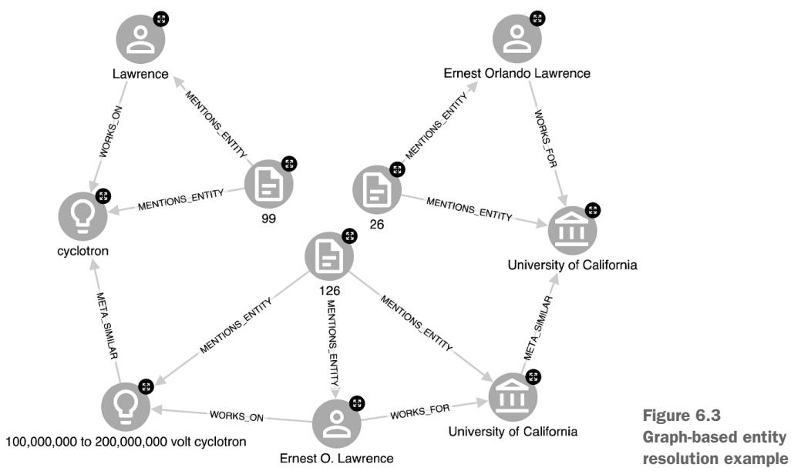
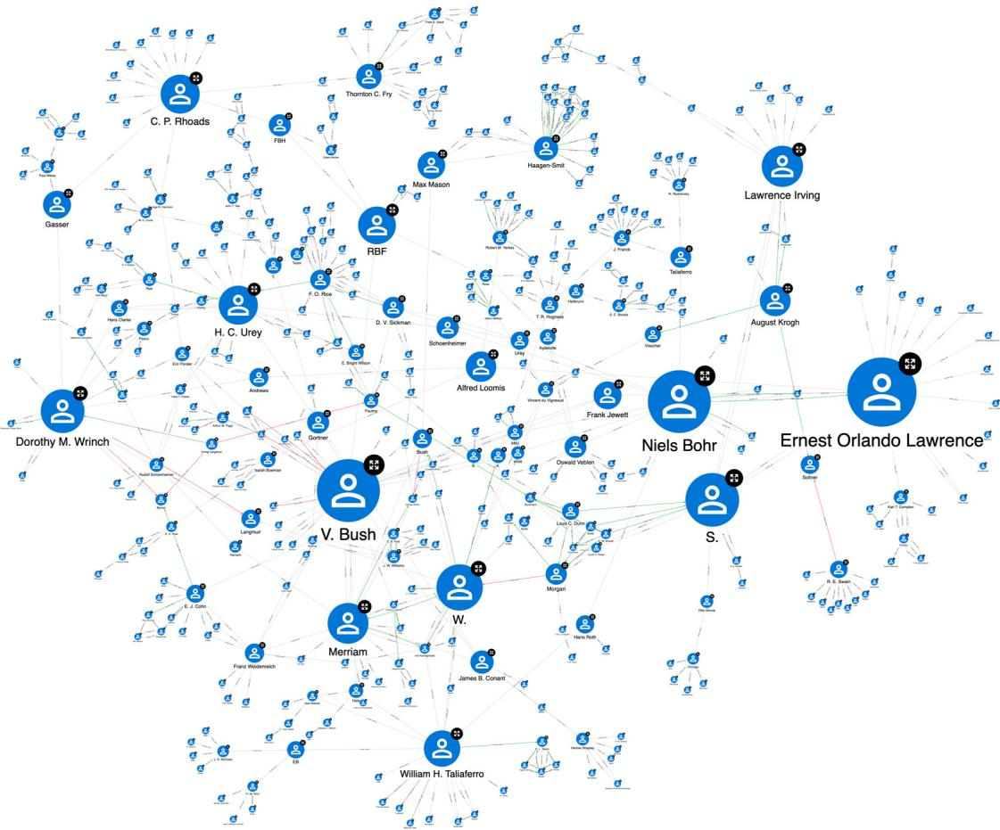
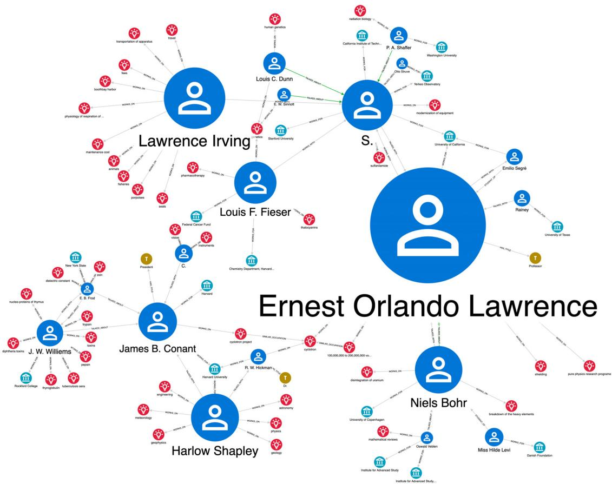
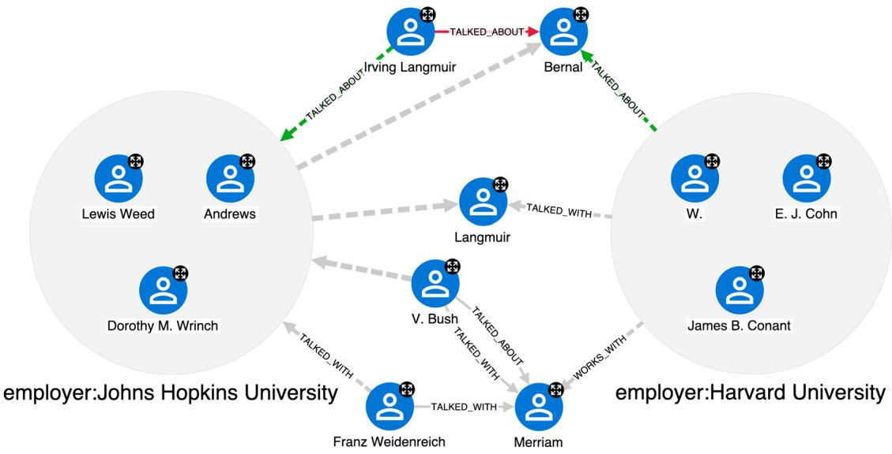

# 대규모 언어 모델로 지식 그래프 구축하기 — 쉬운 해설판

> 이 문서는 Alessandro Negro의 저서 『Knowledge Graphs and LLMs in Action』 6장을, 원문의 모든 문단·그림·표·코드·수식을 빠짐없이 살리면서 쉬운 한국어(합니다체)로 풀어 설명한 해설판입니다. 번역이 아니라 "설명하며 옮기기"에 가깝습니다. 5장에서 문서로부터 지식을 뽑아냈다면, 이번 장에서는 그 지식을 실제 **지식 그래프(knowledge graph)** 로 조립하고, 그것을 조직에 이롭게 활용하는 방법을 다룹니다.

---

### 이 장에서 다루는 내용 — 아카이브를 지식 그래프로 바꾸는 여정의 지도

이번 장은 다음 다섯 가지를 다룹니다. 하나씩 미리 훑어 두면, 뒤에 이어지는 절들이 어디쯤에 놓여 있는지 감을 잡기 쉽습니다.

- 하나의 아카이브(문서 보관소)를 지식 그래프로 변환하기
- 그래프 모델링(그래프의 구조를 설계하는 일)
- 데이터 정규화(normalization)와 정제(cleansing)
- 개체 해소(entity resolution)
- 지적(知的) 네트워크 분석하기

앞 장에서는 최신 머신러닝(ML) 기술, 그중에서도 대규모 언어 모델(LLM)을 이용해 비정형 데이터에서 복잡한 관계형 지식을 추출하는 방법을 이야기했습니다. 구체적으로는 **록펠러 아카이브 센터(Rockefeller Archive Center, RAC)** 의 오래된 타자기 문서에서 지식을 뽑아내는 사례를 살펴봤습니다. 짧게 되짚자면, 이 문서들은 록펠러 재단(RF)의 프로그램 담당자들과 여러 대학·기관의 연구자들 사이에 오간 대화를 상세히 기록한 것입니다. 록펠러 재단은 이런 면담에서 모은 정보를 바탕으로 어떤 연구 프로젝트에 자금을 댈지 결정했습니다. RAC 사례와 이 프로젝트의 목표에 대한 자세한 설명은 5장을 다시 보시면 됩니다.

그림 6.1의 멘탈 모델(전체 흐름을 한눈에 보여주는 그림)이 잘 보여주듯, 우리는 앞서 멈췄던 지점에서 다시 출발합니다. 이미 텍스트 문서에서 지식을 추출해 두었으니, 이제는 그것을 어떻게 지식 그래프로 바꾸고, 그 지식 그래프를 어떻게 우리 조직에 이롭게 활용할지를 탐구합니다.



그림 6.1 도메인 특화 비정형 텍스트 데이터에서 지식 그래프의 통찰(insight)로 나아가는 경로. 각 단계는 최신 ML 모델에 의존합니다. 문서 디지털화를 위한 광학 문자 인식(OCR), 개체명 인식(NER)과 관계 추출(RE) 시스템, 개체 해소, 그리고 그래프 머신러닝(GraphML)이 그것입니다.

---

### 6.1 아카이브를 지식 그래프로 바꾸기 — 아직 남은 난제들과 LLM 시대의 행운

이 프로젝트에서 우리가 아직 다뤄야 할 도전 과제들을 목록으로 정리해 보겠습니다. 하나같이 만만치 않아 보이지만, 각각이 왜 어려운지를 알면 뒤에 나오는 해법이 훨씬 잘 이해됩니다.

**아날로그 타자기 문서** — 아날로그 문서는 스캔한 뒤 **광학 문자 인식(OCR, optical character recognition)** 시스템, 즉 이미지 속 글자를 컴퓨터가 읽을 수 있는 텍스트로 바꿔 주는 기술로 처리해 디지털 텍스트 말뭉치를 만들어야 합니다. OCR 기술은 여러 가지가 있습니다. 아마존이나 마이크로소프트 같은 클라우드 사업자의 서비스도 있고, 오픈소스인 Tesseract OCR 라이브러리도 있습니다.

**역사적 문서** — 여기서 논의되는 연구 분야 중 상당수는 이제 더 이상 연구되지 않습니다. 그래서 개체를 명확히 구별(disambiguation)하고 해소하는 기준으로 쓸 만큼 충분히 포괄적인 **개체명 인식(NER, named entity recognition)** 사전이나 지식 베이스를 만들 가망이 없습니다. 다시 말해, 참조할 만한 "정답지"가 세상에 존재하지 않는다는 뜻입니다.

**낯선 언어 관습** — 프로그램 담당자들은 저마다 독특한 글쓰기 습관이 있었습니다. 예를 들어 어떤 사람은 사람과 조직을 약어로 불렀습니다. "J. R. Smith"를 그냥 "S."로, "University of California"를 "U.Cal."로 적는 식이었지요. 우리가 시험해 본 기성 상호참조(coreference) 모델 중 어느 것도 이렇게 줄여 쓴 이름을 원래의 정식 형태로 되돌리지 못했습니다. 그런데 GPT는 우리의 프롬프트에 응답하면서 NER, 개체 해소, **관계 추출(RE, relation extraction)** 작업을 은연중에(implicitly) 성공적으로 수행했습니다.

**도메인 특화 개체명** — 우리는 자연과학 분야의 연구 프로젝트 설명을 다루고 있습니다. 여기서 가장 중요한 맞춤형 개체명은 직업(Occupations)인데, 이 안에는 연구 분야, 기술, 치료법, 질병 등이 포함되며 그 세분화 정도(granularity)도 제각각입니다. 이런 개체에 곧바로 쓸 수 있는 전통적 NER 모델은 (질병을 빼면) 존재하지 않습니다. 그렇지만 우리는 맞춤형 ML 기반 NER를 직접 구현할 수 있고, 그다음에는 예를 들어 의미적으로 비슷한 직업들을 군집화(clustering)하는 비지도(unsupervised) 개체 해소 시스템을 설계해 후속 분석의 발판으로 삼을 수 있습니다.

**높은 관계 복잡도** — 이 문서들에 담긴 관계형 지식은 빽빽하고 복잡합니다. 한 페이지에 수십 개의 유의미한 관계가 들어 있을 수 있습니다. 따라서 관계 추출 스키마를 제대로 정의하는 것이 매우 중요합니다. 그래야 쓸모없는 지식만 잔뜩 건지고 정작 정확도를 높일 기회는 놓치는 사태를 피할 수 있습니다. 이 점은 대규모 데이터셋을 수작업으로 라벨링해 RE 모델을 학습시킬 때는 물론이고, RE 스키마로 LLM을 이 작업에 안내할 때도 똑같이 중요합니다.

**지식 그래프의 정규화·정제·개체 해소·중의성 해소** — 이 작업들에는 상당한 노력이 듭니다. 예를 들어 문서마다 같은 이름을 조금씩 다르게 표기할 수 있고, 어떤 대화에는 여러 참가자가 등장해 자기 연구를 의미상 비슷하지만 표현은 다른 말로 이야기하며, 대화는 종종 몇 달이나 몇 년에 걸쳐 이어지는 연쇄(chain)의 일부이기도 합니다. 아쉽게도 이런 종류의 분석은 이 책의 범위를 벗어납니다. 여기서는 상호작용 네트워크(interaction network)를 만들고 분석하는 데 집중합니다.

**비정형 데이터 소스를 매칭·연결하기** — 이상적으로는 담당자 일지에서 뽑아낸 지식을 또 다른 데이터 소스, 즉 이사회 회의록(board of directors minutes)과 하나의 지식 그래프 안에서 대조(match)하고 화해(reconcile)시키고 싶습니다. 그렇게 하면 어떤 대화가 어떤 보조금으로 이어졌는지 짚어낼 수 있고, "어떤 아이디어가 자금 지원을 받기 직전에 흔히 나타나는 패턴이 있는가?" 같은 질문에도 답할 수 있습니다. 이 또한 이 책의 범위를 벗어나지만, 비정형 데이터 소스를 활용할 때 앞으로 어떤 가능성이 열리는지를 보여주는 좋은 예시가 됩니다.

이 과제들이 언뜻 벅차 보일지 몰라도, 우리는 LLM 시대에 살고 있다는 것만으로도 운이 좋다고 말할 수 있습니다. 그리 멀지 않은 과거였다면 이런 장애물들을 넘기 위해 전통적 ML 모델과 전략을 짜느라 막대한 자원을 쏟아야 했을 것입니다. 오늘날에는, 이번 장 나머지에서 보게 되듯, 지식 표현 시스템과 LLM 모델을 알맞게 고르고 프롬프트 엔지니어링을 곁들이면 이 문제들의 상당수를 풀 수 있습니다.

---

#### 6.1.1 그래프 모델링 — 세 개의 층으로 그래프를 설계하기

RAC 프로젝트의 지식 그래프 스키마는 그림 6.2에 나와 있습니다(책의 설명을 위해 단순화한 것입니다). 우리는 지식 그래프의 한 측면, 곧 **영향력 네트워크(influence network)** 에 집중합니다. 이는 록펠러 재단 관계자들이 면담한 사람들 사이의 관계, 즉 누가 누구와 또 다른 누구에 대해 이야기했는지를 나타내는 관계입니다.

우리는 그래프를 세 개의 층(layer)으로 설계하기로 했습니다.

**문서 수준 층(Document-level layer)** — 초기 데이터 수집(ingestion)의 결과물입니다. 각 일지 파일은 파일명·위치·저자 같은 속성을 가진 File 노드로 표현되고, OCR 모델이 각 파일에서 추출한 각 페이지는 그 페이지의 최종 정제 텍스트 같은 속성을 가진 Page 노드로 표현됩니다.

**메타그래프 층(Metagraph layer)** — 아직 병합되지 않은(unmerged) GPT 개체들(Entity 노드)과 그들 사이의 관계, 그리고 그 개체가 추출된 원래 페이지와의 연결을 담습니다.

**지식 그래프 층(KG layer)** — 최종적으로 정규화·정제·해소가 끝난 개체들(Person, Title, Organization, Occupation)과 그들 사이의 관계(WORKS\_ON, WORKS\_FOR 등)를 담습니다.



그림 6.2 록펠러 아카이브 센터 프로젝트의 단순화된 지식 그래프 스키마

앞서 이야기했듯, LLM은 원하는 출력을 만들어 내기 위해 최선을 다하지만, 그것만으로 지식 그래프를 곧바로 만들어 낼 수는 없습니다. 이 대목에서 이번 장의 러닝 비유를 떠올리면 좋습니다. LLM은 아는 것이 많고 말도 유창하지만 가끔 사실을 지어내는 달변가에 가깝고, 지식 그래프는 검증된 사실을 차곡차곡 정리한 대장(색인)에 가깝습니다. 그래서 우리는 먼저 정규화와 개체 해소 단계를 거쳐야 하며, 바로 이 세 층짜리 스키마가 그 단계들을 가능하게 해 줍니다.

---

#### 6.1.2 메타그래프 만들기 — 병합하지 말고 일단 다 기록하라

메타그래프를 어떻게 만드는지 간단히 짚어 보겠습니다. 몇 페이지가 넘는 긴 텍스트를 다룰 때 가장 먼저 할 일은 **청킹 전략(chunking strategy)**, 즉 텍스트를 어떻게 조각낼지를 정하는 것입니다. 그래야 최대 토큰 한도에 걸리거나, 너무 긴 텍스트에서 처리 품질이 떨어지는 일을 피할 수 있습니다. 여기서는 가장 단순한 방법을 보여드립니다. 바로 페이지 단위로 나누는 것입니다.

> **참고** 이 프로젝트에는 1만 페이지가 넘는 문서가 있었지만, 이 예제에서는 워런 위버(Warren Weaver)의 일지 중 150페이지 정도를 골랐습니다. OCR 처리된 데이터셋과 전체 수집 코드는 책의 코드 저장소에서 찾을 수 있습니다. 이 문서들은 타자기로 작성되었고 1939년까지 거슬러 올라가므로, 디지털화 과정에서 일부 개체명의 철자가 잘못 인식되었을 수 있습니다.

각 페이지를 처리한 뒤, 우리는 식별된 모든 개체 언급(mention)을 만듭니다. 여기서 중요한 것은 "병합하지 않고 만든다"는 점입니다. 이 노드들은 스키마에서 Entity라고 부르며 name 속성을 가집니다. 그런 다음 각 개체를 자신이 속한 페이지에 연결하고, 그 페이지에서 추출된 관계들도 만듭니다(이 관계는 RELATED\_TO\_ENTITY라고 부르며, 관계의 종류를 나타내는 type 속성을 가집니다). 이렇게 해 두면 각 개체 언급에 관한 지식을 바탕으로 정규화와 개체 해소를 할 수 있습니다.

그다음 최종 지식 그래프를 만들 때는, 여러 페이지에 걸쳐 해소된 모든 개체 언급에 대해 추출된 지식을 손쉽게 한데 모으면서도, 이 개체와 관계가 어디서 왔는지에 관한 원본 정보를 그대로 보존할 수 있습니다. 이 점 덕분에 우리는 그래프 시각화 플랫폼을 "설명 가능한(explainable)" 방식으로 설계할 수 있습니다. 즉, 선택한 개체와 관계가 어느 원본 텍스트 조각에서 나왔는지 필요할 때 곧바로 보여줄 수 있는 것입니다. 또한 지식 그래프 시스템을 유지·관리하는 데이터 과학자에게도 유용합니다. 그래프 속 노드와 관계의 출처를 쉽게 추적할 수 있고, 필요에 따라 개체 해소를 미세 조정(finetune)할 수 있으며, 최종 지식 그래프는 언제든 메타그래프로부터 다시 만들어 낼 수 있기 때문입니다.

---

#### 6.1.3 정규화와 정제 — 이름을 다듬어 그래프의 연결성을 높이기

메타그래프를 만들고 나면 클래스별 상위 개체, 상위 관계 클래스 같은 통계를 살펴볼 수 있습니다. 이는 지식의 구조를 빠르게 조망하게 해 줍니다. 게다가 앞으로 그래프의 연결성(connectivity)을 높일 기회가 보이면 곧바로 반영합니다. 예를 들어 대소문자 구분이 무의미한 경우(직업 같은 경우)에는 개체명을 소문자로 통일합니다. 이런 종류의 정규화는 데이터(지식 그래프)의 일관성을 지키고 여러 문서를 효율적으로 통합하는 데 중요합니다.

비슷한 맥락에서, GPT는 사람의 직함을 이름과 별개로 다루라는 지시를 받았음에도 가끔 직함을 이름의 일부로 끼워 넣곤 했습니다. 그래서 우리는 사람 이름에서 무관한 토큰을 걷어내는 정제 전략을 마련했습니다. 그러지 않으면 같은 사람이 지식 그래프에서 여러 노드로 표현되는 문제가 생깁니다(한 번은 직함이 붙은 채로, 한 번은 직함이 없는 채로). 이런 경우를 바로잡는 Cypher 쿼리는 다음과 같습니다.

> **Listing 6.1 사람과 직업 정규화하기** (원문 코드 — OCR 과정에서 일부 문자가 깨져 있으나 원형을 그대로 보존합니다)

```python
from neo4j import GraphDatabase
URI = "bolt://localhost:7687"
AUTH = ("neo4j", "password")
NEO4J_DB = "neo4j"
REMOVE_TITLES = ["dr.", "prof.", "dean", "president", "pres.", "sir",
➥"mr.", "mrs."]
QUERY_NORM_PERSONS = """ < Cleans Person names: removes titles/degrees
➥ MATCH (e:Entity {label: "Person"})
➥ WITH e, CASE WHEN ANY(title IN $remove_titles WHERE toLower(e.name)
STARTS WITH title) THEN apoc.text.join(split(e.name, " ")[1..], " ")
ELSE e.name END AS name
SET e.name_normalized = name
➥"""
Lowercases Occupation
QUERY_NORM_OCCUPATIONS = """ < entity names
➥MATCH (e:Entity {label: "Occupation"})
➥ET e.name_normalized = toLower(e.name)
➥"""
if __name == "__main__":
    with GraphDatabase.driver(URI, auth=AUTH) as driver: Executes
        with driver.session(database=NEO4J_DB) as session: ≤ the queries
            print("Normalizing Person names")
            session.run(QUERY_NORM_PERSONS, remove_titles=REMOVE_TITLES)
            print("Normalizing Occupations")
            session.run(QUERY_NORM_OCCUPATIONS)
```

코드의 핵심만 짚자면 이렇습니다. `REMOVE_TITLES` 목록에는 "dr.", "prof.", "dean", "president" 같은 직함·학위 토큰이 담겨 있습니다. `QUERY_NORM_PERSONS` 쿼리는 Person 라벨을 가진 개체를 훑으면서, 이름이 이 직함들 중 하나로 시작하면 첫 토큰을 잘라낸 나머지를 이름으로 삼습니다(`split(e.name, " ")[1..]` 부분이 그것입니다). `QUERY_NORM_OCCUPATIONS` 쿼리는 Occupation 개체의 이름을 소문자로 바꿉니다. 그 결과를 원래 이름이 아니라 새 속성에 저장합니다.

이렇게 우리는 `name_normalized`라는 새 노드 속성을 만듭니다. 나중에 지식 그래프 층의 최종 노드에 연결할 때는 정규화되지 않은 원래 name 속성 대신 이 `name_normalized` 속성을 사용합니다.

---

#### 6.1.4 그래프 기반 개체 해소 — 흩어진 이름들을 한 사람으로 모으기

LLM의 생성적(generative) 성질은 더 깨끗하고 정확한 지식 그래프를 만드는 데 도움을 줍니다. 한 가지 이유는, 전통적인 NER·RE 모델과 달리 LLM은 프롬프트나 파인튜닝으로 적절히 안내하면 온전하고 깨끗한 개체명만 돌려주기 때문입니다. 표준 자연어처리(NLP) 파이프라인의 핵심 작업인 **상호참조 해소(coreference resolution)** 가 은연중에 수행되는 셈이며, 그만큼 개체 해소의 부담을 줄여 줍니다.

다만 줄여 줄 뿐, 없애 주지는 못합니다. 우리는 여전히 문서를 가로질러 개체를 해소할 수 있어야 합니다. 한 문서의 "Eleanor Smith"가 다른 문서의 "E. Smith"와 같은 사람일까요? 그래서 어떤 지식 그래프 구축 과정에서든 **개체 해소(entity resolution)**, 나아가 **개체 중의성 해소(entity disambiguation)**, 즉 각 대상을 지식 베이스 안의 구체적 개념에 연결하는 일이 필수적인 부분입니다.

이 경우 우리는 그래프 구조를 십분 활용해 그래프 기반 개체 해소 시스템을 설계합니다. 전체를 다 논하는 것은 이 장의 범위를 벗어나지만, 큰 접근법과 초기 베이스라인(baseline)을 그려 보겠습니다. 메타그래프 층에 있는 개체 언급들은 대부분 다른 언급들과 하나 이상의 관계를 맺고 있으며, 그중 상당수가 개체 해소에 유용합니다. WORKS\_FOR 관계를 떠올려 보십시오. 두 이름("Eleanor Smith"와 "E. Smith") 사이에 문자열 유사도가 높은 데다 둘 다 같은 대학에 소속돼 일한다면, 그것은 강력한 신호입니다. 반대로, 이름이 같거나 매우 비슷한 사람들이 같은 연구 주제를 다루고 있을 가능성은 낮습니다. 이런 유형의 신호를 여러 개 모을수록 해소에 대한 우리의 확신은 커집니다.

이 접근법은 먼저 메타그래프 층의 노드들을 문자열 유사도에 근거해 연결하는 데서 출발합니다. 두 노드의 문자열 표현이 동일하거나 매우 비슷하면 META\_SIMILAR 관계로 이어 줍니다. 유사도 임계값을 정할 때는 도메인 지식도 활용합니다. 예를 들어 우리는 사람 이름이 이름(first name), 중간 이름(middle name), 성(surname)으로 이루어진다는 사실을 압니다. 중간 이름은 종종 약자로 쓰이거나 생략되며, 이는 이름(first name)도 마찬가지입니다. 그런데 성에만 의존하면 잘못된 일치(false positive)가 대량으로 생깁니다. 성에 더해 최소한 이름(또는 그 약자)까지 맞아떨어질 때, 두 언급이 같은 사람일 수 있다는 확신이 더 높아집니다. 이런 고려사항을 활용해, 사람 이름 언급을 나타내는 노드들 사이에 META\_SIMILAR 간선(edge)을 만드는 규칙 집합을 정의할 수 있습니다. 조직(Organization) 같은 다른 개체에도 비슷한 논리를 적용할 수 있습니다.

> **팁** 이름에 일반적인 단어가 포함되는 경우가 있습니다. 예컨대 많은 재단의 조직명에는 Foundation이라는 단어가 들어가므로, 그것들 사이에 유사도 링크를 만드는 것은 오히려 역효과를 냅니다. 상황을 잘 분석해 SIMILAR 관계를 만들기 전에 불용어(stopword) 목록을 정의하는 것이 중요합니다. 데이터셋과 도메인이 다르면 접근법도 그에 맞게 조정해야 합니다.

가정만으로는 충분하지 않으니, 그림 6.3에 나온 구체적인 사례를 살펴보겠습니다. 여기서 우리는 핵물리학자 어니스트 로런스(Ernest Lawrence, 사이클로트론을 발명해 노벨상을 받은 인물)에 대한 세 가지 언급을 봅니다. 각각 26페이지, 99페이지, 126페이지에 나오며 표기는 Ernest Orlando Lawrence, Ernest O. Lawrence, 그리고 Lawrence입니다.



그림 6.3 서로 다른 페이지에서 세 가지 형태로 언급된 어니스트 로런스, 그리고 이들을 잇는 그래프 경로

이 세 이름이 같은 사람을 가리킨다는 것을 어떻게 알 수 있을까요? 우선 방금 이야기한 규칙과 패턴에 근거한 강한 문자열 유사도가 있습니다. 또한 Ernest Orlando Lawrence와 Ernest O. Lawrence는 세 홉(hop) 떨어져 있는데, 두 경우 모두 캘리포니아 대학교(University of California)의 직원으로 식별되기 때문입니다. 마찬가지로 마지막 언급인 Lawrence까지도, WORKS\_ON 관계와 직업 사이의 유사성(cyclotron과 "100,000,000 to 200,000,000 volt cyclotron")을 통해 이어지는 관계를 찾아낼 수 있습니다. 다만 Ernest Orlando Lawrence와 Lawrence는 여섯 홉이나 떨어져 있다는 점에 주목하세요. 이런 식의 순회(traversal)는 관계형 데이터베이스에서는 훨씬 더 어렵습니다. 그래프가 빛을 발하는 지점이 바로 여기입니다.

좀 더 "그래프다운" 접근을 원하십니까? 지적 네트워크 관계인 TALKED\_ABOUT와 TALKED\_WITH를 활용해, 루뱅(Louvain) 같은 그래프 커뮤니티 탐지(community detection) 알고리즘을 돌려 서로 상호작용하거나 연결된 사람들의 군집을 찾아내는 방법은 어떨까요? 여기 깔린 논리는 이렇습니다. 남극에서 해양 연구를 하는 존 도(John Doe)는 우주론을 전공하는 존 도와는 아마도 서로 다른 상호작용 네트워크에 속해 있을 것입니다. 어떤 커뮤니티에 속해 있느냐 하는 정보는 두 사람이 동일 인물인지 판단하는 또 하나의 신호가 됩니다.

여기에 ML을 더하면 어떨까요? 한 가지 뻔한 선택지는 의미적 유사도(semantic similarity) 방식을 설계해 비슷한 직업을 찾아내는 것입니다. 문자열 유사도가 전혀 없더라도 주제가 서로 매우 밀접하면 META\_SIMILAR 링크를 만들 수 있습니다. 예를 들어 fertility(가임력)와 human ovulation(사람의 배란) 같은 경우입니다. 흔히 쓰는 방법은 GPT가 제공하는 임베딩(embedding)을 이용해 유사도에 따라 군집화하는 것입니다(우리는 병합 군집화(agglomerative clustering) 방식으로 아주 좋은 결과를 얻었습니다).

그래프 기반 개체 해소에는 수많은 선택지가 있으며, 우리는 이제 겨우 표면만 긁었을 뿐입니다. 사람을 해소하는 베이스라인 접근법을 마무리하려면 마지막으로 다음 몇 가지 재료가 더 필요합니다.

- 우리가 정의한 기준(문자열 유사도, 그리고 RE 출력을 통한 관련성)을 충족하는 사람 언급들 사이에 META\_PERSONS\_SIMILAR 관계를 만듭니다.
- META\_PERSONS\_SIMILAR 메타그래프에 **약결합 요소(WCC, weakly connected components)** 알고리즘을 돌려, 같은 지식 그래프 개체(최종 그래프 층)로 해소되어야 할 언급 그룹을 식별합니다.
- 각 WCC 그룹마다 그것을 대표할 공통 이름을 고릅니다. 우리는 가장 긴 이름을 고릅니다(앞선 예시에서는 Ernest Orlando Lawrence가 그것입니다).
- 완전히 해소된 개체들로 최종 지식 그래프 층을 만듭니다.

이 작업들은 그리 복잡하지 않습니다. 전체 흐름은 우리 코드 저장소를 참고하세요.

---

### 6.2 지적 네트워크 분석: 그래프의 가치 — 지식 그래프로 인물 네트워크를 파헤치기

드디어 목표에 도달했습니다. 지식 그래프가 완성되었습니다. 이제 무엇을 할까요? 어떻게 활용할까요? 이 지점에서 지식 그래프의 일반적인 가치는 이미 분명해졌을 테니, 우리는 분석적 측면 하나, 즉 **그래프 데이터 과학(graph data science)** 을 탐구하겠습니다.

지식 그래프의 어떤 부분들은 그래프 분석에 잘 맞습니다. 특히 TALKED\_ABOUT, TALKED\_WITH, WORKS\_WITH, STUDENT\_OF 관계로 형성된 사람들(과학자들)의 지적 네트워크가 그렇습니다. 우리는 Neo4j의 그래프 데이터 과학(Graph Data Science) 라이브러리를 이용해, 페이지랭크(PageRank), 고유벡터 중심성(Eigenvector centrality), 노드 차수(node degree), 매개 중심성(betweenness centrality) 같은 그래프 알고리즘으로 이 네트워크를 분석해 다음을 식별했습니다.

**영향력 발신자(Influencers)** — 다른 사람의 연구를 추천하는 면에서 두드러지는 사람들

**영향력 수신자(Influencees)** — 다른 사람들의 추천(또는 업계 뒷담화)의 인기 있는 대상이 되는 사람들

**교량(Bridges)** — 서로 다른 사람 커뮤니티 사이를 잇는 연결자 역할을 하는 사람들

탐색과 분석을 돕기 위해 다양한 시각화 스타일링 옵션을 설계할 수 있습니다.

그림 6.4는 추출된 지적 네트워크의 가장 큰 연결 요소(largest connected component)를 매개 중심성에 근거한 스타일링으로 나타낸 것입니다. 어떤 노드를 지나는 최단 경로가 많을수록 그 노드는 더 크게 그려집니다. 이 스타일링은 서로 다른 부분그래프(subgraph), 즉 그렇지 않았다면 매우 느슨하게 연결되거나 아예 끊겨 있었을 연구자 집단들 사이에서 교량 역할을 하는 사람들을 부각합니다. 놀랍지 않게도, 닐스 보어(Niels Bohr, 원자물리학의 아버지)나 어니스트 로런스(사이클로트론이라는 입자 가속기를 발명한 인물) 같은 유명 과학자들이 그중에 있습니다. 하지만 덜 유명한 사람들도 함께 부각되며, 이는 조사해 볼 가치가 있는 다른, 어쩌면 뜻밖의 통찰로 이어집니다.



그림 6.4 TALKED\_ABOUT, TALKED\_WITH, WORKS\_WITH, STUDENT\_OF 관계로 이루어진 지적 영향력 네트워크. 노드 스타일링은 각 노드의 매개 중심성 점수에 근거합니다.

우리는 이 지적 네트워크로 더 구체적인 질문에도 답할 수 있습니다. 예를 들어 "사이클로트론 연구와 그 자금 지원에 중요한 역할을 한 사람은 누구인가?" 같은 질문입니다. 이 질문은 몇 홉짜리 간단한 쿼리(Listing 6.2)로 답할 수 있습니다.

> **Listing 6.2 사이클로트론 연구와 관련된 영향력 네트워크 보여주기** (원문 코드 원형 보존)

```cypher
MATCH path = ()<-[:WORKS_ON|WORKS_FOR]-(p2:Person)
➥-[:TALKED_ABOUT|TALKED_WITH|WORKS_WITH|STUDENT_OF*1..2]->
(p:Person)-[:WORKS_ON]->()-[:SIMILAR_OCCUPATION*0..1]-(o:Occupation)
WHERE o.name = toLower($occupation) AND
➥NOT ANY(x IN nodes(path1) WHERE x.name = "WW")
RETURN path
```

쿼리의 뜻을 풀어 보겠습니다. 매칭되는 경로 안에서, 우리는 사이클로트론 연구를 하는 사람과 또 다른 어떤 사람 사이에 최대 두 홉까지의 거리를 허용합니다(`*1..2` 부분이 그것입니다). 그렇게 하면 더 복잡한 추천 패턴까지 탐색할 수 있습니다. 마지막 조건(`x.name = "WW"`)은 워런 위버(WW) 본인을 결과에서 제외하는 필터입니다.

사이클로트론 관련 연구의 이 영향력 네트워크를 그래프로 표현한 것이 그림 6.5이며, 여기에는 직업과 대학 소속 같은 정보가 함께 담겨 있습니다. 전체 영향력 네트워크 그래프에서 계산한 페이지랭크 중심성을 노드 크기 조절에 사용했습니다. 그림을 보면 어니스트 로런스와 닐스 보어 외에도 중요한 인물들이 가까이 나타납니다. 천문학자이자 하버드 대학 천문대장인 할로 섀플리(Harlow Shapley), 그리고 유기화학자이자 하버드 대학교의 23대 총장인 제임스 B. 코넌트(James B. Conant)가 그렇습니다(하버드는 사이클로트론을 만들었는데, 레슬리 그로브스 장군과의 비밀 협상을 거쳐 코넌트 총장이 훗날 이를 미국 정부에 단돈 1달러에 팔아 최초의 원자폭탄 개발을 도왔습니다).

여기에는 뜻밖의 요소도 하나 있습니다. 로런스 어빙(Laurence Irving)이 등장하는 것을 눈여겨보세요(GPT가 그의 이름 첫 부분을 Lawrence로 잘못 표기했는데, 같은 페이지에 어니스트 로런스가 있었던 탓에 생긴 혼동으로 보입니다). 그는 비교생리학(comparative physiology)의 선구자입니다. 그가 사이클로트론 발명의 영향력 네트워크에서 어떤 역할을 했을 가능성이 있을까요? 그렇다면 예상 밖의 일일 것입니다. 자세히 들여다보면, 이것은 RE 작업이 실패한 사례입니다. 그는 이 부분그래프에 나타나서는 안 됩니다. 이는 LLM이 마법이 아니라는 점을 상기시키는 중요한 사례입니다. LLM도 실수를 하며, 때로는 어이없는 실수도 합니다. 그러므로 분석가가 그래프의 내용을 검증하거나 반증할 수 있도록, 지식 그래프 애플리케이션에 피드백 루프(feedback loop)를 설계해 두는 것이 중요합니다.



그림 6.5 사이클로트론 연구의 두 홉 이내 영향력 네트워크. Person 노드 크기는 전역 페이지랭크 중심성에 근거해, 그래프에서 인기 있는 노드를 부각합니다.

예시를 하나만 더 들며 마무리하겠습니다. 특정 도메인에 경험이 있는 사람 — 우리 사례에서는 프로젝트 담당자 워런 위버 — 이 자리를 떠나고 새 사람이 채용되었다고 상상해 보십시오. 그 신입은 존스홉킨스 대학교와 하버드 대학교에 걸쳐 있는 어느 물리학 연구 프로젝트를 맡아 달라는 요청을 받습니다. 이 사람은 누구에게 먼저 접근해야 할까요? 이상적으로는 존스홉킨스와 하버드 양쪽 모두에서 물리학 분야에 노출된 적이 있는 사람에게 비공식적으로 넌지시 물어보고 싶을 것입니다.

이 질문은 영향력 네트워크의 관련 부분을 살펴보면 답할 수 있습니다. 두 대학의 모든 직원(WORKS\_FOR 관계)을 가져온 뒤, 그들 사이의 연결(TALKED\_ABOUT, TALKED\_WITH, WORKS\_WITH, STUDENT\_OF 관계)을, 가령 최대 세 홉까지, 그리고 적어도 한 사람이 물리학 연구를 하는 경우로 한정해 찾습니다. 그 결과가 그림 6.6에 나와 있습니다.

만약 이것이 더 큰 네트워크였다면 이 부분그래프에 매개 중심성 알고리즘을 돌려 중요한 연결자를 찾아냈겠지만, 이 경우는 간단한 작업입니다. 두 대학 사이의 유용한 연결자로 언뜻 눈에 띄는 사람은 몇 명뿐입니다. 좋은 출발점은 어빙 랭뮤어(Irving Langmuir, 1932년 노벨 화학상을 받은 화학자·물리학자·공학자)일 수 있습니다. 그는 X선을 이용해 인슐린과 단백질 구조를 연구한 도러시 M. 링치(Dorothy M. Wrinch)에 대해 긍정적으로 이야기했고, 두 대학 모두와 직접적인 한 홉 링크를 가지고 있습니다.

여기서 이 과학자를 나타내는 노드가 두 개(Irving Langmuir와 Langmuir)라는 점에 주목하세요. 어느 페이지에서 그의 성만 언급되었고, 그때는 개체 해소에 쓸 만한 추가 관계가 없었기 때문입니다. 나아가 감정(sentiment)을 나타내는 TALKED\_ABOUT 관계의 속성을 살펴보면, 버널(Bernal)이 도러시 링치에게 부정적 태도를 보이고, 어빙 랭뮤어가 버널에게 부정적 태도를 보인다는 사실을 발견할 수 있습니다. 균형 잡힌 통찰을 얻으려면 두 사람 모두를 인터뷰하는 편이 좋을 것입니다.



그림 6.6 존스홉킨스 대학교와 하버드 대학교를 잇는 물리학 연구 영향력 네트워크. 사람들 사이는 세 홉을 넘지 않습니다.

---

### 6.3 록펠러 아카이브 센터 프로젝트의 다음 단계 — 프로덕션급 프로젝트로 나아가기 위해

앞 절의 결과는 훨씬 방대한 데이터 소스 중 겨우 150페이지에 기반한 것이지만, 그럼에도 지식 그래프의 인상적인 복잡성을 잘 보여줍니다. 실제 프로덕션 품질의 프로젝트라면 다음과 같은 일들을 더 해야 합니다.

**지식 추출 개선하기** — 프롬프트 엔지니어링을 더 여러 번 반복하거나 LLM을 파인튜닝하면 지식 그래프의 정확도가 높아집니다.

**여러 페이지 문서 다루기** — 각 일지는 수백 페이지에 이르지만, LLM에 보내고 받을 수 있는 데이터 양에는 토큰 한도가 있습니다. RAC 프로젝트에서는 ChatGPT-3.5-Turbo를 이용해 개별 일지 항목의 경계를 식별했습니다. 이런 항목은 보통 세 페이지 미만이었고, 우리는 그것들을 동시에 처리했습니다.

**개체 해소 수행하기** — 이번 장에서 소개한 베이스라인 접근법을 개선하고, 다른 개체로 확장하며, WikiData나 유사한 지식 베이스에 대한 개체 중의성 해소로 보완할 수 있습니다.

**보조금 추가하기** — 이사회 회의록에서 록펠러 재단이 지급한 보조금의 세부사항을 캐내어 그 보조금을 일지 속 대화에 연결하면, "지원을 받은 프로젝트는 영향력 있는 과학자나 이전 수혜자의 추천을 거치는 경향이 있는가?" 같은 질문에 답할 수 있습니다.

**직업의 개체 해소 수행하기** — 직업은 세분화 정도가 제각각인 개체명입니다. 예를 들어 우리에게는 핵물리학(nuclear physics), 동위원소(isotopes), 중질소(heavy nitrogen)가 있는데, 동위원소와 중질소는 둘 다 핵물리학의 일부이고, 중질소는 질소의 동위원소이기도 합니다. 복잡한 질문에 답하려면 이들을 연결(해소)해 특정 주제의 전체 역사에 접근할 수 있어야 합니다. 우리는 직업의 임베딩을 만들고(SentenceBERT나 GPT 사용) 병합 계층적 군집화(agglomerative hierarchical clustering)로 묶었을 때 가장 좋은 결과를 얻었습니다.

**대화(Conversation) 만들기** — 고품질 RE와 그 밖의 정보를 이용해 Conversation 노드를 만들 수 있습니다. 하나의 대화에는 날짜, 인터뷰어, 인터뷰이(들), 그리고 주제(인터뷰이의 직업)가 필요합니다. 대화 노드가 갖춰지면 그것들의 후속 연쇄(follow-up chains)를 식별하고 보조금에 연결할 수 있습니다. 이 두 작업 모두 직업의 비지도 해소 덕분에 가능해집니다.

이로써 RAC 프로젝트의 전모가 분명해졌습니다. 역사적 타자기 문서로부터의 최첨단 지식 채굴, 비정형 데이터 소스의 화해, 개체 해소 시스템, 그래프 모델링, 그래프 데이터 과학, 복잡한 시각화와 스타일링 — 도전적이고 고되지만, 무엇보다도 재미있습니다!

---

### 6.4 LLM 시대에 지식 그래프가 갖는 가치 — 왜 굳이 지식 그래프를 만드는가

여러분은 이렇게 궁금해할지 모릅니다. 초강력 대규모 언어 모델의 시대에, 왜 중간 단계를 거치지 않고 그냥 이 모델들에 우리 데이터를 먹이고 직접 질문하지 않을까? 왜 굳이 지식 그래프를 만들까? 이 질문에 대한 답은 복잡하며, 지식 그래프에 대한 우리의 증언인 이 책 전체가 바로 그 긴 답변입니다. 하지만 이번 장과 관련해 더 짧은 답변도 드릴 수 있으며, 다음과 같이 정리됩니다.

**설명 가능성(Explainability)** — 잘 설계된 지식 그래프에 기반한 애플리케이션은 태생적으로 설명 가능하다는 큰 이점을 갖습니다. 사용자에게 밑바탕이 되는 데이터와 추론 과정을 들여다보고 검증할 도구를 제공하며, 상충하는 정보 소스를 다루도록 구성할 수도 있고, 필요할 때는 "사고"의 전 과정을 전부 제시할 수 있습니다.

**탈신비화, 곧 블랙박스 벗기기(Demystification, de-black-boxing)** — 사람들은 흔히 고급 ML 모델을 맹목적으로 믿어야 하는 블랙박스로 여깁니다. 만약 우리가 그저 우리 데이터셋으로 LLM을 파인튜닝하고 질문만 던진다면, 응답의 신뢰도를 평가할 방법이 없습니다. 그리고 그 "AI"가 우리 데이터의 결정적인 부분을 놓치지 않았다고 확신할 수 있을까요? 그 대신, 이 모델들의 언어 이해력을 이용해 문서에서 구체적인 사실 정보를 추출하고 지식 그래프를 만들면, 생성된 통찰에 확신을 가질 수 있습니다.

**민주화(Democratization)** — LLM은 학습과 파인튜닝에 큰 비용이 드는 거대한 짐승입니다. 지식 그래프는 이들의 사용을 민주화하는 한 가지 방법으로 볼 수 있습니다. 그래서 막대한 자금이 없는 조직도 LLM의 혜택을 누릴 수 있습니다. 값비싼 모델은 지식 그래프를 만드는 데 딱 한 번만 쓰고, 이후에는 그 지식 그래프를 오랫동안(이따금 저렴한 배치 업데이트를 곁들이며) 후속 작업과 분석에 활용하면 됩니다.

**탐색 가능성(Explorability)** — 그래프는 사용자가 자신의 (관계형) 데이터를 새로운 각도에서 보고 만지게 해 줍니다. 전역적인 조망과 파고드는(drill-down) 조사를 모두 제공합니다. 그리고 지식 그래프의 시각화와 탐색 가능성은 사람들이 가설을 세우고 그것을 검증하거나 반증하도록 영감을 줍니다.

**고급 분석(Advanced analytics)** — 어쩌면 가장 중요한 점으로, 지식 그래프는 데이터 과학자와 분석가가 그래프 기반의 후속 분석과 ML을 수행하게 해 주면서도, 사용자 질문에 대한 답변의 생성 과정을 온전히 통제할 수 있게 해 줍니다.

---

#### 요약 — 이 장의 핵심 정리

**지식 그래프 스키마 설계**, 다른 말로 **그래프 모델링(graph modeling)** 은 정보가 해당 사용 사례에 맞게 최적으로 저장되도록 보장합니다. 잘 설계된 스키마는 지식 그래프 생성, 개체·관계의 정제·정규화·해소를 단순하게 만들고, 효율적인 후속 분석과 통찰 발견을 보장합니다.

텍스트 문서에서 고품질의 개체 관계를 추출하면, 비지도 그래프 기반 개체 해소 접근법을 설계하는 데 도움이 됩니다.

다양한 그래프 데이터 과학과 그래프 ML 기법은 LLM 같은 블랙박스 도구에 지나치게 의존하지 않고도 지식 그래프에서 패턴을 분석하고 통찰을 이끌어 내는 데 도움을 줍니다.

---

## 핵심 용어 해설

| 용어 (영문) | 뜻풀이 |
| --- | --- |
| 지식 그래프 (knowledge graph, KG) | 개체(노드)와 그 사이의 관계(간선)로 지식을 구조화해 표현한 그래프. 검증된 사실을 정리한 대장에 비유됨 |
| 광학 문자 인식 (OCR) | 스캔한 이미지 속 글자를 컴퓨터가 읽을 수 있는 텍스트로 바꾸는 기술 |
| 개체명 인식 (NER) | 텍스트에서 사람·조직·장소 등 개체명을 찾아내는 작업 |
| 관계 추출 (RE) | 텍스트에서 개체들 사이의 관계(누가 누구와, 무엇을 등)를 뽑아내는 작업 |
| 상호참조 해소 (coreference resolution) | 같은 대상을 가리키는 서로 다른 표현(예: "J. R. Smith"와 "S.")을 하나로 묶는 작업 |
| 개체 해소 (entity resolution) | 문서 곳곳에 흩어진 서로 다른 언급이 사실 같은 개체임을 식별해 하나로 합치는 일 |
| 개체 중의성 해소 (entity disambiguation) | 각 개체 언급을 지식 베이스 속 구체적 개념에 연결해 뜻을 확정하는 일 |
| 메타그래프 (metagraph) | 아직 병합되지 않은 원(原) 개체·관계와 그 출처 페이지를 담은 중간 층. 최종 KG를 언제든 재생성할 수 있게 함 |
| 정규화 (normalization) | 표기를 일관되게 다듬는 일(예: 직업명 소문자화) |
| 정제 (cleansing) | 불필요한 토큰(직함 등)을 걷어내 데이터를 깔끔하게 만드는 일 |
| 청킹 전략 (chunking strategy) | 긴 텍스트를 토큰 한도에 맞게 조각내는 방식(여기서는 페이지 단위) |
| 임베딩 (embedding) | 단어·문장·개념을 의미가 반영된 수치 벡터로 표현한 것 |
| 병합 군집화 (agglomerative clustering) | 가까운 것끼리 차례로 묶어 올라가는 계층적 군집화 방법 |
| 약결합 요소 (WCC) | 방향을 무시하고 서로 이어진 노드 덩어리를 찾는 그래프 알고리즘 |
| 매개 중심성 (betweenness centrality) | 어떤 노드를 지나는 최단 경로가 많을수록 높은 값. 교량 역할을 하는 노드를 부각 |
| 페이지랭크 (PageRank) | 링크 구조로 노드의 중요도·인기를 매기는 알고리즘 |
| 커뮤니티 탐지 (community detection) | 서로 밀접히 연결된 노드 군집을 찾는 알고리즘(예: 루뱅) |
| 영향력 네트워크 (influence network) | 누가 누구와 무엇에 대해 이야기했는지로 형성되는 인물 간 관계망 |
| 피드백 루프 (feedback loop) | 분석가가 그래프 내용을 검증·반증할 수 있게 만든 순환 장치 |
