# 명명 엔터티 중의성 해소

### 이 장에서 다루는 내용


명명 엔터티 중의성 해소 (named entity disambiguation)와 지식 그래프 (knowledge graph) 기술의 결합

여러 출처로부터 지식 그래프 구축

 고급 분석 수행

자연어 처리 (natural language processing, NLP) 기법은 비정형 데이터로부터 지식 그래프 (KG)를 자동으로 구축하는 데 핵심적인 역할을 합니다. 이 과정의 핵심 작업은 명명 엔터티 인식 (named entity recognition, NER)으로, 원시 텍스트에서 관련 명명 엔터티의 언급을 식별합니다. NER은 이러한 엔터티를 사람, 조직, 장소 또는 질병과 같은 사전 정의된 범주에 할당합니다. NER은 지식 그래프를 구축하는 데 중요한 구성 요소이지만, 애플리케이션 도메인의 텍스트를 정밀하게 이해하게 해 주지는 않습니다.

### 7.1 인식에서 중의성 해소로


의료 분야 이해관계자의 활동을 지원하기 위한 지능형 자문 시스템 (intelligent advisory system, IAS)을 개발한다고 상상해 보십시오. 이러한 IAS의 중요한 속성은 상호작용성으로, 이는 여러 차례의 상호작용을 통해 인간과 정보를 교환할 수 있는 능력입니다. 이러한 교환을 가능하게 하는 기능에는 다음이 포함됩니다.

자연어에서 의미 있는 엔터티 탐지

서로 다른 지식 출처에서 이러한 엔터티에 관한 정보 검색

NER 추론은 이러한 기능을 제공할 수 없습니다. 예를 들어, 유럽질병예방통제센터 (European Centre for Disease Prevention and Control, ECDC)가 발행한 주간 게시물의 다음 단락을 고려해 보십시오 [1].

4월 13일 주에 벨리즈는 처음으로 모기 매개 지카 바이러스 전파를 보고했습니다. 선천성 지카 증후군 및 기타 신경학적 합병증의 관찰된 증가에 관한 업데이트 소두증 및 지카 바이러스 감염과 잠재적으로 관련된 기타 태아 기형.

이 짧은 텍스트에서 Zika라는 용어는 세 번 등장합니다. 그러나 그 의미는 주변 문맥에 따라 달라집니다. 이 특정 작업에서 높은 정확도를 달성할 수 있다고 가정하면, NER 모델의 출력은 첫 번째 사례가 바이러스를 가리킨다는 것을 식별할 것입니다. 반면 두 번째와 세 번째 사례는 질병 엔터티를 가리킵니다. 이 둘은 같은 질병을 나타내는 것일까요? 겉보기에는 그렇습니다. 둘 다 Zika라는 용어를 언급하기 때문입니다. 그러나 의학과 같은 중요한 도메인에서는 가능한 한 정확해야 합니다. 일부 사용 사례에서는 전통적인 지카 질병 또는 감염(세 번째 언급)과 그 선천성 형태(두 번째 언급)를 구별하는 것이 중요합니다. 이러한 용어의 중의성을 해소하는 일은 도메인 전문가에게는 간단할 수 있지만, 문서의 양이 증가하면 비현실적이 됩니다.

이러한 문제는 또 다른 NLP 작업인 명명 엔터티 중의성 해소 (named entity disambiguation, NED) [2]로 다룹니다. NED 작업의 목표는 각 언급의 문맥을 검토하고 해당 언급을 지식 베이스의 엔터티에 연결함으로써 Zika 의미의 불확실성 또는 중의성을 자동으로 제거하는 것입니다. 이러한 기준 엔터티와 그 참조 지식 베이스의 예로는 통합 의학 언어 시스템 (Unified Medical Language System, UMLS) [3]의 Congenital Zika virus infection 엔터티가 있습니다. 이는 UMLS에 함께 명시되어 있는 Zika virus 및 Zika virus infection 엔터티와는 다릅니다. 그림 7.1은 Zika virus 엔터티에 관한 세부 정보를 제공하는 UMLS 웹사이트의 스크린샷을 보여 줍니다.

원시 텍스트에서 “Zika”의 언급을 매핑함으로써, 우리는 유의미한 엔터티를 탐지하는 것과 관련된 IAS 요구사항을 충족합니다. 이 경우에는 UMLS 엔터티입니다. 그러나 그것이 전부는 아닙니다. 이 매핑을 통해, 우리는 다양한 지식 원천에서 정보를 검색하는 것과 관련된 IAS의 두 번째 요구사항을 충족하는 데 필요한 조건을 암묵적으로 만들었습니다. 탐지된 UMLS 엔터티에서 출발하여, 추출된 엔터티와 관련된 여러 생의학 온톨로지 (biomedical ontology)에서 맥락적 지식을 탐색할 수 있습니다. 예를 들어 의료 온톨로지는 우리의 예시에서 모호성이 해소된 엔터티들 사이의 연결을 검색할 수 있게 해 줍니다. 어떤 경우에는 지카 바이러스가 두 증후군 모두의 CAUSATIVE\_AGENT라고 명시하는 것처럼, 사소한 관계를 명시적으로 정의합니다. 다른 관계들은 덜 사소합니다. 예를 들어 캄필로박터 감염과 AIDS라는 질병은, 전자가 장 흡수장애를 동반한 AIDS로 알려진 후자의 특정 형태처럼 장관에 영향을 미치기 때문에 연결될 수 있습니다.

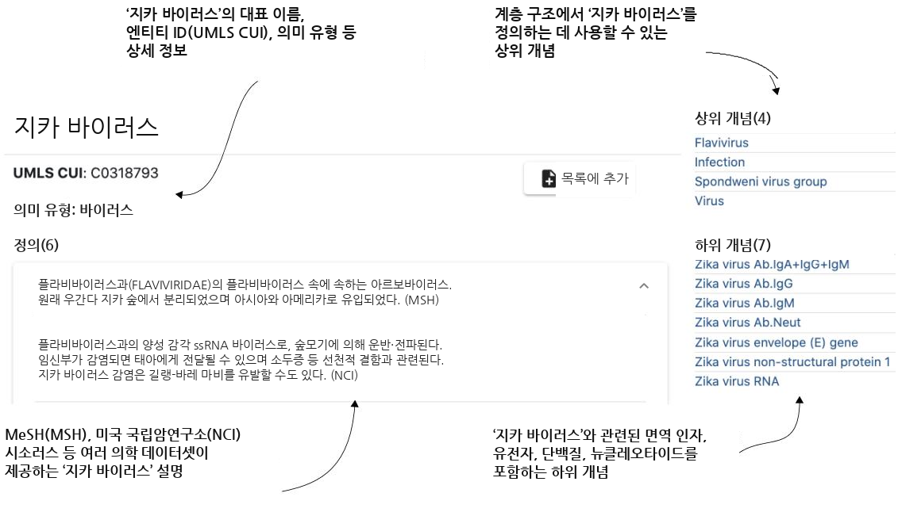  
그림 7.1 지카 바이러스 엔터티에 대한 정보를 보여 주는 UMLS 웹사이트의 스크린샷. 이 정보에는 이름, ID(개념 고유 식별자 [CUI]), 의미 유형, 그리고 정의, 상위 개념 및 하위 개념의 집합이 포함됩니다.

이 장에서는 의료 도메인의 텍스트 콘텐츠에 개체명 모호성 해소 (named entity disambiguation, NED) 모델을 적용하는 방법을 보여 줍니다. 유럽위원회 보건식품안전총국(Directorate-General for Health & Food Safety, DG SANTE)과 수행한 프로젝트 경험을 바탕으로, 먼저 모호성 해소와 생의학 온톨로지와의 상호 연결 예시를 통해 NED 모델의 개요를 제시합니다. 다음으로, 이 과정에 포함되는 문서와 온톨로지를 소개합니다. 마지막으로, 여러 기술 문서에서 정보를 추출하고 통합된 관점으로 통합할 수 있는 실제 지식 그래프(KG)를 자동으로 구축하는 방법을 보여 줍니다.

#### 연습문제


이 연습문제는 NED의 다양한 관점을 파악하는 데 도움이 됩니다. 지카 예시에서 우리는 하나의 용어가 문맥에 따라 서로 다른 개체를 가리킬 수 있음을 보았습니다. 그러나 반대 상황도 발생할 수 있습니다. 어떤 경우에는 서로 다른 용어가 동일한 개체를 가리킬 수 있습니다. 그 예를 찾아볼 수 있습니까? (힌트: 이 장에서 언급된 의료 개체의 예를 확인해 보십시오.) KG는 이러한 경우를 모델링하는 데 어떻게 유용합니까?

### 7.2 개체명 명확화 이해


지식 베이스는 특정 도메인에서 개체의 구조화된 표현을 수집하는 데 중심적인 역할을 합니다. NER은 개체명으로 인식된 언급과 관련된 불확실성을 해소하지 않으므로, 텍스트의 언급을 참조 지식 베이스의 올바른 개체에 연결해야 합니다. 이러한 연결 단계는 NED 시스템을 통해 가능하며, 일반적으로 세 가지 주요 단계가 포함됩니다.

1 후보 선택

2 후보 순위화

3 온톨로지 통합

그림 7.2는 전형적인 KG 기반 NED 시스템의 개념적 모델을 보여줍니다.  
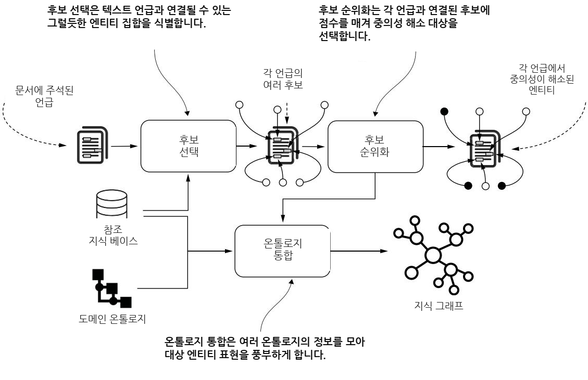  
그림 7.2 후보 선택, 후보 순위화, 온톨로지 통합이라는 세 가지 주요 단계를 포함하는 NED 시스템의 아키텍처

후보 선택은 인식된 개체명 언급에 대해 가장 적합한 후보를 식별합니다. 이러한 선택은 유용한 구조적 정보를 포함하는 기존 지식 베이스를 대상으로 수행되며, 서로 다른 개체를 정확하게 식별할 수 있게 합니다. 후보 순위화는 문맥 정보, 즉 인식된 개체 주변의 단어를 기반으로 각 후보에 점수를 부여합니다. 가장 높은 점수를 얻은 개체가 탐지된 언급의 대상 개체를 나타냅니다.

우리는 개체명 명확화 (named entity disambiguation)를 위해 scispaCy [4]라는 Python 기반 라이브러리를 사용할 것입니다. scispaCy에 구현된 모델은 개체명을 인식하고, 지식 베이스를 대상으로 후보를 선택하며, 이러한 후보의 순위를 매겨 대상 개체를 식별할 수 있습니다. 다음 목록은 scispaCy 모델을 사용하는 Python 스크립트의 예를 보여줍니다.

```python
Listing 7.1 Selecting and ranking candidates with the scispaCy model
import spacy
from scispacy.linking import EntityLinker
nlp = spacy.load("en_core_sci_md")
nlp.add_pipe("scispacy_linker",
config={"resolve_abbreviations": True, "linker_name": "umls"})
linker = nlp.get_pipe("scispacy_linker")
linker_dict = linker.kb.cui_to_entity
doc = nlp("""In the week of 13 April, Belize reported for the first time
mosquito-borne Zika virus transmission. Update on the observed increase
of congenital Zika syndrome and other neurological complications
Microcephaly and other fetal malformations potentially associated with
Zika virus infection.""")
for ent in doc.ents:
if "Zika" in ent.text:
print("Recognized entity:", ent.text, ent.start_char, ent.end_char)
print("Ranked target candidates:")
for kb_ent in ent._.kb_ents:
print('-', linker_dict[kb_ent[0]][0], linker_dict[kb_ent[0]][1])
```

이 코드를 실행하면 관련된 순위화된 후보 목록을 가져옵니다.

목록 7.2 후보 선택 및 순위화에 대한 scispaCy 모델 결과   
인식된 개체: Zika virus 75 85   
순위화된 대상 후보:   
- C0318793 Zika Virus ≤ 문자 75와 85 사이에서 탐지된 “Zika   
C0276289 Zika Virus Infection Virus” 언급의 대상 개체   
C4687930 Zika Virus Antibody Measurement   
인식된 개체: congenital Zika syndrome 135 159   
순위화된 대상 후보:   
- C4546023 Congenital Zika Syndrome < 문자 135와 159 사이에서 탐지된 “Congenital   
Zika Syndrome” 언급의 대상 개체   
인식된 개체: Zika virus infection 268 288   
순위화된 대상 후보:   
- C0276289 Zika Virus Infection < 문자 268과 288 사이에서 탐지된 “Zika Virus   
- C0318793 Zika Virus Infection” 언급의 대상 개체   
- C4687930 Zika Virus Antibody Measurement

각각의 인식된 개체는 scispaCy 모델 점수를 사용해 순위화된 후보 목록과 연결됩니다. 각 언급에 대한 첫 번째 결과가 모델이 도달한 최선의 결과입니다. “Zika”의 각 언급에 서로 다른 UMLS 개체 ID가 연결되어 있다는 점에 주목하십시오. 이제 탐지된 각 개체가 UMLS 지식 베이스에 연결된 주석 텍스트를 얻을 수 있습니다.

추출된 정보를 사용하기 전 마지막 단계는 온톨로지 통합 (ontology integration)입니다. 이는 추출된 개체의 구조적 정보와 문맥적 정보가 고유한 KG로 통합되는 도메인 온톨로지 (domain ontologies)의 지식을 포함하는 과정입니다. UMLS는 여러 출처의 용어, 분류, 코딩 표준을 제공합니다. 이를 통해 한 출처에서 시작하여 다른 출처의 정보에 접근하고 탐색할 수 있는 상호운용 가능한 (interoperable) 생의학 정보 시스템을 만들 수 있습니다. UMLS가 이러한 정보를 수집하는 방식을 더 잘 이해하기 위해, 다음은 UMLS 항목의 예시입니다.

#### 목록 7.3 UMLS 엔티티 파일의 샘플 항목 목록 7.3


C0276289|ENG|S|L0388876|VC|S0517846|Y|A2985635|8552019|3928002||   
SNOMEDCT\_US|PT|3928002|Zika virus disease|9|N|256|   
C0276289|ENG|P|L13115709|PF|S16069662|N|A27369917||C128423||   
NCI|PT|C128423|Zika Virus Infection|0|N|256|   
C0276289|ENG|S|L0392793|VW|S16069660|Y|A26676017||M000613823|D000071243|   
MSH|ET|D000071243|Zika Fever|0|N|256

우리는 온톨로지 통합에 가장 중요한 필드를 강조했습니다. 왼쪽부터 엔티티 ID, 온톨로지, 그리고 해당 온톨로지에서 엔티티 ID와 연관된 이름입니다. 첫 번째 항목에서 볼 수 있듯이, 지카 바이러스 감염 엔티티를 나타내는 UMLS ID는 SNOMEDCT\_US [5] 온톨로지의 ID 3928002에 매핑되며, 이 온톨로지는 이 엔티티의 가능한 이름 중 하나인 Zika virus disease를 정의합니다. SNOMEDCT\_US, 즉 Systematized Nomenclature of Medicine (SNOMED)은 450,000개 이상의 개념을 포괄하는 가장 포괄적인 다국어 임상 용어 체계 중 하나입니다. 또한 이러한 개념들 사이에 풍부한 관계 유형 집합을 제공하며, 여기에는 CAUSATIVE AGENT 및 FINDING SITE와 같이 임상적 관점에서 흥미로운 의미적 연결도 포함됩니다. 이제 SNOMED 엔티티/관계 설명과 에지(또는 트리플)를 포함하여 SNOMED 온톨로지와 관련된 두 가지 파일 샘플을 살펴보겠습니다. 첫 번째는 SNOMED 설명 파일의 샘플입니다.

```csv
Listing 7.4 Samples from the SNOMED description file
84087010 20020131 1 900000000000207008 50471002
en 900000000000013009 Zika virus 900000000000017005
8552019 20020131 1 900000000000207008 3928002
en 900000000000013009 Zika virus disease 900000000000017005
367784012 20020131 1 900000000000207008 246075003
en 900000000000013009 Causative agent 900000000000020002
```

SNOMED ID와 관련 이름을 볼 수 있습니다. 이 파일에는 엔티티에 대한 ID와 엔티티 간의 관계가 모두 포함되어 있습니다. 이 샘플에서 첫 번째 항목은 엔티티(Zika virus)를 나타내고, 세 번째 항목은 관계(Causative agent)를 나타냅니다.

이제 에지 파일의 항목은 다음과 같습니다.

<table><tr><td colspan="3">목록 7.5 SNoMED 에지 파일의 샘플</td></tr><tr><td></td><td></td><td>1</td></tr><tr><td>769900023 3928002</td><td>20020131 50471002</td><td>900000000000207008 0 246075003</td></tr><tr><td></td><td></td><td></td></tr><tr><td>900000000000011006</td><td colspan="2">900000000000451002</td></tr></table>

강조된 값은 트리플 요소를 나타내며, 여기에는 Zika virus disease의 소스 ID(3928002), Zika virus의 대상 ID(50471002), 그리고 Causative agent를 나타내는 관계 ID(246075003)가 포함됩니다.

외부 온톨로지를 통합함으로써, NED 모델의 출력은 정보를 탐색하고 발견하며, 비정형 지식과 정형 지식을 통합된 관점에서 연결할 수 있게 해 주는 지식 그래프(KG)를 구축하기 위한 진입점이 됩니다. 그림 7.3은 이전의 모든 정보 조각을 포함하는 이 지식 그래프의 직관적인 예를 보여줍니다.

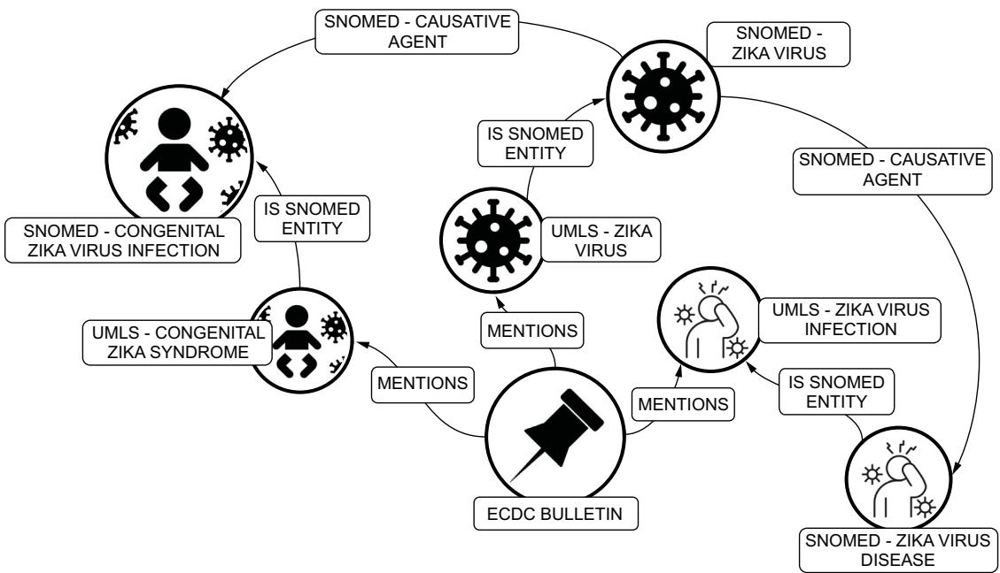  
그림 7.3 scispaCy 모델, UMLS, SNOMED 온톨로지로 처리한 텍스트의 정보를 통합하여 구축한 예시 지식 그래프

우리의 예시 지식 그래프는 유럽연합에서 인체 유래 물질(SoHO)을 관리하는 것과 관련된 의료 표준 및 규정의 정의와 관련된 실제 시나리오에서 고급 분석을 수행할 수 있게 해 줄 것입니다. 그림 7.4는 비즈니스 이해에서 지식 그래프 생성 및 질의에 이르기까지, 이 장에서 설명하는 과정을 보여주는 정신 모델을 제공합니다. 다른 장들에서 논의했듯이, 이 정신 모델은 2장에서 소개한 바와 같이 지식 그래프에 맞게 조정된 CRISP-DM 모델의 명세를 나타냅니다.

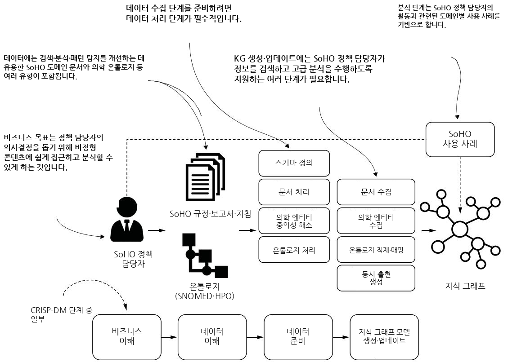  
그림 7.4 비즈니스 목표 이해에서부터 우리의 분석에 유용한 KG 질의 정의에 이르기까지, CRISP-DM 모델의 세부 명세로서 KG 구축 과정을 설명하는 정신 모델 (mental model)

예시 비즈니스 응용을 소개하기 전에, 6장에서 소개한 LLM의 기회와 한계를 현재 사례에 적용하여 다시 정리하겠습니다. LLM은 scispaCy를 사용하는 것에 대한 현대적 대안을 나타내지만, 이 맥락에서 가치를 더하려면 KG 기술과 결합되어야 합니다.

### 7.3 도메인 기반 NED와 LLM


앞서 우리는 텍스트 콘텐츠에서 개념을 탐지하는 역량이 의사결정을 지원하는 IAS의 필수 기능이라고 논의했습니다. 이러한 이유로, 우리는 LLM 기술에 기반한 가장 대표적인 애플리케이션인 ChatGPT가 이 목표를 달성할 수 있는 능력을 검증하기 위해 간단한 실험을 수행했습니다.


다음은 우리의 실행 예제를 바탕으로 정의한 기본 프롬프트입니다.

AN “4월 13일 주에 벨리즈는 처음으로 모기 매개 지카 바이러스 전파를 보고했습니다. 선천성 지카 증후군 및 기타 신경학적 합병증의 관찰된 증가에 대한 업데이트. 지카 바이러스 감염과 잠재적으로 관련된 소두증 및 기타 태아 기형.” 탐지할 수 있는 모든 의학 엔터티의 중의성을 해소하십시오.

ChatGPT의 출력은 다음과 같습니다.


지카 바이러스

모기 매개 전파

선천성 지카 증후군

신경학적 합병증

소두증

태아 기형

참고 ChatGPT는 지속적으로 진화하는 생성 모델 (generative model)에 기반합니다. 이러한 이유로, 유사한 테스트와 실험 중에도 서로 다른 응답을 받을 수 있습니다.

이 초기 결과에서 볼 수 있듯이, 모델은 첫 번째 “Zika” 언급이 바이러스 엔터티를 가리키고 마지막 언급이 바이러스 감염을 가리킨다는 점을 완벽하게 인식하지는 못합니다. 의학 도메인의 복잡성을 고려할 때, 우리는 모델이 이러한 표현의 의미를 “이해한다”고 확신할 필요가 있습니다. NED 관점에서, 우리는 이러한 엔터티가 적절한 지식 베이스에 올바르게 매핑되는지 확인해야 합니다. 우리는 이 측면을 테스트하기 위해 추가 프롬프트를 정의했습니다.

#### AN 이러한 추출된 엔터티에 UMLS ID를 할당할 수 있습니까?

#### 답변은 다음과 같았습니다:


AI 언어 모델로서 저는 추출된 엔터티에 UMLS ID를 할당할 수 없습니다. 그러나 UMLS 메타시소러스 (UMLS Metathesaurus)는 다양한 생의학 온톨로지의 개념에 대한 정규화된 명칭과 매핑을 제공하는 생의학 및 보건 온톨로지 자원입니다. 이는 추출된 엔터티를 해당 UMLS 개념에 매핑하고 그 고유 식별자(UMLS ID)를 얻는 데 사용될 수 있습니다. 이를 위해서는 UMLS 자원을 활용하는 데 필요한 도메인 특화 지식과 전문성이 요구됩니다.

알 수 있듯이, UMLS 지식 베이스는 현재 ChatGPT 모델에 통합되어 있지 않습니다. 마지막 문장이 특히 중요합니다. 이는 우리가 UMLS 자원에 대한 도메인 특화 지식과 전문성을 특징으로 하는 모델을 개발해야 함을 시사합니다. 우리의 예에서는 이러한 특징을 포함하며 IAS에 쉽게 통합될 수 있는 접근법에서 NED 기술과 KG를 결합할 것입니다.

### 7.4 비즈니스 및 도메인 이해


그림 7.5는 비즈니스 이해 단계를 보여줍니다. 우리의 실제 시나리오는 SoHO 관리에서 표준과 규정의 정의와 관련되어 있습니다. 이러한 물질에는 다양한 의료 치료에 사용될 수 있는 혈액, 조직, 세포, 장기가 포함됩니다. SoHO 기반 치료는 생명을 구하고(예: 수혈), 삶의 질을 향상시키며(예: 신장 이식), 나아가 생명의 탄생을 돕기도 합니다(생식세포 및 체외수정). KG 기술은 표현의 유연성과 여러 출처를 통합된 관점으로 조화시키는 기능 등을 통해 이 시나리오의 특정 요구사항에 대응할 수 있습니다.

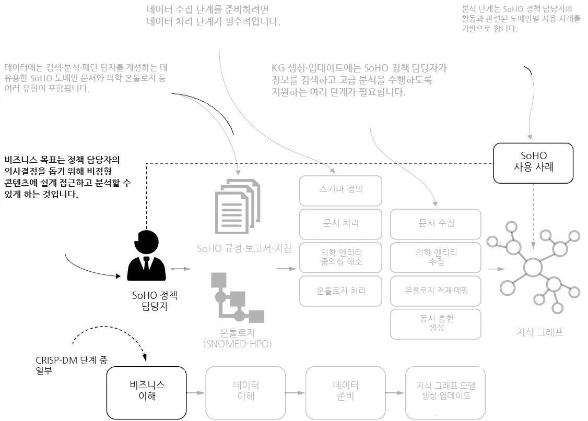  
그림 7.5 비즈니스 이해는 우리가 해결하고자 하는 문제를 명확히 합니다. 이 단계는 기술적 측면과 엄밀하게 관련되어 있지는 않지만, 다음 단계들을 위해 근본적으로 중요합니다.

#### 7.4.1 맥락


의료 영역에서 중요한 분야는 수혈, 이식, 의학적 보조생식술을 받는 환자의 안전입니다. 물질 기증에서 환자 적용에 이르기까지, 혈액, 조직 및 세포 (BTC)와 같은 구성 요소가 EU 전역의 치료에 사용됩니다. 그림 7.6은 이 의료 부문의 다양한 측면을 보여 줍니다. 기증자 평가에서 시작하여 조달, 품질 기준, 유통, 추적성, 생물감시 (biovigilance)를 포함한 여러 차원을 분석할 수 있습니다.

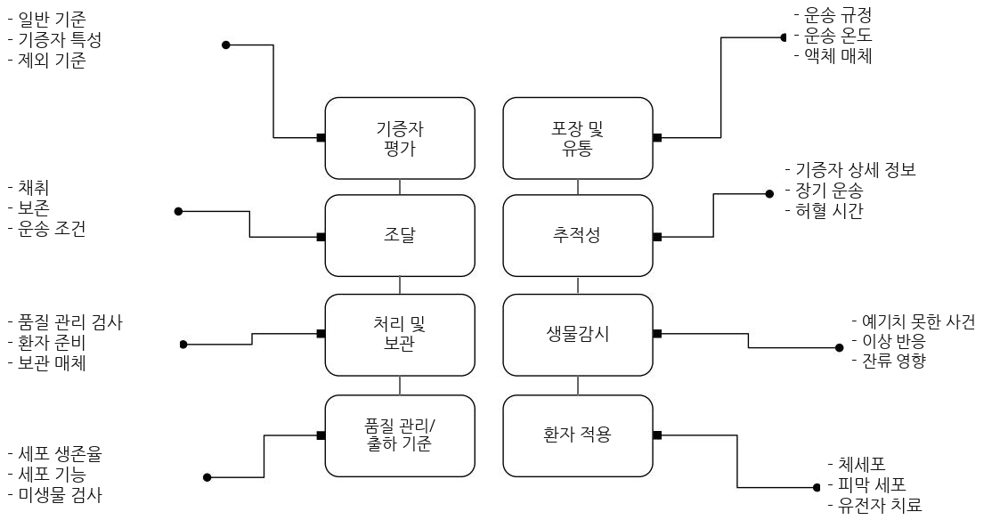  
그림 7.6 (가운데) SoHO 공급망의 단계. (왼쪽 및 오른쪽) 이러한 단계의 특성.

BTC 부문은 기증을 시민에게 의존하지만, COVID-19 팬데믹과 같은 공중보건 위기 동안에는 그 가용성이 크게 감소합니다. 동시에 BTC 품질은 인체유래물질 (SoHO)을 수집, 검사, 처리하는 새로운 방법에 맞추어 최신 상태로 유지되어야 합니다. 새로운 위험과 기술 동향은 계속 등장할 것이므로, 적절한 요구사항을 지속적으로 제공하기 위해 “효과적으로 구현되고, 미래에 대비하며, 위기에 강하고, 충분히 민첩한” [6] 법적 프레임워크가 필요합니다.

2022년에 유럽연합 집행위원회 (EC)는 인간 적용을 위한 SoHO의 표준과 품질에 관한 규정안을 발표했습니다. 이 제안은 SoHO 치료를 받는 환자의 안전을 보장하고, 피할 수 있으며 예측 가능한 위험으로부터 환자를 보호하는 것을 목표로 합니다. 검토된 대안들 중에서 SoHO 이해관계자들이 최선의 선택으로 확인한 것은 유럽질병예방통제센터 (ECDC)와 유럽의약품품질위원회 (EDQM)와 같은 기관의 전문성에 기반한 공동 규정이었습니다. 이 두 기관은 상호보완적인 역할을 수행합니다. ECDC는 일반적으로 보건 감시, 보건 위협에 대한 대응, 새로운 동향, SoHO의 안전과 관련된 간략한 보고서를 제공합니다. EDQM은 전염성 질병 전파 위험을 넘어서는 품질 및 안전 문제를 다루기 위한 상세한 지침을 발표하고, SoHO의 수집, 처리, 보관, 유통을 위한 기술 표준을 제공합니다. 이 두 종류의 텍스트 문서에서 유용한 정보와 맥락적 세부 사항을 추출하는 능력은 규칙을 식별하고, 환자의 안전을 보장하며 피할 수 있는 위험으로부터 환자를 보호하는 규정을 신속하게 업데이트하는 데 근본적으로 중요합니다.

#### 7.4.2 사용 사례 정의


췌장 섬—랑게르한스섬이라고도 알려져 있습니다—의 이식과 관련된 구체적인 지침 및 가능한 위험을 식별해야 하며, 동시에 특정 지역에서 지카 바이러스의 확산을 분석해야 하는 보건 정책 담당자를 상상해 봅시다. 앞으로 살펴보겠지만, 명명 개체 중의성 해소 (NED) 및 지식 그래프 (KG) 기술을 도입하면 이러한 유형의 활동을 지원할 수 있습니다.

#### 개념적 검색

개념적 검색 (conceptual search)은 사용자가 정확한 키워드가 아니라 의미를 기반으로 정보를 찾을 수 있게 하는 검색 방법입니다. 이는 동일한 개체를 가리키는 서로 다른 표현(예: “췌장 섬”과 “랑게르한스섬”)을 조정하거나, 이름은 유사하지만 의미가 다른 개체들을 구별할 수 있습니다.

#### 구조화된 지식 기반 검색

구조화된 지식 기반 검색 (structured knowledge-based search)은 도메인 온톨로지에서 구조화된 형식화 지식을 사용하여 텍스트 내 정보를 검색합니다. 이 정보는 여러 문서의 서로 다른 텍스트 조각 사이에 비자명한 관계를 생성할 수 있게 합니다. 예를 들어, 온톨로지 경로를 탐색함으로써 사용자는 당뇨병으로 인해 발생하는 다양한 유형의 질환을 식별하고, 이러한 질환을 언급하는 모든 문서를 검색하며, 관련 텍스트 내용에 대한 완전한 개요를 얻을 수 있습니다.

#### KG 기반 해석 가능성 및 발견


온톨로지의 형식화된 지식에 포함된 관계나 경로는 텍스트 내용의 핵심 정보를 반영하거나(해석 가능성), 텍스트의 정보를 풍부하게 하거나 완성하는 연결을 통해 통찰을 제공할 수 있습니다(발견). 예를 들어, 해석 가능성의 관점에서 제1형 당뇨병(T1D)과 랑게르한스섬 엔터티는 전자가 후자에 영향을 미치는 증후군이기 때문에 함께 나타납니다. 발견의 관점에서 보면, AIDS와 T1D 같은 질병은 T1D와 관련된 일부 병리가 면역계를 포함할 수 있기 때문에 함께 나타날 수 있습니다.

#### 새로운 지식의 발견


동시 출현 엔터티에 관한 지식이 아직 온톨로지 (ontologies)로 공식화되지는 않았지만 EDQM 지침에서 이용 가능하거나 해당 분야의 발견과 관련되어 있을 때 더 흥미로운 예가 나타납니다. 예를 들어, 췌장섬 엔터티는 SoHO 관리와 관련된 정보와 함께 언급됩니다(그림 7.6 참조). 또한 COVID-19와 당뇨병처럼 감염성 질환과 비감염성 질환 사이의 이례적인 동시 출현에 관심이 있는 SoHO 이해관계자는 동일한 (그래프 기반) 보기에서 ECDC 회보를 참조하여 특정 회원국에서 감염이 증가하고 있는지 파악하고 장기 및 조직 수입을 차단할지에 관한 결정을 내릴 수 있습니다.

### 7.5 데이터 이해


SoHO 영역에서 IAS를 개발하려면 다양한 저장소의 이질적인 정보를 하나의 통합된 출처로 통합하여, 비정형 데이터와 의미론적으로 구조화된 데이터를 모두 결합해야 합니다(그림 7.7 참조). 이 절에서는 EC와 그 산하 기관들이 공개한 문서와, 이 맥락에서 채택된 SNOMED 및 인간 표현형 온톨로지 (Human Phenotype Ontology, HPO)와 같은 의학 온톨로지 (medical ontologies)에 대한 개요를 제공합니다.

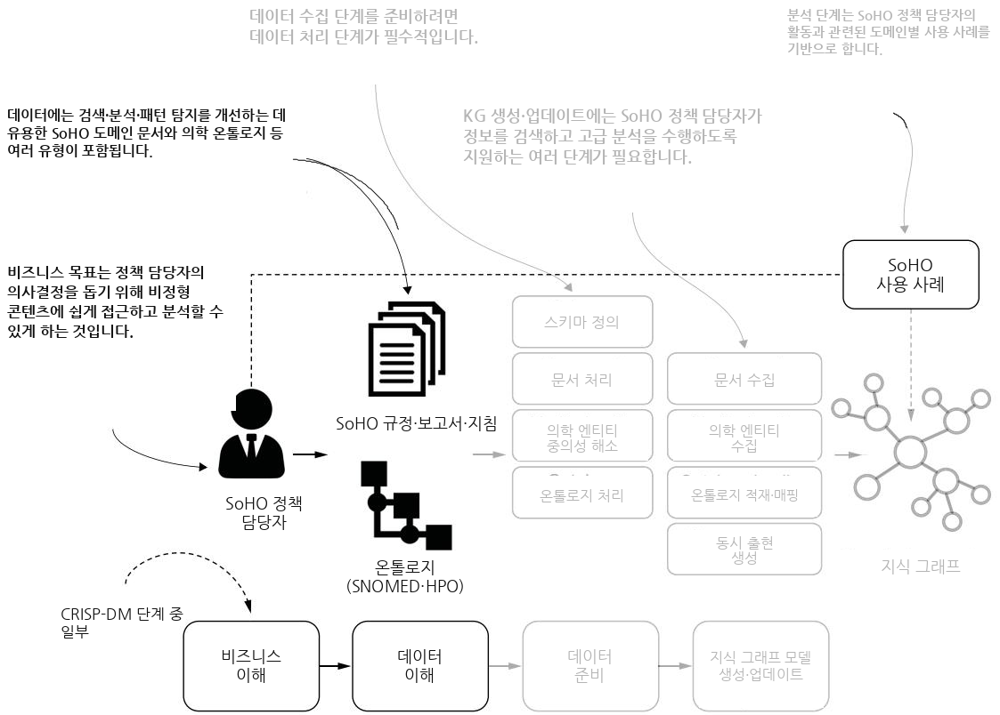  
그림 7.7 데이터 이해 단계는 이용 가능한 정보의 특성을 파악할 수 있게 합니다. 예시 시나리오에서 이용 가능한 데이터에는 EC와 그 산하 기관들이 공개한 SoHO 규정, 보고서 및 지침뿐 아니라 SNOMED 및 HPO와 같은 의학 온톨로지가 포함됩니다.

#### 7.5.1 비정형 데이터


비정형 콘텐츠에는 여러 유형의 문서가 포함됩니다.

BTC 분야의 영향 평가 보고서 및 관련 규제 제안

규제 제안에 대한 이해관계자 입장 보고서

EDQM의 SoHO 관리를 위한 지침 및 뉴스레터

감염병 진행 상황을 모니터링하기 위한 ECDC의 보고서 및 공보

이 문서들의 특성을 살펴봄으로써 처리되어 지식 그래프 (KG)로 변환되는 비정형 정보의 유형을 명확히 하겠습니다. 이는 이러한 문서를 기반으로 할 수 있는 잠재적 사용 사례에 대한 직관을 형성하는 데 도움이 될 것입니다.

EC가 제공하는 영향 평가 보고서는 EU의 BTC 분야 문제를 둘러싼 정치적·법적 맥락을 개괄합니다. 이 보고서들은 기존 법률을 개정하기 위한 아이디어를 수집하고, BTC 공급 중단과 같은 문제를 부각하며, 새로운 질병과 과학기술의 발전을 논의하고, BTC 부문 개선을 위한 목표를 제시하며, 정책 선택지를 분석하고, 규정을 제안합니다.

규제 제안은 입장문, 교훈, 일반 의견을 제공하는 이해관계자들에 의해 평가됩니다. 예를 들어, 한 입장문에서 국제줄기세포연구학회(International Society for Stem Cell Research, ISSCR)는 검증되지 않은 세포 치료와 임상적 효과에 대해 근거 없는 주장을 하는 사업체에 대한 우려를 제기했습니다. 이 문서는 EU 전문가 기구가 다른 규제기관과 협의하고 국제 규범과 표준을 조화시켜야 하며, 새로운 제안에 대한 피드백을 장려하기 위해 지침 문서에 대한 협의 절차를 간소화해야 한다고 제안했습니다.

EDQM의 “인체 적용을 위한 조직 및 세포의 품질과 안전성에 관한 지침(Guide to the Quality and Safety of Tissues and Cells for Human Application)” [7]과 같은 문서는 의료 전문가에게 기술적 지침을 제공합니다. 이 지침은 EU 지침과 부합하는 최소 기준, 현재의 과학 지식과 일치하는 모범 사례, 전문가 의견, 국제 프로젝트의 결과를 제시합니다.

ECDC의 주간 감염병 위협 보고서(communicable disease threat reports, CDTRs)는 EU에 중요한 감염병과 관련된 유행병 정보 활동을 통해 수집된 모든 데이터를 통합합니다. 이 요약은 또한 유럽에 영향을 미칠 수 있는 전 세계 상황 및 감염병 역학의 변화에 관한 정보를 제공합니다.

#### 7.5.2 도메인 온톨로지

3장에서는 서로 다른 출처를 통합하기 위한 참조 스키마로서 온톨로지 (ontologies)의 채택을 소개했습니다. 우리가 다루는 시나리오의 범위에서는 UMLS, SNOMED, HPO 온톨로지를 사용합니다.

#### 통합 의학 언어 시스템 (UMLS)


UMLS는 생의학 도메인의 여러 통제 어휘 (controlled vocabularies)로 구성된 메타 시소러스 (meta-thesaurus)입니다. 이는 이러한 어휘들 사이의 매핑 구조를 제공하여 다양한 용어 체계 간 번역을 단순화합니다. 우리의 코드 예제는 UMLS의 2022AA 버전을 사용합니다.

우리의 시나리오에서는 다음 두 파일을 사용합니다.

MRCONSO.RRF—여러 어휘에서 가져온 생의학 개체 목록입니다. 각 개체명에 대해 그 이름이 유래한 개체 ID를 포함합니다.

MRSTY.RRF—UMLS 개체를 범주화하는 의미 유형 (semantic types) 목록입니다.

이 파일들은 구분자 분리 값 (delimiter-separated values, DSV) 형식으로 되어 있으며, 구분자는 세로 막대 또는 파이프 (|)입니다. 따라서 전통적인 CSV 파일처럼 처리할 수 있습니다. 목록 7.6과 7.7은 MRCONSO.RRF와 MRSTY.RRF의 샘플을 보여줍니다.

#### 목록 7.6 UMLS MRCONSO.RRF 파일의 샘플 목록 7.6 UMLS MRCONSO.RRF 파일의 샘플


C0022131|ENG|P|L0022136|PF|S0054489|N|A2883106|130586015|78696007||   
SNOMEDCT\_US|SY|78696007|Islets of Langerhans|9|N|256   
C0022131|ENG|S|L7933100|PF|S9245679|Y|A15439829||76489||   
FMA|SY|76489|Insulae pancreaticae|0|N|256   
C0022131|ENG|S|L0826072|PF|S0870037|N|A0928304||||   
RCD|PT|Xa1Ij|Endocrine pancreatic structure|3|N|256|   
C0011311|ENG|P|L0011312|VC|S0000287|Y|A2872183|63434017|38362002||   
SNOMEDCT\_US|SY|38362002|Dengue fever|9|N|256|   
C0011311|ENG|S|L0286841|VO|S14576929|N|A24118377||M0005831|D003715|   
MSH|PM|D003715|Break Bone Fever|0|N|256|   
C0011311|ENG|S|L0294785|VW|S4069775|Y|A4402397||||   
ICPC2ICD10ENG|PT|MTHU021113|dandy fever|3|N|256|   
C0018681|ENG|S|L0290365|PF|S0362835|N|A2926207|41994011|25064002||   
SNOMEDCT\_US|SY|25064002|Cephalgia|9|N|2304|   
C0018681|ENG|S|L1406212|VO|S1680379|Y|A1641924||M0009824|D006261|   
MSH|PM|D006261|Cranial Pains|0|N||   
C0018681|ENG|P|L0018681|PF|S0046854|N|A24679981|||HP:0002315|   
HPO|PT|HP:0002315|Headache|0|N|256|

MRCONSO.RRF는 의학 개체와 관련된 온톨로지, 코드, 개체명에 관한 정보를 집계합니다. 각 항목은 각 행의 첫 번째 열에 위치한 UMLS ID로 식별됩니다. scispaCy 모델이 이러한 ID를 사용하여 모호성 해소 결과를 제공하므로, 개체명 모호성 해소 (NED)를 위해 이것이 필요합니다. 목록 7.6은 랑게르한스섬, 뎅기열, 두통을 의미하는 두부통과 관련된 행들의 집합을 보여줍니다.

#### 온톨로지


이 예제의 개체명과 관련된 코드와 이름은 다음 출처에 위치합니다.

 SNOMED, https://www.nlm.nih.gov/healthit/snomedct/us\_edition.html

해부학 기초 모델 (Foundational Model of Anatomy, FMA), http://si.washington.edu/projects/ fma

Read Codes (RC), http://www.connectingforhealth.nhs.uk/systemsandser vices/data/readcodes/

 의학 주제 표목 (Medical Subject Headings, MSH), https://www.nlm.nih.gov/mesh/

#### (계속)


일차의료 국제분류 제2판; 국제질병분류 제10차 개정판 (ICPC2ICD10ENG), https://www.who.int/ standards/classifications/other-classifications/international-classification-of -primary-care

HPO, https://hpo.jax.org/app/

다음으로, 이 목록은 랑게르한스섬, 뎅기열, 두통이 UMLS에서 어떻게 범주화되는지를 보여줍니다.

#### 목록 7.7 UMLS MRSTY.RRF 파일의 예


C0022131|T023|A1.2.3.1|Body Part, Organ, or Organ Component|AT19674993|256|C0011311|T047|B2.2.1.2.1|Disease or Syndrome|AT41932582|256C0018681|T184|A2.2.2|Sign or Symptom|AT17639733|256|

MRCONSO.RRF의 각 항목에 대해 MRSTY.RRF 파일은 의미 유형 (semantic type) 코드와 이름을 제공합니다. 여기서 “Body Part, Organ, or Organ Component”(T023), “Disease or Syndrome”(T047), “Sign or Symptom”(T184)은 각각 랑게르한스섬, 뎅기열, 두통의 의미 유형에 해당합니다.

#### 의학 체계화 명명법 (SNOMED)


SNOMED는 450,000개 이상의 개념과 그들 사이의 관계 유형을 포함합니다. 이는 UMLS 무료 라이선스를 사용하여 제공되며 https://www.nlm.nih.gov/healthit/snomedct 에서 다운로드할 수 있습니다. 우리는 2022년 9월 1일에 공개된 SNOMED 버전을 사용했습니다.

우리의 시나리오에서는 다음 두 파일을 사용합니다.

sct2\_Description\_Full-en\_US1000124\_20220901.txt—엔터티 간 관계를 정의하는 삼중항 파일에 형성된 모든 엔터티 이름(및 별칭)과 관계

sct2\_Relationship\_Full\_US1000124\_20220901.txt—SNOMED 엔터티 간 모든 관계를 정의하는 삼중항 집합(및 기타 메타데이터)입니다. 각 엔터티와 관계는 숫자 코드로 식별됩니다.

이 파일들은 TSV 형식을 사용합니다. 목록 7.8과 7.9는 샘플을 제공합니다.

#### 목록 7.8 SNOMED 설명 파일의 샘플


<table><tr><td>130586015 20020131 1</td><td>900000000000207008</td><td>78696007</td></tr><tr><td>en 900000000000013009</td><td>Islets of Langerhans</td><td>900000000000017005</td></tr><tr><td>63434017 20020131 1</td><td>900000000000207008</td><td>38362002</td></tr><tr><td>en 900000000000013009</td><td>Dengue fever</td><td>900000000000017005</td></tr><tr><td>41993017 20020131 1</td><td>900000000000207008</td><td>25064002</td></tr><tr><td>en 900000000000013009</td><td>Cephalalgia</td><td>900000000000020002</td></tr></table>

여기서는 UMLS가 생성된 데이터 소스에서 정보가 처음에 어떻게 제공되는지를 볼 수 있습니다. SNOMED 항목에는 각각 랑게르한스섬 (Islets of Langerhans), 뎅기열 (Dengue fever), 두통 (Cephalalgia)에 대한 코드와 이름이 포함됩니다. 다음 목록은 이들이 의미 관계에서 소스 엔터티 또는 대상 엔터티가 될 수 있음을 보여 줍니다.

<table><tr><td colspan="5">목록 7.9 SNOMED 관계 파일의 샘플</td></tr><tr><td></td><td></td><td></td><td></td><td></td></tr><tr><td>169174023</td><td>20020131</td><td>1</td><td>900000000000207008</td><td>360555004 900000000000451002</td></tr><tr><td>78696007</td><td>0 116680003</td><td></td><td>900000000000011006</td><td></td></tr><tr><td>182243021</td><td>20020131</td><td>1</td><td>900000000000207008</td><td>20927009</td></tr><tr><td>38362002</td><td>0 116680003</td><td></td><td>900000000000011006</td><td>900000000000451002</td></tr><tr><td>424787021</td><td>20020131</td><td>1</td><td>900000000000207008</td><td>54012000</td></tr><tr><td>25064002</td><td>0 116680003</td><td></td><td>900000000000011006</td><td>900000000000451002</td></tr></table>

이 경우 랑게르한스섬, 뎅기열, 두통은 IS\_A 관계(ID 116680003)의 대상 엔터티입니다. 소스 엔터티는 각각 내분비 췌장 세포 (Endocrine pancreas cell)(ID 360555004), 뎅기 출혈열 (Dengue hemorrhagic fever)(ID 20927009), 외상후 두통 (Posttraumatic headache)(ID 54012000)입니다.

#### 인간 표현형 온톨로지 (HPO)


HPO 온톨로지 [8]는 hpo.owl(http:// purl.obolibrary.org/obo/hp.owl)이라는 RDF/XML 파일로 공개됩니다. 이는 표현형 이상에 관한 표준화된 정보를 포함합니다. 다음 목록은 T1D와 관련된 파일의 하위 집합을 보여주며, 가독성을 높이기 위해 데이터는 RDF/XML에서 터틀 (Turtle, Terse RDF Triple Language)로 직렬화되었습니다.

#### 목록 7.10 hpo.owl의 T1D 세부 정보


T1D(URI obo:HP\_0100651)를 정의합니다.   
obo:HP\_0100651 a owl:Class ; < 온톨로지 클래스 질병으로   
rdfs:label "Type I diabetes mellitus" ^^xsd:string ; 자연어로 설명합니다.   
obo:IAO\_0000115 "췌장이 인슐린을 거의 또는 전혀 생산하지 않는 만성 질환..." ^^xsd:string ; <   
oboInOwl:created\_by "doelkens"^^xsd:string ; < 저자와 관련된 메타데이터   
oboInOwl:creation\_date "2010-12-29T06:37:55Z"^^xsd:string ;   
oboInOwl:hasDbXref "MSH:D003922"^^xsd:string, (“doelkens”)의 외부 ID   
"SNOMEDCT\_US:46635009" ^^xsd:string, 이 항목의   
data "UMLS:C0011854" ^^xsd:string ;   
sources oboInOwl:hasExactSynonym "Diabetes mellitus Type I"^^xsd:string,   
that refer "Juvenile diabetes mellitus" ^^xsd:string,   
T1D를 하위 클래스로 정의합니다.   
to T1D "Type 1 diabetes",   
표현형 특징의   
"Type I diabetes"; 식별 기준은   
oboInOwl:hasRelatedSynonym "Insulin-dependent diabetes obo:HP\_0000819 URI,   
mellitus"^^xsd:string ; 이는   
oboInOwl:id "HP:0100651"^^xsd:string ; 당뇨병에 해당합니다.   
rdfs:comment "제1형 당뇨병의 발병은 일반적으로 청소년기에 나타납니다..." ^^xsd:string ;   
rdfs:subClassOf obo:HP\_0000819 . <

### 7.6 SoHO 지식 그래프 구축

KG를 구축하고 이 진실 공급원 위에서 사용 사례를 개발하는 과정은 다음 단계로 이루어집니다.

1 KG 스키마를 정의합니다.

2 문서를 처리하고 적재합니다.

3 의료 엔티티 (medical entity)를 중의성 해소 (disambiguation)하고 적재합니다.

4 온톨로지를 처리, 로드, 매핑합니다.

5 동시 출현 관계를 생성합니다.

그림 7.8은 데이터 준비와 적재를 포함하는 KG 구축의 핵심 단계를 보여줍니다.

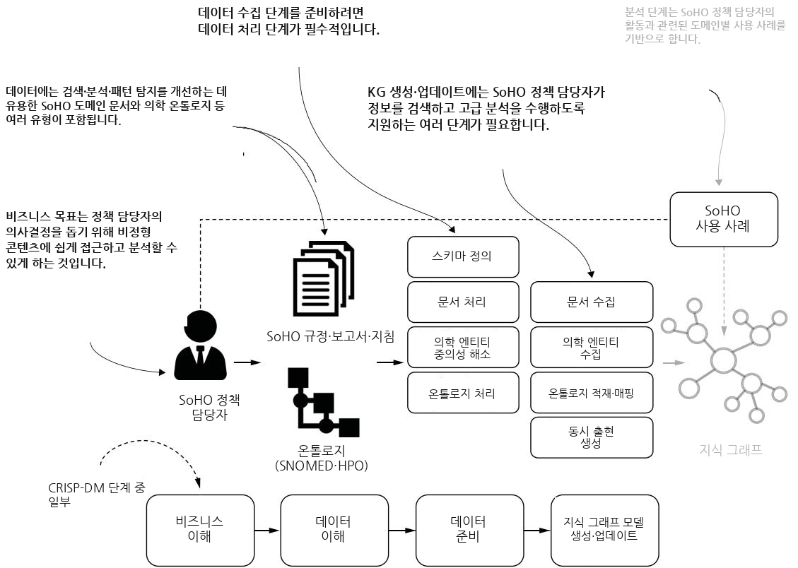  
그림 7.8 데이터 준비와 KG 생성 및 갱신은 중요한 기술적 단계입니다. 데이터 준비 단계는 사용 가능한 데이터를 처리하는 과정을 포함하며, KG 생성 및/또는 갱신 단계는 이 과정의 출력을 사용하여 분석 단계에 필요한 데이터베이스를 생성합니다.

이 시점에서 이 절을 어떻게 진행할지 두 가지 선택지가 있습니다. 첫째, 이러한 각 단계를 따라 KG를 처음부터 구축할 수 있습니다. 또는 KG를 구성하는 주요 아이디어를 이해한 뒤 사용 사례(7.7절)에 집중하는 것이 목표라면, scispaCy를 사용해 처리된 문서를 포함하는 KG의 중간 버전에서 시작할 수 있습니다. 이 경우 7.6.1절부터 시작한 다음 7.6.4절로 건너뛰어 온톨로지를 로드하고 그 노드를 추출된 의료 엔티티에 매핑합니다. KG 구축을 위한 전체 코드는 Python 스크립트와 Cypher 쿼리를 결합한 형태이며, 이 책의 코드 저장소에서 제공됩니다.

#### 7.6.1 스키마 정의


스키마를 정의하는 것은 우리 데이터에 대한 그래프 기반 모델을 정의하는 이론적 단계이며, 이는 7.7절의 사용 사례에 도움이 됩니다. 그림 7.9는 우리가 구축할 KG의 주요 구성 요소(노드와 관계)를 모델링하는 스키마를 보여줍니다.

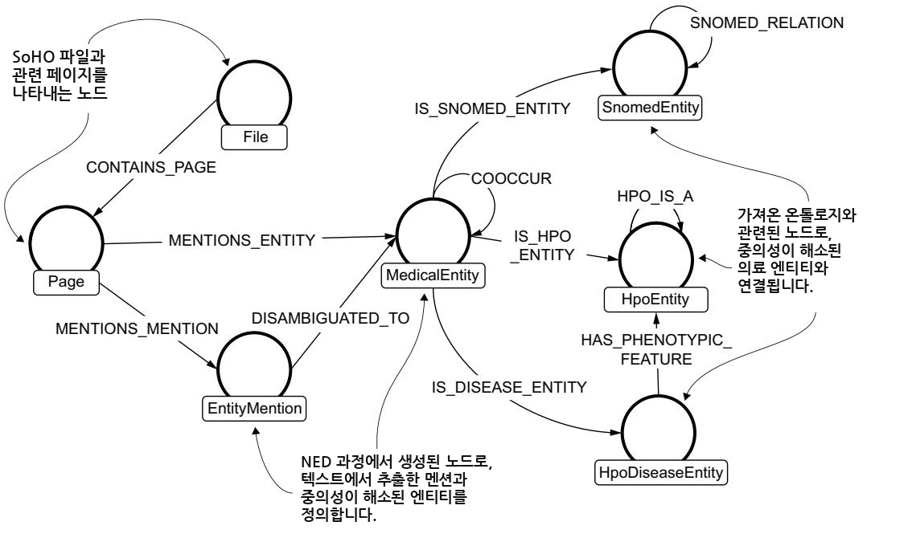  
그림 7.9 여러 유형의 분석을 가능하게 하는 관련 노드 레이블과 관계 유형을 포함한 KG 스키마

수집된 문서는 File 노드와 관련 Page 노드를 연결함으로써 그래프 안에 구조화됩니다. 각 Page는 텍스트에서 인식된 모든 엔티티를 정의하는 EntityMention 노드들의 모음에 연결됩니다. 이러한 EntityMention 노드는 중의성 해소 (disambiguation)를 거쳐 MedicalEntity 노드에 연결됩니다. DISAMBIGUATED\_TO 관계를 통해 동일한 문자열을 가진 멘션이 서로 다른 엔티티를 가리키는 경우를 모델링할 수 있으며, 반대로 서로 다른 문자열로 특징지어지는 엔티티들이 동일한 엔티티를 가리키는 경우도 모델링할 수 있습니다. 예를 들어 앞서 보았듯이 “Zika”라는 용어는 여러 엔티티를 가리킬 수 있는 반면, “AIDS”와 “Acquired Immunodeficiency Syndrome”은 동일한 엔티티의 서로 다른 두 표현입니다. MENTIONS\_ENTITY 관계는 Page 노드와 중의성이 해소된 MedicalEntity 노드를 연결합니다.

나머지 노드와 관계는 추출된 MedicalEntity를 SnomedEntity, HpoEntity, HpoDiseaseEntity에 매핑합니다. 이 매핑을 지정하기 위해 우리는 다음 관계들을 정의했습니다: IS\_SNOMED\_ENTITY, IS\_HPO\_ENTITY, IS\_ DISEASE\_ENTITY. 이제 KG 스키마를 정의했으므로, 데이터 수집을 시작할 수 있습니다.

#### 7.6.2 문서 처리 및 적재


이 단계에서는 문서를 적재하고 관련 내용을 그래프 기반 구조로 모델링합니다. 우리의 목적에 사용할 수 있는 대부분의 문서는 PDF 또는 DOCx 형식으로 공개되어 있습니다. 따라서 데이터를 Neo4j에 로드하기 전에 Amazon Textract OCR 서비스를 사용하여 원시 내용을 추출하고 그 결과를 처리했습니다. 전체 텍스트를 재구성하기 위해, 우리는 1열 또는 2열 문서와 같이 서로 다른 구조를 가진 문서를 관리하는 Python 스크립트를 만들었습니다. 그림 7.10은 PDF 및 DOCx 문서에서 전체 텍스트를 재구성하기 위한 이 준비 단계의 핵심 측면을 보여줍니다.

참고 Amazon Textract(https://aws.amazon.com/textract/)는 스캔한 문서에서 텍스트, 필기, 데이터를 자동으로 추출하는 AWS 제공 머신러닝 서비스입니다.

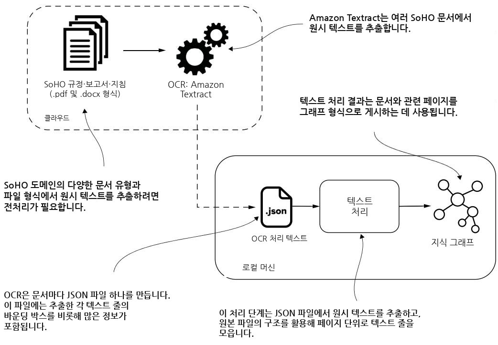  
그림 7.10 우리는 Amazon Textract를 사용하여 SoHO 문서에서 텍스트를 추출했습니다.

페이지의 전체 텍스트를 재구성한 다음 그 결과를 KG에 로드하려면 로컬 머신에서 텍스트 처리 스크립트를 실행해야 합니다. 전체 코드 구현은 이 책의 코드 저장소에서 확인할 수 있습니다. 목록 7.11은 원시 텍스트 또는 처리된 문서를 적재하고, 이 정보를 그래프 기반 형식으로 구조화하는 Cypher 쿼리를 보여줍니다.

```python
Listing 7.11 Loading textual content into Neo4j
[...]
class DocsImporter:
[...]
def set_constraints(self):
queries = ["CREATE FULLTEXT INDEX pageText FOR (n:Page) ON EACH [n.text]"]
for q in queries:
self.connection.query(q, db=self.db)
def load_docs(self):
with open(self.docs_file) as json_file:
docs = json.load(json_file)
query = """
MERGE (f:File {id: $name})
SET f.type = $type, f.path = $name
WITH f
UNWIND $pages as page
MERGE (p:Page {id: replace($name, '.pdf', '') + '_' + page.page_idx})
SET p.page_idx = page.page_idx,
p.text = page.text
MERGE (f)-[:CONTAINS_PAGE]->(p)
"""
for i in tqdm(docs):
name = i['name']
type = i['type']
pages = i['pages']
self.connection.query(query,
parameters={'name': name,
'type': type,
'pages': pages},
db=self.db)
```

이 과정을 완료하면 파일과 페이지 텍스트가 KG에 로드됩니다.

#### 7.6.3 의료 엔터티의 중의성 해소 및 적재

다음 단계에서는 OCR이 생성한 JSON 파일에서 문서를 직접 처리하여 의료 엔터티를 추출하고 중의성을 해소한 뒤, 그 결과를 Python 딕셔너리에 저장하고 이후 Neo4j에 적재합니다. 이 처리 결과의 예시는 다음과 같습니다.

#### 목록 7.12 문서 처리 결과로 생성된 Python 딕셔너리


{'id': 'sample\_dataset-PublicUse/ECDC Documents/west nile virus/EU-summary   
➥-report-trends-sources-zoonoses-2013\_120',   
'ents': [{'sentenceIndex': 0,   
'value': 'zoonoses',   
'lemma': 'zoonosis',   
'label': 'ENTITY',   
'beginCharacter': 60,   
'endCharacter': 68,   
'selected\_ned\_id': 'C0043528',   
'selected\_ned\_name': 'Zoonoses',   
'selected\_ned\_definition': 'Diseases of non-human animals that may be   
➥transmitted to HUMANS or may be transmitted from humans to non-human   
➥animals.',   
'selected\_ned\_aliases': ['Zoonotic Disease',   
'Zoonosis, NOS',   
'Zoonoses',...],   
'selected\_ned\_types\_id': ['T047'],   
'selected\_ned\_types': ['Disease or Syndrome']...   
}

이 결과는 추출된 엔터티와 관련된 세부 정보를 저장하며, 여기에는 시작 문자와 종료 문자를 지정함으로써 문장 인덱스와 텍스트 내 멘션 (mention)의 위치가 포함됩니다. 유형 및 별칭과 같은 정보 엔터티 외에도, 이러한 세부 정보는 7.7절에서 논의하듯 고급 질의를 수행하는 데 사용됩니다. 이제 결과를 Neo4j에 적재할 수 있습니다.

```python
Listing 7.13 Loading NED data
[...]
class NLPImporter(BaseImporter):
[...]
def load_nlp_res(self):
print("Loading data into Neo4j...")
with open(self.file,'rb') as file:
processed_pages = pickle.load(file)
query = """
UNWIND $rows as item
Matches node pages that
MATCH (page:Page) < are not yet processed
WHERE page.id = item.id AND NOT page:NEDProcessed
SET page:NEDProcessed
WITH page, item
UNWIND item.ents as entity
MERGE (
mention:EntityMention {
name_normalized: toLower(
apoc.text.join(
apoc.text.split(trim(entity.value), "\\s+"), " "
)
```

엔터티 멘션 노드를 생성합니다 속성을 추가하고,   
) < 페이지에 연결하며 시작   
ON CREATE SET 및 종료 문자를 포함하여   
mention.name = apoc.text.join( 관계에 추가합니다   
apoc.text.split(trim(entity.value), "\\s+"), " " 페이지와   
)   
MERGE 멘션을 연결합니다   
(page)-[s:MENTIONS\_MENTION {from\_model: "ned"}]->(mention) <   
ON CREATE SET s.start\_chars= [entity.beginCharacter],   
s.end\_chars= [entity.endCharacter],   
s.sentence\_index = [entity.sentenceIndex],   
s.type = toLower(entity.label)   
ON MATCH SET s.start\_chars = s.start\_chars + entity.beginCharacter,   
s.end\_chars = s.end\_chars + entity.endCharacter,   
s.sentence\_index = s.sentence\_index +   
➥entity.sentenceIndex   
scispaCy 도구를 사용해 추출한   
WITH page, mention, entity 의료 엔터티 노드를 병합합니다   
FOREACH(medical in entity   
MERGE (dis:MedicalEntity {id: medical.selected\_ned\_id}) <   
ON CREATE SET dis.name=   
➥apoc.text.join(apoc.text.split(trim(medical.selected\_ned\_name),   
➥"\\s+"), " "),   
dis.type\_id = medical.selected\_ned\_types\_id,   
dis.types = medical.selected\_ned\_types,   
dis.type = medical.selected\_ned\_types[0],   
dis.original\_mention = medical.value,   
dis.definition = medical.selected\_ned\_definition,   
속성을 추가합니다, dis.aliases = medical.selected\_ned\_aliases,   
별칭과 dis.start\_chars= [entity.beginCharacter],   
의미 유형을 포함하여 dis.end\_chars= [entity.endCharacter],   
의료 엔터티 노드에 추가합니다 > dis.sentence\_index = [entity.sentenceIndex]   
ON MATCH SET dis.start\_chars = dis.start\_chars +   
➥entity.beginCharacter,   
dis.end\_chars = dis.end\_chars + entity.endCharacter   
MERGE (mention)-[r:DISAMBIGUATED\_TO]->(dis) < 의료   
SET r.confidence = medical.selected\_ned.confidence 엔터티 노드를   
엔터티 멘션에 연결합니다   
연결합니다 > MERGE (page)-[t:MENTIONS\_ENTITY]->(dis)   
의료 엔터티 ON CREATE SET t.sentence\_index = [medical.sentenceIndex]   
노드를 페이지에 ON MATCH SET t.sentence\_index = t.sentence\_index +   
➥medical.sentenceIndex)   
" I "   
self.load\_in\_batch(query, processed\_pages, len(processed\_pages),   
➥chunk\_size=1)

이 쿼리는 scispaCy 처리 결과를 Neo4j에 저장합니다. 먼저 Page 노드에 연결되는 EntityMention 노드를 생성합니다. 그런 다음 MedicalEntity 노드를 생성하고, UMLS 데이터로 이를 보강하며, 의료 엔터티를 EntityMention 및 Page 노드에 연결합니다. 앞서 언급했듯이, 우리는 데이터 표현의 유연성을 높이기 위해

EntityMention과 중의성이 해소된 MedicalEntity를 모두 그래프에 유지했습니다.

#### 7.6.4 온톨로지 처리, 적재 및 매핑

이 단계에서는 UMLS, SNOMED, HPO 온톨로지 (ontology)를 KG에 적재합니다. UMLS는 여러 온톨로지에 걸친 특정 정보에 접근하기 위한 진입점 역할을 합니다. 이러한 이유로 우리는 먼저 SNOMED와 HPO 온톨로지를 적재한 다음, 그 안의 각 엔터티를 UMLS에 매핑합니다.

#### SNOMED 적재


다음 목록은 sct2\_Relationship\_Full\_US1000124\_20220901.txt에서 Neo4j에 노드와 관계를 생성합니다.

#### Listing 7.14 SNOMED 적재: 관계 로딩


[...]   
class SnomedRelationshipsImporter(BaseImporter): < 기본 가져오기 기능을 포함하는   
[...] BaseImporter 클래스를 확장합니다   
def set\_constraints(self):   
queries = [   
SNOMED 엔터티와   
속성에 대한 제약 조건과   
인덱스를 정의합니다 "CREATE CONSTRAINT IF NOT EXISTS FOR (n:SnomedEntity) "   
"REQUIRE n.id IS UNIQUE"   
),   
(   
"CREATE INDEX snomedNodeName IF NOT EXISTS "   
"FOR (n:SnomedEntity) ON (n.name)"   
),   
(   
"CREATE INDEX snomedRelationId IF NOT EXISTS "   
"FOR ()-[r:SNOMED\_RELATION]-() ON (r.id)"   
),   
(   
"CREATE INDEX snomedRelationType IF NOT EXISTS "   
"FOR ()-[r:SNOMED\_RELATION]-() ON (r.type)"   
),   
(   
"CREATE INDEX snomedRelationUmls IF NOT EXISTS "   
"FOR ()-[r:SNOMED\_RELATION]-() ON (r.umls)"   
),   
]   
for q in queries:   
self.connection.query(q, db=self.db)   
매개변수화된 쿼리를 사용하여   
def import\_snomed\_rels(self): < SNOMED 관계를 가져옵니다   
query = """   
UNWIND \$batch as item   
MERGE (e1:SnomedEntity {id: item.sourceId})   
MERGE (e2:SnomedEntity {id: item.destinationId})   
MERGE (e1)-[:SNOMED\_RELATION {id: item.typeId}]->(e2)   
FOREACH(ignoreMe IN CASE WHEN item.typeId = '116680003'

➥THEN [true] ELSE [] END   
MERGE (e1)-[:SNOMED\_IS\_A]->(e2) < 엔터티 간의 계층적 연결을 추적하기 위해   
)   
SNOMED\_IS\_A 관계 유형을 생성합니다   
"IIII   
size = self.get\_csv\_size(snomedRels\_file) <   
self.batch\_store(snomed\_rels\_query, self.get\_rows(snomedRels\_file),   
➥size=size) <   
SNOMED 데이터를 배치 단위로 로드합니다 파일 크기를 가져옵니다   
(BaseImporter 클래스의 구현) (BaseImporter 클래스의 기본 구현)

SNOMED에는 수백 개의 관계가 포함되어 있습니다. 그래프 스키마를 가능한 한 단순하게 유지하기 위해, 우리는 고유한 SNOMED\_RELATION을 생성하고 관계 이름을 type 속성으로 저장하기로 결정했습니다. Listing 7.14에서는 계층적 연결을 정의하기 위해 SNOMED\_IS\_A 관계를 생성합니다. 이 선택이 루트에서 리프 노드로 정보를 전파하는 데 왜 유용한지 곧 살펴보겠습니다.

이제 그래프의 형태를 만들기 위해 노드와 관계를 적재했으므로, 이름과 별칭을 추가하여 이 구조를 보강해야 합니다. 다음 클래스는 sct2\_Description\_Full-en\_US1000124\_20220901.txt에서 정보를 추출합니다.

리스팅 7.15 SNOMED 수집: 이름과 별칭 적재   
[...]   
class SnomedNamesImporter(BaseImporter):   
[...]   
def import\_snomed\_names(self, snomedNames\_file):   
snomed\_names\_concepts\_query = """   
UNWIND \$batch as item   
MATCH (e1:SnomedEntity)   
-[r:SNOMED\_RELATION {id: item.conceptId}]->   
(e2:SnomedEntity)   
WHERE item.conceptId <> '116680003' AND r.id = item.conceptId   
SET r.type = CASE   
WHEN r.type IS NULL THEN item.termAsType   
관계를 추가함   
ELSE r.type END, < type 속성의 name   
r.aliases = CASE   
WHEN item.termAsType IN r.aliases THEN r.aliases   
ELSE coalesce(r.aliases,[]) + item.termAsType END <   
"IIII   
추가함   
관계   
snomed\_names\_entities\_query = """ 별칭   
UNWIND \$batch as item   
MATCH (e:SnomedEntity {id: item.conceptId})   
SET e.name = CASE   
WHEN e.name IS NULL THEN item.term 노드 이름을 추가함   
ELSE e.name END, < node name   
e.aliases = CASE   
WHEN item.term in e.aliases THEN e.aliases 노드 추가   
ELSE coalesce(e.aliases, []) + item.term END ≤ 별칭   
I1 I "I   
size = self.get\_csv\_size(snomedNames\_file)

self.batch\_store(   
snomed\_names\_concepts\_query,   
self.get\_rows(snomedNames\_file),   
size=size)   
self.batch\_store(   
snomed\_names\_entities\_query,   
self.get\_rows(snomedNames\_file),   
size=size)

이 클래스는 그래프에 적재된 노드와 관계에 이름과 별칭을 추가합니다. 다음 단계는 루트 노드에서 모든 하위 노드로, 리프 노드 (leaf nodes)에 이르기까지 정보를 전파하는 것입니다. 1단계 노드는 질병, 신체 구조, 물질, 사건과 같은 의료 도메인에서 SNOMED의 원형 엔티티 (archetypal entities)를 나타냅니다. 이러한 루트 노드는 SNOMED에서 사용할 수 있는 엔티티의 의미 유형 (semantic types)을 정의합니다. 그러나 우리가 수집한 데이터에서는 이 정보가 암묵적입니다. 왜냐하면 원본 데이터에서 다른 각 엔티티에는 이름과 별칭만 있기 때문입니다. 따라서 우리는 온톨로지 (ontology)의 트리 구조를 통해 이 정보를 전달하는 메커니즘이 필요합니다. 이렇게 하면 깊은 수준의 엔티티가 질병인지 제품인지 쉽게 감지할 수 있습니다. 그림 7.11은 이러한 전파 메커니즘을 명확히 보여 줍니다.

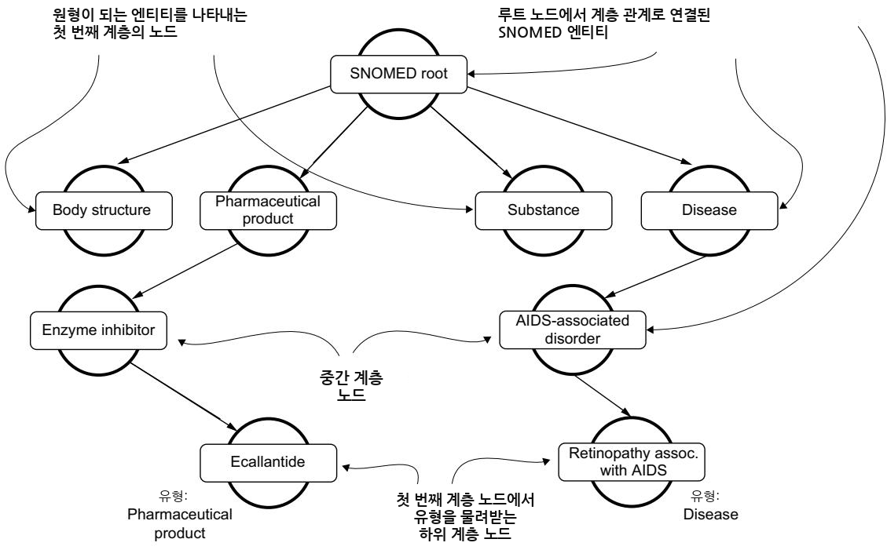  
그림 7.11 SNOMED 온톨로지의 계층 구조 예시. 이 계층 구조를 사용하면 Ecallantide 및 AIDS와 관련된 Retinopathy처럼 더 깊은 수준에 위치한 노드를, 온톨로지의 원형 엔티티를 나타내는 Pharmaceutical product 및 Disease와 같은 1단계 노드의 정보를 사용하여 분류할 수 있습니다.

다음 리스팅은 1단계 노드에서 더 깊은 노드로 정보를 전파하기 위해 계층 구조를 따라 모든 노드를 검색합니다.

```python
Listing 7.16 Ingesting SNOMED: propagating labels from first-level nodes
[...]
class SnomedLabelPropagator():
[...]
def get_rows(self):
propagation_query = """
MATCH p=(n:SnomedEntity)<-[:SNOMED_IS_A]-(m:SnomedEntity)
WHERE n.id= "138875005" // Root node
WITH distinct m as first_node
Uses expandConfig to set the
CALL apoc.path.expandConfig(first_node, { rules for traversing the hierarch
relationshipFilter: '<SNOMED_IS_A',
minLevel: 1,
maxLevel: -1,
uniqueness: 'RELATIONSHIP_GLOBAL
}) yield path
Gets the nodes resulting
UNWIND nodes(path) as other_level from this traversal process
WITH first_node, collect(DISTINCT other_level) as uniques
UNWIND uniques as unique_other_level
WITH first_node,unique_other_level
Returns all the
WHERE not first_node.name in
nodes characterized
coalesce(unique_other_level.type,[]) by a specific type
RETURN unique_other_level.id as id, first_node.name as label -
IIIII
with self._driver.session(database=self._database) as session:
result = session.run(query=propagation_query)
for record in iter(result):
yield dict(record)
[...]
```

SNOMED\_IS\_A 관계는 엔티티 간의 계층적 연결을 사용하여 트리 구조를 통해 의미 유형을 전파합니다.

#### HPO 수집


다음 리스팅은 HPO 온톨로지 (ontology)를 수집하기 위한 주요 단계를 개괄합니다. 적절한 인덱스 생성 등을 포함한 더 자세한 내용은 3장에서 논의되며, 책의 저장소에 있는 Cypher 코드에도 포함되어 있습니다. 먼저 Neosemantics 플러그인을 사용하여 HPO 온톨로지를 가져옵니다.

리스팅 7.17 HPO 수집: 온톨로지 로드

```javascript
CALL n10s.rdf.import.fetch("http://purl.obolibrary.org/obo/hp.owl","RDF/XML");
```

HPO 온톨로지는 RDF/XML 형식으로 제공되며, Cypher를 사용해 처리할 수 있도록 Neo4j 그래프 구조로 변환됩니다.

다음으로, 표현형 특징 엔티티를 나타내는 노드에 HPO 레이블을 추가합니다.

#### 리스팅 7.18 HPO 수집: 표현형 특징에 HpoEntity 레이블 추가


```sql
MATCH (n:Resource)
WHERE n.uri STARTS WITH "http://purl.obolibrary.org/obo/HP"
SET n:HpoEntity,
n.id = coalesce(n.id, replace(apoc.text.replace(n.uri,'(.*)obo/',''),'_', ':'));
```

이제 표현형 특징과 질병 사이의 연결을 설명하는 주석 파일을 처리해야 합니다. 이 단계를 더 효율적으로 만들기 위해, 다음 쿼리를 사용하여 질병 엔티티를 그래프 노드로 로드합니다.

리스팅 7.19 HPO 수집: HpoDiseaseEntity 노드 생성

```sql
LOAD CSV FROM 'https://github.com/obophenotype/human-phenotype-
➥ontology/releases/latest/download/phenotype.hpoa' AS row
FIELDTERMINATOR '\t'
WITH row
SKIP 5
MERGE (dis:Resource:HpoDiseaseEntity {id: row[0]})
ON CREATE SET dis.label = row[1];
```

다음 단계는 사용 가능한 표현형 특징과 질병 노드 사이의 관계를 생성하는 것입니다.

#### 리스팅 7.20 HPO 수집: HpoEntity와 HpoDiseaseEntity 사이의 관계


LOAD CSV FROM 'https://github.com/obophenotype/human-phenotype-ontology/   
➥releases/latest/download/phenotype.hpoa' AS row   
FIELDTERMINATOR '\t'   
WITH row   
SKIP 5   
MATCH (dis:HpoDiseaseEntity)   
WHERE dis.id = row[0]   
MATCH (phe:HpoEntity)   
WHERE phe.id = row[3]   
MERGE (dis)-[:HAS\_PHENOTYPIC\_FEATURE]->(phe)

다음 쿼리는 텍스트에서 추출된 중의성이 해소된 엔티티와 온톨로지 노드 사이의 연결을 설정합니다.

#### 목록 7.21 UMLS를 통한 SNOMED 통합


MATCH (m:MedicalEntity)   
WITH m   
MATCH (d:SnomedEntity)   
WHERE m.id in d.umls\_ids   
WITH m, d   
MERGE (m)-[:IS\_SNOMED\_ENTITY]->(d)

우리는 HPO 온톨로지에 대해서도 유사한 과정을 수행합니다(자세한 내용은 전체 코드를 참조하십시오). 다음 쿼리는 HPO 주석 파일의 MedicalEntity 노드와 HpoDiseaseEntity 노드를 연결합니다.

목록 7.22 MedicalEntity 노드와 HpoDiseaseEntity 노드 연결   
MATCH (m:MedicalEntity)   
WITH m   
MATCH (d:HpoDiseaseEntity)   
WHERE m.id in d.umls\_ids   
WITH m, d   
MERGE (m)-[:IS\_DISEASE\_ENTITY]->(d)

다음 절에서는 같은 문장에 위치한 엔티티들 사이의 동시 출현 관계를 생성합니다.

#### 7.6.5 엔티티 동시 출현 생성


텍스트에서 의료 엔티티의 동시 출현 (co-occurrence)을 식별하는 것은 텍스트 콘텐츠의 비정형 지식과 도메인 온톨로지의 구조화된 지식을 결합하는 고급 사용 사례를 가능하게 하는 기본 단계입니다. 목록 7.23의 쿼리는 같은 문장에서 식별된 의료 엔티티 사이에 COOCCURR라는 새 관계를 생성합니다.

정의 동시 출현은 Page 노드를 Entity 노드로 투영하는 것을 의미합니다.

#### 목록 7.23 문장 수준에서 동시 출현 관계 생성하기


```asm
CALL apoc.periodic.iterate(
"MATCH (n:Page) WHERE exists( (n)-[:MENTIONS_ENTITY]->(:MedicalEntity) )
RETURN n",
"MATCH (n)-[r:MENTIONS_ENTITY]->(m:MedicalEntity)
WITH n, r.sentence_index as sentences, m
UNWIND sentences as sentence
WITH n, sentence, collect(distinct m) as entities
UNWIND range(0, size(entities)-2) as i
UNWIND range(i+1, size(entities)-1) as j
WITH n, sentence, entities, i, j
MATCH (m1) WHERE id(m1) = id(entities[i])
MATCH (m2) WHERE id(m2) = id(entities[j])
WITH n, sentence, entities, i, j, m1, m2
MERGE (m1)-[s:COOCCURR]-(m2)
ON CREATE SET s.count = 1,
s.sentences = [sentence]
ON MATCH SET s.count = s.count + 1,
s.sentences = s.sentences + sentence",
{batchSize: 50})
```

이 쿼리는 KG에서 25,000개가 넘는 관계를 생성하여, 같은 문장에 위치한 의료 엔티티들 사이의 연결을 명시적으로 드러냅니다. 다음에 논의하겠지만, 동시 출현하는 엔티티들 사이의 온톨로지 연결을 분석하면 이러한 엔티티와 관련된 확립된 지식을 발견하고, 생의학 온톨로지에는 아직 확립되지 않은 새로운 정보를 밝혀낼 수 있습니다.

### 7.7 KG 기반 사용 사례


이 절에서는 코드 예제를 통해 NED와 결합하여 KG를 사용해 다음 사용 사례를 처리하는 방법을 보여줍니다.

 개념 검색

구조화된 지식 기반 검색

KG 기반 해석 가능성 (interpretability) 및 발견

새로운 지식 발굴

그림 7.12는 이 응용 도메인에서 정의된 사용 사례와 관련된 분석 단계를 포함합니다.

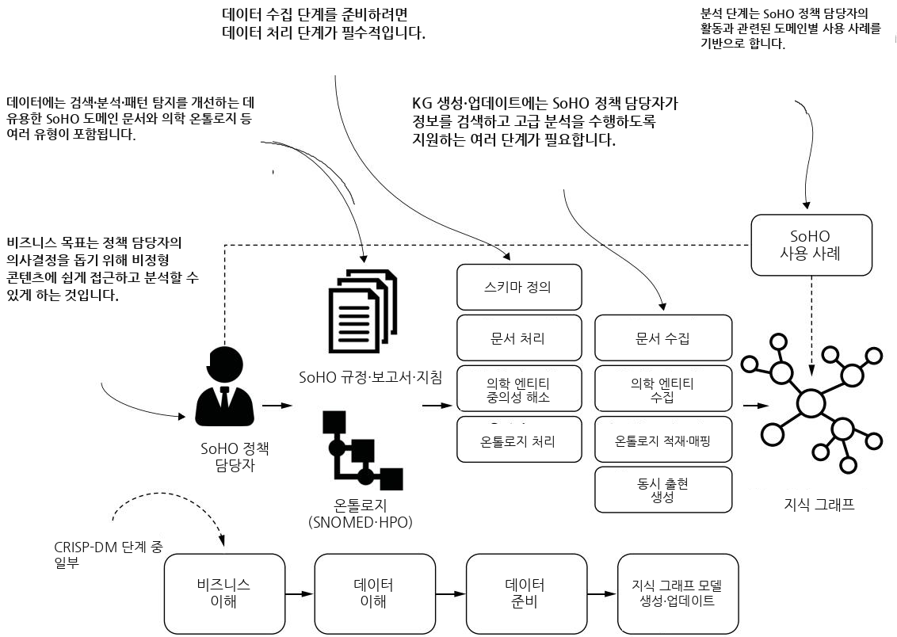  
그림 7.12 KG를 생성한 후, 비즈니스 문제를 해결하고 KG에 기반한 솔루션을 제공하기 위해 정의된 사용 사례를 적용하여 분석을 수행할 수 있습니다.

참고: 쿼리 결과는 환경의 차이, Neo4j 인덱싱 동작, 데이터 파이프라인 수집 순서, scispaCy가 수행하는 엔티티 추출의 비결정적 측면으로 인해 이 장에 표시된 결과와 약간 다를 수 있습니다.

#### 7.7.1 개념적 검색 (Conceptual search)


개념적 검색은 동일한 의미를 지닌 서로 다른 표현을 조정하여 사용자에게 반환하거나, 별개의 엔티티를 가리키는 유사한 용어를 구별하는 능력과 관련이 있습니다. 개념적 검색을 수행하면 특정 문서와 해당 엔티티를 언급하는 관련 텍스트 부분에 대한 검색을 확장하거나 집중하는 데 도움이 될 수 있습니다. 그림 7.13은 개념적 검색과 전통적인 전체 텍스트 검색 (fulltext search)의 고수준 비교를 제공합니다.

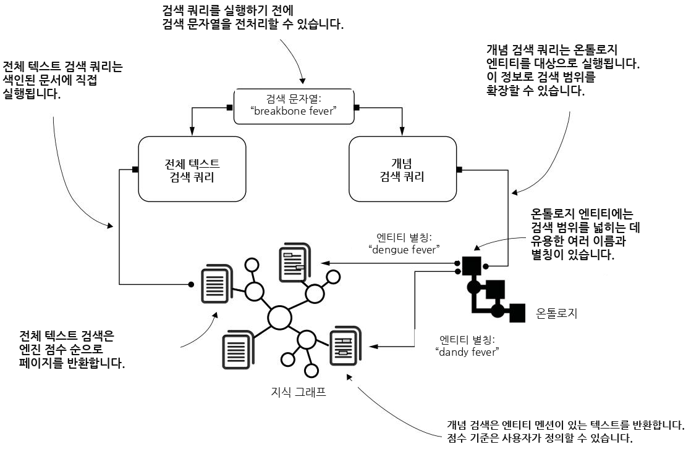  
그림 7.13 전통적인 전체 텍스트 검색과 개념적 검색의 차이. 전체 텍스트 검색 쿼리는 문서 집합에 직접 수행되는 반면, 개념적 검색 쿼리는 문서를 검색하기 전에 온톨로지 (ontology)의 정보를 사용하여 검색 공간을 확장합니다.

전통적인 전체 텍스트 검색에서 시작하여 개념적 검색의 효과를 살펴보겠습니다. 다음 검색 쿼리는 “breakbone fever”를 언급하는 모든 문서를 검색하려고 시도합니다.

리스팅 7.24 입력 문자열로 “breakbone fever”를 사용하는 전체 텍스트 검색 쿼리   
CALL db.index.fulltext.queryNodes("PageText", "breakbone fever")   
YIELD node, score   
WITH node as p, score as score   
MATCH (f:File)-[:CONTAINS\_PAGE]->(p)   
RETURN f.id as \`File ID\`, p.page\_idx as \`Page index\`, score as Score   
LIMIT 5

표 7.1은 점수 값에 따라 정렬된 전체 텍스트 검색 결과를 보여 줍니다. 첫 번째 열은 문서 경로를 나열하고, 두 번째 열은 문서 내 페이지 인덱스를 보여 주며, 세 번째 열은 전체 텍스트 검색 알고리즘이 계산한 점수를 보고합니다.

표 7.1 “breakbone fever”에 대한 전체 텍스트 검색으로 검색된 상위 다섯 페이지
<table><tr><td>파일 ID</td><td>페이지 인덱스</td><td>점수</td></tr><tr><td>sample_dataset-PublicUse/ECDC Documents/west nile virus/emerging-vector- borne-diseases_annual-epidemiological-report-2014.pdf</td><td>5</td><td>2.12</td></tr><tr><td>sample_dataset-PublicUse/ECDC Documents/west nile virus/emerging-vector- borne-diseases_annual-epidemiological-report-2014.pdf</td><td>4</td><td>2.09</td></tr><tr><td>sample_dataset-PublicUse/ECDC Documents/zika virus/Communicable-dis- ease-threats-report-26-mar-2016.pdf</td><td>10</td><td>2.08</td></tr><tr><td>sample_dataset-PublicUse/ECDC Documents/ebola/communicable-disease- threats-report-13-19-mar-2016.pdf</td><td>9</td><td>2.08</td></tr><tr><td>sample_dataset-PublicUse/ECDC Documents/zika virus/Communicable-dis- ease-threats-report-26-mar-2016.pdf</td><td>10</td><td>2.08</td></tr></table>

이 유형의 검색은 퍼지 논리 (fuzzy logic)를 사용하여 문서 집합에서 키워드를 식별합니다. 이 경우 “breakbone”은 텍스트에서 전혀 언급되지 않지만, “fever”라는 용어는 높은 점수를 받은 문서들에 여러 번 나타납니다. 그럼에도 불구하고 우리는 이 특정 질병 또는 궁극적으로 이 질병의 원인 병원체를 언급하는 문서를 식별하는 데 관심이 있습니다.

UMLS 지식베이스에서 코드 C0011311은 이 엔티티를 식별하며, 이 엔티티는 “dengue fever,” “dungero,” “dandy fever”를 포함한 다양한 형태로 나타날 수 있습니다. 따라서 다음으로 별칭이 “breakbone fever”인 scispaCy 모델이 식별한 모든 의학 엔티티를 검색하기 위해 다음 쿼리를 실행합니다.

MATCH (f:File)-[:CONTAINS\_PAGE]->(p)   
-[r:MENTIONS\_MENTION]->(m)-[:DISAMBIGUATED\_TO]->(e)   
WHERE "breakbone fever" IN [x IN e.aliases | toLower(x)] <   
별칭 "breakbone fever"   
(소문자)가 엔티티의 별칭들 가운데 존재하는지 확인하여 노드를 필터링합니다.

UNWIND range(0, size(r.start\_chars) - 1) AS mention < 각 멘션을 순회합니다.   
WITH f, p, e, m, r, mention 시작 위치 목록의 인덱스입니다.   
RETURN DISTINCT 여러 멘션을 처리하기 위한 문자입니다.   
f.id AS \`File ID\`, 페이지당 여러 멘션입니다.   
p.page\_idx AS \`Page index\`,   
apoc.text.join(   
collect( 부분 문자열의 시작 인덱스를 계산하며,   
시작 위치에서 100을 빼어도   
substring(   
0보다 작아지지 않도록 보장합니다.   
p.text,   
apoc.coll.max([r.start\_chars[mention] - 100, 0]), <   
r.end\_chars[mention] - r.start\_chars[mention] + 200 <   
)   
)[0..3], < 끝 위치와   
'\n\n' 멘션 시작 위치의 차이를 계산하고   
) AS \`Mention contexts\`, 추가 문맥을 위해 200을 더하여   
size(collect(m.name)) AS \`Number of mentions\` 텍스트 조각의 길이를 결정합니다.   
ORDER BY \`Number of mentions\` DESC   
LIMIT 5   
출력을 간결하게 유지하기 위해   
각 파일–페이지 조합에 대해 수집된 문맥 조각을   
처음 세 개로 제한합니다.

표 7.2는 우리의 개념 검색에서 가장 높은 점수를 받은 페이지들과, 멘션 수에 따라 나열된 breakbone fever를 나타내는 UMLS 엔티티를 언급하는 문단의 예를 보여줍니다.

표 7.2 엔티티 별칭으로 “breakbone fever”를 사용하여 검색된 최고 점수 페이지
<table><tr><td>파일 ID</td><td>페이지 인덱스</td><td>언급 맥락</td><td>언급 횟수</td></tr><tr><td>sample_dataset-PublicUse/ECDC Documents/hepatitis-a/communicable- disease-threats-report-feb-24-2018.pdf</td><td>11</td><td>&quot;[...] 2017년에 캄보디아는 3,200건이 넘는 뎅기열 의심 사례를 보고했습니다.&quot;</td><td>22</td></tr><tr><td>sample_dataset-PublicUse/ECDC Documents/ebola/communicable- disease-threats-report-17%20may- 2014.pdf</td><td>11</td><td>&quot;[..] 싱가포르는 올해 1월부터 4월까지 전국적으로 1000건이 넘는 뎅기열 사례를 보고했으며, 이는 [...]와 비교하여 15퍼센트 적은 사례입니다.&quot;</td><td>20</td></tr><tr><td>sample_dataset-PublicUse/ECDC Docu- ments/ebola/Communicable-disease- threats-report-19-jul-2014.pdf</td><td>12</td><td>&quot;[..] 말레이시아의 뎅기열 유행은 현재 거의 47,000명을 감염시켰으며, 이는 사례 수가 [...]의 두 배를 넘는 것입니다.&quot;</td><td>20</td></tr><tr><td>sample_dataset-PublicUse/ECDC Documents/ebola/communicable- disease-threats-report-21-jun-2014.pdf</td><td>13</td><td>&quot;[...] 쿠바는 쿠바 측을 인용한 언론에 따르면 6월 8일까지 뎅기열 유입 사례 67건을 기록했습니다</td><td>20</td></tr><tr><td>sample_dataset-PublicUse/ECDC Documents/west nile virus/</td><td>12</td><td>정부.&quot; [..] 오세아니아: 2014년 6월 13일 기준, 2014년 1월 이후 솔로몬 제도에서 뎅기열 의심 사례 1,762건이 보고되었습니다.&quot;</td><td>19</td></tr></table>

결과를 전체 텍스트 검색의 결과와 비교하면, 가장 관련성이 높은 페이지들이 완전히 다르다는 것을 알 수 있습니다. 개념 검색 (conceptual search) 쿼리를 업데이트하여 전체 결과 집합을 표시하고 탐색해 보겠습니다(LIMIT 절 제거). 전체 텍스트 쿼리의 첫 번째 결과는 개념 검색 쿼리에서 19번째 위치에 있습니다. 이 특정 문서에는 UMLS 엔티티에 대한 언급이 17회 있는 반면, 개념 검색 쿼리에서 최고 점수를 받은 결과에는 C0011311 UMLS 엔티티에 대한 언급이 22회 포함되어 있습니다.

개념 검색을 도입하면 우리 애플리케이션 도메인에 큰 영향을 미칩니다. 전체 텍스트 검색과 비교하여 더 정밀하고 상세한 정보를 검색할 수 있습니다. 문서 경로와 페이지 인덱스에 더해, 엔티티를 언급하는 텍스트 부분과 해당 페이지에서 이 엔티티가 나타나는 횟수를 식별할 수 있습니다. 따라서 개념 검색은 검색된 문서의 설명 가능성을 개선하는 다른 기능들을 가능하게 합니다. NED 모델을 통해 텍스트에서 감지된 엔티티의 위치를 식별할 수 있으므로, 궁극적으로 모델이 예상대로 수행되지 않은 사례를 식별하기 위한 정밀한 디버깅 테스트를 수행할 수 있습니다.

개념 검색은 단어나 표현이 문맥에 따라 서로 다른 의미를 갖는 시나리오에서도 검색 과정을 향상합니다. 예를 들어 “islands”라는 단어는 전통적인 의미를 갖지만, “islands of Langerhans”라는 표현에서 사용될 때는 완전히 다른 의미론적 맥락을 갖습니다. 전통적인 전문 검색 (full-text search)은 물로 둘러싸인 육지를 가리키는 관련 없는 결과로 이어질 수 있습니다. 개념 검색 메커니즘을 사용하면 이러한 결과를 걸러내고, “pancreatic islets”와 같은 다른 표현을 포함하도록 검색 범위를 넓혀 더 관련성 높은 콘텐츠를 포착할 수 있습니다. 다음에서 논의하듯이, 개념 검색의 핵심 개념은 온톨로지 관계를 통해 연결된 의료 엔티티를 포함하는 페이지들을 연결함으로써 확장될 수 있습니다.

#### 7.7.2 구조화된 지식 기반 검색

구조화된 지식 기반 검색 (structured knowledge-based search)을 사용하면, 도메인 온톨로지 (domain ontology)에 조직된 형식화된 지식을 활용하여 텍스트에서 정보를 검색하고, 여러 문서에 걸친 서로 다른 텍스트 조각들 사이에 비자명한 관계를 생성할 수 있습니다. 우리는 이미 뎅기열이나 췌장섬과 같은 동일한 개념을 가리키는 정보를, 모호하거나 여러 이름이 존재하는 경우와 무관하게 어떻게 집계할 수 있는지 살펴보았습니다. 그러나 SNOMED와 같은 온톨로지에 내장된 지식을 사용하면, 온톨로지 관계에 의해 구동되는 비정형 콘텐츠를 집계하고 연결할 수 있습니다. 예를 들어, 랑게르한스섬과 같은 세포 기증의 중요성을 고려할 때, 이러한 세포에 영향을 미쳐 기증 과정을 저해할 수 있는 질병을 언급하는 모든 텍스트를 집계하는 것이 유익할 것입니다. 그림 7.14는 개념 검색 질의와 구조화된 지식 기반 질의 사이의 차이에 대한 심적 모델 (mental model)을 보여줍니다.

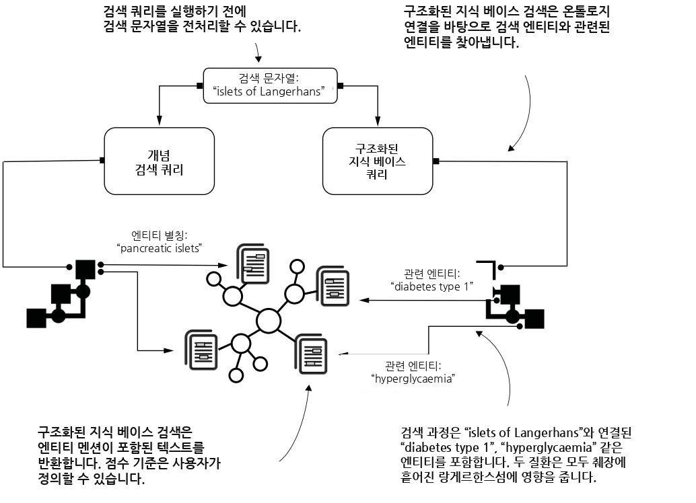  
그림 7.14 개념 검색과 구조화된 지식 기반 검색의 차이. 이 경우 검색 과정에는 검색 질의에서 감지된 엔티티와 온톨로지 관계로 연결된 의료 엔티티들이 포함됩니다. “islets of Langerhans” 검색에서 시작하여, 시스템은 랑게르한스섬에 영향을 줄 수 있는 두 질병인 “diabetes type 1”과 “hyperglycaemia”를 검색합니다.

다음 질의는 랑게르한스섬에 영향을 줄 수 있는 질병을 언급하는 텍스트 부분을 검색합니다.

#### 리스팅 7.26 랑게르한스섬에 영향을 줄 수 있는 질병에 관한 텍스트 가져오기


MATCH (m1:MedicalEntity)-[:IS\_SNOMED\_ENTITY]->(s1:SnomedEntity)   
<-[r1:SNOMED\_RELATION]-(s2:SnomedEntity)   
<-[:IS\_SNOMED\_ENTITY]-(e:MedicalEntity)   
WHERE m1.name = "Islets of Langerhans" AND r1.type = "FINDING\_SITE" <   
WITH e   
MATCH path = (f:File)-[:CONTAINS\_PAGE]->(p) SNOMED에 대해 필터링합니다   
-[r:MENTIONS\_MENTION]->(m)-[:DISAMBIGUATED\_TO]->(e) 다음과 관련된 엔티티를   
UNWIND range(0, size(r.start\_chars) - 1) AS mention < "Islets of   
Langerhans"를   
각 언급 인스턴스를 순회합니다 FINDING\_SITE   
start\_chars의 인덱스를 사용하여 관계 유형별로   
관계당 여러 언급을 허용합니다

문맥 추출을 위한 시작 인덱스를 계산하며, 언급 이후 100자까지의 종료 인덱스를 계산합니다   
0 아래로 내려가지 않도록 100자를 뒤로 물러나며 페이지 텍스트 길이를 초과하지 않습니다   
WITH f, p, r, e, mention,   
> apoc.coll.max([r.start\_chars[mention] - 100, 0]) AS start,   
apoc.coll.min([r.end\_chars[mention] + 100, size(p.text)]) AS end <   
WITH f, p, r, e, mention, substring(p.text, start, end - start) AS context   
WITH f, p,   
collect(DISTINCT e.name) AS \`Mentioned entities\`, 부분 문자열을 추출합니다   
collect(context)[0..3] AS contexts < 계산된 시작 위치부터   
RETURN DISTINCT 종료 위치까지의 페이지 텍스트를   
f.id AS \`File ID\`, 수집된 문맥 창을 제한하여   
문맥 창으로 사용합니다   
p.page\_idx AS \`Page index\`,   
처음 세 언급으로 제한합니다   
\`Mentioned entities\`,   
중복 제거된 목록을 수집합니다   
apoc.text.join(contexts, '\n\n') AS \`Mention contexts\`   
의료 엔티티 이름의 목록을   
ORDER BY size(\`Mentioned entities\`) DESC   
LIMIT 5 페이지에서 언급된

이 질의 결과의 일부는 표 7.3에 제시되어 있습니다.

표 7.3 랑게르한스섬에 영향을 줄 수 있는 질병에 관한 텍스트 내용
<table><tr><td rowspan=1 colspan=2>파일 ID</td><td rowspan=1 colspan=1>페이지 인덱스</td><td rowspan=1 colspan=1>언급된 엔티티</td><td rowspan=1 colspan=1>언급 맥락</td></tr><tr><td rowspan=6 colspan=2>sample_dataset-PublicUse/EDQM Documents/BTC/guide-to-the-quality-and-safety-of-organs-for-transplantation-7th-edition.PDFsample_dataset-PublicUse/EDQM Documents/BTC/guide-to-the-quality-and-safety-of-organs-for-trans-plantation-7th-edition.PDF</td><td rowspan=1 colspan=1>137</td><td rowspan=1 colspan=1>당뇨병</td><td rowspan=6 colspan=1>&quot;대사증후군, 동맥성 고혈압, 당뇨병, 알부민뇨(아래 참조) 및 기타 만성 신장 질환 또는 전신 질환[..]&quot;&quot; [...] 중증 두부 외상이 있는 많은 환자는 정상적인 췌장 기능과 당뇨병 병력이 없음에도 고혈당 상태가 되어 인슐린 치료가 필요합니다.[..] 한편, 제II형 당뇨병의 발현은 50~65세를 넘는 나이에 가능합니다.&quot;</td></tr><tr><td rowspan=2 colspan=1>144</td><td rowspan=1 colspan=1>당뇨병, 대사증후군 X 고혈당증, 당뇨병, 비-</td><td rowspan=1 colspan=1></td></tr><tr><td rowspan=3 colspan=1>인슐린 의존성</td></tr><tr><td rowspan=1 colspan=1></td><td rowspan=1 colspan=1></td></tr><tr><td rowspan=2 colspan=1></td></tr><tr><td rowspan=1 colspan=1></td></tr></table>

리스팅 7.26에서 우리는 개념 검색 질의의 논리를 확장하여, 온톨로지의 엔티티 컬렉션을 입력으로 받아 문서에서 관련 세부 정보를 검색합니다. 가장 흥미로운 결과 중 하나는 표 7.3의 4열에 보고된 『Guide to the Quality and Safety of Organs for Transplantation』 제7판 144쪽에서 나온 것입니다. 이 페이지는 두부 외상을 입은 잠재적 기증자를 관리하는 맥락에서 고혈당증을 언급하며, 이는 FINDING\_SITE 관계를 통해 랑게르한스섬 엔티티와 명시적으로 연결되어 있습니다. 이 문장은 기증자 유지 프로토콜에 초점을 둔 췌장 기증 전용 절에 위치합니다. 이러한 중요한 정보는 개념 검색 메커니즘만으로는 검색되지 않았을 것입니다. 그러나 우리는 고혈당증 의료 엔티티가 검색의 출발점(랑게르한스섬)과 연결되어 있음을 활용하여 이 정보에 도달했습니다. 다른 결과들은 여러 형태의 당뇨병을 언급하며, 이는 췌도 기증에서 특히 관련성이 높습니다.

온톨로지에서 가장 긴 경로를 사용하여 구조화된 지식 기반 검색을 수행할 수도 있습니다. 지카 바이러스 예를 고려해 보겠습니다. 이 바이러스는 토가바이러스 (Togavirus)로 분류될 수 있으며, 혈액을 먹고 사는 절지동물 종, 특히 곤충과 거미류를 통해 인간에게 전파됩니다. 문서에 언급된 모든 질병 중 토가바이러스에 의해 유발되는 질병에 관심이 있다고 가정해 보겠습니다. SNOMED 온톨로지에서 여러 CAUSATIVE\_AGENT 관계를 연결한 경로를 탐색하고, 그 결과를 사용하여 원하는 문서를 획득할 수 있습니다. 그림 7.15는 한 예를 보여 줍니다.

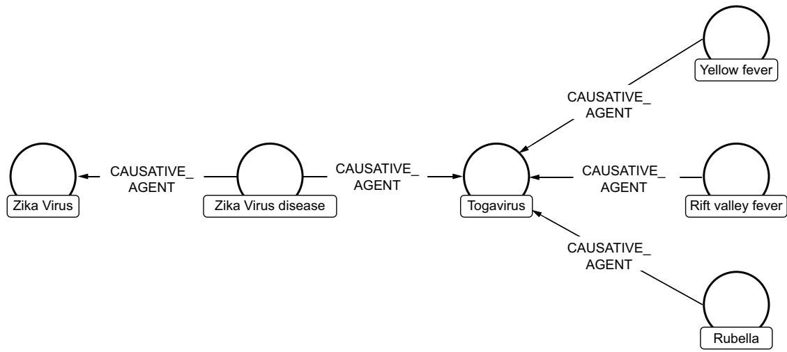  
그림 7.15 CAUSATIVE\_AGENT 관계만 포함하는 SNOMED 온톨로지 경로. 이 관계 하위집합을 탐색하는 것은 동일한 바이러스 유형에 의해 매개되는 질병을 식별하는 데 특히 유용합니다.

검색 질의에 지정된 엔티티(지카 바이러스)와 직접 연결되지 않은 황열, 리프트밸리열, 풍진과 같은 엔티티를 포함하도록 검색을 확장할 수 있습니다. 목록 7.27은 관련 문서를 검색하기 위해 이러한 복잡한 경로를 사용하는 질의를 보여 줍니다. 이 예는 우리 응용 도메인에서 특히 흥미로운데, 공통적으로 지닌 바이러스 유형을 기반으로 유사한 질병을 언급하는 문서를 검색할 수 있기 때문입니다.

#### 목록 7.27 토가바이러스 (Togaviruses)에 의해 유발되는 질병을 언급하는 문서 가져오기


MATCH (m1:MedicalEntity)-[:IS\_SNOMED\_ENTITY]->(s1:SnomedEntity)   
-[r1:SNOMED\_RELATION\*3..3]-(s2:SnomedEntity)   
<-[:IS\_SNOMED\_ENTITY]-(e:MedicalEntity) ≤ 세 개의 SNOMED\_RELATION을 순회하여   
WHERE m1.name = "Zika Virus"   
간접적으로 관련된 의학   
엔티티를 발견합니다

AND all(x IN r1 WHERE x.type = "CAUSATIVE\_AGENT") 세 관계가 모두   
WITH DISTINCT e 의미적 일관성을 보장하기 위해   
CAUSATIVE\_AGENT인   
MATCH path = (f:File)-[:CONTAINS\_PAGE]->(p) 경로를 필터링합니다   
-[r:MENTIONS\_MENTION]->(m)-[:DISAMBIGUATED\_TO]->(e)   
WITH f, e, collect(p.page\_idx) AS pages\_list < 해당 엔티티가 언급된   
RETURN DISTINCT   
모든 페이지의   
f.id AS \`File ID\`, 인덱스를 수집합니다   
pages\_list,   
collect(DISTINCT e.name) AS \`Mentioned entity   
ORDER BY size(\`Mentioned entity\`) DESC   
LIMIT 5

이 질의의 결과는 표 7.4에 제시되어 있습니다.

표 7.4 토가바이러스에 의해 유발되는 질병을 언급하는 문서와 페이지
<table><tr><td>파일 ID</td><td>페이지</td><td>언급된 엔티티</td></tr><tr><td>sample_dataset-PublicUse/ECDC Documents/ west nile virus/TER-Mosquito-surveillance-guide- lines.pdf</td><td>10</td><td>머리밸리뇌염, 일본뇌염, 베네수엘라 말 뇌척수염, 동부 말 뇌척수염, 로스강 바이러스 감염</td></tr><tr><td>sample_dataset-PublicUse/ECDC Documents/ ebola/ebola-preparedness-belgium.pdf</td><td>38</td><td>황열, 리프트밸리열, 웨스트나일열, 뎅기열, 치쿤구니야열</td></tr><tr><td>sample_dataset-PublicUse/ECDC Documents/ west nile virus/communicable-disease-threats- report-18-august-2019-updated-26-august- 2019.pdf</td><td>1</td><td>풍진, 황열, 일본뇌염, 뎅기열, 치쿤구니야열</td></tr><tr><td>sample_dataset-PublicUse/ECDC Documents/ ebola/communicable-disease-threats-report-18- august-2019-updated-26-august-2019.pdf</td><td>1</td><td>풍진, 황열, 일본뇌염, 뎅기열, 치쿤구니야열</td></tr><tr><td>sample_dataset-PublicUse/ECDC Documents/ west nile virus/communicable-disease-threats- report-15-december-2018.pdf</td><td>1</td><td>황열, 뎅기열, 모기 매개 질병, 치쿤구니야열</td></tr></table>

이 사용 사례는 온톨로지 연결을 사용하여 관련 정보를 자동으로 가져오는 데 특히 유용합니다. 검색 문자열에 언급된 엔티티에서 시작하여, 이 검색 엔티티와 관련된 엔티티를 언급하는 여러 텍스트 조각 사이를 탐색할 수 있으며, 이를 통해 IAS 시스템에서 사용자 경험을 풍부하게 할 새로운 가능성이 열립니다.

#### 7.7.3 KG 기반 해석 가능성과 발견


동일한 문장에서 엔티티들이 함께 출현하는 것에서 출발하여, KG 기반 해석 가능성과 발견은 이러한 엔티티들이 온톨로지에서 어떻게 연결되어 있는지, 그리고 이 연결의 성격이 무엇인지 분석할 수 있게 합니다. 어떤 경우에는 온톨로지 연결이 특정 문장에서 함께 출현하는 엔티티들의 이유를 반영합니다(해석 가능성). 이러한 분석은 함께 출현하는 엔티티들을 온톨로지에 비추어 검증할 수도 있습니다. 또 다른 경우에는 온톨로지 연결이 문장이 제공하는 정보를 확장하는 지식을 추가합니다(발견).

이 사용 사례의 가치를 더 잘 이해하기 위해, “인간 혈액 및 혈액 성분의 채취, 검사, 처리, 보관 및 배포에 대한 품질 및 안전 기준을 설정하고 이사회 지침 89/381/EEC를 개정하는 유럽의회 및 이사회 지침 제안”이라는 제목의 문서에서 발췌한 문장들을 포함하는 listing 7.28을 살펴보겠습니다. 이 문서에서 “AIDS”와 “Hepatitis”는 두 번 함께 출현합니다.

#### 리스팅 7.28 AIDS와 Hepatitis가 함께 출현하는 문장


문장 1: 수혜자를 위험에 처하게 하는 기증해서는 안 되는 이유,   
예컨대 안전하지 않은 성행위, HIV/AIDS, 간염, 약물   
중독 및 약물 사용과 남용;   
[...]   
문장 2: 앓고 있거나 앓은 적이 있는 사람의 감염성 질환   
- 바베스열원충증   
- B형 간염(HBsAg 양성 확인)   
- C형 간염   
- 간염, 감염성(원인 불명)   
- HIV/AIDS

“AIDS”와 “Hepatitis”는 이 문장들에서 서로 가깝게 나타나는데, 이는 둘 다 기증 과정에서의 위험 요인 (risk factor)을 나타내기 때문입니다. 즉, 이들은 감염성 질환 (infectious diseases)입니다. 이 정보는 SNOMED에 직접 인코딩되어 있으며, 서로 다른 온톨로지 (ontology) 경로로 표현됩니다. 다음 리스팅은 그 부분집합을 보여 줍니다.

리스팅 7.29 엔터티를 연결하는 경로, 해석 가능성 관점   
(AIDS)-[:PATHOLOGICAL\_PROCESS]->(Infectious disease)   
<-[:DUE\_TO]-(Hepatitis due to infection)   
-[:IS\_A]->(Inflammatory disorder of liver)   
(AIDS)-[:PATHOLOGICAL\_PROCESS]->(Infectious disease)   
<-[:DUE\_TO]-(Viral hepatitis)   
-[:IS\_A]->(Inflammatory disorder of liver)

이러한 온톨로지 경로는 이 두 엔터티 사이의 연결을 정의하고, “AIDS”와 “Hepatitis”의 동시 출현 (co-occurrence)의 의미를 인코딩합니다. 여기서 “Hepatitis”는 SNOMED 온톨로지에서 “Inflammatory disorder of liver”로 표지됩니다. 또한 우리는 추출된 엔터티를 온톨로지에 대해 검증하며, 이를 통해 왜 이러한 엔터티들이 같은 문장에서 추출되었는지 이해할 수 있습니다.

다른 유형의 SNOMED 경로는 AIDS와 간염 사이의 흥미로운 연결을 드러냅니다. 예를 들어, 다음 리스팅의 첫 번째 SNOMED 경로는 AIDS가 간에 영향을 미치는 “Hepatomegaly associated with AIDS”로 정의된 장애와 관련되어 있음을 보여 줍니다. 두 번째 항목은 “Lupus hepatitis”라고 불리는 특정 형태의 간염이 “AIDS”와 같이 면역계를 포함한다고 보고합니다.

리스팅 7.30 엔터티를 연결하는 경로, 발견 관점   
(AIDS)<-[:ASSOCIATED\_WITH]-(Hepatomegaly associated with AIDS (disorder))   
-[:FINDING\_SITE]->(Liver)   
<-[:FINDING\_SITE]-(Inflammatory disorder of liver)   
(AIDS)-[:HAS\_DEFINITIONAL\_MANIFESTATION]->(Immune system finding)   
<-[:HAS\_DEFINITIONAL\_MANIFESTATION]-(Lupus hepatitis)   
-[:IS\_A]->(Inflammatory disorder of liver)

온톨로지는 한 쌍의 의학 엔터티가 왜 문장에 나타나는지 이해하도록 돕고, 이 쌍과 관련된 새로운 세부 사항을 발견할 수 있게 해 줍니다. 그림 7.16은 자연어 콘텐츠로부터 구축된 KG에 도메인 온톨로지를 통합하는 과정을 보여 주며, 동시 출현의 예로 “Dengue”와 “Zika virus”를 제시합니다.

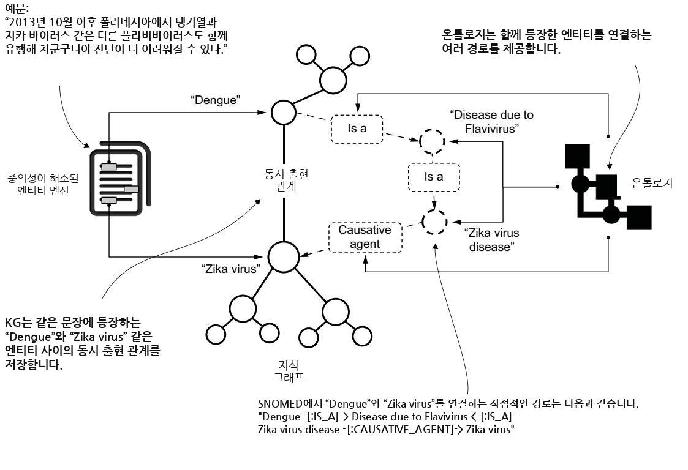  
그림 7.16 KG 기반 해석 가능성 및 발견 과정을 설명하는 정신 모델. 텍스트에서 함께 출현하는 엔터티들은 SNOMED 온톨로지의 여러 경로로 연결될 수 있습니다.

MATCH (n1:MedicalEntity)-[r:COOCCURR]-(n2:MedicalEntity)   
WHERE n1.id = "C0318793" AND n2.type = "Disease or Syndrome" < "C0318793"   
WITH n1, r, n2   
(Zika virus)와 동시 출현하는   
ORDER BY r.count DESC 엔터티를   
MATCH (f:File)-[:CONTAINS\_PAGE]->(p:Page) 필터링하고   
-[r1:MENTIONS\_MENTION]->(m1)-[:DISAMBIGUATED\_TO]->(n1), "Disease or Syndrome"   
(p)-[r2:MENTIONS\_MENTION]->(m2)-[:DISAMBIGUATED\_TO]->(n2) 유형으로 제한합니다   
WHERE r1.sentence\_index = r2.sentence\_index <   
WITH f, p, r1, r2, n2 두 엔터티가   
RETURN DISTINCT 해당 페이지의 같은   
f.id AS \`File ID\`,   
문장에서 언급되었음을 보장합니다   
p.page\_idx AS \`Page index\`,

이제 세부 사항을 살펴보고, 실제 지식 그래프 (KG)를 통해 해석 가능성 (interpretability)과 발견을 가능하게 하기 위해 SoHO 도메인에서 실용적인 해결책을 적용하는 방법을 알아보겠습니다. 다음 listing은 “Zika virus”와 동시 출현하는 상위 다섯 개 엔터티 유형을 검색합니다.

Listing 7.31 “Zika virus”와 동시 출현하는 상위 엔터티 유형 검색

MATCH (m1:MedicalEntity)-[r:COOCCURR]-(m2:MedicalEntity)   
WHERE m1.id= "C0318793"   
RETURN m2.type as \`Entity Type\`, count(m2.type) as \`Number of co-occurrences\`   
ORDER BY count(m2.type) DESC   
LIMIT 5

이 쿼리는 가장 관련성이 높은 엔터티 유형을 식별하기 위해 동시 출현 엔터티 유형의 수를 계산합니다. 결과는 표 7.5에 제시되어 있습니다.

표 7.5 “Zika virus”와 동시 출현하는 상위 엔터티 유형
<table><tr><td>엔터티</td><td>동시 출현 수</td></tr><tr><td>지리적 영역</td><td>255</td></tr><tr><td>정성적 개념</td><td>132</td></tr><tr><td>질병 또는 증후군</td><td>125</td></tr><tr><td>기능적 개념</td><td>106</td></tr><tr><td>소견</td><td>98</td></tr></table>

대부분의 결과에는 지리적 영역이 포함됩니다. 이는 “Zika virus”가 전염성 질병의 확산을 보고하는 공보에서 자주 언급된다는 사실과 관련이 있습니다. 정성적 개념 및 기능적 개념과 같은 다른 범주는 대부분의 경우 우리 예제와 관련이 없는 더 넓은 개념을 포함합니다. 이러한 이유로 우리는 동시 출현하는 질병 또는 증후군 엔터티에 초점을 맞출 것입니다. 다음 쿼리는 동시 출현 엔터티와 이 동시 출현이 추출된 텍스트 부분을 찾습니다.

#### 목록 7.32 문맥과 함께 동시 출현 질병 엔터티 가져오기


```python
n2.id AS `Co-occurring entity id`,
n2.name AS `Co-occurring entity name`,
CASE
WHEN r1.end_chars[0] > r2.start_chars[0]
THEN substring(p.text, r2.start_chars[0], Captures the
➥r1.end_chars[0] - r2.start_chars[0]) < co-occurrence span
ELSE substring(p.text, r1.start_chars[0],
➥r2.end_chars[0] - r1.start_chars[0]) < Ensures that the context window
END AS `Mentions context`
always runs from the earlier to
the later character position
```

표 7.6은 결과의 일부를 보고합니다. 목록 7.32의 쿼리를 실행하여 전체 결과 집합을 분석할 수 있습니다.

표 7.6 “Zika virus”와 동시 출현하는 질병 엔터티 및 맥락
<table><tr><td rowspan=1 colspan=4>파일 ID</td><td rowspan=1 colspan=1>페이지 인덱스</td><td rowspan=1 colspan=1>동시 출현 엔터티 ID</td><td rowspan=1 colspan=2>동시 출현 엔터티 이름</td><td rowspan=1 colspan=1>언급 맥락</td></tr><tr><td rowspan=25 colspan=4>sample_dataset-PublicUse/ECDC Documents/zika virus/Communicable-disease-threats-report-23-apr-2016.pdfsample_dataset-PublicUse/ECDC Documents/ebola/Communicable-disease-threats-report-01-jul-2017.pdfsample_dataset-PublicUse/ECDC Documents/zika virus/Questions and answers aboutZika virus disease.pdfsample_dataset-PublicUse/ECDC Documents/west nilevirus/Communicable-disease-threats-report-2-jul-2016.pdfsample_dataset-PublicUse/EDQM Documents/BTC/optimal-use-of-clotting-factors-and-platelets-european-symposium-proceedings-wildbad-kreuth-initiative-iv-freising-germany.PDF</td><td rowspan=1 colspan=1>8</td><td rowspan=1 colspan=1>C0009450</td><td rowspan=1 colspan=2>전염성</td><td rowspan=7 colspan=1>전염성 질병 위협 보고서 지카 바이러스의 보고된 확정 토착 사례가 있는 국가 및 영토&quot;전염성 질병 위협 보고서 지카: 모기 매개 지카 바이러스 없음&quot;지카 바이러스 질병 위험</td></tr><tr><td rowspan=6 colspan=1>174</td><td rowspan=2 colspan=1>C0009450</td><td rowspan=1 colspan=2>질병</td><td rowspan=1 colspan=1>질병</td></tr><tr><td rowspan=1 colspan=2>전염성</td><td rowspan=1 colspan=1>국가</td></tr><tr><td rowspan=2 colspan=1></td><td rowspan=1 colspan=2>질병</td></tr><tr><td rowspan=1 colspan=2></td><td rowspan=1 colspan=1></td></tr><tr><td rowspan=1 colspan=1></td><td rowspan=2 colspan=2>지카 바이러스</td></tr><tr><td rowspan=1 colspan=1>C0276289</td></tr><tr><td rowspan=3 colspan=2></td><td rowspan=3 colspan=1></td><td rowspan=1 colspan=1></td><td rowspan=1 colspan=2>감염</td><td rowspan=3 colspan=1>유럽 내 전파의 유럽에 대한 위험은 무엇인가? 주요 위험은</td></tr><tr><td rowspan=1 colspan=3></td><td rowspan=1 colspan=1></td><td rowspan=1 colspan=2></td></tr><tr><td rowspan=1 colspan=1></td><td rowspan=1 colspan=2></td></tr><tr><td rowspan=6 colspan=1>1</td><td rowspan=1 colspan=1></td><td rowspan=1 colspan=2></td><td rowspan=15 colspan=1>EU의 위험은 감염된 여행자가 지카 바이러스를 전파할 수 있는 모기가 있는 지역에 바이러스를 유입하는 것과 관련이 있습니다&quot;지카 바이러스는 소두증과 길랭-바레 증후군의 원인입니다&quot;프랑스 및 해외 데파르트망의 치쿤구니야 및 뎅기 바이러스 감염, 그리고 지카 바이러스와 같은 신흥 병원체&quot;</td></tr><tr><td rowspan=1 colspan=1></td><td rowspan=1 colspan=2></td></tr><tr><td rowspan=1 colspan=1></td><td rowspan=1 colspan=2></td></tr><tr><td rowspan=1 colspan=1></td><td rowspan=1 colspan=2></td></tr><tr><td rowspan=1 colspan=1></td><td rowspan=1 colspan=2></td></tr><tr><td rowspan=1 colspan=1>C0018378</td><td rowspan=1 colspan=2>길랭-바레</td></tr><tr><td rowspan=1 colspan=1></td><td rowspan=1 colspan=1></td><td rowspan=1 colspan=1></td><td rowspan=1 colspan=2>증후군</td></tr><tr><td rowspan=1 colspan=2></td><td rowspan=4 colspan=1>300</td><td rowspan=1 colspan=1></td><td rowspan=2 colspan=2>뎅기열,</td></tr><tr><td rowspan=1 colspan=1>C0011311,</td></tr><tr><td rowspan=1 colspan=1>C0008055</td><td rowspan=1 colspan=2>치쿤구니야</td></tr><tr><td rowspan=1 colspan=1></td><td rowspan=1 colspan=1>열</td><td></td></tr><tr><td rowspan=3 colspan=3></td><td rowspan=3 colspan=1></td><td rowspan=1 colspan=1></td><td rowspan=2 colspan=2></td></tr><tr><td rowspan=1 colspan=1></td><td rowspan=3 colspan=2></td></tr><tr><td rowspan=1 colspan=1></td></tr><tr><td rowspan=1 colspan=1></td><td rowspan=1 colspan=1></td></tr></table>

지카 바이러스와 전염성 질병(Communicable Diseases) 엔터티(UMLS ID C0009450)는 같은 문장에서 여러 번 나타납니다. 이는 수집된 많은 공보가 “COMMUNICABLE DISEASE THREATS REPORT Zika: No mosquito-borne Zika virus […].”와 같은 유사한 구조를 갖기 때문입니다. 그러나 다른 동시 출현 예는 해석 가능성과 발견 측면에서 더 관련성이 높습니다. 예를 들어, 지카 바이러스는 지카 바이러스 감염(Zika Virus Infection)(UMLS ID C0276289), 뎅기열(Dengue Fever)(UMLS ID C0011311), 치쿤구니야열(Chikungunya Fever)(UMLS ID C0008055) 엔터티와 자주 동시 출현합니다.

Zika Virus Infection과의 동시 출현은 이해할 수 있습니다. 그러나 이 두 엔터티 사이의 의미론적 연결은 SNOMED 온톨로지 (ontology)에서 직접 확인할 수 있습니다. 다음 쿼리는 해당 SNOMED ID와 레이블을 사용하여 Zika virus disease(SNOMED ID 3928002)와 Zika virus(SNOMED ID 50471002) 사이의 SNOMED 연결을 보여 줍니다.

리스팅 7.33 Zika virus disease와 Zika virus 사이의 경로 얻기   
두 SNOMED 개념 사이의 최단 경로(최대 여덟   
홉)를 SNOMED\_RELATION을 사용하여 찾습니다   
MATCH (s1), (s2)   
WHERE s1.id = "3928002" AND s2.id = "50471002"   
WITH s1, s2, allShortestPaths((s1)-[:SNOMED\_RELATION\*1..8]-(s2)) AS paths   
UNWIND paths AS path   
WITH relationships(path) AS path\_edges, 다음을 사용합니다   
nodes(path) AS path\_nodes 관계 유형   
WITH (기본값 "IS\_A")   
[n IN path\_nodes n.name] AS node\_names, 유효한   
[r IN path\_edges COALESCE(r.type, 'IS\_A')] AS rel\_types, 레이블링을 보장하기 위해   
[n IN path\_edges startnode(n).name] AS rel\_starts <   
WITH [i IN range(0, size(node\_names) - 1) 각 관계의 시작   
노드 이름을 검색하여   
WHEN i = size(node\_names) - 1   
관계 방향을 결정합니다   
경로 문자열을 완성합니다 THEN '(' + node\_names[i] + ')'   
WHEN node\_names[i] = rel\_starts[i]   
THEN '(' + node\_names[i] + ')' + '-[:' + rel\_types[i] + ']->' <   
ELSE '(' + node\_names[i] + ')' + '<-[:' + rel\_types[i] + ']-'   
] AS string\_paths   
RETURN DISTINCT apoc.text.join(string\_paths, '') AS \`Extracted paths\`   
관계가 현재 노드로 들어오는 방향임을 나타냅니다 관계가 현재 노드에서 나가는 방향임을 나타냅니다

이 쿼리는 Zika virus와 Zika virus disease 사이의 모든 최단 경로를 보기 좋게 출력된 형식으로 반환합니다. 결과는 다음에 제시합니다.

#### 목록 7.34 Zika virus disease와 Zika virus를 연결하는 경로


이 경우 SNOMED 온톨로지는 이러한 동시 출현 (co-occurrence)의 의미를 명확히 “해석”하는 관계를 제공합니다. 이러한 연결은 임상 및 역학 텍스트에서 질병과 그 원인 병원체 사이의 언어적·개념적 근접성을 반영합니다. 우리의 시나리오에서는 그래프 기반 증강 정보를 제공하여, 이러한 동시 출현 엔터티들이 왜 검증될 수 있는지를 명시적으로 보여 줍니다.

표 7.6에 보고된 바와 같이, Zika virus 의료 엔터티는 또 다른 질병인 Dengue Fever와도 동시 출현합니다. 목록 7.33의 쿼리를 실행하고 WHERE 절을 s1.id="38362002" AND s2.id="50471002"로 바꾸면, 이 두 엔터티를 연결하는 온톨로지 경로를 탐색할 수 있습니다. 결과는 다음과 같습니다.

#### 목록 7.35 Dengue와 Zika virus를 연결하는 경로


```c
(Dengue)-[:IS_A]->(Disease due to Flavivirus)
<-[:IS_A]-(Zika virus disease)-[:CAUSATIVE_AGENT]->(Zika virus)
(Dengue)-[:IS_A]->(Mosquito-borne flavivirus fever)
<-[:IS_A]-(Zika virus disease)-[:CAUSATIVE_AGENT]->(Zika virus)
(Dengue)-[:IS_A]->(Viral disease)
<-[:IS_A]-(Zika virus disease)-[:CAUSATIVE_AGENT]->(Zika virus)
(Dengue)-[:PATHOLOGICAL_PROCESS_(ATTRIBUTE)]->(Infectious process
➥(qualifier value))
<-[:PATHOLOGICAL_PROCESS_(ATTRIBUTE)]-(Congenital Zika virus infection)
-[:CAUSATIVE_AGENT]->(Zika virus)
(Dengue)-[:CAUSATIVE_AGENT]->(Arthropod-borne organism)
<-[:CAUSATIVE_AGENT]-(Zika virus disease)
-[:CAUSATIVE_AGENT]->(Zika virus)
(Dengue)-[:PATHOLOGICAL_PROCESS_(ATTRIBUTE)]->(Infectious process
➥(qualifier value))
<-[:PATHOLOGICAL_PROCESS_(ATTRIBUTE)]-(Zika virus disease)
-[:CAUSATIVE_AGENT]->(Zika virus)
(Dengue)-[:PATHOLOGICAL_PROCESS]->(Infectious disease)
<-[:PATHOLOGICAL_PROCESS]-(Zika virus disease)
-[:CAUSATIVE_AGENT]->(Zika virus)
(Dengue)-[:CAUSATIVE_AGENT]->(Togavirus)
<-[:CAUSATIVE_AGENT]-(Zika virus disease)
-[:CAUSATIVE_AGENT]->(Zika virus)
```

여러 경로가 Dengue와 Zika virus를 연결하며, 여기에는 Viral disease와 Infectious disease 같은 핵심 엔터티가 포함되어 있어 이러한 질병들이 같은 문장에서 동시 출현하는 이유를 해석할 수 있게 해 줍니다(표 7.6의 마지막 행 참조). 또한 Disease due to Flavivirus, Togavirus, Mosquito-borne flavivirus fever와 같은 엔터티는 Dengue와 Zika virus가 언급된 문장과 무관하게 이들이 어떻게 연결되는지에 대한 통찰을 제공합니다.

이 검증 과정은 HPO를 포함한 다른 생의학 온톨로지로 확장될 수 있습니다. 예를 들어, 다음 쿼리의 결과는 표현형 특징 (phenotypic features)(예: 신세포암 (Renal cell carcinoma), 백혈병 (Leukemia))과 관련 질병 엔터티(예: 폰 히펠-린다우 증후군 (von Hippel-Lindau syndrome), 대장암 (Colorectal cancer),

망막모세포종 (RETINOBLASTOMA)) 사이의 동시 출현 패턴을 어떻게 체계적으로 추출하고 검증할 수 있는지를 보여 줍니다. 이 접근법은 문서 수준의 증거에 기반한 임상적으로 관련 있는 표현형–질병 연관성의 식별을 가능하게 합니다.

#### 목록 7.36 표현형 특징과 동시 출현하는 HPO 질병 엔터티 찾기


MATCH (d:HpoDiseaseEntity)<-[:IS\_DISEASE\_ENTITY]-(n1:MedicalEntity)   
-[r:COOCCURR]-(n2:MedicalEntity)-[:IS\_HPO\_ENTITY]->(h:HpoEntity)   
WHERE EXISTS((d)-[:HAS\_PHENOTYPIC\_FEATURE]->(h))   
AND n2.id in ["C0007134", "C0376545"] < 의료 엔터티 쌍을 선택합니다. 여기서   
WITH n1, n2, d, h   
n1은 고정된 부분집합의   
표현형 엔터티와 동시 출현하며,   
MATCH (f:File)-[:CONTAINS\_PAGE]->(p:Page) 표현형 h를 가진 질병 d에 연결됩니다.   
-[r1:MENTIONS\_MENTION]->(m1)-[:DISAMBIGUATED\_TO]->(n1),   
(p)-[r2:MENTIONS\_MENTION]->(m2)-[:DISAMBIGUATED\_TO]->(n2)   
WHERE r1.sentence\_index = r2.sentence\_index < 결과를 동일한 문장에   
WITH f, p, r1, r2, n1, n2, d, h 나타나는 멘션으로   
필터링합니다.   
RETURN DISTINCT   
f.id AS \`File name\`,   
p.page\_idx AS \`Page index\`,   
h.label AS \`HpoEntity name\`,   
d.label AS \`HpoDiseaseEntity name\`, 동시 출현   
CASE 주변 텍스트를   
WHEN r1.end\_chars[0] > r2.start\_chars[0] 추출하여   
THEN substring(p.text, r2.start\_chars[0], r1.end\_chars[0] 스니펫을   
- r2.start\_chars[0]) < 형성합니다.   
ELSE substring(p.text, r1.start\_chars[0], r2.end\_chars[0]   
- r1.start\_chars[0]) < 텍스트 추출을 위한 올바른   
END AS \`Mentions context\`   
순서를 보장합니다.

앞선 예들과 달리, 여기서는 하나의 의료 엔터티가 질병이어야 하고 다른 하나는 HPO 주석 파일에 색인된 표현형 특징이어야 한다고 지정합니다. 이 질의의 결과는 표 7.7에 제시되어 있습니다.

표 7.7 표현형 특징과 동시 출현하는 HPO 질병 엔티티
<table><tr><td colspan="1" rowspan="1">파일 ID</td><td colspan="1" rowspan="1">페이지 인덱스</td><td colspan="1" rowspan="1">HPO 이름</td><td colspan="2" rowspan="1">HPO 질병명</td><td colspan="1" rowspan="1">언급 맥락</td></tr><tr><td colspan="1" rowspan="4">sample_dataset-PublicUse/EDQM Documents/BTC/guide-to-the-quality-and-safety-of-organs-for-transplantation-7th-edition.PDFsample_dataset-PublicUse/EDQM Documents/BTC/guide-to-the-quality-and-safety-of-organs-for-transplantation-7th-edition.PDF</td><td colspan="1" rowspan="4">275228</td><td colspan="1" rowspan="1">신세포</td><td colspan="2" rowspan="1">히펠-린다우</td><td colspan="1" rowspan="4">"[..] RCC와 관련된 부적절한 위험이 있을 때 히펠-린다우 증후군을 고려할 수 있습니다(바람직하게는 심장 기증의 경우) [...]"[...] "RCC들, 신경내분비 암종 두 건, 유방암 한 건, 대장암 한 건 [..]"</td></tr><tr><td colspan="1" rowspan="1">암종신세포</td><td colspan="2" rowspan="1">증후군대장암</td></tr><tr><td colspan="1" rowspan="1">암종</td><td colspan="2" rowspan="2"></td><td colspan="1" rowspan="1"></td></tr><tr><td colspan="1" rowspan="1"></td></tr><tr><td colspan="1" rowspan="1">sample_dataset-PublicUse/BTCkey docs/CELEX-_52002PC0319_EN_TXT.pdf</td><td colspan="1" rowspan="1">12</td><td colspan="1" rowspan="1">백혈병</td><td colspan="1" rowspan="1">망막모세포종</td><td colspan="3" rowspan="1">"[...] 망막모세포종, 전극부 흑색종, 혈액학적 신생물 [...]"</td></tr></table>

이 활용 사례는 동시 출현하는 엔티티 유형으로부터 흥미로운 패턴을 도출할 수 있는 분석가들에게 실질적으로 적용될 수 있습니다. 예를 들어, 여러 질병이 동시 출현하는 경우, 우리는 어떤 온톨로지 경로가 이러한 질병들을 연결하는지 검증할 수 있습니다. 반면, 동시 출현하는 엔티티들 사이에 흥미로운 경로가 없다는 것은 생의학 온톨로지에 인코딩되어 있지 않은 새로운 지식을 시사하며, 우리는 다음에서 이 경우를 논의합니다.

#### 7.7.4 새로운 지식의 발견


연구 발전으로 인해 빠르게 변화하는 맥락에서는 텍스트의 일부 지식이 아직 의학 온톨로지에 통합되지 않았습니다. 그 결과, 같은 문장에서 동시 출현하는 엔티티들이 도메인 온톨로지에서 해석 가능성과 발견의 측면에서 직접적으로 대응되지 않을 수 있습니다.

온톨로지를 사용하여 지식 그래프 (KG)의 정보를 풍부하게 하는 대신, 텍스트 콘텐츠로부터 구축된 KG를 사용하여 온톨로지에 통합될 수 있는 새로운 사실을 제안할 수 있습니다. 이 사용 사례를 통해 우리는 의학 도메인에서 유용할 수 있는 텍스트 내 새로운 패턴을 식별할 수 있습니다. 이러한 유형의 패턴을 식별하기 위해, 다음 질의를 실행하여 지카 바이러스와 가장 많이 동시 출현하는 질병들을 다시 살펴보겠습니다.

목록 7.37 텍스트에서 “지카 바이러스”와 동시 출현하는 상위 질병 찾기   
MATCH (n1:MedicalEntity)-[r:COOCCURR]-(n2:MedicalEntity)   
WHERE n1.id= "C0318793" and n2.type = "Disease or Syndrome"   
RETURN n2.name, r.count   
ORDER BY r.count DESC   
LIMIT 5

결과는 표 7.8에 제시되어 있습니다.

표 7.8 지카 바이러스와 동시 출현하는 상위 질병
<table><tr><td>질병 엔티티</td><td>출현 횟수</td></tr><tr><td>감염성 질환</td><td>606</td></tr><tr><td>지카 바이러스 감염</td><td>520</td></tr><tr><td>뎅기열</td><td>206</td></tr><tr><td>길랭-바레 증후군 (Guillain-Barre Syndrome)</td><td>195</td></tr><tr><td>치쿤구니야열</td><td>155</td></tr></table>

결과에서 여러 질병이 지카 바이러스 엔티티와 연관되어 있습니다. 그중 길랭-바레 증후군은 다른 질병들과 달리 매개체 전파 질환 (vector-borne disease)이 아니기 때문에 두드러집니다. 이는 이 질병의 공동 언급이 잠재적으로 예상 밖이며 임상적으로 중요할 수 있음을 의미하고, 단순한 공동 풍토성이 아니라 가능한 합병증을 시사합니다.

이러한 이유로 지카 바이러스와 길랭-바레 증후군을 모두 언급하는 텍스트 콘텐츠를 탐색하여 추가 세부 정보를 얻는 것이 유용합니다. 목록 7.32의 질의를 재사용하되, 첫 번째 WHERE 절을 각각 지카 바이러스와 길랭-바레 증후군의 UMLS id인 n1.id= "C0318793" AND n2.id $= "C0018378"$로 대체할 수 있습니다(또한 이 경우 유용하지 않기 때문에 결과에서 “동시 출현 엔티티 id”와 “동시 출현 엔티티 이름” 필드를 제거했습니다). 중복 결과를 제거하여 얻은 이 질의의 정제된 결과는 표 7.9에 제시되어 있습니다.

표 7.9 지카 바이러스와 길랭-바레 증후군을 모두 언급한 텍스트
<table><tr><td>파일 ID</td><td>페이지 색인</td><td>언급 맥락</td></tr><tr><td>sample_dataset-PublicUse/ECDC Documents/ebola/communicable- disease-threats-report-20-feb-2016.pdf</td><td>3</td><td>&quot;2016년 2월 12일에 발표된 지카와 잠재적 합병증에 관하여, 여섯 개 국가가 소두증(브라질) 및 길랭-바레 증후군 사례 발생률 증가를 보고했습니다&quot;</td></tr><tr><td>sample_dataset-PublicUse/ECDC Documents/zika virus/zika-virus-rapid- risk-assessment-11-april-2016.docx.pdf</td><td>2</td><td>&quot;지카 바이러스 유행 상황에서, 보건 서비스와 의료인은 신경학적 증후군(길랭-바레)의 발생 가능성에 대해 경계해야 합니다</td></tr><tr><td>sample_dataset-PublicUse/ECDC Documents/ebola/communicable- disease-threats-report-16-june-2019.pdf</td><td>3</td><td>증후군)&quot; 길랭-바레는 세균 감염, 호흡기 바이러스, 엔테로바이러스, 그리고 뎅기 및 지카와 같은 아르보바이러스에 의해 유발되는 것으로 알려져 있습니다&quot;</td></tr></table>

결과는 지카 바이러스가 길랭-바레 증후군의 원인 중 하나라고 명시합니다. 따라서 우리는 SNOMED와 같은 온톨로지가 Guillain-Barre syndrome-[:CAUSATIVE\_AGENT]->Zika virus와 같은 사실을 포함할 것으로 예상합니다. 목록 7.33의 질의를 실행하고 WHERE 절에서 지카 바이러스 질환(SNOMED ID 3928002)을 감염성 신경염(길랭-바레 증후군에 대한 SNOMED 용어; SNOMED ID 40956001)으로 대체하여 확인해 보겠습니다. 다음 목록은 결과의 일부를 보여 줍니다. 여러 SNOMED 온톨로지 경로가 이러한 엔티티들을 연결하지만, 이 경로들의 대부분은 둘 사이의 의미 있는 연결을 나타내지 않습니다.

#### Listing 7.38 지카 바이러스와 감염성 신경염을 연결하는 경로


(지카 바이러스)<-[:CAUSATIVE\_AGENT]-(선천성 지카 바이러스 감염)   
-[:PATHOLOGICAL\_PROCESS\_(ATTRIBUTE)]->(감염 과정(한정자 값))   
<-[:PATHOLOGICAL\_PROCESS\_(ATTRIBUTE)]-(B형 바이러스 간염의 재활성화   
(장애))   
-[:ASSOCIATED\_MORPHOLOGY]->(염증)   
<-[:ASSOCIATED\_MORPHOLOGY]-(감염성 신경염)

```lisp
(Zika virus)<-[:CAUSATIVE_AGENT]-(Zika virus disease)
-[:CAUSATIVE_AGENT]->(Togavirus)
<-[:CAUSATIVE_AGENT]-(Mosquito-borne flavivirus encephalitis)
-[:ASSOCIATED_MORPHOLOGY]->(Inflammation)
<-[:ASSOCIATED_MORPHOLOGY]-(Infectious neuronitis)
```

첫 번째 항목에서 지카 바이러스는 감염성 신경염과 연결됩니다. 이는 지카 바이러스가 선천성 지카 바이러스 감염의 원인 병원체이며, 이 감염이 감염 과정이기 때문입니다. 문제는 감염 과정(한정자 값) 노드가 B형 바이러스 간염의 재활성화(장애)와 같은 여러 전염성 과정에 연결되어 있다는 점입니다. 이 장애는 염증과 관련되어 있으며, 염증은 또한 감염성 신경염의 형태학적 발현이기도 합니다. 유사한 추론을 Listing 7.38의 두 번째 항목에도 적용할 수 있습니다. 이러한 경로는 감염 과정(한정자 값) 및 염증과 같은 허브 노드를 포함하기 때문에 검색되었습니다. 이러한 허브 노드는 감염 과정과 관련된 막대한 수의 노드에 연결되어 있습니다.

한 가지 해결책은 이러한 허브 노드를 포함하는 경로를 필터링하는 것입니다. 이를 위해 Neo4j Graph Data Science Library(GDS)가 제공하는 그래프 데이터 과학 알고리즘을 사용할 수 있으며, 이 라이브러리는 그래프에서 노드의 중심성(centrality)을 계산하는 도구를 제공합니다. 이 알고리즘을 실행하기 위한 첫 번째 단계는 분석을 수행하는 데 필요한 관련 노드와 관계 집합을 포함하는 그래프 투영(graph projection)을 생성하는 것입니다. 이 경우 우리는 SNOMED 온톨로지 그래프에 초점을 맞추고자 하며, 다음 코드를 실행할 수 있습니다.

```sql
Listing 7.39 Creating a projection on the SNOMED ontology
CALL gds.graph.project(
'snomedGraph',
'SnomedEntity',
'SNOMED_RELATION'
YIELD
graphName AS graph,
relationshipProjection AS knowsProjection,
nodeCount AS nodes,
relationshipCount AS rels;
```

투영을 생성한 후에는 스트리밍 모드에서 차수 알고리즘(degree algorithm)을 실행하여 가장 많이 연결된 노드를 검색하고, 이 결과를 사용하여 우리의 목적과 관련이 없는 경로를 필터링할 수 있습니다.

#### 리스팅 7.40 허브 노드 필터링


```sql
CALL gds.degree.stream('snomedGraph')
YIELD nodeId, score
WITH gds.util.asNode(nodeId).name AS name, score AS degree
ORDER BY degree DESC
LIMIT 350 Collects the top 350 high-degree
WITH collect(name) AS hub_nodes < nodes (central hubs)
```

### 7.7 지식 그래프(KG) 기반 사용 사례


MATCH (s1), (s2)   
WHERE s1.id = "3928002" AND s2.id = "40956001" 두   
WITH s1, SNOMED 개념 노드 사이의   
모든 최단 경로(1–8홉)를 찾습니다   
s2,   
allShortestPaths((s1)-[:SNOMED\_RELATION\*1..8]-(s2)) AS paths,   
hub\_nodes <   
UNWIND paths AS path   
WITH relationships(path) AS path\_edges, 경로의   
nodes(path) AS path\_nodes, 각 관계에 대해 소스 노드의   
hub\_nodes 관계 유형 이름을 누락된 경우   
WITH “IS\_A”로 기본 설정합니다   
[n IN path\_nodes n.name] AS node\_names, 최종 문자열에서   
[r IN path\_edges COALESCE(r.type, 'IS\_A')] AS rel\_types, 방향성을   
[n IN path\_edges startnode(n).name] AS rel\_starts, < 결정합니다   
hub\_nodes   
WHERE NOT any(x IN node\_names WHERE x IN hub\_nodes) < 허브 노드를   
WITH [i IN range(0, size(node\_names) - 1) |   
통과하는 모든 경로를   
CASE 제외합니다   
WHEN i = size(node\_names) - 1   
THEN '(' + node\_names[i] + ')' 경로의 끝을 표시합니다   
WHEN node\_names[i] = rel\_starts[i]   
> THEN '(' + node\_names[i] + ')' + '-[:' + rel\_types[i] + ']->'   
ELSE '(' + node\_names[i] + ')' + '<-[:' + rel\_types[i] + ']-' <   
] AS string\_paths   
RETURN DISTINCT apoc.text.join(string\_paths, '') AS \`Extracted paths\`   
현재 노드와 다음 노드 사이의 정방향(나가는) 관계를 렌더링합니다 다음 노드에서   
현재 노드로 향하는 역방향(들어오는) 관계를 렌더링합니다

이 쿼리는 두 엔터티를 연결하는 관련 경로의 탐지와 노드의 차수 계산을 결합합니다. 차수가 더 높은 노드를 포함하는 경로는 결과에서 제외됩니다. 다음 리스팅은 이 필터링 과정 이후의 결과를 보여 줍니다.

#### 리스팅 7.41 지카 바이러스 질환과 감염성 신경염을 연결하는 수정된 경로


```c
(Zika virus disease)-[:IS_A]->(Viral disease)
<-[:IS_A]-(Erythema multiforme caused by virus (disorder))
-[:PATHOLOGICAL_PROCESS_(ATTRIBUTE)]->(AI – autoimmune)
<-[:PATHOLOGICAL_PROCESS_(ATTRIBUTE)]-(Infectious neuronitis)
(Zika virus disease)-[:IS_A]->(Disease due to Flavivirus)
<-[:IS_A]-(Acute hepatitis C)
-[:IS_A]->(Acute inflammatory disorder)
<-[:IS_A]-(Infectious neuronitis)
(Zika virus disease)<-[:ASSOCIATED_FINDING]-(Presumptive recent Zika
negative)
-[:IS_A]->(Context-dependent finding (context-dependent category))
<-[:IS_A]-(History of Guillain Barre syndrome (situation))
-[:ASSOCIATED_FINDING]->(Infectious neuronitis)
```

```lisp
(Zika virus disease)-[:IS_A]->(Viral disease)
<-[:IS_A]-(Common cold)-[:IS_A]->(Acute inflammatory disorder)
<-[:IS_A]-(Infectious neuronitis)
(Zika virus disease)-[:IS_A]->(Viral disease)
<-[:IS_A]-(VHF – Viral haemorrhagic fever)
-[:IS_A]->(Acute inflammatory disorder)
<-[:IS_A]-(Infectious neuronitis)
(Zika virus disease)<-[:ASSOCIATED_FINDING]-(Presumptive recent Zik
positive)
-[:IS_A]->(Context-dependent finding (context-dependent category))
<-[:IS_A]-(History of Guillain Barre syndrome (situation))
-[:ASSOCIATED_FINDING]->(Infectious neuronitis)
(Zika virus disease)-[:IS_A]->(Viral disease)
<-[:TEMPORALLY_FOLLOWS]-(Transient paroxysmal cold hemoglobinuria)
-[:PATHOLOGICAL_PROCESS_(ATTRIBUTE)]->(AI – autoimmune)
<-[:PATHOLOGICAL_PROCESS_(ATTRIBUTE)]-(Infectious neuronitis)
(Zika virus disease)-[:IS_A]->(Viral disease)
<-[:DUE_TO]-(Erythema multiforme caused by virus (disorder))
-[:PATHOLOGICAL_PROCESS_(ATTRIBUTE)]->(AI – autoimmune)
<-[:PATHOLOGICAL_PROCESS_(ATTRIBUTE)]-(Infectious neuronitis)
(Zika virus disease)-[:IS_A]->(Viral disease)
<-[:AFTER]-(Transient paroxysmal cold hemoglobinuria)
-[:PATHOLOGICAL_PROCESS_(ATTRIBUTE)]->(AI – autoimmune)
<-[:PATHOLOGICAL_PROCESS_(ATTRIBUTE)]-(Infectious neuronitis)
```

이번에는 기본 쿼리로 탐지된 11,185개의 경로와 비교하여 9개 항목의 결과 집합을 검색했습니다. 그러나 결과에는 여전히 바이러스 질환과 같은 일반 엔터티가 포함되어 있으며, 이는 지카 바이러스 질환을 감염성 신경염에 연결하는 데 사용할 수 있는 임의의 바이러스 질환에 지카 바이러스 질환을 연결합니다. 다시 말해, 이러한 엔터티 간의 직접 연결은 SNOMED 온톨로지에 인코딩되어 있지 않습니다. 이는 KG에 정의된 엔터티의 공동 출현 (co-occurrence)을 활용하여 선순환적으로 도메인 온톨로지를 풍부하게 할 수 있는 전형적인 예입니다.

이 메커니즘은 텍스트에서 의미 있는 관계를 추출함으로써 기하급수적으로 강화될 수 있습니다. 이 접근법에서 시작점은 공동 출현 연결보다 더 구체적인 추출된 관계로 표현됩니다. 그림 7.17을 참조하십시오.

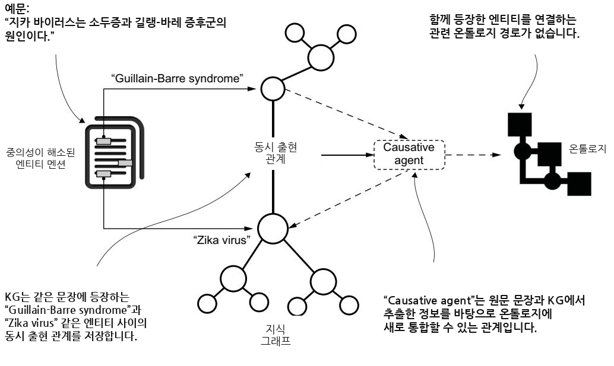  
그림 7.17 새로운 지식을 발견하는 과정을 설명하는 정신적 모델. 이 경우 “지카 바이러스”와 “길랭-바레 증후군”은 동일한 문장에 여러 번 등장하지만, 의료 온톨로지는 이러한 엔터티 간의 관련 연결을 제공하지 않습니다.

#### 요약


명명 엔터티 명확화 (NED)는 텍스트에 언급된 엔터티를 참조 지식 베이스에 연결할 수 있게 해 줍니다.

NED를 KG 기술과 결합하면 핵심 도메인에서 고급 서비스를 개발할 새로운 기회가 열립니다.

KG를 구축하려면 스키마 정의, 문서 수집, 이러한 문서에서 엔터티 명확화, 도메인 온톨로지 통합, 추출된 엔터티 매핑, 동일한 문장에 위치한 엔터티 간의 동시 출현 관계 생성 등 여러 단계가 필요합니다.

응용 도메인의 다양한 사용 사례, 즉 개념 검색, 구조화된 지식 기반 검색, KG 기반 해석 가능성과 발견, 새로운 지식의 발굴을 지원하기 위해 KG에 대해 고급 분석을 수행할 수 있습니다.
