# 개체명 중의성 해소 — 쉬운 해설판

> 이 글은 Alessandro Negro의 『Knowledge Graphs and LLMs in Action』 7장 "Named entity disambiguation"을 한국어로 풀어 쓴 해설판입니다. 원문의 모든 문단·그림·코드·표를 빠짐없이 담되, 번역을 넘어 "왜 이렇게 하는지"까지 대화하듯 설명합니다. 이 장의 큰 그림은 이렇습니다. 텍스트에서 뽑아낸 단어가 정확히 "어느 개념"을 가리키는지 지식 베이스에 딱 붙여 주는 기술이 **개체명 중의성 해소(NED)** 이고, 여기에 **지식 그래프(KG)** 를 결합하면 의료처럼 정확성이 생명인 영역에서 강력한 분석 서비스를 만들 수 있다는 것입니다. LLM은 아는 게 많지만 가끔 사실을 지어내는 달변가에 가깝고, 지식 그래프는 검증된 사실을 차곡차곡 쌓아 둔 대장(臺帳)에 가깝습니다. 이 장은 그 둘을 어떻게 손잡게 하는지를 실제 의료 사례로 보여 줍니다.

---

## This chapter covers — 이 장에서 다루는 것

이 장에서는 다음 세 가지를 다룹니다.

- 개체명 중의성 해소를 지식 그래프 기술과 결합하는 방법
- 여러 출처로부터 하나의 지식 그래프를 구축하는 방법
- 그렇게 만든 그래프 위에서 고급 분석을 수행하는 방법

**자연어 처리(NLP, Natural Language Processing)**, 즉 사람의 말과 글을 컴퓨터가 다루도록 처리하는 기술은 비정형 데이터로부터 **지식 그래프(KG, Knowledge Graph)** 를 자동으로 구축하는 과정에서 결정적인 역할을 합니다. 여기서 지식 그래프란 개념(노드)과 그 사이의 관계(엣지)를 연결해 지식을 표현한 구조를 말합니다. 이 과정의 핵심 작업 중 하나가 **개체명 인식(NER, Named Entity Recognition)** 입니다. NER은 날것 그대로의 텍스트에서 우리가 관심을 두는 개체(named entity)가 언급된 부분을 찾아내는 작업입니다. 그리고 그렇게 찾아낸 개체를 사람, 조직, 장소, 질병처럼 미리 정해 둔 범주 중 하나로 분류합니다. NER은 지식 그래프를 만드는 데 중요한 구성 요소이긴 하지만, 그것만으로는 우리 응용 분야의 텍스트를 정밀하게 이해하도록 해 주지는 못합니다. 바로 이 지점에서 이 장의 이야기가 시작됩니다.

---

### 7.1 From recognition to disambiguation — 인식에서 중의성 해소로

의료 분야의 이해관계자들이 하는 활동을 지원하는 **지능형 자문 시스템(IAS, Intelligent Advisory System)** 을 개발한다고 상상해 봅시다. 이런 시스템이 반드시 갖춰야 할 특성 하나가 바로 상호작용성(interactivity)입니다. 상호작용성이란 여러 차례 주고받는 대화를 통해 사람과 정보를 교환하는 능력을 말합니다. 이런 정보 교환을 가능하게 하는 기능으로는 다음 두 가지가 있습니다.

- 자연어 속에서 의미 있는 개체를 탐지하는 것
- 그렇게 탐지한 개체에 대한 정보를 서로 다른 여러 지식 출처에서 가져오는 것

그런데 NER 추론만으로는 이 두 기능을 제공할 수 없습니다. 예를 들어, 유럽질병예방통제센터(ECDC, European Centre for Disease Prevention and Control)가 발행한 주간 회보 [1]의 다음 문단을 살펴봅시다.

> 4월 13일 주간에, 벨리즈(Belize)에서 처음으로 모기 매개 지카 바이러스(Zika virus) 전파가 보고되었습니다. 관찰된 선천성 지카 증후군(congenital Zika syndrome) 및 기타 신경학적 합병증의 증가에 관한 업데이트. 소두증(Microcephaly) 및 지카 바이러스 감염(Zika virus infection)과 잠재적으로 연관된 기타 태아 기형.

이 짧은 텍스트에 "Zika(지카)"라는 단어가 세 번 등장합니다. 그런데 그 의미는 주변 맥락에 따라 달라집니다. 이 특정 작업에서 우리가 높은 정확도를 낼 수 있다고 가정해 보면, NER 모델의 출력은 첫 번째 등장이 바이러스(virus) 개체를 가리킨다는 것을 식별해 냅니다. 반면 두 번째와 세 번째 등장은 질병(disease) 개체를 가리킵니다. 그렇다면 이 둘은 같은 질병일까요? 겉보기에는 그렇습니다. 둘 다 "Zika"라는 단어를 언급하니까요. 하지만 의학처럼 정확성이 생명인 영역에서는 최대한 정밀해야 합니다. 어떤 활용 사례에서는 전통적인 지카 질환 또는 감염(세 번째 언급)과 그것의 선천성 형태(두 번째 언급)를 구분하는 것이 결정적으로 중요합니다. 이런 용어들을 구분하는 일은 도메인 전문가에게는 어렵지 않을 수 있지만, 처리해야 할 문서의 양이 늘어나면 사람이 일일이 하기에는 현실적으로 불가능해집니다.

이런 문제들을 다루는 것이 또 다른 NLP 작업, 바로 **개체명 중의성 해소(NED, Named Entity Disambiguation)** [2]입니다. NED 작업의 목표는 각 언급의 맥락을 살펴봄으로써 "Zika"라는 단어가 지닌 뜻의 불확실성이나 모호함을 자동으로 제거하고, 그 언급을 지식 베이스(knowledge base) 안의 특정 개체에 연결하는 것입니다. 이런 확정된 개체(ground entity)와 그 참조 지식 베이스의 예로는, **통합 의학 언어 시스템(UMLS, Unified Medical Language System)** [3] 안에 있는 "선천성 지카 바이러스 감염(Congenital Zika virus infection)" 개체를 들 수 있습니다. 이것은 UMLS에 함께 정의되어 있는 "지카 바이러스(Zika virus)" 개체나 "지카 바이러스 감염(Zika virus infection)" 개체와는 다른 개체입니다. 그림 7.1은 UMLS 웹사이트에서 지카 바이러스 개체에 관한 세부 정보를 보여 주는 화면 캡처입니다.

원문 텍스트에 등장하는 "Zika"들을 이렇게 매핑함으로써, 우리는 "의미 있는 개체를 탐지한다"는 IAS의 요구사항을 충족합니다. 이 경우 그 개체는 UMLS 개체입니다. 그런데 이게 전부가 아닙니다. 이 매핑을 통해 우리는 IAS의 두 번째 요구사항, 즉 다양한 지식 출처로부터 정보를 가져오는 데 필요한 조건까지 은연중에 마련한 셈이 됩니다. 탐지된 UMLS 개체를 출발점으로 삼아, 우리는 추출된 개체와 관련된 여러 생의학 온톨로지(biomedical ontology) 안의 맥락적 지식을 탐색할 수 있습니다. 의학 온톨로지는 예를 들어 우리 예시에서 중의성이 해소된 개체들 사이의 연결을 되찾아 오게 해 줍니다. 어떤 경우에는 온톨로지가 아주 단순한(trivial) 관계를 명시적으로 정의해 두고 있습니다. 예컨대 지카 바이러스가 두 증후군 모두의 **원인체(CAUSATIVE_AGENT)** 라고 지정하는 식입니다. 반면 그리 단순하지 않은 관계도 있습니다. 예를 들어 캄필로박터 감염(Campylobacter infection)이라는 질병과 에이즈(AIDS)라는 질병은 서로 연결될 수 있는데, 전자가 후자의 특정 형태인 "장 흡수 장애를 동반한 에이즈(AIDS with intestinal malabsorption)"처럼 장관(intestinal tract)에 영향을 주기 때문입니다.

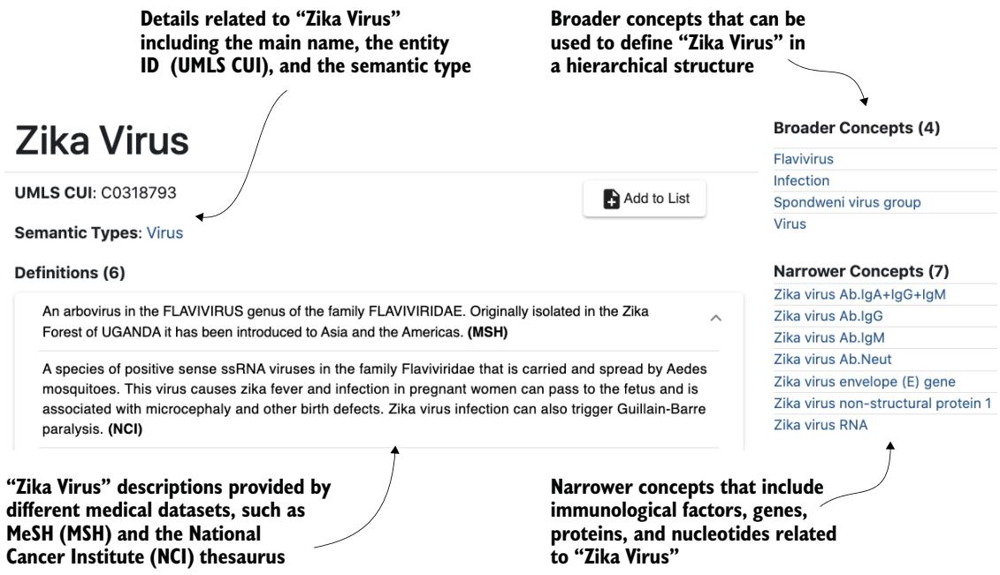
그림 7.1 UMLS 웹사이트에서 지카 바이러스 개체에 관한 정보를 보여 주는 화면 캡처. 이 정보에는 이름, ID(개념 고유 식별자, CUI), 의미 유형(semantic type), 그리고 정의 모음, 상위 개념(broader concepts), 하위 개념(narrower concepts)이 포함되어 있습니다.

이 장은 의료 도메인의 텍스트 콘텐츠에 NED 모델을 어떻게 적용하는지 보여 줍니다. 유럽연합 집행위원회(European Commission) 산하 보건식품안전총국(DG SANTE, Directorate-General for Health & Food Safety)과 함께 수행한 프로젝트 경험을 바탕으로, 먼저 중의성 해소 예시와 생의학 온톨로지와의 상호 연결(interlinking) 예시를 통해 NED 모델의 개요를 제시합니다. 다음으로 이 과정에 관여하는 문서와 온톨로지를 소개합니다. 마지막으로, 여러 기술 문서에 흩어진 정보를 추출하고 통합해 하나의 통일된 관점으로 담아내는 실제 세계의 지식 그래프를 어떻게 자동으로 구축하는지 보여 줍니다.

#### Exercise — 연습 문제

이 연습 문제는 NED를 바라보는 서로 다른 관점을 짚어 보는 데 도움이 됩니다. 지카 예시에서 우리는 하나의 단어가 맥락에 따라 서로 다른 개체를 가리킬 수 있음을 보았습니다. 그런데 그 반대 상황도 일어날 수 있습니다. 어떤 경우에는 서로 다른 단어들이 같은 개체를 가리키기도 합니다. 그런 예를 하나 찾아낼 수 있을까요? (힌트: 이 장에서 언급한 의학 개체 예시들을 살펴보세요.) 그리고 지식 그래프는 이런 경우를 모델링하는 데 어떻게 유용할까요?

---

### 7.2 Understanding named entity disambiguation — 개체명 중의성 해소 이해하기

지식 베이스는 특정 도메인에 속하는 개체들의 구조화된 표현을 모아 두는 데서 중심적인 역할을 합니다. NER은 개체명으로 인식된 언급이 지닌 불확실성을 해소해 주지 못합니다. 그래서 우리는 텍스트 안의 언급을 참조 지식 베이스 안의 올바른 개체에 연결해 주어야 합니다. 이 연결 단계를 가능하게 하는 것이 바로 NED 시스템이고, NED 시스템은 대개 다음 세 가지 주요 단계로 구성됩니다.

1. 후보 선택(candidate selection)
2. 후보 순위 매기기(candidate ranking)
3. 온톨로지 통합(ontology integration)

그림 7.2는 전형적인 KG 기반 NED 시스템의 멘탈 모델(mental model), 즉 머릿속에 그려 볼 수 있는 개념적 그림을 보여 줍니다.

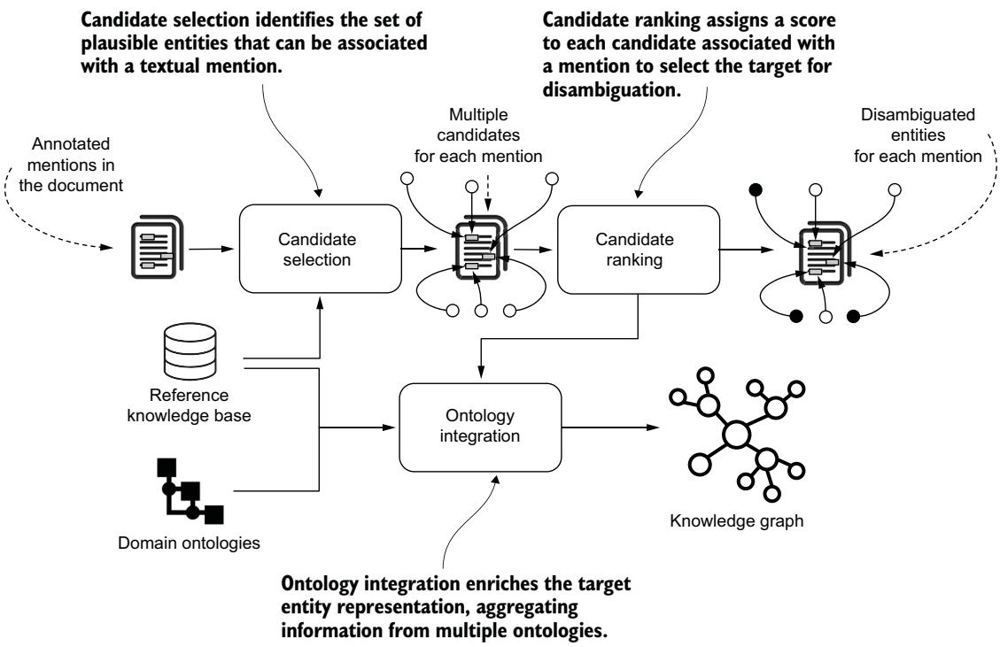
그림 7.2 NED 시스템의 구조. 세 가지 핵심 단계인 후보 선택, 후보 순위 매기기, 온톨로지 통합을 포함합니다.

**후보 선택** 은 인식된 개체명 언급에 대해 가장 알맞은 후보들을 찾아내는 단계입니다. 이 선택은 기존 지식 베이스를 대상으로 수행되며, 이 지식 베이스는 서로 다른 개체를 정밀하게 식별할 수 있도록 유용한 구조적 정보를 담고 있습니다. **후보 순위 매기기** 는 맥락 정보, 즉 인식된 개체 주변에 놓인 단어들을 바탕으로 각 후보에 점수를 매깁니다. 가장 높은 점수를 받은 개체가 바로 탐지된 언급의 목표 개체(target entity)가 됩니다.

우리는 개체명의 중의성을 해소하기 위해 **scispaCy** [4]라는 파이썬 기반 라이브러리를 사용할 것입니다. scispaCy에 구현된 모델은 개체명을 인식하고, 지식 베이스를 대상으로 후보를 선택하며, 이 후보들의 순위를 매겨 목표 개체를 식별할 수 있습니다. 다음 리스팅은 scispaCy 모델을 사용하는 파이썬 스크립트 예시를 보여 줍니다.

```python
Listing 7.1 Selecting and ranking candidates with the scispaCy model
import spacy
from scispacy.linking import EntityLinker
nlp = spacy.load("en_core_sci_md")
nlp.add_pipe("scispacy_linker",
config={"resolve_abbreviations": True, "linker_name": "umls"})
linker = nlp.get_pipe("scispacy_linker")
linker_dict = linker.kb.cui_to_entity
doc = nlp("""In the week of 13 April, Belize reported for the first time
mosquito-borne Zika virus transmission. Update on the observed increase
of congenital Zika syndrome and other neurological complications
Microcephaly and other fetal malformations potentially associated with
Zika virus infection.""")
for ent in doc.ents:
if "Zika" in ent.text:
print("Recognized entity:", ent.text, ent.start_char, ent.end_char)
print("Ranked target candidates:")
for kb_ent in ent._.kb_ents:
print('-', linker_dict[kb_ent[0]][0], linker_dict[kb_ent[0]][1])
```

이 코드가 하는 일을 짚어 보면 이렇습니다. `en_core_sci_md` 라는 과학 텍스트용 spaCy 모델을 불러오고, 거기에 `scispacy_linker` 라는 파이프라인 단계를 추가합니다. 이때 `resolve_abbreviations` 옵션으로 약어를 풀어 주고, `linker_name` 을 `umls` 로 지정해 UMLS 지식 베이스에 연결하도록 합니다. 그런 다음 우리의 예시 문단을 넣어 개체를 추출하고, "Zika"가 포함된 개체마다 인식된 텍스트와 문자 위치(start/end)를 출력하며, 각 개체에 대해 순위가 매겨진 후보 목록을 나열합니다. 이 코드를 실행하면 연관된 후보들이 순위와 함께 담긴 목록을 얻게 됩니다.

```text
Listing 7.2 scispaCy model results for candidate selection and ranking
Recognized entity: Zika virus 75 85
Ranked target candidates:
- C0318793 Zika Virus         ← "Zika Virus" 언급의 목표 개체
  C0276289 Zika Virus Infection   (75~85 문자 사이에서 탐지됨)
  C4687930 Zika Virus Antibody Measurement
Recognized entity: congenital Zika syndrome 135 159
Ranked target candidates:
- C4546023 Congenital Zika Syndrome   ← "Congenital Zika Syndrome" 언급의
                                        목표 개체 (135~159 문자 사이에서 탐지됨)
Recognized entity: Zika virus infection 268 288
Ranked target candidates:
- C0276289 Zika Virus Infection   ← "Zika Virus Infection" 언급의 목표 개체
- C0318793 Zika Virus              (268~288 문자 사이에서 탐지됨)
- C4687930 Zika Virus Antibody Measurement
```

인식된 각 개체에는 scispaCy 모델의 점수를 이용해 순위가 매겨진 후보 목록이 딸려 있습니다. 각 언급에 대한 첫 번째 결과가 모델이 도달한 가장 좋은 후보입니다. 여기서 눈여겨볼 점은, "Zika"의 언급마다 서로 다른 UMLS 개체 ID가 연결되었다는 것입니다. 첫 번째 "Zika virus"에는 C0318793(지카 바이러스)이, 두 번째 "congenital Zika syndrome"에는 C4546023(선천성 지카 증후군)이, 세 번째 "Zika virus infection"에는 C0276289(지카 바이러스 감염)가 붙었습니다. 이제 우리는 탐지된 각 개체가 UMLS 지식 베이스에 연결된, 주석이 달린 텍스트를 얻은 셈입니다.

추출한 정보를 실제로 활용하기 직전의 마지막 단계는 **온톨로지 통합** 입니다. 이는 도메인 온톨로지의 지식을 끌어들여, 추출된 개체의 구조적·맥락적 정보를 하나의 유일한 지식 그래프로 통합하는 작업입니다. UMLS는 여러 출처로부터 용어(terminology), 분류(classification), 코딩 표준(coding standards)을 제공합니다. 덕분에 상호운용 가능한(interoperable) 생의학 정보 시스템을 만들 수 있는데, 이 시스템의 정보는 다른 출처를 출발점으로 삼아 접근하고 탐색할 수 있습니다. UMLS가 이런 정보를 어떻게 모아 두는지 더 잘 이해하기 위해, 다음은 UMLS 항목의 한 가지 예시입니다.

#### Listing 7.3 Sample entry from the UMLS entity file — UMLS 개체 파일 항목 예시

```text
C0276289|ENG|S|L0388876|VC|S0517846|Y|A2985635|8552019|3928002||
SNOMEDCT_US|PT|3928002|Zika virus disease|9|N|256|
C0276289|ENG|P|L13115709|PF|S16069662|N|A27369917||C128423||
NCI|PT|C128423|Zika Virus Infection|0|N|256|
C0276289|ENG|S|L0392793|VW|S16069660|Y|A26676017||M000613823|D000071243|
MSH|ET|D000071243|Zika Fever|0|N|256
```

우리는 온톨로지 통합에서 가장 중요한 필드를 강조해 두었습니다. 왼쪽에서 오른쪽 순으로 개체 ID, 온톨로지, 그리고 해당 온톨로지에서 그 개체 ID에 연결된 이름입니다. 첫 번째 항목에서 볼 수 있듯이, 지카 바이러스 감염(Zika Virus Infection) 개체를 나타내는 UMLS ID는 SNOMEDCT_US [5] 온톨로지의 ID 3928002에 매핑되어 있으며, 이 온톨로지는 이 개체의 가능한 이름 중 하나(Zika virus disease, 지카 바이러스 질환)를 정의합니다. SNOMEDCT_US, 즉 **의학 체계 명명법(SNOMED, Systematized Nomenclature of Medicine)** 은 가장 포괄적인 다국어 임상 용어 체계 중 하나로, 45만 개가 넘는 개념(concept)을 아우릅니다. 또한 이 개념들 사이의 풍부한 관계 유형(relationship type)을 제공하는데, 여기에는 원인체(CAUSATIVE AGENT)나 발견 부위(FINDING SITE)처럼 임상적 관점에서 흥미로운 의미 연결도 포함됩니다. SNOMED 온톨로지와 관련된 두 개의 파일 예시를 살펴봅시다. 하나는 SNOMED 개체/관계의 설명이고, 다른 하나는 엣지(또는 트리플, triple)입니다. 첫 번째는 SNOMED 설명 파일의 예시입니다.

```csv
Listing 7.4 Samples from the SNOMED description file
84087010 20020131 1 900000000000207008 50471002
en 900000000000013009 Zika virus 900000000000017005
8552019 20020131 1 900000000000207008 3928002
en 900000000000013009 Zika virus disease 900000000000017005
367784012 20020131 1 900000000000207008 246075003
en 900000000000013009 Causative agent 900000000000020002
```

여기서 SNOMED ID와 그에 연관된 이름을 볼 수 있습니다. 이 파일에는 개체를 나타내는 ID와 개체 사이의 관계를 나타내는 ID가 모두 들어 있습니다. 이 예시에서 첫 번째 항목은 개체(Zika virus, 지카 바이러스)를 나타내고, 세 번째 항목은 관계(Causative agent, 원인체)를 나타냅니다.

이제 엣지 파일의 항목 하나를 봅시다.

```text
Listing 7.5 Sample from the SNOMED edge file
                                                              1
769900023 3928002    20020131 50471002    900000000000207008 0 246075003
900000000000011006   900000000000451002
```

강조된 값들은 트리플의 구성 요소를 나타냅니다. 지카 바이러스 질환의 소스 ID(3928002), 지카 바이러스의 타깃 ID(50471002), 그리고 원인체를 나타내는 관계 ID(246075003)입니다. 즉, "지카 바이러스 질환 —[원인체]→ 지카 바이러스"라는 하나의 사실(트리플)이 이렇게 표현됩니다.

외부 온톨로지를 끌어들임으로써, NED 모델의 출력은 정보를 탐색하고 발견하는 진입점이 되고, 비정형 지식과 정형 지식을 하나의 통일된 관점으로 잇는 지식 그래프를 구축하는 출발점이 됩니다. 그림 7.3은 지금까지의 모든 정보 조각을 담은, 이 지식 그래프의 직관적인 예시를 보여 줍니다.


그림 7.3 scispaCy 모델로 처리한 텍스트, UMLS, SNOMED 온톨로지의 정보를 통합해 구축한 예시 지식 그래프

우리의 예시 지식 그래프는 유럽연합(EU)에서 **인간 유래 물질(SoHO, Substances of Human Origin)** 을 관리하는 데 관련된 의료 표준과 규제의 정의와 얽힌 실제 시나리오에서 고급 분석을 수행할 수 있게 해 줍니다. 그림 7.4는 이 장에서 설명하는 과정, 즉 비즈니스 이해에서 시작해 지식 그래프 생성과 질의(querying)에 이르는 과정을 그림으로 나타낸 멘탈 모델입니다. 다른 장에서도 논의했듯이, 이 멘탈 모델은 2장에서 소개한 대로 지식 그래프에 맞게 각색한 **CRISP-DM 모델** 의 한 구체화(specification)입니다. CRISP-DM은 데이터 마이닝 프로젝트의 표준 절차를 정리한 방법론입니다.

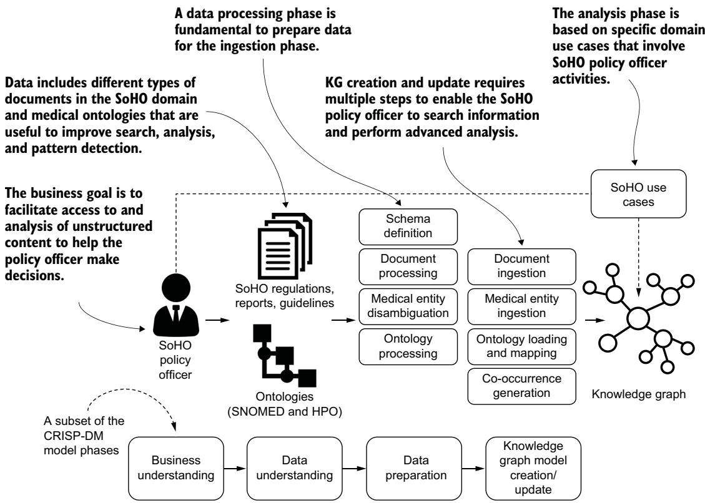
그림 7.4 CRISP-DM 모델의 한 구체화로서, 비즈니스 목표 이해에서부터 우리 분석에 유용한 KG 질의를 정의하기까지 KG 구축 과정을 설명하는 멘탈 모델

예시 비즈니스 응용을 소개하기 전에, 6장에서 소개한 LLM의 기회와 한계를 지금 이 사례에 적용해 다시 짚어 봅시다. LLM은 scispaCy를 사용하는 것에 대한 현대적 대안이 될 수 있지만, 이 맥락에서 진짜 가치를 더하려면 반드시 지식 그래프 기술과 결합되어야 합니다.

---

### 7.3 Domain-based NED and LLMs — 도메인 기반 NED와 LLM

앞에서 우리는 텍스트 콘텐츠 안의 개념을 탐지하는 능력이, 의사결정을 지원하는 IAS의 필수 기능이라는 점을 이야기했습니다. 그래서 우리는 LLM 기술에 기반한 가장 대표적인 애플리케이션인 **ChatGPT** 가 이 목표를 달성할 수 있는지 시험해 보는 간단한 실험을 해 봤습니다.


우리가 러닝 예시를 바탕으로 정의한 기본 프롬프트는 다음과 같습니다.

> **AN**: "4월 13일 주간에, 벨리즈에서 처음으로 모기 매개 지카 바이러스 전파가 보고되었습니다. 관찰된 선천성 지카 증후군 및 기타 신경학적 합병증의 증가에 관한 업데이트. 소두증 및 지카 바이러스 감염과 잠재적으로 연관된 기타 태아 기형." 여기서 탐지할 수 있는 모든 의학 개체의 중의성을 해소해 주세요.

여기서 "AN"은 저자(Alessandro Negro)가 프롬프트를 입력한 발화를 뜻합니다. ChatGPT의 출력은 다음과 같았습니다.


- 지카 바이러스(Zika virus)
- 모기 매개 전파(Mosquito-borne transmission)
- 선천성 지카 증후군(Congenital Zika syndrome)
- 신경학적 합병증(Neurological complications)
- 소두증(Microcephaly)
- 태아 기형(Fetal malformations)

> **참고** ChatGPT는 끊임없이 진화하는 생성 모델(generative model)에 기반합니다. 이 때문에 비슷한 시험과 실험을 하더라도 매번 다른 응답을 받을 수 있습니다.

이 초기 결과에서 볼 수 있듯이, 모델은 첫 번째 "Zika" 언급이 바이러스 개체를 가리키고 마지막 언급이 바이러스 감염을 가리킨다는 사실을 완벽하게 인식하지는 못합니다. 의학 도메인의 복잡성을 고려하면, 우리는 모델이 이런 표현의 의미를 "이해"한다고 확신할 수 있어야 합니다. NED의 관점에서 우리는 이 개체들이 적절한 지식 베이스에 올바르게 매핑되는지 확인해야 합니다. 우리는 이 측면을 시험하기 위해 또 하나의 프롬프트를 정의했습니다.

#### AN Can you assign UMLS ids to these extracted entities? — "이 추출된 개체들에 UMLS ID를 할당해 줄 수 있나요?"

#### The answer was the following: — 그 답은 다음과 같았습니다


> AI 언어 모델로서, 저는 추출된 개체에 UMLS ID를 할당할 수 없습니다. 다만 UMLS 메타시소러스(Metathesaurus)는 생의학·보건 온톨로지 자원으로, 다양한 생의학 온톨로지 안의 개념에 대한 정규화된 이름과 매핑을 제공합니다. 이를 이용하면 추출된 개체를 그에 대응하는 UMLS 개념에 매핑하고 고유 식별자(UMLS ID)를 얻을 수 있습니다. 이 작업에는 도메인 특화 지식과 UMLS 자원 활용에 대한 전문성이 필요합니다.

보다시피, UMLS 지식 베이스는 현재 ChatGPT 모델에 통합되어 있지 않습니다. 마지막 문장이 특히 중요합니다. 그것은 우리가 UMLS 자원에 대한 도메인 특화 지식과 전문성을 갖춘 모델을 개발해야 한다는 점을 시사합니다. 우리 예시에서는 NED 기술과 지식 그래프를 결합하는데, 이 접근법은 바로 그런 특성을 갖추고 있으며 IAS에 쉽게 통합될 수 있습니다.

---

### 7.4 Business and domain understanding — 비즈니스와 도메인 이해

그림 7.5는 비즈니스 이해 단계를 묘사합니다. 우리의 실제 시나리오는 SoHO(인간 유래 물질) 관리에서의 표준과 규제 정의와 관련되어 있습니다. 이런 물질에는 혈액, 조직, 세포, 장기가 포함되며, 이것들은 다양한 의료 치료에 사용될 수 있습니다. SoHO에 기반한 치료는 생명을 구하고(예: 수혈), 삶의 질을 높이며(예: 신장 이식), 심지어 생명을 창조하는 데도 도움을 줍니다(생식세포와 체외수정). 지식 그래프 기술은 표현의 유연성(representation flexibility)과 여러 출처를 하나의 통일된 관점으로 조화시키는 능력(harmonization) 같은 기능을 통해, 이 시나리오의 특정 요구사항에 응답할 수 있습니다.

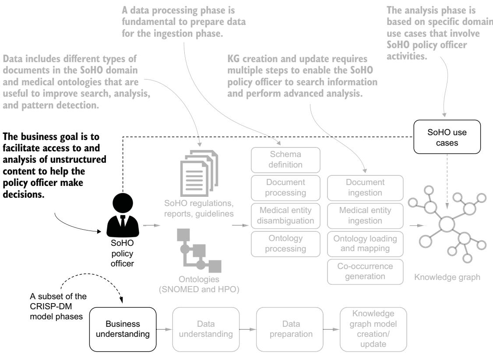
그림 7.5 비즈니스 이해는 우리가 풀고자 하는 문제가 무엇인지 분명히 하는 단계입니다. 이 단계는 기술적 측면과 엄밀히 관련되지는 않지만, 다음 단계들을 위해 근본적으로 중요합니다.

#### 7.4.1 Context — 맥락

의료 도메인에서 결정적으로 중요한 영역 하나는 수혈, 이식, 의료 보조 생식을 받는 환자의 안전입니다. 물질 기증에서부터 환자에게 적용되기까지, 혈액·조직·세포(BTC, Blood, Tissues, and Cells) 같은 구성 요소가 EU 전역의 치료에 사용됩니다. 그림 7.6은 이 의료 부문의 다양한 측면을 보여 줍니다. 기증자 평가에서 시작해, 조달(procurement), 품질 기준(quality criteria), 유통(distribution), 추적성(traceability), 생물학적 감시(biovigilance)를 포함한 여러 차원을 분석할 수 있습니다.

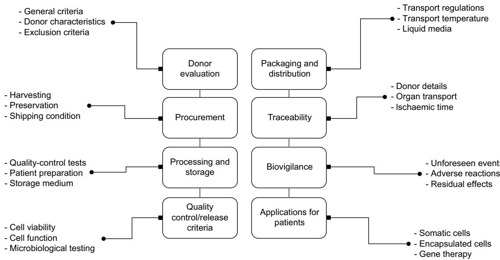
그림 7.6 (가운데) SoHO 공급망의 단계들. (왼쪽·오른쪽) 이 단계들의 특성.

BTC 부문은 기증에 시민들의 참여를 의존하는데, 그 참여는 코로나19 팬데믹 같은 공중보건 위기 동안 크게 줄어듭니다. 동시에 BTC의 품질은 SoHO를 수집·검사·처리하는 새로운 방법에 발맞춰 최신 상태로 유지되어야 합니다. 새로운 위험과 기술 트렌드는 앞으로도 계속 등장할 것이므로, "효과적으로 시행되고, 미래에 대비되며, 위기에 강하고, 충분히 기민한" [6] 법적 틀이 필요합니다. 그래야 적절한 요구사항을 지속적으로 제공할 수 있기 때문입니다.

2022년, 유럽연합 집행위원회(EC)는 인간 적용을 위한 SoHO의 표준과 품질에 관한 규제 제안(proposal for a regulation)을 발표했습니다. 이 제안은 SoHO 치료를 받는 환자의 안전을 보장하고 피할 수 있고 예측 가능한 위험으로부터 그들을 보호하는 것을 목표로 합니다. 검토된 대안들 가운데, SoHO 이해관계자들이 찾아낸 최선의 선택지는 유럽질병예방통제센터(ECDC)와 유럽의약품품질보건국(EDQM, European Directorate for the Quality of Medicines & HealthCare) 같은 기관의 전문성 위에 세워진 공동 규제였습니다. 이 두 기관은 상호 보완적인 역할을 합니다. ECDC는 보건 감시, 보건 위협 대응, 신흥 트렌드, SoHO의 안전과 관련된 짧은 보고서를 주로 제공합니다. EDQM은 전염병 전파 위험을 넘어서는 품질·안전 문제를 다루는 상세한 지침(guideline)을 발표하고, SoHO의 수집·처리·보관·유통을 위한 기술 표준을 제공합니다. 이 두 종류의 텍스트 문서 모두에서 유용한 정보와 맥락적 세부 사항을 추출하는 능력은, 규칙을 식별하고 규제를 신속히 업데이트해 환자의 안전을 보장하고 피할 수 있는 위험으로부터 그들을 보호하는 데 근본적으로 중요합니다.

#### 7.4.2 Use case definition — 활용 사례 정의

이제 한 보건정책 담당관을 상상해 봅시다. 이 사람은 췌장 소도(pancreatic islets), 다른 이름으로는 **랑게르한스섬(islets of Langerhans)** 의 이식과 관련된 구체적인 지침과 가능한 위험을 식별해야 하고, 동시에 특정 지역에서의 지카 바이러스 확산을 분석해야 합니다. 앞으로 보게 되겠지만, NED와 지식 그래프 기술을 도입하면 이런 종류의 활동을 지원할 수 있습니다.

#### CONCEPTUAL SEARCH — 개념 검색

**개념 검색(conceptual search)** 은 정확한 키워드가 아니라 의미(meaning)를 기준으로 정보를 찾을 수 있게 해 주는 검색 방법입니다. 같은 개체를 가리키는 서로 다른 표현(예: "pancreatic islets"와 "islets of Langerhans")을 하나로 조화시킬 수도 있고, 이름은 비슷하지만 의미가 다른 개체들을 구분할 수도 있습니다.

#### STRUCTURED KNOWLEDGE-BASED SEARCH — 구조화된 지식 기반 검색

**구조화된 지식 기반 검색(structured knowledge-based search)** 은 도메인 온톨로지에 정형화된 형식적 지식을 이용해 텍스트 안의 정보를 되찾아 옵니다. 이 정보를 통해 우리는 여러 문서에 흩어진 서로 다른 텍스트 조각들 사이에 단순하지 않은(nontrivial) 관계를 만들어 낼 수 있습니다. 예를 들어 온톨로지의 경로를 따라가면서, 사용자는 당뇨병이 유발하는 여러 유형의 질환을 식별하고, 이 질환들을 언급하는 모든 문서를 되찾아 오며, 관련 텍스트 콘텐츠에 대한 완전한 조망을 얻을 수 있습니다.

#### KG-BASED INTERPRETABILITY AND DISCOVERY — KG 기반 해석 가능성과 발견

온톨로지에 정형화된 지식 속의 관계나 경로는, 텍스트 콘텐츠 안의 핵심 정보를 반영할 수도 있고(해석 가능성, interpretability), 텍스트 안의 정보를 풍부하게 하거나 완성해 주는 연결로 통찰을 제공할 수도 있습니다(발견, discovery). 예를 들어 해석 가능성의 관점에서, **1형 당뇨병(T1D, Type 1 Diabetes)** 과 랑게르한스섬 개체는 함께 등장(co-occur)하는데, 전자가 후자에 영향을 주는 증후군이기 때문입니다. 발견의 관점에서는, 에이즈와 1형 당뇨병 같은 질병이 함께 등장할 수 있는데, 1형 당뇨병과 연관된 일부 병리가 면역계와 관련될 수 있기 때문입니다.

#### UNCOVERING NEW KNOWLEDGE — 새로운 지식 발굴

함께 등장하는 개체들에 관한 지식이 아직 온톨로지에 정형화되지 않았지만 EDQM 지침에 담겨 있거나 해당 분야의 발견과 관련되어 있을 때, 더욱 흥미로운 예시가 나타납니다. 예를 들어 췌장 소도(pancreatic islets) 개체는 SoHO 관리와 관련된 정보와 함께 언급됩니다(그림 7.6 참조). 더 나아가, 코로나19와 당뇨병처럼 전염성 질환과 비전염성 질환 사이의 흔치 않은 공동 등장(co-occurrence)에 관심 있는 SoHO 이해관계자들은, ECDC 회보를 같은 (그래프 기반) 관점에서 참조해 특정 회원국에서 감염이 증가하고 있는지 파악하고, 장기와 조직의 수입을 차단할지 결정을 내릴 수 있습니다.

---

### 7.5 Understanding the data — 데이터 이해하기

SoHO 도메인에서 IAS를 개발하려면, 여러 저장소에 흩어진 이질적인(heterogeneous) 정보를 하나의 통일된 출처로 통합해야 하며, 비정형 데이터와 의미적으로 정형화된 데이터를 함께 결합해야 합니다(그림 7.7 참조). 이 절에서는 EC와 그 산하 기관들이 발표한 문서, 그리고 이 맥락에서 채택된 의학 온톨로지(SNOMED와 인간 표현형 온톨로지, HPO 등)를 개괄합니다.

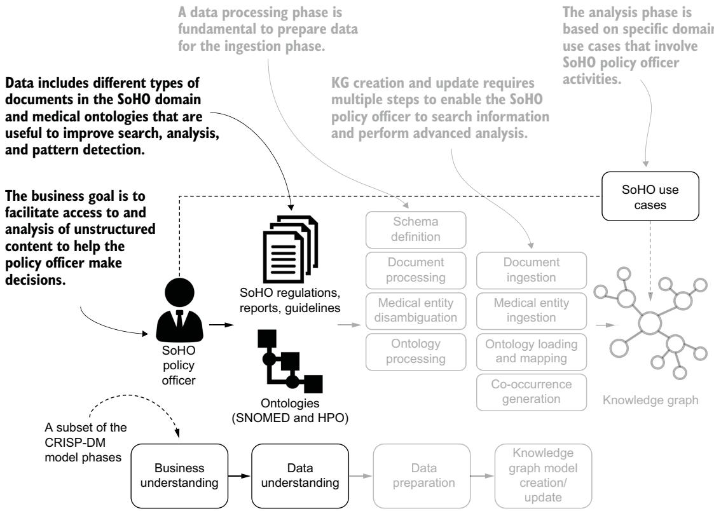
그림 7.7 데이터 이해 단계는 우리가 가진 정보의 특성을 파악하게 해 줍니다. 예시 시나리오에서 사용 가능한 데이터에는 EC와 산하 기관들이 발표한 SoHO 규제·보고서·지침, 그리고 SNOMED와 HPO 같은 의학 온톨로지가 포함됩니다.

#### 7.5.1 Unstructured data — 비정형 데이터

비정형 콘텐츠에는 여러 유형의 문서가 포함됩니다.

- BTC 분야의 영향 평가 보고서(impact assessment report)와 관련 규제 제안
- 규제 제안에 대한 이해관계자들의 입장을 담은 보고서
- EDQM의 SoHO 관리 지침과 뉴스레터
- 전염병의 진행 상황을 모니터링하는 ECDC의 보고서와 회보

이 문서들의 특성을 살펴보면서, 지식 그래프로 처리되고 변환되는 비정형 정보의 유형을 명확히 해 봅시다. 이는 여러분이 이 문서들에 기반해 어떤 활용 사례가 가능할지에 대한 직관을 기르는 데 도움이 됩니다.

**영향 평가 보고서** 는 EC가 제공하며, EU의 BTC 분야 문제를 둘러싼 정치적·법적 맥락을 개괄합니다. 이 보고서는 이전 법률을 개정하기 위한 아이디어를 모으고, BTC 공급의 중단 같은 문제를 부각하며, 새로운 질병과 과학·기술 발전을 논의하고, BTC 부문 개선을 위한 목표를 제시하며, 정책 선택지를 분석하고, 규제를 제안합니다.

**규제 제안** 은 이해관계자들이 평가하는데, 이들은 입장 문서(position paper), 배운 교훈(lessons learned), 일반적인 의견을 제공합니다. 예를 들어 국제줄기세포연구학회(ISSCR, International Society for Stem Cell Research)는 한 입장 문서에서, 검증되지 않은 세포 치료와 임상 효과에 대해 근거 없는 주장을 내세우는 사업들에 대한 우려를 제기했습니다. 이 문서는 EU 전문가 기구들이 다른 규제 당국과 협의하고 국제 규범과 표준을 조화시켜야 하며, 지침 문서에 대한 협의를 단순화해 새 제안에 대한 피드백을 장려해야 한다고 제안했습니다.

EDQM의 "인간 적용을 위한 조직·세포의 품질과 안전 가이드(Guide to the Quality and Safety of Tissues and Cells for Human Application)" [7] 같은 문서는 의료 전문가에게 **기술 지침** 을 제공합니다. 이 가이드는 EU 지침에 부합하는 최소 표준, 현재의 과학 지식과 일치하는 모범 사례, 전문가 의견, 국제 프로젝트의 결과를 제시합니다.

ECDC의 **주간 전염병 위협 보고서(CDTR, Communicable Disease Threat Report)** 는 EU에 유의미한 전염병과 관련된 역학 정보 활동(epidemic intelligence)을 통해 수집한 모든 데이터를 통합합니다. 이 요약은 전 세계 상황에 대한 정보와, 유럽에 영향을 줄 수 있는 전염병 역학의 변화에 대한 정보도 함께 제공합니다.

#### 7.5.2 Domain ontologies — 도메인 온톨로지

3장에서는 서로 다른 출처를 통합하기 위한 참조 스키마로 온톨로지를 채택하는 방법을 소개했습니다. 우리가 다루는 시나리오의 범위에서는 UMLS, SNOMED, HPO 온톨로지를 사용합니다.

#### UNIFIED MEDICAL LANGUAGE SYSTEM (UMLS) — 통합 의학 언어 시스템

UMLS는 생의학 도메인의 여러 통제 어휘(controlled vocabulary)로 구성된 메타시소러스(meta-thesaurus)입니다. UMLS는 이 어휘들 사이의 매핑 구조를 제공해, 다양한 용어 체계 사이의 번역을 단순화합니다. 우리 코드 예시는 UMLS의 2022AA 버전을 사용합니다.

우리 시나리오에서는 다음 두 파일을 사용합니다.

- **MRCONSO.RRF** — 여러 어휘에서 온 생의학 개체들의 목록. 각 개체 이름에 대해, 그 이름이 유래한 개체 ID가 포함되어 있습니다.
- **MRSTY.RRF** — UMLS 개체를 분류하는 의미 유형(semantic type)의 목록.

이 파일들은 **구분자 분리 값(DSV, Delimiter-Separated Values)** 형식으로 되어 있으며, 구분자는 세로 막대 또는 파이프(|)입니다. 그래서 전통적인 CSV 파일처럼 처리할 수 있습니다. 리스팅 7.6과 7.7은 MRCONSO.RRF와 MRSTY.RRF의 예시를 보여 줍니다.

#### Listing 7.6 Sample of the UMLS MRCONSO.RRF file — UMLS MRCONSO.RRF 파일 예시

```text
C0022131|ENG|P|L0022136|PF|S0054489|N|A2883106|130586015|78696007||
SNOMEDCT_US|SY|78696007|Islets of Langerhans|9|N|256
C0022131|ENG|S|L7933100|PF|S9245679|Y|A15439829||76489||
FMA|SY|76489|Insulae pancreaticae|0|N|256
C0022131|ENG|S|L0826072|PF|S0870037|N|A0928304||||
RCD|PT|Xa1Ij|Endocrine pancreatic structure|3|N|256|
C0011311|ENG|P|L0011312|VC|S0000287|Y|A2872183|63434017|38362002||
SNOMEDCT_US|SY|38362002|Dengue fever|9|N|256|
C0011311|ENG|S|L0286841|VO|S14576929|N|A24118377||M0005831|D003715|
MSH|PM|D003715|Break Bone Fever|0|N|256|
C0011311|ENG|S|L0294785|VW|S4069775|Y|A4402397||||
ICPC2ICD10ENG|PT|MTHU021113|dandy fever|3|N|256|
C0018681|ENG|S|L0290365|PF|S0362835|N|A2926207|41994011|25064002||
SNOMEDCT_US|SY|25064002|Cephalgia|9|N|2304|
C0018681|ENG|S|L1406212|VO|S1680379|Y|A1641924||M0009824|D006261|
MSH|PM|D006261|Cranial Pains|0|N||
C0018681|ENG|P|L0018681|PF|S0046854|N|A24679981|||HP:0002315|
HPO|PT|HP:0002315|Headache|0|N|256|
```

MRCONSO.RRF는 의학 개체와 관련된 온톨로지, 코드, 개체 이름 정보를 한데 모읍니다. 각 항목은 각 행의 첫 번째 열에 위치한 UMLS ID로 식별됩니다. NED에 이 ID가 필요한 이유는, scispaCy 모델이 이 ID를 사용해 중의성 해소 결과를 제공하기 때문입니다. 리스팅 7.6은 랑게르한스섬(Islets of Langerhans), 뎅기열(Dengue fever), 두통(Cephalgia, headache)과 관련된 행들의 집합을 보여 줍니다.

#### Ontologies — 온톨로지 출처

이 예시에서 개체와 연관된 코드와 이름은 다음 출처들에 위치합니다.

- SNOMED, https://www.nlm.nih.gov/healthit/snomedct/us_edition.html
- 해부학 기초 모델(FMA, Foundational Model of Anatomy), http://si.washington.edu/projects/fma
- 리드 코드(RC, Read Codes), http://www.connectingforhealth.nhs.uk/systemsandservices/data/readcodes/
- 의학 주제 표목(MSH, Medical Subject Headings), https://www.nlm.nih.gov/mesh/

#### (continued) — (이어서)

- 국제 일차의료 분류 2판, 국제 질병 분류 10차 개정판(ICPC2ICD10ENG), https://www.who.int/standards/classifications/other-classifications/international-classification-of-primary-care
- HPO, https://hpo.jax.org/app/

다음으로, 이 리스팅은 랑게르한스섬, 뎅기열, 두통이 UMLS에서 어떻게 분류되는지 보여 줍니다.

#### Listing 7.7 Sample of the UMLS MRSTY.RRF file — UMLS MRSTY.RRF 파일 예시

```text
C0022131|T023|A1.2.3.1|Body Part, Organ, or Organ Component|AT19674993|256|
C0011311|T047|B2.2.1.2.1|Disease or Syndrome|AT41932582|256
C0018681|T184|A2.2.2|Sign or Symptom|AT17639733|256|
```

MRCONSO.RRF의 각 항목에 대해, MRSTY.RRF 파일은 의미 유형 코드와 이름을 제공합니다. 여기서 "Body Part, Organ, or Organ Component"(신체 부위·장기·장기 구성 요소, T023), "Disease or Syndrome"(질병 또는 증후군, T047), "Sign or Symptom"(징후 또는 증상, T184)은 각각 랑게르한스섬, 뎅기열, 두통의 의미 유형에 대응합니다.

#### SYSTEMATIZED NOMENCLATURE OF MEDICINE (SNOMED) — 의학 체계 명명법

SNOMED은 45만 개가 넘는 개념과 그 사이의 관계 유형을 아우릅니다. UMLS 무료 라이선스로 제공되며 https://www.nlm.nih.gov/healthit/snomedct 에서 내려받을 수 있습니다. 우리는 2022년 9월 1일에 발표된 SNOMED 버전을 사용했습니다.

우리 시나리오에서는 다음 두 파일을 사용합니다.

- **sct2_Description_Full-en_US1000124_20220901.txt** — 모든 개체 이름(및 별칭), 그리고 개체 사이의 관계를 정의하는 트리플렛 파일에 형성된 관계
- **sct2_Relationship_Full_US1000124_20220901.txt** — SNOMED 개체 사이의 모든 관계를 정의하는 트리플렛(및 기타 메타데이터)의 집합. 각 개체와 관계는 숫자 코드로 식별됩니다.

이 파일들은 TSV 형식을 사용합니다. 리스팅 7.8과 7.9가 예시를 제공합니다.

#### Listing 7.8 Sample from the SNOMED description file — SNOMED 설명 파일 예시

```text
130586015 20020131 1 900000000000207008 78696007
en 900000000000013009 Islets of Langerhans 900000000000017005
63434017 20020131 1 900000000000207008 38362002
en 900000000000013009 Dengue fever 900000000000017005
41993017 20020131 1 900000000000207008 25064002
en 900000000000013009 Cephalalgia 900000000000020002
```

여기서 우리는 UMLS가 생성될 때 근거로 삼은 데이터 출처가 처음에 정보를 어떻게 제공하는지 볼 수 있습니다. 이 SNOMED 항목에는 랑게르한스섬, 뎅기열, 두통(Cephalalgia)의 코드와 이름이 각각 포함되어 있습니다. 다음 리스팅은 이것들이 의미 관계에서 소스 개체가 될 수도, 타깃 개체가 될 수도 있음을 보여 줍니다.

```text
Listing 7.9 Sample from the SNOMED relationship file
                                                              1
169174023 20020131 1 900000000000207008 360555004 900000000000451002
78696007  0 116680003             900000000000011006
182243021 20020131 1 900000000000207008 20927009
38362002  0 116680003             900000000000011006 900000000000451002
424787021 20020131 1 900000000000207008 54012000
25064002  0 116680003             900000000000011006 900000000000451002
```

이 경우 랑게르한스섬, 뎅기열, 두통은 IS_A 관계(ID 116680003)의 타깃 개체입니다. 소스 개체는 각각 내분비 췌장 세포(Endocrine pancreas cell, ID 360555004), 뎅기 출혈열(Dengue hemorrhagic fever, ID 20927009), 외상후 두통(Posttraumatic headache, ID 54012000)입니다. 즉 "내분비 췌장 세포 —[IS_A]→ 랑게르한스섬"처럼, 더 구체적인 개체가 더 일반적인 개체의 하위 유형(is a)임을 나타냅니다.

#### HUMAN PHENOTYPE ONTOLOGY (HPO) — 인간 표현형 온톨로지

HPO 온톨로지 [8]는 hpo.owl(http://purl.obolibrary.org/obo/hp.owl)이라는 RDF/XML 파일로 배포됩니다. 여기에는 표현형 이상(phenotypic anomaly)에 관한 표준화된 정보가 들어 있습니다. 다음 리스팅은 1형 당뇨병(T1D)과 관련된 파일의 일부를 보여 줍니다. 가독성을 높이기 위해 데이터를 RDF/XML에서 **Turtle(Terse RDF Triple Language)** 형식으로 직렬화했습니다. Turtle은 RDF 트리플을 사람이 읽기 쉽게 표현하는 문법입니다.

#### Listing 7.10 T1D details in hpo.owl — hpo.owl 안의 T1D 세부 정보

```turtle
obo:HP_0100651 a owl:Class ;                                   # T1D(URI obo:HP_0100651)를 온톨로지 클래스로 정의
rdfs:label "Type I diabetes mellitus" ^^xsd:string ;           # 자연어로 질병을 기술
obo:IAO_0000115 "A chronic condition in which the pancreas produces
little or no insulin..." ^^xsd:string ;
oboInOwl:created_by "doelkens"^^xsd:string ;                   # 이 항목의 작성자("doelkens") 관련 메타데이터
oboInOwl:creation_date "2010-12-29T06:37:55Z"^^xsd:string ;
oboInOwl:hasDbXref "MSH:D003922"^^xsd:string,                  # T1D를 가리키는 외부 데이터 출처의 ID들
"SNOMEDCT_US:46635009" ^^xsd:string,
"UMLS:C0011854" ^^xsd:string ;
oboInOwl:hasExactSynonym "Diabetes mellitus Type I"^^xsd:string,
"Juvenile diabetes mellitus" ^^xsd:string,
"Type 1 diabetes",
"Type I diabetes";
oboInOwl:hasRelatedSynonym "Insulin-dependent diabetes mellitus"^^xsd:string ;
oboInOwl:id "HP:0100651"^^xsd:string ;
rdfs:comment "The onset of type 1 diabetes is typically during
adolescence..." ^^xsd:string ;
rdfs:subClassOf obo:HP_0000819 .                               # T1D를 표현형 특성(obo:HP_0000819, 당뇨병)의 하위 클래스로 정의
```

이 항목은 T1D를 하나의 온톨로지 클래스로 정의하고(URI `obo:HP_0100651`), 그 질병을 자연어로 기술하며, 작성자("doelkens")에 관한 메타데이터를 담고, 이 항목을 가리키는 외부 데이터 출처들의 ID를 나열합니다. 또한 T1D를 표현형 특성(URI `obo:HP_0000819`, 즉 당뇨병에 해당)의 하위 클래스로 정의합니다.

---

### 7.6 Building a SoHO knowledge graph — SoHO 지식 그래프 구축하기

이 진실의 원천(source of truth) 위에 지식 그래프를 구성하고 활용 사례를 개발하는 과정은 다음 단계들로 이루어집니다.

1. KG 스키마를 정의한다.
2. 문서를 처리하고 적재(ingest)한다.
3. 의학 개체의 중의성을 해소하고 적재한다.
4. 온톨로지를 처리·적재·매핑한다.
5. 공동 등장(co-occurrence) 관계를 생성한다.

그림 7.8은 데이터 준비와 적재를 포함한, KG 구축의 핵심 단계들을 보여 줍니다.

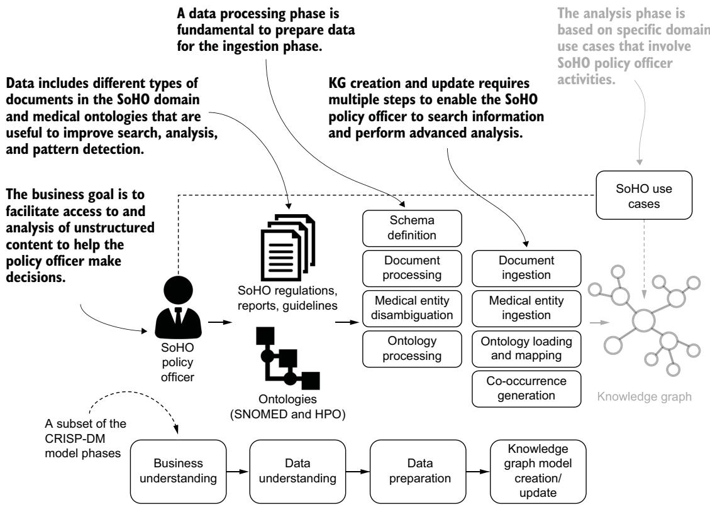
그림 7.8 데이터를 준비하고 KG를 생성·업데이트하는 것은 결정적으로 중요한 기술 단계입니다. 데이터 준비 단계는 가용 데이터를 처리하는 일을 포함하고, KG 생성·업데이트 단계는 이 처리의 출력을 이용해 분석 단계에 쓸 데이터베이스를 생성합니다.

이 지점에서 여러분은 이 절을 어떻게 진행할지 두 가지 선택지가 있습니다. 첫째, 이 단계들을 하나하나 따라가며 KG를 처음부터 직접 구축할 수 있습니다. 둘째, KG를 구성하는 핵심 아이디어를 이해한 뒤 활용 사례(7.7절)에 집중하는 것이 목표라면, scispaCy로 처리된 문서를 이미 담고 있는 중간 버전의 KG에서 시작할 수 있습니다. 이 경우 7.6.1절에서 시작한 다음, 7.6.4절로 건너뛰어 온톨로지를 적재하고 그 노드를 추출된 의학 개체에 매핑하면 됩니다. KG 구축을 위한 전체 코드는 파이썬 스크립트와 Cypher 질의를 결합하며, 책의 코드 저장소에서 제공됩니다.

#### 7.6.1 Defining the schema — 스키마 정의하기

스키마를 정의하는 것은 우리 데이터에 대한 그래프 기반 모델을 정의하는 이론적 단계이며, 7.7절의 활용 사례에 도움을 줍니다. 그림 7.9는 우리가 구축할 KG의 주요 구성 요소(노드와 관계)를 모델링한 스키마를 보여 줍니다.

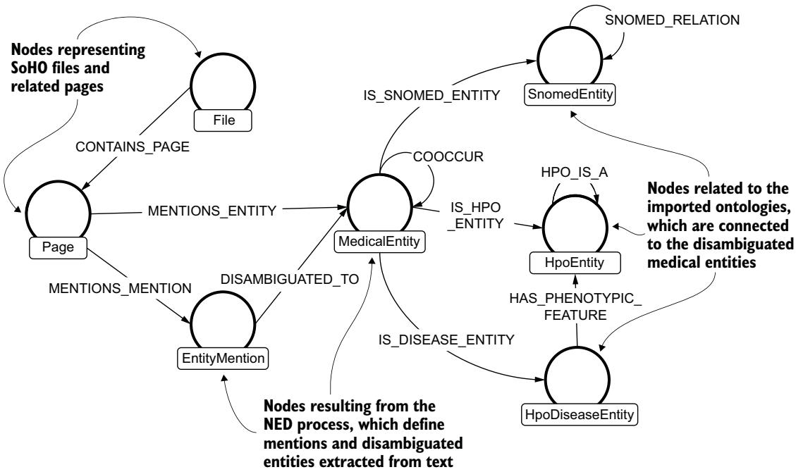
그림 7.9 여러 유형의 분석을 가능하게 하기 위한, 관련 노드 라벨과 관계 유형을 포함한 KG 스키마

적재된 문서는 `File` 노드와 관련 `Page` 노드를 연결함으로써 그래프로 구조화됩니다. 각 `Page` 는 텍스트에서 인식된 모든 개체를 정의하는 `EntityMention` 노드들의 모음에 연결됩니다. 이 `EntityMention` 노드들은 중의성이 해소되어 `MedicalEntity` 노드에 연결됩니다. `DISAMBIGUATED_TO` 관계는 같은 문자열의 언급이 서로 다른 개체를 가리키는 경우와, 반대로 서로 다른 문자열로 특징지어진 개체들이 같은 개체를 가리키는 경우를 모두 모델링할 수 있게 해 줍니다. 예를 들어 앞에서 봤듯이 "Zika"라는 단어는 여러 개체를 가리킬 수 있는 반면, "AIDS"와 "Acquired Immunodeficiency Syndrome"은 같은 개체를 표현하는 서로 다른 두 표현입니다. `MENTIONS_ENTITY` 관계는 `Page` 노드와 중의성이 해소된 `MedicalEntity` 노드를 연결합니다.

나머지 노드와 관계는 추출된 `MedicalEntity` 를 `SnomedEntity`, `HpoEntity`, `HpoDiseaseEntity` 에 매핑합니다. 이 매핑을 지정하기 위해 우리는 다음 관계들을 정의했습니다. `IS_SNOMED_ENTITY`, `IS_HPO_ENTITY`, `IS_DISEASE_ENTITY` 입니다. 이제 KG 스키마를 정의했으니, 데이터를 적재하기 시작할 수 있습니다.

#### 7.6.2 Processing and ingesting documents — 문서 처리와 적재

이 단계에서는 문서를 적재하고 관련 콘텐츠를 그래프 기반 구조로 모델링합니다. 우리 목적에 쓸 수 있는 문서 대부분은 PDF 또는 DOCx 형식으로 배포됩니다. 그래서 데이터를 Neo4j에 적재하기 전에, 우리는 **Amazon Textract** OCR 서비스로 날것의 콘텐츠를 추출하고 그 결과를 처리했습니다. 전체 텍스트를 복원하기 위해, 우리는 한 단짜리 문서와 두 단짜리 문서처럼 서로 다른 구조의 문서를 다루는 파이썬 스크립트를 작성했습니다. 그림 7.10은 PDF와 DOCx 문서로부터 전체 텍스트를 복원하는 이 준비 단계의 핵심 측면을 보여 줍니다.

> **참고** Amazon Textract(https://aws.amazon.com/textract/)는 AWS가 제공하는 머신러닝 서비스로, 스캔된 문서에서 텍스트, 손글씨, 데이터를 자동으로 추출합니다.

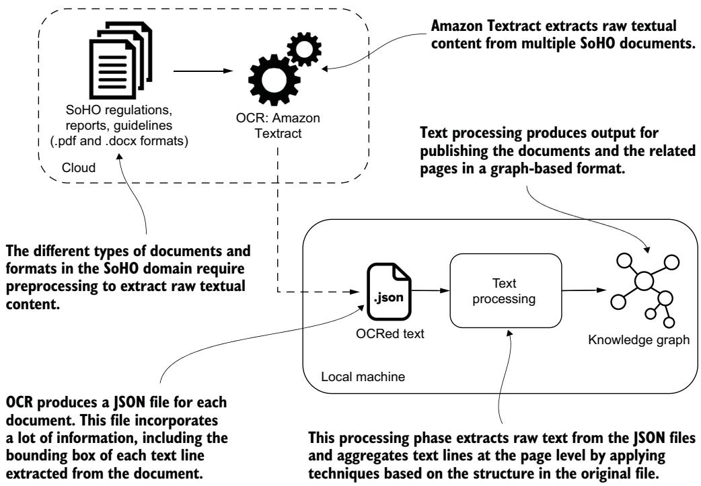
그림 7.10 우리는 Amazon Textract를 사용해 SoHO 문서에서 텍스트를 추출했습니다.

여러분은 로컬 머신에서 텍스트 처리 스크립트를 실행해 페이지들의 전체 텍스트를 복원한 다음, 그 결과를 KG에 적재해야 합니다. 전체 코드 구현은 책의 코드 저장소에서 제공됩니다. 리스팅 7.11은 날것의 텍스트나 처리된 문서를 적재하고, 이 정보를 그래프 기반 형식으로 구조화하는 Cypher 질의를 보여 줍니다.

```python
Listing 7.11 Loading textual content into Neo4j
[...]
class DocsImporter:
[...]
def set_constraints(self):
queries = ["CREATE FULLTEXT INDEX pageText FOR (n:Page) ON EACH [n.text]"]
for q in queries:
self.connection.query(q, db=self.db)
def load_docs(self):
with open(self.docs_file) as json_file:
docs = json.load(json_file)
query = """
MERGE (f:File {id: $name})
SET f.type = $type, f.path = $name
WITH f
UNWIND $pages as page
MERGE (p:Page {id: replace($name, '.pdf', '') + '_' + page.page_idx})
SET p.page_idx = page.page_idx,
p.text = page.text
MERGE (f)-[:CONTAINS_PAGE]->(p)
"""
for i in tqdm(docs):
name = i['name']
type = i['type']
pages = i['pages']
self.connection.query(query,
parameters={'name': name,
'type': type,
'pages': pages},
db=self.db)
```

이 코드가 하는 일을 풀어 보면, 먼저 `Page` 노드의 텍스트에 대해 전문 검색 인덱스(fulltext index)를 만들고, JSON 문서를 열어 각 문서마다 `File` 노드를 `MERGE`(있으면 찾고 없으면 생성)한 뒤, 그 문서의 페이지들을 하나씩 풀어(`UNWIND`) `Page` 노드로 만들고, `File` 과 `Page` 를 `CONTAINS_PAGE` 관계로 연결합니다. 이 과정을 마치면 파일과 페이지 텍스트가 KG에 적재됩니다.

#### 7.6.3 Disambiguating and ingesting medical entities — 의학 개체 중의성 해소와 적재

다음 단계에서는 OCR이 생성한 JSON 파일에서 문서를 직접 처리해 의학 개체를 추출하고 중의성을 해소하며, 그 결과를 파이썬 딕셔너리에 저장한 다음 Neo4j에 적재합니다. 이 처리 결과의 예시는 다음과 같습니다.

#### Listing 7.12 Python dictionary resulting from document processing — 문서 처리 결과 파이썬 딕셔너리

```python
{'id': 'sample_dataset-PublicUse/ECDC Documents/west nile virus/EU-summary
-report-trends-sources-zoonoses-2013_120',
'ents': [{'sentenceIndex': 0,
'value': 'zoonoses',
'lemma': 'zoonosis',
'label': 'ENTITY',
'beginCharacter': 60,
'endCharacter': 68,
'selected_ned_id': 'C0043528',
'selected_ned_name': 'Zoonoses',
'selected_ned_definition': 'Diseases of non-human animals that may be
transmitted to HUMANS or may be transmitted from humans to non-human
animals.',
'selected_ned_aliases': ['Zoonotic Disease',
'Zoonosis, NOS',
'Zoonoses',...],
'selected_ned_types_id': ['T047'],
'selected_ned_types': ['Disease or Syndrome']...
}
```

이 결과는 추출된 개체와 관련된 세부 정보를 저장합니다. 문장 인덱스(sentence index), 그리고 텍스트에서 언급이 위치한 시작·끝 문자(character) 위치가 여기에 담깁니다. 이와 더불어 유형(types)이나 별칭(aliases) 같은 개체 정보도 함께 저장되며, 이 세부 정보들은 7.7절에서 논의할 고급 질의를 수행하는 데 쓰입니다. 이제 이 결과를 Neo4j에 적재할 수 있습니다.

```python
Listing 7.13 Loading NED data
[...]
class NLPImporter(BaseImporter):
[...]
def load_nlp_res(self):
print("Loading data into Neo4j...")
with open(self.file,'rb') as file:
processed_pages = pickle.load(file)
query = """
UNWIND $rows as item
MATCH (page:Page)                            # 아직 처리되지 않은 페이지 노드를 매칭
WHERE page.id = item.id AND NOT page:NEDProcessed
SET page:NEDProcessed
WITH page, item
UNWIND item.ents as entity
MERGE (
mention:EntityMention {
name_normalized: toLower(
apoc.text.join(
apoc.text.split(trim(entity.value), "\\s+"), " "
)
)                                            # 개체 언급 노드를 생성하고 페이지에 연결
)
ON CREATE SET
mention.name = apoc.text.join(
apoc.text.split(trim(entity.value), "\\s+"), " "
)
MERGE
(page)-[s:MENTIONS_MENTION {from_model: "ned"}]->(mention)   # 시작·끝 문자를 포함한 속성 추가
ON CREATE SET s.start_chars= [entity.beginCharacter],
s.end_chars= [entity.endCharacter],
s.sentence_index = [entity.sentenceIndex],
s.type = toLower(entity.label)
ON MATCH SET s.start_chars = s.start_chars + entity.beginCharacter,
s.end_chars = s.end_chars + entity.endCharacter,
s.sentence_index = s.sentence_index +
entity.sentenceIndex
WITH page, mention, entity                    # scispaCy로 추출한 의학 개체 노드를 MERGE
FOREACH(medical in entity
MERGE (dis:MedicalEntity {id: medical.selected_ned_id})
ON CREATE SET dis.name=
apoc.text.join(apoc.text.split(trim(medical.selected_ned_name),
"\\s+"), " "),
dis.type_id = medical.selected_ned_types_id,
dis.types = medical.selected_ned_types,
dis.type = medical.selected_ned_types[0],
dis.original_mention = medical.value,
dis.definition = medical.selected_ned_definition,
dis.aliases = medical.selected_ned_aliases,     # 별칭·의미 유형 등 속성 추가
dis.start_chars= [entity.beginCharacter],
dis.end_chars= [entity.endCharacter],
dis.sentence_index = [entity.sentenceIndex]
ON MATCH SET dis.start_chars = dis.start_chars +
entity.beginCharacter,
dis.end_chars = dis.end_chars + entity.endCharacter
MERGE (mention)-[r:DISAMBIGUATED_TO]->(dis)     # 의학 개체 노드를 개체 언급에 연결
SET r.confidence = medical.selected_ned.confidence
MERGE (page)-[t:MENTIONS_ENTITY]->(dis)         # 의학 개체 노드를 페이지에 연결
ON CREATE SET t.sentence_index = [medical.sentenceIndex]
ON MATCH SET t.sentence_index = t.sentence_index +
medical.sentenceIndex)
"""
self.load_in_batch(query, processed_pages, len(processed_pages),
chunk_size=1)
```

이 질의는 scispaCy 처리 결과를 Neo4j에 저장합니다. 먼저 `Page` 노드에 연결되는 `EntityMention` 노드를 생성합니다. 그런 다음 `MedicalEntity` 노드를 생성하고, UMLS 데이터로 그것을 풍부하게 채우며, 의학 개체를 `EntityMention` 노드와 `Page` 노드에 연결합니다. 앞에서 언급했듯이, 우리는 데이터 표현의 유연성을 높이기 위해 `EntityMention` 과 중의성이 해소된 `MedicalEntity` 를 그래프에 모두 남겨 두었습니다.

---

#### 7.6.4 Processing, loading, and mapping ontologies — 온톨로지 처리·적재·매핑

이 단계에서는 UMLS, SNOMED, HPO 온톨로지를 KG에 적재합니다. UMLS는 여러 온톨로지에 걸친 특정 정보에 접근하는 진입점 역할을 합니다. 이 때문에 우리는 먼저 SNOMED와 HPO 온톨로지를 적재한 다음, 그것들의 각 개체를 UMLS에 매핑합니다.

#### INGESTING SNOMED — SNOMED 적재하기

다음 리스팅은 sct2_Relationship_Full_US1000124_20220901.txt로부터 Neo4j에 노드와 관계를 생성합니다.

#### Listing 7.14 Ingesting SNOMED: loading relationships — SNOMED 적재: 관계 적재

```python
[...]
class SnomedRelationshipsImporter(BaseImporter):   # 기본 적재 기능을 담은 BaseImporter 클래스를 확장
[...]
def set_constraints(self):                          # SNOMED 개체와 속성에 제약·인덱스 정의
queries = [
(
"CREATE CONSTRAINT IF NOT EXISTS FOR (n:SnomedEntity) "
"REQUIRE n.id IS UNIQUE"
),
(
"CREATE INDEX snomedNodeName IF NOT EXISTS "
"FOR (n:SnomedEntity) ON (n.name)"
),
(
"CREATE INDEX snomedRelationId IF NOT EXISTS "
"FOR ()-[r:SNOMED_RELATION]-() ON (r.id)"
),
(
"CREATE INDEX snomedRelationType IF NOT EXISTS "
"FOR ()-[r:SNOMED_RELATION]-() ON (r.type)"
),
(
"CREATE INDEX snomedRelationUmls IF NOT EXISTS "
"FOR ()-[r:SNOMED_RELATION]-() ON (r.umls)"
),
]
for q in queries:
self.connection.query(q, db=self.db)
def import_snomed_rels(self):                       # 파라미터 질의로 SNOMED 관계를 적재
query = """
UNWIND $batch as item
MERGE (e1:SnomedEntity {id: item.sourceId})
MERGE (e2:SnomedEntity {id: item.destinationId})
MERGE (e1)-[:SNOMED_RELATION {id: item.typeId}]->(e2)
FOREACH(ignoreMe IN CASE WHEN item.typeId = '116680003'
THEN [true] ELSE [] END |
MERGE (e1)-[:SNOMED_IS_A]->(e2)                 # 개체 간 계층 연결을 추적하는 SNOMED_IS_A 관계 생성
)
"""
size = self.get_csv_size(snomedRels_file)          # 파일 크기를 얻음(BaseImporter의 기본 구현)
self.batch_store(snomed_rels_query, self.get_rows(snomedRels_file),
size=size)                                         # SNOMED 데이터를 배치 단위로 적재
```

SNOMED에는 수백 가지 관계가 있습니다. 그래프 스키마를 최대한 단순하게 유지하기 위해, 우리는 유일한 `SNOMED_RELATION` 관계 하나를 만들고, 관계의 이름을 `type` 속성으로 저장하기로 했습니다. 리스팅 7.14에서 우리는 계층 연결을 정의하기 위해 `SNOMED_IS_A` 관계를 만드는데, 왜 이 선택이 뿌리(root) 노드에서 잎(leaf) 노드로 정보를 전파하는 데 편리한지는 곧 보게 됩니다.

이제 그래프의 모양을 잡기 위해 노드와 관계를 적재했으니, 이 구조에 이름과 별칭을 추가해 풍부하게 만들어야 합니다. 다음 클래스는 sct2_Description_Full-en_US1000124_20220901.txt로부터 정보를 추출합니다.

```python
Listing 7.15 Ingesting SNOMED: loading names and aliases
[...]
class SnomedNamesImporter(BaseImporter):
[...]
def import_snomed_names(self, snomedNames_file):
snomed_names_concepts_query = """
UNWIND $batch as item
MATCH (e1:SnomedEntity)
-[r:SNOMED_RELATION {id: item.conceptId}]->
(e2:SnomedEntity)
WHERE item.conceptId <> '116680003' AND r.id = item.conceptId
SET r.type = CASE
WHEN r.type IS NULL THEN item.termAsType
ELSE r.type END,                              # 관계 이름을 type 속성에 추가
r.aliases = CASE
WHEN item.termAsType IN r.aliases THEN r.aliases
ELSE coalesce(r.aliases,[]) + item.termAsType END   # 관계 별칭 추가
"""
snomed_names_entities_query = """
UNWIND $batch as item
MATCH (e:SnomedEntity {id: item.conceptId})
SET e.name = CASE
WHEN e.name IS NULL THEN item.term
ELSE e.name END,                              # 노드 이름 추가
e.aliases = CASE
WHEN item.term in e.aliases THEN e.aliases
ELSE coalesce(e.aliases, []) + item.term END  # 노드 별칭 추가
"""
size = self.get_csv_size(snomedNames_file)
self.batch_store(
snomed_names_concepts_query,
self.get_rows(snomedNames_file),
size=size)
self.batch_store(
snomed_names_entities_query,
self.get_rows(snomedNames_file),
size=size)
```

이 클래스는 그래프에 적재된 노드와 관계에 이름과 별칭을 추가합니다. 다음 단계는 뿌리 노드에서 모든 하위 노드를 거쳐 잎 노드까지 정보를 전파하는 것입니다. 최상위 레벨의 노드는 질병, 신체 구조, 물질, 사건처럼 의학 도메인에서 SNOMED의 원형적(archetypal) 개체를 나타냅니다. 이 뿌리 노드들은 SNOMED에 있는 개체들의 의미 유형을 정의합니다. 그런데 이 정보는 우리가 적재한 데이터 안에 암묵적으로만 들어 있습니다. 왜냐하면 다른 모든 개체에 대해 원본 데이터에는 이름과 별칭만 있기 때문입니다. 따라서 우리는 이 정보를 온톨로지의 트리 구조를 통해 전달하는 메커니즘이 필요합니다. 이렇게 하면 깊은 곳에 있는 개체가 질병인지 제품인지 쉽게 탐지할 수 있습니다. 그림 7.11이 이 전파 메커니즘을 명확히 보여 줍니다.

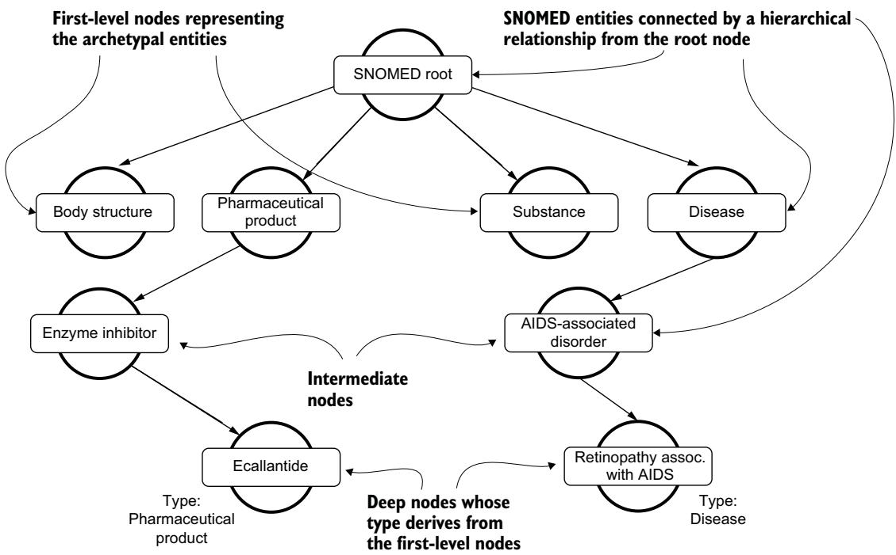
그림 7.11 SNOMED 온톨로지의 계층 구조 샘플. 이 계층 구조를 이용하면, Ecallantide나 "에이즈 연관 망막병증(Retinopathy associated with AIDS)"처럼 더 깊은 레벨에 위치한 노드도 "약제(Pharmaceutical product)"나 "질병(Disease)"처럼 온톨로지의 원형적 개체를 나타내는 첫 레벨 노드의 정보를 이용해 분류할 수 있습니다.

다음 리스팅은 모든 노드를 되찾아 와서, 계층 구조를 따라 첫 레벨 노드에서 더 깊은 노드로 정보를 전파합니다.

```python
Listing 7.16 Ingesting SNOMED: propagating labels from first-level nodes
[...]
class SnomedLabelPropagator():
[...]
def get_rows(self):
propagation_query = """
MATCH p=(n:SnomedEntity)<-[:SNOMED_IS_A]-(m:SnomedEntity)
WHERE n.id= "138875005" // Root node
WITH distinct m as first_node
CALL apoc.path.expandConfig(first_node, {              # expandConfig로 계층 순회 규칙을 설정
relationshipFilter: '<SNOMED_IS_A',
minLevel: 1,
maxLevel: -1,
uniqueness: 'RELATIONSHIP_GLOBAL'
}) yield path
UNWIND nodes(path) as other_level                     # 순회 결과로 얻은 노드들을 가져옴
WITH first_node, collect(DISTINCT other_level) as uniques
UNWIND uniques as unique_other_level
WITH first_node,unique_other_level
WHERE not first_node.name in
coalesce(unique_other_level.type,[])                  # 특정 유형을 가진 모든 노드를 반환
RETURN unique_other_level.id as id, first_node.name as label
"""
with self._driver.session(database=self._database) as session:
result = session.run(query=propagation_query)
for record in iter(result):
yield dict(record)
[...]
```

`SNOMED_IS_A` 관계는 개체 사이의 계층 연결을 이용해, 트리 구조를 통해 의미 유형을 전파합니다. 즉 뿌리에 있는 "질병"이라는 라벨이 그 아래 계통을 타고 내려가면서 깊은 곳의 구체적인 질병 노드까지 "이것은 질병"이라는 정보를 물려주게 됩니다.

#### INGESTING HPO — HPO 적재하기

다음 리스팅들은 HPO 온톨로지를 적재하는 주요 단계를 개괄합니다. 적절한 인덱스 생성을 포함한 더 자세한 내용은 3장에서 논의했으며, 책 저장소의 Cypher 코드에 포함되어 있습니다. 먼저 **Neosemantics** 플러그인을 사용해 HPO 온톨로지를 임포트합니다.

```javascript
CALL n10s.rdf.import.fetch("http://purl.obolibrary.org/obo/hp.owl","RDF/XML");
```
Listing 7.17 Ingesting HPO: loading the ontology

HPO 온톨로지는 RDF/XML 형식으로 제공되며, Cypher로 처리할 수 있도록 Neo4j 그래프 구조로 변환됩니다.

다음으로, 표현형 특성(phenotypic feature) 개체를 나타내는 노드에 `HpoEntity` 라벨을 추가합니다.

#### Listing 7.18 Ingesting HPO: adding the HpoEntity label to phenotypic features — HPO 적재: 표현형 특성에 HpoEntity 라벨 추가

```sql
MATCH (n:Resource)
WHERE n.uri STARTS WITH "http://purl.obolibrary.org/obo/HP"
SET n:HpoEntity,
n.id = coalesce(n.id, replace(apoc.text.replace(n.uri,'(.*)obo/',''),'_', ':'));
```

이제 표현형 특성과 질병 사이의 연결을 기술하는 주석(annotation) 파일을 처리해야 합니다. 이 단계를 더 효율적으로 만들기 위해, 다음 질의로 질병 개체를 그래프 노드로 적재합니다.

```sql
Listing 7.19 Ingesting HPO: creating HpoDiseaseEntity nodes
LOAD CSV FROM 'https://github.com/obophenotype/human-phenotype-
ontology/releases/latest/download/phenotype.hpoa' AS row
FIELDTERMINATOR '\t'
WITH row
SKIP 5
MERGE (dis:Resource:HpoDiseaseEntity {id: row[0]})
ON CREATE SET dis.label = row[1];
```

다음 단계는 가용한 표현형 특성 노드와 질병 노드 사이의 관계를 생성하는 것입니다.

#### Listing 7.20 Ingesting HPO: relations between HpoEntity and HpoDiseaseEntity — HPO 적재: HpoEntity와 HpoDiseaseEntity 사이의 관계

```sql
LOAD CSV FROM 'https://github.com/obophenotype/human-phenotype-ontology/
releases/latest/download/phenotype.hpoa' AS row
FIELDTERMINATOR '\t'
WITH row
SKIP 5
MATCH (dis:HpoDiseaseEntity)
WHERE dis.id = row[0]
MATCH (phe:HpoEntity)
WHERE phe.id = row[3]
MERGE (dis)-[:HAS_PHENOTYPIC_FEATURE]->(phe)
```

다음 질의는 텍스트에서 추출해 중의성이 해소된 개체와 온톨로지 노드 사이의 연결을 확립합니다.

#### Listing 7.21 Integrating SNOMED through the UMLS — UMLS를 통해 SNOMED 통합하기

```sql
MATCH (m:MedicalEntity)
WITH m
MATCH (d:SnomedEntity)
WHERE m.id in d.umls_ids
WITH m, d
MERGE (m)-[:IS_SNOMED_ENTITY]->(d)
```

우리는 HPO 온톨로지에도 유사한 과정을 수행합니다(자세한 내용은 전체 코드를 참조하세요). 다음 질의는 `MedicalEntity` 노드와 HPO 주석 파일의 `HpoDiseaseEntity` 노드를 연결합니다.

```sql
Listing 7.22 Connecting MedicalEntity and HpoDiseaseEntity nodes
MATCH (m:MedicalEntity)
WITH m
MATCH (d:HpoDiseaseEntity)
WHERE m.id in d.umls_ids
WITH m, d
MERGE (m)-[:IS_DISEASE_ENTITY]->(d)
```

다음 절에서는 같은 문장에 위치한 개체들 사이의 공동 등장(co-occurrence) 관계를 생성합니다.

#### 7.6.5 Generating entity co-occurrences — 개체 공동 등장 생성하기

텍스트에서 의학 개체들의 공동 등장을 식별하는 것은, 텍스트 콘텐츠의 비정형 지식과 도메인 온톨로지의 정형 지식을 결합하는 고급 활용 사례를 가능하게 하는 근본적인 단계입니다. 리스팅 7.23의 질의는 같은 문장에서 식별된 의학 개체들 사이에 `COOCCURR` 라는 새로운 관계를 생성합니다.

> **정의** 공동 등장(co-occurrence)이란 `Page` 노드를 `Entity` 노드 위로 투영(projection)한 것을 말합니다.

#### Listing 7.23 Creating co-occurrence relationships at the sentence level — 문장 수준의 공동 등장 관계 생성

```cypher
CALL apoc.periodic.iterate(
"MATCH (n:Page) WHERE exists( (n)-[:MENTIONS_ENTITY]->(:MedicalEntity) )
RETURN n",
"MATCH (n)-[r:MENTIONS_ENTITY]->(m:MedicalEntity)
WITH n, r.sentence_index as sentences, m
UNWIND sentences as sentence
WITH n, sentence, collect(distinct m) as entities
UNWIND range(0, size(entities)-2) as i
UNWIND range(i+1, size(entities)-1) as j
WITH n, sentence, entities, i, j
MATCH (m1) WHERE id(m1) = id(entities[i])
MATCH (m2) WHERE id(m2) = id(entities[j])
WITH n, sentence, entities, i, j, m1, m2
MERGE (m1)-[s:COOCCURR]-(m2)
ON CREATE SET s.count = 1,
s.sentences = [sentence]
ON MATCH SET s.count = s.count + 1,
s.sentences = s.sentences + sentence",
{batchSize: 50})
```

이 질의는 각 페이지에서 같은 문장에 등장하는 의학 개체들의 쌍을 모두 찾아, 그 쌍마다 `COOCCURR` 관계를 만들고 등장 횟수(`count`)와 문장 목록(`sentences`)을 기록합니다. 그 결과 KG에 2만 5,000개가 넘는 관계가 생겨나면서, 같은 문장에 위치한 의학 개체들 사이의 연결이 명시적으로 드러납니다. 다음에 논의하겠지만, 공동 등장하는 개체들 사이의 온톨로지 연결을 분석하면 이 개체들과 관련된 이미 확립된 지식을 발견할 수 있고, 아직 생의학 온톨로지에 확립되지 않은 새로운 정보를 발굴할 수도 있습니다.

---

### 7.7 KG-based use cases — KG 기반 활용 사례

이 절에서는 코드 예시를 통해, NED와 결합한 KG를 이용해 다음 활용 사례들을 어떻게 다루는지 보여 줍니다.

- 개념 검색(conceptual search)
- 구조화된 지식 기반 검색(structured knowledge-based search)
- KG 기반 해석 가능성과 발견(interpretability and discovery)
- 새로운 지식 발굴(uncovering new knowledge)

그림 7.12는 이 응용 도메인에서 정의한 활용 사례와 관련된 분석 단계를 포함합니다.

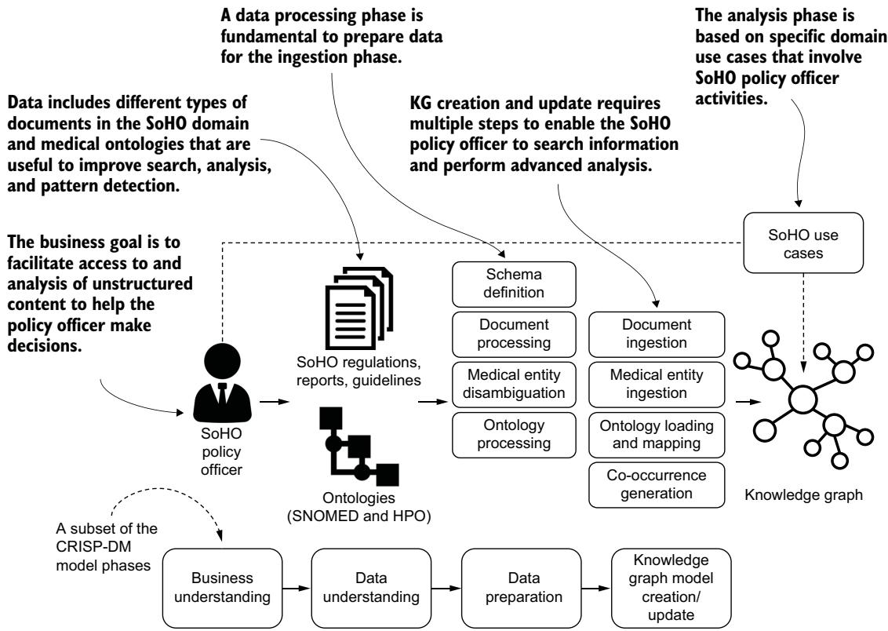
그림 7.12 KG를 생성한 뒤, 우리는 정의된 활용 사례를 적용해 비즈니스 문제를 다루고 KG에 기반한 해결책을 제공하는 분석을 수행할 수 있습니다.

> **참고** 환경, Neo4j 인덱싱 동작, 데이터 파이프라인 적재 순서, 그리고 scispaCy가 수행하는 개체 추출의 비결정론적(nondeterministic) 측면 등의 차이 때문에, 여러분의 질의 결과는 이 장에 나온 것과 약간 다를 수 있습니다.

#### 7.7.1 Conceptual search — 개념 검색

개념 검색은 같은 의미를 지닌 서로 다른 표현들을 조화시켜 사용자에게 되돌려 주거나, 서로 다른 개체를 가리키는 비슷한 용어들을 구분하는 능력과 관련됩니다. 개념 검색을 수행하면 특정 문서와 그 개체를 언급하는 텍스트 부분에 대한 검색을 넓히거나 좁힐 수 있습니다. 그림 7.13은 개념 검색과 전통적인 전문 검색(full-text search)을 개괄적으로 비교합니다.

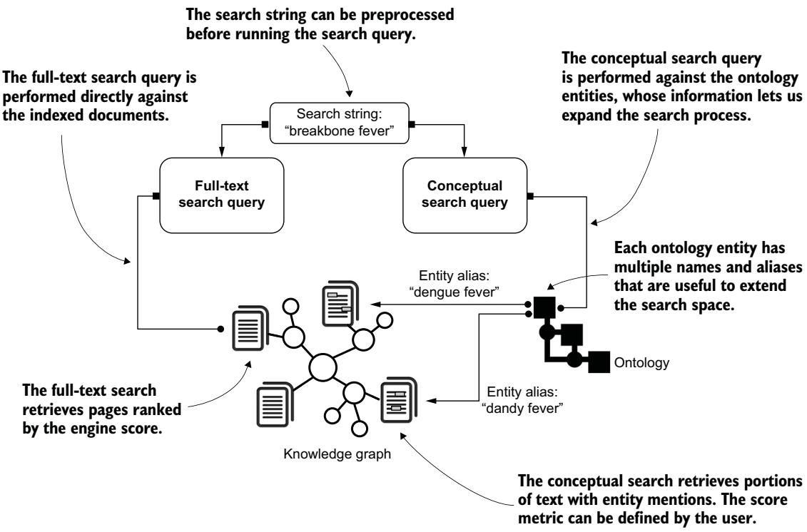
그림 7.13 전통적인 전문 검색과 개념 검색의 차이. 전문 검색 질의는 문서 집합에 직접 수행되는 반면, 개념 검색 질의는 문서를 검색하기 전에 온톨로지의 정보를 이용해 검색 공간을 확장합니다.

전통적인 전문 검색에서 시작해 개념 검색의 효과를 살펴봅시다. 다음 검색 질의는 "breakbone fever(브레이크본 열)"를 언급하는 모든 문서를 되찾아 오려 시도합니다.

```cypher
Listing 7.24 Full-text search query with "breakbone fever" as the input string
CALL db.index.fulltext.queryNodes("PageText", "breakbone fever")
YIELD node, score
WITH node as p, score as score
MATCH (f:File)-[:CONTAINS_PAGE]->(p)
RETURN f.id as `File ID`, p.page_idx as `Page index`, score as Score
LIMIT 5
```

표 7.1은 점수 값으로 정렬한 전문 검색 결과를 보여 줍니다. 첫 번째 열은 문서 경로, 두 번째 열은 문서 안의 페이지 인덱스, 세 번째 열은 전문 검색 알고리즘이 계산한 점수를 나타냅니다.

**표 7.1 "breakbone fever"에 대한 전문 검색으로 되찾은 상위 5개 페이지**

| File ID | Page index | Score |
|---|---|---|
| sample_dataset-PublicUse/ECDC Documents/west nile virus/emerging-vector-borne-diseases_annual-epidemiological-report-2014.pdf | 5 | 2.12 |
| sample_dataset-PublicUse/ECDC Documents/west nile virus/emerging-vector-borne-diseases_annual-epidemiological-report-2014.pdf | 4 | 2.09 |
| sample_dataset-PublicUse/ECDC Documents/zika virus/Communicable-disease-threats-report-26-mar-2016.pdf | 10 | 2.08 |
| sample_dataset-PublicUse/ECDC Documents/ebola/communicable-disease-threats-report-13-19-mar-2016.pdf | 9 | 2.08 |
| sample_dataset-PublicUse/ECDC Documents/zika virus/Communicable-disease-threats-report-26-mar-2016.pdf | 10 | 2.08 |

이런 유형의 검색은 퍼지 로직(fuzzy logic)을 이용해 문서 집합에서 키워드를 식별합니다. 이 경우 "breakbone"이라는 단어는 텍스트에 전혀 언급되지 않지만, 높은 점수를 받은 문서들에는 "fever(열)"라는 단어가 여러 번 등장합니다. 그렇지만 우리가 정작 관심 있는 것은 이 특정 질병을 언급하는 문서, 또는 궁극적으로 이 질병의 원인체를 언급하는 문서를 식별하는 것입니다.

UMLS 지식 베이스에서 코드 C0011311은 이 개체를 식별하며, 이 개체는 "dengue fever", "dungero", "dandy fever" 등 다양한 형태로 나타날 수 있습니다. 그래서 우리는 다음 질의를 실행해, 별칭이 "breakbone fever"인, scispaCy 모델이 식별한 모든 의학 개체를 되찾아 옵니다.

```cypher
MATCH (f:File)-[:CONTAINS_PAGE]->(p)
-[r:MENTIONS_MENTION]->(m)-[:DISAMBIGUATED_TO]->(e)
WHERE "breakbone fever" IN [x IN e.aliases | toLower(x)]   -- 별칭에 "breakbone fever"가 있는 개체만 필터링
UNWIND range(0, size(r.start_chars) - 1) AS mention        -- 페이지당 여러 언급을 다루기 위해 각 언급 인덱스를 순회
WITH f, p, e, m, r, mention
RETURN DISTINCT
f.id AS `File ID`,
p.page_idx AS `Page index`,
apoc.text.join(
collect(
substring(
p.text,
apoc.coll.max([r.start_chars[mention] - 100, 0]),   -- 시작 위치에서 100을 빼되 0 미만으로 내려가지 않게 함
r.end_chars[mention] - r.start_chars[mention] + 200  -- 언급 길이에 200을 더해 앞뒤 맥락을 확보
)
)[0..3],                                              -- 파일-페이지 조합당 맥락 스니펫을 앞 3개로 제한
'\n\n'
) AS `Mention contexts`,
size(collect(m.name)) AS `Number of mentions`
ORDER BY `Number of mentions` DESC
LIMIT 5
```

표 7.2는 우리 개념 검색에서 점수가 높은 페이지들과, breakbone fever를 나타내는 UMLS 개체를 언급하는 문단 예시를, 언급 횟수 순으로 보여 줍니다.

**표 7.2 "breakbone fever"를 개체 별칭으로 사용해 되찾은 상위 점수 페이지**

| File ID | Page index | Mention context | Number of mentions |
|---|---|---|---|
| sample_dataset-PublicUse/ECDC Documents/hepatitis-a/communicable-disease-threats-report-feb-24-2018.pdf | 11 | "[...] In 2017, Cambodia reported over 3,200 suspected dengue cases." | 22 |
| sample_dataset-PublicUse/ECDC Documents/ebola/communicable-disease-threats-report-17 may-2014.pdf | 11 | "[..] Singapore has reported more than 1000 dengue cases nationally from January to April this year, which is 15 per cent fewer cases compared with [...]" | 20 |
| sample_dataset-PublicUse/ECDC Documents/ebola/Communicable-disease-threats-report-19-jul-2014.pdf | 12 | "[..] An epidemic of dengue fever in Malaysia has now infected nearly 47,000 people, which is more than double the number of cases [...]" | 20 |
| sample_dataset-PublicUse/ECDC Documents/ebola/communicable-disease-threats-report-21-jun-2014.pdf | 13 | "[...] Cuba has recorded 67 imported cases of dengue fever up to 8 June, according to media quoting the Cuban government." | 20 |
| sample_dataset-PublicUse/ECDC Documents/west nile virus/ | 12 | "[..] Oceania: As of 13 June 2014, 1 762 suspected dengue cases have been reported in Solomon Islands since January 2014." | 19 |

전문 검색 결과와 비교해 보면, 가장 관련성 높은 페이지들이 완전히 달라졌음을 알 수 있습니다. 개념 검색 질의를 업데이트해 전체 결과 집합을 보고 탐색해 봅시다(LIMIT 절 제거). 전문 검색 질의의 첫 번째 결과는 개념 검색 질의에서는 19번째 위치에 자리합니다. 이 특정 문서에는 UMLS 개체 언급이 17번 있는 반면, 개념 검색 질의의 최상위 점수 결과에는 C0011311 UMLS 개체 언급이 22번 있습니다.

개념 검색을 도입하는 것은 우리 응용 도메인에 엄청난 효과를 줍니다. 전문 검색에 비해 더 정밀하고 상세한 정보를 되찾을 수 있습니다. 문서 경로와 페이지 인덱스뿐 아니라, 개체를 언급하는 텍스트 부분과 그 페이지에서 이 개체가 등장한 횟수까지 식별할 수 있습니다. 따라서 개념 검색은 되찾은 문서의 설명 가능성(explainability)을 개선하는 다른 기능도 가능하게 합니다. NED 모델 덕분에 탐지된 개체가 텍스트에서 어디에 위치하는지 식별할 수 있으므로, 모델이 기대만큼 동작하지 않은 경우를 식별하기 위한 정밀한 디버깅 테스트도 궁극적으로 수행할 수 있습니다.

개념 검색은 한 단어나 표현이 맥락에 따라 다른 의미를 지니는 시나리오에서도 검색 과정을 향상시킵니다. 예를 들어 "islands(섬)"라는 단어에는 전통적인 뜻이 있지만, "islands of Langerhans(랑게르한스섬)"라는 표현에서 쓰이면 완전히 다른 의미 맥락을 갖게 됩니다. 전통적인 전문 검색은 물로 둘러싸인 육지 덩어리를 가리키는 무관한 결과로 이어질 수 있습니다. 개념 검색 메커니즘을 이용하면 이런 결과를 걸러 내고, "pancreatic islets(췌장 소도)" 같은 다른 표현까지 포함하도록 검색 범위를 넓혀 더 관련성 높은 콘텐츠를 포착할 수 있습니다. 다음에 논의하겠지만, 개념 검색의 핵심 개념은 온톨로지 관계를 통해 연결된 의학 개체를 포함한 페이지들을 이어 붙임으로써 더 확장될 수 있습니다.

---

#### 7.7.2 Structured knowledge-based search — 구조화된 지식 기반 검색

구조화된 지식 기반 검색을 이용하면, 도메인 온톨로지에 정형화된 형식적 지식을 사용해 텍스트에서 정보를 되찾고, 여러 문서에 걸친 서로 다른 텍스트 조각들 사이에 단순하지 않은 관계를 만들 수 있습니다. 우리는 이미 모호하거나 여러 이름을 가진 개체라도 뎅기열이나 췌장 소도처럼 같은 개념을 가리키는 정보를 어떻게 한데 모으는지 보았습니다. 그런데 SNOMED 같은 온톨로지에 내장된 지식을 이용하면, 온톨로지 관계에 이끌려 비정형 콘텐츠를 한데 모으고 연결할 수 있습니다. 예를 들어 랑게르한스섬 같은 세포 기증이 중요하다는 점을 감안하면, 이 세포에 영향을 주어 기증 과정을 위태롭게 할 수 있는 질병을 언급하는 모든 텍스트를 한데 모으는 것이 유익할 것입니다. 그림 7.14는 개념 검색 질의와 구조화된 지식 기반 질의의 차이를 나타낸 멘탈 모델을 보여 줍니다.

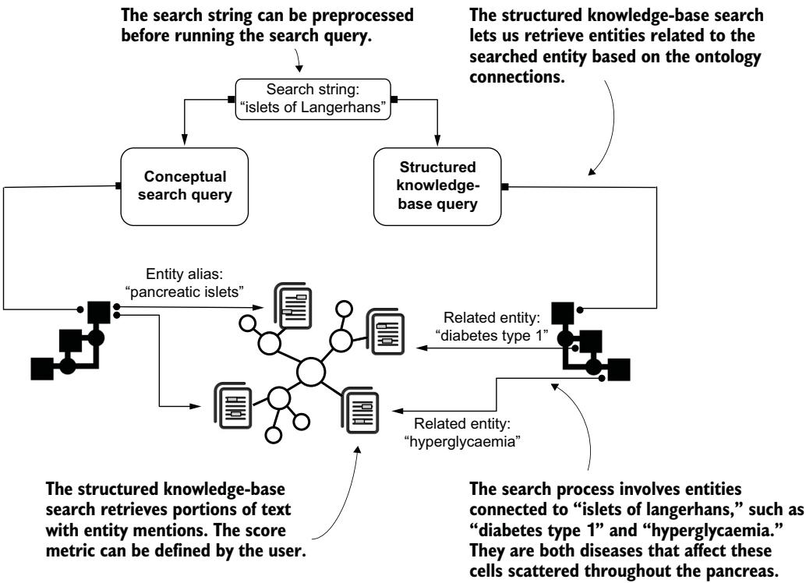
그림 7.14 개념 검색과 구조화된 지식 기반 검색의 차이. 이 경우 검색 과정은 검색 질의에서 탐지된 개체에 온톨로지 관계로 연결된 의학 개체들을 포함합니다. "islets of Langerhans" 검색에서 시작해, 시스템은 랑게르한스섬에 영향을 줄 수 있는 두 질병인 "diabetes type 1(1형 당뇨병)"과 "hyperglycaemia(고혈당)"를 검색합니다.

다음 질의는 랑게르한스섬에 영향을 줄 수 있는 질병을 언급하는 텍스트 부분을 되찾아 옵니다.

#### Listing 7.26 Getting text about diseases that can affect the islets of Langerhans — 랑게르한스섬에 영향을 줄 수 있는 질병에 관한 텍스트 얻기

```cypher
MATCH (m1:MedicalEntity)-[:IS_SNOMED_ENTITY]->(s1:SnomedEntity)
<-[r1:SNOMED_RELATION]-(s2:SnomedEntity)
<-[:IS_SNOMED_ENTITY]-(e:MedicalEntity)
WHERE m1.name = "Islets of Langerhans" AND r1.type = "FINDING_SITE"   -- FINDING_SITE 관계로 랑게르한스섬과 연결된 SNOMED 개체만 필터링
WITH e
MATCH path = (f:File)-[:CONTAINS_PAGE]->(p)
-[r:MENTIONS_MENTION]->(m)-[:DISAMBIGUATED_TO]->(e)
UNWIND range(0, size(r.start_chars) - 1) AS mention   -- start_chars 인덱스로 각 언급을 순회(관계당 여러 언급 허용)
WITH f, p, r, e, mention,
apoc.coll.max([r.start_chars[mention] - 100, 0]) AS start,          -- 맥락 추출 시작 인덱스(100자 뒤로, 0 미만 방지)
apoc.coll.min([r.end_chars[mention] + 100, size(p.text)]) AS end    -- 종료 인덱스(언급 뒤 100자, 페이지 길이 초과 방지)
WITH f, p, r, e, mention, substring(p.text, start, end - start) AS context
WITH f, p,
collect(DISTINCT e.name) AS `Mentioned entities`,
collect(context)[0..3] AS contexts                    -- 맥락 창을 앞 3개 언급으로 제한
RETURN DISTINCT
f.id AS `File ID`,
p.page_idx AS `Page index`,
`Mentioned entities`,
apoc.text.join(contexts, '\n\n') AS `Mention contexts`
ORDER BY size(`Mentioned entities`) DESC
LIMIT 5
```

이 질의 결과의 일부가 표 7.3에 나와 있습니다.

**표 7.3 랑게르한스섬에 영향을 줄 수 있는 질병에 관한 텍스트 콘텐츠**

| File ID | Page index | Mentioned entities | Mention contexts |
|---|---|---|---|
| sample_dataset-PublicUse/EDQM Documents/BTC/guide-to-the-quality-and-safety-of-organs-for-transplantation-7th-edition.PDF | 137 | Diabetes | "Metabolic syndrome, arterial hypertension, diabetes mellitus, albuminuria (see below) and other chronic kidney diseases or systemic disease [..]" |
| (동일 문서) | 144 | Mellitus, Metabolic Syndrome X Hyperglycemia, Diabetes Mellitus, Non-Insulin-Dependent | "[...] Many patients with severe head trauma become hyperglycaemic and require insulin therapy, despite normal pancreatic function and no history of diabetes. [..] On the other hand, manifestation of diabetes mellitus type II is possible at an age of over 50-65 years." |

리스팅 7.26에서 우리는 개념 검색 질의의 논리를 확장해, 온톨로지에서 개체들의 모음을 입력으로 받고 문서에서 관련 세부 사항을 되찾아 옵니다. 가장 흥미로운 결과 중 하나는 『인간 이식용 장기의 품질과 안전 가이드 7판(Guide to the Quality and Safety of Organs for Transplantation, 7th ed.)』의 144쪽에서 나온 것으로, 표 7.3의 4열에 보고되어 있습니다. 이 페이지는 고혈당(Hyperglycemia)을 언급하는데, 고혈당은 FINDING_SITE 관계를 통해 랑게르한스섬 개체와 명시적으로 연결되어 있으며, 머리 외상을 입은 잠재적 기증자를 관리하는 맥락에서 등장합니다. 이 문장은 기증자 유지 프로토콜(donor-maintenance protocol)에 초점을 맞춘 췌장 기증 전용 섹션에 위치합니다. 이 결정적인 정보는 개념 검색 메커니즘으로는 되찾을 수 없었을 것입니다. 하지만 우리는 고혈당 의학 개체가 우리 검색의 출발점(랑게르한스섬)과 맺는 연결을 이용해 이 정보에 도달했습니다. 다른 결과들은 다양한 형태의 당뇨병을 언급하는데, 이는 췌장 소도 기증에서 특히 관련이 있습니다.

구조화된 지식 기반 검색은 온톨로지에서 가장 긴 경로(longest paths)를 이용해서도 수행할 수 있습니다. 지카 바이러스 예시를 생각해 봅시다. 이 바이러스는 토가바이러스(Togavirus)로 분류될 수 있으며, 피를 빨아먹는 절지동물 종(특히 곤충과 거미류)을 통해 사람에게 전파됩니다. 우리가 토가바이러스가 유발하는, 문서에 언급된 모든 질병에 관심이 있다고 해 봅시다. 우리는 SNOMED 온톨로지에서 여러 개의 CAUSATIVE_AGENT(원인체) 관계를 이어 붙인 경로를 탐색하고, 그 결과를 이용해 원하는 문서를 얻을 수 있습니다. 그림 7.15가 그 예시를 보여 줍니다.


그림 7.15 CAUSATIVE_AGENT 관계만 포함하는 SNOMED 온톨로지 경로. 이 관계 부분집합을 항해하는 것은 같은 바이러스 유형이 옮기는 질병들을 식별하는 데 특히 유용합니다.

우리는 검색 질의에 지정된 개체(지카 바이러스)와 직접 연결되지 않은, 황열(Yellow fever), 리프트밸리열(Rift valley fever), 풍진(Rubella) 같은 개체까지 검색을 확장할 수 있습니다. 리스팅 7.27은 이런 복잡한 경로를 이용해 관련 문서를 되찾는 질의를 보여 줍니다. 이 예시는 우리 응용 도메인에 특히 흥미로운데, 공통으로 지닌 바이러스 유형을 기준으로 유사한 질병을 언급하는 문서를 되찾을 수 있기 때문입니다.

#### Listing 7.27 Getting documents mentioning diseases caused by Togaviruses — 토가바이러스가 유발하는 질병을 언급하는 문서 얻기

```cypher
MATCH (m1:MedicalEntity)-[:IS_SNOMED_ENTITY]->(s1:SnomedEntity)
-[r1:SNOMED_RELATION*3..3]-(s2:SnomedEntity)
<-[:IS_SNOMED_ENTITY]-(e:MedicalEntity)   -- SNOMED_RELATION을 3홉 순회해 간접적으로 관련된 의학 개체 발견
WHERE m1.name = "Zika Virus"
AND all(x IN r1 WHERE x.type = "CAUSATIVE_AGENT")   -- 세 관계가 모두 CAUSATIVE_AGENT인 경로만 필터링해 의미적 일관성 확보
WITH DISTINCT e
MATCH path = (f:File)-[:CONTAINS_PAGE]->(p)
-[r:MENTIONS_MENTION]->(m)-[:DISAMBIGUATED_TO]->(e)
WITH f, e, collect(p.page_idx) AS pages_list   -- 개체가 언급된 모든 페이지의 인덱스를 수집
RETURN DISTINCT
f.id AS `File ID`,
pages_list,
collect(DISTINCT e.name) AS `Mentioned entity`
ORDER BY size(`Mentioned entity`) DESC
LIMIT 5
```

이 질의의 결과가 표 7.4에 나열되어 있습니다.

**표 7.4 토가바이러스가 유발하는 질병을 언급하는 문서와 페이지**

| File ID | Pages | Mentioned entities |
|---|---|---|
| sample_dataset-PublicUse/ECDC Documents/west nile virus/TER-Mosquito-surveillance-guidelines.pdf | 10 | Murray valley encephalitis, Japanese Encephalitis, Venezuelan equine encephalomyelitis, Encephalomyelitis, Eastern Equine, Ross river virus infection |
| sample_dataset-PublicUse/ECDC Documents/ebola/ebola-preparedness-belgium.pdf | 38 | Yellow Fever, Rift Valley Fever, West Nile Fever, Dengue Fever, Chikungunya Fever |
| sample_dataset-PublicUse/ECDC Documents/west nile virus/communicable-disease-threats-report-18-august-2019-updated-26-august-2019.pdf | 1 | Rubella, Yellow Fever, Japanese Encephalitis, Dengue Fever, Chikungunya Fever |
| sample_dataset-PublicUse/ECDC Documents/ebola/communicable-disease-threats-report-18-august-2019-updated-26-august-2019.pdf | 1 | Rubella, Yellow Fever, Japanese Encephalitis, Dengue Fever, Chikungunya Fever |
| sample_dataset-PublicUse/ECDC Documents/west nile virus/communicable-disease-threats-report-15-december-2018.pdf | 1 | Yellow Fever, Dengue Fever, Mosquito-Borne Diseases, Chikungunya Fever |

이 활용 사례는 온톨로지 연결을 이용해 관련 정보를 자동으로 되찾는 데 특히 유용합니다. 검색 문자열에 언급된 개체에서 시작해, 우리는 이 검색 개체와 관련된 개체들을 언급하는 여러 텍스트 조각 사이를 항해할 수 있으며, 이는 IAS 시스템에서 사용자 경험을 풍부하게 할 새로운 가능성을 열어 줍니다.

---

#### 7.7.3 KG-based interpretability and discovery — KG 기반 해석 가능성과 발견

같은 문장에 등장하는 개체들의 공동 등장에서 시작해, KG 기반 해석 가능성과 발견은 이 개체들이 온톨로지에서 어떻게 연결되어 있는지, 그리고 그 연결의 본질이 무엇인지 분석할 수 있게 해 줍니다. 어떤 경우에는 온톨로지 연결이 특정 문장에서 개체들이 공동 등장한 이유를 반영합니다(해석 가능성). 이 분석은 공동 등장하는 개체들을 온톨로지에 비추어 검증하는 데도 쓰일 수 있습니다. 그리고 다른 경우에는 온톨로지 연결이 문장이 제공하는 정보를 확장하는 지식을 더해 줍니다(발견).

이 활용 사례의 가치를 더 잘 이해하기 위해, 리스팅 7.28을 봅시다. 여기에는 "인간 혈액 및 혈액 성분의 수집·검사·처리·보관·유통에 대한 품질·안전 표준을 정하고 이사회 지침 89/381/EEC를 개정하는, 유럽 의회 및 이사회 지침 제안"이라는 제목의 문서에서 가져온 문장들이 담겨 있습니다. 이 문서에서 "AIDS"와 "Hepatitis(간염)"는 두 번 공동 등장합니다.

#### Listing 7.28 Sentences where AIDS and Hepatitis co-occur — AIDS와 간염이 공동 등장하는 문장

```text
SENTENCE 1: The reasons why they should not donate which put recipients at
risk, such as unsafe sexual behaviour, HIV/ AIDS, hepatitis, drug
addiction and the use and abuse of drugs;
[...]
SENTENCE 2: Infectious diseases persons suffering or having suffered from
- Babesiosis
- Hepatitis B (HBsAg confirmed positive)
- Hepatitis C
- Hepatitis, infectious (of unexplained aetiology)
- HIV/AIDS
```

이 문장들에서 "AIDS"와 "Hepatitis"가 서로 가까이 등장하는 이유는, 둘 다 기증 과정에서 위험 요인, 즉 전염성 질환을 나타내기 때문입니다. 이 정보는 SNOMED에 직접 인코딩되어 있으며, 서로 다른 온톨로지 경로로 표현됩니다. 다음 리스팅은 그 일부를 보여 줍니다.

```text
Listing 7.29 Paths connecting entities, interpretability perspective
(AIDS)-[:PATHOLOGICAL_PROCESS]->(Infectious disease)
<-[:DUE_TO]-(Hepatitis due to infection)
-[:IS_A]->(Inflammatory disorder of liver)
(AIDS)-[:PATHOLOGICAL_PROCESS]->(Infectious disease)
<-[:DUE_TO]-(Viral hepatitis)
-[:IS_A]->(Inflammatory disorder of liver)
```

이 온톨로지 경로들은 이 두 개체 사이의 연결을 정의하고, "AIDS"와 "Hepatitis"(SNOMED 온톨로지에서는 "Inflammatory disorder of liver(간의 염증성 질환)"로 라벨링됨)의 공동 등장이 지닌 의미를 인코딩합니다. 우리는 추출된 개체들을 온톨로지에 비추어 검증하기도 하는데, 이를 통해 왜 이 개체들이 같은 문장에서 추출되었는지 이해할 수 있습니다.

다른 유형의 SNOMED 경로는 AIDS와 간염 사이의 흥미로운 연결을 드러냅니다. 예를 들어 다음 리스팅의 첫 번째 SNOMED 경로는, AIDS가 간에 영향을 주는 "Hepatomegaly associated with AIDS(에이즈 연관 간비대)"라는 질환과 관련되어 있음을 보여 줍니다. 두 번째 항목은 "Lupus hepatitis(루푸스 간염)"라 불리는 특정 형태의 간염이 "AIDS"처럼 면역계와 관련됨을 보고합니다.

```text
Listing 7.30 Paths connecting entities, discovery perspective
(AIDS)<-[:ASSOCIATED_WITH]-(Hepatomegaly associated with AIDS (disorder))
-[:FINDING_SITE]->(Liver)
<-[:FINDING_SITE]-(Inflammatory disorder of liver)
(AIDS)-[:HAS_DEFINITIONAL_MANIFESTATION]->(Immune system finding)
<-[:HAS_DEFINITIONAL_MANIFESTATION]-(Lupus hepatitis)
-[:IS_A]->(Inflammatory disorder of liver)
```

온톨로지는 한 쌍의 의학 개체가 왜 문장에 함께 나타나는지 이해하도록 돕고, 이 쌍과 관련된 새로운 세부 사항을 발견하게 해 줍니다. 그림 7.16은 자연어 콘텐츠로부터 구축한 KG에 도메인 온톨로지를 통합하는 모습을 보여 주며, 공동 등장의 예시로 "Dengue"와 "Zika virus"를 나타냅니다.

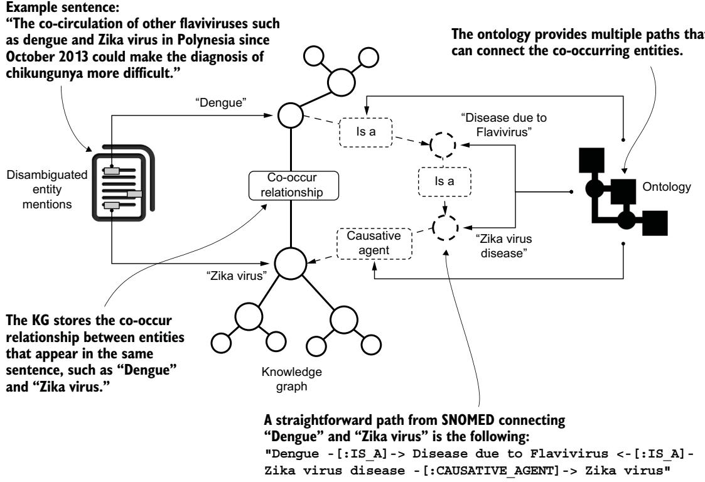
그림 7.16 KG 기반 해석 가능성과 발견 과정을 설명하는 멘탈 모델. 텍스트에서 공동 등장하는 개체들은 SNOMED 온톨로지에서 여러 경로로 연결될 수 있습니다.

다음 질의는 "C0318793"(지카 바이러스)과 공동 등장하되 유형이 "Disease or Syndrome"인 개체들을 필터링하여, 두 개체가 페이지의 같은 문장에서 언급되었는지 확인합니다.

```cypher
MATCH (n1:MedicalEntity)-[r:COOCCURR]-(n2:MedicalEntity)
WHERE n1.id = "C0318793" AND n2.type = "Disease or Syndrome"   -- "C0318793"(지카 바이러스)과 공동 등장하며 "Disease or Syndrome" 유형인 개체만 필터링
WITH n1, r, n2
ORDER BY r.count DESC
MATCH (f:File)-[:CONTAINS_PAGE]->(p:Page)
-[r1:MENTIONS_MENTION]->(m1)-[:DISAMBIGUATED_TO]->(n1),
(p)-[r2:MENTIONS_MENTION]->(m2)-[:DISAMBIGUATED_TO]->(n2)
WHERE r1.sentence_index = r2.sentence_index   -- 두 개체가 페이지의 같은 문장에서 언급되었는지 보장
WITH f, p, r1, r2, n2
RETURN DISTINCT
f.id AS `File ID`,
p.page_idx AS `Page index`,
```

이제 SoHO 도메인에서 실용적인 해결책을 적용해 해석 가능성과 발견을 실제 KG로 어떻게 구현하는지 세부적으로 파고들어 봅시다. 다음 리스팅은 "Zika virus"와 공동 등장하는 상위 5개 개체 유형을 되찾아 옵니다.

```cypher
Listing 7.31 Retrieving the top entity types co-occurring with "Zika virus"
MATCH (m1:MedicalEntity)-[r:COOCCURR]-(m2:MedicalEntity)
WHERE m1.id= "C0318793"
RETURN m2.type as `Entity Type`, count(m2.type) as `Number of co-occurrences`
ORDER BY count(m2.type) DESC
LIMIT 5
```

이 질의는 공동 등장하는 개체 유형의 개수를 계산해 가장 관련성 높은 것들을 식별합니다. 결과가 표 7.5에 나와 있습니다.

**표 7.5 "Zika virus"와 공동 등장하는 상위 개체 유형**

| Entity | Number of co-occurrences |
|---|---|
| Geographic Area | 255 |
| Qualitative Concept | 132 |
| Disease or Syndrome | 125 |
| Functional Concept | 106 |
| Finding | 98 |

결과 대부분에 지리적 영역(Geographic Area)이 포함됩니다. 이는 "Zika virus"가 전염병 확산을 보고하는 회보에서 자주 언급된다는 사실과 관련됩니다. 정성적 개념(Qualitative Concept)이나 기능적 개념(Functional Concept) 같은 다른 범주는 우리 예시에서 대부분 관련이 없는 더 넓은 개념을 포함합니다. 이 때문에 우리는 공동 등장하는 "Disease or Syndrome" 개체에 집중하겠습니다. 다음 질의는 공동 등장하는 개체들과, 이 공동 등장이 추출된 텍스트 부분을 찾아냅니다.

#### Listing 7.32 Getting co-occurring disease entities with context — 공동 등장하는 질병 개체와 맥락 얻기

```cypher
n2.id AS `Co-occurring entity id`,
n2.name AS `Co-occurring entity name`,
CASE
WHEN r1.end_chars[0] > r2.start_chars[0]
THEN substring(p.text, r2.start_chars[0],
r1.end_chars[0] - r2.start_chars[0])    -- 공동 등장 구간을 포착
ELSE substring(p.text, r1.start_chars[0],
r2.end_chars[0] - r1.start_chars[0])    -- 맥락 창이 항상 앞 문자 위치에서 뒤 문자 위치로 가도록 보장
END AS `Mentions context`
```

표 7.6은 결과의 일부를 보고합니다. 리스팅 7.32의 질의를 실행하면 전체 결과 집합을 분석할 수 있습니다.

**표 7.6 "Zika virus"와 공동 등장하는 질병 개체와 맥락**

| File ID | Page index | Co-occurring entity ID | Co-occurring entity name | Mentions context |
|---|---|---|---|---|
| sample_dataset-PublicUse/ECDC Documents/zika virus/Communicable-disease-threats-report-23-apr-2016.pdf 등 | 8 | C0009450 | Communicable Diseases | "COMMUNICABLE DISEASE THREATS REPORT Countries and territories with reported confirmed autochthonous cases of Zika virus" |
| sample_dataset-PublicUse/ECDC Documents/ebola/Communicable-disease-threats-report-01-jul-2017.pdf | 174 | C0009450 | Communicable Diseases | "COMMUNICABLE DISEASE THREATS REPORT Zika: No mosquito-borne Zika virus" |
| sample_dataset-PublicUse/ECDC Documents/zika virus/Questions and answers about Zika virus disease.pdf | 1 | C0276289 | Zika Virus Infection | "Zika virus disease Risk of transmission in Europe What is the risk to Europe? The main risk to the EU is related to an infected traveller introducing the virus to an area with mosquitoes that are able to transmit Zika virus" |
| sample_dataset-PublicUse/ECDC Documents/west nile virus/Communicable-disease-threats-report-2-jul-2016.pdf | 1 | C0018378 | Guillain-Barre Syndrome | "Zika virus is a cause of microcephaly and Guillain-Barre syndrome" |
| sample_dataset-PublicUse/EDQM Documents/BTC/optimal-use-of-clotting-factors-and-platelets-european-symposium-proceedings-wildbad-kreuth-initiative-iv-freising-germany.PDF | 300 | C0011311, C0008055 | Dengue Fever, Chikungunya Fever | "chikungunya and dengue virus infections in France and overseas departements, and emerging pathogens such as Zika virus" |

지카 바이러스와 전염병(Communicable Diseases, UMLS ID C0009450) 개체는 같은 문장에서 여러 번 등장합니다. 이는 적재된 회보 상당수가 "COMMUNICABLE DISEASE THREATS REPORT Zika: No mosquito-borne Zika virus […]"처럼 비슷한 구조를 지니기 때문입니다. 그러나 다른 공동 등장 예시들은 해석 가능성과 발견에 더 관련이 있습니다. 예를 들어 지카 바이러스는 다음 개체들과 자주 공동 등장합니다. 지카 바이러스 감염(UMLS ID C0276289), 뎅기열(UMLS ID C0011311), 치쿤구니야열(UMLS ID C0008055)입니다.

지카 바이러스 감염과의 공동 등장은 이해할 만합니다. 그런데 이 두 개체 사이의 의미 연결은 SNOMED 온톨로지에 직접 들어 있습니다. 다음 질의는 대응하는 SNOMED ID와 라벨을 이용해, 지카 바이러스 질환(SNOMED ID 3928002)과 지카 바이러스(SNOMED ID 50471002) 사이의 SNOMED 연결을 보여 줍니다.

```cypher
Listing 7.33 Getting paths between Zika virus disease and Zika virus
MATCH (s1), (s2)
WHERE s1.id = "3928002" AND s2.id = "50471002"   -- 두 SNOMED 개념 사이의 최단 경로(최대 8홉)를 SNOMED_RELATION으로 탐색
WITH s1, s2, allShortestPaths((s1)-[:SNOMED_RELATION*1..8]-(s2)) AS paths
UNWIND paths AS path
WITH relationships(path) AS path_edges,
nodes(path) AS path_nodes
WITH
[n IN path_nodes | n.name] AS node_names,
[r IN path_edges | COALESCE(r.type, 'IS_A')] AS rel_types,   -- 관계 유형(기본값 "IS_A")으로 올바른 라벨링 보장
[n IN path_edges | startnode(n).name] AS rel_starts   -- 각 관계의 시작 노드 이름을 가져와 관계 방향을 판정
WITH [i IN range(0, size(node_names) - 1) |
CASE
WHEN i = size(node_names) - 1
THEN '(' + node_names[i] + ')'   -- 경로 문자열을 완성
WHEN node_names[i] = rel_starts[i]
THEN '(' + node_names[i] + ')' + '-[:' + rel_types[i] + ']->'   -- 관계가 현재 노드에서 나감(outgoing)
ELSE '(' + node_names[i] + ')' + '<-[:' + rel_types[i] + ']-'   -- 관계가 현재 노드로 들어옴(incoming)
END
] AS string_paths
RETURN DISTINCT apoc.text.join(string_paths, '') AS `Extracted paths`
```

이 질의는 지카 바이러스와 지카 바이러스 질환 사이의 모든 최단 경로를 보기 좋게 정리한(pretty-printed) 형식으로 반환합니다. 결과는 다음과 같습니다.

#### Listing 7.34 Paths connecting Zika virus disease and Zika virus — 지카 바이러스 질환과 지카 바이러스를 잇는 경로

이 경우 SNOMED 온톨로지는 이 공동 등장의 의미를 분명하게 "해석"하는 관계를 제공합니다. 이런 연결은 임상·역학 텍스트에서 질병과 그 원인체가 갖는 언어적·개념적 근접성을 반영합니다. 우리 시나리오에서 우리는 그래프 기반의 증강된 정보를 제공하며, 이는 이 공동 등장하는 개체들이 왜 검증될 수 있는지를 명시적으로 드러냅니다.

표 7.6에서 보고했듯이, 지카 바이러스 의학 개체는 또 다른 질병인 뎅기열(Dengue Fever)과도 공동 등장합니다. 우리는 리스팅 7.33의 질의를 실행하되 WHERE 절을 `s1.id="38362002" AND s2.id="50471002"` 로 바꿈으로써, 이 두 개체를 잇는 온톨로지 경로를 탐색할 수 있습니다. 결과는 다음과 같습니다.

#### Listing 7.35 Paths connecting Dengue and Zika virus — 뎅기와 지카 바이러스를 잇는 경로

```text
(Dengue)-[:IS_A]->(Disease due to Flavivirus)
<-[:IS_A]-(Zika virus disease)-[:CAUSATIVE_AGENT]->(Zika virus)
(Dengue)-[:IS_A]->(Mosquito-borne flavivirus fever)
<-[:IS_A]-(Zika virus disease)-[:CAUSATIVE_AGENT]->(Zika virus)
(Dengue)-[:IS_A]->(Viral disease)
<-[:IS_A]-(Zika virus disease)-[:CAUSATIVE_AGENT]->(Zika virus)
(Dengue)-[:PATHOLOGICAL_PROCESS_(ATTRIBUTE)]->(Infectious process
(qualifier value))
<-[:PATHOLOGICAL_PROCESS_(ATTRIBUTE)]-(Congenital Zika virus infection)
-[:CAUSATIVE_AGENT]->(Zika virus)
(Dengue)-[:CAUSATIVE_AGENT]->(Arthropod-borne organism)
<-[:CAUSATIVE_AGENT]-(Zika virus disease)
-[:CAUSATIVE_AGENT]->(Zika virus)
(Dengue)-[:PATHOLOGICAL_PROCESS_(ATTRIBUTE)]->(Infectious process
(qualifier value))
<-[:PATHOLOGICAL_PROCESS_(ATTRIBUTE)]-(Zika virus disease)
-[:CAUSATIVE_AGENT]->(Zika virus)
(Dengue)-[:PATHOLOGICAL_PROCESS]->(Infectious disease)
<-[:PATHOLOGICAL_PROCESS]-(Zika virus disease)
-[:CAUSATIVE_AGENT]->(Zika virus)
(Dengue)-[:CAUSATIVE_AGENT]->(Togavirus)
<-[:CAUSATIVE_AGENT]-(Zika virus disease)
-[:CAUSATIVE_AGENT]->(Zika virus)
```

뎅기와 지카 바이러스를 잇는 경로는 여럿인데, 여기에는 바이러스성 질환(Viral disease)과 전염성 질환(Infectious disease)처럼 이 질병들이 같은 문장에 공동 등장하는 이유를 해석하게 해 주는 핵심 개체가 포함됩니다(표 7.6의 마지막 행 참조). 이와 더불어 플라비바이러스로 인한 질환(Disease due to Flavivirus), 토가바이러스(Togavirus), 모기 매개 플라비바이러스 열(Mosquito-borne flavivirus fever) 같은 개체는, 뎅기와 지카 바이러스가 어떤 문장에서 언급되든 상관없이 이 둘이 어떻게 연결되는지에 대한 통찰을 제공합니다.

이 검증 과정은 HPO를 포함한 다른 생의학 온톨로지로도 확장할 수 있습니다. 예를 들어 다음 질의의 결과는, 표현형 특성(예: 신세포암 Renal cell carcinoma, 백혈병 Leukemia)과 연관된 질병 개체(예: 폰 히펠-린다우 증후군 von Hippel-Lindau syndrome, 대장암 Colorectal cancer, 망막모세포종 RETINOBLASTOMA) 사이의 공동 등장 패턴을 어떻게 체계적으로 추출하고 검증할 수 있는지 보여 줍니다. 이 접근법은 문서 수준의 증거에 기반해 임상적으로 유의미한 표현형-질병 연관을 식별할 수 있게 해 줍니다.

#### Listing 7.36 Finding HPO disease entities that co-occur with phenotypic features — 표현형 특성과 공동 등장하는 HPO 질병 개체 찾기

```cypher
MATCH (d:HpoDiseaseEntity)<-[:IS_DISEASE_ENTITY]-(n1:MedicalEntity)
-[r:COOCCURR]-(n2:MedicalEntity)-[:IS_HPO_ENTITY]->(h:HpoEntity)
WHERE EXISTS((d)-[:HAS_PHENOTYPIC_FEATURE]->(h))
AND n2.id in ["C0007134", "C0376545"]   -- n1이 고정된 표현형 개체 부분집합과 공동 등장하고, 표현형 h를 가진 질병 d에 연결된 의학 개체 쌍을 선택
WITH n1, n2, d, h
MATCH (f:File)-[:CONTAINS_PAGE]->(p:Page)
-[r1:MENTIONS_MENTION]->(m1)-[:DISAMBIGUATED_TO]->(n1),
(p)-[r2:MENTIONS_MENTION]->(m2)-[:DISAMBIGUATED_TO]->(n2)
WHERE r1.sentence_index = r2.sentence_index   -- 같은 문장에 나타난 언급으로 결과를 필터링
WITH f, p, r1, r2, n1, n2, d, h
RETURN DISTINCT
f.id AS `File name`,
p.page_idx AS `Page index`,
h.label AS `HpoEntity name`,
d.label AS `HpoDiseaseEntity name`,
CASE
WHEN r1.end_chars[0] > r2.start_chars[0]
THEN substring(p.text, r2.start_chars[0], r1.end_chars[0]
- r2.start_chars[0])    -- 주변 텍스트를 추출해 공동 등장 스니펫을 구성
ELSE substring(p.text, r1.start_chars[0], r2.end_chars[0]
- r1.start_chars[0])    -- 텍스트 추출 순서가 올바르도록 보장
END AS `Mentions context`
```

앞선 예시들과 달리, 여기서 우리는 한 의학 개체는 질병이어야 하고 다른 하나는 HPO 주석 파일에 색인된 표현형 특성이어야 한다고 명시합니다. 이 질의의 결과가 표 7.7에 나열되어 있습니다.

**표 7.7 표현형 특성과 공동 등장하는 HPO 질병 개체**

| File ID | Page index | HPO name | HpoDisease name | Mentions context |
|---|---|---|---|---|
| sample_dataset-PublicUse/EDQM Documents/BTC/guide-to-the-quality-and-safety-of-organs-for-transplantation-7th-edition.PDF | 275, 228 | Renal cell carcinoma | von Hippel-Lindau syndrome, Colorectal cancer | "[..] von Hippel-Lindau syndrome could be considered (preferably for the heart donation) when inappropriate risks associated with RCC [...]" "[...] RCCs, two neuroendocrine carcinomas, one breast cancer, one colorectal cancer [..]" |
| sample_dataset-PublicUse/BTC key docs/CELEX-_52002PC0319_EN_TXT.pdf | 12 | Leukemia | RETINOBLASTOMA | "[...] retinoblastoma, melanoma of the anterior pole, haematological neoplasm [...]" |

이 활용 사례는 분석가에게 실용적인 응용을 제공합니다. 분석가는 공동 등장하는 개체 유형으로부터 흥미로운 패턴을 도출할 수 있습니다. 예를 들어 여러 질병이 공동 등장하는 경우, 우리는 어떤 온톨로지 경로가 이 질병들을 잇는지 검증할 수 있습니다. 반대로 공동 등장하는 개체들 사이에 흥미로운 경로가 없다는 것은, 생의학 온톨로지에 인코딩되지 않은 새로운 지식을 시사합니다. 이 경우를 다음에 논의합니다.

---

#### 7.7.4 Uncovering new knowledge — 새로운 지식 발굴

연구의 진전으로 빠르게 바뀌는 맥락에서는, 텍스트 안의 일부 지식이 아직 의학 온톨로지에 통합되지 못했을 수 있습니다. 그 결과, 같은 문장에 공동 등장하는 개체들이 도메인 온톨로지에서는 해석 가능성과 발견 측면에서 직접적인 대응을 갖지 못할 수 있습니다.

온톨로지를 이용해 KG의 정보를 풍부하게 하는 대신, 우리는 텍스트 콘텐츠로부터 구축한 KG를 이용해 온톨로지에 통합될 수 있는 새로운 사실을 제안할 수 있습니다. 이 활용 사례는 의학 도메인에서 유용할 수 있는 새로운 패턴을 텍스트에서 식별하게 해 줍니다. 이런 유형의 패턴을 식별하기 위해, 다음 질의를 실행해 지카 바이러스와 가장 많이 공동 등장하는 질병들을 다시 정리해 봅시다.

```cypher
Listing 7.37 Finding the top diseases co-occurring with "Zika virus" in text
MATCH (n1:MedicalEntity)-[r:COOCCURR]-(n2:MedicalEntity)
WHERE n1.id= "C0318793" and n2.type = "Disease or Syndrome"
RETURN n2.name, r.count
ORDER BY r.count DESC
LIMIT 5
```

결과가 표 7.8에 나와 있습니다.

**표 7.8 지카 바이러스와 공동 등장하는 상위 질병**

| Disease entity | Occurrences |
|---|---|
| Communicable Diseases | 606 |
| Zika Virus Infection | 520 |
| Dengue Fever | 206 |
| Guillain-Barre Syndrome | 195 |
| Chikungunya Fever | 155 |

결과에서 여러 질병이 지카 바이러스 개체와 연관되어 있습니다. 그중 길랑-바레 증후군(Guillain-Barre Syndrome)이 눈에 띕니다. 다른 것들과 달리 이것은 매개체 매개(vector-borne) 질환이 아니기 때문입니다. 이 점이 그 공동 언급을 잠재적으로 예상 밖이고 임상적으로 유의미하게 만들며, 단순한 동일 유행(co-endemicity)이 아니라 가능한 합병증을 시사합니다.

이 때문에, 지카 바이러스와 길랑-바레 증후군을 모두 언급하는 텍스트 콘텐츠를 탐색해 추가 세부 사항을 얻는 것이 도움이 됩니다. 우리는 리스팅 7.32의 질의를 재사용하되 첫 번째 WHERE 절을 `n1.id= "C0318793" AND n2.id = "C0018378"` 로 바꿀 수 있는데, 이것들은 각각 지카 바이러스와 길랑-바레 증후군의 UMLS ID입니다(이 경우 유용하지 않으므로 결과에서 "Co-occurring entity id"와 "Co-occurring entity name" 필드도 제거했습니다). 중복 결과를 제거해 정리한 이 질의의 결과가 표 7.9에 나와 있습니다.

**표 7.9 지카 바이러스와 길랑-바레 증후군을 모두 언급하는 텍스트**

| File ID | Page index | Mentions context |
|---|---|---|
| sample_dataset-PublicUse/ECDC Documents/ebola/communicable-disease-threats-report-20-feb-2016.pdf | 3 | "Zika and potential complications published on 12 February 2016, six countries have reported an increase in the incidence of cases of microcephaly (Brazil) and Guillain-Barre syndrome" |
| sample_dataset-PublicUse/ECDC Documents/zika virus/zika-virus-rapid-risk-assessment-11-april-2016.docx.pdf | 2 | "Zika virus epidemic, health services and practitioners should be alerted to the possible occurrence of neurological syndromes (Guillain-Barre syndrome)" |
| sample_dataset-PublicUse/ECDC Documents/ebola/communicable-disease-threats-report-16-june-2019.pdf | 3 | "Guillain-Barre is known to be triggered by bacterial infections, respiratory viruses, enteroviruses, and arboviruses such as dengue and Zika" |

결과는 지카 바이러스가 길랑-바레 증후군의 원인 중 하나임을 진술합니다. 그래서 우리는 SNOMED 같은 온톨로지가 "Guillain-Barre syndrome -[:CAUSATIVE_AGENT]-> Zika virus" 같은 사실을 포함하고 있으리라 기대합니다. WHERE 절에서 지카 바이러스 질환(SNOMED ID 3928002) 대신 감염성 신경염(Infectious neuronitis, 길랑-바레 증후군의 SNOMED 용어, SNOMED ID 40956001)으로 바꿔 리스팅 7.33의 질의를 실행해 확인해 봅시다. 다음 리스팅은 결과의 일부를 보여 줍니다. 여러 SNOMED 온톨로지 경로가 이 개체들을 잇지만, 이 경로 대부분은 이 둘 사이의 의미 있는 연결을 나타내지 않습니다.

#### Listing 7.38 Paths connecting Zika virus and Infectious neuronitis — 지카 바이러스와 감염성 신경염을 잇는 경로

```text
(Zika virus)<-[:CAUSATIVE_AGENT]-(Congenital Zika virus infection)
-[:PATHOLOGICAL_PROCESS_(ATTRIBUTE)]->(Infectious process (qualifier value))
<-[:PATHOLOGICAL_PROCESS_(ATTRIBUTE)]-(Reactivation of hepatitis B viral
hepatitis (disorder))
-[:ASSOCIATED_MORPHOLOGY]->(Inflammation)
<-[:ASSOCIATED_MORPHOLOGY]-(Infectious neuronitis)
```

```text
(Zika virus)<-[:CAUSATIVE_AGENT]-(Zika virus disease)
-[:CAUSATIVE_AGENT]->(Togavirus)
<-[:CAUSATIVE_AGENT]-(Mosquito-borne flavivirus encephalitis)
-[:ASSOCIATED_MORPHOLOGY]->(Inflammation)
<-[:ASSOCIATED_MORPHOLOGY]-(Infectious neuronitis)
```

첫 번째 항목에서, 지카 바이러스는 감염성 신경염과 연결됩니다. 지카 바이러스가 선천성 지카 바이러스 감염의 원인체이고, 이것이 하나의 감염 과정이기 때문입니다. 문제는 "Infectious process (qualifier value)(감염 과정, 한정어 값)" 노드가 "Reactivation of hepatitis B viral hepatitis (disorder)(B형 간염 바이러스 간염의 재활성화)"처럼 여러 전염 과정에 연결되어 있다는 점입니다. 이 질환은 염증과 연관되는데, 염증은 감염성 신경염의 형태학적 발현이기도 합니다. 리스팅 7.38의 두 번째 항목에도 비슷한 추론을 적용할 수 있습니다. 이 경로들이 되찾아진 이유는, "Infectious process (qualifier value)"나 "Inflammation(염증)"처럼 감염 과정과 관련된 어마어마하게 많은 노드에 연결된 허브 노드(hub node)를 포함하기 때문입니다.

한 가지 해결책은 이런 허브 노드를 포함하는 경로를 걸러 내는 것입니다. 이를 위해 우리는 **Neo4j 그래프 데이터 과학 라이브러리(GDS, Graph Data Science Library)** 가 제공하는 그래프 데이터 과학 알고리즘을 사용할 수 있는데, 이 라이브러리는 그래프에서 노드의 중심성(centrality)을 계산하는 도구를 제공합니다. 이 알고리즘을 실행하려면, 첫 단계로 우리 분석에 필요한 노드와 관계 집합을 담은 그래프 투영(graph projection)을 만들어야 합니다. 이 경우 우리는 SNOMED 온톨로지 그래프에 집중하고자 하며, 다음 코드를 실행할 수 있습니다.

```sql
Listing 7.39 Creating a projection on the SNOMED ontology
CALL gds.graph.project(
'snomedGraph',
'SnomedEntity',
'SNOMED_RELATION'
)
YIELD
graphName AS graph,
relationshipProjection AS knowsProjection,
nodeCount AS nodes,
relationshipCount AS rels;
```

투영을 생성한 뒤, 우리는 차수(degree) 알고리즘을 스트리밍 모드로 실행해 가장 많이 연결된 노드들을 되찾고, 이 결과를 이용해 우리 목적에 관련 없는 경로를 걸러 냅니다.

#### Listing 7.40 Filtering out hub nodes — 허브 노드 걸러 내기

```sql
CALL gds.degree.stream('snomedGraph')
YIELD nodeId, score
WITH gds.util.asNode(nodeId).name AS name, score AS degree
ORDER BY degree DESC
LIMIT 350                          -- 차수가 높은 상위 350개 노드(중심 허브)를 수집
WITH collect(name) AS hub_nodes
```

### 7.7 KG-based use cases — KG 기반 활용 사례 (이어서)

앞의 리스팅 7.40에서 수집한 허브 노드 목록(`hub_nodes`)을 이어받아, 다음 질의는 두 개체를 잇는 경로를 찾되 그 경로가 허브 노드를 지나가지 않도록 걸러 냅니다.

```cypher
MATCH (s1), (s2)
WHERE s1.id = "3928002" AND s2.id = "40956001"   -- 두 SNOMED 개념 노드 사이의 모든 최단 경로(1~8홉)를 찾음
WITH s1,
s2,
allShortestPaths((s1)-[:SNOMED_RELATION*1..8]-(s2)) AS paths,
hub_nodes
UNWIND paths AS path
WITH relationships(path) AS path_edges,
nodes(path) AS path_nodes,
hub_nodes
WITH
[n IN path_nodes | n.name] AS node_names,
[r IN path_edges | COALESCE(r.type, 'IS_A')] AS rel_types,   -- 관계 유형이 없으면 "IS_A"를 기본값으로
[n IN path_edges | startnode(n).name] AS rel_starts,        -- 각 관계의 소스 노드 이름으로 방향 판정
hub_nodes
WHERE NOT any(x IN node_names WHERE x IN hub_nodes)   -- 허브 노드를 지나는 경로를 모두 제외
WITH [i IN range(0, size(node_names) - 1) |
CASE
WHEN i = size(node_names) - 1
THEN '(' + node_names[i] + ')'   -- 경로의 끝을 표시
WHEN node_names[i] = rel_starts[i]
THEN '(' + node_names[i] + ')' + '-[:' + rel_types[i] + ']->'   -- 현재 노드에서 다음 노드로 나가는(outgoing) 관계
ELSE '(' + node_names[i] + ')' + '<-[:' + rel_types[i] + ']-'   -- 다음 노드에서 현재 노드로 들어오는(incoming) 관계
END
] AS string_paths
RETURN DISTINCT apoc.text.join(string_paths, '') AS `Extracted paths`
```

이 질의는 노드의 차수 계산을, 두 개체를 잇는 관련 경로 탐지와 결합합니다. 차수가 높은 노드를 포함하는 경로는 결과에서 제외됩니다. 다음 리스팅은 이 필터링 과정 이후의 결과를 보여 줍니다.

#### Listing 7.41 Revised paths connecting Zika virus disease and Infectious neuronitis — 지카 바이러스 질환과 감염성 신경염을 잇는 수정된 경로

```text
(Zika virus disease)-[:IS_A]->(Viral disease)
<-[:IS_A]-(Erythema multiforme caused by virus (disorder))
-[:PATHOLOGICAL_PROCESS_(ATTRIBUTE)]->(AI – autoimmune)
<-[:PATHOLOGICAL_PROCESS_(ATTRIBUTE)]-(Infectious neuronitis)
(Zika virus disease)-[:IS_A]->(Disease due to Flavivirus)
<-[:IS_A]-(Acute hepatitis C)
-[:IS_A]->(Acute inflammatory disorder)
<-[:IS_A]-(Infectious neuronitis)
(Zika virus disease)<-[:ASSOCIATED_FINDING]-(Presumptive recent Zika
negative)
-[:IS_A]->(Context-dependent finding (context-dependent category))
<-[:IS_A]-(History of Guillain Barre syndrome (situation))
-[:ASSOCIATED_FINDING]->(Infectious neuronitis)
```

```text
(Zika virus disease)-[:IS_A]->(Viral disease)
<-[:IS_A]-(Common cold)-[:IS_A]->(Acute inflammatory disorder)
<-[:IS_A]-(Infectious neuronitis)
(Zika virus disease)-[:IS_A]->(Viral disease)
<-[:IS_A]-(VHF – Viral haemorrhagic fever)
-[:IS_A]->(Acute inflammatory disorder)
<-[:IS_A]-(Infectious neuronitis)
(Zika virus disease)<-[:ASSOCIATED_FINDING]-(Presumptive recent Zik
positive)
-[:IS_A]->(Context-dependent finding (context-dependent category))
<-[:IS_A]-(History of Guillain Barre syndrome (situation))
-[:ASSOCIATED_FINDING]->(Infectious neuronitis)
(Zika virus disease)-[:IS_A]->(Viral disease)
<-[:TEMPORALLY_FOLLOWS]-(Transient paroxysmal cold hemoglobinuria)
-[:PATHOLOGICAL_PROCESS_(ATTRIBUTE)]->(AI – autoimmune)
<-[:PATHOLOGICAL_PROCESS_(ATTRIBUTE)]-(Infectious neuronitis)
(Zika virus disease)-[:IS_A]->(Viral disease)
<-[:DUE_TO]-(Erythema multiforme caused by virus (disorder))
-[:PATHOLOGICAL_PROCESS_(ATTRIBUTE)]->(AI – autoimmune)
<-[:PATHOLOGICAL_PROCESS_(ATTRIBUTE)]-(Infectious neuronitis)
(Zika virus disease)-[:IS_A]->(Viral disease)
<-[:AFTER]-(Transient paroxysmal cold hemoglobinuria)
-[:PATHOLOGICAL_PROCESS_(ATTRIBUTE)]->(AI – autoimmune)
<-[:PATHOLOGICAL_PROCESS_(ATTRIBUTE)]-(Infectious neuronitis)
```

이번에는 기본 질의로 탐지했던 1만 1,185개의 경로에 비해, 9개의 결과 집합만 되찾았습니다. 그러나 그 결과에도 여전히 바이러스성 질환(Viral disease) 같은 일반적인 개체가 포함되는데, 이것은 지카 바이러스 질환을 무작위한 바이러스성 질환들과 잇고, 그 질환들을 다시 감염성 신경염과 잇는 데 쓰일 수 있습니다. 다시 말해, 이 두 개체 사이의 직접적인 연결은 SNOMED 온톨로지에 인코딩되어 있지 않습니다. 이것은 KG에 정의된 개체들의 공동 등장이, 선순환(virtuous circle) 속에서 도메인 온톨로지를 풍부하게 하는 데 잠재적으로 쓰일 수 있는 전형적인 예시입니다.

이 메커니즘은 텍스트에서 의미 있는 관계(relationship)를 추출함으로써 기하급수적으로 향상될 수 있습니다. 이 접근법에서 출발점은 추출된 관계인데, 이것은 공동 등장 연결보다 더 구체적입니다. 그림 7.17을 참조하세요.

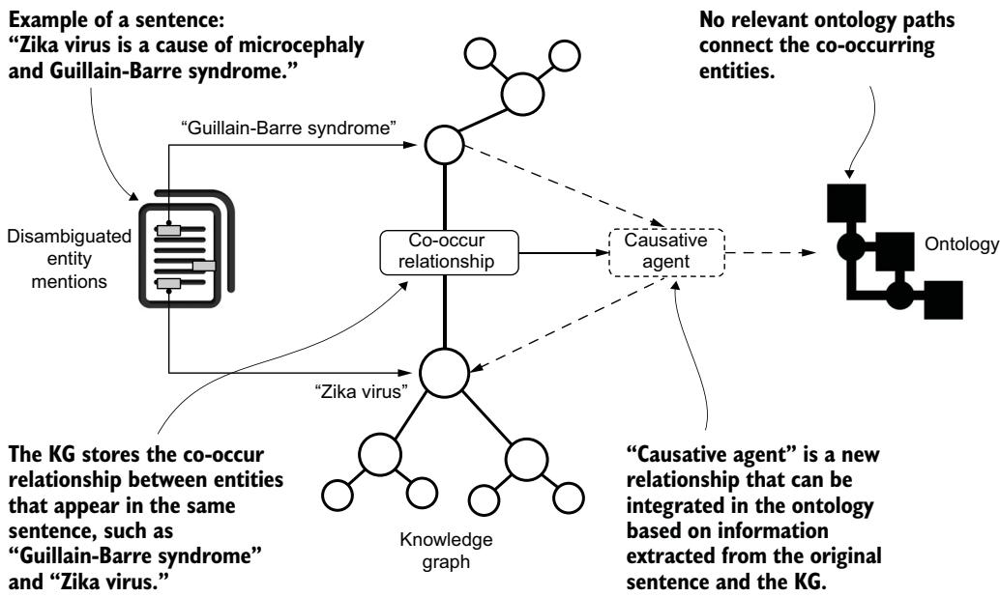
그림 7.17 새로운 지식을 발굴하는 과정을 설명하는 멘탈 모델. 이 경우 "Zika virus"와 "Guillain-Barre syndrome"이 같은 문장들에 여러 번 등장하지만, 의학 온톨로지는 이 개체들 사이의 관련 연결을 전혀 제공하지 않습니다.

---

#### Summary — 요약

- **개체명 중의성 해소(NED)** 는 텍스트에 언급된 개체를 참조 지식 베이스에 연결하게 해 줍니다.
- NED를 KG 기술과 결합하면, 정확성이 생명인 도메인에서 고급 서비스를 개발할 새로운 기회가 열립니다.
- KG를 구성하려면 여러 단계가 필요합니다. 스키마 정의, 문서 적재, 그 문서로부터 개체 중의성 해소, 도메인 온톨로지 통합, 추출된 개체 매핑, 그리고 같은 문장에 위치한 개체들 사이의 공동 등장 관계 생성입니다.
- 만들어진 KG 위에서 고급 분석을 수행해, 응용 도메인의 다양한 활용 사례를 지원할 수 있습니다. 개념 검색, 구조화된 지식 기반 검색, KG 기반 해석 가능성과 발견, 그리고 새로운 지식 발굴입니다.

---

## 핵심 용어 해설

| 용어 (영문) | 뜻 |
|---|---|
| 개체명 인식 (NER, Named Entity Recognition) | 날것의 텍스트에서 사람·조직·질병 같은 개체가 언급된 부분을 찾아 미리 정한 범주로 분류하는 NLP 작업 |
| 개체명 중의성 해소 (NED, Named Entity Disambiguation) | 각 언급의 맥락을 살펴 그 뜻의 모호함을 없애고, 언급을 지식 베이스 안의 올바른 개체에 연결하는 작업 |
| 지식 그래프 (KG, Knowledge Graph) | 개념(노드)과 그 사이의 관계(엣지)로 지식을 표현한 구조 |
| 지능형 자문 시스템 (IAS, Intelligent Advisory System) | 여러 차례 상호작용으로 사람과 정보를 주고받으며 의사결정을 지원하는 시스템 |
| 지식 베이스 (knowledge base) | 특정 도메인의 개체들을 구조화해 모아 둔 참조 자원 |
| 통합 의학 언어 시스템 (UMLS) | 여러 생의학 통제 어휘를 하나로 매핑해 주는 메타시소러스. CUI라는 개념 고유 식별자를 부여 |
| 의학 체계 명명법 (SNOMED) | 45만 개 이상의 임상 개념과 그 관계를 담은 다국어 임상 용어 체계 |
| 인간 표현형 온톨로지 (HPO) | 표현형 이상에 관한 표준화된 정보를 RDF/XML로 제공하는 온톨로지 |
| 온톨로지 (ontology) | 도메인의 개념과 개념 간 관계를 형식적으로 정의한 지식 구조 |
| 후보 선택 (candidate selection) | 인식된 개체명 언급에 알맞은 후보 개체들을 지식 베이스에서 찾는 NED 단계 |
| 후보 순위 매기기 (candidate ranking) | 주변 맥락을 근거로 각 후보에 점수를 매겨 목표 개체를 정하는 NED 단계 |
| 온톨로지 통합 (ontology integration) | 도메인 온톨로지 지식을 끌어들여 추출 개체의 정보를 하나의 KG로 합치는 단계 |
| 목표 개체 (target entity) | 언급이 최종적으로 가리키는, 순위 1위로 선택된 개체 |
| scispaCy | 생의학 텍스트용 spaCy 기반 파이썬 라이브러리. 개체 인식·후보 선택·순위 매기기 수행 |
| CUI (Concept Unique Identifier) | UMLS가 개념마다 부여하는 고유 식별자 |
| 의미 유형 (semantic type) | 개체가 질병·신체 부위·증상 등 어떤 범주에 속하는지 나타내는 분류(예: T047) |
| 인간 유래 물질 (SoHO, Substances of Human Origin) | 혈액·조직·세포·장기 등 의료 치료에 쓰이는 인체 유래 물질 |
| 혈액·조직·세포 (BTC, Blood, Tissues, and Cells) | SoHO 공급망에서 다루는 핵심 물질 구성 요소 |
| 개념 검색 (conceptual search) | 정확한 키워드가 아니라 의미를 기준으로 정보를 찾는 검색 방법 |
| 구조화된 지식 기반 검색 (structured knowledge-based search) | 온톨로지의 형식적 지식을 이용해 문서 간 비자명한 연결로 정보를 찾는 검색 |
| 공동 등장 (co-occurrence) | 같은 문장(또는 페이지)에 개체들이 함께 나타나는 것. KG에서는 Page 노드를 Entity 노드로 투영한 결과 |
| 해석 가능성 (interpretability) | 온톨로지 연결이 개체들이 함께 등장한 이유를 설명해 주는 성질 |
| 발견 (discovery) | 온톨로지 연결이 텍스트를 넘어선 새로운 통찰을 더해 주는 것 |
| 허브 노드 (hub node) | 매우 많은 노드에 연결되어 무의미한 경로를 양산하는 중심성 높은 노드 |
| 그래프 데이터 과학 라이브러리 (GDS) | 중심성 등 그래프 알고리즘을 제공하는 Neo4j 라이브러리 |
| 그래프 투영 (graph projection) | GDS 알고리즘 실행을 위해 관심 노드·관계만 뽑아 만든 메모리 내 그래프 |
| Turtle (Terse RDF Triple Language) | RDF 트리플을 사람이 읽기 쉽게 표현하는 직렬화 문법 |
| Amazon Textract | 스캔 문서에서 텍스트·손글씨·데이터를 자동 추출하는 AWS 머신러닝 서비스 |
| CRISP-DM | 데이터 마이닝 프로젝트의 표준 절차 방법론. 이 책은 KG용으로 각색해 사용 |

---

## References — 참고문헌

원문의 참고문헌 번호([1]~[8])는 본문 각 위치에 그대로 표기했습니다. 상세 서지 정보는 원서의 References 절을 참조하세요.
