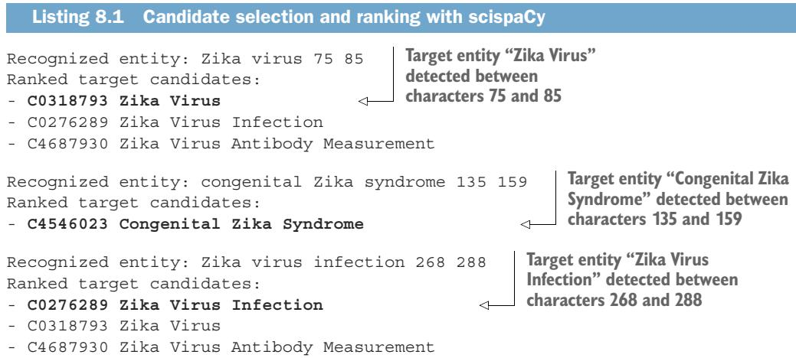
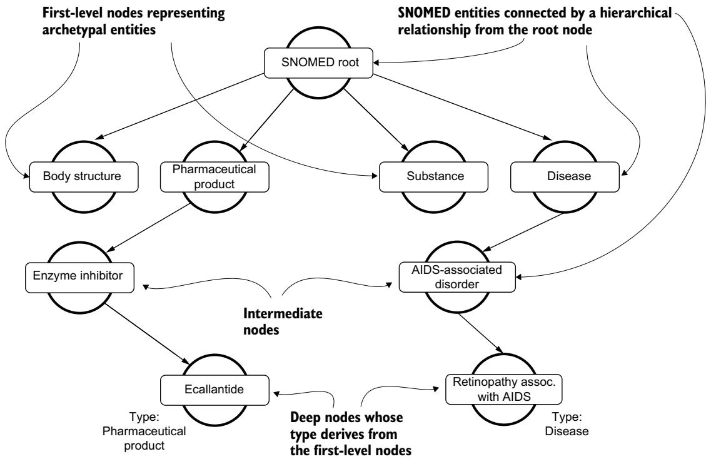
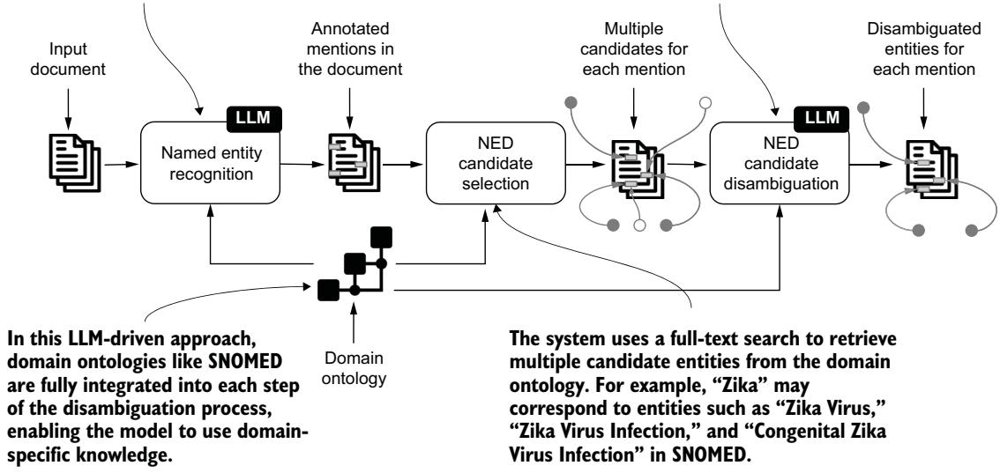
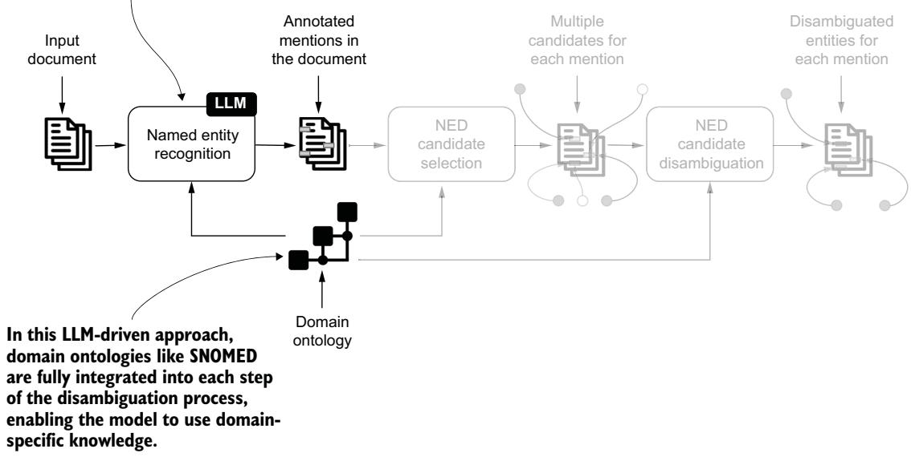
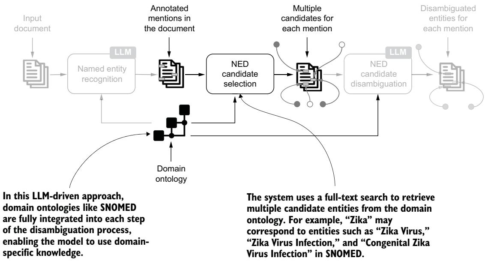
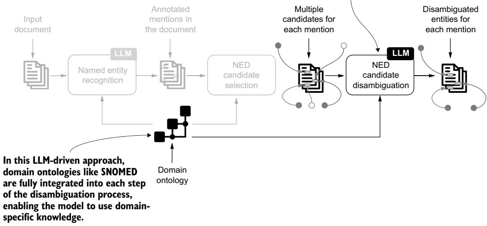
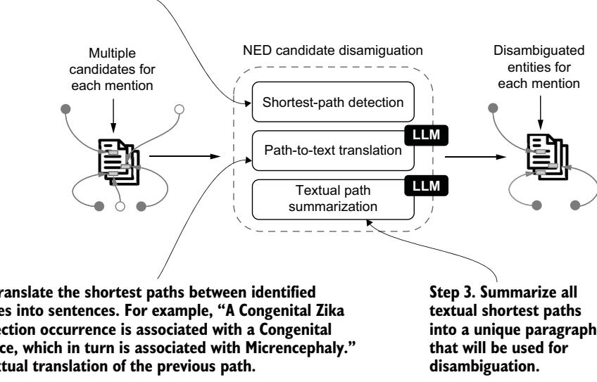

# 오픈 LLM과 도메인 온톨로지를 활용한 개체명 명확화(NED) — 쉬운 해설판

> 이 문서는 원서 8장 "NED with open LLMs and domain ontologies"를 한국어로 풀어 쓴 해설판입니다. 원문의 모든 문단·그림·코드·표를 빠짐없이 다루되, 번역을 넘어 왜 그렇게 하는지까지 이야기하듯 설명합니다. 어려운 용어는 처음 나올 때 영어 원어와 한 줄 정의를 함께 붙이고, 이후에는 한국어로만 부릅니다.

---

### 이 장에서 다루는 내용 — 전통적 NED의 한계를 넘어서기

이 장은 다음 세 가지를 중심으로 이야기를 풀어 갑니다.

- 전통적인 **개체명 명확화(NED, Named Entity Disambiguation)** — 문장 속 단어가 가리키는 진짜 대상을 지식베이스의 정확한 항목으로 연결하는 작업 — 도구가 어떤 한계를 갖는지 이해합니다.
- 범용 **대규모 언어 모델(LLM, Large Language Model)** — 방대한 텍스트로 학습해 언어를 자유롭게 다루는 인공지능 모델 — 과 도메인 온톨로지를 결합해 NED를 수행하는 방법을 배웁니다.
- **최단 경로 탐지(shortest-path detection)**, **경로-텍스트 변환(path-to-text translation)**, **텍스트 경로 요약(textual path summarization)** 을 잇는 다단계 명확화 과정을 직접 구현해 봅니다.

7장은 개체명 명확화(NED)에 초점을 맞추었고, 그 과정에서 **scispaCy** — spaCy 프레임워크 위에 세워진 생물의학 전용 자연어 처리 도구 — 의 역할을 강조했습니다. 이 도구는 생물의학 도메인의 사전학습 모델을 제공해 문서와 논문을 처리하도록 설계되었습니다. 이번 장은 바로 그 지점에서 출발합니다. scispaCy가 잘하는 것과 못하는 것을 짚어 본 뒤, 그 한계를 오픈 LLM과 온톨로지의 조합으로 어떻게 뛰어넘는지 단계별로 살펴봅니다.

---

### 8.1 전통적 NED 시스템의 한계 이해하기 — scispaCy가 놓치는 관계와 경로

scispaCy는 **UMLS(Unified Medical Language System, 통합 의학 용어 체계)** 처럼 표준화된 개체를 담은 어휘집과 온톨로지를 내장하고 있습니다. 이런 표준 개체는 텍스트 속 언급(mention)을 실제 대상과 연결해 모호함을 없애는 데 유용합니다. 그러나 이 접근에는 몇 가지 한계가 있습니다.

- 특정 응용 도메인, 즉 생물의학 분야에만 맞춰 설계되어 있습니다.
- 새로운 개체와 용어를 반영하도록 참조 지식베이스를 확장하고 갱신하기가 어렵습니다.
- 지식베이스에 담긴 방대한 정보를 온전히 활용하지 못합니다.
- 개체 사이에 이미 존재하는 관계와 경로를 명확화 작업에 쓰지 못합니다.

마지막 항목의 효과를 체감하려면, 7장 도입부에서 살펴본 예시를 다시 떠올려 보면 좋습니다. 그 예시는 **유럽 질병예방통제센터(ECDC)** 의 다음 문구를 사용했습니다.

> 4월 13일이 있는 주에 벨리즈는 처음으로 모기 매개 지카 바이러스 전파를 보고했습니다. 관찰된 선천성 지카 증후군 및 기타 신경학적 합병증의 증가에 관한 업데이트. 지카 바이러스 감염과 잠재적으로 연관된 소두증 및 기타 태아 기형.

scispaCy는 "Zika(지카)"라는 단어 주변의 문맥 단어를 이용해 세 개의 올바른 명확화 결과를 찾아냅니다. 그 결과는 다음 그림(원문의 리스트)에 나타나 있습니다.



그림 (원문 리스트) — 주변에 "congenital(선천성)", "syndrome(증후군)" 같은 단서 단어가 있을 때 scispaCy가 지카 언급을 정확한 개체로 연결하는 모습입니다.

그런데 이번에는 "congenital(선천성)"이나 "syndrome(증후군)" 같은 주변 단어가 빠진, 조금 다른 예시로 시험해 봅니다.

> 지카는 플라비바이러스과(Flaviviridae)에 속하며 이집트숲모기(Aedes)에 의해 전파됩니다. 지카병 및 치쿤구니야열 같은 다른 증후군에 걸린 사람들은 바이러스성 근육통, 감염성 부종, 감염성 결막염 같은 증상을 자주 경험합니다. 지카의 심각한 결과는 임신 중 태반 장벽을 통과하는 능력에서 비롯되며, 이는 소두증과 선천성 기형을 유발합니다.

앞 예시와 비교하면, 명확화 단계를 뒷받침해 줄 단어가 없습니다. scispaCy의 출력을 봅시다.

```text
Recognized entity: Zika 0 4
Ranked target candidates:
- C0276289 Zika Virus Infection
- C0318793 Zika Virus
- C4687930 Zika Virus Antibody Measurement
Recognized entity: Zika disease 109 121
Ranked target candidates:
Recognized entity: Zika 278 282
Ranked target candidates:
- C0276289 Zika Virus Infection
- C0318793 Zika Virus
- C4687930 Zika Virus Antibody Measurement
```

이 출력을 보면, 모델은 첫 번째와 세 번째 문장의 "Zika"를 개체 "C0276289 Zika Virus Infection(지카 바이러스 감염)"으로 명확화합니다. 그러나 두 번째 문장의 "Zika disease(지카병)" 언급에 대해서는 대상 개체를 전혀 찾아내지 못합니다. 주변 단서가 사라지자 바로 흔들리는 것입니다.

이 장은 오픈 LLM과 도메인 온톨로지를 사용하는 새로운 접근으로 이런 한계들을 정면으로 다룹니다. scispaCy 같은 도메인 전용 도구와 달리, 이 접근은 풍부한 온톨로지를 쓸 수 있는 다른 응용 도메인에도 그대로 적용할 수 있습니다. 여기서 LLM은 언어를 유창하게 다루되 가끔 사실을 지어내기도 하는 달변가에 가깝고, 온톨로지는 검증된 사실을 정리해 둔 대장 역할을 합니다. 이 장의 핵심은 두 역할을 잘 엮는 것입니다.

---

### 8.2 도메인 온톨로지 적재하기 — SNOMED를 Neo4j에 싣기

명확화 과정을 이끌기 위해, 7장에서 소개한 **SNOMED(Systematized Nomenclature of Medicine, 체계화된 의학 명명법)** 온톨로지를 사용합니다. 다시 정리하면, SNOMED는 45만 개가 넘는 개념과 풍부한 관계 유형을 담은 다국어 임상 용어 저장소입니다. 예제 시나리오에서는 다시 두 개의 파일을 사용합니다. 하나는 `sct2_Description_Full-en_US1000124_20220901.txt`(개체 이름과 별칭, 그리고 개체 간 관계)이고, 다른 하나는 `sct2_Relationship_Full_US1000124_20220901.txt`(개체와 관계를 식별하는 숫자 코드)입니다.

#### NOTE — 이 파일들의 예시는 7.5.2절을 참고하세요

이 파일들이 실제로 어떻게 생겼는지 궁금하다면 7장 7.5.2절의 예시를 참고하면 됩니다.

그림 8.1은 SNOMED의 계층 구조와, 노드를 따라 정보가 전파되는 방식을 보여 줍니다. 리스팅 8.3\~8.5는 각각 다음 일을 합니다. 리스팅 8.3은 `sct2_Relationship_Full_US1000124_20220901.txt`로부터 Neo4j에 노드와 관계를 만듭니다. 리스팅 8.4는 `sct2_Description_Full-en_US1000124_20220901.txt`에서 이름과 별칭을 뽑아냅니다. 리스팅 8.5는 계층 구조를 따라가며 1레벨 노드의 정보를 더 깊은 노드로 전파합니다.

> NOTE 이 리스팅들의 주석 달린 버전과 더 자세한 설명은 7.6.4절에 있습니다. 전체 예제 코드는 책의 온라인 저장소에서 받을 수 있습니다.



그림 8.1 — SNOMED 계층 구조의 표본입니다. 깊은 레벨의 노드는 온톨로지의 원형(archetypal) 개체인 1레벨 노드로부터 내려오는 정보를 이용해 범주를 부여받습니다.

#### 리스팅 8.3 SNOMED 적재 — 관계 불러오기

아래 코드는 관계 파일을 읽어 Neo4j에 노드와 관계를 만드는 임포터입니다. 먼저 `set_constraints`에서 제약과 인덱스를 걸어 `SnomedEntity` 노드의 `id`가 유일하도록 보장하고, 이름·관계 속성에 인덱스를 만들어 검색을 빠르게 합니다. 그다음 `import_snomed_rels`가 배치 단위로 관계를 `MERGE`합니다. 특히 관계 유형이 `116680003`(즉 "is-a" 상위 관계)일 때는 `SNOMED_IS_A`라는 별도 관계를 추가로 만들어 두는데, 이 관계가 뒤에서 계층 전파의 핵심으로 쓰입니다.

```python
[...]
class SnomedRelationshipsImporter(BaseImporter):
    [...]
    def set_constraints(self):
        queries = [
            (
                "CREATE CONSTRAINT IF NOT EXISTS FOR (n:SnomedEntity) "
                "REQUIRE n.id IS UNIQUE"
            ),
            (
                "CREATE INDEX snomedNodeName IF NOT EXISTS "
                "FOR (n:SnomedEntity) ON (n.name)"
            ),
            (
                "CREATE INDEX snomedRelationId IF NOT EXISTS "
                "FOR ()-[r:SNOMED_RELATION]-() ON (r.id)"
            ),
            (
                "CREATE INDEX snomedRelationType IF NOT EXISTS "
                "FOR ()-[r:SNOMED_RELATION]-() ON (r.type)"
            ),
            (
                "CREATE INDEX snomedRelationUmls IF NOT EXISTS "
                "FOR ()-[r:SNOMED_RELATION]-() ON (r.umls)"
            ),
        ]
        for q in queries:
            self.connection.query(q, db=self.db)

    def import_snomed_rels(self):
        query = """
        UNWIND $batch as item
        MERGE (e1:SnomedEntity {id: item.sourceId})
        MERGE (e2:SnomedEntity {id: item.destinationId})
        MERGE (e1)-[:SNOMED_RELATION {id: item.typeId}]->(e2)
        FOREACH(ignoreMe IN CASE WHEN item.typeId = '116680003'
        THEN [true] ELSE [] END|
            MERGE (e1)-[:SNOMED_IS_A]->(e2)
        )
        """
        size = self.get_csv_size(snomedRels_file)
        self.batch_store(snomed_rels_query, self.get_rows(snomedRels_file),
                         size=size)
```

핵심을 다시 짚으면, 모든 관계는 `SNOMED_RELATION`으로 저장되고, 그중 상위-하위 관계만 `SNOMED_IS_A`로 한 번 더 표시됩니다. 이렇게 두 벌로 관계를 두는 이유는, 일반적인 그래프 탐색에는 `SNOMED_RELATION`을 쓰고 계층을 타고 오르내릴 때는 `SNOMED_IS_A`만 골라 쓰기 위해서입니다.

#### 리스팅 8.4 SNOMED 적재 — 이름과 별칭 불러오기

다음 코드는 설명 파일에서 개체 이름과 별칭을 읽어 채웁니다. 두 개의 쿼리로 나뉩니다. 하나(`snomed_names_concepts_query`)는 관계에 유형과 별칭을 붙이고, 다른 하나(`snomed_names_entities_query`)는 개체 노드 자체에 이름과 별칭을 붙입니다. `CASE ... WHEN ... IS NULL` 패턴은 값이 아직 비어 있을 때만 새 값을 넣고, 별칭은 이미 들어 있지 않을 때만 리스트에 덧붙이도록 해 중복을 막습니다.

```python
[...]
class SnomedNamesImporter(BaseImporter):
    [...]
    def import_snomed_names(self, snomedNames_file):
        snomed_names_concepts_query = """
        UNWIND $batch as item
        MATCH (e1:SnomedEntity)
            -[r:SNOMED_RELATION {id: item.conceptId}]->
            (e2:SnomedEntity)
        WHERE item.conceptId <> '116680003' AND r.id = item.conceptId
        SET r.type = CASE
                WHEN r.type IS NULL THEN item.termAsType
                ELSE r.type END,
            r.aliases = CASE
                WHEN item.termAsType IN r.aliases THEN r.aliases
                ELSE coalesce(r.aliases,[]) + item.termAsType END
        """
        snomed_names_entities_query = """
        UNWIND $batch as item
        MATCH (e:SnomedEntity {id: item.conceptId})
        SET e.name = CASE
                WHEN e.name IS NULL THEN item.term
                ELSE e.name END,
            e.aliases = CASE
                WHEN item.term in e.aliases THEN e.aliases
                ELSE coalesce(e.aliases, []) + item.term END
        """
        size = self.get_csv_size(snomedNames_file)
        self.batch_store(
            snomed_names_concepts_query,
            self.get_rows(snomedNames_file),
            size=size)
        self.batch_store(
            snomed_names_entities_query,
            self.get_rows(snomedNames_file),
            size=size)
    [...]
```

이 단계가 끝나면 각 개체는 대표 이름과 여러 별칭을 갖게 됩니다. 뒤에서 전문 검색으로 후보를 찾을 때, 이 이름과 별칭이 검색 인덱스의 재료가 됩니다.

#### 리스팅 8.5 SNOMED 적재 — 1레벨 노드에서 라벨 전파하기

마지막 적재 단계는 라벨 전파입니다. 루트 노드(`138875005`) 바로 아래에 붙은 1레벨 노드들이 온톨로지의 원형 범주(예: Disease, Organism, Procedure)에 해당합니다. 이 코드는 각 1레벨 노드에서 출발해 `SNOMED_IS_A` 관계를 거꾸로(하위 방향으로) 끝까지 확장하면서, 아직 그 범주 이름을 갖고 있지 않은 하위 노드에 1레벨 노드의 이름을 라벨로 붙여 줍니다. `apoc.path.expandConfig`로 깊이 제한 없이(`maxLevel: -1`) 하위 트리 전체를 훑는 것이 핵심입니다.

```cypher
[...]
class SnomedLabelPropagator():
    [...]
    def get_rows(self):
        propagation_query = """
        MATCH p=(n:SnomedEntity)<-[:SNOMED_IS_A]-(m:SnomedEntity)
        WHERE n.id= "138875005" // Root node
        WITH distinct m as first_node
        CALL apoc.path.expandConfig(first_node, {          // #A
            relationshipFilter: '<SNOMED_IS_A',
            minLevel: 1,
            maxLevel: -1,
            uniqueness: 'RELATIONSHIP_GLOBAL'
        }) yield path
        UNWIND nodes(path) as other_level                  // #B
        WITH first_node, collect(DISTINCT other_level) as uniques
        UNWIND uniques as unique_other_level
        WITH first_node, unique_other_level
        WHERE not first_node.name in
              coalesce(unique_other_level.type,[])
        RETURN unique_other_level.id as id, first_node.name as label   // #C
        """
        with self._driver.session(database=self._database) as session:
            result = session.run(query=propagation_query)
            for record in iter(result):
                yield dict(record)
        [...]
```

주석 표시를 따라가면, `#A`는 1레벨 노드에서 하위 방향으로 경로를 확장하는 지점, `#B`는 확장된 경로에 등장한 모든 노드를 펼쳐 모으는 지점, `#C`는 각 하위 노드의 id와 붙일 라벨(1레벨 노드 이름)을 돌려주는 지점입니다.

이렇게 `SNOMED_IS_A` 관계를 이용해, 계층 연결을 따라 의미 유형(semantic type)을 트리 구조 전체에 전파했습니다. 그 결과 깊은 곳에 있는 세밀한 개체도 자신이 어떤 큰 범주에 속하는지를 알게 됩니다. 이는 뒤에 나올 NER 단계에서 "이 온톨로지가 인정하는 범주 목록"을 뽑아 쓰는 밑바탕이 됩니다.

---

### 8.3 Ollama와 Llama 3.1 8B로 모델 준비하기 — 로컬에서 돌리는 오픈 LLM

앞 장들에서는 OpenAI API로 NLP 작업을 수행하는 방법을 살펴봤습니다. 이제 그 지식을 확장해, **Ollama** 와 **Llama 3.1 8B**(메타가 공개)로 NED 시스템을 로컬에 배포합니다.

Ollama는 사용자가 자기 컴퓨터에서 직접 LLM을 실행하게 해 주는 오픈소스 도구입니다. 모델을 로컬에서 돌리면 데이터에 대한 완전한 통제권을 얻으면서, 지연 시간과 외부 제공자에 대한 의존을 함께 줄일 수 있습니다. Llama 3.1 8B는 80억 개의 파라미터를 가진 오픈소스 LLM입니다. 최대 128,000 토큰의 문맥 길이를 지원하고, 다국어 정보 처리에 최적화되어 있으며, 소비자용 하드웨어에서도 효율적으로 배포되도록 설계되었습니다.

로컬 컴퓨터에 Llama 3.1 8B 모델을 배포하려면 먼저 Ollama를 내려받아 설치해야 합니다. 이 도구는 macOS, Linux, Windows와 호환되며, 설치 파일은 https://ollama.com/ 에서 받을 수 있습니다. Ollama는 명령줄과 그래픽 사용자 인터페이스(GUI)를 모두 제공하는데, 여기서는 NED 시스템을 위해 다음 명령줄 지시로 Llama 3.1 8B를 내려받고 배포했습니다.

#### 리스팅 8.6 Llama 3.1 8B를 내려받아 설치하는 Ollama 명령

아래 두 줄이면 됩니다. 첫 줄은 Ollama 서버를 띄우고, 둘째 줄은 최신 Llama 3.1 모델을 내려받습니다.

```bash
ollama serve
ollama pull llama3.1:latest
```

Ollama는 **OpenAI Chat Completions API** 와 호환되도록 만들어져 있어서, 로컬에 배포한 모델과도 앞 장들에서 쓰던 것과 같은 파이썬 코드로 곧장 대화할 수 있습니다. 이 덕분에 모델을 NED 시스템에 끼워 넣는 과정이 훨씬 단순해집니다. 다음 리스팅은 모델과 상호작용하는 데 필요한 파이썬 클래스를 보여 줍니다.

#### 리스팅 8.7 파이썬에서 Llama 3.1 8B 모델 실행하기

아래 클래스는 `OpenAI` 클라이언트를 로컬 주소(`http://localhost:11434/v1`)로 향하게 설정합니다. `api_key`는 OpenAI Chat Completions API가 형식상 요구하지만 오픈 모델에는 실제로 쓰이지 않으므로 아무 값이나 넣어도 됩니다. `generate` 메서드는 메시지를 받아 응답을 만드는데, `temperature=0`으로 두어 매번 같은 결정적 출력을 얻도록 했습니다. 명확화처럼 일관성이 중요한 작업에서는 이 설정이 유용합니다.

```python
from openai import OpenAI

class LLM_Model():
    def __init__(self, url='http://localhost:11434/v1', key="default"):
        self.client = OpenAI(
            base_url=url,      # 모델이 서비스되는 기본 URL
            api_key=key,       # OpenAI Chat Completions API가 요구하지만
                               # 오픈 모델에서는 사용되지 않는 값
        )

    def generate(self, messages):
        response = self.client.chat.completions.create(
            model="llama3.1:latest",   # Ollama로 내려받은 llama3.1:latest 지정
            messages=messages,
            temperature=0,
            max_tokens=4000,
            top_p=1,
            frequency_penalty=0,
            presence_penalty=0,
        )
        #### It assumes as response the ChatGPT API format
        return response.choices[0].message.content
```

위 코드에서 응답을 `response.choices[0].message.content`로 꺼내는 부분은, 반환 형식이 ChatGPT API 형식임을 전제로 합니다. 원문 코드에 그대로 남아 있는 `#### It assumes as response the ChatGPT API format` 주석이 바로 이 뜻입니다.

> NOTE 예시 결과는 다음 절들에 나오는 프롬프트로 생성했으며, 2024년 10월에 당시 최신 Llama 3.1 모델을 사용해 얻은 것입니다.

Llama 3.1 같은 범용 모델을 NED에 사용하는 것은, LLM이 도메인 전용 온톨로지와 결합될 때 틈새 영역에서도 얼마나 잘 작동할 수 있는지를 보여 주려는 시도입니다. 다음 절부터는 이 과정을 하나씩 분해해, 시스템이 복잡한 생물의학 텍스트에서 개체를 어떻게 해석하고 명확화하는지, 그래서 정보 추출과 분석을 어떻게 돕는지 보여 줍니다.

---

### 8.4 종단 간(End-to-End) NED 과정 — 입력 문서에서 명확화된 개체까지

그림 8.2는 입력 문서에서 명확화된 언급까지 이르는, 이 예제의 NED 과정을 그린 멘탈 모델입니다. 과정은 비정형 텍스트를 담은 입력 문서에서 시작합니다. 이 문서는 **LLM 기반 개체명 인식(NER, Named Entity Recognition)** — 텍스트에서 관심 개체를 찾아 범주를 붙이는 작업 — 구성 요소가 분석합니다. 여기서 LLM은 도메인 온톨로지에 담긴 지식을 이용해 입력 텍스트 속 관련 생물의학 개체를 찾아내고 라벨을 붙입니다. 예컨대 "Zika" 같은 용어는 SNOMED에 따라 Disease(질병) 개념으로 인식될 수 있습니다. 이 단계는 날것의 텍스트를 구조화된 데이터로 바꾸고, 그 데이터가 이후 단계에서 처리됩니다.

정리하면 흐름은 두 축으로 요약됩니다. 첫째, LLM 모델이 도메인 온톨로지를 이용해 입력 텍스트의 생물의학 개체를 찾아 라벨을 붙입니다(예: "Zika" → SNOMED의 "Disease" 개념). 둘째, LLM 모델이 다단계 접근으로 가장 정확한 개체를 고릅니다. 이 다단계 접근에는 도메인 온톨로지에서 후보 사이의 최단 경로를 탐지하고, 그 경로 정보를 자연어로 옮기고 요약해 명확화를 뒷받침하는 과정이 포함됩니다.



그림 8.2 — LLM과 SNOMED 같은 도메인 전용 온톨로지를 사용하도록 설계된 NED 시스템의 작업 흐름입니다. 각 단계는 여러 상호작용을 거치며 입력 텍스트의 개체를 정확히 명확화합니다.

다음으로 시스템은 **후보 선택(CS, Candidate Selection)** 단계로 넘어갑니다. 전문 검색(full-text search) 메커니즘이 각 개체 언급에 대해 가능한 매칭 목록을 만들어 냅니다. 예를 들어 "Zika"라는 용어는 SNOMED에서 Zika Virus(지카 바이러스), Zika Virus Infection(지카 바이러스 감염), Congenital Zika Virus Infection(선천성 지카 바이러스 감염) 같은 여러 개체에 대응할 수 있습니다. 이 단계는 잠재적 명확화 대상의 후보 풀을 마련합니다. 다음 단계에서 시스템은 이 후보들을 평가해 가장 정확한 매칭을 찾습니다.

마지막 단계인 **후보 명확화(CD, Candidate Disambiguation)** 에서, LLM은 선택을 다듬어 각 언급에 가장 정밀하게 맞는 개체를 결정합니다. 다단계 접근이 온톨로지 구조에서 후보 사이의 최단 경로를 찾고, 그다음 관련 경로 세부를 자연어로 옮겨 요약함으로써, 문맥 지식을 곁들여 명확화를 뒷받침합니다. 이렇게 해서 입력 문서에 언급된 각 개체가 온톨로지 안의 대응 개체로 정확히 매핑되도록 보장합니다.

이 LLM 주도 접근은 명확화 과정의 매 단계마다 도메인 전용 온톨로지를 통합합니다. 온톨로지의 계층 구조와 관계 구조를 함께 끌어들임으로써, 모델은 개체 분류와 명확화에 대해 더 근거 있는 결정을 내릴 수 있습니다. 특히 용어가 여러 의미나 연관을 가질 수 있는 복잡한 경우에 이 점이 빛을 발합니다.

#### 8.4.1 개체명 인식(NER) — 온톨로지가 정의한 범주로 개체 찾기

NER의 목표는 비정형 텍스트에 언급된 개체명을 찾아, Disease(질병), Organism(생물체), Procedure(시술) 같은 미리 정해진 범주로 분류하는 것입니다. 앞 장들에서 이야기했듯 실용적인 한 가지 방법은 **프롬프트 엔지니어링(prompt engineering)** 을 쓰는 것입니다. 우리가 관심 있는 개체 유형을 프롬프트 안에 명시적으로 정의해 주는 방식입니다. 이때 데이터 과학자나 데이터 엔지니어가 도메인 전문가와 함께 어떤 개체를 정의할지 협의하는 경우가 많습니다.

우리 시나리오에서는 SNOMED의 구조화된 의학 지식을 끌어들여, LLM이 생물의학 텍스트에서 더 정밀하고 문맥을 아는 개체 인식을 수행하도록 합니다. 그림 8.3은 NER의 입력과 출력을 보여 줍니다.

NER를 하려면 온톨로지에서 미리 정의된 범주를 모두 가져와야 합니다. 다음 쿼리가 SNOMED에서 범주를 조회합니다.

#### 리스팅 8.8 SNOMED에서 미리 정의된 범주 조회하기

아래 Cypher 쿼리는 모든 `SnomedEntity` 노드의 `type` 속성(앞의 라벨 전파로 채워진 범주)을 펼쳐 세어, 빈도 높은 순으로 정렬한 뒤 하나의 리스트로 모아 돌려줍니다. 이 리스트가 NER 프롬프트에 들어갈 "허용 범주 목록"이 됩니다.

```cypher
MATCH (n:SnomedEntity)
UNWIND n.type as named_entity
WITH DISTINCT named_entity, count(named_entity) as num_of_entities
ORDER BY num_of_entities DESC
RETURN collect(named_entity) as named_entities
```

이 쿼리 결과를 NER 작업용 프롬프트에 활용합니다. 리스팅 8.9는 이를 위해 정의한 프롬프트 메시지의 단순화 버전입니다. 전체 프롬프트는 코드 저장소에 있습니다.

앞서 강조한 원칙을 여기서 다시 확인하게 됩니다. LLM은 도메인 온톨로지를 이용해 입력 텍스트의 생물의학 개체를 찾아 라벨을 붙이며, 예컨대 "Zika" 같은 용어는 SNOMED에서 "Disease" 개념으로 인식됩니다.



그림 8.3 — NED의 첫 단계는 NER입니다. 우리 시나리오에서 개체명은 온톨로지에서 곧장 유도됩니다. SNOMED에서는 온톨로지의 1레벨 노드가 범주를 정의하고, 그 정보가 다른 모든 노드로 전파됩니다.

#### 리스팅 8.9 NER용 단순화 프롬프트

아래 프롬프트는 세 부분으로 이루어집니다. `system`은 모델에게 "의학 도메인의 개체명만, 그것도 주어진 목록(`{named_entities}`)에 든 범주만 써서 추출하라"고 지시합니다. `input`은 예시 입력 문장이고, `assistant`는 모델이 내놓아야 할 정답 형식을 JSON으로 보여 주는 퓨샷(few-shot) 예시입니다. 이렇게 정답 예시를 미리 보여 주면 모델이 출력 형식을 훨씬 안정적으로 따릅니다.

```python
system = """You are an assistant capable of extracting named entities in the
medical domain.
Your task is to extract ALL single mentions of named entities from the text.
You must only use one of the pre-defined entities from the following list:
{named_entities}.
No other entity categories are allowed.
For each sentence, extract the named entities and present the output in
valid JSON format""".format(named_entities=named_entities)

input = """Risk factors for rhinocerebral mucormycosis include poorly
controlled diabetes mellitus and severe immunosuppression."""

assistant = [
    {
        "sentence": """Risk factors for rhinocerebral mucormycosis include
poorly controlled diabetes mellitus and severe immunosuppression.""",
        "entities": [
            {
                "id": 0,
                "mention": "Risk factors",
                "label": "Events"
            },
            {
                "id": 1,
                "mention": "rhinocerebral mucormycosis",
                "label": "Disease"
            },
            {
                "id": 2,
                "mention": "poorly controlled diabetes mellitus",
                "label": "Disease"
            },
            {
                "id": 3,
                "mention": "severe immunosuppression",
                "label": "Qualifier value"
            }
        ]
    }
]
```

이 프롬프트는 다음과 같이 구성됩니다.

- **시스템 지시(System instruction)** — 시스템 메시지는 SNOMED 온톨로지의 의학 도메인 범주에 속하는 개체명의 등장을 추출하되, 무관하거나 범위를 벗어난 범주는 피하라고 지시합니다.
- **입력 텍스트(Input text)** — 이 예시에서 입력 텍스트는 어떤 의학적 상태(비뇌형 모균증, rhinocerebral mucormycosis)의 위험 요인을 다루며, 당뇨병(diabetes mellitus)이나 면역억제(immunosuppression)처럼 인식해야 할 의학 용어들을 나열합니다.
- **어시스턴트 출력(Assistant output)** — 시스템은 다음 필드를 담은 구조화된 JSON으로 응답합니다.
  - **sentence** — 시스템은 텍스트를 문장 단위로 처리해, 의미의 각 단위를 개별적으로 분석하도록 합니다.
  - **entities** — 출력에는 인식된 개체들의 배열이 담깁니다. 각 항목은 문장 내에서 개체를 고유하게 식별하는 ID, 텍스트에서 찾은 개체명 언급(예: "rhinocerebral mucormycosis"), 그리고 그 개체를 Disease처럼 SNOMED 범주로 분류하는 라벨(label)을 포함합니다.

다음은 NER 프롬프트로 지시받은 LLM에 전달되는 입력 텍스트의 예입니다.

#### 리스팅 8.10 NER용 사용자 메시지

여기서는 앞 절에서 문제가 됐던 바로 그 지카 문장을 입력으로 씁니다.

```python
user = """Severe outcomes of Zika are due to its capacity to cross the placental barrier during pregnancy, causing microcephaly and congenital malformations"""
```

그리고 다음은 Llama 3.1이 생성한 결과의 일부입니다.

#### 리스팅 8.11 리스팅 8.10 문장에 대한 NER 출력

아래 출력을 보면 세 개체(Zika, microcephaly, congenital malformations)를 찾아 각각 라벨과 문자 위치를 붙였습니다. 여기서 "Zika"가 Organism(생물체)으로 분류된 점을 눈여겨보세요. 뒤에서 이 초기 라벨이 명확화 과정에서 어떻게 다듬어지는지 보게 됩니다.

```jsonl
"sentence": """Severe outcomes of Zika are due to its capacity to cross
the placental barrier during pregnancy, causing microcephaly
and congenital malformations. """,
"entities": [
    {
        "id": 0,
        "mention": "Zika",
        "label": "Organism",
        "start": 19,
        "end": 22
    },
    {
        "id": 1,
        "mention": "microcephaly",
        "label": "Clinical finding (finding)",
        "start": 105,
        "end": 116
    },
    {
        "id": 2,
        "mention": "congenital malformations",
        "label": "Clinical finding (finding)",
        "start": 122,
        "end": 145
    }
]
```

이 결과에서 세 개의 구별되는 개체를 식별하고 분류할 수 있습니다.

- **"Zika"** — Organism(생물체)으로 식별되었고, 문장 내 위치는 19번째 문자에서 22번째 문자까지입니다.
- **"Microcephaly(소두증)"** — Clinical finding (finding), 즉 임상 소견으로 라벨링되어 의학적 상태임을 나타냅니다. 이 언급은 105\~116번째 문자에 나타납니다.
- **"Congenital malformations(선천성 기형)"** — 역시 Clinical finding (finding)으로 라벨링되었고, 문장에서 122\~145번째 문자 사이에 있습니다.

그런데 LLM은 문장 속 언급의 시작·끝 문자 위치를 정확히 알아내는 데 약합니다. 유창하게 말은 하지만 몇 번째 글자인지 세는 일은 서툰 셈입니다. 이 때문에 `start`와 `end` 필드는 다음 파이썬 함수로 후처리해서 생성했습니다.

#### 리스팅 8.12 언급의 시작·끝 문자 위치를 계산하는 파이썬 함수

이 함수는 문자열(`string`) 안에서 부분 문자열(`substring`)이 나타나는 모든 위치를 찾아, 각 등장의 시작·끝 인덱스를 튜플로 모아 돌려줍니다. `find`로 다음 등장을 찾고, 못 찾으면(`-1`) 반복을 끝내며, 찾을 때마다 검색 시작점을 언급 길이만큼 앞으로 밀어 다음 등장을 이어서 찾습니다.

```python
def find_all_mention_indices(self, string, substring):
    indices = []
    start_index = 0
    while True:
        start_index = string.find(substring, start_index)
        if start_index == -1:
            break  # No more occurrences found
        end_index = start_index + len(substring) - 1
        indices.append((start_index, end_index))
        #### Move start_index forward to search for the next occurrence
        start_index += len(substring)
    return indices
```

중간의 `#### Move start_index forward to search for the next occurrence` 주석은, 방금 찾은 언급 다음부터 다시 검색하도록 시작 인덱스를 전진시킨다는 뜻입니다. 이 함수는 전통적 NER 시스템이 제공하던 "언급의 위치" 정보를 채워 넣어 줍니다.

#### 8.4.2 후보 선택(CS) — 온톨로지에서 가능한 후보 길어 올리기

NED 과정의 두 번째 단계는 후보 선택(CS)입니다. 각 개체명이 의도했을 수 있는 의미와 일치하는 관련 개체나 개념을 찾아냅니다. 그림 8.4는 이 단계의 입력과 출력을 보여 주며, 후보 개체가 어떻게 선택되는지를 강조합니다.



그림 8.4 — NED의 두 번째 단계는 후보 선택입니다. 앞 단계에서 탐지된 각 개체 언급에 대해, 그것을 가리킬 수 있는 잠재 후보들을 조회합니다.

다음 리스팅에서 보듯, CS의 입력은 NER 과정이 입력 텍스트에 표시한 언급들과 도메인 온톨로지입니다. 출력은 각 언급에 연관된 하나 이상의 후보 개체 목록입니다.

이 단계에서는 LLM을 사용하지 않습니다. 두 가지 이유가 있습니다. 첫째, LLM 안에 박제된 지식에 기대기보다 도메인 온톨로지에서 후보를 직접 조회하고 싶기 때문입니다(달변가의 기억보다 검증된 사실 대장을 믿는 것입니다). 둘째, 온톨로지의 크기가 너무 커서 그 전체를 프롬프트에 통째로 실을 수 없기 때문입니다. 그래서 CS를 효율적으로 하기 위해 Neo4j의 전문 검색 기능을 씁니다. 이 기능은 각 언급과 가깝게 일치하는 온톨로지 내 문자열을 찾아냅니다.

```python
class CandidateSelection:
    [...]
    def full_text_query(self):
        query = """
        CALL db.index.fulltext.queryNodes("names", $fulltextQuery,
             {limit: $limit})
        YIELD node
        WHERE node:SnomedEntity AND ANY(x IN node.type
              WHERE x IN $labels)
        RETURN distinct node.name AS candidate_name, node.id
               AS candidate_id
        """
        return query

    def generate_full_text_query(self, input):
        full_text_query = ""
        words = [el for el in input.split() if el]
        if len(words) > 1:
            for word in words[:-1]:
                full_text_query += f" {word}~0.80 AND "
            full_text_query += f" {words[-1]}~0.80"
        else:
            full_text_query = words[0] + "~0.80"
        return full_text_query.strip()
    [...]
```

여기서 `$labels` 매개변수를 지정해 쿼리의 탐색 공간을 줄입니다. 이 라벨들은 NER 단계의 출력에서 모은 것으로, 시스템이 언급된 개체 유형과 관련 있는 개체의 부분집합만 찾도록 강제합니다. 또 `generate_full_text_query`에서 각 단어 뒤에 `~0.80`을 붙이는 부분은 퍼지 매칭(fuzzy matching)을 뜻합니다. 철자가 조금 다르거나 변형된 형태도 유사도 0.80 이상이면 후보로 잡아 주는 것입니다.

> NOTE 전문 검색 메커니즘은 실용적인 해법이지만, 벡터 기반 검색을 함께 넣으면 문자 매칭으로는 잡히지 않는 추가 후보까지 끌어와 성능을 더 높일 수 있습니다.

"Zika"를 입력 용어로 넘겼을 때 쿼리의 JSON 결과는 다음과 같습니다.

#### 리스팅 8.14 CS 단계에서 갱신된 NED 결과 예시

앞의 NER 결과에 `candidates` 필드가 새로 붙은 모습입니다. "Zika" 하나에 대해 세 개의 SNOMED 후보가 달렸습니다.

```json
{
    "id": 0,
    "mention": "Zika",
    "label": "Organism",
    "start": 19,
    "end": 22,
    "candidates": [
        {
            "snomed_id": "50471002",
            "name": "Zika virus"
        },
        {
            "snomed_id": "3928002",
            "name": "Zika virus disease"
        },
        {
            "snomed_id": "762725007",
            "name": "Congenital Zika virus infection"
        }
    ]
}
```

`candidates` 필드에는 시스템이 각 언급에 대해 찾아낸 잠재적 매칭, 즉 후보 목록이 담깁니다. 각 후보는 SNOMED를 근거로 한 그 언급의 가능한 해석 하나를 나타냅니다. 각 후보는 다음 필드로 특징지어집니다.

- **snomed_id** — SNOMED에서 그 개념의 고유 식별자
- **name** — 해당 `snomed_id`에 연결된 의학 개체의 이름

이 경우 후보는 "Zika virus(지카 바이러스, 50471002)", "Zika virus disease(지카 바이러스병, 3928002)", "Congenital Zika virus infection(선천성 지카 바이러스 감염, 762725007)"입니다. 이 후보들은 임상 용어에서 "Zika"가 가질 수 있는 의학적 의미들을 나타내며, 다음 명확화 단계에서 더 정교하게 걸러질 준비를 마칩니다.

#### 8.4.3 후보 명확화(CD) — 함께 나온 개체를 단서로 정답 고르기

NED 과정의 마지막 단계는 후보 명확화(CD)입니다(그림 8.5 참고). 여기서는 대상 개체와 한 문장에 함께 등장하는 다른 의학 개체가 제공하는 문맥 정보를 활용하는 전략을 씁니다. 이 개체들을 도메인 온톨로지의 구조화된 지식과 교차 참조함으로써, 선택된 후보를 검증하고 다듬어 가장 정확한 매칭을 결정합니다.

예를 들어 "Zika"와 "microcephaly(소두증)"를 함께 언급하는 문장을 생각해 봅시다. "Zika" 곁에 "microcephaly"가 있다는 사실은 값진 문맥이 됩니다. 선천성 지카 바이러스 감염이 소두증을 일으킨다고 알려져 있으니, 이 동반 등장은 Congenital Zika virus infection(선천성 지카 바이러스 감염)과의 연관을 시사합니다. 명확화 과정은 이 동시 출현을 이용해, "Zika"의 다른 가능한 의미(일반적인 바이러스나 무관한 용어)보다 선천성 지카 바이러스 감염을 우선하도록 할 수 있습니다.

즉 LLM은 다단계 접근으로 가장 정확한 개체를 고릅니다. 도메인 온톨로지에서 후보 사이의 최단 경로를 탐지하고, 그 경로 정보를 자연어로 옮기고 요약해 명확화를 뒷받침하는 방식입니다.



그림 8.5 — NED의 세 번째 단계는 후보 명확화입니다. 앞 단계에서 찾은 모든 후보 중에서, 그래프 기반 알고리즘(최단 경로 탐지)과 LLM을 결합해 최적의 매칭을 고르는 것이 목표입니다.

입력 문서에서 식별된 각 언급에 대해 명확화된 개체를 만들어 내기 위해, 세 단계를 수행합니다.

1. **최단 경로 탐지(Detecting shortest paths)** — 한 문장 안의 서로 다른 언급들에 연관된 후보 개체 사이에서 길이가 가장 짧은 경로를 찾습니다. 이 연결들을 지도로 그리면, 각 언급이 의도한 의미를 밝히는 데 도움이 되는 잠재적 관계가 드러납니다.
2. **경로-텍스트 변환(Translating paths to text)** — LLM이 텍스트 정보 처리에 강하다는 강점을 활용하기 위해, 후보 개체를 잇는 각 그래프 경로를 자연어 문장으로 옮깁니다. 이 변환 덕분에 LLM은 관계 정보를 자신이 잘 다루는 형식으로 해석할 수 있습니다.
3. **텍스트 경로 요약(Summarizing textual paths)** — 변환된 경로에서 나온 모든 텍스트 정보를 하나의 종합적 설명으로 요약합니다. 이 요약은 관계의 핵심을 잡아내, LLM이 더 정확한 명확화 결정을 내리도록 돕습니다.

그림 8.6은 명확화 과정의 이 단계들을 개괄합니다. LLM은 경로-텍스트 변환과 텍스트 경로 요약 단계에 힘을 실어, 관계 정보를 효과적으로 해석하고 압축하게 해 줍니다. 곧 이어 다룰 최단 경로 탐지는 Neo4j의 **그래프 데이터 사이언스(GDS, Graph Data Science)** 라이브러리를 사용해 후보 사이의 연결을 찾습니다.

1단계에서는 한 문장 안에서 식별된 후보들 사이의 최단 경로를 탐지합니다. 예컨대 다음과 같은 경로가 나옵니다.

```text
(Congenital Zika virus infection)-[:OCCURRENCE]->
(Congenital)<-[:OCCURRENCE]-(Micrencephaly)
```

여기서 `(Congenital)<-[:OCCURRENCE]-(Micrencephaly)` 부분은 "Zika virus disease"와 "Chikungunya fever" 사이의 경로를 나타냅니다.



그림 8.6 — NED 후보 명확화 단계들입니다. (1) 문장 속 개체 언급에 관련된 모든 후보 사이의 최단 경로를 탐지하고, (2) 탐지된 경로를 자연어 문장으로 옮기고, (3) 그 문장들을 명확화에 쓸모 있는 텍스트로 요약합니다.

#### 최단 경로 탐지 — 허브 노드를 걷어 내고 의미 있는 연결만 남기기

이 단계의 목표는 CS 단계에서 식별된 각 의학 개체 언급에 연관된 모든 가능한 후보 사이의 최단 경로를 탐지하는 것입니다. 다음 리스팅이 이 작업을 수행하는 쿼리를 보여 줍니다.

#### 리스팅 8.15 SNOMED 온톨로지에서 관련 경로를 추출하는 파이썬 클래스

아래 쿼리의 흐름을 미리 그려 두면 읽기 쉽습니다. 먼저 `gds.degree.stream`으로 연결 수(차수)가 가장 높은 노드 350개를 "허브 노드"로 모읍니다. 이 허브 노드들은 너무 일반적이어서 의미 있는 연결을 흐리므로 뒤에서 제외합니다. 그다음 두 개체 `s1`, `s2` 사이의 모든 최단 경로를 1\~2홉 이내에서 찾고, 허브 노드가 낀 경로는 걸러 낸 뒤, 남은 경로를 방향과 관계 유형이 드러나는 읽기 쉬운 문자열(예: `(n1)-[:REL_TYPE]->(n2)`)로 변환합니다.

```python
class PathExtraction():
    def __init__(self, model, store, candidates, named_entities):
        self.model = model
        self.store = store
        self.candidates = candidates
        self.named_entities = named_entities
    [...]
    def get_co_occs_query(self, s1_id, s2_id):
        query = f"""
        CALL gds.degree.stream('snomedGraph')
        YIELD nodeId, score
        WITH gds.util.asNode(nodeId).name AS name, score AS degree
        ORDER BY degree DESC
        LIMIT 350
        WITH collect(name) as hub_nodes
        MATCH (s1), (s2)
        WHERE s1.id="{s1_id}" AND
              s2.id="{s2_id}"
        WITH s1,
             s2,
             allShortestPaths((s1)-[:SNOMED_RELATION*1..2]-(s2)) AS paths,
             hub_nodes
        UNWIND paths AS path
        WITH relationships(path) AS path_edges, nodes(path) as path_nodes,
             hub_nodes
        WITH [n IN path_nodes | n.name] AS node_names,
             [r IN path_edges | r.type] AS rel_types,
             [n IN path_edges | startnode(n).name] AS rel_starts,
             hub_nodes
        WHERE not any(x IN node_names WHERE x IN hub_nodes)
        WITH [i in range(0, size(node_names)-1) | CASE
              WHEN i = size(node_names)-1
                THEN "(" + node_names[size(node_names)-1] + ")"
              WHEN node_names[i] = rel_starts[i]
                THEN "(" + node_names[i] + ")" + '-[:' + rel_types[i] + ']->'
              ELSE "(" + node_names[i] + ")" + '<-[:' + rel_types[i] + ']-' END]
             as string_paths
        RETURN DISTINCT apoc.text.join(string_paths, '') AS `Extracted paths`
        """.format(s1_id=s1_id, s2_id=s2_id, named_entities=named_entities)
        return query
    [...]
```

이 쿼리의 결정적인 단계는 다음과 같습니다.

- **차수 계산(Degree calculation)** — 쿼리는 먼저 `CALL gds.degree.stream`으로 그래프에서 "차수(연결 수)"가 가장 높은 노드들을 조회합니다. 이 노드들은 지나치게 많이 연결된 허브 노드로, 나중에 제외되어 더 의미 있고 덜 일반적인 연결에 집중하게 합니다.
- **최단 경로 탐색(Shortest-path search)** — 쿼리는 ID로 지정한 두 개체 `s1`, `s2` 사이의 모든 최단 경로를 찾되, 경로 길이를 1\~2홉(관계)으로 제한합니다. 이 노드들 사이의 관계에서 허브 노드를 걸러 내어, 일반적이거나 지나치게 넓은 관계를 피합니다.
- **경로 변환(Path transformation)** — 경로가 식별되면, 쿼리는 이를 펼쳐 각 경로에 관여한 노드와 관계를 모두 모읍니다. 그런 다음 이 경로들을, 관계의 방향과 유형을 보여 주는 읽기 쉬운 문자열(예: `(n1)-[:REL_TYPE]->(n2)`)로 형식화합니다.

다음 리스팅은 탐지된 경로의 예시를 보여 줍니다.

#### 리스팅 8.16 Neo4j GDS 라이브러리로 탐지한 경로들

아래 결과에서 각 항목은 id와 path를 담습니다. 여러 경로가 "Congenital Zika virus infection(선천성 지카 바이러스 감염)"에서 출발해 여러 선천성 상태로 이어지는 것을 볼 수 있습니다.

```c
{
    "id": 1,
    "path": "(Congenital Zika virus infection)-[:OCCURRENCE]->(Congenital)
        <-[:OCCURRENCE]-(Micrencephaly)"
},
{
    "id": 2,
    "path": "(Congenital Zika virus infection)-[:OCCURRENCE]->(Congenital)
        <-[:OCCURRENCE]-(Acrocephaly)"
},
{
    "id": 3,
    "path": "(Congenital Zika virus infection)-[:OCCURRENCE]->(Congenital)
        <-[:OCCURRENCE]-(Multiple congenital malformations)"
},
{
    "id": 4,
    "path": "(Congenital Zika virus infection)-[:OCCURRENCE]->(Congenital)
        <-[:OCCURRENCE]-(Congenital malformation)"
},
{
    "id": 5,
    "path": "(Congenital Zika virus infection)-[:OCCURRENCE]->(Congenital)
        <-[:OCCURRENCE]-([X]Other congenital malformations)"
},
{
    "id": 6,
    "path": "(Micrencephaly)-[:OCCURRENCE]->(Congenital)
        <-[:OCCURRENCE]-(Multiple congenital malformations)"
},
{
    "id": 7,
    "path": "(Micrencephaly)-[:OCCURRENCE]->(Congenital)
        <-[:OCCURRENCE]-(Congenital malformation)"
},
{
    "id": 8,
    "path": "(Micrencephaly)-[:OCCURRENCE]->(Congenital)
        <-[:OCCURRENCE]-([X]Other congenital malformations)"
},
{
    "id": 9,
    "path": "(Acrocephaly)-[:OCCURRENCE]->(Congenital)
        <-[:OCCURRENCE]-(Multiple congenital malformations)"
},
{
    "id": 10,
    "path": "(Acrocephaly)-[:IS_A]->(Craniosynostosis syndrome)
        -[:IS_A]->(Congenital malformation)"
},
{
    "id": 11,
    "path": "(Acrocephaly)-[:PATHOLOGICAL_PROCESS_(ATTRIBUTE)]
        ->(Pathological developmental process)
        <-[:PATHOLOGICAL_PROCESS_(ATTRIBUTE)]-(Congenital malformation)"
},
{
    "id": 12,
    "path": "(Acrocephaly)-[:OCCURRENCE]->(Congenital)
        <-[:OCCURRENCE]-(Congenital malformation)"
},
{
    "id": 13,
    "path": "(Acrocephaly)-[:OCCURRENCE]->(Congenital)
        <-[:OCCURRENCE]-([X]Other congenital malformations)"
}
]
```

이 JSON 출력에서 각 항목은 ID와 경로를 담고, 각 경로는 온톨로지 경로에서의 동시 출현을 근거로 생물의학 개체 사이의 관계적 연결을 보여 줍니다. 세부는 다음과 같습니다.

- **선천성 지카 바이러스 감염 경로들** — 많은 경로가 선천성 지카 바이러스 감염에서 시작해 `[:OCCURRENCE]` 관계 유형을 통해 소두증(Micrencephaly), 첨두증(Acrocephaly), 다발성 선천 기형(Multiple congenital malformations) 같은 여러 선천성 상태로 연결됩니다. 이는 선천성 지카 바이러스 감염이 이 상태들과 연관됨을(원인이나 발생으로서) 시사합니다.
- **공유되는 선천성 상태** — Congenital(선천성)은 소두증, 첨두증 같은 여러 선천성 상태를 잇는 공통 노드입니다. 이 중심 노드는 이 상태들이 비슷한 발생 속성을 공유함을 나타냅니다.
- **대안적 관계들** — 일부 경로는 `[:IS_A]`나 `[:PATHOLOGICAL_PROCESS_(ATTRIBUTE)]` 같은 관계를 써서 계층적·속성 기반 관계를 보여 줍니다. 예컨대 첨두증은 두개골 조기유합 증후군(Craniosynostosis syndrome) 아래로 분류되며, 이는 다시 선천성 기형(Congenital malformation)과 연결됩니다.

#### 경로를 텍스트로 변환하기 — 그래프를 LLM이 좋아하는 언어로 옮기기

이 단계는 그래프 경로를 문장으로 옮겨, LLM이 복잡한 관계 데이터를 자신이 가장 잘 이해하도록 최적화된 형식인 자연어로 처리할 수 있게 합니다. 이 변환은 모델이 개체 사이의 연결을 해석하기 쉽게 만들고, 비슷한 용어를 구별하는 데 도움이 되는 문맥을 제공합니다. 다음은 경로를 문장으로 옮기는 프롬프트의 단순화 버전입니다.

#### 리스팅 8.17 경로를 문장으로 옮기는 프롬프트의 단순화 버전

`system` 지시는 Neo4j 그래프 경로를 명확한 문장으로 옮기되, 경로에 나온 정확한 개체 이름을 그대로 쓰라고 요구합니다. 이렇게 이름을 보존해야 뒤 단계의 LLM이 개체를 정확히 짚어 명확화할 수 있기 때문입니다. `assistant` 예시는 고혈압-심혈관질환-심근경색 경로가 어떻게 자연스러운 설명 문장으로 풀리는지 보여 줍니다.

```python
system = """You are an assistant capable of translating a Neo4j graph path
into a clear sentence.
Use the exact entity names from the path while generating the sentence.
The sentences will assist a large language model (LLM) in disambiguating
biomedical entities.
Ensure the output is a valid JSON with no extraneous characters."""

input = {
    "path": "
        (Hypertension)-[:RISK_FACTOR_FOR]->(Cardiovascular Disease)
        <-[:ASSOCIATED_WITH]-(Myocardial Infarction)"
}

assistant = {
    "sentence": "Hypertension is a risk factor for cardiovascular
disease. Myocardial infarction is also associated with cardiovascular
disease, indicating that hypertension may increase the risk of
experiencing a myocardial infarction through its connection to
cardiovascular disease."
}
```

프롬프트의 세부는 다음과 같습니다.

- **시스템 지시** — 시스템은 Neo4j 그래프 경로를 명확하고 사람이 읽기 쉬운 문장으로 옮깁니다.
- **입력 그래프 경로** — 이 경우 입력은 Neo4j 데이터베이스에서 온 그래프 경로로, 복잡한 관계를 나타낼 수 있습니다.
- **어시스턴트 출력** — 시스템은 생성된 문장을 담은 유효한 JSON 구조로 응답합니다.

각 그래프 경로는 하나의 명확한 문장으로 옮겨집니다. 다음 리스팅에서 그 결과를 볼 수 있습니다.

#### 리스팅 8.18 경로를 자연어로 변환한 결과

앞의 8.16에서 본 경로들이 각각 한 문장으로 풀려 나온 모습입니다. 그래프의 화살표가 "\~와 연관된다", "\~에서 발생한다" 같은 자연어 서술로 바뀌었습니다.

```jsonl
[{
    "sentence": "A Congenital Zika virus infection occurrence is associated
with a Congenital occurrence, which in turn is associated with
Micrencephaly."
},
{
    "sentence": "A Congenital Zika virus infection occurrence is associated
with a Congenital occurrence, which in turn is associated with an
Acrocephaly occurrence."
},
[...],
{
    "sentence": "Micrencephaly occurs in Congenital and Multiple congenital
malformations also occur in Congenital."
},
{
    "sentence": "Micrencephaly occurs in Congenital and is also an occurrence
of Congenital malformation."
},
[...],
{
    "sentence": "Acrocephaly occurs in Congenital and Other congenital
malformations also occur in Congenital."
}]
```

이 JSON 항목들은 그래프 경로를 LLM이 해석하고 명확화에 활용할 수 있는 형태로 만들어 줍니다.

#### 텍스트 경로 요약하기 — 모델의 인지 부하를 낮추기

선택된 후보들의 최종 명확화를 실행하기 전에, 변환된 그래프 경로를 나타내는 문장들을 요약해야 합니다. 그래야 모델의 "인지 부하"(토큰 수)를 줄여, 과도한 세부에 압도되지 않고 개체 관계를 해석하며 가장 정확한 후보를 고르기가 쉬워집니다. 다음 리스팅은 프롬프트의 단순화 버전입니다.

여러 문장을 한 문장으로 압축하는 것이 핵심입니다. `system` 지시는 온톨로지 경로에서 나온 문장들을 짧은 요약으로 압축하되, 그 요약이 개체명 명확화 작업을 뒷받침하는 데 쓰인다고 알려 줍니다. `input`에는 고혈압·당뇨병·천식·골다공증 관련 네 문장이 들어가고, `assistant`는 이를 하나의 매끈한 문맥 문장으로 묶어 냅니다.

#### 리스팅 8.19 텍스트 경로 요약을 위한 단순화 프롬프트

```jsonl
system = """You are an assistant that can summarize multiple sentences
derived from ontology paths into a short summary. This summary will be
used to support a named entity disambiguation task.
Ensure the output is a valid JSON with no extraneous characters."""

input = {
    "sentences": [
        {
            "id": 1,
            "sentence": "Hypertension is a risk factor for cardiovascular
disease. Myocardial infarction is also associated with cardiovascular
disease, indicating that hypertension may increase the risk of
experiencing a myocardial infarction through its connection to
cardiovascular disease."
        },{
            "id": 2,
            "sentence": "Diabetes mellitus is a complication that arises from
an endocrine disorder. Diabetic retinopathy is also associated with
endocrine disorders, suggesting that diabetes mellitus can lead to the
development of diabetic retinopathy through its link to endocrine
dysfunction."
        },
        {
            "id": 3,
            "sentence": "Asthma is associated with respiratory disorders.
Allergic rhinitis is also linked to respiratory disorders, which
implies that individuals with asthma may also experience allergic
rhinitis due to their common association with respiratory
conditions."
        },
        {
            "id": 4,
            "sentence": "Osteoporosis leads to bone weakness. Bone fractures
are a result of bone weakness, indicating that osteoporosis can
increase the likelihood of bone fractures due to the weakened state
of the bones."
        }
    ]
}

assistant = {
    "context": "Hypertension is a risk factor for cardiovascular disease,
which in turn increases the likelihood of experiencing a myocardial
infarction. Similarly, diabetes mellitus is linked to endocrine disorders,
potentially leading to complications such as diabetic retinopathy. Asthma
and allergic rhinitis are both associated with respiratory disorders,
suggesting a common link between these conditions. Finally, osteoporosis
weakens bones, making individuals more susceptible to bone fractures."
}
```

프롬프트의 세부는 다음과 같습니다.

- **시스템 지시** — 시스템은 온톨로지 경로에서 나온 문장들을 요약하되, 식별된 모든 개체를 요약 안에 보존하라고 지시받습니다. 출력은 유효한 JSON 객체여야 하며, 각 요약은 `context`라는 키 아래 문자열로 제공됩니다.
- **입력 문장들** — 입력은 여러 문장으로 이루어지며, 각 문장은 의학적 상태와 그 결과 또는 연관 사이의 관계를 담습니다.
- **어시스턴트 출력** — 시스템은 관련 개체 묶음마다 하나의 요약 문장을, 유효한 JSON 형식으로 응답합니다.

출력 구조는 입력 문장들의 핵심 관계를 요약하면서, 결정적인 개체와 관계를 보존합니다(리스팅 8.20).

#### 리스팅 8.20 요약 단계의 결과

우리 지카 예시에 이 요약을 적용하면, 앞서 본 여러 경로 문장이 다음과 같이 하나의 문맥 문장으로 압축됩니다.

```jsonl
{"context": "A Congenital Zika virus infection occurrence is associated
with various congenital malformations, including Micrencephaly,
Acrocephaly, Multiple congenital malformations, and Other congenital
malformations. These conditions all share a common link to the Congenital
entity."}
```

이 결과는 복잡한 관계 정보의 정제된 판본을 LLM에게 건네주어, 명확화에 가장 관련 있는 문맥에 집중하도록 해 줍니다.

#### 명확화(Disambiguation) — 모든 재료를 모아 최종 결정

마지막 단계에서, 선택된 후보와 요약 단계가 제공한 텍스트 세부를 포함해 명확화에 필요한 모든 재료를 한데 모읍니다. 다음 리스팅이 명확화 프롬프트를 보여 줍니다.

#### 리스팅 8.21 최종 명확화를 위한 프롬프트

`system` 지시는 세 가지 입력을 명확히 구분합니다. 원문장(모호한 개체가 든 문장), 후보 개체(각 언급의 가능한 여러 의미), 문맥 문장(주변에서 얻은 추가 문맥)입니다. 모델은 문맥 문장에 등장한 개체를 1차 정보원으로 삼아, 원문장의 각 모호한 언급에 가장 잘 맞는 후보를 고르라는 지시를 받습니다.

```text
system = """You are an assistant specialized in entity disambiguation.
Your task is to identify and accurately disambiguate the entities
mentioned in a given sentence, relying heavily on the contextual entities
present in surrounding sentences:
1. Original Sentence: The sentence that contains ambiguous entities that
need to be resolved.
2. Candidate Entities: A list of potential entities extracted from the
sentence, with each entity having multiple possible meanings or labels.
3. Contextual Sentences: A collection of related or surrounding sentences
that provide additional context for disambiguating the mentioned entities.
Your objective is to use the entities mentioned in the contextual sentences
as the primary source of information to disambiguate the entities in the
original sentence. Analyze the candidate entities for each ambiguous
mention and select the one that aligns best with both the context and the
meaning provided by the contextual sentences. The output must be a valid
JSON."""
```

입력 예시(천식·알레르기성 비염)는 다음과 같습니다. 후보 목록에는 "Asthma(천식)" 하나에 대해 무려 아홉 개의 세부 후보가 달려 있어, 문맥이 없다면 어느 것을 골라야 할지 모호함을 잘 보여 줍니다.

```json
input = {
    "sentence": "Asthma and allergic rhinitis are commonly addressed
together in treatment protocols, given their shared underlying
inflammatory processes in allergic individuals.",
    "candidates": [
        {
            "id": 1,
            "candidates": [
                {
                    "snomed_id": "233681001",
                    "name": "Extrinsic asthma with asthma attack"
                },
                {
                    "snomed_id": "195967001",
                    "name": "Asthma"
                },
                {
                    "snomed_id": "266361008",
                    "name": "Intrinsic asthma"
                },
                {
                    "snomed_id": "266364000",
                    "name": "Asthma attack"
                },
                {
                    "snomed_id": "270442000",
                    "name": "Asthma monitored"
                },
                {
                    "snomed_id": "170642006",
                    "name": "Asthma severity"
                },
                {
                    "snomed_id": "170643001",
                    "name": "Occasional asthma"
                },
                {
                    "snomed_id": "170644007",
                    "name": "Mild asthma"
                },
                {
                    "snomed_id": "170645008",
                    "name": "Moderate asthma"
                }
            ]
        }
    ],
    "context":"Asthma is associated with respiratory disorders. Allergic
rhinitis is also linked to respiratory disorders, which implies that
individuals with asthma may also experience allergic rhinitis due to their
common association with respiratory conditions."
}
```

모델이 내놓는 정답 예시는 다음과 같습니다. 아홉 개 후보 중에서 문맥에 가장 잘 맞는 일반적 "Asthma(195967001)"를 골랐고, 함께 언급된 "Allergic rhinitis(알레르기성 비염, 61582004)"도 정확히 짚었습니다.

```json
assistant = {
    "entities": [
        {
            "id": 1,
            "disambiguation": {
                "snomed_id": "195967001",
                "name": "Asthma"
            }
        },
        {
            "id": 2,
            "disambiguation": {
                "snomed_id": "61582004",
                "name": "Allergic rhinitis"
            }
        }
    ]
}
```

#### 프롬프트의 세부는 다음과 같습니다

이 명확화 프롬프트의 요소를 정리합니다.

- **시스템 지시** — 시스템은 모호한 개체를 식별하고 정확히 명확화하도록 지시받습니다. 원문장의 각 개체를 분석하고, 요약된 문맥 정보가 제공하는 문맥적 의미에 가장 잘 맞는 후보를 골라야 하며, 이 문맥 세부에 부합하는 개체를 우선합니다.
- **입력 구조:**
  - **원문장(Original sentence)** — 명확화가 필요한 모호한 개체를 담은 주 문장입니다.
  - **후보 개체(Candidate entities)** — 각 언급에 대한 잠재적 SNOMED 개체 목록으로, 각기 여러 가능한 해석이나 라벨을 가집니다.
  - **문맥 문장(Contextual sentences)** — 원문장 속 각 모호한 개체의 의미를 밝히도록 돕는 추가 문장들입니다.
- **어시스턴트 출력:**
  - **id** — 개체 언급의 고유 식별자
  - **disambiguation** — 문맥 정보에 가장 잘 맞는, 선택된 SNOMED 개체를 담은 객체로 `snomed_id`와 `name`을 포함합니다.

이제 우리 지카 문장으로 돌아가 봅시다. LLM에 입력 문장 "Severe outcomes of Zika are due to its capacity to cross the placental barrier during pregnancy, causing microcephaly and congenital malformations."를 넘긴 결과, 다음과 같은 명확화를 얻었습니다.

#### 리스팅 8.22 명확화 과정의 결과

```json
{
    "entities": [
        {
            "id": 0,
            "disambiguation": {
                "snomed_id": "762725007",
                "name": "Congenital Zika virus infection"
            }
        },
        {
            "id": 1,
            "disambiguation": {
                "snomed_id": "204030002",
                "name": "Micrencephaly"
            }
        },
        {
            "id": 2,
            "disambiguation": {
                "snomed_id": "116022009",
                "name": "Multiple congenital malformations"
            }
        }
    ]
}
```

여기서 결정적인 성과가 드러납니다. 앞서 NER 단계에서 "Zika"는 단순히 Organism(생물체)으로 잡혔지만, 최종 명확화에서는 함께 등장한 소두증·선천성 기형이라는 문맥 덕분에 "Congenital Zika virus infection(선천성 지카 바이러스 감염, 762725007)"으로 정확히 좁혀졌습니다. 각 개체는 SNOMED 온톨로지에서 가장 관련 있는 개념에 매칭되어, 문맥 정보를 바탕으로 정밀하게 식별·분류됩니다. 앞서 scispaCy가 주변 단서 없이는 놓쳐 버렸던 바로 그 문장을, 이 접근은 온톨로지의 관계 구조를 빌려 제대로 풀어낸 것입니다.

---

### 8.5 결론 — 온톨로지와 오픈 LLM이 서로의 빈틈을 메우다

이 장은 오픈 LLM과 도메인 전용 온톨로지를 사용하는 NED 시스템을 깊이 있게 탐구했습니다. SNOMED 같은 도메인 온톨로지를 Llama 3.1 8B 같은 오픈 범용 LLM과 통합함으로써, scispaCy처럼 생물의학 도메인에서 쓰이는 전통적 NLP 도구의 한계 일부를 해소할 수 있습니다. 우리의 유연한 접근은 여러 응용 도메인에 걸쳐 적응할 수 있습니다. 최단 경로 탐지와 전문 검색에 Neo4j의 GDS 라이브러리를 쓰고, 여기에 LLM의 명확화 능력을 결합하면, 복잡한 텍스트에서 개체를 식별하고 정확히 명확화하는 견고한 시스템을 만들 수 있습니다. 경로-텍스트 변환과 텍스트 경로 요약 같은 기법을 통해, 관계 데이터를 자연어 형식으로 처리하는 LLM의 능력을 끌어올려 비슷한 개체를 구별하는 힘을 키웠습니다. 이 프레임워크는 도메인 전용 NED 작업에서 LLM을 활용하는 미래 응용의 토대를 놓습니다.

#### 요약 — 이 장의 핵심 메시지

- 개체명 명확화는 복잡한 도메인에서 개체를 정확히 식별하고 구별하는 데 필수적입니다.
- scispaCy 같은 전통적 NLP 도구는 다양한 도메인에 쓸 수 없고, 개체 사이의 관계를 활용하지 못하며, 참조 지식을 확장하고 갱신하기도 어렵습니다.
- 범용 LLM과 도메인 온톨로지를 결합하면 이 문제들을 해소할 수 있습니다. LLM은 온톨로지가 담은, 끊임없이 갱신되는 지식에 의해 이끌리고 그 관계 구조를 활용할 수 있습니다.
- 우리는 LLM과 도메인 온톨로지가 얽힌 여러 단계를 포함하는, 유연한 종단 간 NED 과정을 배포했습니다.
- LLM의 능력과 도메인 온톨로지의 그래프 차원을 온전히 활용하기 위해, 명확화를 세 단계로 나눴습니다. 최단 경로 탐지, 경로-텍스트 변환, 텍스트 경로 요약입니다.
- 미래의 NED 응용은 이 프레임워크를 사용해, 개체의 관계적 성질을 기술하는 풍부한 온톨로지를 갖춘 다른 도메인에도 적응할 수 있습니다.

---

## 핵심 용어 해설

| 용어 (원어) | 한 줄 설명 |
| --- | --- |
| 개체명 명확화 (NED, Named Entity Disambiguation) | 문장 속 언급이 실제로 가리키는 대상을 지식베이스의 정확한 항목으로 연결하는 작업 |
| 개체명 인식 (NER, Named Entity Recognition) | 텍스트에서 개체명을 찾아 미리 정한 범주(질병·생물체 등)로 분류하는 작업 |
| 후보 선택 (CS, Candidate Selection) | 각 언급에 대응할 수 있는 온톨로지 내 후보 개체들을 조회해 모으는 단계 |
| 후보 명확화 (CD, Candidate Disambiguation) | 여러 후보 중 문맥에 가장 잘 맞는 하나를 최종 선택하는 단계 |
| 대규모 언어 모델 (LLM, Large Language Model) | 방대한 텍스트로 학습해 언어를 유창하게 생성·해석하는 인공지능 모델 |
| scispaCy | spaCy 위에 세워진 생물의학 전용 NLP 도구로, 사전학습 모델과 UMLS 등 어휘집을 내장 |
| SNOMED | 45만 개 이상의 개념과 풍부한 관계 유형을 담은 다국어 임상 용어 온톨로지 |
| UMLS (Unified Medical Language System) | 여러 의학 어휘를 통합한 표준 개체 체계 |
| 온톨로지 (ontology) | 개념과 그 사이의 관계를 형식적으로 정의한 지식 구조 |
| Ollama | LLM을 로컬 컴퓨터에서 직접 실행하게 해 주는 오픈소스 도구 |
| Llama 3.1 8B | 메타가 공개한 80억 파라미터 오픈소스 LLM. 최대 128K 토큰 문맥 지원 |
| Neo4j GDS (Graph Data Science) | Neo4j의 그래프 알고리즘 라이브러리로 최단 경로·차수 등 계산 제공 |
| 최단 경로 탐지 (shortest-path detection) | 두 후보 개체 사이의 가장 짧은 그래프 경로를 찾아 관계를 드러내는 기법 |
| 경로-텍스트 변환 (path-to-text translation) | 그래프 경로를 LLM이 잘 다루는 자연어 문장으로 옮기는 단계 |
| 텍스트 경로 요약 (textual path summarization) | 여러 경로 문장을 하나의 종합 문맥으로 압축해 모델 부하를 줄이는 단계 |
| 전문 검색 (full-text search) | 인덱스를 이용해 텍스트와 유사한 문자열을 빠르게 찾는 검색 방식 |
| 퍼지 매칭 (fuzzy matching) | 철자가 조금 달라도 유사도 기준을 넘으면 일치로 보는 검색 방식(예: `~0.80`) |
| 허브 노드 (hub node) | 연결 수(차수)가 매우 높아 지나치게 일반적인 노드. 의미 있는 경로 탐색에서 제외 |
| SNOMED_IS_A | 상위-하위(is-a) 계층 관계. 라벨 전파와 계층 탐색의 핵심 관계 유형 |
| 프롬프트 엔지니어링 (prompt engineering) | 원하는 출력을 얻도록 프롬프트를 설계·구성하는 기법 |

---

## References

원문의 참고문헌 목록은 원서를 따릅니다. (원문에 별도 References 절이 없으며, 관련 코드와 자료는 책의 온라인 저장소에서 제공됩니다.)
