# 지식 그래프에서의 머신러닝


이 부분에서는 표현 학습 (representation learning)과 그래프 신경망 (graph neural networks)이 그래프에 포함된 정적인 지식을 동적이고 학습 가능한 특징으로 변환할 수 있는 방식을 탐구합니다.

 신경망 기반 표현은 그래프 구조와 그 엔터티의 복잡성을 포착합니다.

구조화된 정보는 벡터 공간에 효과적으로 인코딩될 수 있습니다.

 유연한 특징 표현은 분류부터 링크 예측에 이르는 다운스트림 과제 (downstream tasks)를 지원합니다.

 학습된 임베딩의 해석은 자동화된 지식 추출을 가능하게 합니다.

9장에서는 지식 그래프(KG)에 머신러닝(ML)을 적용하기 위한 기본 개념과 동기를 소개하며, 그래프 기반 접근법이 실제 세계의 의존성을 더 잘 반영하는 이유와 그것이 계산 과제에 어떻게 적용될 수 있는지를 확립합니다.

10장에서는 그래프 기반 ML에서 특징 공학 (feature engineering)에 대한 수동 및 반자동 접근법을 설명하며, 그래프 지표와 구조적 패턴이 어떻게 포착되고 활용될 수 있는지를 보여 줍니다.

11장에서는 그래프 신경망이 그래프 구조로부터 최적의 표현을 자동으로 학습할 수 있는 방식을 보여 줍니다.

12장에서는 그래프 신경망이 해석 가능성 (interpretability)을 유지하면서 비즈니스 과제를 어떻게 해결할 수 있는지를 보여 주는 두 가지 실제 구현을 통해 이러한 개념들이 실제로 작동하는 모습을 입증합니다.

많은 표현 학습 기법은 현대 언어 모델에서 사용되는 접근법을 반영합니다. 이러한 유사성은 우리 책의 더 넓은 주제, 즉 구조화된 지식 표현과 고급 ML 기법의 결합을 부각합니다.

### 지식 그래프에 대한 머신러닝: 입문적 접근

### 이 장에서 다루는 내용


지식 그래프에서의 머신러닝 이해

그래프에서 수행되는 일반적인 머신러닝 과제 탐색

노드 및 관계 표현의 역할 이해

지식 그래프를 구축하는 것은 지능형 시스템을 개발하는 데 중요한 단계입니다. 이는 여러 다양한 데이터 소스로부터 전체론적 지식을 획득하고, 탐색, 내비게이션, 더 고도화된 분석을 지원하는 방식으로 이를 표현할 수 있게 합니다. 지금까지 우리는 그래프를 질의하고 관련 정보를 추출하는 방법, 노드와 관계 유형을 통해 탐색하는 방법, 나아가 가져오기 과정을 검증하고 지식 그래프(KG)에 저장된 지식의 “품질”을 평가하기 위해 통계 정보를 추출하는 방법까지 살펴보았습니다. 이들은 모두 지능형 자문 시스템(IAS)을 구축하는 데 중요한 단계입니다.

IAS에서 “자문”은 사용자가 스스로 추출할 수 없는 통찰을 제공합니다. 예를 들어, 연구자는 질병, 단백질, 유전자, 화합물을 포함하는 방대한 KG를 어떻게 효율적으로 탐색하여 약물 재창출의 잠재적 기회를 식별할 수 있을까요? 또는 임상의는 환자의 증상과 DNA 서열을 문헌, 임상시험, 표준 프로토콜과 어떻게 결합하여 개인 맞춤형 치료 계획을 개발할 수 있을까요? 이와 같은 시나리오는 매우 많습니다. 그리고 전부는 아니더라도 대부분은 그래프의 지식을 입력으로 사용하는 머신러닝(ML) 알고리즘을 필요로 합니다.

9–12장은 KG에서의 ML 영역을 깊이 다룹니다. 우리는 이전 저서 [1]를 새로운 알고리즘과 이론으로 확장할 것입니다. 이러한 알고리즘과 이론은 지난 몇 년 동안 개선되었으며(특히 그래프 신경망(GNN)), 그래프에서 테스트되었습니다(예: LLM). 또한 프로덕션 환경에서 고려할 수 있을 만큼 안정적이고 성능이 충분한 새로운 라이브러리들도 논의할 것입니다.

### 9.1 그래프에서의 기계학습: 왜 필요한가?


우리는 먼저 (지식) 그래프에서 ML을 실행하는 것이 왜 가치 있을 수 있는지(LLM을 사용하는 경우와 사용하지 않는 경우 모두), 그리고 이 접근법이 때로는 왜 최적의 선택이거나 심지어 유일하게 실행 가능한 선택인지에 대한 명확한 이해를 제공하는 것에서 시작합니다. 핵심 이유는 다음과 같이 요약할 수 있습니다.

 데이터 표현—실세계 애플리케이션에서 사용되거나 생성되는 데이터는 행렬과 텐서부터 시퀀스와 시계열에 이르기까지 다양한 형태를 가집니다 [2]. 그래프는 보편적인 데이터 표현을 제공합니다. 매우 다양한 시스템의 많은 종류의 데이터를 그래프로 변환할 수 있습니다.

문제 모델링—방대한 수의 문제를 그래프 위의 소수의 계산 작업으로 다룰 수 있습니다. 예를 들어, 이상 노드를 탐지하고 환자에게 약물을 제안하는 것은 노드 분류 문제로 요약될 수 있으며, 추천을 수행하고 상호작용을 식별하는 것은 본질적으로 관계 예측 문제입니다.

 데이터 항목 의존성—전통적인 ML 알고리즘은 데이터 항목이 독립적이고 동일한 분포를 따른다고 가정합니다. 그러나 많은 실세계 사용 사례에서 데이터 항목은 본질적으로 연결되어 있으며, 이러한 관계를 무시하면 불완전하거나 잘못된 결과로 이어질 수 있습니다. 관계를 자연스럽게 저장하는 그래프로 데이터를 저장하고, 그 그래프에 계산 작업을 적용하면 더 나은 결과를 얻을 수 있습니다 [3].

GNN과 같은 ML 기법은 LLM과 함께 GNN의 복잡한 구조적 패턴 탐지 능력과 LLM의 자연어 이해 및 생성 능력을 결합함으로써 강력한 지능형 애플리케이션 시스템(IAS)을 만듭니다. 예를 들어, 개인 맞춤 의학에서 GNN은 환자 유사성 네트워크와 생물학적 경로 그래프를 처리하는 반면, LLM은 의학 문헌과 임상 지침을 종합하여 치료 근거를 명확한 의학 용어로 설명합니다. 이러한 GNN–LLM 통합은 시스템이 복잡한 패턴을 식별하고 이를 맥락에 적합한 언어로 설명할 수 있게 하여, 최종 사용자가 통찰을 이해하고 실행할 수 있도록 만듭니다.

최종 목표를 달성하고 비즈니스 문제를 해결하기 위해 가능한 한 최선의 도구를 사용해야 합니다. ML은 본질적으로 문제 중심의 분야입니다. 따라서 우리가 고려할 많은 시나리오에서 그래프에서의 ML은 여러분이 가진 가장 효과적인 수단이 될 것입니다.

### 9.2 그래프에서의 머신러닝: 무엇인가?


고전적인 ML 알고리즘은 여러 방식으로 분류할 수 있습니다. 가장 일반적인 접근 방식은 데이터의 유형과 해결하는 과제에 따라 이를 구분하여, 지도 또는 비지도 방식으로 분류하는 것입니다.

지도 알고리즘에서는 데이터에 부분적으로 레이블이 지정되어 있습니다. 즉, 특정 데이터 항목에 대해서는 출력이 알려져 있으며, 목표는 나머지 데이터의 레이블을 예측하는 것입니다. 이러한 학습 과정의 전형적인 예는 스팸 필터입니다. 학습기는 각 데이터 항목(이메일)에 대해 학습 데이터셋에서 “스팸” 및 “스팸 아님”(중요한 정보)과 같은 레이블을 필요로 합니다. 학습기는 이러한 레이블로부터 이메일을 분류하는 방법을 학습합니다.

비지도 알고리즘에서는 데이터에 레이블이 전혀 지정되어 있지 않으며, 목표는 데이터 포인트 집합에서의 클러스터 또는 그래프에서의 커뮤니티와 같은 통찰과 패턴을 그로부터 추출하는 것입니다.

그래프에서의 ML도 다르지 않지만, 이 경우 지도 및 비지도 범주가 반드시 가장 유용한 것은 아닙니다 [4]. 물론 여전히 유효하기는 합니다. 예를 들어, 노드 분류는 지도 과제로 간주될 수 있으며(정확히 말하면 그렇지는 않지만), 커뮤니티 탐지는 비지도 과제입니다. 대신, 그래프에서의 ML 과제는 일반적으로 다음 두 범주로 나뉩니다(그림 9.1 참조).

노드 중심 과제—전체 데이터셋이 하나의 그래프로 표현되며, 노드와 관계가 데이터 포인트가 됩니다.

그래프 중심 과제—데이터는 그래프들의 집합으로 구성되며, 각 데이터 포인트는 하나의 전체 그래프입니다.

이 절에서는 그래프 데이터에 대한 가장 중요하고 잘 연구된 ML 과제들을 살펴봅니다. 각 범주의 주요 과제를 개괄하되, 여러분에게 가장 유용할 가능성이 높은 과제들에 초점을 맞춥니다.

#### 9.2.1 노드 분류


수백만 명의 사용자를 보유한 소셜 네트워크를 관리한다고 가정해 봅니다. 이 사용자들 가운데 상당수는 봇입니다. 이러한 봇을 탐지하는 것은 중요합니다. 이들은 네트워크의 서비스 약관을 위반하거나, 가짜 뉴스를 퍼뜨리거나, 마케팅 캠페인의 부적절한 대상이 될 수 있기 때문입니다. 이를 수작업으로 식별하는 것은 현실적으로 불가능합니다. 이상적으로는, 수작업으로 레이블이 지정된 소수의 예제가 주어졌을 때 사용자를 봇 또는 정상 사용자로 구분할 수 있는 모델을 원할 것입니다. 이는 노드 분류 (node classification) 과제의 전형적인 예입니다. 그래프 V의 각 레이블 없는 노드 u에 대해, V의 작은 부분집합인 노드 학습 집합 $V_{\mathrm{train}}$에 알려진 레이블만 주어졌을 때 목표는 레이블 $y_{u}$를 예측하는 것입니다.

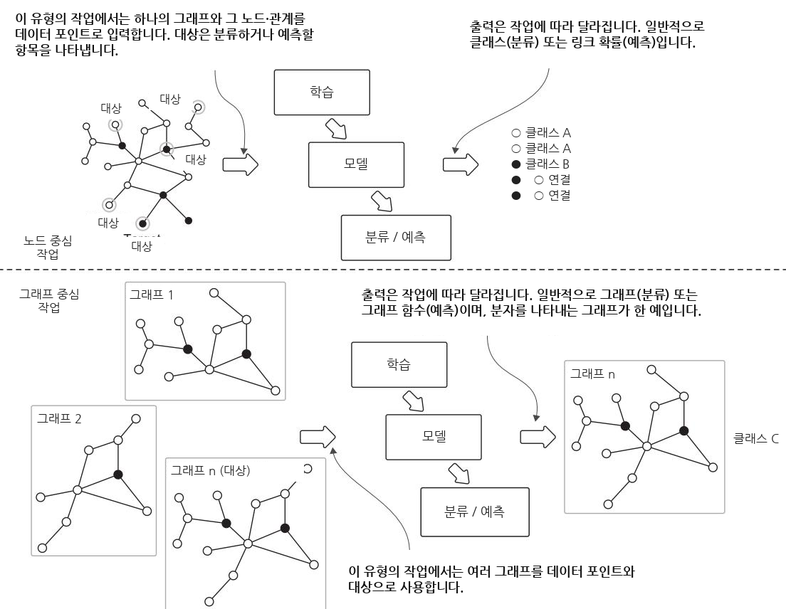  
그림 9.1 노드 중심 과제와 그래프 중심 과제는 학습 및 예측 중 기대되는 입력과 출력의 관점에서 표현됩니다.

노드 분류의 다른 예로는 상호작용체 (interactome)에서 단백질의 기능을 분류하는 것 [4]과 하이퍼링크 또는 인용 그래프를 기반으로 문서의 주제를 분류하는 것 [5]이 있습니다. 이는 IAS 구현 과정에서 식별과 의사결정을 돕는 강력한 도구입니다. 그림 9.2는 노드 분류의 주요 구성 요소와 단계를 보여 줍니다.

언뜻 보기에 노드 분류는 표준 지도 분류의 단순한 변형처럼 보이지만, 뚜렷한 차이가 있습니다. 특히 그래프의 노드들은 독립적이고 동일하게 분포 (independent and identically distributed, i.i.d.)되어 있지 않습니다. 일반적으로 지도 ML 모델을 구축할 때, 우리는 각 데이터 포인트가 다른 모든 데이터 포인트와 통계적으로 독립이라고 가정합니다. 그렇지 않은 경우에는 모든 입력 포인트 간의 의존성을 명확히 해야 할 수 있습니다. 마찬가지로, 모델이 보지 못한 데이터 포인트에 효과적으로 일반화될 수 있도록 데이터 포인트들이 동일하게 분포한다고 가정합니다. 그러나 노드 분류는 이러한 i.i.d. 가정을 깨뜨립니다. i.i.d. 데이터 포인트들의 집합을 모델링하는 대신, 우리는 노드들이 서로 연결된 네트워크를 모델링합니다.

학습은 그래프를 입력으로 받아 그래프 구조, 노드, 관계 속성을 사용하여 노드에 필요한 특징을 추출합니다.

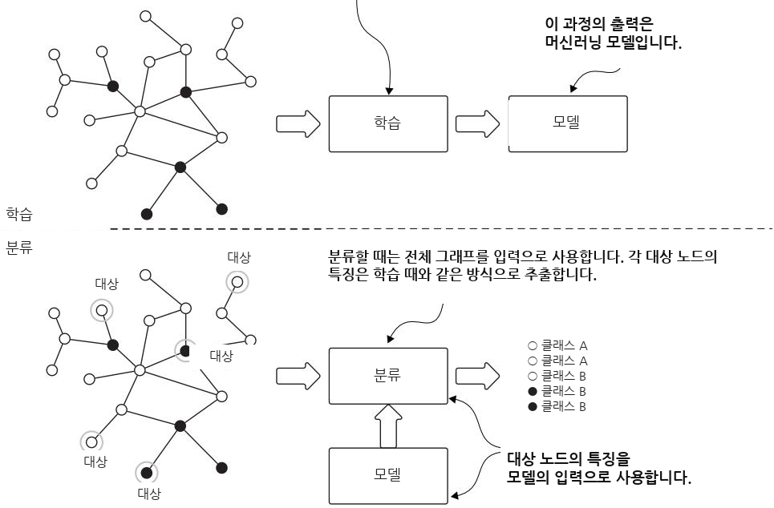  
그림 9.2 노드 분류의 일반적인 흐름입니다. 많은 지도 ML 과제와 마찬가지로, 이는 학습과 예측이라는 두 단계로 구성됩니다. 이 경우 예측은 분류되지 않은 노드를 분류하는 것을 의미합니다.

서로 다른 그래프 유형은 i.i.d. 가정에 도전하는 다양한 관계 패턴을 보입니다. 소셜 네트워크에서 동질성 (homophily)은 이러한 상호연결성을 보여 줍니다. 즉, 노드들은 관계를 통해 서로 영향을 미치며, 이웃과 공유되는 관심사, 속성, 행동을 나타냅니다 [6]. 이러한 i.i.d. 가정의 위반은 효과적인 모델이 예측을 수행할 때 노드 특징과 그 네트워크 관계를 모두 고려해야 함을 의미합니다 [7]. 단백질 상호작용 네트워크에서는 구조적 등가성 (structural equivalence)이 중요해집니다. 유사한 이웃 구조를 가진 노드들은 기능적 속성을 공유하는 경향이 있습니다 [8]. 이질성 (heterophily)은 노드들이 서로 다른 특성을 가진 노드와 우선적으로 연결되는 또 다른 패턴을 제시하며, 실제 데이터가 i.i.d. 가정을 얼마나 자주 위반하는지를 추가로 보여 줍니다. 이러한 원리들은 노드를 독립적인 데이터 포인트로 취급하는 것이 그래프에 인코딩된 풍부한 관계 정보를 포착하지 못하는 이유를 강조합니다. 성공적인 노드 분류에는 노드 속성과 그 복잡한 상호의존성을 모두 모델링하는 것이 필요합니다.

#### 노드 분류는 지도 학습입니까, 비지도 학습입니까?


많은 연구자들은 노드 분류가 준지도 학습 (semisupervised)이라고 보는 데 동의합니다 [9]. 이는 노드 분류 모델을 학습할 때 일반적으로 레이블이 없는 모든 노드(예: 테스트 노드)를 포함한 전체 그래프에 접근할 수 있기 때문입니다. 우리가 알지 못하는 유일한 것은 레이블이 없는 노드의 레이블입니다.

#### (계속)


테스트 노드입니다. 그러나 학습 중에도 테스트 노드에 관한 정보(예: 그래프에서 이웃에 대한 지식)를 사용하여 모델을 개선할 수 있습니다. 이는 레이블이 없는 데이터 포인트가 학습 중 관찰되지 않는 일반적인 지도 학습 설정과 다릅니다.

학습 중 레이블이 있는 데이터와 레이블이 없는 데이터를 결합하는 모델에 대한 일반적인 용어는 준지도 학습이므로, 이 용어가 노드 분류 작업에 자주 사용되는 것은 이해할 만합니다. 그러나 준지도 학습의 표준 정식화는 i.i.d. 가정을 요구하며, 이는 노드 분류에는 성립하지 않는다는 점에 유의해야 합니다. 우리는 여전히 이 정의를 두고 어려움을 겪고 있습니다. 이는 그래프상의 ML 작업이 고전적 범주에 쉽게 들어맞지 않는 이유를 보여 줍니다!

노드 분류는 단일 노드에 여러 레이블을 할당하도록 확장될 수 있습니다. 예를 들어 이미지 호스팅 플랫폼인 Flickr(www.flickr.com)는 사용자의 관심사를 다루기 위해 그래프와 다중 레이블 노드 분류를 사용합니다. Flickr는 사진을 호스팅하는 것에 더해, 사용자가 서로를 팔로우할 수 있는 온라인 사회적 커뮤니티로 기능하며, 이러한 사용자 연결을 통해 네트워크를 형성합니다. 또한 Flickr 사용자는 관심 그룹을 구독할 수 있으며, 이러한 멤버십은 사용자 관심사를 나타내고 사용자 레이블로 사용될 수 있습니다. 사용자는 여러 그룹을 구독할 수 있으므로 각 사용자는 여러 레이블과 연결될 수 있습니다. 그래프상의 다중 레이블 노드 분류 문제는 사용자가 관심을 가질 수 있지만 아직 구독하지 않은 잠재적 그룹을 예측하는 데 도움이 될 수 있으며, Tang과 Liu [10]는 이러한 Flickr 사용자 행동과 관련된 데이터셋을 제공합니다.

#### 9.2.2 링크 예측 (일명 관계 예측)


링크 예측 (link prediction)은 노드 간의 잠재적 미래 연결을 식별하는 그래프 기반 ML의 기본 과제입니다. 의료( PubMed, https://pubmed.ncbi.nlm.nih.gov; MedRxiv, www.medrxiv.org), COVID-19 연구(CORD-19, https://mng.bz/JwGQ), 광범위한 과학 연구(Web of Science, https://mng.bz/qRPz), 또는 컴퓨터 과학(DBLP, https://dblp.org)과 같은 도메인의 연구 논문에 대한 포괄적 데이터베이스를 생각해 보겠습니다. 이러한 출처로부터 저자를 노드로 나타내고, 간선을 적어도 한 편의 논문에서의 공동 작업을 나타내는 공동 저술 그래프 (co-authorship graph)를 구성할 수 있습니다. 그러면 링크 예측 과제는 아직 함께 작업한 적이 없는 저자들 사이에서 향후 발생할 가능성이 높은 협업을 예측하는 것을 포함합니다.

이러한 예측 접근법은 법 집행 및 보안 응용과 같은 다른 중요한 도메인으로 자연스럽게 확장됩니다. 그림 9.3은 일반적인 링크 예측 과제의 두 가지 주요 단계를 보여 줍니다.

많은 실제 응용에서 그래프는 누락된 간선 때문에 완전하지 않습니다. 이러한 불완전성은 보통 두 가지 이유 중 하나로 인해 발생합니다. 첫째, 때로는 연결이 존재하지만 관측되거나 기록되지 않으며, 또는 특정 경우에는 네트워크의 핵심 행위자들에 의해 숨겨져 있습니다. 둘째, 많은 그래프는 본질적으로 진화합니다. 예를 들어 학술 협업 그래프에서 저자는 새로운 논문을 작성함으로써 언제든지 다른 저자들과 새로운 협업 관계를 형성할 수 있습니다. 이러한 누락된 간선을 추론하거나 예측하는 것은 많은 IAS에 이점을 제공할 수 있으며, 친구 추천 [11, 12], 제품 추천, KG 완성 [13], 약물 부작용 예측 [14], 관계형 데이터베이스에서 새로운 사실 추론 [15], 단백질–단백질 상호작용 발견 [16], 범죄 정보 분석 [17] 등 많은 작업에 도움이 됩니다.

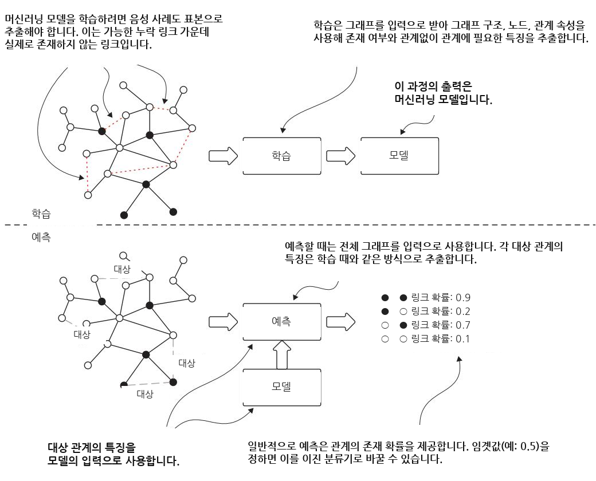  
그림 9.3 일반적인 링크 예측 흐름. 이는 두 단계로 구성됩니다. 학습 단계에서는 그래프가 입력으로 사용되며, 모델은 링크가 존재하는지 여부를 판별하도록 학습됩니다. 예측 단계에서는 모델이 예측 대상 관계를 나타내는 각 노드 쌍에 대해 출력을 제공합니다. 모델은 각 쌍에 대한 존재 확률을 제공합니다.

#### 링크 예측 과제의 명칭


이 과제는 응용 도메인에 따라 링크 예측, 그래프 완성 (graph completion), 관계 추론 (relational inference) 등 여러 이름으로 알려져 있습니다. 링크 예측은 일반적으로 관계 유형과 무관하게 두 노드 사이에 연결이 존재하는지를 예측하는 것을 의미합니다(관계 유형은 일관되게 동일하며 미리 정해져 있습니다). 반대로, 관계 예측이라는 용어는 일반적으로 관계의 존재 여부뿐만 아니라 관계의 유형까지 정확히 식별하고자 할 때 사용됩니다. 이 책에서는 이러한 용어들을 상호 교환적으로 사용하겠습니다.

노드 분류와 마찬가지로, 링크 예측은 일반적으로 준지도 학습 (semisupervised learning) 과제로 접근됩니다. 노드 쌍 사이의 특정 링크가 누락되어 있을 수 있지만, 우리는 연결의 기존 예시와 풍부한 노드 수준 정보를 모두 사용하여 잠재적 관계를 예측할 수 있습니다. 이러한 준지도적 특성은 그래프 구조의 알려진 패턴과 노드 속성을 함께 사용하여 노드 사이에서 누락되었거나 미래에 생길 가능성이 높은 연결을 추론할 수 있게 해줍니다.

#### 9.2.3 클러스터링과 커뮤니티 탐지 (community detection)


이전 절에서 언급한 출처 중 하나로부터 연구 논문 목록을 얻었다고 상상해 보십시오. 여러분은 논문을 공동 집필한 연구자들을 연결하는 공동 연구 그래프를 생성합니다. 이 네트워크를 살펴보면, 모든 사람 사이에서 협업 가능성이 동일한 조밀한 “헤어볼”을 관찰할 가능성은 낮습니다. 대신 그래프는 연구 분야, 소속 기관, 지리적 요인과 같은 요소에 따라 묶인 노드들의 뚜렷한 클러스터로 분할되어 있을 가능성이 큽니다. 같은 대학에 속한 두 연구자가 협업할 성향은 멀리 떨어져 있는 동료들보다 더 높습니다. 마찬가지로, 같은 분야의 두 연구자는 관련 없는 영역의 연구자보다 해당 분야의 다른 연구자들을 참조할 가능성이 더 큽니다. 이러한 자연스러운 클러스터링 행태는 네트워크 구조에 내재한 이러한 그룹을 식별하는 것을 목표로 하는 커뮤니티 탐지 알고리즘의 이론적 토대를 형성합니다(그림 9.4 참조).

커뮤니티 탐지는 네트워크의 나머지 부분과의 연결에 비해 내부 연결이 더 조밀한 노드 그룹을 식별합니다. 이는 커뮤니티 내부의 실제 간선 밀도와 기대 간선 밀도 사이의 차이를 최적화함으로써 모듈성 (modularity)을 최대화합니다.

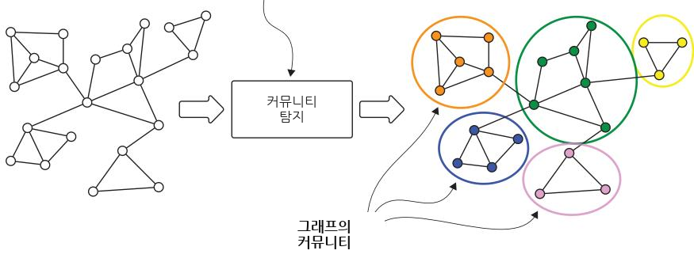  
그림 9.4 커뮤니티 탐지의 흐름. 입력은 그래프이고, 출력은 노드와 그룹 사이의 매핑입니다(이미지에서 원으로 표시됨).

커뮤니티 탐지는 네트워크의 위상 구조 (topology)와 관계만을 사용하여 그래프의 잠재적 그룹 구조를 밝혀냅니다. 이 과제는 유전적 상호작용 네트워크에서 기능 모듈을 식별하는 것[18]부터 금융 거래 네트워크에서 사기 사용자 그룹을 탐지하는 것[19]에 이르기까지 다양한 실제 응용을 가집니다.

그래프 클러스터링의 가장 강력한 응용 중 하나는 그래프 설명과 요약입니다. 조밀하게 연결된 영역을 식별함으로써, 클러스터링은 네트워크 조직에 대한 더 높은 수준의 관점을 제공합니다. 이러한 능력은 직접 시각화하거나 포괄적으로 수작업 분석하기 어려운 대규모 그래프를 다룰 때 특히 가치가 있으며, 복잡한 네트워크 관계에 대한 구조적 요약을 효과적으로 제공합니다.

#### 커뮤니티 탐지 과제의 명칭


커뮤니티 탐지와 그래프 클러스터링이라는 용어는 네트워크 분석에서 종종 서로 바꾸어 사용되지만, K-means와 DBSCAN 같은 전통적 클러스터링 알고리즘과는 근본적으로 다릅니다. K-means는 각 점을 가장 가까운 클러스터 중심 (centroid)에 반복적으로 할당하고 이 중심들을 갱신함으로써 n개의 데이터 점을 k개의 클러스터로 분할하며, k는 사전에 지정되어야 합니다. DBSCAN (density-based spatial clustering of applications with noise)은 밀집되어 있는 점들(가까운 이웃이 많은 점들)을 함께 묶는 한편, 저밀도 영역의 점들은 이상치로 표시하며, 사전에 클러스터 수를 지정할 필요가 없습니다.

핵심적인 차이는 데이터 구조에 있습니다. 전통적 클러스터링 알고리즘은 벡터 공간의 독립적인 데이터 점을 다루는 반면, 그래프 클러스터링은 노드 간 관계가 집단 소속을 결정하는 데 중요한 상호연결된 데이터를 구체적으로 처리합니다. 그래프에 적용될 때 이 용어들은 동일한 과제를 가리키므로, 우리는 이 용어들을 서로 바꾸어 사용하겠습니다.

그래프 클러스터링은 일반적으로 비지도 방식이며, 커뮤니티 구조를 식별하기 위해 사전에 레이블이 부여된 정보를 필요로 하지 않습니다. 그러나 레이블 전파 (label propagation) [20]와 같은 일부 클러스터링 접근법은 커뮤니티 할당을 안내하기 위해 기존 레이블을 통합할 수 있어, 그래프 분석에서 지도 학습과 비지도 학습 사이의 간극을 메웁니다.

앞의 세 알고리즘은 노드 중심 과제의 범주에 속합니다. 다음으로는 그래프 중심 과제에 해당하는 하나를 살펴보겠습니다.

#### 9.2.4 그래프 분류


화학 분자의 독성과 용해도를 예측하는 과제를 생각해 보겠습니다. 이러한 속성은 개별 원자뿐만 아니라 이 원자들이 어떻게 연결되어 분자를 형성하는지에서도 나타납니다. 각 분자는 그래프로 표현할 수 있으며, 여기서 원자는 노드가 되고 화학 결합은 엣지가 됩니다 [21]. 이러한 그래프 표현을 통해 그래프 분류 (graph classification) 기법을 적용하여 여러 분자 속성을 동시에 예측할 수 있습니다. 그림 9.5에 나타난 것처럼, 그래프 분류는 원자 조성과 구조적 패턴을 체계적으로 분석하여 용해도와 독성 같은 속성에 따라 이전에 레이블이 지정되지 않은 분자를 범주화할 수 있습니다.

노드 분류가 단일 그래프의 개별 노드에 대한 레이블을 예측하는 반면, 그래프 분류는 여러 독립적인 그래프를 포함하는 데이터셋을 다루며, 각 그래프는 완전한 샘플(예: 분자)을 나타냅니다. 그래프 분류에서 각 그래프는 자체 레이블을 가진 i.i.d. 데이터 포인트로 기능합니다. 예를 들어, 어떤 분자가 독성이 있는지 여부가 이에 해당합니다.

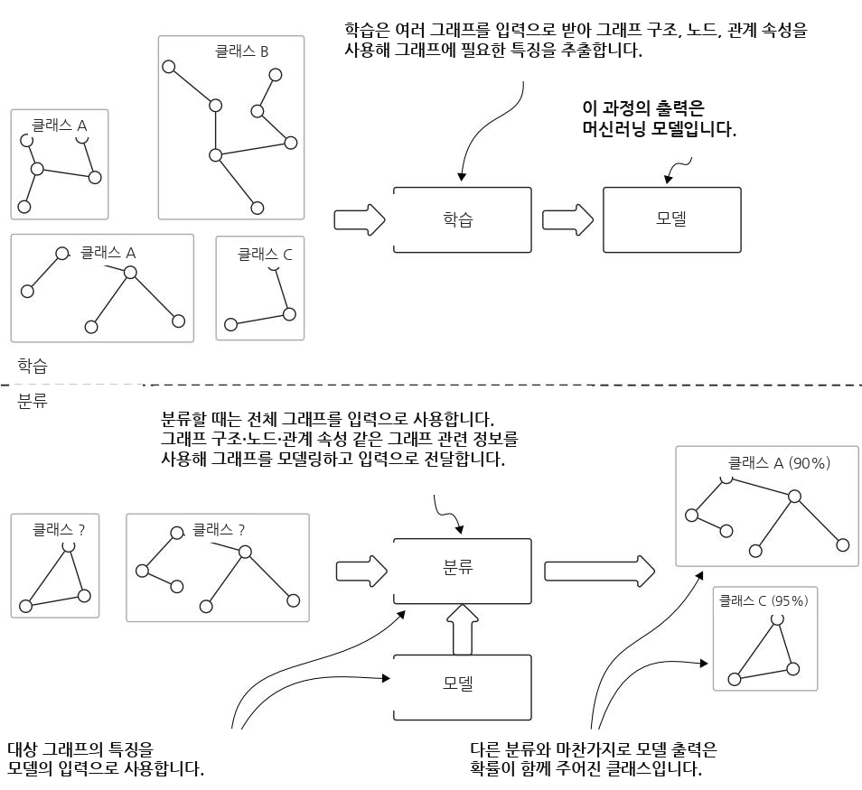  
그림 9.5 그래프 분류의 흐름. 많은 지도 학습 과제와 마찬가지로, 그래프 분류에는 두 단계가 있습니다. 학습 중에는 각 그래프의 클래스를 인식하도록 관련 클래스가 있는 서로 다른 그래프를 학습합니다. 그리고 예측 중에는 모델이 그래프의 클래스를 예측합니다.

그래프 분류의 목표는 레이블이 지정된 그래프의 학습 집합을 사용하여 전체 그래프에서 그에 대응하는 레이블로의 매핑을 학습하는 것입니다. 마찬가지로 그래프 수준의 그래프 클러스터링은 전통적인 비지도 클러스터링을 확장하여 노드가 아니라 전체 그래프를 범주화합니다. 이러한 그래프 수준 과제의 주요 도전 과제는 각 그래프의 내부 구조와 그 구성 요소의 속성을 모두 효과적으로 포착하는 특징을 개발하는 데 있습니다.

그래프 클러스터링은 IASs와 같은 많은 실제 응용 분야를 가지고 있습니다. 예를 들어, 효소는 단백질의 한 유형입니다. 단백질은 그래프로 표현할 수 있으며, 여기서 아미노산은 노드이고 두 노드 사이의 거리가 특정 거리보다 작으면 그 사이에 엣지를 만들 수 있습니다. 학습 후에는 단백질이 주어졌을 때 그래프 분류 알고리즘이 그것이 효소인지 여부를 예측할 수 있습니다. 또 다른 예는 악성코드 분류기입니다. 이 경우의 과제는 컴퓨터 프로그램의 구문과 데이터 흐름에 대한 그래프 기반 표현을 분석하여 해당 프로그램이 악성인지 여부를 탐지하는 분류 모델을 구축하는 것입니다 [22].

### 9.3 그래프에서의 기계 학습: 어떻게 하는가?


이 시점에서 우리는 그래프에서의 ML이 왜 독자적인 연구 분야로 등장했는지, 그리고 이러한 알고리즘이 어떤 복잡성을 다룰 수 있는지 이해했습니다. 이제 구현 선택지를 살펴보겠습니다. 일반적으로 해법은 그림 9.6에 요약된 것처럼 두 방향으로 개발될 수 있습니다. 첫 번째 접근법은 집단 분류 (collective classification) [23]와 같이 그래프를 위해 특별히 설계된 알고리즘을 사용합니다. 이러한 특화 알고리즘은 그래프 구조를 직접 처리하며, 예측을 수행하기 위해 노드 특징과 이웃 관계를 동시에 고려합니다. 두 번째 접근법은 먼저 그래프 구조를 특징 벡터 (feature vector)로 변환함으로써 그래프 문제를 전통적인 ML 과제로 바꿉니다. 이러한 특징 공학 (feature engineering) 단계는 현대적인 딥러닝 기법을 포함하여 기존 ML 알고리즘의 전체 생태계를 사용할 수 있게 해 줍니다. 그러면 주요 과제는 노드, 엣지, 그리고 그래프 분류의 경우 전체 그래프 구조의 핵심 특성을 포착하는 적절한 특징을 정의하는 것으로 전환됩니다.

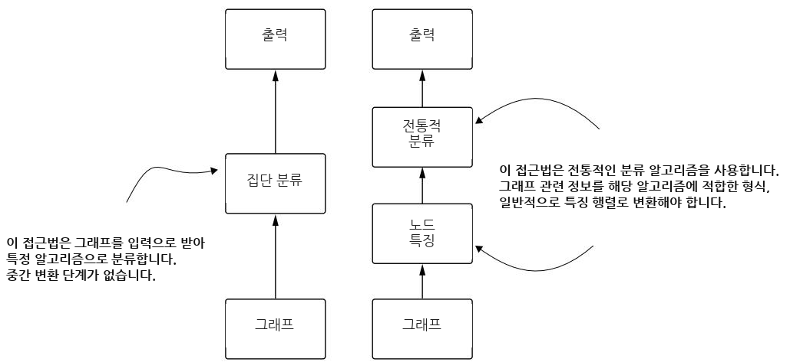  
그림 9.6 그래프 기반 분류 접근법(집단적 접근)과 분류를 위한 전통적 알고리즘의 비교

이 책의 이 부분에서는 그래프를 위한 특징 공학에 초점을 맞춥니다. 먼저 수동 특징 추출 방법을 살펴보며, 그것이 얼마나 철저한지뿐 아니라 얼마나 번거로운지도 보여 줍니다. 그런 다음 GNN을 자동 특징 학습 (automated feature learning)을 위한 강력한 해법으로 자세히 다루기 전에, 반자동 접근법으로 나아갑니다. GNN은 구조적 패턴과 노드 속성을 모두 포착하는 데 뛰어나므로, 불완전한 지식 그래프 (KGs)에 특히 가치가 있습니다. 우리는 GNN이 그래프 지식을 인코딩하는 의미 있는 벡터 임베딩을 어떻게 생성하며, 이것이 분류(예를 들어 노드 분류)와 같은 다운스트림 ML 과제에 어떻게 직접적인 이점을 제공하는지 살펴볼 것입니다.

#### 9.3.1 노드 분류와 링크 예측


그림 9.7은 노드 분류와 링크 예측을 위한 상위 수준의 학습 과정을 보여줍니다. 이 학습의 결과로 예측 모델이 생성됩니다. 이는 이 단계의 출력이자 다음 단계의 입력입니다. 그림 9.8은 기존 노드와 관계를 받아 클래스와 누락된 링크를 예측하는 예측 과정의 단계를 보여줍니다.

NOTE 학습 중에 사용된 특징화 (featurization) 과정은 예측을 수행할 때 사용되는 과정과 동일해야 합니다. 그렇지 않으면 예측 단계가 올바르게 작동하지 않습니다.

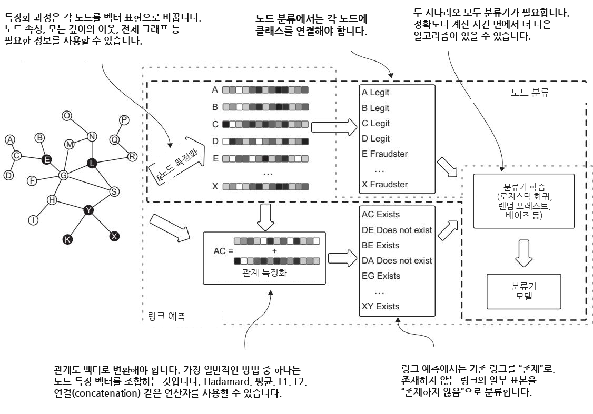  
그림 9.7 노드 분류와 링크 예측을 위한 학습 흐름. 핵심 단계는 노드와 관계의 특징화입니다. 이 과정이 끝나면 벡터를 고전적 알고리즘에 전달할 수 있습니다. 노드 분류와 링크 예측은 모두 분류 과제로 볼 수 있습니다.

이 원칙들을 간단한 예제로 실제 적용해 보겠습니다. 네트워크의 노드를 분류하고 싶다고 가정해 보겠습니다. 학습 목적상 작은 그래프인 유명한 Zachary Karate Club [24]을 사용할 것입니다. 이 그래프는 가라테 클럽 회원 34명 사이의 관계를 기록하며, 클럽 밖에서 회원 쌍 간의 상호작용을 추적합니다. 관리자 “John A”와 강사 “Mr. Hi”(가명) 사이의 분쟁으로 인해 클럽은 두 파벌로 나뉘었습니다.

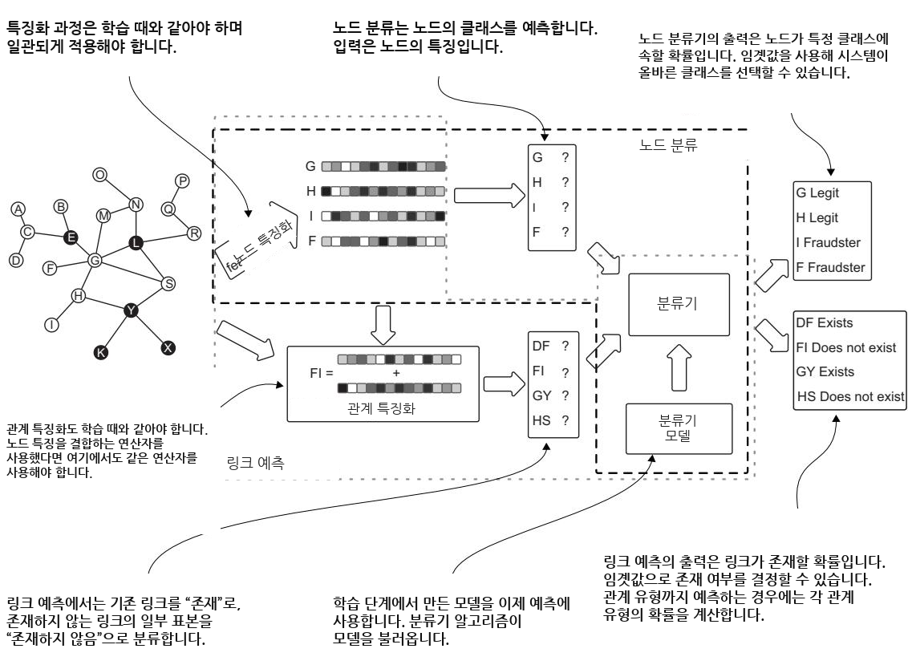  
그림 9.8 노드 분류와 링크 예측을 위한 예측 흐름. 특징화 과정은 학습 중과 동일해야 합니다. 이전에 구축된 분류기 모델이 이 단계에서 예측을 수행하는 데 사용됩니다.

클럽이 분열된 후, 각 회원(노드로 표현됨)은 강사의 새 클럽(Mr. Hi)에 소속되거나 관리자의 기존 클럽(John A)에 남았습니다. 이 실제 결과는 우리에게 실측 레이블 (ground-truth labels)을 제공합니다. 각 노드는 해당 회원이 최종적으로 가입한 클럽에 따라 레이블이 지정됩니다. 우리의 노드 분류 과제는 분열 이전에 존재했던 친구 관계 네트워크 구조만을 사용해 이러한 클럽 소속을 예측하는 것이며, 이는 네트워크 패턴이 사회적 행동을 어떻게 예측할 수 있는지를 보여줍니다. 우리는 간단한 코드를 사용하여 그림 9.7과 9.8에 설명된 전체 흐름을 설명할 것입니다.

먼저 네트워크를 살펴본 다음 분석해 보겠습니다. 이 예제에서는 Neo4j에 아무것도 저장하지 않을 것입니다. 네트워크는 매우 작으며, 우리가 사용할 도구인 Networkx(https://networkx.org)를 비롯해 많은 네트워크 분석 도구에서 기본적으로 제공됩니다. 다음 목록은 필요한 패키지를 가져오고 가라테 클럽 그래프를 로드하는 방법을 보여줍니다.

```python
Listing 9.1 Creating and drawing a karate club network
import networkx as nx
import matplotlib.pyplot as plt
Loads the karate
G = nx.karate_club_graph() < club graph
draw_and_save_graph_picture(G)
Displays the graph onscreen and
def draw_and_save_graph_picture(G): ≤ saves it in PNG and SVG formats
set_club_colors(G)
layout_position = nx.spring_layout(G, k=8 / math.sqrt(G.order()))
colors = [n[1]['color'] for n in G.nodes(data=True)]
nx.draw_networkx(G, pos=layout_position, node_color=colors)
plt.axis('off')
plt.savefig("Karate_Graph.svg", format="SVG", dpi=1000)
plt.savefig("Karate_Graph.png", format="PNG", dpi=1000)
plt.show()
def set_club_colors(G): < Assigns a color to
for node in G.nodes(data=True): each node group
color = '#00fff9'
if node[1]['club'] == 'Mr. Hi':
color = '#e6e6fa'
node[1]['color'] = color
```

  
그림 9.9 목록 9.1의 코드로 생성된 가라테 클럽 그래프. 노드의 음영은 해당 회원이 최종적으로 가입한 클럽을 나타냅니다.

결과 네트워크는 그림 9.9에 나와 있습니다. 노드는 두 가지 서로 다른 음영으로 표시되며, 이는 분열 후 각 회원이 최종적으로 가입한 클럽을 나타냅니다.

그림 9.7 및 9.8에서 설명한 것처럼, 첫 번째 단계는 학습 및 예측 중 분류 알고리즘의 입력으로 사용될 각 노드의 벡터 표현을 생성하는 것입니다. 10장과 11장에서는 정교한 임베딩 기법을 자세히 살펴볼 것입니다. 여기서는 간단한 접근법, 즉 각 노드를 그 차수 (degree)(다른 노드와 맺고 있는 연결-

의 수)로 표현하는 것부터 시작하겠습니다. 이 특징은 네트워크에서 노드의 연결성을 포착합니다. 다음 리스팅은 그래프에서 각 노드의 차수를 계산합니다.

```python
Listing 9.2 Representing each node by its degree
Computes the
def compute_degree_embeddings(G):
embedding for
embeddings = np.array(list(dict(G.degree()).values())) < each node
embeddings = [[i] for i in embeddings] < Converts an element in the list
return embeddings into a single-value embedding
```

#### 연습문제


이 기법은 기초적이지만, 노드의 차수는 우리의 목표인 노드 분류에 실질적으로 큰 도움이 되지 않을 수 있습니다. 연습문제로, 두 가지 다른 지표를 사용해 보십시오. 즉, Mr. Hi의 이웃들의 차수와 John A의 이웃들의 차수입니다. 이 지표들은 알고리즘이 노드가 어느 그룹에 속하는지 식별하는 데 더 많은 통찰을 제공합니다. 해답은 이 장의 뒷부분에 제시됩니다.

GNN이 등장하기 전에는 Node2Vec [25]이 네트워크 구조만을 기반으로 노드 임베딩을 계산하는 자율 표현 학습 (autonomous representation learning)의 대표적인 기법이었습니다. 다음 리스팅은 Node2Vec 알고리즘을 사용하여 이러한 구조 인식 노드 임베딩을 생성하는 방법을 보여줍니다.

#### 리스팅 9.3 Node2Vec을 임베딩 기법으로 사용하기


```python
def compute_complex_embeddings(G):
node2vec = Node2Vec(
G,
dimensions=64,
walk_length=30,
num_walks=200, Node2Vec library constructor
workers=4, precomputes probabilities and
seed=0) < generates random walks.
model = node2vec.fit(
window=10,
min_count=1,
batch_words=4, Computes
seed=0) < embeddings
embeddings = [model.wv.get_vector(i) for i in G.nodes]
return embeddings
```

#### 이 코드는 다음을 수행합니다:


1 각 노드를 64차원 벡터로 표현하도록 지정하여 Node2Vec을 초기화합니다. 그런 다음 알고리즘은 그래프에서 200회의 무작위 보행 (random walk)을 수행하며, 각 보행은 30개의 노드를 방문합니다. 효율성을 위해 네 개의 병렬 프로세스를 사용하고, 무작위 시드 (random seed)는 재현 가능한 결과를 보장합니다.

2 모델은 Word2Vec에서 영감을 받은 매개변수를 사용하여 학습됩니다. 즉, 각 보행 시퀀스의 앞뒤 10개 노드를 고려하고, 모든 노드가 학습에 포함되며(한 번만 방문된 노드도 포함), 단어를 작은 배치 단위로 처리합니다.

3 그래프의 각 노드에 대해 학습된 임베딩을 추출하여 벡터 표현의 목록을 반환하며, 각 벡터는 네트워크에서 해당 노드의 구조적 역할을 포착합니다. 이러한 임베딩은 노드 분류나 링크 예측과 같은 다운스트림 ML 작업을 위한 입력 특징으로 사용될 수 있습니다.

리스팅 9.2와 9.3은 전체 그래프에 대한 임베딩을 계산하므로, 학습 세트에 대해 따로 계산한 뒤 예측을 위해 다시 계산할 필요가 없습니다. 다음 리스팅은 로지스틱 회귀 (logistic regression)를 분류기로 사용하는 학습 함수의 예를 보여줍니다.

```python
Listing 9.4 Training function
node_embeddings is a matrix in which node_labels is a vector containing
each row contains the vector the class label for each node,
representation (embedding) of a node. aligned with node_embeddings.
def train(self, train_dataset):
V node_embeddings = train_dataset.embeddings.values.tolist()
node_labels = train_dataset.label.values.tolist() <
self.scaler = StandardScaler().fit(node_embeddings)
scaled_embeddings = self.scaler.transform(node_embeddings)
clf = LogisticRegressionCV( Standardizes the
embeddings to
random_state=0, Initializes a logistic have zero mean
solver='liblinear', regression classifier with
and unit variance
multi_class='ovr', cross-validation for
max_iter=1000) < automatic parameter tuning
self.model = clf.fit(scaled_embeddings, node_labels) <
Trains the classifier using the standardized
embeddings and their corresponding labels
```

이 학습 과정은 두 가지 중요한 ML 개념인 특징 표준화 (feature standardization)와 로지스틱 회귀를 도입합니다. 특징 표준화는 서로 다른 척도에서 작동하는 여러 노드 특징을 다룰 때 필수적입니다. 우리의 예에서 노드 차수는 한 자리 수에서 수천까지 이를 수 있으며, 다른 지표들도 서로 다른 척도에서 작동합니다. StandardScaler를 사용하여 모든 특징이 평균 0과 단위 분산을 갖도록 변환함으로써, 각 특징이 원래의 척도와 관계없이 모델의 결정에 비례적으로 기여하도록 보장합니다.

#### 특징 스케일링이 중요한 이유


ML 알고리즘은 종종 데이터 포인트 간의 유클리드 거리 (Euclidean distance) 계산에 의존합니다. 적절한 스케일링이 없으면, 실제 중요도와 관계없이 수치 범위가 더 큰 특징이 이러한 계산을 지배하게 됩니다. 예를 들어, 노드 차수가 1에서 1,000까지의 범위를 갖고 중심성 척도가 0에서 1까지의 범위를 갖는다면, 거리 기반 계산에서 차수가 중심성의 영향을 압도하게 됩니다. 이는 모델이 특징의 예측력 때문이 아니라 단순히 그 척도 때문에 해당 특징에 과도하게 민감해지므로, 편향된 예측과 모델 정확도 저하로 이어질 수 있습니다.

로지스틱 회귀 (logistic regression)는 이름과 달리 이진 예측 작업에서 뛰어난 성능을 보이는 분류 알고리즘입니다 [25]. 여기서는 노드가 특정 클래스에 속할 확률을 추정합니다. 이 알고리즘은 로지스틱 함수를 사용하여 특징의 선형 결합을 0과 1 사이의 확률로 변환하므로, 우리의 노드 분류 작업에 이상적입니다. 예를 들어, 가라테 클럽 예제에서는 각 구성원이 지도자의 클럽 또는 관리자의 클럽에 가입할 확률을 예측합니다.

G = nx.karate\_club\_graph()   
draw\_and\_save\_graph\_picture(G)

이 구현은 우리의 접근 방식의 핵심 장점을 보여줍니다. 즉, 임베딩과 적절한 스케일링을 통해 그래프 데이터를 특징 벡터로 변환함으로써, 잘 확립된 ML 알고리즘을 사용할 수 있습니다. 다음 리스팅에 보이듯이, 이어지는 평가 단계에서는 보류된 테스트 노드 집합에 대해 예측된 레이블을 실제 결과와 비교하여 이 모델의 정확도를 테스트합니다.

```python
test_embeddings is a matrix in which
true_labels contains the class
each row contains the vector labels for test nodes, aligned
representation of a test node. with test_embeddings.
def evaluate(self, test_dataset):
test_embeddings = test_dataset.embeddings.values.tolist()
true_labels = test_dataset.label.values.tolist() ≤
Standardizes > scaled_test_embeddings = self.scaler.transform(test_embeddings)
test embeddings
using the same predicted_labels = self.model.predict(scaled_test_embeddings) <
scaler fitted on
training data print("True labels:\t\t", true_labels) Predicts class
labels for each
print("Predicted labels:\t", list(predicted_labels))
test node using
the trained model
#### Calculate performance metrics
metrics = precision_recall_fscore_support(true_labels,
➥predicted_labels, average='weighted')
print('Precision:', metrics[0], 'Recall:', metrics[1], 'f-score:',
➥metrics[2])
conf_matrix = confusion_matrix(true_labels, predicted_labels) <
print("Confusion Matrix:\t", conf_matrix)
Calculates precision, recall, and F1-score by Generates a confusion matrix to visualize
comparing predicted labels against true labels prediction accuracy across different classes
```

이 함수는 예측 모델의 품질을 평가하는 데 유용합니다. 우리의 예제는 매우 작은 네트워크와 단 두 개의 레이블만 가지고 있지만, 이 코드는 더 큰 그래프와 여러 레이블에도 작동합니다.

이 시점에서 우리는 노드 분류 작업의 학습과 평가를 수행하는 데 필요한 모든 요소를 갖추었습니다. 리스팅 9.6은 이전 리스팅의 모든 구성 요소(함수)를 사용하고 결과를 출력합니다. 한 임베딩에서 다른 임베딩으로 전환하려면 원하는 임베딩 함수의 주석 처리를 추가하거나 해제하기만 하면 됩니다.

#### 리스팅 9.6 전체 노드 분류 과정


```python
labels = np.asarray([G.nodes[i]['club'] != 'Mr. Hi' for i in G.nodes])
.astype(np.int64) < Retrieves the label for each node and
assigns a value of 0 or 1 depending
#embeddings = compute_degree_embeddings(G) < on the group it belongs to
embeddings = compute_complex_embeddings(G)
Select the embedding to
df = pd.DataFrame({ test by uncommenting the
'nodeId': G.nodes, option you wish to try.
'embeddings': embeddings,
'label': labels Creates a DataFrame that includes the nodeId,
}) < the full embedding, and the node labels
train, test = train_test_split(df, test_size=0.4, random_state=0) <
classifier = EvaluateEmbedding() Divides the
DataFrame into two
classifier.train(train) Invokes the functions
classifier.evaluate(test) to create and evaluate frames by randomly
splitting the dataset
```

두 가지 서로 다른 임베딩 기법으로 코드를 실행한 후, 다음 리스팅에서 서로 다른 결과를 확인할 수 있습니다.

#### 리스팅 9.7 두 임베딩의 결과


차수를 사용한 더 단순한 임베딩의 결과   
정답: [0, 1, 1, 0, 0, 1, 1, 0, 0, 1, 1, 1, 1, 0]   
예측: [1, 1, 0, 1, 0, 1, 0, 1, 0, 0, 0, 0, 1, 0]   
정밀도: 0.44642857142857145   
재현율: 0.42857142857142855   
f-점수: 0.42857142857142855 첫 번째 실행의 혼동 행렬: 세 개의 진   
음성(좌상단), 세 개의 거짓 양성   
혼동 행렬: [[3 3] (우상단), 다섯 개의 거짓 음성(좌하단),   
[5 3]] < 그리고 세 개의 진 양성(우하단)   
NODE2VEC을 사용한 더 복잡한 임베딩의 결과   
정답: [0, 1, 1, 0, 0, 1, 1, 0, 0, 1, 1, 1, 1, 0]   
예측: [0, 0, 0, 1, 1, 1, 1, 0, 0, 0, 1, 1, 1, 0]   
정밀도: 0.6530612244897959   
재현율: 0.6428571428571429   
f-점수: 0.6446886446886447   
두 번째 실행의 혼동 행렬: 네 개의   
혼동 행렬: [[4 2] 진 음성, 두 개의 거짓 양성, 세 개의   
[3 5]] < 거짓 음성, 그리고 다섯 개의 진 양성

두 실행의 결과는 모두 상대적으로 낮고 일관되지 않은 성능을 보여 줍니다. 이러한 시나리오를 여러 번 실행해 보면 결과에 상당한 변동성이 나타나며, f-점수는 30%에서 70% 사이에서 크게 요동칩니다. 로지스틱 회귀가 잘 확립되고 검증된 알고리즘이라는 점을 고려하면, 이러한 불안정성은 한계가 분류 방법에 있는 것이 아니라 우리의 특징 공학 (feature engineering) 접근 방식에 있음을 시사합니다. 결과의 높은 분산은 차수에만 기반한 우리의 단순한 노드 표현이 신뢰할 수 있는 노드 분류에 필요한 복잡한 네트워크 패턴을 포착하지 못한다는 것을 나타냅니다. Node2Vec의 경우에도 마찬가지입니다.

동질성 (homophily)을 사용하여 특징 공학을 개선해 보겠습니다. 단순히 전체 연결 수를 세는 노드 차수만 사용하는 대신, 이러한 연결의 사회적 맥락을 고려하여 더 풍부한 노드 표현을 만들 수 있습니다. 각 노드에 대해 전체 차수(전체 연결), “Mr. Hi 차수”(강사의 그룹에 대한 연결), “임원 차수”(관리자의 그룹에 대한 연결)를 포함하는 세 요소 벡터를 만들 것입니다. 다음 리스팅에 제시된 이 접근 방식은 한 노드의 그룹 소속이 그 이웃들의 그룹 소속에 의해 영향을 받을 가능성이 높다고 가정함으로써 동질성을 활용합니다.

리스팅 9.8 세 가지 유형의 차수에 기반한 특징화 계산   
def compute\_specific\_degree\_embeddings(G): mr\_hi\_degree를 계산하며,   
clubs = nx.get\_node\_attributes(G, "club") Mr. Hi 그룹에 속한 이웃만   
mr\_hi\_degree = ≤ 고려합니다   
[[clubs[c] for c in G.neighbors(i)].count('Mr. Hi') for i in   
전통적인 방식으로 G.nodes()]   
차수를 계산하고, officer\_degree = < officer\_degree를 계산하며,   
for i in G.nodes()] Officer 그룹에 속한 이웃만 고려합니다   
embeddings =   
[[degree[i], mr\_hi\_degree[i], officer\_degree[i]] for i in G.nodes]   
return embeddings   
세 값을 각 노드에 대한   
단일 벡터로 결합합니다

이제 새 함수가 있으므로, 리스팅 9.6을 새 임베딩 함수를 가리키도록 변경하기만 하면 됩니다. 결과는 다음 리스팅에 제시되어 있습니다.

#### 리스팅 9.9 세 가지 차수를 사용하여 만든 벡터의 결과


정답: [0, 1, 1, 0, 0, 1, 1, 0, 0, 1, 1, 1, 1, 0]   
예측: [0, 1, 1, 0, 0, 1, 1, 0, 0, 1, 1, 1, 1, 1]   
정밀도: 0.9365079365079365   
재현율: 0.9285714285714286   
f-점수: 0.9274255156608098   
혼동 행렬: [[5 1]   
[0 8]]

결과는 훨씬 더 좋습니다. 이를 여러 번 실행해 볼 수 있으며, 결과는 매우 안정적이고 항상 100%에 가깝습니다.

이 실험은 단순하지만, 그래프에서 기계 학습 (ML)을 사용하여 효과적인 지능형 에이전트 시스템 (IASs)을 구축하기 위한 여러 원칙을 보여 줍니다.

특징 공학 (Feature engineering)이 중요합니다. 노드와 관계를 표현하는 방식은 그래프 기반 ML 작업의 성공에 근본적인 영향을 미치며, 도메인 지식을 반영한 특징은 차수 중심성 같은 단순한 지표보다 더 나은 성능을 보이는 경우가 많습니다.

자율 임베딩에는 신중한 조정이 필요합니다. Node2Vec과 같은 방법은 강력하지만 최적의 결과를 보장하지는 않습니다. 지나치게 동질적인 노드 표현이 생성되는 것을 피하려면 매개변수를 신중하게 구성해야 합니다. 연습으로, walk\_length와 num\_walks의 값을 더 낮게 설정하여 실험을 실행해 보십시오.

도메인 이해가 중요합니다. 기본적인 그래프 동역학과 동질성 (homophily) 같은 네트워크 속성에 대한 지식은 일반적인 접근 방식보다 더 효과적인 경우가 많은 더 나은 특징 공학 전략을 안내할 수 있습니다.

이러한 통찰은 이후 장들에서 그래프 표현 학습에 대한 더 정교한 접근 방식을 탐구할 때 기초가 될 것입니다.

#### 9.3.2 그래프 분류


앞서 노드 분류와 링크 예측에서 논의한 특징 공학 접근 방식은 그래프 분류에서도 유사합니다. 그러나 대부분의 알고리즘은 노드에 대한 특징을 추출하는 대신 전체 그래프에 대한 특징 집합을 계산하거나 추출하며, 물론 입력으로는 여러 그래프가 주어집니다. 그림 9.10은 전체적인 과정을 보여 줍니다.

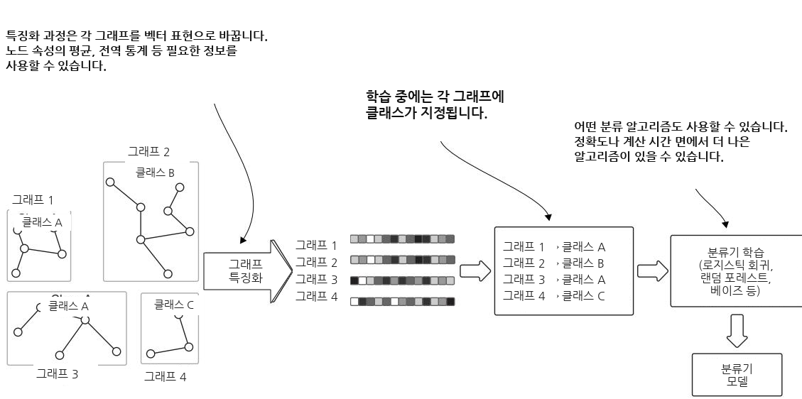  
그림 9.10 그래프 분류를 위한 고수준 학습 과정. 출력은 서로 다른 그래프들의 알려진 클래스로 학습된 분류기 모델입니다.

모델이 학습되면, 분류되지 않은 그래프들과 함께 예측 단계의 입력으로 사용됩니다. 그림 9.11은 예측의 핵심 단계와 주체를 보여 줍니다.

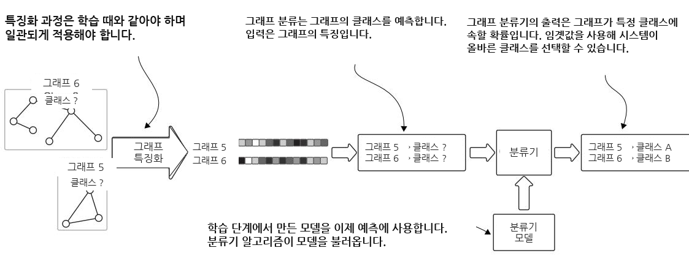  
그림 9.11 그래프 분류를 위한 고수준 예측 과정. 출력은 레이블이 없는 그래프들에 할당된 클래스입니다.

다시 말해, 노드, 관계, 그래프에 대한 특징 추출은 학습과 예측을 위한 입력을 형성하므로 이 과정의 핵심적인 측면임이 분명합니다. 정확도와 전반적인 성능을 포함한 최종 출력의 품질은 이러한 특징의 품질과 다운스트림 알고리즘 매개변수의 정밀한 조정에 크게 의존합니다. 10장과 4부의 나머지 대부분은 이 작업과 이 과정의 결과를 효과적으로 사용하는 데 초점을 맞출 것입니다.

#### 9.3.3 그래프 클러스터링


그래프에 대한 모든 ML 작업이 이전 절들에서 보인 단계를 필요로 하는 것은 아닙니다. 예를 들어 그래프 클러스터링의 경우 입력은 전체 그래프(또는 하위 그래프)이며, 알고리즘은 노드와 관계를 사용하여 커뮤니티 (community)를 추출합니다(그림 9.12 참조).

커뮤니티 탐지는 네트워크의 나머지 부분과의 연결에 비해 내부 연결이 더 조밀한 노드 그룹을 식별합니다. 이는 커뮤니티 내부의 실제 간선 밀도와 기대 간선 밀도의 차이를 최적화함으로써 모듈성 (modularity)을 최대화합니다.

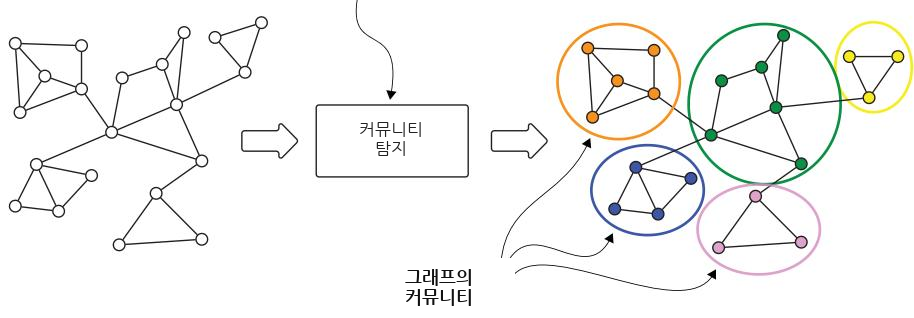  
그림 9.12 상위 수준의 그래프 클러스터링 과정. 이는 벡터 표현이나 다른 형식으로의 중간 변환을 필요로 하지 않는 순수 그래프 알고리즘 접근법의 예입니다.

이 작업에서는 특징 추출이 없습니다. 그래프 알고리즘이 노드 관계, 그 방향, 그리고 가중치를 사용하여 그래프를 분할하기 때문입니다. 약한 연결 요소 (weakly connected component, WCC)와 같은 특정 알고리즘은 고정된 메커니즘을 사용하며 독립적인 하위 그래프만 고려합니다. Louvain 및 레이블 전파 알고리즘 (label propagation algorithm)과 같은 다른 방법들은 모듈성과 같은 특정 결과를 최적화합니다. 우리는 4장에서 Louvain을 논의했으므로, 여기서는 레이블 전파를 간단히 소개하겠습니다.

레이블 전파 알고리즘(LPA) [20]은 네트워크에서 커뮤니티를 탐지하기 위한 빠른 방법입니다. 이 알고리즘은 네트워크 전체에 레이블을 전파하며, 마지막에는 동일한 레이블을 가진 노드들이 같은 커뮤니티에 속하는 것으로 간주됩니다. LPA는 무작위성 때문에 일관된 출력을 보장하지 않습니다. 따라서 동일한 네트워크에서 여러 번 실행하면 약간 다른 커뮤니티가 생성될 수 있습니다.

과정이 어떻게 작동하는지 보이기 위해, 동일한 가라테 클럽 그래프를 사용하고 다음 코드를 통해 Louvain을 실행하겠습니다.

```python
Listing 9.10 Running Louvain on the karate club network
import math
import time
import networkx as nx
import matplotlib.pyplot as plt
def set_club_colors(G):
for node in G.nodes(data=True):
color = '#00fff9'
if node[1]['club'] == 'Mr. Hi':
color = '#e6e6fa'
node[1]['color'] = color
def draw_and_save_graph_picture(G, i=0):
set_club_colors(G)
layout_position = nx.spring_layout(G, k=8 / math.sqrt(G.order()))
colors = [n[1]['color'] for n in G.nodes(data=True)]
nx.draw_networkx(G, pos=layout_position, node_color=colors)
plt.axis('off')
plt.savefig("Karate_Graph_" + str(i) + ".svg", format="SVG", dpi=1000)
plt.savefig("Karate_Graph_" + str(i) + ".png", format="PNG", dpi=1000)
plt.show()
if name == '__main__':
start = time.time()
G = nx.karate_club_graph() Computes
draw_and_save_graph_picture(G) communities
communities = nx.community.louvain_communities(G, seed=123) using Louvain
i = 1
for community in communities: < Draws multiple graphs,
subGraph = G.subgraph(community) one for each community
draw_and_save_graph_picture(subGraph, i)
i += 1
end = time.time() - start
print("Time to complete:", end)
```

이 코드는 그림 9.13에 보인 것처럼 네 개의 커뮤니티를 식별합니다. 우리는 알고리즘이 같은 커뮤니티의 다른 노드들과는 잘 연결되어 있고 외부 노드들과는 느슨하게 연결된 노드 그룹을 식별하는 데 매우 우수한 성능을 보였음을 즉시 확인할 수 있습니다. 각 커뮤니티는 거의 동질적이며, 노드들은 동일한 그룹에 속합니다(노드의 음영으로 표시됨). 단 한 경우에만 가짜 노드 (spurious node)(번호 8)가 있는데, 이 노드는 모두 다른 그룹 출신인 노드들과 같은 커뮤니티에 속해 있습니다. 어쩌면 이 사람은 잘못된 그룹에 속해 있는지도 모릅니다!

  
그림 9.13 가라테 클럽 네트워크에 적용된 커뮤니티 탐지 알고리즘의 결과. 알고리즘은 네 개의 커뮤니티를 식별했습니다. 하나를 제외한 모든 커뮤니티는 동일한 그룹의 구성원만 포함합니다. 하나의 가짜 노드가 있지만, 이 노드는 다른 그룹에 속한 다른 사람들과 잘 연결되어 있습니다.

이 작업은 앞서 다룬 작업들과 두 가지 측면에서 구별됩니다. 첫째, 표현 변환이 필요하지 않습니다. 전체 그래프가 입력으로 사용되며, 알고리즘은 노드 및 관계와 직접 상호작용합니다. 둘째, 학습 단계가 없습니다. 이 작업은 비지도 접근법을 따릅니다. 그래프를 받아 레이블 등의 예시를 사용하지 않고 출력을 생성합니다.

#### 요약


그래프에서의 머신러닝은 상호연결된 데이터를 자연스럽게 처리하고, 보편적인 데이터 표현을 제공하며, 제한된 계산 작업 집합을 통해 복잡한 문제의 모델링을 가능하게 합니다.

독립적이고 동일하게 분포된 데이터 포인트를 가정하는 전통적인 머신러닝과 달리, 그래프 기반 접근법은 노드 간의 연결과 의존성을 사용하여 실제 세계의 관계와 패턴을 더 잘 반영합니다.

그래프에서의 머신러닝 작업은 두 가지 주요 범주로 나뉩니다. 하나는 노드 분류 및 링크 예측과 같은 노드 중심 작업으로, 단일 그래프에서 작업이 수행됩니다. 다른 하나는 그래프 분류와 같은 그래프 중심 작업으로, 각 그래프가 별도의 데이터 포인트가 됩니다.

노드 분류와 링크 예측은 일반적으로 준지도 작업이며, 레이블이 있는 데이터와 레이블이 없는 데이터뿐 아니라 그래프의 구조적 정보를 함께 사용합니다. 커뮤니티 탐지는 대개 비지도 방식이며 그래프 구조에서 직접 작동합니다.

특징 공학 (feature engineering)은 이러한 작업에서 핵심적인 역할을 합니다.

노드 임베딩은 수동 특징 공학에서 Node2Vec과 같은 자동화 기법에 이르기까지 다양한 접근법을 통해 생성될 수 있습니다. 그러나 자율적 임베딩은 지나치게 동질적인 표현이 생성되는 것을 피하기 위해 세심한 조정이 필요합니다.

그래프 기반 머신러닝의 성공은 자동화된 특징 학습, 도메인 지식의 통합, 그리고 당면한 작업에 적합한 알고리즘 선택 사이에서 적절한 균형을 찾는 데 달려 있는 경우가 많습니다.
