# 지식 그래프 위의 머신러닝: 입문적 접근 — 쉬운 해설판

> 이 문서는 『Knowledge Graphs and LLMs in Action』(Alessandro Negro 외) 9장을 한국어로 풀어 쓴 해설판입니다. 원문의 모든 문단·그림·표·코드·수식을 빠짐없이 다루되, 딱딱한 번역 대신 옆에서 함께 읽으며 설명하듯 쉬운 합니다체로 다시 썼습니다. 이 장은 "지식 그래프(KG) 위에서 머신러닝을 한다는 것이 무엇이고 왜 필요한가"를 처음부터 짚어 주는 입문 장이라, 개념 하나하나를 천천히 되짚어 가겠습니다.

---

## 4부 도입 — 그래프의 정적인 지식을 학습 가능한 특징으로

책의 이 부분(4부)은 하나의 큰 질문을 다룹니다. **표현 학습(representation learning, 데이터를 벡터 같은 학습하기 좋은 형태로 바꾸는 기술)** 과 **그래프 신경망(graph neural networks, 그래프 구조를 직접 입력으로 받아 학습하는 신경망)** 이, 그래프 안에 담긴 "가만히 멈춰 있는 지식"을 어떻게 "살아 움직이며 학습되는 특징"으로 바꿔 놓느냐는 것입니다. 이 변화를 네 가지 관점에서 미리 정리해 봅니다.

첫째, 신경망 기반 표현은 그래프 구조와 그 안의 엔터티(개체)가 지닌 복잡함을 그대로 포착합니다. 둘째, 구조화된 정보를 벡터 공간에 효과적으로 담아낼 수 있습니다. 셋째, 이렇게 만든 유연한 특징 표현은 분류부터 링크 예측까지 이어지는 다양한 하위 작업(downstream task)을 뒷받침합니다. 넷째, 학습된 **임베딩(embedding, 개체를 숫자 벡터로 나타낸 것)** 을 해석하면 지식을 자동으로 추출하는 일까지 가능해집니다.

각 장이 맡은 역할도 미리 그려 두겠습니다. **9장**은 머신러닝(ML)을 KG에 적용하는 기본 개념과 동기를 소개합니다. 왜 그래프 기반 접근이 현실 세계의 의존 관계를 더 잘 반영하는지, 그리고 이를 어떻게 계산 과제로 풀어내는지를 세웁니다. **10장**은 그래프 기반 ML에서 수동·반자동으로 특징을 만들어 내는 방법을 보여 줍니다. 그래프 지표와 구조적 패턴을 어떻게 포착하고 활용하는지를 실제로 다룹니다.

**11장**은 그래프 신경망이 그래프 구조로부터 최적의 표현을 자동으로 학습하는 방법을 보여 줍니다. **12장**은 이 개념들을 실제 사례 두 개로 실행해 보이며, 그래프 신경망이 해석 가능성을 유지하면서도 비즈니스 문제를 어떻게 풀어내는지를 시연합니다.

한 가지 흥미로운 점을 짚어 둡니다. 표현 학습 기법의 상당수는 현대 언어 모델에서 쓰이는 접근과 서로 닮아 있습니다. 이 평행선은 이 책 전체를 관통하는 더 큰 주제, 즉 **구조화된 지식 표현**과 **진보한 ML 기법**의 결합을 잘 드러냅니다. 잠깐 이 책의 러닝 비유를 떠올려 보면, LLM은 아는 것이 많지만 가끔 없는 사실을 그럴듯하게 지어내는 달변가에 가깝고, KG는 검증된 사실만 적어 둔 사실 대장에 가깝습니다. 이 4부는 그 사실 대장을 어떻게 "학습 가능한" 형태로 만드는지를 다루는 셈입니다.

---

### 지식 그래프 위의 머신러닝: 입문적 접근 — 이 장의 문패

이 절 제목은 원문에서 장 전체를 여는 문패 역할을 합니다. 본격적인 내용에 앞서, 이 장이 무엇을 다루는지 한눈에 보여 주는 목차 성격입니다.

### 이 장에서 다루는 것 — 세 갈래 로드맵

이 장은 다음 세 가지를 다룹니다.

- 지식 그래프 위에서 머신러닝을 한다는 것이 무엇인지 이해하기
- 그래프 위에서 흔히 수행하는 머신러닝 과제들을 살펴보기
- 노드(node)와 관계(relationship) 표현이 하는 역할을 이해하기

지식 그래프를 잘 만드는 일은 똑똑한 시스템을 개발하는 데 결정적인 단계입니다. 그래프를 잘 구축하면 여러 종류의 다양한 데이터 소스로부터 전체를 아우르는 지식을 얻어, 탐색·항해·더 고급 분석을 뒷받침하는 형태로 표현할 수 있습니다. 지금까지 우리는 그래프에 질의를 던지고 관련 정보를 뽑아내는 법, 노드와 관계 유형을 따라 항해하는 법, 나아가 임포트(import) 과정을 검증하고 KG에 저장된 지식의 "품질"을 평가하기 위해 통계 정보를 추출하는 법까지 살펴보았습니다. 이 모두는 **지능형 자문 시스템(intelligent advisory systems, IAS)**, 즉 사용자에게 통찰을 제공하는 시스템을 만드는 데 꼭 필요한 단계였습니다.

IAS에서 "자문(advising)"이란, 사용자가 스스로는 뽑아내기 어려운 통찰을 대신 제공하는 것을 뜻합니다. 예를 들어 봅시다. 질병·단백질·유전자·화합물이 뒤섞인 거대한 KG를 놓고, 연구자가 약물 재창출(신약 후보를 기존 약에서 찾는 것)의 기회를 어떻게 효율적으로 항해하며 찾아낼 수 있을까요? 또는 임상의가 환자의 증상과 DNA 서열을 문헌·임상시험·표준 프로토콜과 결합해 어떻게 개인 맞춤 치료 계획을 세울 수 있을까요? 이런 시나리오는 무수히 많습니다. 그리고 그 대부분은(전부는 아니더라도) 그래프에 담긴 지식을 입력으로 받는 머신러닝 알고리즘을 필요로 합니다.

9장부터 12장까지는 KG 위의 ML이라는 영역을 깊이 파고듭니다. 저자들은 앞서 낸 책 [1]의 내용을 새로운 알고리즘과 이론으로 확장합니다. 이 알고리즘·이론은 최근 몇 년 사이 크게 개선되었고(특히 그래프 신경망, 즉 GNN이 그렇습니다), 그래프 위에서 검증받아 왔습니다(LLM 같은 것들이 그 예입니다). 또한 이제는 프로덕션 환경에서 고려할 만큼 안정적이고 성능이 좋아진 새로운 라이브러리들도 함께 이야기합니다.

---

### 9.1 그래프 위의 머신러닝: 왜? — 그래프를 택하는 세 가지 이유

먼저 명확히 짚고 갑니다. (지식) 그래프 위에서 ML을 실행하는 것이 왜 가치 있는지(LLM이 있든 없든), 그리고 왜 이 접근이 때로는 최선의 — 심지어 유일하게 실현 가능한 — 선택이 되는지를 분명히 이해하고 가겠습니다. 핵심 이유는 다음 세 가지로 요약됩니다.

**데이터 표현(Data representation)** — 현실 세계의 애플리케이션이 쓰거나 만들어 내는 데이터는 형태가 제각각입니다. 행렬(matrix)과 텐서(tensor)부터 시퀀스와 시계열까지 다양합니다 [2]. 그래프는 이 모든 것을 담을 수 있는 **보편적 데이터 표현(universal data representation)** 을 제공합니다. 아주 다양한 시스템에서 나오는 여러 종류의 데이터를 그래프로 변환할 수 있습니다.

**문제 모델링(Problem modeling)** — 엄청나게 많은 문제가, 그래프 위의 계산 과제라는 작은 집합으로 다뤄질 수 있습니다. 예를 들어 이상 노드를 탐지하는 일과 환자에게 약을 추천하는 일은 모두 **노드 분류(node classification)** 문제로 요약할 수 있고, 추천을 만드는 일과 상호작용을 식별하는 일은 본질적으로 **관계 예측(relationship prediction)** 문제입니다. 겉보기에 전혀 달라 보이는 문제들이 몇 가지 표준 과제로 수렴한다는 뜻입니다.

**데이터 항목 간 의존성(Data item dependency)** — 전통적인 ML 알고리즘은 데이터 항목들이 서로 독립이고 동일한 분포를 따른다고 가정합니다. 하지만 현실의 많은 사용 사례에서 데이터 항목들은 본질적으로 서로 연결되어 있고, 이 관계를 무시하면 불완전하거나 잘못된 결과로 이어질 수 있습니다. 데이터를 그래프로 저장하면(그래프는 관계를 자연스럽게 담습니다) 그 위에서 계산 과제를 수행해 더 좋은 결과를 얻을 수 있습니다 [3].

GNN 같은 ML 기법을 LLM과 함께 쓰면 강력한 IAS가 만들어집니다. GNN은 복잡한 구조적 패턴을 탐지하는 능력을, LLM은 자연어를 이해하고 생성하는 능력을 각각 가져오기 때문입니다. 예컨대 개인 맞춤 의료에서는 GNN이 환자 유사도 네트워크와 생물학적 경로 그래프를 처리하고, 동시에 LLM이 의학 문헌과 임상 지침을 종합해 치료 근거를 명료한 의학 용어로 설명합니다. 이 GNN–LLM 결합 덕분에 시스템은 복잡한 패턴을 찾아내는 동시에 그것을 맥락에 맞는 언어로 설명할 수 있고, 그 결과 통찰이 최종 사용자에게 이해되고 실행 가능한 것이 됩니다. 앞서의 비유로 옮기면, GNN이 사실 대장(그래프)에서 숨은 연결을 짚어내고, 달변가(LLM)가 그것을 사람이 알아듣는 말로 풀어 주는 협업입니다.

결국 여러분은 최종 목표를 이루고 비즈니스 문제를 풀기 위해 쓸 수 있는 최선의 도구를 원할 것입니다. ML은 본질적으로 문제가 이끄는(problem-driven) 학문입니다. 그래서 이 장에서 다룰 여러 시나리오에서, 그래프 위의 ML은 여러분의 화살통 속 가장 좋은 화살이 되어 줄 것입니다.

---

### 9.2 그래프 위의 머신러닝: 무엇을? — 노드 중심 과제와 그래프 중심 과제

고전적인 ML 알고리즘은 여러 방식으로 분류할 수 있습니다. 가장 흔한 방식은 데이터의 종류와 풀려는 과제에 따라 나누는 것으로, **지도 학습(supervised)** 과 **비지도 학습(unsupervised)** 으로 구분합니다.

지도 학습 알고리즘에서는 데이터에 부분적으로 라벨이 붙어 있습니다. 즉 일부 데이터 항목의 정답 출력이 알려져 있고, 목표는 나머지 데이터의 라벨을 예측하는 것입니다. 대표적인 예가 스팸 필터입니다. 학습기는 훈련 데이터셋의 각 데이터 항목(이메일)마다 "스팸" / "스팸 아님" 같은 라벨(핵심 정보)을 필요로 하고, 이 라벨로부터 이메일을 어떻게 분류할지 배웁니다.

비지도 학습 알고리즘에서는 데이터에 라벨이 전혀 없고, 목표는 데이터로부터 통찰과 패턴을 뽑아내는 것입니다. 예컨대 데이터 점들의 집합에서 군집(cluster)을 찾거나, 그래프에서 커뮤니티(community)를 찾아내는 일이 여기 속합니다.

그래프 위의 ML도 다르지 않습니다. 다만 이 경우 지도/비지도 구분이 반드시 가장 유용한 잣대는 아닙니다 [4]. 물론 여전히 유효하기는 합니다. 예를 들어 노드 분류는 지도 과제로 볼 수 있고(정확히는 그렇지 않지만요), 커뮤니티 탐지는 비지도 과제입니다. 그 대신, 그래프 위의 ML 과제는 일반적으로 다음 두 범주로 나눕니다(그림 9.1 참고).

**노드 중심 과제(Node-focused tasks)** — 데이터셋 전체가 하나의 그래프로 표현되며, 노드와 관계가 데이터 점이 됩니다.

**그래프 중심 과제(Graph-focused tasks)** — 데이터가 여러 그래프의 집합으로 이루어지며, 각 데이터 점이 그래프 하나 전체입니다.

이 절에서는 그래프 데이터 위에서 수행하는 가장 중요하고 가장 잘 연구된 ML 과제들을 훑어봅니다. 각 범주의 주요 과제를 짚되, 여러분이 가장 유용하다고 느낄 만한 것들에 초점을 맞추겠습니다.

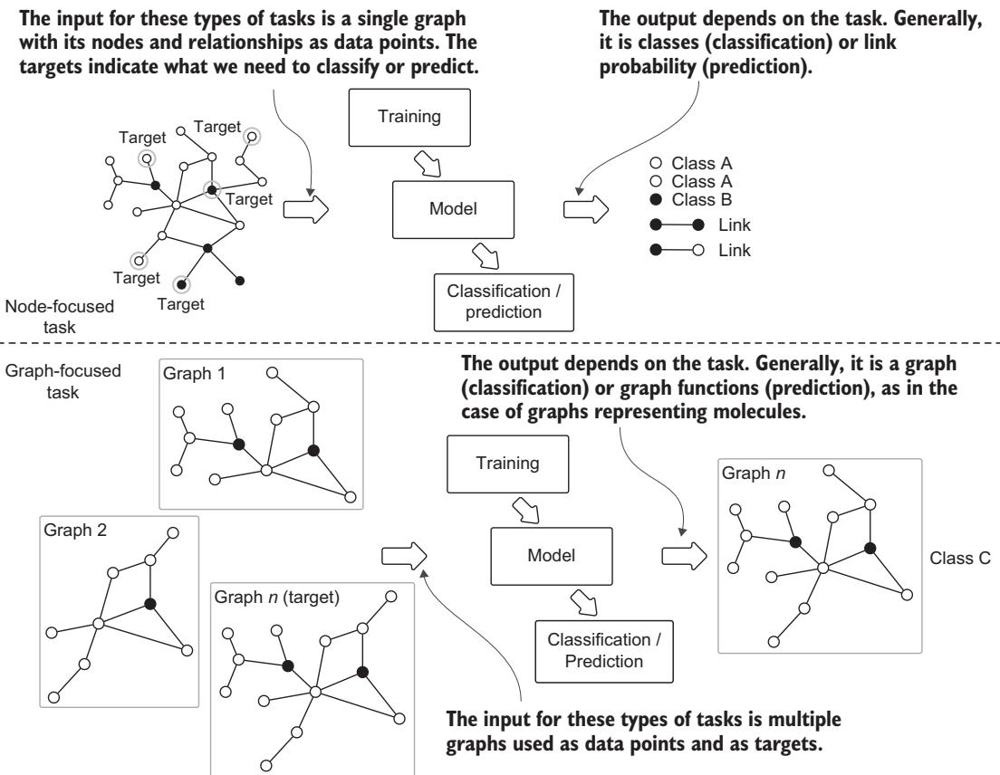
**그림 9.1** 노드 중심 과제와 그래프 중심 과제를, 훈련과 예측 단계에서 각각 기대되는 입력·출력의 관점으로 나타낸 것.

---

#### 9.2.1 노드 분류 — 개별 노드에 라벨을 붙이는 과제

수백만 명의 사용자를 거느린 소셜 네트워크를 운영한다고 상상해 봅시다. 이 사용자들 가운데 상당수가 봇(bot)입니다. 이 봇들을 탐지하는 일은 중요합니다. 봇은 네트워크 이용약관을 위반하거나, 가짜 뉴스를 퍼뜨리거나, 마케팅 캠페인의 무의미한 대상이 될 수 있기 때문입니다. 이들을 손으로 일일이 식별하는 것은 현실적으로 불가능합니다. 이상적으로는, 손으로 라벨을 붙인 소수의 예시만 주어졌을 때 사용자를 봇 혹은 정상 사용자로 구분해 주는 모델을 원할 것입니다. 이것이 바로 노드 분류 과제의 전형적인 예입니다.

노드 분류를 조금 더 형식적으로 적으면 이렇습니다. 그래프 $V$ 안의 라벨 없는 각 노드 $u$ 에 대해, 그 라벨 $y_{u}$ 를 예측하는 것이 목표입니다. 단, 우리에게 주어진 것은 $V$ 의 작은 부분집합인 훈련 노드 집합 $V_{\mathrm{train}}$ 위의 알려진 라벨들뿐입니다.

$$y_{u} , \quad V_{\mathrm{train}}$$

이 표기를 변수별로 풀어 보겠습니다.

1. $V$ — 그래프의 노드 전체 집합입니다. 여기서는 소셜 네트워크의 모든 사용자에 해당합니다.
2. $u$ — 그중 라벨이 아직 없는 개별 노드 하나입니다. 우리가 정체를 알고 싶은 사용자입니다.
3. $y_{u}$ — 노드 $u$ 에 대해 예측하려는 라벨입니다. 예컨대 "봇" 또는 "정상"입니다.
4. $V_{\mathrm{train}}$ — $V$ 의 작은 부분집합으로, 여기 속한 노드들은 정답 라벨이 이미 알려져 있습니다. 우리가 손으로 라벨링한 소수의 예시가 여기에 담깁니다.

노드 분류의 다른 예로는, 인터랙톰(interactome)에서 단백질의 기능을 분류하는 일 [4], 하이퍼링크나 인용 그래프를 근거로 문서의 주제를 분류하는 일 [5]이 있습니다. 노드 분류는 IAS를 구현할 때 식별과 의사결정을 돕는 강력한 도구입니다. 노드 분류의 주요 구성 요소와 단계는 그림 9.2에 정리되어 있습니다.

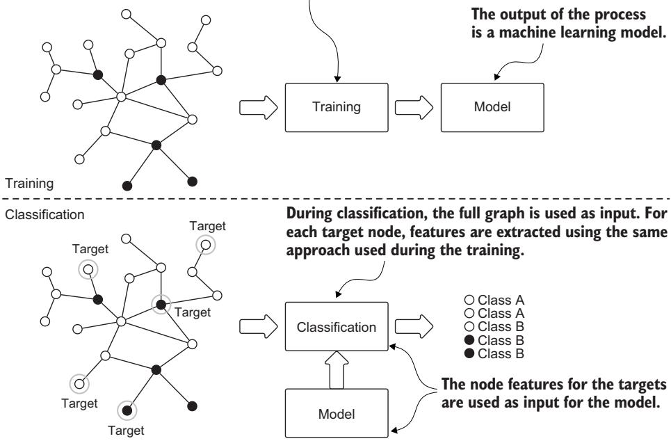
**그림 9.2** 노드 분류의 전형적인 흐름. 많은 지도 ML 과제가 그렇듯 훈련(training)과 예측(prediction)이라는 두 단계를 가지며, 여기서 예측은 곧 분류되지 않은 노드를 분류하는 일로 옮겨집니다.

언뜻 보면 노드 분류는 표준적인 지도 분류의 단순한 변형처럼 보입니다. 하지만 뚜렷한 차이가 있습니다. 무엇보다도, 그래프의 노드들은 서로 독립이고 동일하게 분포한다는 조건, 즉 **i.i.d.(independent and identically distributed, 독립 동일 분포)** 를 만족하지 않습니다. 보통 지도 ML 모델을 만들 때 우리는 각 데이터 점이 다른 모든 데이터 점과 통계적으로 독립이라고 가정합니다. 만약 그렇지 않다면 모든 입력 점 사이의 의존 관계를 명시할 필요가 생깁니다. 마찬가지로 우리는 데이터 점들이 동일하게 분포한다고 가정하는데, 그래야 모델이 보지 못한 데이터 점에도 잘 일반화되기 때문입니다. 그런데 노드 분류는 이 i.i.d. 가정을 산산조각 냅니다. i.i.d.인 데이터 점들의 집합을 모델링하는 대신, 우리는 서로 얽힌 노드들의 네트워크를 모델링하고 있는 것입니다.

훈련 단계는 그래프를 입력으로 받아, 그래프 구조·노드·관계 속성을 활용해 노드에 필요한 특징을 추출합니다. 즉 "이 노드가 어떤 노드인가"를 그 노드 자신뿐 아니라 주변 연결까지 함께 봐서 숫자로 요약하는 것입니다.

서로 다른 유형의 그래프는 i.i.d. 가정에 도전하는 다양한 관계 패턴을 보입니다. 소셜 네트워크에서는 **동종선호(homophily, 비슷한 것끼리 연결되려는 경향)** 가 이 상호연결성을 잘 보여 줍니다. 노드들은 관계를 통해 서로 영향을 주고받으며, 이웃과 관심사·속성·행동을 공유합니다 [6]. 이렇게 i.i.d. 가정이 깨진다는 것은, 좋은 모델이라면 예측할 때 노드 자신의 특징과 그 네트워크 관계를 함께 고려해야 함을 뜻합니다 [7]. 단백질 상호작용 네트워크에서는 **구조적 등가성(structural equivalence)** 이 중요해집니다. 이웃 구조가 비슷한 노드들은 기능적 성질도 비슷하게 공유하는 경향이 있기 때문입니다 [8]. 또 다른 패턴으로 **이종선호(heterophily)** 가 있는데, 여기서는 노드가 자신과 특성이 다른 노드와 연결되기를 선호합니다. 이 역시 현실 데이터가 얼마나 자주 i.i.d. 가정을 어기는지를 보여 줍니다. 이런 원리들은 노드를 독립적인 데이터 점으로 취급하는 방식이 왜 그래프에 담긴 풍부한 관계 정보를 담아내지 못하는지를 분명히 합니다. 성공적인 노드 분류는 노드의 속성과 그것들의 복잡한 상호의존 관계를 함께 모델링해야 합니다.

##### 노드 분류는 지도 학습인가, 비지도 학습인가?

이 물음은 원문에서 별도 박스로 다루는데, 답이 딱 떨어지지 않아 흥미롭습니다. 많은 연구자가 노드 분류를 **준지도 학습(semisupervised learning, 라벨 있는 데이터와 없는 데이터를 함께 쓰는 학습)** 이라고 봅니다 [9]. 노드 분류 모델을 훈련할 때, 우리는 보통 라벨이 없는 노드(예: 테스트 노드)까지 포함한 전체 그래프에 접근할 수 있기 때문입니다. 우리가 놓치고 있는 것은 오직 테스트 노드의 라벨뿐입니다.

그렇더라도 우리는 테스트 노드에 관한 정보(예: 그래프 안에서 그 노드의 이웃이 어떤지)를 훈련 중에 활용해 모델을 개선할 수 있습니다. 이것이 통상적인 지도 학습 상황과 다른 점입니다. 지도 학습에서는 라벨 없는 데이터 점이 훈련 중에 아예 관측되지 않으니까요.

훈련 중에 라벨 있는 데이터와 없는 데이터를 결합하는 모델을 통칭해 준지도 학습이라 부릅니다. 그래서 노드 분류에도 이 용어가 자주 쓰이는 것은 이해할 만합니다. 다만 한 가지 유의할 점이 있습니다. 준지도 학습의 표준적 정식화는 i.i.d. 가정을 요구하는데, 노드 분류에서는 그 가정이 성립하지 않습니다. 그래서 저자들도 이 정의를 놓고 여전히 고민한다고 솔직히 밝힙니다. 이 대목이야말로 그래프 위의 ML 과제가 고전적 범주에 왜 쉽게 들어맞지 않는지를 잘 보여 줍니다.

노드 분류는 한 노드에 여러 개의 라벨을 부여하는 형태로 확장될 수 있습니다. 예를 들어 이미지 호스팅 플랫폼인 Flickr(www.flickr.com)는 그래프와 **다중 라벨 노드 분류(multilabel node classification)** 를 이용해 사용자의 관심사를 다룹니다. Flickr는 사진을 호스팅할 뿐 아니라, 사용자들이 서로 팔로우할 수 있는 온라인 소셜 커뮤니티이기도 해서 이 연결로 하나의 네트워크가 형성됩니다. 게다가 Flickr 사용자는 관심 그룹을 구독할 수 있는데, 이 구독 정보는 사용자의 관심사를 나타내므로 사용자의 라벨로 쓸 수 있습니다. 한 사용자가 여러 그룹을 구독할 수 있으니, 각 사용자는 여러 개의 라벨과 연결될 수 있습니다. 그래프 위의 다중 라벨 노드 분류 문제는, 사용자가 아직 구독하지 않았지만 관심을 가질 만한 잠재 그룹을 예측하는 데 도움을 줍니다. Tang과 Liu [10]가 이런 Flickr 사용자 행동과 관련된 데이터셋을 제공합니다.

---

#### 9.2.2 링크 예측(관계 예측이라고도 함) — 노드 사이의 미래 연결을 맞히는 과제

**링크 예측(link prediction)** 은 그래프 기반 ML의 기본 과제 중 하나로, 노드들 사이에 앞으로 생길 법한 연결을 식별합니다. 여러 분야의 연구 논문을 담은 방대한 데이터베이스를 떠올려 봅시다. 의료(PubMed, https://pubmed.ncbi.nlm.nih.gov; MedRxiv, www.medrxiv.org), 코로나19 연구(CORD-19, https://mng.bz/JwGQ), 폭넓은 과학 연구(Web of Science, https://mng.bz/qRPz), 컴퓨터 과학(DBLP, https://dblp.org) 같은 것들 말입니다. 이런 소스로부터 우리는 **공저(co-authorship) 그래프** 를 만들 수 있습니다. 저자가 노드가 되고, 두 저자가 적어도 한 편의 논문을 함께 썼다면 그들 사이에 엣지(간선)를 놓는 식입니다. 이때 링크 예측 과제는, 아직 함께 일해 본 적 없는 저자들 사이에 앞으로 생길 법한 협업을 예측하는 것입니다.

이 예측적 접근은 법 집행이나 보안 응용 같은 다른 중요한 영역으로도 자연스럽게 확장됩니다. 그림 9.3은 전형적인 링크 예측 과제의 두 가지 주요 단계를 보여 줍니다.

현실의 많은 응용에서 그래프는 엣지가 빠져 있어 완전하지 않습니다. 이 불완전함은 대개 두 가지 이유 중 하나에서 옵니다. 첫째, 때로는 연결이 실제로 존재하지만 관측되거나 기록되지 않았거나 — 어떤 경우에는 네트워크의 핵심 인물들이 일부러 감춰 둔 것입니다. 둘째, 많은 그래프는 본래 계속 진화합니다. 예를 들어 학술 협업 그래프에서 저자는 새 논문을 쓰면서 언제든 다른 저자와 새 협업 관계를 맺을 수 있습니다. 이렇게 빠져 있는 엣지를 추론하거나 예측하는 일은 여러 IAS에 도움이 됩니다. 친구 추천 [11, 12], 상품 추천, KG 완성(completion) [13], 약물 부작용 예측 [14], 관계형 데이터베이스에서 새로운 사실 추론 [15], 단백질-단백질 상호작용 발견 [16], 범죄 정보 분석 [17] 등 무수히 많습니다.

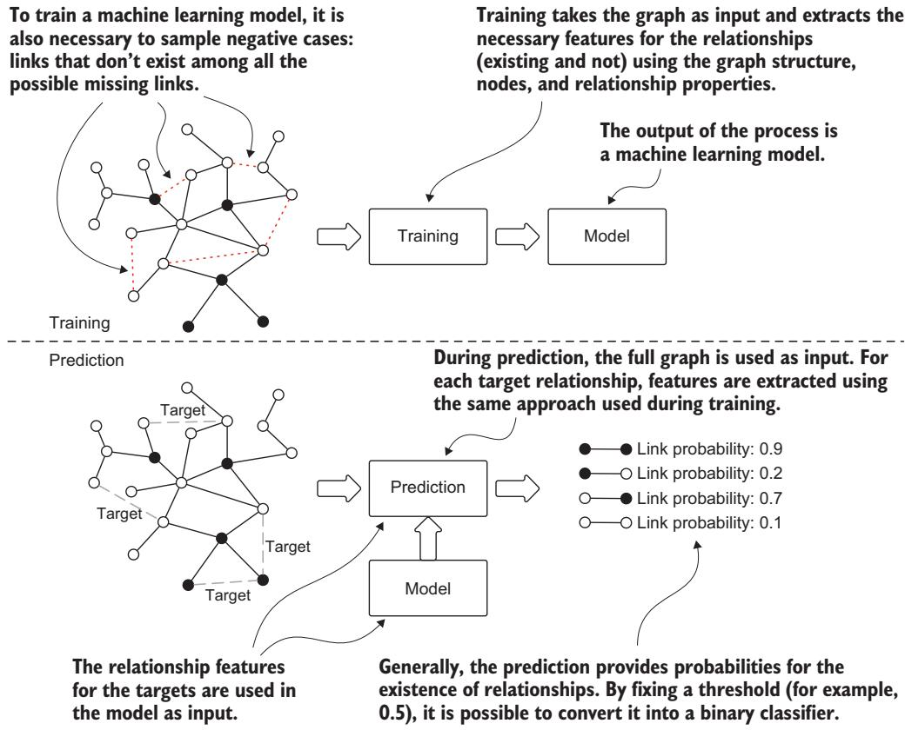
**그림 9.3** 전형적인 링크 예측 흐름. 두 단계로 이루어집니다. 훈련 단계에서는 그래프를 입력으로 받아, 어떤 링크가 존재하는지 판별하도록 모델을 훈련합니다. 예측 단계에서는 예측 대상 관계를 이루는 각 노드 쌍마다 모델이 출력을 내놓는데, 각 쌍에 대해 그 관계가 존재할 확률을 제공합니다.

##### 링크 예측 과제를 부르는 여러 이름

이 과제는 응용 분야에 따라 링크 예측, 그래프 완성(graph completion), 관계 추론(relational inference) 등 여러 이름으로 불립니다. **링크 예측** 은 보통 두 노드 사이에 연결이 존재하는지를 예측하는 데 초점을 둡니다. 이때 관계의 유형은 일관되게 동일하고 미리 정해져 있습니다. 반면 **관계 예측(relationship prediction)** 이라는 용어는 연결의 존재뿐 아니라 그 관계의 유형까지 짚어내고자 할 때 주로 씁니다. 이 책에서는 두 용어를 서로 바꿔 가며 쓰겠습니다.

노드 분류와 마찬가지로, 링크 예측도 대개 준지도 학습 과제로 접근합니다. 특정 노드 쌍 사이의 링크가 빠져 있더라도, 우리는 기존에 존재하는 연결의 예시와 노드 수준의 풍부한 정보를 함께 활용해 잠재적 관계를 예측할 수 있습니다. 이 준지도적 성격 덕분에, 그래프 구조에서 알려진 패턴과 노드 속성을 함께 써서 빠져 있거나 앞으로 생길 법한 연결을 추론할 수 있습니다.

---

#### 9.2.3 군집화와 커뮤니티 탐지 — 촘촘하게 뭉친 무리를 찾는 과제

이전 절에서 언급한 소스들 가운데 하나에서 연구 논문 목록을 얻었다고 상상해 봅시다. 여러분은 함께 논문을 쓴 연구자들을 잇는 협업 그래프를 만듭니다. 이 네트워크를 들여다보면, 모두가 서로 협업할 확률이 똑같은 촘촘한 "털 뭉치(hairball)"를 보게 될 가능성은 낮습니다. 오히려 그래프는 연구 분야·소속 기관·지리적 요인 같은 요소로 묶인 뚜렷한 노드 군집들로 나뉘어 있을 것입니다. 같은 대학의 두 연구자가 협업할 성향은 멀리 떨어진 동료들끼리보다 더 높습니다. 마찬가지로 같은 분야의 두 연구자는 무관한 영역보다 그 분야의 다른 연구자를 인용할 가능성이 더 큽니다. 이런 자연스러운 군집 행동이 **커뮤니티 탐지(community detection)** 알고리즘의 이론적 토대를 이룹니다. 커뮤니티 탐지는 네트워크 구조 안에 내재된 이런 무리를 찾아내는 것을 목표로 합니다(그림 9.4 참고).

커뮤니티 탐지는, 네트워크의 나머지 부분과의 연결에 비해 내부 연결이 더 촘촘한 노드 무리를 식별합니다. 커뮤니티 내부의 실제 엣지 밀도와 기대 엣지 밀도의 차이를 최적화함으로써 **모듈성(modularity)** 을 극대화합니다. 쉽게 말해, "안쪽은 빽빽하고 바깥과는 성긴" 무리를 최대한 잘 갈라내는 것입니다.

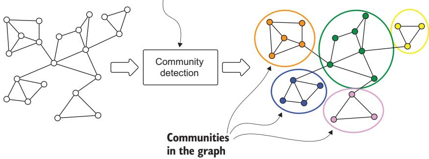
**그림 9.4** 커뮤니티 탐지의 흐름. 입력은 그래프이고, 출력은 노드와 그룹 사이의 대응 관계입니다(그림에서 원으로 묶인 부분).

커뮤니티 탐지는 오직 네트워크의 위상(topology)과 관계만을 이용해 그래프에 숨어 있는 잠재적 그룹 구조를 드러냅니다. 이 과제는 현실 세계의 다양한 응용을 가집니다. 유전자 상호작용 네트워크에서 기능적 모듈을 식별하는 일 [18]부터, 금융 거래 네트워크에서 사기 사용자 무리를 탐지하는 일 [19]까지 이릅니다.

그래프 군집화의 가장 강력한 응용 중 하나는 **그래프 기술(description)과 요약(summarization)** 입니다. 촘촘하게 연결된 영역을 식별함으로써, 군집화는 네트워크의 구성에 대한 더 높은 수준의 조망을 제공합니다. 이 능력은 직접 시각화하거나 손으로 전부 분석하기가 불가능한 대규모 그래프를 다룰 때 특히 값집니다. 복잡한 네트워크 관계에 대한 구조적 요약을 효과적으로 제공해 주기 때문입니다.

##### 커뮤니티 탐지 과제를 부르는 여러 이름

네트워크 분석에서 커뮤니티 탐지와 그래프 군집화(graph clustering)라는 용어는 서로 바꿔 쓰이는 경우가 많습니다. 하지만 이들은 K-means나 DBSCAN 같은 전통적 군집화 알고리즘과는 근본적으로 다릅니다. **K-means** 는 $n$ 개의 데이터 점을 $k$ 개의 군집으로 나누는데, 각 점을 가장 가까운 군집 중심(centroid)에 반복적으로 배정하고 그 중심을 갱신하는 식으로 작동합니다. 이때 $k$ 는 미리 지정해야 합니다. **DBSCAN(density-based spatial clustering of applications with noise, 잡음이 있는 응용을 위한 밀도 기반 공간 군집화)** 은 서로 가까이 빽빽하게 모인 점들(주변에 이웃이 많은 점들)을 함께 묶고, 밀도가 낮은 영역의 점들은 이상치(outlier)로 표시합니다. DBSCAN은 군집 개수를 미리 정해 줄 필요가 없습니다.

핵심 차이는 데이터 구조에 있습니다. 전통적 군집화 알고리즘은 벡터 공간 안의 독립적인 데이터 점을 다루는 반면, 그래프 군집화는 노드 사이의 관계가 그룹 소속을 결정하는 데 결정적인, 서로 얽힌 데이터를 다룹니다. 이 책에서는 두 용어를 서로 바꿔 쓰겠습니다. 그래프에 적용할 때 이들은 같은 과제를 가리키기 때문입니다.

그래프 군집화는 일반적으로 비지도 학습입니다. 커뮤니티 구조를 찾는 데 미리 라벨링된 정보가 필요 없습니다. 다만 **라벨 전파(label propagation)** [20] 같은 일부 군집화 접근은 기존 라벨을 반영해 커뮤니티 배정을 이끌 수 있어, 그래프 분석에서 지도 학습과 비지도 학습 사이의 간극을 메워 줍니다.

앞선 세 알고리즘(노드 분류, 링크 예측, 커뮤니티 탐지)은 모두 노드 중심 과제에 속합니다. 다음으로는 그래프 중심 과제 하나를 살펴보겠습니다.

---

#### 9.2.4 그래프 분류 — 그래프 하나 전체에 라벨을 붙이는 과제

화학 분자의 독성과 용해도를 예측하는 과제를 생각해 봅시다. 이런 성질은 개별 원자만으로 결정되는 것이 아니라, 그 원자들이 어떻게 연결되어 분자를 이루는지에서 함께 비롯됩니다. 우리는 각 분자를 하나의 그래프로 표현할 수 있습니다. 원자가 노드가 되고 화학 결합이 엣지가 되는 식입니다 [21]. 이 그래프 표현 덕분에 우리는 **그래프 분류(graph classification)** 기법을 적용해 여러 분자 성질을 동시에 예측할 수 있습니다. 그림 9.5에서 보듯, 그래프 분류는 원자 구성과 구조적 패턴을 체계적으로 분석해, 용해도나 독성 같은 성질을 근거로 아직 라벨이 없는 분자를 범주화할 수 있습니다.

노드 분류가 하나의 그래프 안에서 개별 노드의 라벨을 예측하는 반면, 그래프 분류는 여러 개의 독립적인 그래프를 담은 데이터셋을 다룹니다. 각 그래프가 (분자 같은) 하나의 완전한 표본을 나타냅니다. 그래프 분류에서 각 그래프는 자신의 라벨을 지닌 i.i.d. 데이터 점이 됩니다. 예를 들어 "이 분자가 독성이 있는가"가 그 라벨입니다. 여기서는 그래프끼리 서로 독립이므로, 9.2.1에서 깨졌던 i.i.d. 가정이 다시 성립한다는 점이 흥미롭습니다.

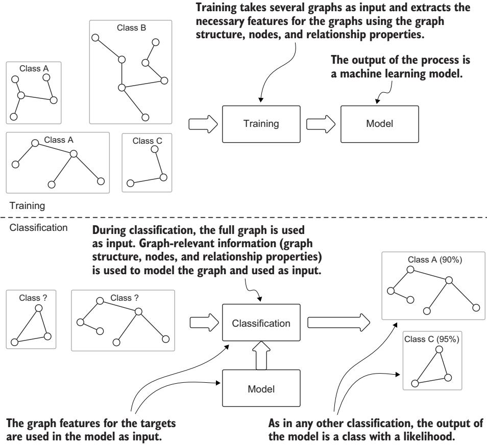
**그림 9.5** 그래프 분류의 흐름. 많은 지도 과제가 그렇듯 두 단계를 가집니다. 훈련 단계에서는 관련 클래스가 달린 여러 그래프를 학습해 각각의 클래스를 알아보도록 하고, 예측 단계에서는 모델이 어떤 그래프의 클래스를 예측합니다.

그래프 분류의 목표는, 라벨이 달린 그래프들의 훈련 집합을 이용해 "그래프 하나 전체 → 그에 연결된 라벨"로 가는 매핑을 학습하는 것입니다. 비슷하게, 그래프 수준의 그래프 군집화는 전통적 비지도 군집화를 확장해 노드가 아니라 그래프 하나 전체를 범주화합니다. 이런 그래프 수준 과제의 가장 큰 난관은, 각 그래프의 내부 구조와 그 구성 요소의 성질을 함께 효과적으로 포착하는 특징을 개발하는 데 있습니다.

그래프 군집화는 IAS를 비롯해 현실 세계의 여러 응용을 가집니다. 예를 들어 효소(enzyme)는 단백질의 한 종류입니다. 단백질은 그래프로 표현될 수 있는데, 아미노산이 노드가 되고, 두 노드가 일정 거리보다 가까우면 그 사이에 엣지를 놓는 식입니다. 훈련이 끝나면, 어떤 단백질이 주어졌을 때 그래프 분류 알고리즘은 그것이 효소인지를 예측할 수 있습니다. 또 다른 예는 악성코드 분류기입니다. 이 경우 과제는, 어떤 컴퓨터 프로그램의 구문(syntax)과 데이터 흐름을 그래프로 표현한 것을 분석해 그 프로그램이 악의적인지 탐지하는 분류 모델을 만드는 것입니다 [22].

---

### 9.3 그래프 위의 머신러닝: 어떻게? — 전용 알고리즘이냐, 특징 공학이냐

여기까지 왔으니 우리는 그래프 위의 ML이 왜 별개의 연구 갈래로 떠올랐는지, 그리고 이 알고리즘들이 어떤 복잡함을 다룰 수 있는지를 이해하게 되었습니다. 이제 구현 선택지를 살펴봅니다. 일반적으로 해법은 두 방향으로 개발할 수 있습니다(그림 9.6에 요약). 첫 번째 접근은 **집단 분류(collective classification)** [23] 처럼 그래프를 위해 특별히 설계된 알고리즘을 씁니다. 이런 전용 알고리즘은 그래프 구조를 직접 처리하며, 노드의 특징과 이웃 관계를 동시에 고려해 예측합니다. 두 번째 접근은 그래프 문제를 전통적 ML 과제로 변환합니다. 그러기 위해 먼저 그래프 구조를 특징 벡터(feature vector)로 바꿉니다. 이 **특징 공학(feature engineering)** 단계를 거치면, 현대 딥러닝 기법을 포함한 기존 ML 알고리즘 생태계 전체를 활용할 수 있습니다. 그러면 주된 난관은 노드·엣지·(그래프 분류의 경우) 그래프 구조 전체의 본질적 특성을 담아내는 적절한 특징을 정의하는 문제로 옮겨 갑니다.

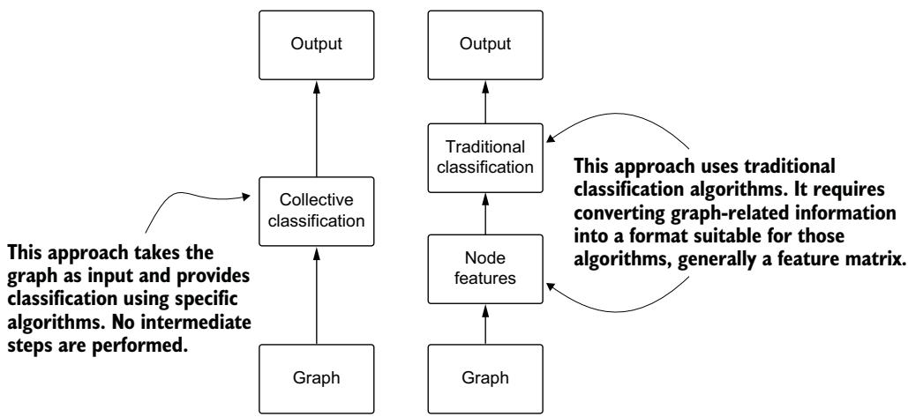
**그림 9.6** 그래프 기반 분류 접근(집단 분류) 대 분류를 위한 전통적 알고리즘.

책의 이 부분에서는 그래프를 위한 특징 공학에 초점을 둡니다. 먼저 수동 특징 추출 방법을 살펴보며 그것이 얼마나 철저한지, 동시에 얼마나 지루한 작업인지를 보여 줍니다. 그다음 반자동 접근으로 나아가고, 마지막에는 자동 특징 학습의 강력한 해법으로서 GNN에 뛰어듭니다. GNN은 구조적 패턴과 노드 성질을 함께 포착하는 데 뛰어나, 특히 불완전한 KG에 유용합니다. 우리는 GNN이 어떻게 의미 있는 벡터 임베딩을 만들어 내는지, 그리고 그 임베딩이 (예컨대 노드 분류 같은) 하위 ML 과제에 어떻게 직접 도움이 되도록 그래프 지식을 담아내는지를 살펴볼 것입니다.

---

#### 9.3.1 노드 분류와 링크 예측 — 특징화부터 로지스틱 회귀까지, 실제 코드로

그림 9.7은 노드 분류와 링크 예측의 높은 수준 훈련 과정을 보여 줍니다. 이 훈련의 결과로 예측 모델이 만들어집니다. 이 모델은 훈련 단계의 출력이자 다음 단계의 입력이 됩니다. 그림 9.8은 예측 과정의 단계들을 보여 주는데, 여기서는 기존 노드와 관계를 받아 클래스와 빠진 링크를 예측합니다.

**참고**  훈련 중에 쓴 특징화(featurization) 과정은 예측을 할 때 쓰는 것과 반드시 같아야 합니다. 그렇지 않으면 예측 단계가 올바르게 작동하지 않습니다.

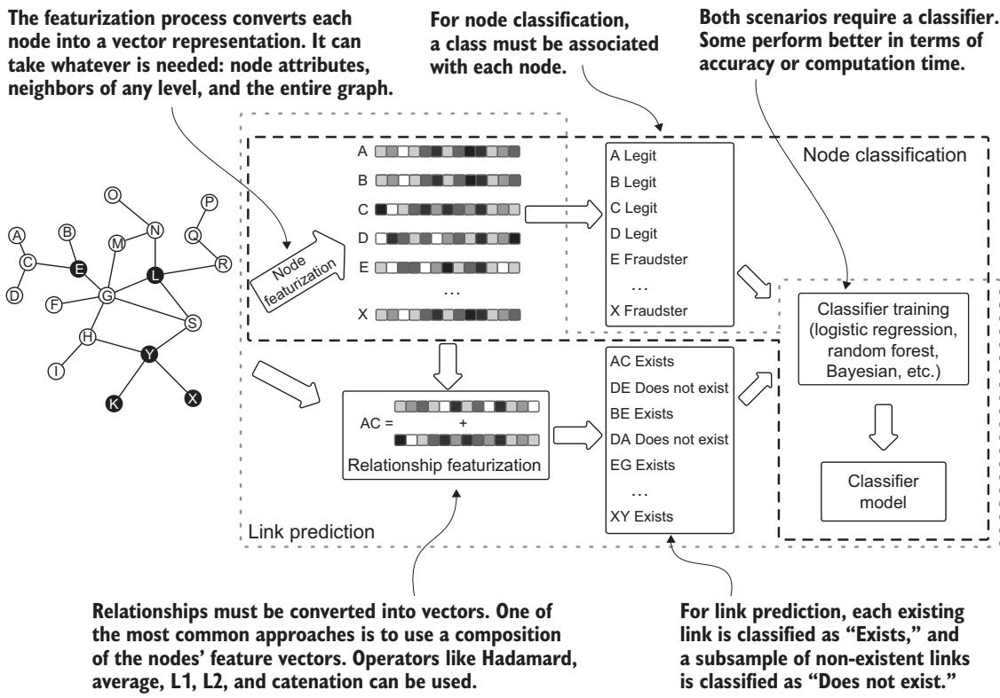
**그림 9.7** 노드 분류와 링크 예측의 훈련 흐름. 결정적인 단계는 노드와 관계의 특징화입니다. 이 과정이 끝나면 벡터를 고전적 알고리즘에 넘길 수 있습니다. 노드 분류와 링크 예측 모두 분류 과제로 볼 수 있습니다.

이제 이 원리들을 간단한 예제로 실천해 봅시다. 어떤 네트워크의 노드를 분류하고 싶다고 해 봅시다. 학습 목적에 맞게, 우리는 작은 그래프를 씁니다. 바로 그 유명한 **자카리 가라테 클럽(Zachary Karate Club)** [24] 입니다. 이 그래프는 어느 가라테 클럽 34명 회원 사이의 관계를 기록한 것으로, 클럽 밖에서의 회원 간 상호작용을 추적합니다. 관리자 "John A"와 사범 "Mr. Hi"(둘 다 가명) 사이의 분쟁으로 클럽은 두 파벌로 갈라졌습니다.

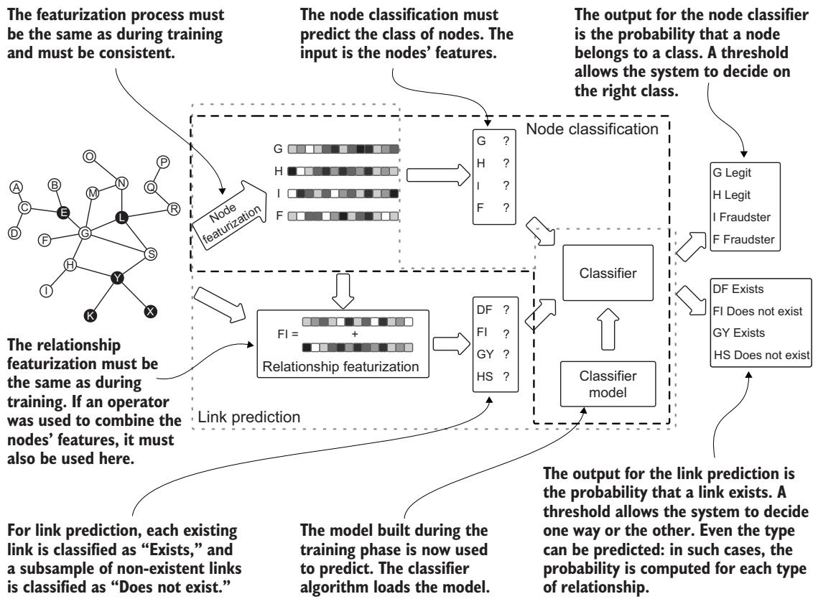
**그림 9.8** 노드 분류와 링크 예측의 예측 흐름. 특징화 과정은 훈련 때와 같아야 합니다. 앞서 만들어 둔 분류기 모델이 이 단계에서 예측에 사용됩니다.

클럽이 갈라진 뒤, 각 회원(노드로 표현)은 사범의 새 클럽(Mr. Hi) 쪽에 붙거나 관리자의 원래 클럽(John A)에 남았습니다. 이 실제 결과가 우리에게 **정답 라벨(ground-truth label)** 을 줍니다. 각 노드는 그 회원이 결국 어느 클럽에 합류했는지에 따라 라벨이 붙습니다. 우리의 노드 분류 과제는, 분열 이전에 존재했던 친구 관계 네트워크 구조만으로 이 클럽 소속을 예측하는 것입니다. 네트워크 패턴이 어떻게 사회적 행동을 예측할 수 있는지를 보여 주는 셈입니다. 우리는 그림 9.7과 9.8에서 그린 전체 흐름을, 간단한 코드로 설명해 나가겠습니다.

먼저 네트워크를 들여다본 다음 분석해 봅시다. 이 예제에서는 아무것도 Neo4j에 저장하지 않습니다. 네트워크가 아주 작고, 여러 네트워크 분석 도구에 기본 내장되어 있기 때문입니다. 우리가 사용할 도구인 Networkx(https://networkx.org)에도 바로 들어 있습니다. 다음 리스팅은 필요한 패키지를 임포트하고 가라테 클럽 그래프를 불러오는 방법을 보여 줍니다.

```python
# 리스팅 9.1  가라테 클럽 네트워크 만들기와 그리기
import networkx as nx
import matplotlib.pyplot as plt

# 가라테 클럽 그래프를 불러옵니다.
G = nx.karate_club_graph()
draw_and_save_graph_picture(G)

# 그래프를 화면에 표시하고 PNG·SVG 형식으로 저장합니다.
def draw_and_save_graph_picture(G):
    set_club_colors(G)
    layout_position = nx.spring_layout(G, k=8 / math.sqrt(G.order()))
    colors = [n[1]['color'] for n in G.nodes(data=True)]
    nx.draw_networkx(G, pos=layout_position, node_color=colors)
    plt.axis('off')
    plt.savefig("Karate_Graph.svg", format="SVG", dpi=1000)
    plt.savefig("Karate_Graph.png", format="PNG", dpi=1000)
    plt.show()

# 각 노드 그룹에 색을 배정합니다.
def set_club_colors(G):
    for node in G.nodes(data=True):
        color = '#00fff9'
        if node[1]['club'] == 'Mr. Hi':
            color = '#e6e6fa'
        node[1]['color'] = color
```

이 코드를 조금 풀어 보겠습니다. `nx.karate_club_graph()` 가 34개 노드짜리 가라테 클럽 그래프를 곧바로 만들어 줍니다. `draw_and_save_graph_picture` 는 노드마다 소속 클럽에 따라 색을 칠하고(`set_club_colors`), 스프링 레이아웃으로 노드 위치를 잡은 뒤 그림을 화면에 띄우고 SVG·PNG로 저장합니다. `set_club_colors` 는 각 노드의 `club` 속성이 'Mr. Hi'인지 아닌지를 보고 두 가지 색 중 하나를 부여합니다.

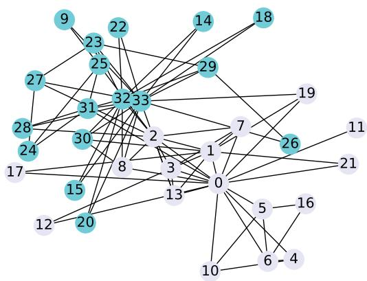
**그림 9.9** 리스팅 9.1의 코드로 만들어진 가라테 클럽 그래프. 노드의 음영은 그 회원이 결국 합류한 클럽을 나타냅니다.

그 결과 만들어진 네트워크가 그림 9.9입니다. 노드는 두 가지 음영으로 나뉘어, 분열 이후 각 회원이 결국 합류한 클럽을 나타냅니다.

그림 9.7과 9.8에서 설명했듯, 첫 단계는 각 노드의 벡터 표현을 만드는 것입니다. 이 벡터가 훈련과 예측 동안 분류 알고리즘의 입력으로 쓰입니다. 정교한 임베딩 기법은 10장과 11장에서 자세히 살펴보겠습니다. 여기서는 단순한 접근으로 시작합니다. 각 노드를 그 **차수(degree, 그 노드가 다른 노드와 맺은 연결의 개수)** 로 표현하는 것입니다. 이 특징은 네트워크 안에서 한 노드가 얼마나 연결되어 있는지를 담아냅니다. 다음 리스팅은 그래프 안 각 노드의 차수를 계산합니다.

```python
# 리스팅 9.2  각 노드를 그 차수로 표현하기
# 각 노드의 임베딩을 계산합니다.
def compute_degree_embeddings(G):
    embeddings = np.array(list(dict(G.degree()).values()))
    embeddings = [[i] for i in embeddings]  # 리스트의 각 원소를 단일 값 임베딩으로 변환
    return embeddings
```

여기서 `G.degree()` 는 각 노드의 차수를 돌려주고, 그 값들을 배열로 모은 뒤 `[[i] for i in embeddings]` 로 각 값을 원소 하나짜리 벡터(예: `[3]`)로 감쌉니다. 임베딩은 결국 "숫자의 리스트"여야 하니, 차수 하나만 쓰더라도 벡터 형태로 만들어 두는 것입니다.

##### 연습 문제

이 기법은 기초적이지만, 노드의 차수만으로는 우리 목표(어느 클럽인지 맞히기)에 큰 도움이 되지 않을 수 있습니다. 연습 삼아, 다른 두 지표를 써 보세요. Mr. Hi의 이웃들의 차수와 John A의 이웃들의 차수입니다. 이 지표들은 알고리즘이 어떤 노드가 어느 그룹에 속하는지 분별하는 데 더 많은 통찰을 줍니다. 해답은 이 장 뒤에서 보여 드립니다.

GNN이 등장하기 전, **Node2Vec** [25] 은 순전히 네트워크 구조만으로 노드 임베딩을 계산하는 자율적 표현 학습의 대표적 기법이었습니다. 다음 리스팅은 Node2Vec 알고리즘으로 이런 구조 인식 노드 임베딩을 생성하는 방법을 보여 줍니다.

##### 리스팅 9.3 Node2Vec을 임베딩 기법으로 사용하기

```python
def compute_complex_embeddings(G):
    node2vec = Node2Vec(
        G,
        dimensions=64,
        walk_length=30,
        num_walks=200,
        workers=4,
        seed=0)  # Node2Vec 라이브러리 생성자가 확률을 미리 계산하고 랜덤 워크를 생성합니다.
    model = node2vec.fit(
        window=10,
        min_count=1,
        batch_words=4,
        seed=0)  # 임베딩을 계산합니다.
    embeddings = [model.wv.get_vector(i) for i in G.nodes]
    return embeddings
```

이 코드는 다음 일을 합니다.

1. Node2Vec을 초기화하면서, 각 노드를 64차원 벡터로 표현하도록 지정합니다. 알고리즘은 그래프를 따라 200번의 랜덤 워크(random walk)를 수행하고, 각 워크는 노드 30개를 방문합니다. 효율을 위해 네 개의 병렬 프로세스를 쓰고, 랜덤 시드로 결과의 재현성을 보장합니다.
2. 모델은 Word2Vec에서 영감을 받은 파라미터로 훈련됩니다. 각 워크 시퀀스에서 앞뒤로 10개의 노드를 고려하고, (한 번만 방문된 노드까지 포함해) 모든 노드를 훈련에 넣으며, 단어를 작은 배치로 처리합니다.
3. 그래프 안 각 노드에 대해 학습된 임베딩을 뽑아, 벡터 표현의 리스트를 돌려줍니다. 이때 각 벡터는 네트워크 안에서 그 노드의 구조적 역할을 담습니다. 이 임베딩은 노드 분류나 링크 예측 같은 하위 ML 과제의 입력 특징으로 쓸 수 있습니다.

여기서 한 가지 짚어 둘 점이 있습니다. Node2Vec은 랜덤 워크로 "노드 근처를 산책하며 이웃 문맥"을 배우는데, 이는 언어 모델이 문장 속 단어의 앞뒤 문맥으로 단어 의미를 배우는 방식과 꼭 닮았습니다. 그래서 파라미터 이름(`window`, `batch_words` 등)도 Word2Vec의 것과 비슷합니다.

리스팅 9.2와 9.3은 그래프 전체에 대해 임베딩을 계산합니다. 따라서 훈련 집합용과 예측용을 따로 계산할 필요가 없습니다. 다음 리스팅은 로지스틱 회귀를 분류기로 쓰는 훈련 함수의 예를 보여 줍니다.

```python
# 리스팅 9.4  훈련 함수
# node_embeddings 는 각 행이 한 노드의 벡터 표현(임베딩)을 담은 행렬입니다.
# node_labels 는 각 노드의 클래스 라벨을 담은 벡터로, node_embeddings 와 정렬되어 있습니다.
def train(self, train_dataset):
    node_embeddings = train_dataset.embeddings.values.tolist()
    node_labels = train_dataset.label.values.tolist()
    # 임베딩을 표준화해 평균 0, 분산 1이 되도록 합니다.
    self.scaler = StandardScaler().fit(node_embeddings)
    scaled_embeddings = self.scaler.transform(node_embeddings)
    # 교차 검증으로 파라미터를 자동 튜닝하는 로지스틱 회귀 분류기를 초기화합니다.
    clf = LogisticRegressionCV(
        random_state=0,
        solver='liblinear',
        multi_class='ovr',
        max_iter=1000)
    # 표준화된 임베딩과 그에 대응하는 라벨로 분류기를 훈련합니다.
    self.model = clf.fit(scaled_embeddings, node_labels)
```

이 훈련 과정은 두 가지 중요한 ML 개념을 소개합니다. **특징 표준화(feature standardization)** 와 **로지스틱 회귀(logistic regression)** 입니다. 특징 표준화는 서로 다른 척도(scale)로 움직이는 여러 노드 특징을 다룰 때 꼭 필요합니다. 우리 예제에서 노드 차수는 한 자릿수부터 수천까지 이를 수 있고, 다른 지표들은 또 다른 척도로 움직입니다. `StandardScaler` 로 모든 특징을 평균 0, 분산 1이 되도록 변환하면, 각 특징이 원래 척도와 무관하게 모델의 결정에 비례하는 만큼 기여하게 됩니다.

##### 특징 스케일링이 중요한 이유

ML 알고리즘은 데이터 점 사이의 **유클리드 거리(Euclidean distance)** 계산에 의존하는 경우가 많습니다. 적절한 스케일링 없이는 수치 범위가 큰 특징이 이 계산을 지배해 버립니다. 그 특징이 실제로 얼마나 중요한지와는 상관없이 말입니다. 예를 들어 노드 차수가 1부터 1,000까지, 중심성(centrality) 지표는 0부터 1까지 움직인다면, 거리 기반 계산에서 차수가 중심성의 영향을 압도해 버립니다. 이렇게 되면 모델이 특징의 예측력이 아니라 단지 그 척도 때문에 그 특징에 지나치게 민감해져, 편향된 예측과 낮아진 정확도로 이어질 수 있습니다.

로지스틱 회귀는 이름과 달리 분류 알고리즘으로, 이진 예측 과제에 특히 뛰어납니다 [25]. 여기서는 한 노드가 특정 클래스에 속할 확률을 추정합니다. 알고리즘은 특징들의 선형 결합을, 로지스틱 함수를 써서 0과 1 사이의 확률로 변환합니다. 그래서 우리의 노드 분류 과제에 안성맞춤입니다. 예컨대 가라테 클럽 예제에서는, 각 회원이 사범의 클럽 또는 관리자의 클럽에 합류할 확률을 예측합니다.

```python
G = nx.karate_club_graph()
draw_and_save_graph_picture(G)
```

이 구현은 우리 접근의 핵심 장점을 하나 보여 줍니다. 임베딩과 적절한 스케일링을 거쳐 그래프 데이터를 특징 벡터로 바꾸면, 이미 잘 확립된 ML 알고리즘을 그대로 쓸 수 있다는 것입니다. 다음 리스팅에서 보듯, 이어지는 평가 단계는 따로 떼어 둔 테스트 노드 집합에 대해 예측 라벨과 실제 결과를 비교함으로써 이 모델의 정확도를 시험합니다.

```python
# 리스팅 9.5  평가 함수
# test_embeddings 는 각 행이 한 테스트 노드의 벡터 표현을 담은 행렬입니다.
# true_labels 는 테스트 노드의 클래스 라벨을 담으며, test_embeddings 와 정렬되어 있습니다.
def evaluate(self, test_dataset):
    test_embeddings = test_dataset.embeddings.values.tolist()
    true_labels = test_dataset.label.values.tolist()
    # 훈련 데이터에 맞춰진 동일한 스케일러로 테스트 임베딩을 표준화합니다.
    scaled_test_embeddings = self.scaler.transform(test_embeddings)
    # 훈련된 모델로 각 테스트 노드의 클래스 라벨을 예측합니다.
    predicted_labels = self.model.predict(scaled_test_embeddings)
    print("True labels:\t\t", true_labels)
    print("Predicted labels:\t", list(predicted_labels))

    # 성능 지표 계산
    # 예측 라벨과 실제 라벨을 비교해 정밀도·재현율·F1 점수를 계산합니다.
    metrics = precision_recall_fscore_support(true_labels,
        predicted_labels, average='weighted')
    print('Precision:', metrics[0], 'Recall:', metrics[1], 'f-score:',
        metrics[2])
    # 클래스별 예측 정확도를 시각화하는 혼동 행렬을 생성합니다.
    conf_matrix = confusion_matrix(true_labels, predicted_labels)
    print("Confusion Matrix:\t", conf_matrix)
```

한 가지 꼭 지킬 점이 있습니다. 테스트 임베딩을 표준화할 때는 훈련 데이터에 맞춰 학습해 둔 바로 그 스케일러(`self.scaler`)를 그대로 써야 합니다. 테스트 데이터로 스케일러를 새로 맞추면 훈련 때와 다른 변환이 적용되어 예측이 어긋나기 때문입니다. 이 함수는 예측 모델의 품질을 평가하는 데 유용합니다. 우리 예제는 아주 작은 네트워크에 라벨도 둘뿐이지만, 이 코드는 더 큰 그래프와 여러 라벨에도 그대로 작동합니다.

이제 우리는 노드 분류 과제의 훈련과 평가를 수행할 재료를 모두 갖췄습니다. 리스팅 9.6은 앞선 리스팅들의 구성 요소(함수)를 모두 써서 결과를 출력합니다. 한 임베딩에서 다른 임베딩으로 바꾸는 것은, 원하는 임베딩 함수를 주석 처리하거나 주석을 푸는 것만으로 됩니다.

##### 리스팅 9.6 노드 분류 전체 과정

```python
# 각 노드의 라벨을 가져와, 소속 그룹에 따라 0 또는 1을 부여합니다.
labels = np.asarray([G.nodes[i]['club'] != 'Mr. Hi' for i in G.nodes]).astype(np.int64)

# 시험할 임베딩을 선택합니다. 원하는 쪽의 주석을 풀어 쓰면 됩니다.
# embeddings = compute_degree_embeddings(G)
embeddings = compute_complex_embeddings(G)

# nodeId, 전체 임베딩, 노드 라벨을 담은 DataFrame 을 만듭니다.
df = pd.DataFrame({
    'nodeId': G.nodes,
    'embeddings': embeddings,
    'label': labels
})

# 데이터셋을 무작위로 나눠 DataFrame 을 훈련용·테스트용 둘로 분할합니다.
train, test = train_test_split(df, test_size=0.4, random_state=0)
classifier = EvaluateEmbedding()
# 함수들을 호출해 모델을 만들고 평가합니다.
classifier.train(train)
classifier.evaluate(test)
```

`labels` 를 만드는 부분을 자세히 보면, `G.nodes[i]['club'] != 'Mr. Hi'` 는 그 노드가 Mr. Hi 그룹이 아니면 `True`, 맞으면 `False`가 되고, `astype(np.int64)` 로 이를 1과 0으로 바꿉니다. `train_test_split(..., test_size=0.4)` 는 전체의 40%를 테스트로 떼어 놓습니다. 임베딩을 바꾸고 싶으면 위쪽 두 줄에서 주석을 옮기기만 하면 됩니다.

두 가지 임베딩 기법으로 코드를 실행하면, 다음 리스팅에서 서로 다른 결과를 볼 수 있습니다.

##### 리스팅 9.7 두 임베딩에 대한 결과

```text
차수(degree)를 이용한 더 단순한 임베딩의 결과
Gold:      [0, 1, 1, 0, 0, 1, 1, 0, 0, 1, 1, 1, 1, 0]
Predicted: [1, 1, 0, 1, 0, 1, 0, 1, 0, 0, 0, 0, 1, 0]
Precision: 0.44642857142857145
Recall:    0.42857142857142855
f-score:   0.42857142857142855
Confusion Matrix: [[3 3]
                   [5 3]]
# 첫 번째 실행의 혼동 행렬: 참 음성 3(좌상), 거짓 양성 3(우상),
# 거짓 음성 5(좌하), 참 양성 3(우하)

Node2Vec 을 이용한 더 복잡한 임베딩의 결과
Gold:      [0, 1, 1, 0, 0, 1, 1, 0, 0, 1, 1, 1, 1, 0]
Predicted: [0, 0, 0, 1, 1, 1, 1, 0, 0, 0, 1, 1, 1, 0]
Precision: 0.6530612244897959
Recall:    0.6428571428571429
f-score:   0.6446886446886447
Confusion Matrix: [[4 2]
                   [3 5]]
# 두 번째 실행의 혼동 행렬: 참 음성 4, 거짓 양성 2,
# 거짓 음성 3, 참 양성 5
```

여기서 몇 가지 용어를 짚어 둡니다. **혼동 행렬(confusion matrix)** 은 예측이 실제와 얼마나 맞았는지를 2×2 표로 보여 줍니다. 대각선(참 음성·참 양성)은 맞힌 것, 나머지(거짓 양성·거짓 음성)는 틀린 것입니다. **정밀도(precision)** 는 양성이라고 예측한 것 중 실제 양성의 비율, **재현율(recall)** 은 실제 양성 중 양성으로 맞힌 비율, **F1 점수(f-score)** 는 이 둘의 조화 평균입니다.

두 실행 결과 모두 비교적 나쁘고 들쭉날쭉한 성능을 보여 줍니다. 이 시나리오를 여러 번 실행해 보면 결과의 변동성이 상당해서, F1 점수가 30%에서 70% 사이를 널뛰기합니다. 로지스틱 회귀가 잘 확립되고 검증된 알고리즘임을 감안하면, 이 불안정성은 분류 방법이 아니라 우리의 특징 공학 접근에 한계가 있음을 시사합니다. 결과의 높은 분산은, 오직 차수에만 기댄 우리의 단순한 노드 표현이 신뢰할 만한 노드 분류에 필요한 복잡한 네트워크 패턴을 담아내지 못한다는 것을 보여 줍니다. Node2Vec의 경우에도 마찬가지입니다.

특징 공학을 **동종선호(homophily)** 를 이용해 개선해 봅시다. 총 연결 수만 세는 노드 차수만 쓰는 대신, 그 연결들의 사회적 맥락을 고려해 더 풍부한 노드 표현을 만들 수 있습니다. 각 노드마다 세 원소짜리 벡터를 만드는데, 여기에는 총 차수(전체 연결 수), "Mr. Hi 차수"(사범 그룹으로의 연결 수), "officer 차수"(관리자 그룹으로의 연결 수)를 담습니다. 다음 리스팅에 나오는 이 접근은, 한 노드의 그룹 소속이 그 이웃들의 그룹 소속에 영향을 받을 가능성이 크다고 가정함으로써 동종선호를 활용합니다.

```python
# 리스팅 9.8  세 종류의 차수를 기반으로 한 특징화 계산
def compute_specific_degree_embeddings(G):
    clubs = nx.get_node_attributes(G, "club")
    # Mr. Hi 그룹에 속한 이웃만 세어 mr_hi_degree 를 계산합니다.
    mr_hi_degree = [
        [clubs[c] for c in G.neighbors(i)].count('Mr. Hi') for i in G.nodes()
    ]
    # Officer 그룹에 속한 이웃만 세어 officer_degree 를 계산합니다.
    officer_degree = [
        [clubs[c] for c in G.neighbors(i)].count('Officer') for i in G.nodes()
    ]
    # 전통적인 방식으로 계산한 전체 차수
    degree = [G.degree(i) for i in G.nodes()]
    # 세 값을 각 노드마다 하나의 벡터로 결합합니다.
    embeddings = [
        [degree[i], mr_hi_degree[i], officer_degree[i]] for i in G.nodes
    ]
    return embeddings
```

> 참고: 원문 리스팅 9.8은 OCR 과정에서 일부 줄이 뒤섞여 있습니다. 위 코드는 본문 설명(총 차수, Mr. Hi 차수, officer 차수의 세 값을 하나의 벡터로 결합)에 맞춰 의도를 복원한 형태입니다. `[clubs[c] for c in G.neighbors(i)]` 는 노드 $i$ 의 이웃들이 각각 어느 클럽인지를 모은 리스트이고, `.count('Mr. Hi')` 로 그중 사범 그룹 이웃의 수를 셉니다.

이제 새 함수가 생겼으니, 리스팅 9.6에서 임베딩 함수만 이 새 함수로 바꿔 가리키면 됩니다. 결과는 다음 리스팅에 있습니다.

##### 리스팅 9.9 세 개의 차수로 만든 벡터의 결과

```text
Gold:      [0, 1, 1, 0, 0, 1, 1, 0, 0, 1, 1, 1, 1, 0]
Predicted: [0, 1, 1, 0, 0, 1, 1, 0, 0, 1, 1, 1, 1, 1]
Precision: 0.9365079365079365
Recall:    0.9285714285714286
f-score:   0.9274255156608098
Confusion Matrix: [[5 1]
                   [0 8]]
```

결과가 훨씬 좋아졌습니다. 이 코드를 여러 번 실행해 보면 결과가 매우 안정적이고 언제나 100%에 가깝습니다. 예측 라벨이 정답과 딱 한 곳(마지막)만 다르고, 혼동 행렬도 오분류가 단 1건뿐입니다.

이 실험은 단순하긴 해도, 그래프 위의 ML로 효과적인 IAS를 만들 때 지켜야 할 몇 가지 원리를 보여 줍니다.

**특징 공학이 결정적입니다.** 노드와 관계를 어떻게 표현하느냐가 그래프 기반 ML 과제의 성패를 근본적으로 좌우합니다. 도메인 지식이 반영된 특징이 차수 중심성 같은 단순 지표보다 더 나은 성능을 내는 경우가 많습니다.

**자율 임베딩은 신중한 튜닝을 요구합니다.** Node2Vec 같은 방법은 강력하지만 최적 결과를 보장하지는 않습니다. 지나치게 균질한(overly homogeneous) 노드 표현이 만들어지지 않도록 파라미터를 사려 깊게 설정해야 합니다. 연습 삼아, `walk_length` 와 `num_walks` 를 더 낮은 값으로 두고 실험을 돌려 보세요.

**도메인 이해가 중요합니다.** 그래프의 기저 역학과 동종선호 같은 네트워크 성질을 아는 것이, 일반적 접근보다 더 효과적인 경우가 많은 더 나은 특징 공학 전략을 이끌어 줄 수 있습니다.

이 통찰들은 다음 장들에서 더 정교한 그래프 표현 학습 접근을 탐구할 때 든든한 토대가 되어 줄 것입니다.

---

#### 9.3.2 그래프 분류 — 노드가 아니라 그래프 전체의 특징을 뽑기

앞서 노드 분류와 링크 예측에서 다룬 특징 공학 접근은 그래프 분류에서도 비슷합니다. 다만 노드에 대한 특징을 뽑는 대신, 대부분의 알고리즘은 그래프 하나 전체에 대해 특징 집합을 계산하거나 추출합니다. 그리고 당연히, 입력으로 여러 개의 그래프를 받습니다. 그림 9.10이 이 높은 수준의 과정을 보여 줍니다.

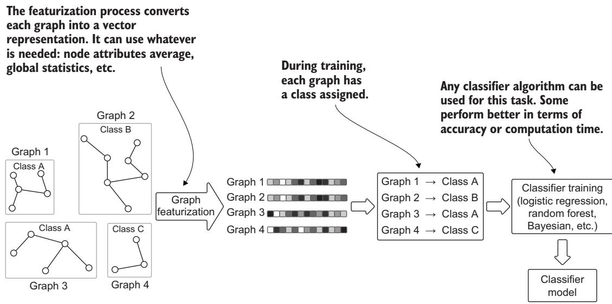
**그림 9.10** 그래프 분류의 높은 수준 훈련 과정. 출력은 서로 다른 그래프들의 알려진 클래스로 훈련된 분류기 모델입니다.

모델이 훈련되고 나면, 그것은 분류되지 않은 그래프들과 함께 예측 단계의 입력으로 쓰입니다. 그림 9.11은 예측의 핵심 단계와 주역들을 보여 줍니다.

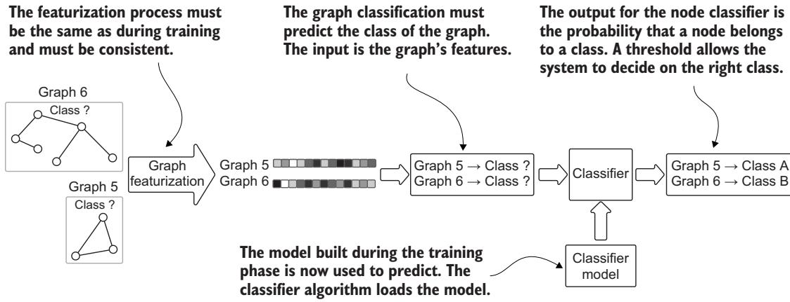
**그림 9.11** 그래프 분류의 높은 수준 예측 과정. 출력은 라벨 없는 그래프들에 배정된 클래스입니다.

다시 한번 분명해지는 것은, 노드·관계·그래프에 대한 특징 추출이 이 과정에서 핵심적이라는 점입니다. 그것이 훈련과 예측의 입력을 이루기 때문입니다. 정확도와 전반적 성능을 포함한 최종 출력의 품질은, 이 특징들의 품질과 하위 알고리즘 파라미터의 정밀한 튜닝에 크게 좌우됩니다. 10장과 4부의 나머지 대부분은 이 과제, 그리고 이 과정의 결과를 효과적으로 활용하는 데 집중할 것입니다.

---

#### 9.3.3 그래프 군집화 — 변환 없이 그래프를 바로 나누는 과제

그래프 위의 모든 ML 과제가 앞 절들에서 본 단계를 필요로 하는 것은 아닙니다. 예를 들어 그래프 군집화의 경우, 입력은 그래프 전체(또는 부분 그래프)이고, 알고리즘은 노드와 관계를 이용해 커뮤니티를 뽑아냅니다(그림 9.12 참고).

커뮤니티 탐지는, 네트워크의 나머지 부분과의 연결에 비해 내부 연결이 더 촘촘한 노드 무리를 식별합니다. 커뮤니티 내부의 실제 엣지 밀도와 기대 엣지 밀도의 차이를 최적화함으로써 모듈성을 극대화합니다. (이 정의는 9.2.3에서 본 것과 같은 내용을 다시 짚는 것으로, 그만큼 핵심 개념이라는 뜻입니다.)

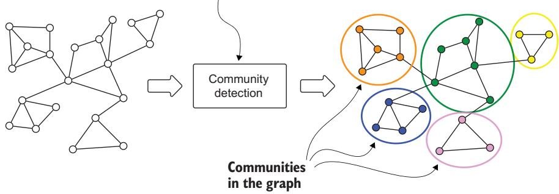
**그림 9.12** 그래프 군집화의 높은 수준 과정. 이것은 순수 그래프 알고리즘 접근의 한 예로, 벡터 표현이나 다른 형식으로의 중간 변환을 필요로 하지 않습니다.

이 과제에는 특징 추출이 없습니다. 그래프 알고리즘이 노드의 관계, 그 방향, 그 가중치를 이용해 그래프를 나누기 때문입니다. 어떤 알고리즘, 예컨대 **약연결 요소(weakly connected component, WCC)** 는 고정된 방식을 쓰며 독립적인 부분 그래프만 고려합니다. 다른 방법들, 예컨대 **Louvain** 과 라벨 전파 알고리즘은 모듈성 같은 특정 결과를 최적화합니다. Louvain은 4장에서 다뤘으니, 여기서는 라벨 전파를 간단히 소개하겠습니다.

**라벨 전파 알고리즘(label propagation algorithm, LPA)** [20] 은 네트워크에서 커뮤니티를 탐지하는 빠른 방법입니다. 라벨을 네트워크 전체로 퍼뜨리고, 마지막에 같은 라벨을 가진 노드들을 같은 커뮤니티에 속한 것으로 봅니다. LPA는 무작위성 때문에 일관된 출력을 보장하지 않습니다. 그래서 같은 네트워크에 여러 번 돌리면 조금씩 다른 커뮤니티가 나올 수 있습니다.

이 과정이 어떻게 작동하는지 보이기 위해, 같은 가라테 클럽 그래프를 쓰고 그 위에서 Louvain을 돌려 봅니다. 코드는 다음과 같습니다.

```python
# 리스팅 9.10  가라테 클럽 네트워크에서 Louvain 실행하기
import math
import time
import networkx as nx
import matplotlib.pyplot as plt

def set_club_colors(G):
    for node in G.nodes(data=True):
        color = '#00fff9'
        if node[1]['club'] == 'Mr. Hi':
            color = '#e6e6fa'
        node[1]['color'] = color

def draw_and_save_graph_picture(G, i=0):
    set_club_colors(G)
    layout_position = nx.spring_layout(G, k=8 / math.sqrt(G.order()))
    colors = [n[1]['color'] for n in G.nodes(data=True)]
    nx.draw_networkx(G, pos=layout_position, node_color=colors)
    plt.axis('off')
    plt.savefig("Karate_Graph_" + str(i) + ".svg", format="SVG", dpi=1000)
    plt.savefig("Karate_Graph_" + str(i) + ".png", format="PNG", dpi=1000)
    plt.show()

if __name__ == '__main__':
    start = time.time()
    G = nx.karate_club_graph()
    draw_and_save_graph_picture(G)
    # Louvain 으로 커뮤니티를 계산합니다.
    communities = nx.community.louvain_communities(G, seed=123)
    i = 1
    # 커뮤니티마다 하나씩, 여러 그래프를 그립니다.
    for community in communities:
        subGraph = G.subgraph(community)
        draw_and_save_graph_picture(subGraph, i)
        i += 1
    end = time.time() - start
    print("Time to complete:", end)
```

이 코드는 그림 9.13에서 보듯 네 개의 커뮤니티를 찾아냅니다. `louvain_communities` 가 커뮤니티들을 반환하면, 각 커뮤니티에 해당하는 부분 그래프(`G.subgraph(community)`)를 하나씩 그려 저장합니다. 우리는 알고리즘이 같은 커뮤니티 안 다른 노드들과는 잘 연결되고 커뮤니티 밖 노드들과는 성기게 연결된 노드 무리를 훌륭하게 식별했음을 바로 알 수 있습니다. 각 커뮤니티는 (노드의 음영으로 나타나듯) 같은 그룹에 속한 노드들로 상당히 균질합니다. 딱 한 경우에만 엉뚱한 노드(8번)가 있는데, 이 노드는 모두 다른 그룹인 노드들과 한 커뮤니티에 묶여 있습니다. 어쩌면 이 사람은 엉뚱한 그룹에 있는 건지도 모르겠습니다!

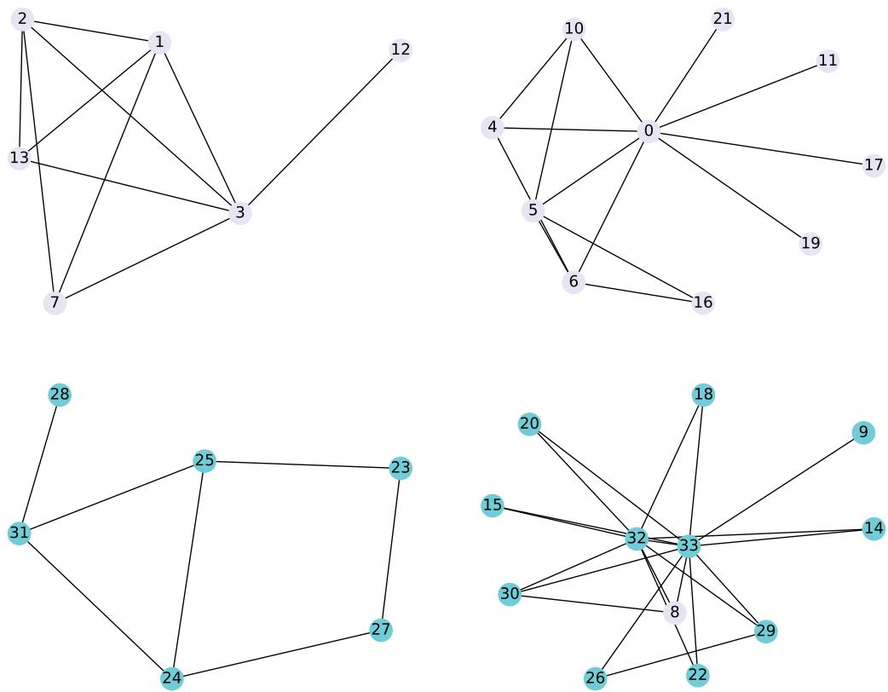
**그림 9.13** 가라테 클럽 네트워크에 커뮤니티 탐지 알고리즘을 적용한 결과. 알고리즘은 네 개의 커뮤니티를 찾아냈습니다. 하나를 뺀 나머지는 모두 같은 그룹 회원만 담고 있습니다. 엉뚱한 노드가 하나 있지만, 그 노드는 다른 그룹에 속한 사람들과 잘 연결되어 있습니다.

이 과제를 앞서 다룬 것들과 구별해 주는 두 가지 측면이 있습니다. 첫째, 표현 변환(representation transformation)이 필요 없습니다. 그래프 전체가 입력으로 쓰이고, 알고리즘이 노드와 관계를 직접 다룹니다. 둘째, 훈련 단계가 없습니다. 이 과제는 비지도 접근을 따릅니다. 라벨 같은 어떤 예시도 쓰지 않고 그래프를 받아 출력을 생성합니다.

---

### 요약 — 이 장에서 챙겨 갈 것

- 그래프 위의 머신러닝은 서로 얽힌 데이터를 자연스럽게 다루고, 보편적 데이터 표현을 제공하며, 제한된 계산 과제 집합을 통해 복잡한 문제를 모델링할 수 있게 해 줍니다.
- 데이터 점이 독립이고 동일하게 분포한다고 가정하는 전통적 ML과 달리, 그래프 기반 접근은 노드 사이의 연결과 의존 관계를 활용해 현실 세계의 관계와 패턴을 더 잘 반영합니다.
- 그래프 위의 ML 과제는 두 큰 범주로 나뉩니다. 하나는 노드 중심 과제(노드 분류·링크 예측처럼 하나의 그래프 위에서 수행)이고, 다른 하나는 그래프 중심 과제(그래프 분류처럼 각 그래프가 별개의 데이터 점)입니다.
- 노드 분류와 링크 예측은 대개 준지도 과제로, 라벨 있는 데이터와 없는 데이터를 그래프의 구조 정보와 함께 활용합니다. 커뮤니티 탐지는 보통 비지도이며 그래프 구조 위에서 직접 작동합니다.
- 특징 공학은 이 과제들에서 결정적인 역할을 합니다.
- 노드 임베딩은 수동 특징 공학부터 Node2Vec 같은 자동 기법까지 다양한 방식으로 생성할 수 있습니다. 다만 자율 임베딩은 지나치게 균질한 표현이 만들어지지 않도록 신중한 튜닝을 요구합니다.
- 그래프 기반 ML의 성공은, 자동 특징 학습·도메인 지식 반영·과제에 맞는 알고리즘 선택 사이에서 올바른 균형을 찾는 데 달려 있는 경우가 많습니다.

---

## 핵심 용어 해설

| 용어 (영문) | 한 줄 정의 |
| --- | --- |
| 지능형 자문 시스템 (IAS, intelligent advisory system) | 사용자가 스스로 뽑아내기 어려운 통찰을 제공하는 시스템 |
| 표현 학습 (representation learning) | 데이터를 벡터처럼 학습하기 좋은 형태로 바꾸는 기술 |
| 임베딩 (embedding) | 노드·개체를 숫자 벡터로 나타낸 것 |
| 그래프 신경망 (GNN, graph neural network) | 그래프 구조를 직접 입력으로 받아 학습하는 신경망 |
| 노드 분류 (node classification) | 하나의 그래프 안에서 개별 노드의 라벨을 예측하는 과제 |
| 링크 예측 (link prediction) | 노드 사이에 존재하거나 앞으로 생길 연결을 예측하는 과제 |
| 관계 예측 (relationship prediction) | 연결의 존재뿐 아니라 관계의 유형까지 예측하는 과제 |
| 커뮤니티 탐지 (community detection) | 내부가 촘촘하고 외부와 성긴 노드 무리를 찾아내는 과제 |
| 그래프 분류 (graph classification) | 그래프 하나 전체에 라벨을 붙이는 과제 |
| i.i.d. (independent and identically distributed) | 데이터 점들이 서로 독립이고 동일한 분포를 따른다는 가정 |
| 준지도 학습 (semisupervised learning) | 라벨 있는 데이터와 없는 데이터를 함께 쓰는 학습 |
| 동종선호 (homophily) | 비슷한 특성끼리 연결되려는 경향 |
| 이종선호 (heterophily) | 서로 다른 특성끼리 연결되려는 경향 |
| 구조적 등가성 (structural equivalence) | 이웃 구조가 비슷한 노드가 기능도 비슷하다는 성질 |
| 모듈성 (modularity) | 커뮤니티 내부와 외부의 연결 밀도 차이를 재는 지표 |
| 차수 (degree) | 한 노드가 다른 노드와 맺은 연결의 개수 |
| Node2Vec | 랜덤 워크로 네트워크 구조를 배워 노드 임베딩을 만드는 기법 |
| 특징 표준화 (feature standardization) | 특징을 평균 0·분산 1로 맞춰 척도 차이를 없애는 것 |
| 로지스틱 회귀 (logistic regression) | 선형 결합을 확률로 바꿔 분류하는 알고리즘 |
| 혼동 행렬 (confusion matrix) | 예측과 실제를 대조해 맞고 틀림을 정리한 표 |
| 라벨 전파 알고리즘 (LPA, label propagation algorithm) | 라벨을 네트워크에 퍼뜨려 커뮤니티를 찾는 빠른 방법 |
| Louvain | 모듈성을 최적화해 커뮤니티를 찾는 알고리즘 |
| 약연결 요소 (WCC, weakly connected component) | 고정된 방식으로 독립 부분 그래프를 나누는 방법 |
| 집단 분류 (collective classification) | 그래프 구조를 직접 처리해 예측하는 전용 알고리즘 |

---

## 참고 문헌 (References)

원문의 대괄호 번호([1]\~[25])는 원서의 참고 문헌 목록을 가리킵니다. 본 해설판에서는 인용 번호를 원문 그대로 보존했으며, 상세 서지 정보는 원서의 References 절을 참고하시기 바랍니다.
