# 그래프 특징 공학: 수동 및 반자동 접근법 — 쉬운 해설판

> 이 문서는 Alessandro Negro의 『Knowledge Graphs and LLMs in Action』 10장 "Graph feature engineering: Manual and semiautomated approaches"를 한국어로 풀어 설명한 해설판입니다. 원문의 모든 문단, 그림, 표, 코드, 수식을 빠짐없이 다루되, 번역을 넘어 쉬운 합니다체로 개념을 곱씹으며 설명합니다. 그래프의 노드와 관계를 머신러닝이 소화할 수 있는 숫자 벡터로 바꾸는 "특징 공학"이 이 장의 주제입니다.

---

### 이 장에서 다루는 내용 — 노드와 관계를 벡터로 바꾸는 기술

이 장에서는 다음 세 가지를 다룹니다.

- 그래프에서 노드와 관계를 위한 **수동 특징 공학(manual feature engineering)** 기법
- 그래프 표현 안에서 도메인 전문 지식과 반자동 추출을 결합하는 방법
- 특징 공학의 실제 현업 응용 사례

그래프 위에서의 머신러닝(ML) 성공 여부는 하나의 근본적인 난제에 달려 있습니다. 바로 **그래프의 구성 요소(노드, 관계, 그래프 전체)를 ML 알고리즘이 처리할 수 있는 벡터로 어떻게 효과적으로 표현하느냐** 하는 문제입니다. 이 표현 단계를 흔히 **벡터화(vectorization)** 또는 **특징화(featurization)** 라고 부르며, 이 단계가 모델이 얼마나 잘 학습하고 예측하는지를 결정합니다.

로지스틱 회귀나 랜덤 포레스트 같은 전통적 방법부터 정교한 딥러닝 모델에 이르기까지, 현대의 ML 알고리즘은 이미 충분히 자리를 잡았습니다. 그러나 이들은 그래프 구조를 직접 처리하지 못합니다. 대신 **숫자로 된 입력 벡터**를 요구합니다. 이 벡터의 품질은 곧바로 다운스트림 작업의 성능을 좌우합니다. 노드를 분류하든, 관계를 예측하든, 그래프 전체를 분석하든 마찬가지입니다.

이 장은 이러한 벡터 표현을 만드는 기술과 과학을, **수동에서 자동으로** 나아가는 순서로 탐구합니다. 먼저 도메인 지식과 그래프 성질에 기반해 해석 가능한 특징을 직접 손으로 만드는 수동 특징 공학에서 출발합니다. 이 방식은 손이 많이 가지만, 무엇이 표현을 효과적으로 만드는지에 대한 통찰을 주고, 왜 어떤 특징이 다른 특징보다 잘 작동하는지 이해하도록 돕습니다.

이어서 점점 더 자동화된 기법을 소개합니다. 다만 **특징 추출이 자동화될수록 그 특징은 해석하기 어려워지는 경향**이 있습니다. 이는 하나의 스펙트럼을 만듭니다.

- **수동 특징(manual features)** 은 해석 가능성이 매우 높지만 만드는 데 노동력이 많이 듭니다(9장에서 간단히 소개했고, 이 장에서 깊이 다룹니다).
- **반자동 특징(semiautomated features)** 은 해석 가능성과 효율성 사이의 균형을 잡습니다(역시 이 장에서 다룹니다).
- **완전 자동 특징(fully automated features)** 은 생성이 효율적이지만 해석하기가 더 어렵습니다(11장과 12장에서 다룹니다).

전통적인 데이터셋에서는 특징이 곧 현실 세계에서 직접 측정한 값입니다. 예를 들어 날씨 예측 데이터셋에는 강수량, 기온 범위, 풍속처럼 측정 가능한 속성이 들어 있습니다. 모델을 학습시킬 때는 특징(측정된 속성)과 정답 라벨(실제 날씨)을 모두 아는 행들을 사용합니다. 예측할 때는 학습된 모델을 특징만 있고 날씨 라벨은 모르는 새 데이터에 적용해 날씨를 알아냅니다.

그런데 그래프 기반 ML에서는 **특징을 그래프 구조 자체로부터 만들어 내야** 합니다. 물리적 측정값 대신, 노드나 관계나 그래프 전체의 의미 있는 성질을 숫자 값으로 포착해야 합니다.

이러한 그래프 기반 특징을 만드는 데는 두 가지 근본적인 접근법이 있습니다.

- **특징 공학(feature engineering)** 은 앞 장에서 소개한 방식으로, 그래프 성질과 도메인 지식에 기반해 **사람이 직접 설계한 특징**에 의존합니다. 이런 특징은 해석 가능성이 매우 높지만 만드는 데 시간이 많이 들고, 복잡한 작업에 필요한 모든 패턴을 다 담아내지 못할 수도 있습니다. 그래프 기반 특징의 흔한 예로는 노드 차수, 군집 계수, 중심성 지표가 있습니다.
- **표현 학습(representation learning)** 은 반대로 그래프 구조로부터 특징 표현을 **자동으로 학습**합니다. 이 접근법은 사람의 개입이 최소한으로 필요하고, 학습을 통해 특정 작업에 맞춰 적응할 수 있습니다. 수동 공학보다 복잡한 패턴을 더 효과적으로 포착하는 경우가 많지만, 해석하기 어려운 특징을 만들어 내는 것이 보통입니다. 이 접근법은 다음 두 장에서 다룹니다.

특징 공학의 어려움과 한계를 이해하면, 왜 표현 학습이 점점 더 중요해졌는지 깨닫게 됩니다. 그럼에도 수동 특징 공학은 두 가지 핵심 이유로 여전히 가치가 있습니다. 첫째, **사람이 이해하고 검증할 수 있는 해석 가능한 특징**을 만들어 냅니다. 둘째, 무엇이 그래프 표현을 효과적으로 만드는지에 대한 통찰을 제공해 자동화 접근법의 설계에도 도움을 줍니다.

수동으로 추출한 특징의 또 다른 중요한 장점은, **대규모 언어 모델(LLM, large language models)** 이 그래프에 대해 자율적으로 추론할 때 궁합이 좋다는 점입니다. 이런 특징은 잘 이해된 그래프 알고리즘과 성질에 기반하므로, LLM이 그것을 효과적으로 해석하고 추론할 수 있습니다. 이 책의 러닝 비유를 빌리자면, LLM이 박학다식하지만 가끔 근거 없이 지어내는 달변가라면, 잘 정의된 그래프 특징은 그 달변가가 딛고 설 수 있는 단단한 사실의 발판이 되어 줍니다.

이 장에서는 실제 컨설팅 프로젝트에서 가져온 세 가지 실용적인 특징 공학 접근법을 살펴봅니다. 이 사례들은 그래프 기반 ML에서 수동 특징 추출이 지닌 힘과 한계를 동시에 보여 줍니다.

---

### 10.1 노드의 수동 특징 — 사기 탐지 네트워크에서 시작하기

사람들의 네트워크가 있다고 해 봅시다. 즉 노드는 사람을 나타내고, 관계는 이 사람들 사이의 어떤 연결이든 나타내는 그래프입니다(그림 10.1 참조). 이 사람들 중 일부는 이미 알려진 **사기꾼(fraudster)** 입니다. 우리에게는 그들의 전체 명단이 없습니다. 그래서 우리의 과제는 노드를 분류해 아직 밝혀지지 않은 사기꾼을 찾아내거나, 각 사람이 사기 활동의 피해자가 될 위험을 판정하는 것입니다.

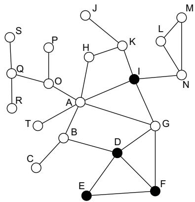

이 네트워크에는 두 종류의 노드가 있습니다. **검은 노드**는 알려진 사기꾼(노드 D, E, F, I)을, **흰 노드**는 정상 사용자이거나 아직 정체가 확인되지 않은 노드를 나타냅니다. 노드 사이의 모든 연결은 방향이 없는 무향 간선(undirected edge)으로 표현됩니다. 다음 코드는 파이썬과 NetworkX로 이 네트워크를 만드는 방법을 보여 줍니다.

> **그림 10.1** 흰 노드는 정상 개인이거나 사기꾼 여부가 알려지지 않은 사람을, 검은 노드는 알려진 사기꾼을 나타내는 예시 소셜 네트워크입니다.

```python
import networkx as nx
import matplotlib.pyplot as plt
def create_fraud_network():          # 빈 무향 그래프를 초기화
    G = nx.Graph()
    # 사기 노드 (그림 10.1의 검은 노드)
    fraudsters = ['D', 'E', 'F', 'I']
```

이 첫 부분은 빈 무향 그래프 `G` 를 만들고, 사기꾼 노드의 목록 `['D', 'E', 'F', 'I']` 을 정의합니다. `nx.Graph()` 는 방향이 없는 그래프를 뜻합니다.

#### 먼저 모든 노드를 추가하기

```python
    # 먼저 모든 노드를 추가한다
    nodes = ['A', 'B', 'C', 'D', 'E', 'F', 'G', 'H', 'I', 'J',
             'K', 'L', 'M', 'N', 'O', 'P', 'Q', 'R', 'S', 'T']
    G.add_nodes_from(nodes)          # 네트워크의 모든 노드를 정의
    # 목록에 따라 각 노드에 사기꾼 속성을 설정
    for node in G.nodes():
        G.nodes[node]['is_fraudster'] = node in fraudsters
```

여기서는 A부터 T까지 20개의 노드를 한꺼번에 그래프에 추가합니다. 그런 다음 각 노드마다 `is_fraudster` 라는 불리언 속성을 붙여 줍니다. 노드가 `fraudsters` 목록에 있으면 `True`, 없으면 `False` 가 됩니다. 이 속성이 뒤에서 "사기 차수", "사기 삼각형" 같은 도메인 특화 특징을 계산할 때 기준이 됩니다.

```python
    edges = [
        ('A', 'B'), ('A', 'G'), ('A', 'H'), ('A', 'I'), ('A', 'O'),
        ('A', 'T'), ('B', 'D'), ('B', 'C'), ('D', 'E'), ('D', 'F'),
        ('D', 'G'), ('E', 'F'), ('F', 'G'), ('G', 'I'), ('H', 'K'),
        ('I', 'K'), ('I', 'N'), ('K', 'J'), ('L', 'M'), ('L', 'N'),
        ('N', 'M'), ('O', 'P'), ('O', 'Q'), ('Q', 'R'), ('Q', 'S')
    ]                                # 네트워크의 모든 간선을 정의
    G.add_edges_from(edges)
    return G                         # 완성된 그래프를 반환
```

두 번째 부분은 네트워크의 모든 간선(연결)을 한 번에 추가합니다. 예를 들어 `('A', 'B')` 는 A와 B가 서로 연결되어 있음을 뜻합니다. 마지막으로 완성된 그래프 객체 `G` 를 돌려줍니다.

이렇게 만든 네트워크는 이 장에서 이후에 수행하는 모든 분석에 그대로 재사용할 수 있습니다. 다음과 같이 호출하면 됩니다.

```python
# 리스트 10.2 사용 예
G = create_fraud_network()           # 이 그래프 객체를 아래의 어떤 지표 계산에도 쓸 수 있다
degree_metrics = compute_degree_metrics(G)      # 뒤에서 정의할 예시 지표
triangle_metrics = compute_triangle_metrics(G)
```

우리의 목표는 **어떤 노드를 입력받아 그 노드가 사기꾼인지 아닌지를 말해 주는 분류기(classifier)** 를 구현하는 것입니다. 이 작업은 보통 로지스틱 회귀, 베이즈 분류기, 결정 트리, 랜덤 포레스트처럼 잘 알려진 고전적 분류 알고리즘으로 수행합니다. 이들은 모두 **지도 학습(supervised)** 알고리즘입니다. 따라서 학습 과정의 입력은 각 데이터 포인트(여기서는 노드)에 연결된 특징 집합과 라벨(여기서는 사기꾼/비사기꾼)입니다. 학습이 ML 모델을 만들고 나면, 분류기는 일정한 확률과 함께 라벨을 붙일 수 있게 됩니다.

이런 알고리즘을 쓰려면 **각 노드를 학습과 예측에서 좋은 지표가 될 특징 집합으로 "표현"** 해야 합니다(그림 10.2 참조). 우리는 각 노드에 대해 흥미로운 정보를 아주 많이 뽑아낼 수 있습니다.

- **국소 특징(local features)** 은 노드의 1홉 이웃, 즉 **에고 중심 네트워크(egonet, ego-centered network)** 를 고려해 뽑는 특징입니다. 에고넷이란 특정 노드와 그 노드의 바로 옆 이웃들을 말합니다. 에고넷의 중심은 **에고(ego)**, 주변 노드들은 **알터(alters)** 라고 부릅니다. 이런 국소 특징은 에고 노드로부터 n홉 떨어진 노드까지 고려하는 n차 이웃으로 확장할 수도 있습니다.
- **전역 특징(global features)** 은 에고넷이나 n차 이웃이 아니라 **네트워크 전체(또는 그 상당 부분)** 안에서 각 노드가 맡는 역할을 측정합니다. 매개 중심성, 근접 중심성, 페이지랭크, 고유벡터 중심성 같은 중심성 지표가 이 범주에 들어갑니다. 이 지표들은 노드가 네트워크에서 얼마나 영향력이 있는지, 또 다른 노드들로부터 얼마나 영향을 받을 수 있는지를 포착합니다. (이런 중심성 알고리즘이 낯설다면 저자들의 이전 책 『Graph-Powered Machine Learning』 [1] 이나 [2] 를 참고하기를 권합니다.)

우리는 각 노드를 대표하는 특징을 찾기 위해 여러 지표를 사용합니다. 또 분류의 최종 품질을 높이기 위해 일부 지표를 맞춤 변형해서, 특징화 과정을 우리 필요에 맞게 재단할 수 있음을 보여 줄 것입니다. 우리의 접근은 **국소에서 전역으로** 나아갑니다. 즉 바로 옆 이웃에 기반한 특징에서 시작해 네트워크 전체의 패턴을 살피는 순서로 진행합니다. 각 경우마다 지표와 그 의미를 정의하고, 자동 추출 코드를 제시하고, 결과를 표로 보여 줍니다.

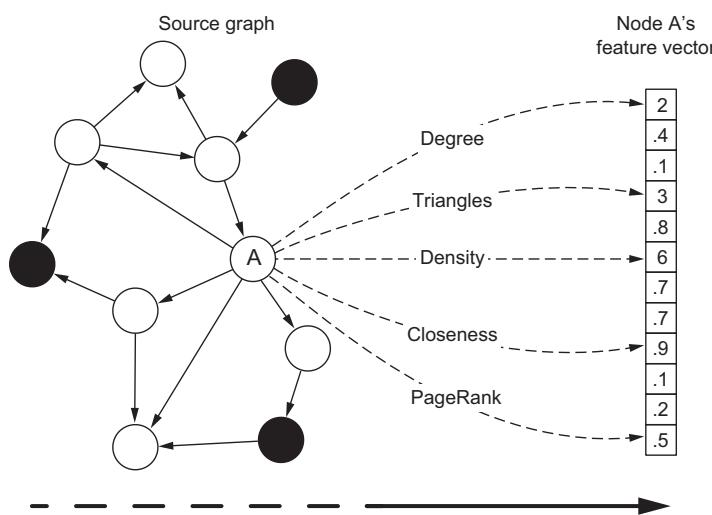

> **그림 10.2** 노드 특징 추출: 지표와 그래프 알고리즘을 사용해 노드를 핵심 특성을 담은 숫자 특징 벡터로 변환합니다. 그 결과 벡터는 원래 노드의 본질적 성질을 보존하는 숫자 표현이 됩니다.

우리는 이런 특징들을 **점진적으로 쌓아 올립니다.** 새 지표가 하나씩 더해질 때마다 노드 표현에 차원이 하나씩 늘어나는 모습을 보여 줄 것입니다. 이렇게 체계적으로 접근하면 네트워크 구조와 노드 행동의 점점 더 복잡한 패턴을 포착할 수 있습니다.

---

#### 10.1.1 차수(Degree) — 이웃이 몇 명이며, 그중 사기꾼은 몇인가

노드의 **차수(degree)** 는 그 노드가 이웃을 몇 명이나 가지고 있는지를 나타냅니다. 우리 예제에서는 여기서 한 걸음 더 나아가, 직접 이웃 중에서 사기꾼과 정상인을 구분하려 합니다. 이것을 각각 **사기 차수(fraud degree)** 와 **정상 차수(legit degree)** 라고 부릅니다. 이 두 값을 전체 차수와 함께 쓰면, 노드의 직접 연결을 훨씬 더 잘 표현할 수 있습니다. 예를 들어 제게 직접 이웃 10명이 있는데 그들이 전부 사기꾼이라면, 이웃이 전부 정상인일 때보다 제가 사기꾼일 가능성이 더 높습니다. 다음 코드는 일반적인 그래프에서 이 값들을 계산합니다.

```python
# 각 노드의 차수 지표를 저장할 딕셔너리를 초기화
degree_metrics = {}
for node in G.nodes():
    neighbors = list(G.neighbors(node))
    total_degree = len(neighbors)          # 이웃의 총 수(전체 차수)를 계산
    fraud_degree = sum(1 for neighbor in neighbors
                       if G.nodes[neighbor].get('is_fraudster', False))
                                           # is_fraudster 속성으로 사기꾼 이웃 수를 셈
    legit_degree = total_degree - fraud_degree   # 정상 차수 = 전체 - 사기
    degree_metrics[node] = {
        'total_degree': total_degree,
        'fraud_degree': fraud_degree,
        'legit_degree': legit_degree
    }
return degree_metrics                       # 모든 노드의 차수 지표를 담은 딕셔너리를 반환

def get_node_degrees(G, node):
    metrics = compute_degree_metrics(G)
    return metrics.get(node, {
        'total_degree': 0,
        'fraud_degree': 0,
        'legit_degree': 0                   # 특정 노드의 차수 지표를 가져온다
    })
```

이 코드가 하는 일을 짚어 보겠습니다. 각 노드마다 이웃 목록을 뽑고, 그 길이로 **전체 차수**를 구합니다. 그다음 이웃들 중 `is_fraudster` 가 `True` 인 사람만 세어 **사기 차수**를 계산하고, 전체에서 사기 차수를 빼서 **정상 차수**를 구합니다. 이 코드는 그래프의 노드에 `is_fraudster` 불리언 속성이 붙어 있다고 가정합니다. 표 10.1이 그 결과 값들을 담고 있습니다. 예를 들어 노드 D는 직접 이웃이 총 4명인데, 그중 2명은 사기꾼이고 2명은 정상입니다.

> **표 10.1** 그림 10.1 사기 그래프의 전체 차수, 사기 차수, 정상 차수 (원문 표는 OCR 병합으로 셀 정렬이 흐트러져 있어, 데이터 유실을 막기 위해 원문 형태 그대로 보존합니다.)

<table><tr><td rowspan=1 colspan=1>Node</td><td rowspan=1 colspan=1>A</td><td rowspan=1 colspan=1>B</td><td rowspan=1 colspan=1>C</td><td rowspan=1 colspan=1>D</td><td rowspan=1 colspan=1>E</td><td rowspan=1 colspan=1>F</td><td rowspan=1 colspan=1>G</td><td rowspan=1 colspan=1>H</td><td rowspan=1 colspan=1></td><td rowspan=1 colspan=1></td></tr><tr><td rowspan=1 colspan=1>Total degreeFraud degreeLegit degree</td><td rowspan=1 colspan=1>615</td><td rowspan=1 colspan=1>312</td><td rowspan=1 colspan=1>101</td><td rowspan=1 colspan=1>422</td><td rowspan=1 colspan=1>220</td><td rowspan=1 colspan=1>321</td><td rowspan=1 colspan=1>431</td><td rowspan=1 colspan=1>202</td><td rowspan=1 colspan=1>404</td><td rowspan=1 colspan=1>101</td></tr><tr><td rowspan=1 colspan=1>Node</td><td rowspan=1 colspan=1>K</td><td rowspan=1 colspan=1></td><td rowspan=1 colspan=1>M</td><td rowspan=1 colspan=1>N</td><td rowspan=1 colspan=1>0</td><td rowspan=1 colspan=1>P</td><td rowspan=1 colspan=1>Q</td><td rowspan=1 colspan=1>R</td><td rowspan=1 colspan=1>S</td><td rowspan=1 colspan=1>T</td></tr><tr><td rowspan=3 colspan=1>Total degreeFraud degreeLegit degree</td><td rowspan=1 colspan=1>3</td><td rowspan=1 colspan=1>2</td><td rowspan=1 colspan=1>2</td><td rowspan=1 colspan=1>3</td><td rowspan=1 colspan=1>3</td><td rowspan=1 colspan=1>1</td><td rowspan=1 colspan=1>3</td><td rowspan=2 colspan=1>10</td><td rowspan=2 colspan=1>10</td><td rowspan=3 colspan=1>101</td></tr><tr><td rowspan=1 colspan=1>1</td><td rowspan=1 colspan=1>0</td><td rowspan=1 colspan=1>0</td><td rowspan=1 colspan=1>1</td><td rowspan=1 colspan=1>0</td><td rowspan=1 colspan=1>0</td><td rowspan=1 colspan=1>0</td></tr><tr><td rowspan=1 colspan=1>2</td><td rowspan=1 colspan=1>2</td><td rowspan=1 colspan=1>2</td><td rowspan=1 colspan=1>2</td><td rowspan=1 colspan=1>3</td><td rowspan=1 colspan=1>1</td><td rowspan=1 colspan=1>3</td><td rowspan=1 colspan=1>1</td><td rowspan=1 colspan=1>1</td></tr></table>

이 표를 읽는 법을 한마디로 정리하면, 각 노드 열마다 "전체 차수 / 사기 차수 / 정상 차수" 세 값이 세로로 쌓여 있습니다. 예를 들어 노드 A는 전체 6, 사기 1, 정상 5입니다. 앞서 본 간선 목록에서 A의 이웃은 B, G, H, I, O, T 여섯이고 그중 사기꾼은 I 하나이므로 이 값이 맞습니다.

#### 연습 문제

이 값들을 직접 손으로 계산해 보고, 개념이 확실히 이해되었는지 검증해 보십시오. 이것들은 계산이 아주 간단한 지표입니다. 뒤에서 나올 다른 지표들은 코드로 실행해야 합니다.

---

#### 10.1.2 삼각형(Triangles) — 서로 얽힌 세 사람의 관계

그래프 이론에서 **삼각형(triangle)** 은 세 노드가 모두 서로 연결된 부분 그래프입니다. 그러니까 A, B, C 세 노드가 있을 때, A-B, A-C, B-C 세 쌍 모두에 관계가 존재하면 이 셋은 삼각형을 이룹니다(그림 10.3 참조).

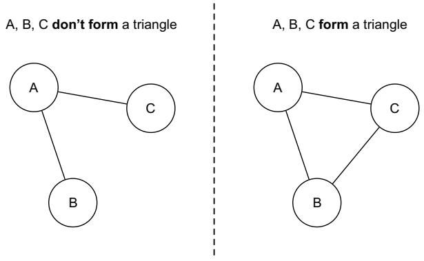

> **그림 10.3** 서로 연결된 세 노드의 예: 각 노드가 나머지 둘 모두와 연결되면 삼각형을 이룹니다.

노드의 에고넷 안에 삼각형이 존재한다는 것은, 그 대상 노드가 이웃들과 **강하게 결속되어 있다**는 신호입니다. 여러분과 가까운 사람들을 떠올려 보십시오. 여러분의 친구들은 아마 서로도 친구일 것입니다. 바로 그래서 삼각형은 긴밀하게 연결된 집단이 서로에게 미치는 영향력을 드러냅니다. 어떤 노드와 두 알터가 삼각형을 이룬다고 해 봅시다. 우리 예제에서 두 알터가 모두 사기꾼이면 그 삼각형을 **사기 삼각형(fraud triangle)** 이라 하고, 반대로 둘 다 정상이면 **정상 삼각형(legit triangle)** 이라 합니다. 만약 알터 중 한 명만 사기꾼이면 그 삼각형은 **반(半)사기 삼각형(semifraudulent triangle)** 이라 부릅니다.

다음 코드는 우리 그래프에서 각 노드에 대해 전체 삼각형 수와 사기·정상·반사기 삼각형 수를 계산합니다.

```python
# 리스트 10.4 사기 탐지 네트워크에서 삼각형 지표 계산
import networkx as nx

def compute_triangle_metrics(G):
    triangle_metrics = {}                    # 각 노드의 삼각형 지표를 저장할 딕셔너리
    for node in G.nodes():
        triangles = []
        neighbors = list(G.neighbors(node))
        # 대상 노드의 두 이웃이 서로 연결되어 있는지 확인해 삼각형을 찾는다
        for i in range(len(neighbors)):
            for j in range(i + 1, len(neighbors)):
                if G.has_edge(neighbors[i], neighbors[j]):
                    triangles.append((neighbors[i], neighbors[j]))

        total_triangles = len(triangles)
        fraud_triangles = 0                  # 카운트 초기화
        legit_triangles = 0
        semi_fraud_triangles = 0
        # 나머지 두 노드의 사기 여부에 따라 각 삼각형을 분류한다
        for n1, n2 in triangles:
            n1_fraud = G.nodes[n1].get('is_fraudster', False)
            n2_fraud = G.nodes[n2].get('is_fraudster', False)
            if n1_fraud and n2_fraud:        # 둘 다 사기꾼이면 사기 삼각형
                fraud_triangles += 1
            elif not n1_fraud and not n2_fraud:   # 둘 다 정상이면 정상 삼각형
                legit_triangles += 1
            else:                            # 하나만 사기꾼이면 반사기 삼각형
                semi_fraud_triangles += 1

        triangle_metrics[node] = {
            'total_triangles': total_triangles,
            'fraud_triangles': fraud_triangles,
            'legit_triangles': legit_triangles,
            'semi_fraud_triangles': semi_fraud_triangles
        }
    return triangle_metrics                  # 각 노드의 모든 삼각형 지표를 담은 딕셔너리를 반환

def get_node_triangles(G, node):
    metrics = compute_triangle_metrics(G)
    return metrics.get(node, {
        'total_triangles': 0,
        'fraud_triangles': 0,
        'legit_triangles': 0,
        'semi_fraud_triangles': 0            # 특정 노드의 삼각형 지표를 가져온다
    })
```

코드의 핵심은 이렇습니다. 각 노드의 이웃 목록에서 두 이웃 쌍(`neighbors[i]`, `neighbors[j]`)을 골라, 그 둘 사이에 간선이 있으면(`G.has_edge`) 노드 + 두 이웃이 삼각형을 이루는 것으로 봅니다. 이렇게 찾은 삼각형마다 두 알터의 `is_fraudster` 값을 확인해, 둘 다 사기면 사기, 둘 다 정상이면 정상, 하나만 사기면 반사기로 세어 나눕니다. 표 10.2가 우리 사기 그래프의 값들을 담고 있습니다.

> **표 10.2** 그림 10.1 사기 그래프의 삼각형 측정값 (원문 표는 OCR로 셀 정렬이 어긋나 있어 원형 그대로 보존합니다. 각 노드 열마다 "전체 / 사기 / 정상 / 반사기" 삼각형 수가 세로로 쌓여 있습니다.)

<table><tr><td rowspan=1 colspan=1>Node</td><td rowspan=1 colspan=1>A</td><td rowspan=1 colspan=1>B</td><td rowspan=1 colspan=1>C</td><td rowspan=1 colspan=1>D</td><td rowspan=1 colspan=1>E</td><td rowspan=1 colspan=1>F</td><td rowspan=1 colspan=1>G</td><td rowspan=1 colspan=1>H</td><td rowspan=1 colspan=1>I</td><td rowspan=1 colspan=1></td></tr><tr><td rowspan=4 colspan=1>Total trianglesFraud trianglesLegit trianglesSemifraud triangles</td><td rowspan=1 colspan=1>1</td><td rowspan=1 colspan=1>0</td><td rowspan=1 colspan=1>0</td><td rowspan=1 colspan=1>2</td><td rowspan=1 colspan=1>1</td><td rowspan=1 colspan=1>2</td><td rowspan=1 colspan=1>2</td><td rowspan=1 colspan=1>0</td><td rowspan=1 colspan=1>1</td><td rowspan=4 colspan=1>0000</td></tr><tr><td rowspan=1 colspan=1>0</td><td rowspan=1 colspan=1>0</td><td rowspan=1 colspan=1>0</td><td rowspan=3 colspan=1>101</td><td rowspan=3 colspan=1>100</td><td rowspan=1 colspan=1>1</td><td rowspan=1 colspan=1>1</td><td rowspan=1 colspan=1>0</td><td rowspan=1 colspan=1>0</td></tr><tr><td rowspan=1 colspan=1>0</td><td rowspan=1 colspan=1>0</td><td rowspan=2 colspan=1>00</td><td rowspan=1 colspan=1>0</td><td rowspan=2 colspan=1>01</td><td rowspan=2 colspan=1>00</td><td rowspan=2 colspan=1>10</td></tr><tr><td rowspan=1 colspan=1>1</td><td rowspan=1 colspan=1>0</td><td rowspan=1 colspan=1>1</td></tr><tr><td rowspan=1 colspan=1>Node</td><td rowspan=1 colspan=1>K</td><td rowspan=1 colspan=1>L</td><td rowspan=1 colspan=1>M</td><td rowspan=1 colspan=1>N</td><td rowspan=1 colspan=1>0</td><td rowspan=1 colspan=1>P</td><td rowspan=1 colspan=1>Q</td><td rowspan=1 colspan=1>R</td><td rowspan=1 colspan=1>S</td><td rowspan=1 colspan=1>T</td></tr><tr><td rowspan=1 colspan=1>Total triangles</td><td rowspan=1 colspan=1>0</td><td rowspan=1 colspan=1>1</td><td rowspan=1 colspan=1>1</td><td rowspan=2 colspan=1>1O</td><td rowspan=2 colspan=1>00</td><td rowspan=2 colspan=1>00</td><td rowspan=2 colspan=1>00</td><td rowspan=2 colspan=1>00</td><td rowspan=2 colspan=1>00</td><td rowspan=2 colspan=1>00</td></tr><tr><td rowspan=1 colspan=1>Fraud triangles</td><td rowspan=1 colspan=1>0</td><td rowspan=1 colspan=1>o</td><td rowspan=1 colspan=1>o</td></tr><tr><td rowspan=1 colspan=1>Legit triangles</td><td rowspan=1 colspan=1>0</td><td rowspan=1 colspan=1>1</td><td rowspan=1 colspan=1>2</td><td rowspan=1 colspan=1>1</td><td rowspan=1 colspan=1>0</td><td rowspan=1 colspan=1>0</td><td rowspan=1 colspan=1>0</td><td rowspan=1 colspan=1>0</td><td rowspan=1 colspan=1>0</td><td rowspan=1 colspan=1>0</td></tr><tr><td rowspan=1 colspan=1>Semifraud triangles</td><td rowspan=1 colspan=1>0</td><td rowspan=1 colspan=1>0</td><td rowspan=1 colspan=1>0</td><td rowspan=1 colspan=1>0</td><td rowspan=1 colspan=1>0</td><td rowspan=1 colspan=1>0</td><td rowspan=1 colspan=1>0</td><td rowspan=1 colspan=1>0</td><td rowspan=1 colspan=1>0</td><td rowspan=1 colspan=1>0</td></tr></table>

#### 연습 문제

역시 이 값들을 직접 계산해 보고, 개념이 확실한지 확인해 보십시오.

---

#### 10.1.3 밀도(Density) — 이웃들이 서로 얼마나 촘촘히 얽혀 있나

**밀도(density)** 는 노드들이 서로 얼마나 영향을 주고받을 수 있는지를 보여 주는 또 하나의 지표입니다. 그래프 안의 노드들이 얼마나 서로 연결되어 있는지를 측정합니다. N개의 노드로 이루어진 완전 연결 그래프에서, 가능한 간선의 총수는 다음 공식으로 구합니다.

$$
{ \binom { N } { 2 } } = { \frac { N ( N - 1 ) } { 2 } }
$$

이 식은 "N개 중에서 2개를 뽑는 조합의 수"를 뜻합니다. 쉽게 말해 서로 다른 두 노드 쌍을 몇 가지나 만들 수 있는지를 세는 것이고, 완전 연결 그래프에서는 그 모든 쌍이 간선으로 이어지므로 이것이 곧 가능한 최대 간선 수가 됩니다.

1. $N$ 은 그래프 안의 전체 노드 수입니다.
2. $\binom{N}{2}$ 는 N개에서 2개를 고르는 조합의 수이며, $\frac{N(N-1)}{2}$ 로 계산됩니다.
3. $N(N-1)$ 은 순서를 고려한 쌍의 수이고, 무향 그래프에서는 (A,B)와 (B,A)가 같은 간선이므로 2로 나눠 줍니다.

이 경우 각 노드는 네트워크의 다른 모든 노드와 연결되어 있습니다. 밀도는 이 **가능한 간선들 중에서 실제로 관찰되는 비율**을 측정합니다. 그래서 그래프의 간선 수를 M이라 하면, 네트워크 전체의 밀도는 다음 공식으로 계산할 수 있습니다.

$$
d = { \frac { M } { \binom { N } { 2 } } } = { \frac { 2 M } { N ( N - 1 ) } }
$$

이 식을 풀어 보면 다음과 같습니다.

1. $M$ 은 그래프에 실제로 존재하는 간선 수입니다.
2. $\binom{N}{2}$ 는 앞에서 구한 가능한 최대 간선 수입니다.
3. $d$ 는 그 둘의 비율, 즉 "실제 간선 / 가능한 간선"이며, 0(전혀 연결 없음)에서 1(완전 연결) 사이의 값을 가집니다.
4. 오른쪽의 $\frac{2M}{N(N-1)}$ 은 분모를 풀어 쓴 같은 식입니다.

우리는 각 노드에 대해 그 **에고넷의 밀도**를 계산할 수도 있습니다. 예를 들어 노드 A가 대상 노드라고 해 봅시다. A의 에고넷에는 노드가 7개 있으므로, 에고넷에서 가능한 간선의 총수는 $7 ( 7 - 1 ) / 2 = 2 1$ 개입니다. 실제로 관찰되는 간선은 7개이므로, 밀도는 $d = 7 / 2 1 = { \sim } 0 . 3 3$ 이 됩니다. 이 예에서는 계산이 간단하지만, 상황이 더 복잡해질 때를 위해 다음 코드가 준비되어 있습니다. 밀도라는 지표는 그 성격상, 우리가 다루는 사기 도메인과 관련된 특정 값(사기 밀도나 정상 밀도 같은 것)은 포함하지 않습니다.

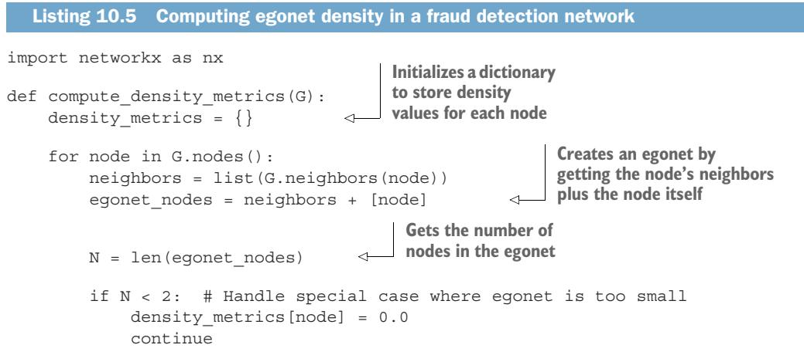

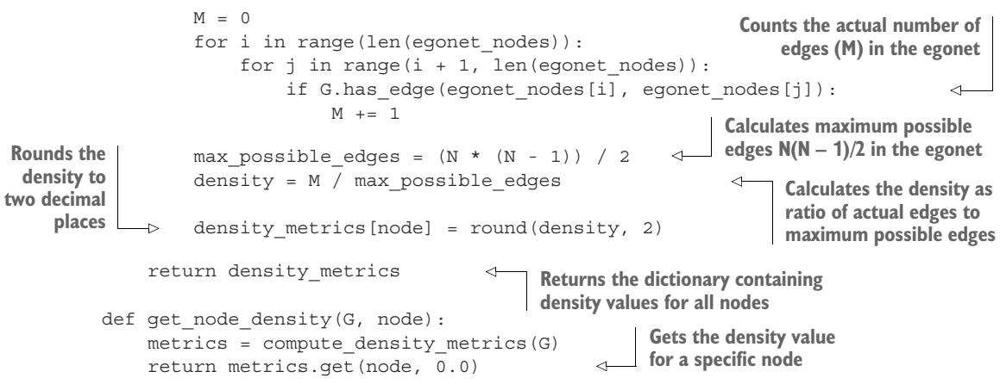

위 리스트를 우리 예제 그래프에 실행하면 표 10.3의 값이 나옵니다.

> **표 10.3** 그림 10.1 사기 그래프의 밀도 측정값

| Node | A | B | C | D | E | F | G | H | I | J |
|---|---|---|---|---|---|---|---|---|---|---|
| Density | 0.33 | 0.5 | 1 | 0.6 | 1 | 0.83 | 0.6 | 0.66 | 0.5 | 1 |

| Node | K | L | M | N | O | P | Q | R | S | T |
|---|---|---|---|---|---|---|---|---|---|---|
| Density | 0.5 | 1 | 1 | 0.66 | 0.5 | 1 | 0.5 | 1 | 1 | 1 |

밀도가 1인 노드(C, E, J, L, M, P, R, S, T 등)는 에고넷 안에서 이웃들이 서로 빠짐없이 연결되어 있다는 뜻이고, A처럼 0.33으로 낮은 노드는 이웃들끼리는 별로 연결되어 있지 않다는 뜻입니다.

지금까지 본 지표들은 노드의 **에고넷**을 사용해 값을 계산했습니다. 이제부터 나오는 지표들은 계산 과정에서 **네트워크 전체**를 고려합니다.

---

#### 10.1.4 측지 경로(또는 최단 경로) — 사기꾼까지 얼마나 가까운가

**측지 경로(geodesic path)** 또는 **최단 경로(shortest path)** 는 두 노드 사이의 최소 거리를 나타냅니다. 우리는 이 지표를 우리 도메인의 구체적 필요에 맞게 변형해서, 다운스트림 알고리즘의 입력이 될 특징을 찾아낼 수 있습니다.

우리 예제에서는 사기꾼 노드와 정상 노드 사이에 경로가 존재하는지, 그 경로가 얼마나 긴지, 그리고 네트워크에 그런 경로가 몇 개나 있는지를 알고 싶습니다. 두 노드 사이에 경로가 더 많이 존재하고 그 경로들이 짧을수록, 사기 행위가 대상 노드에 영향을 미칠 가능성이 커집니다. 이런 고려에서 우리는 **사기꾼 노드까지의 최단 경로(측지 경로)** 를 취하기로 합니다. 또 일정 거리 안에 대상 노드를 둘러싼 사기꾼이 몇이나 되는지도 알아야 하므로, 임의의 사기꾼 노드까지 이르는 1홉, 2홉, 3홉 경로의 개수를 함께 셉니다.

이번에는 코드를 보여 주기 전에, 손으로 계산할 수 있는 예부터 살펴보겠습니다. 노드 A는 노드 I와 한 홉(직접 연결)으로 이어져 있습니다. 따라서 측지 거리는 1입니다. 다른 사기꾼 노드와의 직접 연결은 없으므로, 1홉 경로의 수는 1입니다. 2홉 경로는 네 개가 있습니다. A-G-I, A-B-D, A-G-D, A-G-F가 그것이며, 이런 식으로 계속됩니다. 표 10.4를 보십시오.

> **표 10.4** 그림 10.1 사기 그래프의 측지 경로 (원문 표는 OCR로 셀 정렬이 어긋나 원형 그대로 보존합니다. 각 노드에 대해 측지 경로 길이, 1홉·2홉·3홉 경로 수가 들어 있습니다.)

<table><tr><td rowspan=1 colspan=1>Node</td><td rowspan=1 colspan=1>A</td><td rowspan=1 colspan=1>B</td><td rowspan=1 colspan=1>C</td><td rowspan=1 colspan=1>D</td><td rowspan=1 colspan=1>E</td><td rowspan=1 colspan=1>F</td><td rowspan=1 colspan=1>G</td><td rowspan=1 colspan=1>H</td><td rowspan=1 colspan=1>—</td><td rowspan=1 colspan=1></td></tr><tr><td rowspan=1 colspan=1>Geodesic paths</td><td rowspan=1 colspan=1>1</td><td rowspan=1 colspan=1>1</td><td rowspan=1 colspan=1>2</td><td rowspan=1 colspan=1>0</td><td rowspan=1 colspan=1>0</td><td rowspan=1 colspan=1>0</td><td rowspan=1 colspan=1>1</td><td rowspan=1 colspan=1>2</td><td rowspan=1 colspan=1>0</td><td rowspan=3 colspan=1>2o1</td></tr><tr><td rowspan=1 colspan=1>1-hop paths</td><td rowspan=1 colspan=1>1</td><td rowspan=1 colspan=1>1</td><td rowspan=1 colspan=1>0</td><td rowspan=1 colspan=1>2</td><td rowspan=1 colspan=1>2</td><td rowspan=1 colspan=1>2</td><td rowspan=1 colspan=1>3</td><td rowspan=1 colspan=1>0</td><td rowspan=2 colspan=1>06</td></tr><tr><td rowspan=1 colspan=1>2-hop paths</td><td rowspan=1 colspan=1>4</td><td rowspan=1 colspan=1>3</td><td rowspan=1 colspan=1>1</td><td rowspan=1 colspan=1>8</td><td rowspan=1 colspan=1>4</td><td rowspan=1 colspan=1>7</td><td rowspan=1 colspan=1>5</td><td rowspan=1 colspan=1>2</td></tr><tr><td rowspan=1 colspan=1>3-hop paths</td><td rowspan=1 colspan=1>18</td><td rowspan=1 colspan=1>13</td><td rowspan=1 colspan=1>3</td><td rowspan=1 colspan=1>19</td><td rowspan=1 colspan=1>15</td><td rowspan=1 colspan=1>17</td><td rowspan=1 colspan=1>25</td><td rowspan=1 colspan=1>4</td><td rowspan=1 colspan=1>9</td><td rowspan=1 colspan=1>0</td></tr><tr><td rowspan=1 colspan=1>Node</td><td rowspan=1 colspan=1>K</td><td rowspan=1 colspan=1>L</td><td rowspan=1 colspan=1>M</td><td rowspan=1 colspan=1>N</td><td rowspan=1 colspan=1>0</td><td rowspan=1 colspan=1>P</td><td rowspan=1 colspan=1>Q</td><td rowspan=1 colspan=1>R</td><td rowspan=1 colspan=1>S</td><td rowspan=1 colspan=1>T</td></tr><tr><td rowspan=1 colspan=1>Geodesic paths</td><td rowspan=1 colspan=1>1</td><td rowspan=1 colspan=1>2</td><td rowspan=1 colspan=1>2</td><td rowspan=1 colspan=1>1</td><td rowspan=1 colspan=1>2</td><td rowspan=1 colspan=1>3</td><td rowspan=1 colspan=1>3</td><td rowspan=1 colspan=1>4</td><td rowspan=1 colspan=1>4</td><td rowspan=1 colspan=1>2</td></tr><tr><td rowspan=1 colspan=1>1-hop paths</td><td rowspan=1 colspan=1>2</td><td rowspan=1 colspan=1>o</td><td rowspan=1 colspan=1>0</td><td rowspan=1 colspan=1>1</td><td rowspan=1 colspan=1>o</td><td rowspan=1 colspan=1>o</td><td rowspan=1 colspan=1>0</td><td rowspan=1 colspan=1>0</td><td rowspan=1 colspan=1>0</td><td rowspan=1 colspan=1>0</td></tr><tr><td rowspan=1 colspan=1>2-hop paths</td><td rowspan=1 colspan=1>0</td><td rowspan=1 colspan=1>1</td><td rowspan=1 colspan=1>1</td><td rowspan=1 colspan=1>0</td><td rowspan=1 colspan=1>1</td><td rowspan=1 colspan=1>0</td><td rowspan=1 colspan=1>0</td><td rowspan=1 colspan=1>0</td><td rowspan=1 colspan=1>0</td><td rowspan=1 colspan=1>1</td></tr><tr><td rowspan=1 colspan=1>3-hop paths</td><td rowspan=1 colspan=1>9</td><td rowspan=1 colspan=1>1</td><td rowspan=1 colspan=1>1</td><td rowspan=1 colspan=1>8</td><td rowspan=1 colspan=1>4</td><td rowspan=1 colspan=1>1</td><td rowspan=1 colspan=1>1</td><td rowspan=1 colspan=1>0</td><td rowspan=1 colspan=1>0</td><td rowspan=1 colspan=1>4</td></tr></table>

우리 네트워크는 단순해서 3홉 경로까지 세는 것도 그리 복잡하지 않습니다. 하지만 실제 네트워크에서는 이런 수동 계산이 불가능하고 실용적이지도 않습니다.

측지 경로를 계산하는 일은 계산량이 큽니다. 여러 알고리즘이 있는데, 우리 경우에 가장 좋은 것 중 하나가 **다익스트라(Dijkstra) 알고리즘**입니다.

> **참고** 다익스트라 알고리즘은 그래프에서 노드 사이의 최단 경로를 찾습니다. 아직 방문하지 않은 노드 중 잠정 거리가 가장 작은 노드를 반복적으로 골라, 그 노드를 거쳐 각 이웃까지 가는 거리를 계산하고, 그 노드를 방문 완료로 표시합니다. 이렇게 한 번에 한 정점씩 최단 경로 트리를 효율적으로 쌓아 올립니다 [3].

리스트 10.6은 측지 거리와 관련된 특징을 자동으로 추출하는 코드입니다. 이 코드는 단일 출발점으로부터의 다익스트라 알고리즘 구현을 제공하는 `networkx` 라이브러리를 사용합니다. Neo4j도 현재 GDS 라이브러리(https://github.com/neo4j/graph-data-science)에서 몇 가지 다익스트라 구현을 제공하는데, 그중 하나는 출발 노드와 거기서 도달 가능한 모든 노드 사이의 최단 경로를 계산합니다.

#### 리스트 10.6 사기 탐지 네트워크에서 측지 경로 지표 계산

```python
import networkx as nx
from collections import defaultdict

def compute_geodesic_metrics(G, max_hops=3):
    path_metrics = {}                        # 각 노드의 경로 지표를 저장할 딕셔너리
    fraudster_nodes = [n for n, attr in G.nodes(data=True)
                       if attr.get('is_fraudster', False)]
                                             # 그래프의 모든 사기꾼 노드를 식별
    for node in G.nodes():
        if G.nodes[node].get('is_fraudster', False):
            geodesic_path = 0                # 노드 자신이 사기꾼이면 가장 가까운 사기꾼까지 거리는 0
            hop_counts = defaultdict(int)
        else:
            paths_to_fraudsters = []         # 비사기꾼 노드는 모든 사기꾼까지의 경로를 계산
            hop_counts = defaultdict(int)
            for fraudster in fraudster_nodes:
                try:
                    # 다익스트라(networkx 경유)로 각 사기꾼까지 최단 경로를 찾는다
                    path = nx.shortest_path(G, node, fraudster)
                    path_length = len(path) - 1
                    paths_to_fraudsters.append(path_length)
                    if path_length <= max_hops:
                        hop_counts[path_length] += 1   # max_hops 이내 홉 거리별 경로 수를 센다
                except nx.NetworkXNoPath:
                    continue
            geodesic_path = min(paths_to_fraudsters) \
                if paths_to_fraudsters else float('inf')   # 임의의 사기꾼까지의 최단 경로 길이

        path_metrics[node] = {
            'geodesic_path': geodesic_path,
            '#1-hop_paths': hop_counts[1],
            '#2-hop_paths': hop_counts[2],   # 최단 경로와 홉 거리별 경로 수를 저장
            '#3-hop_paths': hop_counts[3]
        }
    return path_metrics                      # 각 노드의 모든 경로 지표를 담은 딕셔너리를 반환

def get_node_paths(G, node):
    metrics = compute_geodesic_metrics(G)
    return metrics.get(node, {
        'geodesic_path': float('inf'),
        '#1-hop_paths': 0,
        '#2-hop_paths': 0,
        '#3-hop_paths': 0                     # 특정 노드의 경로 지표를 가져온다
    })
```

이 구현은 출발 노드에서 **사기꾼 노드까지만**, 그리고 미리 정한 거리(`max_hops`)까지만 측지 거리를 계산합니다. 노드 자신이 사기꾼이면 거리를 0으로 두고, 아니면 모든 사기꾼까지의 최단 경로를 구한 뒤 그중 최솟값을 측지 경로로 삼습니다. 도달할 수 없는 경우(`NetworkXNoPath`)는 건너뛰고, 아무 사기꾼에도 못 닿으면 거리를 무한대(`inf`)로 둡니다.

---

#### 10.1.5 근접 중심성(Closeness) — 네트워크에서 얼마나 "가운데"에 있나

**근접 중심성(closeness centrality)** 은 한 노드가 다른 모든 노드에 얼마나 "가까운지"를 나타냅니다. 이 지표는 한 노드에서 네트워크의 다른 모든 노드까지의 평균 거리를 측정하는데, 여기서 노드 사이의 거리는 앞 절에서 설명한 측지 경로(최단 경로)로 계산합니다. N개의 노드로 이루어진 네트워크에서, 노드 i로부터 다른 노드들까지의 평균 측지 거리, 즉 **원거리도(farness)** 는 다음과 같이 계산합니다.

$$
g ( v_{i} ) = \frac { \sum_{j = 1} ^ { N } { \bf \Phi }_{( j \neq i )} d ( v_{i} , \ v_{j} ) } { N - 1 }
$$

각 부분을 하나씩 뜯어 보겠습니다.

분자 $\Sigma_{j = 1 ( j \neq i )} ^ { N } d ( v_{i} , v_{j} )$ 는 모든 최단 경로 거리를 더한 값입니다.

1. $d ( \boldsymbol { v }_{i} , \boldsymbol { v }_{j} )$ 는 노드 $v_{i}$ 와 다른 노드 $v_{j}$ 사이의 최단 경로 거리를 나타냅니다.
2. 합은 $j = 1$ 부터 $N$ 까지, 즉 네트워크의 모든 노드에 대해 돌립니다. 합 기호에 붙은 $j \neq i$ 는 자기 자신까지의 거리(0이 될)를 건너뛴다는 뜻입니다.

분모 $(N - 1)$ 은 다음을 뜻합니다.

3. $N$ 은 네트워크의 전체 노드 수입니다.
4. 자기 자신까지의 거리는 포함하지 않으므로 1을 뺍니다.
5. 그 결과 네트워크에서 자기 자신을 제외한 다른 노드의 수가 됩니다.

이렇게 이 공식은 노드 $v_{i}$ 에서 다른 모든 노드까지의 최단 경로를 전부 더한 뒤, 다른 노드의 수로 나눠 **평균**을 냅니다. $g ( v_{i} )$ 값이 낮다는 것은 그 노드가 대체로 다른 노드들과 가깝다는 뜻이고, 값이 높다는 것은 대체로 멀리 떨어져 있는 경향이 있다는 뜻입니다.

예를 들어 어떤 노드가 직접 연결이 많다면, 다른 노드까지의 최단 경로가 대체로 짧아져 $g ( v_{i} )$ 값이 낮아집니다. 이는 그 노드가 잘 연결되어 있고 네트워크에서 중심에 자리 잡고 있음을 나타냅니다. 사기 사례로 보면, 어떤 사기꾼 노드의 $g ( v_{i} )$ 값이 낮으면 사기가 네트워크를 통해 쉽게 퍼져 다른 노드를 더 빨리 오염시킬 수 있습니다.

근접 중심성은 원거리도의 역수입니다. 우리는 네트워크에서 더 중심적인 노드에 더 높은 값을 주고 싶기 때문입니다. 공식은 다음과 같습니다.

$$
{ \mathrm { c l o s e n e s s ~ c e n t r a l i t y } } ( v_{i} ) = \left( { \frac { \sum_{j = 1} ^ { N } { \mathsf { \Gamma } }_{( j \neq i )} d ( v_{i} , \ v_{j} ) } { N - 1 } } \right) ^ { - 1 }
$$

이 식은 앞의 원거리도 공식을 통째로 **역수($^{-1}$)** 취한 것입니다.

1. 괄호 안은 원거리도 $g(v_i)$, 즉 평균 최단 거리입니다.
2. 이를 역수로 만들면, 거리가 짧을수록(중심적일수록) 값이 커집니다. 그래서 "중심성"이라는 이름에 맞게 중심적인 노드가 높은 값을 갖습니다.

여기서 두 가지 문제가 생길 수 있습니다. 첫째, 네트워크 안 모든 노드의 근접 중심성 값이 서로 너무 가까워서, 차이를 보려면 소수점 아래 자리까지 봐야 할 때가 많습니다. 둘째, 어떤 노드가 다른 노드에 도달할 수 없으면(둘 사이에 경로가 없으면) 그 거리는 무한대가 됩니다. 이 문제를 피하기 위해, 근접 중심성은 **도달할 수 없는 노드까지의 거리는 제외**합니다. 즉 어떤 노드의 근접 중심성을 계산할 때는 전체 네트워크가 아니라 그 노드에서 도달 가능한 부분만 사용합니다.

다음 코드는 networkx 그래프로 표현된 네트워크에서 근접 중심성을 계산합니다.

#### 리스트 10.7 사기 탐지 네트워크에서 근접 중심성 계산

```python
import networkx as nx
from collections import defaultdict

def compute_closeness_metrics(G):
    closeness_metrics = {}                   # 각 노드의 근접 중심성 값을 저장할 딕셔너리
    for node in G.nodes():
        total_distance = 0
        reachable_nodes = 0
        # networkx로 모든 노드까지의 최단 경로를 계산
        shortest_paths = nx.single_source_shortest_path_length(G, node)
        for other_node, distance in shortest_paths.items():
            if other_node != node:           # 자기 자신은 제외
                total_distance += distance
                reachable_nodes += 1         # 도달 가능한 노드 수를 세고 거리를 합산
        n = len(G.nodes()) - 1               # 전체 노드에서 자신을 뺀 수
        if reachable_nodes > 0 and n > 0:
            closeness = (reachable_nodes / n) * (reachable_nodes / total_distance)
                                             # 비연결 성분을 고려한 정규화 근접 중심성
        else:
            closeness = 0.0
        closeness_metrics[node] = round(closeness, 2)   # 소수 둘째 자리로 반올림
    return closeness_metrics                 # 모든 노드의 근접 중심성 값을 담은 딕셔너리를 반환

def get_node_closeness(G, node):
    metrics = compute_closeness_metrics(G)
    return metrics.get(node, 0.0)            # 특정 노드의 근접 중심성 값을 가져온다

def analyze_closeness_distribution(G):
    metrics = compute_closeness_metrics(G)
    values = list(metrics.values())
    stats = {
        'max_closeness': max(values),
        'min_closeness': min(values),
        'avg_closeness': sum(values) / len(values),
        'most_central_node': max(metrics.items(), key=lambda x: x[1])[0],
        'least_central_node': min(metrics.items(), key=lambda x: x[1])[0]
    }                                        # 근접 중심성 값의 분포를 분석
    return stats
```

이 코드가 하는 일을 정리하면 다음과 같습니다. 먼저 networkx의 경로 탐색 알고리즘으로 대상 노드에서 다른 모든 노드까지의 최단 경로를 구합니다. 이 단계가 중심성 계산에 필요한 기본 거리들을 제공합니다.

그런데 현실 세계의 네트워크는 완전히 연결되어 있지 않을 수 있습니다. 이 흔한 상황을 처리하기 위해, 코드는 **도달 가능한 노드만 고려하는 정규화 전략**을 넣었습니다. 이 방식은 비연결 성분이 중심성 값을 왜곡하는 것을 막으면서도, 부분적으로만 연결된 네트워크에 대해서도 의미 있는 측정을 제공합니다. 구체적으로는 `(도달 가능 노드 / 전체-1) × (도달 가능 노드 / 총거리)` 형태로 계산해, 도달 가능한 이웃이 많고 그 거리가 짧을수록 값이 커지도록 합니다.

근접 중심성 계산은 앞에서 소개한 공식을 따릅니다. 결과를 더 실용적이고 해석하기 쉽게 만들기 위해, 근접 중심성 값이 네트워크 전반에 어떻게 분포하는지 이해하도록 돕는 분석 기능(`analyze_closeness_distribution`)도 함께 넣었습니다.

이는 네트워크 구조에서 중심점 역할을 하는 노드를 찾으려 할 때 특히 유용합니다.

이런 식으로 각 노드를 처리하면, 각 노드가 나머지 네트워크에 비해 얼마나 중심적인지에 대한 종합적인 그림을 얻습니다. 값은 비교와 분석이 쉽도록 0과 1 사이로 정규화됩니다(표 10.5 참조). 이 구현은 이론적 정확성과 실용적 적용 가능성 사이에서 균형을 잡아, 연구와 실무 양쪽에 적합합니다.

> **표 10.5** 그림 10.1 사기 그래프의 근접 중심성 지표

| Node | A | B | C | D | E | F | G | H | I | J |
|---|---|---|---|---|---|---|---|---|---|---|
| Closeness | 0.5 | 0.39 | 0.28 | 0.35 | 0.26 | 0.33 | 0.43 | 0.37 | 0.45 | 0.26 |

| Node | K | L | M | N | O | P | Q | R | S | T |
|---|---|---|---|---|---|---|---|---|---|---|
| Closeness | 0.34 | 0.26 | 0.26 | 0.34 | 0.40 | 0.29 | 0.31 | 0.24 | 0.24 | 0.34 |

노드 A가 네트워크의 다른 모든 노드에 가장 가깝게 연결되어 있습니다(0.5). 노드 R과 S(0.24)는 다른 모든 노드로부터 가장 멀리 떨어져 있습니다.

---

#### 10.1.6 매개 중심성(Betweenness) — 얼마나 자주 다리 역할을 하나

**매개 중심성(betweenness centrality)** 은 근접 중심성과는 다른 관점에서 노드의 중요도를 이해하게 해 줍니다. 근접 중심성이 한 노드가 다른 노드들에 얼마나 빨리 닿을 수 있는지를 측정한다면, 매개 중심성은 한 노드가 다른 노드들 사이에서 **얼마나 자주 다리(bridge) 역할을 하는지**를 측정합니다. 구체적으로는, 다른 노드 쌍들 사이의 최단 경로 위에 그 노드가 몇 번이나 나타나는지를 정량화합니다.

네트워크의 어떤 노드 쌍에 대해서든, 정보나 영향력은 그 둘 사이의 최단 경로를 따라 흐를 가능성이 높습니다. 어떤 노드가 이런 최단 경로들 위에 자주 등장한다면, 그 노드는 매개 중심성이 높고, 따라서 많은 다른 노드들 사이의 정보 흐름을 잠재적으로 통제할 수 있습니다. 수학적으로 노드 v의 매개 중심성은 다음과 같이 계산합니다.

$$
\mathrm{betweenness} ( v ) = \sum_{s , t \ ( s \neq t \neq v )} \ { \frac { \sigma_{s t} ( v ) } { \sigma_{s t} } }
$$

이 식을 풀어 보겠습니다.

1. $\sigma_{s t}$ 는 노드 s와 t 사이의 **최단 경로 총 개수**를 나타냅니다.
2. $\sigma_{s t} ( v )$ 는 그 최단 경로들 중에서 **노드 v를 지나가는 경로의 개수**입니다.
3. 따라서 분수 $\frac{\sigma_{st}(v)}{\sigma_{st}}$ 는 "s에서 t로 가는 최단 경로 중 v를 거치는 비율"입니다.
4. 이 합은 s도 t도 v와 같지 않은($s \neq t \neq v$) 모든 노드 쌍 s, t에 대해 더합니다. 즉 v가 다른 모든 쌍의 다리 역할을 하는 정도를 전부 합산합니다.

```python
# 리스트 10.8 사기 탐지 네트워크에서 매개 중심성 계산
import networkx as nx
from collections import defaultdict

def compute_betweenness_metrics(G, normalized=True):
    betweenness_metrics = {}                 # 모든 노드의 매개 중심성 값을 저장할 딕셔너리
    betweenness = nx.betweenness_centrality(
        G,
        normalized=normalized,
        endpoints=False                      # networkx 구현으로 매개 중심성을 계산
    )
    for node in G.nodes():
        # 가독성을 위해 소수 셋째 자리로 반올림해 저장
        betweenness_metrics[node] = round(betweenness[node], 3)
    return betweenness_metrics               # 모든 노드의 매개 중심성 값을 담은 딕셔너리를 반환

def analyze_betweenness_distribution(G):
    metrics = compute_betweenness_metrics(G)
    values = list(metrics.values())
    return {
        'max_betweenness': max(values),
        'min_betweenness': min(values),
        'avg_betweenness': sum(values) / len(values),
        # 평균 이상인 노드를 핵심 다리로 식별
        'key_bridges': [node for node, score in metrics.items()
                        if score > sum(values) / len(values)]
    }

def get_node_betweenness(G, node):
    metrics = compute_betweenness_metrics(G)
    return metrics.get(node, 0.0)            # 특정 노드의 매개 중심성 값을 가져온다

def identify_potential_bottlenecks(G, threshold=0.5):
    metrics = compute_betweenness_metrics(G)
    bottlenecks = {node: score for node, score in metrics.items()
                   if score > threshold}     # 임계값 기준으로 잠재적 병목을 식별
    return bottlenecks
```

이 코드는 networkx의 매개 중심성 알고리즘을 사용하면서, 분석과 해석에 필요한 실용 기능을 덧붙였습니다. 계산된 매개 중심성 값은 기본적으로 정규화되어 있어 0과 1 사이로 조정되므로, 서로 다른 네트워크 간에도 비교하기 쉽습니다. 값이 1에 가까울수록 그 노드가 많은 최단 경로 위에 나타나며, 따라서 정보 흐름을 통제할 잠재력이 크다는 뜻입니다.

표 10.6의 결과를 보면 흥미로운 패턴이 보입니다. 노드 A는 매개 중심성이 104로, 네트워크에서 결정적인 다리 역할을 하는 것으로 보이며, 많은 다른 노드 사이의 정보 흐름을 통제할 잠재력이 있습니다. 반면 노드 C, E, J, L, M, P, R, S, T는 모두 매개 중심성이 0으로, 어떤 노드 쌍 사이에서도 다리 역할을 하지 않음을 나타냅니다. (참고로 이 표의 값들은 정규화되지 않은 원시 매개 중심성 수치로 보이며, 위 코드의 정규화 옵션과는 별개로 제시된 결과입니다.)

이 구현에는 네트워크에서 잠재적 병목과 핵심 다리를 찾아내는 추가 분석 도구가 들어 있습니다. 이는 네트워크 구조의 취약점을 이해하거나, 사기 탐지 맥락에서 추가 감시가 필요한 노드를 식별하려 할 때 유용합니다.

> **표 10.6** 그림 10.1 사기 그래프의 매개 중심성 지표

| Node | A | B | C | D | E | F | G | H | I | J |
|---|---|---|---|---|---|---|---|---|---|---|
| Betweenness | 104 | 24.67 | 0 | 13.83 | 0 | 6.167 | 35.3 | 9 | 65 | 0 |

| Node | K | L | M | N | O | P | Q | R | S | T |
|---|---|---|---|---|---|---|---|---|---|---|
| Betweenness | 20 | 0 | 0 | 34 | 63 | 0 | 35 | 0 | 0 | 0 |

---

#### 10.1.7 페이지랭크(PageRank) — 연결의 양뿐 아니라 질까지 본다

**페이지랭크(PageRank)** 는 들어오는 연결의 구조에 기반해 노드의 중요도를 측정하는 강력한 지표입니다. 원래는 구글 창업자들이 웹 페이지의 순위를 매기려고 개발했지만, 사기 탐지를 포함한 많은 다른 네트워크 분석 맥락에서도 가치가 입증되었습니다. 더 단순한 중심성 지표들과 달리, 페이지랭크는 연결의 **양뿐 아니라 질까지** 고려합니다. 즉 순위가 높은 다른 노드들과 연결된 노드는 더 높은 페이지랭크 점수를 받습니다. 마치 유명 인사에게 추천받는 사람이 더 유력해 보이는 것과 같은 원리입니다.

우리의 사기 탐지 맥락에서는 페이지랭크를 두 가지 흥미로운 방식으로 변형할 수 있습니다. 먼저 모든 연결을 똑같이 취급하는 **기본 페이지랭크(base PageRank)** 를 계산합니다. 그런 다음, 알려진 사기꾼 노드로부터 오는 연결에 더 큰 가중치를 주는 **사기 가중 페이지랭크(fraud-weighted PageRank)** 를 계산합니다. 다음 코드에 나오는 이 이중 접근은, 노드의 일반적 중요도와 사기 활동에 대한 구체적 관련성을 함께 이해하도록 도와줍니다 [4].

```python
# 리스트 10.9 사기 탐지를 위한 페이지랭크 변형 계산
import networkx as nx
import numpy as np

def compute_pagerank_metrics(G, fraud_weight=2.0, damping_factor=0.85):
    pagerank_metrics = {}                    # 두 페이지랭크 변형을 저장할 딕셔너리
    base_pagerank = nx.pagerank(
        G,
        alpha=damping_factor,
        personalization=None,
        weight=None                          # networkx 구현으로 표준 페이지랭크 계산
    )
    fraud_personalization = {}
    for node in G.nodes():                   # 사기꾼 노드에 더 높은 가중치를 주는
        if G.nodes[node].get('is_fraudster', False):   # 개인화(personalization) 딕셔너리 생성
            fraud_personalization[node] = fraud_weight
        else:
            fraud_personalization[node] = 1.0
    fraud_pagerank = nx.pagerank(
        G,
        alpha=damping_factor,
        personalization=fraud_personalization,
        weight=None                          # 개인화를 이용해 사기 가중 페이지랭크 계산
    )
    for node in G.nodes():
        pagerank_metrics[node] = {
            'pagerank_base': round(base_pagerank[node], 3),
            'pagerank_fraud': round(fraud_pagerank[node], 3)   # 두 값을 모두 저장
        }
    return pagerank_metrics                   # 모든 페이지랭크 지표를 담은 딕셔너리를 반환

def get_node_pagerank(G, node):
    metrics = compute_pagerank_metrics(G)
    return metrics.get(node, {
        'pagerank_base': 0.0,
        'pagerank_fraud': 0.0                 # 특정 노드의 페이지랭크 값을 가져온다
    })
```

여기서 핵심은 `damping_factor=0.85` 라는 **감쇠 계수(damping factor)** 와 `personalization` 이라는 **개인화 벡터**입니다. 감쇠 계수는 페이지랭크 특유의 "확률적 서퍼"가 링크를 따라갈 확률을 조절하고, 개인화 벡터는 특정 노드(여기서는 사기꾼)에 초기 중요도를 더 실어 주어 사기 쪽으로 점수를 편향시킵니다. 예제 그래프의 각 노드에 대한 결과는 표 10.7에 나와 있습니다.

> **표 10.7** 그림 10.1 사기 그래프의 페이지랭크 지표

| Node | A | B | C | D | E | F | G | H | I | J |
|---|---|---|---|---|---|---|---|---|---|---|
| PageRank base | 0.108 | 0.057 | 0.023 | 0.068 | 0.036 | 0.051 | 0.067 | 0.04 | 0.07 | 0.024 |
| PageRank fraud | 0.087 | 0.063 | 0.018 | 0.168 | 0.114 | 0.145 | 0.109 | 0.023 | 0.094 | 0.011 |

| Node | K | L | M | N | O | P | Q | R | S | T |
|---|---|---|---|---|---|---|---|---|---|---|
| PageRank base | 0.06 | 0.041 | 0.041 | 0.057 | 0.066 | 0.026 | 0.75 | 0.028 | 0.028 | 0.022 |
| PageRank fraud | 0.039 | 0.016 | 0.016 | 0.034 | 0.02 | 0.005 | 0.011 | 0.003 | 0.003 | 0.012 |

노드 A는 기본 페이지랭크가 가장 높아(0.108) 네트워크 구조에서 일반적인 중요도가 큽니다. 그런데 사기 가중 페이지랭크를 보면, 노드 D가 가장 두드러집니다(0.168). 이는 D가 기본 페이지랭크는 가장 높지 않지만 사기 활동과 더 강한 연결을 맺고 있음을 시사합니다.

이처럼 기본 페이지랭크와 사기 가중 페이지랭크 사이의 **차이(divergence)** 는 값진 통찰을 줍니다. 기본 페이지랭크에 비해 사기 가중 페이지랭크가 크게 증가하는 노드는, 전반적인 네트워크 위치가 시사하는 것보다 알려진 사기꾼 노드들과 훨씬 실질적인 연결을 맺고 있으므로, 더 면밀히 조사할 가치가 있습니다.

---

#### 10.1.8 예측(Prediction) — 뽑아낸 특징으로 분류기를 학습시키기

여기서 특징을 계속 더 뽑아낼 수도 있지만, 이쯤 되면 그 과정이 어떻게 돌아가는지 분명해졌을 것입니다. 이 과정은 **반복적(iterative)** 이어야 합니다. 즉 분류기가 여러분이 충분하다고 느끼는 예측 품질에 도달할 때까지 특징을 바꾸고 늘려 갈 수 있습니다. 이 절에서는 지금까지 뽑은 특징들을 사용해, 9장에서 썼던 것과 같은 알고리즘(로지스틱 회귀)으로 예측을 수행합니다. 다음 코드는 각 노드에 대해 특징 벡터를 추출하고 다음 단계를 위한 데이터셋을 준비합니다.

```python
# 리스트 10.10 노드 특징 만들기
import pandas as pd
import numpy as np

def create_node_features_dataset(G):
    degree_metrics = compute_degree_metrics(G)
    triangle_metrics = compute_triangle_metrics(G)
    density_metrics = compute_density_metrics(G)
    path_metrics = compute_geodesic_metrics(G)
    closeness_metrics = compute_closeness_metrics(G)
    betweenness_metrics = compute_betweenness_metrics(G)
    pagerank_metrics = compute_pagerank_metrics(G)   # 각 노드에 대해 모든 지표를 계산
    features_dict = {}
    for node in G.nodes():
        features_dict[node] = {
            'total_degree': degree_metrics[node]['total_degree'],
            'fraud_degree': degree_metrics[node]['fraud_degree'],
            'legit_degree': degree_metrics[node]['legit_degree'],
            'total_triangles': triangle_metrics[node]['total_triangles'],
            'fraud_triangles': triangle_metrics[node]['fraud_triangles'],
            'legit_triangles': triangle_metrics[node]['legit_triangles'],
            'semi_fraud_triangles':
                triangle_metrics[node]['semi_fraud_triangles'],
            'density': density_metrics[node],
            'geodesic_path': path_metrics[node]['geodesic_path'],
            'paths_1hop': path_metrics[node]['#1-hop_paths'],
            'paths_2hop': path_metrics[node]['#2-hop_paths'],
            'paths_3hop': path_metrics[node]['#3-hop_paths'],
            'closeness': closeness_metrics[node],
            'betweenness': betweenness_metrics[node],
            'pagerank_base': pagerank_metrics[node]['pagerank_base'],
            'pagerank_fraud': pagerank_metrics[node]['pagerank_fraud'],
```

#### 라벨(Label)

```python
            # 라벨
            'is_fraudster': G.nodes[node]['is_fraudster']
        }                                    # 각 노드를 위한 종합 특징 집합을 만든다
```

#### 데이터프레임으로 변환(Convert to DataFrame)

```python
    # 데이터프레임으로 변환
    df = pd.DataFrame.from_dict(features_dict, orient='index')
    return df                                # 조작이 쉽도록 pandas 데이터프레임으로 변환
```

이 리스트는 지금까지 만든 모든 지표(차수, 삼각형, 밀도, 측지 경로, 근접 중심성, 매개 중심성, 페이지랭크)를 각 노드마다 한데 모아 하나의 특징 딕셔너리를 만들고, 마지막에 `is_fraudster` 라벨까지 붙입니다. 그런 다음 이를 조작하기 편한 pandas 데이터프레임으로 변환합니다. 이렇게 하면 각 행이 노드, 각 열이 특징인 표 형태가 됩니다.

이제 각 노드의 특징이 pandas 데이터프레임에 담겼으니, 이를 나눠 일부는 학습에, 일부는 학습된 모델의 품질을 검증하는 데 쓸 수 있습니다. 다음 코드가 그 과정입니다.

```python
# 리스트 10.11 사기 분류기를 학습하고 정확도를 평가하기
from sklearn.model_selection import train_test_split
from sklearn.linear_model import LogisticRegression
from sklearn.preprocessing import StandardScaler
from sklearn.metrics import classification_report, confusion_matrix

def train_fraud_classifier(G):
    df = create_node_features_dataset(G)
    X = df.drop('is_fraudster', axis=1)      # 특징(X)과
    y = df['is_fraudster']                   # 라벨(y)을 분리
    X_train, X_test, y_train, y_test = train_test_split(
        X, y, test_size=0.2, random_state=42, stratify=y
    )                                        # 학습 80% / 테스트 20%로 분할
    scaler = StandardScaler()
    X_train_scaled = scaler.fit_transform(X_train)   # 특징의 범위를 정규화
    X_test_scaled = scaler.transform(X_test)
    clf = LogisticRegression(random_state=42, max_iter=1000)   # 로지스틱 회귀 분류기 학습
    clf.fit(X_train_scaled, y_train)
    y_pred = clf.predict(X_test_scaled)      # 예측 수행
    feature_importance = pd.DataFrame({      # 특징 중요도를 계산
        'feature': X.columns,
        'importance': abs(clf.coef_[0])
    }).sort_values('importance', ascending=False)
    results = {                              # 모든 평가 지표를 수집
        'classification_report': classification_report(y_test, y_pred),
        'confusion_matrix': confusion_matrix(y_test, y_pred),
        'feature_importance': feature_importance,
        'model': clf,
        'scaler': scaler
    }
    return results
```

**계층적 분할(stratified split)** 은 `stratify` 파라미터를 켜서 얻는데, 학습 세트와 테스트 세트가 모두 원래 데이터셋과 같은 사기꾼/정상 비율을 유지하도록 보장합니다. `StandardScaler` 는 모든 특징을 같은 척도로 맞춰 주는데, 이는 로지스틱 회귀에 중요합니다(척도가 크게 다른 특징이 있으면 학습이 왜곡되기 때문입니다). 특징 중요도 분석은 어떤 지표가 사기꾼 노드를 탐지하는 데 가장 유용한지 이해하도록 도와줍니다.

모델이 손에 들어왔으니, 이제 다음 함수를 써서 어떤 노드가 사기꾼일 확률을 예측할 준비가 되었습니다.

```python
def predict_fraud_probability(G, node, trained_results):
    df = create_node_features_dataset(G)
    node_features = df.loc[node].drop('is_fraudster')   # 노드 특징을 가져온다
    scaled_features = trained_results['scaler'].transform(
        node_features.values.reshape(1, -1)
    )                                        # 특징을 스케일링
    fraud_prob = \
        trained_results['model'].predict_proba(scaled_features)[0][1]
    return fraud_prob                        # 사기일 확률을 반환
```

이제 모든 함수가 갖춰졌습니다. 간단한 분석과 테스트를 돌려, 어떤 노드가 사기꾼인지 정상인인지를 가리는 데 가장 중요한 상위 다섯 개 특징을 밝혀낼 수 있습니다.

```python
# 리스트 10.13 전체 과정의 결과 얻기
G = create_fraud_network()
results = train_fraud_classifier(G)          # 네트워크를 만들고 분석
print("Classification Report:")
print(results['classification_report'])      # 분류 리포트 출력
print("\nConfusion Matrix:")
print(results['confusion_matrix'])           # 혼동 행렬 출력
print("\nTop 5 Most Important Features:")
print(results['feature_importance'].head())  # 가장 중요한 상위 5개 특징 출력
node_of_interest = 'A'
prob = predict_fraud_probability(G, node_of_interest, results)
print(f"\nFraud probability for node {node_of_interest}: {prob:.3f}")
                                             # 예: 특정 노드의 사기 확률을 얻는다
```

우리는 이 결과 자체를 자세히 들여다보지는 않겠습니다. 통계적으로 의미가 있기에는 예제 그래프가 너무 작기 때문입니다. 하지만 이 과정은 더 크고 현실적인 그래프에도 똑같이 적용할 수 있습니다. 이 접근의 장점은, 과정이 복잡하고 광범위한 특징 설계와 세심한 고려가 필요했음에도 **전적으로 여러분의 통제 아래** 있고, 뽑아낸 각 특징을 그래프만 봐도 쉽게 설명할 수 있다는 점입니다. 이는 과정의 투명성을 높여 줍니다. 그래서 예를 들어 데이터베이스 크기가 제한적일 때나 설명 가능성이 중요할 때 이 방법이 유효합니다.

---

### 10.2 관계의 수동 특징 — 두 노드 사이의 연결을 표현하기

노드를 구조적 특징으로 표현하는 법을 살펴봤으니, 이제 그래프 ML의 또 다른 근본 과제로 눈을 돌립니다. 바로 **노드 사이의 관계를 어떻게 표현하느냐** 하는 문제입니다. 노드가 그래프의 일차적 구성 요소이긴 하지만, 노드 사이의 연결은 우리가 포착하고 분석해야 할 정보를 담고 있는 경우가 많습니다.

그래프의 원소들 사이에 앞으로 생길 상호작용을 예측하고 싶은 상황을 떠올려 봅시다. 여기서 **관계 예측(relationship prediction)**, 다른 말로 **링크 예측(link prediction)** 이 등장합니다. 두 단백질이 상호작용할지, 어떤 고객이 어떤 제품에 관심을 가질지, 어떤 약이 어떤 질병을 치료할 수 있을지를 예측하려 할 때, 우리는 본질적으로 같은 질문을 던집니다. **"두 노드가 주어졌을 때, 그 사이에 관계가 존재할 가능성은 얼마인가?"**

노드 분류와 마찬가지로, 관계 예측도 그래프의 원소를 ML 알고리즘이 처리할 수 있는 특징으로 변환해야 합니다. 다만 이번에는 개별 노드를 표현하는 대신, **노드 사이의 잠재적 연결이 지닌 특성**을 포착해야 합니다. 이는 관계가 존재하는지 아닌지를 예측하는 이진 분류 작업으로 볼 수도 있고, 어떤 유형의 관계가 존재할지를 예측하는 다중 클래스 분류 작업으로 볼 수도 있습니다.

이 개념들을 보여 주기 위해, **약물 재창출(drug repurposing)**, 즉 기존 약의 새로운 용도를 찾는 실용적 응용을 탐구하겠습니다. 이 작업은 약물(더 형식적으로는 **화합물(compound)**)과 질병 사이의 링크 예측 문제로 모델링할 수 있는데, 우리는 잠재적인 치료 관계를 예측하고자 합니다. 이 예제를 통해, 노드 특징 공학에서 다뤘던 개념들을 바탕으로 그래프에서 관계를 의미 있게 표현하는 여러 전략을 살펴봅니다. 9장에서 가져온 그림 10.4는 노드 분류와 링크 예측이라는 두 작업을 비교하고, 두 노드의 표현을 어떻게 결합해 관계의 표현을 얻는지를 미리 보여 줍니다.

노드 분류와의 핵심 차이는, 우리가 예측하거나 학습에 쓰려는 링크를 나타내기 위해 **노드 쌍(node pair)** 을 입력으로 쓴다는 점입니다. 따라서 링크 예측이 정확하려면, 입력으로 쓰는 노드 쌍 사이의 가능한 연결을 효과적으로 표현하는 방법이 필요합니다. 우리는 서로 다른 두 접근법을 쓸 수 있습니다.

- **노드 기반 결합(node-based combination)** — 출발 노드와 도착 노드의 특징 벡터를 결합해 관계 표현을 얻습니다. 예를 들어 노드 표현이 각각 [1,2,3]과 [4,5,6]이라면, 이어붙이기(concatenation)나 원소별 곱셈 같은 연산으로 둘을 결합해 잠재적 연결을 표현할 수 있습니다. 그림 10.4에 나오는 경우가 바로 이것입니다.
- **경로 기반 특징(path-based features)** — 노드 특징에 의존하는 대신, 그래프에서 노드들이 연결된 방식을 분석해 관계를 특징짓습니다. 각 특징은 노드 사이의 뚜렷한 경로 패턴(예: 2홉 경로의 수, 특정 메타경로의 존재 여부)을 나타내며, 이를 모아 관계의 구조적 맥락을 담은 벡터를 만듭니다.

노드 기반 결합은 노드 임베딩과 궁합이 좋고, 경로 기반 특징은 복잡한 네트워크 패턴을 포착하는 데 뛰어납니다. 이제 각각을 자세히 살펴보겠습니다.

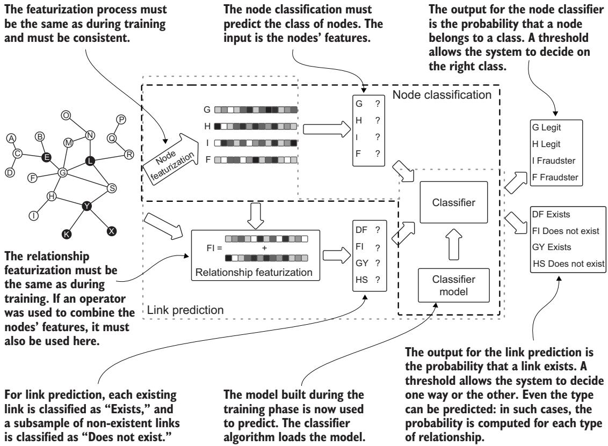

> **그림 10.4** 전형적인 관계 예측을 노드 분류 과정과 비교한 그림입니다.

#### 10.2.1 노드 기반 표현(Node-based representation) — 두 노드의 지문을 합치기

가장 직관적인 접근은 연결될 수 있는 두 노드의 특징 표현을 결합하는 것입니다. 각 노드는 자신을 설명하는 특징 집합(일종의 지문)을 가지고 있고, 우리는 이 특징들을 합쳐 그 둘 사이의 연결이 어떤 모습일지를 설명하려 합니다. 이 결합은 두 노드가 우리 그래프에서 실제로 연결되어 있든 아니든 **어떤 노드 쌍에 대해서도** 작동해야 합니다. 이것이 중요한 이유는, 링크를 예측할 때 우리가 이미 존재하는 연결과 앞으로 생길 잠재적 연결을 모두 평가해야 하기 때문입니다.

링크 예측을 염두에 두고 벡터를 결합할 때 가장 흔히 쓰는 기법들은 다음과 같습니다.

- **이어붙이기(Catenate)** — 두 벡터를 끝과 끝으로 잇습니다. 길이 n인 벡터 u와 v에 대해, u의 원소 뒤에 v의 원소를 놓아 길이 2n인 새 벡터를 만듭니다. 예를 들어 u = [1,2], $\mathbf{v} = [ 3 , 4 ]$ 이면 이어붙인 결과는 [1,2,3,4]입니다. 이 방식은 원래 정보를 모두 보존하지만, 결과 벡터의 차원이 두 배가 됩니다.
- **평균(Average)** — 두 입력 벡터의 원소별 평균을 취해 새 벡터를 만듭니다. 각 위치 $i$ 에 대해 $( \mathbf{u} [ i ] + \mathbf{v} [ i ] ) / 2$ 를 계산합니다. 이는 원래 차원을 유지하면서 두 벡터 사이의 중심 경향을 포착합니다. 예를 들어 u = [2,4], v = [4,8]이면 평균은 [3,6]입니다.

```python
# 리스트 10.14 두 노드 표현을 하나의 링크 표현으로 결합하기
def catenate(u, v):
    return u + v
def operator_avg(u, v):
    return (u + v) / 2.0
def operator_l1(u, v):
    return np.abs(u - v)
def operator_l2(u, v):
    return (u - v) ** 2
def operator_hadamard(u, v):
    return u * v
```

링크 예측의 품질은 노드 표현의 품질에 직접적으로 달려 있습니다. 결합(composition) 기법 또한 최종 품질에 영향을 줍니다. 어떤 것을 골라야 할지 알려 주는 일반적인 규칙은 없으므로, 벤치마크를 돌려 보아 여러분의 시나리오에 맞는 접근이 무엇인지 가늠하는 것이 좋습니다.

- **L1(맨해튼 거리, Manhattan distance)** — 두 벡터의 대응하는 원소 사이의 절대 차이를 계산합니다. 각 위치 i에 대해 |u[i] – v[i]|를 계산합니다. 이는 두 벡터가 각 차원에서 얼마나 다른지를 포착하며, 비유사성(dissimilarity)을 측정하는 데 유용합니다. 예를 들어 u = [1,4], v = [3,1]이면 L1 결합은 [2,3]입니다.
- **L2(유클리드 거리, Euclidean distance)** — 대응하는 원소 사이의 제곱 차이를 계산합니다. 각 위치 i에 대해 (u[i] – v[i])²를 계산합니다. L1처럼 벡터 간 차이를 포착하지만, 제곱 연산 때문에 큰 차이를 더 강조합니다. 예를 들어 u = [1,4], v = [3,1]이면 L2 결합은 [4,9]입니다.
- **아다마르 곱(Hadamard, 원소별 곱)** — 두 벡터의 대응하는 원소를 곱합니다. 각 위치 i에 대해 u[i] × v[i]를 계산합니다. 이 연산은 두 벡터의 값이 곱셈적으로 결합되어야 하는 관련 양을 나타낼 때 특히 유용합니다. 예를 들어 u = [2,4], v = [3,1]이면 아다마르 곱은 [6,4]입니다.

앞의 코드(리스트 10.14)가 이 각 방법을 어떻게 구현하는지 보여 줍니다. `catenate` 는 이어붙이기, `operator_avg` 는 평균, `operator_l1` 은 L1, `operator_l2` 는 L2, `operator_hadamard` 는 아다마르 곱에 대응합니다.

---

#### 10.2.2 경로 기반 특징(Path-based features) — 메타경로로 약과 질병을 잇기

어떤 기법들은 출발 노드와 도착 노드를 고려하되, 그 노드들의 표현을 (전혀 또는 단독으로) 사용하지 않으면서 노드 쌍 표현을 기술합니다. 이런 기법들 중 다수는 관계를 제대로 표현하기 위해 **수작업**을 요구합니다.

이 수동 표현 과정은 대체로 **도메인 특화적**이라, 도메인과 우리가 이루려는 목표를 어느 정도 이해해야 합니다. 예로, 4장에서처럼 생의학 지식 그래프와 그것이 신약 발견 또는 재창출에 어떻게 도움이 되는지를 살펴보겠습니다. 여기서도 **Hetionet** 데이터셋을 다시 사용합니다. 이 데이터셋은 19개 공개 데이터베이스의 정보를 통합한 것으로, 약물·질병·유전자·증상을 나타내는 5만 개가 넘는 노드를 담고 있습니다.

> **참고** 모든 예제를 따라오고 있다면 이 데이터베이스를 이미 갖고 있을 것입니다. 없다면 4장으로 돌아가 만드는 법을 확인하십시오.

Himmelstein 등 [5] 은 Hetionet 데이터셋을 이용해 약물 재창출에서 큰 진전을 이뤘습니다. 계산적 분석을 통해 이 원소들 사이에 200만 개가 넘는 관계를 확립했습니다. 그리고 그들의 연구는 실질적 결과를 냈습니다. 우울증과 알코올 중독에 쓰이던 기존 약이 흡연 중독과 뇌전증 치료에도 잠재력이 있음을 발견한 것입니다. 이들의 방법론적 접근을 큰 틀에서 살펴보겠습니다.

4장에서 소개했고 그림 10.5에 다시 실은 Hetionet 스키마를 생각해 봅시다. 목표는 화합물과 질병의 네트워크 연결성을 **치료 확률(probability of treatment)** 로 번역하도록 ML 모델을 학습시키는 것입니다 [6, 7]. 노드 쌍(오직 화합물과 질병만) 각각에 대해 그 사이의 네트워크 연결성을 반영하는 표현을 만들기 위해, 연구자들은 화합물에서 질병으로 이어지는, 길이 2에서 4 사이의 모든 **메타경로(metapath)** 를 평가했습니다. 그림 10.6은 유전자와 질병 사이의 예를 들어 **메타그래프(metagraph)** 와 메타경로 개념을 다시 상기시켜 줍니다.

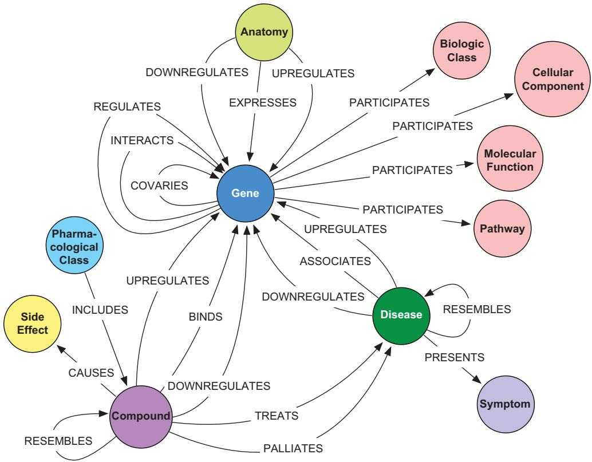

> **그림 10.5** 4장에서 제시된 Hetionet 스키마입니다.

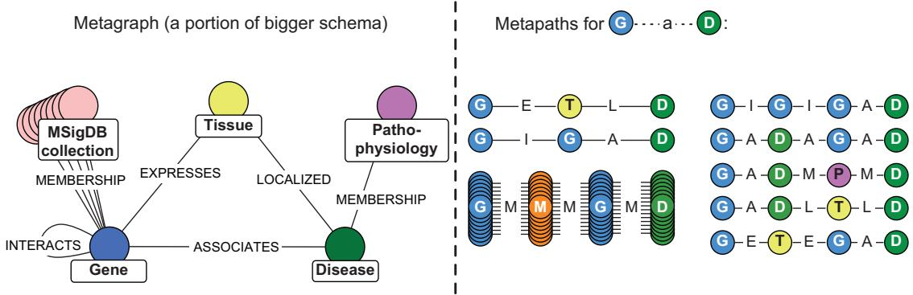

> **그림 10.6** Hetionet에서 가져온 메타그래프와 메타경로 예시입니다.

그림 10.5의 스키마에서 출발해, 화합물(Compound)과 질병(Disease) 사이의 메타경로 일부를 표 10.8에 정리했습니다. 이 메타경로들은 화합물과 질병 사이에 가능한 경로들의 한 부분집합일 뿐입니다. 이들은 직접 연결이 존재하든 아니든, **각 화합물–질병 쌍에 대한 특징**을 이룹니다.

> **표 10.8** 약물과 질병을 잇는 메타경로 예시 [5]

| 메타경로(Metapath) | 길이(Length) | 약어(Abbr.) |
|---|---|---|
| Compound–binds–Gene–associates–Disease | 2 | CbGaD |
| Compound–downregulates–Gene–upregulates–Disease | 2 | CdGuD |
| Compound–resembles–Compound–treats–Disease | 2 | CrCtD |
| Compound–binds–Gene–binds–Compound–treats–Disease | 3 | CbGbCtD |
| Compound–binds–Gene–expresses–Anatomy–localizes–Disease | 3 | CbGeAlD |
| Compound–binds–Gene–interacts–Gene–interacts–Gene–associates–Disease | 4 | CbGiGiGaD |
| Compound–binds–Gene–participates–Pathway–participates–Gene–associates–Disease | 4 | CbGpPWpGaD |

메타경로는 "화합물이 유전자에 결합하고(binds), 그 유전자가 질병과 연관된다(associates)"처럼, **노드 타입과 관계 타입의 순서열**로 정의된 경로 패턴입니다. 예를 들어 화합물 **메트포르민(metformin)** 과 질병 **제2형 당뇨병(type 2 diabetes)** 을 생각하면, 우리는 각 메타경로(CbGaD, CdGuD, CrCtD 등)마다 값을 계산해야 합니다(그림 10.7 참조). 가장 단순한 접근은 화합물과 질병 사이의 **서로 다른 경로 인스턴스를 세는 것**입니다. 그러나 단순히 경로 수를 세면, 연결성이 매우 높은 노드가 그 수를 지배할 때 오해를 부를 수 있습니다. 예를 들어 어떤 유전자가 많은 생물학적 과정에 관여하면 자연히 더 많은 경로에 등장하겠지만, 이것이 반드시 화합물과 질병 사이에 더 강하거나 의미 있는 관계가 있음을 뜻하지는 않습니다.

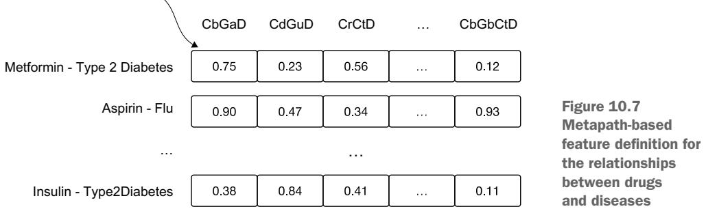

이 편향을 바로잡기 위해 우리는 **차수 가중 경로 수(DWPC, degree-weighted path count; 4장에서 더 자세히 다룸)** 를 사용합니다. DWPC는 노드 차수에 기반한 감쇠 인자(damping factor)를 적용합니다. DWPC를 계산할 때는 다음과 같이 동작합니다.

- 각 경로는 중간 노드들의 차수에 **반비례**하도록 가중됩니다.
- 연결이 많은 노드는 최종 점수에 **덜** 기여합니다.
- 이 감쇠 효과는 더 구체적이고 초점이 분명한 생물학적 경로를 부각시켜 줍니다.

예를 들어 메트포르민과 제2형 당뇨병 사이에 두 경로가 있다고 해 봅시다.

- 하나는 연결이 매우 많은 유전자(차수 100)를 지나가고,
- 다른 하나는 더 구체적인 유전자(차수 10)를 지나갑니다.

두 번째 경로가 DWPC 점수에 더 크게 기여하여, 잠재적 생물학적 의미를 더 잘 반영합니다. 이 접근은 약물 재창출에서 특히 효과적임이 입증되었는데, 생물학적 네트워크의 허브 노드에서 오는 잡음을 줄이면서 의미 있는 치료 관계를 찾아내도록 돕기 때문입니다.

다음 리스트는 CbGaD(Compound–binds–Gene–associates–Disease) 메타경로에 대해 메트포르민과 제2형 당뇨병 사이의 DWPC를 Neo4j로 계산합니다.

```cypher
// 리스트 10.15 CbGaD 메타경로에 대한 메트포르민–제2형 당뇨병 DWPC
MATCH path = (c:Compound)-[:BINDS_CbG]-(g)-[:ASSOCIATES_DaG]-(d:Disease)
WHERE c.name = 'Metformin' AND d.name = 'type 2 diabetes mellitus'
WITH
[
  count{(v)-[:BINDS_CbG]-()},
  count{()-[:BINDS_CbG]-(g)},
  count{(g)-[:ASSOCIATES_DaG]-()},
  count{()-[:ASSOCIATES_DaG]-(d)}
]
AS degrees, path, d
WITH
  d.identifier AS disease_id,
  d.name AS disease_name,
  count(path) AS PC,
  sum(reduce(pdp = 1.0, d in degrees| pdp * d ^ -0.4)) AS DWPC
RETURN
  disease_id, disease_name, PC, DWPC
```

이 쿼리의 핵심은 마지막 부분입니다. `count(path)` 로 단순 경로 수 **PC(Path Count)** 를 구하고, `reduce(pdp = 1.0, d in degrees| pdp * d ^ -0.4)` 로 경로의 각 중간 노드 차수 `d` 를 `d^(-0.4)` 로 감쇠해 곱한 뒤 합산하여 **DWPC** 를 구합니다. 여기서 지수 `-0.4` 가 바로 감쇠 인자입니다. 차수가 클수록 `d^(-0.4)` 값이 작아지므로, 허브 노드를 지나는 경로의 기여가 줄어듭니다.

우리 Hetionet 데이터베이스에서 이 쿼리를 실행하면 값 0.0007을 얻습니다. 우리는 이 값을 메트포르민–제2형 당뇨병 쌍의 벡터에서 특징 CbGaD의 값으로 사용합니다.

---

#### 연습 문제

리스트 10.15의 쿼리를 다른 화합물과 질병에 대해, 직접 연결이 있는 경우와 없는 경우 모두를 고려해 실행해 보십시오. 그런 다음 쿼리를 바꿔 다른 메타경로들도 시험해 보십시오.

리스트 10.16과 10.17은 두 개의 예를 더 보여 줍니다.

#### 리스트 10.16 CbGeAlD 메타경로에 대한 DWPC 값

```cypher
// 리스트 10.16 CbGeAlD (Compound-binds-Gene-expresses-Anatomy-localizes-Disease)
MATCH path = (c:Compound)-[:BINDS_CbG]-(g:Gene)<-[:EXPRESSES_AeG]-
             (a:Anatomy)<-[:LOCALIZES_DlA]-(d:Disease)
WHERE c.name = 'Metformin' AND d.name = 'type 2 diabetes mellitus'
WITH
[
  count{(c)-[:BINDS_CbG]-()},
  count{()-[:BINDS_CbG]-(g)},
  count{(g)<-[:EXPRESSES_AeG]-()},
  count{()-[:EXPRESSES_AeG]-(a)},
  count{(a)<-[:LOCALIZES_DlA]-()},
  count{()-[:LOCALIZES_DlA]-(d)}
] AS degrees, path, d
WITH
  d.identifier AS disease_id,
  d.name AS disease_name,
  count(path) AS PC,
  sum(reduce(pdp = 1.0, d in degrees| pdp * d ^ -0.4)) AS DWPC
RETURN disease_id, disease_name, PC, DWPC
```

이 쿼리는 길이 3짜리 메타경로 CbGeAlD를 다룹니다. 화합물이 유전자에 결합하고(BINDS), 그 유전자가 해부 구조(Anatomy)에서 발현되며(EXPRESSES), 그 해부 구조에 질병이 국소화된다(LOCALIZES)는 경로입니다. `<-` 화살표는 관계의 방향이 반대임을 나타냅니다. 구조는 리스트 10.15와 같지만, 경로가 길어진 만큼 `degrees` 리스트에 세어야 할 중간 노드 차수가 더 많아졌습니다.

아래 리스트 10.17은 길이 4짜리 메타경로 CbGpPWpGaD에 대한 DWPC를 계산합니다. 화합물이 유전자 g1에 결합하고, g1이 경로(Pathway) PW에 참여하며(PARTICIPATES), 같은 경로에 다른 유전자 g2가 참여하고, g2가 질병과 연관된다는 구조입니다.

```cypher
// 리스트 10.17 CbGpPWpGaD 메타경로에 대한 DWPC 값
MATCH path = (c:Compound)-[:BINDS_CbG]-(g1:Gene)-[:PARTICIPATES_GpPW]->
             (pw:Pathway)<-[:PARTICIPATES_GpPW]-(g2:Gene)-[:ASSOCIATES_DaG]-
             (d:Disease)
WHERE c.name = 'Metformin' AND d.name = 'type 2 diabetes mellitus'
WITH
[
  count{(c)-[:BINDS_CbG]-()},
  count{()-[:BINDS_CbG]-(g1)},
  count{(g1)-[:PARTICIPATES_GpPW]->()},
  count{()-[:PARTICIPATES_GpPW]->(pw)},
  count{(pw)<-[:PARTICIPATES_GpPW]-()},
  count{()<-[:PARTICIPATES_GpPW]-(g2)},
  count{(g2)-[:ASSOCIATES_DaG]-()},
  count{()-[:ASSOCIATES_DaG]-(d)}
] AS degrees, path, d
WITH
  d.identifier AS disease_id,
  d.name AS disease_name,
  count(path) AS PC,
  sum(reduce(pdp = 1.0, d in degrees| pdp * d ^ -0.4)) AS DWPC
RETURN disease_id, disease_name, PC, DWPC
```

모든 가능한 화합물–질병 쌍에 대해 모든 잠재적 메타경로의 DWPC 값을 계산하는 일은 계산 비용이 막대하고, 잡음이 많거나 오해를 부르는 결과로 이어질 수 있습니다. 이 난제를 풀기 위해 Himmelstein과 동료들 [5] 은 복잡도를 줄이고 모델 성능에 무관하거나 해로울 수 있는 특징을 제거하는 **2단계 접근**을 개발했습니다.

1. **메타경로 축소(Metapath reduction)** — 알려진 치료 관계와 비치료 관계에서 메타경로들이 나타나는 빈도를 분석해, 가장 유의미한 메타경로를 식별하는 통계적 방법을 개발했습니다. 이 분석으로 관련 메타경로 수를 1,026개에서 709개로 줄이면서도 높은 예측력을 유지했습니다.
2. **쌍 선택(Pair selection)** — 나아가 도메인 지식과 차수 기반 확률 분석을 사용해 가장 유망한 화합물–질병 쌍을 식별했습니다. 이 축소는 계산 부담을 줄였을 뿐 아니라, 가장 관련성 높은 쌍에 집중함으로써 분류기 성능도 향상시켰습니다.

앞서 논의한 노드 표현 결합은 더 단순한 접근을 제공하지만, **수동으로 추출한 노드 특징과 함께 쓰면 성능이 나쁜 경우가 많습니다.** 뒤에서 살펴보겠지만, 이 접근은 자동으로 추출한 특징과 함께 쓸 때 더 효과적이 됩니다.

---

#### 그래프 특징 공학에 LLM 활용하기

이 책에서 여러 번 봤듯이, LLM은 복잡한 작업을 지원할 수 있습니다. 그래프 특징 공학도 그중 하나입니다. LLM은 복잡한 패턴을 이해하고 그것을 실행 가능한 코드로 번역하는 작업에 뛰어납니다. 이는 그래프 데이터베이스를 다룰 때 특히 값집니다. 쿼리를 짜려면 대개 도메인과 쿼리 언어 양쪽을 깊이 이해해야 하기 때문입니다. 앞서 본 러닝 비유대로, 박학다식한 달변가인 LLM에게 정확한 스키마와 예시를 사실의 발판으로 쥐여 주면, 지어내는 대신 정확한 쿼리를 생성하게 만들 수 있습니다. 예를 들어 우리의 약물 재창출 사례에서 LLM은 다음을 할 수 있습니다.

- **쿼리 생성(Query generation)** — 메타경로에 대한 고수준 설명을 최적화된 Cypher 쿼리로 번역합니다.
- **특징 공학(Feature engineering)** — 곧바로 눈에 띄지 않는 관련 패턴과 관계를 제안합니다.
- **코드 생성(Code generation)** — 쿼리 결과를 실행하고 처리하는 데 필요한 인프라를 만드는 것을 돕습니다.

예를 들어 약물 재창출 네트워크에서 여러 메타경로에 대한 Cypher 쿼리를 생성해, 관계 표현을 위한 특징을 추출하고 싶다고 해 봅시다. 다음은 LLM에게 쓸 수 있는 효과적인 프롬프트입니다.

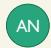

> **[프롬프트 예시]** 당신은 Neo4j와 Cypher 쿼리를 전문으로 하는 그래프 데이터베이스 전문가입니다. 저는 약물 재창출 프로젝트를 진행 중이며, 메타경로 분석을 위한 쿼리 생성에 도움이 필요합니다.
>
> 제가 제공할 것은 다음과 같습니다.
>
> - 그래프 스키마(`apoc.meta.schema()` 로 얻음)
> - CbGaD에 대한 쿼리 예시
> - Compound와 Disease 노드 사이의 메타경로 목록
> - 테스트용 샘플 화합물과 질병 이름
>
> 각 메타경로에 대해:
>
> - 경로 수(PC)와 차수 가중 경로 수(DWPC, 감쇠 인자 0.4 사용)를 모두 계산하는 Cypher 쿼리를 생성하세요
> - 경로의 각 노드에 대한 차수 계산을 포함하세요
> - disease_id, disease_name, PC, DWPC를 반환하세요
>
> 스키마는 다음과 같습니다.
>
> `{여기에 스키마 정의 또는 첨부}`
>
> DWPC 쿼리의 예는 다음과 같습니다.

```cypher
MATCH path = (c:Compound)-[:BINDS_CbG]-(g)-[:ASSOCIATES_DaG]-
             (d:Disease)
WHERE c.name = 'Metformin' AND d.name = 'type 2 diabetes mellitus'
WITH
  count{(v)-[:BINDS_CbG]-()},
  count{()-[:BINDS_CbG]-(g)},
  count{(g)-[:ASSOCIATES_DaG]-()},
  count{()-[:ASSOCIATES_DaG]-(d)}
AS degrees, path, d
WITH
  d.identifier AS disease_id,
  d.name AS disease_name,
  count(path) AS PC,
  sum(reduce(pdp = 1.0, d in degrees| pdp * d ^ -0.4)) AS DWPC
RETURN
  disease_id, disease_name, PC, DWPC
```

> 다음 메타경로들에 대한 쿼리를 생성해 주세요.
>
> - CbGaD (Compound-binds-Gene-associates-Disease)
> - CdGuD (Compound-downregulates-Gene-upregulates-Disease)
>
> `{source compound}` 를 화합물로, `{destination disease}` 를 질병으로 사용하세요.

이것은 Cypher 쿼리를 생성하는 데 쓸 수 있는 프롬프트의 한 예입니다. 그다음 파이썬 코드를 작성해 최종 표현을 만들면 됩니다. 결과가 곧바로 유용하도록 프롬프트를 바꿀 수도 있습니다. 다만 우리의 목표는 LLM을 창의적으로 활용하는 방법의 씨앗을 심는 데 있었습니다.

---

### 10.3 반자동 특징 추출 — ReFeX로 손일을 덜기

10.1절과 10.2절에서 우리는 노드와 관계 양쪽에 대한 수동 특징 공학을 탐구하며, 도메인 지식이 어떻게 의미 있는 표현을 만드는 길잡이가 되는지 보여 주었습니다. 구조적 지표와 도메인 특화 패턴을 신중히 골라 사기 탐지나 약물 재창출 같은 작업에 효과적인 특징을 만들 수 있음을 확인했습니다. 하지만 이 수동 접근은 깊은 통찰을 주는 대신 만만찮은 어려움을 안고 있습니다. 광범위한 도메인 전문성이 필요하고, 구현에 시간이 많이 들며, 새로운 사용 사례마다 맞춤화해야 합니다.

만약 수동 특징 공학의 장점, 즉 **해석 가능성, 신뢰성, 예측 가능성**을 유지하면서도 특징 선택 과정의 상당 부분을 자동화할 수 있다면 어떨까요? 바로 여기서 **ReFeX(Recursive Feature eXtraction, 재귀적 특징 추출)** [8] 가 등장합니다. ReFeX는 완전 수동 특징 공학과, 11장·12장에서 살펴볼 복잡한 신경망 접근 사이의 **중간 지대**를 제공합니다. ReFeX는 그래프에서 관련 구조적 특징을 자동으로 식별하고 추출합니다. 블랙박스 신경망 접근과 달리, ReFeX의 과정은 투명하며 도메인 전문가가 이해하고 검증할 수 있는 해석 가능한 특징을 만들어 냅니다. 이 투명성은 어떤 예측이 왜 나왔는지 설명해야 할 때 특히 값집니다. 어떤 계정이 왜 의심스럽다고 표시되었는지를 정당화해야 하는 사기 탐지 시스템을 떠올려 보십시오.

ReFeX의 또 다른 장점은 **서로 다른 그래프 간의 일관성**입니다. ReFeX가 생성하는 특징은 서로 다른 네트워크 사이에서, 혹은 같은 네트워크의 서로 다른 시점 스냅샷 사이에서 의미 있게 비교할 수 있습니다. 이는 더 복잡한 신경망 접근으로는 거의 불가능한 일입니다. 이 성질 덕분에 ReFeX는 그래프 구조가 시간에 따라 어떻게 진화하는지 추적하거나, 서로 다른 네트워크의 패턴을 비교해야 하는 응용에 특히 유용합니다.

이 장점들을 보여 주기 위해, 먼저 작은 예제에서 ReFeX의 특징을 손으로 계산하며 작동 원리를 살펴보겠습니다. 그런 다음, 수동 특징 공학이 비현실적일 만큼 크고 실제적인 시나리오에 어떻게 적용되는지 보겠습니다.

ReFeX는 그래프 구조로부터 국소 특징과 에고넷 특징을 **재귀적으로 생성**해 작동하며, 우리가 앞서 손으로 계산했던 여러 지표를 자동으로 포착합니다. 이 접근의 핵심 장점은 다음과 같습니다.

- **효율성(Efficiency)** — 재귀적 구조 특징을 자동으로 추출합니다.
- **일관성(Consistency)** — 특징 생성에 체계적으로 접근합니다.
- **해석 가능성(Interpretability)** — 명확한 구조적 의미를 유지하는 특징을 생성합니다.
- **확장성(Scalability)** — 특징 품질을 유지하면서 더 큰 그래프를 다룰 수 있습니다.

그럼에도 이 과정에서 **사람의 감독은 여전히 필수적**입니다. 도메인 전문가는 다음을 할 수 있습니다.

- 생성된 특징의 관련성을 검증합니다.
- 특징 선택을 이끌도록 도메인 지식을 반영합니다.
- 특징이 사기 탐지에 기여하는 바를 이해하고 설명합니다.
- 구체적 요구에 맞춰 특징 추출 과정을 수정합니다.

이 하이브리드 접근은, 뒤에서 다룰 완전 자동 특징 학습 방법 논의의 무대를 마련해 줍니다. 거기서는 딥러닝 기법이 사람의 개입 없이 특징을 추출하되, 해석 가능성을 잠재적으로 더 정교한 패턴 인식과 맞바꾸는 모습을 보게 될 것입니다.

ReFeX는 국소(노드 기반) 특징을 노드 이웃에서 오는 특징(에고넷 기반)과 재귀적으로 결합해 특징을 계산합니다. 이렇게 하면 알고리즘은 **지역 특징(regional features)** 을 만들어 내는데, 이는 "행동적(behavioral)" 정보를 포착합니다. 즉 어떤 노드가 **어떤 종류의 노드들과 연결되어 있는지**를 나타내며, 그 노드들의 **정체성**이 아니라 그 성격을 담습니다. 서로 다른 그래프를 가로질러 마이닝할 때 중요한 것은, 여러분이 **누구를 아느냐, 누구와 관계 맺느냐**입니다.

ReFeX 과정은 두 가지 근본 규칙에 기반합니다.

- **구조적(Structural)** — 특징 행렬 F의 구성은 노드나 링크에 대한 추가 속성 정보를 요구하지 않아야 합니다.
- **효과적(Effective)** — 좋은 노드 특징은 (1) 속성이 주어져 있을 때 노드 속성을 예측하는 데 도움이 되어야 하고 (2) 그래프 간에 전이 가능해야 합니다(예: 그래프가 시간에 따라 변할 때).

이상적인 특징 집합은 데이터 마이닝 작업을 도와야 합니다. 전형적인 작업으로는 (라벨이 일부 주어졌을 때의) 노드 분류, 그래프 노드의 비익명화(de-anonymization), 전이 학습이 있습니다. 그림 10.8은 이 과정의 입력과 출력을 아주 단순하게 나타냅니다.

ReFeX는 노드 라벨이나 타입을 고려하지 않고, 그래프의 **순수한 구조적 측면**(노드와 관계)만으로 작동합니다. 이렇게 위상(topology)에 집중함으로써 알고리즘은 구조적 패턴을 식별할 수 있습니다. 특징 추출 과정은 크게 세 단계로 이뤄집니다.

1. **국소 특징 추출(Local feature extraction)** 은 노드의 바로 곁 특성에 집중합니다. 이 수준의 주된 지표는 노드 차수이며, 가중·비가중 변형을 모두 포함합니다. 방향 그래프를 다룰 때 ReFeX는 진입 차수(in-degree)와 진출 차수(out-degree)를 따로 계산합니다. 가중 그래프에서는 인접 간선 가중치의 합으로 가중 차수를 계산해 노드 연결성을 더 세밀하게 봅니다.

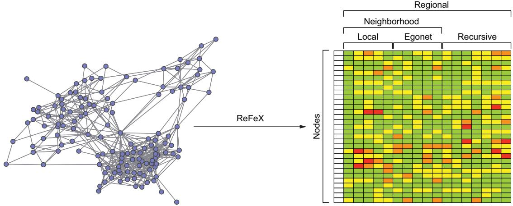

> **그림 10.8** ReFeX는 각 노드를, 서로 다른 스케일에서의 노드 위상 특징을 나타내는 벡터로 변환합니다 [8].

2. **에고넷 특징 검토(Examination of egonet features)** 는 각 노드의 바로 곁 이웃을 분석합니다. 이 수준에서 ReFeX는 에고넷으로 들어오는 간선 수, 나가는 간선 수, 전체 에고넷 간선 수 같은 지표를 계산합니다. 가중 그래프에서는 이 지표들의 가중 변형도 계산해 에고 네트워크 안 연결의 강도를 포착합니다.
3. **재귀적 특징 추출(Recursive feature extraction)** 은 요약 통계를 재귀적으로 적용해 기존 특징들을 집계합니다. 이 과정은 집계 함수(합/평균)의 조합을 사용해 점점 더 복잡한 구조적 패턴을 포착합니다. 예를 들어 `degree(sum)(mean)(mean)(sum)` 같은 특징은 바로 곁 이웃을 넘어서는 지역 구조 패턴을 포착할 수 있습니다. 방향 그래프에서 ReFeX는 이런 재귀 특징을 들어오는 경로와 나가는 경로에 대해 따로 계산해, 네트워크의 방향성 패턴을 종합적으로 봅니다.

이 알고리즘의 재귀적 성질은 특징 수를 **기하급수적으로** 늘릴 수 있습니다. 이 복잡도를 관리하기 위해 ReFeX는 몇 가지 가지치기(pruning) 기법을 씁니다.

- **상관 분석(Correlation analysis)** — 서로 강하게 상관된 특징 쌍을 식별해 제거합니다.
- **로그 구간화(Logarithmic binning)** — 효율적 비교를 위해 특징 값을 이산 구간에 매핑합니다.
- **임계값 기반 가지치기(Threshold-based pruning)** — 지정한 임계값보다 차이가 작은 특징을 제거합니다.

---

#### 10.3.1 ReFeX를 손으로 수행하기 — 한 노드씩 따라가며

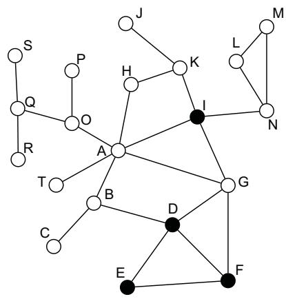

> **그림 10.9** 우리의 단순한 사기 네트워크입니다. 이 경우 노드의 색은 무시됩니다. ReFeX는 노드 타입을 고려하지 않기 때문입니다.

그림 10.9의 작은 그래프 데이터베이스에 ReFeX를 손으로 적용해 보겠습니다. 단순함을 위해 무향·비가중 그래프를 다루고, 가지치기 단계는 수행하지 않겠습니다. 표 10.9는 각 노드의 차수를 보여 줍니다.

> **표 10.9** 그림 10.9 노드들의 차수

| Node | Degree |
|---|---|
| A | 6 |
| B | 3 |
| C | 1 |
| D | 4 |
| E | 2 |
| … | … |

이 결과는 10.1.1절과 동일합니다. 이것은 방향 그래프가 아니므로 진입 차수와 진출 차수는 계산할 수 없습니다.

다음 단계는 각 노드의 **에고넷**을 살피는 것입니다. 예를 들어 노드 A의 에고넷은 A 자신과 그 이웃 B, G, H, I, O, T로 구성됩니다. 에고넷 안 노드의 총수는 7개(A + 이웃 6)입니다. 내부 간선의 총수는 7개인데, A와 이웃을 잇는 6개의 간선에 더해 G와 I 사이의 간선 1개가 있기 때문입니다. 에고넷을 드나드는(in/out) 간선의 총수는 9개입니다. 이는 A의 에고넷 안 노드를 바깥 노드와 잇는 간선들로, B→C,D / G→D,F / H→K / I→K,N / O→P,Q가 그것입니다. 표 10.10은 각 노드에 대한 총값을 정리합니다.

> **표 10.10** 그림 10.9 노드들의 에고넷 구조 상세 (원문 표는 OCR로 일부 셀 정렬이 어긋나 원형 그대로 보존합니다. 열은 "노드 에고넷 / 노드 수 / 내부 간선 수 / 드나드는 간선 수"입니다.)

<table><tr><td rowspan=1 colspan=1>Node's egonet</td><td rowspan=1 colspan=1># of nodes</td><td rowspan=1 colspan=1># of internal edges</td><td rowspan=1 colspan=1># of in/out edges</td></tr><tr><td rowspan=1 colspan=1>A</td><td rowspan=1 colspan=1>7</td><td rowspan=1 colspan=1>7</td><td rowspan=6 colspan=1>95143·.·</td></tr><tr><td rowspan=1 colspan=1>B</td><td rowspan=1 colspan=1>4</td><td rowspan=1 colspan=1>3</td></tr><tr><td rowspan=1 colspan=1>C</td><td rowspan=1 colspan=1>2</td><td rowspan=1 colspan=1>1</td></tr><tr><td rowspan=1 colspan=1>D</td><td rowspan=1 colspan=1>5</td><td rowspan=1 colspan=1>6</td></tr><tr><td rowspan=1 colspan=1>E</td><td rowspan=1 colspan=1>3</td><td rowspan=2 colspan=1>3…·</td></tr><tr><td rowspan=1 colspan=1>·.·</td><td rowspan=1 colspan=1>·…·</td></tr></table>

ReFeX의 마지막 단계는 **재귀적 특징 집계(recursive feature aggregation)** 입니다. 이는 여러 단계에 걸친 과정으로, 점점 더 넓은 네트워크 특성을 점진적으로 포착합니다. 알고리즘은 반복(iteration)마다 점점 더 멀리 떨어진 이웃들의 특징을 집계해, 각 노드의 구조적 맥락에 대한 더 종합적인 그림을 만듭니다. 그림 10.10이 우리 예제 그래프로 이 과정을 보여 줍니다.

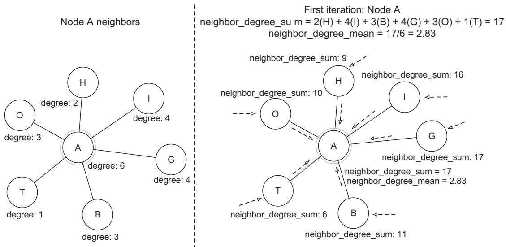

원문에는 이 지점에 OCR로 심하게 깨진 수식 블록이 하나 있습니다. 주변 본문이 값을 명확히 알려 주므로, 깨진 원형 대신 그 의미를 복원해 제시합니다. 노드 A에 대해 "이웃들의 합을 다시 합한 값(neighbor_sum_of_sums)"과 "이웃들의 합의 평균(neighbor_mean_of_sums)"을 뜻하며, 값은 다음과 같습니다.

$$
\text{neighbor\_sum\_of\_sums} = 69, \qquad \text{neighbor\_mean\_of\_sums} = 69 / 6 = 11.5
$$

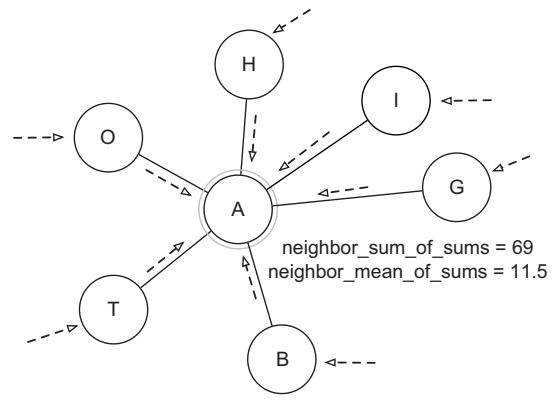

> **그림 10.10** ReFeX 과정의 몇 차례 반복을 나타낸 도해입니다. 각 반복마다 각 노드는 자신의 값(차수, 이전 합계 등)을 이웃에게 전달하고, 이웃은 그것을 집계합니다.

노드 A를 예로 삼아 과정을 따라가 보겠습니다.

**1. 첫 번째 반복:**

- 노드 A는 이웃이 6개(H, I, G, B, T, O) 있습니다.
- 국소 특징: degree(A) = 6
- SUM 연산자를 이용한 첫 집계:

$$
\begin{array}{l l} { { \mathrm{sum} ( \mathrm { n e i g h b o r \_ d e g r e e s } ) = \mathrm{degree} ( H ) + \mathrm{degree} ( I ) + \mathrm{degree} ( G ) + \mathrm{degree} ( B ) } } \\ { { \qquad \quad + \mathrm{degree} ( T ) + \mathrm{degree} ( O ) } } \\ { { \mathrm{sum} ( \mathrm { n e i g h b o r \_ d e g r e e s } ) = 2 + 4 + 4 + 3 + 1 + 9 = 1 7 } } \end{array}
$$

이 식은 A의 여섯 이웃의 차수를 모두 더한 것입니다. 각 이웃의 차수(H=2, I=4, G=4, B=3, T=1, O=9)를 합하면 17이 됩니다.

**2. 두 번째 반복:**

- 첫 번째 반복에서 집계한 값들을 사용합니다.
- 이제 각 이웃은 자신의 첫 번째 반복 합계(agg)를 지니고 있습니다.
- 두 번째 집계:

$$
{ \begin{array}{r l} & { \operatorname { s u m } ( { \mathrm{neighbor} }_{-} { \mathrm{aggregates} } ) = \operatorname { a g g } ( B ) + \operatorname { a g g } ( G ) + \operatorname { a g g } ( H ) + \operatorname { a g g } ( I ) + \operatorname { a g g } ( O ) + \operatorname { a g g } ( T ) } \\ & { \operatorname { s u m } ( { \mathrm{neighbor} }_{-} { \mathrm{aggregates} } ) = 1 1 + 1 7 + 9 + 1 6 + 1 0 + 6 = 6 9 } \end{array} }
$$

이번에는 이웃들의 차수 대신, 각 이웃이 첫 번째 반복에서 계산한 합계(agg)를 다시 더합니다. B=11, G=17, H=9, I=16, O=10, T=6을 합하면 69가 됩니다. 이렇게 반복을 거듭할수록 더 먼 이웃의 정보가 A에게 스며듭니다.

또한 ReFeX는 집계에 **MEAN(평균) 연산자**도 쓸 수 있습니다. 노드 A에 대해서는 다음과 같이 됩니다.

첫 번째 반복:

$$
\mathrm { { m e a n } ( n e i g h b o r \_ d e g r e e s ) } = ( 3 + 4 + 2 + 4 + 3 + 1 ) / 6 = 1 7 / 6 \approx 2 . 8 3
$$

두 번째 반복:

$$
\mathrm { { m e a n } ( n e i g h b o r \_ a g g r e g a t e s ) = ( 1 1 + 1 7 + 9 + 1 6 + 1 0 + 6 ) / 6 = 6 9 / 6 = 1 1 . 5 } }
$$

(원문 두 번째 반복 수식 끝에 붙은 "×10⁻⁴"는 OCR 오류로 보이며, 실제 값은 69/6 = 11.5입니다.) 표 10.11은 이 반복들을 마친 뒤(가지치기 전) 노드 A에 대한 결과를 보여 줍니다.

> **표 10.11** 노드 A에 대해 계산된 특징

| 특징 유형(Feature type) | 특징(Feature) | 값(Value) |
|---|---|---|
| 국소 특징 | 차수(Degree) | 6 |
| 에고넷 특징 | 에고넷의 간선 수 | 7 |
| 재귀 특징, 첫 번째 반복 | 이웃 차수의 합 | 17 |
|  | 이웃 차수의 평균 | 2.83 |
| 재귀 특징, 두 번째 반복 | 이웃 합계의 합 | 69 |
|  | 이웃 합계의 평균 | 11.5 |

---

#### 10.3.2 코드로 ReFeX를 자동 수행하기

알고리즘의 전체 구현은 이 책의 코드 저장소에 있습니다. 다음 리스트는 코드에서 가장 중요한 부분을 보여 줍니다.

```python
# 리스트 10.18 ReFeX 구현(핵심 부분)
import networkx as nx
import numpy as np
from collections import defaultdict
from sklearn.preprocessing import StandardScaler

class ReFeX:
    def __init__(self, max_iterations=2, correlation_threshold=0.95):
        # 반복 한계와 상관 임계값으로 ReFeX를 초기화
        self.max_iterations = max_iterations
        self.correlation_threshold = correlation_threshold

    def extract_features(self, G):
        # 기본 노드 수준 특징(차수)을 추출해 특징 행렬을 초기화
        features = self._extract_local_features(G)
        # 에고넷 기반 특징을 추가
        egonet_features = self._extract_egonet_features(G)
        features = np.column_stack((features, egonet_features))
        for iteration in range(self.max_iterations):
            # 재귀적 특징을 생성해 반복적으로 추가
            new_features = self._generate_recursive_features(G, features)
            features = np.column_stack((features, new_features))
        # 상관 기반으로 중복 특징을 제거
        features = self._prune_features(features)
        return features

    def _extract_local_features(self, G):
        """국소(노드 수준) 특징을 추출한다"""
        n_nodes = G.number_of_nodes()
        features = np.zeros((n_nodes, 3))
        for idx, node in enumerate(G.nodes()):
            # 차수 특징
            features[idx, 0] = G.degree(node)
            # 방향 그래프의 진입 차수와 진출 차수
            if G.is_directed():
                features[idx, 1] = G.in_degree(node)
                features[idx, 2] = G.out_degree(node)
            else:
                features[idx, 1] = features[idx, 2] = G.degree(node)
        return features

    def _extract_egonet_features(self, G):
        # 각 노드의 에고넷 기반 특징을 계산
        n_nodes = G.number_of_nodes()
        features = np.zeros((n_nodes, 3))
        for idx, node in enumerate(G.nodes()):
            ego = nx.ego_graph(G, node, radius=1)
            features[idx, 0] = ego.number_of_nodes()
            features[idx, 1] = ego.number_of_edges()
            features[idx, 2] = nx.density(ego)
        return features

    def _generate_recursive_features(self, G, current_features):
        # 합과 평균 집계로 재귀 특징을 생성
        n_nodes = G.number_of_nodes()
        n_features = current_features.shape[1]
        new_features = np.zeros((n_nodes, n_features * 2))
        for idx, node in enumerate(G.nodes()):
            neighbors = list(G.neighbors(node))
            if not neighbors:
                continue
            neighbor_feats = \
                current_features[[list(G.nodes()).index(n) for n in neighbors]]
            new_features[idx, :n_features] = np.sum(neighbor_feats, axis=0)
            new_features[idx, n_features:] = np.mean(neighbor_feats, axis=0)
        return new_features

    def _prune_features(self, features):
        # 강하게 상관된 특징을 식별해 제거
        scaler = StandardScaler()
        scaled_features = scaler.fit_transform(features)   # 특징을 표준화
        corr_matrix = np.corrcoef(scaled_features.T)       # 상관 행렬을 계산
        to_remove = set()
        for i in range(corr_matrix.shape[0]):              # 강하게 상관된 특징을 찾는다
            for j in range(i + 1, corr_matrix.shape[1]):
                if abs(corr_matrix[i, j]) > self.correlation_threshold:
                    to_remove.add(j)
        keep_features = list(set(range(features.shape[1])) - to_remove)
        return features[:, keep_features]                  # 상관 없는 특징만 남긴 가지치기 행렬을 반환
```

이 코드가 앞의 세 단계를 어떻게 코드로 옮겼는지 짚어 보겠습니다.

##### 차수 특징(Degree features)

`_extract_local_features` 는 각 노드의 차수를 특징 행렬의 첫 열에 넣습니다(`features[idx, 0] = G.degree(node)`). 이것이 국소 특징 추출 단계에 해당합니다.

##### 방향 그래프의 진입 차수와 진출 차수(In-degree and out-degree for directed graphs)

그래프가 방향 그래프이면(`G.is_directed()`), 진입 차수와 진출 차수를 각각 둘째·셋째 열에 따로 넣습니다. 무향 그래프이면 두 열 모두 전체 차수로 채웁니다. 그다음 `_extract_egonet_features` 가 에고넷의 노드 수, 간선 수, 밀도를 계산해 에고넷 특징을 만들고, `_generate_recursive_features` 가 이웃들의 특징을 합(`np.sum`)과 평균(`np.mean`)으로 집계해 재귀 특징을 만듭니다. 마지막으로 `_prune_features` 가 특징을 표준화한 뒤 상관 행렬을 구해, 상관 계수가 임계값(0.95)을 넘는 특징 쌍을 찾아 그중 하나를 제거하는 가지치기를 수행합니다.

#### 연습 문제

이 책의 코드 저장소에는 Neo4j에서 사용 가능한 Hetionet 데이터베이스에 연결하는 전체 코드가 있습니다. 직접 실행해 보십시오.

ReFeX는 자동 특징 추출을 향한 의미 있는 한 걸음으로, 수동 특징 공학과 완전 자율 표현 학습 기법 사이의 중요한 중간 지대를 차지합니다. 순수한 그래프 구조에 집중하는 이 방식은 더 복잡한 접근을 이해하는 훌륭한 토대를 제공하며, 구조적 패턴만으로도 노드와 그 이웃의 의미 있는 특성을 포착할 수 있음을 보여 줍니다. ReFeX는 특징 추출을 자동화하면서도 투명성과 해석 가능성을 유지합니다. 그 계산은 단계별로 추적하고 검증할 수 있어, 특징 공학 과정을 이해하고 검증해야 하는 실무자에게 값진 도구가 됩니다. 또한 ReFeX의 **결정론적(deterministic)** 성질은 일관성을 보장합니다. 동일한 입력은 항상 동일한 출력을 냅니다. 이 예측 가능성은 재현성이 필수인 프로덕션 환경에서 특히 값집니다. 나아가 그래프 구조가 바뀌면, ReFeX는 전체 특징 행렬을 다시 만드는 대신 영향받은 특징만 선택적으로 재계산할 수 있습니다. 이 효율성 덕분에 ReFeX는 동적으로 변하는 그래프 환경에 특히 잘 맞습니다.

다만 ReFeX에도 한계가 있습니다. 구조적 특징에 의존한다는 것은 노드 속성이나 간선 타입을 직접 반영할 수 없다는 뜻입니다. 그리고 가지치기가 계산 복잡도를 관리하는 데 도움을 주긴 하지만, 최적의 특징 선택을 보장하려면 때때로 사람의 감독이 필요합니다.

다음 장에서는 현대의 자율 표현 학습 기법이 이런 한계를 어떻게 다루는지 보게 됩니다. 그 대가로 ReFeX를 특정 응용에서 값지게 만드는 해석 가능성과 결정론적 성질의 일부를 희생하게 됩니다. ReFeX의 강점과 한계를 이해하면, 이런 더 진보된 방법들이 가져오는 혁신과 트레이드오프를 제대로 음미할 맥락을 갖추게 됩니다.

---

#### 요약(Summary)

- 그래프에서의 수동 및 반(半)수동 특징 공학은 ML 작업의 토대를 제공하며, 해석 가능성과 자동화 사이의 균형을 잡습니다.
- 수동 특징 공학은 국소 지표와 전역 지표를 결합해, 바로 곁 연결과 더 넓은 네트워크 패턴을 모두 담는 의미 있는 노드 표현을 만듭니다.
- 노드 지표들을 결합하면 패턴을 식별하는 데 도움이 되면서도, 해석 가능한 의사 결정 과정을 유지할 수 있습니다.
- 관계 표현은 노드 기반 결합(이어붙이기, 평균, 거리)이나 경로 기반 특징(메타경로, 구조적 패턴)으로 접근할 수 있습니다.
- 노드 기반 관계 표현은 다양한 결합 방법을 쓸 수 있습니다. 이어붙이기, 평균, L1/L2 거리, 아다마르 곱이 그것입니다.
- 경로 기반 특징은 메타경로 분석을 통해 노드 사이의 구조적 패턴을 포착합니다.
- DWPC(차수 가중 경로 수)는 노드 차수를 고려하면서 연결의 관련성을 측정하는 정교한 접근을 제공합니다.
- 도메인 전문성은 노드와 관계 표현 양쪽에서, 지표 선택부터 결과 검증까지 특징 공학을 이끕니다.
- ReFeX 같은 반자동 접근은, 도메인 지식을 반영할 여지를 남기면서도 해석 가능한 특징을 자동으로 생성함으로써 중간 지대를 제공합니다.
- 수동 접근과 반자동 접근 사이의 선택은 해석 가능성 요구, 계산 자원, 사용 가능한 도메인 전문성에 달려 있습니다.
- 특징 가지치기와 선택은 두 접근 모두에서 여전히 필수적이며, 특정 ML 작업과의 상관성과 관련성을 신중히 따져야 합니다.

---

## 핵심 용어 해설

| 용어 (영문) | 뜻풀이 |
|---|---|
| 벡터화 / 특징화 (vectorization / featurization) | 그래프의 노드·관계·그래프 전체를 ML이 처리할 수 있는 숫자 벡터로 바꾸는 표현 단계. |
| 특징 공학 (feature engineering) | 그래프 성질과 도메인 지식에 기반해 사람이 직접 특징을 설계하는 방식. 해석 가능성이 높지만 손이 많이 감. |
| 표현 학습 (representation learning) | 그래프 구조로부터 특징 표현을 자동으로 학습하는 방식. 사람 개입이 적지만 해석이 어려움. |
| 차수 (degree) | 노드가 가진 이웃의 수. 사기 도메인에서는 사기 차수·정상 차수로 세분함. |
| 에고넷 (egonet, ego-centered network) | 특정 노드(에고)와 그 바로 곁 이웃(알터)들로 이뤄진 국소 네트워크. |
| 에고 / 알터 (ego / alters) | 에고넷의 중심 노드가 에고, 그 주변 이웃 노드들이 알터. |
| 삼각형 (triangle) | 세 노드가 서로 모두 연결된 부분 그래프. 이웃 간 강한 결속을 나타냄. |
| 반사기 삼각형 (semifraudulent triangle) | 삼각형의 두 알터 중 한 명만 사기꾼인 경우. |
| 밀도 (density) | 가능한 최대 간선 수 대비 실제 간선 수의 비율. 0\~1 사이 값. |
| 측지 경로 / 최단 경로 (geodesic / shortest path) | 두 노드 사이의 최소 거리(홉 수). |
| 다익스트라 알고리즘 (Dijkstra's algorithm) | 잠정 거리가 가장 작은 노드를 반복 선택하며 최단 경로 트리를 쌓는 알고리즘. |
| 근접 중심성 (closeness centrality) | 한 노드가 다른 모든 노드에 얼마나 가까운지. 원거리도(평균 최단 거리)의 역수. |
| 원거리도 (farness) | 한 노드에서 다른 모든 노드까지의 평균 최단 거리. |
| 매개 중심성 (betweenness centrality) | 다른 노드 쌍들의 최단 경로 위에 한 노드가 얼마나 자주 나타나는지. 다리 역할의 정도. |
| 페이지랭크 (PageRank) | 들어오는 연결의 양과 질을 함께 고려한 노드 중요도 지표. |
| 감쇠 계수 (damping factor) | 페이지랭크에서 확률적 서퍼가 링크를 따라갈 확률을 조절하는 계수(보통 0.85). |
| 개인화 (personalization) | 페이지랭크에서 특정 노드(예: 사기꾼)에 초기 중요도를 더 실어 주는 벡터. |
| 계층적 분할 (stratified split) | 학습/테스트 세트가 원본과 같은 클래스 비율을 유지하도록 나누는 분할. |
| 링크 예측 / 관계 예측 (link / relationship prediction) | 두 노드 사이에 관계가 존재할 가능성을 예측하는 작업. |
| 약물 재창출 (drug repurposing) | 기존 약의 새로운 치료 용도를 찾는 작업. 화합물–질병 링크 예측으로 모델링. |
| 화합물 (compound) | 약물을 형식적으로 이르는 말. Hetionet의 노드 타입 중 하나. |
| 노드 기반 결합 (node-based combination) | 두 노드의 특징 벡터를 결합(이어붙이기·평균·거리·아다마르 곱)해 관계를 표현하는 방식. |
| 아다마르 곱 (Hadamard product) | 두 벡터의 대응 원소를 곱하는 원소별 곱셈. |
| 경로 기반 특징 (path-based features) | 노드가 연결된 방식(경로 패턴)을 분석해 관계를 특징짓는 방식. |
| Hetionet | 19개 공개 DB를 통합한 생의학 지식 그래프. 5만+ 노드, 200만+ 관계. |
| 메타경로 / 메타그래프 (metapath / metagraph) | 노드 타입과 관계 타입의 순서열로 정의된 경로 패턴 / 그 상위 스키마. |
| DWPC (degree-weighted path count) | 중간 노드 차수에 반비례하는 감쇠를 적용한 차수 가중 경로 수. 허브 노드 잡음을 줄임. |
| PC (path count) | 두 노드 사이 서로 다른 경로 인스턴스의 단순 개수. |
| ReFeX (Recursive Feature eXtraction) | 국소·에고넷 특징을 재귀적으로 집계해 해석 가능한 구조 특징을 자동 생성하는 반자동 기법. |
| 지역 특징 (regional features) | 한 노드가 "어떤 종류의 노드들과 연결되어 있는지"를 담는 행동적 특징. |
| 가지치기 (pruning) | 상관 분석·로그 구간화·임계값 기반으로 불필요하거나 중복된 특징을 제거하는 과정. |
| 결정론적 (deterministic) | 동일한 입력이 항상 동일한 출력을 내는 성질. 재현성에 유리함. |
