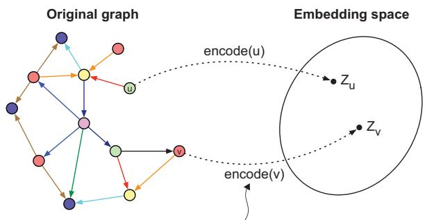
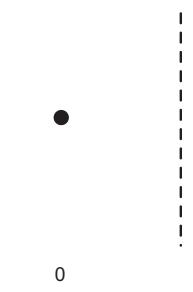
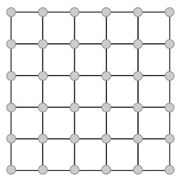
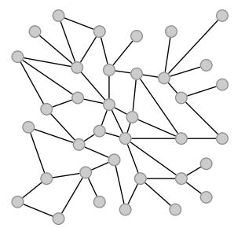
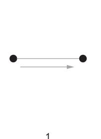
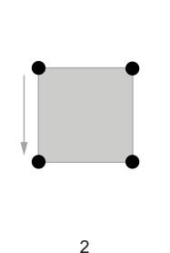
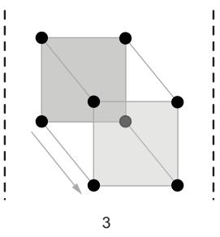
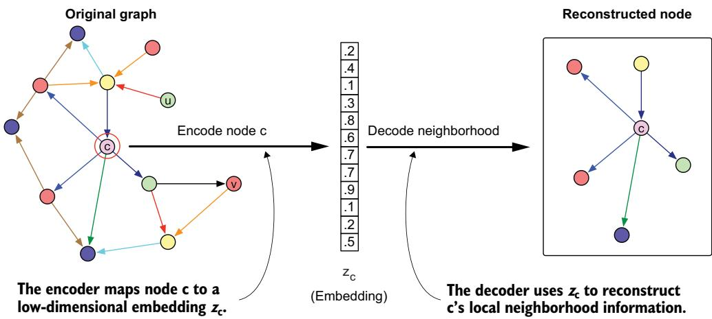
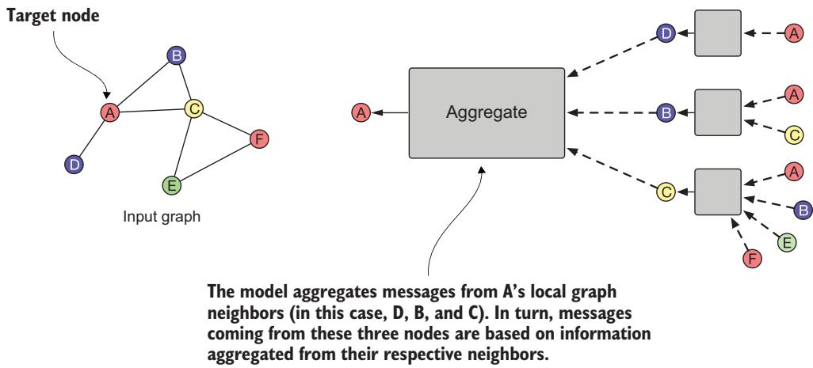

# 그래프 표현 학습과 그래프 신경망

### 이 장에서 다루는 내용


그래프 표현 학습 (graph representation learning)을 이해하고 그래프에서 머신러닝을 확장하는 데 그것이 수행하는 역할 이해하기

 딥러닝 (deep learning)을 통한 특징 공학 자동화하기

그래프 임베딩과 그 응용 이해하기

그래프 신경망 (GNN) 다루기

9장과 10장에서는 그래프에서의 머신러닝 (ML)의 기본 개념을 살펴보았으며, 이러한 기법들이 노드 분류, 링크 예측, 커뮤니티 탐지와 같은 복잡한 과제를 어떻게 해결할 수 있는지 보여주었습니다. 우리는 수동 특징 공학이 그래프의 속성과 관계를 효과적으로 포착하여 후속 ML 과제를 지원할 수 있음을 보였습니다. 이러한 접근법은 그래프 기반 ML이 작동하게 만드는 요소에 대한 통찰을 제공하며, 모델이 의사결정을 내리는 방식에 대한 투명성을 제공합니다.

그러나 단순한 분류 과제라 하더라도 효과적인 특징을 설계하고 구현하려면 상당한 노력이 필요합니다. 수동 접근법은 해석 가능성 측면에서 뛰어나고 직관을 형성하는 데 도움이 되지만, 수백만 개의 노드와 관계를 포함하는 실제 지식 그래프 (KG)로 확장될 때 중대한 어려움에 직면합니다.

그래프 표현 학습 (GRL)은 이러한 확장성 문제에 대한 강력한 해결책을 제공합니다. GRL은 특징을 설계하기 위해 인간의 전문 지식에 의존하는 대신, 딥러닝 기법을 사용하여 그래프 구조와 노드 속성으로부터 임베딩이라고 불리는 최적의 표현을 자동으로 학습합니다. 이렇게 학습된 표현은 수동으로 명시하기 어렵거나 불가능한 패턴과 유사성을 포착합니다. 임베딩 과정은 노드, 엣지, 서브그래프를 조밀한 벡터 표현으로 변환하며, 이 표현은 그래프의 구조적·의미적 속성을 보존하는 동시에 표준 ML 알고리즘이 쉽게 사용할 수 있도록 합니다.

그래프 신경망은 이러한 표현을 학습하기 위한 특히 효과적인 프레임워크로 부상했습니다. 이웃 노드로부터 정보를 반복적으로 집계하고 변환함으로써, 그래프 신경망은 그래프 구조 데이터의 고유한 문제를 처리하는 동시에 후속 과제에 관련된 특징을 자동으로 발견할 수 있습니다. 이 장에서는 GRL, 특히 그래프 신경망이 그래프에서의 ML을 실제 응용으로 확장할 수 있게 하는 방식을 보여줍니다.

우리는 이러한 접근법의 기술적 세부 사항을 살펴볼 것이지만, 초점은 여전히 실용적인 데 있습니다. 즉, 더 나은 지능형 조언자 시스템을 구축하기 위해 이러한 도구를 언제, 어떻게 효과적으로 적용할지 이해하는 것입니다. 수동 특징 공학을 통해 형성된 직관과 자동화된 표현 학습을 결합함으로써, 우리는 확장 가능하면서도 해석 가능한 그래프 기반 ML 시스템을 구축할 수 있습니다.

### 11.1 그래프 표현 학습에서의 임베딩


그래프 표현 학습 (graph representation learning, GRL)의 역사를 살펴보면, 기계학습 (ML)의 더 넓은 발전 과정을 반영하는 흥미로운 진화를 확인할 수 있습니다. 컴퓨터가 그래프 구조 데이터 (graph-structured data)를 이해하고 다룰 수 있도록 가르치는 데 초점을 맞춘 이 분야는 세 세대에 걸쳐 성장해 왔으며, 각 세대는 이전 세대의 통찰과 성과 위에 구축되었습니다 [1].

1 첫 번째 세대는 전통적인 수학과 컴퓨터 과학에서 등장했으며, 오늘날 우리가 전통적 그래프 임베딩 (traditional graph embedding)이라고 부르는 것에 초점을 맞추었습니다. 복잡한 3차원 물체를 가져와 그것을 충실한 2차원 그림으로 그리려 한다고 상상해 보십시오. 이것이 본질적으로 초기 연구자들이 직면한 과제였습니다. 그들은 고전적 차원 축소 (dimensionality reduction)의 관점에서 그래프에 접근했으며, 복잡한 그래프 구조의 본질적 속성을 보존하면서도 이를 더 단순하고 다루기 쉬운 형태로 표현하는 방법을 찾고자 했습니다.

2 두 번째 세대는 자연어 처리 (natural language processing)의 돌파구에 의해 촉발된 혁명적 전환을 의미했습니다. word2vec이 단어의 의미를 수치 벡터로 포착하는 방법을 보여 주었듯이, Node2Vec은 그래프의 노드에 대해서도 동일한 일을 할 수 있음을 입증했습니다. 이제 우리는 단순히 복잡성을 줄이는 데 그치지 않고, 수치 표현 안에 의미 있는 관계와 패턴을 포착하게 되었습니다.

3 세 번째이자 현재의 세대는 특히 그래프 신경망 (GNNs)을 통해 딥러닝 (DL)의 힘을 수용했습니다. 딥러닝이 원시 픽셀로부터 특징을 식별하도록 자동으로 학습함으로써 이미지 인식을 변화시킨 방식을 생각해 보십시오. GNN은 그래프에 대해 이와 유사한 일을 수행하며, 관계와 상호작용의 복잡한 패턴을 이해하도록 자동으로 학습합니다.

실세계 응용에서 그래프 임베딩의 힘을 활용하려면, 우리는 그 근본적 특성과 이러한 속성이 다양한 시나리오에서 성능에 어떤 영향을 미치는지 이해해야 합니다. 다음 절들에서는 그래프 임베딩을 정의하는 핵심 차원들을 살펴볼 것이며, 여기에는 임베딩이 점유하는 기하학적 공간부터 국소적 및 전역적 그래프 속성을 포착하는 방식까지 포함됩니다.

#### 11.1.1 그래프 임베딩 이해하기: 이산에서 연속으로


한 번도 가 본 적이 없는 사람에게 도시의 배치를 설명하려 한다고 상상해 봅니다. 모든 거리와 교차로를 나열할 수도 있고(노드와 관계로 이루어진 이산 그래프 표현처럼), 각 위치에 좌표를 부여한 지도를 그릴 수도 있습니다(숫자로 이루어진 연속 임베딩처럼). 지도는 위치들 사이의 관계를 이해하고 지점 간 거리에 관한 유용한 계산을 수행하는 일을 훨씬 더 쉽게 해 줍니다 [2]. 그림 11.1은 노드 임베딩 문제를 보여 줍니다.

  
임베딩 과정의 목표는 주변 그래프 구조와 노드 특징을 사용하여 노드를 다차원 임베딩 공간으로 매핑하는 인코더 함수를 학습하는 것입니다.  
그림 11.1 노드 임베딩 문제. 이 과제의 목표는 노드를 다차원 임베딩 공간으로 매핑하는 인코딩 함수 encode(x)를 학습하는 것입니다. 이러한 임베딩은 임베딩 공간에서의 거리가 노드들의 상대적 위치와 같은 원래 그래프의 관련 측면을 반영하도록 최적화됩니다.

이것이 그래프 임베딩이 하는 일입니다. 즉, 이산 그래프 구조를 연속 벡터 표현으로 변환합니다. 그렇다면 이 변환은 왜 그렇게 가치가 있을까요? 임베딩 접근법의 다양한 측면을 통해 이를 살펴보겠습니다.

#### 임베딩의 기하학: 평평한 공간을 넘어서


그래프 임베딩에서 기하학적 공간이 왜 중요한지 이해하려면, 먼저 ML의 근본적인 과제를 인식해야 합니다. 즉, 데이터 유형마다 서로 다른 고유 구조가 있다는 점입니다. 이미지나 텍스트를 다룰 때 데이터는 규칙적이고 예측 가능한 구조를 가집니다. 이미지의 모든 픽셀은 여덟 개의 이웃을 가지며, 텍스트의 모든 단어는 앞에 한 단어와 뒤에 한 단어를 가집니다. 이러한 규칙성 덕분에 이미지에는 합성곱 신경망(convolutional neural network)과 같은, 텍스트에는 순환 신경망(recurrent neural network)과 같은 잘 확립된 기법을 사용할 수 있습니다 [3].

그러나 그래프에서는 각 노드가 이웃 노드와 서로 다른 수의 연결과 이웃 구조를 가질 수 있습니다. 이러한 불규칙성은 규칙적으로 구조화된 데이터에 사용하는 동일한 기법을 그대로 적용할 수 없음을 의미합니다. 우리는 이러한 변동성을 처리할 수 있는 접근법이 필요하며, 이는 기하학적 공간의 문제로 이어집니다.



그림 11.2는 유클리드 공간(Euclidean space)과 비유클리드 공간(non-Euclidean space)의 차이를 보여 줍니다. 많은 그래프 임베딩 접근법을 포함한 대부분의 ML 모델은 유클리드 공간에서 작동합니다. 즉, 거리는 직선으로 측정되며 피타고라스 정리가 성립합니다. 유클리드 공간은 관계가 균일하고 위치나 규모에 따라 변하지 않는 데이터에 특히 효과적입니다. 어떤 것을 유클리드 공간에 임베딩할 때 우리는 그것을 좌표 벡터로 표현하며, 두 점 사이의 거리는 표준 유클리드 거리 공식, 즉 좌표 간 차이의 제곱합에 대한 제곱근을 사용하여 계산합니다.



임의의 그래프(비유클리드)

  
그림 11.2 유클리드 공간 대 비유클리드 공간 [3]. 이미지의 픽셀들은 모두 서로 같은 거리에 있으며 여덟 개의 이웃을 가집니다(경계에 있는 픽셀은 제외). 그래프에서는 이웃의 수가 한 노드에서 다른 노드로 갈 때 엄청나게 달라질 수 있습니다.

연구자들은 일부 유형의 그래프 구조, 특히 계층적 구조가 비유클리드 공간, 특히 쌍곡 공간(hyperbolic space)에서 더 효과적으로 표현될 수 있음을 발견했습니다. 핵심적인 차이는 공간 자체가 어떻게 동작하는가에 있습니다. 유클리드 공간에서는 중심점에서 바깥쪽으로 이동할수록 이용 가능한 공간의 양이 다항적으로 증가하지만(그림 11.3 참조), 쌍곡 공간에서는 각 수준에서 더 많이 가지를 뻗는 나무처럼 바깥쪽으로 이동할수록 이용 가능한 공간이 지수적으로 증가합니다.





  
그림 11.3 유클리드 공간은 차원의 수를 늘릴수록 다항적으로 증가합니다. 2차원에서 3차원, 4차원 및 그 이상으로 이동하면, 이용 가능한 공간은 차원과의 다항적 관계에 따라 증가합니다. 예를 들어, 2차원의 단위 정사각형은 넓이가 1이고, 3차원의 단위 정육면체는 부피가 1이며, 4차원의 단위 초입방체는 초부피가 1입니다. 그럼에도 각 축을 따라 이용 가능한 전체 공간은 지수적으로가 아니라 다항적으로 증가합니다.

임베딩에 대한 이러한 실제적 함의를 생각해 보겠습니다. 유클리드 공간에서는,

벡터가 (0.5, 0.3)과 같은 단순한 좌표점입니다.

거리는 좌표 차이에 따라 선형적으로 증가합니다.

점들 사이의 공간은 그 위치와 관계없이 일정하게 유지됩니다.

 대부분의 ML 모델은 이 공간을 가정하므로, 많은 응용에서 기본 선택지가 됩니다.

쌍곡 공간 (hyperbolic space)에서는,

벡터가 여전히 좌표로 표현되지만, 다르게 동작합니다.

점들이 공간의 경계에 가까워질수록 거리는 지수적으로 증가합니다.

동일한 좌표 차이는 경계 근처에서 더 큰 거리를 나타냅니다.

점들 사이의 유사도를 계산하려면 특수한 거리 공식을 사용해야 합니다.

기하학적 공간의 선택은 그래프가 특정 구조적 속성을 가진다는 것을 알고 있을 때 특히 중요해집니다. 예를 들어, 많은 현실 세계 그래프는 계층적 구조를 보입니다. 기업 조직, 생물학적 분류 체계, 또는 인터넷 네트워크 토폴로지를 생각해 볼 수 있습니다. 이러한 경우 쌍곡 임베딩은 유클리드 임베딩보다 그래프의 구조를 더 충실하게 보존할 수 있습니다.

유클리드 공간이 많은 응용에서 잘 작동한다는 점을 이해하는 것이 중요합니다. 비유클리드 임베딩은 그래프 구조가 그 속성으로부터 이익을 얻을 것이라는 강한 증거가 있을 때에만 고려해야 합니다. 비유클리드 임베딩을 사용할 때에는 이것이 거리 계산 방식부터 결과를 시각화하고 해석하는 방식에 이르기까지 전체 파이프라인에 어떤 영향을 미치는지 유의해야 합니다. 이러한 기하학적 관점은 기하 딥러닝 (geometric deep learning, GDL)이라는 더 넓은 분야의 일부로, 이 분야는 비표준 기하 구조를 가진 데이터에 DL 기법을 적용하는 방법을 연구합니다. 이러한 기하학적 공간을 이해하면 그래프 문제에 적합한 도구를 선택하고 결과를 적절히 해석하는 데 도움이 됩니다.

#### 로컬 대 글로벌: 위치 임베딩과 구조적 임베딩 이해하기


위치 임베딩 (positional embeddings)과 구조적 임베딩 (structural embeddings)의 구분은 그래프 분석의 근본적인 질문을 반영합니다. 그래프 구조의 어떤 측면을 보존하는 것이 가장 중요한가? 소셜 네트워크의 예를 통해 이를 살펴보겠습니다 [3].

위치 임베딩은 소셜 네트워크에서 사람들의 절대적 위치를 보존하는 것과 같습니다. 친구 집단을 생각해 보면, 위치 임베딩은 전체 네트워크에서 누가 중심적인지, 누가 서로 다른 커뮤니티를 연결하는지, 한 사람에게서 다른 사람에게 도달하는 데 몇 단계가 걸리는지에 관한 정보를 유지합니다. 이러한 임베딩은 행렬 분해 (matrix factorization)와 랜덤 워크 (random walks) 같은 기법을 사용하여 글로벌 속성을 포착합니다.

구조적 임베딩은 상대적 위치 또는 로컬 패턴에 초점을 맞춥니다. 두 사람이 네트워크에서 멀리 떨어져 있을 수 있지만, 비슷한 친구 관계 패턴을 가지고 있다면, 예를 들어 각자의 친구 집단에서 모두 조직자 역할을 한다면, 구조적 임베딩은 이들을 유사하게 표현합니다. 바로 이 지점에서 그래프 신경망 (GNNs)이 강점을 보이는데, GNN은 이러한 로컬 연결 패턴을 인식하고 보존하도록 학습할 수 있기 때문입니다.

위치 임베딩은 글로벌 그래프 구조의 보존에 초점을 맞추기 때문에, 전체 네트워크 토폴로지가 가장 중요한 비지도 과제에서 가치가 있음이 입증되었습니다. 예를 들어 링크 예측 (link prediction)에서는 글로벌 연결 패턴을 이해하는 것이 누락된 간선을 예측하는 데 도움이 되며, 클러스터링 (clustering)에서는 더 넓은 네트워크에서 노드의 위치를 아는 것이 커뮤니티를 식별하는 데 도움이 됩니다. 반면, 특히 GNN이 생성한 구조적 임베딩은 지도 과제에서 뛰어난 성능을 보입니다. 로컬 이웃 패턴을 포착하는 능력 덕분에 노드 분류 (node classification)에는 특히 효과적입니다. 여기서 유사한 로컬 구조는 흔히 유사한 레이블을 나타냅니다. 또한 전체 그래프 분류 (whole graph classification)에서도 효과적인데, 로컬 패턴이 그래프 수준 속성을 정의할 수 있기 때문입니다.

최근 이 분야의 발전은 이러한 전통적인 경계를 흐리기 시작했습니다. 위치 GNN (positional GNNs)과 같은 새로운 아키텍처가 등장하여, 일반적으로 로컬에 초점을 맞추는 GNN 프레임워크에 글로벌 위치 정보를 통합하고 있습니다. 더 나아가 이론적 연구는 이 두 관점 사이의 더 깊은 연결을 밝혀냈으며, 위치 임베딩과 구조적 임베딩이 그래프 구조의 상호 보완적인 측면을 포착할 수 있음을 시사합니다.

#### 학습 전략: 변환적 접근법과 귀납적 접근법


변환적 학습 (transductive learning)과 귀납적 학습 (inductive learning) 접근법 사이의 선택은 ML의 중요한 질문, 즉 모델이 새로운 미관측 데이터를 어떻게 처리해야 하는가를 반영합니다. 이러한 구분은 새로운 노드와 엣지가 자주 등장하는 그래프 학습에서 특히 중요합니다 [3]:

변환적 학습은 특정 퍼즐을 푸는 법을 배우는 것과 같습니다. 해당 퍼즐에는 매우 능숙해질 수 있지만, 그 지식이 다른 퍼즐로 전이되지 않을 수 있습니다. 그래프 관점에서 변환적 접근법은 고정된 노드 집합에 대한 임베딩을 학습하며, 알려진 그래프 구조에 맞추어 이를 직접 최적화합니다. 이는 새로운 노드가 나타날 것으로 예상하지 않는 정적 그래프에서 잘 작동합니다. 변환적 방법은 학습 중 분석된 노드들 사이에서 새로운 정보를 추론할 수 있게 합니다. 예를 들어, 부분적으로 레이블이 지정된 노드를 다룰 때, 알려진 구조에서 학습한 패턴을 바탕으로 레이블이 없는 노드를 분류할 수 있습니다. 마찬가지로, 학습 과정에서 관찰된 그래프 노드들 사이의 새로운 엣지를 예측할 수 있습니다.

귀납적 학습은 퍼즐을 푸는 일반적인 전략을 배우는 것과 같습니다. 특정 패턴을 암기하는 대신, 귀납적 접근법은 새로운 상황에 적용할 수 있는 규칙을 학습합니다. 이 때문에 동적 그래프에 유용합니다. 귀납적 GRL 방법에서는 노드 특징을 사용하여 매개변수화된 매핑 (parametric mappings)을 통해 임베딩을 학습합니다. 학습 목표는 임베딩을 직접 최적화하는 대신 이러한 매개변수화된 매핑을 최적화함으로써 달성됩니다. 이는 학습된 매핑을 학습 중에 보지 못한 노드를 포함하여 어떤 노드에도 적용할 수 있음을 의미합니다.

전자상거래 플랫폼을 위한 추천 시스템을 생각해 보겠습니다. 변환적 접근법은 기존 사용자에게 과거 상호작용을 바탕으로 기존 제품을 추천하는 데 잘 작동합니다. 그러나 새로운 사용자가 플랫폼에 가입하거나 새로운 제품이 제공될 때에는, 해당 신규 사용자의 초기 상호작용과 프로필 정보를 바탕으로 의미 있는 임베딩을 생성할 수 있는 귀납적 접근법이 필요합니다.

#### 임베딩 학습에서 지도 학습의 역할


그래프 임베딩에서 지도 학습과 비지도 학습의 구분은 이용 가능한 정보의 수준과 임베딩 과정의 목표가 서로 다름을 반영합니다.

그래프 임베딩에서 비지도 학습은 대화 내용에 대해서는 아무것도 모른 채, 누가 누구와 대화하는지만 관찰하여 한 집단의 사회적 역학을 이해하려는 것과 같습니다. 목표는 그래프 데이터에서 자연스럽게 나타나는 패턴과 구조를 발견하는 것입니다. 이 접근법은 그래프 구조만으로도 가치 있는 정보가 담겨 있다는 가정에 의존하며, 이는 실제로도 종종 사실입니다!

지도 학습은 우리가 관찰하는 상호작용에 대한 추가 맥락을 가지고 있는 것과 같습니다. 이러한 추가 정보는 학습 과정을 특정 목표로 이끌도록 도와줍니다.

#### 11.1.2 실제 응용과 사례


그래프 임베딩의 이러한 측면들이 실제 응용에서 어떻게 결합되는지 살펴보겠습니다.

소셜 네트워크 분석—LinkedIn과 같은 대규모 소셜 네트워크를 생각해 보겠습니다. 여기서 구조적 임베딩은 서로 다른 산업에 걸쳐 유사한 전문 직무를 가진 사용자를 식별하는 반면, 위치 임베딩 (positional embedding)은 네트워크에서 핵심 영향력자와 가교 구축자가 누구인지 이해하는 데 도움을 줍니다. 플랫폼은 신규 사용자를 처리하기 위해 귀납 학습 (inductive learning) 능력이 필요하며, 추천 정확도를 개선하기 위해 직함과 기술을 활용한 지도 학습을 사용할 수 있습니다.

생물학적 네트워크—단백질 상호작용 네트워크에서는 기하 구조의 선택이 매우 중요합니다. 생물학적 시스템의 계층적 조직은 종종 쌍곡 임베딩 (hyperbolic embedding)의 이점을 얻습니다. 새로운 발견을 지속적으로 통합해야 하므로 귀납 학습이 필수적이며, 실험 데이터의 가용성은 예측 정확도를 개선하기 위한 지도 학습 접근법을 가능하게 합니다.

 의료 지식 그래프—의료 지식을 나타내는 지식 그래프 (KG)를 생각해 보겠습니다. 의료 용어의 계층적 성격(넓은 범주에서 특정 질환에 이르기까지)은 쌍곡 임베딩을 특히 적합하게 만듭니다. 구조적 임베딩은 의학의 서로 다른 분야에 걸친 유사 개념을 식별하는 데 도움을 주며, 전문가가 레이블을 붙인 데이터를 활용한 지도 학습은 개념 간의 정확한 관계를 보장하는 데 도움을 줍니다.

이러한 사례를 통해 서로 다른 임베딩 접근법이 실제 문제를 해결하기 위해 어떻게 결합되는지 알 수 있습니다. 임베딩 전략의 선택은 단순한 기술적 결정이 아니라, 문제 구조에 대한 우리의 이해와 해결책에 대한 우리의 목표를 반영합니다.

### 11.2 인코더–디코더 모델


인코더–디코더 모델은 그래프 임베딩 방법이 어떻게 작동하는지 이해하는 강력하고 통합적인 방식을 제공합니다. 이를 번역 시스템처럼 생각할 수 있습니다. 먼저 모델은 그래프 정보를 한 형태에서 더 압축적이고 표준화된 표현으로 변환(인코딩)하고, 그런 다음 그 표현을 번역(디코딩)하여 의미 있는 그래프 속성을 재구성합니다 [2](그림 11.4 참조). 그래프의 맥락에서 이는 이산적인 그래프 구조를 원래 그래프의 중요한 특성을 보존하는 연속 벡터 표현으로 변환한다는 뜻입니다.

  
그림 11.4 인코더–디코더 접근법의 개요. 인코더는 노드 c를 저차원 임베딩 $z_{\mathbf{C}}.$으로 매핑합니다. 그런 다음 디코더는 $z_{\mathrm{c}}$를 사용하여 $\pmb{\mathfrak{c}}^{*}\mathbf{s}$의 지역 이웃 정보를 재구성합니다.

#### 11.2.1 인코더: 그래프 구조를 벡터로 변환하기


인코더는 원시 그래프 데이터, 즉 그래프의 구조와 추가 특징을 받아 각 노드에 대한 밀집 벡터 표현(임베딩)으로 변환합니다. 인코더는 두 가지 핵심 입력을 받습니다.

노드가 어떻게 연결되어 있는지를 보여 주는 인접 행렬로 표현되는 그래프 구조

 노드 특징은 각 노드의 특성에 대한 추가 정보를 제공합니다.

인코더가 흥미로운 이유는 그 유연성에 있습니다. 서로 다른 방법은 그래프의 서로 다른 측면을 인코딩할 수 있습니다. 어떤 방법은 전역 구조와 노드의 상대적 위치를 보존하는 데 초점을 맞추는 반면, 다른 방법은 지역 이웃 패턴을 포착하는 것을 우선시합니다. 인코더는 각 노드에 벡터를 할당하는 조회 테이블처럼 단순할 수도 있고, 구조와 특징을 모두 처리하는 신경망처럼 정교할 수도 있습니다.

#### 11.2.2 디코더: 그래프 속성 재구성


디코더는 인코더가 생성한 임베딩을 받아 원래 그래프의 중요한 속성을 재구성하려고 시도합니다. 이러한 재구성은 임베딩이 의미 있는 정보를 포착했음을 보장합니다. 디코더의 과제는 우리가 그래프의 어떤 측면을 보존하고자 하는지에 따라 달라집니다.

그래프 구조에 초점을 맞춘 방법의 경우, 디코더는 노드들이 원래 그래프에서 연결되어 있는지를 예측하려고 할 수 있습니다.

노드 유사성을 포착하기 위해, 디코더는 노드 간 이웃 중첩의 척도를 재구성할 수 있습니다.

 추가적인 지도(supervision)가 있는 경우, 디코더는 노드 레이블이나 기타 속성을 예측할 수 있습니다.

이 재구성 과제는 학습 신호로 작용합니다. 디코더의 예측과 실제 그래프 속성 간의 차이를 최소화하려고 시도함으로써, 우리는 인코더가 더 나은 표현을 학습하도록 최적화할 수 있습니다.

#### 11.2.3 프레임워크의 힘


인코더-디코더 프레임워크를 특히 가치 있게 만드는 것은 GRL에 대한 다양한 접근법을 통합할 수 있는 능력입니다. 행렬 분해 방법, 랜덤 워크 기반 접근법, 또는 GNN을 살펴보든, 이들은 모두 이러한 기본적인 인코딩-디코딩 패턴을 구현하는 서로 다른 방식으로 이해될 수 있습니다. 또한 이 프레임워크는 서로 다른 방법에 수반되는 절충 관계를 이해하는 데에도 도움이 됩니다. 예를 들어, 더 단순한 인코더는 계산적으로 더 효율적일 수 있지만 덜 복잡한 패턴을 포착하는 반면, 더 정교한 신경망 기반 인코더는 더 풍부한 표현을 학습할 수 있지만 효과적으로 학습하려면 더 많은 데이터와 계산이 필요합니다. 인코딩-디코딩 관점은 그래프 구조 데이터의 표현을 학습하는 방법을 분석하고, 비교하며, 개선할 수 있는 렌즈를 제공합니다.

#### 11.2.4 Node2Vec: 인코더–디코더 프레임워크의 예

9장에서 다룬 가라테 클럽 네트워크를 생각해 보겠습니다. 여기서 노드는 클럽 회원을 나타내고, 엣지는 회원들 사이의 친분 관계를 나타냅니다. 이 클럽은 지도자(노드 0)와 클럽 관리자(노드 33) 사이의 분쟁 이후 두 그룹으로 분리되었습니다. 이러한 특성 때문에 이 네트워크는 Node2Vec [4]이 인코더–디코더 프레임워크 안에서 어떻게 작동하는지 이해하기에 매우 적합한 예가 됩니다.

#### NODE2VEC에서의 인코딩 과정


먼저, Node2Vec의 인코더는 각 클럽 회원(노드)을 친분 네트워크에서의 위치와 역할을 포착하는 수치 벡터로 변환해야 합니다. 그 과정은 다음과 같습니다.

1 랜덤 워크 (random walk) 생성—인코더는 친분 네트워크를 따라 “걷기”를 수행하는 것에서 시작합니다. 지도자(노드 0)에서 시작한다고 해 보겠습니다. 하나의 워크는 $0\ 1\ 2\ 3$과 같을 수 있으며, 이는 친구의 친구를 따라가는 경로를 나타냅니다. Node2Vec은 넓게 나아가기(클럽 내 서로 다른 사회적 집단 탐색)와 깊게 들어가기(긴밀하게 연결된 친구 집단 내부에 머무르기) 사이의 균형을 조정함으로써 네트워크를 탐색하는 방식을 조절할 수 있습니다.

2 벡터 생성—이러한 워크를 바탕으로 인코더는 각 회원의 사회적 맥락을 포착하는 벡터를 생성합니다. 이러한 워크에서 서로 가까이 자주 등장하는 회원들(가까운 친구이거나 같은 사회적 집단에 속한 회원들)은 유사한 벡터 표현을 얻게 됩니다.

#### 디코딩 과정

디코더는 이러한 벡터를 받아 친구 관계 네트워크에 관한 정보를 재구성합니다. 임의의 두 회원 i와 j에 대해, 디코더는 이들의 벡터 표현을 바탕으로 두 사람이 친구일 가능성이 얼마나 높은지를 예측하려고 합니다. 이는 소프트맥스 (softmax) 함수를 사용하여 수행되며, 본질적으로 “회원 i의 벡터가 주어졌을 때, 무작위 워크에서 회원 j를 근처에서 보게 될 가능성이 얼마나 높은가?”라고 묻는 것입니다.

이 인코딩–디코딩 과정은 가라테 클럽 네트워크에서 흥미로운 패턴을 드러냅니다.

커뮤니티 구조—분열 이후 같은 파벌에 속하게 된 회원들은 유사한 벡터 표현을 얻는 경향이 있습니다. 벡터는 직접적인 친구 관계뿐만 아니라 더 넓은 커뮤니티 소속도 포착합니다.

가교 회원—양쪽 파벌 모두에 친구를 둔 회원들은 자신의 중간적 위치를 반영하는 벡터 표현을 얻습니다. 이러한 벡터는 갈등에서 잠재적 중재자를 식별하는 데 도움이 됩니다.

리더십 역할—강사와 관리자는 네트워크에서 중심적이지만 서로 대립적인 위치를 반영하는 뚜렷한 벡터 표현을 얻습니다. 이들의 벡터는 연결 패턴을 통해 커뮤니티 리더로서의 역할을 포착합니다.

#### 프레임워크의 힘


인코더–디코더 프레임워크는 Node2Vec이 작동하는 이유를 이해하는 데 도움이 됩니다.

 인코더의 랜덤 워크 (random walk)는 지역적 친구 관계와 더 넓은 사회 구조를 모두 포착합니다.

디코더의 예측 과제는 벡터가 의미 있는 사회적 관계를 보존하도록 보장합니다.

 이 둘은 함께 친구 관계와 파벌 소속을 모두 예측할 수 있는 표현을 생성합니다.

이 예시는 인코더–디코더 프레임워크가 실제 네트워크 분석을 이해하고 개선하는 데 어떻게 도움이 되는지 보여 줍니다. 다음 코드 목록은 Node2Vec을 가라테 클럽 네트워크에 적용하는 방법을 보여 줍니다.

#### 목록 11.1 가라테 클럽 네트워크에 Node2Vec 임베딩 적용하기


import networkx as nx import numpy as np from node2vec import Node2Vec import matplotlib.pyplot as plt from sklearn.manifold import TSNE

```python
G = nx.karate_club_graph() ≤ Loads the karate
club network
faction_labels = {
0: 0, 1: 0, 2: 0, 3: 0, 4: 0, 5: 0, 6: 0, 7: 0, 8: 0,
9: 1, 10: 1, 11: 0, 12: 0, 13: 0, 14: 1, 15: 1, 16: 0,
17: 0, 18: 1, 19: 0, 20: 1, 21: 0, 22: 1, 23: 1, 24: 1,
25: 1, 26: 1, 27: 1, 28: 1, 29: 1, 30: 1, 31: 1, 32: 1, Defines faction labels
33: 1 (0 for instructor,
} < 1 for administrator)
nx.set_node_attributes(G, faction_labels, 'faction') ≤ Assigns faction attributes
to network nodes
node2vec = Node2Vec(
G,
dimensions=16,
walk_length=10,
num_walks=20,
p=1,
q=1,
workers=4 Configures Node2Vec with
) embedding parameters
Trains the
model = node2vec.fit(window=5) < Node2Vec model
Computes similarity
def decode_similarity(model, node1, node2): between node
return model.wv.similarity(str(node1), str(node2)) < embeddings
def visualize_graph_and_embeddings(model, G):
embeddings = np.zeros((len(G.nodes()), model.vector_size))
for i, node in enumerate(G.nodes()):
embeddings[i] = model.wv[str(node)]
tsne = TSNE(n_components=2, random_state=42)
node_pos_2d = tsne.fit_transform(embeddings)
fig, axes = plt.subplots(1, 2, figsize=(18, 8))
#### Left plot: original graph
pos = nx.spring_layout(G, seed=42)
colors = ['red' if G.nodes[node]['faction'] == 0 else 'blue'
for node in G.nodes()]
nx.draw(
G,
pos,
ax=axes[0],
with_labels=True,
node_color=colors,
node_size=500,
font_size=10
)
axes[0].set_title("Original Karate Club Graph")
#### Right plot: node embeddings
axes[1].scatter(node_pos_2d[:, 0], node_pos_2d[:, 1], c=colors, s=100)
for i, node in enumerate(G.nodes()):
axes[1].annotate(str(node), (node_pos_2d[i, 0],
node_pos_2d[i, 1]), fontsize=9)
axes[1].set_title("Node2Vec Embeddings (t-SNE)")
```

```python
plt.tight_layout()
Visualizes the original graph and
plt.show() < node embeddings in 2D space
print("Similarity between instructor (0) and their close ally (1):",
decode_similarity(model, 0, 1))
print("Similarity between instructor (0) and administrator (33):",
decode_similarity(model, 0, 33)) < Prints similarity scores
between key nodes
visualize_graph_and_embeddings(model, G) < Generates and
displays an
def analyze_community_structure(model, G): embedding
instructor_allies = [] visualization
administrator_allies = []
for node in G.nodes():
if node not in [0, 33]:
sim_to_instructor = decode_similarity(model, node, 0)
sim_to_administrator = decode_similarity(model, node, 33)
if sim_to_instructor > sim_to_administrator:
instructor_allies.append(node) Analyzes the community
else: structure based on embedding
administrator_allies.append(node)
Prints predicted
return instructor_allies, administrator_allies faction assignments
instructor_group, administrator_group = analyze_community_structure(model, G)
print("\nPredicted instructor's faction:", sorted(instructor_group))
print("Predicted administrator's faction:", sorted(administrator_group))
```

이 구현은 방금 논의한 인코더–디코더 프레임워크의 측면을 보여 줍니다. 실행해 보십시오! t-SNE 시각화는 인코딩된 벡터가 노드를 파벌별로 어떻게 군집화하는지 보여 주며, 몇몇 중요한 노드 간의 유사도 계산은 디코딩된 임베딩이 원래 그래프의 관계를 어떻게 예측할 수 있는지 보여 줍니다. 강사(노드 0)와 가까운 구성원들이 관리자(노드 33)와 가까운 구성원들과는 다른 임베딩 패턴을 보인다는 점을 확인할 수 있으며, 이는 클럽의 분열로 이어진 실제 사회적 역학을 반영합니다.

### 11.3 얕은 임베딩: 그래프 표현에 대한 첫 번째 접근법


그래프 임베딩을 이해하는 가장 간단한 방법은 얕은 임베딩 (shallow embeddings)을 통해 살펴보는 것입니다. 이는 인코더–디코더 프레임워크를 가장 직관적으로 구현한 형태를 나타내지만, 그 단순성에는 더 정교한 접근법의 개발을 이끌어 온 중요한 한계가 따릅니다 [2].

#### 11.3.1 얕은 임베딩 이해하기


얕은 임베딩 방법에서 인코더는 단순한 연산을 수행합니다. 즉, 조회 테이블처럼 작동하여 각 노드를 그 벡터 표현에 직접 매핑합니다. 이는 소셜 네트워크의 각 사람에게 고차원 공간에서 고유한 “좌표”를 할당하는 것과 같다고 생각할 수 있습니다. 이는 사전이 작동하는 방식과 유사합니다. 각 단어(노드)는 자신만의 전용 항목(벡터)을 가집니다.

인코더–디코더 프레임워크에서 이 접근법은 다음과 같이 이해할 수 있습니다.

 인코더는 각 행이 한 노드의 임베딩 벡터에 대응하는 행렬을 유지합니다. 어떤 노드를 인코딩하라는 요청을 받으면, 이 행렬에서 해당 행을 반환합니다. 이것이 이러한 임베딩을 “얕다”고 부르는 이유입니다. 입력에 대한 깊은 처리나 변환이 없고, 단지 직접적인 조회 연산만 있기 때문입니다.

디코더는 이러한 임베딩 벡터를 받아 두 노드가 연결되어 있는지 또는 그 이웃이 얼마나 유사한지와 같은 그래프의 중요한 속성을 재구성하려고 합니다. 이 재구성 과정은 학습 중 임베딩 벡터를 최적화하여 그래프 구조의 의미 있는 패턴을 포착하도록 돕습니다.

구체적인 예를 생각해 보겠습니다. 앞서 논의한 가라테 클럽 네트워크에서 얕은 임베딩 접근법은 각 클럽 구성원에 대해 별도의 벡터를 생성할 것입니다. 이러한 벡터는 학습 중 조정되어 자주 상호작용하는 구성원들은 유사한 벡터를 갖게 되고, 거의 상호작용하지 않는 구성원들은 서로 다른 벡터를 갖게 됩니다.

#### 11.3.2 얕은 임베딩의 한계


얕은 임베딩은 많은 응용 분야에서 성공을 거두었지만, 몇 가지 중요한 한계에 직면합니다.

매개변수 비효율성—얕은 임베딩은 그래프의 각 노드에 대해 별도의 벡터를 필요로 합니다. 이는 매개변수의 수가 노드 수에 선형적으로 증가한다는 의미이며, 매우 큰 그래프에서는 실용적이지 않게 만듭니다. 예를 들어, 수백만 명의 사용자가 있는 소셜 네트워크에서는 수백만 개의 임베딩 벡터가 필요합니다.

매개변수 공유의 부재—얕은 임베딩은 노드 간에 매개변수를 공유하지 않습니다. 이는 그래프의 서로 다른 부분에 나타날 수 있는 공통 패턴이나 구조를 활용할 수 없다는 의미입니다. 가라테 클럽 예시에서 두 구성원이 서로 다른 사회적 집단에서 유사한 역할을 한다면, 모델은 그 패턴을 인식하고 재사용하기보다는 각 구성원에 대해 이러한 패턴을 독립적으로 학습해야 합니다.

특징 무시—이러한 방법들은 노드 특징이나 속성을 활용하지 않습니다. 각 클럽 구성원에 대한 추가 정보(예: 나이, 관심사, 역할)를 알고 있더라도, 얕은 임베딩은 이 정보를 표현에 통합할 자연스러운 방법을 갖고 있지 않습니다.

변환적 성격—얕은 임베딩은 본질적으로 변환적입니다. 즉, 학습 중에 존재했던 노드에 대해서만 임베딩을 생성할 수 있습니다. 새로운 구성원이 클럽에 가입하면, 그 구성원은 원래의 조회 테이블에 포함되어 있지 않았기 때문에 자동으로 임베딩을 생성할 수 없습니다. 새로운 노드를 통합하려면 전체 모델을 다시 학습해야 합니다.

이러한 한계는 더 정교한 접근법, 특히 11.6절에서 살펴볼 GNN의 개발을 촉진했습니다. 이러한 고급 방법들은 그래프 구조와 노드 특징을 모두 기반으로 임베딩을 생성하는 방법을 학습하여, 귀납적 학습과 더 나은 매개변수 공유를 가능하게 합니다.

한계에도 불구하고 얕은 임베딩은 역사적으로나 실용적으로 여전히 중요합니다. 이는 우리가 그래프 표현 학습(GRL)의 근본적인 과제를 이해하도록 돕고, 더 정교한 접근법과 비교할 수 있는 기준선을 제공합니다. 또한 단순성 덕분에 그래프가 비교적 작고 정적이며, 계산 자원이 제한된 상황에서도 유용합니다.

### 11.4 지식 그래프에서의 임베딩


이전 절들에서 우리는 간선이 노드 사이의 단일 유형 관계를 나타내는 단순 그래프에 대해 임베딩을 학습하는 방법을 살펴보았습니다. 그러나 현실 세계의 그래프는 훨씬 더 풍부한 구조를 갖는 경우가 많으며, 특히 지능형 조언자 시스템을 구현하기 위해 이 책에서 다루는 그래프가 그렇습니다. 노드가 약물, 질병, 유전자, 단백질을 나타내고, 수십 가지 서로 다른 유형의 관계가 이들을 연결하는 생의학 지식 그래프 (knowledge graph, KG)를 생각해 보십시오. 이러한 다중 관계형 (multirelational) 그래프에는 임베딩에 대한 더 정교한 접근법이 필요합니다.

이 절에서는 이러한 복잡한 지식 그래프를 처리할 수 있도록 얕은 임베딩에 대한 논의를 확장합니다. 여러 유형의 관계를 처리하기 위한 새로운 기법을 도입해야 하며, 이는 엔티티 사이의 누락된 관계를 예측하는 지식 그래프 완성 (KG completion)과 같은 과제에서 특히 중요합니다.

엔티티(Aspirin, Inflammation, Headache, COX-2)와 관계(TREATS, INHIBITS, CAUSES)를 포함하는 생의학 지식 그래프를 생각해 보겠습니다. 단순 그래프에서는 엔티티들이 연결되어 있는지 여부에만 관심을 둘 수 있습니다. 그러나 지식 그래프에서는 연결의 유형이 매우 중요합니다. 우리는 다음을 포착할 수 있어야 합니다.

(Aspirin, TREATS, Headache)

(Aspirin, INHIBITS, COX-2)

(Inflammation, CAUSES, Headache)

우리의 임베딩 접근법은 엔티티들이 관련되어 있는지 여부뿐만 아니라, 이들이 어떻게 관련되어 있는지도 인코딩해야 합니다. 따라서 임베딩이 그래프 구조를 얼마나 잘 포착하는지 측정하는 방법(손실 함수 (loss function))과 노드 사이의 서로 다른 유형의 관계를 처리하는 방법(다중 관계형 디코더 (multirelational decoder))이 필요합니다. 이러한 구성요소들이 효과적인 그래프 표현을 생성하기 위해 어떻게 함께 작동하는지 살펴보겠습니다.

#### 11.4.1 손실 함수

손실 함수를 교사가 학생의 과제를 채점하는 것에 비유해 보겠습니다. 교사가 수행을 평가하기 위해 명확한 기준을 필요로 하듯이, 우리도 임베딩이 그래프 구조를 얼마나 잘 포착하는지 측정할 방법이 필요합니다. 그러나 그래프 임베딩을 위한 효과적인 손실 함수를 설계하는 데에는 몇 가지 어려움이 있습니다.

가장 단순한 접근은 평균제곱오차와 같은 것을 사용하여 예측한 연결을 실제 그래프 구조와 직접 비교하는 것처럼 보일 수 있습니다. 그러나 이 접근은 두 가지 실제적 한계에 직면합니다.

계산 효율성—수백만 개의 노드를 가진 그래프에서는 가능한 모든 노드 쌍을 비교하는 것이 계산적으로 불가능해집니다. 예를 들어, 사용자가 100만 명인 소셜 네트워크에서는 거의 1조 개에 가까운 잠재적 연결을 평가해야 합니다.

희소성—대부분의 실제 그래프는 희소합니다. 즉, 대부분의 노드는 서로 연결되어 있지 않습니다. 소셜 미디어 사용자는 수백 명의 친구를 가질 수 있지만, 이는 전체 사용자 수백만 명에 비하면 매우 작은 규모입니다. 우리의 손실 함수는 이러한 불균형을 효과적으로 처리해야 합니다.

이러한 문제를 해결하기 위해 현대적 접근법은 일반적으로 교차 엔트로피 손실과 함께 음성 샘플링 (negative sampling)을 사용합니다. 이 손실 함수가 어떻게 작동하는지 살펴보겠습니다.

$$
\mathcal{L} = \sum_{(u,\tau,v)\in\mathcal{E}} -\log(\sigma(\mathrm{DEC}(z_u,\tau,z_v))) - \gamma \mathbb{E}_{v_n \sim \hat{p}_{n,v}(v)} [\log(\sigma(-\mathrm{DEC}(z_u,\tau,z_{v_n})))]
$$

각 요소를 이해해 보겠습니다.

기본 구성요소:

– ℒ—우리가 최소화하려는 전체 손실

– $\sum$—우리 KG에 존재하는 모든 엣지에 대한 합

– $\sigma$—점수를 0과 1 사이의 확률로 변환하는 시그모이드 함수

– DEC—관계가 얼마나 그럴듯한지 점수화하는 디코더 함수

– $\gamma$—음성 샘플의 중요도를 제어하는 균형 매개변수 (gamma)

노드와 관계 요소:

– u—헤드 노드(예: “Aspirin”)

– $\tau$—관계 유형(예: “TREATS”)

– v—테일 노드(예: “Headache”)

$z_u$—노드 u의 임베딩 벡터

$z_v$—노드 v의 임베딩 벡터

양성 부분:

$$
-\log(\sigma(\mathrm{DEC}(z_u,\tau,z_v)))
$$

$\mathrm{DEC}(z_w,\tau,z_v)$—참인 관계에 대한 점수를 계산합니다.

– $\sigma$(...)—이 점수를 확률로 변환합니다.

– $-\log$(...)—참인 관계에 낮은 확률을 부여할 때 손실을 더 크게 만듭니다.

음성 부분:

$$
- \gamma \mathbb{E}_{v_n \sim p_{n,v}(v)} [\log(\sigma(-\mathrm{DEC}(z_u,\tau,z_{v_n})))]
$$

$v_n$—음성 샘플(예: Headache의 대안을 샘플링할 때 COX-2)

$P_{n,v}(V)$—음성 예제를 샘플링하는 데 사용하는 분포

– $\mathbb{E}$—음성 샘플에 대한 기댓값

– –DEC(...)—거짓 관계에 대한 음의 점수

– $\gamma$—음성 샘플의 중요도를 제어하는 승수

실제 예를 살펴보겠습니다. 우리가 생의학 KG를 위한 임베딩을 학습하려 한다고 가정해 보겠습니다. “aspirin treats headache”라는 사실이 있습니다. 우리의 손실 함수는 다음을 수행해야 합니다.

참인 사실에 보상을 줍니다. 첫 번째 항은 디코더가 실제 관계에 높은 점수를 부여하도록 유도합니다. 우리의 예에서는 (Aspirin, TREATS, Headache)에 높은 점수를 부여해야 합니다.

거짓인 사실에 벌점을 줍니다. 두 번째 항은 “음성 샘플링 (negative sampling)”을 포함합니다. 즉, 이 관계를 가진 것으로 알려져 있지 않은 엔터티를 무작위로 샘플링합니다. 예를 들어, (Aspirin, TREATS, COX-2)와 (Aspirin, TREATS, Inflammation)을 샘플링할 수 있습니다.

손실 함수는 디코더가 이러한 음성 샘플에 낮은 점수를 부여하도록 유도합니다.

매개변수 는 이 두 목표의 균형을 맞춥니다. 이는 참인 관계를 올바르게 식별하는 것과 비교하여 거짓 관계를 올바르게 식별하는 것을 얼마나 중요하게 여길지 결정하는 것으로 생각할 수 있습니다. 실제로 지식 그래프(KG)는 일반적으로 희소하므로, 가능한 대부분의 관계가 존재하지 않기 때문에, 우리는 보통 거짓 관계를 올바르게 식별하는 것을 강조하기 위해 $\gamma > 1$을 원합니다.

이 손실 함수는 계산적으로 효율적인데, 가능한 모든 관계를 확인하는 대신 참인 관계와 소수의 음성 샘플만 살펴보면 되기 때문입니다. 실제로는 각 참인 관계마다 5–10개의 음성 샘플을 사용할 수 있습니다.

#### KG에서의 음성 샘플링 기술


음성 샘플링 (negative sampling)의 효과는 이러한 음성 예시를 어떻게 선택하느냐에 크게 좌우됩니다. 본질적으로 음성 샘플링은 존재해야 하는 관계와 존재해서는 안 되는 관계를 모델이 구분하도록 가르치는 것입니다. 그러나 이는 보이는 것만큼 단순하지 않습니다.

가장 간단한 접근법은 그래프에서 노드를 무작위로 샘플링하여 음성 예시를 만드는 것입니다. 예를 들어, 참인 관계 (Aspirin TREATS Headache)가 있다면, (Aspirin TREATS Laptop) 및 (Aspirin TREATS Mountain)와 같은 음성 샘플을 만들 수 있습니다. 이 접근법은 계산적으로 효율적이지만, 두 가지 주요 한계가 있습니다.

거짓 음성 (false negatives)—KG에 실제로 존재하는 관계를 우연히 샘플링할 수 있습니다. 일부 시스템은 이러한 우발적인 참 관계를 확인하고 걸러냄으로써 이 문제를 해결합니다.

지나치게 단순한 예시—많은 무작위 샘플은 명백히 틀렸으며, 모델이 의미 있는 패턴을 학습하는 데 도움이 되지 않습니다.

이러한 한계를 해결하기 위해 연구자들은 더 정교한 샘플링 전략을 개발해 왔습니다.

 유형 제약 샘플링 (type-constrained sampling)—임의의 노드를 샘플링하는 대신, 해당 관계에 대해 의미론적으로 타당한 노드만 샘플링합니다. 예를 들어, TREATS 관계의 음성 샘플을 만들 때는 임의의 엔터티가 아니라 잠재적 대상이 될 수 있는 질병만 샘플링합니다. 이는 모델이 더 미묘한 차이를 학습하도록 만듭니다.

적대적 샘플링 (adversarial sampling)—도전적인 음성 예시를 생성합니다. 무작위 샘플링 대신, 참 관계와 혼동될 가능성이 높은 예시를 식별하여 모델이 더 정교한 이해를 발전시키도록 돕습니다.

관계의 주어 또는 목적어 중 하나(또는 둘 다)를 대체하여 음성 예시를 샘플링할 수도 있습니다. 예를 들어, “Aspirin TREATS Headache”가 주어졌을 때 다음과 같이 음성 샘플을 만들 수 있습니다.

치료 대체—“Sunlight TREATS Headache”

질환 대체—“Aspirin TREATS Happiness”

둘 다 대체—“Sunlight TREATS Happiness”

실제로는 출발점 또는 도착점 중 하나를 대체하는 방식을 고려하면 편향을 방지하는 데 도움이 되며, 특히 관계의 방향이 중요한 KG에서 그렇습니다.

#### 11.4.2 다중 관계 디코더


손실 함수를 갖추고 나면, 서로 다른 유형의 관계를 처리할 수 있는 디코더가 필요합니다. 이러한 디코더는 KG에 나타나는 다양한 패턴을 포착해야 합니다.

대칭 관계와 비대칭 관계—similar\_to와 같은 일부 관계는 대칭적입니다(A가 B와 유사하면 B도 A와 유사합니다). causes와 같은 다른 관계는 비대칭적입니다(A가 B의 원인이 된다고 해서 B가 A의 원인이 된다는 뜻은 아닙니다).

합성 패턴—때로는 관계를 합성할 수 있습니다. 예를 들어 약물 A가 질병 B를 치료하고, 질병 B가 질병 C의 한 유형이라면, 약물 A가 질병 C를 치료한다고 추론할 수 있습니다.

 역관계—일부 관계에는 자연스러운 역관계가 있습니다. A가 B를 포함한다면, B는 A의 part\_of입니다.

이러한 디코더를 구축하는 세 가지 주요 접근법을 살펴보겠습니다.

변환 기반(TransE [5])—이는 가장 직관적인 접근법 중 하나입니다. 각 관계는 한 엔터티를 다른 엔터티로 “변환”하는 벡터로 표현됩니다. 우리의 의료 예시에서 TREATS 벡터를 Aspirin 벡터에 더하면 Headache 벡터에 가까워져야 합니다.

행렬 기반(RESCAL [6])—이 표현력 있는 접근법은 각 관계를 엔터티 벡터를 변환하는 행렬로 표현합니다. 강력하기는 하지만 더 많은 매개변수가 필요합니다. 엔터티 1,000개와 관계 유형 100개가 있는 그래프의 경우, 관계만을 위해 수백만 개의 매개변수가 필요합니다.

의미적 매칭(DistMult [7], ComplEx [8])—이러한 디코더는 관계 유형을 고려하면서 엔터티 간 유사도를 측정합니다. ComplEx는 비대칭 관계를 우아하게 처리하기 위해 복소수를 사용한다는 점에서 특히 흥미롭습니다.

디코더의 선택은 모델이 어떤 종류의 패턴을 학습할 수 있는지에 큰 영향을 미칩니다. 예를 들어 TransE는 합성 패턴을 포착하는 데 뛰어나지만 다대일 관계에는 어려움을 겪습니다. ComplEx는 비대칭 관계를 잘 처리하지만 합성 패턴을 그만큼 효과적으로 포착하지 못할 수 있습니다.

정교한 손실 함수와 다중 관계 디코더로 이루어진 이 프레임워크는 현대 KG 임베딩의 토대를 형성합니다. 다음 절에서는 이러한 아이디어가 GNN을 사용하는 훨씬 더 강력한 접근법으로 어떻게 확장되는지 살펴보겠습니다.

### 11.5 메시지 전달과 그래프 신경망

얕은 임베딩은 그래프 표현을 학습하기 위한 효과적인 출발점을 제공하지만, 대규모 그래프를 다루거나 복잡한 관계 패턴을 포착해야 할 때는 한계에 직면합니다. GNN은 신경 메시지 전달 (neural message passing)이라는 메커니즘을 통해 더 정교한 접근법을 제공하며, 이를 통해 노드는 자신의 이웃으로부터 반복적으로 학습할 수 있습니다. 이제 이 강력한 프레임워크가 어떻게 작동하는지 살펴보겠습니다.

#### 11.5.1 메시지 전달 프레임워크: 신경 대화


GNN에서의 메시지 전달을 그래프 전반에서 일어나는 정교한 대화로 생각해 보십시오. 인간이 자신의 사회적 관계망과의 대화를 통해 정보를 공유하고 처리하듯이, 그래프의 노드도 이웃과의 구조화된 상호작용을 통해 정보를 공유하고 갱신합니다. 이러한 “신경 대화”는 라운드 단위로 일어나며, 각 라운드는 정보가 그래프를 따라 한 단계 더 멀리 이동할 수 있게 합니다.

메시지 전달의 핵심 통찰은 노드가 직접 연결된 이웃뿐만 아니라 반복적 갱신을 통해 더 넓은 그래프 구조로부터도 학습할 수 있다는 점입니다. 메시지 전달의 각 반복에서 모든 노드는 다음을 수행합니다.

1 이웃으로부터 메시지를 수집합니다.

2 이러한 메시지를 처리하여 관련 정보를 추출합니다.

3 처리된 메시지를 바탕으로 자신의 표현을 갱신합니다.

이 과정은 두 가지 핵심 함수로 형식화됩니다.

AGGREGATE—이웃 노드로부터 메시지를 수집하고 결합합니다.

UPDATE—집계된 메시지를 사용하여 노드의 표현을 갱신합니다.

그림 11.5는 이 개념을 요약합니다 [2].

  
그림 11.5 메시지 전달 모델에서 단일 노드가 자신의 국소 이웃으로부터 메시지를 집계하는 방식의 예. GNN의 계산 그래프는 대상 노드를 중심으로 이웃을 펼침으로써 트리 구조를 형성한다는 점에 유의하십시오.

예를 들어, 사용자 관심사를 분석하는 소셜 네트워크에서 메시지 전달 과정은 다음과 같이 작동할 수 있습니다.

1 사용자의 초기 표현에는 사용자가 명시적으로 밝힌 관심사가 포함됩니다.

2 첫 번째 라운드에서 사용자는 친구들의 관심사에 관한 메시지를 받습니다.

3 두 번째 라운드에서 사용자는 친구의 친구들의 관심사에 관한 정보를 얻습니다.

4 여러 라운드가 지난 후 각 사용자의 표현은 더 넓은 사회적 관계망에서의 관심사 패턴을 포착합니다.

#### 11.5.2 동기와 직관: 메시지 전달이 작동하는 이유


메시지 전달의 힘은 그래프 구조에서 국소적 패턴과 전역적 패턴을 모두 포착할 수 있는 능력에서 비롯됩니다. 메시지 전달을 k회 반복한 후에는 각 노드의 표현에 k-홉 이웃 (k-hop neighborhood)으로부터 온 정보가 포함됩니다. 이러한 점진적인 정보 수집은 두 가지 중요한 목적을 수행합니다.

구조적 정보—메시지 전달 과정은 그래프의 위상 구조 (topology)를 자연스럽게 인코딩합니다. 예를 들어, 분자 그래프에서 메시지 전달을 여러 라운드 수행한 후에는 원자의 표현이 벤젠 고리나 다른 분자 구조의 일부라는 정보를 인코딩할 수 있습니다.

특징 기반 정보—메시지 전달은 또한 노드가 이웃의 특징으로부터 학습할 수 있게 합니다. 예컨대 인용 네트워크에서 논문의 표현은 관련 논문들로부터 온 정보를 점진적으로 통합하게 되며, 이는 더 넓은 학문적 지형 속에서 해당 논문의 위치를 더 잘 이해하는 데 도움이 됩니다.

#### 11.5.3 기본 GNN 모델


이 메시지 전달 프레임워크를 실제로 어떻게 구현할 수 있는지 살펴보겠습니다. 기본 GNN 모델은 반복 $k$에서 각 노드 u에 대한 갱신 규칙을 다음과 같이 정의합니다.

$$
h_{u}^{(k)} = \sigma \left( {\cal W}_{\mathrm{self}}^{(k)} h_{u}^{(k-1)} + {\cal W}_{\mathrm{neigh}}^{(k)} \sum_{v \in {\cal N}(u)} h_{v}^{(k-1)} + b^{(k)} \right)
$$

여기서

$h_{u}^{(k)}$는 반복 $k$에서 노드 u의 표현을 나타냅니다.

$W_{\mathrm{self}}^{(k)}$와 ${W_{\mathrm{neigh}}}^{(k)}$는 학습 가능한 매개변수 행렬입니다.

참고 이러한 매개변수는 GNN 메시지 전달 반복 전반에 걸쳐 공유될 수도 있고, 각 층(반복)에 대해 별도로 학습될 수도 있습니다.

$\sigma$는 비선형 활성화 함수(ReLU 또는 tanh 등)입니다.

합산 $\begin{array}{r} {\sum_{v \in \mathcal{N}(n)} h_{v}^{(k-1)}} \end{array}$은 노드 u의 모든 이웃 v에 대해 수행됩니다.

$b^{(k)}$는 편향 항이며, 종종 생략됩니다(사용되는 경우 여러 반복에 걸쳐 공유될 수도 있고, 각 층마다 다르게 학습될 수도 있습니다).

이 기본 모델은 표준 신경망 층과 유사하지만, 그래프 구조 데이터에서 작동합니다. 주된 차이는 고정 크기 입력을 처리하는 대신, 합산 연산을 통해 다양한 수의 이웃을 처리할 수 있다는 점입니다.

우리는 AGGREGATE 함수와 UPDATE 함수의 두 구성요소를 분리하여, 기본 GNN 공식을 다음과 같이 사고 모델에 맞게 정의할 수 있습니다.

$$
m_{N(u)}^{(k-1)} = \mathrm{AGGREGATE}^{(k-1)} \left( \left\{ h_{v}^{(k-1)}, \forall v \in N(u) \right\} \right) = \sum_{v \in N(u)} h_{v}^{(k-1)}
$$

$$
\mathrm{UPDATE} \left( h_{u}^{(k)}, m_{N(u)}^{(k-1)}, b^{(k)} \right) = \sigma \left( W_{\mathrm{self}}^{(k)} h_{u}^{(k-1)} + W_{\mathrm{neigh}}^{(k)} m_{N(u)}^{(k-1)} + b^{(k)} \right)
$$

#### 11.5.4 자기 루프를 사용한 메시지 전달


기본 신경 메시지 전달 프레임워크의 중요한 변형은 그래프에 자기 루프 (self-loops)를 추가하는 것입니다. 이 접근법에서는 별도의 AGGREGATE 단계와 UPDATE 단계를 두는 대신, 집계 과정에서 각 노드를 자기 자신의 이웃으로 간주합니다. 이는 메시지 전달 방정식을 다음과 같이 단순화합니다.

$$
h_{u}^{(k)} = \mathrm{AGGREGATE}^{(k-1)} \left( \left\{ h_{v}^{(k-1)} , \forall v \in N(u) \cup \{ u \} \right\} \right)
$$

자기 루프 접근법은 여러 장점을 제공합니다.

AGGREGATE 단계와 UPDATE 단계를 결합하므로 구현이 더 단순합니다.

매개변수 공유를 통해 과적합을 방지하는 데 도움이 되는 경우가 많습니다.

학습 중 모델 안정성을 향상시킬 수 있습니다.

그러나 이러한 단순화에는 절충이 따릅니다. 노드 자신의 정보를 이웃의 정보와 동일하게 취급함으로써, 노드가 자신의 현재 상태를 이웃 정보와 결합하는 방식의 유연성을 잃게 됩니다.

표준 메시지 전달과 자기 루프 변형 중 무엇을 선택할지는 흔히 특정 응용과 모델이 학습하기를 원하는 패턴의 유형에 따라 달라집니다. 노드의 특징과 이웃의 특징 사이의 구분이 중요한 작업에서는 표준 접근법이 더 적절할 수 있습니다. 이러한 구분이 덜 중요한 작업에서는 자기 루프 변형이 더 단순하고 더 강건한 해결책을 제공할 수 있습니다. 12장에는 AGGREGATE와 UPDATE 대신 이 접근법을 사용하는 예제가 포함되어 있습니다.

### 11.6 일반화된 집계 및 업데이트 방법


앞서 살펴본 메시지 전달 (message-passing) 프레임워크는 GNN이 그래프 구조 데이터와 특징 정보로부터 어떻게 처리하고 학습하는지를 이해하기 위한 강력한 사고 모델을 제공합니다. 그러나 이 프레임워크는 이웃 정보를 집계하고 노드 표현을 업데이트하기 위한 특수화된 방법을 도입함으로써 크게 향상될 수 있습니다. 이 절에서는 이러한 일반화와 그것이 GNN 성능을 어떻게 개선할 수 있는지 살펴봅니다.

전통적인 신경망이 단순한 퍼셉트론에서 스킵 연결, 어텐션 메커니즘, 정규화 층을 갖춘 정교한 아키텍처로 발전해 온 것과 마찬가지로, GNN도 유사한 아키텍처 혁신의 이점을 얻을 수 있습니다. 과제는 이러한 아이디어를 그래프 구조 데이터의 고유한 속성, 특히 실제 그래프를 특징짓는 불규칙한 연결 패턴과 다양한 이웃 크기를 존중하도록 조정하는 것입니다.

#### GNN을 위한 아키텍처 개선


잔차 연결 (residual connections)이라고도 알려진 스킵 연결은 정보가 하나 이상의 층을 우회할 수 있게 함으로써 신경망에 지름길을 만듭니다. GNN에서 스킵 연결은 초기 층의 노드 특징을 보존하는 데 도움을 주며, 여러 번의 메시지 전달 단계 후에 노드 표현이 지나치게 유사해지는 과도한 평활화 (over-smoothing) 문제를 방지합니다. 또한 학습 중 그래디언트 흐름을 유지함으로써 더 깊은 GNN 아키텍처를 가능하게 합니다.

어텐션 메커니즘은 서로 다른 중요도 가중치를 할당함으로써 모델이 입력의 다양한 부분에 동적으로 집중할 수 있게 합니다. GNN에서 어텐션 메커니즘은 현재 과제와의 관련성에 따라 이웃의 기여도를 다르게 가중하여, 노드가 이웃으로부터 정보를 선택적으로 집계하도록 돕습니다. 이를 통해 복잡한 노드 관계를 포착할 수 있는 더 정교한 메시지 전달이 가능해집니다.

정규화 층은 층 출력의 분포를 제어함으로써 신경망 학습을 안정화하는 데 도움을 줍니다. GNN에서 정규화는 특히 중요합니다. 노드마다 이웃 수가 크게 달라질 수 있기 때문입니다. 층 정규화 (layer normalization)와 배치 정규화 (batch normalization)는 특징을 적절히 스케일링하여 이러한 차이를 관리하는 데 도움을 주며, 그 결과 더 안정적인 학습과 더 나은 모델 수렴으로 이어집니다.

이제 기본 GNN 프레임워크를 개선할 수 있는 두 영역, 즉 이웃 집계와 노드 상태 업데이트를 살펴보겠습니다. 이러한 개선은 복잡한 이웃 패턴 포착, 다양한 이웃 크기 처리, 안정적인 학습 동역학 유지와 같은 그래프 학습의 일반적인 과제를 다룹니다.

#### 11.6.1 이웃 정규화


그래프 구조 데이터 처리에서 근본적인 과제는 서로 다른 크기의 이웃을 다루는 것입니다. 이웃 정보를 집계하는 단순한 접근법은 수치적 불안정성을 초래할 수 있으며, 모델이 다양한 규모 전반에서 효과적으로 학습하기 어렵게 만들 수 있습니다.

이웃 정규화 (neighborhood normalization) 기법은 이웃 특성에 기반하여 집계된 정보를 스케일링함으로써 이 과제를 다룹니다. 가장 단순한 형태의 정규화는 이웃 특징의 합이 아니라 평균을 취하는 것입니다. 다음 공식은 평균을 계산하여 집계를 수행합니다.

$$
m_{N(u)}^{(k-1)} = \frac{\sum_{v \in N(u)} h_{v}^{(k-1)}}{|N(u)|}
$$

여기서 $h_{v}^{(k-1)}$는 이웃 $v$에서 오는 특징 벡터이며, 분모 $|\mathcal{N}(u)|$는 u의 이웃 수를 나타냅니다. 합은 벡터에 대해 작동하므로, 각 항목은 같은 위치에 있는 다른 항목들과 더해집니다.

더 정교한 정규화 방식은 더 나은 성능을 제공할 수 있습니다. 예를 들어, Kipf와 Welling [9]이 그래프 합성곱 네트워크에서 널리 알린 대칭 정규화 접근법은 다음 공식을 사용합니다.

$$
m_{N(u)}^{(k-1)} = \sum_{v \in N(u)} \frac{h_{v}^{(k-1)}}{\sqrt{\left|N(u)\right| \left|N(v)\right|}}
$$

이 대칭 정규화는 특히 소스 노드와 대상 노드의 차수가 모두 메시지 강도에 영향을 미쳐야 하는 시나리오에서 효과적입니다. 예를 들어, 인용 네트워크에서 이 정규화는 그렇지 않으면 메시지 전달 과정을 지배할 수 있는 고인용 논문의 영향을 줄입니다. 다양한 분야에서 수천 번 인용된 논문이 더 전문적이고 관련성 높은 인용보다 반드시 더 강한 영향을 가져야 하는 것은 아닙니다.

정규화 방식의 선택은 모델 성능에 상당한 영향을 미칠 수 있습니다. 다음의 실제적 함의를 고려해 보십시오.

평균 정규화(단순 평균화)는 서로 다른 수의 이웃을 가진 노드들이 유사한 스케일에서 비교될 수 있도록 보장하는 데 도움이 됩니다.

대칭 정규화는 송신 노드와 수신 노드의 특성을 모두 고려하며, 이는 방향 그래프나 노드 중요도가 크게 달라지는 그래프에서 중요할 수 있습니다.

 일부 응용은 모델이 학습 중에 조정할 수 있는 학습된 정규화 계수의 이점을 얻을 수 있습니다.

반면, 정규화 이후에는 학습된 임베딩을 사용하여 서로 다른 차수의 노드를 구별하기 어려울 수 있으므로, 정규화는 손실이 있는 연산이 됩니다. 일반적으로 정규화는 노드 특징 정보가 구조적 정보보다 훨씬 더 유용한 작업이나, 최적화 중 불안정성을 초래할 수 있는 매우 넓은 범위의 노드 차수가 존재하는 경우에 가장 도움이 됩니다.

#### 11.6.2 이웃 어텐션


정규화는 다양한 이웃 크기를 처리하는 데 도움이 되지만, 정규화된 기여도 내에서는 모든 이웃을 동일하게 취급합니다. 그러나 그래프의 모든 관계가 동일한 중요도를 갖는 것은 아닙니다. 예를 들어 소셜 네트워크에서는 사용자의 관심사를 예측할 때 어떤 친구 관계가 다른 친구 관계보다 더 관련성이 높을 수 있습니다. 바로 이 지점에서 어텐션 메커니즘 (attention mechanism)이 활용됩니다.

어텐션은 서로 다른 이웃 관계에 학습 가능한 가중치를 할당함으로써, GNN이 주어진 작업에 가장 관련성이 높은 이웃이 무엇인지 학습할 수 있게 합니다. 이러한 방식의 어텐션을 적용한 최초의 GNN 모델은 Veličković 등 [10]의 그래프 어텐션 네트워크 (graph attention network)였으며, 이는 어텐션 가중치를 사용하여 이웃의 가중합을 정의합니다.

$$
m_{N(u)}^{(k-1)} = \sum_{v \in N(u)} \alpha_{u,v} h_{v}^{(k-1)}
$$

여기서 $\alpha_{u,v}$는 노드 $u$에서 정보를 집계할 때 이웃 $v \in \mathcal{N}(u)$에 대한 어텐션을 나타냅니다. 원 논문에서 어텐션 가중치는 다음과 같이 정의됩니다.

$$
\alpha_{u,v} = \frac{\exp \left( a^{T} \left[ W h_{u} \bigoplus W h_{v} \right] \right)}{\sum_{v^{\prime} \in N(u)} \exp \left( a^{T} \left[ W h_{u} \bigoplus W h_{v^{\prime}} \right] \right)}
$$

여기서 $a$는 학습 가능한 어텐션 벡터이고, $W$는 학습 가능한 행렬이며, ⨁는 연결 연산을 나타냅니다.

GraphSAGE 프레임워크 [11]는 어텐션을 집계 과정에 통합할 수 있는 방법에 대한 실용적인 예를 제공합니다. 이 구현은 집계 단계에서 서로 다른 이웃의 중요도에 가중치를 부여하기 위해 어텐션을 사용합니다.

어텐션 메커니즘은 이웃의 중요도가 작업이나 맥락에 따라 크게 달라질 때, 그래프에 잡음이 있거나 관련 없는 연결이 포함되어 있을 때, 또는 모델이 노드 간의 복잡한 비선형 관계를 포착해야 할 때 특히 유용할 수 있습니다.

#### 11.6.3 멀티헤드 어텐션과 트랜스포머 연결


우리가 논의한 어텐션 메커니즘은 자연어 처리를 혁신했으며, 최근에는 LLM의 중추가 된 트랜스포머 아키텍처와 깊은 관련을 공유합니다. 이러한 연결을 이해하면 현대 GNN의 설계와 역량 모두에 대해 유용한 통찰을 얻을 수 있습니다.

트랜스포머가 문장 내 각 단어가 다른 모든 단어에 어텐션을 기울일 수 있게 하여 단어 시퀀스를 처리하는 것과 마찬가지로, 그래프 어텐션 네트워크는 각 노드가 자신의 이웃에 선택적으로 어텐션을 기울일 수 있게 합니다. 그러나 단일 어텐션 메커니즘만으로는 데이터의 모든 관련 패턴을 포착하기에 충분하지 않을 수 있습니다. 이러한 통찰은 두 영역 모두에서 멀티헤드 어텐션 (multihead attention)의 개발로 이어졌습니다.

GNN의 맥락에서 멀티헤드 어텐션은 병렬로 작동하는 여러 독립적인 어텐션 메커니즘을 유지하는 방식으로 동작합니다. 각 어텐션 헤드는 이웃 관계의 서로 다른 측면에 집중하도록 학습할 수 있습니다. 예를 들어, 분자 그래프에서 한 헤드는 화학 결합 유형에 집중하도록 학습할 수 있는 반면, 다른 헤드는 공간적 배열을 포착할 수 있습니다. 이는 다음과 같이 구현할 수 있습니다.

목록 11.2 멀티헤드 어텐션 구현   
class MultiHeadGraphAttention(nn.Module):   
def \_init\_\_(self, input\_dim, num\_heads):   
super().\_\_init\_\_()   
self.num\_heads = num\_heads   
self.head\_dim = input\_dim   
self.attention\_heads = nn.ModuleList([ 여러 어텐션을 초기화합니다   
GraphAttentionHead(self.head\_dim) 헤드이며, 각각 입력 차원의   
for \_ in range(num\_heads) 한 조각을 처리합니다   
]) <   
노드 특징을 분할합니다   
def forward(self, node\_features, neighbor\_features): 서로 다른 헤드가   
node\_chunks = torch.chunk(node\_features, 병렬 처리할 수 있도록   
self.num\_heads, dim=-1) 청크로 나눕니다   
neighbor\_chunks = torch.chunk(neighbor\_features,   
self.num\_heads, dim=-1) 이웃 특징을   
head\_outputs = [] 병렬 처리를 위한   
for i, head in enumerate(self.attention\_heads): 청크로 나눕니다   
각 head\_out = head(node\_chunks[i], neighbor\_chunks[i]) 어텐션 헤드를   
attention head to head\_outputs.append(head\_out) 서로 다른 헤드가   
its corresponding   
feature chunk return torch.cat(head\_outputs, dim=-1) 모든 헤드의 출력을 연결하여   
최종 노드 표현을 형성합니다

트랜스포머 아키텍처와의 병렬성은 두 경우의 기본 연산을 고려할 때 더욱 명확해집니다. 트랜스포머에서 어텐션 메커니즘은 다음 목록에 나타난 것처럼 어텐션 가중치를 결정하기 위해 쿼리 (Q), 키 (K), 값 (V) 행렬을 계산합니다.

```python
Listing 11.3 Attention mechanism in transformer architecture
class TransformerStyleGraphAttention(nn.Module):
def init__(self, feature_dim): Initializes linear transformations for
query, key, and value projections
super().__init__()
self.query_transform = nn.Linear(feature_dim, feature_dim)
self.key_transform = nn.Linear(feature_dim, feature_dim)
self.value_transform = nn.Linear(feature_dim, feature_dim) <
```

```python
def forward(self, node_features, neighbor_features):
Q = self.query_transform(node_features)
K = self.key_transform(neighbor_features) Transforms input features
V = self.value_transform(neighbor_features) < into query, key, and value
representations
attention_scores = torch.matmul(Q, K.transpose(-2, -1))
attention_scores = attention_scores / math.sqrt(K.size(-1))
Computes scaled
dot-product attention_weights = F.softmax(attention_scores, dim=-1)
attention_scores attended_values = torch.matmul(attention_weights, V)
between query Applies softmax to
and keys return attended_values Returns the attention- get attention_weights
weighted node and compute the
representations weighted sum of values
```

GNN에서 이러한 트랜스포머식 어텐션은 몇 가지 장점을 제공합니다.

규모와 효율성—트랜스포머 모델과 마찬가지로, 이 어텐션 메커니즘은 계산을 병렬화함으로써 큰 이웃 집합을 효율적으로 처리할 수 있습니다.

유연한 특징 학습—각 어텐션 헤드는 그래프 구조에서 서로 다른 유형의 관계나 패턴을 포착하는 데 특화될 수 있습니다.

해석 가능성—어텐션 가중치는 서로 다른 작업에서 어떤 이웃 관계가 가장 중요한지에 대한 통찰을 제공할 수 있습니다.

Transformer와의 연결은 이러한 모델들이 서로 다른 정보 규모를 처리하는 방식으로도 확장됩니다. Transformer가 시퀀스 위치 정보를 포착하기 위해 위치 인코딩 (positional encodings)을 사용하는 것처럼, 일부 GNN 아키텍처는 그래프 위상 구조를 포착하기 위해 구조적 인코딩 또는 위치 인코딩을 통합합니다. 다음 목록은 한 가지 예를 보여줍니다.

```python
Listing 11.4 Including structural encoding to capture graph topology
class StructuralGraphTransformer(nn.Module): Initializes an embedding layer
for structural encodings and
def init__(self, feature_dim, num_heads):
multihead attention
super().__init__()
self.structural_encoding = nn.Embedding(max_degree, feature_dim)
self.attention = MultiHeadGraphAttention(feature_dim, num_heads) <
def forward(self, node_features, neighbor_features, degrees):
structural_features = self.structural_encoding(degrees)
enhanced_features = node_features + structural_features <
V return self.attention(enhanced_features, neighbor_features)
Applies multihead attention using Enhances node features with learnable
the structurally enhanced features structural information based on node degrees
```

GNN과 Transformer 아키텍처 간의 이러한 수렴은 그래프 학습의 미래에 중요한 함의를 갖습니다. LLM이 계속 발전함에 따라, 우리는 이들 영역 사이에서 아이디어의 상호 교류가 더 많아질 것으로 예상할 수 있습니다. 예를 들어, 최근 연구에서는 LLM을 사용하여 그래프 구조에 대한 자연어 설명을 생성하고, 그래프 구조를 사용하여 LLM의 언어 이해를 향상시키는 방법을 탐구했습니다.

#### 11.6.4 일반화된 업데이트 방법

메시지 전달의 업데이트 단계는 집계만큼 중요하지만, 종종 상대적으로 적은 주목을 받습니다. 집계된 정보를 사용하여 노드 표현을 업데이트하는 방식은 GNN의 성능에 상당한 영향을 미칠 수 있습니다. 이제 업데이트 단계에 대한 몇 가지 강력한 접근법을 살펴보겠습니다.

#### GNN에서의 스킵 연결


GraphSAGE의 핵심 혁신 중 하나는 업데이트 단계에 스킵 연결 (skip connections)을 도입한 것입니다. 전통적인 DL의 잔차 연결 (residual connections)과 유사하게, GNN의 스킵 연결은 메시지 전달 계층 전반에서 정보를 보존하는 데 도움을 줍니다. GraphSAGE가 이 개념을 어떻게 구현하는지는 다음과 같습니다.

리스팅 11.5 GraphSAGE 알고리즘의 업데이트 함수   
class GraphSAGEUpdate(nn.Module): 신경망을 초기화합니다   
def \_init\_\_(self, input\_dim, hidden\_dim): 연결된 특징을 변환하기 위한   
super().\_\_init\_\_()   
self.update\_nn = nn.Linear(input\_dim \* 2, hidden\_dim) <   
def forward(self, node\_features, aggregated\_neighbor\_features):   
combined = torch.cat([node\_features, aggregated\_neighbor\_features],   
dim=1) < 노드 특징과 집계된 이웃 특징을 연결합니다   
updated = self.update\_nn(combined)   
return F.relu(updated) < 비선형 변환과 활성화 함수를 적용합니다

이러한 연결 기반 업데이트는 여러 목적을 수행합니다.

정보 보존—노드의 이전 상태를 집계된 이웃 정보와 연결함으로써, 네트워크는 노드의 원래 특징에 계속 접근할 수 있습니다.

특징 분리—모델은 원래 노드 특징과 이웃 정보의 어떤 측면이 과업에 가장 관련성이 높은지 학습할 수 있습니다.

그래디언트 흐름—스킵 연결은 역전파 동안 그래디언트가 흐를 수 있는 추가 경로를 제공하여 더 깊은 GNN 아키텍처를 학습하는 데 도움을 줍니다.

#### 게이트 업데이트


순환 신경망에서 영감을 받은 게이트 업데이트 메커니즘은 노드 표현이 업데이트되는 방식을 더 세밀하게 제어합니다(다음 목록 참조). 이러한 메커니즘은 노드가 이웃 정보를 선택적으로 통합해야 할 때 특히 유용합니다.

#### 목록 11.6 게이트 업데이트 구현


```python
class GatedGraphUpdate(nn.Module): Initialize gate and transform
def __init__(self, feature_dim): networks for feature updating.
super().__init__()
self.update_gate = nn.Linear(feature_dim * 2, feature_dim)
self.transform = nn.Linear(feature_dim * 2, feature_dim)
```

```python
def forward(self, node_features, aggregated_features):
gate_input = torch.cat([node_features, aggregated_features], dim=1)
Computes D update_gate = torch.sigmoid(self.update_gate(gate_input))
update gate
values to control combined = torch.cat([node_features, aggregated_features], dim=1)
information flow candidate = torch.tanh(self.transform(combined)) <
return (1 - update_gate) * node_features + update_gate * candidate
Applies a gated update mechanism Generates candidate features
to combine old and new features through nonlinear transformation
```

게이트 메커니즘은 모델이 원래 노드 표현을 얼마나 보존하고, 새로운 이웃 정보를 얼마나 통합할지를 동적으로 결정할 수 있게 합니다. 이는 일부 노드가 계층 전반에 걸쳐 더 안정적인 표현을 유지해야 하는 경우, 이웃 정보의 관련성이 노드마다 달라지는 경우, 또는 그래프에 잡음이 있거나 관련 없는 연결이 포함된 경우에 특히 유용합니다.

#### 점핑 지식 네트워크 (JUMPING KNOWLEDGE NETWORKS)


또 다른 강력한 갱신 전략은 여러 계층의 표현을 유지하고 이를 적응적으로 결합하는 것입니다. 점핑 지식 네트워크로 알려진 이 접근법은 모델이 다중 스케일 구조 정보를 포착할 수 있게 합니다(리스팅 11.7).

리스팅 11.7 점핑 지식 구현   
class JumpingKnowledge(nn.Module):   
배치 차원을 결합하도록 재형상화합니다   
def \_\_init\_\_(self, feature\_dim, num\_layers):   
그리고 노드 차원을   
super().\_\_init\_\_() 서로 다른 계층의 표현을 결합하기 위한 장단기 기억(LSTM)을 초기화합니다   
hidden\_size=feature\_dim, input\_size=feature\_dim, 여러 계층 표현을 스택합니다   
) batch\_first=True < 계층을 세 번째 차원으로 하여 표현합니다   
def forward(self, layer\_representations):   
stacked = torch.stack(layer\_representations, dim=2) <   
batch\_size, num\_nodes, num\_layers, feature\_size = stacked.shape   
reshaped = stacked.reshape(batch\_size \* num\_nodes,   
num\_layers, feature\_size) < 특징을 추출합니다   
output, \_ = self.lstm(reshaped) <   
마지막 계층에서 > last\_output = output[:, -1, :]   
final\_output = last\_output.reshape(batch\_size, num\_nodes, -1)   
return final\_output   
노드 표현을 LSTM을 통해 처리하며   
최종 출력에서 배치와 노드를 분리하도록 다시 재형상화하고, 계층을 시간 단계로 취급합니다   
차원은 최종 출력에 포함됩니다

이 접근법은 여러 가지 장점을 제공합니다. 서로 다른 노드는 서로 다른 홉 거리의 정보를 효과적으로 사용할 수 있으며, 모델은 국소적 구조 정보와 전역적 구조 정보를 결합할 수 있습니다. 또한 이전 계층 표현에 계속 접근할 수 있게 함으로써, 모델은 고유한 노드 특징의 손실을 피할 수 있습니다.

#### 실제적 고려 사항


이러한 갱신 메커니즘을 구현할 때는 여러 요소를 고려해야 합니다.

계산 효율성—더 복잡한 갱신 메커니즘은 일반적으로 더 많은 계산 시간과 메모리를 필요로 합니다.

과제 요구사항—서로 다른 과제는 서로 다른 갱신 전략에서 이점을 얻을 수 있습니다.

그래프 속성—입력 그래프의 구조와 특성은 어떤 갱신 메커니즘이 가장 적절한지에 영향을 미칠 수 있습니다.

예를 들어, 논문들이 자신의 내용과 인용한 연구들의 영향을 균형 있게 반영해야 하는 인용 네트워크에서는 게이트 갱신 메커니즘 (gated update mechanism)이 가장 적절할 수 있습니다. 반대로, 원자 속성이 다중 스케일 구조 패턴의 영향을 받는 분자 그래프에서는 점핑 지식 접근법 (jumping knowledge approach)이 더 적합할 수 있습니다.

이러한 갱신 메커니즘은 노드별 정보의 보존과 이웃 맥락의 통합 사이에서 균형을 맞추는 서로 다른 접근법을 나타냅니다. 실제로 갱신 메커니즘의 선택은 집계 전략의 선택만큼 중요할 수 있으며, 두 구성요소는 서로 보완되도록 설계되어야 합니다.

12장에서는 이러한 갱신 메커니즘을 앞서 논의한 집계 전략과 결합하여 특정 응용을 위한 강력한 GNN 아키텍처를 만드는 방법을 살펴봅니다. 또한 이러한 구성요소들의 다양한 조합이 실제 과제에서 어떻게 수행되는지 탐구하고, 특정 사용 사례에 적합한 갱신 메커니즘을 선택하기 위한 실용적인 지침을 제공합니다.

### 11.7 GNN과 LLM의 시너지


GNN과 LLM은 현대 AI의 강력한 패러다임이며, 각각은 신중하게 결합될 때 더욱 강력해지는 장점을 지니고 있습니다. 이 장에서 살펴본 바와 같이, GNN은 노드 간 메시지 전달을 통해 구조화된 그래프 데이터를 처리하고, 지역 이웃 정보와 전역 그래프 토폴로지를 포착하는 데 뛰어납니다. GNN은 이웃 노드의 특징을 집계하고 그래프 구조를 인코딩할 수 있기 때문에 노드 분류 및 링크 예측과 같은 작업에서 특히 효과적입니다. 그러나 GNN은 일반적으로 노드와 엣지에 연관된 풍부한 텍스트 정보를 처리하는 데 어려움을 겪습니다.

반면 LLM은 자연어 텍스트를 이해하고 생성하는 데 뛰어난 능력을 보여줍니다. LLM은 긴 텍스트 시퀀스를 처리하고, 의미적 관계를 포착하며, 심지어 추론 능력을 보이기도 합니다. 그러나 LLM은 기본적으로 순차 데이터에 맞게 설계되어 있으며, 그래프에 존재하는 복잡한 구조적 관계를 자연스럽게 다루지는 못합니다.

LLM은 세 가지 주요 방식으로 GNN과 결합될 수 있습니다 [13].

예측기로서의 LLM—이 접근법에서 LLM은 예측을 수행하거나 출력을 생성하기 위한 최종 구성요소로 사용됩니다. 그래프 구조는 LLM이 처리할 수 있는 시퀀스 형식으로 인코딩될 수 있으며, 또는 LLM 아키텍처가 그래프 구조를 직접 처리하도록 수정될 수도 있습니다. 이 접근법은 작업이 구조적 이해와 복잡한 추론 또는 자연어 생성을 결합해야 할 때 특히 강력합니다. 예를 들어, KG 기반 질의응답 시스템에서 GNN이 먼저 그래프 구조를 처리한 다음, LLM이 그래프 임베딩과 질문 문맥을 모두 바탕으로 자연어 답변을 생성할 수 있습니다.

인코더로서의 LLM—여기서는 LLM을 사용해 노드 또는 엣지와 연관된 텍스트 정보를 처리하고, 이후 구조적 처리를 위해 GNN에 전달되는 풍부한 특징 표현을 생성합니다. 이 접근법은 GNN이 그래프 구조를 처리하는 능력을 유지하면서 LLM의 텍스트 이해 능력을 활용합니다. 예를 들어, 과학 논문 인용 네트워크에서 LLM은 논문 초록을 의미 있는 벡터로 인코딩할 수 있으며, GNN은 이를 사용해 인용 관계를 모델링하고 향후 인용을 예측할 수 있습니다.

정렬기로서의 LLM—이 접근법은 LLM을 GNN과 함께 사용하여, 대조 학습 (contrastive learning) 및 상호 학습 (mutual training)과 같은 기법을 통해 두 모델의 출력을 정렬합니다. 두 모델은 병렬로 작동하며, 각각이 자신의 전문 영역(텍스트 또는 구조)을 처리하고, 최종 작업을 위해 그 출력이 결합되거나 정렬됩니다. 이는 텍스트 정보와 구조 정보 모두에 대해 분리되어 있지만 정렬된 표현을 유지하는 것이 유익한 시나리오에서 특히 유용합니다. 예를 들어 연결 패턴과 텍스트 내용이 모두 중요한 정보를 담고 있는 멀티모달 KG가 이에 해당합니다.

성공적인 통합의 핵심은 각 기술의 상호 보완적인 강점을 이해하고, 당면한 과제에 적합하게 이러한 강점을 활용하는 아키텍처를 설계하는 데 있습니다. GNN과 LLM이 모두 계속 발전함에 따라, KG 응용을 위한 더 강력하고 지능적인 시스템을 구축하기 위해 이들의 역량을 결합하는 훨씬 더 정교한 방법들이 등장할 것으로 예상합니다.

#### 요약


그래프 표현 학습은 노드와 엣지를 밀집 벡터 표현으로 변환함으로써 특징 공학을 자동화합니다. 그 발전 과정은 전통적인 차원 축소, word2vec에서 영감을 받은 접근법, 현대적인 GNN이라는 세 세대에 걸쳐 이루어졌습니다.

그래프 임베딩은 전역 구조를 보존하는 위치적 임베딩일 수도 있고, 국소 패턴을 포착하는 구조적 임베딩일 수도 있으며, 각각 서로 다른 과제에 적합합니다.

임베딩 방법을 선택할 때는 데이터 특성, 계산 자원, 구체적인 응용 요구사항을 고려해야 합니다.

전이적 접근법과 귀납적 접근법 중 무엇을 선택할지는 새로운 노드가 그래프에 추가될 것으로 예상되는지에 따라 달라집니다.

기하 공간은 중요합니다. 일부 그래프 구조는 특히 계층적 데이터의 경우 비유클리드 공간에서 더 잘 표현됩니다.

인코딩–디코딩 과정은 번역 시스템처럼 작동하여 그래프 데이터를 벡터로 변환한 다음 다시 의미 있는 패턴으로 되돌립니다.

 인코더–디코더 프레임워크는 그래프 인코딩과 속성 재구성을 분리함으로써 다양한 임베딩 접근법을 통합합니다.

얕은 임베딩은 그래프 표현에 대한 조회 테이블 접근법을 통해 단순하지만 중요한 기준선을 제공합니다.

 GNN의 메시지 전달 (message passing)은 이웃 노드로부터 정보를 반복적으로 집계함으로써 자동 특징 발견을 가능하게 합니다.

 멀티헤드 어텐션 (multihead attention)은 Transformer와 유사하게 GNN이 서로 다른 유형의 노드 관계를 병렬로 처리할 수 있게 합니다.

이웃 정규화와 어텐션 메커니즘은 다양한 이웃 크기와 관계 중요도를 처리하는 데 도움이 됩니다.

스킵 연결과 게이트 업데이트는 여러 GNN 계층에 걸친 정보 흐름을 개선하여 특징 손실을 방지합니다.

LLM은 그래프 과제에서 예측기, 인코더 또는 정렬기로 작동하는 세 가지 통합 경로를 제공함으로써 GNN을 보완합니다.