# Node classification and link prediction with GNNs

### This chapter covers

Using graph neural networks in real-world scenarios

Building a node classification system

Building a link prediction system

This chapter explores how to use graph neural networks (GNNs) for node classification and link prediction. These tasks represent fundamental challenges in graphbased machine learning (ML) and are central to many real-world applications.

First we’ll discuss the application of GNNs for node classification, with a focus on anti-money laundering (AML) applications. By representing financial transactions as a graph, GNNs can be used to identify suspicious patterns, classify nodes as licit or illicit, and aid in combating financial fraud. Then we focus on link prediction in recommendation systems. We will use a GNN-based approach to predict potential user–movie interactions based on ratings. By learning embeddings for users and movies and using the links between them, we can recommend movies to users based on their preferences. Despite their different tasks and application domains, we can address both scenarios with same end-to-end framework, illustrated in figure 12.1.

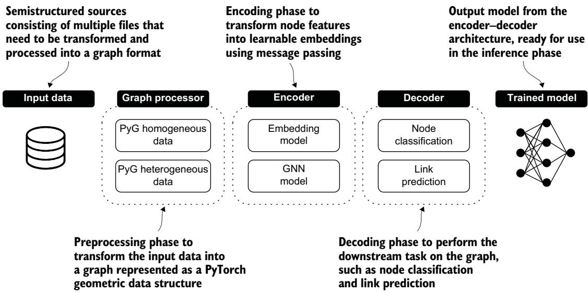  
Figure 12.1 End-to-end framework to develop a GNN-based system that can be adopted for multiple tasks and application domains. The input data is usually a collection of semistructured sources describing different objects and interactions between them. The goal is to process the data and produce a graph that becomes the input for an encoder–decoder architecture. In our scenarios, the encoder uses a GNN model, and the decoder is based on a function that allows us to optimize the model for a specific downstream task. The output of this framework is a trained model that can be adopted for the inference phase.

Throughout the chapter, we compare the performance of different GNN architectures: Graph convolutional networks (GCNs) [1], GraphSAGE (SAGE) [2], and graph attention networks (GATs) [3]. These models are developed using the PyTorch Geometric (PyG) library and are evaluated using metrics such as precision, recall, and F1- score. Insights from confusion matrices and visualizations of metric trends further illustrate the trade-offs and capabilities of these approaches in real-world scenarios. By the end of this chapter, you will have a comprehensive understanding of how to apply GNNs to solve node classification and link prediction tasks, equipping you with the tools to use graph-based ML for diverse applications.

### 12.1 Node classification for anti-money laundering applications

Node classification is a critical task in graph-based ML and is suitable for various application domains, including combating financial crimes. In the context of AML, financial transactions can be modeled as graphs, where nodes represent accounts or entities and edges represent transaction relationships.

This section focuses on using GNNs to detect licit and illicit nodes in financial transaction networks provided by the Elliptic dataset. Figure 12.2 shows the end-to-end model for applying GNNs in node classification, where each block is characterized by a specific implementation to satisfy the requirements of our task.

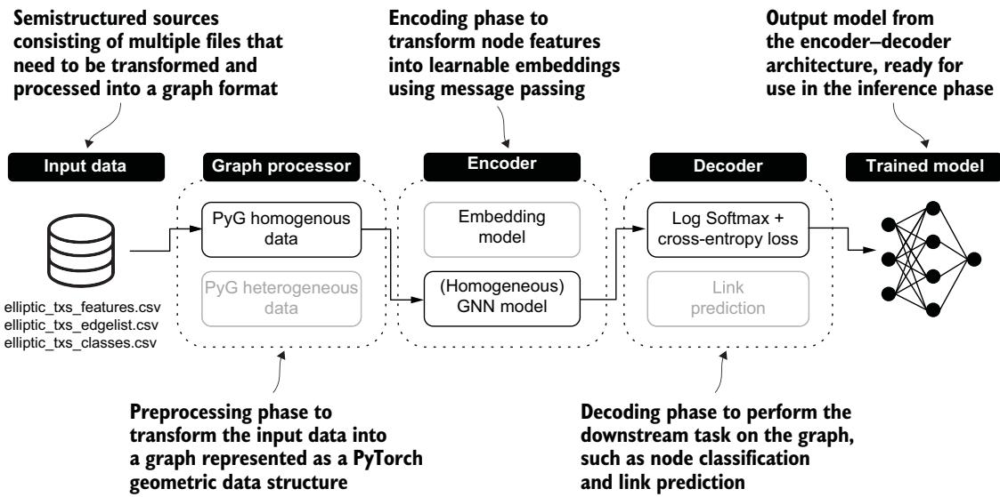  
Figure 12.2 End-to-end framework tailored for node classification in the context of AML. Transaction data and node labels are transformed into a homogeneous graph structure. The encoder, a homogeneous GNN, learns node embeddings by capturing its local graph structure. The decoder classifies nodes as licit or illicit by using a log softmax function and cross-entropy loss, producing a trained model for detecting suspicious activities.

#### 12.1.1 Input data

We will use the Elliptic dataset to explore the potential of GNNs in detecting licit and illicit nodes in financial transaction networks. The Elliptic dataset is a time-series graph comprising over 200,000 Bitcoin transactions (nodes), 234,000 directed payment flows (edges), and 166 node features derived from anonymized data.

The dataset is provided across three files. As of January 2025, these files provide the following information:

elliptic\_txs\_features.csv—A 167-column file with 203,769 rows. The first column lists all node IDs, and the remaining columns represent anonymized features associated with each node. Data from this file is stored in the features variable.

elliptic\_txs\_edgelist.csv —A 2-column file containing 234,355 rows corresponding to the number of edges in the network. The first column lists node IDs representing transaction sources, and the second column lists node IDs representing transaction targets. Data from this file is stored in the edges variable.

elliptic\_txs\_classes.csv—A 2-column file containing 203,769 rows corresponding to the number of nodes in the network. The first column lists all node IDs, and the second column specifies the label associated with each node: 1, 2, or unknown. Data in this file is stored in the classes variable.

In this dataset, the classes defining licit, illicit, and unknown nodes are distributed as shown in table 12.1.

Table 12.1 Distribution of licit, illicit, and unknown classes associated with nodes
<table><tr><td>Class</td><td>Labels</td><td>Counts</td><td>Percentage</td></tr><tr><td>Unknown</td><td>Unknown</td><td>157205</td><td>77.15%</td></tr><tr><td>Licit</td><td>2</td><td>42019</td><td>20.62%</td></tr><tr><td>Illicit</td><td>1</td><td>4545</td><td>2.23%</td></tr></table>

The next step preprocesses the CSV files to assign a more compact numerical representation to our data. Then we’ll create structures to make our financial transactions graph suitable for the GNN model.

#### 12.1.2 Graph processor: Data preparation

The preprocessing phase is critical for achieving a compact numerical representation of the original data and preparing our financial transaction graph structure for the GNN learning phase. Let’s start with processing information in the edges variable. Table 12.2 shows a sample of the original data: the txId1 column lists the IDs of the source nodes, and txId2 lists the IDs of the target nodes.

Table 12.2 Sample of data stored in the edges variable showing source nodes (txId1 column) and target nodes (txId2 column)
<table><tr><td>txld1</td><td>txld2</td></tr><tr><td>230425980</td><td>5530458</td></tr><tr><td>232022460</td><td>232438397</td></tr><tr><td>230460314</td><td>230459870</td></tr><tr><td>230333930</td><td>230595899</td></tr><tr><td>232013274</td><td>232029206</td></tr></table>

The code in the following listing assigns each node a new incremental ID and creates an updated version of the edge data using these IDs.

Listing 12.1 Assigning a new incremental ID to nodes and updating edges data   
tx\_id\_mapping = {tx\_id: idx for idx, tx\_id in enumerate(features['txId'])}   
edges\_with\_features = edges.assign(   
Creates a dictionary between the   
Id1=edges['txId1'].map(tx\_id\_mapping),   
original ID and the new incremental ID,   
Id2=edges['txId2'].map(tx\_id\_mapping),   
starting from the node features file   
>   
edges\_with\_features = edges\_with\_features.dropna(subset=['Id1', 'Id2'])   
edges\_with\_features = edges\_with\_features.astype({   
'Id1': 'int64', Only keeps edges where both   
'Id2': 'int64', the source and the target   
}) < Ensures that the new IDs are exist in the mapping   
integers (map can yield floats   
Maps source and target   
nodes to incremental IDs if NaNs were present)

Table 12.3 shows a sample of the output of this process, stored in the edges\_with\_ features variables.

Table 12.3 Edge data with the new incremental IDs associated with each node involved in a transaction
<table><tr><td></td><td></td><td></td><td></td></tr><tr><td>230425980</td><td>5530458</td><td>o</td><td>2</td></tr><tr><td>232022460</td><td>232438397</td><td>2</td><td>3</td></tr><tr><td>230460314</td><td>230459870</td><td>4</td><td>5</td></tr><tr><td>230333930</td><td>230595899</td><td>6</td><td>7</td></tr><tr><td>232013274</td><td>232029206</td><td>8</td><td>9</td></tr></table>

Starting from the new IDs, we can create edge\_index, a tensor describing the edges in the graph. Here’s how to create this structure.

Listing 12.2 Creating an edge\_index tensor using the incremental node IDs

```python
edge_index = torch.tensor(
edges_with_features[['Id1', 'Id2']].values.T,
dtype=torch.long
)
```

A sample of the edge\_index tensor is shown next.

Listing 12.3 Sample of the edge\_index tensor   
tensor([[ 0, 2, 4, ..., 201921, 201480, 201954], [ 1, 3, 5, ..., 202042,   
201368, 201756]])

Next, let’s process the original node features data structure by creating a new tensor, where each row corresponds to the incremental ID generated in the previous step. This step allows us to prepare the node features for the learning phase by dropping the original node IDs.

Listing 12.4 Creating a node feature tensor by dropping the original node ID

```python
node_features = torch.tensor(
features.drop(columns=['txId']).values,
dtype=torch.float
)
```

The output is stored in the node\_features tensor with size [203769, 166]. The first dimension of this tensor corresponds to the number of nodes, and the second dimension corresponds to the number of features.

As we mentioned, the index of each row of this matrix corresponds to the incremental ID created in the previous step. In other words, the 0th row of the node\_ features tensor corresponds to the set of features associated with node 0, whose original ID is 230425980.

The final step is to transform the original labels in the dataset into a numerical representation. To obtain this result, we use the LabelEncoder class of the scikit-learn library.

```python
Listing 12.5 Transforming original node classes into a numerical representation
from sklearn.preprocessing import LabelEncoder Creates an instance
le = LabelEncoder() < of LabelEncoder
class_labels = le.fit_transform(classes['class']) < Assigns numerical
original_labels = le.inverse_transform(class_labels) labels to each class
node_labels = torch.tensor(class_labels, dtype=torch.long) and converts the
categorical labels
Converts the numerical labels (class_labels) back Converts the class_labels list into corresponding
into their original categorical labels, based on into a PyTorch tensor numerical labels
the mapping created in fit_transform
```

The output is a new node\_labels tensor with size 203769, where label 0 corresponds to the licit nodes (“1” in the original datasets), label 1 corresponds to the illicit nodes (“2” in the original dataset), and label 2 corresponds to unknown nodes (“unknown” in the original dataset). Next, we’ll build our graph data as input for GNN models using PyG.

#### 12.1.3 Graph processor: Homogeneous PyG graph

We can now build our graph data structure using PyG features. Figure 12.3 provides an overview of the steps applied by the graph processor: a preparation phase, the construction of a PyG Data object, and the creation of training, validation, and testing datasets.

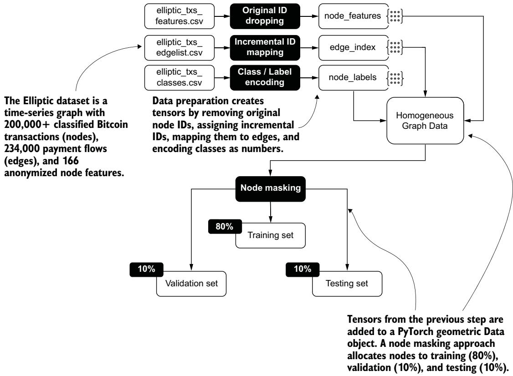  
Figure 12.3 Overview of data processing applied to the Elliptic dataset. Source data is preprocessed to create node features, edge indices, and encoded labels. These tensors are incorporated into a PyG Data object, where a node masking approach partitions the nodes into training (80%), validation (10%), and testing (10%) sets.

The first step is to use the result of the preprocessing phase (node\_features, edge\_index, node\_labels) to create a PyG Data object.

```python
Listing 12.6 Creating a PyG Data object from the data preparation results
from torch_geometric.data import Data
data = Data(x=node_features,
edge_index=edge_index,
y=node_labels)
```

The PyG Data object incorporates the features of the nodes, the information on the edges, and the label associated with each node. The next step is to apply a mask to this object, which specifies the nodes to be used during the training and evaluation phases.

Considering that our GNN models need to learn which nodes are licit and which are illicit, we need to “make visible” only the nodes with known labels to our model. To do so, we can run the following code.

#### Listing 12.7 Preparing a mask filter to retrieve only known node labels

known\_mask = (data.y == 0) | (data.y == 1) < Tensor of elements   
unknown\_mask = data.y == 2 < corresponding to nodes labeled 0   
(licit) or 1 (illicit), set to True   
Tensor of elements corresponding to   
nodes labeled 2 (unknown), set to False

The tensor of valid nodes (known\_mask) is used to define the dimensions of the training, validation, and testing sets.

#### Listing 12.8 Dimension of the training, validation, and testing datasets

Counts the True values in known\_mask and converts Creates a Computes the size of   
the resulting scalar tensor into a Python integer permutation the training dataset   
of indices (80% of nodes)   
import numpy as np   
num\_known\_nodes = known\_mask.sum().item() Computes the size of the   
permutations = torch.randperm(num\_known\_nodes) < validation dataset (10%)   
train\_size = int(0.8 \* num\_known\_nodes) <   
val\_size = int(0.1 \* num\_known\_nodes) < Computes the size of   
test\_size = num\_known\_nodes - train\_size - val\_size < the test dataset (10%)   
total = train\_size + val\_size + test\_size < Verifies that the total sizes add up to   
the original number of known nodes

Using the dimension of the results stored in the total variable, we determine the number of observations: that is, the number of labeled nodes to be included in the training, validation, and testing datasets. The results are summarized in table 12.4.

Table 12.4 Dimensions of the training, validation, and testing datasets, based on the number of labeled nodes
<table><tr><td>Dataset</td><td>Number of nodes</td><td>Percentage</td></tr><tr><td>Training</td><td>37,251</td><td>80%</td></tr><tr><td>Validation</td><td>4,656</td><td>10%</td></tr><tr><td>Testing</td><td>4,657</td><td>10%</td></tr></table>

Using the following code, we create the training, validation, and testing index masks on the PyG Data object based on the dimensions established in the previous step.

#### Listing 12.9 Training, validation, and testing masks on the PyG Data object

```python
Initializes the training set mask (all node Initializes the Initializes the
indices are marked as False by default) validation set mask testing set mask
train_mask = torch.zeros(data.num_nodes, dtype=torch.bool) Fills training set
val_mask = torch.zeros_like(train_mask) < indices with a
test_mask = torch.zeros_like(train_mask) < uniquely shuffled
nonzero_indices = known_mask.nonzero(as_tuple=True)[0] batch of True values
train_indices = nonzero_indices[permutations[:train_size]] from known_mask
```

```ini
val_indices = nonzero_indices[ Fills validation set indices with a
permutations[train_size:train_size + val_size] non-overlapping batch of True
] < values from known_mask
test_indices = nonzero_indices[permutations[train_size + val_size:]] ≤
train_mask[train_indices] = True < Sets the training
val_mask[val_indices] = True < set indices to Fills testing set indices
test_mask[test_indices] = True < True in the with another distinct,
data.train_mask = train_mask training set mask non-overlapping
data.val_mask = val_mask batch of True values
data.test_mask = test_mask Sets the validation set from known_mask
indices to True in the
Sets the testing set indices to validation set mask
True in the testing set mask
```  
Table 12.5 shows the dataset’s statistics to clarify how the data is split for training and evaluation. In this scenario, we can directly check the balance of licit and illicit information in each dataset.

Table 12.5 Training, validation, and testing dataset size and class distribution for each dataset
<table><tr><td>Dataset</td><td>Total count</td><td>Licit</td><td>Licit (%)</td><td>Illicit</td><td>Illicit (%)</td></tr><tr><td>Training</td><td>37,251</td><td>33,645</td><td>90.32</td><td>3,606</td><td>9.78</td></tr><tr><td>Validation</td><td>4,656</td><td>4,193</td><td>90.06</td><td>463</td><td>9.88</td></tr><tr><td>Testing</td><td>4,657</td><td>4,181</td><td>89.78</td><td>476</td><td>9.45</td></tr></table>

We performed the splitting process for the classification task manually by defining multiple scripts. In section 12.2.3, we will see that the PyG library provides features to help us split the dataset. Let’s now discuss the end-to-end architecture to build our node classification system.

#### 12.1.4 Encoder–decoder architecture

Chapter 11 introduced the encoder–decoder architecture. Figure 12.4 provides an overview of the steps involved in training a GNN model on a downstream task.

The following listing shows the implementation of a Python class to define an encoder–decoder for node classification.

```python
Listing 12.10 Encoder–decoder implementation for node classification
import torch
import torch.nn.functional as F
class NodeClassifier(torch.nn.Module):
def __init__(self, gnn_model):
super().__init__()
self.gnn = gnn_model
def forward(self, x, edge_index):
x = self.gnn(x, edge_index)
return F.log_softmax(x, dim=1)
```

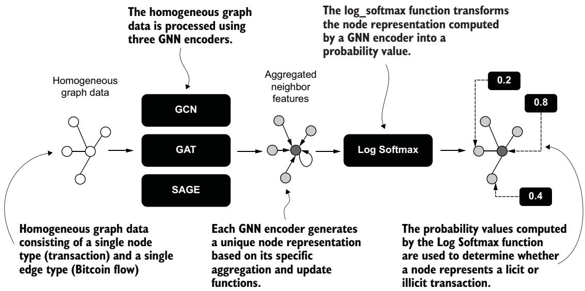  
Figure 12.4 Overview of the main steps of the encoder–decoder architecture. Homogeneous graph data, consisting of transactions (nodes) and Bitcoin flows (edges), is processed using three GNN encoders: GCN, GAT, and SAGE. Each encoder generates unique node representations by aggregating neighbor features. Then these representations are transformed into probability values, which are used to classify transactions as licit or illicit.

The forward method of the NodeClassifier class includes an encoding phase performed by a GNN to update the node representation with information from its neighbors and a decoding phase executed by the log\_softmax function provided by PyTorch, which produces a probability value associated with each node. Such a probability value will be used to establish whether a node is licit or illicit. Let’s see the implementation of these components in detail.

#### THE ENCODER

The encoder component uses a homogeneous GNN to perform the message-passing process (see chapter 11). This means the encoder is designed to handle homogeneous graphs containing a single type of node and edge, such as those provided in financial transaction networks. To compare the behavior of different GNN encoders, in the following listing we define a base graph model that specifies the shared characteristics of these encoders.

#### Listing 12.11 Base graph model to define a general GNN encoder

```python
import torch
import torch.nn.functional as F
class BaseGraphModel(torch.nn.Module):
def __init__(self, input_dim,
hidden_dim, Defines the model's initialization, including
out_dim, the input, hidden, and output dimensions;
conv_layer, type of convolution layer; and arguments that
**conv_kwargs): < may be passed to the convolutional layer
```

```python
Calls the superclass initializer Initializes the first graph convolution
to set up the model layer with input and hidden dimensions
D super(BaseGraphModel, self).__init__()
self.conv1 = conv_layer(input_dim, hidden_dim, **conv_kwargs) <
self.conv2 = conv_layer(hidden_dim, out_dim, **conv_kwargs) <
def forward(self, x, edge_index): < Initializes the second graph
convolution layer with hidden
x = self.conv1(x, edge_index) ≤
and output dimensions
x = F.relu(x) <
x = self.conv2(x, edge_index) Defines the forward pass
Returns the return x function for the model
Applies the second
final node convolution layer to the Applies the first convolution layer to
features after transformed features the input features and edge indices
processing
Applies the ReLU activation function
to introduce nonlinearity
```

This base class shows a two-layer architecture in which any GNN implementation provided by PyG can be used for neighborhood aggregation and node update operations (convolution). The \*\*conv\_kwargs argument lets us pass extra parameters that may be required for specific GNN implementations. Consider the implementation of our SAGE model in the next listing.

#### Listing 12.12 SAGE model implemented from the base class

```python
from torch_geometric.nn import SAGEConv
class SAGE(BaseGraphModel):
def __init__(self, input_dim, hidden_dim, out_dim):
super(SAGE, self).__init__(
input_dim=input_dim,
hidden_dim=hidden_dim,
out_dim=out_dim,
conv_layer=SAGEConv
)
```

The SAGEConv layer from PyG does not require additional parameters, so initializing our SAGE model is straightforward. This code creates a GNN model with two SAGEConv layers.

Other GNN models require an extension of our base class. Consider the imple mentation of the GAT model, shown in the following listing.

#### Listing 12.13 GAT model implemented by extending the base class

```python
from torch_geometric.nn import GATConv
class GAT(BaseGraphModel):
def _init__(self, input_dim,
hidden_dim,
out_dim,
num_heads=8, Initializes the
add_self_loops=True): < GAT model
```

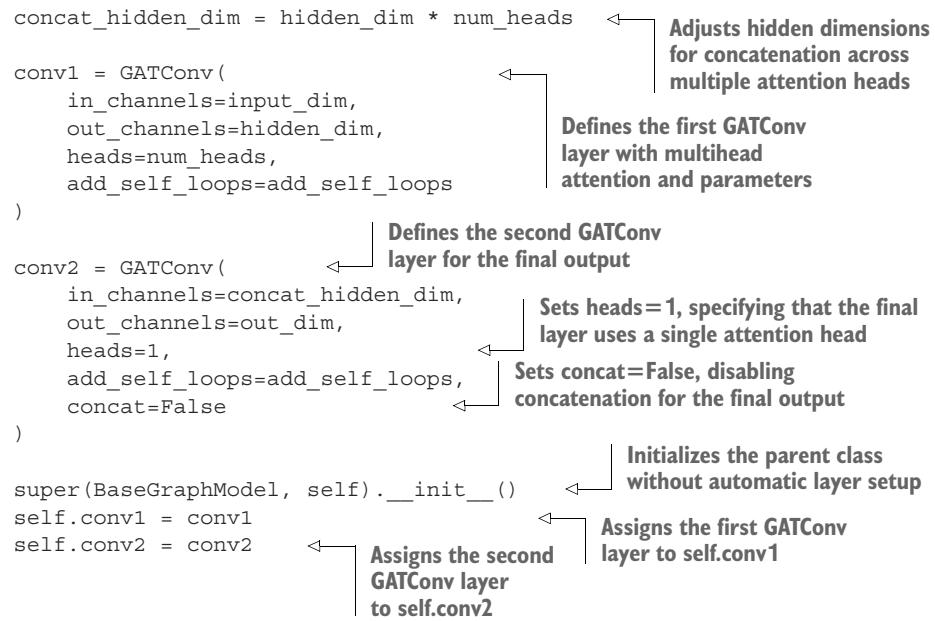

In this case, we must reimplement the convolutional layers to include the additional parameters required by the GATConv layer implemented in PyG.

#### THE DECODER

The decoder component uses PyTorch’s log\_softmax function to transform the neural network’s output—specifically, the output of the GNN encoder—into probability values. Unlike the standard softmax function, log\_softmax improves the stability of the learning process by mitigating the effects of extremely small or large numbers during the probability computation.

In this context, the log\_softmax function works in tandem with PyTorch’s Cross-EntropyLoss function. This function combines the logarithm of softmax probabilities with the negative log-likelihood loss, providing an efficient approach to classification tasks. For example, in an AML system, the GNN encoder might analyze transaction data to detect suspicious behavior, and each node could be assigned a probability for different categories, such as licit or illicit.

The log\_softmax function ensures that these probabilities are numerically stable and interpretable, and the CrossEntropyLoss function measures how well the model’s predictions match the actual labels. If the model predicts a high probability for illicit but the node is labeled licit, the loss function identifies the error and optimizes the model to improve accuracy.

#### 12.1.5 Evaluation and analysis

In our analysis, we compared three end-to-end models for node classification. Each model uses a different GNN encoder: GCN, GAT, or SAGE. Table 12.6 shows the number of parameters and the total training time in seconds for each model; we achieved these results after 400 epochs on a T4 Colab machine.

NOTE When you run the code examples, your results may differ slightly from those shown in the text. This is normal behavior in machine learning, where algorithms often incorporate randomness (for example, in initialization or sampling). Such variability does not indicate an error in your code.

Table 12.6 Number of parameters and total training time for each encoder
<table><tr><td>Encoder</td><td>Parameters</td><td>Training time (s)</td></tr><tr><td>GCN</td><td>2,723</td><td>19.02</td></tr><tr><td>GAT</td><td>22,025</td><td>43.45</td></tr><tr><td>SAGE</td><td>5,427</td><td>36.71</td></tr></table>

The results indicate that the GCN model is the most efficient, the GAT model is the least efficient, and the SAGE model falls between the other two. As you can guess, the training time is directly connected to the number of parameters. In section 12.1.4, we clarified that the GAT model incorporates an attention mechanism that introduces learnable coefficients for the neighborhood edges which increase the number of learning parameters.

#### PRECISION, RECALL, AND F1-SCORE

To explore the generalization capabilities of these models, we can evaluate their performance on precision, recall, and F1-score metrics. In the context of node classification for AML, these metrics allow us to answer the following questions:

Precision—When the model says a node is licit or illicit, how often is it right?

Recall—Of all the existing licit and illicit nodes, how many did the model correctly find?

F1-score—How well does the model balance being accurate when it makes a prediction and finding as many correct nodes as possible?

Figure 12.5 shows plots of GCN, GAT, and SAGE performance across these metrics on the validation dataset during the training phase. The vertical axis shows the metric values, and the horizontal axis indicates the number of epochs.

We obtained these results using the sklearn library’s built-in scoring functions for precision, recall, and F1-score. These scoring functions provide the average parameter to manage imbalanced datasets, such as ours, where licit nodes are much more numerous than illicit ones. We decided to use the weighted average because it provides a performance metric that reflects the data distribution and is suitable for general evaluation.

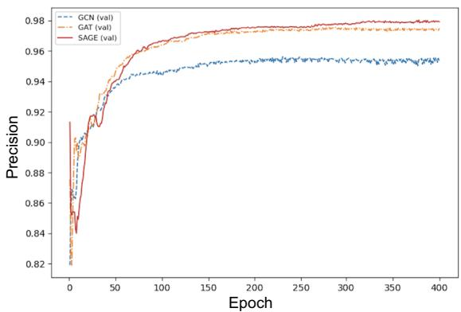

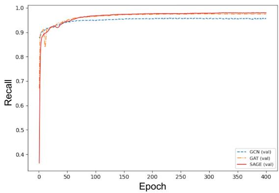

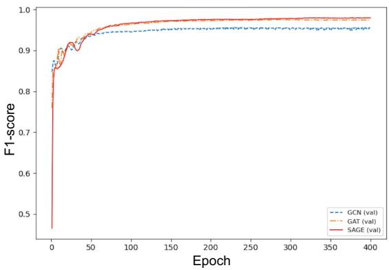  
Figure 12.5 Performance of GCN, GAT, and SAGE across precision, recall, and F1-score on the validation dataset during the training phase

Let’s answer our earlier questions in the context of the AML scenario for detecting licit and illicit nodes:

 Precision—When the models predict whether a node is licit or illicit, the SAGE model is the most accurate, maintaining consistently high precision throughout the training phase. This indicates that SAGE minimizes false positives and makes more reliable predictions about licit and illicit nodes. The GAT model also performs well in this regard, closely tracking SAGE. The GCN model demonstrates the lowest precision, often misclassifying licit and illicit nodes, especially in earlier epochs.

Recall—The models perform similarly in identifying all actual licit and illicit nodes, with all three achieving close recall values as training progresses. This means GCN, GAT, and SAGE can effectively detect almost all licit and illicit nodes. However, recall alone does not account for false positives, so it must be combined with precision to understand overall model performance.

 F1-score—This score reflects how well the models balance precision and recall in detecting licit and illicit nodes. The SAGE model achieves the highest value, proving that it finds the right balance: it identifies most licit and illicit nodes and minimizes incorrect predictions. The GAT model is nearly as strong as SAGE, showing only a minor difference. Due to its lower precision, the GCN model struggles to achieve high scores despite its high recall, indicating weaker overall performance in balancing these metrics.

#### CONFUSION MATRICES

Beyond the overall behavior, we can conduct a more specific evaluation to distinguish the performance of these models on licit nodes from their performance on illicit nodes. To do so, we can use a confusion matrix that breaks down classification performance compared to the previously defined metrics by showing the counts of correct and incorrect predictions for each class (licit or illicit). Figure 12.6 shows the confusion matrices of the GCN, GAT, and SAGE models on the testing dataset.

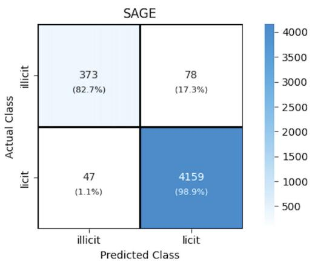

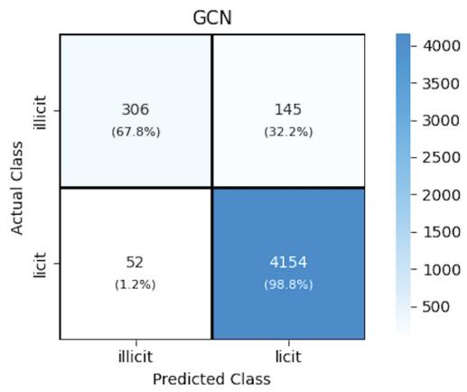

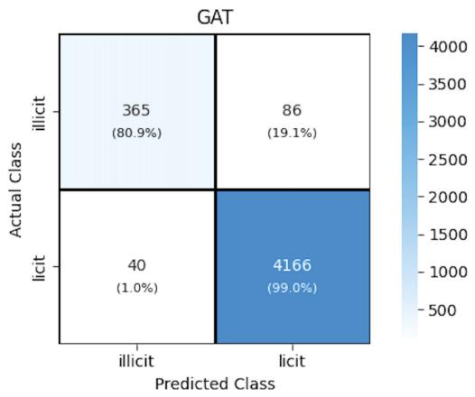  
Figure 12.6 Confusion matrices to understand the performance of GCN, GAT, and SAGE models on each class (licit or illicit)

Overall, SAGE performs best, correctly classifying most licit and illicit nodes with minimal misclassifications. The GAT model also performs strongly, coming close to SAGE in accuracy, but with slightly higher misclassifications in the illicit class. The GCN model exhibits the weakest performance, with lower precision and recall for illicit nodes, indicating challenges in distinguishing these nodes compared to the other models. Let’s analyze the behavior of each model in detail:

 GCN—This model shows moderate performance in classifying licit and illicit nodes. It correctly classifies about 68% of illicit nodes and about 99% of licit nodes. However, about one-third of illicit nodes are misclassified as licit, highlighting the struggle to identify illicit nodes correctly. On the licit side, about 1% of licit nodes are incorrectly predicted as illicit, showing better accuracy in predicting licit nodes. This imbalance indicates that although GCN effectively identifies licit nodes, its precision for illicit nodes requires improvement.

GAT—This model outperforms GCN by correctly classifying about 81% of illicit and about 99.5% of licit nodes. It reduces misclassification for the illicit class compared to GCN: about one in five illicit nodes are misclassified as licit, whereas only 40 licit nodes are misclassified as illicit. This improvement demon strates that GAT provides a more reliable balance across both classes.

SAGE—This model achieves the highest performance among the three. It correctly classifies about 83% of illicit nodes and about 99% of licit nodes. Its misclassification rates are the lowest: fewer than 1 in 5 illicit nodes are misclassified as licit (88), and only around 50 licit nodes are misclassified as illicit.

Based on the overall analysis, the SAGE model’s superior balance, higher accuracy for both licit and illicit nodes, and minimal misclassifications make it the most effective and reliable choice. It is particularly well suited for applications where detecting illicit nodes is critical, such as AML, while maintaining high accuracy for licit nodes.

### 12.2 Link prediction for movie recommendations

Link prediction is pivotal in graph-based ML and is particularly relevant for applications like recommendation systems. By using graph structures, we can model interactions and preferences as links between entities—in this case, representing the relationships between users and movies.

This section explores the use of GNNs to predict user–movie links, using the MovieLens dataset as a data source; figure 12.7 illustrates the end-to-end framework. The goal is to evaluate the ability of GNNs to suggest relevant movies while avoiding irrelevant recommendations, thereby enhancing the recommendation process.

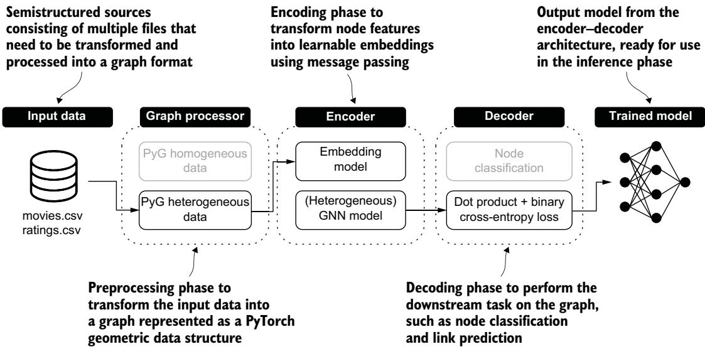  
Figure 12.7 End-to-end framework for link prediction in the context of recommendation systems. Interaction/ preference data is transformed into a heterogeneous graph structure that includes two types of nodes: users and movies. The encoder, a heterogeneous GNN, learns node embeddings by capturing its local graph structure. The decoder predicts the existence of links between users and movies by using a dot-product operation combined with a binary cross-entropy loss to produce a trained model for suggesting relevant movies to users.

#### 12.2.1 Input data

We will use the small version of the MovieLens dataset to explore the capabilities of GNNs in performing link prediction for recommendation purposes. This version of the MovieLens dataset includes 100,000 ratings and 3,600 tag applications applied to 9,000 movies by 600 users. As of January 2025, the raw data is available at https:// files.grouplens.org/datasets/movielens/ml-latest-small.zip and includes the following files:

movies.csv—A CSV file with 9,742 rows and 3 columns. The columns define the ID of the movie, the title of the movie, and the genres, respectively.

ratings.csv—A CSV file with 100,836 rows and 4 columns. The columns define the ID of the user, the ID of the movie, the rating, and a timestamp.

We will focus on a subset of the available columns for the link prediction task. In the case of movies.csv, we will use the movieId and genres columns. Table 12.7 shows a sample of this file with this subset of columns. The movie is identified by an incremental ID starting from 1, and its genre is provided as a collection of categorical strings separated by the pipe character (|).

Table 12.7 Sample of the movieId and genres columns from the movies.csv file
<table><tr><td>movieId</td><td>genres</td></tr><tr><td>1</td><td>Adventure|Animation|Children|Comedy|Fantasy</td></tr><tr><td>2</td><td>Adventure|Children|Fantasy</td></tr><tr><td>3</td><td>Comedy|Romance</td></tr><tr><td>4</td><td>Comedy|Drama|Romance</td></tr><tr><td>5</td><td>Comedy</td></tr></table>

In the ratings.csv file, we will consider only the userId and movieId columns. Table 12.8 provides a sample. Each row defines the rating of a specific movie (identified by the same ID used in the movies.csv file) from a particular user identified by an incremental ID.

Table 12.8 Sample of the userId and movieId columns from the ratings.csv file
<table><tr><td>userId</td><td>movieId</td></tr><tr><td>1</td><td>1</td></tr><tr><td>2</td><td>3</td></tr><tr><td>2</td><td>6</td></tr><tr><td>1</td><td>47</td></tr><tr><td>1</td><td>50</td></tr></table>

#### 12.2.2 Graph processor: Data preparation

As in the node classification task, we have to prepare the data to achieve a compact numerical representation of the original data and a rating graph structure for the GNN learning phase. Let’s start by processing the movies.csv file. The main goal is transforming the genre information into something numerically processable (a vector of features), as in the following listing.

Listing 12.14 Transforming genre information into a vector of features   
Reads the movie dataset   
movies\_df = pd.read\_csv(movies\_path, index\_col='movieId')   
and loads it in memory   
genres = movies\_df['genres'].str.get\_dummies('|')   
movie\_feat = torch.from\_numpy(genres.values).to(torch.float) <   
assert movie\_feat.size() == (9742, 20) <   
Creates a new tensor where   
Checks the consistency of the binary representation   
Separates genres and transforms   
the number of genres with of genres is a set of features   
them into binary indicators   
the original representation attached to movies

A sample of the output stored in the movie\_feat variable is shown in table 12.9. In this representation, each movie is associated with a feature vector containing 0s and 1s, where a value of 1 in a specific column indicates that the movie belongs to the corresponding genre.

Table 12.9 Vector of features for movie genres
<table><tr><td rowspan=1 colspan=1>movieId</td><td rowspan=1 colspan=1>Action</td><td rowspan=1 colspan=1>Adventure</td><td rowspan=1 colspan=1>Drama</td><td rowspan=1 colspan=1>Horror</td></tr><tr><td rowspan=1 colspan=1>7</td><td rowspan=1 colspan=1>0</td><td rowspan=1 colspan=1>1</td><td rowspan=1 colspan=1>0</td><td rowspan=1 colspan=1>0</td></tr><tr><td rowspan=3 colspan=1>234</td><td rowspan=1 colspan=1>0</td><td rowspan=1 colspan=1>1</td><td rowspan=1 colspan=1>0</td><td rowspan=2 colspan=1>0o</td></tr><tr><td rowspan=1 colspan=1>0</td><td rowspan=1 colspan=1>0</td><td rowspan=1 colspan=1>o</td></tr><tr><td rowspan=1 colspan=1>0</td><td rowspan=1 colspan=1>0</td><td rowspan=1 colspan=1>1</td><td rowspan=1 colspan=1>0</td></tr><tr><td rowspan=1 colspan=1>5</td><td rowspan=1 colspan=1>0</td><td rowspan=1 colspan=1>0</td><td rowspan=1 colspan=1>0</td><td rowspan=1 colspan=1>0</td></tr></table>

In our example, the movie with ID 1 can be categorized as an Adventure movie, and the movie with ID 4 is categorized as a Drama movie. Multiple genre values can be associated with the same movie.

We need to create an edge\_index tensor that describes the connections between users and movies (listing 12.15). The first step is to map the original IDs of movies and users to incremental IDs starting from 0. Then, we can create the edge\_index using the new IDs.

Listing 12.15 Generating the edge\_index tensor from user and movie IDs   
ratings\_df = pd.read\_csv(ratings\_path) < Reads the rating file   
and loads it in memory   
unique\_user\_id = ratings\_df['userId'].unique()   
unique\_user\_id = pd.DataFrame(data={ Creates a new data frame   
'userId': unique\_user\_id, with a mapping from the   
'mappedID': pd.RangeIndex(len(unique\_user\_id)), original user IDs to the   
}) < [0, num\_user\_nodes) range   
unique\_movie\_id = pd.DataFrame(data={ Creates a new data frame   
'movieId': movies\_df.index, with a mapping from the   
'mappedID': pd.RangeIndex(len(movies\_df)), original movie IDs to the   
}) < [0, num\_movie\_nodes) range   
ratings\_user\_id = pd.merge(   
ratings\_df['userId'],   
unique\_user\_id,   
left\_on='userId',   
Stores the new source user   
right\_on='userId',   
IDs of the ratings into   
how='left'   
a new data frame   
)   
ratings\_user\_id = torch.from\_numpy(ratings\_user\_id['mappedID'].values) <

Mapping of user IDs to consecutive values:   
userId mappedID   
0 1 0   
1 2 1   
2 3 2   
3 4 3   
4 5 4   
Mapping of movie IDs to consecutive values:   
movieId mappedID   
0 1 0   
1 2 1   
2 3 2   
3 4 3   
4 5 4   
Final edge indices pointing from users to movies:   
==   
tensor([[ 0, 0, 0, ... 609, 609, 609],   
[ 0, 2, 5, ..., 9462, 9463, 9503]])

```python
ratings_movie_id = pd.merge(
ratings_df['movieId'],
unique_movie_id,
left_on='movieId',
Stores the new target
right_on='movieId', movie IDs of the ratings
how='left' into a new data frame
ratings_movie_id = torch.from_numpy(ratings_movie_id['mappedID'].values)
edge_index_user_to_movie = torch.stack([ratings_user_id, ratings_movie_id],
dim=0) < Creates the edge_index by stacking
the source and target data frames
```

The output of ID mappings for users and movies, along with the edge\_index tensor, is shown in the following listing.

#### Listing 12.16 Output of ID mapping, and a sample of edge\_index

The size of the edge index tensor is [2, 100836], and the second element corresponds to the number of ratings in the dataset. After the preprocessing phase, we can finally create our PyG graph structure to represent ratings as interactions between users and movies.

#### 12.2.3 Graph processor: Heterogeneous PyG graph

Figure 12.8 provides an overview of the steps applied by the graph processor. They include a preparation phase, the construction of a PyG HeteroData object, the creation of training, validation, and testing datasets, and the preparation of the mini-batches.

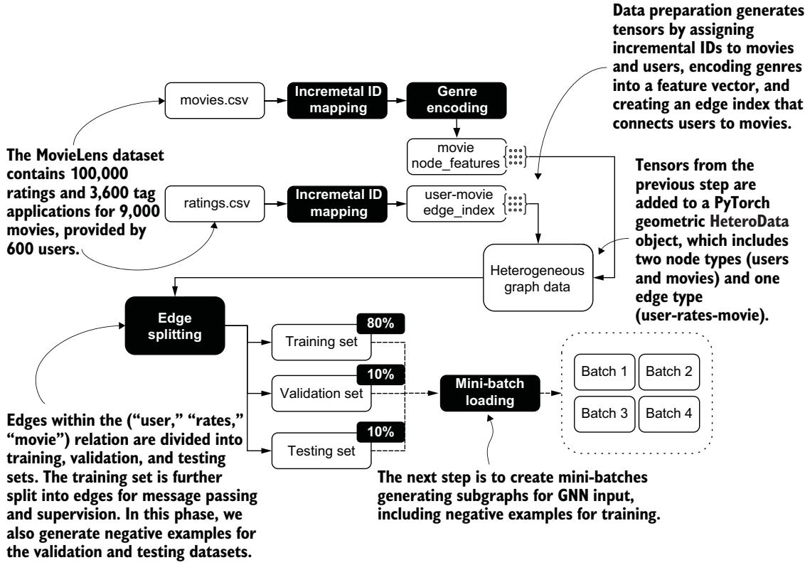  
Figure 12.8 The data processing pipeline for the MovieLens dataset, including incremental ID mapping, genre encoding, and edge creation. The heterogeneous graph data comprises two node types (users and movies) and one edge type (user-rates-movie). Edges are split into training (80%), validation (10%), and testing (10%) sets, with negative examples generated for validation and testing. A mini-batch loader then prepares subgraphs for GNN input, ensuring scalability for large graphs that exceed memory capacity.

In our scenario, we have two types of nodes: users and movies. We construct our graph using PyG’s HeteroData to represent information about these nodes. Unlike the Data class used in homogeneous graphs, which assumes a single node type and a single edge type, HeteroData allows us to differentiate features for each node type and associate the edge\_index with a specific relationship: in this case, the rates relationship. The next listing constructs the PyG HeteroData object using the result of the preprocessing phase, which consists of the movie\_feat generated with the related genres and the edge\_index.

#### Listing 12.17 Building the PyG HeteroData object

```python
from torch_geometric.data import HeteroData
data = HeteroData()
data["user"].node_id = torch.arange(len(unique_user_id))
data["movie"].node_id = torch.arange(len(movies_df))
```

data["movie"].x = movie\_feat   
data["user", "rates", "movie"].edge\_index = edge\_index\_user\_to\_movie   
data = T.ToUndirected()(data)

In this case, we have to add reverse edges to make explicit the GNN message passing from users to movies and vice versa.

After generating the graph, we can split the rating edges into training, validation, and testing datasets, as shown in the next listing. Our main goal is to avoid overlap ping between these datasets in terms of links. In the context of node classification, we performed this spitting operation manually to separate the nodes, but in this case, we use the built-in PyG transforms.RandomLinkSplit function.

Listing 12.18 Creating training, validation, and testing datasets   
import torch\_geometric.transforms as T Defines the percentage   
of validation edges (10%) Defines the   
transform = T.RandomLinkSplit( percentage of edges   
num\_val=0.1, < Defines the percentage for supervision   
num\_test=0.1, < of testing edges (10%) (30%) and message   
disjoint\_train\_ratio=0.3, < passing (70%)   
neg\_sampling\_ratio=2, < Defines the number of   
add\_negative\_train\_samples=False, < negative samples (2) for each   
edge\_types=("user", "rates", "movie"), < existing edge in the validation   
V rev\_edge\_types=("movie", "rev\_rates", "user"), and testing datasets   
Defines the existing Establishes no negative   
Defines the reverse edges for edges for message training samples (False) in   
message passing but not for training passing and training the training dataset

The transforms.RandomLinkSplit function randomly partitions the edges in the ("user", "rates", "movie") relation into training, validation, and test edges. Compared to traditional dataset splitting, in the case of GNNs we have to consider other factors. For example, the disjoint\_train\_ratio parameter further subdivides the training edges into two distinct groups:

Edges used for message passing, stored in the edge\_index variable

Edges used for supervision, stored in the edge\_label\_index variable

The difference between these two types of edges is reflected in the following training data structure.

Listing 12.19 Details of the training data   
Training data:   
===   
HeteroData(   
user={   
node\_id=[610]   
},   
movie={

```prolog
node_id=[9742],
x=[9742, 20]
},
(user, rates, movie)={
edge_index=[2, 56469],
edge_label=[24201],
edge_label_index=[2, 24201]
},
(movie, rev_rates, user)={
edge_index=[2, 56469]
}
```

The size of the training set is 80,669, which corresponds to 80% of 100,836 (the total number of edges). However, the training HeteroData reports a value corresponding to 56,469 (70% of 80,669) for edge\_index and a value of 24,201 (30% of 80,669) for edge\_label\_index. It is important to remember that these edge sets are disjointed to avoid overlap between the edges used for message passing and those used for supervision.

Moreover, in the context of a heterogeneous graph, the reverse edges are specified with the rev\_edge\_types parameter. Reverse edges are used for message passing but not for training the link prediction model. The following HeteroData objects illustrate the structure of our validation and testing datasets.

#### Listing 12.20 Details of the validation and testing dataset

Validation data:   
HeteroData(   
user={   
node\_id=[610]   
},   
movie={   
node\_id=[9742],   
x=[9742, 20]   
},   
(user, rates, movie)={   
edge\_index=[2, 80670],   
edge\_label=[30249],   
edge\_label\_index=[2, 30249]   
},   
(movie, rev\_rates, user)={   
edge\_index=[2, 80670]   
}   
)   
Test data:   
HeteroData(   
user={   
node\_id=[610]   
},

movie={   
node\_id=[9742],   
x=[9742, 20]   
},   
(user, rates, movie)={   
edge\_index=[2, 90753],   
edge\_label=[30249],   
edge\_label\_index=[2, 30249]   
},   
(movie, rev\_rates, user)={   
edge\_index=[2, 90753]   
}   
)

The dimensions shown in this listing let us understand which edges are used for message passing and which for evaluating the model’s goodness on the validation and testing datasets. For the validation dataset, the edge\_index size is 80,670, equal to the number of edges in the training dataset. The edge\_label\_index size is 30,249, which is equivalent to 10,083 (10% of 100,836), resulting in 20,166 negative edges generated by RandomLinkSplit.

In this context, the 80,670 training edges are used for message passing, and the 30,249 edges are used to evaluate the model for the link prediction task on the validation dataset. An analogous principle is used for the testing set: the edges used for message passing (90,753) include the training (80,670) and validation edges (10,083).

After splitting the dataset, the next step is to define a mini-batch loader capable of producing subgraphs suitable for input into our GNN. Although this step may not be essential for small-scale graphs, it is important to use GNNs on larger graphs that exceed CPU or GPU memory capacity.

For this purpose, we use the loader.LinkNeighborLoader component of PyG to select a sample of edges from the set of input edges. As shown in the following listing, it constructs a subgraph from all the nodes in this list by sampling the number of neighbors in each iteration.

#### Listing 12.21 Sampling the number of neighbors in each iteration

```python
from torch_geometric.loader import LinkNeighborLoader
edge_label_index = train_data["user", "rates", "movie"].edge_label_index
edge_label = train_data["user", "rates", "movie"].edge_label
train_loader = LinkNeighborLoader( Samples at most 20 neighbors
data=data, in the first hop and at most 10
num_neighbors=[20, 10], < neighbors in the second hop
neg_sampling_ratio=2, <
edge_label_index=(("user", "rates", "movie"), edge_label_index),
edge_label=edge_label,
batch_size=128, < Sets the batch size in terms Defines the ratio of
shuffle=True < of the number of edges negative samples (2:1)for each existing edge
Random order created in the batch
of edges
```

Note that this process is also performed on the validation and testing datasets. After describing the data preparation phase, we can understand the architecture for addressing the link prediction task.

#### 12.2.4 Encoder–decoder architecture

The link prediction system is also based on an encoder–decoder architecture. However, the architecture discussed in this section comprises specific components based on the characteristics of the input data (a heterogeneous graph structure) and the downstream task to be performed (link prediction for recommendation); figure 12.9 provides an overview of the steps involved. The following listing implements the encoder–decoder architecture in this scenario.

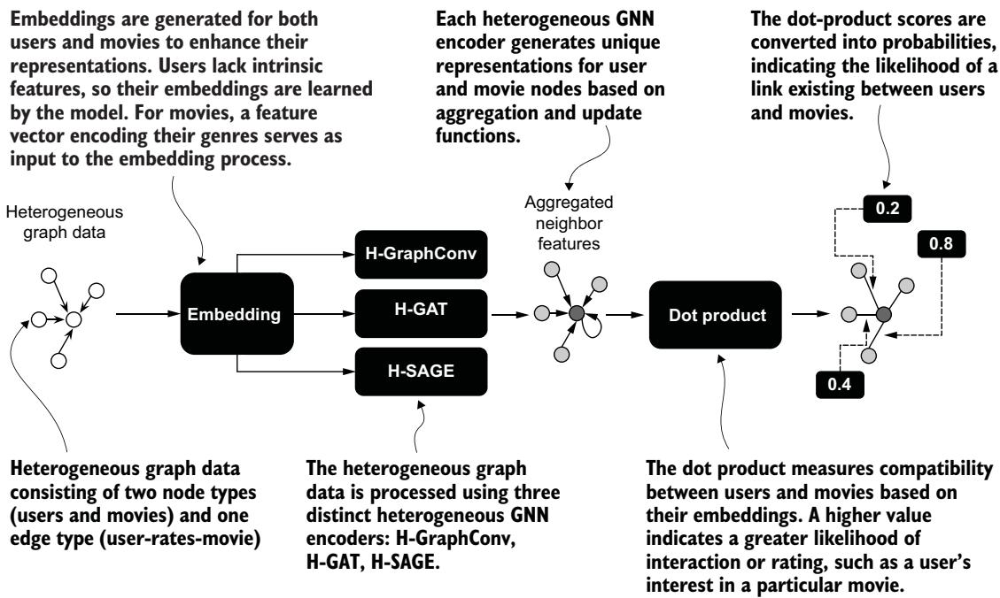  
Figure 12.9 Pipeline for processing heterogeneous graph data in a link prediction system for movie recommendations. The data consists of users and movies as node types and user–movie ratings as edges. Embeddings are generated, with user embeddings learned by the model and movie embeddings initialized from genre features. The data is processed using three heterogeneous GNN encoders (H-GraphConv, H-GAT, and H-SAGE), which aggregate neighbor features to generate node representations. A dot product then quantifies the compatibility between users and movies, with higher scores indicating a greater likelihood of interaction. The scores are finally converted into probabilities representing the likelihood of a link between users and movies.

#### Listing 12.22 Encoder–decoder architecture for link prediction

```python
super().__init__()
self.embedding = MovieLensEmbedding(
data["user"].num_nodes,
data["movie"].num_nodes, Initializes the embedding representation
hidden_channels for user and movie nodes using the
) < MovieLensEmbedding class
self.gnn = gnn_model(
data.metadata(), Initializes the model architecture
hidden_channels, (a heterogeneous version of
hidden_channels, modified GraphGCN, GAT, and SAGE)
hidden_channels
) < Initializes the final layer (decoder),
which performs a dot-product operation
self.classifier = DotProduct() < of user and movie embeddings
Performs forward propagation
def forward(self, data): <
and computes the prediction
x_dict = self.embedding(data)
x_dict = self.gnn(x_dict, data.edge_index_dict)
pred = self.classifier(
x_dict["user"],
x_dict["movie"],
data["user", "rates", "movie"].edge_label_index
)
return pred
```

The forward method of MovieLensLinkPredictor shows the propagation of the data into the encoding–decoding process. The encoding phase combines two steps to enhance user and movie data representation:

Embedding generation—This step generates embeddings for both users and movies to improve the expressiveness of their features. Because users are not associated with intrinsic features, their embeddings are learned from the model. For movies, a feature vector encoding their genres is used as input to the embedding pro cess, providing a meaningful starting representation for each movie node.

Heterogeneous GNN model—The embeddings are updated using a heterogeneous GNN model. This model uses the graph structure to refine node representations by aggregating information from neighboring nodes. Specifically, user embeddings are updated with information from the movies they interact with, and movie embeddings are updated with information from the users who have interacted with them. This bidirectional information exchange ensures that the embeddings effectively capture the relational structure of the graph.

The decoding phase uses the learned embeddings to make predictions. This is implemented using a dot-product operation, where the embeddings of user and movie nodes are combined to compute a similarity score. This score represents the likelihood of a link (rating) between a user and a movie. The dot product enables the model to predict user–movie relationships based on the learned embedding. Let’s now analyze the encoder and decoder implementations in our link prediction system.

#### THE ENCODER

As introduced at the beginning of this section, the encoder component has two steps: the first generates the embedding, and the second applies the heterogeneous GNN model. The embedding generation step is shown next.

#### Listing 12.23 Class for the embedding generation

```python
import torch
class MovieLensEmbedding(torch.nn.Module):
def __init__(self, user_input_dim, movie_input_dim, out_dim):
super().__init__()
self.movie_lin = torch.nn.Linear(20, out_dim)
self.user_emb = torch.nn.Embedding(user_input_dim, out_dim)
self.movie_emb = torch.nn.Embedding(movie_input_dim, out_dim)
def forward(self, data):
return {
"user": self.user_emb(data["user"].node_id),
"movie": self.movie_lin(data["movie"].x) +
self.movie_emb(data["movie"].node_id),
}
```

We apply different embedding generation approaches for the user and movie features. We use a single-step approach for users, creating an embedding matrix with rows equal to the total number of user nodes (user\_input\_dim) and columns defined by the out\_dim parameter. In this context, users do not have any initial features associated with them, and their embeddings are learned solely from this matrix during training.

For movies, we use a two-step approach. First we apply a linear transformation to the input features, represented as a 20-dimensional vector encoding movie genres. Then we combine the output of this transformation with an embedding layer. This method enhances the expressiveness of the initial features, allowing the model to capture both learned embeddings and transformed feature representations.

The second step of the encoding phase uses a heterogeneous GNN. This means that, unlike the node classification in a financial transaction graph, the encoder is designed to manage multiple types of nodes and edges (see the following listing).

#### Listing 12.24 Implementation of a heterogeneous base encoder

```python
import torch
from torch_geometric.nn import to_hetero Defines the model’s
initialization
class HeteroBaseModel(torch.nn.Module):
def init__(self, metadata, input_dim, hidden_dim, out_dim, base_model):
super(HeteroBaseModel, self).__init__() < Calls the superclass
initializer to set up
the model
```

```python
Initializes the base homogeneous Converts the base homogeneous
model with the specified input, model into a heterogeneous model
hidden, and output dimensions using the provided metadata
→ self.base_model = base_model(input_dim, hidden_dim, out_dim)
self.hetero_model = to_hetero(self.base_model, metadata=metadata)
def forward(self, x_dict, edge_index_dict):
return self.hetero_model(x_dict, edge_index_dict) <
Defines the forward pass function Propagates the heterogeneous node features
for the heterogeneous graph model and edge indices through hetero_model to
produce embeddings for each node type
```

This heterogeneous base class includes more ingredients than the homogeneous version. First, it uses the PyG to\_hetero() function to automatically convert our base GNN homogeneous model into a heterogeneous GNN model, which is then used for the aggregation operation. This function requires two parameters: a base GNN model and a set of metadata. To improve our intuition for using the base GNN model, consider the following implementation of the heterogeneous version of our SAGE model.

```python
Listing 12.25 Implementation of the HeteroSAGE model
class HeteroSAGE(HeteroBaseModel):
def init__(self, metadata, input_dim, hidden_dim, out_dim):
super(HeteroSAGE, self).__init__(
metadata,
input_dim,
hidden_dim,
out_dim,
SAGE
)
```

In this case, the initialization of the HeteroSAGE class requires as an argument the SAGE class we adopted for processing the homogenous graph in the context of financial transactions. Recall that this SAGE class is a GNN model composed of two SAGE-Conv layers provided by the PyG library.

The structure of HeteroSAGE and all other heterogeneous models is based on their corresponding homogeneous versions and applied to each type of edge in the heterogeneous graph. In our scenario, for the characteristics of the tasks and the data, we have a single edge type: ("user", "rates", "movie"). However, most complex scenarios have multiple edge types, and we can decide which convolution layer applies to each of them.

The metadata method of the HeteroData object provided by PyG defines the set of edge and node types, which is the second argument passed to the to\_hetero()function. Thus, we can inform the hetero GNN model about which edge types are used for applying the neighborhood’s feature aggregation. In other words, the convolution operation is driven by the nodes and edges specified in the metadata.

#### THE DECODER

The decoder component computes the dot product between user and movie embeddings, derived from the GNN encoder, to determine compatibility between users and movies. The dot product quantifies this compatibility based on the respective learned feature representations. A higher dot-product value indicates a stronger likelihood of interaction or rating, such as the potential user’s interest in a particular movie.

This decoding function is paired with the F.binary\_cross\_entropy\_with\_logits function from PyTorch, which integrates the sigmoid activation and binary cross entropy loss. The sigmoid activation converts dot-product scores into probabilities, making them interpretable as the likelihood of link existence. The binary crossentropy loss then measures the difference between these predicted probabilities and the actual interaction labels, driving the model’s optimization to enhance recommendation accuracy.

#### 12.2.5 Evaluation and analysis

In our analysis, we compared three end-to-end models for link prediction. Each model uses a different GNN encoder: GCN, GAT, and SAGE. Table 12.10 shows the number of parameters and the total training time in seconds for each end-to-end model; we achieved these results after 55 epochs on a T4 Colab machine.

NOTE Our GCN implementation corresponds to different PyG operators depending on the graph type. For homogeneous graphs, we used GCNConv, the canonical GCN layer with degree normalization. For heterogeneous graphs, we used GraphConv, a closely related variant that integrates more naturally with the HeteroConv wrapper. GCNConv is not directly applicable to heterogeneous graphs because it assumes a single node and edge type, whereas GraphConv supports separate root and neighbor transformations required in the heterogeneous setting.

Table 12.10 Number of parameters and training time for the link prediction models using different GNN encoders
<table><tr><td>Encoder</td><td>Parameters</td><td>Training time (s)</td></tr><tr><td>GCN</td><td>713,408</td><td>826</td></tr><tr><td>GAT</td><td>1,066,880</td><td>956</td></tr><tr><td>SAGE</td><td>713,408</td><td>777</td></tr></table>

The results indicate that the SAGE model is the most efficient, the GAT model is the least efficient, and the GCN model falls between the other two. The number of model parameters is significantly higher than in the models used for node classification. This is the case for several reasons, including adding an embedding layer to improve the expressiveness of user and movie features and using heterogeneous GNN models to process our data. As you can guess, the number of parameters directly affects training time, which is much higher than it is for node classification with the same infrastructure.

#### PRECISION, RECALL, AND F1-SCORE

To evaluate the performance of GCN, GAT, and SAGE models in a link prediction task for movie recommendations, we can analyze their behavior using the same metrics we adopted for the node classification task:

Precision—When the model predicts a link between a user and a movie (e.g., recommending a movie), how often is that prediction correct?

Recall—Out of all the user–movie links (e.g., movies a user might like), how many does the model identify successfully?

F1-score—How effectively does the model balance precision (being accurate in its recommendations) and recall (finding as many relevant recommendations as possible)?

Figure 12.10 shows the trend of these metrics on the validation dataset during the model’s training.

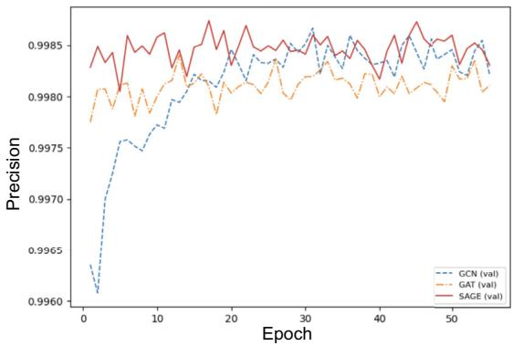

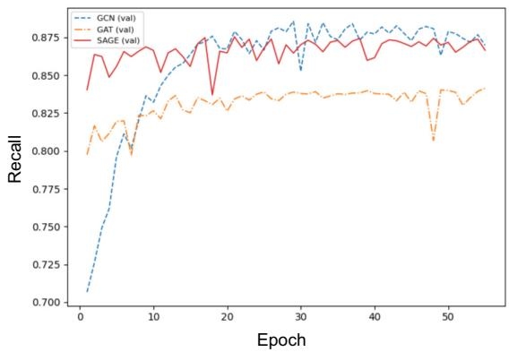

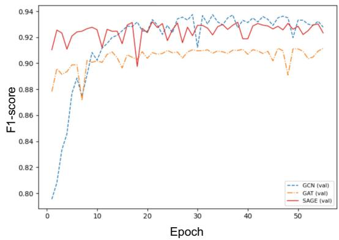  
Figure 12.10 Trend of precision, recall, and F1-score of the GNN models on the validation dataset during training

Let’s answer our earlier questions in the context of link prediction for recommendations:

Precision—When the models predict whether a user would rate a movie (link exists), the SAGE model demonstrates the highest precision. SAGE is the most reliable in minimizing false positives, effectively predicting whether a user will interact with a movie by rating it. For movie recommendation tasks, this translates to fewer irrelevant recommendations, where users are unlikely to rate a suggested movie. The GCN model performs slightly worse but maintains high precision, making it a good alternative when reliability is essential. The GAT model exhibits the lowest precision, with more significant variability across epochs, suggesting that it makes more incorrect predictions about user engagement (i.e., predicting that users will rate movies they are unlikely to rate).

Recall—In identifying actual user–movie links (i.e., all movies a user would rate), the GCN model achieves the highest recall. This indicates that GCN is the most comprehensive at identifying movies a user might engage with, successfully capturing the most true ratings. The SAGE model follows closely, with slightly lower recall, meaning it misses slightly more movies that users would rate compared to GCN. However, the GAT model struggles with recall, missing a significant portion of actual user–movie links, which reduces its ability to provide comprehensive recommendations.

F1-score—The SAGE model achieves the highest F1-score, striking the best balance between providing accurate recommendations and ensuring coverage of user preferences. This makes SAGE particularly effective for predicting which movies a user would rate while minimizing irrelevant predictions. The GCN model performs well, benefiting from its high recall, but its slightly lower precision weakens its overall balance. Due to its lower precision and recall, the GAT model struggles to achieve competitive F1-scores, making it less reliable in capturing the full range of user–movie interactions.

#### CONFUSION MATRICES

Figure 12.11 shows the confusion matrices of the GCN, GAT, and SAGE models on the testing dataset, providing detailed insights into how effectively each model predicts user ratings. SAGE demonstrates strong performance in identifying non-existent links, correctly predicting 94.6% of movies that users would not rate (true negatives: 19,084). However, SAGE identifies 71.5% of movies users would actually rate (true positives: 7,211) while missing 28.5% of true ratings (false negatives: 2,872). This indicates that although SAGE is effective at filtering out movies users are unlikely to rate, it occasionally overlooks potential ratings. Significantly, SAGE minimizes false positives (1,082, or 5.4%), which means it rarely recommends movies users are unlikely to engage with, ensuring highly precise rating predictions.

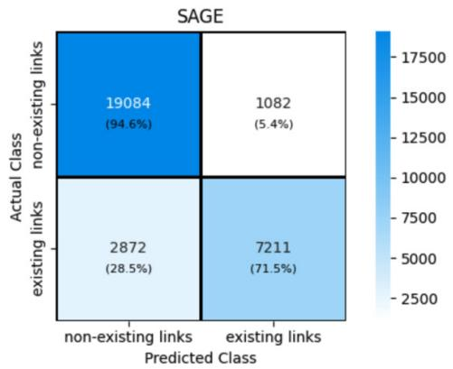

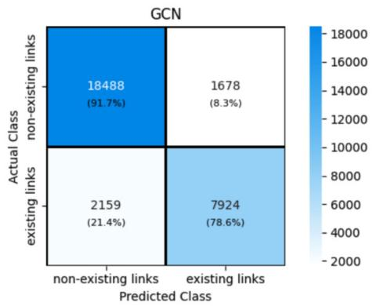

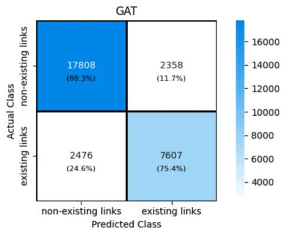  
Figure 12.11 Confusion matrices of GCN, GAT, and SAGE models on the testing dataset

The GCN model provides a strong balance between identifying movies that users would and would not rate. It successfully identifies 91.7% of movies that users would not rate (true negatives: 18,488) and captures 78.6% of actual ratings (true positives: 7,924). GCN has a lower proportion of missed ratings (false negatives: 2,159) than SAGE, but has a slightly higher rate of false positives (1,678, or 8.3%). This means GCN is better at finding potential ratings but occasionally suggests movies that users may not rate.

The GAT model correctly predicts 88.3% of movies that users would not rate (true negatives: 17,808) and identifies 75.4% of actual ratings (true positives: 7,607). However, its false negative count (2,476, or 24.6%) is higher than that of GCN, meaning it misses more movies that users would rate. Additionally, its false positive count (2,358, or 11.7%) is the highest, indicating a greater likelihood of recommending movies users are unlikely to engage with.

These results show that although all three models perform well in predicting user ratings to varying degrees, SAGE stands out for its precision, ensuring that users are less likely to receive irrelevant movie suggestions. GCN offers the best balance between capturing potential ratings and avoiding irrelevant recommendations. GAT tends to over-recommend movies that user may not rate.

#### Summary

Graph neural networks address fundamental challenges in graph-based ML tasks, such as node classification and link prediction.

Despite differences in task domains, we can define a general encoder–decoder framework comprising multiple steps, which processes graph-structured data into a model suitable for inference. In this framework, the encoder is a GNN architecture such as a graph convolutional network (GCN), a graph attention network (GAT), or GraphSAGE (SAGE). The decoder applies task-specific functions to the learned representations.

The ability of GNNs to capture complex relationships in graph data makes them highly valuable for real-world problems and versatile across diverse domains, such as fraud detection and recommendation systems.