# GNN을 이용한 노드 분류와 링크 예측 — 쉬운 해설판

> 이 문서는 Alessandro Negro의 *Knowledge Graphs and LLMs in Action* 12장 "Node classification and link prediction with GNNs"를 한국어로 풀어 설명한 해설판입니다. 원문의 모든 문단·그림·표·코드·수식을 빠짐없이 다루되, 번역을 넘어 "왜 이렇게 하는지"를 대화하듯 설명하는 데 초점을 맞췄습니다. 그래프 신경망(GNN)을 실제 문제에 적용하는 두 가지 대표 과제, 즉 **자금세탁 방지를 위한 노드 분류**와 **영화 추천을 위한 링크 예측**을 하나의 공통 뼈대(인코더–디코더)로 풀어냅니다.

---

### 이 장에서 다루는 내용 — 한눈에 보기

이 장은 세 가지 큰 주제를 다룹니다.

- 실제 현실 시나리오에서 그래프 신경망을 활용하는 방법
- 노드 분류(node classification) 시스템 만들기
- 링크 예측(link prediction) 시스템 만들기

이 장에서는 **그래프 신경망(GNN, graph neural network)**, 즉 그래프 구조 데이터를 학습하는 신경망을 노드 분류와 링크 예측에 어떻게 쓰는지 탐구합니다. 이 두 과제는 그래프 기반 **머신러닝(ML, machine learning)** 에서 가장 근본적인 도전 과제이며, 수많은 실제 응용의 중심에 자리합니다.

먼저 노드 분류에 GNN을 적용하는 이야기를 나눕니다. 특히 **자금세탁 방지(AML, anti-money laundering)**, 즉 불법 자금의 흐름을 탐지하는 응용에 초점을 맞춥니다. 금융 거래를 그래프로 표현하면, GNN으로 의심스러운 패턴을 찾아내고, 각 노드를 합법(licit) 또는 불법(illicit)으로 분류하며, 금융 사기와 싸우는 데 도움을 줄 수 있습니다. 그다음에는 추천 시스템에서의 링크 예측으로 넘어갑니다. 여기서는 평점(rating)을 바탕으로 사용자와 영화 사이에 앞으로 생길 법한 상호작용을 GNN 기반 방식으로 예측합니다. 사용자와 영화 각각에 대한 임베딩(embedding)을 학습하고 그 사이의 연결(링크)을 이용하면, 사용자의 취향에 맞는 영화를 추천할 수 있습니다. 두 시나리오는 과제도 다르고 응용 영역도 다르지만, 놀랍게도 **동일한 엔드투엔드(end-to-end) 프레임워크** 하나로 둘 다 해결할 수 있습니다. 이 뼈대가 그림 12.1에 나와 있습니다.

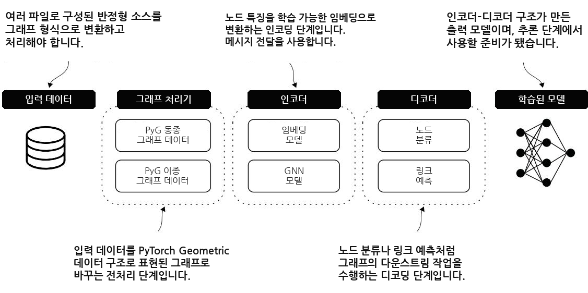

**그림 12.1** 여러 과제와 응용 영역에 적용할 수 있는 GNN 기반 시스템을 개발하기 위한 엔드투엔드 프레임워크입니다. 입력 데이터는 보통 여러 객체와 그들 사이의 상호작용을 기술하는 반정형(semistructured) 소스들의 모음입니다. 목표는 이 데이터를 가공하여 그래프를 만들고, 그 그래프를 인코더–디코더 아키텍처의 입력으로 넣는 것입니다. 이 장의 시나리오들에서는 인코더가 GNN 모델을 사용하고, 디코더는 특정 다운스트림 과제(downstream task)에 맞게 모델을 최적화하도록 해주는 함수를 기반으로 합니다. 이 프레임워크의 출력은 추론(inference) 단계에서 활용할 수 있는, 학습이 끝난 모델입니다.

이 장 내내 우리는 서로 다른 GNN 아키텍처의 성능을 비교합니다. 비교 대상은 **그래프 합성곱 신경망(GCN, graph convolutional network)** [1], **GraphSAGE(SAGE)** [2], 그리고 **그래프 어텐션 신경망(GAT, graph attention network)** [3]입니다. 이 모델들은 모두 **PyTorch Geometric(PyG)** 라이브러리로 구현하고, 정밀도(precision)·재현율(recall)·F1 점수(F1-score) 같은 지표로 평가합니다. 여기에 더해 혼동 행렬(confusion matrix)에서 얻은 통찰과 지표 추이 시각화를 통해, 이 접근법들이 실제 시나리오에서 어떤 장단점과 능력을 갖는지 더 뚜렷하게 보여줍니다. 이 장을 끝까지 읽고 나면, 노드 분류와 링크 예측 과제를 GNN으로 푸는 방법을 종합적으로 이해하게 되고, 다양한 응용에 그래프 기반 ML을 활용할 도구를 손에 쥐게 됩니다.

---

### 12.1 자금세탁 방지를 위한 노드 분류 — 그래프에서 수상한 노드 찾기

노드 분류는 그래프 기반 ML에서 매우 중요한 과제이며, 금융 범죄와 맞서는 것을 포함해 다양한 응용 영역에 잘 들어맞습니다. 자금세탁 방지(AML) 맥락에서는 금융 거래를 그래프로 모델링할 수 있는데, 이때 노드는 계좌나 개체(entity)를 나타내고 엣지는 거래 관계를 나타냅니다.

이 절에서는 GNN을 사용해 금융 거래 네트워크 안의 합법 노드와 불법 노드를 가려냅니다. 데이터는 **Elliptic 데이터셋** 을 씁니다. 그림 12.2는 노드 분류에 GNN을 적용하는 엔드투엔드 모델을 보여주는데, 각 블록이 우리 과제의 요구사항을 만족하도록 저마다 구체적인 구현을 갖추고 있습니다.

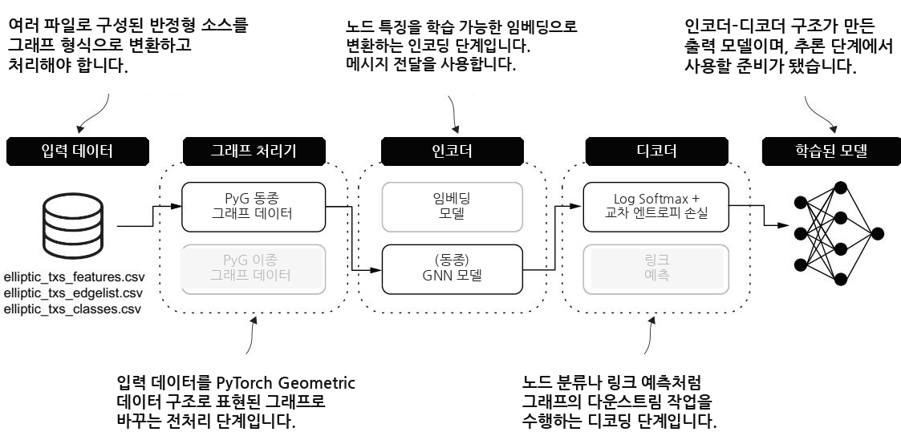

**그림 12.2** 자금세탁 방지(AML) 맥락의 노드 분류에 맞춘 엔드투엔드 프레임워크입니다. 거래 데이터와 노드 라벨이 **동질(homogeneous) 그래프** 구조로 변환됩니다. 인코더는 동질 GNN으로, 각 노드의 국소적(local) 그래프 구조를 포착하여 노드 임베딩을 학습합니다. 디코더는 로그 소프트맥스(log softmax) 함수와 교차 엔트로피 손실(cross-entropy loss)을 사용해 각 노드를 합법 또는 불법으로 분류하고, 의심스러운 활동을 탐지하는 학습된 모델을 만들어 냅니다.

---

#### 12.1.1 입력 데이터 — Elliptic 비트코인 거래 그래프

우리는 금융 거래 네트워크에서 합법·불법 노드를 탐지하는 GNN의 잠재력을 살펴보기 위해 Elliptic 데이터셋을 사용합니다. Elliptic 데이터셋은 시계열(time-series) 그래프로, 20만 개가 넘는 비트코인 거래(노드), 23만 4천 개의 방향성 지불 흐름(엣지), 그리고 익명화된 데이터에서 뽑아낸 166개의 노드 특징(feature)으로 이루어져 있습니다.

이 데이터셋은 세 개의 파일로 제공됩니다. 2025년 1월 기준으로, 이 파일들은 다음 정보를 담고 있습니다.

- `elliptic_txs_features.csv` — 167개 열과 203,769개 행으로 된 파일입니다. 첫 번째 열은 모든 노드 ID를 나열하고, 나머지 열들은 각 노드에 연결된 익명화 특징들을 나타냅니다. 이 파일의 데이터는 `features` 변수에 저장됩니다.
- `elliptic_txs_edgelist.csv` — 2개 열과 234,355개 행으로 된 파일이며, 이 행 수는 네트워크의 엣지 수와 같습니다. 첫 번째 열은 거래의 출발점(source)을 나타내는 노드 ID를, 두 번째 열은 도착점(target)을 나타내는 노드 ID를 나열합니다. 이 파일의 데이터는 `edges` 변수에 저장됩니다.
- `elliptic_txs_classes.csv` — 2개 열과 203,769개 행으로 된 파일이며, 이 행 수는 네트워크의 노드 수와 같습니다. 첫 번째 열은 모든 노드 ID를, 두 번째 열은 각 노드에 붙은 라벨(1, 2, 또는 unknown)을 지정합니다. 이 파일의 데이터는 `classes` 변수에 저장됩니다.

이 데이터셋에서 합법·불법·미상(unknown) 노드를 정의하는 클래스는 표 12.1처럼 분포합니다.

**표 12.1** 노드에 연결된 합법·불법·미상 클래스의 분포

| 클래스 | 라벨 | 개수 | 비율 |
|---|---|---|---|
| 미상(Unknown) | Unknown | 157,205 | 77.15% |
| 합법(Licit) | 2 | 42,019 | 20.62% |
| 불법(Illicit) | 1 | 4,545 | 2.23% |

이 표에서 한 가지 중요한 사실을 미리 짚어두겠습니다. 전체 노드의 77%가 라벨이 없는 미상 노드이고, 라벨이 있는 노드 중에서도 불법은 겨우 2.23%에 불과합니다. 즉 우리가 정말 찾고 싶은 불법 노드는 극단적으로 드뭅니다. 이렇게 한쪽으로 심하게 치우친 **불균형 데이터(imbalanced data)** 는 이후 평가 지표를 고를 때 계속 우리를 따라다니는 조건이 됩니다.

다음 단계는 CSV 파일들을 전처리하여 데이터에 더 간결한 숫자 표현을 부여하는 것입니다. 그런 다음 우리의 금융 거래 그래프가 GNN 모델에 적합하도록 구조를 만들어 줍니다.

---

#### 12.1.2 그래프 프로세서: 데이터 준비 — ID를 새로 매기고 텐서로 만들기

전처리 단계는 원본 데이터를 간결한 숫자 표현으로 바꾸고, 금융 거래 그래프 구조를 GNN 학습 단계에 맞게 준비하기 위해 꼭 필요합니다. `edges` 변수에 담긴 정보를 가공하는 것부터 시작하겠습니다. 표 12.2는 원본 데이터의 일부를 보여줍니다. `txId1` 열은 출발 노드의 ID를, `txId2` 열은 도착 노드의 ID를 나열합니다.

**표 12.2** `edges` 변수에 저장된 데이터 샘플. 출발 노드(`txId1`)와 도착 노드(`txId2`)를 보여줍니다.

| txId1 | txId2 |
|---|---|
| 230425980 | 5530458 |
| 232022460 | 232438397 |
| 230460314 | 230459870 |
| 230333930 | 230595899 |
| 232013274 | 232029206 |

보다시피 원본 ID는 2억이 넘는 큰 숫자들입니다. 이런 큰 값을 그대로 배열 인덱스로 쓰면 낭비가 심하기 때문에, 다음 리스트의 코드는 각 노드에 0부터 시작하는 새 연속 ID(incremental ID)를 부여하고, 이 새 ID를 사용해 엣지 데이터를 갱신합니다.

```python
# Listing 12.1 노드에 새 연속 ID를 부여하고 엣지 데이터 갱신하기
tx_id_mapping = {tx_id: idx for idx, tx_id in enumerate(features['txId'])}
edges_with_features = edges.assign(
    Id1=edges['txId1'].map(tx_id_mapping),
    Id2=edges['txId2'].map(tx_id_mapping),
)
edges_with_features = edges_with_features.dropna(subset=['Id1', 'Id2'])
edges_with_features = edges_with_features.astype({
    'Id1': 'int64',
    'Id2': 'int64',
})
```

이 코드가 하는 일을 한 줄씩 짚어보겠습니다.

1. `tx_id_mapping` 은 노드 특징 파일(`features`)의 원본 `txId` 를 0, 1, 2, ... 처럼 이어지는 새 연속 ID로 연결해 주는 사전(dictionary)입니다. `enumerate` 가 순번(`idx`)을 만들어 주므로, 원본 ID를 키로, 새 순번을 값으로 갖게 됩니다.
2. `edges.assign(...)` 은 엣지의 출발 노드(`txId1`)와 도착 노드(`txId2`)를 이 사전으로 매핑하여, 각각 새 ID인 `Id1`, `Id2` 열로 붙입니다.
3. `dropna(...)` 는 출발과 도착 양쪽 모두 매핑 사전에 존재하는 엣지만 남깁니다. 특징 파일에 없는 노드로 향하는 엣지는 여기서 걸러집니다.
4. `astype(...)` 은 새 ID가 확실히 정수(int64)가 되도록 보장합니다. `map` 은 NaN(빠진 값)이 섞여 있으면 결과를 실수(float)로 만들 수 있는데, 그런 경우를 방지하는 것입니다.

표 12.3은 이 과정의 결과 일부를 보여주며, 결과는 `edges_with_features` 변수에 저장됩니다.

**표 12.3** 각 거래에 관여한 노드에 새 연속 ID가 붙은 엣지 데이터

| txId1 | txId2 | Id1 | Id2 |
|---|---|---|---|
| 230425980 | 5530458 | 0 | 2 |
| 232022460 | 232438397 | 2 | 3 |
| 230460314 | 230459870 | 4 | 5 |
| 230333930 | 230595899 | 6 | 7 |
| 232013274 | 232029206 | 8 | 9 |

이제 이 새 ID들을 바탕으로, 그래프의 엣지를 기술하는 텐서인 `edge_index` 를 만들 수 있습니다. 다음이 이 구조를 만드는 코드입니다.

```python
# Listing 12.2 연속 노드 ID를 사용해 edge_index 텐서 만들기
edge_index = torch.tensor(
    edges_with_features[['Id1', 'Id2']].values.T,
    dtype=torch.long
)
```

여기서 `.values.T` 의 `.T`(전치, transpose)가 핵심입니다. PyG는 엣지를 `[2, 엣지 수]` 형태의 텐서로 기대합니다. 즉 첫 번째 행은 모든 출발 노드, 두 번째 행은 모든 도착 노드입니다. `edges_with_features` 는 행마다 한 엣지를 담고 있으므로, 전치를 통해 이 배치를 PyG가 원하는 "출발 행 / 도착 행" 형태로 뒤집는 것입니다.

`edge_index` 텐서의 샘플은 다음과 같습니다.

```text
# Listing 12.3 edge_index 텐서 샘플
tensor([[     0,      2,      4, ..., 201921, 201480, 201954],
        [     1,      3,      5, ..., 202042, 201368, 201756]])
```

윗줄이 출발 노드, 아랫줄이 도착 노드입니다. 예컨대 첫 번째 열 `(0, 1)` 은 "노드 0에서 노드 1로 향하는 엣지"를 뜻합니다.

다음으로, 원본 노드 특징 데이터 구조를 가공하여 새 텐서를 만듭니다. 이 텐서의 각 행은 앞 단계에서 만든 연속 ID에 대응합니다. 이 단계에서 원본 노드 ID를 떼어냄으로써, 노드 특징을 학습 단계에 맞게 준비합니다.

```python
# Listing 12.4 원본 노드 ID를 떼어내고 노드 특징 텐서 만들기
node_features = torch.tensor(
    features.drop(columns=['txId']).values,
    dtype=torch.float
)
```

이 결과는 크기가 `[203769, 166]` 인 `node_features` 텐서에 저장됩니다. 이 텐서의 첫 번째 차원은 노드 수에, 두 번째 차원은 특징 수에 대응합니다.

앞서 말했듯, 이 행렬의 각 행 인덱스는 앞 단계에서 만든 연속 ID에 대응합니다. 바꿔 말해, `node_features` 텐서의 0번째 행은 노드 0에 연결된 특징 집합에 해당하고, 그 노드의 원본 ID는 230425980입니다. 이렇게 ID를 통일해 두었기 때문에, 엣지 텐서와 특징 텐서가 같은 번호 체계로 서로를 정확히 가리킬 수 있습니다.

마지막 단계는 데이터셋의 원본 라벨을 숫자 표현으로 바꾸는 것입니다. 이를 위해 scikit-learn 라이브러리의 `LabelEncoder` 클래스를 사용합니다.

```python
# Listing 12.5 원본 노드 클래스를 숫자 표현으로 변환하기
from sklearn.preprocessing import LabelEncoder
le = LabelEncoder()
class_labels = le.fit_transform(classes['class'])
original_labels = le.inverse_transform(class_labels)
node_labels = torch.tensor(class_labels, dtype=torch.long)
```

이 코드의 흐름을 정리하면 이렇습니다.

1. `LabelEncoder()` 인스턴스 `le` 를 만듭니다.
2. `le.fit_transform(classes['class'])` 가 각 클래스에 숫자 라벨을 배정하고, 범주형(categorical) 라벨을 대응하는 숫자로 변환합니다.
3. `le.inverse_transform(class_labels)` 는 방금 만든 숫자 라벨(`class_labels`)을 `fit_transform` 이 만든 매핑을 근거로 다시 원래의 범주형 라벨로 되돌립니다. 검증용으로 유용한 역변환입니다.
4. `torch.tensor(class_labels, dtype=torch.long)` 는 이 숫자 라벨 목록을 PyTorch 텐서로 변환합니다.

이 과정의 출력은 크기 203,769의 새 `node_labels` 텐서입니다. 여기서 라벨 0은 합법 노드(원본 데이터의 "1")에, 라벨 1은 불법 노드(원본의 "2")에, 라벨 2는 미상 노드(원본의 "unknown")에 대응합니다. 이제 PyG를 사용해 GNN 모델의 입력이 될 그래프 데이터를 만들 차례입니다.

---

#### 12.1.3 그래프 프로세서: 동질 PyG 그래프 — 학습·검증·테스트로 쪼개기

이제 PyG의 기능을 이용해 그래프 데이터 구조를 만들 수 있습니다. 그림 12.3은 그래프 프로세서가 적용하는 단계를 한눈에 보여줍니다. 준비(preparation) 단계, PyG `Data` 객체 구성, 그리고 학습·검증·테스트 데이터셋 생성으로 이어집니다.

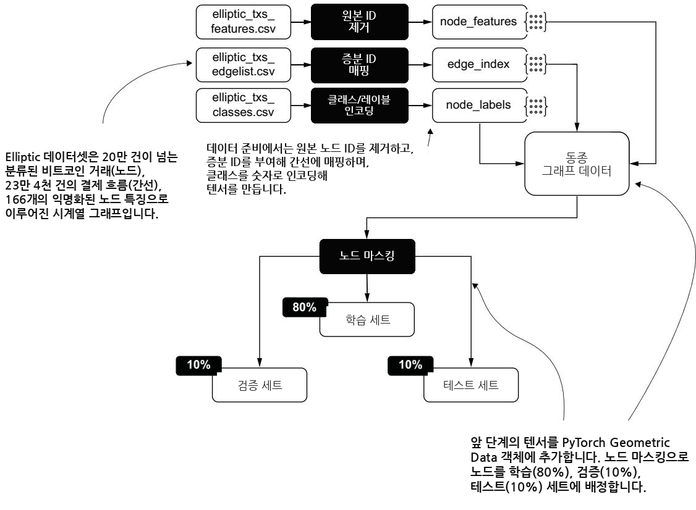

**그림 12.3** Elliptic 데이터셋에 적용되는 데이터 처리 과정을 보여줍니다. 원본 데이터를 전처리하여 노드 특징, 엣지 인덱스, 인코딩된 라벨을 만듭니다. 이 텐서들이 PyG `Data` 객체에 담기고, 노드 마스킹(node masking) 방식을 통해 노드가 학습(80%)·검증(10%)·테스트(10%) 세트로 나뉩니다.

첫 단계는 전처리 결과(`node_features`, `edge_index`, `node_labels`)를 사용해 PyG `Data` 객체를 만드는 것입니다.

```python
# Listing 12.6 데이터 준비 결과로 PyG Data 객체 만들기
from torch_geometric.data import Data
data = Data(x=node_features,
            edge_index=edge_index,
            y=node_labels)
```

PyG `Data` 객체는 노드의 특징(`x`), 엣지 정보(`edge_index`), 그리고 각 노드에 연결된 라벨(`y`)을 한데 담습니다. 다음 단계는 이 객체에 **마스크(mask)**, 즉 어떤 노드를 학습·평가 단계에서 쓸지 지정하는 필터를 적용하는 것입니다.

우리 GNN 모델은 어떤 노드가 합법이고 어떤 노드가 불법인지 배워야 하므로, 라벨이 알려진 노드만 모델에게 "보이게" 만들어야 합니다. 미상 노드는 정답이 없으니 학습에서 제외하는 것이죠. 이를 위해 다음 코드를 실행합니다.

```python
# Listing 12.7 알려진 노드 라벨만 골라내는 마스크 필터 준비하기
known_mask = (data.y == 0) | (data.y == 1)
unknown_mask = data.y == 2
```

- `known_mask` 는 라벨이 0(합법) 또는 1(불법)인 노드에 대응하는 원소가 True인 텐서입니다.
- `unknown_mask` 는 라벨이 2(미상)인 노드에 대응하는 원소가 True인 텐서입니다. 즉 `known_mask` 의 관점에서 보면 미상 노드는 False가 됩니다.

알려진 노드들을 담은 `known_mask` 텐서는 학습·검증·테스트 세트의 크기를 정하는 데 쓰입니다.

```python
# Listing 12.8 학습·검증·테스트 데이터셋의 크기 정하기
import numpy as np
num_known_nodes = known_mask.sum().item()
permutations = torch.randperm(num_known_nodes)
train_size = int(0.8 * num_known_nodes)
val_size = int(0.1 * num_known_nodes)
test_size = num_known_nodes - train_size - val_size
total = train_size + val_size + test_size
```

한 줄씩 뜯어보면 이렇습니다.

1. `known_mask.sum().item()` 은 `known_mask` 안의 True 개수를 세어 스칼라 텐서로 만든 뒤, 이를 파이썬 정수로 변환합니다. 결과가 `num_known_nodes`(알려진 노드 수)입니다.
2. `torch.randperm(num_known_nodes)` 는 인덱스를 무작위로 섞은 순열(permutation)을 만듭니다. 이 섞기가 데이터를 무작위로 분할하는 근거가 됩니다.
3. `train_size` 는 학습 데이터셋 크기(전체의 80%)를, `val_size` 는 검증 데이터셋 크기(10%)를 계산합니다.
4. `test_size` 는 나머지, 즉 테스트 데이터셋 크기(약 10%)입니다.
5. `total` 은 세 크기의 합이 원래 알려진 노드 수와 정확히 일치하는지 확인하는 용도입니다.

`total` 변수에 담긴 값을 통해, 우리는 관측값(observation)의 수, 즉 학습·검증·테스트 데이터셋에 포함될 라벨된 노드의 수를 확정합니다. 결과는 표 12.4에 정리되어 있습니다.

**표 12.4** 라벨된 노드 수를 기준으로 한 학습·검증·테스트 데이터셋의 크기

| 데이터셋 | 노드 수 | 비율 |
|---|---|---|
| 학습(Training) | 37,251 | 80% |
| 검증(Validation) | 4,656 | 10% |
| 테스트(Testing) | 4,657 | 10% |

다음 코드는 앞 단계에서 정한 크기를 바탕으로, PyG `Data` 객체 위에 학습·검증·테스트 인덱스 마스크를 만듭니다.

```python
# Listing 12.9 PyG Data 객체 위의 학습·검증·테스트 마스크
train_mask = torch.zeros(data.num_nodes, dtype=torch.bool)
val_mask = torch.zeros_like(train_mask)
test_mask = torch.zeros_like(train_mask)
nonzero_indices = known_mask.nonzero(as_tuple=True)[0]
train_indices = nonzero_indices[permutations[:train_size]]
val_indices = nonzero_indices[
    permutations[train_size:train_size + val_size]
]
test_indices = nonzero_indices[permutations[train_size + val_size:]]
train_mask[train_indices] = True
val_mask[val_indices] = True
test_mask[test_indices] = True
data.train_mask = train_mask
data.val_mask = val_mask
data.test_mask = test_mask
```

이 코드의 논리를 따라가 봅시다.

1. `train_mask`, `val_mask`, `test_mask` 를 모두 False로 초기화합니다(모든 노드가 처음엔 어느 세트에도 속하지 않습니다).
2. `nonzero_indices` 는 `known_mask` 에서 True인 위치(즉 알려진 노드들의 실제 인덱스)를 뽑아냅니다.
3. 앞에서 만든 무작위 순열 `permutations` 를 이용해, 알려진 노드 인덱스들을 앞에서부터 80%(`train_indices`), 그다음 10%(`val_indices`), 마지막 10%(`test_indices`)로 겹치지 않게 잘라냅니다. 순열로 섞은 뒤 순서대로 자르므로, 세 세트는 서로 배타적(non-overlapping)입니다.
4. 각 세트의 인덱스 위치를 해당 마스크에서 True로 설정하고, 이 마스크들을 `data` 객체에 부착합니다.

표 12.5는 데이터가 학습과 평가를 위해 어떻게 나뉘었는지 명확히 하기 위해 각 데이터셋의 통계를 보여줍니다. 이 시나리오에서는 각 데이터셋 안에서 합법과 불법 정보의 균형을 직접 확인할 수 있습니다.

**표 12.5** 학습·검증·테스트 데이터셋의 크기와 각 데이터셋의 클래스 분포

| 데이터셋 | 전체 개수 | 합법 | 합법(%) | 불법 | 불법(%) |
|---|---|---|---|---|---|
| 학습 | 37,251 | 33,645 | 90.32 | 3,606 | 9.78 |
| 검증 | 4,656 | 4,193 | 90.06 | 463 | 9.88 |
| 테스트 | 4,657 | 4,181 | 89.78 | 476 | 9.45 |

세 데이터셋 모두 합법이 약 90%, 불법이 약 10%로 비슷한 비율을 유지하는 점을 눈여겨보세요. 무작위 분할이 클래스 비율을 잘 보존한 셈입니다. 다만 여전히 불법이 소수라는 점은 변하지 않으므로, 평가 지표를 해석할 때 이 불균형을 계속 염두에 두어야 합니다.

우리는 분류 과제의 분할 작업을 여러 스크립트를 손수 작성해서 수동으로 수행했습니다. 이어지는 12.2.3절에서는 PyG 라이브러리가 데이터셋 분할을 도와주는 기능을 제공한다는 것을 보게 됩니다. 이제 노드 분류 시스템을 만드는 엔드투엔드 아키텍처를 이야기해 봅시다.

---

#### 12.1.4 인코더–디코더 아키텍처 — GNN이 특징을 만들고, 소프트맥스가 판정한다

11장에서 인코더–디코더 아키텍처를 소개했습니다. 그림 12.4는 다운스트림 과제 위에서 GNN 모델을 학습시키는 데 관여하는 단계들을 개괄합니다.

다음 리스트는 노드 분류를 위한 인코더–디코더를 정의하는 파이썬 클래스의 구현을 보여줍니다.

```python
# Listing 12.10 노드 분류를 위한 인코더–디코더 구현
import torch
import torch.nn.functional as F

class NodeClassifier(torch.nn.Module):
    def __init__(self, gnn_model):
        super().__init__()
        self.gnn = gnn_model

    def forward(self, x, edge_index):
        x = self.gnn(x, edge_index)
        return F.log_softmax(x, dim=1)
```

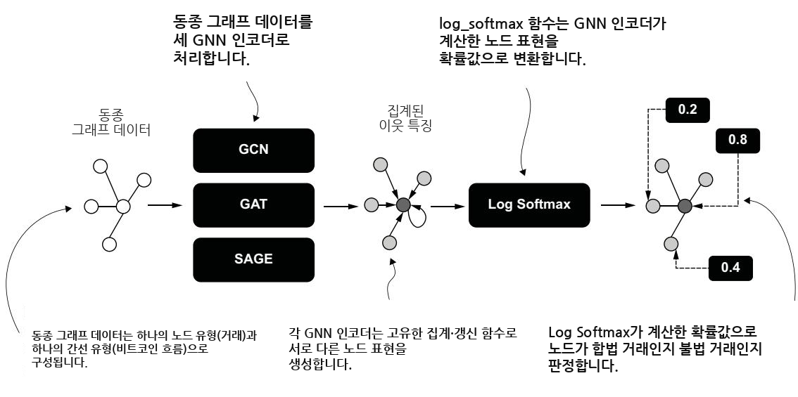

**그림 12.4** 인코더–디코더 아키텍처의 주요 단계를 개괄합니다. 거래(노드)와 비트코인 흐름(엣지)으로 이루어진 동질 그래프 데이터가 세 가지 GNN 인코더(GCN, GAT, SAGE)로 처리됩니다. 각 인코더는 이웃(neighbor)의 특징을 집계(aggregate)하여 저마다 고유한 노드 표현(representation)을 만듭니다. 그다음 이 표현들이 확률 값으로 변환되어, 각 거래를 합법 또는 불법으로 분류하는 데 쓰입니다.

`NodeClassifier` 클래스의 `forward` 메서드는 두 국면으로 이루어집니다. 하나는 GNN이 수행하는 **인코딩 국면(encoding)** 으로, 각 노드의 표현을 그 이웃의 정보로 갱신합니다. 다른 하나는 PyTorch가 제공하는 `log_softmax` 함수가 수행하는 **디코딩 국면(decoding)** 으로, 각 노드에 확률 값을 부여합니다. 이 확률 값은 노드가 합법인지 불법인지 판정하는 데 사용됩니다. 이제 이 구성 요소들의 구현을 자세히 살펴보겠습니다.

---

##### 인코더 — 이웃의 정보를 끌어모으는 메시지 전달

인코더 구성 요소는 동질 GNN을 사용해 **메시지 전달(message passing)** 과정을 수행합니다(11장 참고). 이는 인코더가, 금융 거래 네트워크처럼 단일 유형의 노드와 엣지만을 담은 **동질 그래프(homogeneous graph)** 를 다루도록 설계되었다는 뜻입니다. 서로 다른 GNN 인코더들의 동작을 비교하기 위해, 다음 리스트에서는 이 인코더들이 공유하는 특성을 규정하는 기본(base) 그래프 모델을 정의합니다.

```python
# Listing 12.11 일반적인 GNN 인코더를 정의하는 기본 그래프 모델
import torch
import torch.nn.functional as F

class BaseGraphModel(torch.nn.Module):
    def __init__(self, input_dim,
                 hidden_dim,
                 out_dim,
                 conv_layer,
                 **conv_kwargs):
        super(BaseGraphModel, self).__init__()
        self.conv1 = conv_layer(input_dim, hidden_dim, **conv_kwargs)
        self.conv2 = conv_layer(hidden_dim, out_dim, **conv_kwargs)

    def forward(self, x, edge_index):
        x = self.conv1(x, edge_index)
        x = F.relu(x)
        x = self.conv2(x, edge_index)
        return x
```

이 기본 클래스의 구조를 풀어 설명하겠습니다.

- 생성자(`__init__`)는 모델의 초기화를 정의합니다. 입력·은닉·출력 차원(`input_dim`, `hidden_dim`, `out_dim`), 사용할 합성곱 계층의 종류(`conv_layer`), 그리고 그 합성곱 계층에 전달될 수 있는 추가 인자(`**conv_kwargs`)를 받습니다.
- `super(BaseGraphModel, self).__init__()` 은 상위 클래스 초기화를 호출해 모델을 셋업합니다.
- `self.conv1` 은 입력 차원에서 은닉 차원으로 가는 첫 번째 그래프 합성곱 계층을, `self.conv2` 는 은닉 차원에서 출력 차원으로 가는 두 번째 그래프 합성곱 계층을 초기화합니다.
- `forward` 는 순전파(forward pass)를 정의합니다. 입력 특징과 엣지 인덱스에 첫 번째 합성곱 계층을 적용하고(`conv1`), **ReLU** 활성화 함수를 적용해 비선형성(nonlinearity)을 도입한 뒤, 두 번째 합성곱 계층(`conv2`)을 적용하여 최종 노드 특징을 반환합니다.

이 기본 클래스는 2계층(two-layer) 구조를 보여줍니다. 이 구조 안에서는 PyG가 제공하는 어떤 GNN 구현이든 이웃 집계와 노드 갱신 연산(합성곱)에 사용할 수 있습니다. `**conv_kwargs` 인자 덕분에, 특정 GNN 구현이 요구하는 추가 매개변수를 넘겨줄 수 있습니다. 다음 리스트의 SAGE 모델 구현을 보면 이 유연함이 잘 드러납니다.

```python
# Listing 12.12 기본 클래스로부터 구현한 SAGE 모델
from torch_geometric.nn import SAGEConv

class SAGE(BaseGraphModel):
    def __init__(self, input_dim, hidden_dim, out_dim):
        super(SAGE, self).__init__(
            input_dim=input_dim,
            hidden_dim=hidden_dim,
            out_dim=out_dim,
            conv_layer=SAGEConv
        )
```

PyG의 `SAGEConv` 계층은 추가 매개변수를 요구하지 않으므로, SAGE 모델을 초기화하는 일은 매우 간단합니다. 이 코드는 두 개의 `SAGEConv` 계층으로 된 GNN 모델을 만듭니다.

반면 어떤 GNN 모델은 기본 클래스를 확장해야 합니다. 다음 리스트의 GAT 모델 구현을 보겠습니다.

```python
# Listing 12.13 기본 클래스를 확장해 구현한 GAT 모델
from torch_geometric.nn import GATConv

class GAT(BaseGraphModel):
    def __init__(self, input_dim,
                 hidden_dim,
                 out_dim,
                 num_heads=8,
                 add_self_loops=True):
        # GAT 모델 초기화
        ...
```

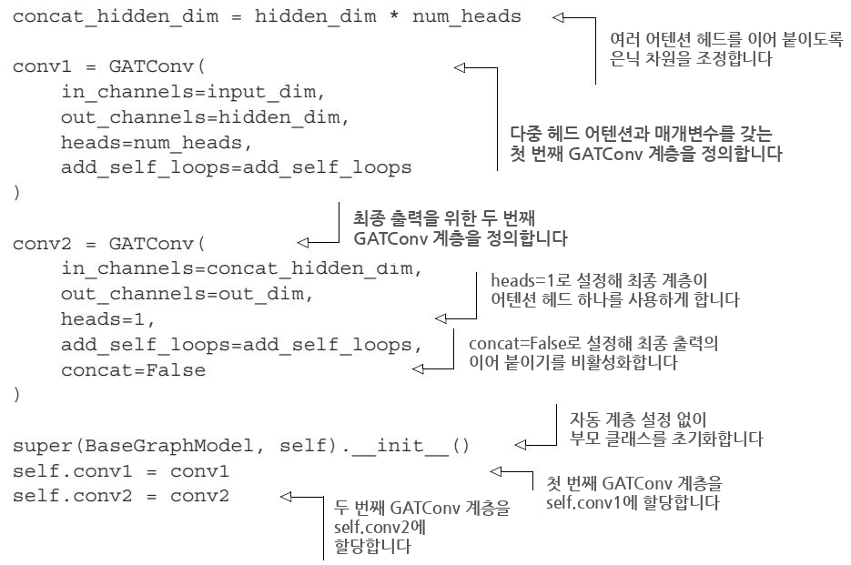

이 경우에는 PyG에 구현된 `GATConv` 계층이 요구하는 추가 매개변수를 담기 위해, 합성곱 계층들을 다시 구현해야 합니다. 대표적인 추가 매개변수가 어텐션 헤드 수(`num_heads`)와 자기 루프 추가 여부(`add_self_loops`)입니다. GAT는 이웃마다 서로 다른 중요도(어텐션 가중치)를 학습하기 때문에, 이런 부가 정보를 계층에 전달할 통로가 필요합니다.

---

##### 디코더 — 로그 소프트맥스와 교차 엔트로피 손실의 협업

디코더 구성 요소는 PyTorch의 `log_softmax` 함수를 사용해, 신경망의 출력(구체적으로는 GNN 인코더의 출력)을 확률 값으로 변환합니다. 표준 소프트맥스(softmax) 함수와 달리, `log_softmax` 는 확률 계산 과정에서 지극히 작거나 큰 수가 미치는 영향을 완화하여 학습 과정의 안정성을 높여줍니다. 소프트맥스는 여러 후보의 점수를 0에서 1 사이의 확률로 눌러 담는 함수인데, 그 결과에 로그를 취한 것이 로그 소프트맥스입니다. 로그를 취하면 곱셈이 덧셈으로 바뀌어 수치적으로 훨씬 다루기 쉬워집니다.

이 맥락에서 `log_softmax` 함수는 PyTorch의 `CrossEntropyLoss` 함수와 짝을 이루어 동작합니다. 이 손실 함수는 소프트맥스 확률의 로그와 음의 로그 우도(negative log-likelihood) 손실을 결합하여, 분류 과제에 효율적인 접근을 제공합니다. 예를 들어 AML 시스템에서는 GNN 인코더가 거래 데이터를 분석해 수상한 행동을 탐지하고, 각 노드에는 합법이나 불법 같은 서로 다른 범주에 대한 확률이 부여될 수 있습니다.

`log_softmax` 함수는 이 확률들이 수치적으로 안정적이고 해석 가능하도록 보장하며, `CrossEntropyLoss` 함수는 모델의 예측이 실제 라벨과 얼마나 잘 맞는지를 측정합니다. 만약 모델이 어떤 노드를 불법이라고 높은 확률로 예측했는데 실제 라벨은 합법이라면, 손실 함수가 그 오류를 포착하여 모델이 정확도를 높이도록 최적화합니다. 즉 손실은 "얼마나 틀렸는지"를 나타내는 벌점이고, 학습은 이 벌점을 줄이는 방향으로 진행됩니다.

---

#### 12.1.5 평가와 분석 — 세 인코더 GCN·GAT·SAGE 비교

우리의 분석에서는 노드 분류를 위한 세 개의 엔드투엔드 모델을 비교했습니다. 각 모델은 서로 다른 GNN 인코더(GCN, GAT, SAGE)를 사용합니다. 표 12.6은 각 모델의 매개변수 수와 총 학습 시간(초)을 보여주며, 이 결과는 T4 Colab 머신에서 400 에폭(epoch)을 돌려 얻었습니다.

> **참고** 코드 예제를 직접 실행하면 결과가 본문에 나온 값과 조금 다를 수 있습니다. 이는 머신러닝에서 정상적인 현상으로, 알고리즘이 (예를 들어 초기화나 샘플링에서) 무작위성을 포함하는 경우가 많기 때문입니다. 이런 변동은 코드에 오류가 있다는 뜻이 아닙니다.

**표 12.6** 각 인코더의 매개변수 수와 총 학습 시간

| 인코더 | 매개변수 수 | 학습 시간(초) |
|---|---|---|
| GCN | 2,723 | 19.02 |
| GAT | 22,025 | 43.45 |
| SAGE | 5,427 | 36.71 |

결과를 보면 GCN 모델이 가장 효율적이고, GAT 모델이 가장 비효율적이며, SAGE 모델은 그 중간에 있습니다. 짐작할 수 있듯, 학습 시간은 매개변수 수와 직접 연결됩니다. 12.1.4절에서 밝혔듯, GAT 모델은 이웃 엣지마다 학습 가능한 계수(coefficient)를 도입하는 어텐션 메커니즘을 담고 있어서 학습 매개변수의 수가 늘어납니다. 그래서 매개변수가 가장 많고(22,025개) 학습 시간도 가장 깁니다.

---

##### 정밀도, 재현율, F1 점수 — 세 질문으로 성능 읽기

이 모델들의 일반화(generalization) 능력을 살펴보기 위해, 정밀도·재현율·F1 점수 지표로 성능을 평가할 수 있습니다. AML을 위한 노드 분류 맥락에서 이 지표들은 다음 질문에 답하게 해줍니다.

- **정밀도(Precision)** — 모델이 어떤 노드를 합법 또는 불법이라고 말할 때, 그 말이 실제로 맞는 경우가 얼마나 되는가?
- **재현율(Recall)** — 실제로 존재하는 모든 합법·불법 노드 가운데, 모델이 올바르게 찾아낸 것은 얼마나 되는가?
- **F1 점수(F1-score)** — 모델이 예측을 내릴 때 정확한 것(정밀도)과 가능한 한 많은 정답 노드를 찾아내는 것(재현율) 사이의 균형을 얼마나 잘 잡는가?

그림 12.5는 학습 단계 동안 검증 데이터셋에서 GCN·GAT·SAGE가 이 지표들에 걸쳐 보인 성능을 그래프로 보여줍니다. 세로축은 지표 값을, 가로축은 에폭 수를 나타냅니다.

우리는 이 결과를 sklearn 라이브러리에 내장된 정밀도·재현율·F1 점수 채점 함수로 얻었습니다. 이 채점 함수들은 우리 데이터처럼 합법 노드가 불법 노드보다 훨씬 많은 불균형 데이터를 다룰 수 있도록 `average` 매개변수를 제공합니다. 우리는 **가중 평균(weighted average)** 을 쓰기로 했는데, 이 방식이 데이터 분포를 반영하는 성능 지표를 주기 때문에 일반적인 평가에 적합합니다. 가중 평균은 클래스별 지표를 그 클래스의 표본 수로 가중해 평균하므로, 다수 클래스(합법)의 성능이 자연스럽게 더 크게 반영됩니다.

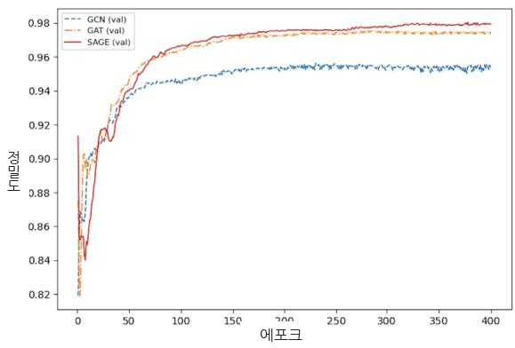

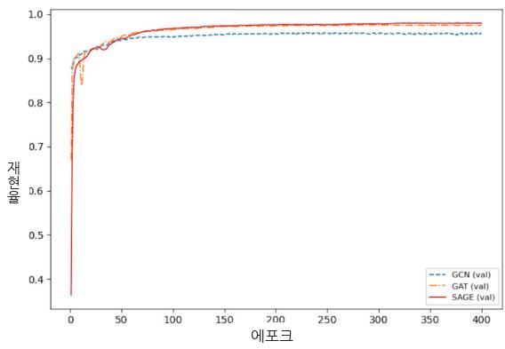

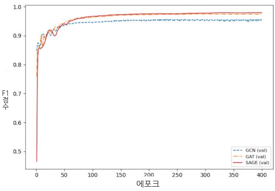

**그림 12.5** 학습 단계 동안 검증 데이터셋에서 GCN·GAT·SAGE가 정밀도·재현율·F1 점수에 걸쳐 보인 성능입니다.

이제 합법·불법 노드를 탐지하는 AML 시나리오 맥락에서 앞서 던진 질문들에 답해 봅시다.

- **정밀도** — 모델들이 노드가 합법인지 불법인지 예측할 때, SAGE 모델이 가장 정확하며 학습 단계 내내 일관되게 높은 정밀도를 유지합니다. 이는 SAGE가 **거짓 양성(false positive)**, 즉 아닌 것을 맞다고 잘못 부르는 경우를 최소화하여 합법·불법 노드에 대해 더 믿을 만한 예측을 한다는 뜻입니다. GAT 모델도 이 점에서 잘하며 SAGE를 바짝 뒤쫓습니다. GCN 모델은 가장 낮은 정밀도를 보이는데, 특히 초기 에폭에서 합법·불법 노드를 자주 잘못 분류합니다.
- **재현율** — 실제 합법·불법 노드를 모두 찾아내는 능력에서는 세 모델이 비슷하게 수행하며, 학습이 진행됨에 따라 셋 모두 가까운 재현율 값에 도달합니다. 즉 GCN·GAT·SAGE 모두 거의 모든 합법·불법 노드를 효과적으로 탐지할 수 있습니다. 다만 재현율만으로는 거짓 양성을 고려하지 못하므로, 전체 성능을 이해하려면 반드시 정밀도와 함께 봐야 합니다.
- **F1 점수** — 이 점수는 합법·불법 노드 탐지에서 모델이 정밀도와 재현율의 균형을 얼마나 잘 잡는지를 반영합니다. SAGE 모델이 가장 높은 값을 달성하여, 올바른 균형점을 찾았음을 입증합니다. 대부분의 합법·불법 노드를 찾아내면서도 잘못된 예측을 최소화하는 것이죠. GAT 모델은 SAGE와 거의 대등하며 근소한 차이만 보입니다. GCN 모델은 재현율은 높지만 정밀도가 낮은 탓에 높은 점수를 얻기 어려워, 이 지표들의 균형을 잡는 전체 성능에서 상대적으로 약함을 드러냅니다.

---

##### 혼동 행렬 — 합법과 불법을 나눠서 들여다보기

전반적인 동작을 넘어, 이 모델들이 합법 노드에서 보이는 성능과 불법 노드에서 보이는 성능을 구분하는 더 구체적인 평가를 할 수 있습니다. 이를 위해 **혼동 행렬(confusion matrix)** 을 사용합니다. 혼동 행렬은 각 클래스(합법 또는 불법)에 대해 올바른 예측과 잘못된 예측의 개수를 보여줌으로써, 앞서 정의한 지표들과 비교해 분류 성능을 더 잘게 쪼개 보여줍니다. 그림 12.6은 테스트 데이터셋에서 GCN·GAT·SAGE 모델의 혼동 행렬을 보여줍니다.

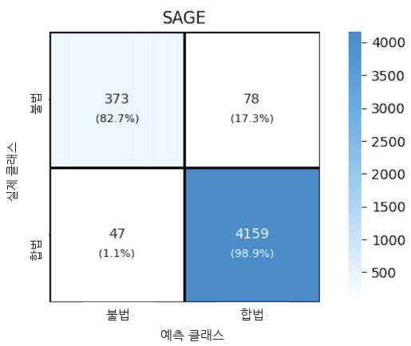

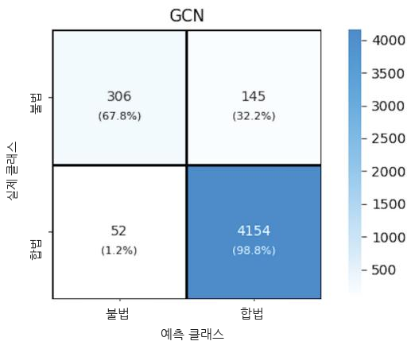

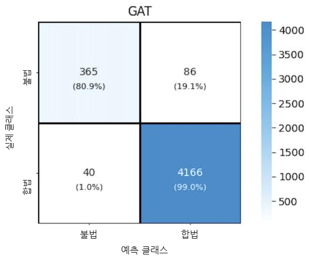

**그림 12.6** GCN·GAT·SAGE 모델이 각 클래스(합법 또는 불법)에서 보인 성능을 이해하기 위한 혼동 행렬입니다.

전체적으로 SAGE가 가장 좋은 성능을 보이며, 대부분의 합법·불법 노드를 최소한의 오분류로 올바르게 분류합니다. GAT 모델도 SAGE에 근접하는 강한 성능을 보이지만, 불법 클래스에서 오분류가 약간 더 많습니다. GCN 모델은 가장 약한 성능을 보이며, 불법 노드에 대한 정밀도와 재현율이 낮아 다른 모델에 비해 이 노드들을 구별하는 데 어려움이 있음을 드러냅니다. 각 모델의 동작을 자세히 분석해 봅시다.

- **GCN** — 이 모델은 합법·불법 노드 분류에서 중간 정도의 성능을 보입니다. 불법 노드의 약 68%, 합법 노드의 약 99%를 올바르게 분류합니다. 그러나 불법 노드의 약 3분의 1이 합법으로 잘못 분류되어, 불법 노드를 정확히 식별하는 데 겪는 어려움이 두드러집니다. 합법 쪽에서는 약 1%의 합법 노드가 불법으로 잘못 예측되어, 합법 노드 예측에서 더 나은 정확도를 보입니다. 이런 불균형은, GCN이 합법 노드는 효과적으로 식별하지만 불법 노드에 대한 정밀도는 개선이 필요함을 보여줍니다.
- **GAT** — 이 모델은 불법 노드의 약 81%, 합법 노드의 약 99.5%를 올바르게 분류하여 GCN을 능가합니다. GCN에 비해 불법 클래스의 오분류를 줄이는데, 불법 노드 다섯 중 약 하나가 합법으로 잘못 분류되는 반면 합법 노드는 겨우 40개만 불법으로 잘못 분류됩니다. 이 개선은 GAT가 두 클래스 모두에서 더 믿을 만한 균형을 제공함을 보여줍니다.
- **SAGE** — 이 모델은 셋 중 가장 높은 성능을 달성합니다. 불법 노드의 약 83%, 합법 노드의 약 99%를 올바르게 분류합니다. 오분류 비율도 가장 낮습니다. 불법 노드 다섯 중 하나가 채 안 되는 수(88개)만 합법으로 잘못 분류되고, 합법 노드는 약 50개만 불법으로 잘못 분류됩니다.

전반적인 분석에 근거하면, SAGE 모델의 뛰어난 균형, 합법·불법 노드 양쪽에서의 높은 정확도, 최소한의 오분류가 이 모델을 가장 효과적이고 믿을 만한 선택으로 만듭니다. 특히 합법 노드에 대한 높은 정확도를 유지하면서도 불법 노드 탐지가 결정적으로 중요한 AML 같은 응용에 잘 들어맞습니다.

---

### 12.2 영화 추천을 위한 링크 예측 — 아직 없는 연결을 맞히기

링크 예측은 그래프 기반 ML에서 중추적인 과제이며, 특히 추천 시스템 같은 응용에 잘 들어맞습니다. 그래프 구조를 활용하면 상호작용과 선호를 개체들 사이의 링크로 모델링할 수 있는데, 이번 경우에는 사용자와 영화 사이의 관계를 나타냅니다. 노드 분류가 "이 노드는 무엇인가"를 맞히는 문제였다면, 링크 예측은 "이 두 노드 사이에 연결이 있을까"를 맞히는 문제입니다.

이 절에서는 GNN을 사용해 사용자–영화 링크를 예측합니다. 데이터 소스로는 **MovieLens 데이터셋** 을 씁니다. 그림 12.7이 엔드투엔드 프레임워크를 보여줍니다. 목표는 무관한 추천은 피하면서 관련 있는 영화를 제안하는 GNN의 능력을 평가하여, 추천 과정을 향상시키는 것입니다.

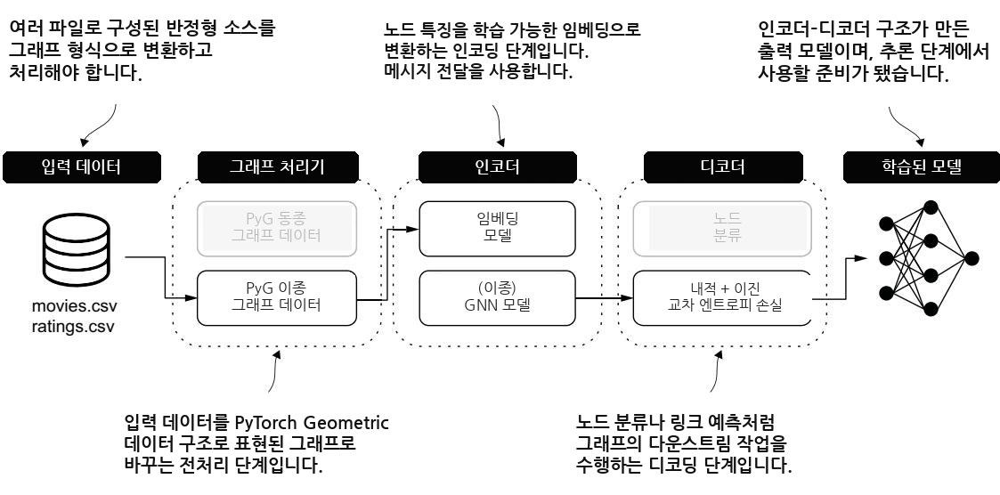

**그림 12.7** 추천 시스템 맥락의 링크 예측을 위한 엔드투엔드 프레임워크입니다. 상호작용/선호 데이터가 두 유형의 노드(사용자와 영화)를 포함하는 **이질(heterogeneous) 그래프** 구조로 변환됩니다. 인코더는 이질 GNN으로, 각 노드의 국소적 그래프 구조를 포착하여 노드 임베딩을 학습합니다. 디코더는 내적(dot-product) 연산과 이진 교차 엔트로피 손실(binary cross-entropy loss)을 결합해 사용자와 영화 사이 링크의 존재 여부를 예측하고, 사용자에게 관련 영화를 제안하는 학습된 모델을 만들어 냅니다.

---

#### 12.2.1 입력 데이터 — MovieLens 평점 데이터

우리는 추천 목적의 링크 예측을 수행하는 GNN의 능력을 살펴보기 위해 MovieLens 데이터셋의 소형(small) 버전을 사용합니다. 이 버전의 MovieLens 데이터셋은 600명의 사용자가 9,000편의 영화에 매긴 100,000개의 평점과 3,600개의 태그 적용을 포함합니다. 2025년 1월 기준으로, 원본 데이터는 https://files.grouplens.org/datasets/movielens/ml-latest-small.zip 에서 받을 수 있으며 다음 파일들을 담고 있습니다.

- `movies.csv` — 9,742개 행과 3개 열로 된 CSV 파일입니다. 세 열은 각각 영화의 ID, 영화의 제목, 그리고 장르(genre)를 정의합니다.
- `ratings.csv` — 100,836개 행과 4개 열로 된 CSV 파일입니다. 네 열은 각각 사용자의 ID, 영화의 ID, 평점, 그리고 타임스탬프를 정의합니다.

우리는 링크 예측 과제에 필요한 열의 일부에만 집중하겠습니다. `movies.csv` 의 경우 `movieId` 와 `genres` 열을 사용합니다. 표 12.7은 이 열들만 뽑은 파일 샘플을 보여줍니다. 영화는 1부터 시작하는 연속 ID로 식별되며, 장르는 파이프 문자(`|`)로 구분된 범주형 문자열의 모음으로 제공됩니다.

**표 12.7** `movies.csv` 파일의 `movieId` 와 `genres` 열 샘플

| movieId | genres |
|---|---|
| 1 | Adventure\|Animation\|Children\|Comedy\|Fantasy |
| 2 | Adventure\|Children\|Fantasy |
| 3 | Comedy\|Romance |
| 4 | Comedy\|Drama\|Romance |
| 5 | Comedy |

`ratings.csv` 파일에서는 `userId` 와 `movieId` 열만 고려합니다. 표 12.8이 샘플을 보여줍니다. 각 행은 특정 사용자(연속 ID로 식별)가 특정 영화(`movies.csv` 와 같은 ID로 식별)에 매긴 평점을 정의합니다. 링크 예측에서는 "몇 점을 줬는지"보다 "이 사용자가 이 영화에 평점을 매겼다는 연결이 있는가"가 핵심 신호이므로, 평점 값 대신 연결 관계에 집중합니다.

**표 12.8** `ratings.csv` 파일의 `userId` 와 `movieId` 열 샘플

| userId | movieId |
|---|---|
| 1 | 1 |
| 2 | 3 |
| 2 | 6 |
| 1 | 47 |
| 1 | 50 |

---

#### 12.2.2 그래프 프로세서: 데이터 준비 — 장르를 특징 벡터로, 평점을 엣지로

노드 분류 과제와 마찬가지로, 원본 데이터를 간결한 숫자 표현으로 바꾸고 GNN 학습 단계에 맞는 평점 그래프 구조를 준비해야 합니다. `movies.csv` 파일부터 가공해 봅시다. 주된 목표는 장르 정보를 숫자로 처리 가능한 무언가(특징 벡터)로 바꾸는 것이며, 다음 리스트가 이를 수행합니다.

```python
# Listing 12.14 장르 정보를 특징 벡터로 변환하기
movies_df = pd.read_csv(movies_path, index_col='movieId')
genres = movies_df['genres'].str.get_dummies('|')
movie_feat = torch.from_numpy(genres.values).to(torch.float)
assert movie_feat.size() == (9742, 20)
```

코드의 흐름은 이렇습니다.

1. `pd.read_csv(...)` 로 영화 데이터셋을 읽어 메모리에 올립니다. `movieId` 를 인덱스로 지정합니다.
2. `str.get_dummies('|')` 는 파이프(`|`)로 장르를 분리하여, 각 장르를 이진 지표(binary indicator)로 변환합니다. 이를 **원핫 인코딩(one-hot encoding)** 의 다중 값 버전으로 볼 수 있는데, 한 영화가 여러 장르에 속할 수 있으므로 여러 칸이 동시에 1이 될 수 있습니다.
3. `torch.from_numpy(...)` 로 이 이진 표현을 실수형 텐서로 만듭니다. 이렇게 만든 장르의 이진 표현이 곧 영화에 붙는 특징 집합이 됩니다.
4. `assert` 문은 장르 수(20개)를 반영한 결과 크기가 원본 표현과 일관되는지, 즉 `(9742, 20)` 인지 검증합니다.

이 출력의 샘플이 `movie_feat` 변수에 저장되며, 표 12.9에 나와 있습니다. 이 표현에서 각 영화는 0과 1로 채워진 특징 벡터에 연결되고, 특정 열의 값이 1이면 그 영화가 해당 장르에 속함을 나타냅니다.

**표 12.9** 영화 장르에 대한 특징 벡터(발췌 예시)

| movieId | Action | Adventure | Drama | Horror |
|---|---|---|---|---|
| 1 | 0 | 1 | 0 | 0 |
| 2 | 0 | 1 | 0 | 0 |
| 3 | 0 | 0 | 0 | 0 |
| 4 | 0 | 0 | 1 | 0 |
| 5 | 0 | 0 | 0 | 0 |

이 예시에서 ID 1번 영화는 Adventure(모험) 영화로 분류될 수 있고, ID 4번 영화는 Drama(드라마) 영화로 분류될 수 있습니다. 같은 영화에 여러 장르 값이 연결될 수도 있습니다.

이제 사용자와 영화 사이의 연결을 기술하는 `edge_index` 텐서를 만들어야 합니다(리스트 12.15). 첫 단계는 영화와 사용자의 원본 ID를 0부터 시작하는 연속 ID로 매핑하는 것입니다. 그런 다음 새 ID를 사용해 `edge_index` 를 만들 수 있습니다.

```python
# Listing 12.15 사용자·영화 ID로부터 edge_index 텐서 생성하기
ratings_df = pd.read_csv(ratings_path)
unique_user_id = ratings_df['userId'].unique()
unique_user_id = pd.DataFrame(data={
    'userId': unique_user_id,
    'mappedID': pd.RangeIndex(len(unique_user_id)),
})
unique_movie_id = pd.DataFrame(data={
    'movieId': movies_df.index,
    'mappedID': pd.RangeIndex(len(movies_df)),
})
ratings_user_id = pd.merge(
    ratings_df['userId'],
    unique_user_id,
    left_on='userId',
    right_on='userId',
    how='left'
)
ratings_user_id = torch.from_numpy(ratings_user_id['mappedID'].values)

ratings_movie_id = pd.merge(
    ratings_df['movieId'],
    unique_movie_id,
    left_on='movieId',
    right_on='movieId',
    how='left'
)
ratings_movie_id = torch.from_numpy(ratings_movie_id['mappedID'].values)
edge_index_user_to_movie = torch.stack(
    [ratings_user_id, ratings_movie_id], dim=0
)
```

논리를 정리하면 이렇습니다.

1. `ratings_df` 로 평점 파일을 읽어 메모리에 올립니다.
2. `unique_user_id` 는 원본 사용자 ID를 `[0, 사용자 노드 수)` 범위로 매핑하는 새 데이터프레임을 만듭니다. `mappedID` 열이 그 새 연속 ID입니다.
3. `unique_movie_id` 도 마찬가지로 원본 영화 ID를 `[0, 영화 노드 수)` 범위로 매핑합니다.
4. `pd.merge(...)` 두 번은 평점의 각 행에 등장하는 사용자·영화의 원본 ID를 새 연속 ID로 바꿔, 각각 `ratings_user_id`(출발, 사용자)와 `ratings_movie_id`(도착, 영화) 텐서로 저장합니다.
5. `torch.stack([...], dim=0)` 은 출발과 도착 데이터프레임을 위아래로 쌓아 `edge_index` 를 만듭니다. 윗줄은 사용자, 아랫줄은 영화가 됩니다.

이 과정에서 나오는 매핑 결과와 최종 엣지 인덱스의 샘플은 다음과 같습니다.

```text
# 사용자 ID를 연속 값으로 매핑:
   userId  mappedID
0       1         0
1       2         1
2       3         2
3       4         3
4       5         4

# 영화 ID를 연속 값으로 매핑:
   movieId  mappedID
0        1         0
1        2         1
2        3         2
3        4         3
4        5         4

# 사용자에서 영화로 향하는 최종 엣지 인덱스:
tensor([[  0,   0,   0, ..., 609, 609, 609],
        [  0,   2,   5, ..., 9462, 9463, 9503]])
```

윗줄의 사용자 ID가 0, 0, 0처럼 반복되는 것은 한 사용자가 여러 영화에 평점을 매겼기 때문이고, 아랫줄은 그 사용자가 평점을 매긴 영화들의 ID입니다.

##### Listing 12.16 ID 매핑 출력과 edge_index 샘플

엣지 인덱스 텐서의 크기는 `[2, 100836]` 이며, 두 번째 원소는 데이터셋의 평점 수에 대응합니다. 전처리 단계를 마쳤으니, 이제 마침내 평점을 사용자와 영화 사이의 상호작용으로 나타내는 PyG 그래프 구조를 만들 수 있습니다.

---

#### 12.2.3 그래프 프로세서: 이질 PyG 그래프 — 두 유형의 노드를 담고 엣지를 분할하기

그림 12.8은 그래프 프로세서가 적용하는 단계를 한눈에 보여줍니다. 여기에는 준비 단계, PyG `HeteroData` 객체 구성, 학습·검증·테스트 데이터셋 생성, 그리고 미니배치(mini-batch) 준비가 포함됩니다.

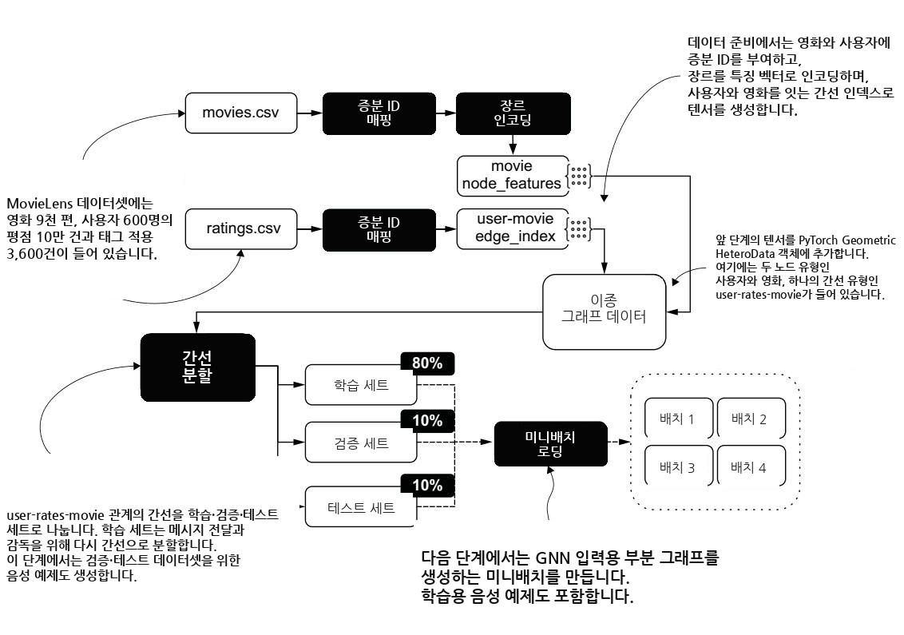

**그림 12.8** MovieLens 데이터셋을 위한 데이터 처리 파이프라인으로, 연속 ID 매핑, 장르 인코딩, 엣지 생성을 포함합니다. 이질 그래프 데이터는 두 노드 유형(사용자와 영화)과 하나의 엣지 유형(사용자가 영화를 평가함, user-rates-movie)으로 구성됩니다. 엣지는 학습(80%)·검증(10%)·테스트(10%) 세트로 나뉘며, 검증과 테스트에는 **부정 예제(negative example)** 가 생성됩니다. 그다음 미니배치 로더가 GNN 입력용 서브그래프(subgraph)를 준비하여, 메모리 용량을 초과하는 큰 그래프에도 확장 가능하도록 보장합니다.

우리 시나리오에는 두 유형의 노드, 즉 사용자와 영화가 있습니다. 이 노드들에 관한 정보를 나타내기 위해 PyG의 `HeteroData` 를 사용해 그래프를 구성합니다. 단일 노드 유형과 단일 엣지 유형을 가정하는 동질 그래프의 `Data` 클래스와 달리, `HeteroData` 는 각 노드 유형별로 특징을 구분하고 `edge_index` 를 특정 관계(relationship)와 연결할 수 있게 해줍니다. 이 경우의 관계는 "평가함(rates)"입니다. 다음 리스트는 전처리 결과(관련 장르로 생성한 `movie_feat` 과 `edge_index`)를 사용해 PyG `HeteroData` 객체를 구성합니다.

```python
# Listing 12.17 PyG HeteroData 객체 만들기
from torch_geometric.data import HeteroData
data = HeteroData()
data["user"].node_id = torch.arange(len(unique_user_id))
data["movie"].node_id = torch.arange(len(movies_df))
data["movie"].x = movie_feat
data["user", "rates", "movie"].edge_index = edge_index_user_to_movie
data = T.ToUndirected()(data)
```

이 코드가 하는 일을 짚어보겠습니다.

1. `data["user"].node_id` 와 `data["movie"].node_id` 로 각 노드 유형의 ID 목록을 부여합니다.
2. `data["movie"].x = movie_feat` 은 영화 노드에만 장르 특징을 붙입니다. 사용자 노드에는 초기 특징이 없다는 점에 주목하세요. 이 비대칭은 나중에 임베딩 설계에서 다시 등장합니다.
3. `data["user", "rates", "movie"].edge_index = ...` 는 "사용자 → 평가함 → 영화"라는 삼중항(triplet) 관계에 엣지 인덱스를 연결합니다.
4. `T.ToUndirected()(data)` 는 역방향 엣지를 추가합니다.

이 경우 우리는 GNN 메시지 전달이 사용자에서 영화로, 또 그 반대 방향으로도 흐르도록 명시하기 위해 역방향 엣지를 추가해야 합니다. 원본 엣지는 사용자 → 영화 방향만 담고 있는데, 정보가 영화 → 사용자 방향으로도 흘러야 양쪽 임베딩이 서로를 참고할 수 있기 때문입니다.

그래프를 생성한 뒤에는, 다음 리스트처럼 평점 엣지를 학습·검증·테스트 데이터셋으로 나눌 수 있습니다. 주된 목표는 이 데이터셋들이 링크 측면에서 서로 겹치지 않도록 하는 것입니다. 노드 분류 맥락에서는 이 분할 작업을 노드를 분리하기 위해 수동으로 수행했지만, 이번에는 PyG에 내장된 `transforms.RandomLinkSplit` 함수를 사용합니다.

```python
# Listing 12.18 학습·검증·테스트 데이터셋 만들기
import torch_geometric.transforms as T
transform = T.RandomLinkSplit(
    num_val=0.1,
    num_test=0.1,
    disjoint_train_ratio=0.3,
    neg_sampling_ratio=2,
    add_negative_train_samples=False,
    edge_types=("user", "rates", "movie"),
    rev_edge_types=("movie", "rev_rates", "user"),
)
```

각 매개변수의 뜻은 이렇습니다.

- `num_val=0.1` — 검증 엣지의 비율(10%)을 정합니다.
- `num_test=0.1` — 테스트 엣지의 비율(10%)을 정합니다.
- `disjoint_train_ratio=0.3` — 학습 엣지 중 감독(supervision)에 쓸 비율(30%)과 메시지 전달에 쓸 비율(70%)을 정합니다.
- `neg_sampling_ratio=2` — 검증·테스트 데이터셋에서 기존 엣지 하나마다 만들 부정 샘플(negative sample)의 수(2개)를 정합니다.
- `add_negative_train_samples=False` — 학습 데이터셋에는 부정 학습 샘플을 만들지 않도록(False) 설정합니다.
- `edge_types=("user", "rates", "movie")` — 메시지 전달과 학습에 쓸 기존 엣지 유형을 정합니다.
- `rev_edge_types=("movie", "rev_rates", "user")` — 메시지 전달에는 쓰지만 학습에는 쓰지 않는 역방향 엣지를 정합니다.

`transforms.RandomLinkSplit` 함수는 `("user", "rates", "movie")` 관계의 엣지를 학습·검증·테스트 엣지로 무작위로 분할합니다. 전통적인 데이터셋 분할과 비교하면, GNN의 경우에는 고려할 요소가 더 있습니다. 예를 들어 `disjoint_train_ratio` 매개변수는 학습 엣지를 다시 두 개의 서로 다른 그룹으로 나눕니다.

- **메시지 전달에 쓰는 엣지** — `edge_index` 변수에 저장됩니다.
- **감독(정답 신호)에 쓰는 엣지** — `edge_label_index` 변수에 저장됩니다.

왜 이렇게 나눌까요? 링크 예측에서는 "어떤 엣지가 존재하는가"를 맞히는 것이 목표인데, 만약 정답으로 쓸 엣지를 메시지 전달에도 그대로 쓰면 모델이 정답을 미리 엿보게 됩니다(정보 누출). 그래서 두 집합을 겹치지 않게 나누는 것입니다. 이 두 유형의 엣지 차이는 다음 학습 데이터 구조에 반영됩니다.

```text
# Listing 12.19 학습 데이터의 세부 구조
Training data:
===
HeteroData(
  user={
    node_id=[610]
  },
  movie={
    node_id=[9742],
    x=[9742, 20]
  },
  (user, rates, movie)={
    edge_index=[2, 56469],
    edge_label=[24201],
    edge_label_index=[2, 24201]
  },
  (movie, rev_rates, user)={
    edge_index=[2, 56469]
  }
)
```

학습 세트의 크기는 80,669로, 이는 전체 엣지 수(100,836)의 80%에 해당합니다. 그런데 학습 `HeteroData` 는 `edge_index` 에 대해 56,469(80,669의 70%)라는 값을, `edge_label_index` 에 대해 24,201(80,669의 30%)이라는 값을 보고합니다. 이 엣지 집합들이 서로 배타적(disjoint)이어서, 메시지 전달에 쓰이는 엣지와 감독에 쓰이는 엣지가 겹치지 않도록 한다는 점을 기억하는 것이 중요합니다.

더 나아가, 이질 그래프 맥락에서는 역방향 엣지를 `rev_edge_types` 매개변수로 지정합니다. 역방향 엣지는 메시지 전달에는 쓰이지만 링크 예측 모델을 학습하는 데는 쓰이지 않습니다. 다음 `HeteroData` 객체들은 우리 검증·테스트 데이터셋의 구조를 보여줍니다.

```text
# Listing 12.20 검증·테스트 데이터셋의 세부 구조
Validation data:
HeteroData(
  user={
    node_id=[610]
  },
  movie={
    node_id=[9742],
    x=[9742, 20]
  },
  (user, rates, movie)={
    edge_index=[2, 80670],
    edge_label=[30249],
    edge_label_index=[2, 30249]
  },
  (movie, rev_rates, user)={
    edge_index=[2, 80670]
  }
)
Test data:
HeteroData(
  user={
    node_id=[610]
  },
  movie={
    node_id=[9742],
    x=[9742, 20]
  },
  (user, rates, movie)={
    edge_index=[2, 90753],
    edge_label=[30249],
    edge_label_index=[2, 30249]
  },
  (movie, rev_rates, user)={
    edge_index=[2, 90753]
  }
)
```

이 리스트에 나온 크기들을 보면 어떤 엣지가 메시지 전달에 쓰이고, 어떤 엣지가 검증·테스트 데이터셋에서 모델의 우수함을 평가하는 데 쓰이는지 이해할 수 있습니다. 검증 데이터셋의 경우 `edge_index` 크기는 80,670으로, 학습 데이터셋의 엣지 수와 같습니다. `edge_label_index` 크기는 30,249인데, 이는 10,083(100,836의 10%)에 상응하며, 나머지 20,166개는 `RandomLinkSplit` 이 생성한 부정 엣지입니다. 여기서 부정 예제 비율이 2:1이라는 점을 떠올리면, 진짜 엣지 10,083개에 부정 엣지 20,166개(= 10,083 × 2)를 더해 총 30,249개가 되는 계산이 맞아떨어집니다.

이 맥락에서 80,670개의 학습 엣지는 메시지 전달에 쓰이고, 30,249개의 엣지는 검증 데이터셋에서 링크 예측 과제에 대한 모델을 평가하는 데 쓰입니다. 테스트 세트에도 유사한 원리가 적용됩니다. 메시지 전달에 쓰이는 엣지(90,753개)는 학습 엣지(80,670개)와 검증 엣지(10,083개)를 합친 것입니다. 즉 평가가 뒤로 갈수록, 앞 단계에서 이미 검증에 쓴 엣지까지 메시지 전달 재료로 흡수하는 셈입니다.

데이터셋을 분할한 뒤 다음 단계는, 우리 GNN에 입력으로 넣기 적합한 서브그래프를 만들어 낼 수 있는 미니배치 로더를 정의하는 것입니다. 이 단계는 소규모 그래프에서는 필수가 아닐 수 있지만, CPU나 GPU 메모리 용량을 초과하는 더 큰 그래프에 GNN을 쓸 때는 중요합니다.

이 목적을 위해 PyG의 `loader.LinkNeighborLoader` 구성 요소를 사용해, 입력 엣지 집합에서 엣지 표본을 선택합니다. 다음 리스트에서 보듯, 이 로더는 이 목록의 모든 노드로부터 서브그래프를 구성하며, 반복(iteration)마다 이웃 수를 샘플링합니다.

```python
# Listing 12.21 반복마다 이웃 수 샘플링하기
from torch_geometric.loader import LinkNeighborLoader
edge_label_index = train_data["user", "rates", "movie"].edge_label_index
edge_label = train_data["user", "rates", "movie"].edge_label
train_loader = LinkNeighborLoader(
    data=data,
    num_neighbors=[20, 10],
    neg_sampling_ratio=2,
    edge_label_index=(("user", "rates", "movie"), edge_label_index),
    edge_label=edge_label,
    batch_size=128,
    shuffle=True
)
```

주요 매개변수를 풀어 보면 이렇습니다.

- `num_neighbors=[20, 10]` — 첫 번째 홉(hop)에서 최대 20개, 두 번째 홉에서 최대 10개의 이웃을 샘플링합니다. 전체 이웃을 다 보지 않고 일부만 표본으로 취해, 큰 그래프에서도 메모리를 아끼며 학습할 수 있게 해줍니다.
- `neg_sampling_ratio=2` — 배치 안에서 기존 엣지 하나마다 만드는 부정 샘플의 비율(2:1)을 정합니다.
- `batch_size=128` — 배치 크기를 엣지 개수 기준으로 정합니다.
- `shuffle=True` — 엣지를 무작위 순서로 섞습니다.

이 과정은 검증·테스트 데이터셋에도 마찬가지로 수행된다는 점에 유의하세요. 데이터 준비 단계를 설명했으니, 이제 링크 예측 과제를 다루는 아키텍처를 이해할 차례입니다.

---

#### 12.2.4 인코더–디코더 아키텍처 — 임베딩을 만들고 내적으로 궁합을 잰다

링크 예측 시스템 역시 인코더–디코더 아키텍처를 기반으로 합니다. 다만 이 절에서 다루는 아키텍처는 입력 데이터의 특성(이질 그래프 구조)과 수행할 다운스트림 과제(추천을 위한 링크 예측)에 맞춘 구체적인 구성 요소들을 갖습니다. 그림 12.9가 관련 단계들을 개괄합니다. 다음 리스트는 이 시나리오에서 인코더–디코더 아키텍처를 구현합니다.

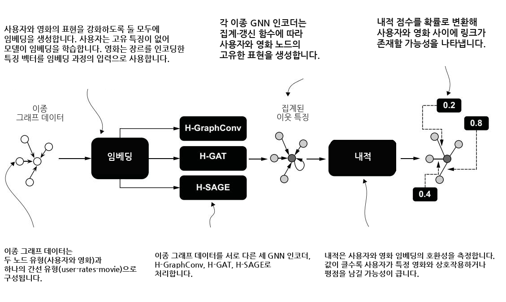

**그림 12.9** 영화 추천 링크 예측 시스템에서 이질 그래프 데이터를 처리하는 파이프라인입니다. 데이터는 노드 유형으로서의 사용자와 영화, 엣지로서의 사용자–영화 평점으로 이루어집니다. 임베딩이 생성되는데, 사용자 임베딩은 모델이 학습하고 영화 임베딩은 장르 특징에서 초기화됩니다. 데이터는 세 가지 이질 GNN 인코더(H-GraphConv, H-GAT, H-SAGE)로 처리되며, 이들은 이웃 특징을 집계하여 노드 표현을 만듭니다. 그다음 내적(dot product)이 사용자와 영화 사이의 궁합(compatibility)을 정량화하는데, 점수가 높을수록 상호작용 가능성이 크다는 뜻입니다. 이 점수들은 마지막으로 사용자와 영화 사이 링크의 가능성을 나타내는 확률로 변환됩니다.

```python
# Listing 12.22 링크 예측을 위한 인코더–디코더 아키텍처
super().__init__()
self.embedding = MovieLensEmbedding(
    data["user"].num_nodes,
    data["movie"].num_nodes,
    hidden_channels
)
self.gnn = gnn_model(
    data.metadata(),
    hidden_channels,
    hidden_channels,
    hidden_channels
)
self.classifier = DotProduct()

def forward(self, data):
    x_dict = self.embedding(data)
    x_dict = self.gnn(x_dict, data.edge_index_dict)
    pred = self.classifier(
        x_dict["user"],
        x_dict["movie"],
        data["user", "rates", "movie"].edge_label_index
    )
    return pred
```

이 구현이 하는 일을 짚어보겠습니다.

- `self.embedding` 은 `MovieLensEmbedding` 클래스를 사용해 사용자와 영화 노드의 임베딩 표현을 초기화합니다.
- `self.gnn` 은 모델 아키텍처(수정된 GraphGCN·GAT·SAGE의 이질 버전)를 초기화하며, `data.metadata()` 로 노드·엣지 유형 정보를 넘겨받습니다.
- `self.classifier = DotProduct()` 는 최종 계층(디코더)을 초기화하는데, 이 계층은 사용자와 영화 임베딩의 내적 연산을 수행합니다.
- `forward(self, data)` 는 순전파를 수행하고 예측을 계산합니다. 임베딩을 만들고(`x_dict`), 그것을 GNN으로 갱신한 뒤, 분류기(내적)로 감독 엣지(`edge_label_index`)에 대한 점수를 냅니다.

`MovieLensLinkPredictor` 의 `forward` 메서드는 데이터가 인코딩–디코딩 과정으로 전파되는 흐름을 보여줍니다. 인코딩 국면은 사용자와 영화 데이터 표현을 강화하기 위해 두 단계를 결합합니다.

- **임베딩 생성(Embedding generation)** — 이 단계는 사용자와 영화 양쪽 모두에 대해 임베딩을 생성하여 특징의 표현력을 높입니다. 사용자는 고유한(intrinsic) 특징이 없으므로, 그 임베딩은 모델이 스스로 학습합니다. 영화의 경우 장르를 인코딩한 특징 벡터가 임베딩 과정의 입력으로 쓰여, 각 영화 노드에 의미 있는 출발 표현을 제공합니다.
- **이질 GNN 모델(Heterogeneous GNN model)** — 임베딩은 이질 GNN 모델을 통해 갱신됩니다. 이 모델은 그래프 구조를 이용해 이웃 노드로부터 정보를 집계함으로써 노드 표현을 다듬습니다. 구체적으로, 사용자 임베딩은 그가 상호작용한 영화들의 정보로 갱신되고, 영화 임베딩은 그 영화와 상호작용한 사용자들의 정보로 갱신됩니다. 이 양방향 정보 교환은 임베딩이 그래프의 관계 구조를 효과적으로 포착하도록 보장합니다.

디코딩 국면은 학습된 임베딩을 사용해 예측을 만듭니다. 이는 내적 연산으로 구현되는데, 사용자와 영화 노드의 임베딩을 결합하여 유사도 점수(similarity score)를 계산합니다. 이 점수는 사용자와 영화 사이 링크(평점)의 가능성을 나타냅니다. 내적은 학습된 임베딩을 바탕으로 모델이 사용자–영화 관계를 예측할 수 있게 해줍니다. 두 임베딩 벡터가 비슷한 방향을 가리킬수록 내적 값이 커지므로, 큰 값은 곧 "이 사용자와 이 영화의 궁합이 좋다"는 신호가 됩니다. 이제 우리 링크 예측 시스템의 인코더와 디코더 구현을 분석해 봅시다.

---

##### 인코더 — 임베딩 생성과 이질 GNN, 두 단계

이 절 초반에 소개했듯, 인코더 구성 요소는 두 단계로 이루어집니다. 첫 번째는 임베딩을 생성하고, 두 번째는 이질 GNN 모델을 적용합니다. 임베딩 생성 단계는 다음과 같습니다.

```python
# Listing 12.23 임베딩 생성을 위한 클래스
import torch

class MovieLensEmbedding(torch.nn.Module):
    def __init__(self, user_input_dim, movie_input_dim, out_dim):
        super().__init__()
        self.movie_lin = torch.nn.Linear(20, out_dim)
        self.user_emb = torch.nn.Embedding(user_input_dim, out_dim)
        self.movie_emb = torch.nn.Embedding(movie_input_dim, out_dim)

    def forward(self, data):
        return {
            "user": self.user_emb(data["user"].node_id),
            "movie": self.movie_lin(data["movie"].x) +
                     self.movie_emb(data["movie"].node_id),
        }
```

우리는 사용자 특징과 영화 특징에 서로 다른 임베딩 생성 방식을 적용합니다. 사용자에게는 단일 단계(single-step) 방식을 써서, 행 수가 전체 사용자 노드 수(`user_input_dim`)와 같고 열 수가 `out_dim` 매개변수로 정해지는 임베딩 행렬을 만듭니다. 이 맥락에서 사용자는 초기 특징이 전혀 없으므로, 그 임베딩은 오로지 이 행렬로부터 학습 중에 배워집니다.

영화에는 두 단계(two-step) 방식을 씁니다. 먼저 영화 장르를 인코딩한 20차원 벡터로 표현된 입력 특징에 선형 변환(linear transformation)을 적용합니다(`movie_lin`). 그런 다음 이 변환의 출력을 임베딩 계층(`movie_emb`)과 결합합니다. 이 방식은 초기 특징의 표현력을 높여, 모델이 학습된 임베딩과 변환된 특징 표현을 모두 포착할 수 있게 해줍니다. 즉 영화는 "이미 아는 장르 정보"와 "학습으로 새로 배우는 정보"를 함께 갖게 되는 셈입니다.

인코딩 국면의 두 번째 단계는 이질 GNN을 사용합니다. 이는 금융 거래 그래프에서의 노드 분류와 달리, 인코더가 여러 유형의 노드와 엣지를 다루도록 설계되었다는 뜻입니다(다음 리스트 참고).

```python
# Listing 12.24 이질 기본 인코더 구현
import torch
from torch_geometric.nn import to_hetero

class HeteroBaseModel(torch.nn.Module):
    def __init__(self, metadata, input_dim, hidden_dim, out_dim, base_model):
        super(HeteroBaseModel, self).__init__()
        self.base_model = base_model(input_dim, hidden_dim, out_dim)
        self.hetero_model = to_hetero(self.base_model, metadata=metadata)

    def forward(self, x_dict, edge_index_dict):
        return self.hetero_model(x_dict, edge_index_dict)
```

이 코드의 핵심은 이렇습니다.

- 생성자는 지정된 입력·은닉·출력 차원으로 기본 동질 모델(`base_model`)을 초기화합니다.
- `to_hetero(self.base_model, metadata=metadata)` 는 제공된 메타데이터를 사용해 이 기본 동질 모델을 이질 모델로 자동 변환합니다.
- `forward` 는 이질 노드 특징(`x_dict`)과 엣지 인덱스(`edge_index_dict`)를 `hetero_model` 로 전파하여, 각 노드 유형에 대한 임베딩을 만듭니다.

이 이질 기본 클래스는 동질 버전보다 재료가 더 많습니다. 우선 PyG의 `to_hetero()` 함수를 사용해 우리의 기본 동질 GNN 모델을 이질 GNN 모델로 자동 변환하고, 그것을 집계 연산에 사용합니다. 이 함수는 두 매개변수, 즉 기본 GNN 모델과 메타데이터 집합을 요구합니다. 기본 GNN 모델을 사용하는 직관을 키우기 위해, 우리 SAGE 모델의 이질 버전 구현을 봅시다.

```python
# Listing 12.25 HeteroSAGE 모델 구현
class HeteroSAGE(HeteroBaseModel):
    def __init__(self, metadata, input_dim, hidden_dim, out_dim):
        super(HeteroSAGE, self).__init__(
            metadata,
            input_dim,
            hidden_dim,
            out_dim,
            SAGE
        )
```

이 경우 `HeteroSAGE` 클래스를 초기화하려면, 금융 거래 맥락에서 동질 그래프를 처리하는 데 채택했던 바로 그 `SAGE` 클래스를 인자로 넘겨야 합니다. 이 `SAGE` 클래스는 PyG 라이브러리가 제공하는 두 개의 `SAGEConv` 계층으로 이루어진 GNN 모델이라는 점을 떠올리세요. 동질 시나리오에서 만든 부품을 그대로 재활용해 이질 모델을 조립하는 것입니다.

`HeteroSAGE` 를 비롯한 모든 이질 모델의 구조는 그에 대응하는 동질 버전에 기반하며, 이질 그래프의 각 엣지 유형에 적용됩니다. 우리 시나리오에서는 과제와 데이터의 특성상 단일 엣지 유형, 즉 `("user", "rates", "movie")` 만 있습니다. 그러나 더 복잡한 시나리오에는 여러 엣지 유형이 있으며, 각 유형에 어떤 합성곱 계층을 적용할지 우리가 정할 수 있습니다.

PyG가 제공하는 `HeteroData` 객체의 `metadata` 메서드는 엣지 유형과 노드 유형의 집합을 정의하며, 이것이 `to_hetero()` 함수에 넘기는 두 번째 인자입니다. 따라서 우리는 이질 GNN 모델에게 어떤 엣지 유형이 이웃 특징 집계에 쓰이는지 알려줄 수 있습니다. 바꿔 말해, 합성곱 연산은 메타데이터에 명시된 노드와 엣지에 의해 이끌립니다.

---

##### 디코더 — 내적과 이진 교차 엔트로피의 결합

디코더 구성 요소는 GNN 인코더에서 나온 사용자와 영화 임베딩 사이의 내적을 계산하여, 사용자와 영화 사이의 궁합을 판정합니다. 내적은 각자의 학습된 특징 표현을 바탕으로 이 궁합을 정량화합니다. 내적 값이 높을수록 상호작용이나 평점의 가능성이 크다는 뜻인데, 예컨대 특정 영화에 대한 잠재적 사용자의 관심을 나타냅니다.

이 디코딩 함수는 PyTorch의 `F.binary_cross_entropy_with_logits` 함수와 짝을 이룹니다. 이 함수는 시그모이드(sigmoid) 활성화와 이진 교차 엔트로피 손실을 하나로 통합합니다. 시그모이드 활성화는 내적 점수를 확률로 변환하여, 그 점수를 링크가 존재할 가능성으로 해석할 수 있게 해줍니다. 그다음 이진 교차 엔트로피 손실은 이 예측 확률과 실제 상호작용 라벨 사이의 차이를 측정하여, 추천 정확도를 높이도록 모델의 최적화를 이끕니다. 노드 분류에서 소프트맥스+교차 엔트로피가 여러 클래스 중 하나를 고르는 문제였다면, 여기서는 시그모이드+이진 교차 엔트로피가 "링크가 있다/없다"라는 이진 문제를 다룬다는 점이 대응됩니다.

---

#### 12.2.5 평가와 분석 — 링크 예측에서의 GCN·GAT·SAGE

우리의 분석에서는 링크 예측을 위한 세 개의 엔드투엔드 모델을 비교했습니다. 각 모델은 서로 다른 GNN 인코더(GCN, GAT, SAGE)를 사용합니다. 표 12.10은 각 엔드투엔드 모델의 매개변수 수와 총 학습 시간(초)을 보여주며, 이 결과는 T4 Colab 머신에서 55 에폭을 돌려 얻었습니다.

> **참고** 우리의 GCN 구현은 그래프 유형에 따라 서로 다른 PyG 연산자에 대응합니다. 동질 그래프에는 차수 정규화(degree normalization)를 적용하는 정통 GCN 계층인 `GCNConv` 를 사용했습니다. 이질 그래프에는 `HeteroConv` 래퍼(wrapper)와 더 자연스럽게 통합되는 밀접한 변종인 `GraphConv` 를 사용했습니다. `GCNConv` 는 단일 노드·엣지 유형을 가정하므로 이질 그래프에 직접 적용할 수 없는 반면, `GraphConv` 는 이질 환경에서 요구되는 루트(root)와 이웃(neighbor)에 대한 별도 변환을 지원합니다.

**표 12.10** 서로 다른 GNN 인코더를 쓴 링크 예측 모델의 매개변수 수와 학습 시간

| 인코더 | 매개변수 수 | 학습 시간(초) |
|---|---|---|
| GCN | 713,408 | 826 |
| GAT | 1,066,880 | 956 |
| SAGE | 713,408 | 777 |

결과를 보면 SAGE 모델이 가장 효율적이고, GAT 모델이 가장 비효율적이며, GCN 모델은 그 중간에 있습니다. 모델 매개변수 수는 노드 분류에 쓴 모델들보다 현저히 많습니다. 여기에는 몇 가지 이유가 있는데, 사용자와 영화 특징의 표현력을 높이기 위한 임베딩 계층을 추가한 것과, 데이터를 처리하기 위해 이질 GNN 모델을 사용한 것이 대표적입니다. 짐작할 수 있듯, 매개변수 수는 학습 시간에 직접 영향을 미치며, 그래서 같은 인프라라도 노드 분류보다 학습 시간이 훨씬 깁니다.

---

##### 정밀도, 재현율, F1 점수 — 추천 맥락으로 다시 읽기

영화 추천 링크 예측 과제에서 GCN·GAT·SAGE 모델의 성능을 평가하기 위해, 노드 분류 과제에서 채택했던 것과 같은 지표로 그 동작을 분석할 수 있습니다.

- **정밀도** — 모델이 사용자와 영화 사이에 링크가 있다고 예측할 때(예: 영화를 추천할 때), 그 예측이 옳은 경우가 얼마나 되는가?
- **재현율** — 모든 사용자–영화 링크(예: 사용자가 좋아할 만한 영화들) 가운데, 모델이 성공적으로 식별하는 것은 얼마나 되는가?
- **F1 점수** — 모델이 정밀도(추천의 정확함)와 재현율(관련 추천을 최대한 많이 찾아냄) 사이의 균형을 얼마나 효과적으로 잡는가?

그림 12.10은 모델 학습 동안 검증 데이터셋에서 이 지표들의 추이를 보여줍니다.

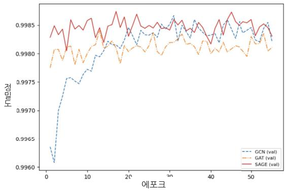

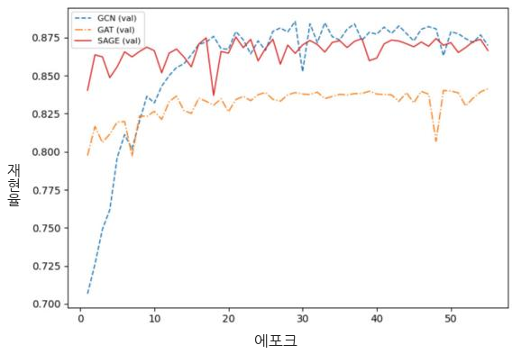

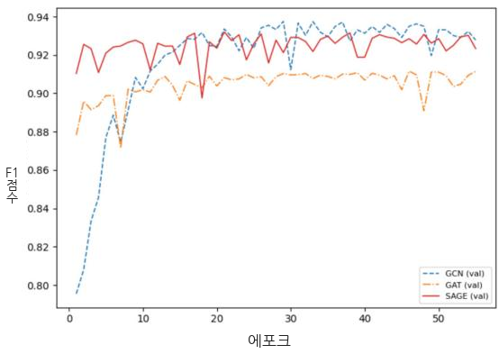

**그림 12.10** 학습 동안 검증 데이터셋에서 GNN 모델들의 정밀도·재현율·F1 점수 추이입니다.

이제 추천을 위한 링크 예측 맥락에서 앞서 던진 질문들에 답해 봅시다.

- **정밀도** — 모델들이 사용자가 어떤 영화에 평점을 매길지(링크가 존재할지) 예측할 때, SAGE 모델이 가장 높은 정밀도를 보입니다. SAGE는 거짓 양성을 최소화하는 데 가장 믿을 만하여, 사용자가 어떤 영화에 평점을 매기며 상호작용할지를 효과적으로 예측합니다. 영화 추천 과제로 옮기면, 이는 사용자가 평점을 매길 가능성이 낮은 무관한 추천이 더 적다는 뜻입니다. GCN 모델은 약간 뒤처지지만 여전히 높은 정밀도를 유지하여, 신뢰성이 필수인 경우 좋은 대안이 됩니다. GAT 모델은 가장 낮은 정밀도를 보이며 에폭에 걸쳐 변동성이 더 큰데, 이는 사용자 참여에 대해 잘못된 예측(사용자가 평점을 매길 가능성이 낮은 영화를 매길 것이라 예측)을 더 많이 함을 시사합니다.
- **재현율** — 실제 사용자–영화 링크(즉 사용자가 평점을 매길 만한 모든 영화)를 식별하는 능력에서는 GCN 모델이 가장 높은 재현율을 달성합니다. 이는 GCN이 사용자가 관심을 가질 영화를 식별하는 데 가장 포괄적이어서, 참인 평점을 가장 많이 잡아낸다는 뜻입니다. SAGE 모델이 약간 낮은 재현율로 바짝 뒤따르는데, 이는 GCN에 비해 사용자가 평점을 매길 영화를 조금 더 놓친다는 의미입니다. 반면 GAT 모델은 재현율에서 고전하며 실제 사용자–영화 링크의 상당 부분을 놓쳐, 포괄적인 추천을 제공하는 능력이 떨어집니다.
- **F1 점수** — SAGE 모델이 가장 높은 F1 점수를 달성하여, 정확한 추천을 제공하는 것과 사용자 선호를 폭넓게 포괄하는 것 사이에서 최선의 균형을 잡습니다. 이는 SAGE를, 무관한 예측을 최소화하면서 사용자가 평점을 매길 영화를 예측하는 데 특히 효과적으로 만듭니다. GCN 모델은 높은 재현율 덕에 잘 수행하지만, 약간 낮은 정밀도가 전체 균형을 약화시킵니다. GAT 모델은 낮은 정밀도와 재현율 탓에 경쟁력 있는 F1 점수를 얻기 어려워, 사용자–영화 상호작용의 전 범위를 포착하는 데 덜 믿음직합니다.

---

##### 혼동 행렬 — 존재하는 링크와 없는 링크를 나눠 보기

그림 12.11은 테스트 데이터셋에서 GCN·GAT·SAGE 모델의 혼동 행렬을 보여주며, 각 모델이 사용자 평점을 얼마나 효과적으로 예측하는지에 대한 상세한 통찰을 제공합니다. SAGE는 존재하지 않는 링크를 식별하는 데 강한 성능을 보여, 사용자가 평점을 매기지 않을 영화의 94.6%를 올바르게 예측합니다(**참 음성(true negative)**: 19,084). 그러나 SAGE는 사용자가 실제로 평점을 매길 영화의 71.5%를 식별하는 반면(**참 양성(true positive)**: 7,211), 참인 평점의 28.5%를 놓칩니다(**거짓 음성(false negative)**: 2,872). 이는 SAGE가 사용자가 평점을 매길 가능성이 낮은 영화를 걸러내는 데는 효과적이지만, 때때로 잠재적 평점을 간과함을 나타냅니다. 눈에 띄는 점은 SAGE가 거짓 양성을 최소화한다는 것입니다(1,082개, 5.4%). 이는 SAGE가 사용자가 상호작용할 가능성이 낮은 영화를 거의 추천하지 않아, 매우 정밀한 평점 예측을 보장한다는 뜻입니다.

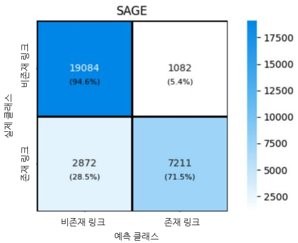

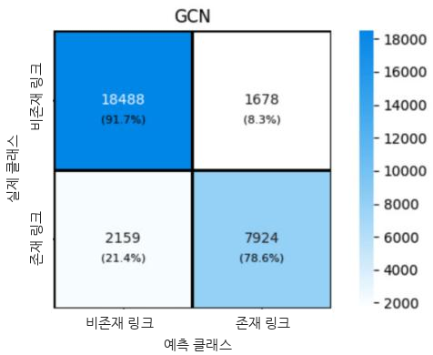

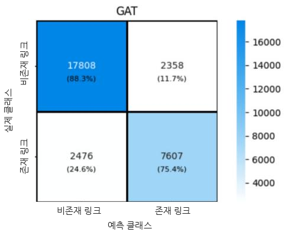

**그림 12.11** 테스트 데이터셋에서 GCN·GAT·SAGE 모델의 혼동 행렬입니다.

GCN 모델은 사용자가 평점을 매길 영화와 매기지 않을 영화를 식별하는 것 사이에서 강한 균형을 제공합니다. 사용자가 평점을 매기지 않을 영화의 91.7%를 성공적으로 식별하고(참 음성: 18,488), 실제 평점의 78.6%를 잡아냅니다(참 양성: 7,924). GCN은 놓친 평점의 비율(거짓 음성: 2,159)이 SAGE보다 낮지만, 거짓 양성 비율(1,678개, 8.3%)은 약간 더 높습니다. 이는 GCN이 잠재적 평점을 더 잘 찾아내지만, 때때로 사용자가 평점을 매기지 않을 영화를 제안함을 뜻합니다.

GAT 모델은 사용자가 평점을 매기지 않을 영화의 88.3%를 올바르게 예측하고(참 음성: 17,808), 실제 평점의 75.4%를 식별합니다(참 양성: 7,607). 그러나 거짓 음성 수(2,476개, 24.6%)가 GCN보다 높아, 사용자가 평점을 매길 영화를 더 많이 놓칩니다. 게다가 거짓 양성 수(2,358개, 11.7%)가 가장 높아, 사용자가 상호작용할 가능성이 낮은 영화를 추천할 여지가 더 큽니다.

이 결과들은 세 모델 모두 사용자 평점 예측에서 정도의 차이는 있으나 잘 수행함을 보여줍니다. 그중 SAGE는 정밀도로 두각을 나타내어, 사용자가 무관한 영화 제안을 받을 가능성을 낮춥니다. GCN은 잠재적 평점을 포착하는 것과 무관한 추천을 피하는 것 사이에서 가장 좋은 균형을 제공합니다. GAT는 사용자가 평점을 매기지 않을 영화를 과도하게 추천하는 경향이 있습니다.

---

#### 요약

- 그래프 신경망은 노드 분류와 링크 예측 같은 그래프 기반 ML 과제의 근본적인 도전 과제를 해결합니다.
- 과제 영역이 다르더라도, 우리는 여러 단계로 이루어진 일반적인 인코더–디코더 프레임워크를 정의할 수 있습니다. 이 프레임워크는 그래프 구조 데이터를 추론에 적합한 모델로 가공합니다. 이 뼈대에서 인코더는 그래프 합성곱 신경망(GCN), 그래프 어텐션 신경망(GAT), GraphSAGE(SAGE) 같은 GNN 아키텍처입니다. 디코더는 학습된 표현에 과제별 함수를 적용합니다.
- 그래프 데이터 안의 복잡한 관계를 포착하는 GNN의 능력은, 사기 탐지나 추천 시스템처럼 다양한 영역에 두루 쓰이는 실제 문제에 GNN을 매우 가치 있게 만듭니다.

---

## 핵심 용어 해설

| 용어(영문) | 뜻 |
|---|---|
| 그래프 신경망(GNN, graph neural network) | 그래프 구조 데이터를 학습하는 신경망. 노드가 이웃의 정보를 집계해 자신의 표현을 갱신함 |
| 노드 분류(node classification) | 그래프의 각 노드가 어떤 범주에 속하는지 맞히는 과제(예: 합법/불법) |
| 링크 예측(link prediction) | 두 노드 사이에 아직 없는 연결이 존재할지 맞히는 과제(예: 사용자–영화 추천) |
| GCN(graph convolutional network) | 이웃 특징을 차수로 정규화해 집계하는 대표적 GNN 계층 |
| GraphSAGE(SAGE) | 이웃을 샘플링하고 집계해 노드 표현을 학습하는 GNN. 이 장에서 전반적으로 가장 좋은 성능을 보임 |
| GAT(graph attention network) | 이웃마다 서로 다른 어텐션 가중치를 학습해 집계하는 GNN. 매개변수가 많아 학습 시간이 김 |
| PyTorch Geometric(PyG) | 그래프 딥러닝을 위한 PyTorch 기반 라이브러리 |
| 자금세탁 방지(AML, anti-money laundering) | 불법 자금의 흐름을 탐지·차단하려는 활동. 이 장의 노드 분류 응용 사례 |
| 동질 그래프(homogeneous graph) | 단일 유형의 노드와 엣지만 있는 그래프(예: 거래–거래) |
| 이질 그래프(heterogeneous graph) | 여러 유형의 노드·엣지가 있는 그래프(예: 사용자·영화, rates 관계) |
| 임베딩(embedding) | 노드를 저차원 실수 벡터로 표현한 것. 유사한 노드는 가까운 벡터를 가짐 |
| 메시지 전달(message passing) | 노드가 이웃의 특징을 주고받아 자신의 표현을 갱신하는 GNN의 핵심 연산 |
| 인코더–디코더(encoder–decoder) | 인코더(GNN)가 표현을 만들고 디코더가 과제별 예측을 내는 아키텍처 |
| edge_index | 그래프의 엣지를 `[2, 엣지 수]` 형태로 담은 텐서. 윗줄은 출발, 아랫줄은 도착 노드 |
| 마스크(mask) | 어떤 노드/엣지를 학습·검증·테스트에 쓸지 True/False로 표시한 필터 |
| 로그 소프트맥스(log softmax) | 소프트맥스 확률에 로그를 취한 함수. 수치 안정성을 높임 |
| 교차 엔트로피 손실(cross-entropy loss) | 예측 확률과 실제 라벨의 차이를 재는 분류용 손실 함수 |
| 내적(dot product) | 두 임베딩 벡터의 유사도(궁합) 점수를 재는 연산. 링크 예측의 디코더로 쓰임 |
| 이진 교차 엔트로피(binary cross-entropy) | "링크 있다/없다" 같은 이진 예측의 손실 함수. 시그모이드와 함께 쓰임 |
| 부정 샘플(negative sample) | 실제로 존재하지 않는 링크. 링크 예측 모델이 "없음"도 배우도록 인위 생성함 |
| 정밀도(precision) | 모델이 양성이라고 한 것 중 실제 양성 비율. 거짓 양성을 얼마나 줄이는지 |
| 재현율(recall) | 실제 양성 중 모델이 찾아낸 비율. 놓치지 않는 능력 |
| F1 점수(F1-score) | 정밀도와 재현율의 조화 평균. 둘의 균형을 나타냄 |
| 혼동 행렬(confusion matrix) | 클래스별 참/거짓 양성·음성 개수를 표로 정리한 것 |
| to_hetero() | 동질 GNN 모델을 메타데이터를 이용해 이질 GNN 모델로 자동 변환하는 PyG 함수 |

---

### References

이 장에서 인용한 참고문헌은 원문의 References 절을 참조하세요. 주요 인용은 GCN [1], GraphSAGE [2], GAT [3]입니다.
