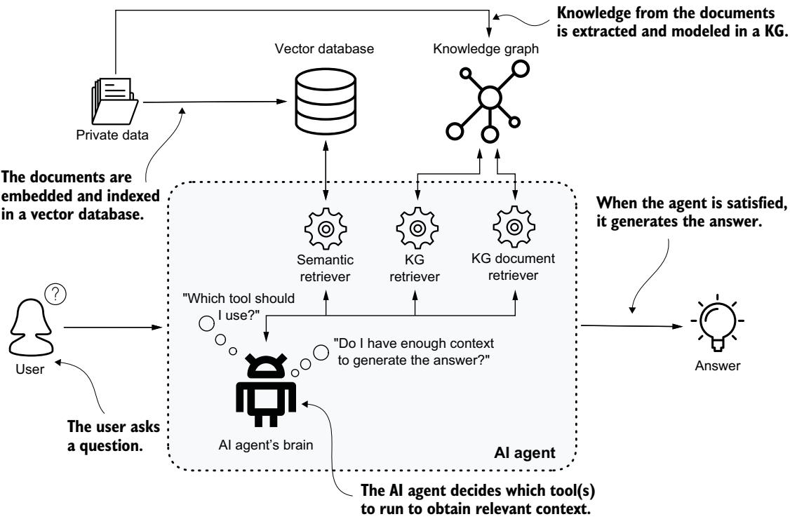
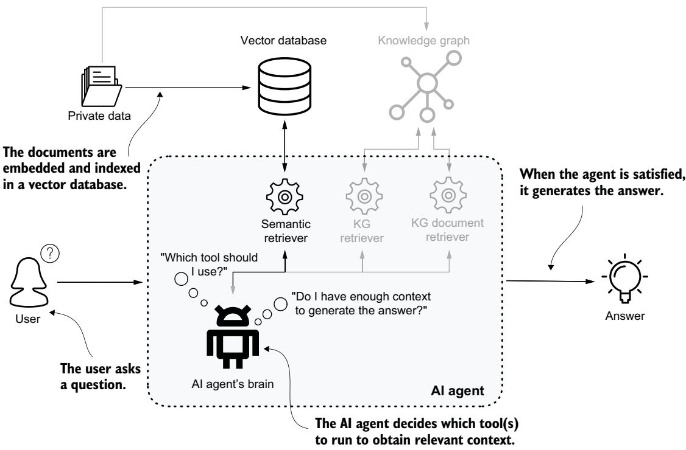
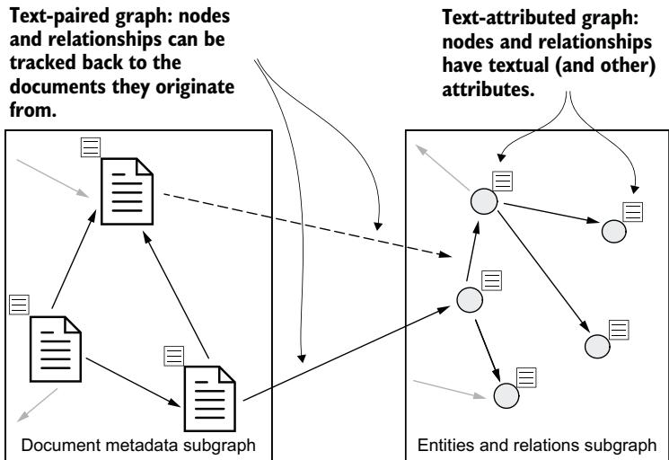
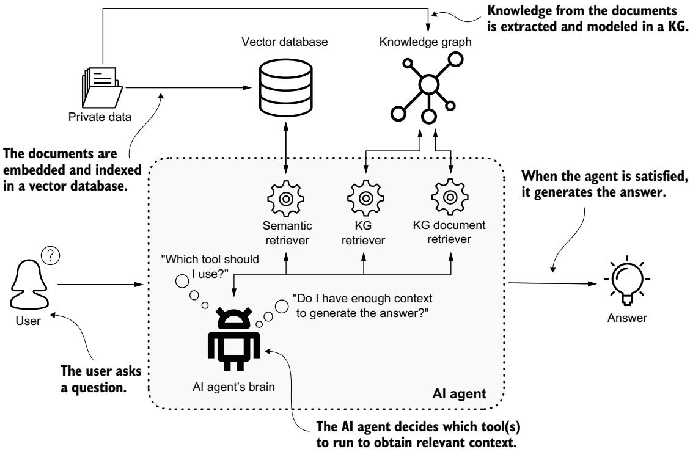
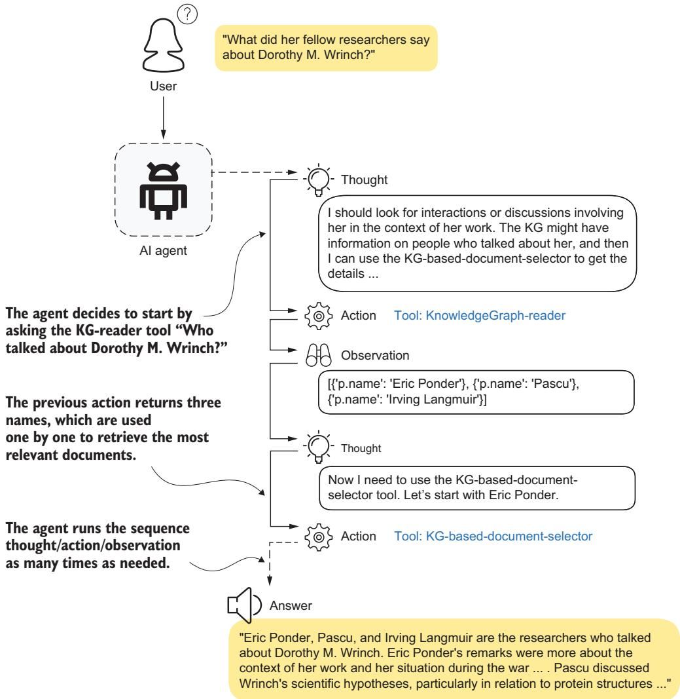

# Information retrieval with knowledge graphs and LLMs

he integration of KGs with LLMs reaches its practical culmination in this final part of the book, where we explore how to use these combined technologies for accurate and reliable information retrieval. We’ll focus on the practical implementation of systems that use KGs as ground truth to enhance LLM capabilities while preventing hallucinations.

Chapter 13 explores the integration of KGs with LLMs through retrieval augmented generation (RAG), showing how graph RAG systems can use structured data and language understanding to provide more accurate and transparent responses.

Chapter 14 illustrates how to build sophisticated question-answering systems that emulate domain expert reasoning to create contextually aware solutions. We demonstrate systematic approaches to intent detection, schema translation, and expert knowledge embedding.

Chapter 15 brings together all these concepts in a complete, working implementation using LangGraph and Streamlit. We demonstrate how to build a modular pipeline in which specialized agents handle different aspects of question processing while maintaining system observability and extensibility.

These chapters provide you with the practical knowledge to implement production-ready systems that combine the strengths of KGs and LLMs, serving as a comprehensive guide for organizations looking to deploy reliable, knowledgegrounded AI solutions.

### Knowledge graph–powered retrieval-augmented generation

### This chapter covers

Making LLMs useful as AI agents

Using retrieval augmented generation to ground LLMs using context

Building a KG-powered RAG system

The year 2023 was marked by AI upheaval. Data scientists and ML engineers working in the natural language processing (NLP) domain were not just given a new toy: their work lives were turned upside down. The release of OpenAI’s GPT-3.5 model at the end of 2022 marked a transformative change. Suddenly we didn’t need to spend months or years building custom training datasets and models for each specific downstream task. With a little clever prompt engineering, almost anyone could build NLP applications.

But although LLMs are powerful, they are far from a magic solution for every problem. A lot of work remains to be done to make them useful in production enterprise-grade scenarios. This realization led to the concept of AI agents, related implementation libraries, and LLM operations (LLMOps).

The topics we’ll discuss in this chapter are illustrated in the mental model in figure 13.1. Parts 2 and 3 of the book showed how to transform private data into a KG; now we’ll explore how to build a chatbot that uses this KG as an input.

  
Figure 13.1 An AI agent design for KG-powered question answering. The agent has multiple tools at its disposal, which use external data sources such as a vector database and a KG to provide the necessary context for the user’s question.

### 13.1 AI agents

AI agents [1] represent a significant evolution in the capabilities of modern intelligent systems. At their core, AI agents are autonomous entities designed to perform specific complex tasks by interacting with their environment. Unlike traditional software programs that follow a predetermined set of instructions, AI agents exhibit a level of autonomy, adaptability, and “intelligence,” enabling them to make decisions, learn from experience, and respond to changing conditions in real time.

Consider a fully functional chatbot. We can start with a simple question: “What is the capital of France?” Pretty much any LLM at the top of the current model leaderboard will promptly and correctly reply, “The capital of France is Paris.” Great! It works! But is this the kind of question that will generate a satisfactory return on investment, justifying the immense costs of building and running a model with hundreds of billions of parameters? Probably not. Those kinds of questions and tasks are much more complex; they typically require at least one of the following:

Advanced multistep reasoning capabilities—Think of deduction tasks such as solving mathematical puzzles, or an adaptable system that needs to adjust the original execution plan based on what outputs are provided by intermediate steps.

 Understanding of deep relational patterns among concepts—Think of analyzing a social network where you’d like to identify influencers of certain discussion topics, or a supply chain challenge where you are tasked to pinpoint and remedy bottlenecks.

 Access to the latest, often external and nonpublic data, not seen by the model during training—This is often referred to as the knowledge cutoff of LLMs: the fact that these models are so large that they cannot be retrained often enough to be able to answer questions such as “What is the weather forecast for tomorrow?” not to mention questions related to sensitive internal data, especially when you need to handle multiple personas with different access rights.

Imagine a content writing assistant that helps users write articles, blog posts, or even social media posts. How would we approach this task as humans? First, we would likely research the requested topic by studying articles, blog posts, and books and pulling basic facts from knowledge bases such as Wikipedia. Then we’d write the first draft, ask a friend or colleague to do a review, and make final improvements before publication. This process is reflected in the design of an intelligent system to perform the task. For this system, we’d build several AI agents: a Researcher, multiple Writers (depending on what’s being written), and a Reviewer. You can think of a multiagent system as being like a role-playing game, where the different agents (players) assume different specialized roles and communicate with each other to achieve a goal.

### 13.2 Chatting with the LLM

Now that we understand the concept of AI agents, it is time to look at a practical example. Let’s consider the simplest possible scenario: a chatbot agent where the user fluently communicates with an LLM. After asking an initial question, the user can decide to follow up on it in a conversational manner. To build such an agent, we need only two things: access to a pretrained LLM, and memory to remember the full set of questions and answers so that we get a conversational experience. Such an agent can be written as a simple class, like the one in the following listing.

#### Listing 13.1 A conversational AI agent with memory

class Agent:   
def \_\_init\_\_(self, model: str = "gpt-4o-mini", system: str = None):   
self.model = model   
self.system = system Instance variable as memory: it   
self.messages = list() holds the full message history.   
self.client = OpenAI(api\_key=os.environ['OPENAI\_API\_KEY'])   
if self.system is None or len(self.system) == 0:   
self.system = "You are an AI assistant providing straightforward   
➥concise answers."   
self.messages.append({"role": "system", "content": self.system})   
def \_call (self, message: str) -> str: When we ask the agent a question,   
self.messages.append({"role": "user", < it is appended to the memory.   
➥"content": message})   
answer = self.execute()   
self.messages.append({"role": "assistant",   
The answer is also appended   
➥"content": answer})   
to the memory before being   
return answer returned to the user.   
def execute(self) -> str:   
completion = self.client.chat.completions.create(   
model=self.model,   
temperature=0,   
messages=self.messages)   
return completion.choices[0].message.content   
if name == "\_\_main\_\_":   
agent = Agent() First question   
q = "Who are the top influencers of cyclotron < Follow-up   
➥funding?" question; the agent   
print(f"> Question: {q}\n> Answer: {agent(q)}") is aware of the   
previous question–   
q = "And in the context of the 1930s, related to the answer pair.   
➥Rockefeller Foundation?"   
print(f"> Question: {q}\n> Answer: {agent(q)}")

The agent is initialized by model version, a system message frames its scope, and the OpenAI API key is provided as an environment variable through the .env file. The instance variable messages represents the agent’s memory and holds the full message history. We could also run the agent in Jupyter to get a more interactive experience, or ideally add a UI layer to make it more like a real conversation, but here we use it from a standard Python script for simplicity. We ask an initial question followed by a clarification; the output is shown next.

#### Listing 13.2 Output of the conversation from listing 13.1

> Question: Who are the top influencers of cyclotron funding?   
> Answer: The top influencers of cyclotron funding typically include   
government agencies, research institutions, private foundations, and   
industry stakeholders. Key players may include:

1. \*\*National Institutes of Health (NIH)\*\* - Provides significant funding for medical research involving cyclotrons.

2. \*\*Department of Energy (DOE)\*\* - Supports research related to nuclear science and particle accelerators.

3. \*\*National Science Foundation (NSF)\*\* - Funds various scientific   
research projects, including those using cyclotrons.

4. \*\*Private Foundations\*\* - Organizations like the Wellcome Trust and the   
Gates Foundation may fund related research.

5. \*\*Universities and Research Institutions\*\* - Institutions with cyclotron facilities often seek grants and partnerships for funding.

6. \*\*Pharmaceutical Companies\*\* - They may invest in cyclotron technology for drug development, particularly in radiopharmaceuticals.

These entities influence funding through grants, partnerships, and collaborative research initiatives.

> Answer: In the context of the 1930s, the Rockefeller Foundation played a   
significant role in funding scientific research, including advancements in   
nuclear physics and cyclotron development. Key influencers related to   
cyclotron funding during this period included:

1. \*\*John D. Rockefeller Jr.\*\* - As a prominent philanthropist, he   
supported various scientific initiatives through the foundation.   
2. \*\*Vannevar Bush\*\* - An influential engineer and science administrator   
who advocated for government and private funding in scientific research.   
3. \*\*Ernest O. Lawrence\*\* - The inventor of the cyclotron, whose work   
received support from the Rockefeller Foundation and other entities,   
helping to advance particle accelerator technology.

The Rockefeller Foundation's funding helped establish research programs and   
facilities that contributed to the development of cyclotrons and related   
scientific fields during the 1930s.

The answer to the first question is correct, but very generic. The follow-up question that clarifies the context gets a better response; we see two familiar names (recall the KG we built in chapters 5 and 6): Ernest O. Lawrence and Vannevar Bush. Not surprisingly, out-of-the-box models cannot provide specific answers unless they see the data we expect the generated answer to be based on. We will learn more about this shortly.

We could build agents from scratch this way by adding more complexity, but fortunately we don’t have to—because hand in hand with the current AI boom came the development of an entire engineering ecosystem around it.

### 13.3 Challenges in the production environment

Developing a useful real-world agent is complex and must consider several challenges and concerns related to LLMs:

 Hallucinations, also known as “making stuff up”—LLMs are trained to predict the most likely next token in the sequence, a process that inherently makes them susceptible to producing plausible-sounding but fabricated facts. This is particularly true when they are prompted about subjects not included in their training data. Despite lacking the knowledge, the model will still perform the task it was trained for: it will generate the most likely output given its experience encoded in billions of parameters. The response will be coherent and fully convincing, but partially or completely inaccurate.

Freshness, also known as the “knowledge cutoff”—LLMs are trained on a vast amount of data, which makes them powerful but extremely expensive to train. Therefore, retraining happens only once or twice a year, so LLMs can’t provide accurate responses regarding (not-so-)recent developments.

Transparency—We get a coherent answer to our question, but without any insight into how it was generated. Information sources and reliability, reasoning processes, confidence level, and so on are concerns when developing enterprise solutions.

Data privacy—Training models using potentially personal and private sensitive data without leaking it is a concern in many applications. And in many organizations, different groups of people have different data access privileges.

Cost—Training, deploying, and maintaining the best current AI models come with significant costs, both financial and environmental. The computational power required for training large models is immense, leading to high energy consumption and substantial carbon footprints. This makes them accessible pri marily to well-funded companies. The proliferation of smaller, specialized LLMs is reducing their expense, but it remains a significant consideration.

 Ethical concerns and biases—Because models learn from datasets that may contain prejudiced or harmful content, the models can inadvertently reproduce or amplify stereotypes, misinformation, and discriminatory viewpoints, raising serious ethical issues about their deployment and impact on society.

To address these issues, we need to move beyond a simplistic “question in, response out” scenario, which means building agents with greater complexity. For example, to address the freshness concern, we’d like to equip our conversational agent with tools that allow it to retrieve and use information from external sources, such as downloading the latest weather forecast data, news articles, or content from an up-to-date knowledge base—such as a knowledge graph. This is the topic of the remainder of this chapter.

### 13.4 Chatting with the AI about private data

LLM models have limited knowledge of specialized domains. In these cases, we need a way to make them experts on our domain and our private (often sensitive or secret) data, while preserving their superior language understanding capabilities and general knowledge.

Think of our Rockefeller Archive Center use case discussed in chapters 5 and 6. We built a KG that tracks grant-awarding processes that took place at the Rockefeller Foundation in the 1930s. This KG captures the awarded grants with relevant information such as grant amounts, research topics, universities, and researchers, along with behind-the-scenes conversations that took place between Foundation representatives and grant applicants prior to grant approval (i.e., who talked with whom about what). We thus have an influence network available, built from proprietary data never published before in its entirety, which allows us to accurately answer questions such as “Who were the influencers of cyclotron research funding?”

In chapters 5 and 6, we saw how to design a traditional KG-based system for such a use case through well-tuned graph visualization and dashboards. Now the exciting question is, can we develop an AI interface to deliver the same value to a broad range of users without requiring them to speak the Cypher query language, read and interpret charts and tables, or manipulate and navigate graph data structures? This is a job for AI agents using a pretrained LLM and multiple context-retrieval tools in a process called retrieval-augmented generation (RAG).

#### 13.4.1 Retrieval-augmented generation

RAG [2] is a technique developed to address limitations of pretrained generative models, including those we mentioned earlier (hallucinations, freshness, transparency, and data privacy). It combines the knowledge and language understanding capabilities of pretrained LLMs with additional context relevant to the question, retrieved from an external data source: a structured database or an unstructured dataset (text, images).

In practice, a RAG agent is coded as a combination of an LLM, a prompt guiding the agent’s steps, and one or more tools, which are essentially functions that retrieve question-relevant external information. The model is then asked to generate the answer, given the combination of the user’s question and the provided external information as a context. Think of asking for tomorrow’s weather forecast. An out-of-thebox model cannot answer this question unless we allow it to call a tool that polls a weather forecast API. At this point, the AI can generate an accurate answer by combining its language understanding skills with external, accurate, up-to-date information.

In this sense, RAG is a grounding technique: instead of letting the model go wild (hallucinations), we limit its scope for answer generation to the provided context, thus significantly reducing the chance that it will make things up.

NOTE We can never fully get around the fact that these models are probabilistic. They’re trained to predict the most probable next token in a sequence, so even if we use a technique like RAG, they can still go astray. This is important to keep in mind when designing intelligent systems: instead of replacing humans, the systems should augment them. We believe that keeping humans in the loop through a feedback validation or supervision mechanism is essential for any product we build.

Let’s explore an example. In the early days of RAG, the context came almost exclusively from a database of textual documents, as illustrated in figure 13.2. Documents were chunked into smaller portions (for example, paragraphs) and mapped into fixedlength vectors called embeddings, which captured their semantics. The embeddings were then stored and indexed in a vector database. The process of generating and storing embeddings for the Rockefeller Archive Center use case is shown in the following listing.

  
Figure 13.2 Vector search-based retrieval augmented generation. Documents are embedded into dense vector representations and indexed in a vector database. When a user asks a question, it is also embedded, and the most similar documents are retrieved from the database. The agent then generates the final answer.

#### Listing 13.3 Transforming documents into embeddings

```python
import os
from langchain_community.vectorstores import Neo4jVector
from langchain_openai import OpenAIEmbeddings
from dotenv import load_dotenv
= load_dotenv() Creates embeddings
and a vector index
using specified
if name == " _main _": nodes, properties,
vector_index = Neo4jVector.from_existing_graph( ≤ and an AI model
embedding=OpenAIEmbeddings(),
url=os.environ['NEO4J_URL'],
username=os.environ['NEO4J_USER'],
password=os.environ['NEO4J_PWD'],
database=os.environ['NEO4J_DB'],
```

```python
index_name='embeddings',
node_label="Page",
text_node_properties=['text'],
embedding_node_property='embedding
Semantic similarity
search: returns the
q = "What is known about cyclotron research?" top two documents
resp = vector_index.similarity_search_with_score(q, < for a given question
➥k=2)
for r in resp:
print(f"------\nScore: {r[1]}")
print(r[0].page_content)
```

Here we use the LangChain library, which enables us to build AI-based systems with support for various models, databases, information retrieval tools, and others. The code retrieves the texts from Page nodes, uses the specified embedding model to vectorize them, and stores the vectors back to the Neo4j DB. When a question is asked, it is embedded using the same model, and the most similar text chunks are retrieved. The shortened output is as follows.

#### Listing 13.4 The top two text chunks most similar to the question

Score: 0.9180829524993896   
text: Tuesday, January 31, 1939 (Cont'd)   
The reproduction cost of the large cyclotron would involve about \$30,000   
for the magnet, \$15,000 for the power supply, and \$30,000 for the cyclotron   
chamber, accessories, controls, etc. Lawrence is already thinking about the   
next step. He believes that his present "large" machine will be duplicated   
several other places: but if it is wholly successful he wants to go on to   
build a hundred million volt machine   
Score: 0.9157187938690186   
text: Dr. R. J. Van de Graaff, Massachusetts Institute of Physics. Van de   
Graaff gives WW the whole history and philosophy of his scientific career   
to date. The physical universe being composed of particles, G. decided to   
study particles   
Although he speaks with complete modesty and with complete generosity   
relative to the cyclotron development, he is inclined to think that his   
type of generator promises to offer relative advantage ..

The first document is highly relevant to the question. The second-highest-ranking document also mentions the cyclotron, although it resembles a sales pitch by Van de Graaff in favor of his (now-famous) generator.

#### 13.4.2 Vector-based RAG limitations

We have seen how to transform out-of-the-box pretrained LLMs into useful conversational assistants capable of answering questions about private data using RAG agents based on vector search. What’s next? Is this the best we can do?

Although RAG in its vector-search form is useful, it has some challenges and shortcomings:

 Limited reasoning due to context fragmentation—By providing a list of matching document chunks, we implicitly encode in the process a tendency to treat documents independently, thus potentially missing more complex multihop relationships among the documents as well as the entities mentioned in them. This also exposes the limitations of our chunking strategy: what if the information we need started in a previous chunk and continues in the current one? Will both be retrieved, in the right order and ranked high? Simple chunking proba bly won’t perform well; we have to put much more thought into its design to mitigate at least some of the issues.

Scalability—This approach is computationally expensive with larger corpora, often forcing us to use more efficient but less accurate approximate search algorithms.

Embedding limitations—The attempt to encode the semantics of a document in a single dense vector leads to oversimplification: failure to capture important finegrained semantics and domain-specific nuances. Another limitation is the possibility of sparsity in the training dataset of the embedding model (i.e., certain terms being underrepresented). This leads to inaccurate embedding representations and lower retrieval accuracy. Finally, reliance on static (precomputed) vectors makes RAG less adaptive to new or evolving knowledge and nomenclature.

 Noise in retrieval—Vector search can return loosely related or completely irrelevant documents, which leads to distraction [3]: too much noise, especially in longer contexts, can confuse the model and result in degradation of output quality. The key is to provide context with as high a density of relevant information as possible.

Misses in retrieval—Just as embedding limitations and the use of approximate vector similarity search can lead to noise, they can also cause the opposite: failure to include the most relevant documents. And if we don’t provide all the facts, we cannot obtain a fully correct answer, no matter how good the AI model is. Misses can also result from questions such as “What are the key research topics in this dataset?” The answer will be misleading because the vector similarity search will return chunks that are the most semantically similar to the question, rather than providing comprehensive data needed to generate the expected answer.

Let’s illustrate these limitations with an example. Suppose our question is, “How is Lauritsen related to cyclotron research?” Intuitively, we expect that the most similar documents will, at the very least, mention Lauritsen by name. Wrong. That is not how embeddings work. They encode the overall meaning of a text and represent it with a condensed summary. They can’t guarantee that the most similar document will even mention the entity we ask about! The semantic similarity of a question and a document can pick up on another linguistic meaning or pattern. And indeed, when we embed this question and find the three most similar documents based on cosine similarity, only one of the documents includes “Lauritsen” (and “cyclotron”); the other two mention only “cyclotron” and are therefore irrelevant to the question, even though they have nearly the same similarity score as the first document. Table 13.1 gives an overview of the top three documents.

Table 13.1 Top three documents most similar to the question “How is Lauritsen related to cyclotron research?” and an indication of whether they mention “Lauritsen ” and “cyclotron”
<table><tr><td>Document</td><td>Cosine similarity</td><td>Lauritsen</td><td>Cyclotron</td></tr><tr><td>Tuesday, January 3, 1939. Professor Karl Lark-Horovitz, Purdue University. The Van de Graaff machine at Purdue was built in two or three months and is now operating, producing 600 micro-amperes at 850 kilovolts. Thus as a neutron generator it is equivalent to several pounds of radium. The Purdue group has devised ...&quot;</td><td>0.906</td><td>True</td><td>True True</td></tr><tr><td>Tuesday, May 2, 1939. Dr. Irving Langmuir, General Electric Company. L. very strongly favors continued support for Dr. Dorothy Wrinch. He bases this primarily on two considerations. First, and giving due recognition to the fact that W. is a difficult person whose scientific behavior is not always what it should be, L. considers it unquestionably true that W. has been responsible for stimulating ...&quot;</td><td>0.903</td><td>False</td><td></td></tr><tr><td>Dr. Dorothy M. Wrinch, April 3, 1939 (continued). In connection with the X-ray structure problem Langmuir obtained from Clowes some money which W. used for comput- ing. She is not sure that she should have accepted funds from elsewhere, but WW assures her that ...&quot;</td><td>0.902</td><td>False</td><td>True</td></tr></table>

How can we overcome these limitations? Our answer will come as no surprise to readers of this book: bring KGs into the picture. The graph-based approach to RAG is commonly referred to as Graph RAG. Besides mitigating or even completely solving the challenges related to vector-based RAG, this approach has additional benefits. The KG acts as a central knowledge repository, integrating not just raw texts but also various document metadata and high-confidence structured data sources (tables, CSVs, ontologies, and so on), which together unlock a wider range of use cases. Because KGs represent knowledge in a human-accessible format, they are easy to keep up to date. And domain experts can validate existing knowledge or enter new knowledge, thus directly affecting the AI system’s output quality. This increased transparency results in greater user confidence.

#### 13.4.3 Graph RAG

The development of synergies between KGs and LLMs is happening quickly [4]. The Rockefeller Archive Center KG is a good example of an LLM-augmented KG: we built it using prompt engineering on top of OpenAI’s ChatGPT model, which extracted entities and relations and also completed the identified information using the model’s internal knowledge. The resulting KG is a combination of a text-attributed graph and a text-paired graph [5] (see figure 13.3).

  
Figure 13.3 The Rockefeller Archive Center KG combines a text-attributed graph and a textpaired graph. Documents are represented as nodes, each with properties representing metadata such as author, type of document, and date. The extracted entities and relationships are traceable back to the original documents, which enables us to design a KG-based document selection tool for AI agents.

A text-attributed graph is a graph with nodes and relationships that have textual attributes, and a text-paired graph is a graph whose nodes, relationships, and graphs are associated with the documents that are their descendants. The design of our example KG enables us to implement a Graph RAG system that takes advantage of several aspects of data and knowledge modeling:

Metadata—The documents typically have associated metadata such as publication date, type, source, author, and so on. All this information is available in the KG as properties and relationships, and can be used—in addition to the content—to design a context retrieval system. For example, communities can be identified in the graph of documents, and each community can be represented by a summary or by the most recent document (such as the most up-to-date version of a law or regulation).

 KG retriever—A KG is a great context resource. The nodes and typed relationships provide condensed, accurate, up-to-date information that an LLM can use to generate responses. A model can take the user’s question and the KG’s schema and generate a Cypher query to retrieve the information it needs. A KG retriever tool can also take as input the entities the user is asking about and return a subgraph that connects them (e.g. through all shortest paths), leaving it up to the final LLM to use whatever part of the data it deems relevant.

KG-enhanced document retriever—If our KG is a text-paired graph, we can use it as a document retriever, which is more accurate than one based on vector search. For example, we can use it to retrieve only documents that mention all the entities the user asked about, and eliminate one of the vector-search failures we discussed earlier. Or if we need more detailed information about a relationship than a KG can provide, we can retrieve only documents that mention this relationship, thus avoiding the distraction phenomenon.

 Combined retrieval—Sometimes questions span multiple data sources. For such cases, we can design an AI agent that breaks the question into two parts: one that retrieves the KG information (the KG retriever) and another that uses this information to find the most relevant documents. Both contexts are merged before the final answer is generated. For example, consider this question: “What are this year’s transactions of the head of criminal group $\mathbf{X} ? ^ { \mathfrak{n} }$ It would be surprising to find that the financial documents contain “Head of X” as that person’s title, so we need to extract that name from a KG built by a law enforcement agency and then use it to search the financial documents database.

Now that we understand what Graph RAG is about, let’s implement a simple agent on top of the Rockefeller Archive Center KG (see figure 13.4). Our Graph RAG agent will have three tools at its disposal: the KG retriever, the KG-enhanced document retriever, and a semantic retriever (vector search tool) as a backup in case the other tools fail to return valuable context.

  
Figure 13.4 KG-powered RAG agent with a grounding in external data sources: the KG and a vector database

The complete code is available in the book’s GitHub repository. Here we’ll focus on the KG-enhanced document retriever, which is implemented as a parametrized tool for the use case of identifying documents where a specific relation between two entities is discussed. It will let us answer questions such as “What did person X say about person Y?”

#### Listing 13.5 KG-enhanced document retriever tool for a Graph RAG agent

```python
from pydantic import BaseModel, Field
from langchain_community.graphs import Neo4jGraph
RE_SELECTOR_QUERY = """MATCH (p:Page)- <
Precanned document
➥[:MENTIONS_ENTITY]->(m1:Ent... selection query
WHERE e1.name = "{e1}" ...
RETURN DISTINCT p.id AS id, p.text AS text
"""
Initializes the Neo4j
graph = Neo4jGraph( < database connection
url=os.environ['NEO4J_URL'],
username=os.environ['NEO4J_USER'],
password=os.environ['NEO4J_PWD'],
database=os.environ['NEO4J_DB']
)
Definition of the input schema
(function arguments) of the new tool
class REDiarySelectorInput(BaseModel): <
entity_source: str = Field(description="Source entity of the
➥relationship as mentioned in the question.")
entity_source_class: str = Field(description=
"Class of the source entity of the relationship. "
"Available option is only one, 'Person'.")
entity_target: str = Field(description="Target entity of the
➥relationship as mentioned in the question.")
entity_target_class: str = Field(description=
"Class of the target entity of the relationship. "
"Available options are Person, Organization, Occupation and Title.")
relationship: str = Field(description=
"Relationship class between source and target entity. "
"Available options: TALKED_ABOUT, TALKED_WITH, WORKS_WITH, WORKS_ON,
➥HAS_TITLE")
def kg_doc_selector(entity_source: str, entity_source_class: str,
➥entity_target: str, entity_target_class: str, relationship: str) ->
➥List[AnyStr]: < KG-enhanced document
query = RE_SELECTOR_QUERY.format(e1=entity_source, retriever function
e1_class=entity_source_class,
e2=entity_target, e2_class=entity_target_class,
rel_class=relationship)
print(f"kg_doc_selector's query:\n{query}\n")
```

```python
try:
res = graph.query(query)
print(f"kg_doc_selector found {len(res)} matching documents")
except Exception as e:
print(f"Cypher execution exception: {e}")
return []
return [x['text'] for x in res[:3]]
```

The tool takes as input the two entities mentioned in the question, their classes (for example, Person), and the relationship type; these are provided by the AI agent based on the user’s question. The main selector function uses them to complete a precanned Cypher query, which is executed against the Neo4j database, and the documents are returned to the agent.

NOTE We could also design a more generic tool in which the document retriever Cypher query is generated automatically based on the question. However, doing so would introduce another possible point of failure when the Cypher queries are complex. That’s why numerous Graph RAG systems in production contain a variety of KG-related tools, many of which are based on precanned Cypher queries for types of questions that are frequently repeated.

#### 13.4.4 Reasoning agents

It’s time to integrate everything into a single agent. The LangChain library provides several precanned agents that make this very easy. We have multiple tools with no clear execution order, so we’ll use a ReAct (Reason and Act) agent [6] that integrates reasoning and acting capabilities to improve problem-solving in complex environments. The ReAct framework iteratively reasons about tasks to take, acts, and observes the outcomes in a dynamic feedback loop, refining its approach based on real-time outcomes.

The agent takes the original question within the constraints of the tools we provide it with, plans the next task (tool to execute), executes it, and reasons about the outcome. If the obtained information is not satisfactory, it acts using another tool. When it obtains contextual information that it deems sufficient to answer the original question, it ends the loop. The following shortened code defines such an agent.

#### Listing 13.6 ReAct agent implementing the Graph RAG approach

```python
from langchain.tools import StructuredTool
from langchain.agents import create_structured_chat_agent, AgentExecutor
from langchain_openai import ChatOpenAI
from tools import REDiarySelectorTool, kg_doc_selector, REDiarySelectorInput
from definitions import KG_SCHEMA
```

Collects all tools   
tools = [ ≤ definitions in one list   
StructuredTool.from\_function(   
func=kg\_doc\_selector,   
name="KG-based-document-selector",   
args\_schema=REDiarySelectorInput,

description=f"Use it for document (diary <   
Vector search- ➥entries) retrieval when the question asks for detailed information   
based retrieval ➥regarding interaction between two entities ... Full KG   
tool (backup) ➥schema:\n{KG\_SCHEMA}"   
Tool description   
),   
containing the KG   
<KG RETRIEVER>, < KG retriever structured tool schema, which allows   
> <VECTOR SEARCH> for questions that don’t the agent to determine   
] require original texts which tool to use   
llm = ChatOpenAI(model=“gpt-4o-mini”, temperature=0)   
prompt = hub.pull("hwchase17/structured-chat-agent")   
agent = create\_structured\_chat\_agent(llm, tools, prompt) <   
agent\_executor = AgentExecutor(agent=agent, tools=tools, max\_iterations=5,   
➥return\_intermediate\_steps=True, verbose=True)   
Defines the agent   
and its executor   
question = "What did August Krogh say about Lawrence Irving?"   
by binding   
response = agent\_executor.invoke({"input": question})   
together the   
model, the agent’s   
prompt, and the tools

The structured ReAct agent supports passing multiple input parameters to its tools. The tools have appropriately chosen names and descriptions to help the model determine which tool to call in which situation. Pay attention to these descriptions when you design an agent: if you write them well, you can significantly improve the stability and predictability of your system. Don’t hesitate to overwrite the default prompts provided in various agents and tools by LangChain if the system doesn’t behave as consistently as you expect. Always test, test, test repeatedly, even with the same setup and input question; this process can reveal insights into how to improve your application.

This example is only an illustration of how to build KG-powered Graph RAG systems—we do not suggest that it is a production-ready system. We could make several improvements, such as developing a document re-ranking strategy for the vectorsearch tool, adding a Cypher self-correction loop to the KG retriever, or incorporating tools to support other typical user questions. For more details, see [7].

#### 13.4.5 Let’s chat with our KG

Now that our Graph RAG agent is ready, let’s put it to the test. Imagine that you are a researcher visiting the Rockefeller Archive Center to get information about Dorothy M. Wrinch (1894–1976), a mathematician and biochemical theorist. Her work is fairly well known, but you want to know how she was perceived by her colleagues in her time. You could find her in the KG, look at incoming TALKED\_ABOUT relationships, and drill down until you find the documents from which they were extracted and read them. Alternatively, you can use your new agent: figure 13.5 shows what happens when you ask it “What did her fellow researchers say about Dorothy M. Wrinch?”

NOTE When you try this yourself, you may see different outputs, depending on which version of OpenAI’s GPT model or other model provider you’re using.

  
Figure 13.5 Example of our Graph RAG agents’ internal steps. The agent starts with a thought that leads it to use the KG retriever to obtain a list of people who talked about Dorothy M. Wrinch. For each of them, it uses the KG-enhanced document retriever to identify the relevant documents. Finally, the agent uses all of this as a context for generating the final answer.

The agent takes into account all the tools it has available. It correctly realizes that the best course of action is to first retrieve from the KG the list of people who talked about Wrinch and then use the specialized KG-enhanced document retriever to obtain relevant documents providing details of what was said. The agent takes a total of four Thought/Action/Observation steps. The final answer, generated based on all the context retrieved, is impeccable: straight to the point and factual, clearly grounded in private documents provided to it.

Table 13.2 demonstrates two more questions. The first is a variant of the one about Dorothy M. Wrinch, but this time the agent can use the KG-enhanced document retriever tool directly because we ask about two specific people. If we asked the same question to an out-of-the-box LLM, either we’d get an answer like “There is no specific information available about what August Krogh said about Lawrence Irving” or the LLM would hallucinate an answer. With our Graph RAG system, however, we get accurate insight into their relationship.

Table 13.2 Graph RAG question-and-answer examples
<table><tr><td>Question</td><td>Graph RAG answer</td></tr><tr><td>What did August Krogh say about Lawrence Irving?&quot;</td><td>August Krogh spoke with enthusiasm about Scholander&#x27;s work on the physiology of respiration of deep diving animals in Norway and expressed the importance of getting Scholander and Law- rence Irving together. Krogh noted that Irving had done excellent work and could provide Scholander with facilities in the United States that were not available in Norway. They explored the pos- sibility of working at Boothbay Harbor, Maine, and potentially with</td></tr><tr><td>&quot;Are there any shared research top- ics between Harvard University and Johns Hopkins University?&quot;</td><td>porpoises at aquatic zoos in Florida.&quot; The shared research topics between Harvard University and Johns Hopkins University are astronomy and climatology.&quot;</td></tr></table>

Structured KG content is sufficient to answer the second question. The KG retriever tool generates a correct Cypher query (a bit clumsy, but correct), so the answer is straightforward and accurate. In contrast, if we wanted to answer this question purely based on a vector search, we would have to provide a large set of documents as a context and hope they contained the complete answer. That’s because it is an example of an aggregate question that spans multiple documents: some diary entries discuss research done by people at Harvard, others describe topics at Johns Hopkins, but none directly discuss what Harvard and Johns Hopkins have in common. KGs excel at connecting the dots across multiple documents, and as a side benefit, they reduce the risk of the distraction phenomenon and hallucination, making predictions faster and cheaper (less context data is needed).

We can use a wide range of approaches to improve the accuracy, reliability, and stability of RAG systems. For example, we can add self-correction loops so the model generates the Cypher query first and then asks the LLM to double-check it and potentially correct the query in the follow-up step. Or we can add a more advanced documentreranking step after the initial context selection to improve its relevance and limit its size. In the next chapter, we will dive deeper into the topic of Cypher generation.

#### Summary

An essential core of any AI agent is a combination of an LLM model functioning as the agent’s brain, a prompt guiding the model, and a set of tools that allow the agent to interact with the outside world.

Retrieval augmented generation (RAG) is a framework for building intelligent systems, such as AI agents, by combining generative models and information retrieval. As such, it addresses inherent LLM issues such as hallucinations, freshness, transparency, and data privacy.

Vector-based RAG systems suffer from multiple shortcomings, such as limited reasoning capabilities, scalability issues, and inaccuracies in retrieval, including noise and missed relevant information.

Graph RAG integrates KGs with LLMs to reinforce the reasoning capabilities and precision of information retrieval by using the structured relational multihop patterns within the KGs. KGs also provide more control and transparency for the question-answering process.

Methods for integrating KGs into RAG systems are determined by the graph design. The most useful KGs combine text-attributed and text-paired graphs, which enable us to use both well-curated, structured knowledge and documents along with their metadata.