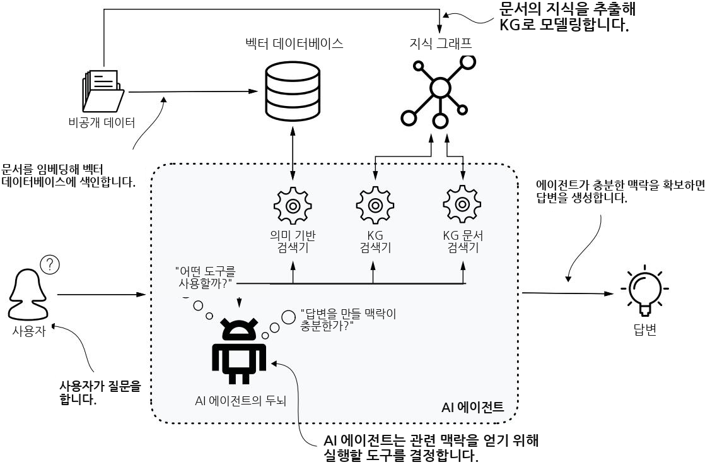
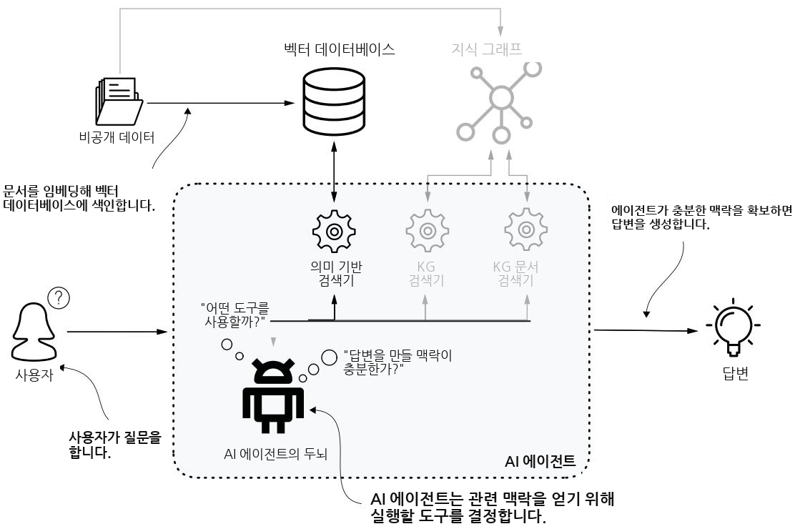
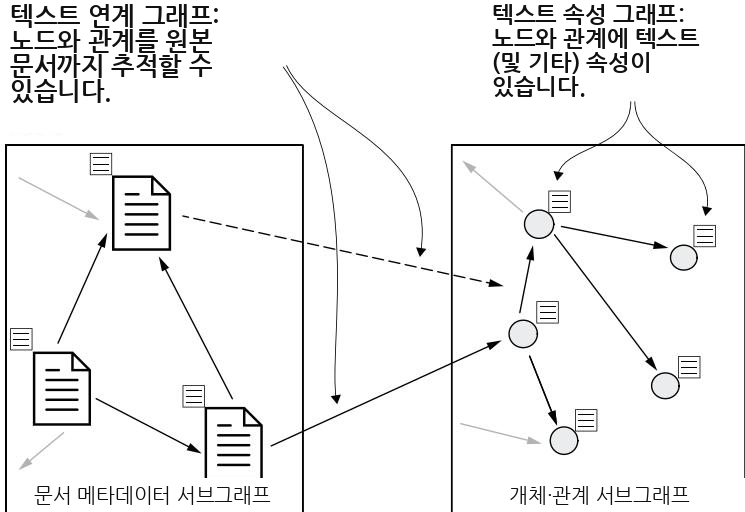
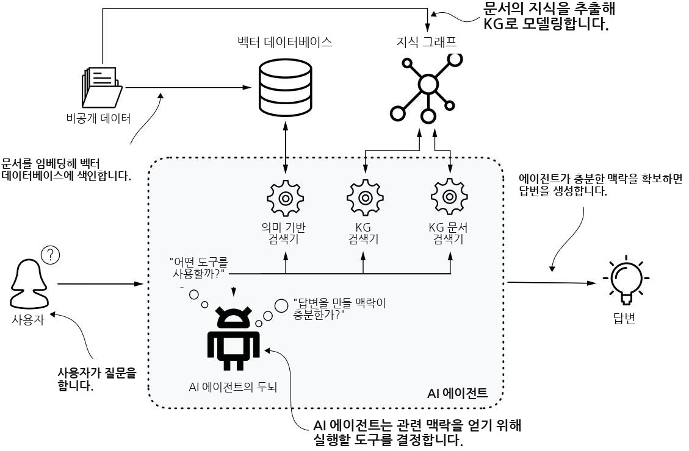
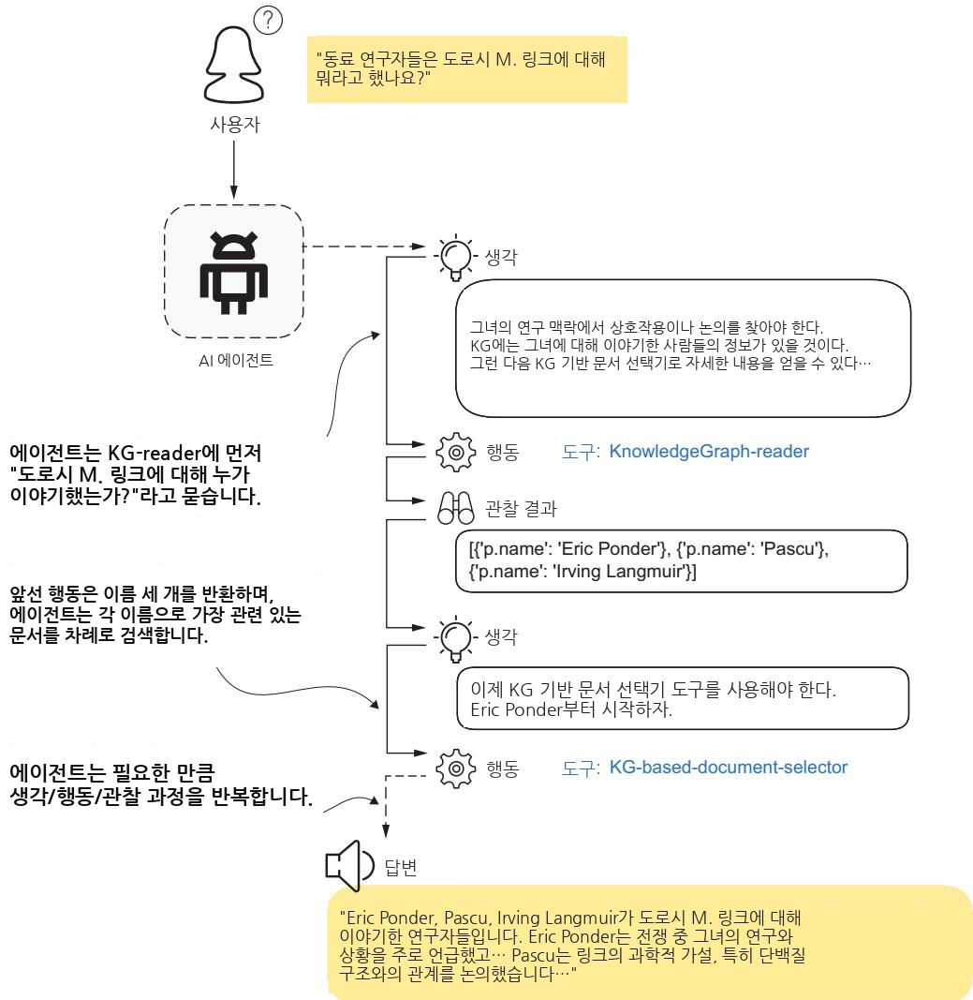

# 지식 그래프와 LLM을 활용한 정보 검색


KG와 LLM의 통합은 이 책의 마지막 부분에서 실용적 정점에 도달하며, 여기서 우리는 이러한 결합 기술을 사용하여 정확하고 신뢰할 수 있는 정보 검색을 수행하는 방법을 살펴봅니다. 우리는 KG를 실측 자료 (ground truth)로 활용하여 LLM의 역량을 향상시키는 동시에 환각 (hallucination)을 방지하는 시스템의 실제 구현에 초점을 맞춥니다.

13장에서는 검색 증강 생성 (retrieval augmented generation, RAG)을 통해 KG와 LLM을 통합하는 방법을 살펴보며, 그래프 RAG 시스템이 구조화된 데이터와 언어 이해를 활용하여 더 정확하고 투명한 응답을 제공할 수 있는 방식을 보여줍니다.

14장에서는 도메인 전문가의 추론을 모방하여 맥락을 인식하는 솔루션을 만드는 정교한 질의응답 시스템을 구축하는 방법을 설명합니다. 우리는 의도 탐지, 스키마 변환, 전문가 지식 임베딩에 대한 체계적인 접근 방식을 보여줍니다.

15장에서는 LangGraph와 Streamlit을 사용한 완전하고 작동 가능한 구현에서 이러한 모든 개념을 종합합니다. 우리는 특화된 에이전트가 질문 처리의 서로 다른 측면을 담당하면서도 시스템의 관찰 가능성과 확장성을 유지하는 모듈식 파이프라인을 구축하는 방법을 보여줍니다.

이 장들은 KG와 LLM의 강점을 결합한 운영 환경 수준의 시스템을 구현하는 데 필요한 실용적 지식을 제공하며, 신뢰할 수 있는 지식 기반 AI 솔루션을 배포하려는 조직을 위한 종합적인 안내서 역할을 합니다.

### 지식 그래프 기반 검색 증강 생성

### 이 장에서 다루는 내용


LLM을 AI 에이전트 (AI agents)로서 유용하게 만드는 방법

맥락을 사용해 LLM을 기반화하기 위해 검색 증강 생성 (retrieval augmented generation)을 사용하는 방법

지식 그래프 (KG) 기반 RAG 시스템을 구축하는 방법

2023년은 AI 격변의 해였습니다. 자연어 처리 (NLP) 분야에서 일하던 데이터 과학자와 ML 엔지니어에게 이는 단순히 새로운 장난감이 주어진 것이 아니었습니다. 그들의 업무 생활은 완전히 뒤바뀌었습니다. 2022년 말 OpenAI의 GPT-3.5 모델 출시는 변혁적 변화를 알렸습니다. 갑자기 우리는 각각의 특정 다운스트림 과제를 위해 맞춤형 학습 데이터셋과 모델을 구축하는 데 몇 달 또는 몇 년을 들일 필요가 없어졌습니다. 약간의 영리한 프롬프트 엔지니어링만으로 거의 누구나 NLP 애플리케이션을 구축할 수 있게 되었습니다.

그러나 LLM이 강력하다고는 해도 모든 문제에 대한 마법 같은 해결책과는 거리가 멉니다. 프로덕션 환경의 엔터프라이즈급 시나리오에서 LLM을 유용하게 만들기 위해서는 여전히 많은 작업이 남아 있습니다. 이러한 인식은 AI 에이전트라는 개념, 관련 구현 라이브러리, 그리고 LLM 운영 (LLMOps)으로 이어졌습니다.

이 장에서 논의할 주제는 그림 13.1의 개념적 모델에 나와 있습니다. 이 책의 2부와 3부에서는 사설 데이터를 KG로 변환하는 방법을 살펴보았으며, 이제는 이 KG를 입력으로 사용하는 챗봇을 구축하는 방법을 탐구하겠습니다.

  
그림 13.1 KG 기반 질의응답을 위한 AI 에이전트 설계. 이 에이전트는 사용자의 질문에 필요한 맥락을 제공하기 위해 벡터 데이터베이스와 KG 같은 외부 데이터 소스를 사용하는 여러 도구를 활용할 수 있습니다.

### 13.1 AI 에이전트


AI 에이전트 [1]는 현대 지능형 시스템의 역량에서 중요한 진화를 나타냅니다. 본질적으로 AI 에이전트는 환경과 상호작용하여 특정한 복잡한 작업을 수행하도록 설계된 자율적 개체입니다. 미리 정해진 명령 집합을 따르는 전통적인 소프트웨어 프로그램과 달리, AI 에이전트는 일정 수준의 자율성, 적응성, 그리고 “지능”을 보이며, 이를 통해 의사결정을 내리고, 경험으로부터 학습하며, 변화하는 조건에 실시간으로 대응할 수 있습니다.

완전히 기능하는 챗봇을 생각해 보겠습니다. 우리는 간단한 질문으로 시작할 수 있습니다. “프랑스의 수도는 어디입니까?” 현재 모델 리더보드의 상위권에 있는 거의 모든 LLM은 즉시 그리고 정확하게 “프랑스의 수도는 파리입니다”라고 답할 것입니다. 훌륭합니다! 작동합니다! 하지만 이것이 수천억 개의 파라미터를 가진 모델을 구축하고 실행하는 막대한 비용을 정당화할 만큼 만족스러운 투자 수익을 만들어낼 질문일까요? 아마 그렇지 않을 것입니다. 그러한 질문과 작업은 훨씬 더 복잡하며, 일반적으로 다음 중 적어도 하나를 필요로 합니다.

고급 다단계 추론 역량—수학 퍼즐을 푸는 것과 같은 연역 작업, 또는 중간 단계에서 제공되는 출력에 따라 원래의 실행 계획을 조정해야 하는 적응형 시스템을 생각해 보십시오.

 개념 간의 깊은 관계적 패턴에 대한 이해—특정 토론 주제의 영향력자를 식별하고자 하는 소셜 네트워크 분석, 또는 병목을 정확히 찾아내고 해결해야 하는 공급망 문제를 생각해 보십시오.

 최신의, 흔히 외부에 있으며 공개되지 않은 데이터에 대한 접근으로서, 학습 중 모델이 보지 못한 데이터—이는 종종 LLM의 지식 차단 시점 (knowledge cutoff)이라고 불립니다. 즉, 이러한 모델은 규모가 매우 커서 “내일의 일기예보는 어떻습니까?”와 같은 질문에 답할 수 있을 만큼 자주 재학습될 수 없다는 사실을 말하며, 특히 서로 다른 접근 권한을 가진 여러 페르소나를 처리해야 할 때 민감한 내부 데이터와 관련된 질문은 말할 것도 없습니다.

사용자가 기사, 블로그 게시물, 심지어 소셜 미디어 게시물을 작성하도록 돕는 콘텐츠 작성 도우미를 상상해 보십시오. 인간이라면 이 작업에 어떻게 접근할까요? 먼저 우리는 기사, 블로그 게시물, 책을 살펴보고 Wikipedia와 같은 지식 베이스 (knowledge base)에서 기본 사실을 가져와 요청된 주제를 조사할 가능성이 큽니다. 그런 다음 초안을 작성하고, 친구나 동료에게 검토를 요청한 뒤, 게시 전에 최종 개선을 수행할 것입니다. 이러한 과정은 작업을 수행하는 지능형 시스템의 설계에 반영됩니다. 이 시스템을 위해 우리는 여러 AI 에이전트를 구축할 것입니다. 즉, 연구자, 여러 작성자(작성되는 내용에 따라 달라짐), 그리고 검토자입니다. 다중 에이전트 시스템 (multiagent system)은 역할 수행 게임과 같다고 생각할 수 있으며, 여기서 서로 다른 에이전트(플레이어)는 서로 다른 전문 역할을 맡고 목표를 달성하기 위해 서로 의사소통합니다.

### 13.2 LLM과 대화하기


이제 AI 에이전트의 개념을 이해했으므로, 실제 예제를 살펴볼 차례입니다. 가능한 가장 단순한 시나리오를 생각해 보겠습니다. 사용자가 LLM과 유창하게 의사소통하는 챗봇 에이전트입니다. 사용자는 처음 질문을 한 뒤, 대화 방식으로 후속 질문을 이어갈 수 있습니다. 이러한 에이전트를 구축하려면 두 가지만 필요합니다. 사전학습된 LLM에 접근할 수 있어야 하며, 대화형 경험을 얻을 수 있도록 질문과 답변의 전체 집합을 기억하는 메모리가 필요합니다. 이러한 에이전트는 다음 목록에 있는 것처럼 단순한 클래스로 작성할 수 있습니다.

#### 목록 13.1 메모리를 갖춘 대화형 AI 에이전트


class Agent:   
def \_\_init\_\_(self, model: str = "gpt-4o-mini", system: str = None):   
self.model = model   
self.system = system 메모리로서의 인스턴스 변수:   
self.messages = list() 전체 메시지 이력을 보관합니다.   
self.client = OpenAI(api\_key=os.environ['OPENAI\_API\_KEY'])   
if self.system is None or len(self.system) == 0:   
self.system = "You are an AI assistant providing straightforward   
➥concise answers."   
self.messages.append({"role": "system", "content": self.system})   
def \_call (self, message: str) -> str: 에이전트에게 질문하면,   
self.messages.append({"role": "user", < 그 질문이 메모리에 추가됩니다.   
➥"content": message})   
answer = self.execute()   
self.messages.append({"role": "assistant",   
답변 또한 사용자에게 반환되기   
➥"content": answer})   
전에 메모리에 추가됩니다.   
return answer   
def execute(self) -> str:   
completion = self.client.chat.completions.create(   
model=self.model,   
temperature=0,   
messages=self.messages)   
return completion.choices[0].message.content   
if name == "\_\_main\_\_":   
agent = Agent() 첫 번째 질문   
q = "Who are the top influencers of cyclotron < 후속   
➥funding?" 질문; 에이전트는   
print(f"> Question: {q}\n> Answer: {agent(q)}") 이전 질문–   
답변 쌍을 알고 있습니다.   
q = "And in the context of the 1930s, related to the   
➥Rockefeller Foundation?"   
print(f"> Question: {q}\n> Answer: {agent(q)}")

에이전트는 모델 버전으로 초기화되고, 시스템 메시지는 그 범위를 규정하며, OpenAI API 키는 .env 파일을 통해 환경 변수로 제공됩니다. 인스턴스 변수 messages는 에이전트의 메모리를 나타내며 전체 메시지 이력을 보관합니다. 더 상호작용적인 경험을 얻기 위해 Jupyter에서 에이전트를 실행할 수도 있고, 이상적으로는 실제 대화에 더 가깝게 만들기 위해 UI 계층을 추가할 수도 있지만, 여기서는 단순성을 위해 표준 Python 스크립트에서 사용합니다. 우리는 초기 질문을 한 뒤 명확화를 요청하며, 출력은 다음에 제시됩니다.

#### 목록 13.2 목록 13.1의 대화 출력


> 질문: 사이클로트론 자금 지원의 주요 영향력자는 누구입니까?   
> 답변: 사이클로트론 자금 지원의 주요 영향력자는 일반적으로   
정부 기관, 연구 기관, 민간 재단, 그리고   
산업 이해관계자를 포함합니다. 주요 참여자는 다음을 포함할 수 있습니다.

1. \*\*미국 국립보건원(NIH)\*\* - 사이클로트론과 관련된 의학 연구에 상당한 자금을 제공합니다.

2. \*\*에너지부(DOE)\*\* - 핵과학 및 입자 가속기와 관련된 연구를 지원합니다.

3. \*\*미국 국립과학재단(NSF)\*\* - 사이클로트론을 사용하는 연구를 포함하여 다양한 과학   
연구 프로젝트에 자금을 지원합니다.

4. \*\*민간 재단\*\* - 웰컴 트러스트와   
게이츠 재단 같은 조직이 관련 연구에 자금을 지원할 수 있습니다.

5. \*\*대학 및 연구 기관\*\* - 사이클로트론 시설을 보유한 기관은 자금 확보를 위해 보조금과 파트너십을 모색하는 경우가 많습니다.

6. \*\*제약 회사\*\* - 제약 회사는 특히 방사성의약품 분야에서 의약품 개발을 위해 사이클로트론 기술에 투자할 수 있습니다.

이러한 기관들은 보조금, 파트너십, 공동 연구 이니셔티브를 통해 자금 지원에 영향을 미칩니다.

> 답변: 1930년대의 맥락에서 록펠러 재단은   
핵물리학 및 사이클로트론 개발의 진전을 포함하여 과학 연구에 자금을 지원하는 데   
중요한 역할을 했습니다. 이 시기에 사이클로트론 자금 지원과 관련된   
주요 영향력자는 다음을 포함했습니다.

1. \*\*존 D. 록펠러 주니어\*\* - 저명한 자선가로서, 그는   
재단을 통해 다양한 과학 이니셔티브를 지원했습니다.   
2. \*\*버니바 부시\*\* - 과학 연구에서 정부 및 민간 자금 지원을   
옹호한 영향력 있는 공학자이자 과학 행정가였습니다.   
3. \*\*어니스트 O. 로런스\*\* - 사이클로트론의 발명가로, 그의 연구는   
록펠러 재단 및 기타 기관의 지원을 받아   
입자 가속기 기술 발전에 기여했습니다.

록펠러 재단의 자금 지원은 1930년대에 사이클로트론 및 관련   
과학 분야의 발전에 기여한 연구 프로그램과   
시설을 설립하는 데 도움이 되었습니다.

첫 번째 질문에 대한 답변은 정확하지만 매우 일반적입니다. 맥락을 명확히 하는 후속 질문은 더 나은 응답을 얻습니다. 여기서 우리는 익숙한 두 이름(5장과 6장에서 구축한 지식 그래프(KG)를 떠올려 보십시오), 즉 어니스트 O. 로런스와 버니바 부시를 볼 수 있습니다. 놀랍지 않게도, 기성 모델은 생성된 답변이 기반으로 삼아야 한다고 우리가 기대하는 데이터를 보지 않는 한 구체적인 답변을 제공할 수 없습니다. 이에 대해서는 곧 더 자세히 배울 것입니다.

이런 방식으로 더 많은 복잡성을 추가하여 에이전트를 처음부터 구축할 수도 있지만, 다행히 그럴 필요는 없습니다. 현재의 AI 붐과 함께 그 주변에 전체 공학 생태계가 함께 발전했기 때문입니다.

### 13.3 프로덕션 환경의 과제


유용한 실제 에이전트를 개발하는 일은 복잡하며, LLM과 관련된 여러 과제와 우려 사항을 고려해야 합니다.

 환각 (hallucinations), 즉 “지어내기”라고도 하는 현상—LLM은 시퀀스에서 가장 가능성이 높은 다음 토큰을 예측하도록 학습되며, 이 과정은 본질적으로 그럴듯하게 들리지만 조작된 사실을 생성하기 쉽게 만듭니다. 이는 특히 학습 데이터에 포함되지 않은 주제에 대해 프롬프트가 주어질 때 두드러집니다. 지식이 없더라도 모델은 여전히 자신이 학습한 작업을 수행합니다. 즉, 수십억 개의 매개변수에 인코딩된 경험을 바탕으로 가장 가능성이 높은 출력을 생성합니다. 응답은 일관되고 완전히 설득력 있게 보이지만, 부분적으로 또는 완전히 부정확할 수 있습니다.

최신성 (freshness), 즉 “지식 마감일 (knowledge cutoff)”이라고도 하는 문제—LLM은 방대한 양의 데이터로 학습되므로 강력하지만 학습 비용이 매우 큽니다. 따라서 재학습은 1년에 한두 번만 이루어지며, 그 결과 LLM은 그리 최근이라고 할 수 없는 발전 사항에 대해서도 정확한 응답을 제공할 수 없습니다.

투명성 (transparency)—우리는 질문에 대해 일관된 답변을 얻지만, 그것이 어떻게 생성되었는지에 대한 통찰은 얻지 못합니다. 정보 출처와 신뢰성, 추론 과정, 신뢰도 수준 등은 엔터프라이즈 솔루션을 개발할 때 고려해야 할 우려 사항입니다.

데이터 프라이버시 (data privacy)—잠재적으로 개인적이고 사적인 민감 데이터를 유출하지 않으면서 모델 학습에 사용하는 것은 많은 애플리케이션에서 중요한 우려 사항입니다. 또한 많은 조직에서는 서로 다른 사람들의 그룹이 서로 다른 데이터 접근 권한을 가집니다.

비용 (cost)—현재 최고의 AI 모델을 학습, 배포, 유지하는 데에는 재정적 비용과 환경적 비용이 모두 상당히 듭니다. 대형 모델 학습에 필요한 계산 능력은 막대하며, 이는 높은 에너지 소비와 상당한 탄소 발자국으로 이어집니다. 이로 인해 이러한 모델은 주로 자금이 충분한 기업들만 접근할 수 있습니다. 더 작고 특화된 LLM의 확산이 비용을 낮추고 있기는 하지만, 여전히 중요한 고려 사항으로 남아 있습니다.

 윤리적 우려와 편향 (ethical concerns and biases)—모델은 편견이 있거나 해로운 내용을 포함할 수 있는 데이터셋으로부터 학습하기 때문에, 고정관념, 잘못된 정보, 차별적 관점을 의도치 않게 재생산하거나 증폭할 수 있으며, 이는 배포와 사회적 영향에 관해 심각한 윤리적 문제를 제기합니다.

이러한 문제를 해결하려면 단순한 “질문 입력, 응답 출력” 시나리오를 넘어설 필요가 있으며, 이는 더 높은 복잡성을 가진 에이전트를 구축해야 함을 의미합니다. 예를 들어 최신성 문제를 해결하기 위해, 우리는 대화형 에이전트가 최신 일기예보 데이터, 뉴스 기사, 또는 지식 그래프 (knowledge graph)와 같은 최신 지식 베이스의 콘텐츠를 다운로드하는 등 외부 출처에서 정보를 검색하고 사용할 수 있게 해 주는 도구를 갖추기를 원합니다. 이것이 이 장의 나머지 부분에서 다룰 주제입니다.

### 13.4 비공개 데이터에 관해 AI와 대화하기


LLM 모델은 전문 도메인에 대한 지식이 제한적입니다. 이러한 경우, 우리는 LLM의 뛰어난 언어 이해 능력과 일반 지식을 보존하면서도, LLM을 우리의 도메인과 우리의 비공개(대개 민감하거나 기밀인) 데이터에 대한 전문가로 만들 방법이 필요합니다.

5장과 6장에서 논의한 록펠러 아카이브 센터(Rockefeller Archive Center) 사용 사례를 생각해 보겠습니다. 우리는 1930년대 록펠러 재단(Rockefeller Foundation)에서 이루어진 연구비 수여 과정을 추적하는 지식 그래프를 구축했습니다. 이 지식 그래프는 연구비 금액, 연구 주제, 대학, 연구자와 같은 관련 정보와 함께, 연구비 승인 전에 재단 대표자와 연구비 신청자 사이에서 이루어진 이면의 대화(즉, 누가 누구와 무엇에 대해 이야기했는지)를 포함하여 수여된 연구비를 포착합니다. 따라서 우리는 지금까지 전체가 공개된 적 없는 독점 데이터로부터 구축된 영향력 네트워크 (influence network)를 보유하게 되었으며, 이를 통해 “사이클로트론 연구 자금 지원에 영향을 미친 사람들은 누구였는가?”와 같은 질문에 정확히 답할 수 있습니다.

5장과 6장에서 우리는 잘 조정된 그래프 시각화와 대시보드를 통해 이러한 사용 사례를 위한 전통적인 지식 그래프 기반 시스템을 설계하는 방법을 살펴보았습니다. 이제 흥미로운 질문은, 사용자가 Cypher 쿼리 언어를 구사하거나, 차트와 표를 읽고 해석하거나, 그래프 데이터 구조를 조작하고 탐색할 필요 없이, 다양한 사용자에게 동일한 가치를 제공하는 AI 인터페이스를 개발할 수 있는가 하는 것입니다. 이는 검색 증강 생성 (retrieval-augmented generation, RAG)이라는 과정에서 사전학습된 LLM과 여러 맥락 검색 도구를 사용하는 AI 에이전트의 역할입니다.

#### 13.4.1 검색 증강 생성


RAG [2]는 앞서 언급한 한계(환각, 최신성, 투명성, 데이터 프라이버시)를 포함하여 사전학습된 생성 모델의 한계를 해결하기 위해 개발된 기법입니다. 이는 사전학습된 LLM의 지식 및 언어 이해 능력을, 구조화된 데이터베이스나 비구조화 데이터셋(텍스트, 이미지)과 같은 외부 데이터 소스에서 검색한 질문 관련 추가 맥락과 결합합니다.

실제로 RAG 에이전트는 LLM, 에이전트의 단계를 안내하는 프롬프트, 그리고 하나 이상의 도구의 조합으로 코딩되며, 이 도구들은 본질적으로 질문과 관련된 외부 정보를 검색하는 함수입니다. 그런 다음 사용자 질문과 제공된 외부 정보를 맥락으로 결합하여 모델이 답변을 생성하도록 요청합니다. 내일의 일기예보를 묻는 상황을 생각해 보십시오. 기성 모델은 날씨 예보 API를 조회하는 도구를 호출하도록 허용하지 않는 한 이 질문에 답할 수 없습니다. 이 시점에서 AI는 자신의 언어 이해 능력을 외부의 정확하고 최신인 정보와 결합하여 정확한 답변을 생성할 수 있습니다.

이러한 의미에서 RAG는 근거 부여 기법 (grounding technique)입니다. 모델이 제멋대로 생성하도록 두는 대신(환각), 답변 생성의 범위를 제공된 맥락으로 제한함으로써 모델이 사실이 아닌 내용을 만들어낼 가능성을 크게 줄입니다.

참고 이러한 모델이 확률적이라는 사실을 완전히 우회할 수는 없습니다. 이 모델들은 시퀀스에서 가장 가능성 높은 다음 토큰을 예측하도록 학습되므로, RAG와 같은 기법을 사용하더라도 여전히 잘못된 방향으로 벗어날 수 있습니다. 이는 지능형 시스템을 설계할 때 염두에 두어야 할 중요한 사항입니다. 시스템은 인간을 대체하기보다 인간의 능력을 증강해야 합니다. 우리는 피드백 검증 또는 감독 메커니즘을 통해 인간을 루프 안에 유지하는 것이 우리가 구축하는 모든 제품에 필수적이라고 믿습니다.

예를 살펴보겠습니다. RAG 초기에는 그림 13.2에 나타난 것처럼 맥락이 거의 전적으로 텍스트 문서 데이터베이스에서 나왔습니다. 문서는 더 작은 부분(예: 문단)으로 청크 분할 (chunking)되고, 그 의미론을 포착하는 임베딩이라는 고정 길이 벡터로 매핑되었습니다. 그런 다음 임베딩은 벡터 데이터베이스에 저장되고 인덱싱되었습니다. 록펠러 아카이브 센터 사용 사례를 위해 임베딩을 생성하고 저장하는 과정은 다음 목록에 나와 있습니다.

  
그림 13.2 벡터 검색 기반 검색 증강 생성. 문서는 밀집 벡터 표현으로 임베딩되어 벡터 데이터베이스에 인덱싱됩니다. 사용자가 질문하면 그 질문도 임베딩되며, 데이터베이스에서 가장 유사한 문서들이 검색됩니다. 그런 다음 에이전트가 최종 답변을 생성합니다.

#### 목록 13.3 문서를 임베딩으로 변환하기


```python
import os
from langchain_community.vectorstores import Neo4jVector
from langchain_openai import OpenAIEmbeddings
from dotenv import load_dotenv
= load_dotenv() Creates embeddings
and a vector index
using specified
if name == " _main _": nodes, properties,
vector_index = Neo4jVector.from_existing_graph( ≤ and an AI model
embedding=OpenAIEmbeddings(),
url=os.environ['NEO4J_URL'],
username=os.environ['NEO4J_USER'],
password=os.environ['NEO4J_PWD'],
database=os.environ['NEO4J_DB'],
```

```python
index_name='embeddings',
node_label="Page",
text_node_properties=['text'],
embedding_node_property='embedding
Semantic similarity
search: returns the
q = "What is known about cyclotron research?" top two documents
resp = vector_index.similarity_search_with_score(q, < for a given question
➥k=2)
for r in resp:
print(f"------\nScore: {r[1]}")
print(r[0].page_content)
```

여기서는 다양한 모델, 데이터베이스, 정보 검색 도구 등을 지원하여 AI 기반 시스템을 구축할 수 있게 해주는 LangChain 라이브러리를 사용합니다. 이 코드는 Page 노드에서 텍스트를 검색하고, 지정된 임베딩 모델을 사용하여 이를 벡터화한 뒤, 벡터를 Neo4j DB에 다시 저장합니다. 질문이 주어지면 동일한 모델을 사용하여 질문을 임베딩하고, 가장 유사한 텍스트 청크를 검색합니다. 축약된 출력은 다음과 같습니다.

#### 목록 13.4 질문과 가장 유사한 상위 두 텍스트 청크


점수: 0.9180829524993896   
텍스트: 1939년 1월 31일 화요일(계속)   
대형 사이클로트론의 재생산 비용은 자석에 약 \$30,000,   
전원 공급 장치에 \$15,000, 그리고 사이클로트론 챔버,   
부속품, 제어 장치 등에 \$30,000가 들 것입니다. 로런스는 이미   
다음 단계를 생각하고 있습니다. 그는 현재의 “대형” 기계가   
여러 다른 장소에서 복제될 것이라고 믿습니다. 그러나 그것이 완전히 성공한다면 그는 계속해서   
1억 볼트 기계를 만들고자 합니다.   
점수: 0.9157187938690186   
텍스트: 매사추세츠 물리학 연구소의 R. J. 밴 더 그래프 박사. 밴 더   
그래프는 WW에게 지금까지 자신의 과학 경력 전체의 역사와 철학을   
이야기합니다. 물리적 우주가 입자들로 구성되어 있으므로, G.는   
입자를 연구하기로 결정했습니다.   
그는 사이클로트론 개발과 관련하여 전적으로 겸손하고 전적으로 관대하게   
말하지만, 자신의 유형의 발전기가 상대적 이점을 제공할 가능성이 있다고   
생각하는 경향이 있습니다 ..

첫 번째 문서는 질문과 매우 관련성이 높습니다. 두 번째로 높은 순위의 문서도 사이클로트론을 언급하지만, 밴 더 그래프가 자신의 (현재는 유명한) 발전기를 옹호하는 판촉 발언과 유사합니다.

#### 13.4.2 벡터 기반 RAG의 한계


우리는 벡터 검색 기반 RAG 에이전트를 사용하여, 즉시 사용할 수 있는 사전학습 LLM을 비공개 데이터에 관한 질문에 답할 수 있는 유용한 대화형 어시스턴트로 변환하는 방법을 살펴보았습니다. 다음 단계는 무엇입니까? 이것이 우리가 할 수 있는 최선입니까?

벡터 검색 형태의 RAG는 유용하지만, 몇 가지 과제와 한계가 있습니다.

 맥락 단편화로 인한 제한된 추론—일치하는 문서 청크 목록을 제공함으로써, 우리는 이 과정에서 문서들을 독립적으로 다루려는 경향을 암묵적으로 인코딩하게 됩니다. 따라서 문서들 사이의 더 복잡한 다중 홉 (multihop) 관계뿐만 아니라 그 문서들에 언급된 개체들 사이의 관계를 놓칠 가능성이 있습니다. 이는 또한 우리의 청킹 (chunking) 전략의 한계를 드러냅니다. 필요한 정보가 이전 청크에서 시작되어 현재 청크로 이어진다면 어떻게 됩니까? 두 청크가 모두 올바른 순서로 검색되고 높은 순위에 배치될까요? 단순한 청킹은 아마도 잘 작동하지 않을 것입니다. 적어도 일부 문제를 완화하기 위해서는 그 설계에 훨씬 더 많은 고민을 기울여야 합니다.

확장성—이 접근법은 더 큰 코퍼스 (corpora)에서 계산 비용이 많이 들며, 종종 더 효율적이지만 정확도는 낮은 근사 검색 알고리즘을 사용하도록 만듭니다.

임베딩의 한계—문서의 의미를 하나의 조밀 벡터 (dense vector)로 인코딩하려는 시도는 과도한 단순화를 초래합니다. 즉, 중요한 세밀한 의미와 도메인별 뉘앙스를 포착하지 못합니다. 또 다른 한계는 임베딩 모델의 학습 데이터셋에 희소성 (sparsity)이 존재할 가능성입니다. 즉, 특정 용어가 과소대표될 수 있습니다. 이는 부정확한 임베딩 표현과 낮은 검색 정확도로 이어집니다. 마지막으로, 정적 벡터, 즉 사전 계산된 벡터에 의존하면 RAG가 새롭거나 변화하는 지식과 명명법에 덜 적응적으로 됩니다.

 검색에서의 잡음—벡터 검색은 느슨하게 관련되었거나 완전히 무관한 문서를 반환할 수 있으며, 이는 주의 분산 [3]으로 이어집니다. 특히 더 긴 맥락에서 잡음이 너무 많으면 모델을 혼란스럽게 하고 출력 품질 저하를 초래할 수 있습니다. 핵심은 가능한 한 관련 정보의 밀도가 높은 맥락을 제공하는 것입니다.

검색 누락—임베딩의 한계와 근사 벡터 유사도 검색의 사용이 잡음을 초래할 수 있는 것과 마찬가지로, 그 반대도 발생할 수 있습니다. 즉, 가장 관련성 높은 문서를 포함하지 못하는 것입니다. 그리고 모든 사실을 제공하지 않으면, AI 모델이 아무리 뛰어나더라도 완전히 올바른 답을 얻을 수 없습니다. 누락은 “이 데이터셋의 핵심 연구 주제는 무엇입니까?”와 같은 질문에서도 발생할 수 있습니다. 벡터 유사도 검색은 기대되는 답을 생성하는 데 필요한 포괄적인 데이터를 제공하기보다는, 질문과 의미적으로 가장 유사한 청크를 반환하기 때문에 답은 오해의 소지가 있을 것입니다.

이러한 한계를 예로 설명해 보겠습니다. 우리의 질문이 “로리첸은 사이클로트론 연구와 어떤 관련이 있는가?”라고 가정해 보겠습니다. 직관적으로 우리는 가장 유사한 문서들이 최소한 로리첸의 이름을 언급할 것이라고 예상합니다. 그러나 이는 틀렸습니다. 임베딩 (embedding)은 그런 방식으로 작동하지 않습니다. 임베딩은 텍스트의 전반적 의미를 인코딩하고 이를 압축된 요약으로 표현합니다. 가장 유사한 문서가 우리가 질문한 엔터티 (entity)를 실제로 언급하리라는 보장조차 할 수 없습니다! 질문과 문서의 의미론적 유사도 (semantic similarity)는 또 다른 언어적 의미나 패턴을 포착할 수 있습니다. 실제로 이 질문을 임베딩하고 코사인 유사도 (cosine similarity)를 기준으로 가장 유사한 세 문서를 찾으면, 문서 중 하나만 “Lauritsen”(및 “cyclotron”)을 포함하고, 나머지 두 문서는 “cyclotron”만 언급하므로 질문과 관련이 없습니다. 그럼에도 이 두 문서는 첫 번째 문서와 거의 같은 유사도 점수를 갖습니다. 표 13.1은 상위 세 문서의 개요를 제공합니다.

표 13.1 “로리첸은 사이클로트론 연구와 어떤 관련이 있는가?”라는 질문과 가장 유사한 상위 세 문서 및 이들이 “Lauritsen”과 “cyclotron”을 언급하는지 여부의 표시
<table><tr><td>문서</td><td>코사인 유사도</td><td>로리첸</td><td>사이클로트론</td></tr><tr><td>1939년 1월 3일 화요일. 퍼듀 대학교의 칼 라크-호로비츠 교수. 퍼듀의 밴 더 그래프 장치는 두세 달 만에 제작되었으며 현재 작동 중으로, 850킬로볼트에서 600마이크로암페어를 생성하고 있다. 따라서 중성자 발생기로서 이는 몇 파운드의 라듐에 해당한다. 퍼듀 그룹은 ...&quot;</td><td>0.906</td><td>참</td><td>참 참</td></tr><tr><td>1939년 5월 2일 화요일. 제너럴 일렉트릭 회사의 어빙 랭뮤어 박사. L.은 도로시 린치 박사에 대한 지속적 지원을 매우 강력하게 지지한다. 그는 이를 주로 두 가지 고려 사항에 근거한다. 첫째, W.가 과학적 행동이 항상 마땅한 수준은 아닌 까다로운 인물이라는 사실을 충분히 인정하면서도, L.은 W.가 자극을 주는 데 기여했다는 점이 의심할 여지 없이 사실이라고 본다 ...&quot;</td><td>0.903</td><td>거짓</td><td></td></tr><tr><td>도로시 M. 린치 박사, 1939년 4월 3일(계속). X선 구조 문제와 관련하여 랭뮤어는 클로스에게서 약간의 돈을 얻었고, W.는 이를 계산에 사용했다. 그녀는 외부에서 자금을 받았어야 했는지 확신하지 못하지만, WW는 그녀에게 다음과 같이 보장한다 ...&quot;</td><td>0.902</td><td>거짓</td><td>참</td></tr></table>

이러한 한계를 어떻게 극복할 수 있을까요? 이 책의 독자들에게 우리의 답은 놀랍지 않을 것입니다. 지식 그래프(KG)를 논의에 도입하는 것입니다. RAG에 대한 그래프 기반 접근 방식은 일반적으로 그래프 RAG (Graph RAG)라고 불립니다. 이 접근 방식은 벡터 기반 RAG와 관련된 문제를 완화하거나 심지어 완전히 해결하는 것 외에도 추가적인 이점을 지닙니다. KG는 중앙 지식 저장소로 작동하여, 원시 텍스트뿐 아니라 다양한 문서 메타데이터와 신뢰도 높은 구조화 데이터 소스(표, CSV, 온톨로지 등)도 통합하며, 이들이 함께 더 넓은 범위의 사용 사례를 가능하게 합니다. KG는 지식을 사람이 접근할 수 있는 형식으로 표현하기 때문에 최신 상태로 유지하기 쉽습니다. 또한 도메인 전문가는 기존 지식을 검증하거나 새로운 지식을 입력할 수 있으며, 이를 통해 AI 시스템의 출력 품질에 직접 영향을 미칩니다. 이렇게 높아진 투명성은 사용자 신뢰를 더욱 증대시킵니다.

#### 13.4.3 그래프 RAG (Graph RAG)


KG와 LLM 간의 시너지 개발은 빠르게 진행되고 있습니다 [4]. Rockefeller Archive Center KG는 LLM으로 증강된 KG의 좋은 예입니다. 우리는 OpenAI의 ChatGPT 모델 위에서 프롬프트 엔지니어링을 사용하여 이를 구축했으며, 이 모델은 엔터티와 관계를 추출하고 모델의 내부 지식을 사용하여 식별된 정보를 보완하기도 했습니다. 그 결과로 생성된 KG는 텍스트 속성 그래프 (text-attributed graph)와 텍스트 쌍 그래프 (text-paired graph)의 조합입니다 [5](그림 13.3 참조).

  
그림 13.3 Rockefeller Archive Center KG는 텍스트 속성 그래프와 텍스트 쌍 그래프를 결합합니다. 문서는 노드로 표현되며, 각 노드는 저자, 문서 유형, 날짜와 같은 메타데이터를 나타내는 속성을 가집니다. 추출된 엔터티와 관계는 원본 문서까지 추적할 수 있으며, 이를 통해 우리는 AI 에이전트를 위한 KG 기반 문서 선택 도구를 설계할 수 있습니다.

텍스트 속성 그래프는 텍스트 속성을 가진 노드와 관계로 이루어진 그래프이며, 텍스트 쌍 그래프는 노드, 관계, 그래프가 그 후손인 문서와 연결된 그래프입니다. 예시 KG의 설계는 데이터 및 지식 모델링의 여러 측면을 활용하는 그래프 RAG 시스템을 구현할 수 있게 합니다.

메타데이터—문서에는 일반적으로 발행일, 유형, 출처, 저자 등과 같은 관련 메타데이터가 있습니다. 이 모든 정보는 KG에서 속성과 관계로 제공되며, 콘텐츠에 더해 맥락 검색 시스템을 설계하는 데 사용될 수 있습니다. 예를 들어 문서 그래프에서 커뮤니티를 식별할 수 있으며, 각 커뮤니티는 요약이나 가장 최근 문서(예: 법률 또는 규정의 최신 버전)로 표현될 수 있습니다.

 KG 검색기—KG는 훌륭한 맥락 자원입니다. 노드와 유형화된 관계는 LLM이 응답을 생성하는 데 사용할 수 있는 압축되고 정확하며 최신의 정보를 제공합니다. 모델은 사용자의 질문과 KG의 스키마를 받아 필요한 정보를 검색하기 위한 Cypher 쿼리를 생성할 수 있습니다. KG 검색기 도구는 사용자가 질문하는 엔터티를 입력으로 받아 이들을 연결하는 부분 그래프(예: 모든 최단 경로를 통해)를 반환할 수도 있으며, 데이터 중 어떤 부분이 관련 있다고 판단되는지는 최종 LLM이 사용하도록 남겨둘 수 있습니다.

KG 강화 문서 검색기—우리의 KG가 텍스트 쌍 그래프라면, 이를 문서 검색기로 사용할 수 있으며, 이는 벡터 검색 기반 문서 검색기보다 더 정확합니다. 예를 들어 사용자가 질문한 모든 엔터티를 언급하는 문서만 검색하는 데 이를 사용할 수 있으며, 앞서 논의한 벡터 검색 실패 중 하나를 제거할 수 있습니다. 또는 KG가 제공할 수 있는 것보다 관계에 대해 더 상세한 정보가 필요하다면, 이 관계를 언급하는 문서만 검색하여 주의 분산 현상 (distraction phenomenon)을 피할 수 있습니다.

 결합 검색—때로는 질문이 여러 데이터 소스에 걸쳐 있습니다. 이러한 경우, 질문을 두 부분으로 나누는 AI 에이전트를 설계할 수 있습니다. 하나는 KG 정보를 검색하는 부분(KG 검색기)이고, 다른 하나는 이 정보를 사용하여 가장 관련성 높은 문서를 찾는 부분입니다. 최종 답변이 생성되기 전에 두 맥락이 병합됩니다. 예를 들어, 다음 질문을 생각해 보겠습니다. “범죄 조직 $\mathbf{X}?^{\mathfrak{n}}$의 수장의 올해 거래 내역은 무엇인가?” 금융 문서에 그 사람의 직함으로 “X의 수장”이 포함되어 있을 가능성은 낮으므로, 법 집행 기관이 구축한 KG에서 그 이름을 추출한 다음 이를 사용하여 금융 문서 데이터베이스를 검색해야 합니다.

이제 Graph RAG가 무엇인지 이해했으므로, Rockefeller Archive Center KG 위에 간단한 에이전트를 구현해 보겠습니다(그림 13.4 참조). 우리의 Graph RAG 에이전트는 세 가지 도구를 사용할 수 있습니다. KG 검색기, KG 강화 문서 검색기, 그리고 다른 도구들이 유용한 맥락을 반환하지 못할 경우를 대비한 백업으로서 의미 검색기(벡터 검색 도구)입니다.

  
그림 13.4 외부 데이터 소스인 KG와 벡터 데이터베이스에 기반을 둔 KG 기반 RAG 에이전트

전체 코드는 이 책의 GitHub 저장소에서 확인할 수 있습니다. 여기서는 두 엔티티 간의 특정 관계가 논의되는 문서를 식별하는 사용 사례를 위해 매개변수화된 도구로 구현된 KG 강화 문서 검색기에 초점을 맞추겠습니다. 이를 통해 “인물 X는 인물 Y에 대해 무엇이라고 말했는가?”와 같은 질문에 답할 수 있습니다.

#### 목록 13.5 Graph RAG 에이전트를 위한 KG 강화 문서 검색기 도구


```python
from pydantic import BaseModel, Field
from langchain_community.graphs import Neo4jGraph
RE_SELECTOR_QUERY = """MATCH (p:Page)- <
Precanned document
➥[:MENTIONS_ENTITY]->(m1:Ent... selection query
WHERE e1.name = "{e1}" ...
RETURN DISTINCT p.id AS id, p.text AS text
"""
Initializes the Neo4j
graph = Neo4jGraph( < database connection
url=os.environ['NEO4J_URL'],
username=os.environ['NEO4J_USER'],
password=os.environ['NEO4J_PWD'],
database=os.environ['NEO4J_DB']
)
Definition of the input schema
(function arguments) of the new tool
class REDiarySelectorInput(BaseModel): <
entity_source: str = Field(description="Source entity of the
➥relationship as mentioned in the question.")
entity_source_class: str = Field(description=
"Class of the source entity of the relationship. "
"Available option is only one, 'Person'.")
entity_target: str = Field(description="Target entity of the
➥relationship as mentioned in the question.")
entity_target_class: str = Field(description=
"Class of the target entity of the relationship. "
"Available options are Person, Organization, Occupation and Title.")
relationship: str = Field(description=
"Relationship class between source and target entity. "
"Available options: TALKED_ABOUT, TALKED_WITH, WORKS_WITH, WORKS_ON,
➥HAS_TITLE")
def kg_doc_selector(entity_source: str, entity_source_class: str,
➥entity_target: str, entity_target_class: str, relationship: str) ->
➥List[AnyStr]: < KG-enhanced document
query = RE_SELECTOR_QUERY.format(e1=entity_source, retriever function
e1_class=entity_source_class,
e2=entity_target, e2_class=entity_target_class,
rel_class=relationship)
print(f"kg_doc_selector's query:\n{query}\n")
```

```python
try:
res = graph.query(query)
print(f"kg_doc_selector found {len(res)} matching documents")
except Exception as e:
print(f"Cypher execution exception: {e}")
return []
return [x['text'] for x in res[:3]]
```

이 도구는 질문에 언급된 두 엔티티, 그 클래스(예: Person), 그리고 관계 유형을 입력으로 받습니다. 이들은 사용자의 질문에 기반하여 AI 에이전트가 제공합니다. 주요 선택자 함수는 이를 사용하여 미리 준비된 Cypher 쿼리를 완성하고, 이 쿼리는 Neo4j 데이터베이스에 대해 실행되며, 문서가 에이전트에 반환됩니다.

참고: 문서 검색기 Cypher 쿼리가 질문에 기반하여 자동으로 생성되는 보다 일반적인 도구를 설계할 수도 있습니다. 그러나 그렇게 하면 Cypher 쿼리가 복잡할 때 또 다른 실패 지점이 생길 수 있습니다. 그렇기 때문에 프로덕션 환경의 수많은 Graph RAG 시스템에는 다양한 KG 관련 도구가 포함되어 있으며, 그중 많은 도구는 자주 반복되는 유형의 질문을 위한 미리 준비된 Cypher 쿼리에 기반합니다.

#### 13.4.4 추론 에이전트


이제 모든 것을 하나의 에이전트로 통합할 때입니다. LangChain 라이브러리는 이를 매우 쉽게 만들어 주는 몇 가지 사전 구성된 에이전트를 제공합니다. 우리에게는 명확한 실행 순서가 없는 여러 도구가 있으므로, 복잡한 환경에서 문제 해결을 개선하기 위해 추론과 행동 능력을 통합하는 ReAct (Reason and Act) 에이전트 [6]를 사용합니다. ReAct 프레임워크는 동적인 피드백 루프에서 수행할 작업에 대해 반복적으로 추론하고, 행동하며, 결과를 관찰하고, 실시간 결과를 바탕으로 접근 방식을 정교화합니다.

에이전트는 우리가 제공한 도구들의 제약 안에서 원래 질문을 받아 다음 작업(실행할 도구)을 계획하고, 이를 실행하며, 그 결과에 대해 추론합니다. 얻은 정보가 만족스럽지 않으면 다른 도구를 사용하여 행동합니다. 원래 질문에 답하기에 충분하다고 판단되는 맥락 정보를 얻으면 루프를 종료합니다. 다음의 축약된 코드는 이러한 에이전트를 정의합니다.

#### 목록 13.6 Graph RAG 접근법을 구현하는 ReAct 에이전트


```python
from langchain.tools import StructuredTool
from langchain.agents import create_structured_chat_agent, AgentExecutor
from langchain_openai import ChatOpenAI
from tools import REDiarySelectorTool, kg_doc_selector, REDiarySelectorInput
from definitions import KG_SCHEMA
```

모든 도구를 수집함   
tools = [ ≤ 정의들을 하나의 목록에 모음   
StructuredTool.from\_function(   
func=kg\_doc\_selector,   
name="KG-based-document-selector",   
args\_schema=REDiarySelectorInput,

description=f"질문이 두 엔터티 간 상호작용에 관한 상세 정보를 요청할 때 문서(일기 <   
벡터 검색 기반 ➥항목) 검색에 사용합니다 ... 전체 KG   
도구(백업) ➥스키마:\n{KG\_SCHEMA}"   
KG를 포함하는   
도구 설명   
<KG RETRIEVER>, < KG 검색기 구조화 도구 스키마로,   
> <VECTOR SEARCH> 원문이 필요하지 않은 질문에 대해 에이전트가 어떤 도구를 사용할지 결정할 수 있게 함   
]   
llm = ChatOpenAI(model=“gpt-4o-mini”, temperature=0)   
prompt = hub.pull("hwchase17/structured-chat-agent")   
agent = create\_structured\_chat\_agent(llm, tools, prompt) <   
agent\_executor = AgentExecutor(agent=agent, tools=tools, max\_iterations=5,   
➥return\_intermediate\_steps=True, verbose=True)   
에이전트와 그 실행기를 정의함   
question = "August Krogh는 Lawrence Irving에 대해 무엇이라고 말했습니까?"   
모델, 에이전트의   
프롬프트, 도구를   
함께 바인딩함   
response = agent\_executor.invoke({"input": question})

구조화된 ReAct 에이전트는 도구에 여러 입력 매개변수를 전달하는 것을 지원합니다. 도구에는 모델이 어떤 상황에서 어떤 도구를 호출해야 하는지 판단하는 데 도움이 되도록 적절하게 선택된 이름과 설명이 있습니다. 에이전트를 설계할 때 이러한 설명에 주의를 기울이십시오. 이를 잘 작성하면 시스템의 안정성과 예측 가능성을 크게 향상시킬 수 있습니다. 시스템이 기대만큼 일관되게 동작하지 않는다면 LangChain의 여러 에이전트와 도구에서 제공하는 기본 프롬프트를 덮어쓰는 것을 주저하지 마십시오. 동일한 설정과 입력 질문을 사용하더라도 항상 반복해서 테스트하고, 테스트하고, 또 테스트하십시오. 이 과정은 애플리케이션을 개선하는 방법에 관한 통찰을 드러낼 수 있습니다.

이 예시는 KG 기반 Graph RAG 시스템을 구축하는 방법을 보여 주는 하나의 설명일 뿐이며, 이것이 프로덕션 준비가 완료된 시스템이라고 제안하는 것은 아닙니다. 벡터 검색 도구를 위한 문서 재순위화 (re-ranking) 전략을 개발하거나, KG 검색기에 Cypher 자기 수정 (self-correction) 루프를 추가하거나, 다른 전형적인 사용자 질문을 지원하는 도구를 통합하는 등 여러 개선을 할 수 있습니다. 자세한 내용은 [7]을 참조하십시오.

#### 13.4.5 우리의 KG와 대화해 봅시다

이제 우리의 Graph RAG 에이전트가 준비되었으므로, 이를 시험해 봅시다. 여러분이 수학자이자 생화학 이론가인 도로시 M. 린치(Dorothy M. Wrinch, 1894–1976)에 대한 정보를 얻기 위해 록펠러 아카이브 센터(Rockefeller Archive Center)를 방문한 연구자라고 상상해 보십시오. 그녀의 업적은 상당히 잘 알려져 있지만, 여러분은 그녀가 당대 동료들에게 어떻게 인식되었는지 알고 싶습니다. KG에서 그녀를 찾아 들어오는 TALKED\_ABOUT 관계를 살펴보고, 그것들이 추출된 문서를 찾을 때까지 깊이 들어가 해당 문서를 읽을 수 있습니다. 또는 새로운 에이전트를 사용할 수도 있습니다. 그림 13.5는 에이전트에게 “동료 연구자들은 도로시 M. 린치에 대해 무엇이라고 말했는가?”라고 물었을 때 어떤 일이 일어나는지를 보여줍니다.

참고 직접 시도할 때는 사용하는 OpenAI의 GPT 모델 버전이나 다른 모델 제공자에 따라 다른 출력이 나타날 수 있습니다.

  
그림 13.5 우리의 Graph RAG 에이전트의 내부 단계 예시. 에이전트는 먼저 도로시 M. 린치에 대해 이야기한 사람들의 목록을 얻기 위해 KG 검색기를 사용하도록 이끄는 사고로 시작합니다. 그들 각각에 대해, 에이전트는 관련 문서를 식별하기 위해 KG 강화 문서 검색기를 사용합니다. 마지막으로 에이전트는 이 모든 것을 최종 답변 생성을 위한 맥락으로 사용합니다.

에이전트는 자신이 사용할 수 있는 모든 도구를 고려합니다. 에이전트는 가장 좋은 행동 방침이 먼저 KG에서 린치에 대해 이야기한 사람들의 목록을 검색한 다음, 무슨 말이 오갔는지에 대한 세부 정보를 제공하는 관련 문서를 얻기 위해 특화된 KG 강화 문서 검색기를 사용하는 것임을 올바르게 파악합니다. 에이전트는 총 네 번의 Thought/Action/Observation 단계를 거칩니다. 검색된 모든 맥락을 바탕으로 생성된 최종 답변은 흠잡을 데 없습니다. 요점을 곧바로 짚고 사실적이며, 제공된 비공개 문서에 명확히 근거하고 있습니다.

표 13.2는 두 가지 질문을 더 보여줍니다. 첫 번째는 도로시 M. 린치에 관한 질문의 변형이지만, 이번에는 두 특정 인물에 대해 묻고 있으므로 에이전트가 KG 강화 문서 검색기 도구를 직접 사용할 수 있습니다. 동일한 질문을 기본 LLM에 했다면, “아우구스트 크로그가 로런스 어빙에 대해 무엇이라고 말했는지에 관한 구체적인 정보는 없습니다”와 같은 답변을 얻거나 LLM이 답변을 환각했을 것입니다. 그러나 우리의 Graph RAG 시스템을 사용하면 이들의 관계에 대한 정확한 통찰을 얻을 수 있습니다.

표 13.2 Graph RAG 질의응답 예시
<table><tr><td>질문</td><td>Graph RAG 답변</td></tr><tr><td>August Krogh는 Lawrence Irving에 대해 무엇이라고 말했습니까?&quot;</td><td>August Krogh는 노르웨이에서 심해 잠수 동물의 호흡 생리학에 관한 Scholander의 연구에 대해 열정적으로 이야기했으며, Scholander와 Lawrence Irving이 함께 만나도록 하는 것이 중요하다고 표현했습니다. Krogh는 Irving이 탁월한 연구를 수행했으며, 노르웨이에서는 이용할 수 없는 시설을 미국에서 Scholander에게 제공할 수 있다고 언급했습니다. 그들은 메인주 Boothbay Harbor에서 연구할 가능성과, 잠재적으로 플로리다의 수족관에 있는</td></tr><tr><td>&quot;Harvard University와 Johns Hopkins University 사이에 공유되는 연구 주제가 있습니까?&quot;</td><td>돌고래를 대상으로 연구할 가능성을 탐색했습니다.&quot; Harvard University와 Johns Hopkins University 사이에 공유되는 연구 주제는 천문학과 기후학입니다.&quot;</td></tr></table>

구조화된 KG 콘텐츠는 두 번째 질문에 답하기에 충분합니다. KG 검색기 도구는 올바른 Cypher 쿼리 (다소 투박하지만 올바른 쿼리)를 생성하므로, 답변은 명확하고 정확합니다. 반대로, 이 질문에 순수하게 벡터 검색만을 기반으로 답하고자 한다면, 대규모 문서 집합을 컨텍스트로 제공하고 그것들이 완전한 답을 포함하고 있기를 기대해야 합니다. 이는 이 질문이 여러 문서에 걸쳐 있는 집계 질문 (aggregate question)의 예이기 때문입니다. 일부 일기 항목은 Harvard 사람들의 연구를 논의하고, 다른 항목은 Johns Hopkins의 주제를 설명하지만, Harvard와 Johns Hopkins의 공통점을 직접적으로 논의하는 항목은 없습니다. KG는 여러 문서에 걸쳐 점들을 연결하는 데 뛰어나며, 부수적인 이점으로 산만 현상 (distraction phenomenon)과 환각의 위험을 줄여 예측을 더 빠르고 저렴하게 만듭니다 (필요한 컨텍스트 데이터가 더 적습니다).

RAG 시스템의 정확성, 신뢰성, 안정성을 개선하기 위해 광범위한 접근법을 사용할 수 있습니다. 예를 들어, 모델이 먼저 Cypher 쿼리를 생성한 다음, 후속 단계에서 LLM에 이를 재확인하고 잠재적으로 쿼리를 수정하도록 요청하는 자기 수정 루프를 추가할 수 있습니다. 또는 초기 컨텍스트 선택 이후 더 고급 문서 재순위화 단계를 추가하여 관련성을 높이고 크기를 제한할 수 있습니다. 다음 장에서는 Cypher 생성 주제를 더 깊이 살펴보겠습니다.

#### 요약


모든 AI 에이전트의 핵심은 에이전트의 두뇌로 기능하는 LLM 모델, 모델을 안내하는 프롬프트, 그리고 에이전트가 외부 세계와 상호작용할 수 있게 하는 도구 집합의 조합입니다.

검색 증강 생성 (retrieval augmented generation, RAG)은 생성 모델과 정보 검색을 결합하여 AI 에이전트와 같은 지능형 시스템을 구축하기 위한 프레임워크입니다. 따라서 이는 환각, 최신성, 투명성, 데이터 프라이버시와 같은 LLM의 내재적 문제를 다룹니다.

벡터 기반 RAG 시스템은 제한된 추론 능력, 확장성 문제, 그리고 잡음과 관련 정보 누락을 포함한 검색의 부정확성 등 여러 한계를 겪습니다.

Graph RAG는 KG를 LLM과 통합하여 KG 내의 구조화된 관계형 멀티홉 패턴을 사용함으로써 추론 능력과 정보 검색의 정밀도를 강화합니다. 또한 KG는 질의응답 과정에 대해 더 많은 제어 가능성과 투명성을 제공합니다.

KG를 RAG 시스템에 통합하는 방법은 그래프 설계에 의해 결정됩니다. 가장 유용한 KG는 텍스트 속성 그래프와 텍스트 쌍 그래프를 결합한 것으로, 이를 통해 잘 정제된 구조화 지식과 문서를 해당 메타데이터와 함께 모두 사용할 수 있습니다.
