# Asking a KG questions with natural language

### This chapter covers

Understanding the limitations of RAG in complex scenarios

Building an advanced question-answering system that mimics domain expertise on KGs

Transforming query results into meaningful, actionable summaries

In this chapter, we will explore how to build an advanced system that can answer questions effectively. Using a law enforcement example as our guide, we’ll compare the retrieval-augmented generation (RAG) approach and our new “expert emulation” method for capturing the expertise of skilled information retrieval.

The framework we’ll develop rests on several pillars:

Understanding and properly routing different types of user questions

 Extracting and representing domain knowledge in a form that LLMs can use effectively

Implementing expert-like reasoning patterns for query construction

### Ensuring that results are presented in meaningful, actionable ways

This framework is designed to integrate with a front-end layer, ensuring that the question-answering system can be presented to end users through a graphical interface. This integration-first approach influences many of our design decisions throughout the chapter, from how we structure query responses to how we handle data visualization.

This chapter walks through each of these components, using examples to illustrate the key concepts and design decisions; chapter 15 will provide a hands-on implementation guide, complete with an end-to-end example in a practical setting. By the end of these two chapters, you’ll have both a deep understanding of the underlying concepts and the knowledge needed to implement an expert-emulated question-answering system for your own knowledge graphs.

Throughout this chapter, we’ll use examples from law enforcement, but the principles and patterns we discuss can be adapted to any domain where expert knowledge needs to be systematically applied to complex data structures. Whether you’re working in healthcare, finance, or scientific research, the framework will provide a solid foundation for building intelligent question-answering systems that use domain expertise.

### 14.1 Querying a knowledge graph in the policing domain

Imagine that you are an experienced analyst in a large law enforcement agency. Every day, you face the challenge of making sense of diverse and often overwhelming data streams. The policing domain is inherently complex and dynamic, with a mission to investigate crimes, prevent criminal activities, and protect the community. Your work sits at the heart of this mission.

The policing ecosystem encompasses a wide range of roles and responsibilities. Frontline officers respond to incidents and collect on-the-ground information, detectives and investigators connect the dots to solve cases, forensic experts analyze evidence, and analysts like you uncover patterns and trends from disparate data sources. Each role contributes vital pieces to the puzzle, and their collective efforts drive the interconnected processes in law enforcement.

A simple crime report can set off a cascade of activities: interviews, evidence collection, database searches, and more. Each step in this chain generates and consumes data, making it vital to integrate and organize this information effectively. Recognizing the need for a unified approach, your agency has invested in building a KG: a single source of truth that structures and connects roles, processes, and data. In this section, we will concentrate on extracting information, uncovering knowledge, and deriving insights from a fully constructed, ready-to-query KG.

#### 14.1.1 Enabling domain experts with knowledge graphs

Seasoned analysts possess sharp intuition, a deep contextual understanding, and the ability to discern patterns in complex scenarios. In policing, these qualities often

outweigh technical expertise when it comes to interpreting data and making impactful decisions.

Despite this, querying KGs is traditionally seen as a task requiring deep technical skills—skills that are outside the typical toolkit of domain experts. However, empowering analysts like you to interact directly with KGs opens immense possibilities:

Using expertise—You, as a domain expert, bring unparalleled contextual knowledge to the table. This enables you to frame nuanced and insightful queries, driving highly accurate and relevant data retrieval.

Timely decisions—Direct access to KGs eliminates bottlenecks, allowing you to make quicker decisions: a necessity in critical fields like law enforcement, where time is often of the essence.

Overcoming technical barriers—Most domain experts, although masters of their fields, lack the technical training to write complex queries for KGs. Removing this barrier expands the accessibility of these tools.

Resource efficiency—By reducing reliance on IT teams or data scientists to generate queries, you free up technical resources for other priorities, making workflows more efficient and collaborative.

Skill specialization—Your focus is on mastery of your domain, not on becoming a technical expert. Enabling intuitive KG interaction ensures that your energy remains devoted to what you do best.

New perspectives—When you can engage directly with data, your unique perspective allows for the discovery of innovative insights and applications that technical users might overlook.

Enhanced problem-solving—With the ability to explore data hands-on, you can uncover creative approaches to solving problems, tailored to your domain’s needs.

 Maximizing ROI—KGs represent a significant investment. Ensuring their full use by empowering analysts maximizes their value and impact.

Cross-functional collaboration—Easy access to KGs fosters collaboration across teams, bridging gaps between technical and nontechnical stakeholders by creating a shared platform for data access.

Shared understanding—By enabling broader access to KGs, organizations promote a unified approach to data analysis and problem-solving, building alignment across roles and disciplines.

By breaking down these barriers, the potential of KGs can be unlocked, bringing insights and practical solutions to the forefront.

### 14.2 RAG for KG querying: Capabilities and challenges

It’s important to remember that LLMs generate answers based on the data collected during their training phase. Although LLMs can answer questions that require specialized expertise, their utility diminishes for users who are already experts in their field.

Consider the types of questions a law enforcement official might ask an LLM. In this context, it’s hard to think of questions beyond basic inquiries like, “What is the legal definition of probable cause?” or “How should an officer properly collect and preserve evidence at a crime scene?” The responses that an LLM can generate are likely to be of little use to trained professionals.

To be beneficial, an LLM should provide access to information that personnel can use to expedite their processes, whether those involve suspect identification, organized crime network analysis, or other complex tasks. The most popular approach to answering questions grounded in the data available to an organization, such as a law enforcement agency, is RAG, as we discussed in chapter 13.

Yet RAG faces critical limitations when retrieval is incomplete. To illustrate this, we’ll examine how removing a single piece of context from a working example leads to opposite conclusions.

#### 14.2.1 RAG effectiveness with complete context

Let’s start with RAG working effectively when all relevant context is retrieved. Consider a request like “Generate a summary of witness statements related to CASE123.” There is little chance that an LLM alone can effectively handle this request because the model has no prior knowledge of that specific case. Without any contextual information, the LLM cannot access the details necessary to provide a meaningful response. However, if we integrate that question with a list of all witnesses connected to CASE123, the situation changes significantly. It transforms into a straightforward summarization task, and LLMs excel at this type of work. When questions are accompanied by relevant contextual content, LLMs can generate richer and more pertinent answers.

To demonstrate this concept, Listing 14.1 shows a sample set of witness statements that would typically be retrieved from a case database and provided as context to the LLM.

#### Listing 14.1 Sample witness statements for LLM prompt context

1. Witness A, a barista at a local coffee shop, says: "The person who came in that day was wearing a unique jacket with a distinctive logo on the left sleeve. They ordered a latte and when they went to pay, they used their right hand to take out their wallet. I noticed that their left hand had a small bandage on the index finger."

2. Witness B, a neighbor who saw the perpetrator leaving the scene, says: "I didn't get a good look at their face, but I did notice that they were carrying a bag in their right hand. They seemed to be in a hurry and were walking quickly."

3. Witness C, a security guard at a nearby building, says: "I reviewed the security footage and I noticed that the person of interest was holding a phone up to their ear with their left hand while they were walking. They seemed to be talking to someone and were carrying a bag in their right hand."

4. Witness D, a friend of the victim, says: "When I went to visit my friend, I noticed that some of their belongings had been moved around. I remember that a book on their bookshelf was out of place, but I can't recall anything unusual about it."

5. Witness E, a police officer who responded to the scene, says: "We found a footprint at the scene that we believe belongs to the perpetrator. The print shows that the person was wearing a shoe with a distinctive tread pattern on the sole, but we cannot determine which foot made the print.

Using these witness statements, let’s build a prompt to test this idea. We’ll use a reusable template, and the portions in curly brackets will be replaced with the relevant witness statement content and the question itself.

#### AN You are a detective assistant helping answer the detective’s question

[Witness statements]

{{ witness\_statements }}

[Question]

{{ question }}

If we use the prompt to ask the LLM to “summarize the witness statements,” the model provides these results:


Here’s a summary of the witness statements:

\*\*Physical Characteristics:\*\*

– Unique jacket with a distinctive logo on the left sleeve (Witness A)

– Small bandage on the left index finger (Witness A)

\*\*Actions and Behaviors:\*\*

– Used right hand to take out wallet (Witness A)

– Carrying a bag in right hand (Witnesses B and C)

– Held phone up to ear with left hand while walking (Witness C)

– Seemed to be in a hurry and walking quickly (Witness B)

\*\*Scene Evidence:\*\*

– Footprint with distinctive tread pattern, but unclear which foot made the print (Witness E)

– Book on bookshelf was out of place, but no other unusual details (Witness D)

The model understood the task and delivered a concise and relevant summary of the key details from the witness statements.

Now, let’s ask whether the witness statements include anything related to a lead we are following. For example, if we use the prompt to ask “Is the perpetrator left-handed?”

the model’s gives the following response. The output provides a detailed analysis of the relevant witness details, concluding that there is some evidence suggesting the suspect may be left-handed.


Let’s analyze the witness statements to determine if the perpetrator is left-handed.

Witness A mentions that the perpetrator used their right hand to take out their wallet, which suggests that they might be right-handed. However, Witness A also notes that the perpetrator had a small bandage on the index finger of their left hand, which could indicate an injury. This doesn’t necessarily imply that the perpetrator is left-handed, but it’s worth considering.

Witness C says that the perpetrator was holding a phone up to their ear with their left hand while walking, which suggests that they might be left-handed. This is strong evidence pointing towards the perpetrator being left-handed.

Witness B and Witness E’s statements don’t provide any direct information about the perpetrator’s handedness. Witness D’s statement is also not relevant to this question.

Based on the available evidence, I would say that it’s likely that the perpetrator is left-handed. The fact that they used their left hand to hold the phone to their ear in Witness C’s statement is a strong indication of this. However, it’s important to keep in mind that people can be ambidextrous or have varying degrees of handedness, so we shouldn’t make any definitive conclusions just yet. Further investigation is needed to confirm our suspicions.

In this case, the LLM generated an answer that is consistent with the content we provided—the witness statements—and directed us to relevant pieces of information. This capability allows the LLM to assist in uncovering insights that may be critical to the investigation.

Now suppose the case in question is a murder investigation, and we want to find any connections between the victim and known criminal organizations. Given that people may be reluctant to discuss local criminal activities openly, the witness statements may not be useful. To obtain meaningful answers, we need more contextual information, and this is where LLMs can be particularly effective.

Additional context may include the victim’s criminal record, prior convictions, personal history, associations or relationships, social media profiles, or any officer reports mentioning the victim or their family. This content must be retrieved from the respective sources, filtered for relevance, and then provided as context along with our question to the LLM. This retrieval, filtering, and contextual augmentation is what RAG aims to accomplish.

#### 14.2.2 RAG fragility with incomplete retrieval

RAG is a highly effective approach with a wide range of applications. However, it comes with its own set of challenges. The success of RAG is closely tied to the effectiveness of the retrieval process.

LLMs cannot generate accurate answers if they are not provided with sufficient context; therefore, for RAG to produce a meaningful response, the retrieval process must be capable of locating the correct information.

Now let’s see what happens with the same question but incomplete retrieval. Suppose we did not have a statement from witness C. We again ask the model “Is the perpetrator left-handed?” The following listing shows the response. Compare it to the previous response, and you can see how strongly it depends on the context provided: the absence of a single witness statement is enough to lead the model to the opposite conclusion!


Based on the witness statements, I think we can make an educated inference about the perpetrator’s handedness.

Witness A, the barista, mentions that when the person went to pay, they used their right hand to take out their wallet. This suggests that the perpetrator is likely righthanded.

Additionally, Witness B, the neighbor, states that the perpetrator was carrying a bag in their right hand when they were leaving the scene, which further supports the idea that the perpetrator is right-handed.

There is no concrete evidence in the statements to suggest that the perpetrator is left-handed. The fact that Witness A mentions a bandage on the index finger of the perpetrator’s left hand could be unrelated to their handedness.

So, based on the available information, it seems more likely that the perpetrator is right-handed rather than left-handed.

Figure 14.1 illustrates this process. Even though the AI agent confidently processes the available information, the incomplete context—caused by the retriever failing to identify critical documents—leads to wrong conclusions. This visualization emphasizes a key limitation of RAG systems: their outputs are only as good as their retrieval step, regardless of the model’s confidence in its response.

In addition, RAG performs better when our sources of information can be divided into “passages” that contain fine-grained, independent pieces of information—essentially, many small blocks of information that can be used to construct a highly relevant context. But in practice, answers often span multiple documents, and the retrieval process may not capture all of them. Furthermore, some documents may be relevant even if they do not contain the specific answer we are searching for, which adds a layer of complexity to the task for the LLM.

When the retrieved passages lack the appropriate level of granularity, or if the retriever fails to accurately assess relevance, the context provided to the LLM becomes fragmented. This fragmented context can push the model toward incorrect assumptions, often leading it to generate plausible but inaccurate details. To address these challenges, we need an approach that captures the nuanced insight an expert would apply when querying a KG, combining structured retrieval with context-aware reasoning.

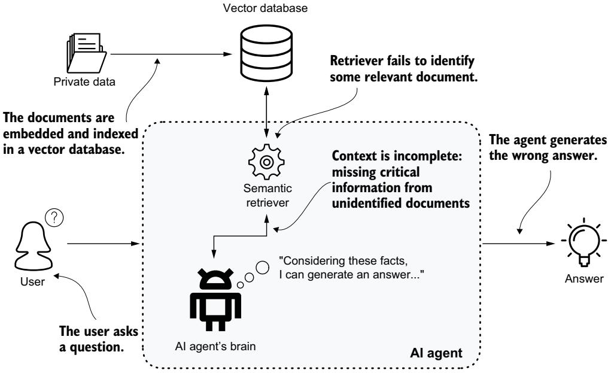  
Figure 14.1 RAG system limitations. A RAG system can produce incorrect answers when the retriever fails to identify critical documents.

### 14.3 Schema-based approach for querying KGs

We have seen that RAG can sift through millions of documents to provide a pertinent and rich answer, provided the retriever delivers a comprehensive contextual picture to the LLM. Let’s take a moment to scale this problem down to a more manageable size, say a dozen documents. Imagine that we ask a group of experts a question, but constrain them to apply a “human-powered” RAG-like approach. First they review the documents, marking any paragraphs that contain similar content or pertain to the same domain. From these, they select a dozen paragraphs that are the most relevant, which serve as a context. Once they have their context, they set aside everything else they have read and attempt to answer the question using only the selected pieces of infor mation and their common sense, making assumptions if necessary.

This process is not impressive. Even though these are domain experts, when they’re forced to work within RAG-like constraints, their approach lacks the depth and rigor that their genuine expertise would normally demand.

What would an expert do in this scenario? Imagine that we have a KG, and we need to answer a specific question. The first step is to understand the schema, which acts as the blueprint of the graph. For example, if the question involves people, it will likely involve a node labeled Person.

Understanding the schema is important because it allows us to convert specific requests like “show me the red Camaros seen in this area at that time” into a precise traversal. This traversal might involve entities and relationships such as “Person— Owns\_car—Car—Captured\_by—ANPR (automatic number plate recognition).

The traversal can then be refined by applying constraints, such as requiring the car to be red, the model to be Camaro, and the ANPR camera to be located in a specific area and time frame. Deciding which nodes and relationships to select, as well as how to apply these constraints, is guided by the schema. Understanding the schema allows experts to write formal queries that pinpoint the specific information they are seeking, even amid vast amounts of data.

#### 14.3.1 Understanding and using graph schemas

Understanding a graph schema—the data modeler’s structured interpretation of the domain—is like understanding the layout of a city before navigating through it: it lets us identify where specific types of information are stored and how they are linked. Figure 14.2 shows an example of the mental process an expert would follow when translating a natural-language question into a formal Cypher query. This translation process demonstrates how a solid understanding of the schema—knowing which nodes exist, their properties, and how they’re connected—is fundamental to constructing effective graph queries.

When we receive a query like “show me the red Camaros seen in this area at that time,” the initial step is to map the concepts mentioned in the query (e.g., red Camaros, area, time) to their corresponding nodes and relationships in the graph schema. This involves identifying the following:

Entities—For instance, “red Camaro” maps to node labeled Car with properties such as Color and Model.

Relationships—The query implies relationships like “Person owns Car” and “Car captured by ANPRCamera.”

Constraints—These are the specific conditions that refine the traversal, such as the color being red, the model being Camaro, and the ANPR camera being located in a specified area.

This results in constrained traversals, which address questions like, “Among all these entities (cars, people, cameras), connected in this specific way (e.g., OWNS\_CAR, CAR\_ CAPTURED\_BY\_ANPR), which ones possess the characteristics I’m interested in?”

Constrained traversals are the fundamental building blocks for constructing formal queries of any complexity. These traversals can be composed in various ways to build sophisticated queries that navigate intricate data relationships.

For example, we might start with an initial constrained traversal—possibly with aggregations—to identify specific nodes or subgraphs, which can then serve as starting points for further exploration in subsequent stages. This compositional approach allows us to address complex questions that require multiple layers of exploration and refinement. Ultimately, constrained traversals enable the translation of natural language intent into structured queries that a graph database can execute, effectively bridging the gap between human language and machine-readable data.

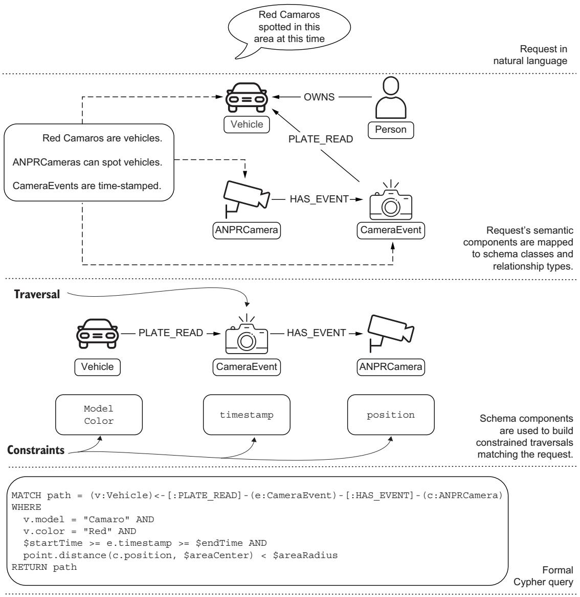  
Figure 14.2 Translating a natural-language query (“Red Camaro spotted in this area at this time”) into a formal Cypher query. The translation occurs in three stages: (1) parsing the natural-language request into semantic components, (2) mapping these components to schema elements (Vehicle, CameraEvent, and ANPRCamera nodes with their relationships), and (3) constructing a formal Cypher query with the appropriate traversal patterns and constraints. Domain concepts are systematically transformed into graph database operations, demonstrating the bridge between user intent and executable queries.

### 14.4 Think like an expert: Using metadata for enhanced querying

In the previous section, we explored how experts approach querying a KG by using their understanding of the schema to construct precise, context-aware queries. This process, grounded in constrained traversals, serves as a blueprint for extracting specific insights from complex data structures. However, this expert-based approach is not only the domain of human experts. With the advancements in LLMs, it is possible to translate this expert reasoning into a set of tasks that an LLM can perform, effectively allowing the model to think like an expert.

Expert reasoning, as we have outlined, involves a systematic approach to understanding and navigating the schema of a KG. LLMs, which are trained on massive amounts of text data, can recognize patterns and make inferences that closely resemble expert reasoning. They can parse and interpret the schema, understand how different entities and relationships interconnect, and use this understanding to inform their reasoning process. This combination of reasoning and schema comprehension allows LLMs to generate more accurate and contextually appropriate queries, mirroring the expert’s ability to navigate the graph’s structure.

In the following sections, we’ll examine the core steps involved in answering questions using KGs:

First we’ll explore how to understand the intent behind the question (section 14.5). This step is vital because it helps route the request to specialized pipe lines, if necessary, ensuring that the most appropriate method is used to answer the query.

Next, we’ll discuss how to extract and use metadata—essentially, an enriched or annotated schema—that provides the LLM with a deeper understanding of the graph (section 14.6). This metadata acts as a guide, enabling the model to navigate the KG more effectively.

We’ll also examine techniques to mimic expert reasoning in the LLM (section 14.7). Although there are intrinsic limitations in an LLM’s reasoning capabilities, we’ll explore strategies to overcome some of these challenges, bringing the model’s performance closer to that of a human expert.

Additionally, we’ll explain how to integrate a summarization step to highlight the most important parts of the answer (section 14.8). This process not only helps in distilling the key information but also enables the inclusion of valuable insights.

Figure 14.3 gives an overview of our system’s architecture and the interaction between its core components. We’ll use this diagram as our roadmap to understand how the elements work together to process and transform user questions into meaningful results.

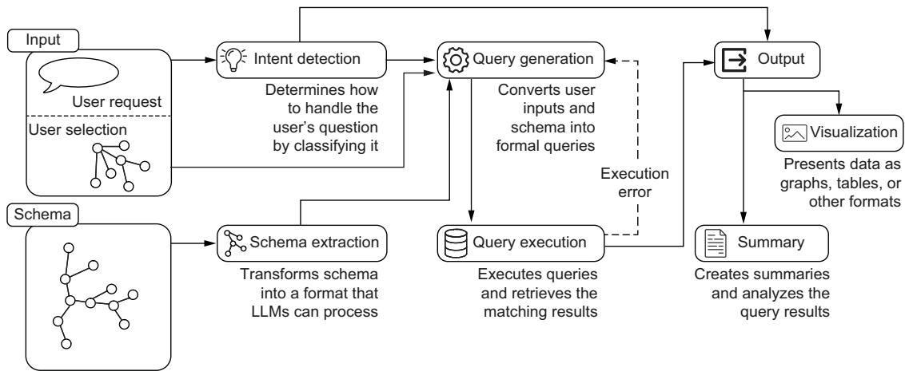  
Figure 14.3 Overview of the system, highlighting the main components: Intent detection, Schema extraction, Query generation, Query execution, Visualization, and Summary generation. The system processes user questions and selection inputs while supporting error feedback during query execution.

Before we move on, it’s important to recognize a significant paradigm shift in how we approach question-answering systems: shifting the focus from generating an answer to asking the right question. In traditional RAG systems, the process involves building a context around a question so that a grounded answer can be generated from the combination of the question and the context. The emphasis is on how to craft an answer that is both relevant and accurate based on the provided context.

However, in the approach we’re exploring, the focus shifts toward converting questions into formal queries. Here, the challenge is not just answering the question but properly formulating the question so that it can be directly used to extract factual data from the KG. Although both questions and queries aim to uncover information, queries are essentially formalized questions designed to interact with the structure of the KG, ensuring precise and factual retrieval of data.

### 14.5 Intent detection: Understanding user expectations

Let’s dive into our system architecture by exploring the first component: the Intent detection module (see figure 14.4). Why do we need to understand the intent to properly answer a question, and why should we do this at the beginning?

To answer the first question, we can revisit our “red Camaros” example. How should the answer be presented to the user? One option is to create an investigation board similar to those seen in crime movies, where we can add nodes and relationships. In this case, we would include not only nodes representing cars but also connections to the ANPR cameras that detected each vehicle. Alternatively, we could use a table representation that returns a list of cars with the plate number, camera location, and time of cap ture. Another option might be to draw a map, which would require the locations of the camera nodes. Each of these presentation methods has advantages, depending on the user’s needs and preferences. We need to understand the user’s intent so that we can identify the appropriate type of presentation and the right pipeline or chain to choose.

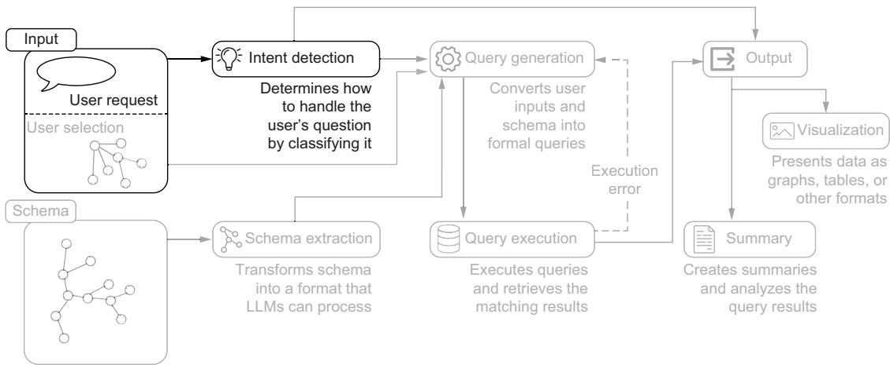  
Figure 14.4 The Intent detection component analyzes user inputs to determine how to appropriately handle and classify the user’s question.

We perform this step at the beginning for a couple of reasons. First, we aim to mimic expert reasoning, and understanding the intent behind a question is a fundamental first step that all experts take to provide satisfactory answers to their users. Second, this classification step relies on semantic understanding, a task that LLMs excel at. Because it is a relatively straightforward task, it is easy to follow and debug, providing a solid foundation for our question-answering system.

#### 14.5.1 Classifying by visualization type

To build a classifier for intent, we must decide on the set of classes any question should fall into. This set is not written in stone; we can revisit it by adding or merging classes as we develop the system and as the system evolves in production.

Suppose our question-answering system is feeding a front-end layer capable of presenting the following:

 Graphs as interactive canvases with nodes and relationships laid out

Tables with basic sort and search functions

Charts or plots

Interactive maps in a geographic information system (GIS)-like environment

As shown in figure 14.5, this creates a clear mapping between user intent and our system’s visualization capabilities, forming the foundation for our intent detection approach.


Intent detection

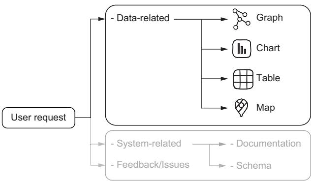  
Figure 14.5 Intent detection system architecture for data visualization requests, showing how user requests are mapped to appropriate visualization formats (graph, chart, table, or map)

In this case, we can start by using a prompt to infer the type of representation the user wants to receive; this will be our intent detection, or at least the first version of it. A good classification prompt should have these characteristics:

Clear instructions—The task is explicitly stated at the beginning, explaining what needs to be done.

Defined categories—The categories are clearly defined so the model knows how to differentiate between them.

Examples—By showing the model a few examples, it gets a clear idea of how the classification should work.

 Boundary cases—The prompt includes examples that sit near the boundaries between categories to help the model understand the nuances. This is especially important in classification, where similar inputs may belong to different categories.

Expected output format—This guides the model on how to present the answers, ensuring consistency.

Fallback options—If applicable, include a special category as a fallback, and instruct the model on when to use it. This can prevent forced or incorrect classifications.

The following example prompt implements such a classification task:

AN Given a Text delimited by triple backticks representing a user question, identify the best output of the presentation.

Select one of the possible outputs in the following list:

"graph", "table", "chart", "map".

The first step is to understand if the user explicitly asks for a specific output type to show the results.

For example, if the user asks for graph elements such as paths or nodes or relationships, then the output must be a graph in any case.

If the output type is not explicit it is usually "graph":

– "table", only when the user asks about aggregation, ordering, and statistics;

– "chart", if the user asks for plotting distributions;

"map", if the user asks for showing locations, places or other entities with a strong location property;

If you do not understand the output from previous cases the output should be "graph".

Here you can find some examples:

Example: Location of last 10 narcotics related crimes

Output: {"type": "map", "reason": "type is map because it involves showing locations"}

Example: Distribution of crimes over time

Output: {"type": "chart", "reason": "type is chart because a distribution can be plotted"}

Example: "Maximum, minimum, and average number of crimes per district"

Output: {"type": "table", "reason": "type is table because aggregations are requested}

Example: "People involved in or related to crimes investigated by Inspector Morse"

Output: {"type": "graph","reason": "type is graph because entities and relationships are implied"}

The output must be in JSON format. Do not explain the result.

###Text:\`\`\`{{question}}\`\`\`

###Output:

The classification prompt is divided into three sections:

Task definition—The first sentence defines the task generically, and other details are added in subsequent sentences. We introduce a clear bias toward the graph representation, and then we describe the expectation for each class.

 Few-shots section—We provide a set of examples, including the expected responses. The format of the response is also defined because the output structure is simple and it is easier to show than to explain. The examples are in the context of the law enforcement domain, and the response includes a reasoning step in addition to the answer.

The actual question—Finally, we insert the question, following the format we provided in the few-shots section above.

The following are some examples of questions and classification results obtained using the previous prompt:


What is the location of the latest shooting?


{"type": "map", "reason": "type is map because it involves showing locations"}


How many crimes were committed per month in 2020 compared to 2019?


{"type": "chart", "reason": "type is chart because a distribution can be plotted"}


Who are the main suspects in the recent string of burglaries?


{"type": "graph", "reason": "type is graph because entities and relationships are implied"}


How many traffic fatalities occurred last year compared to the previous year?


{"type": "table", "reason": "type is table because aggregations are requested"}

We’ve done a decent job—our prompt meets most of the criteria we listed earlier. We are now able to label each question with an intent that matches the type of output we can present.

NOTE You may wonder about the purpose of the reason field. The upcoming sections discuss how generating extra tokens affects the overall response of the LLM and how to exploit this knowledge to improve the quality of the results. For now, we are not planning to use the reason field in any downstream processing, but we will use it for debugging.

Next, let’s take it up a notch by focusing on boundary cases and fallback options. The easiest way to obtain high-quality samples on the boundary is to observe misclassification during normal use. Consider this example: “What are the most common types of organized crime involved in human trafficking?” This question may be classified as a “graph” type because “entities and relationships are implied,” even if it requires some aggregation and summarization.

On the one hand, the question is related to law enforcement, which often implies a need for visual representations of entities and relationships (e.g., networks of organized crime groups). On the other hand, the question asks for "common types" of organized crime, which suggests that some aggregation and summarization are required.

In this case, when we used our prompt, the system classified the question as a “graph” because the relationship between the different types of organized crime and human trafficking was more important than simply listing the common types, but it is not a clear-cut classification. There is no single correct and undebatable answer—but these are the types of questions we want in the few-shot section, as they will help shape the nuanced behavior of our system.

We took some liberties regarding fallback options criteria and included a significant bias toward the “graph” type, which effectively serves as a “catch-all” class. This is a reasonable choice; we are querying a graph database, after all.

#### 14.5.2 Is it data, documentation, or just complaining?

To empower nontechnical domain experts to use the power of the KG, our solution must consider the broader spectrum of questions users may ask. Although the intent detection approach we’ve discussed so far is well-suited for handling data-driven queries, we also need to address more generic, open-ended inquiries that may not have a straightforward mapping to the graph database.

Consider, for example, the following questions:

“Is it possible to export data from the system into a CSV file?“

“How do I use the system to assess the risk level associated with a suspect?“

“The system is too slow and keeps freezing. What can be done about it?“

“It would be great if the system had [feature XYZ]. Can this be added?“

These questions are as legitimate as they are unexpected. They may not directly involve querying the KG, but they reflect real user needs and expectations.

Users interacting with a system like this are not limited to data-driven queries; they may also seek help with system functionalities, request explanations, or even provide feedback. It’s reasonable to expect a variety of question types, which can generally be grouped into three categories:

Data-related questions—These are the questions we have addressed so far, involving querying specific information from the KG.

System-related questions—These are about how the system operates or its capabilities, such as exporting data or assessing risk.

Feedback and complaints—Users may express frustration or make requests for improvements.

Among system-related questions, we can further distinguish between two important subcategories:

 Documentation-related questions—These questions can be resolved by consulting the user documentation, the user manual, or help.

Schema-related questions—These are technical questions related to how the KG is structured and the decisions made during data modeling.

We can broaden the scope of the intent detection to encompass a full range of possible intents, as shown in figure 14.6.


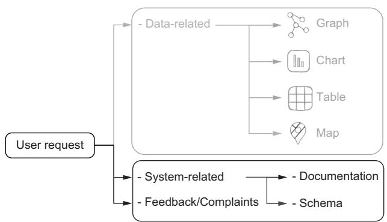  
Figure 14.6 Classification of system-related questions in the intent detection system, showing how requests are routed either to documentation (for system functionality and feature questions) or to the schema (for KG structure queries). The system also identifies feedback and issues as a separate category for user complaints or enhancement requests.

With the range of potential user intents identified, the next critical step is crafting effective prompts for the LLM to handle this classification task. A well-structured prompt can guide the model in detecting the type of question and routing it to the appropriate pipeline—whether it’s a data-related request, a system-related question, or user feedback. The following prompt shows how this broader intent detection can be implemented:


AN You are an AI assistant tasked with categorizing questions related to a law enforcement knowledge management system. Your job is to classify each question into one of three main categories:

```csv
1. **Data-Related:** Questions that require direct access to or
knowledge of the data within the system in order to be answered. These
questions focus on the content and structure of the data itself.
2. **System-Related:** Questions related to the system’s functionality,
features, architecture, or design choices - information that would be
found in documentation, not necessarily in the data itself.
3. **Feedback/Complaints:** Questions that are either not answerable by
the system or are user feedback/complaints.
**If the question is classified as "System-Related,"** you will further
classify it into one of the following subcategories:
- **Documentation-Related:** Questions that can be answered by referring
to system documentation, user manuals, or help sections.
- **Schema-Related:** Questions related to the structure of the
knowledge graph or graph data schema.
**Task:** For each question below, first classify it into one of the
three main categories. If you classify it as "System-Related," then
further classify it into either "Documentation-Related" or "Schema-
Related."
```

```jsonl
**Example Questions and Expected Output:**
1. **Question:** "Is it possible to export data from the system into a
CSV file?"
**Answer:**
{
"question": "Is it possible to export data from the system into a
CSV file?",
"category": "System-Related",
"subcategory": "Documentation-Related",
"reason": "The question asks about the capability of the system
regarding data
export, which falls under system functionality."
}
2. **Question:** "How do I use the system to assess the risk level
associated with a suspect or location?"
**Answer:**
{
"question": "How do I use the system to assess the risk level
associated with a suspect or location?",
"category": "System-Related",
"subcategory": "Schema-Related",
"reason": "The question involves assessing risk, which requires
understanding the graph schema and structure of the data related
to suspects and locations."
}
3. **Question:** "What permissions do I need to access restricted data?"
**Answer:**
{
"question": "What permissions do I need to access restricted
data?",
"category": "System-Related",
"subcategory": "Documentation-Related",
"reason": "The inquiry is about user permissions, indicating a
question about system features and access controls."
}
4. **Question:** "Why isn’t the system responding to my queries?"
**Answer:**
{
"question": "Why isn’t the system responding to my queries?",
"category": "Feedback/Complaints",
"reason": "This question expresses a complaint about system
performance, rather than asking for specific data or features."
}
```

5. \*\*Question:\*\* "What types of data visualizations can the system   
generate?"

\*\*Answer:\*\*   
{   
"question": "What types of data visualizations can the system   
generate?",   
"category": "System-Related",   
"subcategory": "Documentation-Related",   
"reason": "The question seeks information on available features   
related to data visualizations, which pertains to system   
documentation."   
}   
\*\*Begin classification:\*\*   
{{question}}

This classification prompt is divided into three sections: the task definition, a few-shot section, and the actual question. Additionally, the expected output format includes a reason field, which is important for identifying potential misclassifications and understanding the model’s reasoning.

Let’s look at a misclassification example. Suppose we ask “How often is the knowledge graph updated to reflect the latest information?" A smaller or quantized LLM responded this way:


"question": "How often is the knowledge graph updated to reflect the   
latest information?",   
"category": "Data-Related",   
"reason": "The question concerns the frequency of updates within the   
data itself."

But a full-scale LLM gave this response:


"question": "How often is the knowledge graph updated to reflect the   
latest information?",   
"category": "System-Related",   
"subcategory": "Documentation-Related",   
"reason": "The question is asking about the update frequency of the   
knowledge graph, which is a system-related feature that would be   
documented."

In this example, the question is related to how frequently the KG is updated. Although it’s possible to infer this information by analyzing data, such as the creation or update timestamps of nodes, this approach would not be appropriate for a law enforcement knowledge management system. Attempting to determine the update frequency by analyzing the data may not provide an accurate conclusion, as the data could reflect how the information happens to be entered rather than how the updates are scheduled.

Larger models can detect that this question pertains to system functionality and refer to the documentation, labeling it as “System-Related” under “Documentation -Related.” Smaller or quantized models, however, may misinterpret the question as concerning the data itself and incorrectly classify it as “Data-Related.”

The content of the reason field in both cases provides valuable insight. It suggests that the smaller model lacks context. This signals that we should enhance the task definition section by including relevant background information, helping guide the model to the correct classification.

To assess how well our prompt performs, we can evaluate it based on the criteria we established in the previous section and see if it includes clear instructions, defined categories, boundary cases, examples, and expected output format.

#### Design considerations for classification prompts

As we consider the design of our prompt for intent detection, it’s essential to weigh the trade-offs between using a single broader prompt and implementing a multistage classification approach. This consideration applies to classification tasks in general.

Opting for a single broad prompt can be beneficial if simplicity and reduced management overhead are priorities. This method streamlines the classification process and can be effective when the model’s accuracy is acceptable even for more complex tasks. It allows for quicker implementation and easier maintenance, particularly in environments where rapid deployment is necessary.

On the other hand, a multistage approach may be suitable if accuracy and flexibility in classification are more critical or if you anticipate frequent adjustments to how questions are categorized. This method provides more granular control over the classification process, enhancing the handling of complex questions and edge cases. By breaking the classification into stages, you can refine each step according to specific requirements, ultimately leading to more robust and reliable results.

Starting with a single broader prompt maintains simplicity while letting us evaluate the prompt’s effectiveness in practice. As the complexity of requests increases or new requirements emerge, transitioning to a multistage classification system can be considered.

Postponing the decision to split the prompt into multiple stages also provides the opportunity to gather real-world examples. These cases can be invaluable in refining the classification process, ensuring that the eventual multistage approach is tailored to meet the specific needs of our application.

### 14.6 From schema to LLM-ready context

As shown in figure 14.7, we’re focusing on the schema extraction phase of our pipeline. This critical step forms the foundation for transforming raw schema information into formats that LLMs can effectively process and understand.

Now we will build on this foundation by exploring how metadata, an enriched layer of schema information, can empower LLMs to replicate this expert reasoning, ultimately enabling nontechnical users to query KGs effectively. Here, the enrichments are those that would be beneficial to experts, as anything that makes the schema more understandable or actionable for an expert can be exploited by our LLMs.

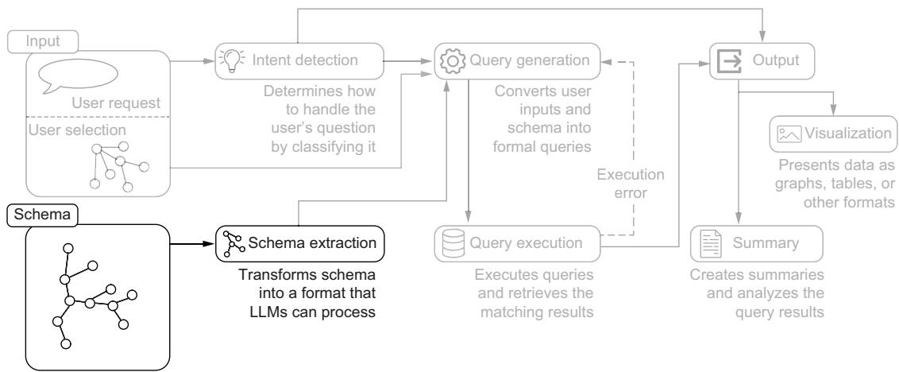  
Figure 14.7 Schema processing pipeline, highlighting the transformation of the database schema into LLMcompatible formats. The diagram illustrates how raw schema structures are processed through schema extraction to create representations that LLMs can effectively process.

#### 14.6.1 Schema extraction and representation

The challenge we face is extracting the schema from the KG and converting it into a form that can be processed by a language model. We can then use that schema information to help the language model better understand the question and produce a proper Cypher query.

At first glance, we could solve the first problem by invoking the apoc.meta.schema [1] function, which computes the schema based on the graph’s current structure.

Listing 14.2 Response format for apoc.meta.schema   
[   
{   
"label": "[LabelName]",   
"properties": {   
"[PropertyName1]": {   
"type": "[PropertyType1]",   
"mandatory": [true|false],   
"unique": [true|false]   
},   
"[PropertyName2]": {   
"type": "[PropertyType2]",   
"mandatory": [true|false],   
"unique": [true|false]   
},   
"relationships": [   
{   
"type": "[RelationshipType]",   
"target": "[TargetLabelName]",   
"properties": {

```javascript
"[RelationshipPropertyName]": {
"type": "[RelationshipPropertyType]",
"mandatory": [true|false],
"unique": [true|false]
}
}
},
]
},
```

However, a closer look reveals that the schema provided by this method is a technical database schema. It includes many details irrelevant to our needs, such as helper or administrative nodes, technical metadata properties, unnecessary or redundant type labels, unused relationships, and unused properties. These extraneous details clutter the schema with elements that are useful for database management but do not contribute to the core understanding of the domain. To address this, we need a conceptual KG schema: a distilled, meaningful structure that focuses only on the entities and relationships which convey the essential model of the domain.

The conceptual schema serves as a simplified, domain-relevant subset of the technical schema, stripping away technical complexities and irrelevant metadata. By removing auxiliary elements, the conceptual schema prioritizes clarity and usability, capturing the logical relationships and characteristics that experts rely on when reasoning about the graph.

This simplification is important for several reasons:

Alignment with human reasoning—The conceptual schema reflects how domain experts understand the KG, using only the relevant entities, relationships, and properties to answer domain-specific questions. This aligns the schema more closely with the natural language model’s approach to reasoning, making it easier to map questions accurately to graph elements.

 Reduced cognitive load for LLMs—Language models, particularly LLMs, are more efficient when given focused, relevant data rather than the full, complex structure of a technical database schema. By providing a streamlined conceptual schema, we allow the model to concentrate on meaningful information, increasing its ability to generate accurate and relevant Cypher queries without being distracted by extraneous details.

Minimized risk of query errors—Technical schemas often contain implementationspecific elements, redundant labels, or metadata that could confuse the model, potentially leading to errors in query generation. The conceptual schema elim inates this noise, reducing the likelihood of misinterpretations that could result in incorrect queries.

Enhanced model interpretability—A conceptual schema presents the KG in a more human-readable form, aligning it with how LLMs are trained to interpret text. By focusing on the essential model of the domain, the conceptual schema captures the structure that LLMs can most effectively use to infer intentions and mappings.

To transition from the raw output of apoc.meta.schema to a conceptual schema, some human intervention is necessary. One approach is to describe the conceptual model manually, effectively “curating” the schema; alternatively, we can define a skip list to filter out unneeded elements from the APOC results, thereby distilling the technical schema to its conceptual core.

To make the conceptual schema interpretable for a language model, we must represent each node class and relationship in a clean, structured format that focuses on the essentials. This approach ensures that the LLM has a clear understanding of core classes and connections, as well as their properties and types, without the distractions of technical details. Figure 14.8 illustrates the key steps in transforming a technical Neo4j schema into an LLM-friendly conceptual representation.

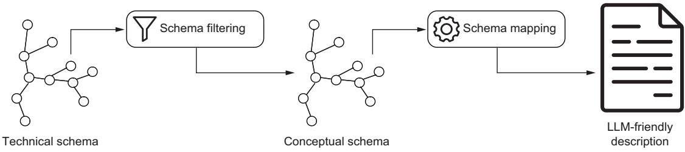  
Figure 14.8 The technical schema obtained through the APOC call is filtered so it is reduced to the conceptual graph schema representation. The conceptual schema is then mapped into a textual format that can be effectively understood by LLMs.

In a narrative schema representation, nodes and relationships are described in greater detail and natural language, including rich context and examples (listing 14.3). Although this format is useful for human readers who need a thorough understanding, it can be more challenging for a language model to process when the goal is efficient query generation.

#### Listing 14.3 Narrative schema representation

\*\*Nodes:\*\*   
1. \*\*Vehicle\*\*:   
- \*\*Properties\*\*: \`color\`, \`make\`, \`model\`, \`style\`, \`plate\_number\`   
- Node example:   
- (:Vehicle   
{make: "Toyota", model: "Camry",   
style: "Sedan", plate\_number: "XYZ123"})\`

Listing 14.4 LLM-friendly schema representation format   
Nodes:   
(:Vehicle {   
color: STRING,   
make: STRING,   
model: STRING,   
style: STRING,   
plate\_number: STRING   
})   
Relationships:   
(:Vehicle)-[:OWNED\_BY {since: DATE}]->(:Person)

\*\*Relationships:\*\*

1. \*\*OWNED\_BY\*\*: Represents the relationship of ownership between a vehicle   
and a person.   
- Example:   
(:Vehicle {plate\_number: "XYZ123"})   
-[:OWNED\_BY]->   
(:Person {name: "Alice"})

As the schema grows, this approach can be verbose and less systematic. For a language model, this kind of representation may introduce challenges in parsing and understanding, particularly when the schema becomes large and complex.

In contrast, a more LLM-friendly format distills the schema into a concise, consistent structure that focuses on key entities and relationships, stripping away extra verbiage while retaining the essential details.

This structured representation includes just the essential components—entity names, properties, and relationships—without extraneous descriptions or complex formatting. It is easy for the LLM to process because it uses a standardized syntax that aligns well both with the entity types and their attributes. The relationships are described clearly with property types and minimal but necessary contextual information.

#### 14.6.2 Enriching schemas with descriptive annotations

In the previous section, we introduced schema descriptions as a way to bridge the gap between the KG’s structure and the LLM’s ability to generate accurate, meaningful queries. However, relying on the schema structure alone can hinder this process.

Suppose, for instance, that the user asks to “find all black vehicles involved in a crime.” The LLM might naively translate this to Vehicle.color == "black", assuming “black” is stored in a readable string format. However, if the database uses abbreviations like BLK for “black,” this query will miss all relevant records, giving the impression that no black cars were involved in any crimes.

Another similar issue may arise with relationship ambiguity. Suppose the KG includes both the COMMITTED and CO\_OFFENDS\_WITH relationships. If the user asks to “list all suspects who have been in multiple crimes with another person,” the LLM has no clear basis for determining which relationship to use. Is the question about those directly involved (COMMITTED) or individuals with co-offending histories (CO\_ OFFENDS\_WITH)? Lacking a clear distinction, the LLM may choose incorrectly, amplifying the inherent ambiguity of natural language and leaving the user feeling as if they’re communicating with a system that doesn’t fully grasp their request.

To tackle these issues, we can mimic the actions an expert would take in similar situations. When faced with unfamiliar data, an expert begins by familiarizing themselves with the KG’s structure, consulting any available documentation and data dictionaries. This careful review helps them understand the correct paths to take through the data and allows them to set constraints with precision, avoiding the pitfalls of ambiguous or misinterpreted terms.

As part of this familiarization process, experts may create a kind of “cheat sheet” to capture key insights—such as terminology, abbreviations, and relationship meanings—that aid in accurately constructing queries. For example, they might note that "BLK" is used instead of “black” in the vehicle color property, or that specific relationship types like COMMITTED and CO\_OFFENDS\_WITH capture involvement in criminal activities from different angles. By capturing this information, experts avoid mistakes and ensure that their queries align with the KG structure and semantics.

We can replicate this process of building a cheat sheet by systematically annotating the KG’s schema, documenting node classes, relationship types, and properties with descriptions that capture these nuances. This annotated schema becomes a guide for the LLM, allowing it to make more informed and contextually accurate query translations. An example of such an annotated schema representation is shown in the next listing.

#### Listing 14.5 Annotated schema representation format

Nodes:   
/\* Represents a vehicle involved in various incidents or owned by individuals   
\*/   
(:Vehicle {   
color: STRING, /\* Color of vehicle, BLK, GRY, SIL, WHI, etc\*/   
make: STRING, /\* Manufacturer: BMW, BUIC, CADI, CHEV, etc \*/   
model: STRING, /\* Model of the vehicle: IMP, ALT, SON, SEB, CIV, etc \*/   
style: STRING, /\* Body style: SUV, SEDAN, etc \*/   
plate\_number: STRING /\* Vehicle license plate \*/   
})   
Relationships:   
/\* Ownership relationship from vehicle to person, with start date of   
ownership \*/   
(:Vehicle)-   
[:OWNED\_BY {since: DATE /\* Date ownership began, ISO format \*/}]   
->(:Person)

With these annotations as inline comments, the LLM has access to detailed descriptions that guide it in accurately interpreting the schema, leading to more precise queries which reflect the true data structure.

#### 14.6.3 A practical approach to schema representation

Building on the previous discussions, we now propose a practical approach to streamline the process of refining and annotating the KG schema. This approach uses a YAML configuration file to manage the output of apoc.meta.schema, distill it by skipping irrelevant elements, and add rich descriptions to help LLMs understand the schema more effectively.

The YAML file serves as a central configuration point where users can specify which parts of the schema to exclude from processing, as well as provide detailed descriptions for key entities, relationships, and properties. The file includes two main sections: skip and descriptions.

#### SKIP LIST

The skip section allows users to filter out certain classes, relationships, or properties that are deemed not to be part of the core conceptual KG schema as we described it.

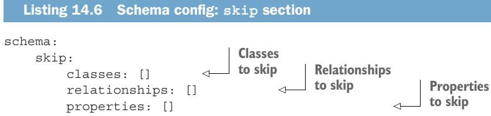

#### DESCRIPTIONS

The descriptions section is where detailed annotations are added for various schema elements. Here, users can describe the purpose and semantics of classes, relationships, and properties, helping the LLM interpret the graph more effectively. These descriptions can be as granular as needed, ensuring that both the LLM and any human users interacting with the schema have a clear understanding of its structure.

#### Listing 14.7 Schema config: descriptions section

```yaml
descriptions:
classes:
Class1: "Description of class 1"
relationships:
Rel1: "Description for relationship type 1"
properties:
Class1:
property1: "Description for Class1.property1"
property2: "Description for Class1.property2"
[...]
Rel1:
property1: "Description for relationship property
Rel1.property1"
```

The benefits of this approach include the following:

 Customization—Users can easily adjust the schema representation by editing the YAML file to include only the necessary components and tailor the descriptions to their needs.

Maintainability—The YAML file serves as a centralized, human-readable configuration that can be easily updated as the schema evolves, ensuring that the schema remains aligned with the needs of the domain and the LLM.

 Scalability—As the KG grows, this approach allows for a manageable and scal able way to handle schema modifications, ensuring that the LLM can keep up with new data and relationships without becoming overwhelmed by unnecessary complexity.

An example of the output from this schema configuration approach is shown next.

```markdown
Listing 14.8 Schema description: output example
#### Graph Schema Overview
#### Node Types
(:Vehicle /* Represents a vehicle involved […] */ {
color: STRING, /* Color of vehicle, BLK, GRY, SIL, WHI, etc*/
make: STRING, /* Manufacturer: BMW, BUIC, CADI, CHEV, etc */
model: STRING, /* Model of the vehicle: IMP, ALT, SON, SEB, CIV, etc */
style: STRING, /* Body style: SUV, SEDAN, etc */
plate_number: STRING /* Vehicle license plate */
})
#### Relationships
(:Vehicle)-[:OWNED_BY /*<description>*/ {since: DATE /* <description> */}]-
>(:Person)
```

### 14.7 It’s time to think: Understanding LLM reasoning

Now that we have a structured understanding of user intent and an LLM-friendly graph schema, we’re almost ready to tackle one of the most challenging steps: translating text into Cypher queries. Figure 14.9 illustrates how query generation acts as a convergence point, combining processed user intent and schema data, while also using execution error feedback to refine and improve query formulation through an iterative process.

Just as we’ll learn how important it is to guide LLMs to “take their time” with reasoning, we shouldn’t rush through prompt design. LLMs are designed to understand context and generate responses that seem remarkably human by using the immense amounts of text data they were trained on. However, when presented with complex or nuanced questions, LLMs may “rush” to a conclusion, relying on shortcuts in the data patterns they’ve observed rather than fully reasoning through the problem. To tackle this tendency, researchers have explored techniques like the following:

Chain-of-thought prompting [2] introduces intermediate steps into the model’s response generation. By structuring prompts that require the model to articulate its reasoning step by step, this technique uses an LLM’s pattern-based capabilities, encouraging it to take a more calculated approach rather than jumping to conclusions.

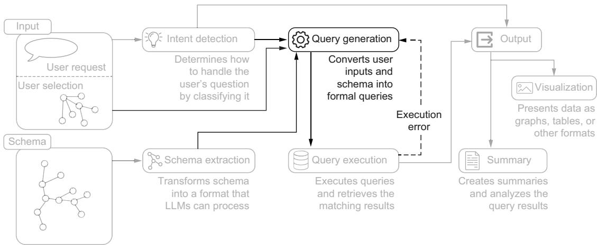  
Figure 14.9 The query generation stage of the system architecture, highlighting its central role in converting user inputs and schema information into formal database queries

Scratchpad techniques [3] embed intermediate “workings” in the LLM’s output, where the model produces tokens that represent various steps or computations needed for reasoning through complex questions.

Both approaches give the model “time to think” by encouraging it to spend more computational resources on the problem-solving process before generating a final output. By modifying the prompt to “force” token-by-token generation before producing the final answer, these methods help allocate more computational capacity to each layer, effectively scaling the thought process in response to question complexity.

#### 14.7.1 The order matters: Answer first vs. reasoning first

If an LLM is instructed to first provide the answer, followed by the reasoning behind it, the model may stick with the initial answer it generated. This is because LLMs typically produce one word (or, more precisely, one token) at a time, effectively committing to their previous choices as the generation progresses. This can lead to the model generating reasoning that is tailored to support the predetermined response, rather than reflecting an impartial, step-by-step thought process.

This consistency-driven tendency has been studied in recent research, which introduced the concept of semantic consistency [4]. The text corpora that these models are trained on typically exhibit a degree of logical coherence and internal consistency: what is said earlier is often used to support what is said later, and radical departures or contradictions are relatively rare. This consistency acts as a guardrail, preventing the models from engaging in what we would perceive as rambling speech.

However, this consistency can also become a constraint, due to the following problems:

 Cumulative context—Because the model generates tokens sequentially, the reasoning and context build cumulatively. This means the model’s commitment to a particular answer can be influenced by the tokens it has already generated, reinforcing the idea of output consistency.

 Error propagation—If an error occurs early in the token generation process, it can propagate through subsequent tokens, as each new token is generated based on the previous ones. This highlights the importance of careful reasoning and validation at each step.

Figure 14.10 shows an example of how simply inverting the order of reason and answer generation can lead to significant differences in output.

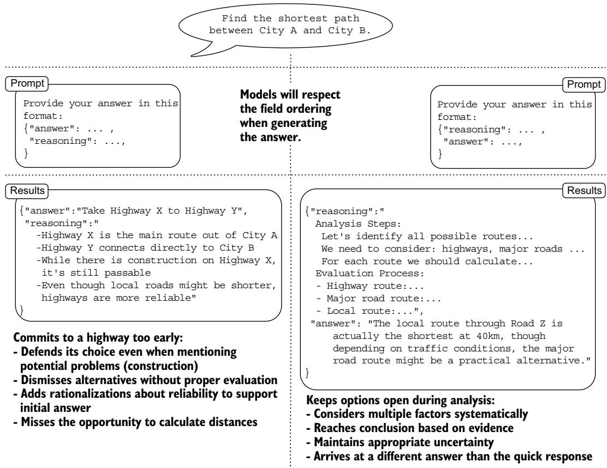  
Figure 14.10 Comparison of two prompt structures for the same path-finding task. Left: The answer-first approach encourages quick, potentially biased responses with post hoc justification. Right: The reasoning-first approach promotes systematic analysis before reaching a conclusion. Note how the JSON structure in each prompt guides the LLM’s thinking process.

To encourage transparent and reliable reasoning from LLMs, it’s important to prompt the model to first provide its step-by-step reasoning, followed by the final answer. This structure forces the model to engage in a more thoughtful, deliberative process, as it must justify its conclusion through a balanced exploration of the problem, rather than simply rationalizing a predetermined response.

Postponing the reasoning step until after the answer can make sense in classification tasks. In these cases, we are more interested in understanding how the system justifies its choices, especially when it misclassifies. By using the reasoning provided by the model, we can gain insights into why the classification was incorrect and use that information to provide good examples that help clarify the classification boundaries, as we did in section 14.5.

#### 14.7.2 Thinking in queries: From text to Cypher

Now that we’ve given both the model and ourselves plenty of time to think, it’s time to put that thinking into action. Let’s dive into crafting the prompt that will guide our LLM in generating the Cypher queries we need, using what we have built so far.

The prompt is structured as follows:

A brief task description and question

A schema definition with annotations

Intent-dependent requirements

Examples

 Optional user selection

KG-specific annotations

A reminder of the question

A reminder of the requirements

Output format specification

This structured approach forms a complete pipeline for transforming natural language questions into Cypher queries, as illustrated in figure 14.11. As we will see, the prompt includes elements we introduced in previous sections as well as new components.

#### BRIEF TASK DESCRIPTION AND QUESTION

We begin by introducing the task of translating a question in natural language into a Cypher query, anticipating that we will provide both the question and a detailed description of the schema. We use an HTML-like tag to wrap the user’s question, which will help the model clearly understand the boundaries of the question and separate it from the rest of the instructions.

AN Your task is to generate a Cypher query for a Neo4j graph database, based on the schema definition provided, that answers the user Question.

The question we need to answer is:

<QUESTION>

{{ question }}

</QUESTION>

[...]

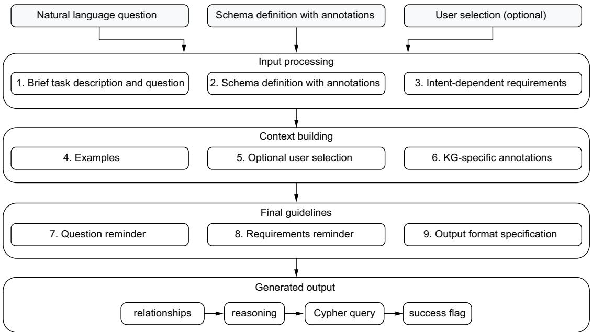  
Figure 14.11 The complete flow of transforming a natural language question into a Cypher query, showing how three inputs are processed through structured prompt components. The process is organized into three stages (Input processing, Context building, and Final guidelines) that culminate in structured JSON output.

#### SCHEMA DEFINITION WITH ANNOTATIONS

In this section, we use what we developed during the schema extraction phase. The LLM-friendly format we introduced will seamlessly integrate with another HTML-like tag for this purpose. Using markdown such as ### Graph Schema Overview or #### Node Types for headings will help the LLM create a clear structure for representing the schema. The /\* comments \*/ we added to annotate classes, relationships, and properties integrate the schema naturally.

#### AN [...]

The knowledge graph has the following schema, which the Cypher query must follow: <SCHEMA>

{{ schema }}

</SCHEMA>

consider the comments as annotations

[...]

#### INTENT-DEPENDENT REQUIREMENTS

We use the output of intent detection to incorporate requirements that depend on the identified intent. In the case of a graph or map, we specify how the query should be structured. Specifically, we aim to retrieve not only the nodes that answer the question but also the relationships involved. For example, suppose we ask about red Camaros spotted by cameras in a certain area. We want to obtain information about the vehicles, the cameras, and the relationships that connect these elements. In case of a “table” response, we clarify that a tabular format is expected, so the model should select specific properties to display in columns rather than returning complete nodes or relationships.


[...]



The result must be a graph so make sure to follow the schema and the following requirements:

\- Return all the nodes and relationships matched, do not use anonymous relationships ( such has (node0)-[:RELATIONSHIP]->(node1) instead use (node0)-[rel0:RELA-TIONSHIP]->(node1)

\- Aggregate multiple traversals in a single MATCH pattern if possible: \`MATCH path=(p:Person)-[acted:ACTED\_IN]->(m:Movie)<-[directed:DIRECTED]-(d:Director) RETURN path\` instead of \`MATCH path=(p:Person)-[acted:ACTED\_IN]->(m:Movie), (d:Director)-[directed:DIRECTED]->(m)





The result must be a table, i.e. you must select nodes and relationship properties and rename them to be presented in a table



[...]

#### EXAMPLES

This is a new component, although we introduced the few-shots technique previously. The idea is to assist the system in answering foundational questions that can serve as building blocks for more complex queries, while also demonstrating the expected format in a single instance. Examples are a powerful and relatively inexpensive way to enhance the quality of responses in many situations.


[...]

Use only the provided labels, relationships, and properties; do not use anything else that is not specified.

If you cannot generate a Cypher statement based on the provided schema, explain the reason to the user.

{{examples}}

You must respect relationship types and directions.

[...]

#### OPTIONAL USER SELECTION

This is another new component. If the system can represent nodes and relationships, it will probably also let users select nodes. Incorporating the current selection into the prompt enables users to refer to it in their questions. Users may choose to refer to the selected node as a whole or its properties, as in “Give me the older siblings of the selected person.” The selected nodes are represented as a list of items, each containing the node label and its properties. If the user references a selection that is empty, the model highlights the issue.

[...]



Current selection:



\- {{node.label}} node with this properties {{node.properties}}





The selection is currently EMPTY. If there are references to selected nodes in the question, it is almost

certainly an error and therefore it is not possible to generate a response.

In this case, 'success' should be false.



{{annotations.notes if annotations.notes}}

Do not include any explanations or apologies in your responses.

[...]

#### KG-SPECIFIC ANNOTATIONS

In this section, users can include clarification notes that are relevant to the specific KG. These annotations provide context and enhance understanding, helping the model interpret the schema more effectively. By not integrating these notes directly into the prompt, we ensure that the prompt can be reused across different KGs. This flexibility allows for a more adaptable approach to query generation, as the annotations can be tailored to the specific nuances of each KG without altering the core prompt structure.


[...]

{{annotations.notes if annotations.notes}}

Do not include any explanations or apologies in your responses.

[...]

#### REMINDER OF THE QUESTION

We repeat the question near the end of the instruction prompt to reinforce the context and intent, which can lead to a more focused response. The schema definition section can be quite long, so the question may be located many tokens from the end of the instructions and the start of the response.


#### AN [...]

The question we like to answer may have some information that is relevant for the Cypher query:

<QUESTION>

{{ question }} {{ information }}

</QUESTION>



Remember the requirements:

Return all the nodes and relationships matched, never use anonymous relationships(ie [:RELATIONSHIP]), always use named ones (ie [rel1:RELATIONSHIP]).

– Aggregate multiple traversals in a single MATCH pattern if possible



[...]

Although language models, particularly those based on transformer architectures, do not inherently prioritize local context over global context—meaning they can theoretically focus on both local and distant tokens—these models can learn to give more weight to nearby tokens if they are more relevant for a particular task.

At this stage, we also provide an optional information field that can be relevant for generating the query. This field can be used, for example, to report a previous failure of the generated query, including the error message returned by the database. This allows the model to review its previous decisions and generate an error-free query in subsequent attempts.


#### OUTPUT FORMAT SPECIFICATION

Finally, we specify the format of the response, which must be a valid JSON object so that we can easily process it programmatically. We define each field we expect, provide hints for the expected value types for these fields, and include comments about the type of content we expect the model to fill in for these fields.

Use the "reasoning" field to explain your plan for the cypher query

Answer only in valid JSON in the following JSON format, nothing else (no <ANSWER> tags or anything like that):

"relationships": [...], list of relationships to traverse, empty if not traversal is needed

"reasoning": "...", this is the scratch pad for your reasoning

"query": "<Cypher query>", must be a string and a valid Cypher query.

"success": <true/false>, where true means that a Cypher query (following the schema) was returned.

#### 14.7.3 Structuring output for reliable query generation

Let’s dive deeper into the format of the output and the reason to select each field in a specific order. We start by asking the model to list the relationships it believes it should traverse. We do this because LLMs may hallucinate relationships that we didn’t mention in the schema description; asking it to list the relationships it intends to traverse “out loud” significantly reduces the chance of this type of hallucination. Depending on the type of model, we may have to do some tuning. For example, if the model doesn’t hallucinate relationships, we can safely remove this part. On the other hand, if the model commits too early to the relationships to traverse, we can soften the requirement for these fields by asking the model to list the relationships it will “potentially traverse,” for example.

We then ask the model to generate the reasoning field. This gives the model time to think through the answer by breaking down the problem, defining a plan, and so on before committing to an answer. If you want to drive the reasoning process more precisely for specific use cases, you can add extra details under the “Use the "reasoning" field to explain your plan for the cypher query” section of the prompt, as well as through the examples.

We finally ask the model to produce the Cypher query to answer the question. Because we ask the model to generate this field after the relationships and the reasoning field, it will try to be coherent and not use nonexistent relationships. By guiding the model through the step-by-step process of identifying relationships, reasoning through the problem, and then formulating the final query, we ensure that the output is well-grounded and aligned with how a human expert would tackle the task. This helps us get results that are more reliable and trustworthy compared to simply asking for the Cypher query directly.

ENSURING EXAMPLE CONSISTENCY

To ensure that examples don’t undermine this structured approach, they must conform to our response format to avoid introducing ambiguity during response generation:

AN 

Example:

<QUESTION>{{example.question}}</QUESTION>

"query": "{{example.answer}}"

{{ '"reasoning":"'+example.reasoning+'"' if example.reasoning else "..."}}



We use the "..." notation in the examples as a placeholder, indicating fields where we want to give the model the freedom to generate content autonomously. If we want to include important information in the reasoning step without significantly influencing the model’s reasoning, we can run a prompt that asks the question in the example without including the reasoning field. This gives us the chance to check how the model would tackle the reasoning step without that guidance, and then we can modify the prompt to add the critical reasoning content we want to include without radically changing the overall response.

### 14.8 Response summarization: From results to insights

Having established a robust system that transforms natural language questions into actionable Cypher queries, our focus now shifts to ensuring that the results are as accessible and insightful as the queries themselves. Visualizing data as graphs provides a powerful way to explore relationships and structures, but it can sometimes leave users seeking clarity or deeper context. This is where summarization comes into play (see figure 14.12).

The summarization step holds a unique position in our pipeline as the first and only component that has access to the actual data the user is seeking. Whereas the previous steps focus on understanding the question and formulating the right query, summarization bridges the gap between raw data and user understanding.

Graph visualization excels at showing relationships and structures, but valuable information often lies in node properties or in the broader context of the results. A well-crafted summary can highlight these findings that may not be immediately visible in the visual representation. It provides users with a quick overview before they dive into a detailed exploration of the graph itself.

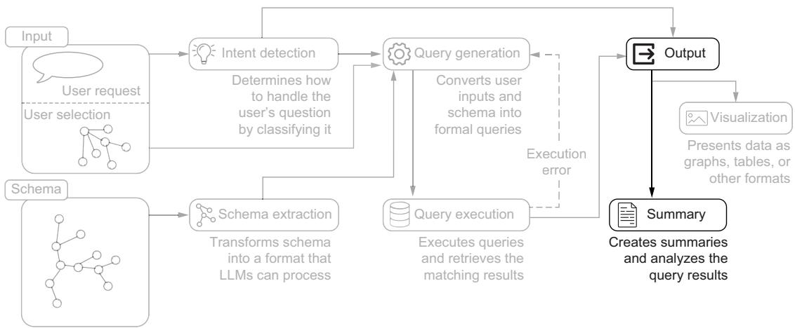  
Figure 14.12 Output generation pipeline, highlighting the system’s final stages of data presentation and analysis. Processed query results are transformed into visual presentations and analytical summaries, demonstrating the dual-output approach of visualization and summarization of query results.

Beyond its basic role of presenting results clearly, the summarization step can potentially be extended through post-processing to provide additional context and insights. This positions it as not just a final formatting step but rather a vital component for enhancing the overall user experience. Here is the prompt structure we’ll use for summarization to achieve these goals:

#### AN Our user asked this question:

<QUESTION>

{{ question }}

</QUESTION>

To answer the question, we decided to execute this cypher query:

<QUERY>

{{ query }}

</QUERY>

The query returned a graph containing this data:

<RESULTS>

{{ records }}

<RESULTS>



Current selection:



\- {{node.label}} node with this properties {{node.properties}}





Your task is to summarize the results we sent to the user with the information just provided. Consider that the user will see the results in a graph format within a graphical user interface, but we also want to provide a textual summary along with the canvas.

Please keep in mind that much of the resulting data is actually irrelevant considering the question, but is returned anyway for completeness. Your job is to filter out this data so the summary contains only factual information that is relevant considering the question.

Does the question request analysis of the returned data? If so, include a few sentences to extract the requested analysis/insight.

This is the question again

<QUESTION>

{{ question }}

</QUESTION>

Answer only in valid JSON in the following JSON format, nothing else (no <ANSWER> tags or code blocks and so on):

"results\_analysis": true|false, Check if the question contains an implicit or explicit request for analysis of the returned raw data

"reasoning": "...", Scratch pad for your reasoning. include reasoning about the summary and reasoning about the result analysis if needed

"summary": "..." must be a string and a meaningful and factual summary (use \n and basic markdown tags to highlight the important bits).

Let’s break down how this prompt is structured to achieve our summarization goals while maintaining flexibility for future enhancements. It begins by reconstructing the complete context chain, from initial question through query execution to results. Each element is carefully wrapped in HTML-like tags, creating clear boundaries that help the LLM understand the role of each component:

The original question provides the user’s intent.

The executed Cypher query shows how we interpreted that intent.

The query results represent our raw data.

The current selection (if any) maintains user context.

The task description explicitly acknowledges the dual nature of our results presentation: users will see both a visual graph representation and our textual summary. This is vital because it guides the LLM to focus on complementing rather than merely repeating what’s visible in the graph interface.

We explicitly instruct the LLM to filter out irrelevant data; this is a critical step, given that graph queries often return complete paths for visualization purposes. This filtering ensures that our summaries remain focused and meaningful to the user’s original question.

The prompt introduces result analysis capabilities through a simple question: “Does the question request analysis?” This approach keeps the analysis tied to user intent rather than generating unrequested insights, and provides a foundation for future expansion of analytical capabilities while maintaining a clear separation between summary and analysis functions.

Before specifying the output format, we include a reminder of the original question. This repetition, like our approach in previous prompts, ensures that the model maintains focus despite potentially lengthy results sections.

The JSON output format follows our established pattern of progressive generation. First we generate a flag to identify whether the results analysis is required by the user, even if only implicitly. This flag is useful for monitoring purposes, as it compels the model to make an explicit decision about whether to perform the analysis. Additionally, when the flag is true, it significantly influences the subsequent reasoning step.

Next, the reasoning step must align with both the prompt and the analysis decision, incorporating any relevant analysis-related reasoning. Finally, we request the generation of the actual summary, including indications for typographic formatting to highlight the content when necessary.

This structured approach ensures that our summaries are consistent, relevant, and adaptable to future enhancements. The clear separation of concerns from decisionmaking through reasoning to final output makes the component both maintainable and extensible.

The summarization step completes our pipeline by transforming raw data into accessible insights while maintaining the flexibility to grow with evolving user needs. Its position as the final touchpoint with our users makes it a critical component for ensuring that the system answers questions accurately and also presents those answers in the most useful way possible.

#### Summary

Expert emulation provides a systematic framework for building, improving, and extending KG systems. When facing any challenge, we can find solutions by asking “What would an expert do?” and breaking down their approach into implementable steps.

A well-structured intent detection system requires two layers of classification. The first layer handles broader query categories (data-related, system-related, feedback), and the second identifies visualization needs.

 Converting technical database schemas into LLM-friendly formats requires filtering out unnecessary elements, adding contextual annotations, and structuring information in ways that align with how LLMs process and understand data.

Prompt engineering for LLMs requires giving them “time to think.” This means structuring prompts to encourage reasoning before answering and using techniques like chain-of-thought prompting to improve response quality and reliability.

To work effectively, query-generation prompts need comprehensive schema context, the current user selection state, intent-specific requirements, and carefully chosen examples that demonstrate desired patterns.

Result summarization works best as a complement to visualization. Rather than repeating what’s visible in the graph, effective summaries highlight insights and patterns that might not be immediately apparent visually.