# Building a QA agent with LangGraph

### This chapter covers

 Implementing the expert-emulating approach

Implementing investigation through question answering

Adapting and improving the system

In this chapter, we’ll create a practical application for querying knowledge graphs using LLMs. Drawing together the concepts and techniques explored in chapter 14—illustrated in the mental model in figure 15.1—we’ll demonstrate how to build an integrated solution. Using LangGraph as our orchestration framework, we’ll show how each stage can be combined into a seamless pipeline. To make this system accessible and user-friendly, we will use Streamlit as a frontend interface. The book’s code repository contains the complete implementation and configuration files, so you can easily follow along and reference the code as we progress through the concepts.

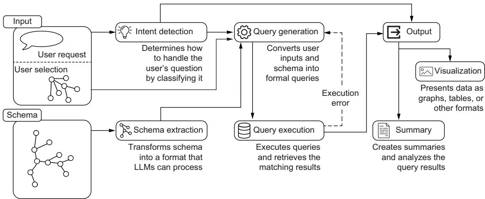  
Figure 15.1 Overview of the system architecture introduced in chapter 14. We’ll implement it using Streamlit to handle user input (questions and user selection) and output (visualization and summaries), and LangGraph will orchestrate the core pipeline.

### 15.1 Building the LangGraph pipeline

LangGraph is an innovative library designed for building stateful, multi-actor applications powered by LLMs. This framework is particularly suited for orchestrating workflows that involve complex reasoning and decision-making processes, which are central to our KG querying pipeline.

To better understand how LangGraph implements these concepts in practice, let’s start with a familiar example: a basic retrieval-augmented generation (RAG) system that retrieves relevant documents and generates an answer to a question. Although simpler than our expert-emulating architecture, this example demonstrates the core principles we’ll build on.

As shown in figure 15.2, the workflow consists of two main operations: document retrieval and answer generation. What makes LangGraph distinctive is its approach to component communication: rather than passing data directly between components, each one interacts with a shared state, similar to a whiteboard where each agent can read previous work and add their results.

The state begins with the user’s question. The first agent, responsible for document retrieval, reads the question from the state and adds the relevant documents it finds. The second agent can then access both the original question and the retrieved documents to generate an appropriate answer, which is in turn added to the state.

At its architectural core, LangGraph implements these workflows as directed graphs, where each node represents a distinct agent function. These agent functions carry out their responsibilities by interacting with the global state—reading the relevant data and updating it with their results after execution. The edges in the graph determine the execution flow, specifying which node should be executed next. Importantly, LangGraph supports dynamic edge resolution, enabling workflows to branch based on arbitrarily complex logic. For instance, the next node to execute can be chosen based on the output of a preceding agent, ensuring flexibility and adaptability in designing workflows.

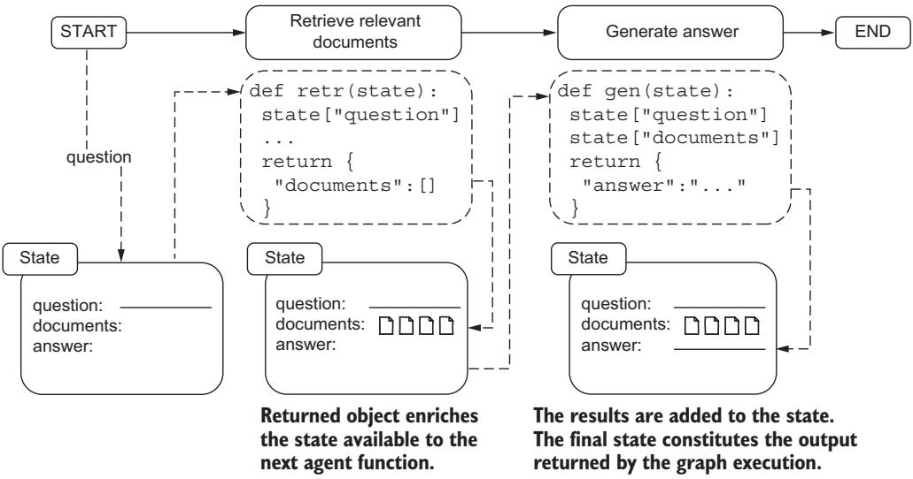  
Figure 15.2 State-based communication between agent functions in LangGraph. Agents remain decoupled while communicating through an evolving state object. Each agent function receives and updates the global state independently.

This approach ensures that the system maintains a coherent state throughout the workflow while enabling AI system designers to create a spectrum of applications, from router systems where LLMs are just one component among many, to fully autonomous systems where LLMs can determine and shape their execution paths. This flexibility in flow control makes LangGraph ideal for implementing our expert-emulating architecture, where we need to coordinate multiple specialized phases such as intent detection, schema extraction, and query generation.

#### 15.1.1 System architecture overview

With LangGraph’s capabilities clear, let’s examine how the expert-emulating approach translates into an executable workflow. Figure 15.3 shows the core components of our KG querying system, from initial user input processing through intent detection, query generation, and result presentation, with each node representing a discrete agent function. Notably, this component structure maps naturally to Lang-Graph’s agent/state architecture, where each processing step can be implemented as an agent function that receives and updates the workflow state.

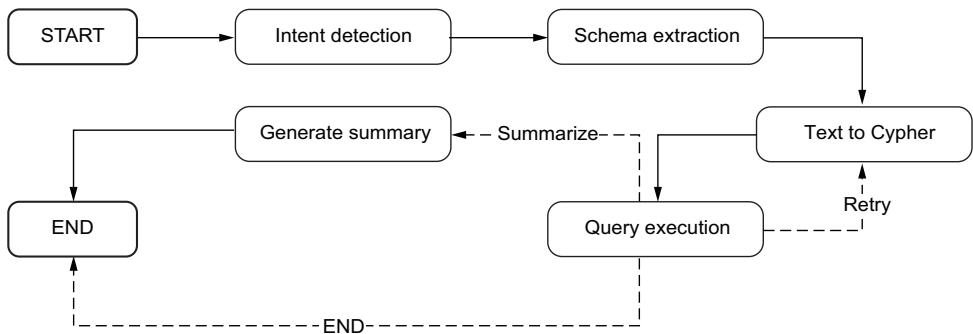  
Figure 15.3 LangGraph implementation of the KG querying pipeline. The solid arrows show the main flow from intent detection through schema extraction and query execution, and dashed arrows indicate conditional paths based on query execution outcomes. This directed graph structure directly maps each component of our expert-emulating approach to a LangGraph agent function.

The LangGraph workflow, although central to our backend system, integrates with several supporting components and interfaces with frontend applications; figure 15.4 shows a broader architectural view. At the core of the backend sits our LangGraph workflow, consuming prompts and configuration from the configuration provider while dynamically accessing graph schema information through the schema provider. These supporting components handle critical setup tasks: the configuration provider manages prompt templates and system settings, and the schema provider extracts and formats database schema for LLM consumption.

The question processing interface acts as a bridge between the core pipeline and frontend applications. It exposes the LangGraph workflow as an event stream, allowing frontends to track pipeline progress in real time. This interface processes incoming questions, feeds them through the workflow, and streams state updates and final responses back to the user interface.

This architecture cleanly separates concerns while maintaining the flexibility needed for a conversational AI system. Each component has a clear responsibility: LangGraph handles the core question-answering logic, providers manage configuration and schema access, and the processing interface handles frontend communication.

In the following sections, we’ll examine each of these architectural elements, starting with the supporting components that provide configuration management and schema translation services. We’ll then explore the state management design that enables effective communication between pipeline stages, followed by the implementation of individual pipeline agents which form the core of our question-answering system. Finally, we’ll look at how the pipeline integration layer brings these elements together into a cohesive system that can interact with frontend applications.

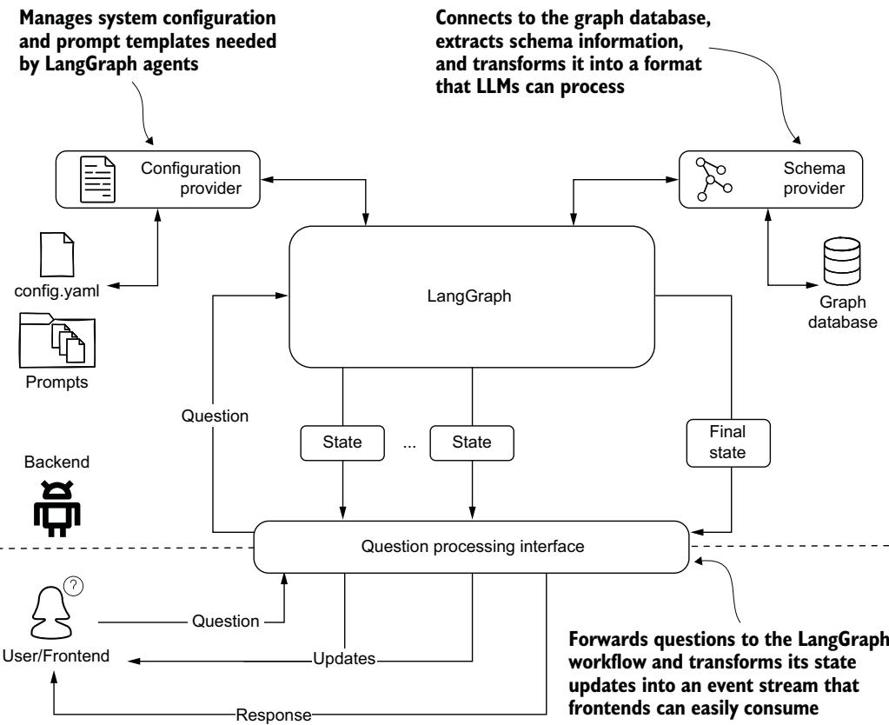  
Figure 15.4 Backend architecture showing how the LangGraph pipeline integrates with supporting components. The configuration provider manages prompts and settings, and the schema provider handles database schema access. The question-processing interface bridges the core pipeline with frontend applications through an event-based API.

#### 15.1.2 Configuring pipeline components

Before diving into the configuration details, let’s examine how the configuration component fits into our system architecture (see figure 15.5). The configuration component serves as a centralized repository for storing textual elements that our questionanswering system relies on, primarily prompt templates and KG annotations. This separation of concerns helps maintain clean and maintainable code by preventing these often lengthy text elements from cluttering the main implementation.

Our templates use the Jinja2 templating language, allowing for dynamic content generation at runtime. By isolating template definitions in the configuration, we create a clear boundary between template authoring and template rendering. The main code can then interact with these templates through a clean interface, remaining unaware of the underlying template composition process.

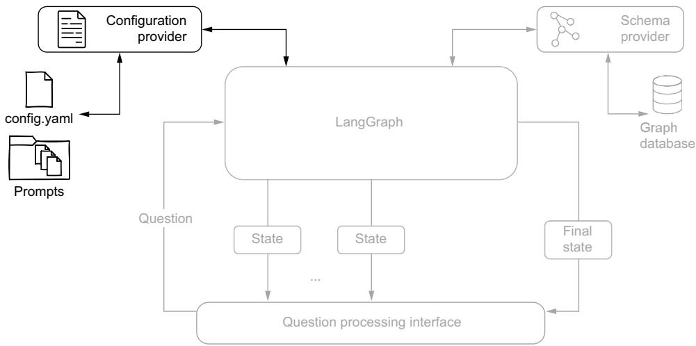  
Figure 15.5 System architecture diagram highlighting the configuration provider component. The provider manages system configuration and prompt templates needed by LangGraph agents to process user questions.

This approach offers several advantages. First, it simplifies the tuning of KG descrip tions and prompt templates, as all adjustments can be made in a single location without touching the core logic. Second, it provides a structured foundation for future extensions: adding new processing steps or modifying existing ones becomes more straightforward when all text-based resources are organized in one place. Finally, having a dedicated configuration component makes it easier to manage different versions of prompts and annotations, which is particularly valuable during the development and refinement of the system. The following listing shows an example of our configuration structure.

#### Listing 15.1 Configuration file example

notes: >   
- all POINTS properties are Neo4j Points (\`point.distance()   
and similar functions work for them)   
- do not expand ANPRCameraEvent unless you need   
to connect it to both Vehicle and ANPRCamera   
- a previous offender or known offender is defined by the fact that   
the node is connected to crimes   
examples:   
question: Crimes that occurred on March 14th, 2025   
answer: MATCH (c:Crime) WHERE c.date starts with "2025-03-14"   
reasoning: >-   
To find the crimes that occurred on that date, we leverage   
the <b>date</b> property of the crime node.   
Since it is formatted as an ISO string, we can use the   
prefix "2025-03-14" to get all crimes that occurred on that day.   
Since there is no traversal, no paths are returned

[...]   
question: Return one male known offender aged 20 to 22   
answer: >-   
MATCH path = (person:Person)   
-[committed:COMMITTED]->(crime:Crime)   
WHERE (person.sex CONTAINS 'MALE' AND   
person.age >= 20 AND person.age <= 22)   
RETURN path LIMIT 1   
prompts:   
text\_to\_cypher:   
system: >-   
Your task is to generate a Cypher query for a Neo4j graph   
database, based on the schema definition provided,   
that answers the user question.   
template: templates/text\_to\_cypher.template   
intent\_detection:   
template: templates/intent\_detection.template   
generate\_summary:   
template: templates/summary.template

The configuration combines three key elements: operational notes that guide query generation, examples that demonstrate proper query construction, and prompt template references. The notes capture essential domain knowledge and best practices for working with the graph database, and the examples provide question–answer pairs with detailed reasoning that help the LLM understand the expected query patterns. This combination of declarative knowledge and practical examples creates a rich context that guides the LLM in generating accurate queries.

The prompts section references external templates for different pipeline stages (intent detection, query generation, and summary generation), keeping the actual prompt templates separate from their configuration. This separation allows for easier maintenance and version control of both the configuration structure and the prompt content.

Each template can be modified independently without affecting the overall configuration, making it easier to experiment with different prompt variations during development. The next listing shows how the configuration component manages template loading and dynamic content generation.

```python
Listing 15.2 Configuration component
class ChainConfiguration:
def __init__(self):
self.base = Path(__file__).parent
self.config = self.load()
def load(self):
config_file = self.base / "chain_config.yaml"
return yaml.load(config_file.open(), Loader=yaml.FullLoader)
def get_prompt(self, name, **kwargs):
system = self.config["prompts"][name].get("system")
```

```python
template_file = (
self.base / self.config["prompts"][name]["template"])
template = template_file.read_text()
prompt = jinja2_formatter(template, **kwargs)
return system, prompt
def getAnnotations(self, reload=True):
if reload:
self.config = self.load()
return {
"notes": self.config["notes"],
"examples": self.config["examples"]}
```

The ChainConfiguration class provides a clean interface for accessing our configuration elements. It offers two main methods: get\_prompt for retrieving and formatting prompt templates, and getAnnotations for accessing the notes and examples. This implementation ensures that all configuration elements are easily accessible while maintaining a clear separation between configuration storage and use.

#### 15.1.3 Schema translation service

Next, let’s examine the Schema provider component and its interaction with the graph database in our system architecture (see figure 15.6). The schema provider is a vital component in our expert-emulating question-answering system. Although our goal is to automate schema extraction, we face a fundamental challenge that we explored in chapter 14: we need access to the conceptual schema, but we can only programmatically access the technical schema.

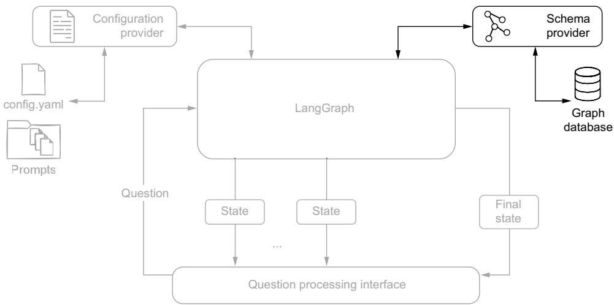  
Figure 15.6 System architecture diagram emphasizing the schema provider component, which connects to the graph database to extract and transform technical schema information into LLM-friendly formats

To solve this, we’ve developed a configuration-based transformation approach that consists of two key components. The first component is a skip list that identifies which elements should be excluded from the conceptual model. These elements include technical nodes and relationships that don’t represent business concepts, implementation-specific properties such as internal IDs and timestamps, and elements that would add unnecessary complexity to LLM prompts. The second component is a description section that enriches the filtered schema by adding business-level descriptions for nodes and relationships, contextual information about properties, and domain-specific terminology and constraints.

We store this configuration in YAML format, making it easy to maintain and update as the data model evolves. The schema provider follows a three-step process to transform the raw technical schema into an LLM-friendly format: it extracts the technical schema using Neo4j’s apoc.meta.schema, filters out technical elements using the skip list, and enriches the remaining elements with business descriptions.

Let’s examine how this is implemented in practice. First we need a data model that can represent both technical and enriched schema information, as in the following listing.

Listing 15.3 Schema provider: data model   
@dataclass   
class Property: ≤H   
"""Represents a node or relationship property with an optional   
description"""   
name: str Dataclass representing a node   
type: str or relationship property   
description: str = None   
def \_\_str\_\_(self):   
"""Represents the property as string in the format:   
property\_name:TYPE /\* optional description \*/ """   
ret = f"{self.name}: {self.type}"   
if self.description is not None:   
ret += f" /\* {self.description} \*/"   
return ret   
@dataclass Dataclass representing   
class Node: < a node type   
"""Represents a node type.""" Keeps track of all   
items = {} < nodes at a global level   
name: str   
properties: list[Property]   
description: str = None   
Instantiates nodes using   
@classmethod the node description from   
def mk\_node(cls, name, value): < apoc.meta.schema   
"""Creates a new node with the given name and properties   
from a dictionary.   
Args:   
name (str): The name of the node.

```python
value (dict): the node description as
returned by `apoc.meta.schema`
II II II
properties = [Property(name=k, type=v["type"])
for k, v in value["properties"].items()]
properties = sorted(properties, key=lambda x: x.name)
node = Node(name=name,
properties=properties)
for rel_name, rel_value in value["relationships"].items():
Relationship.mk_rels(source=name, name=rel_name,
value=rel_value)
cls.items[node.name] = node < Stores the newly created
def drop_properties(self, skipProperties): node instance in the
"""Drops specified properties from the node. Node.items dictionary
Args:
skipProperties (list): A list of property names Recomputes
to be dropped. node properties
IIII II by filtering out
self.properties = [prop for prop in self.properties properties in
if prop.name not in skipProperties] the skip list
def _str__(self): < Assembles node
"""Represents the node as string in the format: components
(:NodeType /* node class description */ { to form the
property_one:TYPE /* property one description */, desired node
property_two:TYPE /* property two description */, description
format
})
II II II
descr = ("" if self.description is None
else f"/* {self.description} */ ")
return (
f"(:{self.name} {descr}{{\n " +
",\n ".join(str(prop) for prop in self.properties) +
"\n})\n"
```

This data model provides the foundation for our schema transformation process. The Property class handles individual attributes with their descriptions, and the Node class manages the overall structure and filtering capabilities. Building on this data model, the following listing shows how the Neo4jSchema class implements our core schema management functionality.

#### Listing 15.4 Schema provider main class

```python
class Neo4jSchema:
Initializes the schema using
[...]
a technical schema from
def get_schema(self): < apoc.meta.schema
with self.driver.session() as session:
```

```python
result = list(session.run(
Parses ))[0]["value"] "CALL apoc.meta.schema({sample:-1})" Calls apoc.meta.schema
on the full database
apoc.meta.schema without sampling
results using list [Node.mk_node(k, v) for k, v in result.items()
comprehension if v["type"] == "node"]
Converts the technical schema
@staticmethod to conceptual by applying
def apply_configuration(config: dict = None): < filters and descriptions
Uses schema if config is None:
config_file = Path(__file__).parent / "schema_config.yaml"
config.yaml from
the package config = yaml.load(config_file.open(),
directory if no Loader=yaml.FullLoader)["schema"]
configuration
is provided items = {node.name: node for node in Node.items.values()
if node.name not in config["skip"]["classes"]}
Node.items = items < Recomputes the node types,
filtering out skip-list nodes
for node in Node.items.values():
Removes node.drop_properties(config["skip"]["properties"])
properties in the
skip list from for node in Node.items.values():
Node objects node.description = (config["descriptions"]["classes"]
.get(node.name))
for prop in node.properties:
Uses the property_description =(config["descriptions"]["properties"]
description from .get(node.name, {})
descriptions.classes .get(prop.name)) <
.<class_name>
prop.description = property_description
if exists Looks for
Filters out skip = config["skip"] descriptions.properties.<class
relationships with relationships = {rel_name: rel name>.<property_name>
the source node for rel_name, rel in Relationship.items.items()
in the skip list if rel.source not in skip["classes"]
if rel.dest not in skip[“classes"] if rel.name not in skip["relationships"] Filters out relationships
Filters out relationships with thedestination node in the skip list
list
for rel in Relationship.items.values():
rel.drop_properties(config["skip"]["properties"]) 4
Removes properties in the skip
Relationship.items = relationships
list from Relationship objects
def str__(self): <
Creates a Markdown
ret = ["### Graph Schema Overview\n", representation of the
"#### Node Types"] schema with node types
ret += [str(node) for node in Node.items.values()] and relationships
ret.append("#### Relationships\n")
ret += [str(rel) for rel in Relationship.items.values()]
return "\n".join(ret)
```

The get\_schema method retrieves the technical schema, and apply\_configuration handles the transformation process according to our configuration. This implementation ensures that LLMs receive a clean, conceptual view of our data model while maintaining all necessary information for query generation.

In practice, this transformed schema serves several important purposes for our LLM components. It enables them to understand the domain model at a conceptual level, generate queries using proper entity and relationship names, and consider business rules and constraints during query construction. This approach creates an effective balance between maintaining technical accuracy and providing LLMs with an accessible, business-oriented view of our data model.

#### 15.1.4 State management design

The cornerstone of agent communication in LangGraph is the state object, which serves as a shared memory space that agents can read from and write to. Each agent is responsible for populating specific portions of this state, creating a clear chain of responsibility throughout the pipeline. Let’s examine the structure of this state object.

Listing 15.5 Pipeline agent’s state   
class AgentState(TypedDict):   
question: str   
output\_type: str   
output\_type\_reason: str   
schema: str   
query: str   
query\_reasoning: str   
query\_message: str   
results\_error: list   
summary: str   
summary\_reason: str   
summary\_analysis: bool   
information: str   
retries: int

This state structure can be broken down into logical sections:

Question input (question)—Stores the original user request

Intent detection results (output\_type, output\_type\_reason)—Captures the detected visualization intent and the reasoning behind it

Schema information (schema)—Contains the graph schema in LLM-friendly format

Query generation (query, query\_reasoning, query\_message)—Holds the generated Cypher query and associated metadata

Error handling (results\_error)—Tracks any errors encountered during query execution

 Summary generation (summary, summary\_reason, summary\_analysis)—Contains the generated summary and analysis flags

Queries retry mechanism (information, retries)—Manages the retry logic for failed queries

Each field tells a story about the pipeline’s progress. The state not only carries data between agents but also maintains the context necessary for making routing decisions and handling errors gracefully.

#### 15.1.5 Pipeline agent implementation

As we discussed earlier, our expert-emulating approach maps naturally to a Lang-Graph pipeline, where each step in our question-answering process is implemented as a specialized agent. Figure 15.7 shows this pipeline structure again, highlighting how agents are connected and how the flow of information progresses from the initial question to the final answer. In this section, we will look at how these agents are made and how they interact with the LangGraph state object.

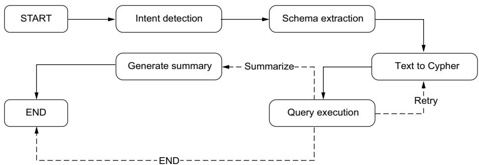  
Figure 15.7 LangGraph implementation of the knowledge expert-emulating graph-querying pipeline

#### INTENT DETECTION AGENT

The intent detection agent serves as the entry point of our pipeline: it determines how the user’s question should be visualized. It operates solely on the user’s input question and enriches the state with visualization intent information.

This agent uses the intent detection prompt we discussed in chapter 14 to analyze the question and determine the most appropriate visualization type. The agent updates two key fields in the state:

output\_type—The determined visualization format (table, graph, or map)

output\_reason—The reasoning behind the selected visualization type

Let’s examine the implementation in listing 15.6.

```python
Listing 15.6 Intent detection agent implementation
def run_prompt(self, prompt, system=""): < Handles prompt execution
messages = [HumanMessage(content=prompt)] and response processing
if self.system or system:
system = self.system if not system else system
messages = [SystemMessage(content=system)] + messages <
message = self.model.invoke(messages) Prepends a system message
to the prompt if provided
```

```python
logger.debug(f" got {message.content}")
payload = message.content Removes JSON code
payload = re.sub(r'^\s*```json\s*|\s*```\s*$', block markers from the
payload, flags=re.DOTALL) < response if present
return json5.loads(payload) <
Parses the response as JSON
using the more lenient JSON5
def intent_detection(self, state: AgentState):
system, prompt = self.config.get_prompt( <
"intent_detection", question=state["question"])
results = self.run_prompt(prompt, system)
return { < Retrieves and renders the
"output_type": results["type"], intent detection prompt
"output_reason": results["reason"]} template from configuration
Maps the response fields to their
corresponding state properties
```

The agent retrieves the intent detection prompt template from the configuration, executes it with the user’s question, and processes the LLM’s response. The response is expected in a JSON format containing the visualization type and the reasoning, which are then mapped to the corresponding state fields.

#### SCHEMA EXTRACTION AGENT

The schema extraction agent serves as a bridge between our KG and the LLM components by using the Neo4jSchema object we introduced in section 15.1.3. Its primary responsibility is to convert the KG schema into an LLM-friendly format that subsequent agents can use for query generation and reasoning. The next listing shows how the agent handles prompt execution and response processing, with particular attention to JSON parsing and error handling.

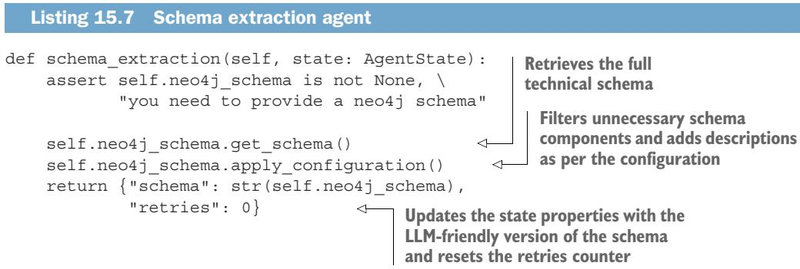

The heavy lifting is performed by the Neo4jSchema instance. The agent first ensures that a neo4j\_schema object has been provided and then retrieves the current schema and applies any configuration settings we’ve defined. The resulting schema is converted to a string format that LLMs can effectively process. Additionally, the agent initializes the retry counter to zero, preparing the state for potential query retries later in the pipeline.

#### TEXT-TO-CYPHER AGENT

The text-to-Cypher agent transforms the user’s natural language question into a Cypher query, considering both the graph’s schema and any currently selected elements in the visualization. This contextual awareness allows users to reference selected nodes or relationships without explicitly describing them, making queries more natural and concise, as we discussed in section 14.7.2. As shown in the following listing, the agent adds two pieces of information to the state before executing the prompt: annotations from the configuration provider that help guide query generation, and the current selection state from the visualization interface.

```python
Listing 15.8 Text-to-Cypher agent
def text_to_cypher(self, state: AgentState):
extra = {
"annotations": self.config.getAnnotations(),
"selection": self.selection
}
params = dict(state) | extra
system, prompt = self.config.get_prompt("text_to_cypher", **params)
logger.debug(f"prompt: {prompt}")
results = self.run_prompt(prompt, system)
return {"query": results["query"],
"query_reasoning": results["reasoning"],
"query_message": json.dumps(results)}
```

The agent merges the current state with the additional context (extra), retrieves and populates the appropriate prompt template, and then processes it through the LLM. The results include the generated Cypher query, the reasoning behind its construction, and the complete LLM response for debugging purposes. These are stored in the state’s query, query\_reasoning, and query\_message fields, respectively.

#### QUERY EXECUTION AGENT

The query execution agent, shown next, provides robust error handling and dynamic result formatting based on visualization needs.

```python
def query_execution(self, state: AgentState):
try:
results = self.neo4j_schema.run(state["query"])
if state["output_type"] in {"graph", "map"}:
self.results = list(results)
else:
self.results = results.to_df()
results_error = None
information = ""
except neo4j.exceptions.ClientError as e:
```

```python
self.results = None
results_error = str(e)
logger.info(f"got error: {e}")
information = f"""We tried:
{state['query']}
and we got:
{str(e)}

retries = state.get("retries", 0) + 1
return {"results_error": results_error,
"retries": retries,
"information": information}
```

The agent’s logic is straightforward. It attempts to execute the query stored in the state and processes the results based on the detected intent. When dealing with graph or map visualizations, it preserves the results in their native format as a list of records. However, for tabular output, it converts the results into a pandas DataFrame using Neo4j’s built-in conversion functionality.

Error handling is a vital aspect of this agent. If the query execution fails (typically due to syntax errors or schema mismatches), the agent performs several operations: it captures the error details, logs the failure for debugging purposes, constructs an error message that includes both the attempted query and the error description, and increments the retry counter to keep track of attempts.

The agent updates the state with three pieces of information. The results\_error field contains the error message if execution failed, remaining None otherwise. The retries field tracks the number of execution attempts, and the information field provides detailed context about the error for potential retry attempts. This error information is important for the post-execution routing logic, which we’ll examine next.

#### POST-QUERY EXECUTION

Figure 15.8 illustrates the routing logic implemented by this component, highlighted in the context of the overall pipeline. Unlike other components we’ve discussed, the post-query execution is not an agent but rather implements the routing logic as a dynamic edge in our LangGraph pipeline (see the following listing).

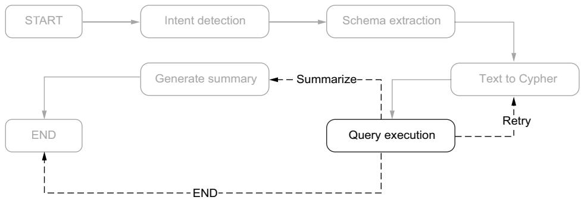  
Figure 15.8 Post-query execution routing logic in the QA pipeline, showing decision paths for retry, summarization, and direct completion

Listing 15.10 Post-query execution dynamic edge   
def post\_query\_execution(self, state: AgentState): Handles query execution   
failures with retry logic   
if state["results\_error"] is not None: < up to three attempts   
if state["retries"] < 3:   
logger.info(f"{state['retries']} runs, we retry")   
return "retry"   
else:   
logger.info(f"{state['retries']} runs are enough")   
return "END"   
if state["output\_type"] in ("map", "graph"):   
Routes to summarization   
logger.info("summarizing..") for map/graph outputs;   
return "summarize" otherwise, completes   
else:   
logger.info("no summarization is needed")   
return "END"

The routing logic follows two decision paths. First, it handles query execution failures by checking the results\_error field in the state. If an error occurred, the component implements a retry mechanism that allows up to three attempts to execute the query. This gives our system resilience against temporary failures or cases where the LLM may need multiple attempts to generate a correct query.

Second, for successful queries, the routing decision depends on the visualization intent captured in output\_type. When dealing with map or graph visualizations, the component routes the flow to the summarization step, as these visualization types benefit from additional context and explanation. However, for tabular results, which are typically self-explanatory, the pipeline can conclude directly.

This dynamic routing capability is a key feature of LangGraph, allowing us to implement complex flow control based on both execution results and user intent. The component’s simplicity belies its importance in orchestrating the overall pipeline behavior.

#### GENERATE-SUMMARY AGENT

The final agent in our pipeline generates summaries for graph and map visualizations (see listing 15.11). It combines the query results and the schema selection to create a comprehensive context for the summary generation. It merges these elements with the existing state to populate the parameters for the summary prompt template. The configuration provider supplies the appropriate prompt template, which is then executed through the LLM.

#### Listing 15.11 Generate-summary agent

```lua
def generate_summary(self, state: AgentState):
extra = {
"records": self.results,
"selection": self.selection
}
params = dict(state) | extra
system, prompt = self.config.get_prompt(
"generate_summary", **params)
logger.debug(prompt)
results = self.run_prompt(prompt, system)
return {"summary": results["summary"],
"summary_reason": results["reasoning"],
"summary_analisys": results["results_analysis"]}
```

The agent’s output enriches the state with three components: the actual summary text, the reasoning behind the summary, and a flag indicating whether additional analysis was performed. This completes our pipeline, transforming the original user question into a meaningful summary of the retrieved information.

#### PIPELINE ASSEMBLY

The implementation of our expert-emulating pipeline culminates in the construction of the LangGraph workflow. The next listing connects our agents into a cohesive graph structure.

#### Listing 15.12 Building the LangGraph pipeline graph

```python
class Agent:
def __init__(self, model):
self.neo4j_schema: Neo4jSchema = None
self.selection = []
self.results = None
self.config = ChainConfiguration()
graph = StateGraph(AgentState)
graph.add_node("intent_detection", self.intent_detection)
graph.add_edge("intent_detection", "schema_extraction")
graph.add_node("schema_extraction", self.schema_extraction)
graph.add_edge("schema_extraction", "text_to_cypher")
graph.add_node("text_to_cypher", self.text_to_cypher)
graph.add_edge("text_to_cypher", "query_execution")
graph.add_node("query_execution", self.query_execution)
graph.add_conditional_edges("query_execution",
self.post_query_execution,
{"retry": "text_to_cypher",
"summarize": "generate_summary",
"END": END})
graph.add_node("generate_summary", self.generate_summary)
graph.add_edge("generate_summary", END)
graph.set_entry_point("intent_detection")
self.graph = graph.compile(checkpointer=self.memory)
self.model = model
```

The graph construction follows a clear sequential pattern that mirrors our questionanswering workflow. The StateGraph class from LangGraph provides the foundation, initialized with our AgentState type to ensure type safety throughout the pipeline.

Each agent is added as a node in the graph, with edges defining the standard flow between them. This graph structure implements our expert-emulating approach and provides the flexibility to handle errors and different visualization requirements seamlessly in a single unified pipeline.

#### 15.1.6 Pipeline integration layer

Although LangGraph provides powerful capabilities for building complex workflows, we need to consider how applications will interact with these pipelines in practice. The simplest approach would be to use LangGraph’s invoke mode, where we provide an initial state and receive the final result once the pipeline completes. However, this would lead to a less-than-ideal user experience: users might wait for extended periods without any feedback about what’s happening behind the scenes. Figure 15.9 illustrates the integration architecture that enables real-time interaction between the LangGraph pipeline and frontend applications.

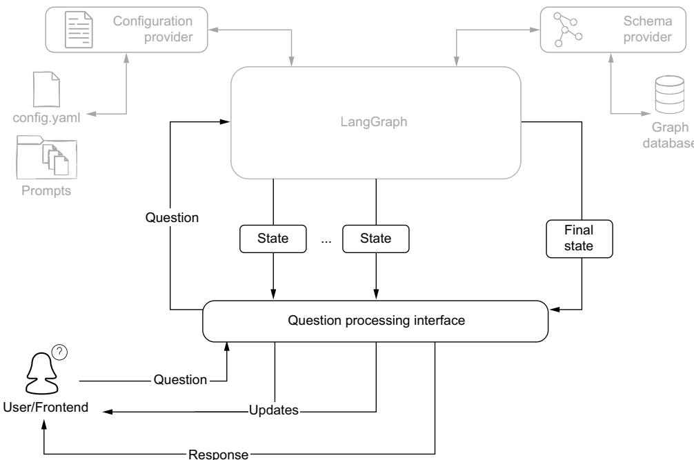  
Figure 15.9 Pipeline integration architecture showing the question processing interface mediating between LangGraph state updates and frontend interactions

LangGraph offers a stream execution mode that provides visibility into intermediate steps, but managing these updates directly can complicate the application logic. To balance the benefits of streaming with ease of use, we’ve developed an interface layer that transforms the pipeline execution into a series of well-defined events that frontends can easily consume.

The core of this interface is a generator function that processes questions and yields a sequence of events. Generator functions are well-suited for this task because they let us maintain a simple, linear code flow while producing intermediate results. The pipeline execution transforms into a clean event stream featuring strong event typing and comprehensive state tracking, as shown in the following listing.

#### Listing 15.13 Question-processing interface function

```python
Configures the pipeline Sets up the internal selection list of
execution with a unique ID dictionaries when a non-empty
selection is provided
def processQuestion(question, selection=None):
> config = { "configurable": {"thread_id": uuid.uuid4().hex}}
if selection is not None: <
pipeline.selection = [{"labels": list(node.labels)[0],
"properties": dict(node)}
for node in selection] Invokes the pipeline in
else: stream mode, where
pipeline.selection = [] each update contains
only the changed
input = {"question": question}
portion of the state
results = pipeline.graph.stream(input,
config=config,
Processes each pipeline event stream_mode="updates") < First update: tells the
in this loop until completion user that the pipeline
yield "update", "*detecting intent...*", input running the first step
for result in results:
Extracts the > node, value = list(result.items())[0]
agent’s name logger.info(f"got results: {node}, keys: {list(value.keys())}")
and state current_state = pipeline.graph.get_state(config).values 4
updates from match node: Extracts the current full state
the LangGraph case "intent_detection":
result format yield "update", "*extracting schema...*", current_state
case "schema_extraction":
In case of intent yield "update", "*generating query...*", current_state
detection or > case "text_to_cypher":
schema extraction, yield "update", "*executing the query...*", current_state
notifies the user of yield "result", ("Reasoning", value["query_reasoning"]),
the next step current_state
case "query_execution":
Surfaces the if value["results_error"]: #J
text-to-Cypher yield "result", ("ERROR", value["results_error"]),
reasoning as an current_state
intermediate result else: <
output_type = current_state["output_type"]
In case of an error in the yield output_type, pipeline.results, current_state
execution of the query, if output_type in {"graph", "map"}:
surfaces the error yield "update", "*summary generation...*",
message as an current_state Otherwise, emits a
graph/table/map event
with the results as payload
```

```python
case "generate_summary": < Surfaces the
yield "result", ("Summary", value["summary"]), summary as an
current_state intermediate result
logger.info("no more results sendin END")
current_state = pipeline.graph.get_state(config).values
yield "END", current_state, current_state < Emits an END event containing
the final agent state
When the pipeline completes,
fetches the final agent state
```

The function begins by setting up the initial configuration and state, and then it yields its first update event to inform users that intent detection has started. As the pipeline processes through each node, the generator yields appropriate events to keep the frontend informed. Each case in the pattern-matching structure corresponds to a specific pipeline stage, producing events that align with the current operation.

Each event produced by the generator follows a consistent structure: a triplet containing the response type, the response payload, and the current state of the pipeline. The response types fall into three categories:

Update events inform users about the pipeline’s progress. These events carry simple status messages like “detecting intent” or “generating query,” helping users understand which step is currently executing.

 Result events deliver textual outputs such as reasoning steps, potential errors, or generated summaries. These provide deeper insight into the pipeline’s decision-making process and help users understand how the system arrived at its conclusions.

Visualization events represent structured outputs like graphs, maps, charts, or tables. These events carry the data needed to create visual representations of the query results, allowing frontends to present information in the most appropriate format.

By including the current pipeline state with each event, we provide frontends with complete context without making assumptions about how they may use this information. This approach maintains a clean separation of concerns: the interface layer focuses on transforming pipeline execution into a stream of well-defined events while leaving presentation decisions to the frontend.

The result is an interface that keeps users informed and engaged throughout the question-answering process while maintaining clean architectural boundaries. By transforming complex pipeline execution into a simple stream of events, we’ve created a foundation that supports rich interactive experiences without sacrificing maintainability or flexibility.

### 15.2 Streamlit application

Having built our LangGraph pipeline for expert-emulating question answering, we need an interface that allows users to effectively interact with and validate the system’s capabilities. This interface must support several requirements that emerge from our expert-emulating approach.

The interface needs to support interactive graph visualization, allowing users to explore and select nodes and relationships. It must provide real-time feedback as the pipeline processes questions through its various stages. A chat-like interface is essential for natural language interaction; and the system needs to maintain complex state information about selected graph elements and processing context.

Streamlit’s features align well with these requirements. Its native support for chat interfaces provides the foundation for implementing our question-answering interactions, complete with user messages and system responses. The framework’s built-in data visualization capabilities, combined with its extensibility through custom components, enable us to create effective graph representations. Most importantly, Streamlit’s Python-first approach ensures seamless integration with our LangGraph pipeline: there’s no need to build complex APIs or handle cross-language serialization, as both frontend and backend operate in the same Python environment.

As our pipeline processes questions, it generates updates about its progress and intermediate results. Streamlit’s session state system, combined with its automatic UI updating, lets us reflect these changes in real time without building event-handling mechanisms. Users can see exactly how the expert-emulating system processes their questions.

These characteristics make Streamlit particularly suitable for prototyping and testing our system. The rapid iteration cycle means we can quickly validate how different types of questions are processed and how various visualization options perform. The framework’s low implementation overhead lets us focus on testing and refining the core expert-emulating functionality rather than dealing with frontend complexity. Although a production deployment may warrant a more specialized interface, Streamlit provides exactly what we need for developing and demonstrating our system’s capabilities.

#### 15.2.1 Application overview

Our next step is designing a functional interface that fully supports expert-emulating graph exploration. The interface must transform abstract requirements like “natural interaction” and “real-time feedback” into components that work together seamlessly. Figure 15.10 shows the main interface layout of our application.

The interface components map directly to the capabilities of our expert-emulating pipeline. Each element is designed to support specific aspects of the system.

At the heart of the application is the graph canvas, which visualizes the KG’s nodes and relationships. This central view is complemented by different interaction areas that support natural exploration and questioning workflows.

The Selection column makes questions more natural and context-aware. Users can select specific nodes from the graph and then refer to these selections in their questions using natural language. For example, with certain nodes selected, a user may ask “What are the companies related to these assets?” rather than having to specify each asset explicitly. This selection mechanism is important for testing our system’s contextawareness and verifying how well the pipeline understands and incorporates visual context into its query generation process.

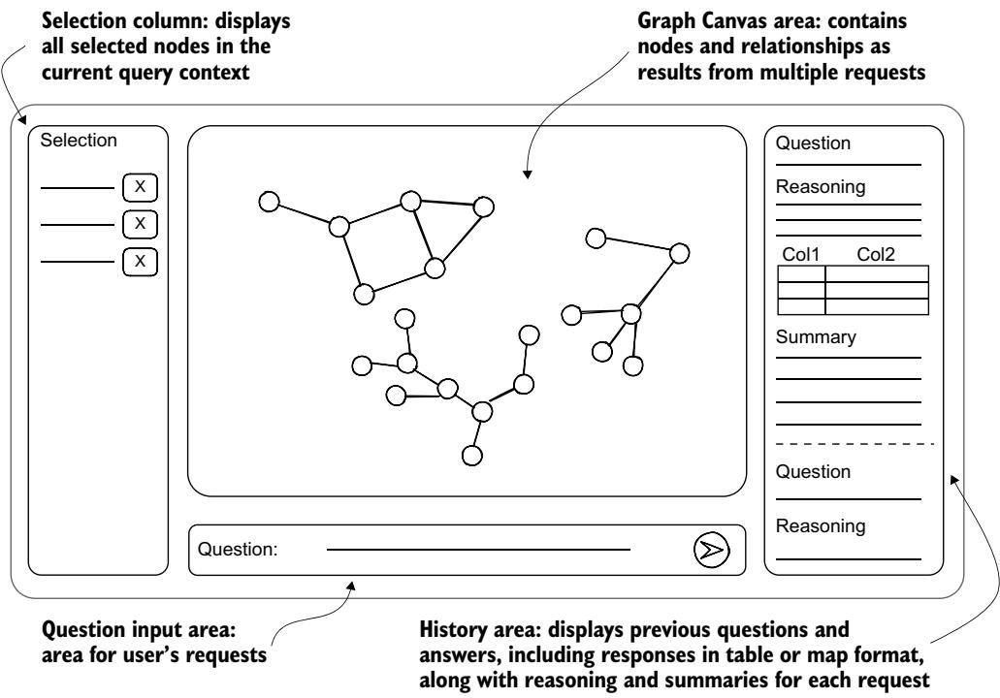  
Figure 15.10 Application interface layout demonstrating a question-answering system with selection capabilities, interactive graph visualization, and real-time response tracking

The question input area at the bottom enables users to pose their questions in natural language. These questions can range from simple fact-finding to complex relationship analysis, all while maintaining a natural conversation-like interaction style.

The history area on the right provides a comprehensive view of the question-answering process. Our expert-emulating approach can generate different types of responses, so this area adapts to display various formats. When answers include geographic information, they are presented as interactive maps. When the system determines that tabular data will be most informative, it displays well-formatted tables. Importantly, this area updates in real time as the system processes each question, showing intermediate steps and final results as they become available through our pipeline.

The history area’s real-time updates serve a dual purpose: they keep users informed of progress while also making the expert-emulating pipeline’s reasoning process visible. This transparency helps users understand how their questions are being processed and why particular visualizations or response formats were chosen.

This design creates a fluid experience where users can explore the KG, ask questions about what they see, and receive rich, multiformat responses that suit the information being conveyed. Although each question stands as an independent interaction, the continuous updates and preserved history create a seamless exploration experience.

#### 15.2.2 LangGraph integration

The integration between Streamlit and our LangGraph pipeline creates a real-time, interactive experience for users. Let’s explore how these systems work together.

The integration follows an event-driven pattern. As soon as the user clicks the Send button, the question travels through the question processing interface to the Lang-Graph pipeline. Rather than waiting for the final result, our system provides immediate feedback as each agent in the pipeline processes the question. This real-time visibility helps users understand how their questions are being analyzed and answered.

As shown in the following listing, to manage this flow of information we implement a MessageHistory object that serves two purposes. First, it maintains the complete history of interactions, allowing users to review past questions and answers. Second, it stores the current state of the pipeline, tracking which agent is actively processing the question and what intermediate results have been produced.

Listing 15.14 Message history implementation   
class MessageHistory: Messages are stored as a list of   
def init\_\_(self): dictionaries; the last one always   
self.messages = [{}] < represents the current message.   
The dictionary representing   
def update(self, message, finalize=False): the current message is   
self.messages[-1].update(message) ≤ updated with the new data.   
if finalize: < When the message is complete,   
self.messages.append({})   
a new empty dictionary is added   
to store the next message.   
@staticmethod   
def display\_message(msg): < Defines how a single message   
with st.chat\_message("user"): is displayed in the interface   
st.markdown(msg["question"])   
with st.chat\_message("assistant"): <   
if "query\_reasoning" in msg:   
st.markdown(f"##### Reasoning\n\n\*\*output type\*\*:\   
{msg['output\_type']}\`\n\n\ The display   
{msg['query\_reasoning']}") adapts based   
Converts graph data if "table" in msg: on keys in the dictionary   
stored in the “map” st.table(msg["table"]) that signal which sections   
key into a format if "map" in msg: need to be rendered.   
compatible with the map map\_ = folium.Map()   
visualization library V nodes\_to\_map(msg["map"], map\_) Shows the generated Cypher query   
st\_folium(map\_) in a collapsible section along with   
if "query" in msg: < text-to-Cypher process details   
with st.expander("Query...", expanded=False):   
st.markdown(f"\`\`\`cypher\n\n{msg['query']}\n\`\`\`")   
st.json(msg["query\_message"])   
Adds summary if "summary" in msg:   
generation details in a st.markdown(f"##### Summary\n\n{msg['summary']}")   
collapsible section for with st.expander("extra...", expanded=False):   
debugging purposes V st.json({   
"summary\_reason": msg["summary\_reason"],   
"summary\_analisys": msg["summary\_analisys"]

```python
})
st.json(msg, expanded=False) < Includes the complete
message state for debugging
def display_messages(self): < Displays
for message in self.messages:
messages
if not message: sequentially
continue
self.display_message(message)
```

The MessageHistory class maintains a list of message dictionaries, with each message potentially containing different types of content—from simple text to complex visualizations. The update method allows for progressive building of messages, reflecting the step-by-step nature of our pipeline’s processing. The display\_message method renders different content types using Streamlit’s components: Markdown for text, tables for structured data, and the Python’s folium library for maps. The implementation organizes the information hierarchy, using expandable sections for detailed information like queries and summary reasoning.

The integration between user input and the LangGraph pipeline uses a reactive pattern that manages both temporary and permanent state updates. When processing a question, the system needs to show immediate feedback while also maintaining a permanent conversation history. This is achieved through two complementary mechanisms:

Event handling with temporary placeholders shows real-time updates as the pipeline processes the question. These updates give immediate feedback but are transient, using Streamlit placeholders to display the current pipeline state.

MessageHistory accumulates the permanent state of the conversation. Rather than showing updates directly, it collects the complete state for each message until it receives an END event. Then the page re-renders using MessageHistory’s display logic, replacing the temporary updates with the final, persistent version of the conversation.

This approach, implemented in the following listing, ensures that users see both immediate feedback and a permanent record of their interaction history.

#### Listing 15.15 User input handler

```ini
[...] Displays the user’s question in the
if question := st.chat_input("What is up?"): chat history under the “user” role
with chat:
with st.chat_message("user"): < Creates a placeholder in the
st.markdown(question) “assistant” section for
with st.chat_message("assistant"): < displaying real-time updates
placeholder = st.empty()
Extracts selected
selection = [state.canvas["byId"][int(item)] nodes from the canvas
for item in state.selection] state using their IDs
```

```python
for response_type, response, current_state in \
chain.processQuestion(question=str(question), Updates MessageHistory
Sends the question selection=selection): with the current
and selection to state.messages.update(current_state) < pipeline state
the pipeline and match response_type: < Routes event handling based
begins processing on the response type
case "update": < For “update” events, displays
placeholder.markdown(response) the Markdown-formatted
For “graph” or “map” response in the placeholder
events, updates the case "graph" | "map":
canvas visualization placeholder.markdown("*updating canvas...*")
with the graph data > store_to_canvas(response) For map-type
if response_type == "map": responses, stores
state.messages.update( node data for
{"map":state.canvas["nodes"]}) map visualization
Stores tabular data in
MessageHistory for table case "table" | "chart": Renders the pandas
or chart responses state.messages.update({"table": response}) DataFrame as a
placeholder.table(response) < Streamlit table
Creates a new > with st.chat_message("assistant"):
placeholder to preserve placeholder = st.empty() Formats and displays
the table display result events with
case "result": < title and content
title, content = response
response = f"##### {title}\n\n{content}" Creates a new
placeholder.write(response) placeholder to preserve
with st.chat_message("assistant"): < the result display
placeholder = st.empty()
Stores the final state in Triggers an interface redraw to
MessageHistory and marks case "END": show the complete response
the message as complete state.messages.update(current_state, finalize=True)
st.rerun() <
```

When a user submits a question, the system creates placeholder elements in the chat interface that are progressively updated as the pipeline processes the question. The match statement handles different types of responses: updates to the chat interface for text responses, graph and map visualizations that are rendered in the canvas, tabular data that is displayed using Streamlit’s table component, formatted results with titles and content, and an END event that triggers a rerun to ensure that all UI elements are properly updated. The combination of MessageHistory and this event-handling system creates a responsive and interactive experience for users.

### 15.3 Expert-emulating investigation

To demonstrate how our expert-emulating system works in practice, let’s follow a realistic investigation workflow. We’ll see how an investigator can use natural language queries to explore connections between crimes, surveillance cameras, and vehicles while using the system’s ability to understand context and provide meaningful insights.

Our investigation will work with a subset of the KG focused on criminal incidents. As shown in figure 15.11, the schema connects Crime nodes (containing properties like location, description, and date-time) to ANPRCamera nodes (automatic number plate recognition cameras) through spatial relationships. The cameras generate CameraEvents when they detect vehicles, recording both the timestamp and location of each sighting. These events link to Vehicle nodes, which store properties such as model, color, and plate number. Vehicles in turn connect to Person nodes representing their owners, who may have links to Crime incidents through COMMITTED relationships.

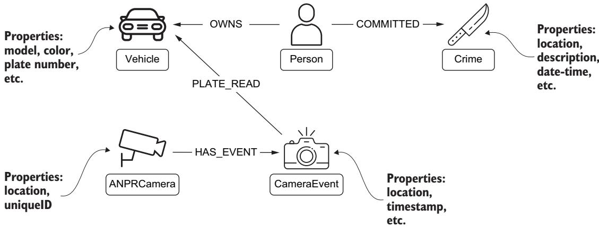  
Figure 15.11 Focused schema visualization showing how Crime, ANPRCamera, CameraEvent, Vehicle, and Person nodes interconnect for investigative queries

This seemingly simple structure allows for sophisticated queries that combine spatial analysis, temporal patterns, and relationship exploration. Let’s see how an investigator can use our system to identify vehicles of interest related to a criminal trespass incident.

#### 15.3.1 Identifying the initial case

Our investigation begins by asking the system to identify a crime currently under investigation. This demonstrates the ability to understand and translate natural language queries that combine both explicit constraints (“currently under investigation”) and implicit expectations (returning a meaningful crime for analysis). The system processes this request through our expert-emulating pipeline, first detecting that a graph visualization will be most appropriate for displaying a single node with its properties. The query generation component understands that we’re looking for an active investigation and includes relevant constraints in the generated Cypher query.

Let’s pose our first question to the system: “Return one crime node currently under investigation”. Figure 15.12 shows the system’s response, displaying a crime node representing a criminal trespass incident.

(a)  
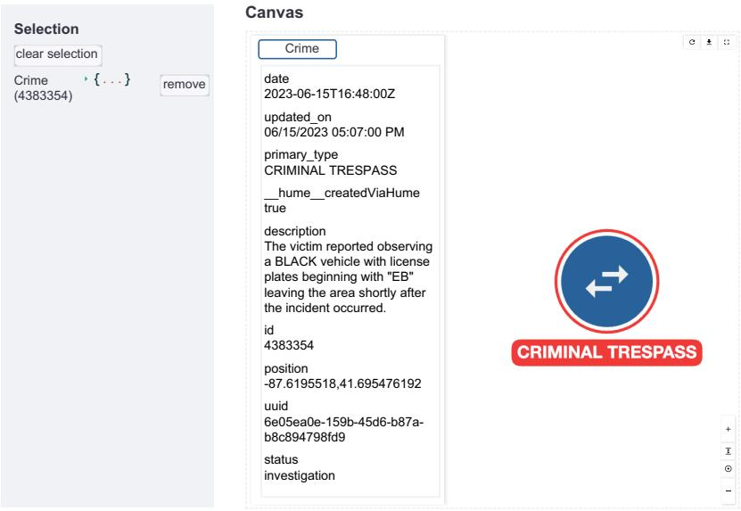

(b)  
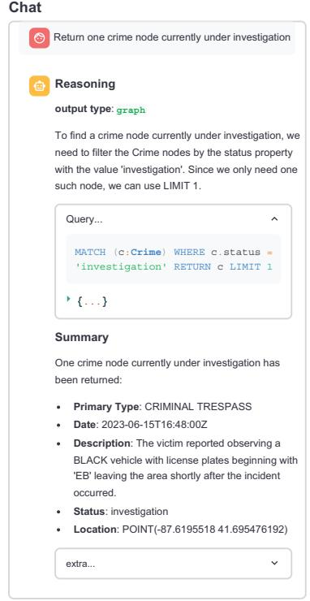  
Figure 15.12 Initial query response showing a crime node currently under investigation. The interface shows (a) the Selection panel (populated by double-clicking the crime node) and the Canvas with an information panel displaying details about the current node in the center; and (b) the chat interface with query processing details.

When the crime node is clicked, detailed information about the incident appears in the canvas area, including a narrative that mentions a black vehicle with a partial license plate number starting with "EB". This information will become valuable as our investigation progresses.

In the chat interface, we can see the system’s reasoning process, explaining why it chose this crime and how it structured the query to ensure that we received an active investigation. This transparency helps users understand how their natural language questions are being interpreted and executed.

The summary generated by our system highlights key aspects of the crime, including its classification as criminal trespass and the presence of vehicle information in the narrative. This demonstrates how our summary generation component can extract and emphasize relevant details that may be buried in property fields.

This initial interaction demonstrates several capabilities of our system: natural language understanding, appropriate visualization selection, and intelligent summarization of node properties. But more importantly, it sets the stage for increasingly complex queries that will use this context as we proceed with our investigation.

#### 15.3.2 Spatial analysis of surveillance coverage

With our crime node identified, the next logical step is to check for surveillance coverage in the area. Our system’s spatial reasoning capabilities allow us to ask about nearby ANPR cameras without needing to specify exact coordinates or distance calculations.

We double-click the crime node to add it to our selection and then enter this prompt: “Return any ANPR camera node located within 1 km from the selected crime.” Note how we can refer to “the selected crime” directly; the system understands this context from our current selection. Figure 15.13 captures this interaction, showing how the system responds with both a graph visualization and an interactive map.

The canvas now includes the crime node, along with a newly discovered ANPR camera node in yellow. What makes this response particularly powerful is the system’s decision to provide a map visualization alongside the graph view. The map displays two markers—one for the incident location and another for the camera—using colors that match their respective nodes in the graph.

The camera’s position appears strategically valuable: it’s located near an intersection that could be an entry or exit point for the area where the trespass occurred. This spatial insight, made immediately apparent through the dual visualization, suggests that this camera’s data could provide useful leads for our investigation.

This step demonstrates several sophisticated capabilities of our system: spatial query processing, selection-aware natural language understanding, and intelligent visualization selection. The adaptive response, choosing the most appropriate visualization for the data at hand, is a key feature of our expert-emulating approach.

(a)  
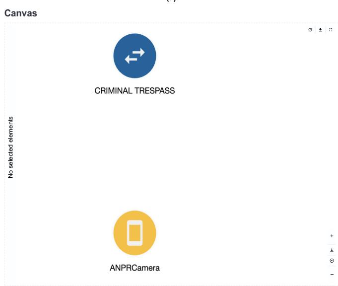  
(b)

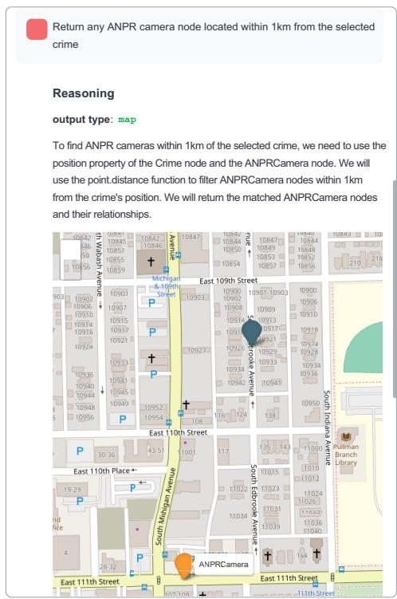  
Figure 15.13 Spatial query response showing an ANPR camera near the crime location (a). The system automatically chose a map visualization (b) to display the spatial relationship between the crime and the nearby ANPR camera.

#### 15.3.3 Vehicle pattern detection

We can now search for vehicles that match the description from the incident report. We include the ANPR camera by double-clicking its node, adding it to our current selection alongside the crime node.

Our next prompt uses this selection while adding specific vehicle criteria: “Return the vehicles detected by the selected camera on June 15, 2023. The vehicle is black and its license plate must start with EB.” Note how we can combine references to selected elements (“selected camera”) with explicit constraints about the vehicle’s appearance and license plate. Figure 15.14 shows how the system expands our visualization to include matching vehicles and their detection events.

The graph now displays multiple vehicle nodes connected to our ANPR camera through detection events, with the query’s reasoning visible in the chat interface. The system has understood the temporal constraint (“June 15, 2023”), the vehicle’s physical description (“black”), and the partial plate number (“EB”), incorporating all these elements into a single coherent query.

The summary highlights each matching vehicle, providing an overview of potential suspects. This demonstrates our system’s ability to handle multifaceted queries that combine node selection, temporal constraints, and property matching.

(a)  
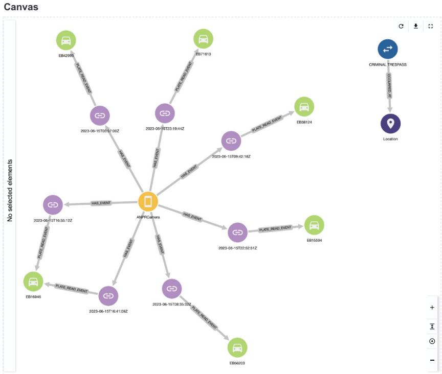

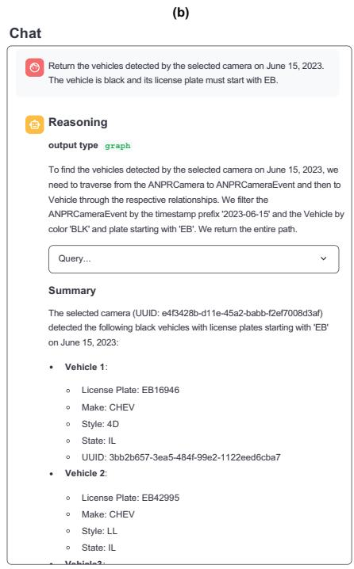  
Figure 15.14 Vehicle query results showing matching vehicles and their detection events. Each path represents a complete vehicle detection record, with timestamps visible on the event nodes. The system’s response includes both (a) the graph visualization and (b) a detailed summary of each vehicle's properties.

This step marks a significant advancement in our investigation, transforming isolated data points about a crime and a camera location into a set of vehicles that could be connected to our incident. But can we get more insight by providing additional context about our investigative goals? Let’s explore this in our next prompt.

#### 15.3.4 Context-aware request refinement

Let’s refine our approach by using our expert-emulating system’s ability to extract information from selected nodes and perform context-aware summarization. Instead of explicitly stating the vehicle description and date constraints, we can rely on the system to extract these details from our selected crime node. Moreover, by providing context about our role and investigative intent, we can guide the system toward generating more analytical insights.

We rephrase our prompt to reflect this investigative context: “I’m an investigator and I’m working on the selected crime. I need all the vehicle nodes that are compatible with the description and were detected by the selected camera the day of the incident. Are there any that seem significantly more likely to be involved in the incident?” The response, shown in figure 15.15, demonstrates how additional context transforms the system’s analysis.

(a)  
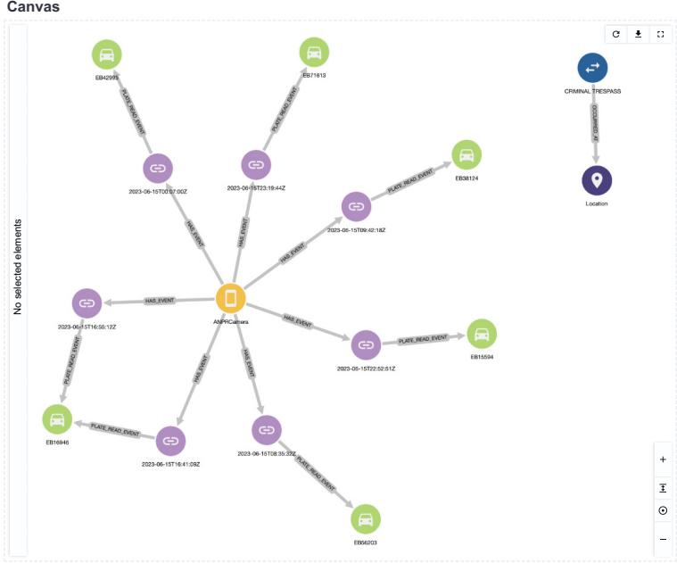

(b)  
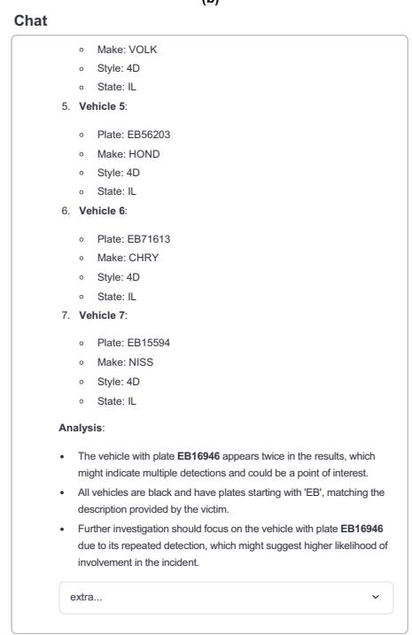  
Figure 15.15 Enhanced analysis showing the same vehicle data with investigative context (a). The system augments its response in (b) with an Analysis section that identifies patterns of interest, demonstrating how additional context leads to more insightful summarization of the same underlying data.

Although the query returns the same vehicles as before, the summarization now includes a deeper analysis of the results. The system identifies an interesting pattern: one of the matching vehicles was detected twice around the time of the incident, suggesting a potential circuit of the area that warrants further investigation.

This enhanced response demonstrates how the system can autonomously extract and apply constraints from node properties, eliminating the need for explicit restatement. It also illustrates how providing investigative context—in this case, identifying ourselves as investigators seeking suspicious patterns—enables the system to generate more relevant and insightful summaries.

The system has moved beyond simply matching criteria to actively analyzing temporal patterns that may indicate suspicious behavior. This sets the stage for our final investigative step: examining whether any of these vehicles have connections to known offenders.

#### 15.3.5 Historical record analysis

Building on our discovery of a vehicle with suspicious movement patterns, we can further enrich our investigation by considering the criminal history of vehicle owners. This type of background check is a standard investigative practice that our system can integrate naturally into its analysis.

We modify our prompt slightly: “I’m an investigator and I’m working on the selected crime. I need all the vehicle nodes that are compatible with the description and were detected by the selected camera on the day of the incident. Some of these vehicles may be owned by previous offenders. What vehicles are the most likely to be involved in the incident?”

Figure 15.16 reveals a significant breakthrough in our investigation. The system expands its analysis to include ownership relationships and criminal records, discovering that the vehicle previously flagged for suspicious movements is owned by an individual with a relevant criminal history.

Most notably, this person’s record includes a previous conviction for criminal trespass—the same type of offense we’re currently investigating. The summary agent recognizes the heightened significance of this connection, highlighting it in both the general summary and the analysis section.

This final step shows how the system can do all of the following:

Maintain contextual awareness across multiple query refinements

Integrate various types of evidence (spatial, temporal, and historical)

Identify meaningful patterns and connections

Present findings in a way that directly supports investigative decision-making

Through this investigation, we’ve seen how natural language interaction, intelligent summarization, and context-aware analysis come together to support real-world investigative workflows.

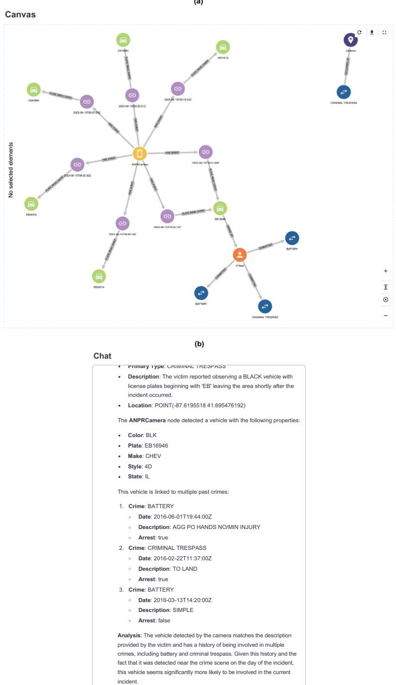  
Figure 15.16 Final investigative insight revealing criminal history. (a) The graph expands to show that a vehicle owner has connections to multiple prior crimes, including a previous criminal trespass. (b) The summary provides a detailed breakdown of the prior offenses, demonstrating the system’s ability to integrate temporal, spatial, and historical evidence into a cohesive investigative narrative.

### 15.4 Future directions and enhancements

Throughout chapters 14 and 15, we’ve explored the development of a questionanswering system for KGs. Rather than treating it as purely a language modeling problem, we’ve built a system that emulates how human experts work with graph databases: understanding schema context and constructing queries through reasoned steps. Our implementation shows how this expert-emulating approach can be realized through a pipeline of specialized agents, each handling distinct aspects of the process.

However, this implementation should be viewed as a foundation rather than as a turnkey solution. Its value lies not just in what it does but also in how it’s built. The foundation’s strength comes from its underlying architecture, particularly in how it approaches observability and expert emulation.

The system’s transparency isn’t merely for debugging; it creates natural points for collecting feedback and identifying improvements. Each component’s decision-making process is visible, making it possible to understand what the system does and also why it does it.

Equally important is the expert-emulation pattern that underlies the design. When faced with new challenges or opportunities for improvement, teams can begin with a simple but powerful question: “What would an expert do in this situation?” This human-centric approach to system design makes improvements feel natural rather than forced; they emerge from understanding and modeling expert behavior.

In the following sections, we’ll explore several paths for building on this foundation. These are examples of how the system’s observable, expert-emulating nature enables specific types of improvements.

#### 15.4.1 Learning from use

A natural starting point for system evolution uses one of our core design principles: comprehensive observability. Every query processed by the system generates rich information about user intentions, query patterns, and outcome effectiveness. This observable data creates opportunities for systematic improvement at multiple levels.

The most direct application of this observability lies in collecting and categorizing “complaint-like” questions: prompts in which users indicate that the system’s response didn’t meet their needs. Rather than treating these as failures, our observable pipeline lets us extract meaningful patterns from these instances. By categorizing these patterns using LLM-based analysis, we can surface common user challenges in a dynamic dashboard of pain points that will become a strategic tool for guiding development priorities and resource allocation.

Equally valuable will be the collection of successful interactions. When the system generates queries that users find especially helpful, the chain of reasoning can be preserved. These success patterns can then be systematically analyzed to identify what makes them effective, creating a foundation for enhancing our example database.

By analyzing patterns in user questions, we can also identify clusters of similar queries that may benefit from specialized handling. This understanding can be used to optimize downstream processes: for example, by selecting only the most relevant portions of the schema or by providing more focused examples for specific types of questions.

This learning from use demonstrates how our foundational architecture enables the system to evolve based on actual use patterns rather than predetermined rules. Improvements emerge naturally while remaining grounded in understandable, expert-like behavior.

#### 15.4.2 Enhancing core capabilities

By consistently asking “What would an expert do?” we can identify and implement improvements that align with human expertise patterns while using our observable pipeline architecture. A key area for enhancement is schema handling, where we can emulate how human experts build their understanding of a KG’s structure. Experts often run preliminary queries to understand how the data is structured and used, going beyond the basic schema definition. We can model this behavior by implementing schema enrichment agents that analyze data patterns and augment the base schema with additional context. This enriched schema information can then flow downstream to improve query generation and result interpretation.

For large-scale KGs, experts typically work with mental models at different levels of abstraction. A multilayer schema management approach could mirror this mental process. For instance, in our investigative KG, the bottom layer would contain all detailed nodes and relationships (crimes, vehicles, camera events, people), and higher layers would organize these into domain-focused views like vehicle monitoring or criminal justice records. The system could use these higher-level views for broad understanding (e.g., which domains to query) while preserving detailed descriptions for specific query generation. This layered approach manages complexity without sacrificing precision, much as human experts zoom in and out of different levels of detail as needed.

#### 15.4.3 Advanced evolution paths

More ambitious evolution paths can significantly enhance the system’s capabilities. These advanced approaches maintain our core principles while incorporating emerging techniques in language model applications.

A particularly promising direction involves moving beyond pure in-context learning for schema understanding and query generation. Our current approach of embedding schema information and examples in prompts is effective, but it faces scalability challenges with larger KGs. Fine-tuning approaches offer an alternative path. By using the schema itself as training data, we can develop KG-aware agents that have a deeper, more efficient understanding of the graph structure and relationships.

Studies have shown that in-context learning, although flexible, consistently underperforms compared to task-specific adaptation approaches [1], [2]. This performance gap persists even when both approaches have access to the same example sets. These findings suggest that moving toward fine-tuned components could significantly improve our system’s performance while potentially reducing its computational overhead.

The transition to fine-tuned components wouldn’t require abandoning our expertemulating architecture. Instead, we could selectively replace or augment in-context learning components with fine-tuned alternatives while maintaining our observable pipeline structure.

This evolution path also opens possibilities for more sophisticated query planning. Fine-tuned agents could develop a more nuanced understanding of query patterns and their relationships with different graph structures, potentially leading to more efficient and effective query generation. The system could maintain its step-by-step reasoning approach while building on a stronger foundation of graph knowledge.

#### Summary

An expert-emulating approach mimics how human experts interact with graph databases.

LangGraph’s state-based design enables creation of modular, observable AI pipelines where each component maintains independent reasoning.

Pipeline integration architecture enables real-time streaming of processing updates to interactive user interfaces.

 Context-aware query generation combines schema knowledge, user selections, and conversational history for natural interactions.

Multistep analytical workflows can integrate spatial, temporal, and historical analysis in a single coherent process.

 Message history management enables stateful conversations and real-time progress updates.