# LangGraph로 QA 에이전트 만들기 — 쉬운 해설판

> 이 문서는 Alessandro Negro의 『Knowledge Graphs and LLMs in Action』 15장 "Building a QA agent with LangGraph"를 한국어로 풀어 쓴 해설판입니다. 원문의 모든 문단, 절, 그림, 코드, 표를 빠짐없이 다루되, 번역을 넘어 "왜 이렇게 하는가"를 곁들여 설명합니다. 14장에서 설계한 전문가 모방(expert-emulating) 아키텍처를 실제로 동작하는 소프트웨어로 구현하는 것이 이 장의 목표입니다. 어조는 따뜻한 대화체이며, 코드가 많은 장이라 각 코드 조각 뒤에 해설을 붙였습니다.

---

### 이 장에서 다루는 내용 — 무엇을 만들고 배우는가

이 장에서는 다음 세 가지를 다룹니다.

- 전문가 모방 접근법을 실제로 구현하기
- 질의응답(question answering)을 통해 수사(investigation)를 진행하는 방법 구현하기
- 시스템을 상황에 맞게 조정하고 개선하기

이 장에서 우리는 대규모 언어 모델(LLM)을 활용해 지식 그래프(knowledge graph)를 질의하는 실용적인 애플리케이션을 만듭니다. 14장에서 살펴본 개념과 기법들, 그러니까 그림 15.1의 멘탈 모델(mental model, 머릿속에 그리는 개념 구조)에 담긴 아이디어들을 하나로 엮어서 통합된 솔루션을 어떻게 구축하는지 보여드리겠습니다. **LangGraph** 를 오케스트레이션(orchestration, 여러 구성요소의 실행 흐름을 조율하는 것) 프레임워크로 삼아, 각 단계가 어떻게 하나의 매끄러운 파이프라인으로 결합되는지 설명합니다. 그리고 이 시스템을 누구나 쉽게 쓸 수 있도록 **Streamlit** 을 프런트엔드(frontend) 인터페이스로 사용합니다. 이 책의 코드 저장소에는 전체 구현과 설정 파일이 들어 있으니, 개념을 따라가면서 코드를 직접 참고할 수 있습니다.

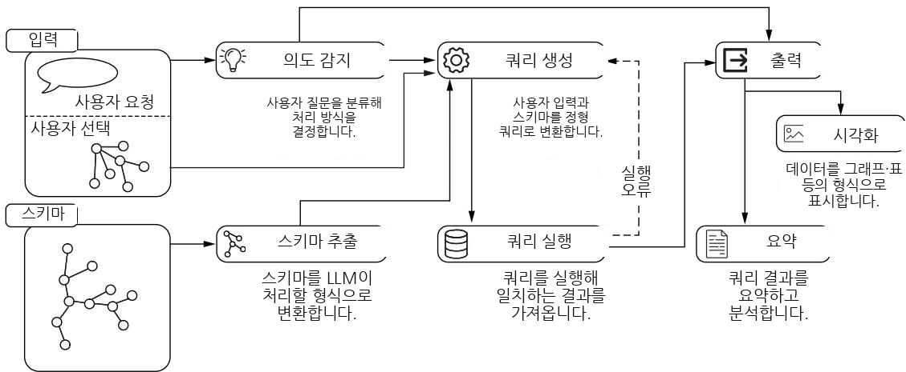

**그림 15.1** 14장에서 소개한 시스템 아키텍처의 개요입니다. 사용자 입력(질문과 사용자의 선택)과 출력(시각화와 요약)은 Streamlit이 처리하고, 핵심 파이프라인의 실행 흐름은 LangGraph가 조율합니다.

---

### 15.1 LangGraph 파이프라인 구축하기 — 상태 기반 협업의 무대

**LangGraph** 는 LLM으로 구동되는 상태 유지형(stateful), 다중 액터(multi-actor) 애플리케이션을 만들기 위해 설계된 혁신적인 라이브러리입니다. 이 프레임워크는 복잡한 추론과 의사결정 과정이 얽힌 워크플로우를 조율하는 데 특히 잘 맞는데, 이런 추론과 결정이야말로 우리의 지식 그래프 질의 파이프라인의 핵심입니다.

LangGraph가 이 개념들을 실제로 어떻게 구현하는지 이해하기 위해, 친숙한 예제부터 시작해 봅시다. 바로 관련 문서를 검색해서 질문에 대한 답을 생성하는 기본적인 **RAG(retrieval-augmented generation, 검색 증강 생성)** 시스템입니다. 우리가 만들 전문가 모방 아키텍처보다는 단순하지만, 이 예제는 앞으로 우리가 쌓아 올릴 핵심 원리를 잘 보여줍니다.

그림 15.2에서 보듯, 이 워크플로우는 두 개의 주요 작업으로 구성됩니다. 문서 검색과 답변 생성입니다. LangGraph를 남다르게 만드는 지점은 구성요소끼리 소통하는 방식입니다. 데이터를 구성요소 사이에서 직접 주고받는 대신, 각 구성요소는 **공유 상태(shared state)** 와 상호작용합니다. 마치 여러 사람이 함께 쓰는 화이트보드처럼, 각 에이전트가 앞선 작업을 읽고 자기 결과를 덧붙이는 방식입니다.

상태는 사용자의 질문에서 출발합니다. 첫 번째 에이전트인 문서 검색 담당은 상태에서 질문을 읽고, 자기가 찾은 관련 문서들을 상태에 추가합니다. 그러면 두 번째 에이전트는 원래 질문과 검색된 문서를 모두 접근할 수 있게 되어, 적절한 답변을 생성하고 이 답변을 다시 상태에 추가합니다.

아키텍처의 근본을 보면, LangGraph는 이런 워크플로우를 **유향 그래프(directed graph, 방향이 있는 그래프)** 로 구현합니다. 각 노드(node)는 서로 다른 에이전트 함수를 나타냅니다. 이 에이전트 함수들은 전역 상태(global state)와 상호작용하면서 자기 역할을 수행합니다. 필요한 데이터를 읽고, 실행이 끝나면 자기 결과로 상태를 갱신하는 식입니다. 그래프의 **엣지(edge, 노드를 잇는 간선)** 는 실행 흐름을 결정해서, 다음에 어느 노드를 실행할지 지정합니다. 중요한 점은 LangGraph가 **동적 엣지 결정(dynamic edge resolution)** 을 지원한다는 것입니다. 덕분에 워크플로우가 임의로 복잡한 로직에 따라 분기(branch)할 수 있습니다. 예를 들어, 앞선 에이전트의 출력에 따라 다음에 실행할 노드를 고를 수 있어서, 워크플로우 설계에 유연성과 적응성을 확보합니다.

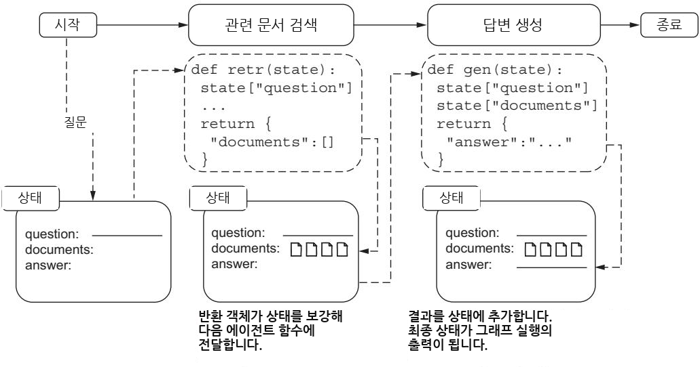

**그림 15.2** LangGraph에서 에이전트 함수들 사이의 상태 기반 소통을 보여줍니다. 에이전트들은 서로 결합(coupling)되지 않은 채, 계속 진화하는 상태 객체를 통해 소통합니다. 각 에이전트 함수는 독립적으로 전역 상태를 받아서 갱신합니다.

이 방식은 워크플로우 전체에 걸쳐 시스템이 일관된 상태를 유지하도록 보장하면서, AI 시스템 설계자가 다양한 스펙트럼의 애플리케이션을 만들 수 있게 해 줍니다. 한쪽 끝에는 LLM이 여러 구성요소 중 하나에 불과한 **라우터(router)** 시스템이 있고, 다른 쪽 끝에는 LLM이 스스로 실행 경로를 결정하고 형성하는 완전 자율(autonomous) 시스템이 있습니다. 이렇게 흐름 제어가 유연하다는 점 때문에, LangGraph는 우리의 전문가 모방 아키텍처를 구현하기에 이상적입니다. 우리는 의도 감지(intent detection), 스키마 추출(schema extraction), 질의 생성(query generation) 같은 여러 전문화된 단계를 조율해야 하기 때문입니다.

---

#### 15.1.1 시스템 아키텍처 개요 — 전문가 모방을 실행 가능한 그래프로

LangGraph의 역량을 파악했으니, 이제 전문가 모방 접근법이 실행 가능한 워크플로우로 어떻게 번역되는지 살펴봅시다. 그림 15.3은 우리 지식 그래프 질의 시스템의 핵심 구성요소를 보여줍니다. 처음 사용자 입력 처리부터 의도 감지, 질의 생성, 결과 제시까지 이어지며, 각 노드가 하나의 개별 에이전트 함수를 나타냅니다. 주목할 점은, 이 구성요소 구조가 LangGraph의 에이전트/상태 아키텍처에 자연스럽게 대응된다는 것입니다. 각 처리 단계를 워크플로우 상태를 받아서 갱신하는 에이전트 함수로 구현할 수 있기 때문입니다.

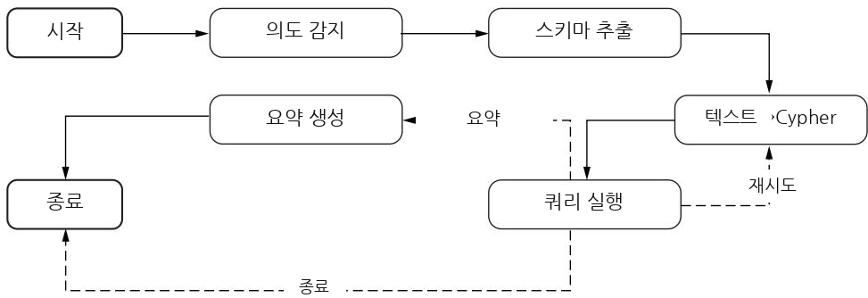

**그림 15.3** 지식 그래프 질의 파이프라인의 LangGraph 구현입니다. 실선 화살표는 의도 감지에서 스키마 추출, 질의 실행으로 이어지는 주 흐름을 보여주고, 점선 화살표는 질의 실행 결과에 따른 조건부 경로를 나타냅니다. 이 유향 그래프 구조는 우리 전문가 모방 접근법의 각 구성요소를 LangGraph 에이전트 함수에 직접 대응시킵니다.

LangGraph 워크플로우는 우리 백엔드(backend) 시스템의 중심이지만, 여러 지원 구성요소와 함께 동작하고 프런트엔드 애플리케이션과 맞물립니다. 그림 15.4는 좀 더 넓은 아키텍처 관점을 보여줍니다. 백엔드의 중심에는 우리 LangGraph 워크플로우가 자리하는데, 이 워크플로우는 **설정 제공자(configuration provider)** 로부터 프롬프트와 설정을 받아 소비하고, **스키마 제공자(schema provider)** 를 통해 그래프 스키마 정보에 동적으로 접근합니다. 이 지원 구성요소들은 중요한 준비 작업을 맡습니다. 설정 제공자는 프롬프트 템플릿과 시스템 설정을 관리하고, 스키마 제공자는 데이터베이스 스키마를 추출해 LLM이 소비하기 좋은 형태로 다듬습니다.

**질문 처리 인터페이스(question processing interface)** 는 핵심 파이프라인과 프런트엔드 애플리케이션 사이의 다리 역할을 합니다. 이 인터페이스는 LangGraph 워크플로우를 이벤트 스트림(event stream)으로 노출해서, 프런트엔드가 파이프라인 진행 상황을 실시간으로 추적할 수 있게 합니다. 들어온 질문을 처리하고, 워크플로우에 흘려보낸 뒤, 상태 갱신과 최종 응답을 사용자 인터페이스로 다시 스트리밍합니다.

이 아키텍처는 관심사(concern)를 깔끔하게 분리하면서도 대화형 AI 시스템에 필요한 유연성을 유지합니다. 각 구성요소는 명확한 책임을 가집니다. LangGraph는 핵심 질의응답 로직을 담당하고, 제공자들은 설정과 스키마 접근을 관리하며, 처리 인터페이스는 프런트엔드와의 소통을 처리합니다.

이어지는 절들에서는 이 아키텍처 요소들을 하나씩 살펴봅니다. 먼저 설정 관리와 스키마 번역 서비스를 제공하는 지원 구성요소부터 시작합니다. 그다음 파이프라인 단계들 사이의 효과적인 소통을 가능하게 하는 상태 관리 설계를 살펴보고, 이어서 질의응답 시스템의 핵심을 이루는 개별 파이프라인 에이전트의 구현을 다룹니다. 마지막으로, 이 요소들을 하나의 응집력 있는 시스템으로 묶어 프런트엔드 애플리케이션과 상호작용하게 하는 파이프라인 통합 계층(integration layer)을 살펴봅니다.

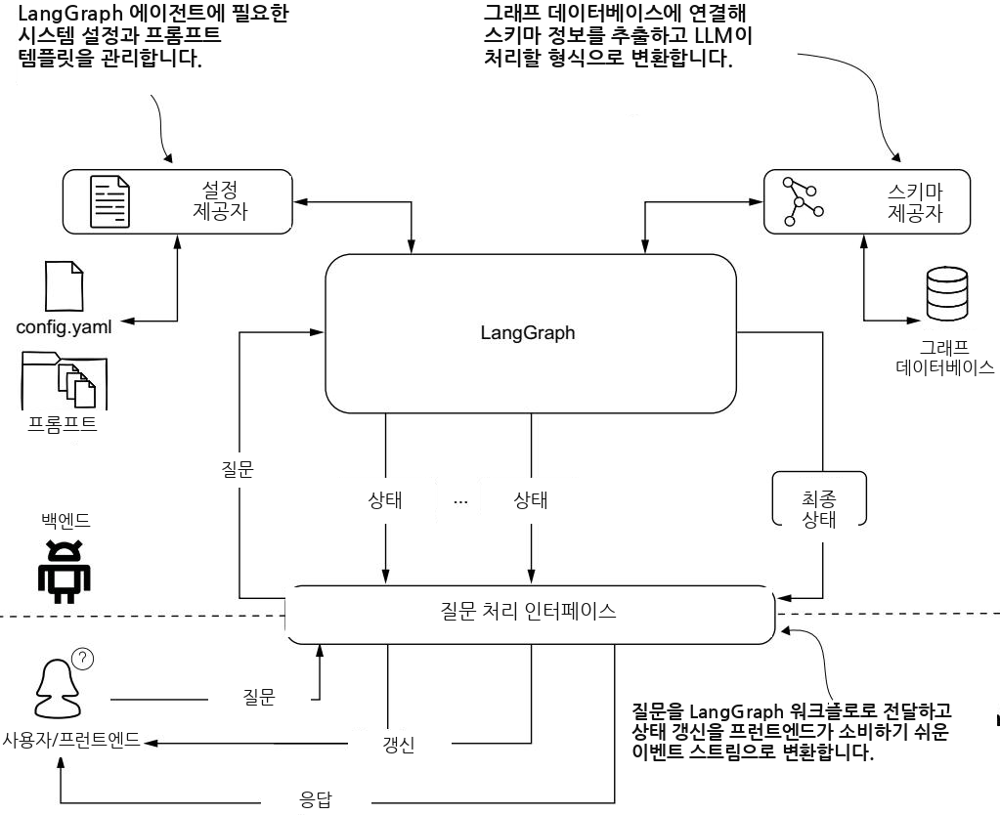

**그림 15.4** LangGraph 파이프라인이 지원 구성요소들과 어떻게 통합되는지 보여주는 백엔드 아키텍처입니다. 설정 제공자는 프롬프트와 설정을 관리하고, 스키마 제공자는 데이터베이스 스키마 접근을 담당합니다. 질문 처리 인터페이스는 이벤트 기반 API를 통해 핵심 파이프라인과 프런트엔드 애플리케이션을 이어 줍니다.

---

#### 15.1.2 파이프라인 구성요소 설정하기 — 텍스트 자원을 한곳에 모으기

설정의 세부 내용으로 들어가기 전에, 설정 구성요소가 우리 시스템 아키텍처 안에서 어떤 위치를 차지하는지 먼저 살펴봅시다(그림 15.5 참고). 설정 구성요소는 우리 질의응답 시스템이 의존하는 텍스트 요소들, 주로 프롬프트 템플릿과 지식 그래프 주석(annotation)을 저장하는 중앙 저장소 역할을 합니다. 이렇게 관심사를 분리하면, 종종 길어지기 마련인 이런 텍스트 요소들이 핵심 구현 코드를 어지럽히지 않아서 코드를 깔끔하고 유지보수하기 쉽게 유지할 수 있습니다.

우리 템플릿은 **Jinja2** 템플릿 언어를 사용하는데, 이 덕분에 실행 시점(runtime)에 동적으로 내용을 생성할 수 있습니다. 템플릿 정의를 설정 안에 격리해 둠으로써, 템플릿을 작성하는 일과 템플릿을 렌더링(rendering)하는 일 사이에 명확한 경계를 만듭니다. 그러면 핵심 코드는 깔끔한 인터페이스를 통해 이 템플릿들과 상호작용할 수 있고, 그 밑에서 템플릿이 어떻게 조립되는지는 알 필요가 없습니다.

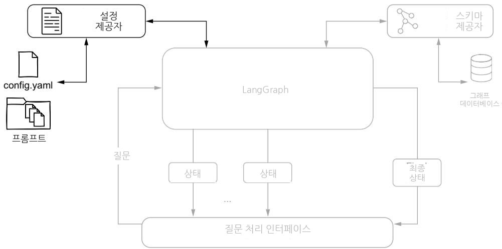

**그림 15.5** 설정 제공자 구성요소를 강조한 시스템 아키텍처 다이어그램입니다. 이 제공자는 LangGraph 에이전트들이 사용자 질문을 처리하는 데 필요한 시스템 설정과 프롬프트 템플릿을 관리합니다.

이 방식에는 몇 가지 장점이 있습니다. 첫째, 지식 그래프 설명과 프롬프트 템플릿을 조정하는 일이 간단해집니다. 모든 조정을 핵심 로직은 건드리지 않고 한 곳에서 할 수 있기 때문입니다. 둘째, 앞으로의 확장을 위한 구조적 토대를 제공합니다. 모든 텍스트 기반 자원이 한곳에 정리되어 있으면, 새 처리 단계를 추가하거나 기존 단계를 수정하는 일이 훨씬 수월해집니다. 마지막으로, 전용 설정 구성요소를 두면 여러 버전의 프롬프트와 주석을 관리하기 쉬워집니다. 이 점은 시스템을 개발하고 다듬는 과정에서 특히 값집니다. 다음 리스팅은 우리 설정 구조의 예시를 보여줍니다.

##### 리스팅 15.1 설정 파일 예시

```yaml
notes: >
- all POINTS properties are Neo4j Points (`point.distance()`
and similar functions work for them)
- do not expand ANPRCameraEvent unless you need
to connect it to both Vehicle and ANPRCamera
- a previous offender or known offender is defined by the fact that
the node is connected to crimes
examples:
question: Crimes that occurred on March 14th, 2025
answer: MATCH (c:Crime) WHERE c.date starts with "2025-03-14"
reasoning: >-
To find the crimes that occurred on that date, we leverage
the <b>date</b> property of the crime node.
Since it is formatted as an ISO string, we can use the
prefix "2025-03-14" to get all crimes that occurred on that day.
Since there is no traversal, no paths are returned

[...]
question: Return one male known offender aged 20 to 22
answer: >-
MATCH path = (person:Person)
-[committed:COMMITTED]->(crime:Crime)
WHERE (person.sex CONTAINS 'MALE' AND
person.age >= 20 AND person.age <= 22)
RETURN path LIMIT 1
prompts:
text_to_cypher:
system: >-
Your task is to generate a Cypher query for a Neo4j graph
database, based on the schema definition provided,
that answers the user question.
template: templates/text_to_cypher.template
intent_detection:
template: templates/intent_detection.template
generate_summary:
template: templates/summary.template
```

이 YAML 설정은 세 가지 핵심 요소를 결합합니다. 질의 생성을 안내하는 운영 노트(`notes`), 올바른 질의 구성을 시연하는 예시(`examples`), 그리고 프롬프트 템플릿 참조(`prompts`)입니다. 노트는 그래프 데이터베이스를 다룰 때 필요한 핵심 도메인 지식과 모범 사례를 담습니다. 예를 들어 "`POINTS` 속성은 모두 Neo4j의 Point 타입이라 `point.distance()` 같은 함수가 동작한다", "`ANPRCameraEvent`는 Vehicle과 ANPRCamera 양쪽에 연결할 필요가 있을 때만 펼쳐라", "이전 범죄자 또는 알려진 범죄자는 해당 노드가 범죄(crime)에 연결되어 있다는 사실로 정의된다" 같은 규칙입니다. 그리고 예시는 상세한 추론과 함께 질문-답변 쌍을 제공해서, LLM이 기대되는 질의 패턴을 이해하도록 돕습니다. 이렇게 선언적 지식(declarative knowledge)과 실용적 예시를 결합하면, LLM이 정확한 질의를 생성하도록 안내하는 풍부한 맥락(context)이 만들어집니다.

`prompts` 섹션은 파이프라인 단계별(의도 감지, 질의 생성, 요약 생성)로 외부 템플릿을 참조하는데, 이렇게 해서 실제 프롬프트 템플릿을 그 설정과 분리해 둡니다. 이 분리 덕분에 설정 구조와 프롬프트 내용을 각각 더 쉽게 유지보수하고 버전 관리할 수 있습니다.

각 템플릿은 전체 설정에 영향을 주지 않고 독립적으로 수정할 수 있어서, 개발 중에 다양한 프롬프트 변형을 실험하기가 쉬워집니다. 다음 리스팅은 설정 구성요소가 템플릿 로딩과 동적 내용 생성을 어떻게 관리하는지 보여줍니다.

```python
# 리스팅 15.2 설정 구성요소
class ChainConfiguration:
    def __init__(self):
        self.base = Path(__file__).parent
        self.config = self.load()

    def load(self):
        config_file = self.base / "chain_config.yaml"
        return yaml.load(config_file.open(), Loader=yaml.FullLoader)

    def get_prompt(self, name, **kwargs):
        system = self.config["prompts"][name].get("system")
        template_file = (
            self.base / self.config["prompts"][name]["template"])
        template = template_file.read_text()
        prompt = jinja2_formatter(template, **kwargs)
        return system, prompt

    def getAnnotations(self, reload=True):
        if reload:
            self.config = self.load()
        return {
            "notes": self.config["notes"],
            "examples": self.config["examples"]}
```

`ChainConfiguration` 클래스는 우리 설정 요소들에 접근하기 위한 깔끔한 인터페이스를 제공합니다. 두 개의 주요 메서드를 갖습니다. 프롬프트 템플릿을 가져와 형식을 채워 주는 `get_prompt`, 그리고 노트와 예시에 접근하는 `getAnnotations`입니다. `get_prompt`는 YAML에서 해당 이름의 시스템 메시지(`system`)를 꺼내고, 지정된 템플릿 파일을 읽은 뒤, 넘겨받은 키워드 인자(`**kwargs`)로 Jinja2 렌더링을 수행해 완성된 프롬프트를 돌려줍니다. `getAnnotations`는 `reload=True`이면 설정을 다시 읽어 최신 상태를 반영한 뒤 노트와 예시를 반환합니다. 이 구현은 모든 설정 요소를 쉽게 접근할 수 있게 하면서도, 설정의 저장과 사용 사이에 명확한 분리를 유지합니다.

---

#### 15.1.3 스키마 번역 서비스 — 기술 스키마를 개념 스키마로 다듬기

다음으로, 스키마 제공자(Schema provider) 구성요소와 그것이 우리 아키텍처 안에서 그래프 데이터베이스와 어떻게 상호작용하는지 살펴봅시다(그림 15.6 참고). 스키마 제공자는 우리 전문가 모방 질의응답 시스템에서 대단히 중요한 구성요소입니다. 우리 목표는 스키마 추출을 자동화하는 것이지만, 14장에서 살펴본 근본적인 난관에 부딪힙니다. 우리에게 필요한 것은 **개념 스키마(conceptual schema)**, 즉 사람이 이해하는 비즈니스 수준의 구조인데, 프로그램으로 접근할 수 있는 것은 **기술 스키마(technical schema)**, 즉 데이터베이스가 실제로 저장한 구조뿐입니다.

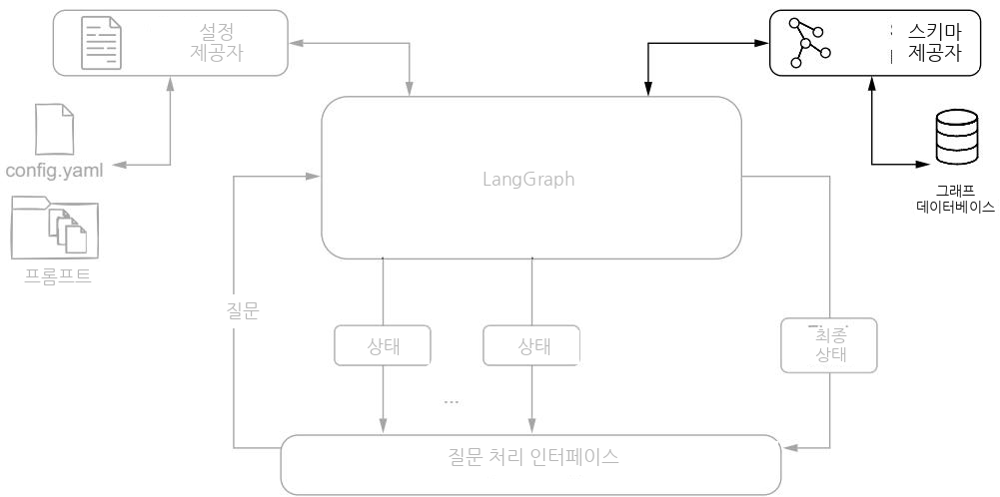

**그림 15.6** 스키마 제공자 구성요소를 강조한 시스템 아키텍처 다이어그램입니다. 이 구성요소는 그래프 데이터베이스에 연결해서 기술 스키마 정보를 추출하고, 이를 LLM이 다루기 좋은 형태로 변환합니다.

이 문제를 풀기 위해, 우리는 설정 기반 변환(configuration-based transformation) 접근법을 개발했습니다. 이 접근법은 두 가지 핵심 요소로 이루어집니다. 첫 번째 요소는 **스킵 리스트(skip list)** 로, 개념 모델에서 제외해야 할 요소들을 지정합니다. 여기에는 비즈니스 개념을 나타내지 않는 기술적 노드와 관계, 내부 ID나 타임스탬프 같은 구현 특유의 속성, 그리고 LLM 프롬프트에 불필요한 복잡성을 더할 요소들이 포함됩니다. 두 번째 요소는 **설명 섹션(description section)** 으로, 걸러낸 스키마를 풍부하게 만듭니다. 노드와 관계에 비즈니스 수준의 설명을 붙이고, 속성에 대한 맥락 정보와 도메인 특유의 용어 및 제약을 덧붙입니다.

우리는 이 설정을 YAML 형식으로 저장하는데, 데이터 모델이 진화해도 유지보수와 갱신이 쉽기 때문입니다. 스키마 제공자는 세 단계 과정을 거쳐 원본 기술 스키마를 LLM 친화적 형태로 변환합니다. 먼저 Neo4j의 `apoc.meta.schema`를 사용해 기술 스키마를 추출하고, 스킵 리스트로 기술적 요소를 걸러내며, 남은 요소에 비즈니스 설명을 덧붙입니다.

이것이 실제로 어떻게 구현되는지 살펴봅시다. 먼저 기술 스키마와 풍부해진(enriched) 스키마 정보를 모두 표현할 수 있는 데이터 모델이 필요합니다. 다음 리스팅이 그것입니다.

```python
# 리스팅 15.3 스키마 제공자: 데이터 모델
@dataclass
class Property:
    """설명(옵션)을 포함한 노드/관계 속성을 표현한다."""
    name: str
    type: str
    description: str = None

    def __str__(self):
        """속성을 다음 형식의 문자열로 표현한다:
        property_name:TYPE /* optional description */ """
        ret = f"{self.name}: {self.type}"
        if self.description is not None:
            ret += f" /* {self.description} */"
        return ret

@dataclass
class Node:
    """노드 타입을 표현한다."""
    items = {}          # 전역 수준에서 모든 노드를 추적
    name: str
    properties: list[Property]
    description: str = None

    @classmethod
    def mk_node(cls, name, value):
        """주어진 이름과 (딕셔너리 형태의) 속성으로 새 노드를 만든다.
        Args:
            name (str): 노드 이름.
            value (dict): apoc.meta.schema가 반환한 노드 설명
        """
        properties = [Property(name=k, type=v["type"])
                      for k, v in value["properties"].items()]
        properties = sorted(properties, key=lambda x: x.name)
        node = Node(name=name,
                    properties=properties)
        for rel_name, rel_value in value["relationships"].items():
            Relationship.mk_rels(source=name, name=rel_name,
                                 value=rel_value)
        cls.items[node.name] = node    # 새로 만든 노드를 Node.items 딕셔너리에 저장

    def drop_properties(self, skipProperties):
        """지정된 속성을 노드에서 제거한다.
        Args:
            skipProperties (list): 제거할 속성 이름 목록
        """
        self.properties = [prop for prop in self.properties
                           if prop.name not in skipProperties]

    def __str__(self):
        """노드를 다음 형식의 문자열로 표현한다:
        (:NodeType /* node class description */ {
          property_one:TYPE /* property one description */,
          property_two:TYPE /* property two description */,
        })
        """
        descr = ("" if self.description is None
                 else f"/* {self.description} */ ")
        return (
            f"(:{self.name} {descr}{{\n " +
            ",\n ".join(str(prop) for prop in self.properties) +
            "\n})\n")
```

이 데이터 모델은 우리 스키마 변환 과정의 토대를 제공합니다. `Property` 클래스는 개별 속성과 그 설명을 다루고, `Node` 클래스는 전체 구조와 필터링 기능을 관리합니다. 몇 가지 눈여겨볼 점이 있습니다. `Node.items`는 클래스 변수(class variable)라서 지금까지 만들어진 모든 노드를 전역 수준에서 추적합니다. `mk_node`는 클래스 메서드로, `apoc.meta.schema`가 돌려준 노드 설명 딕셔너리를 받아 속성들을 만들고, 이름순으로 정렬한 뒤, 그 노드가 가진 관계들도 `Relationship.mk_rels`로 함께 생성합니다. `drop_properties`는 스킵 리스트에 있는 속성을 걸러내 노드의 속성 목록을 다시 계산합니다. 그리고 `__str__` 메서드는 노드를 사람이 읽기 좋은(그리고 LLM이 이해하기 좋은) 텍스트 형식으로 조립하는데, 노드 타입, 클래스 설명 주석, 그리고 각 속성과 그 설명을 한데 모아 `(:NodeType /* ... */ { ... })` 꼴로 만듭니다.

이 데이터 모델을 바탕으로, 다음 리스팅은 `Neo4jSchema` 클래스가 우리 핵심 스키마 관리 기능을 어떻게 구현하는지 보여줍니다.

##### 리스팅 15.4 스키마 제공자 메인 클래스

```python
class Neo4jSchema:
    # apoc.meta.schema로부터 얻은 기술 스키마로 스키마를 초기화한다
    [...]

    def get_schema(self):    # apoc.meta.schema로 기술 스키마를 가져온다
        with self.driver.session() as session:
            result = list(session.run(
                "CALL apoc.meta.schema({sample:-1})"    # 표본 추출 없이 전체 DB에 대해 호출
            ))[0]["value"]
        # 기술 스키마 결과를 리스트 컴프리헨션으로 파싱한다
        [Node.mk_node(k, v) for k, v in result.items()
         if v["type"] == "node"]

    @staticmethod
    def apply_configuration(config: dict = None):
        # 필터와 설명을 적용해 기술 스키마를 개념 스키마로 변환한다
        if config is None:
            # 설정이 주어지지 않으면 패키지 디렉터리의 schema_config.yaml을 사용
            config_file = Path(__file__).parent / "schema_config.yaml"
            config = yaml.load(config_file.open(),
                               Loader=yaml.FullLoader)["schema"]
        # 스킵 리스트에 든 노드를 걸러내고 노드 타입을 다시 계산
        items = {node.name: node for node in Node.items.values()
                 if node.name not in config["skip"]["classes"]}
        Node.items = items
        for node in Node.items.values():
            # 스킵 리스트의 속성을 Node 객체에서 제거
            node.drop_properties(config["skip"]["properties"])
        for node in Node.items.values():
            # descriptions.classes.<class_name>에서 클래스 설명을 가져와 붙인다
            node.description = (config["descriptions"]["classes"]
                                .get(node.name))
            for prop in node.properties:
                # descriptions.properties.<class_name>.<property_name>에서
                # 속성 설명을 찾아 붙인다(있을 때만)
                property_description = (config["descriptions"]["properties"]
                                        .get(node.name, {})
                                        .get(prop.name))
                prop.description = property_description
        # 소스/목적지 노드나 관계 이름이 스킵 리스트에 든 관계를 걸러낸다
        skip = config["skip"]
        relationships = {rel_name: rel
                         for rel_name, rel in Relationship.items.items()
                         if rel.source not in skip["classes"]
                         if rel.dest not in skip["classes"]
                         if rel.name not in skip["relationships"]}
        for rel in Relationship.items.values():
            # 스킵 리스트의 속성을 Relationship 객체에서 제거
            rel.drop_properties(config["skip"]["properties"])
        Relationship.items = relationships

    def __str__(self):
        # 노드 타입과 관계를 담은 스키마의 Markdown 표현을 만든다
        ret = ["### Graph Schema Overview\n",
               "#### Node Types"]
        ret += [str(node) for node in Node.items.values()]
        ret.append("#### Relationships\n")
        ret += [str(rel) for rel in Relationship.items.values()]
        return "\n".join(ret)
```

> 참고: 위 리스팅은 원서의 OCR 판본에서 주석과 코드가 뒤섞여 다소 흐트러져 있었습니다. 여기서는 의미가 통하도록 정돈했지만, 실제 저장소 코드와 세부는 다를 수 있으니 개념 흐름 위주로 읽어 주세요.

`get_schema` 메서드는 기술 스키마를 가져오고, `apply_configuration`은 우리 설정에 따라 변환 과정을 처리합니다. 흐름을 정리하면 이렇습니다. `get_schema`는 `apoc.meta.schema`를 표본 추출 없이(`sample:-1`) 전체 데이터베이스에 대해 호출한 뒤, 그 결과 중 타입이 `node`인 항목들을 `Node.mk_node`로 만들어 냅니다. `apply_configuration`은 정적 메서드로, 설정이 없으면 패키지 디렉터리의 `schema_config.yaml`을 읽어 씁니다. 그런 다음 스킵 리스트의 클래스를 걸러 노드 목록을 다시 만들고, 각 노드에서 스킵 속성을 제거하며, 설정의 `descriptions` 섹션에서 클래스와 속성 설명을 찾아 붙입니다. 관계도 마찬가지로 소스·목적지 노드나 관계 이름이 스킵 리스트에 걸리면 제외하고, 스킵 속성을 제거합니다. 마지막으로 `__str__`은 이 모든 결과를 노드 타입과 관계로 나눈 Markdown 표현으로 조립합니다. 이 구현 덕분에 LLM은 우리 데이터 모델을 깔끔한 개념적 관점으로 받으면서도, 질의 생성에 필요한 정보는 모두 유지합니다.

실제로 이렇게 변환된 스키마는 우리 LLM 구성요소에게 여러 가지 중요한 쓸모를 갖습니다. LLM이 도메인 모델을 개념 수준에서 이해하게 하고, 올바른 엔티티(entity)와 관계 이름을 써서 질의를 생성하게 하며, 질의를 구성하는 동안 비즈니스 규칙과 제약을 고려하게 합니다. 이 접근법은 기술적 정확성을 유지하는 것과, LLM에게 접근하기 쉬운 비즈니스 지향 관점을 제공하는 것 사이에서 효과적인 균형을 만들어 냅니다.

---

#### 15.1.4 상태 관리 설계 — 에이전트들이 함께 쓰는 공유 메모리

LangGraph에서 에이전트 소통의 초석은 **상태 객체(state object)** 입니다. 이 객체는 에이전트들이 읽고 쓸 수 있는 공유 메모리 공간 역할을 합니다. 각 에이전트는 이 상태의 특정 부분을 채우는 책임을 지며, 그렇게 해서 파이프라인 전체에 걸쳐 명확한 책임의 사슬(chain of responsibility)이 만들어집니다. 이 상태 객체의 구조를 살펴봅시다.

```python
# 리스팅 15.5 파이프라인 에이전트의 상태
class AgentState(TypedDict):
    question: str
    output_type: str
    output_type_reason: str
    schema: str
    query: str
    query_reasoning: str
    query_message: str
    results_error: list
    summary: str
    summary_reason: str
    summary_analysis: bool
    information: str
    retries: int
```

이 상태 구조는 논리적으로 다음과 같은 섹션으로 나눌 수 있습니다.

- **질문 입력(`question`)** — 원래 사용자 요청을 저장합니다.
- **의도 감지 결과(`output_type`, `output_type_reason`)** — 감지된 시각화 의도와 그 판단의 근거를 담습니다.
- **스키마 정보(`schema`)** — 그래프 스키마를 LLM 친화적 형태로 담습니다.
- **질의 생성(`query`, `query_reasoning`, `query_message`)** — 생성된 Cypher 질의와 관련 메타데이터를 보관합니다.
- **오류 처리(`results_error`)** — 질의 실행 중 마주친 오류를 추적합니다.
- **요약 생성(`summary`, `summary_reason`, `summary_analysis`)** — 생성된 요약과 분석 플래그를 담습니다.
- **질의 재시도 메커니즘(`information`, `retries`)** — 실패한 질의의 재시도 로직을 관리합니다.

각 필드는 파이프라인의 진행 과정에 관한 이야기를 하나씩 들려줍니다. 상태는 단순히 에이전트들 사이로 데이터를 나르는 데 그치지 않고, 라우팅(routing, 다음 경로 선택) 결정을 내리고 오류를 우아하게 처리하는 데 필요한 맥락까지 함께 유지합니다.

---

#### 15.1.5 파이프라인 에이전트 구현 — 단계마다 전문 에이전트 하나

앞서 이야기했듯, 우리의 전문가 모방 접근법은 LangGraph 파이프라인에 자연스럽게 대응됩니다. 질의응답 과정의 각 단계가 전문화된 에이전트 하나로 구현되는 식입니다. 그림 15.7은 이 파이프라인 구조를 다시 보여주면서, 에이전트들이 어떻게 연결되고 정보의 흐름이 처음 질문에서 최종 답변까지 어떻게 진행되는지 강조합니다. 이 절에서는 이 에이전트들이 어떻게 만들어지고, LangGraph 상태 객체와 어떻게 상호작용하는지 살펴봅니다.

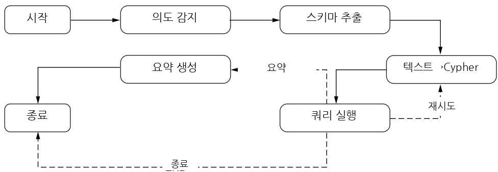

**그림 15.7** 지식 전문가 모방 그래프 질의 파이프라인의 LangGraph 구현입니다.

---

##### 의도 감지 에이전트 (INTENT DETECTION AGENT)

의도 감지 에이전트는 우리 파이프라인의 진입점(entry point) 역할을 합니다. 이 에이전트는 사용자의 질문을 어떻게 시각화해야 할지를 결정합니다. 오직 사용자의 입력 질문만 가지고 동작하며, 시각화 의도 정보로 상태를 풍부하게 만듭니다.

이 에이전트는 14장에서 다룬 의도 감지 프롬프트를 사용해 질문을 분석하고, 가장 적절한 시각화 유형을 결정합니다. 에이전트는 상태의 두 핵심 필드를 갱신합니다.

- **`output_type`** — 결정된 시각화 형식(표, 그래프, 지도).
- **`output_reason`** — 선택된 시각화 유형의 근거.

리스팅 15.6에서 구현을 살펴봅시다.

```python
# 리스팅 15.6 의도 감지 에이전트 구현
def run_prompt(self, prompt, system=""):    # 프롬프트 실행과 응답 처리를 담당
    messages = [HumanMessage(content=prompt)]
    if self.system or system:
        system = self.system if not system else system
        # 시스템 메시지가 있으면 프롬프트 앞에 붙인다
        messages = [SystemMessage(content=system)] + messages
    message = self.model.invoke(messages)

    logger.debug(f" got {message.content}")
    payload = message.content
    # 응답에 JSON 코드 블록 표시(```json ... ```)가 있으면 제거
    payload = re.sub(r'^\s*```json\s*|\s*```\s*$', '',
                     payload, flags=re.DOTALL)
    # 더 관대한 JSON5로 응답을 파싱한다
    return json5.loads(payload)

def intent_detection(self, state: AgentState):
    # 설정에서 의도 감지 프롬프트 템플릿을 가져와 렌더링
    system, prompt = self.config.get_prompt(
        "intent_detection", question=state["question"])
    results = self.run_prompt(prompt, system)
    # 응답 필드를 대응되는 상태 속성에 매핑
    return {
        "output_type": results["type"],
        "output_reason": results["reason"]}
```

이 에이전트는 설정에서 의도 감지 프롬프트 템플릿을 가져와서, 사용자의 질문으로 실행하고, LLM의 응답을 처리합니다. 응답은 시각화 유형과 근거를 담은 JSON 형식으로 기대되며, 이들은 대응되는 상태 필드에 매핑됩니다. 여기서 눈여겨볼 만한 두 가지 실무 팁이 있습니다. 하나는 `run_prompt`가 시스템 메시지를 프롬프트 앞에 붙여 LLM의 역할을 고정한다는 점이고, 다른 하나는 LLM이 응답을 ```` ```json ```` 코드 펜스로 감싸 돌려주는 흔한 습관에 대비해 정규식으로 그 표시를 벗겨낸 뒤, 표준 JSON보다 관대한 **JSON5** 로 파싱한다는 점입니다. 이런 방어적 파싱은 LLM 출력의 사소한 형식 흔들림을 견디게 해 줍니다.

---

##### 스키마 추출 에이전트 (SCHEMA EXTRACTION AGENT)

스키마 추출 에이전트는 우리 지식 그래프와 LLM 구성요소 사이의 다리 역할을 합니다. 15.1.3절에서 소개한 `Neo4jSchema` 객체를 사용하죠. 이 에이전트의 주된 책임은 지식 그래프 스키마를 LLM 친화적 형태로 변환하는 것입니다. 그래야 뒤따르는 에이전트들이 질의 생성과 추론에 그 스키마를 쓸 수 있습니다. 다음 리스팅(원서에서는 그림 형태의 코드 이미지로 제시됨)은 이 에이전트가 프롬프트 실행과 응답 처리를 어떻게 다루는지, 특히 JSON 파싱과 오류 처리에 주의를 기울이며 보여줍니다.

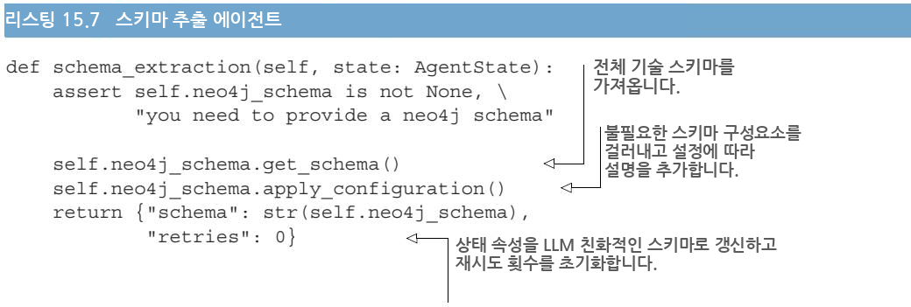

무거운 작업은 `Neo4jSchema` 인스턴스가 처리합니다. 에이전트는 먼저 `neo4j_schema` 객체가 제공되었는지 확인한 뒤, 현재 스키마를 가져오고 우리가 정의해 둔 설정을 적용합니다. 그 결과 스키마는 LLM이 효과적으로 처리할 수 있는 문자열 형식으로 변환됩니다. 덧붙여, 이 에이전트는 재시도 카운터를 0으로 초기화해서, 파이프라인 뒤쪽에서 있을지 모를 질의 재시도에 대비해 상태를 준비해 둡니다.

---

##### 텍스트-투-사이퍼 에이전트 (TEXT-TO-CYPHER AGENT)

텍스트-투-사이퍼 에이전트는 사용자의 자연어 질문을 Cypher 질의로 변환합니다. 이때 그래프의 스키마뿐 아니라, 시각화 화면에서 현재 선택된 요소들까지 함께 고려합니다. 이런 맥락 인식(context awareness) 덕분에 사용자는 선택한 노드나 관계를 명시적으로 설명하지 않고도 참조할 수 있어서, 질의가 더 자연스럽고 간결해집니다. 이는 14.7.2절에서 논의한 내용입니다. 다음 리스팅에서 보듯, 이 에이전트는 프롬프트를 실행하기 전에 상태에 두 가지 정보를 덧붙입니다. 하나는 질의 생성을 안내하는 설정 제공자의 주석이고, 다른 하나는 시각화 인터페이스의 현재 선택 상태입니다.

```python
# 리스팅 15.8 텍스트-투-사이퍼 에이전트
def text_to_cypher(self, state: AgentState):
    extra = {
        "annotations": self.config.getAnnotations(),
        "selection": self.selection
    }
    params = dict(state) | extra
    system, prompt = self.config.get_prompt("text_to_cypher", **params)
    logger.debug(f"prompt: {prompt}")
    results = self.run_prompt(prompt, system)
    return {"query": results["query"],
            "query_reasoning": results["reasoning"],
            "query_message": json.dumps(results)}
```

이 에이전트는 현재 상태를 추가 맥락(`extra`)과 병합하고(`dict(state) | extra`는 두 딕셔너리를 합치는 파이썬 문법입니다), 적절한 프롬프트 템플릿을 가져와 값을 채운 뒤, LLM에 통과시킵니다. 결과에는 생성된 Cypher 질의, 그 질의를 구성한 근거, 그리고 디버깅용으로 남기는 LLM의 전체 응답이 담깁니다. 이들은 각각 상태의 `query`, `query_reasoning`, `query_message` 필드에 저장됩니다. 핵심은, 사용자가 화면에서 고른 노드들(`self.selection`)을 프롬프트에 함께 넣어 준다는 점입니다. 그래서 "이 선택된 자산과 관련된 회사는?" 같은 지시대명사가 섞인 질문도 올바른 질의로 바뀔 수 있습니다.

---

##### 질의 실행 에이전트 (QUERY EXECUTION AGENT)

다음에 보이는 질의 실행 에이전트는 견고한 오류 처리와, 시각화 필요에 맞춘 동적 결과 포매팅을 제공합니다.

```python
def query_execution(self, state: AgentState):
    try:
        results = self.neo4j_schema.run(state["query"])
        if state["output_type"] in {"graph", "map"}:
            self.results = list(results)
        else:
            self.results = results.to_df()
        results_error = None
        information = ""
    except neo4j.exceptions.ClientError as e:
        self.results = None
        results_error = str(e)
        logger.info(f"got error: {e}")
        information = f"""We tried:
{state['query']}
and we got:
{str(e)}
"""
    retries = state.get("retries", 0) + 1
    return {"results_error": results_error,
            "retries": retries,
            "information": information}
```

이 에이전트의 로직은 단순명료합니다. 상태에 저장된 질의를 실행하려 시도하고, 감지된 의도에 따라 결과를 처리합니다. 그래프나 지도 시각화를 다룰 때는 결과를 레코드(record)의 리스트라는 원래 형태 그대로 보존합니다. 반면 표(tabular) 출력의 경우에는 Neo4j에 내장된 변환 기능(`results.to_df()`)을 써서 결과를 pandas DataFrame으로 바꿉니다.

오류 처리는 이 에이전트의 핵심적인 측면입니다. 질의 실행이 실패하면(대개는 문법 오류나 스키마 불일치 때문입니다), 에이전트는 몇 가지 작업을 수행합니다. 오류 세부 정보를 붙잡고, 디버깅을 위해 실패를 로그로 남기며, 시도했던 질의와 오류 설명을 모두 담은 오류 메시지를 만들고, 재시도 카운터를 증가시켜 시도 횟수를 추적합니다.

에이전트는 상태를 세 가지 정보로 갱신합니다. `results_error` 필드는 실행이 실패했을 때 오류 메시지를 담고, 그렇지 않으면 `None`으로 남습니다. `retries` 필드는 실행 시도 횟수를 추적하고, `information` 필드는 잠재적인 재시도를 위해 오류에 관한 상세한 맥락을 제공합니다. 이 오류 정보는 다음에 살펴볼 실행 후 라우팅 로직에서 중요하게 쓰입니다.

---

##### 질의 실행 후 라우팅 (POST-QUERY EXECUTION)

그림 15.8은 이 구성요소가 구현하는 라우팅 로직을 전체 파이프라인 맥락 속에서 강조해 보여줍니다. 지금까지 논의한 다른 구성요소들과 달리, 실행 후(post-query execution) 처리는 에이전트가 아니라 우리 LangGraph 파이프라인에서 **동적 엣지(dynamic edge)** 로서 라우팅 로직을 구현합니다(다음 리스팅 참고). 즉, 이것은 상태를 갱신하는 노드가 아니라, "다음에 어디로 갈지"를 결정하는 조건 분기 함수입니다.

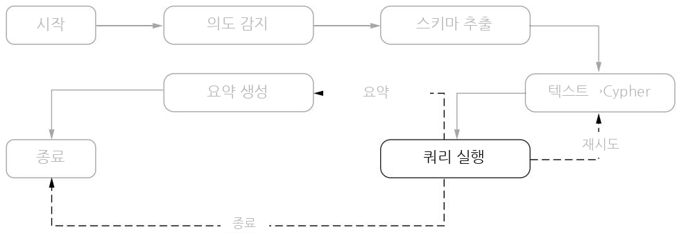

**그림 15.8** QA 파이프라인의 질의 실행 후 라우팅 로직입니다. 재시도(retry), 요약(summarize), 곧바로 완료(END)로 가는 결정 경로를 보여줍니다.

```python
# 리스팅 15.10 실행 후 동적 엣지
def post_query_execution(self, state: AgentState):
    # 질의 실행 실패를 최대 세 번까지 재시도 로직으로 처리
    if state["results_error"] is not None:
        if state["retries"] < 3:
            logger.info(f"{state['retries']} runs, we retry")
            return "retry"
        else:
            logger.info(f"{state['retries']} runs are enough")
            return "END"
    if state["output_type"] in ("map", "graph"):
        # map/graph 출력이면 요약으로 라우팅
        logger.info("summarizing..")
        return "summarize"
    else:
        # 그 외에는 곧바로 완료
        logger.info("no summarization is needed")
        return "END"
```

라우팅 로직은 두 갈래의 결정 경로를 따릅니다. 첫째, 상태의 `results_error` 필드를 확인해 질의 실행 실패를 처리합니다. 오류가 발생했다면, 이 구성요소는 최대 세 번까지 질의 실행을 재시도하는 메커니즘을 작동시킵니다. 이 덕분에 우리 시스템은 일시적인 실패나, LLM이 올바른 질의를 만들어 내기까지 여러 번 시도가 필요한 경우에도 견딜 수 있습니다.

둘째, 성공한 질의의 경우, 라우팅 결정은 `output_type`에 담긴 시각화 의도에 따라 달라집니다. 지도(map)나 그래프(graph) 시각화를 다룰 때는 흐름을 요약 단계로 보냅니다. 이런 시각화 유형은 추가적인 맥락과 설명이 있으면 이해가 훨씬 쉬워지기 때문입니다. 반면 표 형태의 결과는 대개 그 자체로 설명이 충분하므로, 파이프라인이 곧바로 마무리될 수 있습니다.

이런 동적 라우팅 능력은 LangGraph의 핵심 기능으로, 실행 결과와 사용자 의도 양쪽에 기반해 복잡한 흐름 제어를 구현할 수 있게 해 줍니다. 이 구성요소는 겉보기에 단순하지만, 전체 파이프라인의 동작을 조율하는 데서 그 중요성이 결코 작지 않습니다.

---

##### 요약 생성 에이전트 (GENERATE-SUMMARY AGENT)

우리 파이프라인의 마지막 에이전트는 그래프와 지도 시각화를 위한 요약을 생성합니다(리스팅 15.11 참고). 이 에이전트는 질의 결과와 스키마 선택을 결합해 요약 생성을 위한 포괄적인 맥락을 만듭니다. 이 요소들을 기존 상태와 병합해 요약 프롬프트 템플릿의 파라미터를 채웁니다. 설정 제공자가 적절한 프롬프트 템플릿을 공급하고, 그 템플릿이 LLM을 통해 실행됩니다.

##### 리스팅 15.11 요약 생성 에이전트

```python
def generate_summary(self, state: AgentState):
    extra = {
        "records": self.results,
        "selection": self.selection
    }
    params = dict(state) | extra
    system, prompt = self.config.get_prompt(
        "generate_summary", **params)
    logger.debug(prompt)
    results = self.run_prompt(prompt, system)
    return {"summary": results["summary"],
            "summary_reason": results["reasoning"],
            "summary_analisys": results["results_analysis"]}
```

이 에이전트의 출력은 상태를 세 가지 구성요소로 풍부하게 만듭니다. 실제 요약 텍스트(`summary`), 요약의 근거(`summary_reason`), 그리고 추가 분석이 수행되었는지를 나타내는 플래그(`summary_analisys`)입니다. 이렇게 해서 우리 파이프라인이 완성되며, 원래의 사용자 질문이 검색된 정보에 대한 의미 있는 요약으로 변환됩니다. (참고로 원서 코드의 `summary_analisys`, `results_analysis`는 철자가 다소 들쭉날쭉한데, 이는 원문 그대로 보존한 것입니다.)

---

##### 파이프라인 조립 (PIPELINE ASSEMBLY)

우리 전문가 모방 파이프라인의 구현은 결국 LangGraph 워크플로우를 구성하는 것으로 절정에 이릅니다. 다음 리스팅은 우리 에이전트들을 하나의 응집력 있는 그래프 구조로 연결합니다.

##### 리스팅 15.12 LangGraph 파이프라인 그래프 구축

```python
class Agent:
    def __init__(self, model):
        self.neo4j_schema: Neo4jSchema = None
        self.selection = []
        self.results = None
        self.config = ChainConfiguration()
        graph = StateGraph(AgentState)
        graph.add_node("intent_detection", self.intent_detection)
        graph.add_edge("intent_detection", "schema_extraction")
        graph.add_node("schema_extraction", self.schema_extraction)
        graph.add_edge("schema_extraction", "text_to_cypher")
        graph.add_node("text_to_cypher", self.text_to_cypher)
        graph.add_edge("text_to_cypher", "query_execution")
        graph.add_node("query_execution", self.query_execution)
        graph.add_conditional_edges("query_execution",
                                    self.post_query_execution,
                                    {"retry": "text_to_cypher",
                                     "summarize": "generate_summary",
                                     "END": END})
        graph.add_node("generate_summary", self.generate_summary)
        graph.add_edge("generate_summary", END)
        graph.set_entry_point("intent_detection")
        self.graph = graph.compile(checkpointer=self.memory)
        self.model = model
```

그래프 구성은 우리 질의응답 워크플로우를 그대로 반영하는 명확한 순차 패턴을 따릅니다. LangGraph의 `StateGraph` 클래스가 그 토대를 제공하는데, 우리 `AgentState` 타입으로 초기화되어 파이프라인 전체에 걸쳐 타입 안전성(type safety)을 보장합니다.

각 에이전트는 그래프에 노드로 추가되고, 엣지가 이들 사이의 표준 흐름을 정의합니다. 흐름을 따라가 보면, 진입점은 `intent_detection`이고, 거기서 `schema_extraction` → `text_to_cypher` → `query_execution`으로 직선으로 이어집니다. 그리고 `query_execution` 다음에는 `add_conditional_edges`로 조건부 엣지를 답니다. 앞서 본 `post_query_execution`이 돌려주는 문자열(`"retry"`, `"summarize"`, `"END"`)에 따라 각각 `text_to_cypher`로 되돌아가거나(재시도), `generate_summary`로 가거나, 그래프의 종료 지점(`END`)으로 향합니다. 이렇게 재시도 루프와 조건 분기가 한 그래프 안에 자연스럽게 녹아듭니다. 마지막으로 `graph.compile`에 체크포인터(`checkpointer`)를 넘겨 상태를 저장할 수 있게 합니다. 이 그래프 구조는 우리 전문가 모방 접근법을 구현하며, 오류와 다양한 시각화 요구를 하나의 통합된 파이프라인 안에서 매끄럽게 처리할 유연성을 제공합니다.

---

#### 15.1.6 파이프라인 통합 계층 — 실행을 이벤트 스트림으로 바꾸기

LangGraph가 복잡한 워크플로우를 만드는 강력한 능력을 제공하긴 하지만, 실제로 애플리케이션이 이 파이프라인들과 어떻게 상호작용할지를 고민해야 합니다. 가장 단순한 방법은 LangGraph의 **invoke 모드** 를 쓰는 것입니다. 초기 상태를 제공하고, 파이프라인이 완료되면 최종 결과를 받는 방식이죠. 하지만 이러면 사용자 경험이 그다지 이상적이지 않습니다. 사용자는 뒤에서 무슨 일이 벌어지는지에 대한 아무 피드백도 없이 오랫동안 기다려야 할 수 있으니까요. 그림 15.9는 LangGraph 파이프라인과 프런트엔드 애플리케이션 사이의 실시간 상호작용을 가능하게 하는 통합 아키텍처를 보여줍니다.

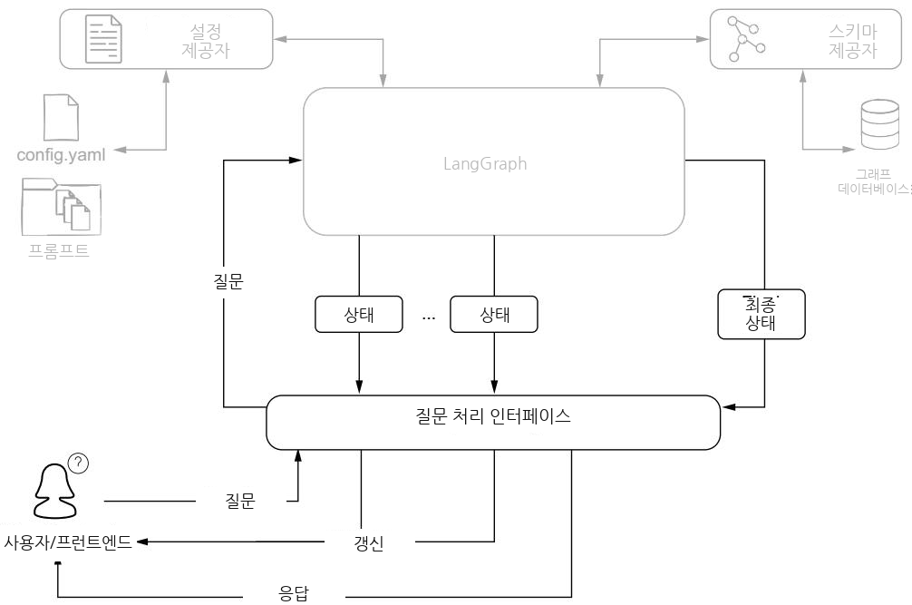

**그림 15.9** 파이프라인 통합 아키텍처입니다. 질문 처리 인터페이스가 LangGraph 상태 갱신과 프런트엔드 상호작용 사이를 중재합니다.

LangGraph는 중간 단계를 들여다볼 수 있게 해 주는 **stream 실행 모드** 를 제공하지만, 이 갱신들을 직접 관리하면 애플리케이션 로직이 복잡해질 수 있습니다. 스트리밍의 이점과 사용의 편의성 사이에서 균형을 잡기 위해, 우리는 파이프라인 실행을 프런트엔드가 손쉽게 소비할 수 있는, 잘 정의된 일련의 이벤트로 변환하는 인터페이스 계층을 개발했습니다.

이 인터페이스의 핵심은 질문을 처리하고 이벤트의 시퀀스를 산출(yield)하는 **제너레이터 함수(generator function)** 입니다. 제너레이터 함수는 이 작업에 잘 맞는데, 단순하고 선형적인 코드 흐름을 유지하면서도 중간 결과를 계속 내보낼 수 있기 때문입니다. 파이프라인 실행은 강한 이벤트 타이핑(strong event typing)과 포괄적인 상태 추적을 갖춘 깔끔한 이벤트 스트림으로 변환됩니다. 다음 리스팅이 그것입니다.

##### 리스팅 15.13 질문 처리 인터페이스 함수

```python
def processQuestion(question, selection=None):
    # 고유 ID로 파이프라인 실행을 설정
    config = {"configurable": {"thread_id": uuid.uuid4().hex}}
    # 비어 있지 않은 선택이 주어지면 내부 선택 리스트(딕셔너리들)를 구성
    if selection is not None:
        pipeline.selection = [{"labels": list(node.labels)[0],
                               "properties": dict(node)}
                              for node in selection]
    else:
        pipeline.selection = []

    input = {"question": question}
    # stream 모드로 파이프라인을 실행한다. 각 갱신에는
    # 상태 중 바뀐 부분만 담긴다
    results = pipeline.graph.stream(input,
                                    config=config,
                                    stream_mode="updates")
    # 첫 갱신: 파이프라인이 첫 단계를 실행 중임을 사용자에게 알린다
    yield "update", "*detecting intent...*", input
    for result in results:
        # LangGraph 결과 형식에서 에이전트 이름과 상태 갱신을 추출
        node, value = list(result.items())[0]
        logger.info(f"got results: {node}, keys: {list(value.keys())}")
        # 현재의 전체 상태를 추출
        current_state = pipeline.graph.get_state(config).values
        match node:
            case "intent_detection":
                yield "update", "*extracting schema...*", current_state
            case "schema_extraction":
                yield "update", "*generating query...*", current_state
            case "text_to_cypher":
                yield "update", "*executing the query...*", current_state
                # 텍스트-투-사이퍼 추론을 중간 결과로 노출
                yield "result", ("Reasoning", value["query_reasoning"]), \
                    current_state
            case "query_execution":
                if value["results_error"]:
                    # 질의 실행 오류가 나면 오류 메시지를 결과로 노출
                    yield "result", ("ERROR", value["results_error"]), \
                        current_state
                else:
                    output_type = current_state["output_type"]
                    # 그렇지 않으면 결과를 페이로드로 하는
                    # graph/table/map 이벤트를 내보낸다
                    yield output_type, pipeline.results, current_state
                    if output_type in {"graph", "map"}:
                        yield "update", "*summary generation...*", \
                            current_state
            case "generate_summary":
                # 요약을 중간 결과로 노출
                yield "result", ("Summary", value["summary"]), \
                    current_state
    logger.info("no more results sendin END")
    # 파이프라인이 완료되면 최종 에이전트 상태를 가져온다
    current_state = pipeline.graph.get_state(config).values
    # 최종 에이전트 상태를 담은 END 이벤트를 내보낸다
    yield "END", current_state, current_state
```

이 함수는 초기 설정과 상태를 준비하는 것으로 시작한 뒤, 첫 번째 update 이벤트를 산출해 의도 감지가 시작되었음을 사용자에게 알립니다. 파이프라인이 각 노드를 거치며 처리를 진행할 때, 제너레이터는 프런트엔드가 상황을 계속 알 수 있도록 적절한 이벤트를 산출합니다. 패턴 매칭(`match`) 구조의 각 `case`는 특정 파이프라인 단계에 대응하며, 현재 작업에 맞는 이벤트를 만들어 냅니다. 예컨대 의도 감지가 끝나면 "스키마 추출 중"이라는 update를, 텍스트-투-사이퍼가 끝나면 질의 추론을 담은 result를, 질의 실행이 성공하면 시각화 유형에 맞는 데이터 이벤트를 내보내는 식입니다.

제너레이터가 산출하는 각 이벤트는 일관된 구조를 따릅니다. 응답 타입(response type), 응답 페이로드(response payload), 그리고 현재 파이프라인 상태로 이루어진 세 쌍(triplet)입니다. 응답 타입은 세 부류로 나뉩니다.

- **update 이벤트** 는 파이프라인의 진행 상황을 사용자에게 알립니다. "detecting intent"나 "generating query" 같은 간단한 상태 메시지를 실어 날라서, 지금 어느 단계가 실행 중인지 사용자가 이해하도록 돕습니다.
- **result 이벤트** 는 추론 단계, 잠재적 오류, 생성된 요약 같은 텍스트 출력을 전달합니다. 이들은 파이프라인의 의사결정 과정을 더 깊이 들여다보게 하고, 시스템이 어떻게 결론에 도달했는지 사용자가 이해하도록 돕습니다.
- **시각화 이벤트(visualization event)** 는 그래프, 지도, 차트, 표 같은 구조화된 출력을 나타냅니다. 이 이벤트들은 질의 결과를 시각적으로 표현하는 데 필요한 데이터를 실어 날라서, 프런트엔드가 정보를 가장 적절한 형식으로 제시할 수 있게 합니다.

각 이벤트에 현재 파이프라인 상태를 함께 담음으로써, 우리는 프런트엔드가 이 정보를 어떻게 쓸지 미리 가정하지 않고도 완전한 맥락을 제공합니다. 이 접근법은 관심사의 깔끔한 분리를 유지합니다. 인터페이스 계층은 파이프라인 실행을 잘 정의된 이벤트 스트림으로 변환하는 데 집중하고, 표현(presentation)에 관한 결정은 프런트엔드에 맡깁니다.

그 결과는 사용자가 질의응답 과정 내내 정보를 얻고 참여하게 하면서도 깔끔한 아키텍처 경계를 유지하는 인터페이스입니다. 복잡한 파이프라인 실행을 단순한 이벤트 스트림으로 변환함으로써, 우리는 유지보수성이나 유연성을 희생하지 않고도 풍부한 상호작용 경험을 뒷받침하는 토대를 만들었습니다.

---

### 15.2 Streamlit 애플리케이션 — 사용자가 시스템과 대화하는 창

전문가 모방 질의응답을 위한 LangGraph 파이프라인을 만들었으니, 이제 사용자가 이 시스템의 역량을 효과적으로 사용하고 검증할 수 있는 인터페이스가 필요합니다. 이 인터페이스는 우리 전문가 모방 접근법에서 자연스럽게 따라 나오는 몇 가지 요구사항을 뒷받침해야 합니다.

인터페이스는 상호작용형 그래프 시각화를 지원해서 사용자가 노드와 관계를 탐색하고 선택할 수 있어야 합니다. 파이프라인이 질문을 여러 단계로 처리하는 동안 실시간 피드백을 제공해야 합니다. 자연어 상호작용을 위해 채팅과 비슷한 인터페이스가 필수적이고, 선택된 그래프 요소와 처리 맥락에 관한 복잡한 상태 정보도 유지할 수 있어야 합니다.

Streamlit의 기능들은 이런 요구사항에 잘 맞아떨어집니다. 채팅 인터페이스를 기본으로 지원하는 덕분에, 사용자 메시지와 시스템 응답을 갖춘 우리 질의응답 상호작용을 구현할 토대가 마련됩니다. 프레임워크에 내장된 데이터 시각화 기능은 커스텀 컴포넌트를 통한 확장성과 결합되어, 우리가 효과적인 그래프 표현을 만들 수 있게 해 줍니다. 무엇보다 중요한 것은, Streamlit의 파이썬 우선(Python-first) 접근법이 우리 LangGraph 파이프라인과의 매끄러운 통합을 보장한다는 점입니다. 복잡한 API를 만들거나 언어 간 직렬화(serialization)를 다룰 필요가 없습니다. 프런트엔드와 백엔드가 같은 파이썬 환경에서 동작하기 때문입니다.

파이프라인이 질문을 처리하면서 진행 상황과 중간 결과에 관한 갱신을 만들어 냅니다. Streamlit의 세션 상태(session state) 시스템은 자동 UI 갱신 기능과 결합되어, 이 변화를 실시간으로 반영하게 해 줍니다. 별도의 이벤트 처리 메커니즘을 만들지 않고도요. 사용자는 전문가 모방 시스템이 자기 질문을 어떻게 처리하는지 그 과정을 그대로 볼 수 있습니다.

이런 특성 덕분에 Streamlit은 우리 시스템을 프로토타이핑하고 테스트하는 데 특히 잘 맞습니다. 빠른 반복 주기 덕분에, 서로 다른 유형의 질문이 어떻게 처리되는지, 다양한 시각화 옵션이 어떻게 작동하는지 신속하게 검증할 수 있습니다. 구현 부담이 낮아서, 프런트엔드의 복잡함과 씨름하는 대신 핵심 전문가 모방 기능을 테스트하고 다듬는 데 집중할 수 있습니다. 프로덕션 배포에서는 더 전문화된 인터페이스가 필요할 수 있지만, 시스템을 개발하고 시연하는 데는 Streamlit이 우리에게 딱 필요한 것을 제공합니다.

---

#### 15.2.1 애플리케이션 개요 — 화면 구성과 각 영역의 역할

다음 단계는 전문가 모방 그래프 탐색을 온전히 뒷받침하는 기능적 인터페이스를 설계하는 것입니다. 이 인터페이스는 "자연스러운 상호작용"이나 "실시간 피드백" 같은 추상적 요구사항을, 서로 매끄럽게 협력하는 구체적인 컴포넌트로 변환해야 합니다. 그림 15.10은 우리 애플리케이션의 주 인터페이스 레이아웃을 보여줍니다.

인터페이스 컴포넌트들은 우리 전문가 모방 파이프라인의 역량에 직접 대응됩니다. 각 요소는 시스템의 특정 측면을 뒷받침하도록 설계되었습니다.

애플리케이션의 심장부에는 **그래프 캔버스(graph canvas)** 가 있습니다. 지식 그래프의 노드와 관계를 시각화하는 영역이죠. 이 중심 뷰는 자연스러운 탐색과 질문 워크플로우를 뒷받침하는 여러 상호작용 영역으로 보완됩니다.

**선택(Selection) 열** 은 질문을 더 자연스럽고 맥락 인식적으로 만들어 줍니다. 사용자는 그래프에서 특정 노드를 선택한 뒤, 자연어로 질문할 때 그 선택을 참조할 수 있습니다. 예를 들어 어떤 노드들을 선택해 둔 상태에서, 각 자산을 일일이 명시하지 않고 "이 자산들과 관련된 회사는 무엇인가?"라고 물을 수 있습니다. 이 선택 메커니즘은 우리 시스템의 맥락 인식 능력을 테스트하고, 파이프라인이 시각적 맥락을 얼마나 잘 이해해서 질의 생성에 반영하는지 검증하는 데 중요합니다.

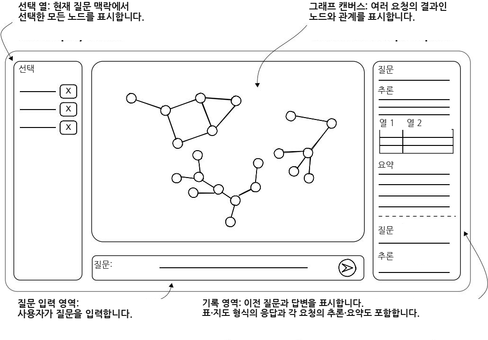

**그림 15.10** 애플리케이션 인터페이스 레이아웃입니다. 선택 기능, 상호작용형 그래프 시각화, 실시간 응답 추적을 갖춘 질의응답 시스템을 보여줍니다.

아래쪽의 **질문 입력 영역** 은 사용자가 자연어로 질문을 던질 수 있게 합니다. 이 질문들은 단순한 사실 확인부터 복잡한 관계 분석까지 다양할 수 있으며, 그러면서도 자연스러운 대화 같은 상호작용 스타일을 유지합니다.

오른쪽의 **히스토리(history) 영역** 은 질의응답 과정을 종합적으로 보여줍니다. 우리 전문가 모방 접근법은 다양한 유형의 응답을 만들어 낼 수 있으므로, 이 영역은 여러 형식을 표시하도록 적응합니다. 답변에 지리 정보가 포함되면 상호작용형 지도로 제시되고, 시스템이 표 데이터가 가장 유용하다고 판단하면 잘 정리된 표를 표시합니다. 중요한 점은, 이 영역이 시스템이 각 질문을 처리하는 동안 실시간으로 갱신되어, 우리 파이프라인을 통해 중간 단계와 최종 결과가 나올 때마다 그것을 보여준다는 것입니다.

히스토리 영역의 실시간 갱신은 두 가지 목적에 봉사합니다. 사용자에게 진행 상황을 계속 알리는 동시에, 전문가 모방 파이프라인의 추론 과정을 눈에 보이게 만드는 것입니다. 이런 투명성은 사용자가 자기 질문이 어떻게 처리되는지, 왜 특정 시각화나 응답 형식이 선택되었는지 이해하도록 돕습니다.

이 설계는 유려한 경험을 만들어 냅니다. 사용자는 지식 그래프를 탐색하고, 자기가 본 것에 대해 질문하며, 전달하려는 정보에 어울리는 풍부하고 다양한 형식의 응답을 받을 수 있습니다. 각 질문은 독립적인 상호작용으로 서 있지만, 끊임없는 갱신과 보존된 히스토리가 매끄러운 탐색 경험을 만들어 줍니다.

---

#### 15.2.2 LangGraph 통합 — 실시간 상호작용을 만드는 이벤트 처리

Streamlit과 우리 LangGraph 파이프라인의 통합은 사용자에게 실시간 상호작용 경험을 만들어 줍니다. 이 두 시스템이 어떻게 함께 작동하는지 살펴봅시다.

이 통합은 이벤트 주도(event-driven) 패턴을 따릅니다. 사용자가 전송(Send) 버튼을 누르는 순간, 질문은 질문 처리 인터페이스를 거쳐 LangGraph 파이프라인으로 흘러갑니다. 최종 결과를 기다리는 대신, 우리 시스템은 파이프라인의 각 에이전트가 질문을 처리할 때마다 즉각적인 피드백을 제공합니다. 이런 실시간 가시성은 사용자가 자기 질문이 어떻게 분석되고 답변되는지 이해하도록 돕습니다.

다음 리스팅에서 보듯, 이 정보 흐름을 관리하기 위해 우리는 두 가지 목적을 가진 `MessageHistory` 객체를 구현합니다. 첫째, 상호작용의 전체 이력을 유지해서 사용자가 지난 질문과 답변을 다시 볼 수 있게 합니다. 둘째, 파이프라인의 현재 상태를 저장해서 어느 에이전트가 지금 질문을 처리 중인지, 어떤 중간 결과가 나왔는지 추적합니다.

##### 리스팅 15.14 메시지 이력 구현

```python
class MessageHistory:
    def __init__(self):
        # 메시지는 딕셔너리의 리스트로 저장한다.
        # 마지막 것이 항상 현재 메시지를 나타낸다.
        self.messages = [{}]

    def update(self, message, finalize=False):
        # 현재 메시지를 나타내는 딕셔너리를 새 데이터로 갱신
        self.messages[-1].update(message)
        if finalize:
            # 메시지가 완성되면, 다음 메시지를 담을 빈 딕셔너리를 새로 추가
            self.messages.append({})

    @staticmethod
    def display_message(msg):
        # 인터페이스에서 하나의 메시지를 어떻게 표시할지 정의
        with st.chat_message("user"):
            st.markdown(msg["question"])
        with st.chat_message("assistant"):
            # 딕셔너리의 키에 따라 어느 섹션을 렌더링할지 적응한다
            if "query_reasoning" in msg:
                st.markdown(f"##### Reasoning\n\n**output type**: "
                            f"`{msg['output_type']}`\n\n"
                            f"{msg['query_reasoning']}")
            if "table" in msg:
                st.table(msg["table"])
            if "map" in msg:
                # "map" 키의 그래프 데이터를 지도 시각화 라이브러리가
                # 쓸 수 있는 형식으로 변환
                map_ = folium.Map()
                nodes_to_map(msg["map"], map_)
                st_folium(map_)
            if "query" in msg:
                # 생성된 Cypher 질의를, 텍스트-투-사이퍼 과정 세부 정보와 함께
                # 접히는(collapsible) 섹션에 표시
                with st.expander("Query...", expanded=False):
                    st.markdown(f"```cypher\n\n{msg['query']}\n```")
                    st.json(msg["query_message"])
            if "summary" in msg:
                # 요약 생성 세부 정보를 디버깅용으로 접히는 섹션에 추가
                st.markdown(f"##### Summary\n\n{msg['summary']}")
                with st.expander("extra...", expanded=False):
                    st.json({
                        "summary_reason": msg["summary_reason"],
                        "summary_analisys": msg["summary_analisys"]
                    })
            # 디버깅을 위해 전체 메시지 상태도 포함
            st.json(msg, expanded=False)

    def display_messages(self):
        # 메시지들을 순서대로 표시
        for message in self.messages:
            if not message:
                continue
            self.display_message(message)
```

`MessageHistory` 클래스는 메시지 딕셔너리의 리스트를 유지하는데, 각 메시지는 단순 텍스트부터 복잡한 시각화까지 서로 다른 유형의 내용을 담을 수 있습니다. `update` 메서드는 메시지를 점진적으로 쌓아 올릴 수 있게 해서, 우리 파이프라인 처리의 단계적 성격을 반영합니다. `display_message` 메서드는 Streamlit 컴포넌트를 써서 서로 다른 내용 유형을 렌더링합니다. 텍스트에는 Markdown, 구조화된 데이터에는 표, 지도에는 파이썬의 folium 라이브러리를 씁니다. 이 구현은 정보 계층을 조직화해서, 질의나 요약 추론 같은 상세한 정보는 펼칠 수 있는 섹션에 담아 둡니다. 핵심은 "딕셔너리에 어떤 키가 있는가"에 따라 표시할 섹션이 달라진다는 점입니다. `query_reasoning`이 있으면 추론을, `table`이 있으면 표를, `map`이 있으면 지도를 그리는 식으로요.

사용자 입력과 LangGraph 파이프라인의 통합은 반응형(reactive) 패턴을 사용해 임시 갱신과 영구 갱신을 모두 관리합니다. 질문을 처리할 때, 시스템은 즉각적인 피드백을 보여주는 동시에 영구적인 대화 이력도 유지해야 합니다. 이는 서로 보완하는 두 메커니즘을 통해 이루어집니다.

- **임시 플레이스홀더(temporary placeholder)를 이용한 이벤트 처리** 는 파이프라인이 질문을 처리하는 동안 실시간 갱신을 보여줍니다. 이 갱신들은 즉각적인 피드백을 주지만 일시적이며, Streamlit 플레이스홀더를 써서 현재 파이프라인 상태를 표시합니다.
- **`MessageHistory` 는 대화의 영구 상태를 축적** 합니다. 갱신을 직접 보여주는 대신, END 이벤트를 받을 때까지 각 메시지의 완전한 상태를 모읍니다. 그런 다음 페이지가 `MessageHistory`의 표시 로직으로 다시 렌더링되어, 임시 갱신을 대화의 최종적이고 영구적인 버전으로 교체합니다.

이 접근법(다음 리스팅에서 구현)은 사용자가 즉각적인 피드백과 상호작용 이력의 영구 기록을 모두 보게 해 줍니다.

##### 리스팅 15.15 사용자 입력 핸들러

```python
[...]
# 사용자의 질문을 채팅 이력에 "user" 역할로 표시
if question := st.chat_input("What is up?"):
    with chat:
        with st.chat_message("user"):
            st.markdown(question)
        with st.chat_message("assistant"):
            # "assistant" 섹션에 실시간 갱신을 표시할 플레이스홀더 생성
            placeholder = st.empty()
    # 캔버스 상태에서 선택된 노드를 그 ID로 추출
    selection = [state.canvas["byId"][int(item)]
                 for item in state.selection]

    # 질문과 선택을 파이프라인에 보내 처리를 시작
    for response_type, response, current_state in \
            chain.processQuestion(question=str(question),
                                  selection=selection):
        # 현재 파이프라인 상태로 MessageHistory 갱신
        state.messages.update(current_state)
        # 응답 타입에 따라 이벤트 처리를 라우팅
        match response_type:
            case "update":
                # "update" 이벤트는 Markdown 형식 응답을 플레이스홀더에 표시
                placeholder.markdown(response)
            case "graph" | "map":
                # "graph"/"map" 이벤트는 캔버스 시각화를 그래프 데이터로 갱신
                placeholder.markdown("*updating canvas...*")
                store_to_canvas(response)
                if response_type == "map":
                    # map 타입 응답은 지도 시각화를 위해 노드 데이터를 저장
                    state.messages.update(
                        {"map": state.canvas["nodes"]})
            case "table" | "chart":
                # 표/차트 응답은 표 데이터를 MessageHistory에 저장
                state.messages.update({"table": response})
                # pandas DataFrame을 Streamlit 표로 렌더링
                placeholder.table(response)
                # 표 표시를 보존하기 위해 새 플레이스홀더 생성
                with st.chat_message("assistant"):
                    placeholder = st.empty()
            case "result":
                # 결과 이벤트를 제목과 내용으로 형식화해 표시
                title, content = response
                response = f"##### {title}\n\n{content}"
                placeholder.write(response)
                # 결과 표시를 보존하기 위해 새 플레이스홀더 생성
                with st.chat_message("assistant"):
                    placeholder = st.empty()
            case "END":
                # 최종 상태를 MessageHistory에 저장하고 메시지를 완료 표시
                state.messages.update(current_state, finalize=True)
                # 완전한 응답을 보여주도록 인터페이스 재그리기를 유발
                st.rerun()
```

사용자가 질문을 제출하면, 시스템은 채팅 인터페이스에 플레이스홀더 요소를 만들고, 파이프라인이 질문을 처리하는 동안 이를 점진적으로 갱신합니다. `match` 문은 서로 다른 유형의 응답을 처리합니다. 텍스트 응답에 대한 채팅 인터페이스 갱신, 캔버스에 렌더링되는 그래프와 지도 시각화, Streamlit 표 컴포넌트로 표시되는 표 데이터, 제목과 내용을 갖춘 형식화된 결과, 그리고 모든 UI 요소가 제대로 갱신되도록 재그리기(`st.rerun()`)를 유발하는 END 이벤트입니다. `MessageHistory`와 이 이벤트 처리 시스템의 결합은 사용자에게 반응성 있고 상호작용적인 경험을 만들어 냅니다.

---

### 15.3 전문가 모방 수사 — 실제 사건을 따라가 보기

우리 전문가 모방 시스템이 실제로 어떻게 작동하는지 보여주기 위해, 현실적인 수사 워크플로우를 따라가 봅시다. 수사관이 자연어 질의를 사용해 범죄, 감시 카메라, 차량 사이의 연결을 탐색하는 과정을 살펴보겠습니다. 그 과정에서 시스템이 맥락을 이해하고 의미 있는 통찰을 제공하는 능력을 활용합니다.

우리 수사는 범죄 사건에 초점을 맞춘 지식 그래프의 일부를 다룹니다. 그림 15.11에서 보듯, 이 스키마는 Crime 노드(위치, 설명, 날짜·시각 같은 속성을 담음)를 공간 관계를 통해 ANPRCamera 노드(자동 번호판 인식 카메라, automatic number plate recognition)에 연결합니다. 카메라는 차량을 감지하면 CameraEvent를 생성하며, 각 목격의 타임스탬프와 위치를 모두 기록합니다. 이 이벤트들은 모델, 색상, 번호판 같은 속성을 저장하는 Vehicle 노드로 연결됩니다. 차량은 다시 그 소유자를 나타내는 Person 노드로 연결되고, 이 사람은 COMMITTED 관계를 통해 Crime 사건에 이어질 수 있습니다.

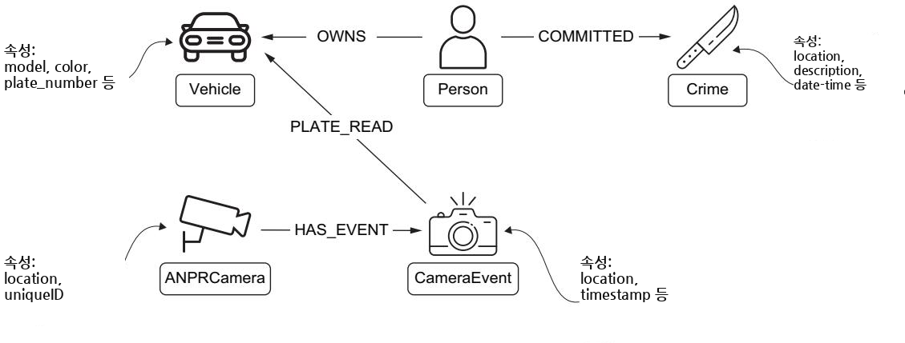

**그림 15.11** 초점 스키마 시각화입니다. 수사 질의를 위해 Crime, ANPRCamera, CameraEvent, Vehicle, Person 노드가 어떻게 서로 연결되는지 보여줍니다.

겉보기에 단순해 보이는 이 구조는 공간 분석, 시간적 패턴, 관계 탐색을 결합한 정교한 질의를 가능하게 합니다. 수사관이 우리 시스템을 사용해 범죄 무단침입(criminal trespass) 사건과 관련된 관심 차량을 어떻게 식별하는지 살펴봅시다.

---

#### 15.3.1 초기 사건 식별하기 — 수사의 출발점

우리 수사는 현재 수사 중인 범죄를 식별해 달라고 시스템에 요청하는 것으로 시작합니다. 이는 명시적 제약("현재 수사 중")과 암묵적 기대(분석에 의미 있는 범죄를 반환하기)를 결합한 자연어 질의를 이해하고 번역하는 능력을 보여줍니다. 시스템은 이 요청을 우리 전문가 모방 파이프라인을 통해 처리하는데, 먼저 단일 노드와 그 속성을 표시하기에는 그래프 시각화가 가장 적절하다고 감지합니다. 질의 생성 구성요소는 우리가 활성 수사 건을 찾고 있음을 이해하고, 생성된 Cypher 질의에 관련 제약을 포함합니다.

시스템에 첫 질문을 던져 봅시다. "Return one crime node currently under investigation(현재 수사 중인 범죄 노드 하나를 반환하라)". 그림 15.12는 시스템의 응답을 보여주는데, 범죄 무단침입 사건을 나타내는 범죄 노드를 표시합니다.

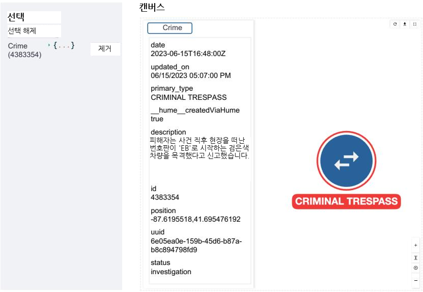

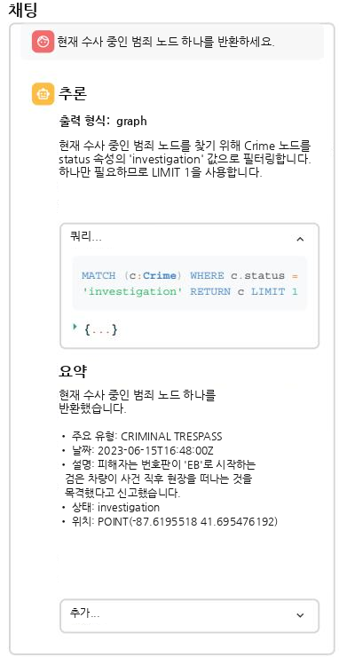

**그림 15.12** 현재 수사 중인 범죄 노드를 보여주는 초기 질의 응답입니다. 인터페이스는 (a) 선택 패널(범죄 노드를 더블클릭하면 채워짐)과 중앙에 현재 노드에 관한 세부 정보를 표시하는 정보 패널을 갖춘 캔버스, 그리고 (b) 질의 처리 세부 정보가 담긴 채팅 인터페이스를 보여줍니다.

범죄 노드를 클릭하면 사건에 관한 상세 정보가 캔버스 영역에 나타나는데, 여기에는 번호판 앞부분이 "EB"로 시작하는 검은색 차량을 언급하는 서술(narrative)이 포함되어 있습니다. 이 정보는 수사가 진행되면서 값진 단서가 됩니다.

채팅 인터페이스에서는 시스템의 추론 과정을 볼 수 있습니다. 왜 이 범죄를 골랐는지, 우리가 확실히 활성 수사 건을 받도록 질의를 어떻게 구성했는지 설명해 줍니다. 이런 투명성은 사용자가 자연어 질문이 어떻게 해석되고 실행되는지 이해하도록 돕습니다.

우리 시스템이 생성한 요약은 이 범죄의 핵심 측면을 강조합니다. 범죄 무단침입으로 분류된다는 점, 그리고 서술 안에 차량 정보가 있다는 점을요. 이는 우리 요약 생성 구성요소가 속성 필드 깊숙이 묻혀 있을 수 있는 관련 세부 정보를 어떻게 추출하고 부각하는지 보여줍니다.

이 초기 상호작용은 우리 시스템의 여러 역량을 보여줍니다. 자연어 이해, 적절한 시각화 선택, 그리고 노드 속성의 지능적 요약입니다. 하지만 더 중요한 것은, 수사를 진행하면서 이 맥락을 활용할 점점 더 복잡한 질의들을 위한 무대를 마련한다는 점입니다.

---

#### 15.3.2 감시 범위의 공간 분석 — 근처 카메라 찾기

범죄 노드를 식별했으니, 다음 논리적 단계는 그 지역의 감시 범위를 확인하는 것입니다. 우리 시스템의 공간 추론 능력 덕분에, 정확한 좌표나 거리 계산을 명시하지 않고도 근처의 ANPR 카메라에 대해 물을 수 있습니다.

범죄 노드를 더블클릭해 선택에 추가한 뒤, 이 프롬프트를 입력합니다. "Return any ANPR camera node located within 1 km from the selected crime(선택된 범죄로부터 1km 이내에 위치한 ANPR 카메라 노드를 반환하라)". "선택된 범죄"라고 직접 지칭할 수 있다는 점에 주목하세요. 시스템은 이 맥락을 현재 선택으로부터 이해합니다. 그림 15.13은 이 상호작용을 담아내는데, 시스템이 그래프 시각화와 상호작용형 지도를 모두 함께 응답하는 모습을 보여줍니다.

캔버스에는 이제 범죄 노드와 함께, 노란색으로 새로 발견된 ANPR 카메라 노드가 포함됩니다. 이 응답을 특히 강력하게 만드는 것은 시스템이 그래프 뷰와 나란히 지도 시각화를 제공하기로 결정했다는 점입니다. 지도는 두 개의 마커를 표시합니다. 하나는 사건 위치, 다른 하나는 카메라 위치이며, 그래프에서 각 노드에 대응하는 색상을 씁니다.

카메라의 위치는 전략적으로 값져 보입니다. 무단침입이 발생한 지역의 진입 또는 진출 지점이 될 수 있는 교차로 근처에 있기 때문입니다. 이런 공간적 통찰은 이중 시각화를 통해 즉시 드러나며, 이 카메라의 데이터가 우리 수사에 유용한 단서를 제공할 수 있음을 시사합니다.

이 단계는 우리 시스템의 여러 정교한 역량을 보여줍니다. 공간 질의 처리, 선택 인식(selection-aware) 자연어 이해, 그리고 지능적 시각화 선택입니다. 당면한 데이터에 가장 적절한 시각화를 고르는 이 적응적 응답은 우리 전문가 모방 접근법의 핵심 기능입니다.

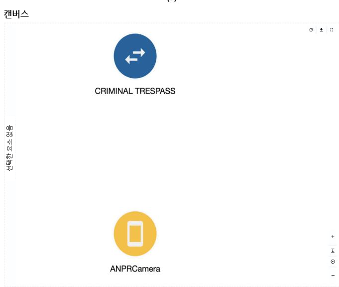

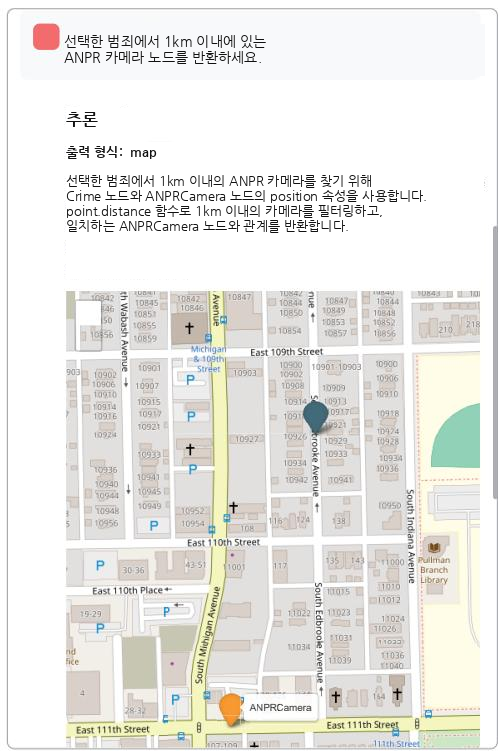

**그림 15.13** 범죄 위치 근처의 ANPR 카메라를 보여주는 공간 질의 응답입니다 (a). 시스템은 범죄와 근처 ANPR 카메라 사이의 공간 관계를 표시하기 위해 자동으로 지도 시각화 (b) 를 선택했습니다.

---

#### 15.3.3 차량 패턴 감지 — 용의 차량 좁히기

이제 사건 보고서의 설명과 일치하는 차량을 검색할 수 있습니다. ANPR 카메라 노드를 더블클릭해 범죄 노드와 함께 현재 선택에 추가합니다.

다음 프롬프트는 이 선택을 사용하면서 구체적인 차량 기준을 덧붙입니다. "Return the vehicles detected by the selected camera on June 15, 2023. The vehicle is black and its license plate must start with EB(2023년 6월 15일에 선택된 카메라가 감지한 차량들을 반환하라. 차량은 검은색이고 번호판은 EB로 시작해야 한다)". 선택된 요소에 대한 참조("선택된 카메라")를, 차량의 외양과 번호판에 관한 명시적 제약과 어떻게 결합할 수 있는지 주목하세요. 그림 15.14는 시스템이 일치하는 차량과 그 감지 이벤트를 포함하도록 시각화를 확장하는 모습을 보여줍니다.

그래프는 이제 감지 이벤트를 통해 우리 ANPR 카메라에 연결된 여러 차량 노드를 표시하며, 질의의 추론이 채팅 인터페이스에 보입니다. 시스템은 시간 제약("2023년 6월 15일"), 차량의 물리적 설명("검은색"), 부분 번호판("EB")을 모두 이해하고, 이 모든 요소를 하나의 일관된 질의에 통합했습니다.

요약은 일치하는 각 차량을 강조하며, 잠재적 용의자에 대한 개요를 제공합니다. 이는 노드 선택, 시간 제약, 속성 일치를 결합한 다면적 질의를 우리 시스템이 처리하는 능력을 보여줍니다.

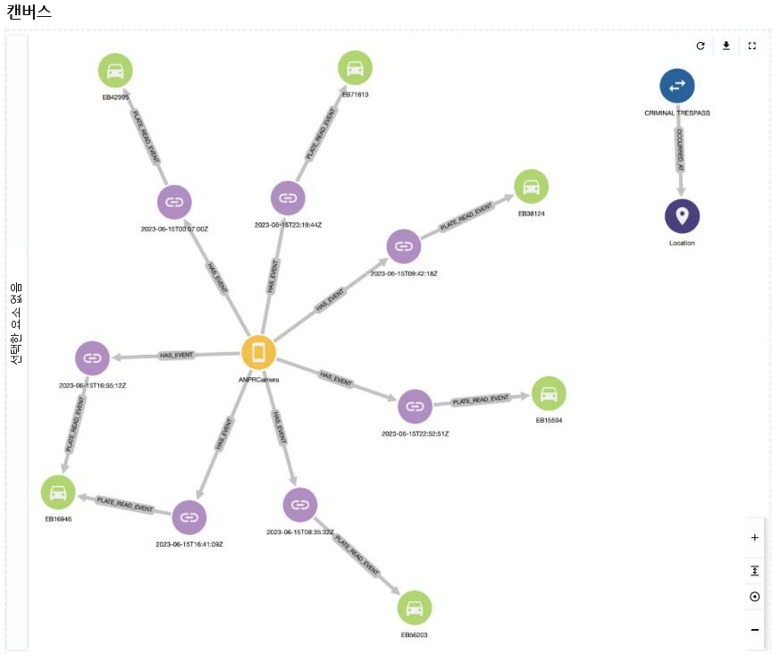

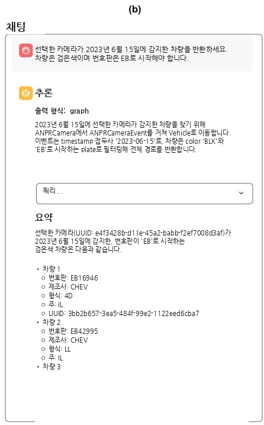

**그림 15.14** 일치하는 차량과 그 감지 이벤트를 보여주는 차량 질의 결과입니다. 각 경로(path)는 완전한 차량 감지 기록을 나타내며, 이벤트 노드에 타임스탬프가 보입니다. 시스템의 응답에는 (a) 그래프 시각화와 (b) 각 차량 속성의 상세 요약이 모두 포함됩니다.

이 단계는 우리 수사에서 중요한 진전을 이룹니다. 범죄와 카메라 위치에 관한 고립된 데이터 점들을, 우리 사건과 연결될 수 있는 차량 집합으로 변환하기 때문입니다. 그런데 우리의 수사 목표에 관한 추가 맥락을 제공하면 더 많은 통찰을 얻을 수 있을까요? 다음 프롬프트에서 이를 탐색해 봅시다.

---

#### 15.3.4 맥락 인식 요청 정제 — 역할과 의도를 알려주기

우리 전문가 모방 시스템이 선택된 노드에서 정보를 추출하고 맥락 인식 요약을 수행하는 능력을 활용해 접근법을 정제해 봅시다. 차량 설명과 날짜 제약을 명시적으로 진술하는 대신, 시스템이 선택된 범죄 노드에서 이 세부 정보를 추출하도록 맡길 수 있습니다. 나아가, 우리의 역할과 수사 의도에 관한 맥락을 제공함으로써, 시스템이 더 분석적인 통찰을 생성하도록 유도할 수 있습니다.

이 수사 맥락을 반영하도록 프롬프트를 다시 표현합니다. "I'm an investigator and I'm working on the selected crime. I need all the vehicle nodes that are compatible with the description and were detected by the selected camera the day of the incident. Are there any that seem significantly more likely to be involved in the incident?(나는 수사관이고 선택된 범죄를 담당하고 있다. 설명과 부합하고, 사건 당일 선택된 카메라가 감지한 모든 차량 노드가 필요하다. 이 사건에 연루되었을 가능성이 유독 높아 보이는 차량이 있는가?)". 그림 15.15에 보이는 응답은 추가 맥락이 시스템의 분석을 어떻게 변모시키는지 보여줍니다.

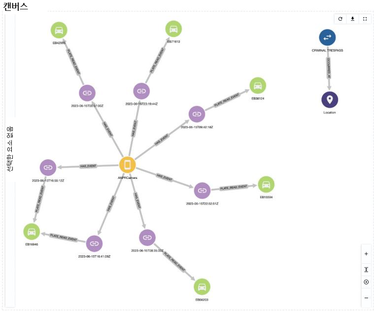

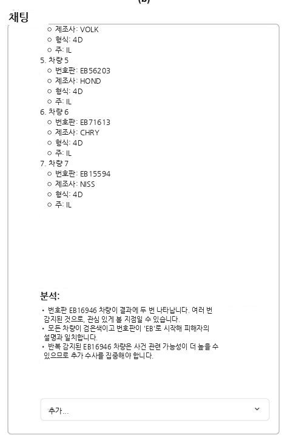

**그림 15.15** 수사 맥락을 담은 동일한 차량 데이터의 향상된 분석입니다 (a). 시스템은 (b) 에서 관심 패턴을 식별하는 분석(Analysis) 섹션으로 응답을 보강하여, 추가 맥락이 동일한 기반 데이터에 대해 어떻게 더 통찰력 있는 요약으로 이어지는지 보여줍니다.

질의는 이전과 동일한 차량들을 반환하지만, 요약에는 이제 결과에 대한 더 깊은 분석이 포함됩니다. 시스템은 흥미로운 패턴을 식별합니다. 일치하는 차량 중 하나가 사건 시각 즈음에 두 번 감지되었다는 점인데, 이는 그 지역을 한 바퀴 도는 순회(circuit) 가능성을 시사하며 추가 수사가 필요함을 알립니다.

이 향상된 응답은 시스템이 노드 속성으로부터 제약을 자율적으로 추출하고 적용해서, 명시적으로 다시 진술할 필요를 없앨 수 있음을 보여줍니다. 또한 수사 맥락을 제공하는 것, 이 경우 우리가 수상한 패턴을 찾는 수사관임을 밝히는 것이 시스템으로 하여금 더 관련성 있고 통찰력 있는 요약을 생성하게 함을 보여줍니다.

시스템은 단순히 기준을 맞추는 것을 넘어, 수상한 행동을 나타낼 수 있는 시간적 패턴을 능동적으로 분석하는 데까지 나아갔습니다. 이는 우리의 마지막 수사 단계를 위한 무대를 마련합니다. 바로 이 차량들 중 어느 것이 알려진 범죄자와 연결되어 있는지 조사하는 것입니다.

---

#### 15.3.5 과거 기록 분석 — 소유자의 범죄 이력까지

수상한 이동 패턴을 가진 차량을 발견한 것을 바탕으로, 차량 소유자의 범죄 이력을 고려함으로써 수사를 한층 더 풍부하게 만들 수 있습니다. 이런 종류의 배경 조회(background check)는 표준적인 수사 관행이며, 우리 시스템은 이를 분석에 자연스럽게 통합할 수 있습니다.

프롬프트를 살짝 수정합니다. "I'm an investigator and I'm working on the selected crime. I need all the vehicle nodes that are compatible with the description and were detected by the selected camera on the day of the incident. Some of these vehicles may be owned by previous offenders. What vehicles are the most likely to be involved in the incident?(나는 수사관이고 선택된 범죄를 담당하고 있다. 설명과 부합하고 사건 당일 선택된 카메라가 감지한 모든 차량 노드가 필요하다. 이 차량들 중 일부는 이전 범죄자가 소유하고 있을 수 있다. 어떤 차량이 이 사건에 연루되었을 가능성이 가장 높은가?)".

그림 15.16은 우리 수사에서 중대한 돌파구를 드러냅니다. 시스템은 소유 관계와 범죄 기록을 포함하도록 분석을 확장하여, 앞서 수상한 이동으로 지목된 차량이 관련 범죄 이력을 가진 개인의 소유임을 발견합니다.

가장 주목할 만한 점은, 이 사람의 기록에 범죄 무단침입 전과, 즉 우리가 현재 수사하는 것과 같은 유형의 범죄에 대한 유죄 판결이 포함되어 있다는 것입니다. 요약 에이전트는 이 연결의 높아진 중요성을 인식하고, 이를 일반 요약과 분석 섹션 양쪽에서 강조합니다.

이 마지막 단계는 시스템이 다음의 모든 것을 할 수 있음을 보여줍니다.

- 여러 차례의 질의 정제 과정에 걸쳐 맥락 인식을 유지하기
- 다양한 유형의 증거(공간적, 시간적, 역사적)를 통합하기
- 의미 있는 패턴과 연결을 식별하기
- 수사 의사결정을 직접 뒷받침하는 방식으로 발견을 제시하기

이 수사를 통해, 우리는 자연어 상호작용, 지능적 요약, 맥락 인식 분석이 어떻게 함께 어우러져 실제 세계의 수사 워크플로우를 뒷받침하는지 보았습니다.

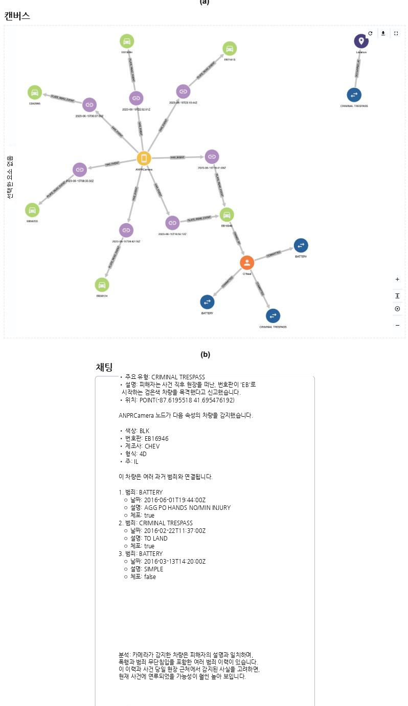

**그림 15.16** 범죄 이력을 드러내는 최종 수사 통찰입니다. (a) 그래프가 확장되어 한 차량 소유자가 이전 범죄 무단침입을 포함한 여러 전과와 연결되어 있음을 보여줍니다. (b) 요약은 이전 범죄들을 상세히 분석하여, 시스템이 시간적·공간적·역사적 증거를 하나의 응집력 있는 수사 서사로 통합하는 능력을 보여줍니다.

---

### 15.4 향후 방향과 개선 — 이 토대 위에 무엇을 쌓을까

14장과 15장에 걸쳐, 우리는 지식 그래프를 위한 질의응답 시스템의 개발을 탐색했습니다. 이를 순전히 언어 모델링 문제로 다루는 대신, 우리는 인간 전문가가 그래프 데이터베이스를 다루는 방식을 모방하는 시스템을 만들었습니다. 스키마 맥락을 이해하고, 추론된 단계들을 통해 질의를 구성하는 방식이죠. 우리 구현은 이 전문가 모방 접근법이 어떻게 전문화된 에이전트들의 파이프라인을 통해 실현될 수 있는지 보여줍니다. 각 에이전트가 과정의 서로 다른 측면을 담당하면서요.

하지만 이 구현은 완제품(turnkey) 솔루션이라기보다는 하나의 토대로 보아야 합니다. 그 가치는 그것이 무엇을 하는가뿐 아니라, 그것이 어떻게 만들어졌는가에 있습니다. 이 토대의 강점은 그 밑에 깔린 아키텍처에서 나오는데, 특히 관찰 가능성(observability)과 전문가 모방을 다루는 방식에서 나옵니다.

시스템의 투명성은 단지 디버깅을 위한 것이 아닙니다. 그것은 피드백을 수집하고 개선점을 식별하는 자연스러운 지점들을 만들어 냅니다. 각 구성요소의 의사결정 과정이 눈에 보이므로, 시스템이 무엇을 하는지뿐 아니라 왜 그렇게 하는지도 이해할 수 있게 됩니다.

똑같이 중요한 것은 설계의 바탕에 깔린 전문가 모방 패턴입니다. 새로운 도전이나 개선의 기회를 마주할 때, 팀은 단순하지만 강력한 질문에서 출발할 수 있습니다. "이 상황에서 전문가라면 어떻게 할까?" 이런 인간 중심적 시스템 설계 접근법은 개선을 억지스럽지 않고 자연스럽게 느껴지게 합니다. 개선이 전문가 행동을 이해하고 모델링하는 데서 자연히 흘러나오기 때문입니다.

이어지는 절들에서는 이 토대 위에 쌓아 올릴 여러 경로를 탐색합니다. 이들은 시스템의 관찰 가능하고 전문가 모방적인 성격이 어떻게 특정 유형의 개선을 가능하게 하는지 보여주는 예시입니다.

---

#### 15.4.1 사용에서 배우기 — 관찰 가능성이 여는 진화

시스템 진화의 자연스러운 출발점은 우리 핵심 설계 원칙 중 하나인 포괄적 관찰 가능성을 활용하는 것입니다. 시스템이 처리하는 모든 질의는 사용자 의도, 질의 패턴, 결과 효과성에 관한 풍부한 정보를 생성합니다. 이 관찰 가능한 데이터는 여러 수준에서 체계적인 개선의 기회를 만들어 냅니다.

이 관찰 가능성의 가장 직접적인 활용은 "불만형(complaint-like)" 질문, 즉 사용자가 시스템의 응답이 자기 필요를 충족하지 못했음을 나타내는 프롬프트를 수집하고 분류하는 데 있습니다. 이를 실패로 취급하는 대신, 우리의 관찰 가능한 파이프라인은 이런 사례들에서 의미 있는 패턴을 추출하게 해 줍니다. LLM 기반 분석으로 이 패턴들을 분류함으로써, 우리는 흔한 사용자 어려움을 동적 대시보드(dynamic dashboard)에 고충 지점(pain point)으로 드러낼 수 있고, 이는 개발 우선순위와 자원 배분을 이끄는 전략적 도구가 됩니다.

똑같이 값진 것은 성공적인 상호작용의 수집입니다. 시스템이 사용자가 특히 유용하다고 여기는 질의를 생성했을 때, 그 추론의 사슬을 보존할 수 있습니다. 그런 다음 이 성공 패턴들을 체계적으로 분석해 무엇이 그것들을 효과적으로 만드는지 식별할 수 있고, 이는 우리 예시 데이터베이스를 강화하는 토대가 됩니다.

사용자 질문의 패턴을 분석함으로써, 특별한 처리가 도움이 될 유사 질의들의 군집(cluster)도 식별할 수 있습니다. 이 이해는 다운스트림(downstream) 과정을 최적화하는 데 쓰일 수 있습니다. 예를 들어 스키마 중에서 가장 관련 있는 부분만 선택하거나, 특정 유형의 질문에 더 초점을 맞춘 예시를 제공하는 식으로요.

이 사용에서 배우기는 우리의 기초 아키텍처가 어떻게 시스템으로 하여금 미리 정해진 규칙이 아니라 실제 사용 패턴에 기반해 진화하게 하는지 보여줍니다. 개선은 자연스럽게 떠오르면서도, 이해 가능하고 전문가 같은 행동에 뿌리내린 채로 남습니다.

---

#### 15.4.2 핵심 역량 강화하기 — 전문가라면 무엇을 할까

"전문가라면 어떻게 할까?"라고 꾸준히 물음으로써, 우리는 인간 전문성 패턴과 부합하는 개선을 식별하고 구현할 수 있습니다. 우리의 관찰 가능한 파이프라인 아키텍처를 활용하면서요. 강화의 핵심 영역 하나는 스키마 처리입니다. 여기서 우리는 인간 전문가가 지식 그래프의 구조에 대한 이해를 쌓아가는 방식을 모방할 수 있습니다. 전문가는 기본 스키마 정의를 넘어, 데이터가 어떻게 구조화되고 사용되는지 이해하기 위해 예비 질의(preliminary query)를 자주 실행합니다. 우리는 데이터 패턴을 분석하고 기본 스키마에 추가 맥락을 보강하는 **스키마 보강 에이전트(schema enrichment agent)** 를 구현함으로써 이 행동을 모델링할 수 있습니다. 이 풍부해진 스키마 정보는 다운스트림으로 흘러가 질의 생성과 결과 해석을 개선할 수 있습니다.

대규모 지식 그래프의 경우, 전문가는 보통 서로 다른 추상화 수준의 멘탈 모델로 작업합니다. **다층 스키마 관리(multilayer schema management)** 접근법은 이 사고 과정을 반영할 수 있습니다. 예를 들어 우리 수사 지식 그래프에서, 맨 아래 층은 모든 상세 노드와 관계(범죄, 차량, 카메라 이벤트, 사람)를 담고, 더 높은 층들은 이들을 차량 감시나 형사 사법 기록 같은 도메인 중심 뷰로 조직할 수 있습니다. 시스템은 이 상위 수준 뷰를 넓은 이해(예: 어떤 도메인을 질의할지)에 사용하면서, 구체적인 질의 생성을 위해서는 상세한 설명을 보존할 수 있습니다. 이 계층적 접근법은 인간 전문가가 필요에 따라 서로 다른 세부 수준을 확대·축소하는 것처럼, 정밀함을 희생하지 않고 복잡성을 관리합니다.

---

#### 15.4.3 고급 진화 경로 — 파인튜닝으로 나아가기

더 야심찬 진화 경로는 시스템의 역량을 크게 강화할 수 있습니다. 이 고급 접근법들은 우리 핵심 원칙을 유지하면서 언어 모델 응용의 새로운 기법들을 도입합니다.

특히 유망한 방향 하나는, 스키마 이해와 질의 생성에서 순수한 **인컨텍스트 학습(in-context learning, 맥락 내 학습)** 을 넘어서는 것입니다. 스키마 정보와 예시를 프롬프트에 넣는 우리의 현재 접근법은 효과적이지만, 더 큰 지식 그래프에서는 확장성 문제에 부딪힙니다. **파인튜닝(fine-tuning, 미세 조정)** 접근법은 대안적 경로를 제공합니다. 스키마 자체를 훈련 데이터로 사용함으로써, 우리는 그래프 구조와 관계에 대해 더 깊고 효율적인 이해를 가진 지식 그래프 인식 에이전트를 개발할 수 있습니다.

여러 연구는 인컨텍스트 학습이 유연하기는 하지만, 과제 특화 적응(task-specific adaptation) 접근법에 비해 일관되게 성능이 떨어짐을 보여주었습니다 [1], [2]. 이 성능 격차는 두 접근법이 동일한 예시 집합에 접근할 수 있을 때조차 지속됩니다. 이런 발견들은 파인튜닝된 구성요소로 나아가는 것이 우리 시스템의 성능을 크게 개선하면서도 계산 부담을 잠재적으로 줄일 수 있음을 시사합니다.

파인튜닝된 구성요소로의 전환이 우리 전문가 모방 아키텍처를 포기하는 것을 뜻하지는 않습니다. 오히려, 우리는 관찰 가능한 파이프라인 구조를 유지하면서 인컨텍스트 학습 구성요소를 파인튜닝된 대안으로 선택적으로 교체하거나 보강할 수 있습니다.

이 진화 경로는 더 정교한 질의 계획(query planning)의 가능성도 엽니다. 파인튜닝된 에이전트는 질의 패턴과 그것이 서로 다른 그래프 구조와 맺는 관계를 더 섬세하게 이해하게 되어, 잠재적으로 더 효율적이고 효과적인 질의 생성으로 이어질 수 있습니다. 시스템은 더 강한 그래프 지식의 토대 위에서, 단계별 추론 접근법을 그대로 유지할 수 있습니다.

---

#### 요약

- **전문가 모방 접근법** 은 인간 전문가가 그래프 데이터베이스와 상호작용하는 방식을 흉내 냅니다.
- **LangGraph의 상태 기반 설계** 는 모듈화되고 관찰 가능한 AI 파이프라인을 만들 수 있게 하며, 각 구성요소가 독립적인 추론을 유지합니다.
- **파이프라인 통합 아키텍처** 는 처리 갱신을 상호작용형 사용자 인터페이스로 실시간 스트리밍하게 해 줍니다.
- **맥락 인식 질의 생성** 은 스키마 지식, 사용자 선택, 대화 이력을 결합해 자연스러운 상호작용을 만들어 냅니다.
- **다단계 분석 워크플로우** 는 공간적·시간적·역사적 분석을 하나의 응집력 있는 과정에 통합할 수 있습니다.
- **메시지 이력 관리** 는 상태 유지형 대화와 실시간 진행 갱신을 가능하게 합니다.

---

## 핵심 용어 해설

| 용어 (원어) | 뜻풀이 |
| --- | --- |
| LangGraph | LLM으로 구동되는 상태 유지형·다중 액터 애플리케이션을 만드는 라이브러리. 워크플로우를 유향 그래프로 표현하고, 노드(에이전트)들이 공유 상태를 읽고 쓰며 협업한다. |
| Streamlit | 파이썬만으로 웹 인터페이스를 빠르게 만드는 프레임워크. 채팅·표·시각화 컴포넌트와 세션 상태, 자동 UI 갱신을 기본 제공한다. |
| 전문가 모방 (expert-emulating) | 인간 전문가가 그래프 DB를 다루는 절차(스키마 이해 → 추론 단계로 질의 구성)를 그대로 흉내 내도록 시스템을 설계하는 접근법. |
| RAG (retrieval-augmented generation) | 관련 문서를 검색해 그 내용을 근거로 LLM이 답을 생성하는 검색 증강 생성 기법. |
| 공유 상태 (shared state) | 에이전트들이 데이터를 직접 주고받지 않고, 함께 읽고 쓰는 하나의 상태 객체. 화이트보드에 비유된다. |
| 유향 그래프 (directed graph) | 방향이 있는 간선(엣지)으로 노드를 잇는 그래프. LangGraph는 워크플로우를 이 구조로 표현한다. |
| 동적 엣지 (dynamic edge) | 앞선 에이전트의 출력·상태에 따라 다음 노드를 골라 분기하는 조건부 간선. `add_conditional_edges`로 구현한다. |
| 상태 객체 (state object) | 파이프라인 전체가 공유하는 메모리. 이 장에서는 `AgentState`(TypedDict)로 정의되며 질문·스키마·질의·오류·요약 등을 담는다. |
| 의도 감지 (intent detection) | 사용자 질문을 어떤 형식(표·그래프·지도)으로 시각화할지 판단하는 파이프라인의 진입 단계. |
| 기술 스키마 / 개념 스키마 | 기술 스키마는 DB가 실제 저장한 구조(프로그램 접근 가능), 개념 스키마는 사람이 이해하는 비즈니스 수준 구조. 스키마 제공자가 전자를 후자로 변환한다. |
| 스킵 리스트 (skip list) | 개념 모델에서 제외할 기술적 노드·관계·속성(내부 ID, 타임스탬프 등)을 지정하는 목록. |
| apoc.meta.schema | Neo4j APOC 라이브러리 프로시저로, 데이터베이스의 기술 스키마(노드·관계·속성)를 프로그램으로 추출한다. |
| Cypher | Neo4j 그래프 데이터베이스의 질의 언어. 텍스트-투-사이퍼 에이전트가 자연어 질문을 이 언어로 변환한다. |
| Jinja2 | 실행 시점에 값을 채워 텍스트를 생성하는 파이썬 템플릿 언어. 프롬프트 템플릿 렌더링에 쓰인다. |
| 제너레이터 함수 (generator function) | `yield`로 값을 하나씩 내보내는 파이썬 함수. 파이프라인 실행을 이벤트 스트림으로 바꾸는 데 쓰인다. |
| 스트리밍 (stream) 모드 | LangGraph가 최종 결과 대신 중간 단계 갱신을 순차적으로 내보내는 실행 방식. 실시간 피드백의 기반이다. |
| 관찰 가능성 (observability) | 각 구성요소의 의사결정 과정이 밖에서 보이는 성질. 디버깅·피드백 수집·개선의 토대가 된다. |
| 맥락 인식 (context awareness) | 화면에서 선택한 노드·관계나 대화 맥락을 질의 생성에 반영해, "이 선택된 것" 같은 지칭을 이해하는 능력. |
| ANPR (automatic number plate recognition) | 자동 번호판 인식. 수사 예시의 지식 그래프에서 카메라가 차량 번호판을 감지하는 장치를 가리킨다. |
| 인컨텍스트 학습 (in-context learning) | 파라미터를 바꾸지 않고 프롬프트에 스키마·예시를 넣어 LLM을 유도하는 방식. 유연하지만 큰 KG에서 확장성 한계가 있다. |
| 파인튜닝 (fine-tuning) | 스키마 등 과제 데이터로 모델을 추가 훈련해 특화하는 방식. 인컨텍스트 학습보다 성능이 높은 경향이 있다. |
