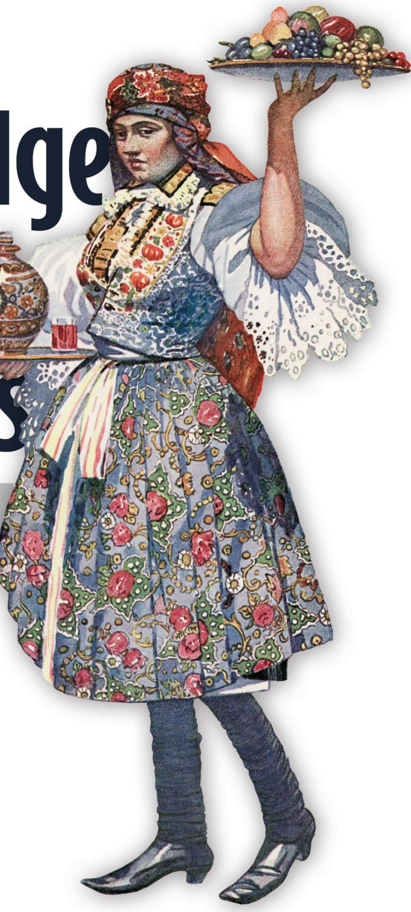
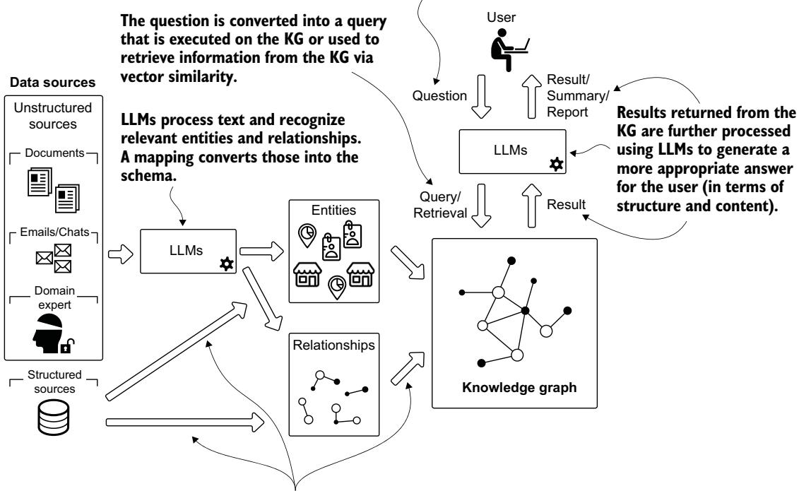

# 지식 그래프와 IN ACTION

Alessandro Negro Giuseppe Futia Vlastimil Kus Fabio Montagna Maxime Labonne Khalifeh AlJadda 추천사

사용자는 자연어를 사용하여 질문할 수 있습니다.

구조화된 데이터에는 개체와 관계가 포함되어 있습니다.   
이들은 대상 스키마에 매핑되어야 합니다.

지식 그래프와 LLM의 실제 활용

### 지식 그래프와 LLM의 실제 활용

알레산드로 네그로

주세페 푸티아

블라스티밀 쿠스

파비오 몬타냐

막심 라본

및 칼리페 알자다의 서문

이 책과 기타 Manning 도서에 대한 온라인 정보 및 주문은 www.manning.com을 방문해 주십시오. 출판사는 이 책을 대량 주문할 경우 할인 혜택을 제공합니다. 자세한 내용은 다음으로 문의해 주십시오.

특별 판매 부서   
Manning Publications Co.   
20 Baldwin Road   
PO Box 761   
Shelter Island, NY 11964   
이메일: orders@manning.com

출판사의 사전 서면 허가 없이 이 출판물의 어떠한 부분도 전자적, 기계적, 복사 또는 기타 어떠한 형식이나 수단으로도 복제하거나, 검색 시스템에 저장하거나, 전송할 수 없습니다.

제조업체와 판매업체가 자사 제품을 구별하기 위해 사용하는 많은 명칭은 상표로 주장됩니다. 해당 명칭이 이 책에 나타나고 Manning Publications가 상표권 주장 사실을 인지한 경우, 그 명칭은 첫 글자를 대문자로 하거나 모두 대문자로 인쇄되었습니다.

기록된 내용을 보존하는 것의 중요성을 인식하여, Manning은 우리가 출판하는 도서를 산성 성분이 없는 종이에 인쇄하는 것을 정책으로 삼고 있으며, 이를 위해 최선의 노력을 기울입니다. 또한 지구 자원을 보존해야 할 우리의 책임을 인식하여, Manning 도서는 최소 15퍼센트 이상 재활용되었으며 원소 염소를 사용하지 않고 처리된 종이에 인쇄됩니다.

저자와 출판사는 이 책의 정보가 인쇄 시점에 정확하도록 모든 노력을 기울였습니다. 저자와 출판사는 본문 정보의 사용 또는 오류나 누락으로 인해 발생한 손실, 손해 또는 장애에 대해, 그러한 오류나 누락이 과실, 사고 또는 기타 어떠한 원인에서 비롯되었는지 여부와 관계없이, 어떠한 당사자에게도 책임을 지지 않으며 이에 대한 모든 책임을 명시적으로 부인합니다.

Manning Publications Co.

개발 편집자: Dustin Archibald

20 Baldwin Road

기술 편집자: Dimitris Polychronopoulos

PO Box 761

검토 편집자: Radmila Ercegovac

Shelter Island, NY 11964

제작 편집자: Kathy Rossland

교정 편집자: Tiffany Taylor

개발 교정 편집자: Frances Buran

교열자: Olga Milanko

기술 교열자: Sachin Panemangalore

조판 및 표지 디자이너: Marija Tudor

Aurora, Filippo, Flavia에게 —Alessandro

나의 가족에게, 특히 부모님께, 변함없는 사랑과 지지와 인내에 감사드립니다. 나와 함께 걸어 주고, 영감을 주고, 앞으로 나아가도록 이끌어 주며, 가장 중요한 순간에 솔직할 용기를 보여 준 친구들과 멘토들에게 바칩니다. —Vlastimil

Debora에게—삶이라는 우주적 그래프에서 우리가 충돌한 이후 나의 변함없는 존재인 당신에게—이 여정의 모든 노드와 에지를 나와 함께 걸어 주어 감사합니다. 나의   
부모님 Marieta와 Cosimo께, 변함없는 지지에 깊이 감사드립니다—그리고 지식 그래프가 도대체 무엇인지 가끔만 물어봐 주신 것도 감사합니다. 그리고 나의 형제 Dante에게—절묘한 타이밍의 현실 점검 덕분에 나는 두 발을 땅에 딛고 있을 수 있었습니다(그리고 꽤 제정신을 유지할 수 있었습니다). Giuseppe

나의 아내 Fiorella와 나의 자녀 Giulio, Azzurra, Arianna에게, “거의 다 썼어”라는 말을 수없이 많은 저녁 동안 인내심 있게 견뎌 준 이들에게 바칩니다. —Fabio

### 간략 목차

제1부 하이브리드 지능형 시스템의 기초 1   
1 ■ 지식 그래프 (Knowledge graphs)와 LLM: 강력한 조합 3   
2 ■ 지능형 시스템: 하이브리드 접근법 17   
제2부 구조화된   
데이터 소스로부터 지식 그래프 구축 37   
3 ■ 온톨로지 (ontologies)로 첫 지식 그래프 만들기 39   
4 ■ 단순 네트워크에서 다중 소스 통합으로 65   
제3부 텍스트로부터 지식 그래프 구축 95   
5 ■ 비정형   
데이터에서 도메인 특화 지식 추출 97   
6 대규모 언어 모델로 지식 그래프 구축하기 115   
개체명 중의성 해소 (Named entity disambiguation) 129   
8 개방형 LLM과 도메인 온톨로지를 활용한 NED 180   
제4부 지식 그래프에서의 머신러닝 207   
9 지식 그래프에서의 머신러닝: 입문적 접근 209   
10 그래프 특징 공학: 수동 및 반자동   
접근법 233   
11 그래프 표현 학습과 그래프 신경망 272   
12 ■ GNN을 활용한 노드 분류와 링크 예측 302   
제5부 지식   
그래프와 LLM을 활용한 정보 검색 335   
13 ■ 지식 그래프 기반 검색 증강   
생성 (retrieval-augmented generation) 337   
14 자연어로 KG에 질문하기 356   
15 ■ LangGraph로 QA 에이전트 구축하기 397   
부록 A 그래프 소개 435   
부록 B Neo4j 447   
부록 C 구조화된 소스로부터 지식 그래프 구축 461   
참고문헌 493   
색인 505

### 목차

추천사 xv   
머리말 xvii   
감사의 글 xix   
이 책에 대하여 xxi   
저자 소개 xxv   
표지 그림에 대하여 xxvii

### 1부 하이브리드 지능형 시스템의 기초

1.5 KG와 LLM을 사용한 데이터 기반 애플리케이션 구축 12 예시 사용 사례: 신약 발견 및 개발 13 ■ 예시 사용 사례: 고객 지원을 위한 대화형 AI 13 ■ KG 사용 여부 결정 14

1.6 지식 그래프 기술 14 분류 체계와 온톨로지 15

### 목차

1.7 KG와 LLM을 어떻게 가르치는가? 16   
2 지능형 시스템: 하이브리드 접근법 17   
2.1 지능이란 무엇인가? 18   
2.2 지능형 시스템 설계 19   
지능형 시스템이란 무엇인가? 20 ■ 지능형   
시스템의 범주 20 ■ 지능형 시스템의 특성 23   
2.3 지식 획득과 표현 24   
2.4 추론 27   
2.5 추론 엔진 30   
순수 연역 추론 엔진의 한계 31 ■ 귀납   
추론과 ML 사용 32 ■ 추론 엔진에서 LLM의   
역할 33   
2.6 IAS에 대한 KG 접근법 33   
2 구조화된 데이터 소스로부터 지식 그래프 구축 37   
3 온톨로지로부터 첫 번째 지식 그래프 만들기 39   
3.1 지식 그래프 구축: 준비 41   
비즈니스 및 도메인 이해 41 ■ 데이터   
이해 43   
3.2 지식 그래프 기술 이해 46   
RDF인가 LPG인가? 목표 중심 논의 47 ■ RDF와 LPG로 엣지   
속성 표현하기 49   
3.3 지식 그래프 구축 52   
neosemantics를 사용한 온톨로지 수집 및 처리 52   
주석 수집 및 처리 55   
3.4 데이터 질의 59   
3.5 KG에 대한 추론 62   
4 단순 네트워크에서 다중 소스 통합으로 65   
4.1 생의학 지식 그래프와 애플리케이션 66   
4.2 KG의 다중 오믹스 (multi-omic) 애플리케이션 67   
PPI 및 단백질-질병 네트워크로부터 KG 만들기 69   
결과 KG에 대한 고수준 분석 73 ■ PPI 및 질병 KG의 도메인 특화   
분석 76

### 4.3 KG의 제약 분야 응용 80

Hetionet 지식 그래프에 대한 심층 분석 84 ■ 경로 분석 결과의 LLM 보조 해석 88

4.4 KG의 임상 응용 90

LLM 기반 임상 의사결정 지원 분석 93

#### 3부 텍스트로부터 지식 그래프 구축 ... 95

5 비정형 데이터에서 도메인 특화 지식 추출 97 5.1 아카이브 과제 98 5.2 지식 추출의 핵심 개념 99 개체명 인식 100 ■ 관계 추출 101 5.3 대규모 언어 모델로 KG 구축 101 LLM 사용 102 ■ 프롬프트 엔지니어링 예제 104 프롬프트 엔지니어링 지침 109 ■ KG 구축: 전통적 NLP인가 LLM인가? 112 대규모 언어 모델로 지식 그래프 구축 115 6.1 아카이브를 KG로 변환 116 그래프 모델링 118 ■ 메타그래프 생성 119 정규화와 정제 119 ■ 그래프 기반 엔티티 해소 120 6.2 지적 네트워크 분석: 그래프의 가치 122 6.3 록펠러 아카이브 센터 프로젝트의 다음 단계 126 6.4 LLM 시대의 지식 그래프의 가치 127   
7 개체명 중의성 해소 129 7.1 인식에서 중의성 해소로 129 7.2 개체명 중의성 해소 이해 132 7.3 도메인 기반 NED와 LLM 136 7.4 비즈니스 및 도메인 이해 138 맥락 138 ■ 사용 사례 정의 140 7.5 데이터 이해 141 비정형 데이터 141 ■ 도메인 온톨로지 142 7.6 SoHO 지식 그래프 구축 146 스키마 정의 147 ■ 문서 처리 및 적재 148 ■ 의료 엔티티 중의성 해소 및 적재 149 ■ 온톨로지 처리, 로딩 및 매핑 152   
엔티티 동시 출현 생성 157   
7.7 KG 기반 사용 사례 158   
개념 검색 159 ■ 구조화된 지식 기반 검색 162   
KG 기반 해석 가능성과 발견 166 ■ 새로운 지식 발견 174   
8 개방형 LLM과 도메인 온톨로지를 활용한 NED 180   
8.1 전통적 NED 시스템의 한계 이해 180   
8.2 도메인 온톨로지 적재 182   
8.3 Ollama와 Llama 3.1 8B로 모델 설정 186   
8.4 종단 간 NED 프로세스 187   
개체명 인식 188 ■ 후보 선택 192   
후보 중의성 해소 194   
8.5 결론 205   
ART 4 지식 그래프에 대한 머신러닝 207   
지식 그래프에 대한 머신러닝: 입문적 접근 209   
9.1 그래프에 대한 머신러닝: 왜 필요한가? 210   
9.2 그래프에 대한 머신러닝: 무엇인가? 211   
노드 분류 211 ■ 링크 예측(관계 예측이라고도 함) 214 ■ 클러스터링과 커뮤니티 탐지 216   
그래프 분류 217   
9.3 그래프에 대한 머신러닝: 어떻게 하는가? 219   
노드 분류와 링크 예측 220 ■ 그래프 분류 228 ■ 그래프 클러스터링 229   
10 그래프 특징 공학: 수동 및 반자동 접근법 233   
10.1 수동 노드 특징 235   
차수 237 ■ 삼각형 239 ■ 밀도 241 ■ 측지(또는 최단) 경로 242 ■ 근접성 244 ■ 매개성 247   
PageRank 249 ■ 예측 250   
10.2 수동 관계 특징 254   
노드 기반 표현 255 ■ 경로 기반 특징 256

#### 목차

### 10.3 반자동 특징 추출 263

ReFeX를 수동으로 수행하기 266 ■ 코드로 ReFeX를 자동으로 수행하기 268

## 11 그래프 표현 학습과 그래프 신경

망 272

11.1 그래프 표현 학습에서의 임베딩 273 그래프 임베딩 이해하기: 이산에서 연속으로 274 실제 응용과 예시 278

11.2 인코더–디코더 모델 279

인코더: 그래프 구조를 벡터로 변환하기 279

디코더: 그래프 속성 재구성하기 280 ■ 프레임워크의 힘 280 ■ Node2Vec: 인코더–디코더 프레임워크의 예 280

11.3 얕은 임베딩: 그래프 표현에 대한 첫 번째 접근 283 얕은 임베딩 이해하기 283 ■ 얕은 임베딩의 한계 284

11.4 지식 그래프에서의 임베딩 285 손실 함수 285 ■ 다중 관계 디코더 288

11.5 메시지 전달과 그래프 신경망 289

메시지 전달 프레임워크: 신경망적 대화 289 ■ 동기와 직관: 메시지 전달이 작동하는 이유 290 ■ 기본 GNN 모델 291 ■ 자기 루프를 사용한 메시지 전달 291

11.6 일반화된 집계 및 갱신 방법 292 이웃 정규화 293 ■ 이웃 어텐션 294 ■ 멀티헤드 어텐션과 트랜스포머 연결 294 ■ 일반화된 갱신 방법 297

11.7 GNN과 LLM의 시너지 299

12 GNN을 활용한 노드 분류와 링크 예측 302

12.1 자금세탁 방지 응용을 위한 노드 분류 303

입력 데이터 304 ■ 그래프 프로세서: 데이터 준비 305 그래프 프로세서: 동질 PyG 그래프 307 인코더–디코더 아키텍처 310 ■ 평가와 분석 313

### 12.2 영화 추천을 위한 링크 예측 317

입력 데이터 318 ■ 그래프 프로세서: 데이터 준비 319 그래프 프로세서: 이질 PyG 그래프 321 인코더–디코더 아키텍처 326 ■ 평가와 분석 330

#### 제5부 지식 그래프와 LLM을 활용한 정보 검색 335

## 13 지식 그래프 기반 검색 증강 생성 (retrieval-augmented generation) 337

13.1 AI 에이전트 338

13.2 LLM과 대화하기 339

13.3 운영 환경에서의 과제 341

13.4 비공개 데이터에 대해 AI와 대화하기 342 검색 증강 생성 343 ■ 벡터 기반 RAG의 한계 345 ■ 그래프 RAG 347 ■ 추론 에이전트 351 우리의 KG와 대화해 봅시다 352

## 14 자연어로 KG에 질문하기 356

14.1 치안 영역에서 지식 그래프 질의하기 357 지식 그래프로 도메인 전문가 지원하기 357

14.2 KG 질의를 위한 RAG: 기능과 과제 358 완전한 컨텍스트에서의 RAG 효과성 359 ■ 불완전한 검색에서의 RAG 취약성 361

14.3 KG 질의를 위한 스키마 기반 접근법 363 그래프 스키마 이해 및 활용 364

14.4 전문가처럼 생각하기: 향상된 질의를 위한 메타데이터 활용 366

14.5 의도 탐지: 사용자 기대 이해하기 367 시각화 유형별 분류 368 ■ 데이터인가, 문서인가, 아니면 단순한 불만인가? 372

14.6 스키마에서 LLM 준비 컨텍스트로 376 스키마 추출 및 표현 377 ■ 설명적 주석으로 스키마 보강하기 380 ■ 스키마 표현을 위한 실용적 접근법 382

14.7 생각할 시간입니다: LLM 추론 이해하기 383 순서가 중요합니다: 답변 먼저 vs. 추론 먼저 384 ■ 질의로 사고하기: 텍스트에서 Cypher로 386 ■ 신뢰할 수 있는 질의 생성을 위한 출력 구조화 391

14.8 응답 요약: 결과에서 통찰로 392

## 15 LangGraph로 QA 에이전트 구축하기 397

15.1 LangGraph 파이프라인 구축하기 398

시스템 아키텍처 개요 399 ■ 파이프라인 구성 요소 설정 401 ■ 스키마 변환 서비스 404 상태 관리 설계 408 ■ 파이프라인 에이전트 구현 409 ■ 파이프라인 통합 계층 415

15.2 Streamlit 애플리케이션 417 애플리케이션 개요 418 ■ LangGraph 통합 420

15.3 전문가 모방 조사 422 초기 사례 식별 423 ■ 감시 범위의 공간 분석 425 ■ 차량 패턴 탐지 427 ■ 맥락 인식 요청 정제 428 ■ 과거 기록 분석 430

15.4 향후 방향과 개선 432 사용으로부터의 학습 432 ■ 핵심 역량 강화 433 고급 발전 경로 433

부록 A 그래프 입문 435

부록 B Neo4j 447

부록 C 구조화된 소스에서 지식 그래프 구축하기 461

참고문헌 493

색인 505

### 추천사

수년 동안 그래프 신경망 (graph neural networks)과 대규모 언어 모델 (large language models)을 다루면서, 저는 각 기술이 매우 깊은 강점과 그에 못지않게 깊은 한계를 지닌다는 것을 배웠습니다. 그래프 신경망은 구조화된 관계를 이해하는 데 탁월하지만 자연어 인터페이스에서는 어려움을 겪습니다. 대규모 언어 모델은 정교한 대화에 참여할 수 있지만, 사실을 자주 환각 (hallucinate)하고 구조화된 지식에 대한 신뢰할 수 있는 기반이 부족합니다.

Knowledge Graphs and LLMs in Action은 AI에서 중요한 과제를 다룹니다. 즉, 지능적이면서도 신뢰할 수 있는 시스템을 구축하기 위해 이러한 기술들을 어떻게 결합할 것인가라는 문제입니다. Alessandro Negro, Giuseppe Futia, Vlastimil Kůs, Fabio Montagna는 이러한 융합에 대해 단순히 이론화하는 데 그치지 않고, 이를 실제로 작동하게 만드는 실용적인 처방을 제공합니다. 이들의 접근법은 지식 그래프 (knowledge graph)의 정밀성과 자연어의 접근성 사이의 간극을 메우며, 복잡한 데이터에 대해 추론하고 그 결론을 설명할 수 있는 시스템을 만듭니다.

이 작업에서 저에게 가장 인상적이었던 점은 현실 세계 구현에 대한 드문 강조입니다. 저자들은 지저분하고 비정형적인 데이터로부터 지식 그래프를 구축하는 과정을 단계별로 안내한 다음, 이를 의료, 법 집행 및 그 밖의 분야의 애플리케이션을 위해 언어 모델과 통합하는 방법을 보여줍니다. 예제는 구체적이고 코드는 운영 환경에서 사용할 수 있는 수준이어서, 이 책은 학습 자료이자 실용적인 안내서가 됩니다.

여기서 다루는 기술적 깊이는 상당하며, 그래프 구축부터 고급 검색 시스템에 이르기까지 모든 것을 포괄합니다. 그러나 저자들은 중요한 의사결정에서 신뢰할 수 있는 조언자 역할을 할 수 있는 AI 시스템을 구축한다는 실용적 목표를 결코 놓치지 않습니다. 이러한 하이브리드 접근법은 고위험 환경에서 AI 배포를 제한해 온 신뢰성과 설명가능성 (explainability)의 과제를 해결합니다.

강력하면서도 신뢰할 수 있어야 하는 AI 시스템을 연구하거나 개발하고 있다면, Knowledge Graphs and LLMs in Action은 이를 달성하기 위한 명확한 프레임워크를 제공합니다. 지식 그래프와 언어 모델의 결합은 실제 애플리케이션이 요구하는 투명성과 신뢰성을 유지하면서도 복잡성을 처리할 수 있는 AI를 향한 중요한 진전을 나타냅니다.

—MAXIME LABONNE

LIQUID AI, 사후 학습 책임자

데이터 과학 리더이자 지식 그래프의 열정적인 옹호자로서, 저는 Knowledge Graphs and LLMs in Action을 기쁘게 추천합니다. 우리는 생성형 AI와 대규모 언어 모델 (LLMs)의 부상으로 형성되는 AI의 변혁적 순간을 목격하고 있습니다. Gemini와 ChatGPT 같은 시스템은 대규모 자연어 상호작용의 문을 열었으며, 지능형 기계의 가능성을 엿보게 했습니다. 그러나 우리는 이러한 모델에 결함이 없지 않다는 것도 알고 있습니다. 환각, 오래된 지식, 제한된 투명성, 맥락적 기반 부족은 여전히 실제적인 과제로 남아 있습니다.

이와 같은 우려를 해결하는 지점에서 지식 그래프는 빛을 발합니다. 지식 그래프는 LLM을 보완하는 데 그치지 않고, 정확하고 설명 가능하며 맥락을 인식하는 시스템을 구축하기 위한 필수 기반입니다. 이 책은 지식 그래프와 LLM의 융합이 어떻게 강력한 시너지를 만들어 서로의 약점을 완화하는 동시에 그 잠재력을 온전히 끌어내는지를 보여줍니다.

저자들인 Alessandro Negro, Vlastimil Kůs, Giuseppe Futia, Fabio Montagna는 수년간의 실무 경험과 컨설팅 전문성을 갖추고 있습니다. 이들의 작업은 이론을 넘어 실제 응용에 기반한 실행 가능하고 운영 환경에 바로 적용할 수 있는 통찰을 제공합니다.

이 책은 지식 그래프와 LLM에 관한 참고서를 넘어섭니다. 의료, 금융, 법 집행과 같은 영역 전반에서 인간의 의사결정을 대체하는 것이 아니라 강화하는 지능형 시스템을 개발하기 위한 실용적 도구 모음입니다.

AI가 투명하고, 맥락적이며, 신뢰할 수 있어야 하는 시대에 이 책은 시의적절할 뿐 아니라 필수적입니다. 차세대 지능형 시스템을 구축할 준비가 된 모든 데이터 과학자, 엔지니어, 아키텍트, 지식 기반 전문가의 서가에 반드시 있어야 할 책입니다.

Alessandro, Vlastimil, Giuseppe, Fabio, 이 통찰력 있고 실용적인 책을 써 주셔서 감사합니다!

—KHALIFEH ALJADDA

이전 책인 Graph-Powered Machine Learning의 완성을 앞두고 있을 때, 저는 자연스러운 후속 작업에 대한 제안을 가지고 인수 편집자인 Mike Stephens에게 연락했습니다. 그 이전 작업은 지식 그래프를 소개하고 자연어 처리 (natural language processing)를 사용해 지식 그래프를 구축할 수 있음을 보여주었지만, 많은 독자들은 그래프 신경망 (graph neural networks)이 중요한 누락 요소라고 지적했습니다. 제가 제안한 책은 그 공백을 메우는 동시에 상세한 분석과 구축 기법을 포함하여 지식 그래프 이야기를 더 확장하는 것이었습니다.

Mike는 제안을 받아들였고, 저는 Knowledge Graphs Applied라는 작업 제목으로 새로운 모험을 시작했습니다. 과제의 범위를 인식한 저는 GraphAware의 세 동료인 Fabio, Giuseppe, Vlastimil에게 이 노력에 함께해 달라고 요청했으며, 그들의 결합된 전문성이 매우 귀중할 것이라고 확신했습니다. 저는 순진하게도 한 명의 저자가 4년 만에 책을 쓸 수 있다면 네 명의 저자는 단 1년 만에 책을 완성할 수 있다고 생각했습니다. 그 가정은 아홉 명의 여성이 한 달 만에 아기를 낳을 수 있으리라 기대하는 것만큼이나 잘못된 것으로 드러났습니다.

현실은 다른 계획을 가지고 있었습니다. 지난 몇 년 동안 기술 환경에는 중대한 변화가 휩쓸고 지나갔습니다. 대규모 언어 모델(LLM)과 생성형 AI가 이 분야를 완전히 뒤흔들었고, 지식 그래프 실무자들은 갑자기 이 확립된 기술을 혁신적인 방식으로 사용할 전례 없는 기회를 마주하게 되었습니다. 우리는 처음에는 BERT와 같은 기존 자연어 처리(NLP) 도구를 기반으로 삼을 계획이었지만, 이러한 도구들은 지식 그래프를 구축하고, 질의하고, 분석하는 새로운 가능성을 열어 준 LLM 역량에 의해 빠르게 대체되고 있었습니다.

바로 이 지점에서 우리 자신을 포함한 많은 실무자들이 어려움을 겪고 있었습니다. 우리는 이러한 변화를 거부하기보다, Mike 및 개발 편집자인 Dustin Archibald와 함께 이를 받아들이기로 결정했습니다. 우리는 제목을 *Knowledge Graphs and LLMs in Action*으로 조정하고, LLM을 우리의 궁극적 목표인 복잡한 의사결정 과업을 수행하는 인간에게 힘을 실어 주는 지능형 조언자 시스템의 필수 구성요소로 자리매김하도록 내용을 대폭 개정했습니다. 이러한 전환에는 광범위한 리팩터링 (refactoring)과 접근 방식의 근본적인 변화가 필요했지만, 그 결과는 우리의 기대를 뛰어넘었습니다.

여러분이 읽고 있는 이 책은 하이브리드 시스템 (hybrid systems)의 힘에 관한 선언문으로 발전했습니다. 이 책은 이미 잘 확립된 지식 그래프와 새롭게 등장한 LLM이라는 두 기술을 결합함으로써, 장기적으로 놀라운 성과를 가져오는 플라이휠 효과 (flywheel effect)가 어떻게 만들어지는지를 보여 줍니다. 지식 그래프 실무자들은 더 큰 영향력을 발휘하기 위해 LLM의 역량을 활용하는 방법을 발견하게 될 것이며, LLM 실무자들은 언어 모델의 주요 한계 중 일부를 해결하는 기법을 배우게 될 것입니다.

우리는 여러분이 더 지능적이고, 더 신뢰할 수 있으며, 더 인간 중심적인 AI 시스템을 향한 이 여정에 함께하기를 권합니다.

## 감사의 글 (Acknowledgments)

This book took almost five years to complete, and during that time, many things changed around us, both professionally and personally. The technology landscape has transformed dramatically since we began writing: LLMs have fundamentally shaped our professions.

Writing a book requires dedication and countless hours, usually outside normal working hours, late at night, and on weekends and holidays. So first and foremost, we need to thank our families and all the people who somehow received a “no” or suffered a delay because of this book.

To my co-authors—Fabio, Giuseppe, and Vlastimil—thank you for embarking on this adventure with me. Each of you brought unique expertise and perspectives that made this book infinitely better than what I could have accomplished alone. Your dedication to excellence and willingness to adapt as the technology landscape shifted around us were nothing short of remarkable.

We owe an enormous debt of gratitude to the team at Manning Publications. In particular, Mike Stephens, Manning's associate publisher, not only accepted our book proposal but also provided invaluable guidance during the pivotal transformation from our original direction (Knowledge Graphs Applied) to what you are now reading (Knowledge Graphs and LLMs in Action). A special thank you to Dustin Archibald, our development editor, who followed us step by step with enormous patience and consistently provided excellent advice to make this a better book; your commitment to quality and your understanding during the extensive refactoring process made all the difference. We also want to thank the production and marketing teams at Manning— there are so many talented individuals that it's impossible to mention them all, but they are the reason Manning books are such high quality and so well presented.

Our sincere appreciation goes to Dimitris Polychronopoulos, our technical editor, whose meticulous attention to detail and expert feedback significantly improved the technical accuracy and clarity of this work. Dimitris is an R&D scientist and entrepreneur specializing in genomics and data-driven drug discovery. With roles across biotech and big pharma, he has led innovative work on applying knowledge graphs and AI to uncover novel targets in oncology and chronic liver diseases.

We also extend our gratitude to all the reviewers who provided valuable feedback throughout the development process, including those who shared comments and suggestions online: Alexey Ott, Angelo Simone Scotto, Ayush Tomar, Avinash Tiwari, Chalamayya Batchu, Charles Ivie, Chris Viner, Dan McCreary, David Cronkite, David Meza, Floris Bouchot, Gajendra Babu Thokala, Gourav Sengupta, Guillaume Alleon, James J Byleckie, Jeremy Chen, Kristof Leroux, Kumar Abhishek, Lawrence Nderu, Maria Ana, Nicolas Bievre, Or Golan, Ozan Evkaya, Pethuru Raj, R. P. Shrivastava, Richard Vaughan, Robert Wardenga, S. S. Narendran, Sachin Panemangalore, Samantha Berk, Shailja Gupta, Simeon Leyzerzon, Sophia Shvets, Sumit Pal, and Suvarsha Rai. Your insights and constructive criticism helped shape this book into its final form.

A special acknowledgment goes to Khalifeh and Maxime, who kindly agreed to write forewords for this book. They received an almost-final copy when the book was ready for production, requiring them to work under tight deadlines to provide the thoughtful forewords you'll find at the beginning—no small feat for professionals as busy as they are. Khalifeh and Maxime are among the most knowledgeable experts we know in their fields. Their endorsement carries particular weight because of their extensive experience in bringing these technologies to real-world applications, and their ongoing work continues to inspire us and the broader community.

We also want to acknowledge the companies that provided us with the knowledge, experience, and opportunities we needed to create this book. GraphAware, in particular, has been instrumental in shaping our understanding of real-world graph applications and the challenges organizations face when implementing these technologies at scale.

Finally, we extend our appreciation to the broader community of researchers, practitioners, and open source contributors whose work made many of our examples possible. The datasets, tools, and frameworks that power the demonstrations in this book represent countless hours of effort from dedicated individuals who chose to share their knowledge with the world.

This book exists because of all of you. Thank you for making this journey possible.

### 이 책에 대하여

『Knowledge Graphs and LLMs in Action』은 지식 그래프(KG)의 구조화된 추론 역량과 대규모 언어 모델(LLM)의 자연어 이해를 결합한 하이브리드 지능형 시스템 구축에 대한 포괄적인 안내서입니다. 이 책은 이러한 상호 보완적인 기술들이 어떻게 함께 작동하여 다양한 도메인의 현실 세계 과제를 해결하는 더 강력하고, 신뢰할 수 있으며, 설명 가능한 AI 솔루션을 만들어 낼 수 있는지를 보여 줍니다.

### 이 책의 독자 대상

이 책은 KG와 LLM의 시너지적 역량을 활용하고자 하는 머신러닝 엔지니어, 데이터 과학자, 그래프 전문가, AI 엔지니어를 위해 설계되었습니다. 구조화된 기업 데이터를 다루든, 추천 시스템을 구축하든, 사기 탐지 알고리즘을 개발하든, 질의응답 애플리케이션을 만들든, 이 책은 두 기술을 함께 사용하여 어느 한쪽만으로는 얻을 수 없는 더 나은 결과를 달성하는 방법을 보여 줍니다.

구조화된 지식으로 모델을 향상시키고자 하는 데이터 과학자, LLM 애플리케이션에서 환각을 줄이고자 하는 머신러닝 엔지니어, 또는 설명 가능하고 검증 가능한 시스템 구축에 관심이 있는 AI 실무자라면, 이 책은 필요한 실용적 지침을 제공합니다. 머신러닝 개념과 그래프 데이터베이스에 어느 정도 익숙하면 도움이 되지만, 이 책은 필요한 모든 개념을 소개하고 복잡도를 점진적으로 높여 갑니다.

### 이 책의 구성: 로드맵

이 책은 5부로 구성된 15개 장으로 이루어져 있으며, 기초 개념에서 고급 구현으로 나아갑니다.

1부에서는 하이브리드 지능형 시스템의 이론적·실천적 토대를 확립합니다.

1장은 지식 그래프(KG)와 LLM의 강력한 결합을 소개하며, 구체적인 예시와 사용 사례를 통해 이들이 상호 보완적인 성격을 지님을 보여 줍니다.

2장은 지능형 시스템의 기본 개념을 탐구하고, 지식 표현 (knowledge representation)과 추론 전략을 심층적으로 다루며, KG와 LLM이 실제로 어떻게 함께 작동하는지 설명합니다.

2부는 구조화된 데이터 소스로부터 KG를 구축하는 데 초점을 둡니다.

3장은 의료 사례를 통해 KG 구축을 시연하며, 인간 표현형 온톨로지 (Human Phenotype Ontology)를 사용해 임상의가 희귀 질환을 진단하도록 돕는 방법을 보여 줍니다.

4장은 이러한 토대를 확장하여, 커뮤니티 탐지 (community detection) 알고리즘과 생의학 응용 전반의 다중 소스 통합을 포함한 고급 분석 방법론을 다룹니다.

3부는 비정형 텍스트에서 지식을 추출하는 까다로운 영역을 다룹니다.

5장은 록펠러 아카이브 센터의 사례 연구를 통해 전통적인 자연어 처리 (NLP)와 최신 LLM 기반 방법을 모두 사용하여 텍스트를 KG로 변환하는 기본 파이프라인을 시연합니다.

6장은 OCR 스캐닝부터 연구 네트워크와 영향 패턴을 식별하기 위한 정교한 그래프 분석에 이르기까지 문서 처리 워크플로를 확장합니다.

 7장은 의료 규제에서 명명 엔터티 중의성 해소 (named entity disambiguation)를 탐구하며, 엔터티를 통합 의학 언어 시스템 (Unified Medical Language System, UMLS) 및 체계화된 의학 명명법 (Systematized Nomenclature of Medicine, SNOMED)과 같은 구조화된 지식 베이스에 연결하는 방법을 보여 줍니다.

 8장은 향상된 정확도를 위해 오픈 LLM과 도메인 온톨로지를 결합하는 혁신적인 중의성 해소 접근법을 소개합니다.

4부는 KG에서의 머신러닝 응용을 탐구합니다.

 9장은 머신러닝을 KG에 적용하기 위한 기본 개념을 소개하고, 학습 가능한 표현의 이론적 토대를 확립합니다.

10장은 사기 탐지와 약물 재창출의 실제 예시를 통해 특징 공학 (feature engineering) 접근법을 설명합니다.

 11장은 그래프 신경망 (graph neural network)으로 나아가며, 이러한 아키텍처가 그래프 구조로부터 최적의 표현을 자동으로 학습하는 방법을 보여 줍니다.

12장은 자금세탁 방지와 영화 추천 시스템을 통해 실제 응용 사례를 시연합니다.

5부는 실용적인 정보 검색 시스템에서 모든 내용을 종합합니다.

13장은 검색 증강 생성 (retrieval augmented generation)을 통해 KG와 LLM을 통합하는 방법을 탐구하며, 그래프 RAG 시스템을 시연합니다.

14장은 법 집행 사례를 통해 도메인 전문가의 추론을 모방하는 정교한 질의응답 시스템을 구축하는 방법을 보여 줍니다.

15장은 LangGraph와 Streamlit을 사용한 완전한 구현을 제공하며, 프로덕션 준비가 된 시스템을 구축하는 방법을 시연합니다.

이 책은 포괄적인 이해를 위해 순차적으로 읽도록 설계되었지만, 경험이 있는 실무자는 당장의 필요에 따라 특정 부분에 집중할 수 있습니다. 초보자는 이후 부분의 특화된 애플리케이션을 살펴보기 전에 기초 지식을 확립하기 위해 1부와 2부부터 시작해야 합니다.

### 코드에 관하여

이 책에는 KG와 LLM 통합의 실제 구현을 보여 주는 광범위한 소스 코드 예제가 포함되어 있습니다. 코드는 번호가 매겨진 목록과 설명문 안에 모두 나타나며, 일반 내용과 구분하기 위해 이와 같이 고정폭 글꼴로 서식이 지정되어 있습니다. 때로는 관련 부분을 강조하기 위해 코드가 굵게 표시되기도 합니다.

많은 경우 원본 소스 코드는 다시 서식이 지정되었습니다. 우리는 책의 사용 가능한 지면 공간에 맞추기 위해 줄바꿈을 추가하고 들여쓰기를 재작업했습니다. 드문 경우에는 이것만으로도 충분하지 않아, 목록에 줄 연속 표시(➥)가 포함되어 있습니다. 또한 코드가 본문에서 설명되는 경우, 소스 코드의 주석은 목록에서 제거된 경우가 많습니다. 코드 주석(annotation)은 많은 목록에 함께 제공되어 중요한 개념을 강조합니다.

모든 소스 코드 예제는 이 책의 GitHub 저장소 https://github.com/alenegro81/knowledge-graphs-and-llms-in-action 에서 다운로드할 수 있습니다. 저장소에는 각 장의 예제에 대한 완전한 구현과 함께, 코드를 실행하는 데 필요한 설정 지침과 데이터 파일이 포함되어 있습니다.

예제에는 Python 3.8 이상과 Neo4j, NetworkX, transformers, LangChain, Streamlit을 포함한 다양한 라이브러리가 필요합니다. 구체적인 요구 사항과 설치 지침은 각 장과 저장소 문서에 제공되어 있습니다. 일부 예제는 OpenAI API 또는 다른 언어 모델 서비스에 대한 접근도 필요하며, 필요한 자격 증명을 설정하는 방법에 대한 지침이 함께 제공됩니다.

이 책의 liveBook(온라인) 버전 https://livebook.manning.com/book/knowledge-graphs-and-llms-in-action 에서 실행 가능한 코드 스니펫을 얻을 수 있습니다. 책에 수록된 예제의 전체 코드도 Manning 웹사이트 https://www.manning.com/books/knowledge-graphs-and -llms-in-action 에서 다운로드할 수 있습니다.

### liveBook 토론 포럼

Knowledge Graphs and LLMs in Action을 구매하면 Manning의 온라인 독서 플랫폼인 liveBook에 무료로 접근할 수 있습니다. liveBook의 독점 토론 기능을 사용하면 책 전체 또는 특정 절이나 단락에 댓글을 첨부할 수 있습니다. 자신을 위한 메모를 남기고, 기술적 질문을 주고받으며, 저자와 다른 사용자로부터 도움을 받는 일이 매우 간단합니다. 포럼에 접근하려면 https://livebook .manning.com/book/knowledge-graphs-and-llms-in-action/discussion 으로 이동하십시오.

독자에 대한 Manning의 약속은 개별 독자들 사이에서, 그리고 독자와 저자 사이에서 의미 있는 대화가 이루어질 수 있는 장을 제공하는 것입니다. 이는 저자 측의 특정한 참여 규모를 보장한다는 뜻은 아니며, 포럼에 대한 저자의 기여는 자발적이며 무보수로 이루어집니다. 저자들의 관심이 다른 곳으로 향하지 않도록, 다소 도전적인 질문을 던져 보시기를 권합니다! 포럼과 이전 토론의 아카이브는 해당 책이 절판되지 않는 한 출판사 웹사이트에서 접근할 수 있습니다.

### 저자 소개

ALESSANDRO NEGRO는 GraphAware의 수석 과학자로, 지식 그래프 (knowledge graphs, KGs)를 핵심으로 사용하는 미션 크리티컬 분석 플랫폼인 Hume을 제공하는 과학 및 기술 부문을 총괄합니다. 그는 컴퓨터 과학 박사 학위를 보유하고 있으며, 다양한 산업 분야의 수많은 조직을 위해 그래프와 결합된 머신러닝 시스템을 성공적으로 배포해 왔습니다. Negro 박사는

Graph-Powered Machine Learning (Manning, 2021)의 저자입니다. 그의 최근 연구는 LLM을 지식 그래프와 통합하여 대규모로 더 신뢰할 수 있고 설명 가능한 AI 시스템을 만드는 데 초점을 맞추고 있습니다. GraphAware에서의 역할 외에도 Alessandro는 스타트업을 적극적으로 멘토링하고 자문하며, 전문 분야의 조직들이 고유한 요구 사항에 맞춘 맞춤형 모델을 만들 수 있도록 돕고 있습니다.

GIUSEPPE FUTIA는 지식 그래프, 대규모 언어 모델, 그래프 신경망 (graph neural networks)에 전문성을 갖춘 데이터 과학자이자 연구원입니다. 그는 컴퓨터 공학 박사 학위를 보유하고 있으며, 연구와 응용 혁신 분야에서의 폭넓은 경험을 통해 학계와 산업계를 연결하고 있습니다. 그의 연구는 상징적 AI와 통계적 AI를 통합하는 지식 주도 지능형 시스템을 개발하여

다양한 영역에서 고급 의사결정을 가능하게 하는 데 초점을 맞추고 있습니다.

VLASTIMIL KŮS는 지식 그래프, 에이전틱 AI (Agentic AI), NLP, 비정형 데이터를 전문으로 하는 수석 AI 엔지니어이자 데이터 과학 리더입니다. 아원자 핵물리학 연구 배경과 고급 데이터 과학 및 머신러닝 분야에서 10년이 넘는 경험을 바탕으로, 그는 깊은 기술 전문성과 비즈니스 영향 창출에 대한 강한 집중을 결합하고 있습니다.

FABIO MONTAGNA는 GraphAware의 시니어 그래프 및 AI 엔지니어로, 신경과학, 운영 해양학, 자연어 처리 전반에서 연구 중심 소프트웨어 엔지니어링 분야에 15년 이상의 경험을 보유하고 있습니다. 과학적 발견과 상업적 적용을 연결하는 선구자로서, 그는 복잡한 연구 개념을 비즈-

니스 가치를 제공하는 확장 가능한 운영 시스템으로 전환하는 일을 전문으로 합니다. 제품 전략가이자 기술 전문가라는 이중 역할을 통해 그는 이론적 돌파구를 의료, 지구과학, 상업적 응용 전반의 실용적 솔루션으로 전환할 수 있습니다. GraphAware 외에도 Fabio는 파킨슨병 치료 평가를 위한 제약 연구에서 신경과 전문의들과 협업해 왔습니다.

### 표지 삽화에 대하여

이 책의 표지에 실린 이미지는 체코 화가 요자 우프르카 (Joža Uprka, 1861–1940)의 “Mařaťanka”라는 작품입니다. 그는 체코 공화국의 역사적인 포도 재배 지역인 남부 모라비아의 민속 생활을 생생하게 묘사한 것으로 유명합니다. 이 그림은 마라티체 (Mařatice) 마을의 젊은 여성을 묘사하는데, 이 마을의 이름은 주민들을 가리키던 고대 명칭인 “마리아의 아들들”을 떠올리게 합니다. 그녀는 전통적인 지역 의상을 입고 포도와 과일이 담긴 쟁반을 높이 들고 있으며, 수확과 풍요, 그리고 역사적 농촌 생활의 지속적인 리듬을 구현합니다. 이는 땅, 계절, 공동체 의례에 뿌리를 둔 공유된 유럽 전통을 기리는 작품입니다. 와인 자체와 마찬가지로, 이러한 주제들은 국경을 초월하여 사람들을 하나로 모으며, 공동 저자진의 체코-이탈리아적 성격을 반영합니다.