# appendix A Introduction to graphs

Although graphs are simple data structures, it is important to understand how to represent them and to be familiar with the main concepts related to them. This appendix introduces the key elements of the graph world. If you already understand these concepts or have read Alessandro’s previous book [1], from which the following sections were excerpted, you can skip this appendix.

### A.1 What is a graph?

The graph is a simple and old mathematical concept. It is a data structure consisting of a set of vertices (or nodes/points) and edges (or relationships/lines) that can be used to model relationships among a collection of objects.

Legend says that it was the lazy Leonhard Euler who first started talking about graphs in 1736. He was visiting Königsberg in Prussia (now Kaliningrad, Russia), which sat on both sides of the Pregel River and included two large islands that were connected to each other and to the two mainland portions of the city by seven bridges. Euler didn’t want to spend too much time walking through the city, so he formalized the problem to cross each bridge once and only once. This led to the invention of graphs and graph theory [2]. He proved that it was an impossible task, and he stayed home instead. Figure A.1 shows an old representation of Königsberg and the related graph representation used by Euler to prove his thesis.

More formally, a graph is a pair of vertices and edges represented by $G = \left( V , E \right)$ where V is a collection of vertices denoted by $V = \{ V_{\mathrm{i} } , i = 1 , n \}$ , and E is a collection of edges over V designated by $E_{\mathrm{ij} } = \{ ( V_{\mathrm{i} } , V_{\mathrm{j} } ) , V_{\mathrm{i} } \in V , V_{\mathrm{j} } \in V \}$ $E \subseteq [ V ] ^ { 2 } \cdot$ The elements of E are thus two-element subsets of V [3]. The simplest way to represent a graph is to draw a dot or a small circle for each vertex and join two vertices with a line to form an edge between them. This more formalized description is shown in figure A.2.

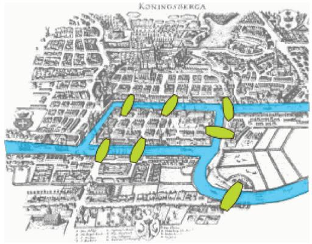

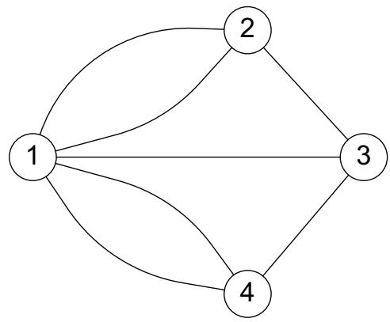  
Figure A.1 The bridges in Königsberg, Russia, that led Leonhard Euler to the invention of graph theory in 1736

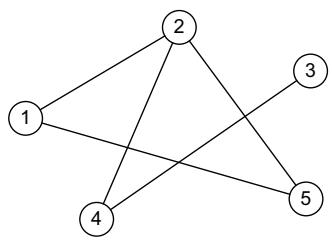  
Figure A.2 The undirected graph V = {1, 2, 3, 4, 5} with the edge set E = {(1,2), (1,5), (2,5), (2,4), (4,3)}

Graphs can be either directed or undirected, depending on whether a direction of traversal is defined on the edges. In directed graphs, an edge $E_{\mathrm{ij} }$ can be traversed from $V_{\mathrm{i} }$ to $V_{\mathrm{j} }$ but not in the opposite direction; $V_{\mathrm{i} }$ is called the tail or start node, and $V_{\mathrm{j} }$ is called the head or end node. In undirected graphs, edge traversals in both directions are valid. Figure A.2 represents an undirected graph, and figure A.3 represents a directed graph.

In figure A.3, the arrow indicates the direction of the relationship. By default,

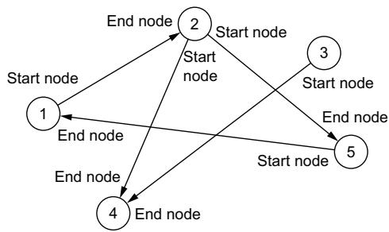  
Figure A.3 The directed graph V = {1, …, 5} with the edge set E = {(1,2), (2,5), (5,1), (2,4), (3,4)}

edges in a graph are unweighted (and thus the corresponding graphs are said to be unweighted). When a weight—a numerical value used to convey some significance—is assigned to the edges, the graph is said to be weighted. Figure A.4 shows the same graphs as the previous two figures, but with a weight assigned to each edge.

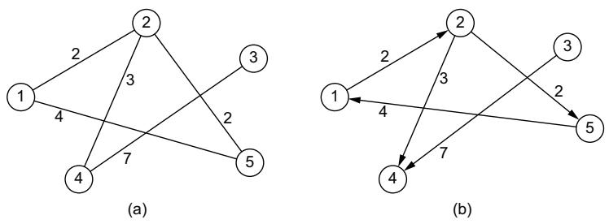  
Figure A.4 An undirected weighted graph (a) and a directed weighted graph (b)

Two vertices x and y of G are defined as adjacent or neighbors if {x,y} is an edge of G. The edge $E_{\mathrm{ij} }$ connecting them is said to be incident on the two vertices $V_{\mathrm{i} }$ and $V_{\mathrm{j} } .$ Two distinct edges, e and f, are adjacent if they have a vertex in common. If all the vertices of G are pairwise adjacent, then G is complete. Figure A.5 shows a complete graph, where each vertex is connected to all the other vertices.

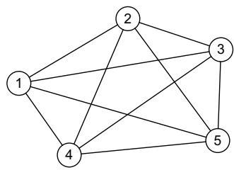  
Figure A.5 A complete graph, where each vertex is connected to all the others

One of the most important properties of a vertex in a graph is its degree, defined as the total number of edges incident to that vertex, which is also equal to

the number of neighbors of that vertex. For instance, in the undirected graph in figure A.4, the vertex 2 has degree 3 (it has the vertices 1, 4, and 5 as neighbors); the vertices 1 (its neighbors are 2 and 5), 4 (neighbors are 2 and 3), and 5 (neighbors are 1 and 2) have degree 2; the vertex 3 has degree 1 (it is connected only with 4).

In a directed graph, the degree of a vertex $V_{\mathrm{i} }$ is split into the in-degree of the vertex, defined as the number of edges for which $V_{\mathrm{i} }$ is its end node (the head of the arrow), and the out-degree of the vertex, defined as the number of edges for which $V_{\mathrm{i} }$ is its start node (the tail of the arrow). In the directed graph in figure A.5, vertices 1 and 5 have an in-degree and an out-degree of 1 (they each have two relationships, one ingoing and one outgoing), vertex 2 has an in-degree of 1 and an out-degree of 2 (one ingoing relationship from 1 and two outgoing to 4 and 5), vertex 4 has an in-degree of 2 and an out-degree of 0 (two ingoing relationships from 2 and 3), and vertex 3 has an out-degree of 1 and in-degree of 0 (one outgoing relationship to 4). The average degree of a graph is computed as follows, where N is the number of vertices in the graph:

$$
a = \frac { 1 } { N } \sum_{i = 1 \ldots N} \mathrm{degree} ( V_{i} )
$$

A sequence of vertices with the property that each consecutive pair in the sequence is connected by an edge is called a path. A path with no repeating vertices is called a

simple path. A cycle is a path in which the first and the last vertex coincide. In figure A.2, [1,2,4], [1,2,4,3], [1,5,2,4,3], and so on are paths; in particular, the path of vertices [1,2,5] represents a cycle.

### A.2 Graphs as models of networks

Graphs are useful to represent how things are either physically or logically linked to each other in simple or complex structures. A graph in which we assign names and meanings to the edges and vertices becomes what is known as a network. In these cases, a graph is the mathematical model for describing a network, whereas a network is a set of relationships between objects, which could include people, organizations, nations, items found in a Google search, brain cells, or electrical transformers. This diversity illustrates the great power of graphs and their simple structure (which also means that they require a small amount of disk storage capacity), which can be used to model a complex system.

NOTE In this context, the verb model is used in terms of representing a system or phenomenon in a simplified way. This model also represents the data in such a way that it can be easily processed by a computer system.

Let’s explore this concept using an example. Suppose we have the graph shown in figure A.6.

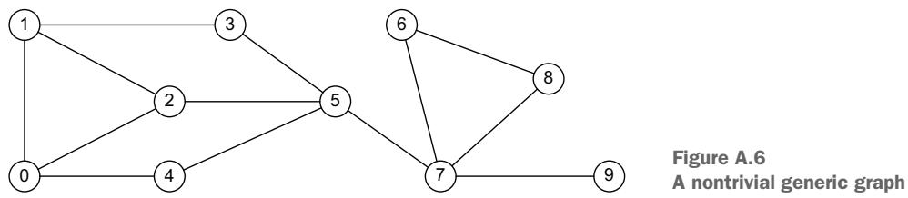

It is a pure graph, in the mathematical sense, that can be used to model various types of networks, depending on the types of edges and vertices. For example, it can model

 A social network, if the vertices are people, and each edge represents any sort of relationship between humans (friendship, family member, coworker, etc.)

An informational network, if the vertices are information structures like web pages, documents, or papers, and the edges represent logical connections, such as hyperlinks, citations, or cross-references

A communication network, if the vertices are computers or other devices that can relay messages, and the edges represent direct links along which messages can be transmitted

A transportation network, if the vertices are cities, and the edges represent direct connections using flights or trains or roads

This is a small set of examples that demonstrates how the same graph can represent multiple networks by assigning different semantics to edges and vertices. Figure A.7 illustrates different types of networks.

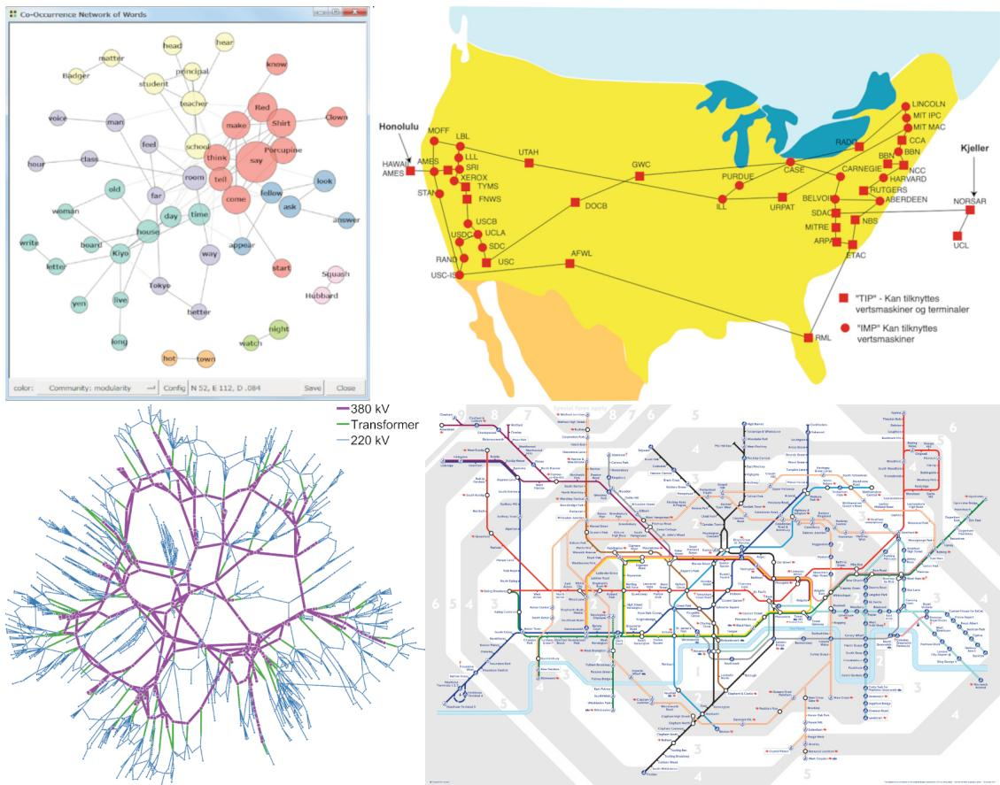  
Figure A.7 Clockwise from top left: co-occurrence network created with KH Coder (by Koichi Higuchi, licensed under CC BY-NC-SA 4.0), ARPA network 1974, London Tube network (https://tfl.gov.uk/tfl/syndication/widgets/ tubemap/default-search.html), and electrical grid (by Paul Cuffe, licensed under CC BY-NC-SA 4.0)

Looking at the figure, we can spot another interesting characteristic of graphs: they are highly communicative. They can display information clearly, and this is why they are often used as information maps. Representing data as networks and using graph algorithms, it is possible to

Find complex patterns

Make those patterns visible for further investigation and interpretation

Combining the power of machine learning (ML) with the power of the human brain, enables efficient, advanced, and sophisticated data processing and pattern recognition.

Networks are useful for displaying data by highlighting connections between elements. Newspapers and news websites are increasingly using them, not only to help people navigate the data but also as a powerful investigative tool.

In 2023, the Panama Papers (https://panamapapers.icij.org) showcased the astonishing features of networks. The International Consortium of Investigative Journalists (ICIJ) analyzed leaked financial documents to expose highly connected networks of offshore tax structures used by the world’s richest elites. The journalists extracted the entities (people, organizations, and any sort of intermediaries) and relationships (protector, beneficiary, shareholder, director, and so on) from the documents, stored them in a network, and analyzed them using visual tools. Figure A.8 shows the results: networks, graph algorithms, and graph visualization revealed something that would have been impossible to discover using traditional data mining tools.

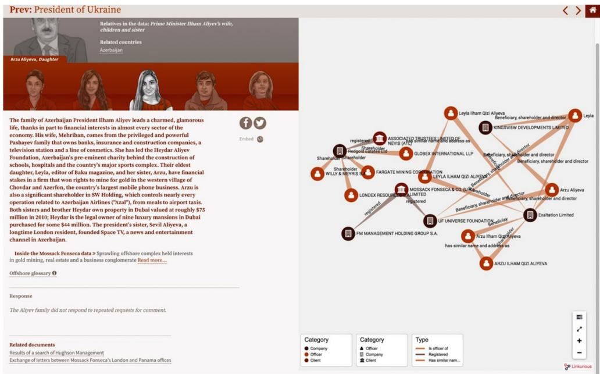  
Figure A.8 An example of the graph visualization for the Panama Papers

Many other interesting examples are available in blog posts by Valdis Krebs (www.thenetworkthinkers.com), an organization consultant who specializes in social network applications. His work contains examples of mixing graph-powered ML with the human mind, passing through graph visualization. We’ll consider one of the more famous examples.

The data in figure A.9 was gathered from Amazon.com and represents the company’s list of the top political books purchased in the United States in 2008 [4]. Krebs applied network analysis principles to the data to create a map of books related to that year’s presidential election. Two books are linked if they were often purchased by the same customer. These are known as also-bought pairs (a customer who bought this book also bought that book).

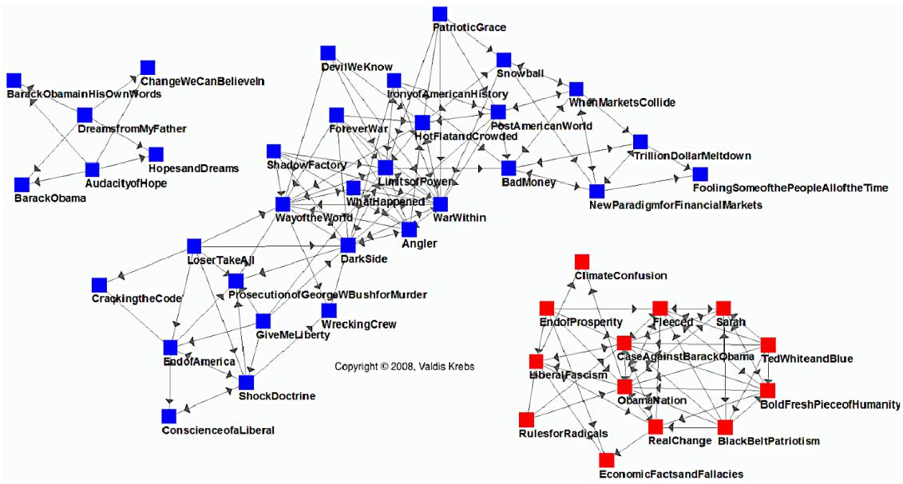  
Figure A.9 Network map of US political books in 2008 [4]

Figure A.9 includes three different and non-overlapping clusters:

An Obama cluster of books in the upper-left corner

A Democratic (blue) cluster in the middle

A Republican (red) cluster in the bottom-right corner

In 2008, the US political climate was highly polarized, as reflected in Amazon’s political book data, which reveals a deep divide between conservative and liberal voters. There were no connections or intermediaries between red and blue books; each cluster was completely distinct from the other. (As mentioned, there was a separate cluster of people reading biographies of presidential hopeful Barack Obama, but they were apparently not interested in reading or purchasing other political books.)

Four years later, in 2012, the same analysis produced a network that appeared substantially different (see figure A.10). In this case, many books act as bridges between the different clusters. Moreover, potential voters appear to be reading books about both presidential candidates. The result is a more complex network in which there are no longer any isolated clusters.

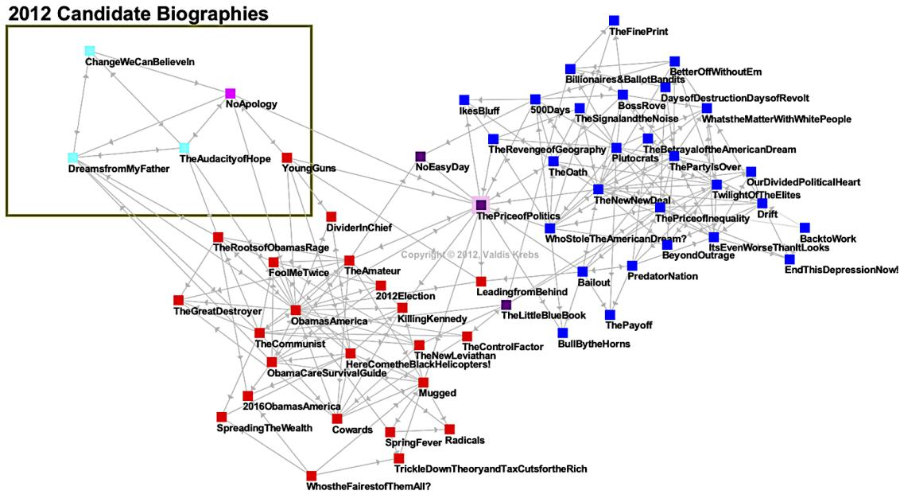  
Figure A.10 Network map of US political books in 2012 [4]

The example of a network of political books introduces an important point. If a graph is a pure mathematical concept that lives in its own Platonic world, then networks, as abstractions of a concrete system or ecosystem, are subjected to forces that act on them and change their structure. We refer to these as surrounding contexts: factors that exist outside the vertices and edges of a network but that nonetheless affect how the network’s structure evolves.

NOTE Mathematical Platonism is the metaphysical view that there are abstract mathematical objects whose existence is independent from us and our language, thought, and practices.

The nature of such contexts and the types of forces are specific to the kind of network. For example, in social networks where each individual has a distinctive set of personal characteristics, similarities and compatibilities between two people’s characteristics influence the creation or deletion of links [5]. One of the most basic notions governing the structure of social networks is homophily (from the Greek, love of the same): links in a social network tend to connect people who are similar to one another.

More formally, if two people have characteristics that match in a proportion greater than expected in the population from which they are drawn or in the network of which they are a part, then they are more likely to be connected [6]. The converse is also true: if two people are connected, then they are more likely to have common characteristics or attributes. This is why our friends on Facebook, for example, don’t look like a random sample of people but are generally similar to us along ethnic, racial, and geographic dimensions; they tend to be similar to us in age, occupation, interests, beliefs, and opinions.

This observation has a long history, with its origins long before Zuckerberg wrote his first line of code. The underlying idea can be found in the writings of Plato (e.g., “similarity begets friendship”) and Aristotle (people “love those who are like themselves”), as well as in folk propositions such as “birds of a feather flock together.” The homophily principle also applies to groups, organizations, countries, or any aspect of social units.

Understanding the surrounding contexts and the related forces that act on a network helps with ML tasks in multiple ways. For example,

 Networks are conduits for both wanted and unwanted flows. Marketers always try to reach and persuade people. Personal contact is most effective if we can find a way to start the conversation. This is the concept at the base of so-called viral marketing.

Understanding such forces allows for the prediction of how networks evolve. This enables data scientists to proactively react to such changes or use them for specific business purposes.

There are findings in sociological and psychological disciplines that point to the relevance of a person’s social network in determining their tastes, preferences, and activities. This information is useful when building recommendation engines: you can’t predict anything for a new user because you have no history of them, but social networks and the homophily principle can be used to make recommendations based on the tastes of connected users.

### A.3 Representing graphs

There are two standard ways to represent a graph, G = (V, E), in a suitable way for processing: as a collection of adjacency lists or as an adjacency matrix. Each approach can be applied to directed, undirected, and unweighted graphs [7].

The adjacency list graph consists of an array (Adj) of lists, one for each vertex in V. For each vertex u in V, the adjacency list Adj[u] contains all the vertices v for which there exists an edge $E_{\mathrm{uv} }$ between u and v in E. In other words, Adj[u] consists of all the vertices adjacent to u in G.

Figure A.11b shows an adjacency list representation of the undirected graph in figure A.11a. For example, vertex 1 has two neighbors, 2 and 5, so Adj[1] is the list [2,5].

  
(a)

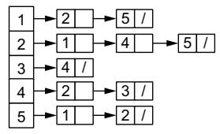  
(b)  
Figure A.11 An undirected graph (a) and the related representation as an adjacency list (b)

(b)

Vertex 2 has three neighbors, 1, 4, and 5, so Adj[2] is [1,4,5]. The other lists are created in the same way. It is worth noting that because there is no order in the relationships, there is no specific order in the lists; hence, Adj[1] could be [2,5] as well as [5,2].

Similarly, figure A.12b provides an adjacency list representation of the directed graph in figure A.12a. Such a list is visualized as a linked list, where each entry contains a reference to the next one. For example, in the adjacency list for node 1, the first element is node 2, with a reference to the next element, which is node 5. This is one of the most common approaches for storing the adjacency list because it makes adding and deleting elements efficient. In this case, we consider only outgoing relationships; however, the same approach can be applied to ingoing relationships. What is important is to choose a direction and maintain consistency when creating adjacency lists.

In figure A.12a, vertex 1 has only one outgoing relationship, with vertex 2, so Adj[1] is [2]. Vertex 2 has two outgoing relationships, with vertices 4 and 5, so Adj[2] is [4,5]. Vertex 4 has no outgoing relationships, so Adj[4] is empty ([]).

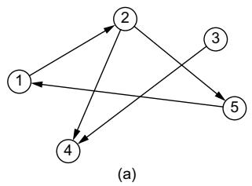

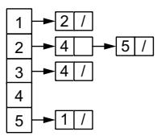

If G is a directed graph, the sum of the lengths of all the adjacency lists is |E|. Because every edge can be traversed in a single direction, $E_{\mathrm{uv} }$ appears only in Adj[u]. If G is an

Figure A.12 A directed graph (a) and the related representation as an adjacency list (b)

undirected graph, the sum of the lengths of all the adjacency lists is $2 \times | E |$ . If $E_{\mathrm{uv} }$ is an undirected edge, then $E_{\mathrm{uv} }$ appears in Adj[u] and Adj[v]. The memory required by an adjacency list representation of either a directed or an undirected graph is directly proportional to |V | + |E |.

We can easily adapt adjacency lists to represent weighted graphs by storing the weight w of the edge $E_{\mathrm{uv} }$ in Adj[u]. The adjacency list representation can be similarly modified to support many other graph variants as well. A disadvantage of this representation is that it provides no faster way to determine whether a given edge, $E_{\mathrm{uv} } ,$ is present in the graph than to search for v in the adjacency list Adj[u]. An adjacency matrix representation of the graph remedies this disadvantage, but at the cost of using asymptotically more memory.

For the adjacency matrix representation of a graph, $G = \left( V , E \right)$ , we assume that the vertices are numbered $1 , 2 , . . . , | V |$ in some arbitrary manner and that these numbers are kept consistent during the life of the adjacency matrix. Then the adjacency matrix representation of a graph G consists of a $\vert V \vert \times \vert V \vert$ matrix $A = \left( { a_{\mathrm{uv} } } \right)$ such that $a_{\mathrm{uv} } = 1$ if $E_{\mathrm{uv} }$ exists in the graph; otherwise, $a_{\mathrm{uv} } = 0$

Figure A.13b shows the adjacency matrix representation of the undirected graph in figure A.13a. The first line is related to vertex 1. This row in the matrix has a 1 in columns 2 and 5 because they represent the vertices to which vertex 1 is connected. All the other values are 0. The second row, related to vertex 2, has a 1 in columns 1, 4, and 5 because those are the connected vertices, and so forth through the remaining rows.

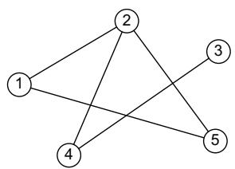  
(a)

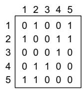  
(b)  
Figure A.13 An undirected graph (a) and the related representation as an adjacency matrix (b)

Figure A.14b shows the adjacency matrix representation of the directed graph in figure A.14a. As we mentioned for an adjacency list, we should choose one direction and use it during matrix creation. In this case, the first row in the matrix has a 1 in column 2 because vertex 1 has one outgoing relationship to vertex 2; all the other values are 0. An interesting feature of the matrix representation

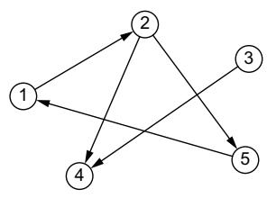  
(a)

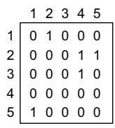  
(b)  
Figure A.14 A directed graph (a) and the related representation as an adjacency matrix (b)

is that by looking at the columns, it is possible to see the inbound relationships. For example, column 4 shows that vertex 4 has two inbounds connections from vertices 2 and 3.

The adjacency matrix of a graph requires memory directly proportional to $\vert V \vert \times \vert V \vert$ , independent of the number of edges in the graph. In an undirected graph, the resulting matrix is symmetrical along the main diagonal. In such cases, it is possible to store only half of the matrix, cutting the memory needed to store the graph almost in half.

Like the adjacency list representation of a graph, an adjacency matrix can represent a weighted graph. For example, if $G = \left( V , E \right)$ is a weighted graph and w is the weight of the edge $E_{\mathrm{uv} } ,$ then $a_{\mathrm{uv} }$ will be set to w instead of 1. Although the adjacency list representation is at least as asymptotically space efficient as the adjacency matrix representation, adjacency matrices are simpler, so you may prefer them when a graph is reasonably small. Moreover, adjacency matrices have a further advantage with unweighted graphs: they require only one bit per entry.

Because the adjacency list representation provides a compact way to represent sparse graphs—those for which the number of edges is less than the number of vertices—it is usually the method of choice. But you may prefer an adjacency matrix representation when the graph is dense, when |E| is close to $\vert V \vert \times \vert V \vert$ , or when you need to be able to tell quickly whether there is an edge connecting two given vertices.