# 부록 B Neo4j


이 책 전반에서 예제, 코드, 연습문제는 특정 그래프 데이터베이스인 Neo4j를 기반으로 합니다. 그럼에도 모든 이론, 알고리즘, 심지어 코드까지도 어떤 그래프 데이터베이스에서든 작동하도록 쉽게 조정할 수 있습니다. 우리가 이 데이터베이스를 선택한 이유는 다음과 같습니다.

우리가 이를 속속들이 잘 알고 있습니다.

이는 네이티브 그래프 데이터베이스 (native graph database)입니다(관련된 모든 결과는 이 책에서 설명한 바와 같습니다).

광범위한 전문가 커뮤니티를 보유하고 있습니다.

DB-Engines(https://db-engines.com/en/ranking\_trend/graph +dbms)에 따르면, Neo4j는 여러 해 동안 가장 인기 있는 그래프 DBMS였습니다(그림 B.1).

참고 DB-Engines 점수 산정은 웹사이트에서의 언급 수부터 Stack Overflow 및 DBA Stack Exchange에서의 기술 질문 빈도, 관련 일자리 제안 수부터 소셜 네트워크에서의 관련성에 이르기까지 여러 요인을 고려합니다.

이 부록은 Neo4j를 시작하고 이 책에서 사용하는 데 필요한 최소한의 정보를 제공합니다. Neo4j를 소개하고, 설치 지침을 제시하며, 데이터베이스 질의에 사용되는 언어인 Cypher 언어를 설명합니다. 또한 예제에서 사용되는 일부 플러그인의 구성도 논의합니다.

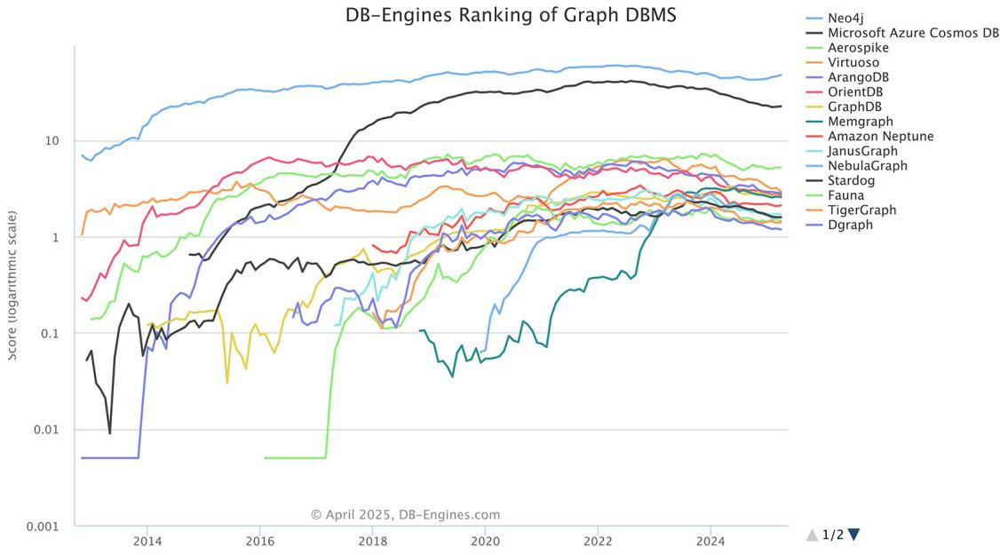  
그림 B.1 그래프 DBMS의 DB-Engines 순위

### B.1 Neo4j 소개


Neo4j는 GPL3 라이선스가 적용된 오픈소스 커뮤니티 에디션으로 제공됩니다. Neo4j Inc.는 또한 백업, 확장 기능, 기타 엔터프라이즈급 기능을 포함한 엔터프라이즈 에디션을 폐쇄형 소스 상용 조건으로 라이선스합니다. Neo4j는 Java로 구현되어 있으며, 트랜잭션 HTTP 엔드포인트 또는 바이너리 Bolt 프로토콜(https://boltprotocol.org/)을 통해 네트워크상에서 접근할 수 있습니다. Neo4j는 다음과 같은 특징으로 인해 널리 채택되고 있습니다.

레이블이 있는 속성 그래프 데이터베이스를 구현합니다.

 인덱스 없는 인접성 (index-free adjacency)에 기반한 네이티브 그래프 저장 방식을 사용합니다. (그래프 표현에 대한 논의는 부록 A를 참조하십시오.)

네이티브 그래프 질의와 관련 언어인 Cypher(www.open cypher.org)를 제공합니다. Cypher는 그래프 데이터베이스가 질의를 기술하고, 계획하며, 최적화하고, 실행하는 방식을 정의합니다.

 Cypher를 사용하는 질의부터 디스크상의 파일에 이르기까지 모든 아키텍처 계층은 그래프 데이터를 저장하고 검색하는 데 최적화되어 있습니다.

 그래프 시각화 인터페이스를 갖춘 사용하기 쉬운 개발자 워크벤치를 제공합니다.

Neo4j는 완전한 기능을 갖춘 산업용 데이터베이스를 제공하며, 트랜잭션 지원은 그 많은 강점 중 하나입니다. 이는 Neo4j를 많은 NoSQL 솔루션과 구별해 줍니다. Neo4j는 다음과 같이 정의되는 완전한 ACID 지원[2]을 제공합니다.

 (A) 원자성 (Atomicity)—여러 데이터베이스 연산을 하나의 트랜잭션으로 묶고, 이들이 모두 원자적으로 실행되도록 보장할 수 있습니다. 연산 중 하나가 실패하면 전체 트랜잭션이 롤백됩니다.

(C) 일관성 (Consistency)—Neo4j 데이터베이스에 데이터를 기록하면, 데이터베이스에 접근하는 모든 클라이언트가 최신 데이터를 읽게 된다는 점을 확신할 수 있습니다.

(I) 격리성 (Isolation)—하나의 트랜잭션 내 연산들은 서로 격리되어 있으므로, 한 트랜잭션의 쓰기가 다른 트랜잭션의 읽기에 영향을 주지 않습니다.

(D) 지속성 (Durability)—Neo4j는 데이터를 디스크에 기록하며, 데이터베이스 재시작이나 서버 충돌 이후에도 해당 데이터는 사용 가능합니다.

이러한 지원 덕분에 전통적인 관계형 데이터베이스의 보장에 익숙한 사람이라면 누구나 Neo4j로 쉽게 전환할 수 있으며, 그래프 데이터를 안전하고 편리하게 다룰 수 있습니다.

ACID 트랜잭션 지원 외에도, 아키텍처 스택에 적합한 데이터베이스를 선택할 때 고려해야 할 다른 기능은 다음과 같습니다.

복구 가능성—이는 장애 이후 데이터베이스가 상태를 바로잡을 수 있는 능력과 관련됩니다. 데이터베이스는 다른 모든 소프트웨어 시스템과 마찬가지로,

. . . 구현상의 버그, 실행되는 하드웨어의 문제, 그리고 해당 하드웨어의 전력, 냉각, 연결성 문제에 취약합니다. 성실한 엔지니어들이 이 모든 영역에서 장애 가능성을 최소화하려고 노력하더라도, 어느 시점에는 데이터베이스가 충돌하는 것이 불가피합니다. 그리고 장애가 발생한 서버가 다시 작동을 시작할 때에는, 충돌의 성격이나 발생 시점과 관계없이 사용자에게 손상된 데이터를 제공해서는 안 됩니다. 장애나 심지어 지나치게 열성적인 운영자 때문에 발생했을 수 있는 비정상 종료에서 복구할 때, Neo4j는 가장 최근에 활성화되었던 트랜잭션 로그를 확인하고, 저장소에 대해 발견한 모든 트랜잭션을 재실행합니다. 이러한 트랜잭션 중 일부는 이미 저장소에 적용되었을 수도 있지만, 재실행은 멱등적 (idempotent) 동작이므로 최종 결과는 동일합니다. 즉 복구 후 저장소는 장애 이전에 성공적으로 커밋된 모든 트랜잭션과 일관된 상태가 됩니다[1].

또한 Neo4j는 원본 데이터가 손실되었을 때 데이터베이스를 복구할 수 있는 온라인 백업 절차를 제공합니다. 이러한 경우 마지막으로 커밋된 트랜잭션까지 복구하는 것은 불가능하지만, 모든 데이터를 잃는 것보다는 낫습니다 [1].

가용성—복구 가능성을 높이기 위해,

우수한 데이터베이스는 데이터 집약적 애플리케이션의 점점 더 정교해지는 요구를 충족하기 위해 높은 가용성을 갖추어야 합니다. 데이터베이스가 충돌 후 인스턴스를 인식하고 필요한 경우 복구할 수 있다는 것은 사람의 개입 없이 데이터가 빠르게 다시 사용 가능해진다는 의미입니다. 물론 더 많은 활성 인스턴스는 질의를 처리하기 위한 데이터베이스의 전체 가용성을 높입니다. 일반적인 운영 환경에서 개별적으로 분리된 데이터베이스 인스턴스를 원하는 경우는 드뭅니다. 더 흔하게는 높은 가용성을 위해 데이터베이스 인스턴스를 클러스터링합니다. Neo4j는 그래프의 완전한 복제본이 각 머신에 저장되도록 보장하기 위해 마스터/슬레이브 클러스터 구성을 사용합니다. 쓰기는 마스터에서 슬레이브로 빈번한 간격으로 복제됩니다. 어느 시점에서든 마스터와 일부 슬레이브는 그래프의 완전히 최신인 사본을 보유하고, 다른 슬레이브는 이를 따라잡는 중입니다(일반적으로 몇 밀리초 정도만 뒤처져 있습니다) [1].

용량—데이터베이스 또는, 우리의 특정한 경우에는 그래프 데이터베이스에 저장할 수 있는 데이터의 양과 관련하여, Neo4j 3.0 이상에서 동적으로 크기가 조정되는 포인터를 채택함으로써 데이터베이스는 노드 수의 상한이 “천조 단위”에 이르는 임의의 크기의 그래프 워크로드를 실행하도록 확장될 수 있습니다 [3].

이 주제에 관한 훌륭한 책으로는 Graph Databases [1]와 Neo4j: The Definitive Guide [2]가 있습니다. 이 글을 쓰는 시점에 사용 가능한 최신 Neo4j 버전은 2025.x였으므로, 이 책의 코드와 질의는 이 버전을 사용하여 테스트되었습니다.

### B.2 Neo4j 설치하기

앞서 언급했듯이, Neo4j는 Community와 Enterprise 두 가지 에디션으로 제공됩니다. Neo4j 웹사이트에서 Community Edition을 무료로 다운로드할 수 있으며, GPLv3 라이선스(https:// www.gnu.org/licenses/gpl-3.0.en.html)를 준수한다면 비상업적 목적으로 무기한 사용할 수 있습니다. Enterprise Edition을 다운로드하여 특정 제약 조건하에서 제한된 기간 동안 사용해 볼 수도 있습니다(적절한 라이선스를 구매해야 합니다). 이 책의 코드는 Community Edition에서 완벽하게 작동하므로, 이를 사용할 것을 권장합니다. 그렇게 하면 Neo4j를 평가할 시간을 가질 수 있습니다. 또는 Docker 이미지로 패키징된 Neo4j를 사용할 수도 있습니다.

또 다른 선택지는 Neo4j Desktop(v2) GUI(https://neo4j.com/docs/ desktop/current/)를 사용하는 것입니다. Neo4j Desktop은 Neo4j를 위한 일종의 개발자 환경입니다. 원하는 만큼 많은 프로젝트와 데이터베이스 서버를 로컬에서 관리할 수 있으며, 원격 Neo4j 서버에도 연결할 수 있습니다. Neo4j Desktop에는 Neo4j Enterprise Edition용 무료 개발자 라이선스가 포함되어 있습니다. Neo4j 다운로드 페이지(https://neo4j.com/ deployment-center/)에서 다운로드하고 설치하려는 에디션을 선택할 수 있습니다.

### B.2.1 Neo4j 서버 설치


Neo4j 서버(Community 또는 Enterprise)를 다운로드하기로 결정했다면 설치는 간단합니다. Linux 또는 Mac에서는 다음 단계를 따릅니다.

1 Java 21(또는 그 이후 버전)이 설치되어 있는지 확인합니다.

2 터미널/셸을 엽니다.

3 tar xf <filecode>를 사용하여 아카이브의 내용을 추출합니다(예: tar xf neo4j-community-2025.08.0-unix.tar.gz).

4 추출한 파일을 서버의 영구 홈 위치에 배치합니다. 최상위 디렉터리는 NEO4J\_HOME이라고 합니다.

5 Neo4j를 실행하려면

– 콘솔 애플리케이션으로 실행하려면 <NEO4J\_HOME>/bin/neo4j console을 사용합니다.

– 백그라운드 프로세스로 실행하려면 <NEO4J\_HOME>/bin/neo4j start를 사용합니다.

6 웹 브라우저에서 http://localhost:7474 에 접속합니다.

7 사용자 이름 neo4j와 기본 비밀번호 neo4j를 사용하여 연결합니다. 그러면 비밀번호를 변경하라는 메시지가 표시됩니다.

Windows 머신에서도 절차는 유사합니다. 다운로드한 파일의 압축을 풀고 앞의 단계를 진행합니다. 과정이 끝난 뒤 브라우저에서 지정된 링크를 열면 그림 B.2와 같은 화면이 표시됩니다.

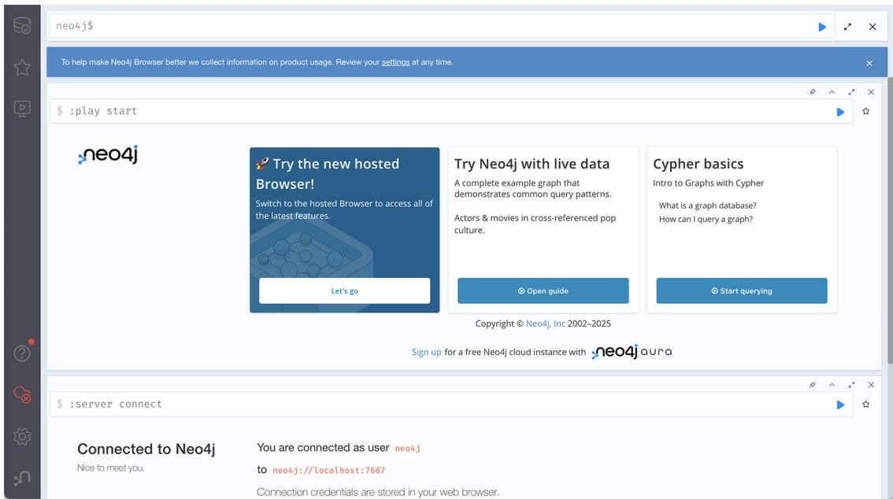  
그림 B.2 Neo4j 브라우저 이미지

간단한 웹 기반 애플리케이션인 Neo4j 브라우저를 사용하면 사용자가 Neo4j 인스턴스와 상호작용하고, 쿼리를 제출하며, 기본 구성을 수행할 수 있습니다. 이 시점에서 사용할 준비가 완료된 것입니다.

### B.2.2 Neo4j Desktop 설치


Desktop을 다운로드하면 설치 절차는 설치 가이드에서 확인할 수 있습니다. 필요하다면 사용 중인 특정 머신의 운영체제에 해당하는 가이드를 참조하십시오. Desktop을 빠르게 실행하기 위한 macOS용 지침은 다음과 같습니다.

1 다운로드 폴더에서 .dmg 파일을 찾아 더블 클릭합니다. 그러면 Neo4j Desktop 설치 프로그램이 시작됩니다.

2 Neo4j Desktop 아이콘을 폴더로 끌어다 놓아 애플리케이션을 Applications 폴더(전역 폴더 또는 사용자별 폴더)에 저장합니다(그림 B.3).

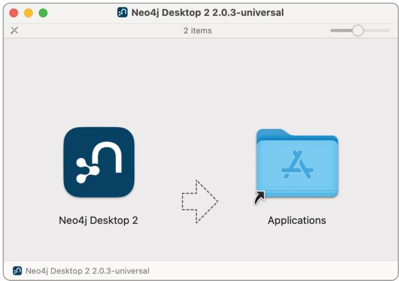  
그림 B.3 macOS에서 Neo4j Desktop 앱 저장하기

3 Applications 폴더에서 Neo4j 아이콘을 찾아 더블 클릭하여 Desktop을 실행합니다(그림 B.4).

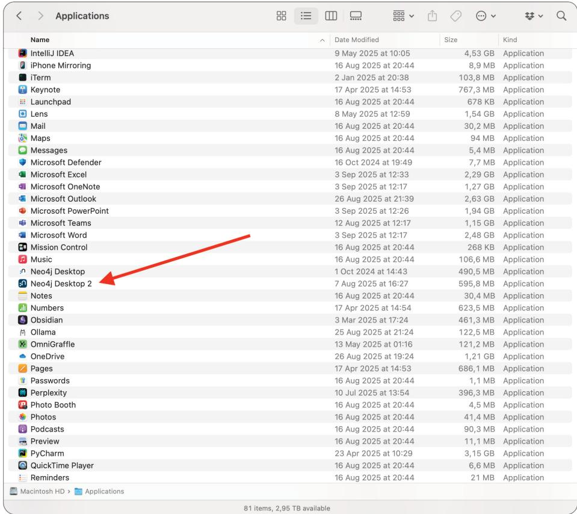  
그림 B.4 Neo4j Desktop 실행하기

4 Desktop을 활성화한 후 Create instance를 클릭하여 첫 번째 인스턴스를 생성합니다(그림 B.5).

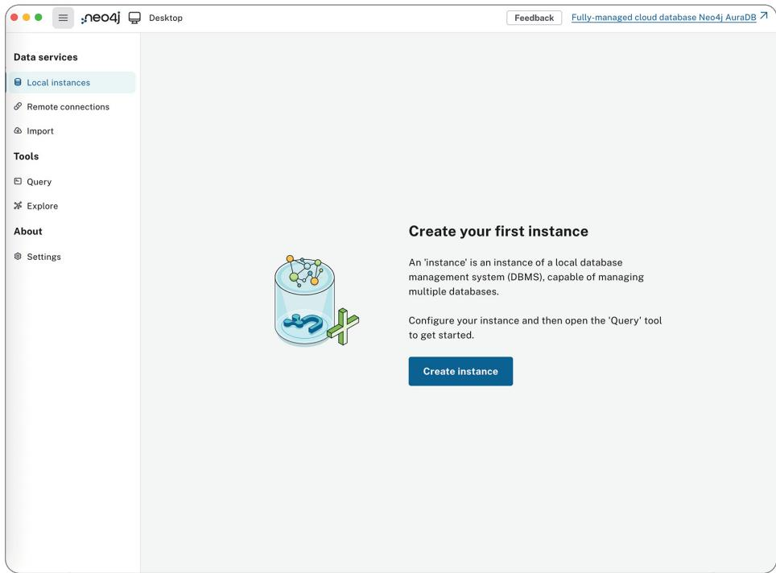  
그림 B.5 Neo4j Desktop에서 첫 번째 로컬 인스턴스 생성하기

5 Instance name, Neo4j version, 그리고 neo4j 사용자에 대한 Password를 지정합니다(그림 B.6).

그림 B.6 새 로컬 그래프를 추가하고 선택하거나 기존 그래프에 연결하기  
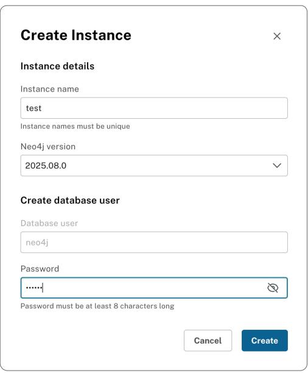

6 이 시점에서 인스턴스 안에 데이터베이스를 생성할 수 있습니다. neo4j라는 기본 데이터베이스가 시스템 데이터베이스와 함께 생성됩니다(그림 B.7).

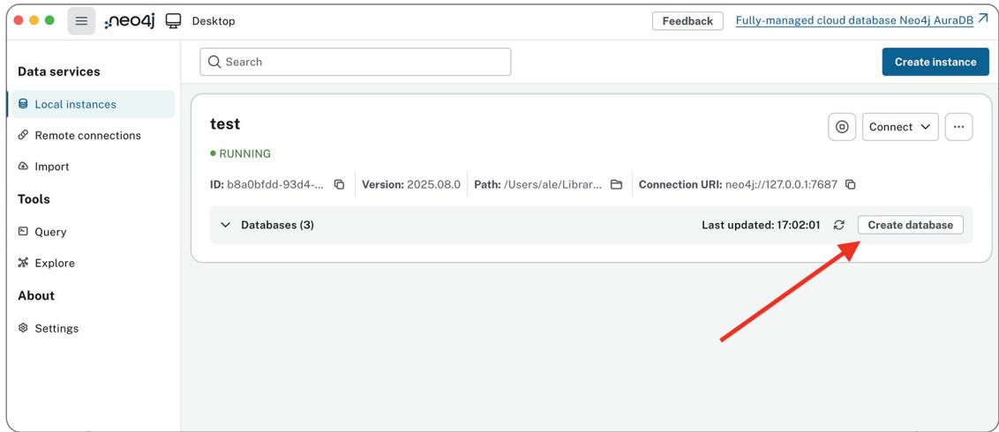  
그림 B.7 로컬 인스턴스에 데이터베이스 생성하기

7 인스턴스 이름 근처에 있는 버튼을 사용하여 인스턴스를 시작하고 중지할 수 있습니다(그림 B.8).

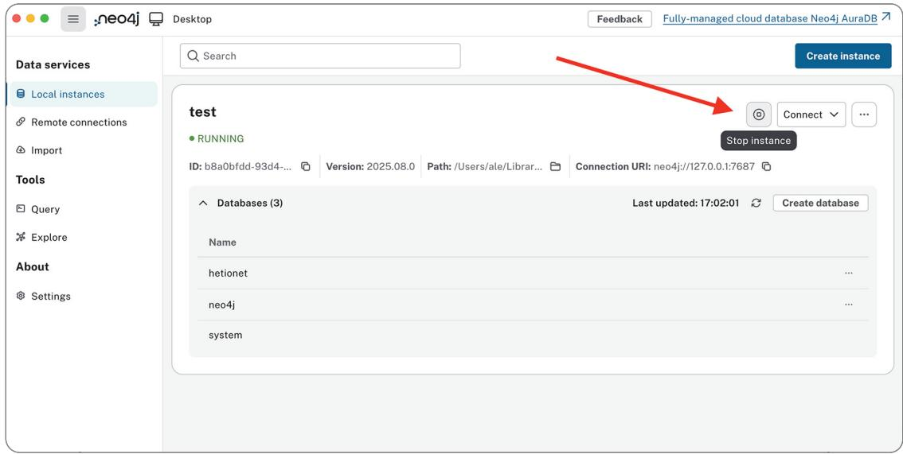  
그림 B.8 새 데이터베이스 인스턴스 시작하기

8 Connect 버튼을 클릭하여 Neo4j 브라우저(Query) 또는 탐색 인터페이스(Explore)를 통해 인스턴스를 사용합니다(그림 B.9).

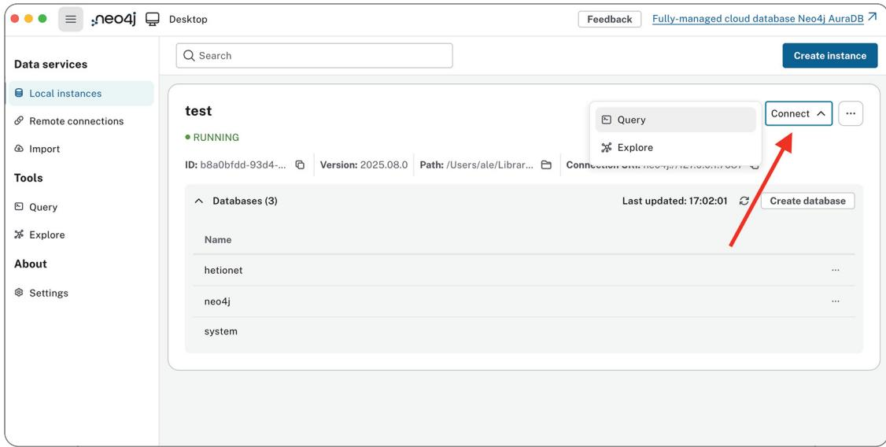  
그림 B.9 Neo4j 브라우저 열기

결과는 그림 B.2에 이르는 단계에서와 동일합니다. Neo4j와 상호작용할 수 있는 브라우저에 접근할 수 있습니다.

이 모든 과정을 피하고 싶다면 Neo4j에는 Aura(https://neo4j.com/product/auradb/)라는 클라우드 버전도 있습니다. 이 글을 쓰는 시점에는 책의 예제와 연습문제에 본격적으로 들어가기 전에 조금 사용해 보고 싶을 경우 이용할 수 있는 무료 티어 버전이 제공됩니다. 연습문제의 경우 학습 곡선 측면에서 Neo4j를 사용 중인 머신에 로컬로 설치하거나 Python 코드를 실행할 수 있는 곳에 설치하는 편이 더 좋다는 점을 염두에 두십시오.

### B.3 Cypher


Neo4j는 질의 언어로 Cypher (https://neo4j.com/developer/cypher/)를 사용합니다. Cypher는 SQL에서 영감을 받았으며, SQL과 마찬가지로 사용자가 그래프 데이터베이스에 데이터를 저장하고 검색할 수 있게 합니다. Neo4j는 Cypher를 통해 배우고, 이해하고, 사용하기 쉬우면서도 다른 표준 데이터 접근 언어의 강력함과 기능을 통합한 언어를 제공합니다.

Cypher는 ASCII Art 문법을 사용하여 그래프의 시각적 패턴을 기술하는 선언형 언어입니다. 이 문법을 사용하면 그래프 패턴을 시각적이고 논리적으로 기술할 수 있습니다. 다음은 그래프에서 Person 유형의 모든 노드를 찾는 간단한 예입니다.

목록 B.1 가장 단순한 질의

MATCH (p:Person)   
RETURN p

우리는 이 패턴을 사용하여 그래프에서 노드와 관계를 검색하거나 생성할 수 있습니다. 그래프 데이터에서 무엇을 선택, 삽입, 갱신 또는 삭제할지를 명시할 수 있으며, 이를 정확히 어떻게 수행할지는 기술하지 않아도 됩니다.

Cypher는 오픈 소스입니다. openCypher (www.opencypher.org) 프로젝트는 Cypher를 위한 공개 언어 명세, 기술 호환성 키트, 그리고 파서, 플래너, 런타임의 참조 구현을 제공합니다. 이 프로젝트는 데이터베이스 업계의 여러 기업이 지원하며, 데이터베이스와 클라이언트 구현자들이 openCypher 언어의 개발로부터 자유롭게 혜택을 얻고, 사용하며, 기여할 수 있게 합니다.

책 전반에 걸쳐 우리는 이 언어를 배우는 데 도움이 되는 예제와 연습문제를 제공합니다. Cypher에 대해 더 읽어 보고 싶다면, 예제가 매우 풍부한 Neo4j의 가이드 (https://neo4j.com/developer/cypher/)를 좋은 참고 자료로 추천합니다.

### B.4 플러그인 설치


Neo4j의 놀라운 점은 얼마나 쉽게 확장할 수 있는가입니다. 개발자는 여러 방식으로 이를 사용자화할 수 있으며, 그래프를 쿼리할 때 호출할 수 있는 새로운 프로시저와 함수로 Cypher 언어를 풍부하게 만들 수 있습니다. 인증 및 권한 부여 플러그인으로 보안을 사용자화할 수 있습니다. 또한 서버 확장을 통해 HTTP API에 새로운 접점이 생성되도록 활성화할 수 있습니다.

다운로드하고, 구성하고, 사용할 수 있는 기존 플러그인이 많이 있습니다. 가장 관련성이 높은 것들은 Neo4j가 개발하고 전체 커뮤니티가 지원하는데, 이는 오픈 소스이기 때문입니다. 이 책의 목적과 제시된 예제를 위해 우리는 그중 두 가지를 사용합니다.

Awesome Procedures on Cypher 라이브러리(APOC)—공통 프로시저와 함수를 포함하는 표준 유틸리티 라이브러리입니다. Neo4j에서 가장 널리 사용되는 확장 라이브러리입니다. 유틸리티, 변환, 그래프 업데이트 등을 위한 기능을 제공합니다.

이 라이브러리는 지원이 잘 이루어지며, 별도의 함수로 실행하거나 Cypher 쿼리에 포함하기가 매우 쉽습니다. 이를 통해 여러 플랫폼과 산업의 개발자는 공통 프로시저를 위한 표준 라이브러리를 사용하고, 비즈니스 로직과 특정 요구 사항에 대해서만 자체 기능을 작성할 수 있습니다.

Graph Data Science 라이브러리(GDS)—시스템 동역학과 집단 행동에 관한 복잡한 질문을 다룰 수 있게 해 주는 Neo4j의 분석 엔진입니다. 이 프로시저 라이브러리는 기존 데이터에 있는 관계와 네트워크 구조의 예측력을 활용하여 이전에는 다루기 어려웠던 질문에 답하고, 예측 정확도를 높입니다. 데이터 과학자는 전역 계산을 위한 사용자화되고 유연한 데이터 구조와, 수백억 개의 노드에 걸쳐 결과를 빠르게 계산할 수 있는 강력하고 견고한 알고리즘 저장소의 이점을 얻습니다.

다음 하위 절에서는 이러한 라이브러리를 다운로드, 설치, 구성하는 방법을 설명합니다. Cypher 쿼리를 사용하기 시작하는 3장을 읽기 전에 이 절들의 지침을 따를 것을 권장합니다.

### B.4.1 APOC Core 설치

Neo4j에서 플러그인을 설치하는 것은 간단합니다. APOC 라이브러리(https://github.com/neo4j/apoc/releases)부터 시작하겠습니다.

서버 버전을 설치했다면 관련 GitHub 릴리스 페이지에서 플러그인을 다운로드합니다(사용 중인 Neo4j 버전과 일치하는 버전, 예를 들어 2025.07.x, 2025.08.x 등을 선택합니다). 이를 NEO4J\_HOME 폴더의 plugins 디렉터리에 복사합니다. 이제 구성 파일 conf/neo4j.conf를 편집하여 해당 파일에 다음 줄을 조정하거나 추가합니다.

dbms.security.procedures.unrestricted=apoc.\* dbms.security.procedures.allowlist=apoc.\*

Neo4j를 다시 시작하고 브라우저를 엽니다. 모든 것이 제대로 준비되었는지 확인하기 위해 다음 프로시저를 실행합니다.

### 목록 B.2 APOC가 올바르게 설치되었는지 확인하기

```sql
CALL dbms.procedures() YIELD name
WHERE name STARTS WITH "apoc"
RETURN name
```

APOC 프로시저 목록이 표시되어야 합니다.

데스크톱 버전을 사용하는 경우 이 과정은 훨씬 더 간단합니다. 데이터베이스를 생성한 후(섹션 B.2.2의 6단계까지 참조), 인스턴스를 열고 오른쪽 상단의 점 세 개를 클릭한 다음 Plugins를 선택합니다(그림 B.10). 설치하려는 플러그인을 선택한 다음 인스턴스를 다시 시작합니다.

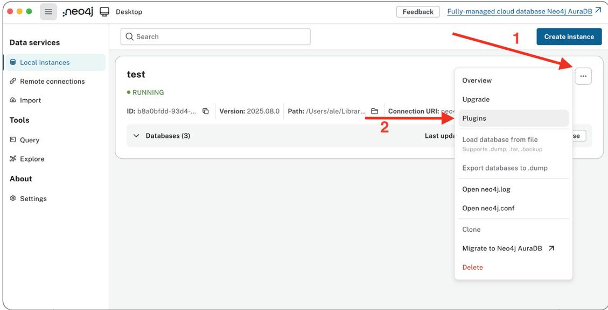  
그림 B.10 Neo4j Desktop에서 APOC 설치

자세한 내용과 설명은 공식 APOC 설치 가이드를 참조하십시오. 해당 문서는 https://neo4j.com/labs/apoc/ 에서 확인할 수 있습니다.

### B.4.2 GDS 설치


GDS 라이브러리도 유사한 절차에 따라 설치할 수 있습니다. Neo4j 서버 버전을 설치한 경우 관련 GitHub 릴리스 페이지(https://github.com/neo4j/graph-data-science/releases)에서 플러그인을 다운로드하십시오. \*-standalone.jar 파일을 NEO4J\_HOME 폴더의 plugins 디렉터리에 복사하십시오. 이제 설정 파일 conf/neo4j.conf를 편집하여 다음 줄을 조정하거나 추가하십시오.

dbms.security.procedures.unrestricted=apoc.\*,gds.\* dbms.security.procedures.allowlist=apoc.\*,gds.\*

Neo4j를 재시작하고 브라우저를 여십시오. 모든 것이 제대로 준비되었는지 확인하려면 다음 프로시저를 실행하십시오.

### 목록 B.3 GDS가 올바르게 설치되었는지 확인하기


RETURN gds.version()

다운로드한 GDS의 버전이 표시되어야 합니다.

Neo4j Desktop을 사용하는 경우, 데이터베이스를 생성한 후(섹션 B.2.2의 6단계까지 참조) APOC와 동일한 절차를 따르되 Graph Data Science 플러그인을 선택하십시오(그림 B.11).

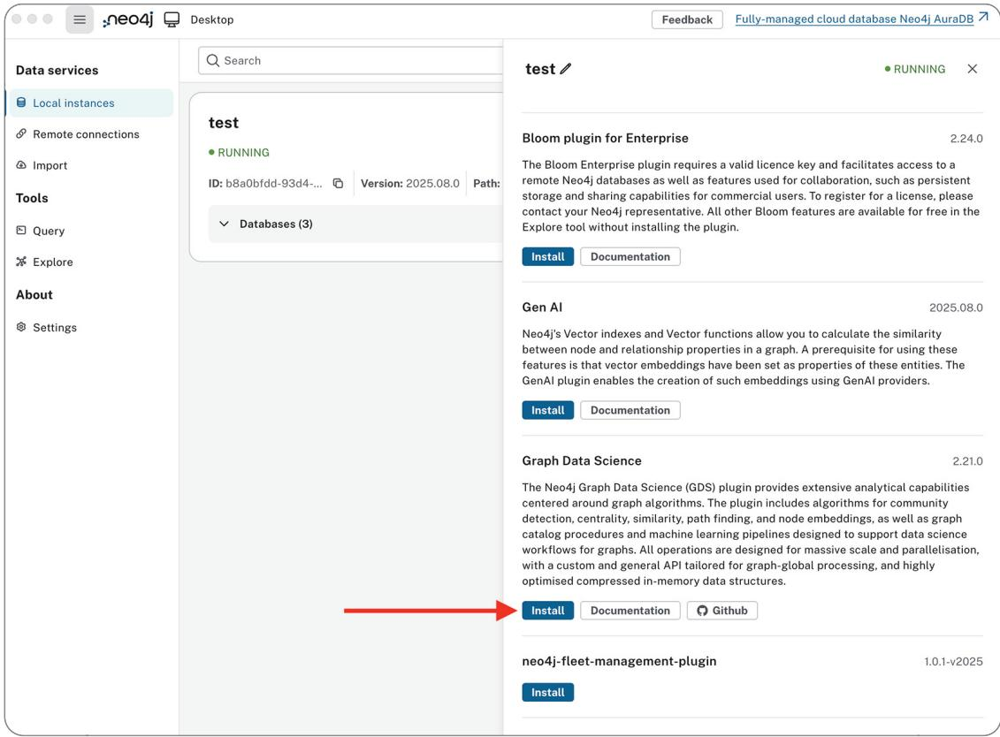  
그림 B.11 Neo4j Desktop에서 GDS 설치

이 단계를 마치면 Neo4j를 즐길 준비가 된 것입니다. 책의 모든 예제와 연습문제를 반드시 실행해 보십시오.

### B.5 정리

때로는 데이터베이스를 정리해야 할 수도 있습니다. 방금 데이터베이스에 설치한 APOC 라이브러리에서 제공하는 함수를 사용하여 이를 수행할 수 있습니다. 다음 두 목록은 코드를 제공합니다.

목록 B.4 모든 항목 삭제

CALL apoc.periodic.iterate('MATCH (n) RETURN n', 'DETACH DELETE n', {batchSize:1000})

목록 B.5 모든 제약 조건 삭제

CALL apoc.schema.assert({}, {})