# appendix C Building knowledge graphs from structured sources

This appendix teaches you how to build your own knowledge graph (KG) from structured data sources. As we do in several places in the book, we focus on a biomedical use case: here, the detection of microRNA disease associations. Figure C.1

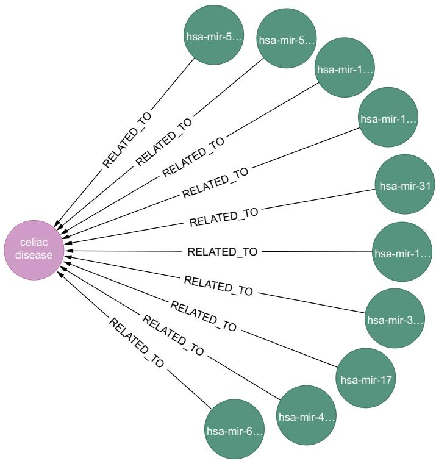  
Figure C.1 An example of the relationship between a disease (celiac disease) and microRNAs

shows the core of the KG we’ll build. For this project, we will use CRISP-DM model introduced in chapter 2 (see figure C.2).

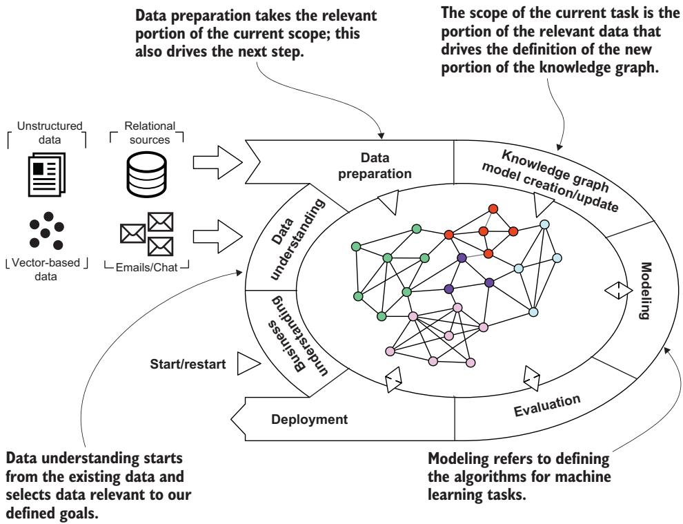  
Figure C.2 CRISP-DM model adapted to KGs

### C.1 MicroRNA–disease association: Warmup

MicroRNA–disease association is a very relevant use case for KGs in the biomedical space. In this section, we provide a brief biological description of what microRNAs are and how they are connected to diseases. We then outline the business goals and the data available to us for achieving those goals.

### C.1.1 Key concepts

MicroRNA (hereafter referred to as miRNA) is a relatively newly discovered type of noncoding RNA (i.e., RNA that is not translated into a protein) [1]. These very small molecules (containing from 19 to 22 nucleotides) interfere with complementary messenger RNAs (mRNAs, which are supposed to be translated into a protein), causing what is called gene silencing: regulation of or interference with gene expression. miRNAs accomplish silencing through a combination of translational repression and mRNA destabilization [2]. Figure C.3 shows how normal encoding works, and figure C.4 illustrates how miRNAs affect it.

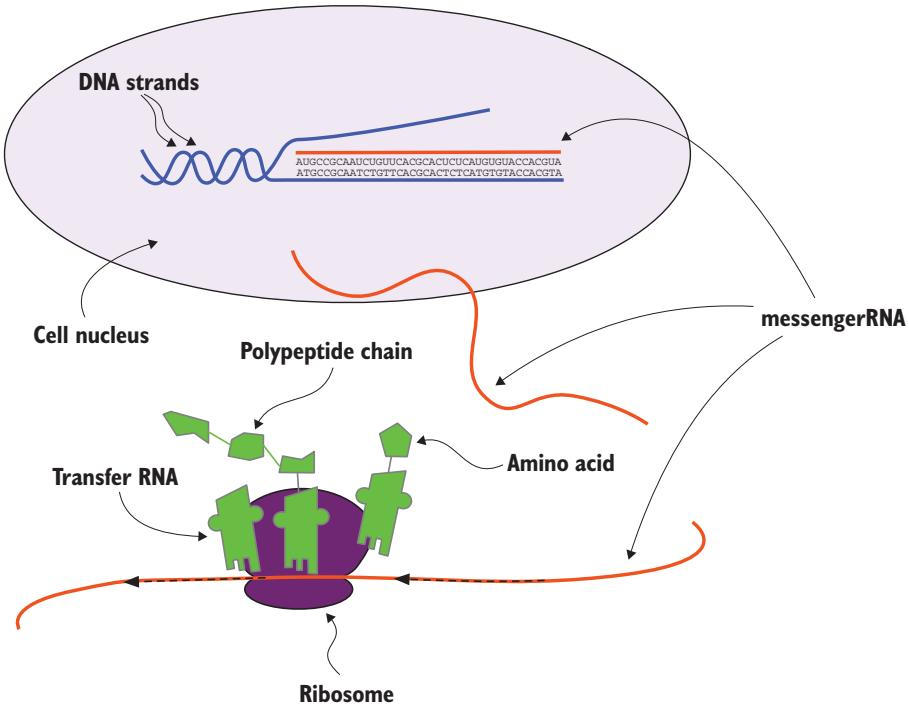  
Figure C.3 Information encoded into DNA is transcribed into mRNAs and then translated into amino acid chains that make up the synthesized protein.

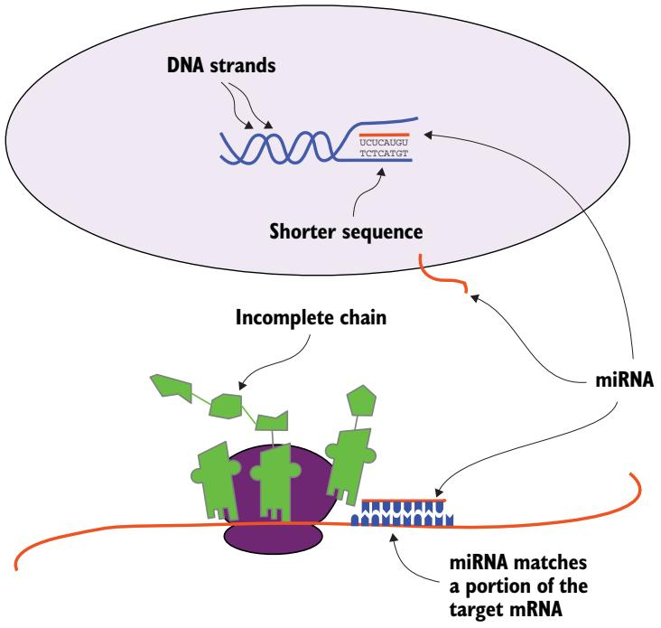  
Figure C.4 miRNA sequences are too small to be translated into proteins but are large enough to target specific mRNAs. When this appends, the mRNA cannot flow through the ribosome, and protein synthesis cannot take place.

Studies have shown that miRNAs are involved in many important biological processes [3, 4], such as cell differentiation [5], proliferation [6], signal transduction [7], viral infection [8], and so on. Emerging evidence also implicates miRNAs in the pathogenesis of complex human diseases, such as cancer and metabolic disorders [9–15]; for example, researchers found that the mir-433 miRNA is involved in gastric carcinoma by regulating the expression of GRB2, which is a known tumor-associated protein [16]. This aspect is where this example will focus.

### C.1.2 Business understanding

Suppose that we want to predict the connection between miRNAs and diseases. The potential number of combinations is huge: thousands of miRNAs have been identified, and their number and impact are likely more significant than previously suspected [17]. In addition, in vitro experiments to validate assumptions are expensive. The ability to predict correlations between miRNAs and diseases could help researchers narrow their investigations to the most likely ones [18], reducing the cost and time required to make such discoveries.

This scenario is related to the development of an intelligent advisor system (discussed throughout the book). The business goal also determines the type of analysis to be performed on the KG and the type of “advice” to be provided to end users. Here, our focus is on the construction phase; but understanding the required analysis helps refine the graph model, so it is an important consideration in the early stages of the process.

NOTE The approaches and techniques we demonstrate can be easily adapted to any scenario. Our goal is to show you how to construct a KG starting from existing structured data sources.

### C.1.3 Data understanding

Although the research on miRNAs is relatively new, the amount of information available in this field of research is vast and easily accessible. A platform called Tools4miRs (https://tools4mirs.org) [19] claims to offer “all the tools you need to analyze your miRNAs.” It provides more than 170 methods and many databases.

We selected data sources relevant to our purposes. Each of the databases used is described and a link is provided, so you can check whether a new version is available. If this field interests you and you would like to extend your KG, we highly recommend using Tools4miRs as your entry point.

### C.2 Building the miRNA knowledge graph

The KG we are going to build must capture the complexity of the connection between miRNAs and pathologies. This should make it possible to design a machine learning (ML) model that uses the abundant data and can learn to predict missing links (i.e., connections yet to be discovered). We don't cover the prediction algorithms here, but it's important to understand the opportunities that this type of KG construction will enable.

We could start by ingesting every available dataset related to miRNAs and diseases, and then let the ML model handle the analysis. This “greedy” approach assumes that having more data means capturing a better understanding of the topic’s complexity, which in turn should give the ML model more chances to discover the underlying rules that govern the relationship between miRNAs and disease.

Although this is true in theory, throwing everything into the KG is not a wise choice in practice:

Every dataset has a signal-to-noise ratio. Even in good datasets, the noise can easily overwhelm the benefits of the signal if the dataset is only slightly related to link prediction.

New datasets need to be reconciled to the existing KG before any graph ML algorithm can take the full advantage of the new information. Sometimes the reconciliation process is not straightforward, and the resulting relationships can be affected by errors, which can again amplify the noise associated with the new dataset.

We would rather begin by selecting datasets related to miRNAs that will serve our task: predicting pathology links. This approach will result in a KG with a relatively low degree of complexity, which is easier to reason about. The link prediction results from this KG can be used as a baseline, so it will be possible to quantify how new data sources can improve the model.

### C.2.1 Importing known miRNA–disease connections

Let's start by identifying datasets that contain known connections between miRNAs and diseases. The data sources we selected for this first ingestion round are the Human miRNA Disease Database (HMDD; http://www.cuilab.cn/hmdd) [20–22], the Database of Differentially Expressed miRNAs in Human Cancers (dbDEMC; https:// www.biosino.org/dbDEMC) [23], and miR2Disease (www.mir2disease.org) [24]. These datasets come from different sources and are the result of various research efforts; therefore, they encode the relations we are looking for in different ways and contain different associated information.

Each dataset will be processed and imported in a slightly different way, and they will be combined into a single graph. Figure C.5 illustrates how the merge will occur in practice with two toy datasets.

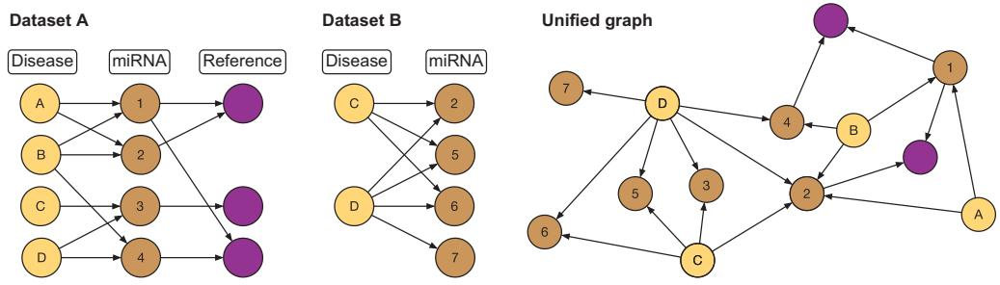  
Figure C.5 Dataset A is more balanced and includes reference publications. Dataset B focuses on fewer diseases but includes a greater number of miRNAs. After ingestion, the information from both sources is unified in a single source of truth.

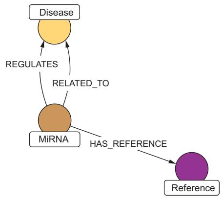  
Figure C.6 First iteration target schema. It contains the type of relationships —REGULATES and RELATED\_TO— that we would like to predict.

Considering the two sources, the information they contain, and our goal, the schema shown in figure C.6 suits our needs at this point. Here we are using two types of relationships, one for each of the two datasets we will be importing. This choice allows us to preserve the nuances of meaning that the two datasets give to the relationships. Additionally, we can quickly identify which of the two sources a relationship comes from when we look at the result of a query. Later, when we build our model, we can easily merge these two types of relationships if necessary.

We begin by importing the HMDD dataset. It contains experiment-supported evidence for human miRNA–disease associat-

ions. This dataset will provide a solid foundation for our KG, as it is manually curated and captures the exact miRNA-to-disease link we want to predict. The following listing shows the implementation of the HMDD importer class that handles the data ingestion process.

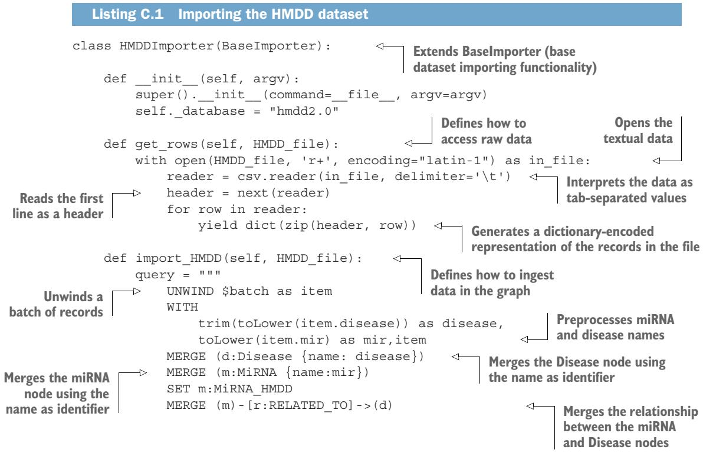

```python
SET r.description = item.description, Merges a Reference node
r.pmid=item.pmid, r.category = item.category using the PubMed ID as
MERGE (ref:Reference {pubmed_id:item.pmid}) identifier and connects
MERGE (m)-[:HAS_REFERENCE]->(ref) < it to the miRNA node
"IIII
Computes size = self.get_csv_size(HMDD_file, encoding="latin-1").
the number self.batch_store(query, self.get_rows(HMDD_file),
of records size=size, strategy="aggregate") 4 Aggregates and
available stores the records
def set_constraints(self):
with self._driver.session(database=self._database) as session:
Enforces > query = """
uniqueness for CREATE CONSTRAINT ON (a:Disease) ASSERT a.name IS UNIQUE;
Disease, miRNA, CREATE CONSTRAINT ON (a:MiRNA) ASSERT a.name IS UNIQUE;
Target, and
Reference nodes CREATE CONSTRAINT ON (a:Reference)
ASSERT a.pubmed_id IS UNIQUE;
CREATE CONSTRAINT ON (a:Target) ASSERT a.name IS UNIQUE"""
for q in query.split(";"): < Executes
try: the query
session.run(q)
except Neo4jClientError as e: Ignores errors
if (e.code !=
"Neo.ClientError.Schema.EquivalentSchemaRuleAlreadyExists"):
raise e
[...]
if name == _main__':
importing = HMDDImporter(argv=sys.argv[1:])
importing.set_constraints()
importing.import_HMDD(HMDD_file)
importing.close()
```

The next listing contains an example of a generated dictionary for an HMDD record.

{'category': 'genetics\_GWAS',   
'mir': 'hsa-mir-502',   
'disease': 'Carcinoma, Renal Cell, Clear-Cell',   
'pmid': 27346408,   
'description': "Polymorphism at the miR-502 binding site in the 3'[...] "}

This record indicates that the miRNA hsa-mir-502 is associated with kidney cancer, specifically clear cell renal cell carcinoma, and that this connection is supported by experiments described in the scientific publication identified by PubMed ID 27346408. We capture this information by

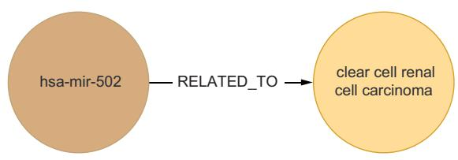  
Figure C.7 Record as a graph portion stored in the database

creating the relevant miRNA and disease nodes and connecting them through the RELATED\_TO relationshipas shown in figure C.7.

After this import, we collected 1,207 distinct miRNAs, 18,732 distinct connections between these miRNAs, and 849 distinct diseases. This represents a solid foundation for our link prediction task.

The second dataset we import is the dbDEMC. It is an integrated database containing differentially expressed miRNAs focused on human cancer. It contains a collection of 403 miRNA expression datasets obtained by microarray platforms and miRNA sequencing. The following listing shows the implementation of the dbDEMC importer that processes this data.

### Listing C.3 Importing the dbDEMC dataset

```python
class DBDEMCImporter(BaseImporter):
[...]
@staticmethod Defines how to
def get_rows(miRNA_file): < access the raw data
with open(miRNA_file, 'r+') as in_file:
reader = csv.reader(in_file, delimiter='\t')
header = next(reader)
for row in reader: Filters out any incomplete or
if len(row) < 2: < mistakenly parsed records
continue
record = dict(zip(header, row))
Keeps only
if record["Species"] != "Homo sapiens": ≤ human data
continue
if len(record["CancerSubtype"]) > 1: <
Selects the most
disease = record["CancerSubtype"].lower() specific description
else: available for the
disease = record["CancerType"].lower() current record
disease = (disease.replace(",", "")
.replace("/", " ")
.replace("-", " "))
Selects the
name = record["miRNA_ID"].lower().strip(). miRNA name
yield { < Generates a dictionary-encoded
"name": name, representation of the record
"disease": disease,
"experiment": record["ExperimentID"],
"regulated": record["Status"]
}
Defines how to ingest
def import_dbDEMC(self, miRDB_file): < data in the graph
exact_match_query = """
UNWIND $batch as item < Unwinds a batch of records
Merges the Disease MERGE (m:MiRNA {name: item.name}) < Merges the miRNA node using
node using the disease WITH m,item
name as identifier MERGE (n:Disease {name: item.disease})
```

SET n:DiseaseDbDEMC, n.name\_in\_db\_demc = item.disease   
Merges the > MERGE (m)-[r:REGULATES {regulated: item.regulated}]->(n)   
relationship SET r.source = 'dbDEMC', r.experiment = item.experiment   
between the II IIII Computes the number   
miRNA and the size = self.get\_csv\_size(miRDB\_file) self.batch\_store(exact\_match\_query, of records to ingest Aggregatesand stores   
self.get\_rows(miRDB\_file), size=size) < the records

The next listing contains an example of a record generated for this dataset.

Listing C.4 dbDEMC record sample   
{'name': 'hsa-miR-155',   
'disease': 'glioblastoma',   
'experiment': 'EXP00065',   
'regulated': 'UP'}

This record indicates that experiment EXP00065 shows elevated hsa-miR-155 miRNA levels in glioblastoma tumors compared with healthy adult brain tissue (this miRNA is upregulated in these tumor cells).

By using the MERGE clause—which doesn’t create new nodes if they already exist— we improve the richness of our knowledge base. We know from the HMDD dataset that hsa-mir-155 is significantly overexpressed in active multiple sclerosis lesions compared to controls. The same dataset also indicates that increased hsa-miR-155 levels are observed in ischemic cardiomyopathies (a disease affecting the heart muscle). At the end of the second ingestion (from dbDEMC), figure C.8 shows that the same node representing this specific miRNA is connected to both tumor and nontumor brain diseases (glioblastomas and multiple sclerosis, respectively), and it is also connected to brain and heart diseases (glioblastomas and ischemic cardiomyopathies, respectively).

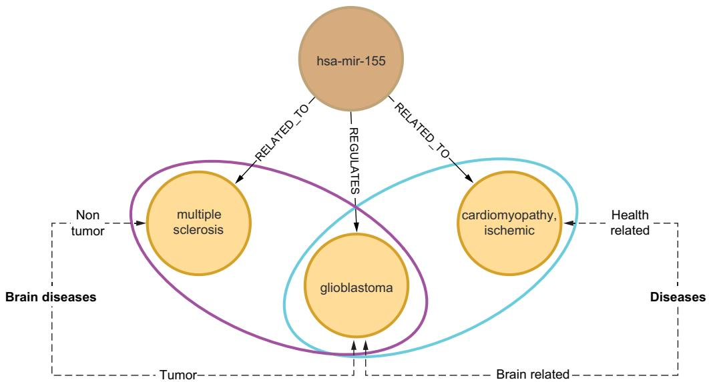  
Figure C.8 Merging datasets allows information fusion. We are using two types of relationships for the two databases: RELATED\_TO for the HMDD dataset and REGULATES for dbDEMC.

Now, suppose that all three pathologies are somehow connected to excessive inflammation promoted by elevated levels of hsa-miR-155. Suppose also that another new pathology is correlated with the same inflammation process. In this case, the link prediction model has all the necessary information to infer a not (yet) documented relationship between the hsa-miR-155 miRNA and this new pathology.

We can enrich our KG further with a third dataset: the miR2Disease database. miR2Disease is a manually curated database that provides information about miRNA deregulation in various human diseases. It also provides a submission page that allows researchers to submit new miRNA–disease relationships, so we can expect it to grow over time. The following listing implements the miR2Disease importer that integrates this resource into our KG.

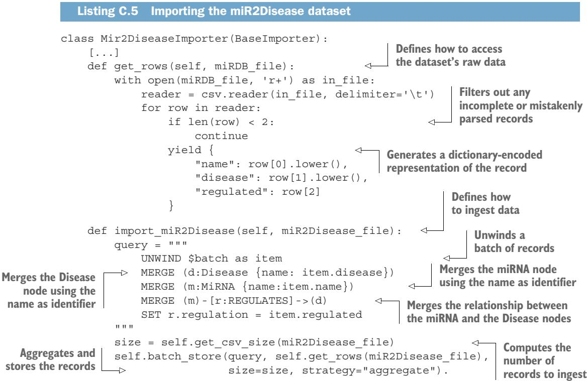

Once these three datasets are imported, our KG comprises 4,874 distinct miRNAs, 118,806 distinct connections between these miRNAs, and 1,144 distinct diseases.

We can see how the unique miRNAs are distributed among the three datasets. The next listing shows the Cypher query that computes this distribution, allowing us to analyze the overlap and unique contributions of each data source.

### Listing C.6 Computing the ingested miRNA distribution

All miRNA nodes have labels to   
MATCH (n:MiRNA) < track the dataset(s) of origin.   
WITH   
DISTINCT LABELS(n) AS labels, < Groups miRNA nodes depending on   
COUNT(\*) as count which dataset(s) they come from   
RETURN   
[l in labels where "MiRNA"<> l ] AS labels, ≤ Removes “MiRNA” from the   
Count labels list because it provides no   
ORDER by count DESC information about distribution

The result of the query looks like this:

```ini
[MiRNA_dbDEMC] 2550
[MiRNA_HMDD, MiRNA_dbDEMC] 583
[MiRNA_HMDD, MiRNA_dbDEMC, MiRNA_miR2Disease] 328
[MiRNA_HMDD] 280
[MiRNA_dbDEMC, MiRNA_miR2Disease] 84
[MiRNA_miR2Disease] 32
[MiRNA_HMDD, MiRNA_miR2Disease] 15
```

Figure C.9 shows these results as a Venn diagram. There is a fairly balanced distribution between shared and nonshared miRNAs. This is relevant because for shared miRNAs, our KG and subsequent ML tasks will benefit from knowledge derived from multiple datasets. Nonshared miRNAs represent the unique contribution of each dataset we have ingested.

Unique miRNA distribution  
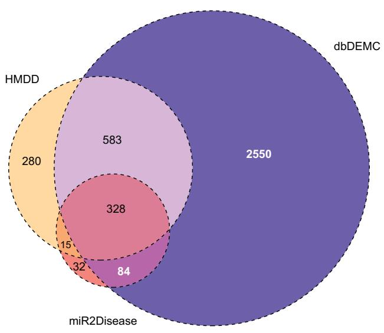  
Figure C.9 Venn diagram illustrating the unique distribution of miRNAs. It shows the overlapping miRNAs among the datasets.

### C.2.2 Importing the disease ontology

Looking closely at the imported data, we notice that data sources use different terms to refer to the same disease. This is a common problem, as different datasets, even those related to the same topic, often use different standards in defining objects. This is par ticularly frequent in the case of biological and medical datasets. A detrimental effect of this misalignment is that, for example, two miRNAs may be connected to two apparently different diseases, when in fact they refer to the same disease with different names.

Figure C.10 shows an example of this problem. In this case, each dataset referred to Burkitt lymphoma with different wording, relying on different disease naming conventions and thus resulting in three different disease nodes.

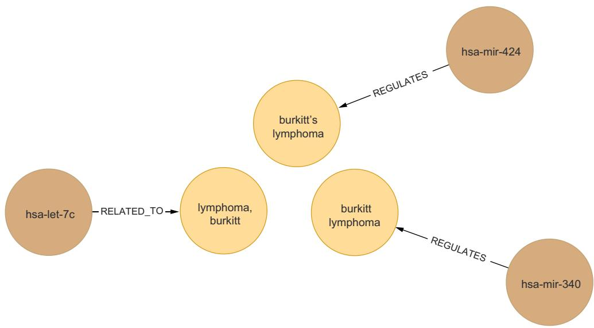  
Figure C.10 These miRNAs appear to refer to different diseases.

As a consequence, the KG cannot be considered correct. As you know, the KG is a representation of real-world entities. If different entities represent the same concept, the graph ceases to be a reliable source of truth. Furthermore, when we perform our link prediction task, the model may be misled into believing that the cited miRNAs are disconnected, preventing it from learning properly. In general, when this type of misalignment happens, every representation we build on top of it will be proportionally deteriorated.

### DISEASE NORMALIZATION WITH UMLS AND SCISPACY

Luckily, many ontologies are available that we can use to “normalize” the nomenclature of diseases from different datasets. Here we will use the Unified Medical Language System (UMLS; https://www.nlm.nih.gov/research/umls) [25] ontology. The

UMLS integrates and distributes key terminology, classification, and coding standards, along with associated resources, to promote the creation of more effective and interoperable biomedical information systems and services, including electronic health records.

We will use scispaCy (https://allenai .github.io/scispacy), a Python package containing spaCy models for processing biomedical, scientific, or clinical text. scispaCy can perform automatic named entity recognition of UMLS entities, returning the canonical name, concept ID, and type ID for every identified entity in the disease name property. We can use it to automatically infer the canonical name for every disease node we ingested, generating new Normalized-Disease nodes that we will connect to equivalent Disease nodes (see figure C.11). We decided to add a new node to our schema rather than merging the three nodes into a single node because we want to retain the original structure. This is useful for two rea-

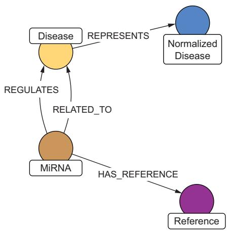  
Figure C.11 Updating the target schema containing the NormalizedDisease node

sons: first, it will be easier to review the results and correct any errors; and second, resetting everything and rerunning, if necessary, will be much more straightforward.

The following listing implements the disease normalization process, using natural language processing (NLP) techniques to standardize disease entities across our different data sources.

```python
Listing C.7 Normalizing diseases
class Reconciliator(BaseImporter): < Reuses functionality
def _init__(self, argv): from BaseImporter
super().__init__(command=__file__, argv=argv)
self._database = "hmdd2.0"
self.resolver = DiseaseResolver()
Defines how to access
def get_normalized_diseases(self): < the dataset's raw data
with self._driver.session(database=self._database) as session:
diseases_data = session.run("""
Fetches diseases to be MATCH (d:Disease)
normalized from Neo4j RETURN id(d) as id, d.name as name""").data()
Extracts the
diseases_text = [d["name"] for d in diseases_data]. < disease name
Converts itemslike “leukemia, disease_ids = [d["id"] for d in diseases_data] < Extract the
lymphocytic, chronic, Disease node ID
b-cell” into “b-cell diseases_text = [
chronic lymphocytic " ".join(i for i in reversed(d.split(","))).strip()
leukemia” for d in diseases_text]
```

```python
diseases_items = [self.resolver.nlp(disease)
for disease in diseases_text]
Runs the NLP pipeline for
every disease name text
disease_normalized = [ and returns an object
self.resolver.normalize(item) containing the detected
for item in diseases_items] < medical entities
Normalizes the disease
diseases = [{ using information from
"source_id": disease_id, the scispaCy pipeline
"name": disease_name,
"umnls_id": disease_UMNLS_ID} Converts normalized
for disease_id, (disease_name, disease_UMNLS_ID) diseases into a
in zip(disease_ids, disease_normalized)] < dictionary
return diseases
Defines how
def import_normalized_diseases(self): < to ingest data
query = """
Unwinds a UNWIND $batch as item Creates a node
batch of records MATCH (d:Disease) Selects the originalDisease node representing the normalized disease
<
MERGE (nd:NormalizedDisease {name:item.name}) < if it does not exist
SET nd.umnls_id = item.umnls_id
Links the original disease
MERGE (d)-[:REPRESENTS]->(nd) <
with its normalized version
"""
diseases = self.get_normalized_diseases()
Aggregates and self.batch_store(query, iter(diseases),
stores records size=len(diseases), strategy="aggregate") #O
```

The next listing shows the resolution logic, which is encapsulated in DiseaseResolver.

### Listing C.8 DiseaseResolver class

Defines a set of entity types that must be   
matched in full to be considered a disease   
class DiseaseResolver:   
full = ["Finding", "Organ or Tissue Function", "Tissue"] <   
banned = ["Human", "Body Part, Organ, or Organ Component",   
"Qualitative Concept", "Temporal Concept",   
"Functional Concept", "Body Space or Junction",   
"Spatial Concept"] < Defines a set of entity types that   
can’t be considered valid diseases   
def init\_\_(self):   
self.nlp = nlp = spacy.load("en\_core\_sci\_sm") Creates a scispaCy   
config = { NLP model   
"resolve\_abbreviations": True,   
"linker\_name": "umls"}   
Fetches nlp.add\_pipe("scispacy\_linker", config=config) < Sets up the linker, which   
the linker linker = nlp.get\_pipe("scispacy\_linker") detects UMLS entities   
self.type\_tree = linker.kb.semantic\_type\_tree. <   
self.cui\_to\_entity = linker.kb.cui\_to\_entity   
Fetches the mapper from the UMLS Fetches the semantic tree of types from   
entity to the Concept ID used as an UMLS to label entities (e.g., "multiple   
index by the UMLS ontology sclerosis" is labeled “Disease or Syndrome”)

```python
def canonical(self, entity): ≤ Gets the assigned
"""get canonical name from entity""" canonical name
entities = entity._.kb_ents for an entity
if len(entities) == 0:
return
### select the first entity
return self.cui_to_entity[entities[0][0]].canonical_name
def types(self, entity): < Gets the types associated
"""return semantic types for the entity""" with an entity
entities = entity._.kb_ents
if len(entities) == 0:
return []
return [self.type_tree.get_canonical_name(t)
for t in self.cui_to_entity[entities[0][0]].types]
@staticmethod Checks whether the entity
def matchesAll(entity): < spans the entire text
"""return true if the entity covers the whole content"""
return entity.start == 0 and entity.end == len(entity.doc)
def containsOnly(self, entity, targets): < Checks whether an entity contains
"""return true if the entity types are only a specific set of type labels
within the target types"""
intersection = set(self.types(entity)).intersection(targets)
return (intersection == set(self.types(entity)))
Checks whether an entity
def validEntity(self, entity): < can be considered a disease
""" exploits the entity types to detect if an entity is
correctly identified as disease """
If the type V if self.containsOnly(entity, self.banned):
If the type labels are among those
labels are return False
defined earlier which can represent
among those if self.containsOnly(entity, self.full): a disease only if the entity spans
defined earlier return self.matchesAll(entity) < the entire text, and that is not the
that never return True < The type labels case, the model failed to recognize
apply to represent valid diseases. the disease as a whole.
disease, the def normalize(self, item):
model failed """"main entrypoint: convert item into a normalized disease
to recognize return ( normalized_name, UMNLS_ID None )
the disease. II IIII If only a single entity is found,
if len(item.ents) == 1: we use the normalization logi
If no entities return self.normalize_entity(item) < defined in normalize_entity.
are found, we if len(item.ents) > 1:
use the default return self.normalize_default(item) ≤ If more than one entity is found
normalization. > return self.normalize_default(item)
for the current disease, we use
the default normalization.
def normalize_entity(self, item):
""" normalize item when there is only one detected entity """
Defines the logic entity = item.ents[0]
to normalize a disease if only if self.validEntity(entity): return self.canonical(entity), entity._.kb_ents[0][0] <
one entity is found return self.normalize_default(item) If the detected entity
is a valid disease, we return the tuple
If the detected entity is not a valid disease,
(<canonical name>, <UMLS Concept Id>)
we use the default normalization.
extracted from the entity metadata.
```

```python
def normalize_default(self, item): < Defines the default logic
"""When no other better options are available to normalize a disease
return capitalized version of disease"""
item = str(item)
item = " ".join(i.capitalize() for i in item.split())
return item.strip(), None < Returns a capitalized version of
the disease text and None as ID
```

After this normalization step, the three different Burkitt lymphoma nodes with their varying spellings are connected by a single normalized Burkitt Lymphoma node (see figure C.12). We have effectively reduced graph fragmentation by adding an extra node that connects previously disconnected components. We can evaluate the graph con nectivity—with and without the normalization nodes—using the weakly connected component (WCC) algorithm that we use elsewhere in the book. With WCC, we can detect sets of connected nodes that form a single connected component: in other words, we can identify the number of disconnected subgraphs in our graph, labeling each node according to the disconnected subgraph to which it belongs.

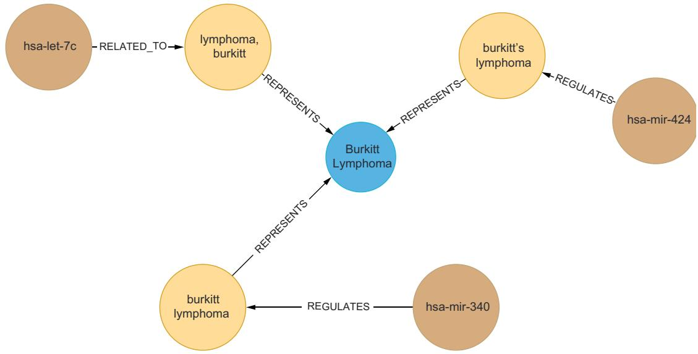  
Figure C.12 miRNAs are now connected to the NormalizedDisease node Burkitt Lymphoma.

### EVALUATING THE EFFECT OF NORMALIZATION

Through our normalization, we may have connected previously disconnected graphs. We can measure this by running WCC before and after the normalization process and comparing the results.

Before running WCC, as with any other GDS algorithm, we must create a named in-memory representation of the graph we are going to analyze. In this case, we will create two representations: one with the NormalizedDisease nodes and their relative relationships, and one without. The following listing shows the Cypher queries that project these two graph representations into memory, setting up our environment for comparative analysis.

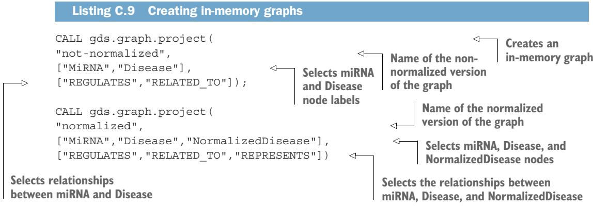

We can now run the WCC algorithm once over both in-memory representations and compare the results. The next listing executes the WCC algorithm on the non-normalized graph.

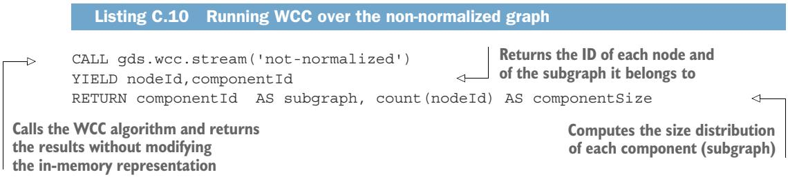  
Table C.1 shows the distribution of components before normalization, revealing the baseline connectivity patterns that we’ll compare against after our disease entity standardization. After examining the connectivity of the non-normalized graph, we can perform the same analysis on our normalized representation to assess the impact of disease standardization (see listing C.11).

Table C.1 WCC components distribution before normalization
<table><tr><td>subgraph</td><td>componentSize</td></tr><tr><td>0</td><td>5010</td></tr><tr><td>1166</td><td>3</td></tr><tr><td>1838</td><td>2</td></tr></table>

Listing C.11 Running WCC over the normalized graph   
CALL gds.wcc.stream('normalized') Returns the ID of each node and   
YIELD nodeId,componentId < of the subgraph it belongs to   
RETURN componentId AS Subgraph, count(nodeId) AS ComponentSize <   
Calls the WCC algorithm and returns Computes the size distribution   
the results without modifying the of each component (subgraph)   
in-memory representation

Table C.2 shows the components distribution after normalization, enabling a direct comparison with the prenormalization state to quantify the improvements in graph cohesion. In this case, there are no significant changes when comparing the graph structures before and after normalization, because we have only a single, large, connected component containing almost every node.

Table C.2 WCC components distribution after normalization
<table><tr><td>subgraph</td><td>componentSize</td></tr><tr><td>0</td><td>6033</td></tr><tr><td>1166</td><td>4</td></tr><tr><td>1838</td><td>3</td></tr></table>

Although having a well-connected graph with negligible fragmentation is good news for most graph applications, here we have to apply other techniques to quantify the impact of the normalization step. The GDS library contains several community detection algorithms that can statistically evaluate the structural changes from the normalization process. However, these changes are more difficult to interpret when we use other community detection algorithms than when we use WCC.

Let’s consider the subgraph shown in figure C.13. Here hsa-mir-199a\* is connected to hsa-mir-182 through hepatocellular carcinoma (hcc), and at the same time, hsa-mir-182 is connected to hsa-mir-4728 through carcinoma, papillary, thyroid. We can say that the distance between hsa-mir-199a\* and hsa-mir-182 is equal to 1, because the shortest path connecting the two miRNAs contains only one Disease node. The distance between hsa-mir-199a\* and hsa-mir-4728 is equal to 2, because the shortest path passes through two Disease nodes. However, we now know that burkitt’s lymphoma and lymphoma, burkitt are actually the same disease; thus, the distance between hsa-mir-199a\* and hsamir-4728 should be 1.

Figure C.14 illustrates the same chain of miRNAs after disease normalization. The previously disparate disease nodes are now connected through the shared NormalizedDisease node, effectively reducing the path lengths between related miRNAs.

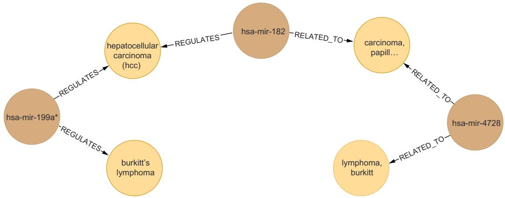  
Figure C.13 Chain of miRNAs connected through Disease nodes

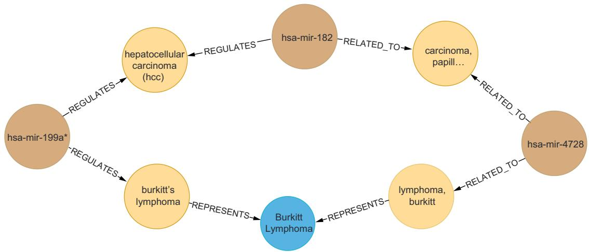  
Figure C.14 The same chain of miRNAs as in figure C.13 after the connection through a NormalizedDisease node

In general, we expect the distances between miRNAs to be shorter after disease normalization. We can measure these distances using the all-pairs shortest path (APSP) algorithm, which at the time of writing is available in the alpha tier in the Path Finding algorithms of the Neo4j GDS library.

We will first create an in-memory graph representation where two miRNA nodes are connected only if there exists at least one Disease node connected to both of them. This projection will represent the state of the graph before the normalization step.

We will also create a second in-memory graph representation where two miRNAs’ nodes are connected if there exists a chain (Disease)-[]-(NormalizedDisease)-[]- (Disease) connecting them. This projection will represent the state of the graph after the normalization step. The following Cypher query creates this in-memory graph connecting miRNAs through their shared Disease nodes.

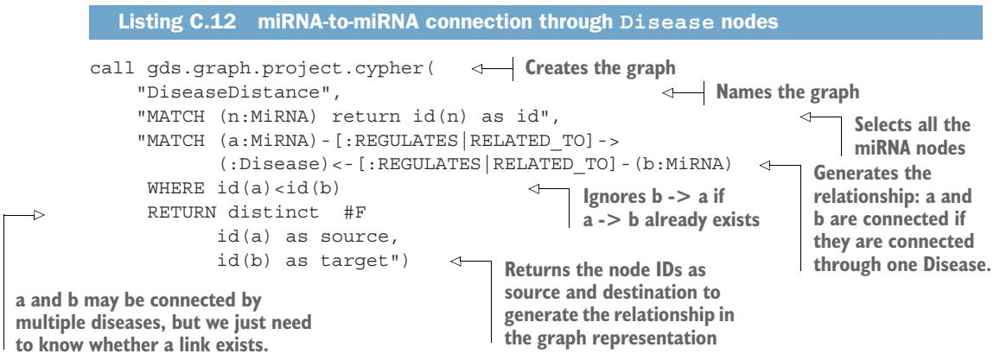

The next listing generates an in-memory graph that uses the NormalizedDisease nodes created to normalize diseases.

Listing C.13 miRNA-to-miRNA connection through NormalizedDisease nodes   
call gds.graph.project.cypher(  Creates the graph   
"NormalizedDiseaseDistance", Names the graph   
Selects all D "MATCH (n:MiRNA) return id(n) as id",   
the miRNA "MATCH p1=(a:MiRNA)-[:REGULATES|RELATED\_TO]->()-[:REPRESENTS]->(d)   
nodes MATCH p2=(d)<-[:REPRESENTS]-()<-[:REGULATES|RELATED\_TO]-(b:MiRNA) <   
WHERE id(a)<id(b) < Ignores b -> a if   
RETURN distinct #F a -> b already exists Generates the   
id(a) as source, relationship:   
id(b) as target") < Returns the node IDs as a and b are connected   
a and b may be connected by multipleNormalizedDiseases, but we just need source and destination to generate the if they are connectedthrough one

These queries may require some time to execute. In general, calls to gds.graph.project are faster than calls to gds.graph.project.cypher, because the former uses information about graph nodes and edges that is already stored in the database. On the other hand, Cypher projections are more flexible and more useful for exploratory and debugging purposes because we can project one graph onto another using computations, similar to what we just did.

Listing C.14 computes the distance before normalization, and listing C.15 computes the distance after normalization. The results of both listings are summarized in table C.3.

Listing C.14 Running APSP on a prenormalization graph   
CALL gds.allShortestPaths.stream('DiseaseDistance',{}) <   
YIELD distance   
Executes the undirected APSP   
RETURN distinct distance, count(distance) AS Count and returns the results   
Returns the distance without modifying the   
in-memory representation   
distribution

Listing C.15 Running APSP on a post-normalization graph   
CALL gds.allShortestPaths.stream('NormalizedDiseaseDistance',{}) <   
YIELD distance   
Executes the undirected APSP   
RETURN distinct distance, count(distance) AS Count #B and returns the results   
Returns the distance without modifying the   
in-memory representation   
distribution

Table C.3 Distance distributions
<table><tr><td rowspan=1 colspan=1>Distance</td><td rowspan=1 colspan=1>Path count before</td><td rowspan=1 colspan=5>Path count after</td><td rowspan=1 colspan=1>Variation</td></tr><tr><td rowspan=1 colspan=1>1</td><td rowspan=1 colspan=1>5,911,305</td><td rowspan=2 colspan=5>6,179,3291,010,851</td><td rowspan=2 colspan=1>+4.5%-18.7%</td></tr><tr><td rowspan=1 colspan=1>2</td><td rowspan=1 colspan=1>1,244,305</td></tr><tr><td rowspan=2 colspan=1>34</td><td rowspan=1 colspan=1>35,795</td><td rowspan=1 colspan=2>25,888</td><td rowspan=2 colspan=3></td><td rowspan=2 colspan=1>-27.6%-29.6%</td></tr><tr><td rowspan=1 colspan=1>870</td><td rowspan=1 colspan=5>612</td></tr><tr><td rowspan=2 colspan=1>5</td><td rowspan=2 colspan=1>46</td><td rowspan=2 colspan=4>22</td><td rowspan=1 colspan=1></td><td rowspan=3 colspan=1>-52.1%-100%</td></tr><tr><td rowspan=1 colspan=1></td><td></td></tr><tr><td rowspan=1 colspan=1>6</td><td rowspan=1 colspan=1>1</td><td rowspan=1 colspan=5>0</td></tr></table>

We can see that the count of miRNA pairs at a distance of 1 has increased by about 5%, which means the distance for these pairs is shortened. The decrease in the count for the other distances also suggests a shift toward shorter distances.

This is a significant analysis and a notable achievement. Many of the embeddings techniques are based on message passing, which means they use relationships to pass messages that are used to compute new embeddings at each iteration. Shorter connections among relevant nodes relate directly to higher-quality final embeddings.

### Using LLMs for entity normalization

Although our approach using scispaCy successfully normalized disease entities like burkitt lymphoma, lymphoma, Burkitt, and Burkitt’s lymphoma, LLMs could provide an alternative solution in situations where specialized biomedical NLP tools are unavailable or unsuitable. LLMs benefit from their exposure to vast corpora of biomedical literature during pretraining, giving them an inherent understanding of terminology variations.

LLMs could potentially address entity reconciliation challenges in several ways:

Handling terminology variations—LLMs can recognize semantic equivalence between terms even when they don’t follow predictable transformation patterns: for example, recognizing that “Gastric adenocarcinoma” and “Stomach cancer” refer to the same entity despite using different words.

Domain-agnostic application—The entity reconciliation approach demonstrated here isn’t limited to biomedical domains. LLMs could provide similar normalization capabilities in various domains where specialized tools like scispaCy aren’t available, such as legal documents, financial reports, or technical specifications.

Zero-shot capabilities—Unlike our current approach, which requires specific ontologies like the UMLS, LLMs might perform reasonably well for entity normalization without requiring external knowledge bases, particularly for common entities.

Despite these potential benefits, key limitations should be considered. The probabilistic nature of LLM output may lead to inconsistent entity mappings across different runs, potentially compromising the reproducibility of the KG construction process. Moreover, deploying LLMs for entity reconciliation at scale would require substantial computational resources compared to more lightweight approaches, such as scispaCy.

### C.2.3 Importing miRNA information

So far, we have ingested datasets containing known miRNA-to-disease associations and improved the quality of the disease relationships through disease normalization and merging. Both steps help establish rich, high-quality relationships, providing a solid foundation for the link prediction task. We can further enrich the KG by ingesting additional datasets that provide information about miRNAs and their connections.

As shown in the updated schema in figure C.15, some of the new relationships connect miRNAs to each other, providing direct information about miRNA similarities and relations (direct similarity). Others, such as miRNA to Target and miRNA to Reference, provide indirect connection information (indirect similarity). If two miRNAs bind to the same target mRNA, for example, they are similar in the sense that they are regulating—or silencing—the same gene expression. Similarly, two or more miRNAs cited in the same publication indicate that they are somehow related, at least from the authors’ perspective. Figure C.16 illustrates this idea with an example dataset.

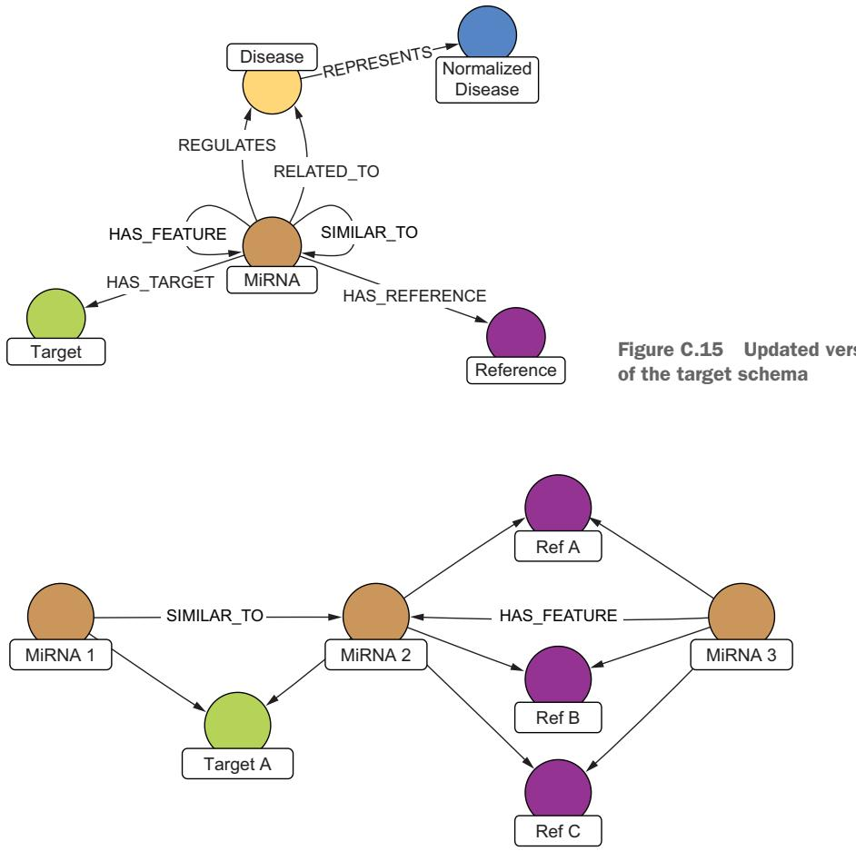  
Figure C.16 Example of direct similarity and similarity induced by shared nodes. The model will learn which similarity is most relevant for the link prediction task.

Let’s start by importing the miRBase dataset (www.mirbase.org) [26–29], a searchable database of about 200 published miRNA sequences and annotations. For each miRNA, the dataset reports a list of relevant publications mentioning it as well as a list of connected miRNAs. The following listing implements the miRBase importer that handles the extraction and integration of this miRNA reference database into our KG.

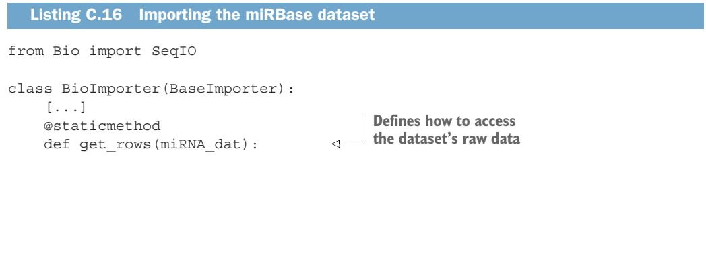

for record in SeqIO.parse(miRNA\_dat, "embl"): <   
Reads the dataset   
if not record.name.startswith("hsa"): stored in EMBL   
continue format, which contains   
if len(record.name) < 2: nested structures   
continue   
yield { Filters out empty or   
"name": record.name.lower(), non-human-related miRNAs   
"description": record.description,   
"seq": str(record.seq),   
"comment": record.annotations.get('comment', ''),   
"references": [   
{"authors": r.authors, "title": r.title,   
"pubmed\_id": r.pubmed\_id, "journal": r.journal}   
for r in (record.annotations   
.get('references', []))], Extracts any   
"features": [   
publication references   
{"type": r.type, in the record   
"accession": (r.qualifiers   
.get('accession', [""])[0]),   
"name": (r.qualifiers   
Extracts any .get('product', [""])[0]   
miRNAs related to .lower())}   
the current one > for r in record.features if r.type == "miRNA"]   
}   
def import\_miRNA\_dat(self, miRDB\_file):   
query = """ Unwinds a batch   
UNWIND \$batch as item < of records   
MATCH (m:MiRNA {name: item.name}) <   
Selects the miRNA node   
SET   
corresponding to the   
Updates the node m:MiRNA\_miRBase, current record   
with this dataset’s m.description = item.description,   
information m.seq = item.seq, m.comment = item.comment Iteratively processes   
WITH m,item each feature from   
Creates a relationship FOREACH (feature in item.features < the item.features list   
between the current miRNA and MERGE (f:MiRNA {name: feature.name}) < Selects the miRNA   
the one from the feature list MERGE (m)-[:HAS\_FEATURE]->(f) node identified by   
) the feature item   
WITH m,item   
Iteratively processes each > UNWIND item.references as reference   
publication reference from MERGE (r:Reference {pubmed\_id: reference.pubmed\_id}) <   
the item.references list ON CREATE SET r.authors = reference.authors, Creates a   
r.title = reference.title,   
publication   
Connects the current r.journal = reference.journal Reference node if   
miRNA node with the > MERGE (m)-[:HAS\_REFERENCE]->(r) it does not exist   
publication Reference node IIII I   
size = self.get\_embl\_size(miRDB\_file) <   
D self.batch\_store(query, self.get\_rows(miRDB\_file), size=size)   
Aggregates and Computes the number   
stores the records of records to ingest

The following listing is an example of the records provided by miRBase. It contains a wealth of relevant information that allows us to connect miRNAs to one another and to reference articles.

Listing C.18 miRDB record sample, including confidence score   
{'name': 'hsa-mir-96-5p',   
'target': 'NM\_012214',   
'value': 90.3926}

Listing C.17 miRBase record sample   
name: hsa-let-7a-1   
description: Homo sapiens let-7a-1 stem-loop   
comment:   
let-7a-3p cloned in [6] has a 1 nt 3' extension (U), which is   
incompatible with the genome sequence.   
seq:   
UGGGAUGAGGUAGUAGGUUGUAUAGUUUUAGGGUCACACCCACCACUGGGAGAUAACU   
AUACAAUCUACUGUCUUUCCUA   
features:   
- accession: MIMAT0000062   
name: hsa-let-7a-5p   
type: miRNA   
accession: MIMAT0004481   
name: hsa-let-7a-3p   
type: miRNA   
references:   
- authors: Lagos-Quintana M, Rauhut R, Lendeckel W, Tuschl T   
journal: Science. 294:853-858(2001).   
pubmed\_id: 11679670   
title:   
Identification of novel genes coding for small expressed RNA   
authors:   
Suh MR, Lee Y, Kim JY, Kim SK, Moon SH, Lee JY, Cha KY,   
Chung HM, Yoon HS, Moon SY, Kim VN, Kim KS   
journal: Dev Biol. 270:488-498(2004).   
pubmed\_id: 15183728   
title:   
Human embryonic stem cells express a unique set of miRNAs   
[...]

The next dataset to be ingested is miRDB (https://mirdb.org) [30, 31], an online database for miRNA target prediction and functional annotations. As previously discussed, miRNAs primarily function by downregulating the expression of their target genes. Thus, accurately predicting miRNA targets is critical for characterizing miRNA functions. The targets in the dataset are predicted using a bioinformatics tool, miR-TargetLink 2.0 (https://ccb-compute.cs.uni-saarland.de/mirtargetlink2) [32], which was developed by analyzing miRNA–target interactions from high-throughput sequencing experiments. miRDB includes 3.5 million predicted targets regulated by 7,000 miRNAs in 5 species; however, we will focus on the miRNAs we have already imported into our graph (i.e., those related to humans).

The next listing shows a miRDB record sample including the confidence score, which helps evaluate the strength of the miRNA–target association. The result of the import is shown in figure C.17.

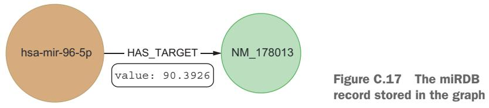

As a last step, we will import a relatively small dataset containing the miRNA pairwise functional similarity. A similarity score is obtained using a bioinformatics tool, MISIM (http://www.lirmed.com/misim) [33], which computes miRNA functional similarity by comparing the semantic values of the diseases associated with the two miRNAs.

The following MISIM record sample also includes the confidence score. The result of the import looks like the small graph shown in figure C.18.

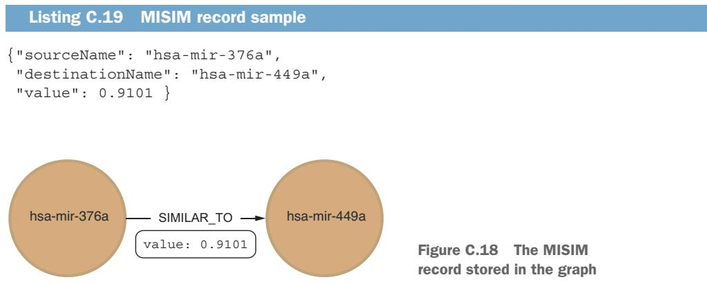

This last import completes our ingestion process. Before moving ahead, you may find it useful to run the following simple exercises to check the contents of the database, familiarize yourself with it, and see how the different components interact in the KG. The questions in the exercises are useful to get your head around the size of the database. This will affect the time required to run certain algorithms and the final quality of the generated model, so it is usually a good practice to consider them before doing a deeper analysis.

How many nodes of each type exist in the database: how many miRNAs, and how many diseases?

 Which disease is connected to the most miRNAs? What is the median value?

Which miRNAs have more connections to different diseases? What is the median value?

### C.3 Exploring and analyzing the miRNA KG

Let’s review the graph we’ve constructed, extract some information, and validate the quality of the knowledge it contains before moving on to more complex tasks. To do so, we can run a query that allows us to observe similarities between nodes of the same type and nodes of different types. These kinds of similarities represent implicit relationships that ML algorithms will use to perform their tasks. As we will see, during the training phase, many embeddings’ algorithms learn to identify which implicit relationships are more useful to obtain the desired results.

In case you didn’t create the database, you can import ours (https://downloads .graphaware.com/neo4j-db-seeds/hmdd2.0.backup). You can also use this backup to verify your database if you run the full process. Add the following line to the neo4j.conf file:

dbms.databases.seed\_from\_uri\_providers=URLConnectionSeedProvider

Then run the following command.

Listing C.20 Importing the miRNA database from a backup

CREATE DATABASE \`hmdd2.0\` OPTIONS {existingData: "use", seedUri: "https://downloads.graphaware.com/neo4j-db-seeds/hmdd2.0.backup"}

As an example, let’s try to evaluate how similar miRNAs can be, based on the number of target mRNAs they have in common. We will consider two miRNAs similar if they share many Target nodes. Figure C.19 illustrates this concept, showing how miRNA2 is more similar to miRNA3 than it is to miRNA1, with the thickness of arrow lines representing the strength of target connections.

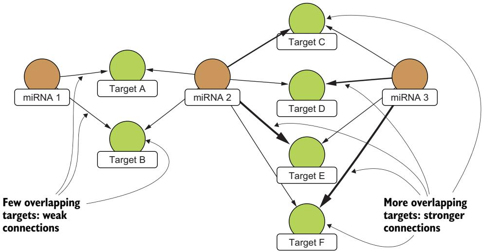  
Figure C.19 miRNA2 is more similar to miRNA3 than it is to miRNA1. The thicker the arrow lines, the stronger the target’s connections.

To compute this type of similarity, we will use the nodeSimilarity function from GDS in its weighted version. This means miRNAs connected to targets with a high score value will be considered more significant than those with weaker connections. Before using this algorithm, we have to create a named in-memory representation of the graph we are going to analyze.

Listing C.21 Creating the in-memory graph   
CALL gds.graph.project("MiRNA\_Target\_similarity", Considers only   
["Target","MiRNA"], < miRNAs and Targets   
{HAS\_TARGET:{properties:["value"]}}) <   
Includes the value property in the   
in-memory projection so we can use it later

Once the in-memory database has been created, we can run the node similarity computation. The following listing calculates the similarity between nodes using the weighted version of the algorithm, allowing us to prioritize connections with higher score values.

### Listing C.22 Computing similarity

```sql
CALL gds.nodeSimilarity.stream(
"MiRNA_Target_similarity", Uses the value relationship
{relationshipWeightProperty: 'value'}) ≤ attribute as a weight property
YIELD node1,node2, similarity
WITH gds.util.asNode(node1) AS source,
gds.util.asNode(node2) AS target, similarity
RETURN source.name AS source, target.name AS target, similarity
ORDER BY similarity DESC, source, target
```

The results of the node similarity computation are reported in table C.4. For the most similar miRNAs in the table, we can find some obvious (like hsa-let-7a-5p and hsa-let-7c-5p from the let-7 family) and some less obvious examples. For example, searching on the internet for the miRNAs on line 3, hsa-mir-107 and hsa-mir-103s-3p, finds many articles discussing the connection of these two miRNAs to osteoarthritis, cystic fibrosis, and other diseases.

Table C.4 Results of the similarity query in listing C.22
<table><tr><td>Source</td><td>Target</td><td>Similarity</td></tr><tr><td>hsa-let-7a-5p</td><td>hsa-let-7c-5p</td><td>1.0</td></tr><tr><td>hsa-let-7a-5p</td><td>hsa-let-7e-5p</td><td>1.0</td></tr><tr><td>hsa-mir-107</td><td>hsa-mir-103a-3p</td><td>1.0</td></tr><tr><td>hsa-mir-570-5p</td><td>hsa-mir-548ai</td><td>1.0</td></tr></table>

We can also push ourselves further. As we know, miRNAs regulate gene expression by interfering with specific mRNAs; when this regulation is abnormal, pathologies may result. It is reasonable to wonder how a target mRNA can be considered similar, or affine, to a disease based on how many miRNAs the two have in common. In addition to being interesting in its own right, this kind of analysis demonstrates how we can compare different entities (Diseases and Targets) using information from multiple datasets.

We will again use the nodeSimilarity function in GDS. But this time it’s a filtered version, because we are interested in similarity relations between Targets and Diseases, rather than between Targets and other Targets or between miRNAs and Diseases, for example. The following Cypher query creates the in-memory graph representation that will serve as the basis for our similarity analysis.

```javascript
Listing C.23 Creating the in-memory graph
CALL gds.graph.project("Disease_Target_similarity",
["Target","MiRNA","Disease"],
{HAS_TARGET:{orientation:"UNDIRECTED"},
Makes sure we do not
RELATED_TO:{orientation:"UNDIRECTED"}, consider the direction
SIMILAR_TO:{orientation:"UNDIRECTED"}}) of the relationships
```

Once the graph has been created in memory, we can run the similarity computation and evaluate the results.

Listing C.24 Computing similarity   
Instructs the algorithm to consider   
CALL gds.nodeSimilarity.filtered.stream( only the similarity between Disease   
"Disease\_Target\_similarity", and Target node types   
{sourceNodeFilter:"Disease",targetNodeFilter:"Target"}) <   
yield node1,node2, similarity   
WITH gds.util.asNode(node1) AS source, Counts how many miRNAs   
gds.util.asNode(node2) AS target, similarity the Disease and Target   
MATCH (source)-[]-(m:MiRNA)-[:HAS\_TARGET]-(target) ≤ have in common   
WITH source, target, similarity, count(m) as miRNAs   
WHERE miRNAs > 10 <   
RETURN source.name AS source, target.name AS target, similarity, miRNAs   
ORDER BY similarity DESCENDING, source, target   
Keeps only Diseases and Targets   
that share at least 10 miRNAs

The results of the similarity query are reported in table C.5. The query in listing C.25 examines the first row in detail; the result looks like the graph shown in figure C.20.

Table C.5 Results of the similarity query in listing C.24
<table><tr><td>Source</td><td>Target</td><td>Similarity</td><td>miRNAs</td></tr><tr><td>meningioma</td><td>NM_203347</td><td>0.047619048</td><td>11</td></tr><tr><td>meningioma</td><td>NM_001031745</td><td>0.045454545</td><td>12</td></tr><tr><td>prostate neoplasms</td><td>NM_012316</td><td>0.030769231</td><td>16</td></tr><tr><td>prostate neoplasms</td><td>NM_001260491</td><td>0.030373832</td><td>13</td></tr></table>

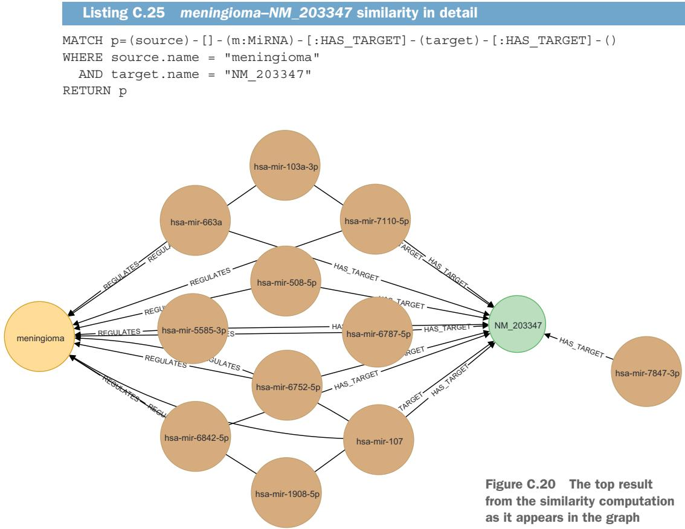

In this example, we can see that almost all of the miRNAs associated with the target mRNA (NM\_203347) are related to meningioma. Again, these types of findings do not have to be significant from a medical standpoint, but they represent information usable by a machine learning algorithm.

The last analysis we’ll run on this brand-new KG is the same one we use for Hetionet, as discussed in chapter 4, where we use degree-weighted path count (DWPC) to find relevant paths from a disease to a GO Process. As a reminder, DWPC helps us avoid biasing our analysis with nodes that are part of many paths by penalizing highly connected nodes.

In this case, we will use celiac disease as our reference disease because we are familiar with it and can effectively evaluate the results. The following listing queries our KG to identify relevant targets potentially associated with celiac disease.

Listing C.26 Searching for relevant targets connected to celiac disease   
MATCH path = (d:Disease)<-[:REGULATES|RELATED\_TO]-(m)-[:HAS\_TARGET]->(t)   
WHERE d.name = "celiac disease"   
WITH

[   
size([(d)<-[:REGULATES|RELATED\_TO]-() | d]),   
size([()<-[:REGULATES|RELATED\_TO]-(m) | m]),   
size([(m)-[:HAS\_TARGET]->() | m]),   
size([()-[:HAS\_TARGET]->(t) | t])   
]   
AS degrees, path, d, t   
WITH d.name as disease\_name, t.name as target\_name, count(path) as PC,   
sum(reduce(pdp = 1.0, d in degrees| pdp \* d ^ -0.4)) AS DWPC,   
size([(t)-[:HAS\_TARGET]-() | t]) AS n\_miRNA   
WHERE n\_miRNA >= 5 and PC >= 2   
RETURN disease\_name, target\_name, PC, DWPC, n\_miRNA   
ORDER BY DWPC desc   
LIMIT 10

The results are summarized in table C.6. They’re interesting because they align with the scientific evidence related to celiac disease. For example, the first target in the table is NM\_080601: “homo sapiens protein tyrosine phosphatase non-receptor type 11 (PTPN11), transcript variant 2, mRNA.” Research has shown the role of protein tyrosine phosphatases in regulating the immune system and the implications this has for chronic intestinal inflammation [34].

Targets 2, 3, and 5 in the table (NM\_001224, NM\_032982, and NM\_032983) are all variants of ”homo sapiens caspase 2, apoptosis-related cysteine peptidase,” CASP2. Several studies, including a single-cell RNA-seq survey of gluten-specific T cells [35], provide the knowledge base for finding unique targets for the removal of gluten-specific T cells as a curative therapeutic option for celiac disease. In these studies, researchers found marked upregulation of several apoptosis-related genes, such as FAS, TRAIL, and CASP2, in tetramer-positive cells, possibly due to in vivo activation by gluten antigens. These findings encourage the use of activation-induced cell death for the removal of gluten-specific T cells.

Table C.6 Results of the query in listing C.26
<table><tr><td>Disease</td><td>Target</td><td>PC</td><td>DWPC</td><td># miRNA</td></tr><tr><td>celiac disease</td><td>NM_080601</td><td>2</td><td>0.00417</td><td>25</td></tr><tr><td>celiac disease</td><td>NM_001224</td><td>2</td><td>0.00322</td><td>111</td></tr><tr><td>celiac disease</td><td>NM_032982</td><td>2</td><td>0.00318</td><td>114</td></tr><tr><td>celiac disease</td><td>NM_152617</td><td>2</td><td>0.00295</td><td>136</td></tr><tr><td>celiac disease</td><td>NM_032983</td><td>2</td><td>0.00278</td><td>160</td></tr><tr><td>celiac disease</td><td>NM_198926</td><td>3</td><td>0.00241</td><td>158</td></tr><tr><td>celiac disease</td><td>NM_019099</td><td>3</td><td>0.00234</td><td>169</td></tr><tr><td>celiac disease</td><td>NM_005235</td><td>2</td><td>0.00219</td><td>286</td></tr><tr><td>celiac disease</td><td>NM_052845</td><td>2</td><td>0.00210</td><td>138</td></tr><tr><td>celiac disease</td><td>NM_001142551</td><td>2</td><td>0.00209</td><td>138</td></tr></table>

We didn’t find any easy-to-access articles connecting celiac disease to related gene variants expressed by the other targets in the table. But considering the active research surrounding this disease, it is possible that a correlation will become apparent.

To complete our analysis, let’s run the query showing how miRNAs are connected to the first target in the list. The next listing searches for all paths connecting celiac disease with the target NM:080601; the result is shown in figure C.21.

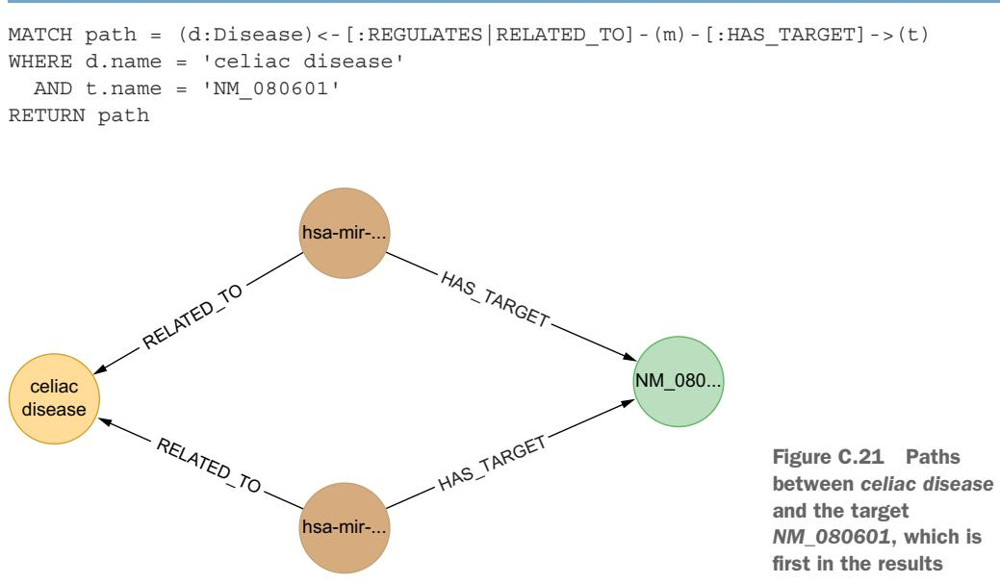

As we’ve demonstrated, combining multiple sources in a single, holistic KG enables us to analyze information from various perspectives. In addition, metrics like DWPC have broad applications across contexts.

### Exercise

If you are interested in the domain, run some of the previous queries again, changing the target disease, and evaluate the results.