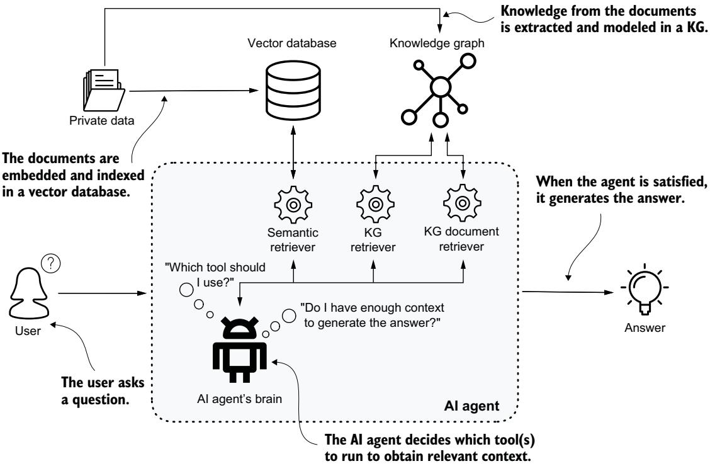

# A

인접 리스트와 행렬 443   
인접 정점 437   
적대적 샘플링 (adversarial sampling) 288   
에이전트, 파이프라인 에이전트 구현 409 LangGraph 파이프라인 구축 414 요약 생성 에이전트 413 의도 탐지 에이전트 409 질의 후 실행 413 질의 실행 에이전트 411 스키마 추출 에이전트 410 텍스트-Cypher 에이전트 411   
AGGREGATE 함수 289, 291   
올인원 NLP 113   
Amazon Textract 148   
AML(자금세탁 방지) 303–304   
주석 수집 및 처리 55–59 주석을 사용한 스키마 정의 387   
답변 우선 대 추론 우선 384   
APOC(Awesome Procedures on Cypher 라이브러리) 456–457   
apoc.meta.schema 377, 405   
APSP(모든 쌍 최단 경로) 알고리즘 479   
어텐션 메커니즘 (attention mechanisms) 292

### B

매개성 247   
상향식 접근법 34   
브리지 구성원, 정의 281   
브리지, 정의 441

### C

CameraEvents 423   
후보 선택 (CS) 132, 188, 192   
CD (후보 중의성 해소) 188, 194 최단 경로 탐지 196 중의성 해소 202 텍스트 경로 요약 201 경로를 텍스트로 번역 199   
사고 연쇄 프롬프팅 (chain-of-thought prompting) 384   
CKG (임상 지식 그래프) 91   
분류 프롬프트 370 설계 고려사항 376   
Claude.ai 29   
KG의 임상 응용 90–94   
근접 중심성 (closeness centrality) 244   
클러스터링 216   
CO\_OFFENDS\_WITH 관계 381   
통신 네트워크 438   
커뮤니티 탐지 216–217   
커뮤니티 구조 281   
완전 그래프 437   
개념 검색 140, 159   
전도도, 정의 78   
혼동 행렬 225–227, 252–253, 303, 316, 332–333   
문맥 문장 204   
상호참조 해소 5   
CRISP-DM (데이터 마이닝을 위한 산업 간 표준 프로세스) 35   
CrossEntropyLoss 함수 313   
CS (후보 선택) 132, 188, 192   
사이클, 정의 438   
Cypher 455 텍스트에서 Cypher로 386–391

### D

데이터 주석 복잡성과 비용 113   
데이터 이해 141–145 도메인 온톨로지 142–145 비정형 데이터 141   
데이터 중심 패러다임 8, 102   
데이터 기반 애플리케이션, 패러다임 전환 10   
데이터 관련 질문 372   
DBSCAN (노이즈가 있는 애플리케이션의 밀도 기반 공간 클러스터링) 217   
블랙박스 해체 128   
연역적 추론 28   
차수 237 계산 197 정점의 437   
경로의 밀도 78   
다익스트라 알고리즘 243   
방향 그래프 436   
중의성 해소, 도메인 온톨로지 수집 182–185   
질병 온톨로지 472 정규화 효과 평가 476 UMLS 및 scispaCy를 사용한 정규화 473   
DL (딥러닝) 273   
문서화 관련 질문 372   
문서, 처리 및 수집 148   
도메인 온톨로지, 수집 182–185   
DWPC (차수 가중 경로 수) 82, 490

### E

EC (유럽연합 집행위원회, European Commission) 140   
ECDC (유럽질병예방통제센터, European Centre for Disease Prevention and Control) 130, 140, 181   
EDQM (유럽 의약품 및 보건의료 품질관리국, European Directorate for the Quality of Medicines & HealthCare) 140   
에고넷 (자아 중심 네트워크, ego-centered network) 236   
EHRs (전자건강기록, electronic health records) 59, 90   
임베딩 생성 327   
임베딩 344 그래프 표현 학습에서 273–278 지식 그래프에서 285–289   
인코더-디코더 아키텍처 310, 326 디코더 313, 330 인코더 311, 328   
인코더-디코더 모델 279–281 디코더 280 인코더 279 Node2Vec 280–281 프레임워크의 힘 280   
개체, 명명 개체 인식 100   
개체 동시 출현, 생성 157   
전문가 모사 조사 422–430 맥락 인식 요청 정제 428 과거 기록 분석 430 초기 사례 식별 423 감시 범위의 공간 분석 425   
설명가능성 10, 127   
탐색가능성 128

### F

대체 옵션 369   
거짓 음성 287   
특징 맹목성 284   
특징 공학. 그래프 특징 공학 참조   
특징 기반 정보 290   
피드백 및 불만 372   
미세조정 비용 113   
순전파 메서드 311

### G

GATConv 계층 313   
GAT (그래프 어텐션 네트워크) 303   
GDL (기하 딥러닝) 276   
GDS (Graph Data Science) 라이브러리 74, 176, 195, 457–458   
GenAI (생성형 인공지능) 3   
generate-summary 에이전트 413   
측지선(또는 최단) 경로 242   
임베딩의 기하 274–276   
GIS (지리 정보 시스템) 368   
GNN (그래프 신경망) 210, 273 일반화된 집계 및 갱신 방법 292–299 그래프 프로세서, 데이터 준비 305 링크 예측 304, 317–319, 326, 330–332 메시지 전달 289–292 노드 분류 302, 304, 310, 313–314, 316, 319 LLM과의 시너지 299   
GO (유전자 온톨로지) 84   
그래프 분류 217, 228 클러스터링 217, 229–231 완성 215 밀도 241   
그래프 특징 공학 233 매개성 247 근접 중심성 244 차수 237 측지선(또는 최단) 경로 242 수동 관계 특징 254–262 수동 노드 특징 235–253 PageRank 249 예측 251 반자동 특징 추출 263–271 삼각형 239   
그래프 프로세서, 데이터 준비 305, 319   
Graph RAG 347   
그래프 기반 엔터티 해소 120–122   
그래프 435 네트워크 모델로서 438–443 정의 435–438 표현 443–446   
Gremlin 14   
GRL (그래프 표현 학습) 272–273 그 안의 임베딩 273–278 인코더-디코더 모델 279–281 일반화된 집계 및 갱신 방법 292 메시지 전달 289–292 얕은 임베딩 283–284

### H

환각 (hallucinations) 10, 102   
이종 GNN 모델 (heterogeneous GNN model) 327   
이종친화성 (heterophily) 213   
Hetionet 그래프 81, 84–89   
HMDD (Human miRNA Disease Database) 465   
동종친화성 (homophily) 213, 442   
HPO (Human Phenotype Ontology) 40, 141, 145 수집 155 저장소 44

### I

i.i.d. (independent and identically distributed, 독립 동일 분포) 212   
IASs (intelligent advisor systems, 지능형 조언자 시스템) 정의 20 KG 접근법 33–36 구축을 위한 그래프 기반 기계 학습 209 도메인 온톨로지 사용 142–145 비정형 데이터 사용 141   
ICIJ (International Consortium of Investigative Journalists, 국제탐사보도언론인협회) 440   
내차수 (in-degree) 437   
귀납 학습 (inductive learning) 277   
귀납 추론 (inductive reasoning) 28 ML 사용 32   
정보 지도 (information maps) 439   
정보 네트워크 (informational networks) 438   
도메인 온톨로지 수집 182–185 HPO 온톨로지 155 SNOMED 온톨로지 152   
지능형 시스템 (intelligent systems) 17 범주 20 특성 23 정의 18, 20 설계 20–23 지식 획득 및 표현 24 추론 27–30 추론 엔진 31–33   
의도 탐지 (intent detection) 367–376 에이전트 409 더 넓은 질문 범위 372–376 시각화 유형별 분류 368–370

### J

점핑 지식 네트워크 (jumping knowledge networks) 298

### K

K-평균 217   
KG 검색기 348–349   
KG 기반 해석 가능성과 발견 140   
KGs (knowledge graphs) 4–6, 129 지능형 에이전트 시스템에 대한 접근법 33–36 스키마에서 LLM 준비 맥락까지 자연어로 질문하기 376–383 의도 탐지 367–376 LLM 추론 383–392 향상된 질의를 위한 메타데이터 사용 366 구축 41–46, 55–59 주석 수집과 처리 55–59 비즈니스 및 도메인 이해 41 데이터 이해 44–46 neosemantics를 사용한 온톨로지 수집과 처리 52–55 이를 사용한 데이터 기반 애플리케이션 구축 12–14 고객 지원을 위한 대화형 AI 13 KG 사용 여부 결정 14 신약 발견과 개발 13 구조화된 소스에서 구축 462 질병 온톨로지 472 miRNA KG 탐색과 분석 487–492   
KGs (knowledge graphs) (계속) LLM을 사용한 구축 101–115 프롬프트 엔지니어링 예시 104–109 전통적 NLP 대 LLM 112–114 비공개 데이터에 대해 AI와 대화하기 342–354 KG와 대화하기 352–354 그래프 RAG 348–351 추론 에이전트 351 검색 증강 생성 343–345 벡터 기반 RAG의 한계 345–347 임상 응용 90–94 온톨로지에서 생성 39 데이터 질의 59–62 지식 그래프에 대한 추론 62 임베딩 285–289 손실 함수 285–288 이를 통한 도메인 전문가 역량 강화 358 네 가지 기둥 11 지적 네트워크 분석 122–126 KG 특화 주석 390 LLM과의 관계 8 기계 학습 210–231 클러스터링과 커뮤니티 탐지 216 그래프 분류 217, 228 그래프 클러스터링 216, 229–231 노드 분류와 링크 예측 211–214, 220–228 다중 오믹스 응용 67–80 PPI 네트워크와 단백질–질병 연관에서 KG 생성 69–73 PPI와 질병 KG의 도메인 특화 분석 76–80 결과 KG의 고수준 분석 73–76 NED (named entity disambiguation), KG 기반 사용 사례 158 데이터 기반 애플리케이션의 패러다임 전환 10 제약 응용 80–89 Hetionet 그래프의 심층 분석 84–89 질의, 이를 위한 검색 증강 생성 358–362 기술 14, 46–52 아카이브를 KG로 변환 116–122 메타그래프 생성 119 그래프 모델링 118 그래프 기반 개체 해소 120–122 정규화와 정제 119 LLM 시대에서의 가치 127   
지식 획득과 표현 24   
지식 기준 시점 339   
지식 추출의 개념 99 명명 개체 인식 100 관계 추출 101

비구조화 데이터에서의 도메인 특화 지식 추출 98 비구조화 데이터에서 97 지식 표현 18, 98

### L

LangGraph 질의응답 에이전트 (QA agents) 구축 397 파이프라인 컴포넌트 구성 401 전문가 모방 조사 422–430 스키마 번역 서비스 404 상태 관리 설계 408 Streamlit 애플리케이션 417–422 시스템 아키텍처 개요 399 파이프라인 에이전트 구현 409 파이프라인 통합 계층 415   
최대 경로 컴포넌트 77   
리더십 역할 281   
링크 예측 (link prediction) 214–215, 220–228, 254 분석과 평가 330–332 인코더-디코더 아키텍처 326 영화 추천을 위한 317 입력 데이터 304, 318 GNN을 활용한 302   
Llama 3.1 8B, 모델 설정 186   
LLMOps (LLM operations) 337   
LLM (large language models) 3, 6, 101, 115, 235 이를 사용한 데이터 기반 애플리케이션 구축 12–14 이를 사용한 지식 그래프 구축 101–115 이를 이용한 대화 339–341 임상 의사결정 지원 분석 93 도메인 기반 NED와 136 그래프 특징 공학 261 지식 그래프와 8 추론 383–392 답변 우선 대 추론 우선 384 텍스트에서 Cypher로 386–391 신뢰할 수 있는 쿼리 생성을 위한 출력 구조화 391 추론 엔진에서의 역할 33 GNN과의 시너지 299 교육 16 그 시대에서의 지식 그래프의 가치 127   
온톨로지 로딩 152 HPO 수집 155 SNOMED 수집 152   
지역 특징 236   
log\_softmax 함수 311, 313   
로지스틱 회귀 (logistic regression) 225   
손실 함수 (loss function) 285–288 음성 샘플링 287   
Louvain 모듈성 알고리즘 75

LPA (label propagation algorithm) 230 LPG (Labeled Property Graph) 15, 46 엣지 속성 표현 49 RDF와의 비교 47

### M

기계 학습. ML (machine learning) 참조   
온톨로지 매핑 152 HPO 수집 155 SNOMED 수집 152   
MATCH 패턴 388   
MEAN 연산자 268   
의학 개체, 중의성 해소 및 수집 149   
MERGE 절 470   
메시지 전달 289–292 기본 그래프 신경망 (GNN) 모델 291 프레임워크 289 동기와 직관 290 자기 루프 사용 291   
메타데이터 348 방법 329 향상된 질의에 사용 366   
메타그래프, 생성 119   
메타경로 축소 261   
microRNA-질병 연관 462 비즈니스 이해 464 데이터 이해 464 핵심 개념 462   
miR2Disease 465, 470   
miRNA (microRNA) 정보, 가져오기 482   
miRNA KG (knowledge graph) 464 탐색 및 분석 487–492   
MISIM (miRNA similarity index tool) 486   
ML (machine learning) 97, 115, 233, 440, 464 지식 그래프에서 210–231 그래프 분류 217, 228 그래프 군집화 216, 229–231 노드 분류와 링크 예측 211–214, 220–228 귀납적 추론과 함께 사용 32   
모델 중심 접근법 102   
모델 중심 패러다임 8   
모기 매개 플라비바이러스 열 172   
지식 그래프의 다중 오믹스 응용 67–80 PPI 네트워크와 단백질–질병 연관으로부터 지식 그래프 생성 69–73 PPI 및 질병 지식 그래프의 도메인 특화 분석 76–80 결과 지식 그래프의 고수준 분석 73–76   
멀티헤드 어텐션 294–296

다중 관계 디코더 288   
다중 소스 통합 65   
다단계 접근법 376

### N

n항 관계 49   
내러티브 스키마 표현 379   
자연어 질문 363–365 응답 요약 392–395   
NE (명명 엔터티) 명확화 스키마 정의 147 엔터티 동시 출현 생성 157 KG 기반 해석 가능성 및 발견 167 문서 처리 및 수집 148 온톨로지 처리, 적재 및 매핑 152 새로운 지식 발견 174 데이터 이해 141–145   
NED (명명 엔터티 명확화) 130, 180 비즈니스 및 도메인 이해 138–140 후보 명확화 194 후보 선택 192 개념 검색 159 의료 엔터티 명확화 및 수집 149 도메인 기반 NED와 LLM 136 종단간 프로세스 187 도메인 온톨로지 수집 182–185 KG 기반 사용 사례 158 전통적 시스템의 한계 180 개요 132–136 인식에서 명확화까지 130–131 Ollama와 Llama 3.1 8B로 모델 설정 186 구조화된 지식 기반 검색 162   
음성 샘플링 286–287   
이웃 어텐션 294   
이웃 정규화 293–294   
이웃 437   
Neo4j 447 정리 459 Cypher 455 설치 450–455 플러그인 설치 456–459 개요 448–450   
neosemantics 52–55   
NER (명명 엔터티 인식) 100, 117, 129, 187–188   
네트워크, 네트워크의 모델로서의 그래프 438–443   
networkx 함수 77 그래프 245 라이브러리 243   
신경 메시지 전달 289   
NLG (자연어 생성) 13   
NLP (자연어 처리) 7, 33, 97, 180, 337, 473 전통적 112–114   
매개변수 공유 없음 284   
노드 분류 211–214, 220–228 분석 및 평가 313–314, 316 인코더-디코더 아키텍처 310 자금세탁 방지 응용을 위한 304 그래프 프로세서, 데이터 준비 319 입력 데이터 304 GNN을 사용한 302   
노드 특징, 수동 235   
노드 기반 결합 254–255   
노드 기반 표현 255–256   
노드 중심 과제, 정의 211   
Node2Vec 223, 280 디코딩 과정 281 인코딩 과정 280 프레임워크의 강점 281   
정규화 질병 온톨로지 473, 476 층 292 아카이브를 KG로 변환 119   
NOT EXISTS 절 72

### O

OCR (광학 문자 인식) 116   
Ollama로 모델 설정 186   
온톨로지 15 온톨로지로부터 지식 그래프 생성 39, 59–62 도메인 온톨로지 142–145 neosemantics를 사용한 수집 및 처리 52–55 통합 134 처리, 적재 및 매핑 152, 155   
openCypher 14   
외향 차수 (out-degree) 437

### P

PageRank 249–250   
매개변수 비효율성 284   
경로 기반 특징 254, 256–262   
경로, 정의 438–439   
경로 분석 88   
환자 경험 매핑 90   
PC (경로 수) 83   
PDP (경로-차수 곱) 84

KG의 제약 응용 80–89 Hetionet 그래프의 심층 분석 84–89   
파이프라인 에이전트 구현 409 LangGraph 파이프라인 구축 414 요약 생성 에이전트 413 의도 탐지 에이전트 409 쿼리 후 실행 413 쿼리 실행 에이전트 411 스키마 추출 에이전트 410 텍스트-Cypher 에이전트 411   
PLM (사전 학습 언어 모델) 7   
치안 도메인 지식 그래프로 도메인 전문가 지원 358 지식 그래프 쿼리 357   
위치 임베딩 276   
PPI (단백질-단백질 상호작용) 네트워크 69, 71 PPI 네트워크로부터 KG 생성 69–73   
예측 비용 112–113 속도 112–113 안정성 107   
예측 모델 36   
문제 모델링 210   
프롬프트 엔지니어링 103, 111 예시 104–109 지침 109–112   
PyG (PyTorch Geometric) 라이브러리 303, 307

### Q

QA (질의응답) 에이전트 파이프라인 구축 398 LangGraph로 구축 397, 409, 417–422 파이프라인 구성 요소 설정 401 전문가 모방 조사 422–430 향후 방향 및 개선 432–434 파이프라인 통합 계층 415 상태 관리 설계 408 시스템 아키텍처 개요 399   
질의 실행 에이전트 411   
질의 생성 391–392   
KG (지식 그래프) 질의 검색 증강 생성 (retrieval-augmented generation) 358–362 스키마 기반 접근법 363–365

### R

RAC (Rockefeller Archive Center) 98, 115, 126 RAG (검색 증강 생성) 337, 356, 398 운영 환경에서의 과제 341

비공개 데이터에 대해 AI와 채팅하기 342–354 LLM과 채팅하기 339–341 KG 질의를 위한 활용 358–362 랜덤 워크 생성 281 RDF (Resource Description Framework) 14–15, 46 간선 속성 표현 49, 51 LPG와의 비교 47 RDF-star 51 RE (관계 추출) 101, 117 추론 18, 27–30 연역적 및 귀납적 28 지식 그래프에 대한 62 추론 엔진 31–33 ReFeX (Recursive Feature eXtraction) 263–271 관계형 추론 215 관계, 추출 101 관계 예측 215

### S

SAGEConv 계층 312   
스키마 추출 에이전트 410   
스키마 추출 및 표현 376–383 설명 주석으로 스키마 보강 380 개요 377–380 이에 대한 실제적 접근 382   
스키마 번역 서비스 404   
KG 질의를 위한 스키마 기반 접근 363–365   
스키마 관련 질문 372   
스키마리스 36   
scispaCy 473   
스크래치패드 기법 384   
보안/온프레미스 배포 비용 112, 114   
자기 루프 291   
의미적 일관성 384   
준사기 삼각형 239   
준지도 학습 214   
얕은 임베딩 283–284   
최단 경로 196–197   
SIMILAR 관계 121   
sklearn 라이브러리 314   
SNAP (Stanford Network Analytics Project) 70   
SNOMED (Systematized Nomenclature of Medicine) 134, 144 온톨로지, 적재 152   
소셜 네트워크 438   
소프트맥스 함수 281   
SPARQL 질의 언어 14   
희소성, 정의 286   
공간 분석 425   
오래된 정보 10   
StandardScaler 224, 252   
상태 객체 399, 408–409   
Streamlit 애플리케이션 417–422 LangGraph 통합 420–422 개요 418   
구조적 임베딩 276   
구조적 정보 290   
구조화된 데이터, 정의 4   
구조화된 지식 기반 검색 140, 162   
구조화된 소스 이로부터 지식 그래프 구축 462, 464, 472, 482 알려진 miRNA-질병 연결 가져오기 465 microRNA-질병 연관 462, 464   
요약 단계, 응답 392–395   
텍스트 경로 요약 201   
요약, 정의 9   
지도 알고리즘 211   
지도 학습 278   
주변 문맥 442

### T

대상 엔터티 132   
분류 체계, 정의 15   
기술적 데이터베이스 스키마 378   
Tesseract OCR 라이브러리 116   
텍스트 속성 그래프 348   
텍스트 쌍 그래프 348   
텍스트-Cypher 에이전트 411   
전통적 NED 시스템, 한계 180   
전이적 학습 277   
전이 학습 6, 101   
Transformer 연결 294–296   
아카이브를 KG로 변환 116–122   
메타그래프 생성 119   
그래프 모델링 118   
그래프 기반 엔터티 해소 120–122   
정규화 및 정제 119   
경로를 텍스트로 번역 199   
교통 네트워크 438   
삼각형 239–241   
TSV (탭으로 구분된 값) 45, 56   
Turtle (간결한 RDF 트리플 언어) 44   
유형 속성 119, 153   
유형 제약 샘플링 288

### U

UMLS (통합 의학 언어 시스템, Unified Medical Language System) 68, 130, 137, 142–144, 473   
무방향 그래프 436   
비정형 데이터 4, 141, 비정형 데이터에서 도메인 특화 지식 추출 97–98   
비지도 알고리즘 211   
비지도 학습 278   
비가중 그래프 436   
업데이트 이벤트 417, 421   
UPDATE 함수 289, 291

### V

벡터 생성 281

바이럴 마케팅 443   
시각화 기준 분류 368–370

### W

W3C (World Wide Web Consortium) 14, 46   
WCC (약연결 요소, weakly connected component) 74, 230, 476 알고리즘 122   
가중 그래프 436   
WHERE 절 172, 175   
문체, 정의 5

### Z

Zachary 카라테 클럽 221

### KG 기반 질의응답을 위한 AI 에이전트 설계

### 지식 그래프와 LLM의 실제 활용

Negro ● Futia ● Kus ● Montagna Maxime Labonne, Khalifeh AlJadda 추천사

LLM과 함께 지식 그래프 (knowledge graph)를 사용하면 환각 (hallucination)과 추론 문제가 줄어듭니다. 지식 그래프는 데이터 내 관계를 자연스럽게 인코딩함으로써, 도메인 지식이 제한된 모델에서도 더 신뢰할 수 있고 정확한 AI 시스템을 만드는 데 도움을 줍니다.

『Knowledge Graphs and LLMs in Action』은 구조화 및 비구조화 소스에서 구축된 지식 그래프를 LLM 기반 애플리케이션과 RAG 파이프라인에 도입하는 방법을 보여줍니다. 의료부터 금융 범죄 탐지에 이르는 도메인 특화 애플리케이션의 실제 사례 연구는 이 강력한 결합이 실제로 어떻게 작동하는지를 보여줍니다. 특히 지식 표현과 추론 전략에 관한 전문가적 통찰을 높이 평가하게 될 것입니다.

### 내용 구성

실세계 요구에 맞는 지식 그래프를 설계합니다

● 구조화 및 비구조화 데이터에서 지식 그래프를 구축합니다

● 머신러닝을 적용하여 그래프를 보강하고, 완성하며, 분석합니다

● 지식 그래프를 RAG 시스템과 결합합니다

ML 및 AI 엔지니어, 데이터 과학자, 데이터 엔지니어를 위한 책입니다.   
예제는 Python으로 제공됩니다.

Alessandro Negro는 GraphAware의 Chief Scientist이자 『Graph-Powered Machine Learning』의 저자입니다. Vlastimil Kus, Giuseppe Futia, Fabio Montagna는 지식 그래프, 대규모 언어 모델, 그래프 신경망 (Graph Neural Networks)을 전문으로 하는 숙련된 ML 및 AI 전문가입니다.

포괄적이고, 실용적이며, 결정적입니다. —Paco Nathan, Senzing

이론적 수준과   
실무적 수준   
모두에서 이해를 구축합니다.   
—Corey L. Lanum   
Visualization Partners   
지식 그래프와   
LLM 기반   
애플리케이션 구축에 대한   
훌륭한 입문서입니다.

Dave Bechberger, 『Graph Databases in Action』의 저자

포괄적이고 잘 구상되었습니다! 저자들이 다시 한번 크게 성공했습니다. —Sujit Pal, Elsevier

