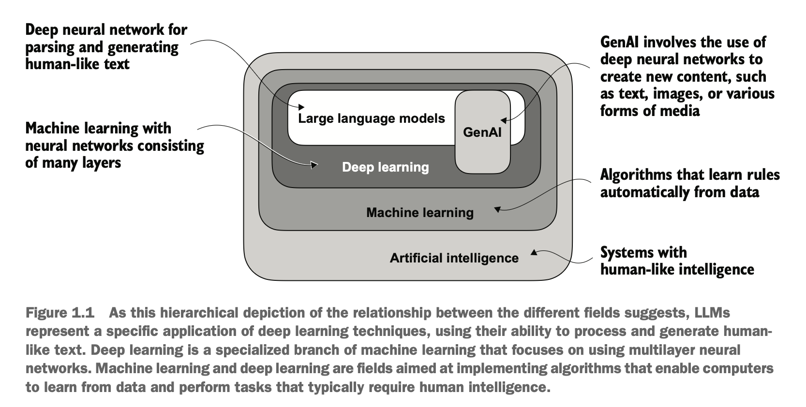
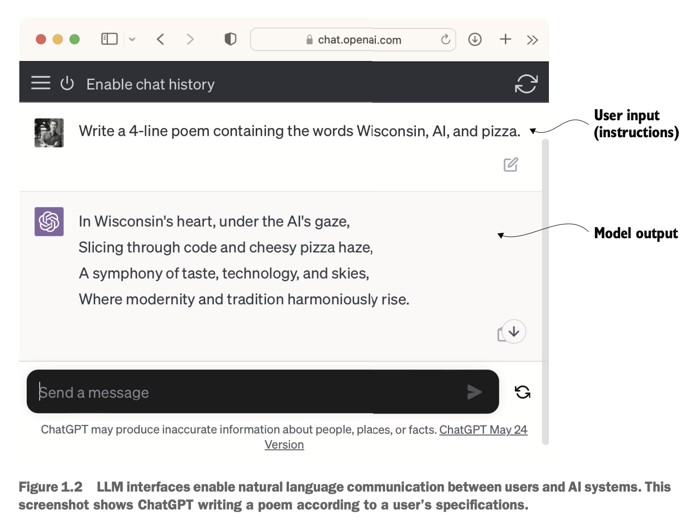
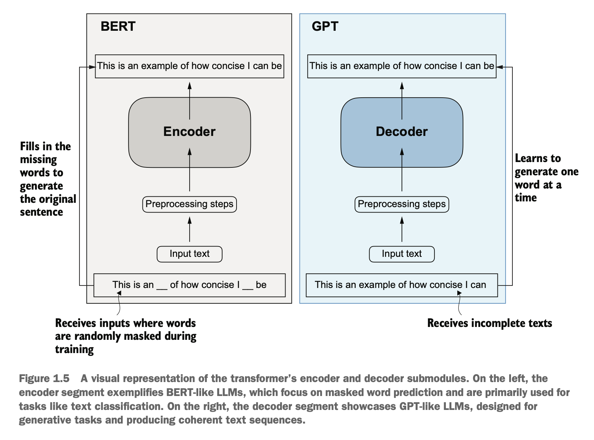
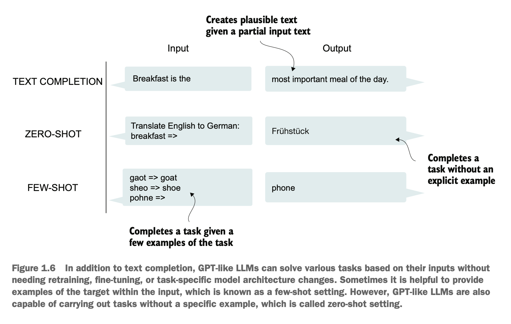
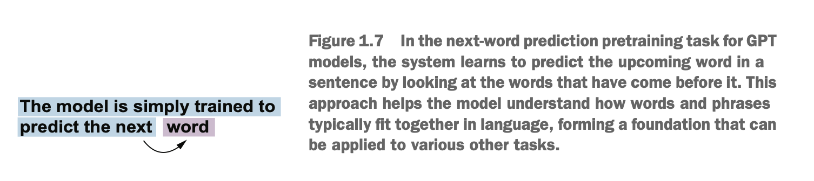

# 1 대규모 언어 모델 이해하기

## 이 장에서 다루는 내용

- 대규모 언어 모델(LLM)의 핵심 개념에 대한 고수준 설명
- LLM의 기반이 되는 트랜스포머 아키텍처에 대한 인사이트
- LLM을 처음부터 구축하는 계획

대규모 언어 모델(Large Language Models, LLM)은 OpenAI의 ChatGPT와 같은 서비스에서 제공되는 모델로, 지난 몇 년간 개발된 딥 뉴럴 네트워크 모델입니다. 이들은 자연어처리(NLP) 분야에 새로운 시대를 열었습니다. LLM이 등장하기 전까지 기존 방법들은 이메일 스팸 분류나 수작업으로 만든 규칙이나 간단한 모델로 포착할 수 있는 단순한 패턴 인식과 같은 분류 작업에서 뛰어난 성능을 보였습니다. 하지만 복잡한 이해와 생성 능력이 요구되는 언어 작업, 예를 들어 상세한 지시사항 해석, 맥락 분석 수행, 일관성 있고 맥락적으로 적절한 원본 텍스트 생성에서는 대체로 성능이 부족했습니다. 예를 들어, 이전 세대의 언어 모델들은 키워드 목록으로부터 이메일을 작성하는 것 같은 작업을 수행할 수 없었는데, 이는 현재의 LLM에게는 매우 간단한 작업입니다.

LLM은 인간 언어를 이해하고, 생성하고, 해석하는 놀라운 능력을 가지고 있습니다. 그러나 언어 모델이 "이해한다"고 할 때, 이는 인간과 같은 의식이나 이해력을 가지고 있다는 의미가 아니라 일관성 있고 맥락적으로 관련된 방식으로 텍스트를 처리하고 생성할 수 있다는 의미임을 명확히 해야 합니다.

뉴럴 네트워크에 초점을 맞춘 머신러닝과 인공지능(AI)의 부분집합인 딥러닝의 발전으로 가능해진 LLM은 방대한 양의 텍스트 데이터로 훈련됩니다. 이러한 대규모 훈련을 통해 LLM은 이전 접근 방법들에 비해 인간 언어의 더 깊은 맥락 정보와 미묘함을 포착할 수 있습니다. 그 결과, LLM은 텍스트 번역, 감정 분석, 질문 응답 등을 포함한 다양한 NLP 작업에서 성능을 크게 향상시켰습니다.

현대의 LLM과 이전 NLP 모델 간의 또 다른 중요한 차이점은 이전 NLP 모델들이 대체로 텍스트 분류, 언어 번역 등과 같은 특정 작업을 위해 설계되었다는 것입니다. 이러한 초기 NLP 모델들이 좁은 응용 분야에서 뛰어난 성능을 보였지만, LLM은 광범위한 NLP 작업에서 더 폭넓은 숙련도를 보여줍니다.

LLM의 성공은 많은 LLM의 기반이 되는 트랜스포머 아키텍처와 LLM이 훈련되는 방대한 양의 데이터에 기인할 수 있으며, 이를 통해 수작업으로 인코딩하기 어려운 다양한 언어적 뉘앙스, 맥락, 패턴을 포착할 수 있습니다.

트랜스포머 아키텍처 기반 모델을 구현하고 대규모 훈련 데이터셋을 사용하여 LLM을 훈련하는 이러한 전환은 NLP를 근본적으로 변화시켰고, 인간 언어를 이해하고 상호작용하기 위한 더 능력 있는 도구들을 제공했습니다.

다음 논의는 이 책의 주요 목적을 달성하기 위한 기초를 마련합니다: 트랜스포머 아키텍처를 기반으로 한 ChatGPT와 같은 LLM을 코드로 단계별로 구현함으로써 LLM을 이해하는 것입니다.

# 1.1 LLM이란 무엇인가?

LLM은 인간과 유사한 텍스트를 이해하고, 생성하고, 응답하도록 설계된 뉴럴 네트워크입니다. 이러한 모델들은 때로는 인터넷상에서 공개적으로 이용 가능한 전체 텍스트의 상당 부분을 포함하는 방대한 양의 텍스트 데이터로 훈련된 딥 뉴럴 네트워크입니다.

"대규모 언어 모델"에서 "대규모"는 파라미터 측면에서의 모델 크기와 훈련되는 거대한 데이터셋 모두를 의미합니다. 이와 같은 모델들은 종종 수백억 또는 수천억 개의 파라미터를 가지고 있으며, 이는 시퀀스에서 다음 단어를 예측하기 위해 훈련 중에 최적화되는 네트워크의 조정 가능한 가중치입니다. 다음 단어 예측은 언어의 고유한 순차적 특성을 활용하여 텍스트 내의 맥락, 구조, 관계를 이해하도록 모델을 훈련하기 때문에 합리적입니다. 그럼에도 불구하고 이는 매우 간단한 작업이며, 따라서 이것이 그렇게 능력 있는 모델을 만들어낼 수 있다는 것이 많은 연구자들에게 놀라운 일입니다. 후속 장에서는 다음 단어 훈련 절차에 대해 논의하고 단계별로 구현할 것입니다.

LLM은 트랜스포머라고 불리는 아키텍처를 활용하는데, 이는 예측할 때 입력의 다른 부분들에 선택적으로 주의를 기울일 수 있게 하여, 인간 언어의 뉘앙스와 복잡성을 처리하는 데 특히 뛰어나게 만듭니다.

LLM은 텍스트를 생성할 수 있기 때문에 생성형 인공지능의 한 형태로도 자주 언급되며, 생성형 AI 또는 GenAI로 줄여 부르기도 합니다. 그림 1.1에서 보여주는 바와 같이, AI는 언어 이해, 패턴 인식, 의사결정을 포함하여 인간과 유사한 지능이 필요한 작업을 수행할 수 있는 기계를 만드는 더 넓은 분야를 포괄하며, 머신러닝과 딥러닝과 같은 하위 분야들을 포함합니다.

그림 1.1 서로 다른 분야 간의 관계를 보여주는 이 계층적 묘사가 제시하는 바와 같이, LLM은 인간과 유사한 텍스트를 처리하고 생성하는 능력을 사용하여 딥러닝 기법의 특정 응용을 나타냅니다. 딥러닝은 다층 뉴럴 네트워크 사용에 초점을 맞춘 머신러닝의 전문 분야입니다. 머신러닝과 딥러닝은 컴퓨터가 데이터로부터 학습하고 일반적으로 인간 지능을 필요로 하는 작업을 수행할 수 있게 하는 알고리즘을 구현하는 것을 목표로 하는 분야들입니다.

AI를 구현하는 데 사용되는 알고리즘들은 머신러닝 분야의 초점입니다. 구체적으로, 머신러닝은 명시적으로 프로그래밍되지 않고도 데이터를 기반으로 학습하고 예측이나 결정을 내릴 수 있는 알고리즘의 개발을 포함합니다. 이를 설명하기 위해, 머신러닝의 실용적 응용으로서 스팸 필터를 상상해 보십시오. 스팸 이메일을 식별하는 규칙을 수동으로 작성하는 대신, 머신러닝 알고리즘은 스팸과 정상 이메일로 레이블된 이메일 예제들을 제공받습니다. 훈련 데이터셋에서 예측 오류를 최소화함으로써, 모델은 스팸을 나타내는 패턴과 특성을 인식하도록 학습하여 새로운 이메일을 스팸 또는 정상으로 분류할 수 있게 됩니다.

그림 1.1에서 보여주는 바와 같이, 딥러닝은 데이터의 복잡한 패턴과 추상화를 모델링하기 위해 3개 이상의 층을 가진 뉴럴 네트워크(딥 뉴럴 네트워크라고도 함)를 활용하는 데 초점을 맞춘 머신러닝의 부분집합입니다. 딥러닝과 대조적으로, 전통적인 머신러닝은 수동 특성 추출을 필요로 합니다. 이는 인간 전문가가 모델을 위한 가장 관련성 높은 특성을 식별하고 선택해야 함을 의미합니다.

AI 분야는 현재 머신러닝과 딥러닝이 지배하고 있지만, 규칙 기반 시스템, 유전 알고리즘, 전문가 시스템, 퍼지 로직, 또는 기호 추론과 같은 다른 접근 방식들도 포함합니다.

스팸 분류 예제로 돌아가면, 전통적인 머신러닝에서 인간 전문가들은 특정 트리거 단어의 빈도(예: "상금", "승리", "무료"), 느낌표의 수, 모든 대문자 단어의 사용, 또는 의심스러운 링크의 존재와 같은 이메일 텍스트에서 특성을 수동으로 추출할 수 있습니다. 이러한 전문가가 정의한 특성에 기반하여 생성된 이 데이터셋은 그 다음 모델을 훈련하는 데 사용될 것입니다. 전통적인 머신러닝과 대조적으로, 딥러닝은 수동 특성 추출을 필요로 하지 않습니다. 이는 인간 전문가가 딥러닝 모델을 위한 가장 관련성 높은 특성을 식별하고 선택할 필요가 없다는 의미입니다. (하지만 스팸 분류를 위한 전통적인 머신러닝과 딥러닝 모두 여전히 스팸 또는 비스팸과 같은 레이블의 수집이 필요하며, 이는 전문가나 사용자에 의해 수집되어야 합니다.)

오늘날 LLM이 해결할 수 있는 몇 가지 문제들, LLM이 다루는 도전과제들, 그리고 나중에 구현할 일반적인 LLM 아키텍처를 살펴보겠습니다.

# 1.2 LLM의 응용 분야

구조화되지 않은 텍스트 데이터를 파싱하고 이해하는 고급 능력으로 인해, LLM은 다양한 도메인에서 광범위한 응용을 가지고 있습니다. 오늘날 LLM은 기계 번역, 새로운 텍스트 생성(그림 1.2 참조), 감정 분석, 텍스트 요약, 그리고 많은 다른 작업에 사용됩니다. LLM은 최근 소설, 기사, 심지어 컴퓨터 코드 작성과 같은 콘텐츠 생성에 사용되고 있습니다.

그림 1.2 LLM 인터페이스는 사용자와 AI 시스템 간의 자연어 커뮤니케이션을 가능하게 합니다. 이 스크린샷은 사용자의 사양에 따라 시를 쓰는 ChatGPT를 보여줍니다.

LLM은 또한 OpenAI의 ChatGPT나 Google의 Gemini(이전에 Bard라고 불림)와 같은 정교한 챗봇과 가상 어시스턴트를 구동할 수 있으며, 이들은 사용자 질의에 답하고 Google Search나 Microsoft Bing과 같은 전통적인 검색 엔진을 보강할 수 있습니다.

더 나아가, LLM은 의학이나 법률과 같은 전문 분야에서 방대한 양의 텍스트로부터 효과적인 지식 검색에 사용될 수 있습니다. 이에는 문서 검토, 긴 문단 요약, 기술적 질문 답변이 포함됩니다.

요약하면, LLM은 텍스트 파싱과 생성을 포함하는 거의 모든 작업을 자동화하는 데 매우 가치 있습니다. 그들의 응용은 사실상 무한하며, 이러한 모델들을 사용하는 새로운 방법을 계속 혁신하고 탐구함에 따라, LLM이 기술과의 관계를 재정의하여 더 대화형이고, 직관적이고, 접근 가능하게 만들 잠재력을 가지고 있음이 분명합니다.

우리는 LLM이 어떻게 작동하는지를 기초부터 이해하는 데 초점을 맞추고, 텍스트를 생성할 수 있는 LLM을 코딩할 것입니다. 또한 LLM이 질문 답변부터 텍스트 요약, 다양한 언어로의 텍스트 번역 등에 이르는 질의를 수행할 수 있게 하는 기법들에 대해서도 배울 것입니다. 다시 말해, ChatGPT와 같은 복잡한 LLM 어시스턴트가 어떻게 작동하는지를 단계별로 구축함으로써 배울 것입니다.

# 1.3 LLM 구축 및 사용 단계

왜 우리만의 LLM을 구축해야 할까요? 기초부터 LLM을 코딩하는 것은 그 메커니즘과 한계를 이해하는 훌륭한 연습입니다. 또한, 기존 오픈소스 LLM 아키텍처를 우리만의 도메인 특화 데이터셋이나 작업에 사전 훈련하거나 파인 튜닝하는 데 필요한 지식을 갖추게 해줍니다.

참고 오늘날 대부분의 LLM은 우리가 사용할 PyTorch 딥러닝 라이브러리를 사용하여 구현됩니다. 독자들은 부록 A에서 PyTorch에 대한 포괄적인 소개를 찾을 수 있습니다.

연구에 따르면 모델링 성능에 관해서는, 특정 작업이나 도메인에 맞춰진 맞춤형 LLM들이 다양한 응용을 위해 설계된 ChatGPT와 같은 범용 LLM을 능가할 수 있습니다. 이러한 예로는 BloombergGPT(금융 전문)와 의료 질문 답변에 맞춰진 LLM들이 있습니다(자세한 내용은 부록 B 참조).

맞춤형 LLM 사용은 특히 데이터 프라이버시와 관련하여 여러 장점을 제공합니다. 예를 들어, 기업들은 기밀성 문제로 인해 OpenAI와 같은 제3자 LLM 제공업체와 민감한 데이터를 공유하는 것을 선호하지 않을 수 있습니다. 또한, 더 작은 맞춤형 LLM을 개발하면 노트북이나 스마트폰과 같은 고객 기기에 직접 배포할 수 있으며, 이는 Apple과 같은 기업들이 현재 탐구하고 있는 것입니다. 이러한 로컬 구현은 지연 시간을 크게 줄이고 서버 관련 비용을 절감할 수 있습니다. 더 나아가, 맞춤형 LLM은 개발자들에게 완전한 자율성을 부여하여 필요에 따라 모델의 업데이트와 수정을 제어할 수 있게 합니다.

LLM을 생성하는 일반적인 과정에는 사전 훈련과 파인 튜닝이 포함됩니다. "사전 훈련"에서 "사전"은 LLM과 같은 모델이 언어에 대한 광범위한 이해를 개발하기 위해 크고 다양한 데이터셋으로 훈련되는 초기 단계를 의미합니다. 이 사전 훈련된 모델은 그 다음 파인 튜닝을 통해 더욱 정제될 수 있는 기초 자원으로 사용되며, 파인 튜닝은 특정 작업이나 도메인에 더 구체적인 더 좁은 데이터셋으로 모델이 특별히 훈련되는 과정입니다. 사전 훈련과 파인 튜닝으로 구성된 이 2단계 훈련 접근법이 그림 1.3에 묘사되어 있습니다.

그림 1.3 LLM 사전 훈련은 대규모 텍스트 데이터셋에서의 다음 단어 예측을 포함합니다. 사전 훈련된 LLM은 그 다음 더 작은 레이블된 데이터셋을 사용하여 파인 튜닝될 수 있습니다.

LLM을 생성하는 첫 번째 단계는 종종 원시 텍스트라고 불리는 대규모 텍스트 데이터 코퍼스로 훈련하는 것입니다. 여기서 "원시"는 이 데이터가 레이블링 정보 없이 그냥 일반적인 텍스트라는 사실을 의미합니다. (포맷 문자 제거나 알려지지 않은 언어의 문서 제거와 같은 필터링이 적용될 수 있습니다.)

참고 머신러닝 배경을 가진 독자들은 레이블링 정보가 일반적으로 전통적인 머신러닝 모델과 관습적인 지도 학습 패러다임을 통해 훈련된 딥 뉴럴 네트워크에 필요하다는 점을 알 수 있습니다. 하지만 이는 LLM의 사전 훈련 단계에는 해당하지 않습니다. 이 단계에서 LLM은 자기 지도 학습을 사용하며, 여기서 모델은 입력 데이터로부터 자신만의 레이블을 생성합니다.

LLM의 이 첫 번째 훈련 단계는 사전 훈련으로도 알려져 있으며, 종종 베이스 또는 기초 모델이라고 불리는 초기 사전 훈련된 LLM을 생성합니다. 이러한 모델의 전형적인 예는 GPT-3 모델(ChatGPT에서 제공된 원래 모델의 전신)입니다. 이 모델은 텍스트 완성, 즉 사용자가 제공한 반쯤 작성된 문장을 완성할 수 있습니다. 또한 제한된 퓨샷 능력을 가지고 있는데, 이는 광범위한 훈련 데이터가 필요한 대신 몇 개의 예제만을 기반으로 새로운 작업을 수행하도록 학습할 수 있다는 의미입니다.

대규모 텍스트 데이터셋으로의 훈련에서 사전 훈련된 LLM을 얻은 후, 여기서 LLM은 텍스트에서 다음 단어를 예측하도록 훈련되는데, 우리는 레이블된 데이터로 LLM을 추가 훈련할 수 있으며, 이를 파인 튜닝이라고도 합니다.

LLM 파인 튜닝의 가장 인기 있는 두 범주는 지시 파인 튜닝과 분류 파인 튜닝입니다. 지시 파인 튜닝에서 레이블된 데이터셋은 올바르게 번역된 텍스트를 수반하는 텍스트 번역 질의와 같은 지시와 답변 쌍으로 구성됩니다. 분류 파인 튜닝에서 레이블된 데이터셋은 텍스트와 연관된 클래스 레이블로 구성됩니다-예를 들어, "스팸"과 "스팸 아님" 레이블과 연관된 이메일들입니다.

우리는 LLM 사전 훈련과 파인 튜닝을 위한 코드 구현을 다룰 것이며, 베이스 LLM을 사전 훈련한 후 지시와 분류 파인 튜닝의 구체적 사항을 더 깊이 탐구할 것입니다.

# 1.4 트랜스포머 아키텍처 소개

대부분의 현대 LLM은 2017년 논문 "Attention Is All You Need" (https://arxiv.org/abs/1706.03762)에서 소개된 딥 뉴럴 네트워크 아키텍처인 트랜스포머 아키텍처에 의존합니다. LLM을 이해하려면, 영어 텍스트를 독일어와 프랑스어로 번역하기 위해 개발된 원래의 트랜스포머를 이해해야 합니다. 트랜스포머 아키텍처의 간소화된 버전이 그림 1.4에 묘사되어 있습니다.

그림 1.4 언어 번역을 위한 딥러닝 모델인 원래 트랜스포머 아키텍처의 간소화된 묘사. 트랜스포머는 두 부분으로 구성됩니다: (a) 입력 텍스트를 처리하고 (b) 디코더가 번역된 텍스트를 한 번에 한 단어씩 생성하는 데 사용할 수 있는 텍스트의 임베딩 표현(다양한 차원에서 여러 다른 요소들을 포착하는 수치적 표현)을 생성하는 인코더. 이 그림은 디코더가 원래 입력 텍스트("This is an example")와 부분적으로 번역된 문장("Das ist ein")이 주어졌을 때 번역을 완성하기 위해 마지막 단어("Beispiel")만 생성하면 되는 번역 과정의 최종 단계를 보여줍니다.

트랜스포머 아키텍처는 두 개의 서브모듈로 구성됩니다: 인코더와 디코더. 인코더 모듈은 입력 텍스트를 처리하고 이를 입력의 맥락 정보를 포착하는 일련의 수치적 표현 또는 벡터로 인코딩합니다. 그 다음 디코더 모듈은 이러한 인코딩된 벡터들을 가져와서 출력 텍스트를 생성합니다. 예를 들어 번역 작업에서, 인코더는 소스 언어의 텍스트를 벡터로 인코딩하고, 디코더는 이러한 벡터들을 디코딩하여 대상 언어의 텍스트를 생성합니다. 인코더와 디코더 모두 자기 어텐션 메커니즘이라고 불리는 것으로 연결된 많은 층으로 구성됩니다. 입력이 어떻게 전처리되고 인코딩되는지에 대해 많은 질문이 있을 수 있습니다. 이들은 후속 장에서 단계별 구현으로 다뤄질 것입니다.

트랜스포머와 LLM의 핵심 구성요소는 자기 어텐션 메커니즘(도시되지 않음)이며, 이는 모델이 시퀀스에서 서로 다른 단어나 토큰들의 중요도를 상대적으로 가중치를 매길 수 있게 합니다. 이 메커니즘은 모델이 입력 데이터 내에서 장거리 종속성과 맥락적 관계를 포착할 수 있게 하여, 일관성 있고 맥락적으로 관련된 출력을 생성하는 능력을 향상시킵니다. 하지만 그 복잡성으로 인해, 우리는 3장에서 단계별로 논의하고 구현할 때까지 추가 설명을 미루겠습니다.

BERT(bidirectional encoder representations from transformers의 줄임말)와 다양한 GPT 모델들(generative pretrained transformers의 줄임말)과 같은 트랜스포머 아키텍처의 후기 변형들은 이 개념을 바탕으로 구축되어 다양한 작업에 이 아키텍처를 적응시켰습니다. 관심이 있으시면, 추가 읽을거리는 부록 B를 참조하세요.

원래 트랜스포머의 인코더 서브모듈을 기반으로 구축된 BERT는 GPT와 훈련 접근법에서 다릅니다. GPT가 생성 작업을 위해 설계된 반면, BERT와 그 변형들은 그림 1.5에서 보여주는 바와 같이 모델이 주어진 문장에서 마스크되거나 숨겨진 단어들을 예측하는 마스크된 단어 예측을 전문으로 합니다. 이 독특한 훈련 전략은 BERT에게 감정 예측과 문서 분류를 포함한 텍스트 분류 작업에서의 강점을 갖추게 합니다. 그 능력의 응용으로서, 이 글을 쓰는 시점에서 X(이전의 트위터)는 독성 콘텐츠를 탐지하기 위해 BERT를 사용합니다.

그림 1.5 트랜스포머의 인코더와 디코더 서브모듈의 시각적 표현. 왼쪽의 인코더 세그먼트는 마스크된 단어 예측에 초점을 맞추고 텍스트 분류와 같은 작업에 주로 사용되는 BERT와 유사한 LLM을 예시합니다. 오른쪽의 디코더 세그먼트는 생성 작업을 위해 설계되고 일관된 텍스트 시퀀스를 생성하는 GPT와 유사한 LLM을 보여줍니다.

반면에 GPT는 원래 트랜스포머 아키텍처의 디코더 부분에 초점을 맞추고 텍스트 생성을 필요로 하는 작업을 위해 설계되었습니다. 이에는 기계 번역, 텍스트 요약, 소설 쓰기, 컴퓨터 코드 작성 등이 포함됩니다.

주로 텍스트 완성 작업을 수행하도록 설계되고 훈련된 GPT 모델들도 그들의 능력에서 놀라운 다재다능함을 보여줍니다. 이러한 모델들은 제로샷과 퓨샷 학습 작업 모두를 수행하는 데 뛰어납니다. 제로샷 학습은 이전의 구체적인 예제 없이 완전히 보지 못한 작업에 대해 일반화하는 능력을 의미합니다. 반면에, 퓨샷 학습은 그림 1.6에서 보여주는 바와 같이 사용자가 입력으로 제공하는 최소한의 수의 예제로부터 학습하는 것을 포함합니다.

그림 1.6 텍스트 완성에 추가하여, GPT와 유사한 LLM들은 재훈련, 파인 튜닝, 또는 작업별 모델 아키텍처 변경이 필요 없이 입력에 기반하여 다양한 작업을 해결할 수 있습니다. 때로는 입력 내에 대상의 예제를 제공하는 것이 도움이 되는데, 이를 퓨샷 설정이라고 합니다. 하지만 GPT와 유사한 LLM들은 특정 예제 없이도 작업을 수행할 수 있는데, 이를 제로샷 설정이라고 합니다.

오늘날의 LLM들은 트랜스포머 아키텍처를 기반으로 합니다. 따라서 트랜스포머와 LLM은 문헌에서 종종 동의어로 사용되는 용어입니다. 하지만 트랜스포머는 컴퓨터 비전에도 사용될 수 있기 때문에 모든 트랜스포머가 LLM은 아니라는 점을 주목하세요. 또한, 순환적이고 합성곱 아키텍처를 기반으로 한 LLM들도 있기 때문에 모든 LLM이 트랜스포머는 아닙니다. 이러한 대안적 접근법들 뒤의 주된 동기는 LLM의 계산 효율성을 향상시키는 것입니다. 이러한 대안적 LLM 아키텍처들이 트랜스포머 기반 LLM의 능력과 경쟁할 수 있는지, 그리고 그들이 실제로 채택될 것인지는 지켜봐야 할 일입니다. 간단함을 위해, 저는 GPT와 유사한 트랜스포머 기반 LLM을 지칭하기 위해 "LLM"이라는 용어를 사용합니다. (이러한 아키텍처를 설명하는 문헌 참조에 관심이 있는 독자들은 부록 B를 찾을 수 있습니다.)

# 1.5 대규모 데이터셋 활용

인기 있는 GPT와 BERT 유사 모델들을 위한 대규모 훈련 데이터셋은 자연어와 컴퓨터 언어의 방대한 주제 배열을 포함하는 수십억 단어를 포괄하는 다양하고 포괄적인 텍스트 코퍼스를 나타냅니다. 구체적인 예를 제공하기 위해, 표 1.1은 ChatGPT의 첫 번째 버전의 기초 모델로 사용된 GPT-3 사전 훈련에 사용된 데이터셋을 요약합니다.

표 1.1 인기 있는 GPT-3 LLM의 사전 훈련 데이터셋

| 데이터셋 이름 | 데이터셋   설명 | 토큰   수 | 훈련 데이터에서의   비율 |
| :-- | :-- | :-- | :-- |
| CommonCrawl   (필터링됨) | 웹 크롤링 데이터 | 4,100억 | $60\%$ |
| WebText2 | 웹 크롤링 데이터 | 190억 | $22\%$ |
| Books1 | 인터넷 기반 도서   코퍼스 | 120억 | $8\%$ |
| Books2 | 인터넷 기반 도서   코퍼스 | 550억 | $8\%$ |
| Wikipedia | 고품질 텍스트 | 30억 | $3\%$ |

표 1.1은 토큰의 수를 보고하는데, 토큰은 모델이 읽는 텍스트의 단위이며 데이터셋에서 토큰의 수는 텍스트의 단어와 구두점 문자의 수와 대략 동일합니다. 2장에서는 텍스트를 토큰으로 변환하는 과정인 토큰화를 다룹니다.

주된 시사점은 이 훈련 데이터셋의 규모와 다양성이 이러한 모델들이 일반 지식을 필요로 하는 일부를 포함하여 언어 구문, 의미, 맥락을 포함한 다양한 작업에서 잘 수행할 수 있게 한다는 것입니다.

# GPT-3 데이터셋 세부사항

표 1.1은 GPT-3에 사용된 데이터셋을 보여줍니다. 표의 비율 열은 반올림 오차를 조정하여 샘플링된 데이터의 $100\%$에 합산됩니다. 토큰 수 열의 부분집합이 총 4,990억에 이르지만, 모델은 3,000억 토큰에만 훈련되었습니다. GPT-3 논문의 저자들은 왜 모델이 모든 4,990억 토큰에 훈련되지 않았는지 명시하지 않았습니다.

맥락을 위해, 단독으로 4,100억 토큰으로 구성되고 약 570GB의 저장 공간을 필요로 하는 CommonCrawl 데이터셋의 크기를 고려해 보세요. 비교하면, Meta의 LLaMA와 같은 GPT-3의 후기 버전들은 Arxiv 연구 논문(92GB)과 StackExchange의 코드 관련 Q&A(78GB)와 같은 추가 데이터 소스를 포함하도록 훈련 범위를 확장했습니다.

GPT-3 논문의 저자들은 훈련 데이터셋을 공유하지 않았지만, 공개적으로 이용 가능한 비교 가능한 데이터셋은 Soldaini et al. 2024의 Dolma: An Open Corpus of Three Trillion Tokens for LLM Pretraining Research (https://arxiv.org/abs/2402.00159)입니다. 하지만 이 컬렉션은 저작권이 있는 작품을 포함할 수 있으며, 정확한 사용 조건은 의도된 사용 사례와 국가에 따라 달라질 수 있습니다.

이러한 모델들의 사전 훈련된 특성은 그들을 하위 작업에 대한 추가 파인 튜닝에 매우 다재다능하게 만들며, 이것이 그들이 베이스 또는 기초 모델로도 알려져 있는 이유입니다. LLM 사전 훈련은 상당한 자원에 대한 접근을 필요로 하고 매우 비쌉니다. 예를 들어, GPT-3 사전 훈련 비용은 클라우드 컴퓨팅 크레딧으로 460만 달러로 추정됩니다 (https://mng.bz/VxEW).

좋은 소식은 오픈소스 모델로 이용 가능한 많은 사전 훈련된 LLM들이 훈련 데이터의 일부가 아니었던 텍스트를 작성, 추출, 편집하는 범용 도구로 사용될 수 있다는 것입니다. 또한, LLM들은 상대적으로 작은 데이터셋으로 특정 작업에 파인 튜닝될 수 있어서, 필요한 계산 자원을 줄이고 성능을 향상시킵니다.

우리는 사전 훈련을 위한 코드를 구현하고 이를 교육적 목적으로 LLM을 사전 훈련하는 데 사용할 것입니다. 모든 계산은 소비자용 하드웨어에서 실행 가능합니다. 사전 훈련 코드를 구현한 후, 우리는 공개적으로 이용 가능한 모델 가중치를 재사용하고 이를 우리가 구현할 아키텍처에 로드하는 방법을 배워서, LLM을 파인 튜닝할 때 비싼 사전 훈련 단계를 건너뛸 수 있게 할 것입니다.

# 1.6 GPT 아키텍처 자세히 살펴보기

GPT는 원래 OpenAI의 Radford et al.에 의한 논문 "Improving Language Understanding by Generative Pre-Training" (https://mng.bz/x2gg)에서 소개되었습니다. GPT-3는 더 많은 파라미터를 가지고 더 큰 데이터셋으로 훈련된 이 모델의 확대된 버전입니다. 추가로, ChatGPT에서 제공된 원래 모델은 OpenAI의 InstructGPT 논문 (https://arxiv.org/abs/2203.02155)의 방법을 사용하여 대규모 지시 데이터셋으로 GPT-3를 파인 튜닝함으로써 생성되었습니다. 그림 1.6에서 보여주는 바와 같이, 이러한 모델들은 유능한 텍스트 완성 모델이며 철자 교정, 분류, 또는 언어 번역과 같은 다른 작업들을 수행할 수 있습니다. 이는 GPT 모델들이 그림 1.7에 묘사된 바와 같이 상대적으로 간단한 다음 단어 예측 작업으로 사전 훈련되었다는 점을 고려하면 실제로 매우 놀라운 일입니다.

# 모델은 단순히 다음 단어를 예측하도록 훈련됩니다

그림 1.7 GPT 모델의 다음 단어 예측 사전 훈련 작업에서, 시스템은 그 이전에 온 단어들을 보고 문장의 다음 단어를 예측하도록 학습합니다. 이 접근법은 모델이 단어와 구문이 언어에서 일반적으로 어떻게 함께 맞춰지는지 이해하도록 도와주며, 다양한 다른 작업에 적용될 수 있는 기초를 형성합니다.

다음 단어 예측 작업은 자기 레이블링의 한 형태인 자기 지도 학습의 한 형태입니다. 이는 훈련 데이터를 위한 레이블을 명시적으로 수집할 필요가 없고 데이터 자체의 구조를 사용할 수 있다는 의미입니다: 문장이나 문서의 다음 단어를 모델이 예측해야 하는 레이블로 사용할 수 있습니다. 이 다음 단어 예측 작업이 "즉석에서" 레이블을 생성할 수 있게 하므로, LLM을 훈련하기 위해 방대한 레이블되지 않은 텍스트 데이터셋을 사용하는 것이 가능합니다.

섹션 1.4에서 다룬 원래 트랜스포머 아키텍처와 비교했을 때, 일반적인 GPT 아키텍처는 상대적으로 간단합니다. 본질적으로, 이는 인코더 없이 디코더 부분만 있는 것입니다(그림 1.8). GPT와 같은 디코더 스타일 모델들이 한 번에 한 단어씩 텍스트를 예측함으로써 텍스트를 생성하므로, 그들은 자기회귀 모델의 한 유형으로 간주됩니다. 자기회귀 모델들은 미래 예측을 위한 입력으로 이전 출력들을 포함합니다. 결과적으로, GPT에서 각각의 새로운 단어는 그것을 앞서는 시퀀스에 기반하여 선택되며, 이는 결과 텍스트의 일관성을 향상시킵니다.

GPT-3과 같은 아키텍처들은 또한 원래 트랜스포머 모델보다 훨씬 큽니다. 예를 들어, 원래 트랜스포머는 인코더와 디코더 블록을 6번 반복했습니다. GPT-3는 96개의 트랜스포머 레이어와 총 1,750억 개의 파라미터를 가지고 있습니다.

그림 1.8 GPT 아키텍처는 원래 트랜스포머의 디코더 부분만을 사용합니다. 이는 단방향, 왼쪽에서 오른쪽 처리를 위해 설계되어 한 번에 한 단어씩 반복적인 방식으로 텍스트를 생성하는 텍스트 생성과 다음 단어 예측 작업에 잘 적합하게 만듭니다.

GPT-3는 2020년에 소개되었는데, 딥러닝과 대규모 언어 모델 개발의 기준으로는 오래전으로 여겨집니다. 하지만 Meta의 Llama 모델과 같은 더 최근의 아키텍처들은 여전히 동일한 기본 개념을 기반으로 하며, 미미한 수정만을 도입하고 있습니다. 따라서 GPT 이해는 그 어느 때보다 관련성이 있으므로, 저는 대안적인 LLM들이 사용하는 구체적인 조정들에 대한 지침을 제공하면서 GPT 뒤의 주요한 아키텍처를 구현하는 데 초점을 맞춥니다.

인코더와 디코더 블록으로 구성된 원래 트랜스포머 모델이 언어 번역을 위해 명시적으로 설계되었음에도 불구하고, GPT 모델들은 다음 단어 예측을 목표로 한 더 크지만 더 간단한 디코더 전용 아키텍처임에도 불구하고 번역 작업을 수행할 수 있습니다. 이 능력은 번역을 구체적으로 대상으로 하지 않은 작업인 다음 단어 예측 작업으로 주로 훈련된 모델에서 나타났기 때문에 연구자들에게는 처음에 예상치 못한 일이었습니다.

모델이 명시적으로 훈련받지 않은 작업들을 수행하는 능력을 창발적 행동이라고 합니다. 이 능력은 훈련 중에 명시적으로 가르쳐지지 않지만 모델이 다양한 맥락에서 방대한 양의 다국어 데이터에 노출된 자연스러운 결과로 나타납니다. GPT 모델들이 번역을 위해 구체적으로 훈련받지 않았음에도 불구하고 언어 간의 번역 패턴을 "학습"하고 번역 작업을 수행할 수 있다는 사실은 이러한 대규모, 생성형 언어 모델들의 이점과 능력을 보여줍니다. 우리는 각각을 위한 다양한 모델을 사용하지 않고도 다양한 작업을 수행할 수 있습니다.

# 1.7 대규모 언어 모델 구축하기

이제 LLM을 이해하기 위한 기초를 마련했으므로, 처음부터 하나를 코딩해 보겠습니다. 우리는 GPT 뒤의 기본 아이디어를 청사진으로 삼고 그림 1.9에서 설명된 바와 같이 세 단계로 이를 다룰 것입니다.

그림 1.9 LLM을 코딩하는 세 가지 주요 단계는 LLM 아키텍처와 데이터 준비 과정 구현(1단계), 기초 모델을 생성하기 위한 LLM 사전 훈련(2단계), 그리고 개인 어시스턴트나 텍스트 분류기가 되도록 기초 모델을 파인 튜닝하는 것(3단계)입니다.

1단계에서, 우리는 기본적인 데이터 전처리 단계에 대해 배우고 모든 LLM의 중심에 있는 어텐션 메커니즘을 코딩할 것입니다. 다음으로, 2단계에서 우리는 새로운 텍스트를 생성할 수 있는 GPT와 유사한 LLM을 코딩하고 사전 훈련하는 방법을 배울 것입니다. 우리는 또한 능력 있는 NLP 시스템을 개발하는 데 필수적인 LLM 평가의 기초에 대해 살펴볼 것입니다.

처음부터 LLM을 사전 훈련하는 것은 GPT와 유사한 모델에 대해 수천에서 수백만 달러의 컴퓨팅 비용을 요구하는 상당한 노력입니다. 따라서 2단계의 초점은 작은 데이터셋을 사용하여 교육적 목적을 위한 훈련을 구현하는 것입니다. 추가로, 저는 공개적으로 이용 가능한 모델 가중치를 로드하는 코드 예제들도 제공합니다.

마지막으로, 3단계에서 우리는 사전 훈련된 LLM을 가져와서 질의 응답이나 텍스트 분류와 같은 지시를 따르도록 파인 튜닝할 것이며, 이는 많은 실제 응용과 연구에서 가장 일반적인 작업입니다.

이 흥미진진한 여정에 착수하기를 기대하고 있기를 바랍니다!

# 요약

- LLM은 이전에 주로 명시적 규칙 기반 시스템과 더 간단한 통계적 방법에 의존했던 자연어처리 분야를 변화시켰습니다. LLM의 등장은 인간 언어를 이해하고, 생성하고, 번역하는 데 있어서 진전으로 이어진 새로운 딥러닝 주도 접근법들을 도입했습니다.
- 현대 LLM들은 두 가지 주요 단계로 훈련됩니다:
  - 먼저, 문장에서 다음 단어 예측을 레이블로 사용하여 레이블되지 않은 텍스트의 대규모 코퍼스에서 사전 훈련됩니다.
  - 그 다음, 지시를 따르거나 분류 작업을 수행하기 위해 더 작고 레이블된 목표 데이터셋에서 파인 튜닝됩니다.
- LLM들은 트랜스포머 아키텍처를 기반으로 합니다. 트랜스포머 아키텍처의 핵심 아이디어는 한 번에 한 단어씩 출력을 생성할 때 전체 입력 시퀀스에 대한 선택적 접근을 LLM에게 제공하는 어텐션 메커니즘입니다.

- 원래 트랜스포머 아키텍처는 텍스트를 파싱하는 인코더와 텍스트를 생성하는 디코더로 구성됩니다.
- GPT-3와 ChatGPT와 같이 텍스트를 생성하고 지시를 따르는 LLM들은 아키텍처를 간소화하여 디코더 모듈만을 구현합니다.
- 수십억 단어로 구성된 대규모 데이터셋은 LLM 사전 훈련에 필수적입니다.
- GPT와 유사한 모델들의 일반적인 사전 훈련 작업이 문장에서 다음 단어를 예측하는 것이지만, 이러한 LLM들은 텍스트를 분류하고, 번역하고, 요약하는 능력과 같은 창발적 특성을 보입니다.
- LLM이 사전 훈련되면, 결과적인 기초 모델은 다양한 하위 작업에 대해 더 효율적으로 파인 튜닝될 수 있습니다.
- 맞춤 데이터셋으로 파인 튜닝된 LLM들은 특정 작업에서 범용 LLM들을 능가할 수 있습니다.