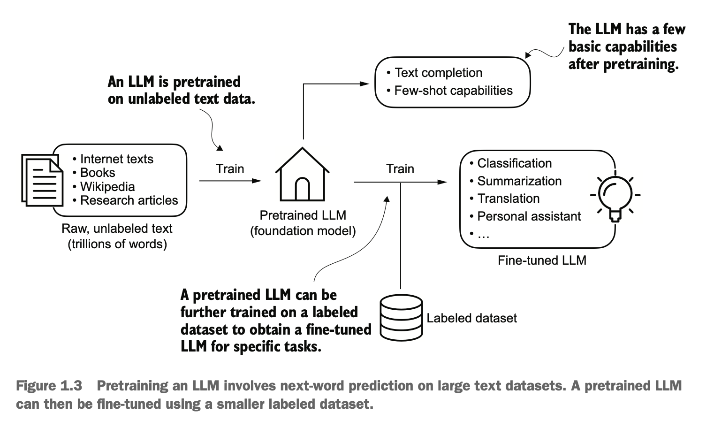
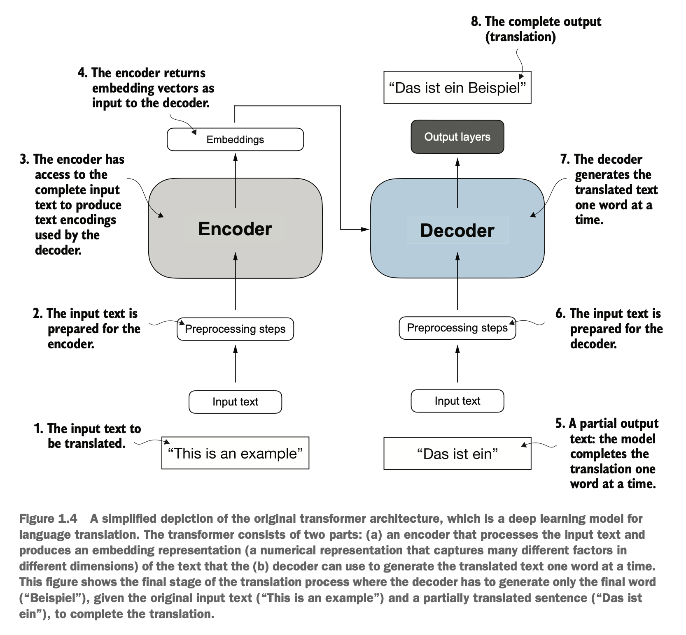
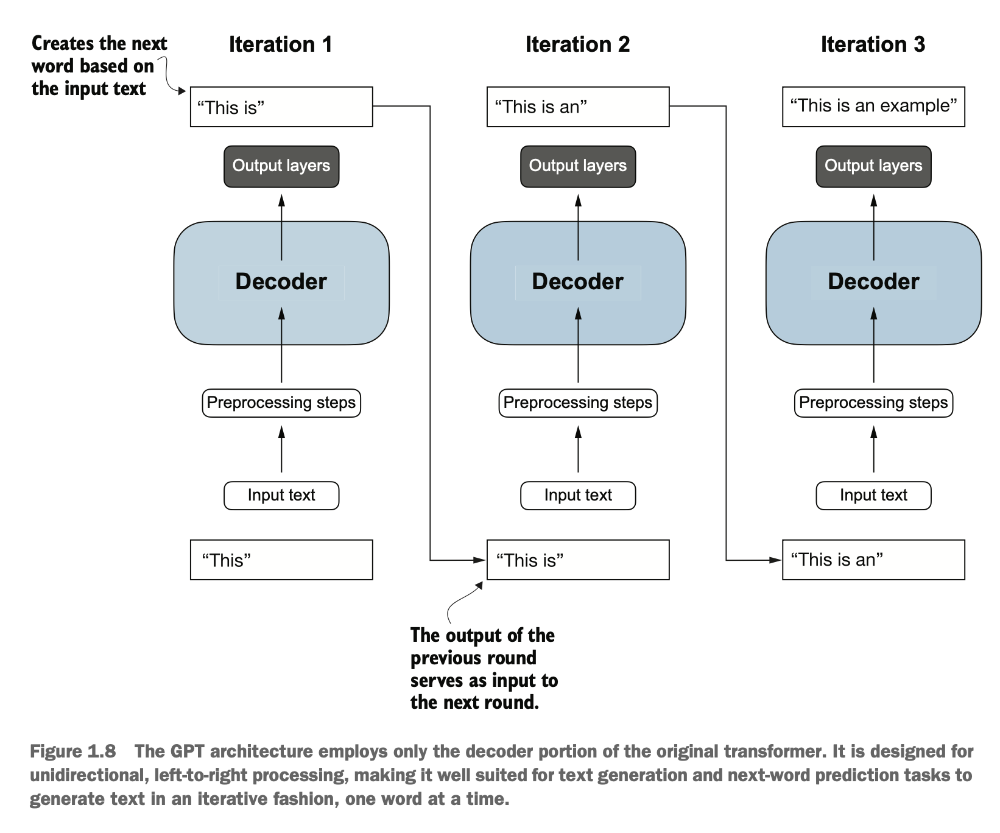

# 1 Understanding large language models 

## This chapter covers

- High-level explanations of the fundamental concepts behind large language models (LLMs)
- Insights into the transformer architecture from which LLMs are derived
- A plan for building an LLM from scratch

Large language models (LLMs), such as those offered in OpenAI's ChatGPT, are deep neural network models that have been developed over the past few years. They ushered in a new era for natural language processing (NLP). Before the advent of LLMs, traditional methods excelled at categorization tasks such as email spam classification and straightforward pattern recognition that could be captured with handcrafted rules or simpler models. However, they typically underperformed in language tasks that demanded complex understanding and generation abilities, such as parsing detailed instructions, conducting contextual analysis, and creating coherent and contextually appropriate original text. For example, previous generations of language models could not write an email from a list of keywords-a task that is trivial for contemporary LLMs.

LLMs have remarkable capabilities to understand, generate, and interpret human language. However, it's important to clarify that when we say language models "understand," we mean that they can process and generate text in ways that appear coherent and contextually relevant, not that they possess human-like consciousness or comprehension.

Enabled by advancements in deep learning, which is a subset of machine learning and artificial intelligence (AI) focused on neural networks, LLMs are trained on vast quantities of text data. This large-scale training allows LLMs to capture deeper contextual information and subtleties of human language compared to previous approaches. As a result, LLMs have significantly improved performance in a wide range of NLP tasks, including text translation, sentiment analysis, question answering, and many more.

Another important distinction between contemporary LLMs and earlier NLP models is that earlier NLP models were typically designed for specific tasks, such as text categorization, language translation, etc. While those earlier NLP models excelled in their narrow applications, LLMs demonstrate a broader proficiency across a wide range of NLP tasks.

The success behind LLMs can be attributed to the transformer architecture that underpins many LLMs and the vast amounts of data on which LLMs are trained, allowing them to capture a wide variety of linguistic nuances, contexts, and patterns that would be challenging to encode manually.

This shift toward implementing models based on the transformer architecture and using large training datasets to train LLMs has fundamentally transformed NLP, providing more capable tools for understanding and interacting with human language.

The following discussion sets a foundation to accomplish the primary objective of this book: understanding LLMs by implementing a ChatGPT-like LLM based on the transformer architecture step by step in code.

# 1.1 What is an LLM? 

An LLM is a neural network designed to understand, generate, and respond to human-like text. These models are deep neural networks trained on massive amounts of text data, sometimes encompassing large portions of the entire publicly available text on the internet.

The "large" in "large language model" refers to both the model's size in terms of parameters and the immense dataset on which it's trained. Models like this often have tens or even hundreds of billions of parameters, which are the adjustable weights in the network that are optimized during training to predict the next word in a sequence. Next-word prediction is sensible because it harnesses the inherent sequential nature of language to train models on understanding context, structure, and relationships within text. Yet, it is a very simple task, and so it is surprising to many researchers that it can produce such capable models. In later chapters, we will discuss and implement the next-word training procedure step by step.

LLMs utilize an architecture called the transformer, which allows them to pay selective attention to different parts of the input when making predictions, making them especially adept at handling the nuances and complexities of human language.

Since LLMs are capable of generating text, LLMs are also often referred to as a form of generative artificial intelligence, often abbreviated as generative AI or GenAI. As illustrated in figure 1.1, AI encompasses the broader field of creating machines that can perform tasks requiring humanlike intelligence, including understanding language, recognizing patterns, and making decisions, and includes subfields like machine learning and deep learning.

Figure 1.1 As this hierarchical depiction of the relationship between the different fields suggests, LLMs represent a specific application of deep learning techniques, using their ability to process and generate human-like text. Deep learning is a specialized branch of machine learning that focuses on using multilayer neural networks. Machine learning and deep learning are fields aimed at implementing algorithms that enable computers to learn from data and perform tasks that typically require human intelligence.

The algorithms used to implement AI are the focus of the field of machine learning. Specifically, machine learning involves the development of algorithms that can learn from and make predictions or decisions based on data without being explicitly programmed. To illustrate this, imagine a spam filter as a practical application of machine learning. Instead of manually writing rules to identify spam emails, a machine learning algorithm is fed examples of emails labeled as spam and legitimate emails. By minimizing the error in its predictions on a training dataset, the model then learns to recognize patterns and characteristics indicative of spam, enabling it to classify new emails as either spam or not spam.

As illustrated in figure 1.1, deep learning is a subset of machine learning that focuses on utilizing neural networks with three or more layers (also called deep neural networks) to model complex patterns and abstractions in data. In contrast to deep learning, traditional machine learning requires manual feature extraction. This means that human experts need to identify and select the most relevant features for the model.

While the field of AI is now dominated by machine learning and deep learning, it also includes other approaches-for example, using rule-based systems, genetic algorithms, expert systems, fuzzy logic, or symbolic reasoning.

Returning to the spam classification example, in traditional machine learning, human experts might manually extract features from email text such as the frequency of certain trigger words (for example, "prize," "win," "free"), the number of exclamation marks, use of all uppercase words, or the presence of suspicious links. This dataset, created based on these expert-defined features, would then be used to train the model. In contrast to traditional machine learning, deep learning does not require manual feature extraction. This means that human experts do not need to identify and select the most relevant features for a deep learning model. (However, both traditional machine learning and deep learning for spam classification still require the collection of labels, such as spam or non-spam, which need to be gathered either by an expert or users.)

Let's look at some of the problems LLMs can solve today, the challenges that LLMs address, and the general LLM architecture we will implement later.

# 1.2 Applications of LLMs 

Owing to their advanced capabilities to parse and understand unstructured text data, LLMs have a broad range of applications across various domains. Today, LLMs are employed for machine translation, generation of novel texts (see figure 1.2), sentiment analysis, text summarization, and many other tasks. LLMs have recently been used for content creation, such as writing fiction, articles, and even computer code.

Figure 1.2 LLM interfaces enable natural language communication between users and AI systems. This screenshot shows ChatGPT writing a poem according to a user's specifications.

LLMs can also power sophisticated chatbots and virtual assistants, such as OpenAI's ChatGPT or Google's Gemini (formerly called Bard), which can answer user queries and augment traditional search engines such as Google Search or Microsoft Bing.

Moreover, LLMs may be used for effective knowledge retrieval from vast volumes of text in specialized areas such as medicine or law. This includes sifting through documents, summarizing lengthy passages, and answering technical questions.

In short, LLMs are invaluable for automating almost any task that involves parsing and generating text. Their applications are virtually endless, and as we continue to innovate and explore new ways to use these models, it's clear that LLMs have the potential to redefine our relationship with technology, making it more conversational, intuitive, and accessible.

We will focus on understanding how LLMs work from the ground up, coding an LLM that can generate texts. You will also learn about techniques that allow LLMs to carry out queries, ranging from answering questions to summarizing text, translating text into different languages, and more. In other words, you will learn how complex LLM assistants such as ChatGPT work by building one step by step.

# 1.3 Stages of building and using LLMs 

Why should we build our own LLMs? Coding an LLM from the ground up is an excellent exercise to understand its mechanics and limitations. Also, it equips us with the required knowledge for pretraining or fine-tuning existing open source LLM architectures to our own domain-specific datasets or tasks.

NOTE Most LLMs today are implemented using the PyTorch deep learning library, which is what we will use. Readers can find a comprehensive introduction to PyTorch in appendix A.

Research has shown that when it comes to modeling performance, custom-built LLMs-those tailored for specific tasks or domains-can outperform general-purpose LLMs, such as those provided by ChatGPT, which are designed for a wide array of applications. Examples of these include BloombergGPT (specialized for finance) and LLMs tailored for medical question answering (see appendix B for more details).

Using custom-built LLMs offers several advantages, particularly regarding data privacy. For instance, companies may prefer not to share sensitive data with third-party LLM providers like OpenAI due to confidentiality concerns. Additionally, developing smaller custom LLMs enables deployment directly on customer devices, such as laptops and smartphones, which is something companies like Apple are currently exploring. This local implementation can significantly decrease latency and reduce server-related costs. Furthermore, custom LLMs grant developers complete autonomy, allowing them to control updates and modifications to the model as needed.

The general process of creating an LLM includes pretraining and fine-tuning. The "pre" in "pretraining" refers to the initial phase where a model like an LLM is trained on a large, diverse dataset to develop a broad understanding of language. This pretrained model then serves as a foundational resource that can be further refined through fine-tuning, a process where the model is specifically trained on a narrower dataset that is more specific to particular tasks or domains. This two-stage training approach consisting of pretraining and fine-tuning is depicted in figure 1.3.

Figure 1.3 Pretraining an LLM involves next-word prediction on large text datasets. A pretrained LLM can then be fine-tuned using a smaller labeled dataset.

The first step in creating an LLM is to train it on a large corpus of text data, sometimes referred to as raw text. Here, "raw" refers to the fact that this data is just regular text without any labeling information. (Filtering may be applied, such as removing formatting characters or documents in unknown languages.)

NOTE Readers with a background in machine learning may note that labeling information is typically required for traditional machine learning models and deep neural networks trained via the conventional supervised learning paradigm. However, this is not the case for the pretraining stage of LLMs. In this phase, LLMs use self-supervised learning, where the model generates its own labels from the input data.

This first training stage of an LLM is also known as pretraining, creating an initial pretrained LLM, often called a base or foundation model. A typical example of such a model is the GPT-3 model (the precursor of the original model offered in ChatGPT). This model is capable of text completion-that is, finishing a half-written sentence provided by a user. It also has limited few-shot capabilities, which means it can learn to perform new tasks based on only a few examples instead of needing extensive training data.

After obtaining a pretrained LLM from training on large text datasets, where the LLM is trained to predict the next word in the text, we can further train the LLM on labeled data, also known as fine-tuning.

The two most popular categories of fine-tuning LLMs are instruction fine-tuning and classification fine-tuning. In instruction fine-tuning, the labeled dataset consists of instruction and answer pairs, such as a query to translate a text accompanied by the correctly translated text. In classification fine-tuning, the labeled dataset consists of texts and associated class labels-for example, emails associated with "spam" and "not spam" labels.

We will cover code implementations for pretraining and fine-tuning an LLM, and we will delve deeper into the specifics of both instruction and classification fine-tuning after pretraining a base LLM.

# 1.4 Introducing the transformer architecture 

Most modern LLMs rely on the transformer architecture, which is a deep neural network architecture introduced in the 2017 paper "Attention Is All You Need" (https://arxiv.org/abs/1706.03762). To understand LLMs, we must understand the original transformer, which was developed for machine translation, translating English texts to German and French. A simplified version of the transformer architecture is depicted in figure 1.4.

Figure 1.4 A simplified depiction of the original transformer architecture, which is a deep learning model for language translation. The transformer consists of two parts: (a) an encoder that processes the input text and produces an embedding representation (a numerical representation that captures many different factors in different dimensions) of the text that the (b) decoder can use to generate the translated text one word at a time. This figure shows the final stage of the translation process where the decoder has to generate only the final word ("Beispiel"), given the original input text ("This is an example") and a partially translated sentence ("Das ist ein"), to complete the translation.

The transformer architecture consists of two submodules: an encoder and a decoder. The encoder module processes the input text and encodes it into a series of numerical representations or vectors that capture the contextual information of the input. Then, the decoder module takes these encoded vectors and generates the output text. In a translation task, for example, the encoder would encode the text from the source language into vectors, and the decoder would decode these vectors to generate text in the target language. Both the encoder and decoder consist of many layers connected by a so-called self-attention mechanism. You may have many questions regarding how the inputs are preprocessed and encoded. These will be addressed in a step-by-step implementation in subsequent chapters.

A key component of transformers and LLMs is the self-attention mechanism (not shown), which allows the model to weigh the importance of different words or tokens in a sequence relative to each other. This mechanism enables the model to capture long-range dependencies and contextual relationships within the input data, enhancing its ability to generate coherent and contextually relevant output. However, due to its complexity, we will defer further explanation to chapter 3, where we will discuss and implement it step by step.

Later variants of the transformer architecture, such as BERT (short for bidirectional encoder representations from transformers) and the various GPT models (short for generative pretrained transformers), built on this concept to adapt this architecture for different tasks. If interested, refer to appendix B for further reading suggestions.

BERT, which is built upon the original transformer's encoder submodule, differs in its training approach from GPT. While GPT is designed for generative tasks, BERT and its variants specialize in masked word prediction, where the model predicts masked or hidden words in a given sentence, as shown in figure 1.5. This unique training strategy equips BERT with strengths in text classification tasks, including sentiment prediction and document categorization. As an application of its capabilities, as of this writing, $X$ (formerly Twitter) uses BERT to detect toxic content.

Figure 1.5 A visual representation of the transformer's encoder and decoder submodules. On the left, the encoder segment exemplifies BERT-like LLMs, which focus on masked word prediction and are primarily used for tasks like text classification. On the right, the decoder segment showcases GPT-like LLMs, designed for generative tasks and producing coherent text sequences.

GPT, on the other hand, focuses on the decoder portion of the original transformer architecture and is designed for tasks that require generating texts. This includes machine translation, text summarization, fiction writing, writing computer code, and more.

GPT models, primarily designed and trained to perform text completion tasks, also show remarkable versatility in their capabilities. These models are adept at executing both zero-shot and few-shot learning tasks. Zero-shot learning refers to the ability to generalize to completely unseen tasks without any prior specific examples. On the other hand, few-shot learning involves learning from a minimal number of examples the user provides as input, as shown in figure 1.6.

Figure 1.6 In addition to text completion, GPT-like LLMs can solve various tasks based on their inputs without needing retraining, fine-tuning, or task-specific model architecture changes. Sometimes it is helpful to provide examples of the target within the input, which is known as a few-shot setting. However, GPT-like LLMs are also capable of carrying out tasks without a specific example, which is called zero-shot setting.

Today's LLMs are based on the transformer architecture. Hence, transformers and LLMs are terms that are often used synonymously in the literature. However, note that not all transformers are LLMs since transformers can also be used for computer vision. Also, not all LLMs are transformers, as there are LLMs based on recurrent and convolutional architectures. The main motivation behind these alternative approaches is to improve the computational efficiency of LLMs. Whether these alternative LLM architectures can compete with the capabilities of transformer-based LLMs and whether they are going to be adopted in practice remains to be seen. For simplicity, I use the term "LLM" to refer to transformer-based LLMs similar to GPT. (Interested readers can find literature references describing these architectures in appendix B.)

# 1.5 Utilizing large datasets 

The large training datasets for popular GPT- and BERT-like models represent diverse and comprehensive text corpora encompassing billions of words, which include a vast array of topics and natural and computer languages. To provide a concrete example, table 1.1 summarizes the dataset used for pretraining GPT-3, which served as the base model for the first version of ChatGPT.

Table 1.1 The pretraining dataset of the popular GPT-3 LLM

| Dataset name | Dataset   description | Number of   tokens | Proportion in   training data |
| :-- | :-- | :-- | :-- |
| CommonCrawl   (filtered) | Web crawl data | 410 billion | $60 \%$ |
| WebText2 | Web crawl data | 19 billion | $22 \%$ |
| Books1 | Internet-based book   corpus | 12 billion | $8 \%$ |
| Books2 | Internet-based book   corpus | 55 billion | $8 \%$ |
| Wikipedia | High-quality text | 3 billion | $3 \%$ |

Table 1.1 reports the number of tokens, where a token is a unit of text that a model reads and the number of tokens in a dataset is roughly equivalent to the number of words and punctuation characters in the text. Chapter 2 addresses tokenization, the process of converting text into tokens.

The main takeaway is that the scale and diversity of this training dataset allow these models to perform well on diverse tasks, including language syntax, semantics, and context-even some requiring general knowledge.

# GPT-3 DATASET DETAILS 

Table 1.1 displays the dataset used for GPT-3. The proportions column in the table sums up to $100 \%$ of the sampled data, adjusted for rounding errors. Although the subsets in the Number of Tokens column total 499 billion, the model was trained on only 300 billion tokens. The authors of the GPT-3 paper did not specify why the model was not trained on all 499 billion tokens.

For context, consider the size of the CommonCrawl dataset, which alone consists of 410 billion tokens and requires about 570 GB of storage. In comparison, later iterations of models like GPT-3, such as Meta's LLaMA, have expanded their training scope to include additional data sources like Arxiv research papers (92 GB) and StackExchange's code-related Q&As (78 GB).

The authors of the GPT-3 paper did not share the training dataset, but a comparable dataset that is publicly available is Dolma: An Open Corpus of Three Trillion Tokens for LLM Pretraining Research by Soldaini et al. 2024 (https://arxiv.org/abs/2402.00159). However, the collection may contain copyrighted works, and the exact usage terms may depend on the intended use case and country.

The pretrained nature of these models makes them incredibly versatile for further fine-tuning on downstream tasks, which is why they are also known as base or foundation models. Pretraining LLMs requires access to significant resources and is very expensive. For example, the GPT-3 pretraining cost is estimated to be $\$ 4.6$ million in terms of cloud computing credits (https://mng.bz/VxEW).

The good news is that many pretrained LLMs, available as open source models, can be used as general-purpose tools to write, extract, and edit texts that were not part of the training data. Also, LLMs can be fine-tuned on specific tasks with relatively smaller datasets, reducing the computational resources needed and improving performance.

We will implement the code for pretraining and use it to pretrain an LLM for educational purposes. All computations are executable on consumer hardware. After implementing the pretraining code, we will learn how to reuse openly available model weights and load them into the architecture we will implement, allowing us to skip the expensive pretraining stage when we fine-tune our LLM.

# 1.6 A closer look at the GPT architecture 

GPT was originally introduced in the paper "Improving Language Understanding by Generative Pre-Training" (https://mng.bz/x2gg) by Radford et al. from OpenAI. GPT-3 is a scaled-up version of this model that has more parameters and was trained on a larger dataset. In addition, the original model offered in ChatGPT was created by fine-tuning GPT-3 on a large instruction dataset using a method from OpenAI's InstructGPT paper (https://arxiv.org/abs/2203.02155). As figure 1.6 shows, these models are competent text completion models and can carry out other tasks such as spelling correction, classification, or language translation. This is actually very remarkable given that GPT models are pretrained on a relatively simple next-word prediction task, as depicted in figure 1.7.

# The model is simply trained to predict the next word 

Figure 1.7 In the next-word prediction pretraining task for GPT models, the system learns to predict the upcoming word in a sentence by looking at the words that have come before it. This approach helps the model understand how words and phrases typically fit together in language, forming a foundation that can be applied to various other tasks.

The next-word prediction task is a form of self-supervised learning, which is a form of self-labeling. This means that we don't need to collect labels for the training data explicitly but can use the structure of the data itself: we can use the next word in a sentence or document as the label that the model is supposed to predict. Since this next-word prediction task allows us to create labels "on the fly," it is possible to use massive unlabeled text datasets to train LLMs.

Compared to the original transformer architecture we covered in section 1.4, the general GPT architecture is relatively simple. Essentially, it's just the decoder part without the encoder (figure 1.8). Since decoder-style models like GPT generate text by predicting text one word at a time, they are considered a type of autoregressive model. Autoregressive models incorporate their previous outputs as inputs for future predictions. Consequently, in GPT, each new word is chosen based on the sequence that precedes it, which improves the coherence of the resulting text.

Architectures such as GPT-3 are also significantly larger than the original transformer model. For instance, the original transformer repeated the encoder and decoder blocks six times. GPT-3 has 96 transformer layers and 175 billion parameters in total.

Figure 1.8 The GPT architecture employs only the decoder portion of the original transformer. It is designed for unidirectional, left-to-right processing, making it well suited for text generation and next-word prediction tasks to generate text in an iterative fashion, one word at a time.

GPT-3 was introduced in 2020, which, by the standards of deep learning and large language model development, is considered a long time ago. However, more recent architectures, such as Meta's Llama models, are still based on the same underlying concepts, introducing only minor modifications. Hence, understanding GPT remains as relevant as ever, so I focus on implementing the prominent architecture behind GPT while providing pointers to specific tweaks employed by alternative LLMs.

Although the original transformer model, consisting of encoder and decoder blocks, was explicitly designed for language translation, GPT models-despite their larger yet simpler decoder-only architecture aimed at next-word prediction-are also capable of performing translation tasks. This capability was initially unexpected to researchers, as it emerged from a model primarily trained on a next-word prediction task, which is a task that did not specifically target translation.

The ability to perform tasks that the model wasn't explicitly trained to perform is called an emergent behavior. This capability isn't explicitly taught during training but emerges as a natural consequence of the model's exposure to vast quantities of multilingual data in diverse contexts. The fact that GPT models can "learn" the translation patterns between languages and perform translation tasks even though they weren't specifically trained for it demonstrates the benefits and capabilities of these large-scale, generative language models. We can perform diverse tasks without using diverse models for each.

# 1.7 Building a large language model

Now that we've laid the groundwork for understanding LLMs, let's code one from scratch. We will take the fundamental idea behind GPT as a blueprint and tackle this in three stages, as outlined in figure 1.9.

Figure 1.9 The three main stages of coding an LLM are implementing the LLM architecture and data preparation process (stage 1), pretraining an LLM to create a foundation model (stage 2), and fine-tuning the foundation model to become a personal assistant or text classifier (stage 3).

In stage 1, we will learn about the fundamental data preprocessing steps and code the attention mechanism at the heart of every LLM. Next, in stage 2, we will learn how to code and pretrain a GPT-like LLM capable of generating new texts. We will also go over the fundamentals of evaluating LLMs, which is essential for developing capable NLP systems.

Pretraining an LLM from scratch is a significant endeavor, demanding thousands to millions of dollars in computing costs for GPT-like models. Therefore, the focus of stage 2 is on implementing training for educational purposes using a small dataset. In addition, I also provide code examples for loading openly available model weights.

Finally, in stage 3, we will take a pretrained LLM and fine-tune it to follow instructions such as answering queries or classifying texts-the most common tasks in many real-world applications and research.

I hope you are looking forward to embarking on this exciting journey!

# Summary 

- LLMs have transformed the field of natural language processing, which previously mostly relied on explicit rule-based systems and simpler statistical methods. The advent of LLMs introduced new deep learning-driven approaches that led to advancements in understanding, generating, and translating human language.
- Modern LLMs are trained in two main steps:
  - First, they are pretrained on a large corpus of unlabeled text by using the prediction of the next word in a sentence as a label.
  - Then, they are fine-tuned on a smaller, labeled target dataset to follow instructions or perform classification tasks.
- LLMs are based on the transformer architecture. The key idea of the transformer architecture is an attention mechanism that gives the LLM selective access to the whole input sequence when generating the output one word at a time.

- The original transformer architecture consists of an encoder for parsing text and a decoder for generating text.
- LLMs for generating text and following instructions, such as GPT-3 and ChatGPT, only implement decoder modules, simplifying the architecture.
- Large datasets consisting of billions of words are essential for pretraining LLMs.
- While the general pretraining task for GPT-like models is to predict the next word in a sentence, these LLMs exhibit emergent properties, such as capabilities to classify, translate, or summarize texts.
- Once an LLM is pretrained, the resulting foundation model can be fine-tuned more efficiently for various downstream tasks.
- LLMs fine-tuned on custom datasets can outperform general LLMs on specific tasks.

