# 2 텍스트 데이터 작업하기

## 이 장에서 다루는 내용

- 대규모 언어 모델 훈련을 위한 텍스트 준비
- 텍스트를 단어와 하위 단어 토큰으로 분할
- 텍스트 토큰화의 더 발전된 방법인 바이트 페어 인코딩
- 슬라이딩 윈도우 접근 방식으로 훈련 예제 샘플링
- 토큰을 대규모 언어 모델에 입력되는 벡터로 변환

지금까지 우리는 대규모 언어 모델(LLM)의 일반적인 구조를 다뤘고, LLM이 방대한 양의 텍스트에서 사전 훈련된다는 것을 배웠습니다. 구체적으로, 우리의 초점은 ChatGPT와 다른 인기 있는 GPT 유형 LLM에서 사용되는 모델의 기반이 되는 트랜스포머 아키텍처를 기반으로 한 디코더 전용 LLM에 있었습니다.

사전 훈련 단계에서 LLM은 텍스트를 한 번에 한 단어씩 처리합니다. 다음 단어 예측 작업을 사용하여 수백만에서 수십억 개의 매개변수를 가진 LLM을 훈련하면 인상적인 능력을 가진 모델이 만들어집니다. 이러한 모델은 일반 지시사항을 따르거나 특정 대상 작업을 수행하도록 추가로 미세 조정될 수 있습니다. 하지만 LLM을 구현하고 훈련하기 전에, 그림 2.1에 설명된 대로 훈련 데이터셋을 준비해야 합니다.

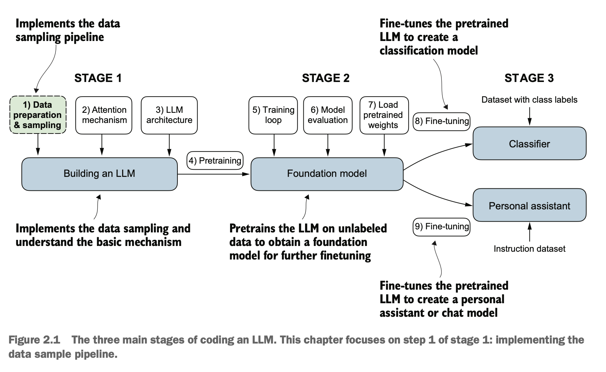

그림 2.1 LLM 코딩의 세 가지 주요 단계. 이 장은 1단계의 단계 1에 초점을 맞춥니다: 데이터 샘플 파이프라인 구현.

LLM 훈련을 위한 입력 텍스트를 준비하는 방법을 배우게 됩니다. 이는 텍스트를 개별 단어와 하위 단어 토큰으로 분할하는 것을 포함하며, 이후 LLM을 위한 벡터 표현으로 인코딩될 수 있습니다. 또한 GPT와 같은 인기 있는 LLM에서 활용되는 바이트 페어 인코딩과 같은 고급 토큰화 방식에 대해서도 배우게 됩니다. 마지막으로, LLM 훈련에 필요한 입력-출력 쌍을 생성하는 샘플링 및 데이터 로딩 전략을 구현할 것입니다.

# 2.1 단어 임베딩 이해하기

LLM을 포함한 심층 신경망 모델은 원시 텍스트를 직접 처리할 수 없습니다. 텍스트는 범주형이므로 신경망을 구현하고 훈련하는 데 사용되는 수학적 연산과 호환되지 않습니다. 따라서 단어를 연속값 벡터로 표현하는 방법이 필요합니다.

> 참고 계산 맥락에서 벡터와 텐서에 익숙하지 않은 독자는 부록 A의 섹션 A.2.2에서 더 자세히 알아볼 수 있습니다.

데이터를 벡터 형식으로 변환하는 개념을 종종 임베딩이라고 합니다. 특정 신경망 레이어나 다른 사전 훈련된 신경망 모델을 사용하여, 그림 2.2에 설명된 대로 비디오, 오디오, 텍스트와 같은 다양한 데이터 유형을 임베딩할 수 있습니다. 하지만 서로 다른 데이터 형식은 서로 다른 임베딩 모델을 필요로 한다는 점에 주목하는 것이 중요합니다. 예를 들어, 텍스트용으로 설계된 임베딩 모델은 오디오나 비디오 데이터를 임베딩하는 데 적합하지 않습니다.

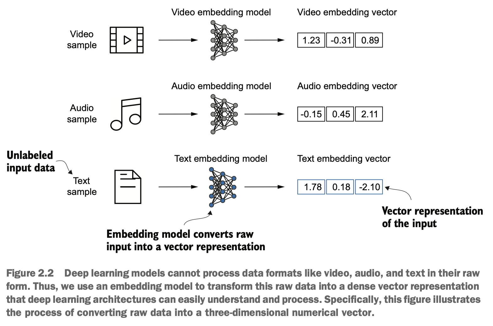

그림 2.2 딥러닝 모델은 비디오, 오디오, 텍스트와 같은 데이터 형식을 원시 형태로 처리할 수 없습니다. 따라서 우리는 임베딩 모델을 사용하여 이 원시 데이터를 딥러닝 아키텍처가 쉽게 이해하고 처리할 수 있는 조밀한 벡터 표현으로 변환합니다. 구체적으로, 이 그림은 원시 데이터를 3차원 수치 벡터로 변환하는 과정을 보여줍니다.

본질적으로 임베딩은 단어, 이미지, 심지어 전체 문서와 같은 이산적 객체에서 연속 벡터 공간의 점으로의 매핑입니다. 임베딩의 주요 목적은 비수치 데이터를 신경망이 처리할 수 있는 형식으로 변환하는 것입니다.

단어 임베딩이 텍스트 임베딩의 가장 일반적인 형태이지만, 문장, 단락 또는 전체 문서에 대한 임베딩도 있습니다. 문장이나 단락 임베딩은 검색 증강 생성에서 인기 있는 선택입니다. 검색 증강 생성은 생성(텍스트 생성 등)과 검색(외부 지식 베이스 검색 등)을 결합하여 텍스트를 생성할 때 관련 정보를 가져오는 기술로, 이 책의 범위를 벗어나는 기술입니다. 우리의 목표는 한 번에 한 단어씩 텍스트를 생성하는 방법을 학습하는 GPT 유형 LLM을 훈련하는 것이므로, 단어 임베딩에 초점을 맞출 것입니다.

단어 임베딩을 생성하기 위해 여러 알고리즘과 프레임워크가 개발되었습니다. 초기의 가장 인기 있는 예 중 하나는 Word2Vec 접근법입니다. Word2Vec은 대상 단어가 주어졌을 때 단어의 맥락을 예측하거나 그 반대로 예측하여 단어 임베딩을 생성하는 신경망 아키텍처를 훈련했습니다. Word2Vec의 주요 아이디어는 유사한 맥락에서 나타나는 단어들이 유사한 의미를 갖는 경향이 있다는 것입니다. 결과적으로, 시각화 목적으로 2차원 단어 임베딩에 투영될 때, 그림 2.3에 표시된 대로 유사한 용어들이 함께 클러스터링됩니다.

단어 임베딩은 1차원에서 수천 차원까지 다양한 차원을 가질 수 있습니다. 더 높은 차원성은 더 미묘한 관계를 포착할 수 있지만 계산 효율성을 희생할 수 있습니다.

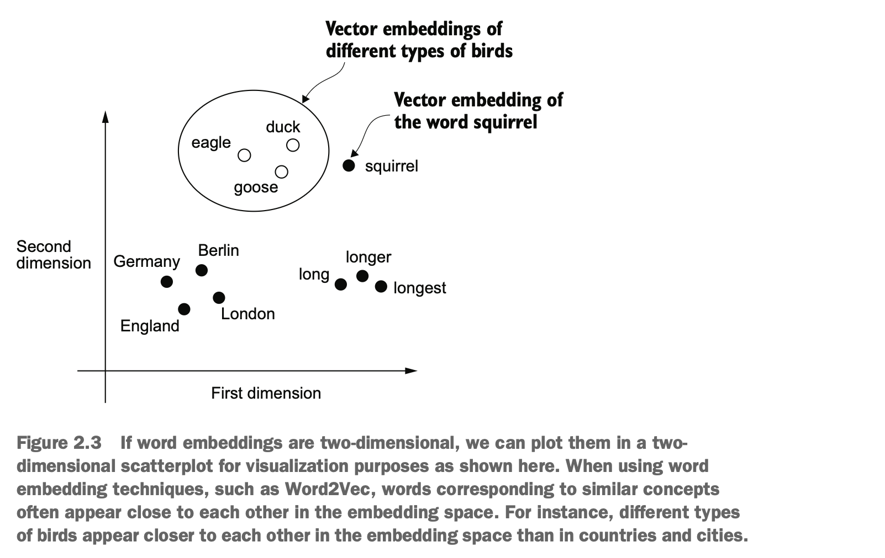

그림 2.3 단어 임베딩이 2차원인 경우, 여기에 표시된 대로 시각화 목적으로 2차원 산점도에 플롯할 수 있습니다. Word2Vec과 같은 단어 임베딩 기술을 사용할 때, 유사한 개념에 해당하는 단어들은 임베딩 공간에서 서로 가깝게 나타나는 경우가 많습니다. 예를 들어, 다양한 종류의 새들은 국가와 도시보다 임베딩 공간에서 서로 더 가깝게 나타납니다.

Word2Vec과 같은 사전 훈련된 모델을 사용하여 기계 학습 모델을 위한 임베딩을 생성할 수 있지만, LLM은 일반적으로 입력 레이어의 일부이며 훈련 중에 업데이트되는 자체 임베딩을 생성합니다. Word2Vec을 사용하는 대신 LLM 훈련의 일부로 임베딩을 최적화하는 장점은 임베딩이 당면한 특정 작업과 데이터에 최적화된다는 것입니다. 이 장의 후반부에서 이러한 임베딩 레이어를 구현할 것입니다. (LLM은 3장에서 논의할 맥락화된 출력 임베딩도 생성할 수 있습니다.)

불행히도, 고차원 임베딩은 우리의 감각 지각과 일반적인 그래픽 표현이 본질적으로 3차원 이하로 제한되어 있기 때문에 시각화에 어려움을 제시하며, 이것이 그림 2.3이 2차원 산점도에서 2차원 임베딩을 보여주는 이유입니다. 하지만 LLM을 사용할 때는 일반적으로 훨씬 높은 차원의 임베딩을 사용합니다. GPT-2와 GPT-3 모두에서 임베딩 크기(종종 모델의 은닉 상태의 차원성이라고 함)는 특정 모델 변형과 크기에 따라 달라집니다. 이는 성능과 효율성 사이의 트레이드오프입니다. 구체적인 예를 제공하기 위해, 가장 작은 GPT-2 모델(1억 1700만 및 1억 2500만 매개변수)은 768차원의 임베딩 크기를 사용합니다. 가장 큰 GPT-3 모델(1750억 매개변수)은 12,288차원의 임베딩 크기를 사용합니다.

다음으로, 텍스트를 단어로 분할하고, 단어를 토큰으로 변환하고, 토큰을 임베딩 벡터로 변환하는 것을 포함하는 LLM에서 사용되는 임베딩을 준비하는 데 필요한 단계들을 살펴보겠습니다.

# 2.2 텍스트 토큰화

LLM을 위한 임베딩을 생성하기 위한 필수 전처리 단계인 입력 텍스트를 개별 토큰으로 분할하는 방법에 대해 논의해보겠습니다. 이러한 토큰은 그림 2.4에 표시된 대로 개별 단어나 구두점 문자를 포함한 특수 문자입니다.

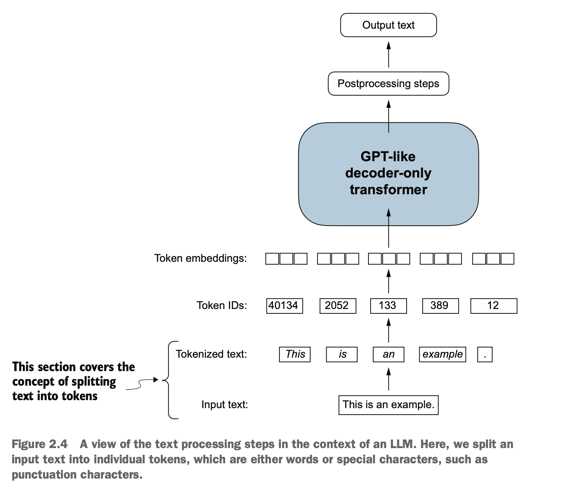

그림 2.4 LLM의 맥락에서 텍스트 처리 단계의 보기. 여기서 입력 텍스트를 단어나 구두점 문자와 같은 특수 문자인 개별 토큰으로 분할합니다.

LLM 훈련을 위해 토큰화할 텍스트는 "The Verdict"라는 Edith Wharton의 단편 소설로, 퍼블릭 도메인에 공개되어 LLM 훈련 작업에 사용할 수 있습니다. 이 텍스트는 https://en.wikisource.org/wiki/The_Verdict의 위키소스에서 확인할 수 있으며, 이를 텍스트 파일에 복사하여 붙여넣을 수 있습니다. 저는 이를 "the-verdict.txt" 텍스트 파일에 복사했습니다.

또는, 이 책의 GitHub 저장소 https://mng.bz/Adng에서 "the-verdict.txt" 파일을 찾을 수 있습니다. 다음 Python 코드로 파일을 다운로드할 수 있습니다:

```python
import urllib.request
url = ("https://raw.githubusercontent.com/rasbt/"
    "LLMs-from-scratch/main/ch02/01_main-chapter-code/"
    "the-verdict.txt")
file_path = "the-verdict.txt"
urllib.request.urlretrieve(url, file_path)
```

다음으로, Python의 표준 파일 읽기 유틸리티를 사용하여 the-verdict.txt 파일을 로드할 수 있습니다.

**목록 2.1 단편 소설을 텍스트 샘플로 Python에 읽어들이기**

```python
with open("the-verdict.txt", "r", encoding="utf-8") as f:
    raw_text = f.read()
print("Total number of character:", len(raw_text))
print(raw_text[:99])
```

print 명령어는 설명 목적으로 총 문자 수와 이 파일의 첫 100자를 출력합니다:

```
Total number of character: 20479
I HAD always thought Jack Gisburn rather a cheap genius--though a good fellow enough--so it was no
```

우리의 목표는 이 20,479자의 단편 소설을 개별 단어와 특수 문자로 토큰화하여 LLM 훈련을 위한 임베딩으로 변환하는 것입니다.

> 참고 LLM을 다룰 때는 수백만 개의 기사와 수십만 권의 책(수 기가바이트의 텍스트)을 처리하는 것이 일반적입니다. 하지만 교육 목적으로는 한 권의 책과 같은 작은 텍스트 샘플로 작업하여 텍스트 처리 단계의 주요 아이디어를 설명하고 일반 소비자 하드웨어에서 합리적인 시간 내에 실행할 수 있게 하는 것으로 충분합니다.

이 텍스트를 어떻게 가장 잘 분할하여 토큰 목록을 얻을 수 있을까요? 이를 위해 작은 우회를 하여 설명 목적으로 Python의 정규 표현식 라이브러리 re를 사용합니다. (나중에 사전 구축된 토큰화기로 전환할 것이므로 정규 표현식 구문을 배우거나 암기할 필요는 없습니다.)

간단한 예제 텍스트를 사용하여, 다음 구문으로 re.split 명령어를 사용하여 공백 문자로 텍스트를 분할할 수 있습니다:

```python
import re
text = "Hello, world. This, is a test."
result = re.split(r'(\s)', text)
print(result)
```

결과는 개별 단어, 공백, 구두점 문자의 목록입니다:

```
['Hello,', ' ', 'world.', ' ', 'This,', ' ', 'is', ' ', 'a', ' ', 'test.']
```

이 간단한 토큰화 방식은 예제 텍스트를 개별 단어로 분리하는 데 대부분 작동하지만, 일부 단어는 여전히 별도의 목록 항목으로 원하는 구두점 문자에 연결되어 있습니다. 또한 대문자화는 LLM이 고유명사와 일반명사를 구별하고, 문장 구조를 이해하며, 적절한 대문자화로 텍스트를 생성하는 방법을 학습하는 데 도움이 되므로 모든 텍스트를 소문자로 만드는 것을 피합니다.

공백($\backslash\mathrm{s}$), 쉼표, 마침표([$,$.])에서 분할하도록 정규 표현식을 수정해보겠습니다:

```python
result = re.split(r'([,.]\s)', text)
print(result)
```

이제 원하는 대로 단어와 구두점 문자가 별도의 목록 항목임을 알 수 있습니다:

```
['Hello', ',', '', ' ', 'world', '.', '', ' ', 'This', ',', '', ' ', 'is', ' ', 'a', ' ', 'test', '.', '']
```

남은 작은 문제는 목록에 여전히 공백 문자가 포함되어 있다는 것입니다. 선택적으로, 다음과 같이 이러한 중복 문자를 안전하게 제거할 수 있습니다:

```python
result = [item for item in result if item.strip()]
print(result)
```

공백이 제거된 결과 출력은 다음과 같습니다:

```
['Hello', ',', 'world', '.', 'This', ',', 'is', 'a', 'test', '.']
```

> 참고 간단한 토큰화기를 개발할 때, 공백을 별도의 문자로 인코딩할지 아니면 제거할지는 애플리케이션과 요구사항에 따라 달라집니다. 공백을 제거하면 메모리와 컴퓨팅 요구사항이 줄어듭니다. 하지만 공백을 유지하는 것은 텍스트의 정확한 구조에 민감한 모델을 훈련할 때 유용할 수 있습니다(예: 들여쓰기와 간격에 민감한 Python 코드). 여기서는 토큰화된 출력의 단순성과 간결성을 위해 공백을 제거합니다. 나중에 공백을 포함하는 토큰화 방식으로 전환할 것입니다.

우리가 여기서 고안한 토큰화 방식은 간단한 샘플 텍스트에서 잘 작동합니다. 이를 조금 더 수정하여 물음표, 따옴표, 그리고 Edith Wharton의 단편 소설의 첫 100자에서 본 더블 대시와 같은 다른 유형의 구두점과 추가 특수 문자도 처리할 수 있도록 해보겠습니다:

```python
text = "Hello, world. Is this-- a test?"
result = re.split(r'([,.?_!"()\']|--|\s)', text)
result = [item.strip() for item in result if item.strip()]
print(result)
```

결과 출력은:
```
['Hello', ',', 'world', '.', 'Is', 'this', '--', 'a', 'test', '?']
```

그림 2.5에 요약된 결과를 기반으로, 우리의 토큰화 방식이 이제 텍스트의 다양한 특수 문자를 성공적으로 처리할 수 있음을 알 수 있습니다.

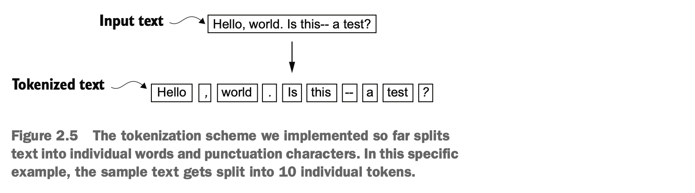

그림 2.5 지금까지 구현한 토큰화 방식은 텍스트를 개별 단어와 구두점 문자로 분할합니다. 이 특정 예에서 샘플 텍스트는 10개의 개별 토큰으로 분할됩니다.

이제 기본 토큰화기가 작동하므로, Edith Wharton의 전체 단편 소설에 적용해보겠습니다:

```python
preprocessed = re.split(r'([,.?_!"()\']|--|\s)', raw_text)
preprocessed = [item.strip() for item in preprocessed if item.strip()]
print(len(preprocessed))
```

이 print 문은 4690을 출력하며, 이는 이 텍스트의 토큰 수입니다(공백 제외). 빠른 시각적 확인을 위해 처음 30개 토큰을 출력해보겠습니다:

```python
print(preprocessed[:30])
```

결과 출력은 모든 단어와 특수 문자가 깔끔하게 분리되어 있어 토큰화기가 텍스트를 잘 처리하고 있음을 보여줍니다:

```
['I', 'HAD', 'always', 'thought', 'Jack', 'Gisburn', 'rather', 'a',
'cheap', 'genius', '--', 'though', 'a', 'good', 'fellow', 'enough',
'--', 'so', 'it', 'was', 'no', 'great', 'surprise', 'to', 'me', 'to',
'hear', 'that', ',', 'in']
```

# 2.3 토큰을 토큰 ID로 변환하기

다음으로, 이러한 토큰을 Python 문자열에서 정수 표현으로 변환하여 토큰 ID를 생성해보겠습니다. 이 변환은 토큰 ID를 임베딩 벡터로 변환하기 전의 중간 단계입니다.

이전에 생성된 토큰을 토큰 ID로 매핑하려면, 먼저 어휘를 구축해야 합니다. 이 어휘는 그림 2.6에 표시된 대로 각 고유 단어와 특수 문자를 고유 정수에 매핑하는 방법을 정의합니다.

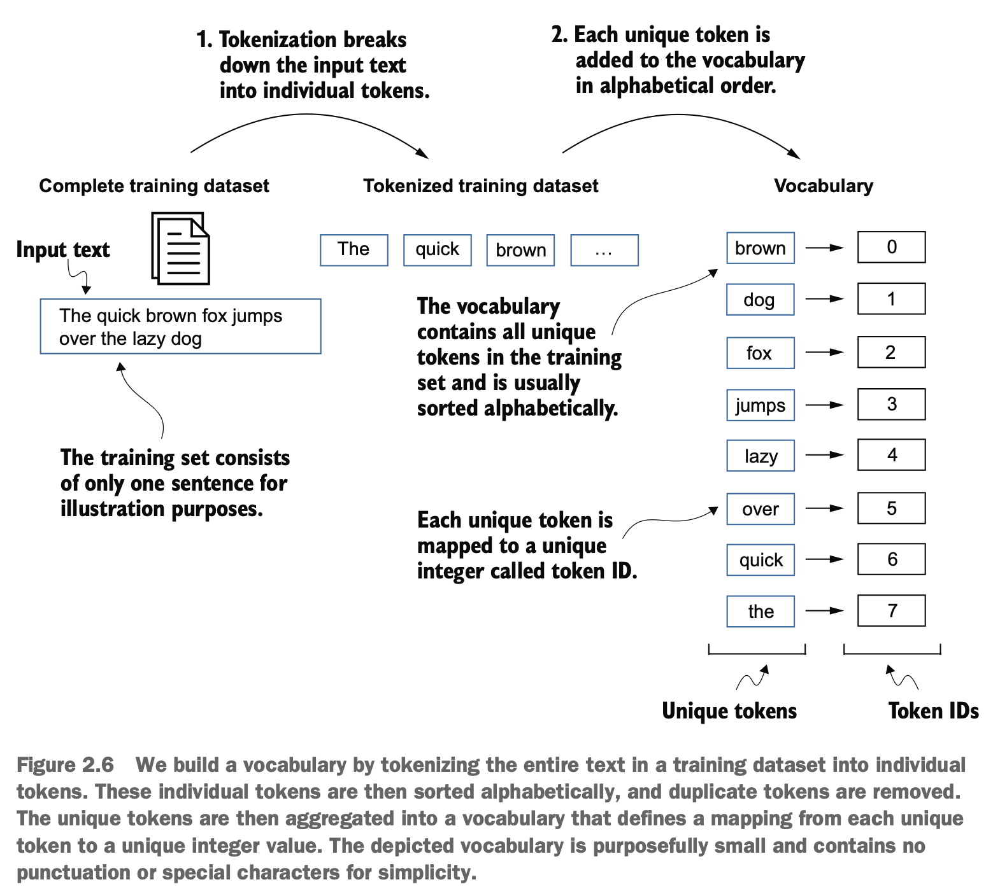

그림 2.6 우리는 훈련 데이터셋의 전체 텍스트를 개별 토큰으로 토큰화하여 어휘를 구축합니다. 이러한 개별 토큰은 알파벳순으로 정렬되고 중복 토큰이 제거됩니다. 고유 토큰은 각 고유 토큰에서 고유 정수 값으로의 매핑을 정의하는 어휘로 집계됩니다. 묘사된 어휘는 의도적으로 작고 단순성을 위해 구두점이나 특수 문자를 포함하지 않습니다.

이제 Edith Wharton의 단편 소설을 토큰화하고 preprocessed라는 Python 변수에 할당했으므로, 모든 고유 토큰의 목록을 만들고 알파벳순으로 정렬하여 어휘 크기를 결정해보겠습니다:

```python
all_words = sorted(set(preprocessed))
vocab_size = len(all_words)
print(vocab_size)
```

이 코드를 통해 어휘 크기가 1,130임을 확인한 후, 어휘를 만들고 설명 목적으로 처음 51개 항목을 출력합니다.

**목록 2.3 어휘 생성**

```python
vocab = {token:integer for integer,token in enumerate(all_words)}
for i, item in enumerate(vocab.items()):
    print(item)
    if i >= 50:
        break
```

출력은

```
('!', 0)
('"', 1)
("'", 2)
...
('Her', 49)
('Hermia', 50)
```

보시다시피, 딕셔너리는 고유 정수 레이블과 연관된 개별 토큰을 포함합니다. 우리의 다음 목표는 이 어휘를 적용하여 새로운 텍스트를 토큰 ID로 변환하는 것입니다(그림 2.7).

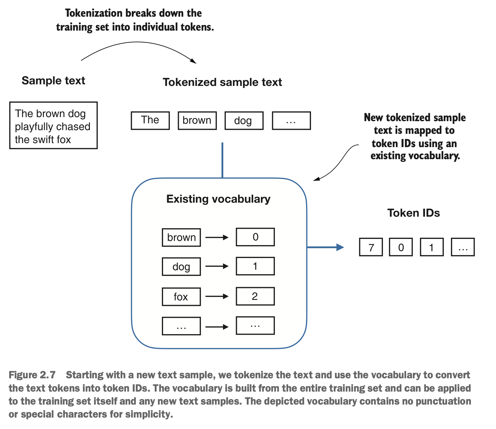

그림 2.7 새로운 텍스트 샘플부터 시작하여, 텍스트를 토큰화하고 어휘를 사용하여 텍스트 토큰을 토큰 ID로 변환합니다. 어휘는 전체 훈련 세트에서 구축되며 훈련 세트 자체와 새로운 텍스트 샘플에 적용될 수 있습니다. 묘사된 어휘는 단순성을 위해 구두점이나 특수 문자를 포함하지 않습니다.

LLM의 출력을 숫자에서 다시 텍스트로 변환하려면, 토큰 ID를 텍스트로 변환하는 방법이 필요합니다. 이를 위해 토큰 ID를 해당 텍스트 토큰으로 다시 매핑하는 어휘의 역버전을 만들 수 있습니다.

텍스트를 토큰으로 분할하고 어휘를 통해 문자열-정수 매핑을 수행하여 토큰 ID를 생성하는 encode 메서드가 있는 Python의 완전한 토큰화기 클래스를 구현해보겠습니다. 또한 토큰 ID를 다시 텍스트로 변환하는 역 정수-문자열 매핑을 수행하는 decode 메서드를 구현할 것입니다. 다음 목록은 이 토큰화기 구현의 코드를 보여줍니다.

**목록 2.3 간단한 텍스트 토큰화기 구현**

```python
class SimpleTokenizerV1:
    def __init__(self, vocab):
        self.str_to_int = vocab
        self.int_to_str = {i:s for s,i in vocab.items()}

    def encode(self, text):
        preprocessed = re.split(r'([,.?_!"()\']|--|\s)', text)
        preprocessed = [
            item.strip() for item in preprocessed if item.strip()
        ]
        ids = [self.str_to_int[s] for s in preprocessed]
        return ids

    def decode(self, ids):
        text = " ".join([self.int_to_str[i] for i in ids])
        text = re.sub(r'\s+([,.?!"()\'])', r'\1', text)
        return text
```

SimpleTokenizerV1 Python 클래스를 사용하여, 기존 어휘를 통해 새로운 토큰화기 객체를 인스턴스화할 수 있으며, 이를 사용하여 그림 2.8에 설명된 대로 텍스트를 인코딩하고 디코딩할 수 있습니다.

SimpleTokenizerV1 클래스에서 새로운 토큰화기 객체를 인스턴스화하고 Edith Wharton의 단편 소설의 한 구절을 토큰화하여 실제로 사용해보겠습니다:

```python
tokenizer = SimpleTokenizerV1(vocab)
text = """It's the last he painted, you know,"
    Mrs. Gisburn said with pardonable pride."""
ids = tokenizer.encode(text)
print(ids)
```

앞의 코드는 다음 토큰 ID를 출력합니다:

```
[1, 56, 2, 850, 988, 602, 533, 746, 5, 1126, 596, 5, 1, 67, 7, 38, 851, 1108,
754, 793, 7]
```

다음으로, decode 메서드를 사용하여 이러한 토큰 ID를 다시 텍스트로 변환할 수 있는지 확인해보겠습니다:
print(tokenizer.decode(ids))

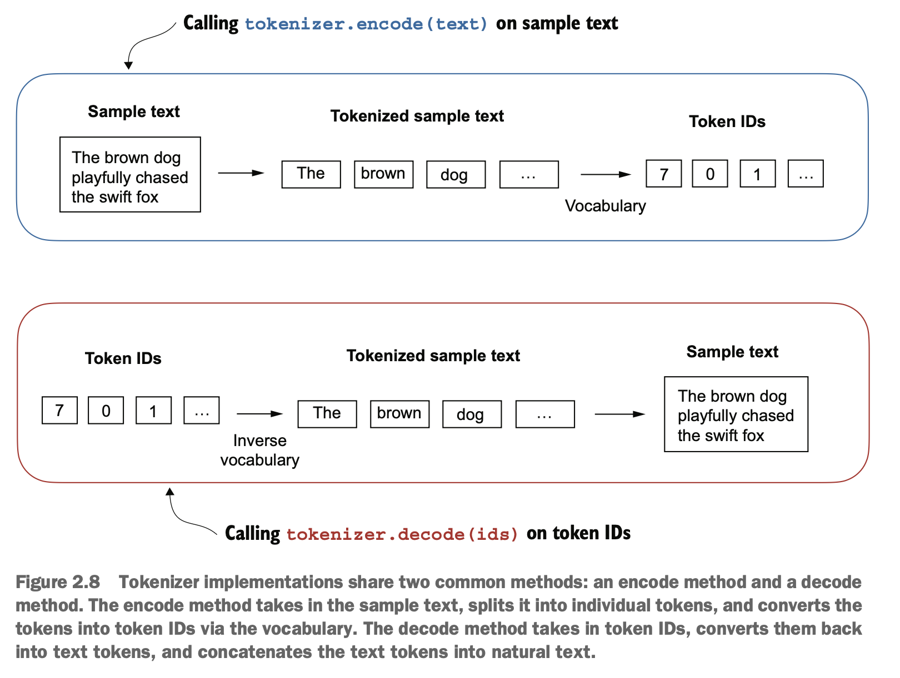

그림 2.8 토큰화기 구현은 두 가지 공통 메서드를 공유합니다: encode 메서드와 decode 메서드. encode 메서드는 샘플 텍스트를 받아, 개별 토큰으로 분할하고, 어휘를 통해 토큰을 토큰 ID로 변환합니다. decode 메서드는 토큰 ID를 받아, 텍스트 토큰으로 다시 변환하고, 텍스트 토큰을 자연 텍스트로 연결합니다.

이것은 다음을 출력합니다:
```
'" It\' s the last he painted, you know," Mrs. Gisburn said with pardonable pride.'
```

이 출력을 기반으로, decode 메서드가 토큰 ID를 원래 텍스트로 성공적으로 변환했음을 알 수 있습니다.

지금까지는 좋습니다. 훈련 세트의 스니펫을 기반으로 텍스트를 토큰화하고 비토큰화할 수 있는 토큰화기를 구현했습니다. 이제 훈련 세트에 포함되지 않은 새로운 텍스트 샘플에 적용해보겠습니다:
text = "Hello, do you like tea?"
print(tokenizer.encode(text))
이 코드를 실행하면 다음 오류가 발생합니다:
KeyError: 'Hello'
문제는 "Hello"라는 단어가 "The Verdict" 단편 소설에서 사용되지 않았다는 것입니다. 따라서 어휘에 포함되지 않습니다. 이는 LLM을 작업할 때 어휘를 확장하기 위해 크고 다양한 훈련 세트를 고려해야 할 필요성을 강조합니다.

다음으로, 알 수 없는 단어가 포함된 텍스트에 대해 토큰화기를 더 테스트하고 LLM 훈련 중에 추가 컨텍스트를 제공하는 데 사용할 수 있는 추가 특수 토큰에 대해 논의하겠습니다.

# 2.4 특수 컨텍스트 토큰 추가

알 수 없는 단어를 처리하기 위해 토큰화기를 수정해야 합니다. 또한 모델의 컨텍스트나 텍스트의 다른 관련 정보에 대한 이해를 향상시킬 수 있는 특수 컨텍스트 토큰의 사용과 추가를 다뤄야 합니다. 이러한 특수 토큰은 예를 들어 알 수 없는 단어와 문서 경계에 대한 마커를 포함할 수 있습니다. 특히, 그림 2.9에 설명된 대로 두 개의 새로운 토큰 <|unk|>와 <|endoftext|>를 지원하도록 어휘와 토큰화기 SimpleTokenizerV2를 수정할 것입니다.

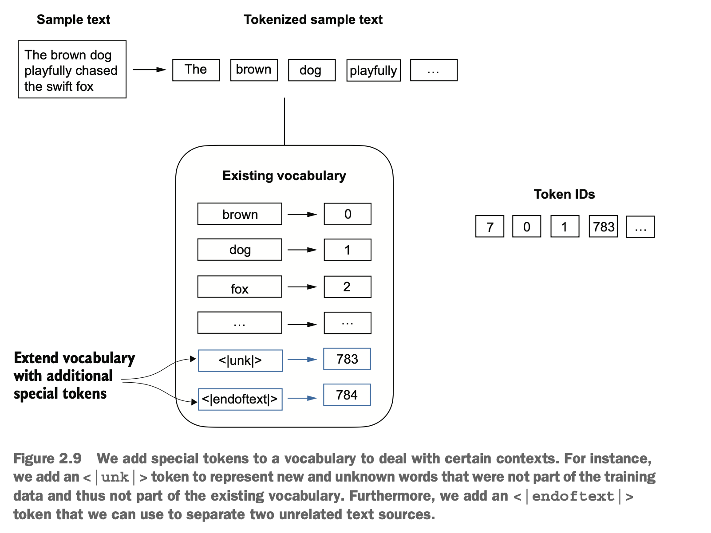

그림 2.9 특정 컨텍스트를 처리하기 위해 어휘에 특수 토큰을 추가합니다. 예를 들어, 훈련 데이터의 일부가 아니어서 기존 어휘의 일부가 아닌 새로운 알 수 없는 단어를 나타내기 위해 <|unk|> 토큰을 추가합니다. 또한 관련 없는 두 텍스트 소스를 분리하는 데 사용할 수 있는 <|endoftext|> 토큰을 추가합니다.

어휘의 일부가 아닌 단어를 만나면 <|unk|> 토큰을 사용하도록 토큰화기를 수정할 수 있습니다. 또한 관련 없는 텍스트 사이에 토큰을 추가합니다. 예를 들어, 여러 독립적인 문서나 책에서 GPT 유형 LLM을 훈련할 때, 그림 2.10에 설명된 대로 이전 텍스트 소스를 따르는 각 문서나 책 앞에 토큰을 삽입하는 것이 일반적입니다. 이는 이러한 텍스트 소스가 훈련을 위해 연결되었지만 실제로는 관련이 없다는 것을 LLM이 이해하는 데 도움이 됩니다.

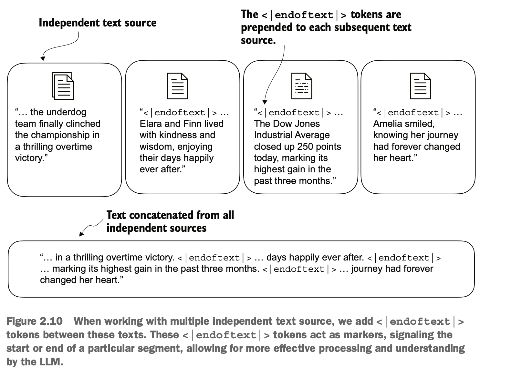

그림 2.10 여러 독립적인 텍스트 소스로 작업할 때, 이러한 텍스트 사이에 <|endoftext|> 토큰을 추가합니다. 이러한 <|endoftext|> 토큰은 특정 세그먼트의 시작 또는 끝을 나타내는 마커 역할을 하여 LLM이 더 효과적으로 처리하고 이해할 수 있게 합니다.

이제 모든 고유 단어 목록에 이 두 특수 토큰 <|unk|>와 <|endoftext|>를 추가하여 어휘를 수정해보겠습니다:

```python
all_tokens = sorted(list(set(preprocessed)))
all_tokens.extend(["<|endoftext|>", "<|unk|>"])
vocab = {token:integer for integer,token in enumerate(all_tokens)}
print(len(vocab.items()))
```

이 print 문의 출력을 기반으로, 새로운 어휘 크기는 1,132입니다(이전 어휘 크기는 1,130이었습니다).

추가 빠른 확인으로, 업데이트된 어휘의 마지막 5개 항목을 출력해보겠습니다:

```python
for i, item in enumerate(list(vocab.items())[-5:]):
    print(item)
```

코드는 다음을 출력합니다:

```
('younger', 1127)
('your', 1128)
('yourself', 1129)
('<|endoftext|>', 1130)
('<|unk|>', 1131)
```

코드 출력을 기반으로, 두 개의 새로운 특수 토큰이 실제로 어휘에 성공적으로 통합되었음을 확인할 수 있습니다. 다음으로, 다음 목록에 표시된 대로 코드 목록 2.3의 토큰화기를 적절히 조정합니다.

**목록 2.4 알 수 없는 단어를 처리하는 간단한 텍스트 토큰화기**

```python
class SimpleTokenizerV2:
    def __init__(self, vocab):
        self.str_to_int = vocab
        self.int_to_str = { i:s for s,i in vocab.items() }
    def encode(self, text):
        preprocessed = re.split(r'([,.::;?_!"()\'])--|\s)', text)
        preprocessed = [
            item.strip() for item in preprocessed if item.strip()
        ]
        preprocessed = [item if item in self.str_to_int
            else "<|unk|>" for item in preprocessed]
        ids = [self.str_to_int[s] for s in preprocessed]
        return ids
    def decode(self, ids):
        text = " ".join([self.int_to_str[i] for i in ids])
        text = re.sub(r'\s+([,.::;?!"()\'])', r'\1', text)
        return text
```

알 수 없는 단어를 <|unk|> 토큰으로 대체

목록 2.3에서 구현한 SimpleTokenizerV1과 비교하여, 새로운 SimpleTokenizerV2는 알 수 없는 단어를 <|unk|> 토큰으로 대체합니다.

이제 이 새로운 토큰화기를 실제로 사용해보겠습니다. 이를 위해 두 개의 독립적이고 관련 없는 문장을 연결한 간단한 텍스트 샘플을 사용할 것입니다:

```python
text1 = "Hello, do you like tea?"
text2 = "In the sunlit terraces of the palace."
text = " <|endoftext|> ".join((text1, text2))
print(text)
```

출력은

```
Hello, do you like tea? <|endoftext|> In the sunlit terraces of
the palace.
```

다음으로, 목록 2.2에서 이전에 생성한 vocab에서 SimpleTokenizerV2를 사용하여 샘플 텍스트를 토큰화해보겠습니다:

```python
tokenizer = SimpleTokenizerV2(vocab)
print(tokenizer.encode(text))
```

이는 다음 토큰 ID를 출력합니다:
```
[1131,5,355,1126,628,975,10,1130,55,988,956,984,722,988,1131,7]
```

토큰 ID 목록이 <|endoftext|> 구분자 토큰에 대한 1130과 알 수 없는 단어에 사용되는 두 개의 1131 토큰을 포함하고 있음을 알 수 있습니다.

빠른 정상성 확인을 위해 텍스트를 디토큰화해보겠습니다:
print(tokenizer.decode(tokenizer.encode(text)))
출력은
<|unk|>, do you like tea? <|endoftext|> In the sunlit terraces of
the <|unk|>.

이 디토큰화된 텍스트를 원래 입력 텍스트와 비교하면, 훈련 데이터셋인 Edith Wharton의 단편 소설 "The Verdict"에 "Hello"와 "palace"라는 단어가 포함되어 있지 않다는 것을 알 수 있습니다.

LLM에 따라, 일부 연구자들은 다음과 같은 추가 특수 토큰도 고려합니다:

- [BOS] (시퀀스 시작)—이 토큰은 텍스트의 시작을 표시합니다. LLM에게 콘텐츠 조각이 어디서 시작되는지 알려줍니다.
- [EOS] (시퀀스 끝)—이 토큰은 텍스트의 끝에 위치하며 <|endoftext|>와 유사하게 여러 관련 없는 텍스트를 연결할 때 특히 유용합니다. 예를 들어, 두 개의 서로 다른 위키피디아 기사나 책을 결합할 때, [EOS] 토큰은 하나가 끝나고 다음이 시작되는 지점을 나타냅니다.
- [PAD] (패딩)—배치 크기가 1보다 큰 LLM을 훈련할 때, 배치에는 다양한 길이의 텍스트가 포함될 수 있습니다. 모든 텍스트가 동일한 길이를 갖도록 하기 위해, 짧은 텍스트는 배치에서 가장 긴 텍스트의 길이까지 [PAD] 토큰을 사용하여 확장되거나 "패딩"됩니다.

GPT 모델에 사용되는 토큰화기는 이러한 토큰 중 어느 것도 필요로 하지 않으며, 단순성을 위해 <|endoftext|> 토큰만 사용합니다. <|endoftext|>는 [EOS] 토큰과 유사합니다. <|endoftext|>는 패딩에도 사용됩니다. 하지만 후속 장에서 살펴보겠지만, 배치 입력에서 훈련할 때 일반적으로 마스크를 사용하여 패딩된 토큰에 주의를 기울이지 않습니다. 따라서 패딩을 위해 선택된 특정 토큰은 중요하지 않게 됩니다.

또한 GPT 모델에 사용되는 토큰화기는 어휘에 없는 단어에 대해 <|unk|> 토큰을 사용하지 않습니다. 대신 GPT 모델은 단어를 하위 단어 단위로 분해하는 바이트 페어 인코딩 토큰화기를 사용하며, 이에 대해 다음에 논의하겠습니다.

# 2.5 바이트 페어 인코딩

바이트 페어 인코딩(BPE)이라는 개념을 기반으로 한 더 정교한 토큰화 방식을 살펴보겠습니다. BPE 토큰화기는 GPT-2, GPT-3, 그리고 ChatGPT에서 사용된 원래 모델과 같은 LLM을 훈련하는 데 사용되었습니다.

BPE를 구현하는 것은 상대적으로 복잡할 수 있으므로, Rust의 소스 코드를 기반으로 BPE 알고리즘을 매우 효율적으로 구현하는 tiktoken (https://github.com/openai/tiktoken)이라는 기존 Python 오픈 소스 라이브러리를 사용할 것입니다. 다른 Python 라이브러리와 마찬가지로, 터미널에서 Python의 pip 설치 관리자를 통해 tiktoken 라이브러리를 설치할 수 있습니다:

```
pip install tiktoken
```

우리가 사용할 코드는 tiktoken 0.7.0을 기반으로 합니다. 다음 코드를 사용하여 현재 설치된 버전을 확인할 수 있습니다:

```python
from importlib.metadata import version
import tiktoken
print("tiktoken version:", version("tiktoken"))
```

설치되면, tiktoken에서 BPE 토큰화기를 다음과 같이 인스턴스화할 수 있습니다:

```python
tokenizer = tiktoken.get_encoding("gpt2")
```

이 토큰화기의 사용법은 encode 메서드를 통해 이전에 구현한 SimpleTokenizerV2와 유사합니다:

```python
text = (
    "Hello, do you like tea? <|endoftext|> In the sunlit terraces"
    "of someunknownPlace."
)
integers = tokenizer.encode(text, allowed_special={"<|endoftext|>"})
print(integers)
```

코드는 다음 토큰 ID를 출력합니다:

```
[15496, 11, 466, 345, 588, 8887, 30, 220, 50256, 554, 262, 4252, 18250,
8812, 2114, 286, 617, 34680, 27271, 13]
```

그런 다음 SimpleTokenizerV2와 유사하게 decode 메서드를 사용하여 토큰 ID를 다시 텍스트로 변환할 수 있습니다:

```python
strings = tokenizer.decode(integers)
print(strings)
```

코드는 다음을 출력합니다:
```
Hello, do you like tea? <|endoftext|> In the sunlit terraces of someunknownPlace.
```

토큰 ID와 디코딩된 텍스트를 기반으로 두 가지 주목할 만한 관찰을 할 수 있습니다. 첫째, <|endoftext|> 토큰에는 상대적으로 큰 토큰 ID인 50256이 할당됩니다. 실제로 GPT-2, GPT-3, 그리고 ChatGPT에서 사용된 원래 모델과 같은 모델을 훈련하는 데 사용된 BPE 토큰화기는 총 어휘 크기가 50,257이며, <|endoftext|>가 가장 큰 토큰 ID로 할당됩니다.

둘째, BPE 토큰화기는 someunknownPlace와 같은 알 수 없는 단어를 올바르게 인코딩하고 디코딩합니다. BPE 토큰화기는 모든 알 수 없는 단어를 처리할 수 있습니다. <|unk|> 토큰을 사용하지 않고 어떻게 이를 달성할까요?

BPE의 기본 알고리즘은 사전 정의된 어휘에 없는 단어를 더 작은 하위 단어 단위나 심지어 개별 문자로 분해하여 어휘에 없는 단어를 처리할 수 있게 합니다. 따라서 BPE 알고리즘 덕분에 토큰화기가 토큰화 중에 익숙하지 않은 단어를 만나면, 그림 2.11에 설명된 대로 하위 단어 토큰이나 문자의 시퀀스로 표현할 수 있습니다.

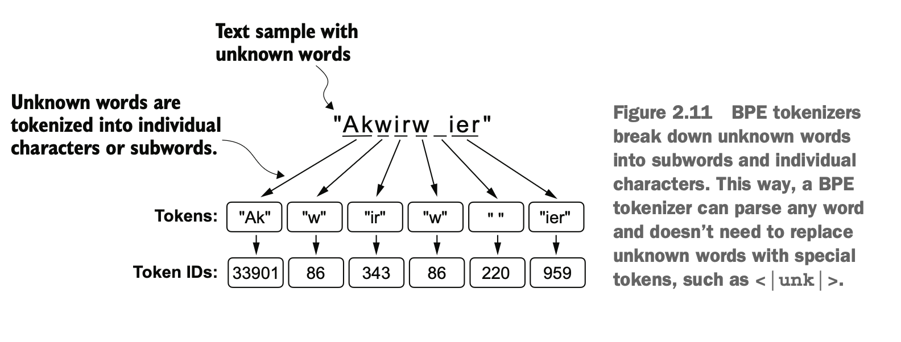

알 수 없는 단어를 개별 문자로 분해하는 능력은 토큰화기와 그에 따라 훈련된 LLM이 훈련 데이터에 없던 단어가 포함된 텍스트라도 처리할 수 있도록 보장합니다.

# 연습 2.1 알 수 없는 단어의 바이트 페어 인코딩

tiktoken 라이브러리의 BPE 토큰화기를 알 수 없는 단어 "Akwirw ier"에 시도하고 개별 토큰 ID를 출력해보세요. 그런 다음 이 목록의 각 결과 정수에 대해 decode 함수를 호출하여 그림 2.11에 표시된 매핑을 재현해보세요. 마지막으로, 토큰 ID에 대해 decode 메서드를 호출하여 원래 입력 "Akwirw ier"를 재구성할 수 있는지 확인해보세요.

BPE의 자세한 논의와 구현은 이 책의 범위를 벗어나지만, 간단히 말하면 자주 나타나는 문자를 하위 단어로, 그리고 자주 나타나는 하위 단어를 단어로 반복적으로 병합하여 어휘를 구축합니다. 예를 들어, BPE는 모든 개별 단일 문자를 어휘에 추가하는 것으로 시작합니다("a", "b" 등). 다음 단계에서는 자주 함께 나타나는 문자 조합을 하위 단어로 병합합니다. 예를 들어, "d"와 "e"는 "define", "depend", "made", "hidden"과 같은 많은 영어 단어에서 공통적인 "de" 하위 단어로 병합될 수 있습니다. 병합은 빈도 임계값에 의해 결정됩니다.

# 2.6 슬라이딩 윈도우를 사용한 데이터 샘플링

LLM을 위한 임베딩을 생성하는 다음 단계는 LLM 훈련에 필요한 입력-대상 쌍을 생성하는 것입니다. 이러한 입력-대상 쌍은 어떤 모습일까요? 이미 배웠듯이, LLM은 그림 2.12에 묘사된 대로 텍스트에서 다음 단어를 예측하여 사전 훈련됩니다.

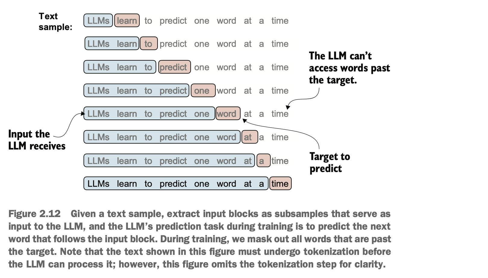

그림 2.12 텍스트 샘플이 주어졌을 때, LLM에 입력으로 제공되는 하위 샘플로 입력 블록을 추출하고, 훈련 중 LLM의 예측 작업은 입력 블록을 따르는 다음 단어를 예측하는 것입니다. 훈련 중에는 대상을 지나는 모든 단어를 마스킹합니다. 이 그림에 표시된 텍스트는 LLM이 처리하기 전에 토큰화를 거쳐야 하지만, 이 그림은 명확성을 위해 토큰화 단계를 생략했습니다.

슬라이딩 윈도우 접근 방식을 사용하여 훈련 데이터셋에서 그림 2.12의 입력-대상 쌍을 가져오는 데이터 로더를 구현해보겠습니다. 시작하기 위해 BPE 토큰화기를 사용하여 전체 "The Verdict" 단편 소설을 토큰화할 것입니다:

```python
with open("the-verdict.txt", "r", encoding="utf-8") as f:
    raw_text = f.read()
enc_text = tokenizer.encode(raw_text)
print(len(enc_text))
```

이 코드를 실행하면 BPE 토큰화기를 적용한 후 훈련 세트의 총 토큰 수인 5145가 반환됩니다.

다음으로, 다음 단계에서 약간 더 흥미로운 텍스트 구절을 만들기 위해 시연 목적으로 데이터셋에서 처음 50개 토큰을 제거합니다:
enc_sample = enc_text[50:]

다음 단어 예측 작업을 위한 입력-대상 쌍을 생성하는 가장 쉽고 직관적인 방법 중 하나는 x가 입력 토큰을 포함하고 y가 1만큼 이동된 입력인 대상을 포함하는 두 변수 x와 y를 생성하는 것입니다:

```python
context_size = 4
x = enc_sample[:context_size]
y = enc_sample[1:context_size+1]
print(f"x: {x}")
print(f"y: {y}")
```

컨텍스트 크기는 입력에 포함되는 토큰 수를 결정합니다.

이전 코드를 실행하면 다음 출력이 출력됩니다:

```
x: [290, 4920, 2241, 287]
y: [4920, 2241, 287, 257]
```

한 위치씩 이동된 입력인 대상과 함께 입력을 처리하여 다음 단어 예측 작업(그림 2.12 참조)을 생성할 수 있습니다:

```python
for i in range(1, context_size+1):
    context = enc_sample[:i]
    desired = enc_sample[i]
    print(context, "---->", desired)
```

코드는 다음을 출력합니다:

```
[290] ----> 4920
[290, 4920] ----> 2241
[290, 4920, 2241] ----> 287
[290, 4920, 2241, 287] ----> 257
```

화살표(---->)의 왼쪽은 LLM이 받을 입력을 나타내고, 화살표 오른쪽의 토큰 ID는 LLM이 예측해야 하는 대상 토큰 ID를 나타냅니다. 이전 코드를 반복하되 토큰 ID를 텍스트로 변환해보겠습니다:

```python
for i in range(1, context_size+1):
    context = enc_sample[:i]
    desired = enc_sample[i]
    print(tokenizer.decode(context), "---->", tokenizer.decode([desired]))
```

다음 출력은 입력과 출력이 텍스트 형식에서 어떻게 보이는지 보여줍니다:

```
and ----> established
and established ----> himself
and established himself ----> in
and established himself in ----> a
```

이제 LLM 훈련에 사용할 수 있는 입력-대상 쌍을 생성했습니다.
토큰을 임베딩으로 변환하기 전에 한 가지 작업이 더 있습니다: 입력 데이터셋을 반복하고 입력과 대상을 다차원 배열로 생각할 수 있는 PyTorch 텐서로 반환하는 효율적인 데이터 로더를 구현하는 것입니다. 특히, LLM이 보는 텍스트를 포함하는 입력 텐서와 LLM이 예측할 대상을 포함하는 대상 텐서, 이 두 개의 텐서를 반환하는 데 관심이 있습니다(그림 2.13에 묘사됨). 그림은 설명 목적으로 토큰을 문자열 형식으로 보여주지만, 코드 구현은 BPE 토큰화기의 encode 메서드가 토큰화와 토큰 ID로의 변환을 단일 단계로 수행하므로 토큰 ID에서 직접 작동할 것입니다.

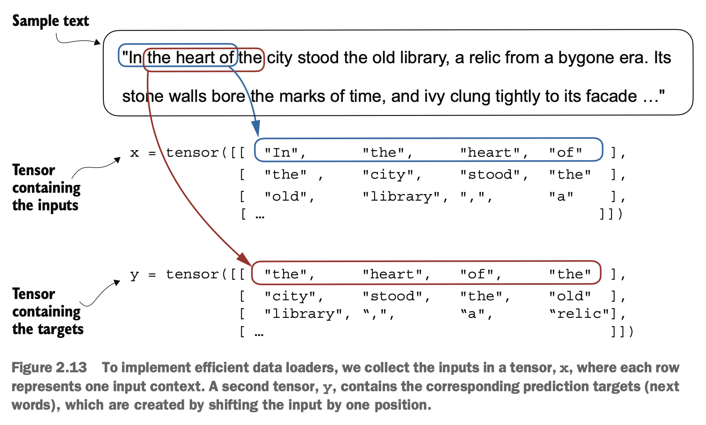

그림 2.13 효율적인 데이터 로더를 구현하기 위해, 각 행이 하나의 입력 컨텍스트를 나타내는 텐서 x에 입력을 수집합니다. 두 번째 텐서 y는 입력을 한 위치씩 이동하여 생성되는 해당 예측 대상(다음 단어)을 포함합니다.

> 참고 효율적인 데이터 로더 구현을 위해 PyTorch의 내장 Dataset과 DataLoader 클래스를 사용할 것입니다. PyTorch 설치에 대한 추가 정보와 지침은 부록 A의 섹션 A.2.1.3을 참조하세요.

데이터셋 클래스의 코드는 다음 목록에 표시되어 있습니다.

**목록 2.5 배치 입력과 대상을 위한 데이터셋**

```python
import torch
from torch.utils.data import Dataset, DataLoader
class GPTDatasetV1(Dataset):
    def __init__(self, txt, tokenizer, max_length, stride):
        self.input_ids = []
        self.target_ids = []

        token_ids = tokenizer.encode(txt)

    for i in range(0, len(token_ids) - max_length, stride):
        input_chunk = token_ids[i:i + max_length]
        target_chunk = token_ids[i + 1: i + max_length + 1]
        self.input_ids.append(torch.tensor(input_chunk))
        self.target_ids.append(torch.tensor(target_chunk))

    def __len__(self):
        return len(self.input_ids)

    def __getitem__(self, idx):
        return self.input_ids[idx], self.target_ids[idx]
```

GPTDatasetV1 클래스는 PyTorch Dataset 클래스를 기반으로 하며 데이터셋에서 개별 행을 가져오는 방법을 정의합니다. 여기서 각 행은 input_chunk 텐서에 할당된 여러 토큰 ID(max_length 기반)로 구성됩니다. target_chunk 텐서는 해당 대상을 포함합니다. PyTorch DataLoader와 데이터셋을 결합할 때 이 데이터셋에서 반환되는 데이터가 어떻게 보이는지 확인하기 위해 읽기를 권장합니다. 이는 추가적인 직관과 명확성을 제공할 것입니다.

> 참고 목록 2.5에 표시된 것과 같은 PyTorch Dataset 클래스의 구조에 익숙하지 않다면, PyTorch Dataset과 DataLoader 클래스의 일반적인 구조와 사용법을 설명하는 부록 A의 섹션 A.6을 참조하세요.

다음 코드는 GPTDatasetV1을 사용하여 PyTorch DataLoader를 통해 배치로 입력을 로드합니다.

**목록 2.6 입력 쌍으로 배치를 생성하는 데이터 로더**

```python
def create_dataloader_v1(txt, batch_size=4, max_length=256,
                         stride=128, shuffle=True, drop_last=True,
                         num_workers=0):
    tokenizer = tiktoken.get_encoding("gpt2")
    dataset = GPTDatasetV1(txt, tokenizer, max_length, stride)
    dataloader = DataLoader(
        dataset,
        batch_size=batch_size,
        shuffle=shuffle,
        drop_last=drop_last,
        num_workers=num_workers)
    return dataloader
```

drop_last=True는 지정된 batch_size보다 짧은 마지막 배치를 삭제하여 훈련 중 손실 급증을 방지합니다.

전처리에 사용할 CPU 프로세스 수

목록 2.5의 GPTDatasetV1 클래스와 목록 2.6의 create_dataloader_v1 함수가 어떻게 함께 작동하는지에 대한 직관을 개발하기 위해 컨텍스트 크기가 4인 LLM에 대해 배치 크기 1로 데이터로더를 테스트해보겠습니다:

```python
with open("the-verdict.txt", "r", encoding="utf-8") as f:
    raw_text = f.read()
    dataloader = create_dataloader_v1(
        raw_text, batch_size=1, max_length=4, stride=1, shuffle=False)
    data_iter = iter(dataloader)
    first_batch = next(data_iter)
    print(first_batch)
```

데이터로더를 Python 반복자로 변환하여 Python의 내장 next() 함수를 통해 다음 항목을 가져옵니다.

앞의 코드를 실행하면 다음이 출력됩니다:

```
[tensor([[ 40, 367, 2885, 1464]]), tensor([[ 367, 2885, 1464, 1807]])]
```

first_batch 변수는 두 개의 텐서를 포함합니다: 첫 번째 텐서는 입력 토큰 ID를 저장하고, 두 번째 텐서는 대상 토큰 ID를 저장합니다. max_length가 4로 설정되어 있으므로, 두 텐서 각각은 4개의 토큰 ID를 포함합니다. 입력 크기 4는 상당히 작으며 단순성을 위해서만 선택되었음에 주목하세요. LLM을 최소 256의 입력 크기로 훈련하는 것이 일반적입니다.

stride=1의 의미를 이해하기 위해, 이 데이터셋에서 다른 배치를 가져와보겠습니다:

```python
second_batch = next(data_iter)
print(second_batch)
```

두 번째 배치는 다음 내용을 가집니다:
```
[tensor([[ 367, 2885, 1464, 1807]]), tensor([[2885, 1464, 1807, 3619]])]
```

첫 번째와 두 번째 배치를 비교하면, 두 번째 배치의 토큰 ID가 한 위치씩 이동되어 있음을 알 수 있습니다(예: 첫 번째 배치 입력의 두 번째 ID는 367이며, 이는 두 번째 배치 입력의 첫 번째 ID입니다). stride 설정은 그림 2.14에 설명된 대로 슬라이딩 윈도우 접근 방식을 모방하여 배치 간에 입력이 이동하는 위치 수를 지정합니다.

# 연습 2.2 다른 스트라이드와 컨텍스트 크기를 가진 데이터 로더

데이터 로더가 어떻게 작동하는지에 대한 더 많은 직관을 개발하기 위해, max_length=2와 stride=2, max_length=8과 stride=2와 같은 다른 설정으로 실행해보세요.

지금까지 데이터 로더에서 샘플링한 것과 같은 1의 배치 크기는 설명 목적으로 유용합니다. 딥러닝에 이전 경험이 있다면, 작은 배치 크기는 훈련 중 더 적은 메모리를 필요로 하지만 더 많은

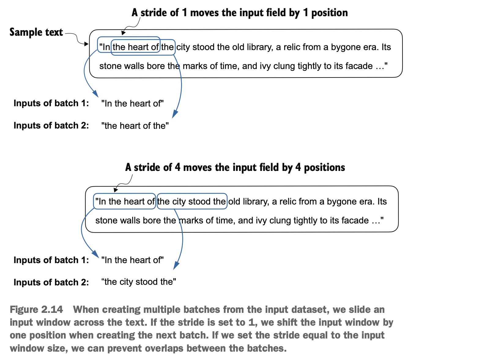

그림 2.14 입력 데이터셋에서 여러 배치를 생성할 때, 텍스트 전체에 입력 윈도우를 슬라이딩합니다. 스트라이드가 1로 설정되면, 다음 배치를 생성할 때 입력 윈도우를 한 위치씩 이동합니다. 스트라이드를 입력 윈도우 크기와 같게 설정하면 배치 간의 겹침을 방지할 수 있습니다.

잡음이 많은 모델 업데이트로 이어진다는 것을 알고 있을 것입니다. 일반적인 딥러닝과 마찬가지로, 배치 크기는 트레이드오프이며 LLM을 훈련할 때 실험할 하이퍼파라미터입니다.

1보다 큰 배치 크기로 데이터 로더를 사용하는 방법을 간단히 살펴보겠습니다:

```python
dataloader = create_dataloader_v1(
    raw_text, batch_size=8, max_length=4, stride=4,
    shuffle=False
)
data_iter = iter(dataloader)
inputs, targets = next(data_iter)
print("Inputs:\n", inputs)
print("\nTargets:\n", targets)
```

이는 다음을 출력합니다:

```
Inputs:
    tensor([[ 40, 367, 2885, 1464],
        [ 1807, 3619, 402, 271],
        [10899, 2138, 257, 7026],
        [15632, 438, 2016, 257],
        [ 922, 5891, 1576, 438],
        [ 568, 340, 373, 645],
        [ 1049, 5975, 284, 502],
        [ 284, 3285, 326, 11]])
Targets:
tensor([[ 367, 2885, 1464, 1807],
    [ 3619, 402, 271, 10899],
    [ 2138, 257, 7026, 15632],
    [ 438, 2016, 257, 922],
    [ 5891, 1576, 438, 568],
    [ 340, 373, 645, 1049],
    [ 5975, 284, 502, 284],
    [ 3285, 326, 11, 287]])
```

데이터 세트를 완전히 활용하기 위해(단일 단어도 건너뛰지 않기 위해) 스트라이드를 4로 증가시켰습니다. 이는 더 많은 겹침이 과적합 증가로 이어질 수 있으므로 배치 간의 겹침을 방지합니다.

# 2.7 토큰 임베딩 생성

LLM 훈련을 위한 입력 텍스트를 준비하는 마지막 단계는 그림 2.15에 표시된 대로 토큰 ID를 임베딩 벡터로 변환하는 것입니다. 예비 단계로서, 우리는

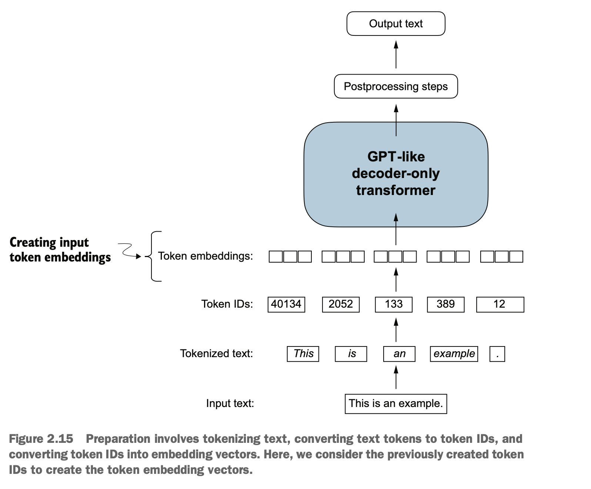

그림 2.15 준비 과정은 텍스트 토큰화, 텍스트 토큰을 토큰 ID로 변환, 토큰 ID를 임베딩 벡터로 변환하는 것을 포함합니다. 여기서는 이전에 생성된 토큰 ID를 고려하여 토큰 임베딩 벡터를 생성합니다.

이러한 임베딩 가중치를 랜덤 값으로 초기화해야 합니다. 이 초기화는 LLM의 학습 과정의 시작점 역할을 합니다. 5장에서는 LLM 훈련의 일부로 임베딩 가중치를 최적화할 것입니다.

GPT 유형 LLM은 역전파 알고리즘으로 훈련되는 심층 신경망이므로 연속 벡터 표현, 즉 임베딩이 필요합니다.

> 참고 역전파로 신경망이 어떻게 훈련되는지 익숙하지 않다면, 부록 A의 섹션 B.4를 읽어보세요.

토큰 ID에서 임베딩 벡터로의 변환이 어떻게 작동하는지 실습 예제로 살펴보겠습니다. ID가 2, 3, 5, 1인 다음 네 개의 입력 토큰이 있다고 가정해보겠습니다:
```python
input_ids = torch.tensor([2, 3, 5, 1])
```

단순성을 위해, (BPE 토큰화기 어휘의 50,257개 단어 대신) 단 6개 단어만의 작은 어휘가 있고, 크기 3의 임베딩을 만들고자 한다고 가정해보겠습니다(GPT-3에서 임베딩 크기는 12,288차원입니다):

```python
vocab_size = 6
output_dim = 3
```

vocab_size와 output_dim을 사용하여, 재현성을 위해 랜덤 시드를 123으로 설정하고 PyTorch에서 임베딩 레이어를 인스턴스화할 수 있습니다:

```python
torch.manual_seed(123)
embedding_layer = torch.nn.Embedding(vocab_size, output_dim)
print(embedding_layer.weight)
```

print 문은 임베딩 레이어의 기본 가중치 행렬을 출력합니다:

```
Parameter containing:
tensor([[ 0.3374, -0.1778, -0.1690],
    [ 0.9178, 1.5810, 1.3010],
    [ 1.2753, -0.2010, -0.1606],
    [-0.4015, 0.9666, -1.1481],
    [-1.1589, 0.3255, -0.6315],
    [-2.8400, -0.7849, -1.4096]], requires_grad=True)
```

임베딩 레이어의 가중치 행렬은 작은 랜덤 값을 포함합니다. 이러한 값은 LLM 최적화 자체의 일부로 LLM 훈련 중에 최적화됩니다. 또한 가중치 행렬이 6개 행과 3개 열을 가지고 있음을 알 수 있습니다. 어휘의 6개 가능한 토큰 각각에 대해 하나의 행이 있고, 3개의 임베딩 차원 각각에 대해 하나의 열이 있습니다.

이제 토큰 ID에 적용하여 임베딩 벡터를 얻어보겠습니다:
print(embedding_layer(torch.tensor([3])))

반환된 임베딩 벡터는
```
tensor([[ -0.4015, 0.9666, -1.1481]], grad_fn=<EmbeddingBackward0>)
```

토큰 ID 3에 대한 임베딩 벡터를 이전 임베딩 행렬과 비교하면, 네 번째 행과 동일함을 알 수 있습니다(Python은 0 인덱스로 시작하므로 인덱스 3에 해당하는 행입니다). 다시 말해, 임베딩 레이어는 본질적으로 토큰 ID를 통해 임베딩 레이어의 가중치 행렬에서 행을 검색하는 룩업 연산입니다.

> 참고 원-핫 인코딩에 익숙한 분들을 위해, 여기서 설명하는 임베딩 레이어 접근법은 본질적으로 원-핫 인코딩 다음에 완전 연결 레이어에서 행렬 곱셈을 수행하는 것의 더 효율적인 방법일 뿐입니다. 이는 GitHub의 보충 코드 https://mng.bz/ZEB5에서 설명됩니다. 임베딩 레이어는 원-핫 인코딩과 행렬 곱셈 접근법과 동등한 더 효율적인 구현일 뿐이므로, 역전파를 통해 최적화될 수 있는 신경망 레이어로 볼 수 있습니다.

단일 토큰 ID를 3차원 임베딩 벡터로 변환하는 방법을 봤습니다. 이제 모든 네 개의 입력 ID(torch.tensor([2,3,5,1]))에 적용해보겠습니다:
print(embedding_layer(input_ids))
print 출력은 이것이 4×3 행렬을 만든다는 것을 보여줍니다:

```
tensor([[ 1.2753, -0.2010, -0.1606],
    [-0.4015, 0.9666, -1.1481],
    [-2.8400, -0.7849, -1.4096],
    [ 0.9178, 1.5810, 1.3010]], grad_fn=<EmbeddingBackward0>)
```

이 출력 행렬의 각 행은 그림 2.16에 설명된 대로 임베딩 가중치 행렬에서 룩업 연산을 통해 얻어집니다.

이제 토큰 ID에서 임베딩 벡터를 생성했으므로, 다음으로 텍스트 내의 토큰 위치에 대한 위치 정보를 인코딩하기 위해 이러한 임베딩 벡터에 작은 수정을 추가할 것입니다.

# 2.8 단어 위치 인코딩

원칙적으로, 토큰 임베딩은 LLM에 적합한 입력입니다. 하지만 LLM의 작은 단점은 셀프 어텐션 메커니즘(3장 참조)이 시퀀스 내 토큰의 위치나 순서에 대한 개념이 없다는 것입니다. 이전에 소개된 임베딩 레이어가 작동하는 방식은 그림 2.17에 표시된 대로 입력 시퀀스에서 토큰 ID가 위치한 곳에 관계없이 동일한 토큰 ID가 항상 동일한 벡터 표현에 매핑된다는 것입니다.

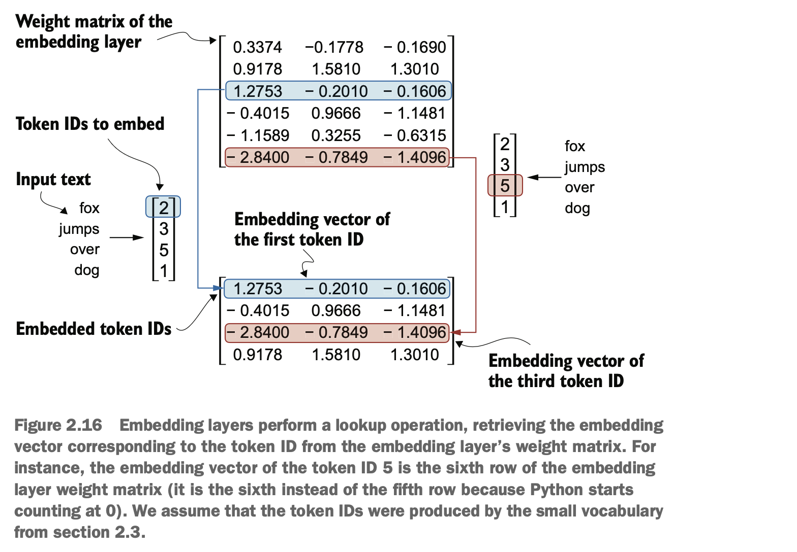

그림 2.16 임베딩 레이어는 임베딩 레이어의 가중치 행렬에서 토큰 ID에 해당하는 임베딩 벡터를 검색하는 룩업 연산을 수행합니다. 예를 들어, 토큰 ID 5의 임베딩 벡터는 임베딩 레이어 가중치 행렬의 여섯 번째 행입니다(Python이 0부터 계산을 시작하므로 다섯 번째가 아닌 여섯 번째 행입니다). 토큰 ID는 섹션 2.3의 작은 어휘에서 생성되었다고 가정합니다.

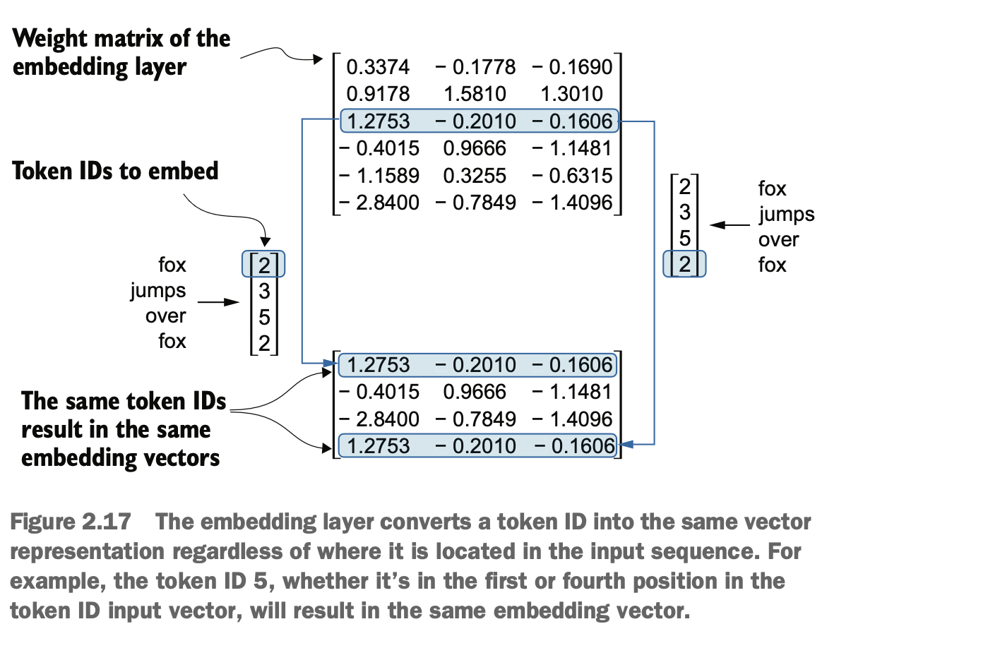

그림 2.17 임베딩 레이어는 입력 시퀀스에서 위치한 곳에 관계없이 토큰 ID를 동일한 벡터 표현으로 변환합니다. 예를 들어, 토큰 ID 5는 토큰 ID 입력 벡터의 첫 번째 또는 네 번째 위치에 있든 관계없이 동일한 임베딩 벡터를 만듭니다.

원칙적으로, 토큰 ID의 결정론적이고 위치 독립적인 임베딩은 재현성 목적으로 좋습니다. 하지만 LLM의 셀프 어텐션 메커니즘 자체도 위치 무관하므로, LLM에 추가 위치 정보를 주입하는 것이 도움이 됩니다.

이를 달성하기 위해, 위치 인식 임베딩의 두 가지 광범위한 범주를 사용할 수 있습니다: 상대 위치 임베딩과 절대 위치 임베딩. 절대 위치 임베딩은 시퀀스의 특정 위치와 직접 연관됩니다. 입력 시퀀스의 각 위치에 대해, 고유한 임베딩이 토큰의 임베딩에 추가되어 정확한 위치를 전달합니다. 예를 들어, 첫 번째 토큰은 특정 위치 임베딩을 가지고, 두 번째 토큰은 또 다른 고유한 임베딩을 가지는 식으로, 그림 2.18에 설명된 대로 진행됩니다.

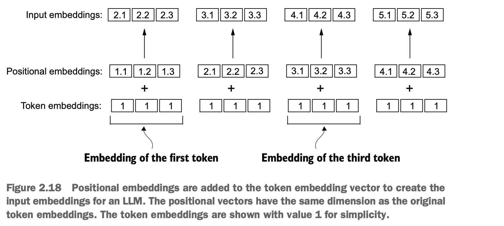

그림 2.18 위치 임베딩은 토큰 임베딩 벡터에 추가되어 LLM을 위한 입력 임베딩을 생성합니다. 위치 벡터는 원래 토큰 임베딩과 동일한 차원을 가집니다. 토큰 임베딩은 단순성을 위해 값 1로 표시됩니다.

토큰의 절대 위치에 초점을 맞추는 대신, 상대 위치 임베딩의 강조점은 토큰 간의 상대적 위치나 거리에 있습니다. 이는 모델이 "정확히 어떤 위치에"보다는 "얼마나 떨어져 있는지"의 관점에서 관계를 학습한다는 것을 의미합니다. 여기서 장점은 모델이 훈련 중에 보지 못한 길이라도 다양한 길이의 시퀀스에 더 잘 일반화할 수 있다는 것입니다.

두 유형의 위치 임베딩 모두 토큰 간의 순서와 관계를 이해하는 LLM의 능력을 증강하여 더 정확하고 컨텍스트 인식 예측을 보장하는 것을 목표로 합니다. 이들 간의 선택은 종종 특정 애플리케이션과 처리되는 데이터의 성격에 따라 달라집니다.

OpenAI의 GPT 모델은 원래 트랜스포머 모델의 고정되거나 사전 정의된 위치 인코딩과 같은 것이 아니라 훈련 과정 중에 최적화되는 절대 위치 임베딩을 사용합니다. 이 최적화 과정은 모델 훈련 자체의 일부입니다. 지금은 LLM 입력을 생성하기 위한 초기 위치 임베딩을 생성해보겠습니다.

이전에는 단순성을 위해 매우 작은 임베딩 크기에 초점을 맞췄습니다. 이제 더 현실적이고 유용한 임베딩 크기를 고려하고 입력 토큰을 256차원 벡터 표현으로 인코딩해보겠습니다. 이는 원래 GPT-3 모델이 사용한 것보다 작지만(GPT-3에서 임베딩 크기는 12,288차원) 실험에는 여전히 합리적입니다. 또한 토큰 ID가 이전에 구현한 BPE 토큰화기에 의해 생성되었으며, 어휘 크기가 50,257이라고 가정합니다:

```python
vocab_size = 50257
output_dim = 256
token_embedding_layer = torch.nn.Embedding(vocab_size, output_dim)
```

이전 token_embedding_layer를 사용하여, 데이터 로더에서 데이터를 샘플링하면 각 배치의 각 토큰을 256차원 벡터로 임베딩합니다. 각각 4개의 토큰을 가진 배치 크기 8이 있다면, 결과는 8×4×256 텐서가 될 것입니다.

먼저 데이터 로더를 인스턴스화해보겠습니다(섹션 2.6 참조):

```python
max_length = 4
dataloader = create_dataloader_v1(
    raw_text, batch_size=8, max_length=max_length,
    stride=max_length, shuffle=False
)
data_iter = iter(dataloader)
inputs, targets = next(data_iter)
print("Token IDs:\n", inputs)
print("\nInputs shape:\n", inputs.shape)
```

이 코드는 다음을 출력합니다:

```
Token IDs:
    tensor([[ 40, 367, 2885, 1464],
        [ 1807, 3619, 402, 271],
        [10899, 2138, 257, 7026],
        [15632, 438, 2016, 257],
        [ 922, 5891, 1576, 438],
        [ 568, 340, 373, 645],
        [ 1049, 5975, 284, 502],
        [ 284, 3285, 326, 11]])
```

```
Inputs shape:
    torch.Size([8, 4])
```

보시다시피, 토큰 ID 텐서는 8×4 차원이며, 이는 데이터 배치가 각각 4개의 토큰을 가진 8개의 텍스트 샘플로 구성되어 있음을 의미합니다.

이제 임베딩 레이어를 사용하여 이러한 토큰 ID를 256차원 벡터로 임베딩해보겠습니다:

```python
token_embeddings = token_embedding_layer(inputs)
print(token_embeddings.shape)
```

print 함수 호출은 다음을 반환합니다:
torch.Size([8, 4, 256])
8×4×256 차원 텐서 출력은 각 토큰 ID가 이제 256차원 벡터로 임베딩되었음을 보여줍니다.

GPT 모델의 절대 임베딩 접근법의 경우, token_embedding_layer와 동일한 임베딩 차원을 가진 또 다른 임베딩 레이어를 생성하기만 하면 됩니다:

```python
context_length = max_length
pos_embedding_layer = torch.nn.Embedding(context_length, output_dim)
pos_embeddings = pos_embedding_layer(torch.arange(context_length))
print(pos_embeddings.shape)
```

pos_embeddings의 입력은 일반적으로 최대 입력 길이 -1까지 0, 1, ... 의 숫자 시퀀스를 포함하는 플레이스홀더 벡터 torch.arange(context_length)입니다. context_length는 LLM의 지원 입력 크기를 나타내는 변수입니다. 여기서는 입력 텍스트의 최대 길이와 유사하게 선택합니다. 실제로는 입력 텍스트가 지원하는 컨텍스트 길이보다 길 수 있으며, 이 경우 텍스트를 잘라야 합니다.

print 문의 출력은
torch.Size([4, 256])

보시다시피, 위치 임베딩 텐서는 4개의 256차원 벡터로 구성됩니다. 이제 이를 토큰 임베딩에 직접 추가할 수 있습니다. 여기서 PyTorch는 4×256 차원 pos_embeddings 텐서를 8개 배치 각각의 4×256 차원 토큰 임베딩 텐서에 추가할 것입니다:

```python
input_embeddings = token_embeddings + pos_embeddings
print(input_embeddings.shape)
```

print 출력은
torch.Size([8, 4, 256])

그림 2.19에 요약된 input_embeddings는 다음 장에서 구현을 시작할 주요 LLM 모듈에서 처리될 수 있는 임베딩된 입력 예제입니다.

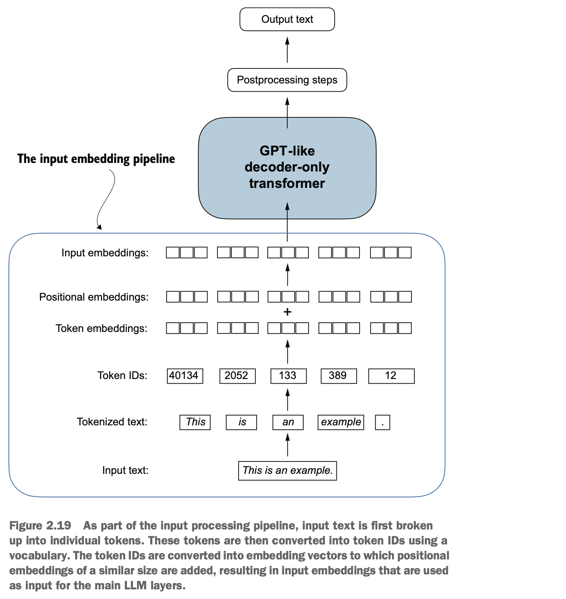

그림 2.19 입력 처리 파이프라인의 일부로, 입력 텍스트는 먼저 개별 토큰으로 분해됩니다. 이러한 토큰은 어휘를 사용하여 토큰 ID로 변환됩니다. 토큰 ID는 임베딩 벡터로 변환되며, 여기에 유사한 크기의 위치 임베딩이 추가되어 주요 LLM 레이어의 입력으로 사용되는 입력 임베딩이 만들어집니다.

# 요약

- LLM은 원시 텍스트를 처리할 수 없으므로 텍스트 데이터를 임베딩이라고 알려진 수치 벡터로 변환해야 합니다. 임베딩은 이산 데이터(단어나 이미지 등)를 연속 벡터 공간으로 변환하여 신경망 연산과 호환되게 만듭니다.
- 첫 번째 단계로, 원시 텍스트는 단어나 문자일 수 있는 토큰으로 분해됩니다. 그런 다음 토큰은 토큰 ID라고 하는 정수 표현으로 변환됩니다.
- <|unk|>와 <|endoftext|>와 같은 특수 토큰을 추가하여 알 수 없는 단어나 관련 없는 텍스트 간의 경계 표시와 같은 다양한 컨텍스트를 처리하고 모델의 이해를 향상시킬 수 있습니다.

- GPT-2와 GPT-3과 같은 LLM에 사용되는 바이트 페어 인코딩(BPE) 토큰화기는 알 수 없는 단어를 하위 단어 단위나 개별 문자로 분해하여 효율적으로 처리할 수 있습니다.
- 토큰화된 데이터에 슬라이딩 윈도우 접근법을 사용하여 LLM 훈련을 위한 입력-대상 쌍을 생성합니다.
- PyTorch의 임베딩 레이어는 토큰 ID에 해당하는 벡터를 검색하는 룩업 연산으로 기능합니다. 결과 임베딩 벡터는 LLM과 같은 딥러닝 모델을 훈련하는 데 중요한 토큰의 연속 표현을 제공합니다.
- 토큰 임베딩은 각 토큰에 대해 일관된 벡터 표현을 제공하지만 시퀀스에서 토큰의 위치에 대한 감각이 부족합니다. 이를 바로잡기 위해 절대와 상대의 두 가지 주요 유형의 위치 임베딩이 존재합니다. OpenAI의 GPT 모델은 토큰 임베딩 벡터에 추가되고 모델 훈련 중에 최적화되는 절대 위치 임베딩을 활용합니다.