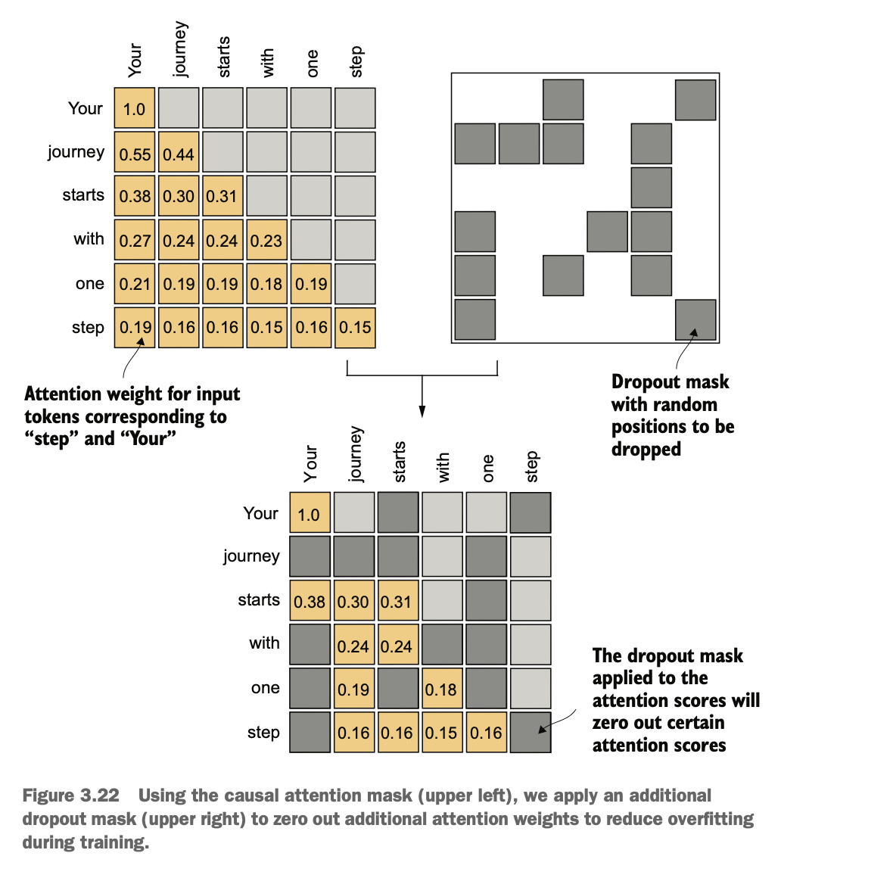

# 3 어텐션 메커니즘 코딩하기

>**이 장에서 다루는 내용**
>
>- 신경망에서 어텐션 메커니즘을 사용하는 이유
>- 기본 셀프 어텐션 프레임워크부터 향상된 셀프 어텐션 메커니즘까지
>- LLM이 한 번에 하나의 토큰을 생성할 수 있게 하는 인과적 어텐션 모듈
>- 과적합을 줄이기 위해 드롭아웃으로 무작위로 선택된 어텐션 가중치를 마스킹하는 방법
>- 여러 인과적 어텐션 모듈을 멀티헤드 어텐션 모듈로 쌓는 방법

이 시점에서 여러분은 텍스트를 개별 단어와 서브워드 토큰으로 분할하여 LLM 훈련을 위한 입력 텍스트를 준비하는 방법을 알고 있습니다. 이러한 토큰들은 LLM을 위한 벡터 표현, 즉 임베딩으로 인코딩될 수 있습니다.

이제 그림 3.1에서 볼 수 있듯이 LLM 아키텍처 자체의 핵심적인 부분인 어텐션 메커니즘을 살펴보겠습니다. 우리는 어텐션 메커니즘을 대부분 단독으로 살펴보고 메커니즘 수준에서 집중할 것입니다. 그런 다음 셀프 어텐션 메커니즘을 둘러싼 LLM의 나머지 부분들을 코딩하여 실제 동작을 확인하고 텍스트를 생성하는 모델을 만들어보겠습니다.


그림 3.1 LLM을 코딩하는 세 단계. 이 장은 1단계의 두 번째 단계, 즉 LLM 아키텍처의 핵심 구성요소인 어텐션 메커니즘 구현에 초점을 맞춥니다.

그림 3.2에서 볼 수 있듯이 우리는 네 가지 다른 어텐션 메커니즘 변형을 구현할 것입니다. 이러한 다른 어텐션 변형들은 서로를 바탕으로 구축되며, 목표는 다음 장에서 코딩할 LLM 아키텍처에 연결할 수 있는 컴팩트하고 효율적인 멀티헤드 어텐션 구현에 도달하는 것입니다.

- 아이디어를 직관적으로 소개하기 위한 단순화된 셀프 어텐션
- LLM에서 사용하는 메커니즘의 기초가 되는, 훈련 가능한 가중치를 포함한 셀프 어텐션
- 텍스트 생성 시 시간 순서를 보장하도록, 시퀀스에서 현재와 이전 입력만 고려하게 하는 LLM용 인과적(마스크드) 셀프 어텐션
- 어텐션 메커니즘을 여러 헤드로 구성하는 멀티헤드 어텐션


그림 3.2 이 장에서 구현할 다양한 어텐션 메커니즘을 보여줍니다. 먼저 단순화된 셀프 어텐션을 살펴보고, 이어 훈련 가능한 가중치를 추가합니다. 인과적 어텐션은 셀프 어텐션에 마스크를 적용해 LLM이 한 번에 한 단어씩 생성하도록 합니다. 마지막으로 멀티헤드 어텐션은 어텐션을 여러 헤드로 구성하여 입력의 다양한 측면을 병렬로 포착합니다.

## 3.1 긴 시퀀스 모델링의 문제점

LLM의 핵심인 셀프 어텐션 메커니즘으로 들어가기 전에, 어텐션 메커니즘이 포함되지 않은 LLM 이전 아키텍처의 문제를 먼저 살펴보겠습니다. 한 언어의 텍스트를 다른 언어로 번역하는 모델을 만들고자 한다고 가정해 보겠습니다. 그림 3.3에서 보듯이 원문과 번역문의 문법 구조 차이 때문에 텍스트를 단어 단위로 그대로 옮길 수는 없습니다.


그림 3.3 독일어에서 영어처럼 한 언어를 다른 언어로 번역할 때는 단순히 단어를 하나씩 치환할 수 없습니다. 번역에는 문맥적 이해와 문법적 정렬이 필요합니다.

이 문제를 해결하기 위해 보통 인코더와 디코더 두 하위 모듈로 구성된 심층 신경망을 사용합니다. 인코더는 먼저 전체 텍스트를 읽고 처리하며, 디코더는 그 결과를 바탕으로 번역된 텍스트를 생성합니다.

트랜스포머가 등장하기 전에는 순환신경망(RNN)이 번역을 위한 인코더–디코더 아키텍처로 가장 널리 사용되었습니다. RNN은 이전 단계의 출력을 현재 단계의 입력으로 사용하는 신경망으로, 텍스트와 같은 순차 데이터에 적합합니다. RNN에 익숙하지 않더라도 걱정하지 마십시오. 여기서는 RNN의 내부 동작까지 알 필요는 없고, 인코더–디코더 구도의 일반적 개념에 초점을 맞춥니다.

인코더–디코더 RNN에서는 입력 텍스트가 인코더로 들어가 순차적으로 처리됩니다. 인코더는 매 단계에서 은닉 상태(은닉층의 내부 값)를 갱신하여, 그림 3.4처럼 최종 은닉 상태에 입력 문장의 전체 의미를 담으려 합니다. 이후 디코더는 이 최종 은닉 상태를 받아 단어를 하나씩 생성하면서 번역을 시작합니다. 디코더 역시 단계마다 은닉 상태를 갱신하며, 이는 다음 단어 예측에 필요한 문맥을 담습니다.


그림 3.4 트랜스포머 이전에는 인코더–디코더 RNN이 기계번역에 널리 사용되었습니다. 인코더는 원문 언어의 토큰 시퀀스를 입력으로 받아, 은닉 상태(중간 신경망 계층)에 전체 입력 시퀀스의 압축된 표현을 인코딩합니다. 디코더는 현재 은닉 상태를 이용해 토큰을 하나씩 생성하며 번역을 시작합니다.

이러한 인코더–디코더 RNN의 내부 동작까지 알 필요는 없지만, 핵심은 인코더가 전체 입력 텍스트를 하나의 은닉 상태(메모리 셀)로 요약한다는 점입니다. 디코더는 이 은닉 상태를 받아 출력을 생성합니다. 이 은닉 상태는 2장에서 다룬 임베딩 벡터와 유사한 개념으로 볼 수 있습니다.

인코더–디코더 RNN의 큰 한계는 디코딩 단계에서 인코더의 과거 은닉 상태들에 직접 접근할 수 없다는 점입니다. 따라서 관련 정보를 모두 담고 있다고 가정되는 현재 은닉 상태에만 의존하게 됩니다. 이는 특히 의존성이 길게 이어지는 복잡한 문장에서 문맥 손실로 이어질 수 있습니다.

다행히 LLM을 구축하는 데 RNN을 깊이 이해할 필요는 없습니다. 인코더–디코더 RNN의 이러한 한계가 어텐션 메커니즘 설계의 동기가 되었다는 점만 기억하시면 됩니다.

## 3.2 어텐션 메커니즘으로 데이터 의존성 포착하기

RNN은 짧은 문장을 번역할 때는 잘 작동하지만, 입력 내 이전 단어들에 직접 접근할 수 없기 때문에 긴 텍스트에서는 성능이 떨어집니다. 이 접근 방식의 핵심 한계는, 디코더에 전달하기 전에 인코더가 인코딩된 전체 입력을 하나의 은닉 상태에 담아 기억해야 한다는 점입니다(그림 3.4).

이러한 이유로 2014년에 연구자들은 RNN을 위한 Bahdanau 어텐션 메커니즘을 제안했습니다(해당 논문의 제1저자 이름을 따서 명명[^2]). 이 메커니즘은 인코더–디코더 RNN을 수정하여, 디코더가 각 디코딩 단계마다 입력 시퀀스의 서로 다른 부분에 선택적으로 접근할 수 있도록 합니다(그림 3.5).


그림 3.5 어텐션 메커니즘을 사용하면, 텍스트를 생성하는 디코더가 모든 입력 토큰에 선택적으로 접근할 수 있습니다. 이는 특정 출력 토큰을 생성할 때 어떤 입력 토큰들은 다른 것들보다 더 중요할 수 있음을 의미합니다. 이러한 중요도는 나중에 계산할 어텐션 가중치로 결정됩니다. 참고로, 이 그림은 어텐션의 개념을 직관적으로 설명하기 위한 것으로, 본 도서 범위를 벗어나는 RNN 기반 Bahdanau 메커니즘의 정확한 구현을 묘사한 것은 아닙니다.

흥미롭게도 불과 3년 뒤, 연구자들은 자연어 처리용 심층 신경망을 구축하는 데 RNN 아키텍처가 필수적이지 않다는 사실을 보였고, Bahdanau 어텐션에서 영감을 받은 셀프 어텐션 메커니즘을 포함한 원조 트랜스포머 아키텍처(1장에서 논의)를 제안했습니다.

셀프 어텐션은 입력 시퀀스의 각 위치가 같은 시퀀스 내 다른 모든 위치와의 관련성을 평가(즉, "주의를 기울이도록")하여 시퀀스의 표현을 계산하도록 하는 메커니즘입니다. 셀프 어텐션은 GPT 계열처럼 트랜스포머 아키텍처에 기반한 현대적 LLM의 핵심 구성 요소입니다.

이 장에서는 그림 3.6과 같이 GPT 계열 모델에서 사용하는 셀프 어텐션 메커니즘을 구현하고 이해하는 데 집중합니다. 다음 장에서는 LLM의 나머지 구성 요소를 코딩합니다.


그림 3.6 셀프 어텐션은 시퀀스 내 각 위치가 다른 모든 위치와 상호작용하며 중요도를 가중해 더 효율적인 입력 표현을 계산하도록 하는 트랜스포머의 메커니즘입니다. 이 장에서는 다음 장에서 GPT 계열 LLM의 나머지 부분을 코딩하기에 앞서, 이 셀프 어텐션 메커니즘을 바닥부터 구현합니다.

## 3.3 셀프 어텐션으로 입력의 다른 부분에 주의 기울이기

이제 셀프 어텐션 메커니즘의 내부 동작을 살펴보고, 이를 바닥부터 구현하는 방법을 학습하겠습니다. 셀프 어텐션은 트랜스포머 기반 모든 LLM의 초석입니다. 다소 집중력이 요구되는 주제이지만, 핵심을 이해하시면 본 도서와 전반적인 LLM 구현에서 가장 어려운 부분 중 하나를 정복하신 셈입니다.

>**셀프 어텐션에서 '셀프'의 의미**
>
>셀프 어텐션에서 "셀프"는 하나의 입력 시퀀스 내부의 서로 다른 위치들 간 관계를 통해 어텐션 가중치를 계산하는 능력을 의미합니다. 문장 내 단어들, 이미지의 픽셀들처럼 입력 자체의 여러 부분들 사이의 관계와 의존성을 평가하고 학습합니다.
>
>이는 전통적 어텐션 메커니즘과 대조적입니다. 전통적 메커니즘은 보통 두 개의 서로 다른 시퀀스 간 관계(예: 입력 시퀀스와 출력 시퀀스 간 어텐션; 그림 3.5 참조)에 초점을 맞춥니다.

셀프 어텐션은 처음 접하시면 복잡하게 느껴질 수 있습니다. 먼저 단순화된 버전부터 살펴본 뒤, LLM에서 사용하는 훈련 가능한 가중치를 포함한 셀프 어텐션을 구현하겠습니다.

### 3.3.1 훈련 가능한 가중치 없는 간단한 셀프 어텐션 메커니즘

그림 3.7에 요약된 것처럼, 훈련 가능한 가중치가 전혀 없는 단순화된 셀프 어텐션 변형부터 구현해 보겠습니다. 목적은 가중치를 추가하기 전에 셀프 어텐션의 핵심 개념 몇 가지를 이해하도록 돕는 것입니다.


그림 3.7 셀프 어텐션의 목표는 각 입력 요소에 대해 다른 모든 입력 요소의 정보를 결합한 컨텍스트 벡터를 계산하는 것입니다. 이 예에서는 컨텍스트 벡터 $z^{(2)}$를 계산합니다. $z^{(2)}$를 계산할 때 각 입력 요소의 중요도 또는 기여도는 어텐션 가중치 $\alpha_{23}$부터 $\alpha_{27}$까지로 결정됩니다. $z^{(2)}$를 계산할 때는 입력 요소 $x^{(2)}$와 다른 모든 입력에 대한 어텐션 가중치를 사용합니다.

그림 3.7은 $x$로 표기된 입력 시퀀스를 보여줍니다. 이 시퀀스는 $x^{(1)}$부터 $x^{(T)}$까지 총 $T$개의 요소로 이루어져 있으며, 일반적으로 이미 토큰 임베딩으로 변환된 문장과 같은 텍스트를 나타냅니다.

예를 들어 "Your journey starts with one step."라는 입력 텍스트를 생각해 봅시다. 이때 $x^{(1)}$과 같은 시퀀스의 각 요소는 "Your"와 같은 특정 토큰을 나타내는 $d$차원 임베딩 벡터에 대응합니다. 그림 3.7에서는 이러한 입력 벡터들을 3차원 임베딩으로 표시했습니다.

셀프 어텐션에서의 목표는 입력 시퀀스의 각 요소 $x^{(i)}$에 대해 컨텍스트 벡터 $z^{(i)}$를 계산하는 것입니다. 컨텍스트 벡터는 정보를 풍부하게 담은 임베딩 벡터로 해석할 수 있습니다.

이 개념을 설명하기 위해, 두 번째 입력 요소 $x^{(2)}$(토큰 "journey"에 해당)와 그림 3.7 하단에 표시된 대응 컨텍스트 벡터 $z^{(2)}$에 주목하겠습니다. 향상된 컨텍스트 벡터 $z^{(2)}$는 $x^{(2)}$ 자체와 $x^{(1)}$부터 $x^{(T)}$까지의 모든 다른 입력 요소들에 대한 정보를 담은 임베딩입니다.

컨텍스트 벡터는 셀프 어텐션에서 중요한 역할을 합니다. 이들의 목적은 시퀀스의 다른 모든 요소들의 정보를 통합하여 입력 시퀀스(문장 등)의 각 요소에 대한 향상된 표현을 만드는 것입니다(그림 3.7). 이는 문장 내 단어들 간의 관계와 관련성을 이해해야 하는 LLM에 필수적입니다. 나중에는 LLM이 다음 토큰 생성에 관련된 컨텍스트 벡터를 구성하는 방법을 학습하도록 돕는 훈련 가능한 가중치를 추가할 것입니다. 하지만 먼저 이러한 가중치와 결과 컨텍스트 벡터를 단계별로 계산하는 단순화된 셀프 어텐션 메커니즘을 구현해보겠습니다.

다음과 같이 이미 3차원 벡터로 임베딩된 입력 문장을 살펴봅시다(2장 참조). 페이지에서 줄바꿈 없이 표시되도록 작은 임베딩 차원을 선택했습니다:

```python
import torch  # PyTorch 라이브러리 임포트
inputs = torch.tensor(
    [
        [0.43, 0.15, 0.89],  # 'Your' 토큰의 임베딩 (x^1)
        [0.55, 0.87, 0.66],  # 'journey' 토큰의 임베딩 (x^2)
        [0.57, 0.85, 0.64],  # 'starts' 토큰의 임베딩 (x^3)
        [0.22, 0.58, 0.33],  # 'with' 토큰의 임베딩 (x^4)
        [0.77, 0.25, 0.10],  # 'one' 토큰의 임베딩 (x^5)
        [0.05, 0.80, 0.55],  # 'step' 토큰의 임베딩 (x^6)
    ]
)
```

셀프 어텐션을 구현하는 첫 번째 단계는 그림 3.8에 나타난 것처럼 어텐션 스코어라고 불리는 중간 값 $\omega$를 계산하는 것입니다. 공간상의 제약으로 인해 그림에서는 앞선 입력 텐서의 값들을 축약해서 표시했습니다. 예를 들어, 0.87은 0.8로 축약되었습니다. 이렇게 축약된 버전에서는 우연히 "journey"와 "starts"라는 단어의 임베딩이 비슷해 보일 수 있습니다.


그림 3.8 전체 목표는 두 번째 입력 $x^{(2)}$을 쿼리로 사용하여 컨텍스트 벡터 $z^{(2)}$를 계산하는 과정을 보여주는 것입니다. 이 그림은 첫 중간 단계로, 쿼리 $x^{(2)}$와 다른 모든 입력 요소 간 도트 곱으로 어텐션 스코어 $\omega$를 계산하는 과정을 나타냅니다(가독성을 위해 소수 첫째 자리까지만 표기했습니다).

그림 3.8은 쿼리 토큰과 각 입력 토큰 간의 중간 어텐션 스코어를 계산하는 방법을 보여줍니다. 이러한 스코어는 쿼리 $x^{(2)}$와 다른 모든 입력 토큰의 도트 곱을 계산하여 결정됩니다:

```python
query = inputs[1]  # 두 번째 토큰(x^2='journey')을 쿼리로 선택
attn_scores_2 = torch.empty(inputs.shape[0])  # 각 입력에 대한 어텐션 스코어 저장 텐서
for i, x_i in enumerate(inputs):
    attn_scores_2[i] = torch.dot(x_i, query)  # 도트 곱으로 유사도(스코어) 계산
print(attn_scores_2)  # 정규화 전 스코어 출력
```

계산된 어텐션 스코어는 다음과 같습니다:

```
tensor([0.9544, 1.4950, 1.4754, 0.8434, 0.7070, 1.0865])
```

>**도트 곱의 이해**
> 도트 곱은 본질적으로 두 벡터를 요소별로 곱한 다음 그 곱들의 합을 구하는 간결한 방법으로, 다음과 같이 설명할 수 있습니다:
>
>```python
>res = 0.  # 요소별 곱의 합을 직접 계산해 도트 곱을 검증
>for idx, element in enumerate(inputs[0]):
>    res += inputs[0][idx] * query[idx]
>print(res)  # 수동 합산 결과
>print(torch.dot(inputs[0], query))  # torch.dot 결과(동일해야 함)
>```
>
>출력은 요소별 곱셈의 합이 도트 곱과 동일한 결과를 준다는 것을 확인해 줍니다:
>
>```
>tensor(0.9544)
>tensor(0.9544)
>```
>
>도트 곱 연산을 두 벡터를 결합하여 스칼라 값을 산출하는 수학적 도구로 보는 것 이상으로, 도트 곱은 두 벡터가 얼마나 잘 정렬되어 있는지를 정량화하므로 유사성의 척도입니다. 더 높은 도트 곱은 벡터들 간에 더 큰 정렬 정도 또는 유사성을 나타냅니다. 수학적으로, 두 벡터 $\mathbf{a}$와 $\mathbf{b}$ 간의 도트 곱은 다음과 같이 정의됩니다:
>
>$$
>\mathbf{a} \cdot \mathbf{b} = \sum_{i=1}^{n} a_i b_i
>$$
>
>여기서 $n$은 벡터의 차원입니다. 셀프 어텐션 메커니즘의 맥락에서, 도트 곱은 시퀀스의 각 요소가 다른 요소에 얼마나 집중하거나 "주의를 기울이는지"를 결정합니다. 도트 곱이 높을수록 두 요소 간의 유사성과 어텐션 스코어가 더 높습니다.

다음 단계에서는 그림 3.9에 나타난 것처럼 이전에 계산한 각 어텐션 스코어를 정규화합니다. 정규화의 주요 목표는 합이 1이 되는 어텐션 가중치를 얻는 것입니다. 이 정규화는 해석에 유용하고 LLM에서 훈련 안정성을 유지하는 관례입니다. 이 정규화 단계를 달성하는 간단한 방법은 다음과 같습니다:

```python
attn_weights_2_tmp = attn_scores_2 / attn_scores_2.sum()  # 합이 1이 되도록 단순 정규화
print("Attention weights:", attn_weights_2_tmp)
print("Sum:", attn_weights_2_tmp.sum())  # 1이어야 함
```


그림 3.9 입력 쿼리 $x^{(2)}$에 대한 어텐션 스코어 $\omega_{21}$부터 $\omega_{27}$를 계산한 후, 이를 정규화하여 어텐션 가중치 $\alpha_{21}$부터 $\alpha_{27}$를 얻습니다.

출력에서 보듯이, 어텐션 가중치는 이제 합이 1이 됩니다:

```
Attention weights: tensor([0.1455, 0.2278, 0.2249, 0.1285, 0.1077, 0.1656])
Sum: tensor(1.0000)
```

실제로는 정규화에 소프트맥스 함수를 사용하는 것이 더 일반적이고 권장됩니다. 이 접근법은 극단적인 값을 더 잘 관리하고 훈련 중에 더 유리한 기울기 특성을 제공합니다. 다음은 어텐션 스코어를 정규화하기 위한 소프트맥스 함수의 기본 구현입니다:

```python
def softmax_naive(x):
    # 주의: 수치적 안정성이 떨어져 큰/작은 값에서 오버/언더플로우가 발생할 수 있음
    return torch.exp(x) / torch.exp(x).sum(dim=0)

attn_weights_2_naive = softmax_naive(attn_scores_2)  # 소프트맥스로 정규화(개념 시연용)
print("Attention weights:", attn_weights_2_naive)
print("Sum:", attn_weights_2_naive.sum())  # 1이어야 함
```

출력에서 보듯이, 소프트맥스 함수도 목표를 달성하고 어텐션 가중치를 합이 1이 되도록 정규화합니다:

소프트맥스 함수는 다음과 같이 정의됩니다:

$$
\text{softmax}(x_i) = \frac{e^{x_i}}{\sum_{j=1}^{n} e^{x_j}}
$$

여기서 $x_i$는 입력 벡터의 $i$번째 요소이고, $n$은 총 요소의 수입니다. 이 함수는 모든 출력 값이 양수이고 합이 1이 되도록 보장하여, 이들을 확률로 해석할 수 있게 합니다.

```
Attention weights: tensor([0.1385, 0.2379, 0.2333, 0.1240, 0.1082, 0.1581])
Sum: tensor(1.)
```

또한, 소프트맥스 함수는 어텐션 가중치가 항상 양수가 되도록 보장합니다. 이는 출력을 확률이나 상대적 중요도로 해석할 수 있게 하며, 더 높은 가중치는 더 큰 중요도를 나타냅니다.

이 순수한 소프트맥스 구현(softmax_naive)은 큰 값이나 작은 입력 값을 다룰 때 오버플로우와 언더플로우 같은 수치적 불안정성 문제에 직면할 수 있다는 점에 주목하세요. 따라서 실제로는 성능을 위해 광범위하게 최적화된 PyTorch의 소프트맥스 구현을 사용하는 것이 좋습니다:

```python
attn_weights_2 = torch.softmax(attn_scores_2, dim=0)  # PyTorch 내장 안정적 softmax 사용 권장
print("Attention weights:", attn_weights_2)
print("Sum:", attn_weights_2.sum())  # 1이어야 함
```

이 경우 이전의 softmax_naive 함수와 동일한 결과를 산출합니다:

```
Attention weights: tensor([0.1385, 0.2379, 0.2333, 0.1240, 0.1082, 0.1581])
Sum: tensor(1.)
```

이제 정규화된 어텐션 가중치를 계산했으므로, 그림 3.10에 나타난 최종 단계를 수행할 준비가 되었습니다: 임베딩된 입력 토큰 $x^{(i)}$에 해당하는 어텐션 가중치를 곱하고 결과 벡터들을 합하여 컨텍스트 벡터 $z^{(2)}$를 계산하는 것입니다. 따라서 컨텍스트 벡터 $z^{(2)}$는 각 입력 벡터에 해당하는 어텐션 가중치를 곱하여 얻은 모든 입력 벡터의 가중합입니다:

```python
query = inputs[1]  # 동일 쿼리 사용
context_vec_2 = torch.zeros(query.shape)  # 컨텍스트 벡터 초기화
for i, x_i in enumerate(inputs):
    context_vec_2 += attn_weights_2[i] * x_i  # 가중합으로 컨텍스트 벡터 계산
print(context_vec_2)
```

이 계산의 결과는 다음과 같습니다:

```
tensor([0.4419, 0.6515, 0.5683])
```


그림 3.10 쿼리 $x^{(2)}$에 대한 어텐션 스코어를 계산·정규화해 가중치를 얻은 뒤, 마지막 단계로 컨텍스트 벡터 $z^{(2)}$를 계산합니다. 이 컨텍스트 벡터는 $x^{(1)}$부터 $x^{(7)}$까지 모든 입력 벡터에 어텐션 가중치를 적용해 결합한 것입니다.

다음으로는 컨텍스트 벡터를 계산하는 이 절차를 일반화하여 모든 컨텍스트 벡터를 동시에 계산하겠습니다.

### 3.3.2 모든 입력 토큰에 대한 어텐션 가중치 계산 

지금까지 그림 3.11의 강조된 행에서 보듯이 입력 2에 대한 어텐션 가중치와 컨텍스트 벡터를 계산했습니다. 이제 이 계산을 확장하여 모든 입력에 대한 어텐션 가중치와 컨텍스트 벡터를 계산해보겠습니다.


그림 3.11 강조된 행은 두 번째 입력 요소를 쿼리로 하는 어텐션 가중치를 보여줍니다. 이제 다른 모든 어텐션 가중치를 얻기 위해 계산을 일반화하겠습니다. (시각적 혼잡을 줄이기 위해 이 그림의 숫자들은 소수점 둘째 자리까지 잘렸다는 점을 참고하세요. 각 행의 값들은 1.0 또는 100%가 되어야 합니다.)

앞서와 동일한 세 단계를 따르되(그림 3.12 참조), 두 번째 컨텍스트 벡터 $z^{(2)}$만이 아닌 모든 컨텍스트 벡터를 계산하기 위해 코드에 몇 가지 수정을 가합니다:

```python
attn_scores = torch.empty(6, 6)  # (쿼리 idx, 키 idx)별 스코어 행렬
for i, x_i in enumerate(inputs):
    for j, x_j in enumerate(inputs):
        attn_scores[i, j] = torch.dot(x_i, x_j)  # 모든 쌍의 도트 곱
print(attn_scores)
```


그림 3.12 1단계에서는 모든 입력 쌍에 대한 도트 곱을 계산하기 위해 for 루프를 하나 더 추가합니다.

결과 어텐션 스코어는 다음과 같습니다:

```
tensor([[0.9995, 0.9544, 0.9422, 0.4753, 0.4576, 0.6310],
    [0.9544, 1.4950, 1.4754, 0.8434, 0.7070, 1.0865],
    [0.9422, 1.4754, 1.4570, 0.8296, 0.7154, 1.0605],
    [0.4753, 0.8434, 0.8296, 0.4937, 0.3474, 0.6565],
    [0.4576, 0.7070, 0.7154, 0.3474, 0.6654, 0.2935],
    [0.6310, 1.0865, 1.0605, 0.6565, 0.2935, 0.9450]])
```

텐서의 각 요소는 그림 3.11에서 본 것처럼 각 입력 쌍 간의 어텐션 스코어를 나타냅니다. 해당 그림의 값들은 정규화되어 있어서 앞의 텐서에 있는 정규화되지 않은 어텐션 스코어와 다르다는 점에 주목하세요. 정규화는 나중에 처리하겠습니다.

앞의 어텐션 스코어 텐서를 계산할 때 Python의 for 루프를 사용했습니다. 하지만 for 루프는 일반적으로 느리므로, 행렬 곱셈을 사용하여 동일한 결과를 얻을 수 있습니다:

```python
attn_scores = inputs @ inputs.T  # 행렬 곱으로 모든 쌍의 도트 곱을 벡터화 계산
print(attn_scores)
```

결과가 이전과 동일하다는 것을 시각적으로 확인할 수 있습니다:

```
tensor([[0.9995, 0.9544, 0.9422, 0.4753, 0.4576, 0.6310],
    [0.9544, 1.4950, 1.4754, 0.8434, 0.7070, 1.0865],
    [0.9422, 1.4754, 1.4570, 0.8296, 0.7154, 1.0605],
    [0.4753, 0.8434, 0.8296, 0.4937, 0.3474, 0.6565],
    [0.4576, 0.7070, 0.7154, 0.3474, 0.6654, 0.2935],
    [0.6310, 1.0865, 1.0605, 0.6565, 0.2935, 0.9450]])
```

그림 3.12의 2단계에서는 각 행의 값들이 1이 되도록 각 행을 정규화합니다:

```python
attn_weights = torch.softmax(attn_scores, dim=-1)  # 각 행(토큰별) 분포로 정규화
print(attn_weights)
```

다음은 그림 3.10에 표시된 값과 일치하는 어텐션 가중치 텐서를 반환합니다:

```
tensor([[0.2098, 0.2006, 0.1981, 0.1242, 0.1220, 0.1452],
    [0.1385, 0.2379, 0.2333, 0.1240, 0.1082, 0.1581],
    [0.1390, 0.2369, 0.2326, 0.1242, 0.1108, 0.1565],
    [0.1435, 0.2074, 0.2046, 0.1462, 0.1263, 0.1720],
    [0.1526, 0.1958, 0.1975, 0.1367, 0.1879, 0.1295],
    [0.1385, 0.2184, 0.2128, 0.1420, 0.0988, 0.1896]])
```

PyTorch를 사용하는 맥락에서, torch.softmax와 같은 함수의 dim 매개변수는 함수가 계산될 입력 텐서의 차원을 지정합니다. dim=-1로 설정하면 attn_scores 텐서의 마지막 차원을 따라 정규화를 적용하도록 소프트맥스 함수에 지시하는 것입니다. attn_scores가 2차원 텐서(예: [rows, columns] 모양)인 경우, 각 행의 값들(열 차원에 대한 합)이 1이 되도록 열에 걸쳐 정규화합니다.

행들이 실제로 모두 1이 되는지 확인할 수 있습니다:

```python
row_2_sum = sum([0.1385, 0.2379, 0.2333, 0.1240, 0.1082, 0.1581])  # 예시 행 합 검증
print("Row 2 sum:", row_2_sum)
print("All row sums:", attn_weights.sum(dim=-1))  # 모든 행 합이 1인지 검증
```

결과는 다음과 같습니다:

```
Row 2 sum: 1.0
All row sums: tensor([1.0000, 1.0000, 1.0000, 1.0000, 1.0000, 1.0000])
```

그림 3.12의 세 번째이자 마지막 단계에서는 이러한 어텐션 가중치를 사용하여 행렬 곱셈을 통해 모든 컨텍스트 벡터를 계산합니다:

```python
all_context_vecs = attn_weights @ inputs  # 모든 컨텍스트 벡터를 한 번에 계산
print(all_context_vecs)
```

결과 출력 텐서에서 각 행은 3차원 컨텍스트 벡터를 포함합니다:

```
tensor([[0.4421, 0.5931, 0.5790],
    [0.4419, 0.6515, 0.5683],
    [0.4431, 0.6496, 0.5671],
    [0.4304, 0.6298, 0.5510],
    [0.4671, 0.5910, 0.5266],
    [0.4177, 0.6503, 0.5645]])
```

두 번째 행을 3.3.1절에서 계산한 컨텍스트 벡터 $z^{(2)}$와 비교하여 코드가 올바른지 다시 확인할 수 있습니다:

```python
print("Previous 2nd context vector:", context_vec_2)  # 개별 계산과 일치하는지 확인
```

결과를 바탕으로, 이전에 계산한 context_vec_2가 이전 텐서의 두 번째 행과 정확히 일치한다는 것을 알 수 있습니다:

```
Previous 2nd context vector: tensor([0.4419, 0.6515, 0.5683])
```

이것으로 간단한 셀프 어텐션 메커니즘의 코드 설명을 마칩니다. 다음으로는 훈련 가능한 가중치를 추가하여 LLM이 데이터로부터 학습하고 특정 작업에서 성능을 향상시킬 수 있도록 하겠습니다.

## 3.4 훈련 가능한 가중치를 사용한 셀프 어텐션 구현 

다음 단계에서는 원조 트랜스포머 아키텍처, GPT 계열, 그리고 대부분의 인기 있는 LLM에서 사용하는 셀프 어텐션 메커니즘을 구현하겠습니다. 이 셀프 어텐션 메커니즘은 스케일드 도트 곱 어텐션(scaled dot-product attention)이라고도 합니다. 그림 3.13은 이 셀프 어텐션 메커니즘이 LLM 구현의 큰 흐름 속에서 어디에 위치하는지를 보여줍니다.


그림 3.13 앞서 어텐션의 기본 원리를 이해하기 위해 단순화된 메커니즘을 코딩했습니다. 이제 여기에 훈련 가능한 가중치를 추가합니다. 이후에는 인과적 마스크와 멀티헤드를 더해 확장하겠습니다.

그림 3.13과 같이, 훈련 가능한 가중치를 포함한 셀프 어텐션은 이전 개념을 바탕으로 합니다. 특정 입력 요소를 기준으로 입력 벡터들의 가중합으로 컨텍스트 벡터를 계산합니다. 보시다시피 앞서 구현한 기본 셀프 어텐션과 비교해 달라지는 부분은 크지 않습니다.

가장 큰 차이는 학습 중에 업데이트되는 가중치 행렬의 도입입니다. 이 학습 가능한 가중치 행렬은 모델(정확히는 모델 내 어텐션 모듈)이 "좋은" 컨텍스트 벡터를 생성하도록 학습하는 데 필수적입니다(LLM 학습은 5장에서 다룹니다).

이 셀프 어텐션은 두 부분으로 나누어 다루겠습니다. 먼저 이전처럼 단계별로 구현하고, 다음으로 LLM 아키텍처에 가져다 쓸 수 있도록 간결한 Python 클래스로 정리합니다.

## 3.4.1 어텐션 가중치를 단계별로 계산하기 

세 개의 학습 가능한 가중치 행렬 $W_q, W_k, W_v$을 도입해 셀프 어텐션을 단계별로 구현합니다. 그림 3.14처럼 이 세 행렬은 임베딩된 입력 토큰 $x^{(i)}$을 각각 쿼리, 키, 값 벡터로 사상하는 데 사용됩니다.


이는 가중치 행렬 $W_v$와 입력 토큰 $x^{(1)}$의 행렬 곱으로 얻은 첫 번째 입력 토큰에 대한 값 벡터입니다.

그림 3.14 학습 가능한 가중치 행렬을 사용하는 셀프 어텐션의 1단계에서는 입력 요소 $x$에 대한 쿼리(q), 키(k), 값(v) 벡터를 계산합니다. 앞 절과 동일하게 두 번째 입력 $x^{(2)}$를 쿼리 입력으로 둡니다. 쿼리 벡터 $q^{(2)}$는 입력 $x^{(2)}$와 가중치 행렬 $W_q$의 행렬 곱으로 얻습니다. 키와 값 벡터도 각각 $W_k$, $W_v$와의 행렬 곱으로 구합니다.

앞서 단순화된 어텐션에서 컨텍스트 벡터 $z^{(2)}$를 계산할 때 두 번째 입력 $x^{(2)}$를 쿼리로 두었습니다. 이후 "Your journey starts with one step."라는 6단어 입력 문장 전체에 대해 $z^{(1)} \ldots z^{(T)}$를 계산하도록 일반화했습니다.

여기서도 먼저 예시를 위해 컨텍스트 벡터 $z^{(2)}$ 하나만 계산해 본 뒤, 모든 컨텍스트 벡터를 계산하도록 코드를 확장합니다.

몇 가지 변수를 정의하는 것부터 시작하겠습니다:

```python
x_2 = inputs[1]
d_in = inputs.shape[1]
d_out = 2
```

GPT 계열 모델에서는 보통 입력과 출력 차원이 같지만, 계산을 따라가기 쉽게 여기서는 입력($d_{in}=3$)과 출력($d_{out}=2$) 차원을 다르게 설정합니다.

다음으로, 그림 3.14에 나타난 세 개의 가중치 행렬 $W_{\mathrm{q}}, W_{\mathrm{k}}$, $W_{\mathrm{v}}$를 초기화합니다:

```python
torch.manual_seed(123)
W_query = torch.nn.Parameter(torch.rand(d_in, d_out), requires_grad=False)
W_key = torch.nn.Parameter(torch.rand(d_in, d_out), requires_grad=False)
W_value = torch.nn.Parameter(torch.rand(d_in, d_out), requires_grad=False)
```

출력의 불필요한 정보를 줄이기 위해 `requires_grad=False`로 설정했습니다. 실제 모델 학습에 사용할 경우에는 학습 동안 행렬을 업데이트하도록 `requires_grad=True`로 설정합니다.

다음으로, 쿼리, 키, 값 벡터를 계산합니다:

```python
query_2 = x_2 @ W_query
key_2 = x_2 @ W_key
value_2 = x_2 @ W_value
print(query_2)
```

쿼리의 출력은 대응 가중치 행렬의 열 수를 $d_{out}=2$로 두었기 때문에 2차원 벡터가 됩니다.

```
tensor([0.4306, 1.4551])
```

>**가중치 매개변수 대 어텐션 가중치**
>
> 가중치 행렬 $W$에서 "가중치"라는 용어는 "가중치 매개변수"의 줄임말로, 훈련 중에 최적화되는 신경망의 값들을 의미합니다. 이는 어텐션 가중치와 혼동되어서는 안 됩니다. 이미 보았듯이, 어텐션 가중치는 컨텍스트 벡터가 입력의 서로 다른 부분들에 얼마나 의존하는지(즉, 네트워크가 입력의 서로 다른 부분들에 얼마나 집중하는지)를 결정합니다.
>
> 요약하면, 가중치 매개변수는 네트워크의 연결을 정의하는 학습된 기본 계수이고, 어텐션 가중치는 동적이고 맥락에 특화된 값들입니다.

임시 목표가 하나의 컨텍스트 벡터 $z^{(2)}$만 계산하는 것이더라도, 쿼리 $q^{(2)}$와 관련된 어텐션 가중치를 계산하는 데 관련되므로 모든 입력 요소에 대한 키와 값 벡터가 여전히 필요합니다(그림 3.14 참조).

행렬 곱셈을 통해 모든 키와 값을 얻을 수 있습니다:

```python
keys = inputs @ W_key
values = inputs @ W_value
print("keys.shape:", keys.shape)
print("values.shape:", values.shape)
```

출력에서 알 수 있듯이, 6개의 입력 토큰을 3차원에서 2차원 임베딩 공간으로 성공적으로 투영했습니다:

```
keys.shape: torch.Size([6, 2])
values.shape: torch.Size([6, 2])
```

두 번째 단계는 그림 3.15에 나타난 것처럼 어텐션 스코어를 계산하는 것입니다.


그림 3.15 어텐션 스코어 계산은 3.3절의 단순화된 셀프 어텐션 메커니즘에서 사용한 것과 유사한 도트 곱 계산입니다. 여기서 새로운 점은 입력 요소들 간에 직접 도트 곱을 계산하지 않고, 각각의 가중치 행렬을 통해 입력을 변환하여 얻은 쿼리와 키를 사용한다는 것입니다.

먼저 어텐션 스코어 $\omega_{22}$를 계산해보겠습니다:

```python
keys_2 = keys[1] # Python은 0부터 인덱싱을 시작한다는 점을 기억하세요
attn_score_22 = query_2.dot(keys_2)
print(attn_score_22)
```

정규화되지 않은 어텐션 스코어의 결과는 다음과 같습니다:

```
tensor(1.8524)
```

다시, 행렬 곱셈을 통해 이 계산을 모든 어텐션 스코어로 일반화할 수 있습니다:

```python
attn_scores_2 = query_2 @ keys.T # 주어진 쿼리에 대한 모든 어텐션 스코어
print(attn_scores_2)
```

빠른 확인으로, 출력의 두 번째 요소가 이전에 계산한 attn_score_22와 일치한다는 것을 알 수 있습니다:

```
tensor([1.2705, 1.8524, 1.8111, 1.0795, 0.5577, 1.5440])
```

이제 그림 3.16에 나타난 것처럼 어텐션 스코어에서 어텐션 가중치로 넘어가고자 합니다. 어텐션 스코어를 스케일링하고 소프트맥스 함수를 사용하여 어텐션 가중치를 계산합니다. 하지만 이제는 키의 임베딩 차원의 제곱근으로 나누어 어텐션 스코어를 스케일링합니다(제곱근을 취하는 것은 수학적으로 0.5의 거듭제곱과 같습니다):

```python
d_k = keys.shape[-1]
attn_weights_2 = torch.softmax(attn_scores_2 / d_k**0.5, dim=-1)
print(attn_weights_2)
```


그림 3.16 어텐션 스코어 $\omega$를 계산한 후, 다음 단계는 소프트맥스 함수를 사용하여 이러한 스코어를 정규화하여 어텐션 가중치 $\alpha$를 얻는 것입니다.

결과 어텐션 가중치는 다음과 같습니다:

```
tensor([0.1500, 0.2264, 0.2199, 0.1311, 0.0906, 0.1820])
```

>**스케일드 도트 곱 어텐션의 이론적 근거**
>
> 임베딩 차원 크기로 정규화하는 이유는 작은 기울기를 피하여 훈련 성능을 향상시키기 위함입니다. 예를 들어, GPT 유사 LLM에서 일반적으로 1,000보다 큰 임베딩 차원을 확장할 때, 큰 도트 곱은 소프트맥스 함수가 적용되어 역전파 중에 매우 작은 기울기를 초래할 수 있습니다. 스케일드 도트 곱 어텐션은 다음과 같이 계산됩니다:
>
>$$
>\text{Attention}(Q, K, V) = \text{softmax}\left(\frac{QK^T}{\sqrt{d_k}}\right)V
>$$
>
>여기서 $Q$, $K$, $V$는 각각 쿼리, 키, 값 행렬이고, $d_k$는 키 벡터의 차원입니다. 스케일링 인수 $\frac{1}{\sqrt{d_k}}$는 도트 곱이 너무 커지는 것을 방지하여 소프트맥스 함수가 매우 작은 기울기를 가지는 영역으로 밀려나는 것을 막습니다. 임베딩 차원의 제곱근으로 스케일링하는 것이 이 셀프 어텐션 메커니즘이 스케일드 도트 곱 어텐션이라고도 불리는 이유입니다.

이제 마지막 단계는 그림 3.17에서 보여주는 것처럼 컨텍스트 벡터를 계산하는 것입니다.


그림 3.17 셀프 어텐션 계산의 마지막 단계에서, 어텐션 가중치를 통해 모든 값 벡터를 결합하여 컨텍스트 벡터를 계산합니다.

입력 벡터들에 대한 가중합으로 컨텍스트 벡터를 계산했던 것과 유사하게(3.3절 참조), 이제는 값 벡터들에 대한 가중합으로 컨텍스트 벡터를 계산합니다. 여기서 어텐션 가중치는 각 값 벡터의 상대적 중요도를 가중하는 가중 인수 역할을 합니다. 이전과 마찬가지로, 행렬 곱셈을 사용하여 한 번에 출력을 얻을 수 있습니다:

```python
context_vec_2 = attn_weights_2 @ values
print (context_vec_2)
```

결과 벡터의 내용은 다음과 같습니다:

```
tensor([0.3061, 0.8210])
```
지금까지 우리는 단일 컨텍스트 벡터 $z^{(2)}$만 계산했습니다. 다음으로는 입력 시퀀스의 모든 컨텍스트 벡터 $z^{(1)}$부터 $z^{(T)}$까지를 계산하도록 코드를 일반화하겠습니다.

>**왜 쿼리, 키, 값인가?**
>
>어텐션 메커니즘의 맥락에서 “키(key)”, “쿼리(query)”, 그리고 “값(value)”이라는 용어는 정보를 저장하고, 검색하고, 조회하는 데 사용되는 유사한 개념들이 존재하는 **정보 검색(information retrieval)**과 **데이터베이스(databases)** 분야에서 차용된 것이다.
>
>쿼리는 데이터베이스에서의 검색 쿼리(search query)에 해당한다. 이는 모델이 집중하거나 이해하려고 하는 현재의 항목(예: 문장 내의 단어 또는 토큰)을 나타낸다. 쿼리는 입력 시퀀스의 다른 부분을 탐색(probe)하여 그들에게 얼마만큼의 어텐션을 줄지를 결정하는 데 사용된다.
>
>키는 인덱싱(indexing)과 검색(search)에 사용되는 데이터베이스 키(database key)와 같다. 어텐션 메커니즘에서 입력 시퀀스의 각 항목(예: 문장의 각 단어)은 관련된 키를 가진다. 이 키들은 쿼리와의 매칭(match)에 사용된다.
>
>이 맥락에서의 값(value)은 데이터베이스의 키-값(key-value) 쌍에서의 값(value)과 유사하다. 이는 입력 항목들의 실제 내용(content)이나 표현(representation)을 나타낸다. 모델이 어떤 키(즉, 입력의 어떤 부분)가 쿼리(현재 집중하고 있는 항목)와 가장 관련이 있는지를 결정하면, 그에 해당하는 값을 가져온다(retrieve).


### 3.4.2 간결한 셀프 어텐션 Python 클래스 구현

지금까지 셀프 어텐션 출력을 계산하기 위해 많은 단계를 거쳤습니다. 이는 주로 설명 목적으로 한 단계씩 차근차근 살펴보기 위함이었습니다. 실제로는 다음 장에서 구현할 LLM을 염두에 두고, 다음 리스팅에서 보는 것처럼 이 코드를 Python 클래스로 정리하는 것이 유용합니다.

**Listing 3.1 A compact self-attention class**

```python
import torch.nn as nn  # 신경망 모듈 임포트

class SelfAttention_v1(nn.Module):
    def __init__(self, d_in, d_out):
        super().__init__()
        # 쿼리/키/값 투영 가중치 행렬 (학습 가능 파라미터)
        self.W_query = nn.Parameter(torch.rand(d_in, d_out))
        self.W_key = nn.Parameter(torch.rand(d_in, d_out))
        self.W_value = nn.Parameter(torch.rand(d_in, d_out))

    def forward(self, x):
        # x: (num_tokens, d_in) 가정. 배치 없이 단일 시퀀스 처리 예시
        keys = x @ self.W_key        # (num_tokens, d_out)
        queries = x @ self.W_query   # (num_tokens, d_out)
        values = x @ self.W_value    # (num_tokens, d_out)
        attn_scores = queries @ keys.T  # (num_tokens, num_tokens), 유사도 스코어(omega)
        attn_weights = torch.softmax(
            attn_scores / keys.shape[-1]**0.5, dim=-1  # 스케일드 도트 곱 후 행 단위 정규화
        )
        context_vec = attn_weights @ values  # (num_tokens, d_out) 컨텍스트 벡터
        return context_vec
```

이 PyTorch 코드에서 `SelfAttention_v1`은 `nn.Module`을 상속한 클래스로, PyTorch 모델의 기본 구성 블록이며 레이어 생성과 관리에 필요한 기능을 제공합니다.

`__init__` 메서드는 쿼리/키/값을 위한 학습 가능한 가중치 행렬(`W_query`, `W_key`, `W_value`)을 초기화하며, 각 행렬은 입력 차원 `d_in`을 출력 차원 `d_out`으로 선형 변환합니다.

`forward`에서는 쿼리와 키의 곱으로 어텐션 스코어(`attn_scores`)를 구하고 softmax로 정규화합니다. 마지막으로 이 정규화된 가중치로 값 벡터를 가중합해 컨텍스트 벡터를 생성합니다.

We can use this class as follows:

```python
torch.manual_seed(123)  # 재현 가능성을 위한 시드 고정
sa_v1 = SelfAttention_v1(d_in, d_out)
print(sa_v1(inputs))  # (num_tokens, d_out) 출력
```

`inputs`에 6개의 임베딩 벡터가 포함되어 있으므로, 출력은 6개의 컨텍스트 벡터가 담긴 행렬이 됩니다.

```
tensor([[0.2996, 0.8053],
    [0.3061, 0.8210],
    [0.3058, 0.8203],
    [0.2948, 0.7939],
    [0.2927, 0.7891],
    [0.2990, 0.8040]], grad_fn=<MmBackward0>)
```

간단히 확인해 보면 두 번째 행(`[0.3061, 0.8210]`)이 앞 절에서 계산한 `context_vec_2`와 일치합니다. 그림 3.18은 방금 구현한 셀프 어텐션 메커니즘을 요약합니다.

셀프 어텐션은 훈련 가능한 가중치 행렬 $W_q, W_k$, $W_v$를 포함합니다. 이 행렬들은 입력 데이터를 각각 쿼리, 키, 값으로 변환하며, 이는 어텐션 메커니즘의 핵심 구성 요소입니다. 모델이 훈련 중 더 많은 데이터에 노출되면서 이러한 훈련 가능한 가중치들을 조정하게 되며, 이는 다음 장들에서 살펴보겠습니다.

PyTorch의 `nn.Linear` 레이어를 활용하면 `SelfAttention_v1` 구현을 더욱 개선할 수 있습니다. 이 레이어는 편향 유닛이 비활성화되었을 때 효과적으로 행렬 곱셈을 수행합니다. 또한 `nn.Linear`를 사용하는 중요한 장점은


그림 3.18 셀프 어텐션에서는 입력 행렬 $X$의 입력 벡터들을 세 개의 가중치 행렬 $W_q, W_k, W_v$로 변환합니다. 그런 다음 결과로 나온 쿼리(Q)와 키(K)를 바탕으로 어텐션 가중치 행렬을 계산합니다. 어텐션 가중치와 값(V)을 사용하여 컨텍스트 벡터(Z)를 계산합니다. 시각적 명확성을 위해 여러 입력의 배치가 아닌 $n$개 토큰을 가진 단일 입력 텍스트에 초점을 맞춥니다. 따라서 이 맥락에서 3차원 입력 텐서는 2차원 행렬로 단순화됩니다. 이러한 접근 방식은 관련 프로세스의 더 직관적인 시각화와 이해를 가능하게 합니다. 후속 그림과의 일관성을 위해 어텐션 행렬의 값들은 실제 어텐션 가중치를 나타내지 않습니다. (이 그림의 숫자들은 시각적 혼란을 줄이기 위해 소수점 둘째 자리까지 반올림되었습니다. 각 행의 값들은 1.0 또는 100%가 되어야 합니다.)

`nn.Parameter(torch.rand(...))`를 수동으로 구현하는 대신 `nn.Linear`를 사용하는 중요한 장점은 `nn.Linear`가 최적화된 가중치 초기화 방식을 가지고 있어 더 안정적이고 효과적인 모델 훈련에 기여한다는 점입니다.

**리스트 3.2 PyTorch의 Linear 레이어를 사용하는 셀프 어텐션 클래스**

```python
class SelfAttention_v2(nn.Module):
    def __init__(self, d_in, d_out, qkv_bias=False):
        super().__init__()
        # nn.Linear는 내부적으로 가중치를 전치된 형태로 저장하며, 초기화가 개선됨
        self.W_query = nn.Linear(d_in, d_out, bias=qkv_bias)
        self.W_key = nn.Linear(d_in, d_out, bias=qkv_bias)
        self.W_value = nn.Linear(d_in, d_out, bias=qkv_bias)

    def forward(self, x):
        keys = self.W_key(x)         # (num_tokens, d_out)
        queries = self.W_query(x)    # (num_tokens, d_out)
        values = self.W_value(x)     # (num_tokens, d_out)
        attn_scores = queries @ keys.T  # (num_tokens, num_tokens)
        attn_weights = torch.softmax(
            attn_scores / keys.shape[-1]**0.5, dim=-1
        )
        context_vec = attn_weights @ values  # (num_tokens, d_out)
        return context_vec
```

`SelfAttention_v1`과 유사하게 `SelfAttention_v2`를 사용할 수 있습니다:

```python
torch.manual_seed(789)  # 다른 초기화 비교
sa_v2 = SelfAttention_v2(d_in, d_out)
print(sa_v2(inputs))
```

출력은 다음과 같습니다:

```
tensor([[-0.0739, 0.0713],
    [-0.0748, 0.0703],
    [-0.0749, 0.0702],
    [-0.0760, 0.0685],
    [-0.0763, 0.0679],
    [-0.0754, 0.0693]], grad_fn=<MmBackward0>)
```

`SelfAttention_v1`과 `SelfAttention_v2`는 서로 다른 출력을 생성하는데, 이는 `nn.Linear`가 더 정교한 가중치 초기화 방식을 사용하여 가중치 행렬의 초기값이 다르기 때문입니다.

>**연습 문제 3.1 SelfAttention_v1과 SelfAttention_v2 비교하기**
>
> `SelfAttention_v2`의 `nn.Linear`는 `SelfAttention_v1`에서 사용한 `nn.Parameter(torch.rand(d_in, d_out))`와 다른 가중치 초기화 방식을 사용하므로, 두 메커니즘이 서로 다른 결과를 생성합니다. 두 구현체인 `SelfAttention_v1`과 `SelfAttention_v2`가 다른 면에서는 유사하다는 것을 확인하기 위해, `SelfAttention_v2` 객체의 가중치 행렬을 `SelfAttention_v1`로 전달하여 두 객체가 동일한 결과를 생성하도록 할 수 있습니다.
>
> `SelfAttention_v2` 인스턴스의 가중치를 `SelfAttention_v1` 인스턴스에 올바르게 할당하는 것이 여러분의 과제입니다. 이를 위해서는 두 버전의 가중치 간 관계를 이해해야 합니다. (힌트: `nn.Linear`는 가중치 행렬을 전치된 형태로 저장합니다.) 할당 후에는 두 인스턴스가 동일한 출력을 생성하는 것을 확인할 수 있어야 합니다.

다음으로는 셀프 어텐션 메커니즘을 개선하여, 특히 인과적 요소와 멀티헤드 요소를 통합하는 데 초점을 맞추겠습니다. 인과적 측면은 모델이 시퀀스의 미래 정보에 접근하지 못하도록 어텐션 메커니즘을 수정하는 것으로, 각 단어 예측이 이전 단어들에만 의존해야 하는 언어 모델링과 같은 작업에서 중요합니다.

멀티헤드 구성 요소는 어텐션 메커니즘을 여러 "헤드"로 분할하는 것입니다. 각 헤드는 데이터의 서로 다른 측면을 학습하여, 모델이 서로 다른 위치에서 다양한 표현 부공간의 정보에 동시에 주의를 기울일 수 있게 합니다. 이는 복잡한 작업에서 모델의 성능을 향상시킵니다.

## 3.5 인과적 어텐션으로 미래 단어 숨기기

많은 LLM 작업에서, 시퀀스의 다음 토큰을 예측할 때 셀프 어텐션 메커니즘이 현재 위치 이전에 나타나는 토큰들만 고려하기를 원할 것입니다. 마스크드 어텐션이라고도 알려진 인과적 어텐션은 셀프 어텐션의 특수한 형태입니다. 어텐션 스코어를 계산할 때 주어진 토큰을 처리하는 동안 시퀀스의 이전 및 현재 입력만 고려하도록 모델을 제한합니다. 이는 전체 입력 시퀀스에 한 번에 접근할 수 있는 표준 셀프 어텐션 메커니즘과 대조됩니다.

이제 표준 셀프 어텐션 메커니즘을 수정하여 인과적 어텐션 메커니즘을 만들어보겠습니다. 이는 후속 장에서 LLM을 개발하는 데 필수적입니다. GPT 계열 LLM에서 이를 달성하기 위해, 처리되는 각 토큰에 대해 입력 텍스트에서 현재 토큰 다음에 오는 미래 토큰들을 마스킹합니다. 그림 3.19에서 볼 수 있듯이 말이죠. 대각선 위의 어텐션 가중치를 마스킹하고,


그림 3.19 인과적 어텐션에서는 대각선 위의 어텐션 가중치를 마스킹하여, 주어진 입력에 대해 LLM이 어텐션 가중치를 사용해 컨텍스트 벡터를 계산할 때 미래 토큰에 접근할 수 없도록 합니다. 예를 들어, 두 번째 행의 "journey" 단어의 경우, 이전 단어("Your")와 현재 위치("journey")의 어텐션 가중치만 유지합니다.

마스킹되지 않은 어텐션 가중치를 정규화하여 각 행의 어텐션 가중치 합이 1이 되도록 합니다. 나중에 이 마스킹과 정규화 절차를 코드로 구현하겠습니다.

### 3.5.1 인과적 어텐션 마스크 적용하기

다음 단계는 인과적 어텐션 마스크를 코드로 구현하는 것입니다. 그림 3.20에 요약된 것처럼 인과적 어텐션 마스크를 적용하여 마스킹된 어텐션 가중치를 얻는 단계를 구현하기 위해, 이전 섹션의 어텐션 스코어와 가중치를 사용하여 인과적 어텐션 메커니즘을 코딩해보겠습니다.


그림 3.20 인과적 어텐션에서 마스킹된 어텐션 가중치 행렬을 얻는 한 가지 방법은 어텐션 스코어에 소프트맥스 함수를 적용하고, 대각선 위의 요소들을 0으로 만든 다음 결과 행렬을 정규화하는 것입니다.

첫 번째 단계에서는 이전에 했던 것처럼 소프트맥스 함수를 사용하여 어텐션 가중치를 계산합니다:

```python
queries = sa_v2.W_query(inputs)  # (num_tokens, d_out)
keys = sa_v2.W_key(inputs)       # (num_tokens, d_out)
attn_scores = queries @ keys.T   # (num_tokens, num_tokens)
attn_weights = torch.softmax(attn_scores / keys.shape[-1]**0.5, dim=-1)  # 소프트맥스 정규화
print(attn_weights)
```

결과로 다음과 같은 어텐션 가중치가 나옵니다:

```
tensor([[0.1921, 0.1646, 0.1652, 0.1550, 0.1721, 0.1510],
    [0.2041, 0.1659, 0.1662, 0.1496, 0.1665, 0.1477],
    [0.2036, 0.1659, 0.1662, 0.1498, 0.1664, 0.1480],
    [0.1869, 0.1667, 0.1668, 0.1571, 0.1661, 0.1564],
    [0.1830, 0.1669, 0.1670, 0.1588, 0.1658, 0.1585],
    [0.1935, 0.1663, 0.1666, 0.1542, 0.1666, 0.1529]],
    grad_fn=<SoftmaxBackward0>)
```

두 번째 단계에서는 PyTorch의 `tril` 함수를 사용하여 대각선 위의 값들이 0인 마스크를 생성할 수 있습니다:

```python
context_length = attn_scores.shape[0]  # 시퀀스 길이(토큰 수)
mask_simple = torch.tril(torch.ones(context_length, context_length))  # 하삼각 행렬 마스크
print(mask_simple)
```

결과 마스크는 다음과 같습니다:

```
tensor([[1., 0., 0., 0., 0., 0.],
    [1., 1., 0., 0., 0., 0.],
    [1., 1., 1., 0., 0., 0.],
    [1., 1., 1., 1., 0., 0.],
    [1., 1., 1., 1., 1., 0.],
    [1., 1., 1., 1., 1., 1.]])
```

이제 이 마스크를 어텐션 가중치와 곱하여 대각선 위의 값들을 0으로 만들 수 있습니다:

```python
masked_simple = attn_weights * mask_simple  # 대각선 위 요소를 0으로 마스킹
print(masked_simple)
```

보시다시피, 대각선 위의 요소들이 성공적으로 0으로 만들어졌습니다:

```
tensor([[0.1921, 0.0000, 0.0000, 0.0000, 0.0000, 0.0000],
    [0.2041, 0.1659, 0.0000, 0.0000, 0.0000, 0.0000],
    [0.2036, 0.1659, 0.1662, 0.0000, 0.0000, 0.0000],
    [0.1869, 0.1667, 0.1668, 0.1571, 0.0000, 0.0000],
    [0.1830, 0.1669, 0.1670, 0.1588, 0.1658, 0.0000],
    [0.1935, 0.1663, 0.1666, 0.1542, 0.1666, 0.1529]],
grad_fn=<MulBackward0>)
```

세 번째 단계는 각 행에서 어텐션 가중치가 다시 1이 되도록 정규화하는 것입니다. 각 행의 각 요소를 해당 행의 합으로 나누어 이를 달성할 수 있습니다:

```python
row_sums = masked_simple.sum(dim=-1, keepdim=True)  # 행별 합 계산
masked_simple_norm = masked_simple / row_sums       # 다시 확률분포로 정규화
print(masked_simple_norm)
```

결과는 대각선 위의 어텐션 가중치가 0으로 처리되고, 각 행의 합이 1이 되는 어텐션 가중치 행렬입니다:

```
tensor([[1.0000, 0.0000, 0.0000, 0.0000, 0.0000, 0.0000],
    [0.5517, 0.4483, 0.0000, 0.0000, 0.0000, 0.0000],
    [0.3800, 0.3097, 0.3103, 0.0000, 0.0000, 0.0000],
    [0.2758, 0.2460, 0.2462, 0.2319, 0.0000, 0.0000],
    [0.2175, 0.1983, 0.1984, 0.1888, 0.1971, 0.0000],
    [0.1935, 0.1663, 0.1666, 0.1542, 0.1666, 0.1529]],
grad_fn=<DivBackward0>)
```


>**정보 누출**
>
> 마스크를 적용한 후 어텐션 가중치를 재정규화할 때, 처음에는 마스킹하려는 미래 토큰의 정보가 softmax 계산에 포함되어 현재 토큰에 여전히 영향을 줄 수 있는 것처럼 보일 수 있습니다. 하지만 핵심은 마스킹 후 어텐션 가중치를 재정규화할 때, 본질적으로 더 작은 부분집합에 대해 softmax를 재계산하는 것이라는 점입니다(마스킹된 위치는 softmax 값에 기여하지 않기 때문입니다).
>
> softmax의 수학적 우아함은 처음에는 분모에 모든 위치를 포함하지만, 마스킹과 재정규화 후에는 마스킹된 위치의 효과가 무효화되어 softmax 점수에 의미 있는 방식으로 기여하지 않는다는 것입니다.
>
> 간단히 말해서, 마스킹과 재정규화 후에는 어텐션 가중치의 분포가 처음부터 마스킹되지 않은 위치들 사이에서만 계산된 것과 같습니다. 이는 의도한 대로 미래(또는 기타 마스킹된) 토큰으로부터 정보 누출이 없음을 보장합니다.

이 시점에서 인과적 어텐션 구현을 마무리할 수도 있지만, 여전히 개선할 수 있습니다. `softmax` 함수의 수학적 특성을 활용하여 그림 3.21에서 보는 것처럼 더 적은 단계로 마스킹된 어텐션 가중치 계산을 더 효율적으로 구현해 보겠습니다.


그림 3.21 인과적 어텐션에서 마스킹된 어텐션 가중치 행렬을 얻는 더 효율적인 방법은 softmax 함수를 적용하기 전에 어텐션 점수를 음의 무한대 값으로 마스킹하는 것입니다.

`softmax` 함수는 입력을 확률 분포로 변환합니다. 행에 음의 무한대 값(-∞)이 있으면, `softmax` 함수는 이를 0 확률로 처리합니다. (수학적으로 이는 e^(-∞)가 0에 접근하기 때문입니다.)

대각선 위에 1이 있는 마스크를 만든 다음 이 1들을 음의 무한대(`-inf`) 값으로 바꾸는 방식으로 이 더 효율적인 마스킹 "기법"을 구현할 수 있습니다:

```python
mask = torch.triu(torch.ones(context_length, context_length), diagonal=1)  # 상삼각(미래 토큰) 마스크
masked = attn_scores.masked_fill(mask.bool(), -torch.inf)  # 미래 위치를 -inf로 채워 softmax 후 0이 되게 함
print(masked)
```

이는 다음과 같은 마스크를 생성합니다:

```
tensor([[0.2899, -inf, -inf, -inf, -inf, -inf],
        [0.4656, 0.1723, -inf, -inf, -inf, -inf],
        [0.4594, 0.1703, 0.1731, -inf, -inf, -inf],
        [0.2642, 0.1024, 0.1036, 0.0186, -inf, -inf],
        [0.2183, 0.0874, 0.0882, 0.0177, 0.0786, -inf],
        [0.3408, 0.1270, 0.1290, 0.0198, 0.1290, 0.0078]],
       grad_fn=<MaskedFillBackward0>)
```

이제 마스킹된 결과에 `softmax` 함수를 적용하기만 하면 완료됩니다:

```python
attn_weights = torch.softmax(masked / keys.shape[-1]**0.5, dim=1)  # 추가 정규화 불필요
print(attn_weights)
```

출력에서 볼 수 있듯이 각 행의 값들의 합이 1이 되며, 추가적인 정규화는 필요하지 않습니다:

```
tensor([[1.0000, 0.0000, 0.0000, 0.0000, 0.0000, 0.0000],
    [0.5517, 0.4483, 0.0000, 0.0000, 0.0000, 0.0000],
    [0.3800, 0.3097, 0.3103, 0.0000, 0.0000, 0.0000],
    [0.2758, 0.2460, 0.2462, 0.2319, 0.0000, 0.0000],
    [0.2175, 0.1983, 0.1984, 0.1888, 0.1971, 0.0000],
    [0.1935, 0.1663, 0.1666, 0.1542, 0.1666, 0.1529]],
    grad_fn=<SoftmaxBackward0>)
```
이제 수정된 어텐션 가중치를 사용하여 3.4절에서와 같이 `context_vec = attn_weights @ values`를 통해 컨텍스트 벡터를 계산할 수 있습니다. 하지만 먼저 LLM 훈련 시 과적합을 줄이는 데 유용한 인과적 어텐션 메커니즘의 또 다른 작은 개선 사항을 다루겠습니다.

### 3.5.2 드롭아웃으로 추가 어텐션 가중치 마스킹하기

딥러닝에서 드롭아웃은 훈련 중에 무작위로 선택된 은닉층 유닛들을 무시하여 효과적으로 "제외"시키는 기법입니다. 이 방법은 모델이 특정 은닉층 유닛 집합에 지나치게 의존하지 않도록 하여 과적합을 방지하는 데 도움이 됩니다. 드롭아웃은 훈련 중에만 사용되고 이후에는 비활성화된다는 점을 강조하는 것이 중요합니다.

GPT와 같은 모델을 포함한 트랜스포머 아키텍처에서, 어텐션 메커니즘의 드롭아웃은 일반적으로 두 가지 특정 시점에 적용됩니다: 어텐션 가중치를 계산한 후 또는 어텐션 가중치를 값 벡터에 적용한 후입니다. 여기서는 그림 3.22에서 보는 것처럼 어텐션 가중치를 계산한 후에 드롭아웃 마스크를 적용하겠습니다. 이것이 실제로 더 일반적인 변형이기 때문입니다.

다음 코드 예제에서는 50%의 드롭아웃 비율을 사용하는데, 이는 어텐션 가중치의 절반을 마스킹한다는 의미입니다. (이후 장에서 GPT 모델을 훈련할 때는 0.1이나 0.2와 같은 더 낮은 드롭아웃 비율을 사용할 것입니다.) 간단함을 위해 먼저 1로 구성된 $6 \times 6$ 텐서에 PyTorch의 드롭아웃 구현을 적용해보겠습니다:

```python
torch.manual_seed(123)
dropout = torch.nn.Dropout(0.5)  # 드롭아웃 비율 50%
example = torch.ones(6, 6)       # 1로 채운 예시 행렬
print(dropout(example))          # 0으로 마스킹된 곳 외에는 1/(1-p)=2로 스케일
```



그림 3.22 인과적 어텐션 마스크(왼쪽 위)를 사용하고, 훈련 중 과적합을 줄이기 위해 추가 드롭아웃 마스크(오른쪽 위)를 적용하여 추가 어텐션 가중치를 0으로 만듭니다.

보시다시피 값의 약 절반이 0으로 설정됩니다:
```
tensor([[2., 2., 0., 2., 2., 0.],
    [0., 0., 0., 2., 0., 2.],
    [2., 2., 2., 2., 0., 2.],
    [0., 2., 2., 0., 0., 2.],
    [0., 2., 0., 2., 0., 2.],
    [0., 2., 2., 2., 2., 0.]])
```

50%의 드롭아웃 비율로 어텐션 가중치 행렬에 드롭아웃을 적용하면, 행렬의 원소 중 절반이 무작위로 0으로 설정됩니다. 활성 원소 수의 감소를 보상하기 위해, 행렬에서 남은 원소들의 값은 $\frac{1}{0.5} = 2$의 인수로 스케일업됩니다.

수학적으로 드롭아웃은 다음과 같이 표현할 수 있습니다:

$$
y = \frac{1}{1-p} \cdot m \odot x
$$

여기서 $x$는 입력, $m$은 각 원소가 $\text{Bernoulli}(1-p)$에서 추출된 이진 마스크, $p$는 드롭아웃 비율, $\odot$는 원소별 곱셈, $\frac{1}{1-p}$는 스케일링 인수입니다. 이 스케일링은 어텐션 가중치의 전체적인 균형을 유지하는 데 중요하며, 훈련과 추론 단계 모두에서 어텐션 메커니즘의 평균적인 영향력이 일관되게 유지되도록 보장합니다.

이제 어텐션 가중치 행렬 자체에 드롭아웃을 적용해보겠습니다:

```python
torch.manual_seed(123)
print(dropout(attn_weights))  # 어텐션 가중치에 드롭아웃 적용(훈련 시만 활성)
```

결과로 나온 어텐션 가중치 행렬은 이제 추가 원소들이 0으로 설정되고 남은 1들이 재스케일링되었습니다:

```
tensor([[2.0000, 0.0000, 0 .0000, 0.0000, 0.0000, 0.0000],
    [0.0000, 0.0000, 0.0000, 0.0000, 0.0000, 0.0000],
    [0.7599, 0.6194, 0.6206, 0.0000, 0.0000, 0.0000],
    [0.0000, 0.4921, 0.4925, 0.0000, 0.0000, 0.0000],
    [0.0000, 0.3966, 0.0000, 0.3775, 0.0000, 0.0000],
    [0.0000, 0.3327, 0.3331, 0.3084, 0.3331, 0.0000]],
    grad_fn=<MulBackward0>
```
운영 체제에 따라 드롭아웃 출력 결과가 다르게 보일 수 있습니다. 이러한 불일치에 대한 자세한 내용은 PyTorch 이슈 트래커[^1]에서 확인할 수 있습니다.

인과적 어텐션과 드롭아웃 마스킹에 대한 이해를 바탕으로, 이제 간결한 Python 클래스를 개발할 수 있습니다. 이 클래스는 이 두 기법을 효율적으로 적용할 수 있도록 설계되었습니다.

### 3.5.3 컴팩트한 인과적 어텐션 클래스 구현하기

이제 3.4절에서 개발한 SelfAttention Python 클래스에 인과적 어텐션과 드롭아웃 수정사항을 통합하겠습니다. 이 클래스는 우리가 구현할 마지막 어텐션 클래스인 멀티헤드 어텐션을 개발하기 위한 템플릿 역할을 할 것입니다.

하지만 시작하기 전에, CausalAttention 클래스가 2장에서 구현한 데이터 로더에서 생성되는 배치 출력을 지원할 수 있도록 코드가 하나 이상의 입력으로 구성된 배치를 처리할 수 있는지 확인해보겠습니다.

간단히 하기 위해, 이러한 배치 입력을 시뮬레이션하기 위해 입력 텍스트 예제를 복제합니다:

```python
batch = torch.stack((inputs, inputs), dim=0)
print(batch.shape) # 각각 6개의 토큰을 가진 두 개의 입력; 각 토큰은 임베딩 차원이 3입니다.
```


이는 각각 6개의 토큰을 가진 두 개의 입력 텍스트로 구성된 3차원 텐서를 생성하며, 각 토큰은 3차원 임베딩 벡터입니다:

```
torch.Size([2, 6, 3])
```

다음 `CausalAttention` 클래스는 앞서 구현한 `SelfAttention` 클래스와 유사하지만, 드롭아웃과 인과적 마스크 구성 요소를 추가했습니다.

**목록 3.3 컴팩트한 인과적 어텐션 클래스**

```python
class CausalAttention(nn.Module):
    def __init__(self, d_in, d_out, context_length,
        dropout, qkv_bias=False):
        super().__init__()
        self.d_out = d_out
        # 배치 입력을 처리할 수 있도록 nn.Linear를 사용
        self.W_query = nn.Linear(d_in, d_out, bias=qkv_bias)
        self.W_key = nn.Linear(d_in, d_out, bias=qkv_bias)
        self.W_value = nn.Linear(d_in, d_out, bias=qkv_bias)
        self.dropout = nn.Dropout(dropout)  # 어텐션 가중치에 드롭아웃 적용
        # 장치 이동을 자동화하기 위해 마스크를 버퍼로 등록
        self.register_buffer('mask', torch.triu(torch.ones(context_length, context_length), diagonal=1))

    def forward(self, x):
        b, num_tokens, d_in = x.shape  # x: (batch, num_tokens, d_in)
        keys = self.W_key(x)           # (b, num_tokens, d_out)
        queries = self.W_query(x)      # (b, num_tokens, d_out)
        values = self.W_value(x)       # (b, num_tokens, d_out)
        attn_scores = queries @ keys.transpose(1, 2)  # (b, num_tokens, num_tokens)
        # 마스크를 현재 길이에 맞게 잘라 적용, 제자리(masked_fill_)로 -inf 채움
        attn_scores.masked_fill_(self.mask.bool()[:num_tokens, :num_tokens], -torch.inf)
        attn_weights = torch.softmax(attn_scores / keys.shape[-1]**0.5, dim=-1)
        attn_weights = self.dropout(attn_weights)
        context_vec = attn_weights @ values  # (b, num_tokens, d_out)
        return context_vec
```

이 시점에서 추가된 모든 코드 라인들은 익숙할 것이지만, 이제 `__init__` 메서드에 `self.register_buffer()` 호출을 추가했습니다. PyTorch에서 `register_buffer`의 사용은 모든 사용 사례에서 엄격히 필요한 것은 아니지만 여기서는 여러 가지 장점을 제공합니다. 예를 들어, LLM에서 `CausalAttention` 클래스를 사용할 때, 버퍼들은 모델과 함께 적절한 장치(CPU 또는 GPU)로 자동으로 이동되며, 이는 LLM을 훈련할 때 관련이 있을 것입니다. 이는 이러한 텐서들이 모델 매개변수와 같은 장치에 있는지 수동으로 확인할 필요가 없음을 의미하며, 장치 불일치 오류를 방지합니다.

이전의 `SelfAttention`과 유사하게 `CausalAttention` 클래스를 다음과 같이 사용할 수 있습니다:

```python
torch.manual_seed(123)
context_length = batch.shape[1]  # 토큰 수
ca = CausalAttention(d_in, d_out, context_length, 0.0)
context_vecs = ca(batch)
print("context_vecs.shape:", context_vecs.shape)  # (b, num_tokens, d_out)
```

결과로 나오는 컨텍스트 벡터는 각 토큰이 이제 2차원 임베딩으로 표현되는 3차원 텐서입니다:
context_vecs.shape: torch.Size([2, 6, 2])
그림 3.23은 지금까지 우리가 달성한 것을 요약합니다. 우리는 신경망에서 인과적 어텐션의 개념과 구현에 집중했습니다. 다음으로, 이 개념을 확장하여 여러 인과적 어텐션 메커니즘을 병렬로 구현하는 멀티헤드 어텐션 모듈을 구현할 것입니다.


그림 3.23 지금까지 우리가 달성한 것을 요약합니다. 우리는 단순화된 어텐션 메커니즘으로 시작하여 훈련 가능한 가중치를 추가하고, 인과적 어텐션 마스크를 추가했습니다. 다음으로, 인과적 어텐션 메커니즘을 확장하여 LLM에서 사용할 멀티헤드 어텐션을 코딩할 것입니다.

## 3.6 단일 헤드 어텐션을 멀티헤드 어텐션으로 확장하기

마지막 단계는 이전에 구현한 인과적 어텐션 클래스를 여러 헤드로 확장하는 것입니다. 이를 멀티헤드 어텐션이라고도 합니다.

"멀티헤드"라는 용어는 어텐션 메커니즘을 각각 독립적으로 작동하는 여러 "헤드"로 나누는 것을 의미합니다. 이 맥락에서 단일 인과적 어텐션 모듈은 단일 헤드 어텐션으로 간주될 수 있으며, 여기서는 입력을 순차적으로 처리하는 어텐션 가중치 세트가 하나만 있습니다.

우리는 인과적 어텐션에서 멀티헤드 어텐션으로의 확장을 다룰 것입니다. 먼저, 여러 CausalAttention 모듈을 쌓아서 직관적으로 멀티헤드 어텐션 모듈을 구축할 것입니다. 그런 다음 더 복잡하지만 계산적으로 더 효율적인 방식으로 동일한 멀티헤드 어텐션 모듈을 구현할 것입니다.

### 3.6.1 여러 단일 헤드 어텐션 레이어 쌓기

실제로 멀티헤드 어텐션을 구현하는 것은 각각 고유한 가중치를 가진 셀프 어텐션 메커니즘의 여러 인스턴스를 생성하고(그림 3.18 참조), 그 출력을 결합하는 것을 포함합니다. 셀프 어텐션 메커니즘의 여러 인스턴스를 사용하는 것은 계산 집약적일 수 있지만, 트랜스포머 기반 LLM과 같은 모델이 알려진 복잡한 패턴 인식에 중요합니다.

그림 3.24는 이전에 그림 3.18에서 묘사된 것처럼 여러 단일 헤드 어텐션 모듈이 서로 위에 쌓인 멀티헤드 어텐션 모듈의 구조를 보여줍니다.


그림 3.24 멀티헤드 어텐션 모듈은 두 개의 단일 헤드 어텐션 모듈이 서로 위에 쌓인 구조를 포함합니다. 따라서 값 행렬을 계산하기 위해 단일 행렬 $W_{x}$를 사용하는 대신, 두 개의 헤드를 가진 멀티헤드 어텐션 모듈에서는 이제 두 개의 값 가중치 행렬 $W_{x 1}$과 $W_{x 2}$를 가집니다. 이는 다른 가중치 행렬인 $W_{0}$과 $W_{b}$에도 동일하게 적용됩니다. 우리는 두 세트의 컨텍스트 벡터 $Z_{1}$과 $Z_{2}$를 얻고, 이를 단일 컨텍스트 벡터 행렬 $Z$로 결합할 수 있습니다.

앞서 언급했듯이, 멀티헤드 어텐션의 주요 아이디어는 서로 다른 학습된 선형 투영(어텐션 메커니즘의 쿼리, 키, 값 벡터와 같은 입력 데이터에 가중치 행렬을 곱한 결과)을 사용하여 어텐션 메커니즘을 여러 번 (병렬로) 실행하는 것입니다. 코드에서는 이전에 구현한 CausalAttention 모듈의 여러 인스턴스를 쌓는 간단한 MultiHeadAttentionWrapper 클래스를 구현하여 이를 달성할 수 있습니다.

**목록 3.4 멀티헤드 어텐션을 구현하는 래퍼 클래스**

```python
class MultiHeadAttentionWrapper(nn.Module):
    def __init__(self, d_in, d_out, context_length,
                 dropout, num_heads, qkv_bias=False):
        super().__init__()
        # 각 헤드는 독립적인 CausalAttention 인스턴스
        self.heads = nn.ModuleList(
            [CausalAttention(
                d_in, d_out, context_length, dropout, qkv_bias
            )
            for _ in range(num_heads)]
        )

    def forward(self, x):
        # 모든 헤드 출력을 마지막 차원(임베딩 차원) 방향으로 연결
        return torch.cat([head(x) for head in self.heads], dim=-1)
```

예를 들어, 이 `MultiHeadAttentionWrapper` 클래스를 두 개의 어텐션 헤드(`num_heads=2`)와 `CausalAttention` 출력 차원 `d_out=2`로 사용하면, 그림 3.25에 묘사된 대로 4차원 컨텍스트 벡터(`d_out*num_heads=4`)를 얻게 됩니다.


컨텍스트 벡터에 대해 임베딩 차원을 2 (d_out $=2$)로 선택하면 최종 임베딩 차원이 4 (d_out $\times$ num_heads)가 됩니다.

그림 3.25 MultiHeadAttentionWrapper를 사용하여 어텐션 헤드의 수(num_heads)를 지정했습니다. 이 예제에서와 같이 num_heads=2로 설정하면, 두 세트의 컨텍스트 벡터 행렬을 가진 텐서를 얻게 됩니다. 각 컨텍스트 벡터 행렬에서 행은 토큰에 해당하는 컨텍스트 벡터를 나타내고, 열은 d_out=4를 통해 지정된 임베딩 차원에 해당합니다. 우리는 이러한 컨텍스트 벡터 행렬들을 열 차원을 따라 연결합니다. 두 개의 어텐션 헤드와 임베딩 차원 2를 가지고 있으므로, 최종 임베딩 차원은 $2 \times 2=4$입니다.

구체적인 예제로 이를 더 자세히 설명하기 위해, 이전의 causalAttention 클래스와 유사하게 MultiHeadAttentionWrapper 클래스를 사용할 수 있습니다:

```python
torch.manual_seed(123)
context_length = batch.shape[1]  # 토큰 수
d_in, d_out = 3, 2
mha = MultiHeadAttentionWrapper(
    d_in, d_out, context_length, 0.0, num_heads=2
)
context_vecs = mha(batch)
print(context_vecs)
print("context_vecs.shape:", context_vecs.shape)  # (b, num_tokens, d_out*num_heads)
```

이는 컨텍스트 벡터를 나타내는 다음 텐서를 결과로 생성합니다:

```
tensor([[[-0.4519, 0.2216, 0.4772, 0.1063],
    [-0.5874, 0.0058, 0.5891, 0.3257],
    [-0.6300, -0.0632, 0.6202, 0.3860],
    [-0.5675, -0.0843, 0.5478, 0.3589],
    [-0.5526, -0.0981, 0.5321, 0.3428],
    [-0.5299, -0.1081, 0.5077, 0.3493]],
    [[-0.4519, 0.2216, 0.4772, 0.1063],
    [-0.5874, 0.0058, 0.5891, 0.3257],
    [-0.6300, -0.0632, 0.6202, 0.3860],
    [-0.5675, -0.0843, 0.5478, 0.3589],
    [-0.5526, -0.0981, 0.5321, 0.3428],
    [-0.5299, -0.1081, 0.5077, 0.3493]]], grad_fn=<CatBackward0>)
context_vecs.shape: torch.Size([2, 6, 4])
```

결과로 나온 `context_vecs` 텐서의 첫 번째 차원이 2인 이유는 두 개의 입력 텍스트가 있기 때문입니다 (입력 텍스트가 중복되어 있어서 컨텍스트 벡터가 정확히 동일합니다). 두 번째 차원은 각 입력의 6개 토큰을 나타냅니다. 세 번째 차원은 각 토큰의 4차원 임베딩을 나타냅니다.

>**연습 문제 3.2 2차원 임베딩 벡터 반환하기**
>
>`MultiHeadAttentionWrapper(..., num_heads=2)` 호출의 입력 인수를 변경하여 `num_heads=2` 설정을 유지하면서 출력 컨텍스트 벡터가 4차원 대신 2차원이 되도록 하세요.
>
> **힌트**: 클래스 구현을 수정할 필요는 없습니다. 다른 입력 인수 중 하나만 변경하면 됩니다.

지금까지 우리는 여러 개의 단일 헤드 어텐션 모듈을 결합한 MultiHeadAttentionWrapper를 구현했습니다. 하지만 이들은 forward 메서드에서 [head(x) for head in self.heads]를 통해 순차적으로 처리됩니다. 헤드들을 병렬로 처리함으로써 이 구현을 개선할 수 있습니다. 이를 달성하는 한 가지 방법은 행렬 곱셈을 통해 모든 어텐션 헤드의 출력을 동시에 계산하는 것입니다.

### 3.6.2 가중치 분할을 통한 멀티헤드 어텐션 구현

지금까지 우리는 여러 개의 단일 헤드 어텐션 모듈을 쌓아서 멀티헤드 어텐션을 구현하는 MultiHeadAttentionWrapper를 만들었습니다. 이는 여러 개의 causalAttention 객체를 인스턴스화하고 결합함으로써 수행되었습니다.

MultiHeadAttentionWrapper와 CausalAttention이라는 두 개의 별도 클래스를 유지하는 대신, 이러한 개념들을 단일 MultiHeadAttention 클래스로 결합할 수 있습니다. 또한 MultiHeadAttentionWrapper와 CausalAttention 코드를 병합하는 것 외에도, 멀티헤드 어텐션을 더 효율적으로 구현하기 위해 몇 가지 다른 수정사항을 적용할 것입니다.

MultiHeadAttentionWrapper에서는 각각 별도의 어텐션 헤드를 나타내는 causalAttention 객체들의 리스트(self.heads)를 생성하여 여러 헤드를 구현합니다. causalAttention 클래스는 독립적으로 어텐션 메커니즘을 수행하고, 각 헤드의 결과가 연결됩니다. 이와 대조적으로, 다음의 MultiHeadAttention 클래스는 멀티헤드 기능을 단일 클래스 내에 통합합니다. 투영된 쿼리, 키, 값 텐서를 재구성하여 입력을 여러 헤드로 분할한 다음, 어텐션을 계산한 후 이러한 헤드들의 결과를 결합합니다.

더 자세히 논의하기 전에 MultiHeadAttention 클래스를 살펴보겠습니다.

**리스팅 3.5 효율적인 멀티헤드 어텐션 클래스**

```python
class MultiHeadAttention(nn.Module):
    def __init__(self, d_in, d_out,
        context_length, dropout, num_heads, qkv_bias=False):
        # NOTE: 원문 오타 수정 필요: super().__init__() 가 맞습니다.
        super().__init__()
        assert (d_out % num_heads == 0), \
            "d_out must be divisible by num_heads"
        self.d_out = d_out
        self.num_heads = num_heads
        self.head_dim = d_out // num_heads  # 헤드당 차원
        self.W_query = nn.Linear(d_in, d_out, bias=qkv_bias)
        self.W_key = nn.Linear(d_in, d_out, bias=qkv_bias)
        self.W_value = nn.Linear(d_in, d_out, bias=qkv_bias)
        self.out_proj = nn.Linear(d_out, d_out)  # 헤드 결합 후 투영
        self.dropout = nn.Dropout(dropout)
        self.register_buffer(
            "mask",
            torch.triu(torch.ones(context_length, context_length), diagonal=1)
        )

    def forward(self, x):
        b, num_tokens, d_in = x.shape
        keys = self.W_key(x)      # (b, num_tokens, d_out)
        queries = self.W_query(x) # (b, num_tokens, d_out)
        values = self.W_value(x)  # (b, num_tokens, d_out)

        # (b, num_tokens, d_out) -> (b, num_tokens, num_heads, head_dim)
        keys = keys.view(b, num_tokens, self.num_heads, self.head_dim)
        values = values.view(b, num_tokens, self.num_heads, self.head_dim)
        queries = queries.view(b, num_tokens, self.num_heads, self.head_dim)

        # (b, num_tokens, num_heads, head_dim) -> (b, num_heads, num_tokens, head_dim)
        keys = keys.transpose(1, 2)
        queries = queries.transpose(1, 2)
        values = values.transpose(1, 2)

        attn_scores = queries @ keys.transpose(2, 3)  # (b, h, num_tokens, num_tokens)
        mask_bool = self.mask.bool()[:num_tokens, :num_tokens]  # 길이에 맞게 마스크 자르기
        attn_scores.masked_fill_(mask_bool, -torch.inf)
        attn_weights = torch.softmax(attn_scores / keys.shape[-1]**0.5, dim=-1)
        attn_weights = self.dropout(attn_weights)

        context_vec = (attn_weights @ values).transpose(1, 2)  # (b, num_tokens, h, head_dim)

        # 헤드 결합: self.d_out = num_heads * head_dim
        context_vec = context_vec.contiguous().view(b, num_tokens, self.d_out)
        context_vec = self.out_proj(context_vec)
        return context_vec
```

MultiHeadAttention 클래스 내부의 텐서 재구성(.view)과 전치(.transpose)가 수학적으로 매우 복잡해 보이지만, MultiHeadAttention 클래스는 앞서 다룬 MultiHeadAttentionWrapper와 동일한 개념을 구현합니다.

큰 그림에서 보면, 이전의 MultiHeadAttentionWrapper에서는 여러 개의 단일 헤드 어텐션 레이어를 쌓아서 멀티헤드 어텐션 레이어로 결합했습니다. MultiHeadAttention 클래스는 통합된 접근 방식을 취합니다. 멀티헤드 레이어로 시작한 다음 그림 3.26에서 보여주는 것처럼 이 레이어를 내부적으로 개별 어텐션 헤드로 분할합니다.

쿼리, 키, 값 텐서의 분할은 PyTorch의 .view와 .transpose 메서드를 사용한 텐서 재구성과 전치 연산을 통해 달성됩니다. 입력은 먼저 (쿼리, 키, 값을 위한 선형 레이어를 통해) 변환된 다음 여러 헤드를 나타내도록 재구성됩니다.

핵심 연산은 d_out 차원을 num_heads와 head_dim으로 분할하는 것인데, 여기서 head_dim = d_out / num_heads입니다. 이 분할은 .view 메서드를 사용하여 달성됩니다: (b, num_tokens, d_out) 차원의 텐서가 (b, num_tokens, num_heads, head_dim) 차원으로 재구성됩니다.


그림 3.26 두 개의 어텐션 헤드를 가진 MultiHeadAttentionWrapper 클래스에서는 두 개의 가중치 행렬 $W_{q 1}$과 $W_{q 2}$를 초기화하고, 두 개의 쿼리 행렬 $Q_{1}$과 $Q_{2}$를 계산했습니다(상단). MultiheadAttention 클래스에서는 하나의 더 큰 가중치 행렬 $W_{q}$를 초기화하고, 입력과 한 번의 행렬 곱셈만 수행하여 쿼리 행렬 $Q$를 얻은 다음, 쿼리 행렬을 $Q_{1}$과 $Q_{2}$로 분할합니다(하단). 키와 값에 대해서도 동일하게 수행하지만, 시각적 복잡성을 줄이기 위해 표시하지 않았습니다.

그런 다음 텐서들은 num_heads 차원을 num_tokens 차원 앞으로 가져오기 위해 전치되어, (b, num_heads, num_tokens, head_dim)의 형태가 됩니다. 이 전치는 서로 다른 헤드들 간에 쿼리, 키, 값을 올바르게 정렬하고 배치 행렬 곱셈을 효율적으로 수행하는 데 중요합니다.

이 배치 행렬 곱셈을 설명하기 위해, 다음과 같은 텐서가 있다고 가정해보겠습니다:

```python
a = torch.tensor([[0.2745, 0.6584, 0.2775, 0.8573], # 이 텐서의 형태는 (b, num_heads, num_tokens, head_dim) = (1, 2, 3, 4)입니다.
    [0.8993, 0.0390, 0.9268, 0.7388],
    [0.7179, 0.7058, 0.9156, 0.4340]],
    [[0.0772, 0.3565, 0.1479, 0.5331],
    [0.4066, 0.2318, 0.4545, 0.9737],
    [0.4606, 0.5159, 0.4220, 0.5786]]]]}
```

이제 텐서 자체와 마지막 두 차원인 num_tokens와 head_dim을 전치한 텐서의 뷰 사이에서 배치 행렬 곱셈을 수행합니다:

```python
print(a @ a.transpose(2, 3))
```

결과는 다음과 같습니다:

```
tensor([[1.3208, 1.1631, 1.2879],
    [1.1631, 2.2150, 1.8424],
    [1.2879, 1.8424, 2.0402]],
    [[0.4391, 0.7003, 0.5903],
    [0.7003, 1.3737, 1.0620],
    [0.5903, 1.0620, 0.9912]]]])
```

이 경우, PyTorch의 행렬 곱셈 구현은 4차원 입력 텐서를 처리하여 마지막 두 차원(num_tokens, head_dim) 사이에서 행렬 곱셈을 수행한 다음 개별 헤드에 대해 반복합니다.

예를 들어, 앞의 방법은 각 헤드에 대해 별도로 행렬 곱셈을 계산하는 더 간결한 방법이 됩니다:

```python
first_head = a[0, 0, :, :]
first_res = first_head @ first_head.T
print("First head:\n", first_res)
second_head = a[0, 1, :, :]
second_res = second_head @ second_head.T
print("\nSecond head:\n", second_res)
```

결과는 배치 행렬 곱셈 print(a @ a.transpose(2,3))을 사용했을 때 얻은 결과와 정확히 동일합니다:

```
First head:
    tensor([[1.3208, 1.1631, 1.2879],
        [1.1631, 2.2150, 1.8424],
        [1.2879, 1.8424, 2.0402]])
Second head:
    tensor([[0.4391, 0.7003, 0.5903],
        [0.7003, 1.3737, 1.0620],
        [0.5903, 1.0620, 0.9912]])
```

MultiHeadAttention을 계속 살펴보면, 어텐션 가중치와 컨텍스트 벡터를 계산한 후, 모든 헤드의 컨텍스트 벡터들은 (b, num_tokens, num_heads, head_dim) 형태로 다시 전치됩니다. 그런 다음 이 벡터들은 (b, num_tokens, d_out) 형태로 재구성(평탄화)되어 모든 헤드의 출력을 효과적으로 결합합니다.

또한, 헤드들을 결합한 후 `MultiHeadAttention`에 출력 투영 레이어(`self.out_proj`)를 추가했는데, 이는 `CausalAttention` 클래스에는 없는 것입니다. 이 출력 투영 레이어는 엄격히 필요하지는 않지만[^3]

많은 LLM 아키텍처에서 일반적으로 사용되므로 완성도를 위해 여기에 추가했습니다.

[^3]: 자세한 내용은 부록 B를 참조하세요

MultiHeadAttention 클래스는 텐서의 추가적인 재구성과 전치로 인해 MultiHeadAttentionWrapper보다 더 복잡해 보이지만, 더 효율적입니다. 그 이유는 키를 계산하기 위해 단 한 번의 행렬 곱셈만 필요하기 때문입니다. 예를 들어, keys = self.W_key(x) (쿼리와 값에 대해서도 마찬가지입니다). MultiHeadAttentionWrapper에서는 계산상 가장 비용이 많이 드는 단계 중 하나인 이 행렬 곱셈을 각 어텐션 헤드마다 반복해야 했습니다.

MultiHeadAttention 클래스는 앞서 구현한 SelfAttention과 CausalAttention 클래스와 유사하게 사용할 수 있습니다:

```python
torch.manual_seed(123)
batch_size, context_length, d_in = batch.shape
d_out = 2
mha = MultiHeadAttention(d_in, d_out, context_length, 0.0, num_heads=2)
context_vecs = mha(batch)
print(context_vecs)
print("context_vecs.shape:", context_vecs.shape)  # (b, num_tokens, d_out)
```

결과는 출력 차원이 d_out 인수에 의해 직접 제어됨을 보여줍니다:

```
tensor([[0.3190, 0.4858],
    [0.2943, 0.3897],
    [0.2856, 0.3593],
    [0.2693, 0.3873],
    [0.2639, 0.3928],
    [0.2575, 0.4028]],
    [[0.3190, 0.4858],
    [0.2943, 0.3897],
    [0.2856, 0.3593],
    [0.2693, 0.3873],
    [0.2639, 0.3928],
    [0.2575, 0.4028]]], grad_fn=<ViewBackward0>)
context_vecs.shape: torch.Size([2, 6, 2])
```

이제 LLM을 구현하고 훈련할 때 사용할 MultiHeadAttention 클래스를 구현했습니다. 코드는 완전히 작동하지만, 출력을 읽기 쉽게 유지하기 위해 상대적으로 작은 임베딩 크기와 어텐션 헤드 수를 사용했습니다.

비교를 위해, 가장 작은 GPT-2 모델(1억 1700만 개 매개변수)은 12개의 어텐션 헤드와 768 크기의 컨텍스트 벡터 임베딩을 가지고 있습니다. 가장 큰 GPT-2 모델(15억 개 매개변수)은 25개의 어텐션 헤드와 1,600 크기의 컨텍스트 벡터 임베딩을 가지고 있습니다. GPT 모델에서는 토큰 입력과 컨텍스트 임베딩의 임베딩 크기가 동일합니다(d_in = d_out).

>**연습 문제 3.3 GPT-2 크기의 어텐션 모듈 초기화**
>
>MultiHeadAttention 클래스를 사용하여 가장 작은 GPT-2 모델과 동일한 수의 어텐션 헤드(12개 어텐션 헤드)를 가진 멀티헤드 어텐션 모듈을 초기화하세요. 또한 GPT-2와 유사한 각각의 입력 및 출력 임베딩 크기(768 차원)를 사용하도록 하세요. 가장 작은 GPT-2 모델은 1,024개 토큰의 컨텍스트 길이를 지원한다는 점에 유의하세요.

## 요약
- 어텐션 메커니즘은 모든 입력에 대한 정보를 통합한 향상된 컨텍스트 벡터 표현으로 입력 요소들을 변환합니다.
- 셀프 어텐션 메커니즘은 입력들에 대한 가중합으로 컨텍스트 벡터 표현을 계산합니다.
- 단순화된 어텐션 메커니즘에서는 도트 곱을 통해 어텐션 가중치를 계산합니다.
- 도트 곱은 두 벡터를 요소별로 곱한 다음 그 곱들의 합을 구하는 간결한 방법입니다.
- 행렬 곱셈은 엄격히 필요하지는 않지만, 중첩된 for 루프를 대체하여 계산을 더 효율적이고 간결하게 구현하는 데 도움이 됩니다.
- 스케일드 도트 곱 어텐션이라고도 불리는 LLM에서 사용되는 셀프 어텐션 메커니즘에서는 입력의 중간 변환을 계산하기 위해 훈련 가능한 가중치 행렬들(쿼리, 값, 키)을 포함합니다.
- 왼쪽에서 오른쪽으로 텍스트를 읽고 생성하는 LLM을 다룰 때, LLM이 미래 토큰에 접근하는 것을 방지하기 위해 인과적 어텐션 마스크를 추가합니다.
- 어텐션 가중치를 0으로 만드는 인과적 어텐션 마스크 외에도, LLM의 과적합을 줄이기 위해 드롭아웃 마스크를 추가할 수 있습니다.
- 트랜스포머 기반 LLM의 어텐션 모듈은 멀티헤드 어텐션이라고 불리는 여러 인과적 어텐션 인스턴스를 포함합니다.
- 여러 인과적 어텐션 모듈 인스턴스를 쌓아서 멀티헤드 어텐션 모듈을 만들 수 있습니다.
- 멀티헤드 어텐션 모듈을 만드는 더 효율적인 방법은 배치된 행렬 곱셈을 사용하는 것입니다.