# 4 텍스트 생성을 위한 GPT 모델을 처음부터 구현하기

>**이 장에서 다루는 내용
>
>- 사람이 작성한 것처럼 텍스트를 생성하도록 학습할 수 있는 GPT 스타일의 대형 언어 모델(LLM) 코딩
>- 신경망 학습을 안정화하기 위한 층 활성값 정규화
>- 심층 신경망에 숏컷 연결 추가
>- 다양한 크기의 GPT 모델을 만들기 위한 트랜스포머 블록 구현
>- GPT 모델의 파라미터 수와 저장 공간 요구량 계산

이미 멀티헤드 어텐션 메커니즘을 학습하고 구현했는데, 이는 LLM의 핵심 구성 요소 가운데 하나이다. 이제 LLM의 다른 구성 요소를 코딩하고, 이를 GPT와 유사한 모델로 조립해 다음 장에서 사람이 쓴 것 같은 텍스트를 생성하도록 학습시킬 것이다.

그림 4.1에 제시된 LLM 아키텍처는 여러 개의 구성 요소로 이루어져 있다. 이 장에서는 각 구성 요소를 자세히 다루기 전에 먼저 모델 아키텍처 전체를 위에서 아래로 훑어볼 것이다.

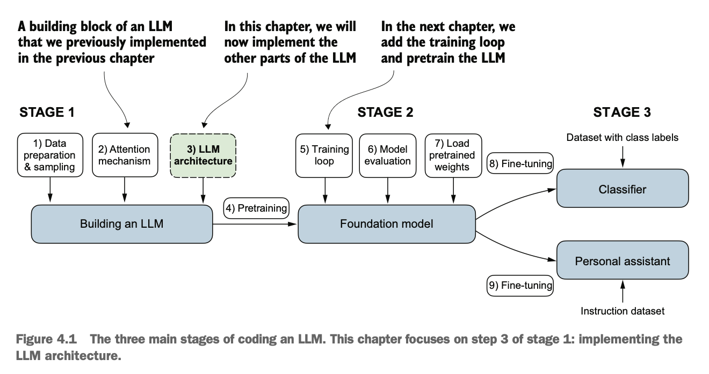

그림 4.1 LLM을 코딩하는 세 단계. 이 장에서는 1단계의 세 번째 단계인 LLM 아키텍처 구현에 집중한다.

## 4.1 LLM 아키텍처 코딩하기

GPT(Generative Pretrained Transformer)와 같은 LLM은 단어(또는 토큰)를 한 번에 하나씩 새 텍스트를 생성하도록 설계된 거대한 심층 신경망 아키텍처다. 그러나 모델의 규모가 크더라도, 이후에 확인하겠지만 구성 요소가 반복되어 생각보다 복잡하지 않다. 그림 4.2는 GPT와 유사한 LLM을 위에서 내려다본 모습과 주요 구성 요소를 보여준다.

이미 입력 토큰화와 임베딩, 그리고 이전 장에서 구현한 마스킹된 멀티헤드 어텐션 모듈 등 LLM 아키텍처의 여러 부분을 다뤘다. 이제 GPT 모델의 핵심 구조를 구현하면서 트랜스포머 블록을 포함한 나머지 구성 요소를 완성하고, 이후 이 모델을 사람과 유사한 텍스트를 생성하도록 학습시킬 것이다.

앞선 예제에서는 개념과 예제를 한 페이지 안에 담기 위해 임베딩 차원을 작게 설정해왔다. 이제는 규모를 키워 소형 GPT-2 모델, 정확히는 Radford 외 "Language Models Are Unsupervised Multitask Learners"(https://mng.bz/yoBq)에 소개된 1억 2,400만 개 파라미터 버전에 맞춰 구현해 보겠다. 원 보고서에서는 1억 1,700만 파라미터라고 언급하지만 이후 정정되었다는 점에 유의하자. 6장에서는 사전 학습된 가중치를 불러와 더 큰 크기의 GPT-2 모델(3억 4,500만, 7억 6,200만, 15억 4,200만 파라미터)에 적용하는 방법을 다룰 것이다.

딥러닝과 GPT와 같은 LLM에서 "파라미터"란 모델의 학습 가능한 가중치를 의미한다. 가중치는 손실 함수를 최소화하도록 학습 과정에서 조정되는 모델의 내부 변수이며, 이러한 최적화를 통해 모델이 학습 데이터를 기반으로 패턴을 학습한다.

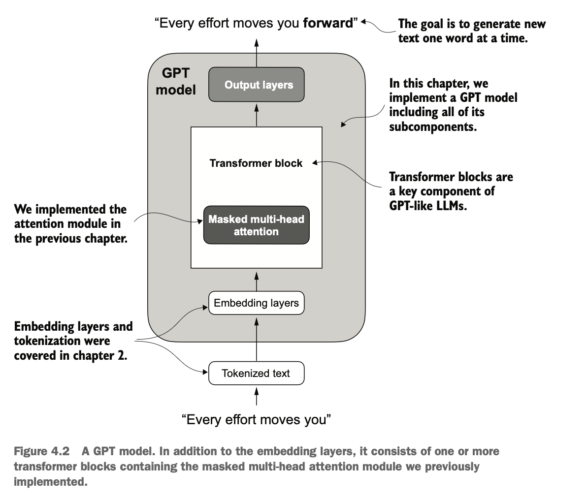

그림 4.2 GPT 모델. 임베딩 층 외에도 앞에서 구현한 마스킹된 멀티헤드 어텐션 모듈을 포함하는 하나 이상의 트랜스포머 블록으로 구성된다.

예를 들어, 가중치가 $2,048 \times 2,048$ 차원을 갖는 신경망 층이 있다고 하자. 이 행렬(또는 텐서)의 각 원소가 하나의 파라미터다. 행이 2,048개, 열이 2,048개이므로 총 파라미터 수는 2,048과 2,048을 곱한 $4,194,304$개가 된다.

>**GPT-2와 GPT-3 비교**
>
>GPT-2에 집중하는 이유는 OpenAI가 사전 학습된 모델 가중치를 공개해두었기 때문이다. 6장에서 이러한 가중치를 구현에 불러올 것이다. GPT-3는 모델 아키텍처 관점에서 근본적으로 동일하지만, GPT-2의 15억 개 파라미터에서 GPT-3의 1,750억 개 파라미터로 규모가 커졌고 더 많은 데이터를 사용해 학습되었다. 현재(집필 시점 기준) GPT-3의 가중치는 공개되어 있지 않다. 한편 GPT-2는 단일 노트북 컴퓨터에서도 실행할 수 있는 반면, GPT-3는 학습과 추론 모두에 GPU 클러스터가 필요하므로 LLM 구현을 학습하기에는 GPT-2가 더 적합하다. Lambda Labs(https://lambdalabs.com/)에 따르면 단일 V100 데이터센터 GPU로 GPT-3를 학습하려면 355년, 소비자용 RTX 8000 GPU로는 665년이 걸린다고 한다.

다음 파이썬 딕셔너리는 이후 코드 예제에서 사용할 소형 GPT-2 모델의 설정을 정의한 것이다.

```python
GPT_CONFIG_124M = {
    "vocab_size": 50257, # Vocabulary size
    "context_length": 1024, # Context length
    "emb_dim": 768, # Embedding dimension
    "n_heads": 12, # Number of attention heads
    "n_layers": 12, # Number of layers
    "drop_rate": 0.1, # Dropout rate
    "qkv_bias": False # Query-Key-Value bias
}
```

GPT_CONFIG_124M 딕셔너리에서는 코드가 길어지지 않도록 간결한 변수명을 사용했다.

- `vocab_size`는 2장에서 살펴본 BPE 토크나이저가 사용하는 50,257개 단어의 어휘 크기를 의미한다.
- `context_length`는 위치 임베딩(2장 참고)을 통해 모델이 처리할 수 있는 최대 입력 토큰 수를 뜻한다.
- `emb_dim`은 각 토큰을 768차원 벡터로 변환하는 임베딩 크기를 나타낸다.
- `n_heads`는 멀티헤드 어텐션 메커니즘(3장 참고)의 헤드 개수를 지정한다.
- `n_layers`는 모델에 포함될 트랜스포머 블록 수를 나타내며, 바로 다음에서 자세히 살펴본다.
- `drop_rate`는 드롭아웃 강도를 나타낸다(0.1은 은닉 유닛의 10%를 무작위로 끈다는 의미로, 3장 참고). 과적합을 방지하기 위해 사용한다.
- `qkv_bias`는 멀티헤드 어텐션의 쿼리/키/값을 계산하는 선형층에 바이어스 벡터를 추가할지 여부를 결정한다. 최신 LLM의 관례에 따라 우선 비활성화하고, 6장에서 OpenAI의 사전 학습 가중치를 불러올 때 다시 살펴보겠다.

이 설정을 사용해 그림 4.3과 같은 GPT 골격(placeholder) 아키텍처인 `DummyGPTModel`을 구현해 전체 구조를 파악하고, 실제 GPT 모델을 조립하기 위해 추가로 구현해야 하는 구성 요소를 확인해보자.

그림 4.3의 번호가 매겨진 상자는 최종 GPT 아키텍처를 코딩할 때 다뤄야 할 개념의 순서를 보여준다. 먼저 1단계로 GPT 백본에 해당하는 `DummyGPTModel`을 구현한다.

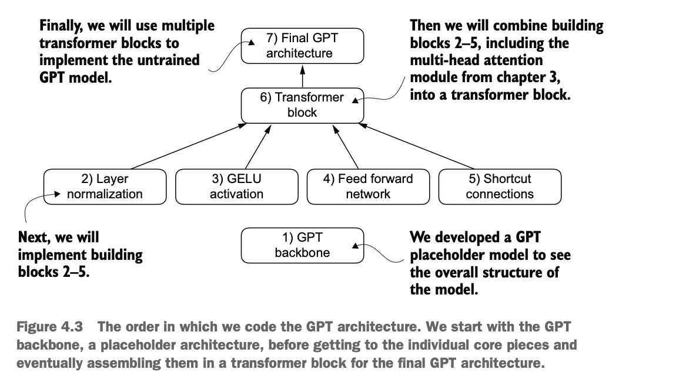

그림 4.3 GPT 아키텍처를 코딩하는 순서. 먼저 GPT 백본인 플레이스홀더 아키텍처를 만든 뒤, 개별 핵심 요소를 구현하고 마지막으로 트랜스포머 블록에 조립해 최종 GPT 아키텍처를 완성한다.

**코드 4.1 GPT 모델 아키텍처 플레이스홀더 클래스**

```python
import torch
import torch.nn as nn

class DummyGPTModel(nn.Module):
    def __init__(self, cfg):
        super().__init__()
        self.tok_emb = nn.Embedding(cfg["vocab_size"], cfg["emb_dim"])
        self.pos_emb = nn.Embedding(cfg["context_length"], cfg["emb_dim"])
        self.drop_emb = nn.Dropout(cfg["drop_rate"])
        self.trf_blocks = nn.Sequential(
            *[DummyTransformerBlock(cfg) for _ in range(cfg["n_layers"])]
        )
        self.final_norm = DummyLayerNorm(cfg["emb_dim"])
        self.out_head = nn.Linear(
            cfg["emb_dim"], cfg["vocab_size"], bias=False
        )

    def forward(self, in_idx):
        batch_size, seq_len = in_idx.shape
        tok_embeds = self.tok_emb(in_idx)
        pos_embeds = self.pos_emb(
            torch.arange(seq_len, device=in_idx.device)
        )
        x = tok_embeds + pos_embeds
        x = self.drop_emb(x)
        x = self.trf_blocks(x)
        x = self.final_norm(x)
        logits = self.out_head(x)
        return logits

class DummyTransformerBlock(nn.Module):
    def __init__(self, cfg):
        super().__init__()

    def forward(self, x):
        return x

class DummyLayerNorm(nn.Module):
    def __init__(self, normalized_shape, eps=1e-5):
        super().__init__()

    def forward(self, x):
        return x
```

`DummyGPTModel` 클래스는 PyTorch의 `nn.Module`을 상속해 GPT와 유사한 단순화된 모델을 정의한다. 토큰 임베딩과 위치 임베딩, 드롭아웃, 여러 개의 트랜스포머 블록(`DummyTransformerBlock`), 마지막 층 정규화(`DummyLayerNorm`), 선형 출력층(`out_head`)으로 구성된다. 구성 정보는 앞에서 만든 `GPT_CONFIG_124M`과 같은 파이썬 딕셔너리를 통해 전달한다.

`forward` 메서드는 모델 내부에서 데이터가 흐르는 방식을 설명한다. 입력 인덱스에 대해 토큰/위치 임베딩을 계산하고 드롭아웃을 적용한 뒤, 트랜스포머 블록을 통과시키고, 정규화를 수행한 다음 최종 선형층으로 로짓(logits)을 만든다.

코드 4.1은 지금 상태로도 동작한다. 다만 현재는 트랜스포머 블록과 층 정규화 자리에 플레이스홀더(`DummyLayerNorm`, `DummyTransformerBlock`)를 사용하고 있으며, 실제 구현은 뒤에서 다룬다.

다음으로 입력 데이터를 준비하고, 새로운 GPT 모델을 초기화해 사용법을 살펴보자. 2장에서 코딩했던 토크나이저를 바탕으로, 그림 4.4에 나타난 것처럼 GPT 모델에 데이터가 어떻게 들어오고 나가는지 높은 수준에서 살펴본다.

이 과정을 구현하기 위해, tiktoken 토크나이저(2장 참고)를 사용해 두 개의 텍스트 입력으로 구성된 배치를 토크나이즈한다.

```python
import tiktoken

tokenizer = tiktoken.get_encoding("gpt2")
batch = []
txt1 = "Every effort moves you"
txt2 = "Every day holds a"
batch.append(torch.tensor(tokenizer.encode(txt1)))
batch.append(torch.tensor(tokenizer.encode(txt2)))
batch = torch.stack(batch, dim=0)
print(batch)
```

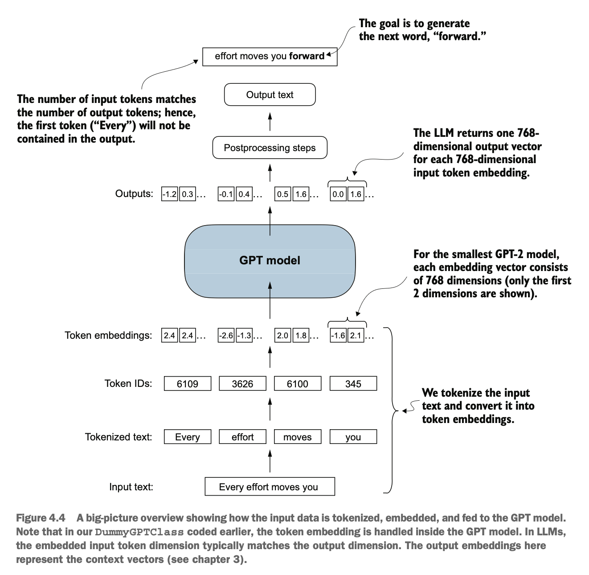

그림 4.4 입력 데이터를 토크나이즈하고 임베딩한 뒤 GPT 모델에 넣는 과정을 크게 살펴본 그림. 앞서 구현한 `DummyGPTModel`에서는 토큰 임베딩을 모델 내부에서 처리한다. LLM에서는 입력 토큰 임베딩 차원과 출력 차원이 보통 일치한다. 여기서의 출력 임베딩은 컨텍스트 벡터(3장 참고)를 의미한다.

두 문장에 대한 토큰 ID는 다음과 같다.

```
tensor([[6109, 3626, 6100, 345],
        [6109, 1110, 6622, 257]])
```

첫 번째 행은 첫 번째 문장, 두 번째 행은 두 번째 문장에 해당한다.

이제 1억 2,400만 파라미터 버전 `DummyGPTModel` 인스턴스를 초기화하고, 토크나이즈한 배치를 입력해 보자.

```python
torch.manual_seed(123)
model = DummyGPTModel(GPT_CONFIG_124M)
logits = model(batch)
print("Output shape:", logits.shape)
print(logits)
```

모델이 출력하는 값을 일반적으로 로짓(logits)이라고 부른다.

```
Output shape: torch.Size([2, 4, 50257])
tensor([[[-1.2034, 0.3201, -0.7130, ..., -1.5548, -0.2390, -0.4667],
         [-0.1192, 0.4539, -0.4432, ..., 0.2392, 1.3469, 1.2430],
         [ 0.5307, 1.6720, -0.4695, ..., 1.1966, 0.0111, 0.5835],
         [ 0.0139, 1.6755, -0.3388, ..., 1.1586, -0.0435, -1.0400]],
        [[-1.0908, 0.1798, -0.9484, ..., -1.6047, 0.2439, -0.4530],
         [-0.7860, 0.5581, -0.0610, ..., 0.4835, -0.0077, 1.6621],
         [ 0.3567, 1.2698, -0.6398, ..., -0.0162, -0.1296, 0.3717],
         [-0.2407, -0.7349, -0.5102, ..., 2.0057, -0.3694, 0.1814]]],
       grad_fn=<UnsafeViewBackward0>)
```

출력 텐서는 두 행으로 이루어져 각각 두 개의 텍스트 샘플에 대응한다. 각 샘플은 네 개의 토큰으로 구성되어 있으며, 각 토큰은 토크나이저 어휘 크기와 같은 50,257차원 벡터다.

임베딩 차원이 50,257인 이유는 어휘에 있는 각 토큰이 이 벡터의 한 차원과 대응하기 때문이다. 후처리 코드를 구현할 때 이 50,257차원 벡터를 다시 토큰 ID로 변환한 후, 이를 디코드해 단어로 바꿀 것이다.

이처럼 GPT 아키텍처와 그 입출력을 위에서 아래로 살펴봤으니, 이제 각 플레이스홀더를 실제 구현으로 바꾸는 작업을 시작하자. 먼저 이전 코드에서 `DummyLayerNorm`을 대체할 실제 층 정규화 클래스를 구현한다.

# 4.2 층 정규화로 활성값 정규화하기

층이 많은 심층 신경망을 학습하다 보면 기울기가 사라지거나 폭발하는 문제 때문에 학습이 어려워질 때가 있다. 이러한 문제는 학습 동작을 불안정하게 만들어 가중치를 효과적으로 조정하기 어렵게 한다. 그 결과, 손실 함수를 최소화하는 가중치 집합을 찾기 힘들어지고, 데이터에 담긴 패턴을 충분히 학습하지 못해 정확한 예측이나 의사결정을 내리기 어렵다.

NOTE 신경망 학습과 기울기 개념이 처음이라면 부록 A의 A.4 절에서 간단한 소개를 읽을 수 있다. 이 책의 내용을 이해하는 데에는 기울기에 대한 깊은 수학적 이해가 필수는 아니다.

이제 층 정규화를 구현해 신경망 학습의 안정성과 효율을 높여보자. 층 정규화의 핵심 아이디어는 신경망 층의 출력(활성값)을 평균 0, 분산 1(단위 분산)이 되도록 조정하는 것이다. 이렇게 하면 효과적인 가중치에 더 빨리 수렴하고, 학습이 일정하고 신뢰성 있게 진행된다. GPT-2와 최신 트랜스포머 아키텍처에서는 일반적으로 멀티헤드 어텐션 모듈 앞뒤, 그리고 앞에서 플레이스홀더로 넣어둔 `DummyLayerNorm`에서처럼 최종 출력층 앞에 층 정규화를 적용한다. 그림 4.5는 층 정규화가 어떻게 동작하는지 시각적으로 보여준다.

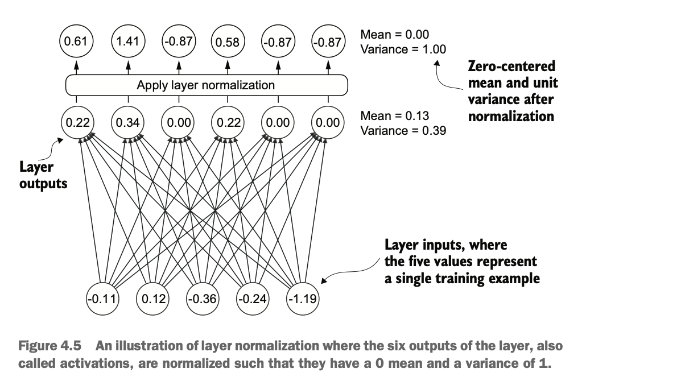

그림 4.5 층 정규화 예시. 층의 여섯 개 출력(활성값)을 평균 0, 분산 1이 되도록 정규화한다.

그림 4.5의 예제를 재현하기 위해 다음 코드를 실행해 보자. 여기서는 입력이 5개, 출력이 6개인 신경망 층을 만들고, 두 개의 입력 예제에 적용한다.

```python
torch.manual_seed(123)
batch_example = torch.randn(2, 5)
layer = nn.Sequential(nn.Linear(5, 6), nn.ReLU())
out = layer(batch_example)
print(out)
```

이 코드를 실행하면 다음과 같은 텐서가 출력된다. 첫 번째 행은 첫 번째 입력에 대한 층 출력값들이고, 두 번째 행은 두 번째 입력에 대한 층 출력값들이다.

```
tensor([[0.2260, 0.3470, 0.0000, 0.2216, 0.0000, 0.0000],
        [0.2133, 0.2394, 0.0000, 0.5198, 0.3297, 0.0000]],
       grad_fn=<ReluBackward0>)
```

구현한 신경망 층은 선형(`Linear`) 층 뒤에 비선형 활성함수인 ReLU(Rectified Linear Unit)를 둔 구조다. ReLU에 익숙하지 않다면, ReLU는 음수 입력을 0으로 만들고 양수만 출력하도록 층을 임계값화(thresholding)하는 함수라고 생각하면 된다. 그래서 층 출력에는 음수 값이 없다. 이후 GPT에서는 보다 정교한 활성함수를 사용할 것이다.

층 정규화를 적용하기 전에 평균과 분산을 확인해 보자.

```python
mean = out.mean(dim=-1, keepdim=True)
var = out.var(dim=-1, keepdim=True)
print("Mean:\n", mean)
print("Variance:\n", var)
```
출력은 

```
Mean:
tensor([[0.1324],
        [0.2170]], grad_fn=<MeanBackward1>)
Variance:
tensor([[0.0231],
        [0.0398]], grad_fn=<VarBackward0>)
```

mean 텐서의 첫 번째 행은 첫 번째 입력 행의 평균값, 두 번째 행은 두 번째 입력 행의 평균값을 담고 있다.

`keepdim=True` 옵션을 사용하면 평균이나 분산을 계산할 때 지정한 차원을 줄이더라도 출력 텐서의 차원 수를 입력과 같게 유지할 수 있다. 예를 들어 `keepdim=True`가 없다면 평균 텐서는 `[0.1324, 0.2170]`과 같은 2차원 벡터가 되었을 것이다. 하지만 `keepdim=True`를 설정하면 $2 \times 1$ 행렬 `[[0.1324], [0.2170]]` 형태로 유지된다.

`dim` 매개변수는 통계량(여기서는 평균이나 분산)을 계산할 때 어떤 차원을 따라 계산할지 지정한다. 그림 4.6에서 보듯 2차원 텐서(행렬)의 경우, `dim=0`은 행 방향(아래쪽)으로 연산해 각 열의 값을 집계하고, `dim=1`이나 `dim=-1`은 열 방향(오른쪽)으로 연산해 각 행의 값을 집계한다.

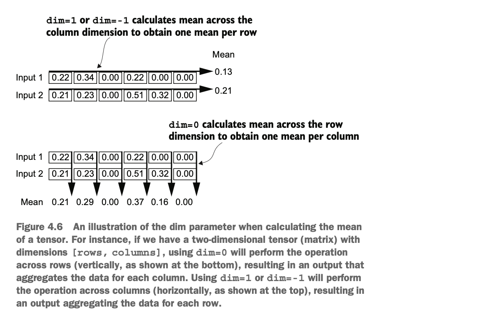

그림 4.6은 텐서의 평균을 계산할 때 사용하는 dim 매개변수를 시각적으로 설명한다. 예를 들어, [행, 열] 형태의 2차원 텐서(행렬)가 있을 때, dim=0으로 연산하면 행 방향(아래쪽)으로 평균을 계산해 각 열의 값들을 집계한 결과가 나온다(아래쪽 그림 참고). 반면 dim=1 또는 dim=-1로 연산하면 열 방향(오른쪽)으로 평균을 계산해 각 행의 값들을 집계한 결과가 된다(위쪽 그림 참고).

이제 앞서 얻은 층 출력값에 층 정규화를 적용해 보자. 이 연산은 각 값에서 평균을 빼고 분산의 제곱근(표준편차)으로 나누는 방식으로 이루어진다.

```python
out_norm = (out - mean) / torch.sqrt(var)
mean = out_norm.mean(dim=-1, keepdim=True)
var = out_norm.var(dim=-1, keepdim=True)
print("Normalized layer outputs:\n", out_norm)
print("Mean:\n", mean)
print("Variance:\n", var)
```

결과에서 볼 수 있듯 정규화된 층 출력은 음수 값도 포함하고 있으며, 평균이 0이고 분산이 1이다.

```
Normalized layer outputs:
tensor([[ 0.6159, 1.4126, -0.8719, 0.5872, -0.8719, -0.8719],
        [-0.0189, 0.1121, -1.0876, 1.5173, 0.5647, -1.0876]],
       grad_fn=<DivBackward0>)
Mean:
tensor([[-5.9605e-08],
        [1.9868e-08]], grad_fn=<MeanBackward1>)
Variance:
tensor([[1.],
        [1.]], grad_fn=<VarBackward0>)
```

출력 텐서의 `-5.9605e-08` 값은 $-5.9605 \times 10^{-8}$, 즉 -0.000000059605를 의미한다. 컴퓨터가 수를 표현할 때 유한 정밀도로 인해 발생하는 작은 수치 오차 때문에 정확히 0이 아니라 0에 아주 가까운 값이 나타난 것이다.

읽기 편하도록 `sci_mode=False`로 설정해 지수 표기법 없이 출력할 수도 있다.

```python
torch.set_printoptions(sci_mode=False)
print("Mean:\n", mean)
print("Variance:\n", var)
```
출력은

```
Mean:
tensor([[0.0000],
        [0.0000]], grad_fn=<MeanBackward1>)
Variance:
tensor([[1.],
        [1.]], grad_fn=<VarBackward0>)
```

이처럼 층 정규화를 한 단계씩 구현하고 적용해 보았다. 이제 이를 GPT 모델에서 활용할 수 있도록 PyTorch 모듈로 감싸 보자.

**코드 4.2 층 정규화 클래스**

```python
class LayerNorm(nn.Module):
    def __init__(self, emb_dim):
        super().__init__()
        self.eps = 1e-5
        self.scale = nn.Parameter(torch.ones(emb_dim))
        self.shift = nn.Parameter(torch.zeros(emb_dim))

    def forward(self, x):
        mean = x.mean(dim=-1, keepdim=True)
        var = x.var(dim=-1, keepdim=True, unbiased=False)
        norm_x = (x - mean) / torch.sqrt(var + self.eps)
        return self.scale * norm_x + self.shift
```

이 층 정규화 구현은 입력 텐서 `x`의 마지막 차원, 즉 임베딩 차원(`emb_dim`)을 기준으로 동작한다. `eps`는 정규화 과정에서 분산에 더해지는 아주 작은 상수(엡실론)로, 0으로 나눠지는 일을 방지한다. `scale`과 `shift`는 입력과 동일한 차원을 갖는 학습 가능한 파라미터로, 학습 과정에서 모델이 필요하다고 판단하면 자동으로 조정된다. 이를 통해 데이터에 가장 잘 맞는 스케일링과 시프팅을 학습할 수 있다.

>**편향된 분산(Biased variance)**
>
>분산을 계산할 때 `unbiased=False`로 설정한 것은 구현상의 선택이다. 이는 분산을 구할 때 분모에 입력 개수 $n$을 사용하는 것으로, 표본 분산의 편향을 보정하기 위해 일반적으로 사용하는 베셀 보정($n-1$)을 적용하지 않는다는 뜻이다. 이렇게 하면 이른바 편향된 분산 추정값이 된다. 그러나 임베딩 차원 $n$이 매우 큰 LLM에서는 $n$과 $n-1$을 사용하는 차이가 사실상 무시할 수 있을 정도로 작다. 또한 GPT-2 모델의 정규화 층과 호환성을 유지하고, 원래 GPT-2가 구현된 TensorFlow의 기본 동작을 반영하기 위해 이 방식을 선택했다. 이렇게 하면 6장에서 불러올 사전 학습 가중치와도 호환된다.

이제 `LayerNorm` 모듈을 실제로 사용해 앞에서 만든 배치 입력에 적용해 보자.

```python
ln = LayerNorm(emb_dim=5)
out_ln = ln(batch_example)
mean = out_ln.mean(dim=-1, keepdim=True)
var = out_ln.var(dim=-1, unbiased=False, keepdim=True)
print("Mean:\n", mean)
print("Variance:\n", var)
```

결과를 보면 층 정규화 코드가 정상적으로 동작하여 두 입력 각각의 평균이 0, 분산이 1이 되도록 정규화된 것을 알 수 있다.

```
Mean:
tensor([[-0.0000],
        [ 0.0000]], grad_fn=<MeanBackward1>)
Variance:
tensor([[1.0000],
        [1.0000]], grad_fn=<VarBackward0>)
```

이제 그림 4.7에서 볼 수 있듯이 GPT 아키텍처를 구현하는 데 필요한 두 가지 빌딩 블록을 살펴보았다. 다음으로, 기존에 사용하던 ReLU 함수 대신 LLM에서 자주 사용되는 활성함수인 GELU에 대해 알아보자.

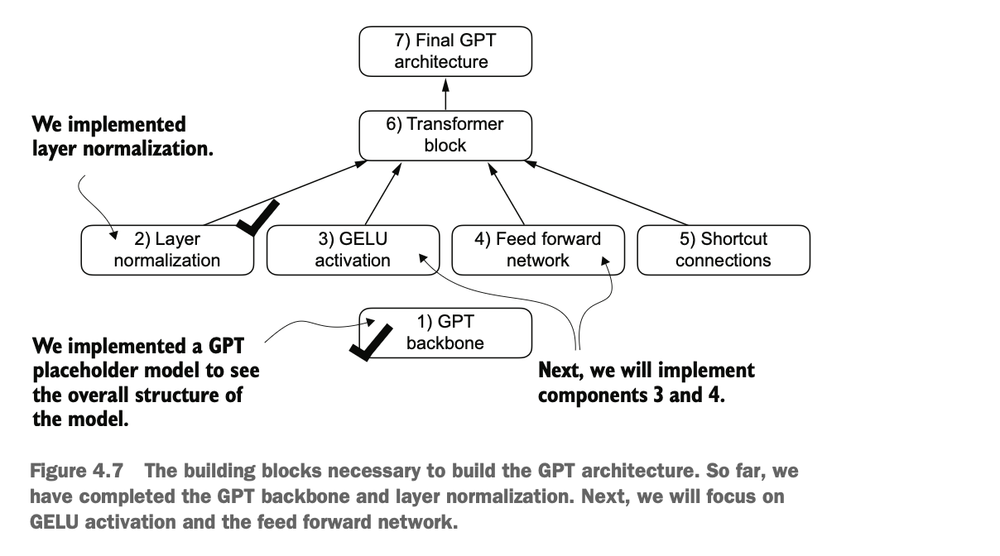

그림 4.7 GPT 아키텍처를 구성하는 빌딩 블록. 현재까지 GPT 백본과 층 정규화를 구현했고, 이어서 GELU 활성함수와 피드포워드 네트워크를 다룬다.

>**층 정규화 vs. 배치 정규화**
>
>이미 배치 정규화에 익숙하다면 층 정규화와 어떤 차이가 있는지 궁금할 수 있다. 배치 정규화는 배치 차원 방향으로 정규화하는 반면, 층 정규화는 특징(feature) 차원 방향으로 정규화한다. LLM은 상당한 계산 자원이 필요한 경우가 많으며, 사용 가능한 하드웨어나 목적에 따라 학습 또는 추론 시 배치 크기가 달라질 수 있다. 층 정규화는 배치 크기와 무관하게 각 입력을 독립적으로 정규화하므로 이러한 상황에서 더 큰 유연성과 안정성을 제공한다. 특히 분산 학습이나 자원이 제한된 환경에서 모델을 배포할 때 유용하다.

## 4.3 GELU 활성함수를 사용하는 피드포워드 네트워크 구현

이번에는 LLM의 트랜스포머 블록에서 사용하는 작은 신경망 하위 모듈을 구현한다. 이를 위해 먼저 GELU 활성함수를 구현하는데, 이 함수가 해당 하위 모듈에서 중요한 역할을 한다.

>**참고** PyTorch로 신경망을 구현하는 방법을 더 알고 싶다면 부록 A의 A.5 절을 참고하자.

역사적으로는 간단하면서도 다양한 신경망 아키텍처에서 잘 작동하는 ReLU 활성함수가 널리 사용되었다. 하지만 LLM에서는 전통적인 ReLU 외에도 여러 활성함수를 사용한다. 대표적으로 GELU(Gaussian Error Linear Unit)와 SwiGLU(Swish-gated Linear Unit)가 있다.

GELU와 SwiGLU는 각각 가우시안과 시그모이드 기반 게이트를 도입한 보다 복잡하고 매끄러운 활성함수로, 단순한 ReLU보다 심층 모델에서 더 나은 성능을 제공한다.

GELU 활성함수는 여러 방식으로 구현할 수 있다. 정확한 정의는 $\operatorname{GELU}(x) = x \cdot \Phi(x)$이며, 여기서 $\Phi(x)$는 표준 가우시안 분포의 누적 분포 함수다. 그러나 실전에서는 계산 비용이 더 저렴한 근사식을 사용하는 경우가 많다(원래 GPT-2 모델도 곡선 근사를 통해 얻은 이 근사식을 사용해 학습되었다).

$$\operatorname{GELU}(x) \approx 0.5 \cdot x \cdot\left(1+\tanh \left[\sqrt{\frac{2}{\pi}} \cdot\left(x+0.044715 \cdot x^{3}\right)\right]\right)$$

이 함수를 PyTorch 모듈로 구현할 수 있다.

**코드 4.3 GELU 활성함수 구현**

```python
class GELU(nn.Module):
    def __init__(self):
        super().__init__()

    def forward(self, x):
        return 0.5 * x * (1 + torch.tanh(
            torch.sqrt(torch.tensor(2.0 / torch.pi)) *
            (x + 0.044715 * torch.pow(x, 3))
        ))
```

다음으로 이 GELU 함수가 어떤 모양인지, ReLU와 비교했을 때 어떤 차이가 있는지 확인하기 위해 두 함수를 나란히 그려보자.

```python
import matplotlib.pyplot as plt

gelu, relu = GELU(), nn.ReLU()
x = torch.linspace(-3, 3, 100)
y_gelu, y_relu = gelu(x), relu(x)

plt.figure(figsize=(8, 3))
for i, (y, label) in enumerate(zip([y_gelu, y_relu], ["GELU", "ReLU"]), 1):
    plt.subplot(1, 2, i)
    plt.plot(x, y)
    plt.title(f"{label} activation function")
    plt.xlabel("x")
    plt.ylabel(f"{label}(x)")
    plt.grid(True)
plt.tight_layout()
plt.show()
```

그림 4.8의 결과 그래프에서 볼 수 있듯이, ReLU(오른쪽)는 입력이 양수일 때는 그 값을 그대로 출력하고, 음수일 때는 0을 출력하는 조각별 선형 함수다. 반면 GELU(왼쪽)는 ReLU를 근사하지만, 거의 모든 음수 입력에 대해서도 0이 아닌 기울기를 가지는 부드러운 비선형 함수다(약 $x=-0.75$에서만 기울기가 0에 가까워진다).


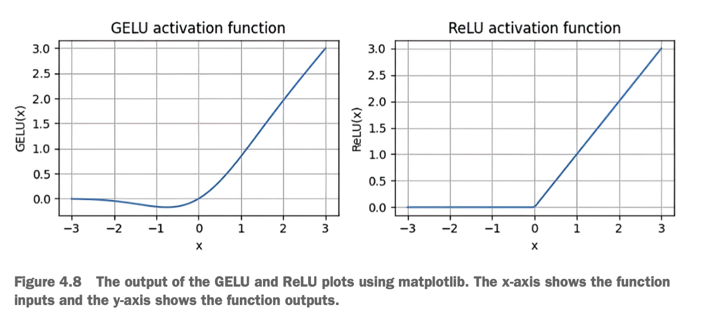

그림 4.8 matplotlib으로 그린 GELU와 ReLU 함수의 출력. x축은 입력, y축은 출력 값을 나타낸다.

그림에서 보듯 ReLU(오른쪽)는 입력이 양수일 때만 값을 그대로 내보내고, 음수일 때는 0을 출력하는 조각별(piecewise) 선형 함수다. 반면 GELU(왼쪽)는 거의 모든 음수 입력에 대해서도 작은 기울기를 유지하는 부드러운 비선형 함수다(약 $x=-0.75$에서만 기울기가 0에 가까워진다).

GELU의 매끄러움은 학습 과정에서 더 미세한 파라미터 조정을 가능하게 해 최적화에 도움이 된다. ReLU는 0에서 날카로운 꺾임을 갖기 때문에(그림 4.8 오른쪽) 네트워크가 매우 깊거나 복잡한 경우 학습이 더 어려워질 수 있다. 또한 ReLU는 음수 입력을 모두 0으로 만들기 때문에 음수를 받은 뉴런은 학습 과정에 기여하지 못한다. 반면 GELU는 음수 입력에 대해서도 작은 비영(非零) 출력이 남아, 학습 중 해당 뉴런도 어느 정도 기여할 수 있도록 한다.

이제 GELU 함수를 사용해 이후 트랜스포머 블록에서 활용할 작은 신경망 모듈 `FeedForward`를 구현해 보자.

**코드 4.4 피드포워드 신경망 모듈**

```python
class FeedForward(nn.Module):
    def __init__(self, cfg):
        super().__init__()
        self.layers = nn.Sequential(
            nn.Linear(cfg["emb_dim"], 4 * cfg["emb_dim"]),
            GELU(),
            nn.Linear(4 * cfg["emb_dim"], cfg["emb_dim"]),
        )

    def forward(self, x):
        return self.layers(x)
```

`FeedForward` 모듈은 두 개의 `Linear` 층과 하나의 GELU 활성함수로 이루어진 작은 신경망이다. 1억 2,400만 파라미터 GPT 모델에서는 `GPT_CONFIG_124M["emb_dim"] = 768`이므로 임베딩 크기가 768인 토큰 배치를 입력으로 받는다. 그림 4.9는 입력을 통과시킬 때 이 작은 피드포워드 네트워크 안에서 임베딩 크기가 어떻게 변하는지 보여준다.

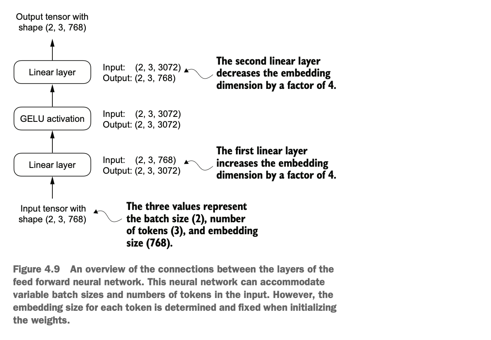

그림 4.9 피드포워드 네트워크 층 사이의 연결. 입력 배치의 크기나 토큰 수는 달라질 수 있지만, 각 토큰의 임베딩 크기는 가중치를 초기화할 때 결정된다.

그림 4.9 예시를 따라 임베딩 크기가 768인 `FeedForward` 모듈을 초기화하고, 두 개의 샘플과 토큰 세 개씩으로 이루어진 배치를 입력해 보자.

```python
ffn = FeedForward(GPT_CONFIG_124M)
x = torch.rand(2, 3, 768)
out = ffn(x)
print(out.shape)
```
출력 텐서의 형태가 입력 텐서와 동일함을 알 수 있다:

```
torch.Size([2, 3, 768])
```

`FeedForward` 모듈은 모델이 데이터를 학습하고 일반화하는 능력을 향상시키는 핵심 구성 요소다. 입력과 출력의 차원이 같지만, 내부적으로는 첫 번째 선형층을 통해 임베딩 차원을 더 높은 차원(여기서는 4배)으로 확장한 뒤, 비선형 GELU 활성화와 두 번째 선형 변환을 거쳐 원래 차원으로 다시 축소한다. 그림 4.10이 이 과정을 보여준다. 이러한 설계 덕분에 더 풍부한 표현 공간을 탐색할 수 있다.

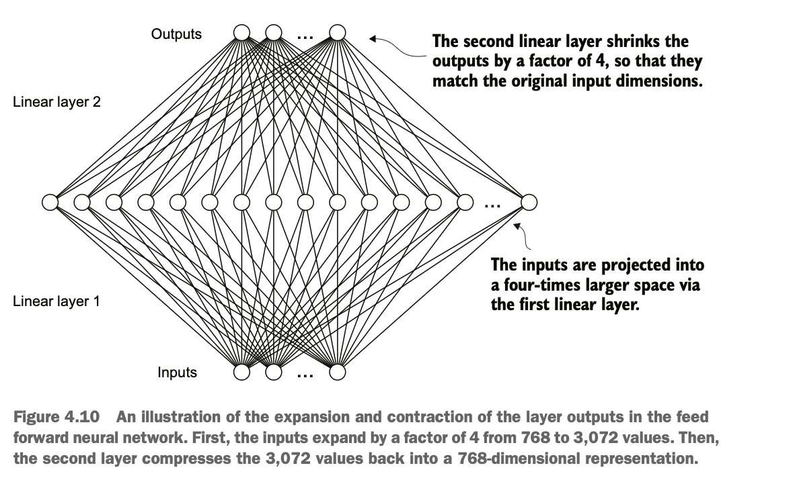

그림 4.10 피드포워드 네트워크에서 층 출력이 확장되었다가 다시 축소되는 모습. 먼저 768차원 입력이 4배 확장되어 3,072차원이 되고, 두 번째 층에서 다시 768차원으로 압축된다.

또한 입력과 출력 차원이 동일하기 때문에 여러 층을 쌓아 올릴 때 차원을 맞추기 위한 추가 작업이 필요 없어서 아키텍처가 간단해지고 확장성이 좋아진다.

그림 4.11에서 보듯 이제 LLM의 구성 요소 대부분을 구현했다. 다음은 신경망의 여러 층 사이에 삽입해 학습 성능을 높이는 숏컷 연결 개념을 살펴본다.

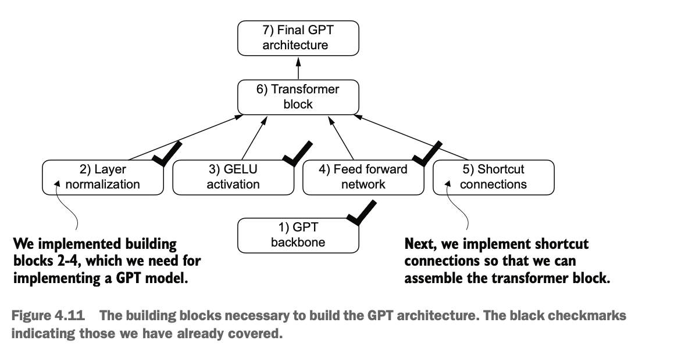

그림 4.11 GPT 아키텍처를 구성하는 빌딩 블록. 검은 체크 표시가 이미 구현한 부분이다.

## 4.4 숏컷 연결 추가하기

이번에는 숏컷 연결(스킵 연결 또는 잔차 연결이라고도 함)의 개념을 살펴본다. 원래 숏컷 연결은 컴퓨터 비전 분야의 심층 네트워크(특히 ResNet)에서 기울기 소실 문제를 완화하기 위해 제안되었다. 기울기 소실 문제란 역전파 과정에서 기울기가 층을 거슬러 올라갈수록 점점 작아져 앞쪽 층의 학습이 어려워지는 현상을 뜻한다.

그림 4.12는 숏컷 연결이 어떻게 더 짧은 경로를 만들어 기울기가 사라지지 않고 흐르도록 돕는지 보여준다. 한 층의 출력을 더 뒤에 있는 층의 출력과 더함으로써 한두 개 층을 건너뛰는 경로를 만든다. 그래서 스킵 연결이라고도 부른다. 이러한 연결은 학습 중 역전파 단계에서 기울기의 흐름을 유지하는 데 중요한 역할을 한다.

다음 코드에서는 그림 4.12의 신경망을 구현해 `forward` 메서드에서 숏컷 연결을 어떻게 추가할 수 있는지 확인한다.

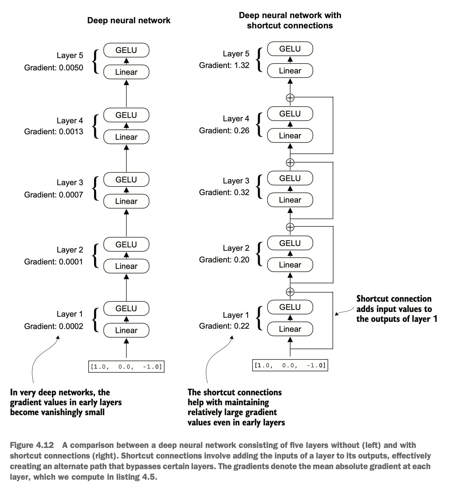

그림 4.12 다섯 개 층을 갖는 심층 신경망을 숏컷 연결 없이 구성한 경우(왼쪽)와 숏컷 연결을 추가한 경우(오른쪽)를 비교한 모습. 숏컷 연결은 특정 층의 입력을 이후 층의 출력과 더해 일부 층을 우회하는 경로를 만든다. 그림의 기울기 값은 코드 4.5에서 계산한 각 층의 평균 절대 기울기를 나타낸다.

**코드 4.5 숏컷 연결을 설명하는 신경망**

```python
class ExampleDeepNeuralNetwork(nn.Module):
    def __init__(self, layer_sizes, use_shortcut):
        super().__init__()
        self.use_shortcut = use_shortcut
        self.layers = nn.ModuleList([
            nn.Sequential(nn.Linear(layer_sizes[0], layer_sizes[1]), GELU()),
            nn.Sequential(nn.Linear(layer_sizes[1], layer_sizes[2]), GELU()),
            nn.Sequential(nn.Linear(layer_sizes[2], layer_sizes[3]), GELU()),
            nn.Sequential(nn.Linear(layer_sizes[3], layer_sizes[4]), GELU()),
            nn.Sequential(nn.Linear(layer_sizes[4], layer_sizes[5]), GELU())
        ])

    def forward(self, x):
        for layer in self.layers:
            layer_output = layer(x)
            if self.use_shortcut and x.shape == layer_output.shape:
                x = x + layer_output
            else:
                x = layer_output
        return x
```

이 코드는 선형층과 GELU 활성함수로 이루어진 다섯 개 층을 갖는 심층 신경망을 구현한다. `forward` 패스에서는 입력을 순차적으로 각 층에 통과시키고, `self.use_shortcut`이 `True`이면 층의 출력과 입력을 더해 숏컷 연결을 적용한다.

먼저 숏컷 연결이 없는 신경망을 초기화하자. 각 층은 입력으로 3개의 값을 받아 3개의 값을 출력하고, 마지막 층은 단일 값을 출력하도록 초기화한다.

```python
layer_sizes = [3, 3, 3, 3, 3, 1]
sample_input = torch.tensor([[1., 0., -1.]])

torch.manual_seed(123)
model_without_shortcut = ExampleDeepNeuralNetwork(
    layer_sizes, use_shortcut=False
)
```

다음 함수는 역전파 과정의 기울기를 계산해 출력한다.

```python
def print_gradients(model, x):
    output = model(x)
    target = torch.tensor([[0.]])
    loss = nn.MSELoss()
    loss = loss(output, target)
    loss.backward()

    for name, param in model.named_parameters():
        if 'weight' in name:
            print(f"{name} has gradient mean of {param.grad.abs().mean().item()}")
```

이 함수는 모델 출력과 사용자가 지정한 목표 값(여기서는 0)의 차이를 나타내는 손실 함수를 정의한다. `loss.backward()`를 호출하면 PyTorch가 모델의 각 층에 대한 손실 기울기를 자동으로 계산한다. `model.named_parameters()`를 순회하면서 `weight` 파라미터의 기울기 절댓값 평균을 출력해 층 간 기울기를 비교하기 쉽게 만든다.

간단히 말해 `.backward()`는 기울기 계산 공식을 직접 구현하지 않아도 손실 기울기를 구해 주는 PyTorch의 편리한 메서드로, 심층 신경망을 훨씬 다루기 쉽게 만들어준다.

>**참고** 기울기와 신경망 학습 개념이 낯설다면 부록 A의 A.4와 A.7 절을 읽어보길 권한다.

이제 `print_gradients` 함수를 숏컷 연결이 없는 모델에 적용해 보자.

```python
print_gradients(model_without_shortcut, sample_input)
```

```
layers.0.0.weight has gradient mean of 0.00020173587836325169
layers.1.0.weight has gradient mean of 0.0001201116101583466
layers.2.0.weight has gradient mean of 0.0007152041653171182
layers.3.0.weight has gradient mean of 0.001398873864673078
layers.4.0.weight has gradient mean of 0.005049646366387606
```

출력 결과에서 보듯 기울기가 마지막 층(`layers.4`)에서 첫 번째 층(`layers.0`)으로 갈수록 점점 작아진다. 이것이 바로 기울기 소실 문제다.

이번에는 숏컷 연결을 사용하는 모델을 만들어 비교해 보자.

```python
torch.manual_seed(123)
model_with_shortcut = ExampleDeepNeuralNetwork(
    layer_sizes, use_shortcut=True
)
print_gradients(model_with_shortcut, sample_input)
```

출력은

```
layers.0.0.weight has gradient mean of 0.22169792652130127
layers.1.0.weight has gradient mean of 0.20694105327129364
layers.2.0.weight has gradient mean of 0.32896995544433594
layers.3.0.weight has gradient mean of 0.2665732502937317
layers.4.0.weight has gradient mean of 1.3258541822433472
```

마지막 층(`layers.4`)의 기울기가 여전히 가장 크지만, 첫 번째 층(`layers.0`)까지 이동해도 기울기 값이 사라지지 않고 비교적 안정적으로 유지된다.

결론적으로 숏컷 연결은 심층 신경망에서 발생하는 기울기 소실 문제를 완화하는 데 매우 중요하다. LLM과 같은 거대 모델에서도 핵심 빌딩 블록으로 사용되며, 다음 장에서 GPT 모델을 학습할 때 층 전체에 걸쳐 기울기가 안정적으로 흐르도록 도와준다.

이제 앞서 살펴본 개념들(층 정규화, GELU 활성함수, 피드포워드 모듈, 숏컷 연결)을 하나로 묶어 트랜스포머 블록을 구현하겠다. 이 블록은 GPT 아키텍처를 완성하기 위해 필요한 마지막 구성 요소다.

## 4.5 트랜스포머 블록에서 어텐션과 선형층 연결하기

이제 GPT와 다른 LLM 아키텍처의 핵심 빌딩 블록인 트랜스포머 블록을 구현한다. 1억 2,400만 파라미터 GPT-2 아키텍처에서는 이 블록이 12번 반복된다. 이 블록은 앞에서 다룬 멀티헤드 어텐션, 층 정규화, 드롭아웃, 피드포워드 층, GELU 활성함수를 모두 결합한다. 이후 이 트랜스포머 블록을 GPT 아키텍처의 나머지 부분에 연결할 것이다.

그림 4.13은 마스킹된 멀티헤드 어텐션 모듈(3장 참고)과 앞서 구현한 `FeedForward` 모듈(4.3절 참고)을 포함한 트랜스포머 블록을 보여준다. 트랜스포머 블록은 입력 시퀀스를 처리할 때 시퀀스의 각 요소(예: 단어 또는 서브워드 토큰)를 고정 크기 벡터(여기서는 768차원)로 표현한다. 블록 내부의 연산, 즉 멀티헤드 어텐션과 피드포워드 층은 이 벡터의 차원을 유지하면서 값을 변환한다.

멀티헤드 어텐션 블록의 자체 어텐션(self-attention)은 시퀀스 내 요소 간의 관계를 파악하고 분석하는 역할을 한다. 반면 피드포워드 네트워크는 각 위치의 데이터를 개별적으로 변형한다. 이 둘의 조합은 입력을 더 세밀하게 이해하고 처리하며, 복잡한 패턴을 다루는 모델의 능력을 강화한다.

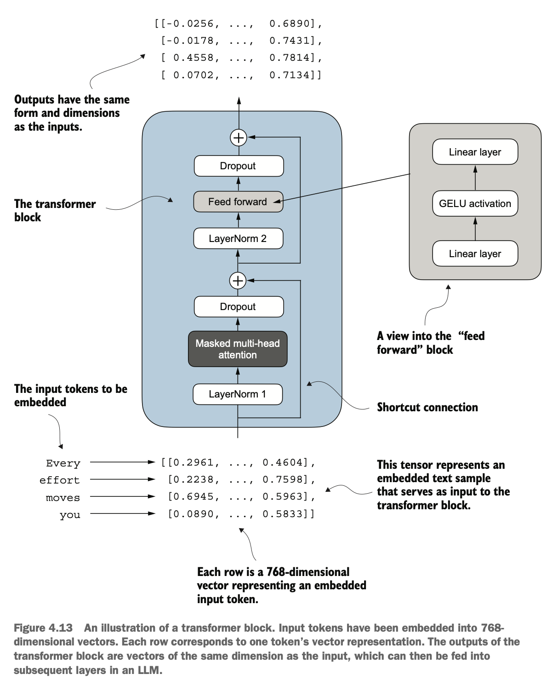

그림 4.13 트랜스포머 블록. 입력 토큰은 768차원 벡터로 임베딩된다. 각 행은 하나의 토큰 벡터 표현에 해당한다. 블록의 출력도 입력과 동일한 차원을 가지며, 이후 LLM의 다음 층으로 전달된다.

트랜스포머 블록은 다음과 같이 구현할 수 있다.

**코드 4.6 GPT의 트랜스포머 블록 구성 요소**

```python
from chapter03 import MultiHeadAttention

class TransformerBlock(nn.Module):
    def __init__(self, cfg):
        super().__init__()
        self.att = MultiHeadAttention(
            d_in=cfg["emb_dim"],
            d_out=cfg["emb_dim"],
            context_length=cfg["context_length"],
            num_heads=cfg["n_heads"],
            dropout=cfg["drop_rate"],
            qkv_bias=cfg["qkv_bias"])
        self.ff = FeedForward(cfg)
        self.norm1 = LayerNorm(cfg["emb_dim"])
        self.norm2 = LayerNorm(cfg["emb_dim"])
        self.drop_shortcut = nn.Dropout(cfg["drop_rate"])

    def forward(self, x):
        shortcut = x
        x = self.norm1(x)
        x = self.att(x)
        x = self.drop_shortcut(x)
        x = x + shortcut

        shortcut = x
        x = self.norm2(x)
        x = self.ff(x)
        x = self.drop_shortcut(x)
        x = x + shortcut
        return x
```

`TransformerBlock` 클래스는 제공된 설정 딕셔너리(`cfg`, 예: `GPT_CONFIG_124M`)를 기반으로 멀티헤드 어텐션(`MultiHeadAttention`)과 피드포워드 네트워크(`FeedForward`)를 포함한다.

각 모듈 앞에는 층 정규화(`LayerNorm`)를 적용하고, 모듈 뒤에는 드롭아웃을 적용해 정규화와 과적합 방지에 도움을 준다. 이러한 구조를 프리-레이어 정규화(Pre-LayerNorm)라고 부른다. 원래의 트랜스포머 모델처럼 레이어 정규화를 어텐션과 피드포워드 뒤에 적용하는 포스트-레이어 정규화(Post-LayerNorm)는 학습 동작이 좋지 않은 경우가 많다.

`forward` 메서드에서는 각 모듈 뒤에 숏컷 연결을 추가해 입력을 출력과 더한다. 이는 4.4절에서 본 것처럼 깊은 모델의 기울기 흐름을 유지하고 학습을 향상시키는 핵심 요소다.

앞에서 정의한 `GPT_CONFIG_124M`을 사용해 트랜스포머 블록을 초기화하고 샘플 데이터를 입력해 보자.

```python
torch.manual_seed(123)
x = torch.rand(2, 4, 768)
block = TransformerBlock(GPT_CONFIG_124M)
output = block(x)
print("Input shape:", x.shape)
print("Output shape:", output.shape)
```

출력은

```
Input shape: torch.Size([2, 4, 768])
Output shape: torch.Size([2, 4, 768])
```

출력 텐서의 차원이 입력과 동일함을 확인할 수 있는데, 이는 트랜스포머 아키텍처가 시퀀스의 형태를 바꾸지 않고 처리한다는 뜻이다.

이처럼 트랜스포머 블록이 입력과 동일한 모양을 유지하는 설계는 우연이 아니라 중요한 특징이다. 덕분에 시퀀스-투-시퀀스 작업 전반에 적용하기 쉬우며, 각 출력 벡터가 입력 벡터 하나와 일대일로 대응한다. 다만 출력 벡터는 전체 입력 시퀀스의 정보를 통합한 컨텍스트 벡터라는 점에서(3장 참고) 값이 달라진다. 즉, 시퀀스의 길이와 특징 차원은 변하지 않지만, 각 출력 벡터는 모든 토큰의 문맥 정보를 반영하도록 다시 표현된다.

트랜스포머 블록을 구현했으므로 GPT 아키텍처를 구성하는 모든 빌딩 블록을 갖추게 되었다. 그림 4.14는 트랜스포머 블록이 층 정규화, 피드포워드 네트워크, GELU 활성함수, 숏컷 연결을 어떻게 결합하는지 보여준다. 이 블록이 GPT 아키텍처의 핵심 구성 요소를 이룬다.

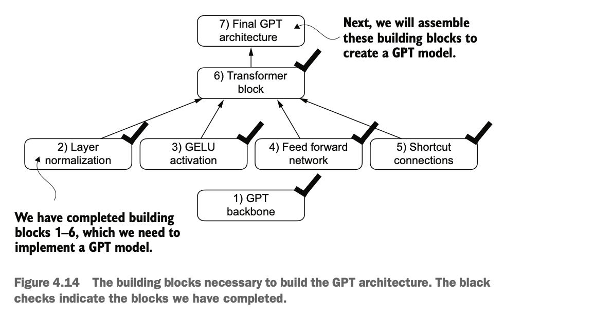

그림 4.14 GPT 아키텍처를 구성하는 빌딩 블록. 검은 체크 표시가 이미 완성한 요소를 의미한다.

## 4.6 GPT 모델 코딩하기

이 장은 `DummyGPTModel`이라는 GPT 아키텍처 개요로 시작했다. 해당 구현에서는 GPT 모델의 입력과 출력을 살펴봤지만, 핵심 구성 요소는 `DummyTransformerBlock`과 `DummyLayerNorm`이라는 플레이스홀더로 남겨두었다.

이제 이 플레이스홀더를 앞에서 구현한 실제 `TransformerBlock`과 `LayerNorm`으로 바꿔, 원래의 1억 2,400만 파라미터 GPT-2 버전과 동일하게 작동하는 모델을 완성하겠다. 5장에서는 GPT-2 모델을 사전 학습시키고, 6장에서는 OpenAI가 제공한 사전 학습 가중치를 불러올 것이다.

코드를 작성하기 전에 그림 4.15를 통해 GPT-2 모델 전체 구조를 다시 살펴보자. 트랜스포머 블록이 모델 전반에 반복된다는 점이 눈에 띈다. 1억 2,400만 파라미터 GPT-2 모델에서는 `n_layers` 항목으로 지정한 것처럼 12번 반복되고, 가장 큰 15억 4,200만 파라미터 GPT-2 모델에서는 48번 반복된다.

마지막 트랜스포머 블록의 출력은 최종 층 정규화를 거쳐 선형 출력층으로 전달된다. 출력층은 트랜스포머의 출력을 고차원 공간(여기서는 어휘 크기인 50,257차원)으로 사상해 다음 토큰을 예측한다.

이제 그림 4.15의 아키텍처를 코드로 구현해 보자.

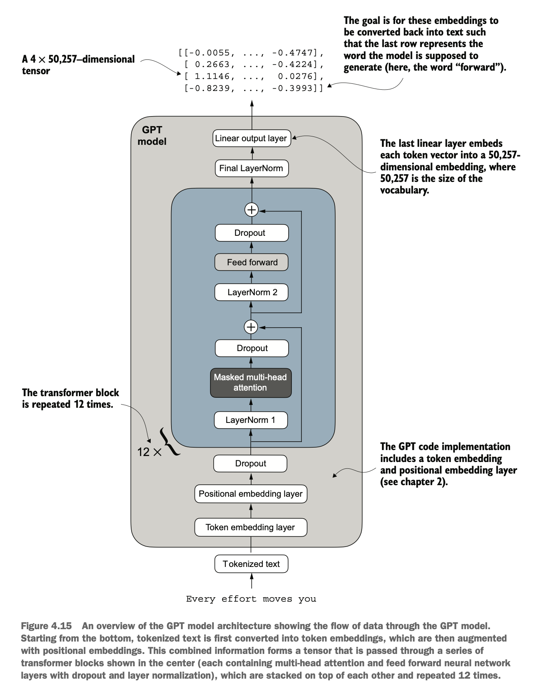

그림 4.15 GPT 모델 아키텍처 개요. 아래에서부터 토크나이즈된 텍스트가 토큰 임베딩으로 변환되고, 위치 임베딩이 더해진다. 이렇게 결합된 텐서는 가운데에 있는 트랜스포머 블록(멀티헤드 어텐션과 피드포워드 네트워크, 드롭아웃, 층 정규화를 포함)들을 차례로 통과하며, 이 블록은 위로 12번 반복된다.

**코드 4.7 GPT 모델 아키텍처 구현**

```python
class GPTModel(nn.Module):
    def __init__(self, cfg):
        super().__init__()
        self.tok_emb = nn.Embedding(cfg["vocab_size"], cfg["emb_dim"])
        self.pos_emb = nn.Embedding(cfg["context_length"], cfg["emb_dim"])
        self.drop_emb = nn.Dropout(cfg["drop_rate"])
        self.trf_blocks = nn.Sequential(
            *[TransformerBlock(cfg) for _ in range(cfg["n_layers"])]
        )
        self.final_norm = LayerNorm(cfg["emb_dim"])
        self.out_head = nn.Linear(
            cfg["emb_dim"], cfg["vocab_size"], bias=False
        )

    def forward(self, in_idx):
        batch_size, seq_len = in_idx.shape
        tok_embeds = self.tok_emb(in_idx)
        pos_embeds = self.pos_emb(
            torch.arange(seq_len, device=in_idx.device)
        )
        x = tok_embeds + pos_embeds
        x = self.drop_emb(x)
        x = self.trf_blocks(x)
        x = self.final_norm(x)
        logits = self.out_head(x)
        return logits
```

`TransformerBlock` 클래스 덕분에 `GPTModel` 클래스는 비교적 작고 간결하게 구현할 수 있다.

이 `GPTModel` 클래스의 `__init__` 생성자는 파이썬 딕셔너리(cfg)로 전달된 설정값을 사용해 토큰 임베딩과 위치 임베딩 계층을 초기화한다. 이 임베딩 계층들은 입력 토큰 인덱스를 밀집 벡터로 변환하고, 위치 정보를 더하는 역할을 한다(2장 참고).

다음으로, `__init__` 메서드는 설정값에 지정된 층 수만큼 `TransformerBlock` 모듈을 순차적으로 쌓는다. 트랜스포머 블록을 지난 후에는 `LayerNorm` 계층이 적용되어, 트랜스포머 블록의 출력을 정규화함으로써 학습 과정을 안정화한다. 마지막으로, 바이어스 없이 정의된 선형 출력 헤드가 트랜스포머의 출력을 토크나이저의 어휘 공간(각 토큰에 대한 로짓)으로 사상한다.

`forward` 메서드는 입력 토큰 인덱스 배치를 받아 임베딩을 계산하고, 위치 임베딩을 더한 뒤, 트랜스포머 블록을 통과시킨다. 이후 최종 출력을 정규화하고, 로짓을 계산한다. 이 로짓은 다음 토큰의 정규화되지 않은 확률을 나타낸다. 다음 절에서는 이 로짓을 토큰과 텍스트로 변환하는 방법을 다룬다.

이제 앞서 만든 `GPT_CONFIG_124M` 딕셔너리를 cfg 파라미터로 전달해 1억 2,400만 파라미터 GPT 모델을 초기화하고, 앞서 준비한 배치 입력을 넣어보자.

```python
torch.manual_seed(123)
model = GPTModel(GPT_CONFIG_124M)
out = model(batch)
print("Input batch:\n", batch)
print("\nOutput shape:", out.shape)
print(out)
```
이 코드는 입력 배치의 내용과 그에 따른 출력 텐서를 출력한다:

```
Input batch:
tensor([[6109, 3626, 6100, 345],
        [6109, 1110, 6622, 257]])

Output shape: torch.Size([2, 4, 50257])
tensor([[[ 0.3613, 0.4222, -0.0711, ..., 0.3483, 0.4661, -0.2838],
         [-0.1792, -0.5660, -0.9485, ..., 0.0477, 0.5181, -0.3168],
         [ 0.7120, 0.0332, 0.1085, ..., 0.1018, -0.4327, -0.2553],
         [-1.0076, 0.3418, -0.1190, ..., 0.7195, 0.4023, 0.0532]],
        [[-0.2564, 0.0900, 0.0335, ..., 0.2659, 0.4454, -0.6806],
         [ 0.1230, 0.3653, -0.2074, ..., 0.7705, 0.2710, 0.2246],
         [ 1.0558, 1.0318, -0.2800, ..., 0.6936, 0.3205, -0.3178],
         [-0.1565, 0.3926, 0.3288, ..., 1.2630, -0.1858, 0.0388]]],
       grad_fn=<UnsafeViewBackward0>)
```

출력 텐서의 모양은 `[2, 4, 50257]`이다. 두 개의 입력 문장(배치 크기 2) 각각에 네 개 토큰이 있으며, 마지막 차원 50,257은 토크나이저 어휘 크기와 동일하다. 이후 각 50,257차원 벡터를 토큰으로 변환하는 방법을 살펴볼 것이다.

모델 출력 텍스트로 넘어가기 전에 아키텍처 자체의 크기를 조금 더 살펴보자. `numel()` 메서드(`number of elements`)를 사용하면 모델 파라미터 텐서의 총 원소 수를 계산할 수 있다.

```python
total_params = sum(p.numel() for p in model.parameters())
print(f"Total number of parameters: {total_params:,}")
```
결과는

```
Total number of parameters: 163,009,536
```

여기서 눈치 빠른 독자는 이상한 점을 발견할 수 있다. 앞서 1억 2,400만 개 파라미터의 GPT 모델을 초기화한다고 했는데, 실제 파라미터 수는 왜 1억 6,300만 개인가?

이 차이는 '가중치 결합(weight tying)'이라는 개념 때문이다. 원래 GPT-2 아키텍처에서는 토큰 임베딩 계층의 가중치를 출력 계층에서 재사용한다. 즉, 토큰 임베딩 계층의 가중치와 출력 계층의 가중치가 동일하게 공유되는 것이다. 이를 더 잘 이해하기 위해, GPTModel에서 초기화한 토큰 임베딩 계층과 선형 출력 계층의 가중치 모양을 살펴보자.

```python
print("Token embedding layer shape:", model.tok_emb.weight.shape)
print("Output layer shape:", model.out_head.weight.shape)
```
출력 결과에서 알 수 있듯이, 두 계층의 가중치 텐서는 동일한 모양을 갖는다.

```
Token embedding layer shape: torch.Size([50257, 768])
Output layer shape: torch.Size([50257, 768])
```

보듯 두 층의 가중치 텐서는 동일한 모양을 갖는다. 어휘 크기가 50,257이기 때문에 가중치 행 수가 매우 크다. 그렇다면 출력층 파라미터 수를 총 파라미터에서 빼고 가중치 결합을 적용한 경우와 비교해보자.

```python
total_params_gpt2 = (
    total_params - sum(p.numel() for p in model.out_head.parameters())
)
print(f"Number of trainable parameters considering weight tying: {total_params_gpt2:,}")
```
출력은

```
Number of trainable parameters considering weight tying: 124,412,160
```

이제 모델 파라미터 수가 1억 2,441만 2,160개로, 원래 GPT-2 모델과 일치한다.

가중치 결합은 전체 메모리 사용량과 계산 비용을 줄여 준다. 하지만 실무 경험상 토큰 임베딩과 출력층을 분리하는 편이 학습과 성능 면에서 더 낫다. 최신 LLM도 대부분 별도의 층을 사용한다. 다만 6장에서 OpenAI의 사전 학습 가중치를 로드할 때는 가중치 결합을 다시 구현할 것이다.

>**연습문제 4.1**
>
>피드포워드 모듈과 멀티헤드 어텐션 모듈에 포함된 파라미터 수를 계산해 비교해 보라.

마지막으로 현재 `GPTModel` 객체가 가진 1억 6,300만 개 파라미터가 차지하는 메모리를 계산해 보자.

```python
total_size_bytes = total_params * 4
total_size_mb = total_size_bytes / (1024 * 1024)
print(f"Total size of the model: {total_size_mb:.2f} MB")
```

결과는

```
Total size of the model: 621.83 MB
```

32비트 부동소수점 파라미터 하나가 4바이트라는 가정하에 총 621.83MB가 필요하다는 것을 알 수 있다. 비교적 작은 LLM이라도 상당한 저장 공간이 필요하다는 점을 보여준다.

GPT 모델 아키텍처를 구현했고 `[batch_size, num_tokens, vocab_size]` 형태의 수치 텐서를 출력한다는 것을 확인했다. 이제 이 출력 텐서를 텍스트로 변환하는 코드를 작성해 보자.

>**연습문제 4.2 더 큰 GPT 모델 초기화하기**
>
>1억 2,400만 개 파라미터의 GPT 모델(일명 "GPT-2 small")을 초기화했다. 구성 파일만 수정하고 나머지 코드는 그대로 둔 채, `GPTModel` 클래스를 사용해 다음과 같은 더 큰 모델들을 구현해 보자: GPT-2 medium(1,024차원 임베딩, 24개의 트랜스포머 블록, 16개의 멀티헤드 어텐션), GPT-2 large(1,280차원 임베딩, 36개의 트랜스포머 블록, 20개의 멀티헤드 어텐션), 그리고 GPT-2 XL(1,600차원 임베딩, 48개의 트랜스포머 블록, 25개의 멀티헤드 어텐션). 보너스로 각 모델의 총 파라미터 수도 계산해 보자.

## 4.7 텍스트 생성

이제 GPT 모델의 텐서 출력값을 다시 텍스트로 변환하는 코드를 구현해 보자. 본격적으로 코드를 작성하기 전에, 생성형 모델(LLM)이 어떻게 한 번에 한 단어(또는 토큰)씩 텍스트를 생성하는지 간단히 살펴보자.

그림 4.16은 "Hello, I am"과 같은 입력 컨텍스트가 주어졌을 때, GPT 모델이 텍스트를 한 단계씩 생성하는 과정을 보여준다. 각 반복마다 입력 컨텍스트가 확장되어, 모델이 점점 더 일관성 있고 문맥에 맞는 텍스트를 만들어 낼 수 있다. 여섯 번째 반복이 끝나면 "Hello, I am a model ready to help."라는 완성된 문장이 생성된다. 앞서 구현한 GPTModel은 [batch_size, num_token, vocab_size] 형태의 텐서를 출력한다. 그렇다면 GPT 모델은 이 출력 텐서에서 어떻게 실제 텍스트를 만들어낼까?

그림 4.17에 나타난 것처럼, GPT 모델이 출력 텐서에서 텍스트를 생성하는 과정은 여러 단계를 거친다. 이 과정에는 출력 텐서를 디코딩하고, 확률 분포에 따라 토큰을 선택하며, 선택된 토큰을 사람이 읽을 수 있는 텍스트로 변환하는 단계가 포함된다.

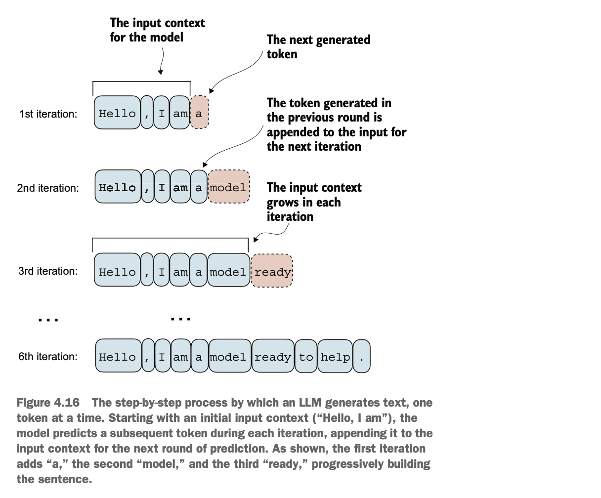

그림 4.16 LLM이 한 번에 한 토큰씩 텍스트를 생성하는 과정. 초기 입력("Hello, I am")으로 시작해 각 반복마다 다음 토큰을 예측하고, 이를 입력에 덧붙여 다음 예측을 수행한다.

그림 4.17은 단일 반복에서 GPT 모델이 다음 토큰을 생성하는 과정을 보여준다. 각 단계에서 모델은 가능한 다음 토큰을 나타내는 벡터 행렬을 출력한다. 마지막 벡터를 추출해 소프트맥스 함수를 적용해 확률 분포로 바꾼 뒤, 가장 높은 값의 인덱스를 찾아 해당 토큰 ID를 얻는다. 이 토큰 ID를 다시 텍스트로 디코딩하고, 이전 입력 뒤에 붙여 다음 반복의 입력으로 사용한다. 이렇게 한 단계씩 진행하면서 모델은 초기 컨텍스트를 기반으로 문맥에 맞는 문장과 문단을 만들어낸다.

실제로는 그림 4.16처럼 이 과정을 여러 번 반복하면서 사용자가 지정한 토큰 수만큼을 생성한다. 다음 코드는 토큰 생성 과정을 구현한 것이다.

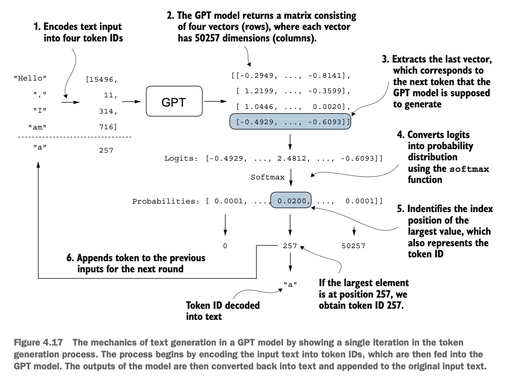

그림 4.17 GPT 모델에서 텍스트를 생성하는 한 번의 반복. 입력 텍스트를 토큰 ID로 인코딩해 모델에 넣고, 출력 로짓을 확률로 변환한 뒤 가장 높은 확률의 토큰을 선택해 다시 입력에 덧붙인다.

**코드 4.8 GPT 모델이 텍스트를 생성하는 함수**

```python
def generate_text_simple(model, idx, max_new_tokens, context_size):
    for _ in range(max_new_tokens):
        idx_cond = idx[:, -context_size:]
        with torch.no_grad():
            logits = model(idx_cond)
        logits = logits[:, -1, :]
        probas = torch.softmax(logits, dim=-1)
        idx_next = torch.argmax(probas, dim=-1, keepdim=True)
        idx = torch.cat((idx, idx_next), dim=1)
    return idx
```

이 코드는 PyTorch를 사용해 간단한 생성 루프를 구현한 것이다. 새 토큰을 몇 개 생성할지 지정하고, 현재 컨텍스트를 모델의 최대 컨텍스트 크기에 맞춰 잘라낸 뒤, 예측을 수행하고 가장 높은 확률의 토큰을 선택한다.

`generate_text_simple` 함수에서는 소프트맥스를 이용해 로짓을 확률 분포로 변환하고, `torch.argmax`로 가장 높은 값의 위치를 고른다. 소프트맥스는 단조 함수이므로 입력의 순서를 보존한다. 따라서 실제로는 소프트맥스를 생략하고 로짓에 바로 `torch.argmax`를 적용해도 동일한 결과를 얻는다. 다만 로짓을 확률로 바꾸는 전 과정을 보여 주면 모델이 가장 가능성 높은 토큰을 선택하는 과정을 이해하는 데 도움이 되므로 여기서는 소프트맥스를 포함했다. 이러한 방식은 그리디 디코딩(greedy decoding)이라고 부른다.

다음 장에서 GPT 학습 코드를 구현할 때는 소프트맥스 출력에 샘플링 기법을 적용해 항상 가장 가능성 높은 토큰만 선택하지 않도록 만들 것이다. 이렇게 하면 생성되는 텍스트에 다양성과 창의성이 더해진다.

`generate_text_simple` 함수가 한 번에 한 개의 토큰 ID를 생성하고 컨텍스트에 덧붙이는 과정은 그림 4.18에 묘사되어 있다(각 반복에서 토큰 ID가 어떻게 생성되는지는 그림 4.17 참고). 예를 들어 1번째 반복에서는 "Hello, I am"에 해당하는 토큰을 입력으로 받아 다음 토큰(ID 257, "a")을 예측하고 입력에 덧붙인다. 이 과정을 여섯 번 반복하면 "Hello, I am a model ready to help"이라는 문장이 완성된다.

이제 "Hello, I am"이라는 컨텍스트를 입력으로 사용해 `generate_text_simple` 함수를 시험해 보자. 먼저 입력 컨텍스트를 토큰 ID로 인코딩한다.

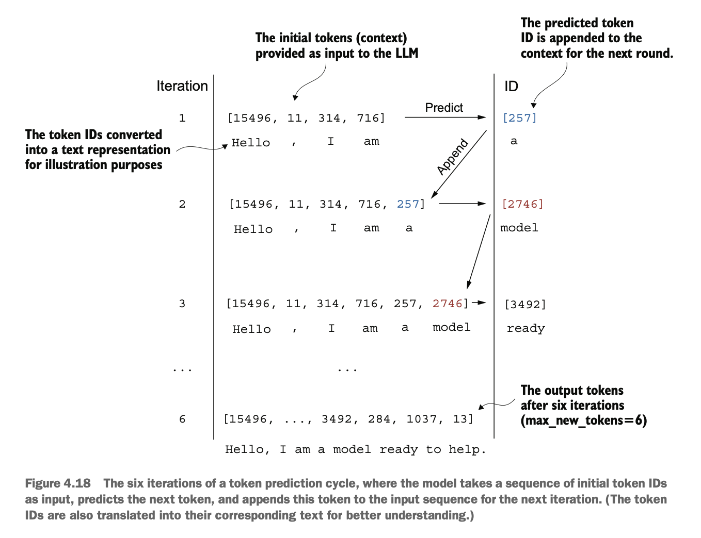

그림 4.18 토큰 예측 사이클의 여섯 번 반복. 모델은 초기 토큰 ID 시퀀스를 입력받아 다음 토큰을 예측하고, 이를 입력 시퀀스에 덧붙여 다음 반복을 수행한다. 이해를 돕기 위해 토큰 ID뿐 아니라 해당 텍스트도 함께 표기했다.

이제 "Hello, I am"이라는 컨텍스트를 입력으로 사용해 `generate_text_simple` 함수를 시험해 보자. 먼저 입력 컨텍스트를 토큰 ID로 인코딩한다.

```python
start_context = "Hello, I am"
encoded = tokenizer.encode(start_context)
print("encoded:", encoded)
encoded_tensor = torch.tensor(encoded).unsqueeze(0)
print("encoded_tensor.shape:", encoded_tensor.shape)
```

인코딩된 ID는 다음과 같다

```
encoded: [15496, 11, 314, 716]
encoded_tensor.shape: torch.Size([1, 4])
```

그림 4.18은 토큰 예측 사이클이 여섯 번 반복되는 과정을 보여 준다. 모델은 초기 토큰 ID 시퀀스를 입력받아 다음 토큰을 예측하고, 예측된 토큰을 입력 시퀀스에 덧붙여 다음 반복을 수행한다(이해를 돕기 위해 토큰 ID뿐 아니라 해당 텍스트도 함께 표기했다).

다음으로, 모델을 `.eval()` 모드로 전환한다. 이 모드는 드롭아웃처럼 학습 중에만 사용하는 무작위 요소를 비활성화한다. 그리고 인코딩된 입력 텐서에 `generate_text_simple` 함수를 적용한다:


```python
model.eval()
out = generate_text_simple(
    model=model,
    idx=encoded_tensor,
    max_new_tokens=6,
    context_size=GPT_CONFIG_124M["context_length"]
)
print("Output:", out)
print("Output length:", len(out[0]))
```

생성된 출력 토큰 ID는 다음과 같다

```
Output: tensor([[15496, 11, 314, 716, 27018, 24086, 47843, 30961, 42348, 7267]])
Output length: 10
```

`.decode` 메서드를 사용하면 ID를 다시 텍스트로 바꿀 수 있다.

```python
decoded_text = tokenizer.decode(out.squeeze(0).tolist())
print(decoded_text)
```

모델이 출력한 텍스트는 다음과 같다

```
Hello, I am Featureiman Byeswickattribute argue
```

모델이 출력한 텍스트는 "Hello, I am Featureiman Byeswickattribute argue"처럼 의미 없는 문자열이다. 아직 모델을 학습하지 않았기 때문에 자연스럽고 일관된 텍스트를 생성할 수 없다. 지금까지는 GPT 아키텍처를 구현하고 초기 가중치를 무작위로 설정했을 뿐이다. 모델 학습은 큰 주제이므로 다음 장에서 자세히 다룬다.

>**연습문제 4.3 드롭아웃 파라미터 분리하기**
>
>이 장의 앞부분에서 우리는 `GPT_CONFIG_124M` 딕셔너리에 전역 드롭아웃 비율(`drop_rate`)을 정의해 GPTModel 아키텍처의 여러 위치에서 드롭아웃 비율을 설정했다. 이제 모델 아키텍처 내의 각 드롭아웃 계층마다 서로 다른 드롭아웃 값을 지정하도록 코드를 변경해 보자. (힌트: 드롭아웃 계층은 임베딩 층, 숏컷 연결, 멀티헤드 어텐션 모듈의 세 곳에 사용된다.)

## 요약

- 레이어 정규화는 각 레이어의 출력이 일정한 평균과 분산을 갖도록 하여 학습을 안정화한다.
- 숏컷 연결은 한 레이어의 출력을 더 깊은 레이어로 직접 전달하여 하나 이상의 레이어를 건너뛰는 연결로, LLM과 같은 심층 신경망 학습 시 발생하는 그래디언트 소실 문제를 완화하는 데 도움을 준다.
- 트랜스포머 블록은 GPT 모델의 핵심 구조적 요소로, 마스킹된 멀티헤드 어텐션 모듈과 GELU 활성화 함수를 사용하는 완전 연결 피드포워드 네트워크를 결합한다.
- GPT 모델은 수백만에서 수십억 개의 파라미터를 가진 다수의 트랜스포머 블록이 반복되는 대형 언어 모델(LLM)이다.
- GPT 모델은 124, 345, 762, 1,542백만 파라미터 등 다양한 크기로 제공되며, 모두 동일한 GPTModel 파이썬 클래스로 구현할 수 있다.
- GPT와 같은 LLM의 텍스트 생성 기능은 주어진 입력 컨텍스트를 바탕으로 한 번에 하나씩 토큰을 예측하여 출력 텐서를 사람이 읽을 수 있는 텍스트로 디코딩하는 과정을 포함한다.
- 학습되지 않은 GPT 모델은 일관성 없는 텍스트를 생성하므로, 일관된 텍스트 생성을 위해서는 모델 학습이 매우 중요하다.
