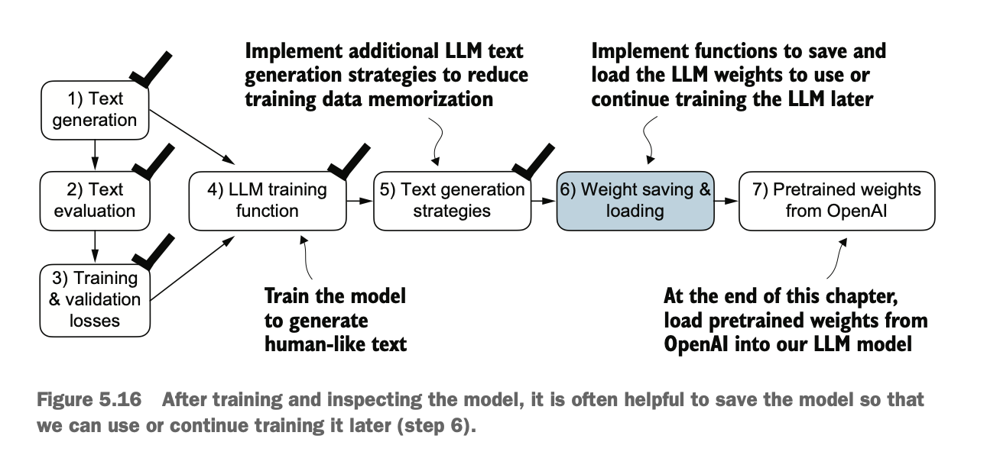

# 5 레이블이 없는 데이터로 사전 학습하기

> **이 장에서 다루는 내용**
>
> - 학습 중 LLM이 생성한 텍스트의 품질을 평가하기 위한 학습 및 검증 세트 손실 계산
> - 학습 함수 구현 및 LLM 사전 학습
> - LLM 학습을 계속하기 위한 모델 가중치 저장 및 로드
> - OpenAI에서 사전 학습된 가중치 로드하기

지금까지 우리는 데이터 샘플링과 어텐션 메커니즘을 구현하고 LLM 아키텍처를 코딩했습니다. 이제 학습 함수를 구현하고 LLM을 사전 학습할 시간입니다. 학습 과정에서 LLM을 최적화하기 위해 필요한 생성된 텍스트의 품질을 측정하는 기본 모델 평가 기법을 배우게 됩니다. 또한 사전 학습된 가중치를 로드하는 방법을 논의하여 LLM에 파인튜닝을 위한 견고한 시작점을 제공하겠습니다. 그림 5.1은 이 장에서 논의할 내용을 강조하는 전체 계획을 보여줍니다.


그림 5.1 LLM 코딩의 세 가지 주요 단계. 이 장은 2단계: LLM 사전 학습(4단계)에 초점을 맞추며, 여기에는 학습 코드 구현(5단계), 성능 평가(6단계), 모델 가중치 저장 및 로드(7단계)가 포함됩니다.

> **가중치 매개변수**
>
> LLM 및 기타 딥러닝 모델의 맥락에서 가중치는 학습 과정이 조정하는 학습 가능한 매개변수를 의미합니다. 이러한 가중치는 가중치 매개변수 또는 단순히 매개변수라고도 합니다. PyTorch와 같은 프레임워크에서 이러한 가중치는 선형 레이어에 저장되며, 3장에서 멀티헤드 어텐션 모듈과 4장에서 GPTModel을 구현하는 데 사용했습니다. 레이어를 초기화한 후(new_layer $=$ torch.nn.Linear $(\ldots)$ ), .weight 속성인 new_layer.weight를 통해 가중치에 접근할 수 있습니다. 또한 편의를 위해 PyTorch는 model.parameters() 메서드를 통해 가중치와 편향을 포함한 모델의 모든 학습 가능한 매개변수에 직접 접근할 수 있으며, 이는 나중에 모델 학습을 구현할 때 사용할 것입니다.

## 5.1 생성형 텍스트 모델 평가하기

4장의 텍스트 생성을 간단히 복습한 후, 텍스트 생성을 위한 LLM을 설정하고 생성된 텍스트의 품질을 평가하는 기본적인 방법을 논의하겠습니다. 그런 다음 학습 및 검증 손실을 계산할 것입니다. 그림 5.2는 이 장에서 다루는 주제를 보여주며, 처음 세 단계가 강조되어 있습니다.


그림 5.2 이 장에서 다루는 주제의 개요. 텍스트 생성 복습(1단계)으로 시작하여 기본 모델 평가 기법(2단계)과 학습 및 검증 손실(3단계)에 대해 논의합니다.

### 5.1.1 GPT를 사용한 텍스트 생성

LLM을 설정하고 4장에서 구현한 텍스트 생성 과정을 간단히 복습해 보겠습니다. GPTModel 클래스와 GPT_CONFIG_124M 딕셔너리를 사용하여 나중에 평가하고 학습할 GPT 모델을 초기화하는 것으로 시작합니다(4장 참조):

```python
import torch
from chapter04 import GPTModel
GPT_CONFIG_124M = {
    "vocab_size": 50257,
    "context_length": 256, # 컨텍스트 길이를 1,024에서 256 토큰으로 줄입니다.
    "emb_dim": 768,
    "n_heads": 12,
    "n_layers": 12,
    "drop_rate": 0.1, # 드롭아웃을 0으로 설정하는 것이 가능하고 일반적입니다.
    "qkv_bias": False
}
torch.manual_seed(123)
model = GPTModel(GPT_CONFIG_124M)
model.eval()
```

GPT_CONFIG_124M 딕셔너리를 고려하면, 이전 장과 비교하여 우리가 수정한 유일한 부분은 컨텍스트 길이를 256 토큰으로 줄인 것입니다. 이 수정은 모델 학습의 계산 요구사항을 줄여 표준 노트북 컴퓨터에서도 학습을 수행할 수 있게 합니다.

원래 1억 2400만 개의 매개변수를 가진 GPT-2 모델은 최대 1,024개의 토큰을 처리하도록 구성되었습니다. 학습 과정 후에 컨텍스트 크기 설정을 업데이트하고 사전 학습된 가중치를 로드하여 1,024 토큰 컨텍스트 길이로 구성된 모델과 작업할 것입니다.

GPTModel 인스턴스를 사용하여 4장의 generate_text_simple 함수를 채택하고 두 가지 편리한 함수인 text_to_token_ids와 token_ids_to_text를 소개합니다. 이 함수들은 텍스트와 토큰 표현 간의 변환을 용이하게 하며, 이는 이 장 전체에서 활용할 기법입니다.


그림 5.3 텍스트 생성은 텍스트를 토큰 ID로 인코딩하여 LLM이 로짓 벡터로 처리하는 과정을 포함합니다. 로짓 벡터는 다시 토큰 ID로 변환되고, 텍스트 표현으로 디토큰화됩니다.

그림 5.3은 GPT 모델을 사용한 3단계 텍스트 생성 과정을 보여줍니다. 첫째, 토크나이저가 입력 텍스트를 일련의 토큰 ID로 변환합니다(2장 참조). 둘째, 모델이 이러한 토큰 ID를 받아 해당하는 로짓을 생성하는데, 이는 어휘의 각 토큰에 대한 확률 분포를 나타내는 벡터입니다(4장 참조). 셋째, 이러한 로짓이 토큰 ID로 다시 변환되고, 토크나이저가 이를 사람이 읽을 수 있는 텍스트로 디코딩하여 텍스트 입력에서 텍스트 출력으로의 주기를 완성합니다.

다음 리스팅에 표시된 대로 텍스트 생성 과정을 구현할 수 있습니다.

**리스팅 5.1 텍스트를 토큰 ID로 변환하는 유틸리티 함수**

```python
import tiktoken
from chapter04 import generate_text_simple


def text_to_token_ids(text, tokenizer):
    encoded = tokenizer.encode(text, allowed_special={'<|endoftext|>'})
    encoded_tensor = torch.tensor(encoded).unsqueeze(0)  # .unsqueeze(0)는 배치 차원을 추가합니다
    return encoded_tensor


def token_ids_to_text(token_ids, tokenizer):
    flat = token_ids.squeeze(0) # 배치 차원을 제거합니다
    return tokenizer.decode(flat.tolist())


start_context = "Every effort moves you"
tokenizer = tiktoken.get_encoding("gpt2")
token_ids = generate_text_simple(
    model=model,
    idx=text_to_token_ids(start_context, tokenizer),
    max_new_tokens=10,
    context_size=GPT_CONFIG_124M["context_length"]
)
print("Output text:\n", token_ids_to_text(token_ids, tokenizer))
```

이 코드를 사용하면 모델이 다음 텍스트를 생성합니다:

```
Output text:
    Every effort moves you rentingetic wasn? refres RexMeCHicular stren
```

분명히 모델은 아직 학습을 거치지 않았기 때문에 일관된 텍스트를 생성하지 못하고 있습니다. 텍스트를 "일관된" 또는 "고품질"로 만드는 것이 무엇인지 정의하려면 생성된 콘텐츠를 평가하는 수치적 방법을 구현해야 합니다. 이 접근 방식을 통해 학습 과정 전반에 걸쳐 모델의 성능을 모니터링하고 향상시킬 수 있습니다.

다음으로 생성된 출력에 대한 손실 지표를 계산할 것입니다. 이 손실은 학습 진행 상황의 진행 및 성공 지표로 작용합니다. 또한 이후 장에서 LLM을 파인튜닝할 때 모델 품질을 평가하는 추가 방법론을 검토할 것입니다.

### 5.1.2 텍스트 생성 손실 계산하기

다음으로 텍스트 생성 손실을 계산하여 학습 중 생성된 텍스트 품질을 수치적으로 평가하는 기법을 살펴보겠습니다. 데이터가 로드되는 방법과 generate_text_simple 함수를 통해 텍스트가 생성되는 방법에 대한 간단한 복습으로 시작하여, 개념을 명확하고 적용 가능하게 만들기 위해 실제 예제와 함께 이 주제를 단계별로 살펴보겠습니다.

그림 5.4는 5단계 절차를 사용하여 입력 텍스트에서 LLM이 생성한 텍스트로의 전체 흐름을 보여줍니다. 이 텍스트 생성 과정은 generate_text_simple 함수가 내부적으로 수행하는 작업을 보여줍니다. 이 섹션 후반부에서 생성된 텍스트 품질을 측정하는 손실을 계산하기 전에 이러한 동일한 초기 단계를 수행해야 합니다.

그림 5.4는 이 이미지를 한 페이지에 맞추기 위해 7개 토큰의 작은 어휘를 사용한 텍스트 생성 과정을 설명합니다. 그러나 우리의 GPTModel은 50,257개의 단어로 구성된 훨씬 더 큰 어휘를 사용하므로 다음 코드의 토큰 ID는 0에서 6이 아니라 0에서 50,256까지의 범위가 됩니다.


그림 5.4 왼쪽에 표시된 세 개의 입력 토큰 각각에 대해 어휘의 각 토큰에 해당하는 확률 점수를 포함하는 벡터를 계산합니다. 각 벡터에서 가장 높은 확률 점수의 인덱스 위치는 가장 가능성이 높은 다음 토큰 ID를 나타냅니다. 가장 높은 확률 점수와 관련된 이러한 토큰 ID가 선택되고 모델이 생성한 텍스트를 나타내는 텍스트로 다시 매핑됩니다.

또한 그림 5.4는 단순성을 위해 단일 텍스트 예제("every effort moves")만 보여줍니다. 그림의 단계를 구현하는 다음 실습 코드 예제에서는 GPT 모델에 대한 두 개의 입력 예제("every effort moves" 및 "I really like")를 사용할 것입니다.

이미 토큰 ID로 매핑된 다음 두 입력 예제를 고려해 보겠습니다(그림 5.4, 1단계):

```python
inputs = torch.tensor([[16833, 3626, 6100], # ["every effort moves",
    [40, 1107, 588]]) # "I really like"]
```

이러한 입력과 일치하는 타겟은 모델이 생성하기를 원하는 토큰 ID를 포함합니다:

```python
targets = torch.tensor([[3626, 6100, 345 ], # [" effort moves you",
    [1107, 588, 11311]]) # " really like chocolate"]
```

타겟은 입력을 한 위치 앞으로 이동시킨 것이며, 이는 2장에서 데이터 로더 구현 중에 다룬 개념입니다. 이러한 이동 전략은 모델이 시퀀스에서 다음 토큰을 예측하도록 가르치는 데 중요합니다.

이제 입력을 모델에 공급하여 각각 세 개의 토큰으로 구성된 두 입력 예제에 대한 로짓 벡터를 계산합니다. 그런 다음 softmax 함수를 적용하여 이러한 로짓을 확률 점수(probas)로 변환합니다(그림 5.4, 2단계):

```python
with torch.no_grad(): # 아직 학습하지 않으므로 그래디언트 추적을 비활성화합니다
    logits = model(inputs)
probas = torch.softmax(logits, dim=-1) # 어휘의 각 토큰에 대한 확률
print(probas.shape)
```
확률 점수(probas) 텐서의 결과 텐서 차원은 다음과 같습니다:

```
torch.Size([2, 3, 50257])
```

첫 번째 숫자 2는 배치 크기라고도 하는 입력의 두 예제(행)에 해당합니다. 두 번째 숫자 3은 각 입력(행)의 토큰 수에 해당합니다. 마지막으로 마지막 숫자는 어휘 크기에 의해 결정되는 임베딩 차원에 해당합니다. softmax 함수를 통해 로짓을 확률로 변환한 후, generate_text_simple 함수는 결과 확률 점수를 다시 텍스트로 변환합니다(그림 5.4, 3-5단계).

확률 점수에 argmax 함수를 적용하여 해당 토큰 ID를 얻음으로써 3단계와 4단계를 완료할 수 있습니다:

```python
token_ids = torch.argmax(probas, dim=-1, keepdim=True)
print("Token IDs:\n", token_ids)
```

각각 세 개의 토큰을 포함하는 두 개의 입력 배치가 있으므로, 확률 점수에 argmax 함수를 적용하면(그림 5.4, 3단계) 각각 세 개의 예측 토큰 ID를 가진 두 세트의 출력이 생성됩니다:

```
Token IDs:
    tensor([[[16657],  # 첫 번째 배치
        [ 339],
        [42826]],
        [[49906],  # 두 번째 배치
        [29669],
        [41751]]])
```

마지막으로 5단계에서 토큰 ID를 다시 텍스트로 변환합니다:

```python
print(f"Targets batch 1: {token_ids_to_text(targets[0], tokenizer)}")
print(f"Outputs batch 1: {token_ids_to_text(token_ids[0].flatten(), tokenizer)}")
```

이러한 토큰을 디코딩하면, 이러한 출력 토큰이 모델이 생성하기를 원하는 타겟 토큰과 상당히 다르다는 것을 알 수 있습니다:

```
Targets batch 1: effort moves you
Outputs batch 1: Armed heNetflix
```

모델은 아직 학습되지 않았기 때문에 타겟 텍스트와 다른 무작위 텍스트를 생성합니다. 이제 손실을 통해 모델이 생성한 텍스트의 성능을 수치적으로 평가하고자 합니다(그림 5.5). 이는 생성된 텍스트의 품질을 측정하는 데 유용할 뿐만 아니라 생성된 텍스트를 개선하기 위해 모델의 가중치를 업데이트하는 데 사용할 학습 함수를 구현하기 위한 빌딩 블록이기도 합니다.


그림 5.5 이 장에서 다루는 주제의 개요. 1단계를 완료했습니다. 이제 텍스트 평가 함수를 구현할 준비가 되었습니다(2단계).

그림 5.5에 표시된 것처럼 우리가 구현하는 텍스트 평가 프로세스의 일부는 생성된 토큰이 올바른 예측(타겟)에서 "얼마나 떨어져 있는지"를 측정하는 것입니다. 나중에 구현할 학습 함수는 이 정보를 사용하여 타겟 텍스트와 더 유사하거나(또는 이상적으로는 일치하는) 텍스트를 생성하도록 모델 가중치를 조정합니다.

그림 5.6에 설명된 것처럼 모델 학습은 올바른 타겟 토큰 ID에 해당하는 인덱스 위치의 softmax 확률을 증가시키는 것을 목표로 합니다. 이 softmax 확률은 모델의 생성된 출력을 수치적으로 평가하기 위해 다음에 구현할 평가 지표에도 사용됩니다: 올바른 위치의 확률이 높을수록 더 좋습니다.

그림 5.6은 모든 것을 하나의 그림에 맞추기 위해 7개 토큰의 간결한 어휘에 대한 softmax 확률을 표시한다는 점을 기억하세요. 이는 시작 무작위 값이 약 0.14와 같은 $1 / 7$ 주위에 있을 것임을 의미합니다. 그러나 GPT-2 모델에 사용하는 어휘는 50,257개의 토큰을 가지고 있으므로 대부분의 초기 확률은 $0.00002(1 / 50,257)$ 주위에 있을 것입니다.


그림 5.6 학습 전에 모델은 무작위 다음 토큰 확률 벡터를 생성합니다. 모델 학습의 목표는 강조 표시된 타겟 토큰 ID에 해당하는 확률 값이 최대화되도록 하는 것입니다.

두 입력 텍스트 각각에 대해 다음 코드를 사용하여 타겟 토큰에 해당하는 초기 softmax 확률 점수를 출력할 수 있습니다:

```python
text_idx = 0
target_probas_1 = probas[text_idx, [0, 1, 2], targets[text_idx]]
print("Text 1:", target_probas_1)
text_idx = 1
target_probas_2 = probas[text_idx, [0, 1, 2], targets[text_idx]]
print("Text 2:", target_probas_2)
```

각 배치에 대한 세 개의 타겟 토큰 ID 확률은 다음과 같습니다:

```
Text 1: tensor([7.4541e-05, 3.1061e-05, 1.1563e-05])
Text 2: tensor([1.0337e-05, 5.6776e-05, 4.7559e-06])
```

LLM 학습의 목표는 올바른 토큰의 가능성을 최대화하는 것이며, 이는 다른 토큰에 비해 확률을 증가시키는 것을 포함합니다. 이렇게 하면 LLM이 일관되게 타겟 토큰, 즉 본질적으로 문장의 다음 단어를 생성할 다음 토큰으로 선택하도록 보장할 수 있습니다.

> **역전파**
>
> 타겟 토큰에 해당하는 softmax 확률 값을 어떻게 최대화할 수 있을까요? 큰 그림은 생성하고자 하는 각 토큰 ID에 대해 모델이 더 높은 값을 출력하도록 모델 가중치를 업데이트하는 것입니다. 가중치 업데이트는 역전파라는 프로세스를 통해 수행되며, 이는 딥 신경망 학습을 위한 표준 기법입니다(역전파 및 모델 학습에 대한 자세한 내용은 부록 A의 섹션 A.3~A.7 참조).
>
> 역전파는 손실 함수를 필요로 하며, 이는 모델의 예측 출력(여기서는 타겟 토큰 ID에 해당하는 확률)과 실제 원하는 출력 간의 차이를 계산합니다. 이 손실 함수는 모델의 예측이 타겟 값에서 얼마나 벗어나 있는지를 측정합니다.

다음으로 두 예제 배치인 target_probas_1과 target_probas_2의 확률 점수에 대한 손실을 계산할 것입니다. 주요 단계는 그림 5.7에 설명되어 있습니다. target_probas_1과 target_probas_2를 얻기 위해 이미 1~3단계를 적용했으므로, 4단계로 진행하여 확률 점수에 로그를 적용합니다:

```python
log_probas = torch.log(torch.cat((target_probas_1, target_probas_2)))
print(log_probas)
```


그림 5.7 손실 계산은 여러 단계를 포함합니다. 이미 완료한 1~3단계에서는 타겟 텐서에 해당하는 토큰 확률을 계산합니다. 그런 다음 이러한 확률은 4~6단계에서 로그를 통해 변환되고 평균화됩니다.

결과는 다음 값들입니다:

```
tensor([ -9.5042, -10.3796, -11.3677, -11.4798, -9.7764, -12.2561])
```

확률 점수의 로그를 사용하는 것이 점수를 직접 처리하는 것보다 수학적 최적화에서 더 관리하기 쉽습니다. 이 주제는 이 책의 범위를 벗어나지만, 부록 B에서 찾을 수 있는 강의에서 더 자세히 설명했습니다.

다음으로 평균을 계산하여 이러한 로그 확률을 단일 점수로 결합합니다(그림 5.7의 5단계):

```python
avg_log_probas = torch.mean(log_probas)
print(avg_log_probas)
```
결과 평균 로그 확률 점수는 다음과 같습니다:
```
tensor(-10.7940)
```
목표는 학습 프로세스의 일부로 모델의 가중치를 업데이트하여 평균 로그 확률을 0에 최대한 가깝게 만드는 것입니다. 그러나 딥러닝에서는 평균 로그 확률을 0으로 올리는 것이 아니라 음의 평균 로그 확률을 0으로 낮추는 것이 일반적인 관행입니다. 음의 평균 로그 확률은 단순히 평균 로그 확률에 -1을 곱한 것이며, 이는 그림 5.7의 6단계에 해당합니다:

```python
neg_avg_log_probas = avg_log_probas * -1
print(neg_avg_log_probas)
```
이는 tensor(10.7940)를 출력합니다. 딥러닝에서 이 음수 값인 -10.7940를 10.7940으로 바꾸는 것을 교차 엔트로피 손실이라고 합니다. PyTorch는 그림 5.7의 이 6단계를 모두 처리하는 내장 cross_entropy 함수를 이미 가지고 있어 편리합니다.

> **교차 엔트로피 손실**
>
> 핵심적으로 교차 엔트로피 손실은 머신러닝과 딥러닝에서 두 확률 분포 간의 차이를 측정하는 인기 있는 측정 방법입니다. 일반적으로 레이블의 실제 분포(여기서는 데이터셋의 토큰)와 모델의 예측 분포(예: LLM이 생성한 토큰 확률)를 측정합니다.
>
> 머신러닝, 특히 PyTorch와 같은 프레임워크의 맥락에서 cross_entropy 함수는 이산 결과에 대한 이 측정값을 계산하며, 이는 모델이 생성한 토큰 확률이 주어졌을 때 타겟 토큰의 음의 평균 로그 확률과 유사하므로 "교차 엔트로피"와 "음의 평균 로그 확률"이라는 용어가 관련이 있으며 실제로 종종 서로 바꿔 사용됩니다.

cross_entropy 함수를 적용하기 전에 logits와 target 텐서의 형상을 간략히 상기해 보겠습니다:

```python
print("Logits shape:", logits.shape)
print("Targets shape:", targets.shape)
```

결과 형상은 다음과 같습니다:

```
Logits shape: torch.Size([2, 3, 50257])
Targets shape: torch.Size([2, 3])
```

보시다시피 logits 텐서는 배치 크기, 토큰 수, 어휘 크기의 세 가지 차원을 가지고 있습니다. targets 텐서는 배치 크기와 토큰 수의 두 가지 차원을 가지고 있습니다.

PyTorch의 cross_entropy 손실 함수를 사용하려면 배치 차원에 대해 이러한 텐서를 결합하여 평탄화하려고 합니다:

```python
logits_flat = logits.flatten(0, 1)
targets_flat = targets.flatten()
print("Flattened logits:", logits_flat.shape)
print("Flattened targets:", targets_flat.shape)
```

결과 텐서 차원은 다음과 같습니다:

```
Flattened logits: torch.Size([6, 50257])
Flattened targets: torch.Size([6])
```
targets는 LLM이 생성하기를 원하는 토큰 ID이며, logits는 확률 점수를 얻기 위해 softmax 함수에 들어가기 전의 스케일되지 않은 모델 출력을 포함한다는 점을 기억하세요.

이전에는 softmax 함수를 적용하고 타겟 ID에 해당하는 확률 점수를 선택한 후 음의 평균 로그 확률을 계산했습니다. PyTorch의 cross_entropy 함수가 이 모든 단계를 대신 처리해 줄 것입니다:

```python
loss = torch.nn.functional.cross_entropy(logits_flat, targets_flat)
print(loss)
```

결과 손실은 그림 5.7의 개별 단계를 수동으로 적용했을 때 이전에 얻은 것과 동일합니다: 

```
tensor(10.7940)
```

> **Perplexity**
>
> 혼란도는 언어 모델링과 같은 작업에서 모델의 성능을 평가하기 위해 교차 엔트로피 손실과 함께 자주 사용되는 측정 방법입니다. 시퀀스에서 다음 토큰을 예측할 때 모델의 불확실성을 이해하는 더 해석 가능한 방법을 제공할 수 있습니다.
>
> 혼란도는 모델이 예측한 확률 분포가 데이터셋의 단어 실제 분포와 얼마나 잘 일치하는지를 측정합니다. 손실과 마찬가지로 혼란도가 낮을수록 모델 예측이 실제 분포에 더 가깝다는 것을 나타냅니다.
>
> 혼란도(Perplexity)는 perplexity = torch.exp(loss)로 계산할 수 있으며, 이전에 계산한 손실에 적용하면 tensor(48725.8203)를 반환합니다.
>
> 혼란도는 각 단계에서 모델이 불확실한 효과적인 어휘 크기를 나타내기 때문에 원시 손실 값보다 더 해석 가능한 것으로 간주되는 경우가 많습니다. 주어진 예에서 이는 모델이 어휘의 48,725개 토큰 중 어느 것을 다음 토큰으로 생성해야 할지 불확실하다는 것을 의미합니다.

이제 설명 목적으로 두 개의 작은 텍스트 입력에 대한 손실을 계산했습니다. 다음으로 손실 계산을 전체 학습 및 검증 세트에 적용할 것입니다.

### 5.1.3 학습 및 검증 세트 손실 계산하기

먼저 LLM을 학습하는 데 사용할 학습 및 검증 데이터셋을 준비해야 합니다. 그런 다음 그림 5.8에 강조된 것처럼 학습 및 검증 세트에 대한 교차 엔트로피를 계산할 것이며, 이는 모델 학습 프로세스의 중요한 구성 요소입니다.


그림 5.8 교차 엔트로피 손실 계산을 포함한 1단계와 2단계를 완료했으므로 이제 모델 학습에 사용할 전체 텍스트 데이터셋에 이 손실 계산을 적용할 수 있습니다.

학습 및 검증 데이터셋에 대한 손실을 계산하기 위해 2장에서 이미 작업한 Edith Wharton의 단편 소설 "The Verdict"라는 매우 작은 텍스트 데이터셋을 사용합니다. 공개 도메인의 텍스트를 선택함으로써 사용권과 관련된 모든 우려를 피할 수 있습니다. 또한 이러한 작은 데이터셋을 사용하면 고급 GPU 없이도 표준 노트북 컴퓨터에서 몇 분 만에 코드 예제를 실행할 수 있어 교육 목적에 특히 유리합니다.

> **참고** 관심 있는 독자는 이 책의 보충 코드를 사용하여 Project Gutenberg의 60,000권 이상의 공개 도메인 책으로 구성된 대규모 데이터셋을 준비하고 이를 통해 LLM을 학습할 수도 있습니다(자세한 내용은 부록 D 참조).

> **LLM 사전 학습 비용**
>
> 프로젝트의 규모를 파악하기 위해 상대적으로 인기 있는 공개 LLM인 70억 매개변수 Llama 2 모델의 학습을 고려해 보겠습니다. 이 모델은 고가의 A100 GPU에서 184,320 GPU 시간이 필요했으며 2조 개의 토큰을 처리했습니다. 글을 쓰는 시점에서 AWS에서 $8 \times$ A100 클라우드 서버를 실행하는 데는 시간당 약 $\$ 30$가 소요됩니다. 대략적인 추정치로 이러한 LLM의 총 학습 비용은 약 $\$ 690,000$입니다(184,320시간을 8로 나눈 다음 $\$ 30$를 곱하여 계산).

다음 코드는 "The Verdict" 단편 소설을 로드합니다:

```python
file_path = "the-verdict.txt"
with open(file_path, "r", encoding="utf-8") as file:
    text_data = file.read()
```

데이터셋을 로드한 후 데이터셋의 문자 수와 토큰 수를 확인할 수 있습니다:

```python
total_characters = len(text_data)
total_tokens = len(tokenizer.encode(text_data))
print("Characters:", total_characters)
print("Tokens:", total_tokens)
```

출력은 다음과 같습니다:

```
Characters: 20479
Tokens: 5145
```

5,145개의 토큰만으로는 LLM을 학습하기에 너무 작아 보일 수 있지만, 앞서 언급했듯이 몇 주가 아닌 몇 분 만에 코드를 실행할 수 있도록 교육 목적으로 사용됩니다. 또한 나중에 OpenAI의 사전 학습된 가중치를 GPTModel 코드에 로드할 것입니다.

다음으로 데이터셋을 학습 세트와 검증 세트로 나누고 2장의 데이터 로더를 사용하여 LLM 학습을 위한 배치를 준비합니다. 이 프로세스는 그림 5.9에 시각화되어 있습니다. 공간 제약으로 인해 max_length=6을 사용합니다. 그러나 실제 데이터 로더의 경우 max_length를 LLM이 지원하는 256토큰 컨텍스트 길이와 동일하게 설정하여 LLM이 학습 중에 더 긴 텍스트를 볼 수 있도록 합니다.


그림 5.9 데이터 로더를 준비할 때 입력 텍스트를 학습 및 검증 세트 부분으로 분할합니다. 그런 다음 텍스트를 토큰화하고(단순성을 위해 학습 세트 부분만 표시) 토큰화된 텍스트를 사용자 지정 길이(여기서는 6)의 청크로 나눕니다. 마지막으로 행을 섞고 청크된 텍스트를 배치(여기서는 배치 크기 2)로 구성하여 모델 학습에 사용할 수 있습니다.

> **참고** 단순성과 효율성을 위해 비슷한 크기의 청크로 제공되는 학습 데이터로 모델을 학습합니다. 그러나 실제로는 LLM이 사용될 때 다양한 유형의 입력에 더 잘 일반화할 수 있도록 가변 길이 입력으로 LLM을 학습하는 것이 유익할 수도 있습니다.

데이터 분할 및 로딩을 구현하기 위해 먼저 train_ratio를 정의하여 데이터의 $90 \%$를 학습에 사용하고 나머지 $10 \%$를 학습 중 모델 평가를 위한 검증 데이터로 사용합니다:

```python
train_ratio = 0.90
split_idx = int(train_ratio * len(text_data))
train_data = text_data[:split_idx]
val_data = text_data[split_idx:]
```

train_data와 val_data 하위 집합을 사용하여 이제 2장의 create_dataloader_v1 코드를 재사용하여 각 데이터 로더를 생성할 수 있습니다:

```python
from chapter02 import create_dataloader_v1
torch.manual_seed(123)
train_loader = create_dataloader_v1(
    train_data,
    batch_size=2,
    max_length=GPT_CONFIG_124M["context_length"],
    stride=GPT_CONFIG_124M["context_length"],
    drop_last=True,
    shuffle=True,
    num_workers=0
)
val_loader = create_dataloader_v1(
    val_data,
    batch_size=2,
    max_length=GPT_CONFIG_124M["context_length"],
    stride=GPT_CONFIG_124M["context_length"],
    drop_last=False,
    shuffle=False,
    num_workers=0
)
```

매우 작은 데이터셋을 사용하고 있기 때문에 계산 리소스 수요를 줄이기 위해 상대적으로 작은 배치 크기를 사용했습니다. 실제로 1,024 이상의 배치 크기로 LLM을 학습하는 것은 드문 일이 아닙니다.

선택적 확인으로 데이터 로더가 올바르게 생성되었는지 확인하기 위해 데이터 로더를 반복할 수 있습니다:

```python
print("Train loader:")
for x, y in train_loader:
    print(x.shape, y.shape)
print("\nValidation loader:")
for x, y in val_loader:
    print(x.shape, y.shape)
```

다음과 같은 출력을 볼 수 있어야 합니다:

```python
Train loader:
torch.Size([2, 256]) torch.Size([2, 256])
torch.Size([2, 256]) torch.Size([2, 256])
torch.Size([2, 256]) torch.Size([2, 256])
torch.Size([2, 256]) torch.Size([2, 256])
torch.Size([2, 256]) torch.Size([2, 256])
torch.Size([2, 256]) torch.Size([2, 256])
torch.Size([2, 256]) torch.Size([2, 256])
torch.Size([2, 256]) torch.Size([2, 256])
Validation loader: 
torch.Size([2, 256]) torch.Size([2, 256])
```

앞의 코드 출력을 기반으로 각각 2개의 샘플과 256개의 토큰을 가진 9개의 학습 세트 배치가 있습니다. 검증을 위해 데이터의 $10 \%$만 할당했기 때문에 두 개의 입력 예제로 구성된 검증 배치가 하나만 있습니다. 2장에서 논의한 것처럼 타겟이 한 위치 이동한 입력이기 때문에 예상대로 입력 데이터(x)와 타겟 데이터(y)는 동일한 형상(배치 크기 곱하기 각 배치의 토큰 수)을 가집니다.

다음으로 학습 및 검증 로더를 통해 반환된 주어진 배치의 교차 엔트로피 손실을 계산하는 유틸리티 함수를 구현합니다:

```python
def calc_loss_batch(input_batch, target_batch, model, device):
    input_batch = input_batch.to(device)
    target_batch = target_batch.to(device)
    logits = model(input_batch)
    loss = torch.nn.functional.cross_entropy(
        logits.flatten(0, 1), target_batch.flatten()
    )
    return loss
```

이제 단일 배치에 대한 손실을 계산하는 이 calc_loss_batch 유틸리티 함수를 사용하여 주어진 데이터 로더에서 샘플링한 모든 배치에 대한 손실을 계산하는 다음 calc_loss_loader 함수를 구현할 수 있습니다.

**리스팅 5.2 학습 및 검증 손실을 계산하는 함수**

```python
def calc_loss_loader(data_loader, model, device, num_batches=None):
    total_loss = 0.0

    if len(data_loader) == 0:
        return float("nan")

    if num_batches is None:
        num_batches = len(data_loader) # 고정된 num_batches가 지정되지 않은 경우 모든 배치를 반복합니다
    else:
        num_batches = min(num_batches, len(data_loader)) # num_batches가 데이터 로더의 배치 수를 초과하는 경우 배치 수를 줄입니다

    for i, (input_batch, target_batch) in enumerate(data_loader):
        if i < num_batches:
            loss = calc_loss_batch(input_batch, target_batch, model, device)
            total_loss += loss.item() # 각 배치의 손실을 합산합니다
        else:
            break
    return total_loss / num_batches # 총 배치 수에 대한 평균 손실을 계산합니다
```

기본적으로 calc_loss_loader 함수는 주어진 데이터 로더의 모든 배치를 반복하고 total_loss 변수에 손실을 누적한 다음 총 배치 수에 대한 손실을 계산하고 평균을 냅니다. 또는 num_batches를 통해 더 적은 수의 배치를 지정하여 모델 학습 중 평가 속도를 높일 수 있습니다.

이제 학습 및 검증 세트 로더에 적용하여 이 calc_loss_loader 함수가 작동하는 것을 살펴보겠습니다:

CUDA 지원 GPU가 있는 경우 다음 평가 코드 조각을 사용하면 모델이 자동으로 GPU에서 실행됩니다:

```python
device = torch.device("cuda" if torch.cuda.is_available() else "cpu")
model.to(device) # CUDA 지원 GPU가 있는 머신이 있는 경우 코드를 변경하지 않고도 LLM이 GPU에서 학습됩니다.
with torch.no_grad(): # 아직 학습하지 않으므로 효율성을 위해 그래디언트 추적을 비활성화합니다
    train_loss = calc_loss_loader(train_loader, model, device) # "device" 설정을 통해 데이터가 LLM 모델과 동일한 디바이스에 로드되도록 합니다.
    val_loss = calc_loss_loader(val_loader, model, device)
print("Training loss:", train_loss)
print("Validation loss:", val_loss)
```


결과 손실 값은 Training loss: $10.98758347829183$ Validation loss: $10.98110580444336$입니다. 모델이 아직 학습되지 않았기 때문에 손실 값이 상대적으로 높습니다. 비교를 위해 모델이 학습 및 검증 세트에 나타나는 대로 다음 토큰을 생성하는 방법을 학습하면 손실이 0에 가까워집니다.

이제 생성된 텍스트의 품질을 측정하는 방법이 있으므로 LLM을 학습하여 이 손실을 줄여 텍스트 생성을 더 잘 할 수 있도록 하겠습니다. 이는 그림 5.10에 설명되어 있습니다.


그림 5.10 텍스트 생성 프로세스를 복습하고(1단계) 학습 및 검증 세트 손실을 계산하기 위한 기본 모델 평가 기법을 구현했습니다(2단계, 3단계). 다음으로 학습 함수로 이동하여 LLM을 사전 학습합니다(4단계).

다음으로 LLM 사전 학습에 집중할 것입니다. 모델 학습 후 대체 텍스트 생성 전략을 구현하고 사전 학습된 모델 가중치를 저장 및 로드할 것입니다.

## 5.2 LLM 학습하기

드디어 LLM인 GPTModel을 사전 학습하기 위한 코드를 구현할 시간입니다. 이를 위해 코드를 간결하고 읽기 쉽게 유지하기 위해 간단한 학습 루프에 집중합니다.

참고 관심 있는 독자는 학습률 워밍업, 코사인 어닐링, 그래디언트 클리핑을 포함한 고급 기법에 대해 부록 D에서 배울 수 있습니다.


그림 5.11 PyTorch에서 딥 신경망을 학습하기 위한 일반적인 학습 루프는 여러 에폭 동안 학습 세트의 배치를 반복하는 수많은 단계로 구성됩니다. 각 루프에서 각 학습 세트 배치에 대한 손실을 계산하여 손실 그래디언트를 결정하고, 이를 사용하여 학습 세트 손실이 최소화되도록 모델 가중치를 업데이트합니다.

그림 5.11의 순서도는 LLM 학습에 사용하는 일반적인 PyTorch 신경망 학습 워크플로를 나타냅니다. 각 에폭을 반복하고, 배치를 처리하고, 그래디언트를 재설정하고, 손실과 새 그래디언트를 계산하고, 가중치를 업데이트하는 것으로 시작하여 손실 출력 및 텍스트 샘플 생성과 같은 모니터링 단계로 마무리하는 8단계를 설명합니다.

참고 PyTorch를 사용한 딥 신경망 학습이 처음이고 이러한 단계 중 하나라도 익숙하지 않은 경우 부록 A의 섹션 A.5~A.8을 읽어보는 것이 좋습니다.

이 학습 흐름을 코드의 train_model_simple 함수를 통해 구현할 수 있습니다.

**리스팅 5.3 LLM 사전 학습을 위한 주요 함수**

```python
def train_model_simple(model, train_loader, val_loader, optimizer, device, num_epochs, eval_freq, eval_iter, start_context, tokenizer):
    train_losses, val_losses, track_tokens_seen = [], [], [] # 손실 및 본 토큰을 추적할 리스트를 초기화합니다
    tokens_seen, global_step = 0, -1

    for epoch in range(num_epochs): # 주요 학습 루프를 시작합니다
        model.train()
        for input_batch, target_batch in train_loader:
            optimizer.zero_grad() # 이전 배치 반복의 손실 그래디언트를 재설정합니다
            loss = calc_loss_batch(input_batch, target_batch, model, device)
            loss.backward() # 손실 그래디언트를 계산합니다
            optimizer.step() # 손실 그래디언트를 사용하여 모델 가중치를 업데이트합니다

            tokens_seen += input_batch.numel()
            global_step += 1

            if global_step % eval_freq == 0: # 선택적 평가 단계
                train_loss, val_loss = evaluate_model(
                    model, train_loader, val_loader, device, eval_iter
                )
                train_losses.append(train_loss)
                val_losses.append(val_loss)
                track_tokens_seen.append(tokens_seen)
                print(
                    f"Ep {epoch + 1} (Step {global_step:06d}): "
                    f"Train loss {train_loss:.3f}, Val loss {val_loss:.3f}"
                )

        generate_and_print_sample(model, tokenizer, device, start_context) # 각 에폭 후 샘플 텍스트를 출력합니다

    return train_losses, val_losses, track_tokens_seen
```


방금 만든 train_model_simple 함수는 아직 정의하지 않은 두 가지 함수인 evaluate_model과 generate_and_print_sample을 사용합니다.

evaluate_model 함수는 그림 5.11의 7단계에 해당합니다. 학습이 모델을 개선하는지 모니터링할 수 있도록 학습 및 검증 손실을 출력합니다. 평가 중에는 드롭아웃을 비활성화하기 위해 모델을 eval 모드로 전환하고 계산 오버헤드를 줄이기 위해 그래디언트 추적을 끕니다.

```python
def evaluate_model(model, train_loader, val_loader, device, eval_iter):
    model.eval() # 안정적이고 재현 가능한 결과를 위해 평가 중에는 드롭아웃이 비활성화됩니다
    with torch.no_grad(): # 평가 중에는 필요하지 않은 그래디언트 추적을 비활성화하여 계산 오버헤드를 줄입니다
        train_loss = calc_loss_loader(
            train_loader, model, device, num_batches=eval_iter
        )
        val_loss = calc_loss_loader(
            val_loader, model, device, num_batches=eval_iter
        )
    model.train()
    return train_loss, val_loss
```

evaluate_model과 마찬가지로 generate_and_print_sample 함수는 학습 중 모델이 개선되는지 추적하는 데 사용하는 편의 함수입니다. 특히 generate_and_print_sample 함수는 텍스트 조각(start_context)을 입력으로 받아 토큰 ID로 변환하고 이전에 사용한 generate_text_simple 함수를 사용하여 텍스트 샘플을 생성하기 위해 LLM에 공급합니다:

```python
def generate_and_print_sample(model, tokenizer, device, start_context):
    model.eval()
    context_size = model.pos_emb.weight.shape[0]
    encoded = text_to_token_ids(start_context, tokenizer).to(device)
    with torch.no_grad():
        token_ids = generate_text_simple(
            model=model,
            idx=encoded,
            max_new_tokens=50,
            context_size=context_size,
        )
    decoded_text = token_ids_to_text(token_ids, tokenizer)
    print(decoded_text.replace("\n", " ")) # 컴팩트한 출력 형식
    model.train()
```


evaluate_model 함수가 모델의 학습 진행 상황에 대한 수치적 추정을 제공하는 반면, 이 generate_and_print_sample 텍스트 함수는 학습 중 모델의 능력을 판단하기 위해 모델이 생성한 구체적인 텍스트 예제를 제공합니다.

> **AdamW**
>
> Adam 옵티마이저는 딥 신경망 학습에 인기 있는 선택입니다. 그러나 학습 루프에서는 AdamW 옵티마이저를 선택합니다. AdamW는 더 큰 가중치에 페널티를 부여하여 모델 복잡성을 최소화하고 과적합을 방지하는 것을 목표로 하는 가중치 감쇠 접근 방식을 개선한 Adam의 변형입니다. 이러한 조정을 통해 AdamW는 더 효과적인 정규화와 더 나은 일반화를 달성할 수 있습니다. 따라서 AdamW는 LLM 학습에 자주 사용됩니다.

이전에 정의한 AdamW 옵티마이저와 train_model_simple 함수를 사용하여 10 에폭 동안 GPTModel 인스턴스를 학습하여 이 모든 것이 작동하는 것을 살펴보겠습니다:

```python
torch.manual_seed(123)
model = GPTModel(GPT_CONFIG_124M)
model.to(device)
optimizer = torch.optim.AdamW(
    model.parameters(), # .parameters() 메서드는 모델의 모든 학습 가능한 가중치 매개변수를 반환합니다.
    lr=0.0004, weight_decay=0.1
)
num_epochs = 10
train_losses, val_losses, tokens_seen = train_model_simple(
    model, train_loader, val_loader, optimizer, device,
    num_epochs=num_epochs, eval_freq=5, eval_iter=5,
    start_context="Every effort moves you", tokenizer=tokenizer
)
```

train_model_simple 함수를 실행하면 학습 프로세스가 시작되며, MacBook Air 또는 유사한 노트북에서 완료하는 데 약 5분이 걸립니다. 이 실행 중에 출력되는 내용은 다음과 같습니다:

```
Ep 1 (Step 000000): Train loss 9.781, Val loss 9.933
Ep 1 (Step 000005): Train loss 8.111, Val loss 8.339
Every effort moves you,,,,,,,,,,,,,
Ep 2 (Step 000010): Train loss 6.661, Val loss 7.048 
Ep 2 (Step 000015): Train loss 5.961, Val loss 6.616 Every effort moves you, and, and, and, and, and, and, and, and, and, and, and, and, and, and, and, and, and, and, and, and, and, and, and, and, and, and, and, and, and, and, and, and, and, and, and, and, and, and, and, and, and, and, and, and, and, and, and, and, and, and, and, and, and, and, and, and, and, and, and, and, and, and, and, and, and, and, and, and, and, and, and, and, and, and, and, and, and, and, and, and, and, and, and, and, and, and, and, and, and, and, and, and, and, and, and, and, and, and, and, and,  ## Intermediate results removed to save space 
Ep 9 (Step 000080): Train loss 0.541, Val loss 6.393
Every effort moves you?" "Yes--quite insensible to the irony. She wanted
him vindicated--and by me!" He laughed again, and threw back the
window-curtains, I had the donkey. "There were days when I
Ep 10 (Step 000085): Train loss 0.391, Val loss 6.452
Every effort moves you know," was one of the axioms he laid down across the
Sevres and silver of an exquisitely appointed luncheon-table, when, on a
later day, I had again run over from Monte Carlo; and Mrs. Gis
```
보시다시피 학습 손실은 9.781의 값으로 시작하여 0.391로 수렴하면서 크게 개선됩니다. 모델의 언어 능력이 상당히 향상되었습니다. 처음에는 모델이 시작 컨텍스트에 쉼표를 추가하거나(Every effort moves you,,,,,,,,,,,,) 단어 and를 반복할 수 있을 뿐입니다. 학습이 끝나면 문법적으로 올바른 텍스트를 생성할 수 있습니다.

학습 세트 손실과 마찬가지로 검증 손실은 높게 시작하여(9.933) 학습 중에 감소하는 것을 볼 수 있습니다. 그러나 학습 세트 손실만큼 작아지지는 않으며 10번째 에폭 후에도 6.452에 머물러 있습니다. 

검증 손실에 대해 더 자세히 논의하기 전에 학습 및 검증 세트 손실을 나란히 보여주는 간단한 플롯을 만들어 보겠습니다:

```python
import matplotlib.pyplot as plt
from matplotlib.ticker import MaxNLocator

def plot_losses(epochs_seen, tokens_seen, train_losses, val_losses):
    fig, ax1 = plt.subplots(figsize=(5, 3))
    ax1.plot(epochs_seen, train_losses, label="Training loss")
    ax1.plot(
        epochs_seen,
        val_losses,
        linestyle="~.",
        label="Validation loss",
    )
    ax1.set_xlabel("Epochs")
    ax1.set_ylabel("Loss")
    ax1.legend(loc="upper right")
    ax1.xaxis.set_major_locator(MaxNLocator(integer=True))

    ax2 = ax1.twiny() # Creates a second x-axis that shares the same y-axis
    ax2.plot(tokens_seen, train_losses, alpha=0) # Invisible plot for aligning ticks
    ax2.set_xlabel("Tokens seen")

    fig.tight_layout()
    plt.show()


epochs_tensor = torch.linspace(0, num_epochs, len(train_losses))
plot_losses(epochs_tensor, tokens_seen, train_losses, val_losses)
```

결과 학습 및 검증 손실 플롯은 그림 5.12에 나와 있습니다. 보시다시피 학습 및 검증 손실은 첫 번째 에폭에서 개선되기 시작합니다. 그러나 두 번째 에폭 이후 손실이 벌어지기 시작합니다. 이러한 분산과 검증 손실이 학습 손실보다 훨씬 크다는 사실은 모델이 학습 데이터에 과적합되고 있음을 나타냅니다. "The Verdict" 텍스트 파일에서 quite insensible to the irony와 같은 생성된 텍스트 스니펫을 검색하여 모델이 학습 데이터를 그대로 암기하고 있음을 확인할 수 있습니다.


그림 5.12 학습 시작 시 학습 및 검증 세트 손실이 급격히 감소하는데, 이는 모델이 학습하고 있다는 신호입니다. 그러나 학습 세트 손실은 두 번째 에폭 이후에도 계속 감소하는 반면 검증 손실은 정체됩니다. 이는 모델이 여전히 학습하고 있지만 에폭 2 이후 학습 세트에 과적합되고 있다는 신호입니다.

이러한 암기는 매우 작은 학습 데이터셋을 사용하고 여러 에폭 동안 모델을 학습하고 있기 때문에 예상되는 현상입니다. 일반적으로 훨씬 더 큰 데이터셋에서 한 에폭만 모델을 학습하는 것이 일반적입니다.

참고 앞서 언급했듯이 관심 있는 독자는 Project Gutenberg의 60,000권의 공개 도메인 책에서 모델을 학습해 볼 수 있으며, 이 경우 과적합이 발생하지 않습니다. 자세한 내용은 부록 B를 참조하세요.


그림 5.13 학습 함수를 구현한 후 모델이 일관된 텍스트를 생성할 수 있습니다. 그러나 종종 학습 세트의 구절을 그대로 암기합니다. 다음으로 더 다양한 출력 텍스트를 생성하기 위한 전략을 논의할 것입니다.

그림 5.13에 설명된 것처럼 이 장의 네 가지 목표를 완료했습니다. 다음으로 가중치 로딩 및 저장과 OpenAI의 GPT 모델에서 사전 학습된 가중치를 로드하는 방법을 다루기 전에 학습 데이터 암기를 줄이고 LLM이 생성한 텍스트의 독창성을 높이기 위한 LLM용 텍스트 생성 전략을 다룰 것입니다.

## 5.3 무작위성을 제어하는 디코딩 전략

더 독창적인 텍스트를 생성하기 위한 텍스트 생성 전략(디코딩 전략이라고도 함)을 살펴보겠습니다. 먼저 앞서 generate_and_print_sample 내에서 사용했던 generate_text_simple 함수를 간단히 다시 살펴보겠습니다. 그런 다음 이 함수를 개선하기 위한 두 가지 기술인 온도 스케일링과 top-k 샘플링을 다룰 것입니다.

비교적 작은 모델을 사용한 추론은 GPU가 필요하지 않으므로 모델을 GPU에서 CPU로 다시 전송하는 것부터 시작합니다. 또한 학습 후 드롭아웃과 같은 무작위 구성 요소를 끄기 위해 모델을 평가 모드로 전환합니다:

```python
model.to("cpu")
model.eval()
```

다음으로 GPTModel 인스턴스(model)를 generate_text_simple 함수에 연결합니다. 이 함수는 LLM을 사용하여 한 번에 하나의 토큰을 생성합니다:

```python
tokenizer = tiktoken.get_encoding("gpt2")
token_ids = generate_text_simple(
    model=model,
    idx=text_to_token_ids("Every effort moves you", tokenizer),
    max_new_tokens=25,
    context_size=GPT_CONFIG_124M["context_length"]
}
print("Output text:\n", token_ids_to_text(token_ids, tokenizer))
```

생성된 텍스트는 다음과 같습니다:

```
출력 텍스트:
Every effort moves you know," was one of the axioms he laid down across the Sevres and silver of an exquisitely appointed lun
```

앞서 설명한 것처럼 생성된 토큰은 어휘의 모든 토큰 중에서 가장 큰 확률 점수에 해당하는 각 생성 단계에서 선택됩니다. 즉, 동일한 시작 컨텍스트(Every effort moves you)에 대해 앞의 generate_text_simple 함수를 여러 번 실행하더라도 LLM은 항상 동일한 출력을 생성합니다.

### 5.3.1 온도 스케일링

이제 다음 토큰 생성 작업에 확률적 선택 프로세스를 추가하는 기술인 온도 스케일링을 살펴보겠습니다. 이전에 generate_text_simple 함수 내부에서는 torch.argmax를 사용하여 항상 확률이 가장 높은 토큰을 다음 토큰으로 샘플링했습니다. 이를 그리디 디코딩(greedy decoding)이라고도 합니다. 더 다양한 텍스트를 생성하기 위해 argmax를 확률 분포에서 샘플링하는 함수로 대체할 수 있습니다(여기서는 각 토큰 생성 단계에서 각 어휘 항목에 대해 LLM이 생성하는 확률 점수를 말합니다).

구체적인 예를 들어 확률적 샘플링을 설명하기 위해 설명 목적으로 매우 작은 어휘를 사용하여 다음 토큰 생성 프로세스를 간단히 논의해 보겠습니다:

```
vocab = {
    "closer": 0,
    "every": 1,
    "effort": 2,
    "forward": 3,
    "inches": 4,
    "moves": 5,
    "pizza": 6,
    "toward": 7,
    "you": 8,
}
inverse_vocab = {v: k for k, v in vocab.items() }
```

다음으로 LLM이 시작 컨텍스트 "every effort moves you"를 받고 다음과 같은 다음 토큰 로짓을 생성한다고 가정해 봅시다:

```
next_token_logits = torch.tensor(
    [4.51, 0.89, -1.90, 6.75, 1.63, -1.62, -1.89, 6.28, 1.79]
)
```

4장에서 설명한 것처럼 generate_text_simple 내부에서 softmax 함수를 통해 로짓을 확률로 변환하고 argmax 함수를 통해 생성된 토큰에 해당하는 토큰 ID를 얻은 다음 역 어휘를 통해 텍스트로 다시 매핑할 수 있습니다:

```
probas = torch.softmax(next_token_logits, dim=0)
next_token_id = torch.argmax(probas).item()
print(inverse_vocab[next_token_id])
```

가장 큰 로짓 값과 이에 상응하는 가장 큰 softmax 확률 점수가 네 번째 위치(Python은 0 인덱싱을 사용하므로 인덱스 위치 3)에 있으므로 생성된 단어는 "forward"입니다.

확률적 샘플링 프로세스를 구현하기 위해 이제 argmax를 PyTorch의 multinomial 함수로 대체할 수 있습니다:

```
torch.manual_seed(123)
next_token_id = torch.multinomial(probas, num_samples=1).item()
print(inverse_vocab[next_token_id])
```

출력된 결과는 이전과 마찬가지로 "forward"입니다. 무슨 일이 일어난 걸까요? multinomial 함수는 확률 점수에 비례하여 다음 토큰을 샘플링합니다. 즉, "forward"는 여전히 가장 가능성이 높은 토큰이며 대부분의 경우 multinomial에 의해 선택되지만 항상 그런 것은 아닙니다. 이를 설명하기 위해 이 샘플링을 1,000번 반복하는 함수를 구현해 보겠습니다:

```python
def print_sampled_tokens(probas):
    torch.manual_seed(123)
    sample = [torch.multinomial(probas, num_samples=1).item() for i in range(1_000)]
    sampled_ids = torch.bincount(torch.tensor(sample))
    for i, freq in enumerate(sampled_ids):
        print(f*{freq} x {inverse_vocab[i]}")

print_sampled_tokens (probas)
```

샘플링 출력은 다음과 같습니다:

```
73 x closer
0 x every
0 x effort
582 x forward
2 x inches
0 x moves
0 x pizza
343 x toward
```

보시다시피 단어 forward는 대부분의 경우(1,000번 중 582번) 샘플링되지만 closer, inches, toward와 같은 다른 토큰도 일부 샘플링됩니다. 즉, generate_and_print_sample 함수 내부에서 argmax 함수를 multinomial 함수로 대체하면 LLM은 every effort moves you forward 대신 every effort moves you toward, every effort moves you inches, every effort moves you closer와 같은 텍스트를 생성할 수 있습니다.

온도 스케일링이라는 개념을 통해 분포 및 선택 프로세스를 더욱 제어할 수 있습니다. 온도 스케일링은 로짓을 0보다 큰 숫자로 나누는 것에 대한 멋진 설명일 뿐입니다:

```python
def softmax_with_temperature(logits, temperature):
    scaled_logits = logits / temperature
    return torch.softmax(scaled_logits, dim=0)
```

1보다 큰 온도는 토큰 확률이 더 균일하게 분포되고, 1보다 작은 온도는 더 확신에 찬(더 날카롭거나 더 뾰족한) 분포를 생성합니다. 다른 온도 값으로 스케일링된 확률과 함께 원래 확률을 플롯하여 이를 설명해 보겠습니다:

```python
temperatures = [1, 0.1, 5] # 원본, 낮은 확신, 높은 확신
scaled_probas = [softmax_with_temperature(next_token_logits, T) for T in temperatures]
x = torch.arange(len(vocab))
bar_width = 0.15
fig, ax = plt.subplots(figsize=(5, 3))
for i, T in enumerate(temperatures):
    rects = ax.bar(x + i * bar_width, scaled_probas[i], bar_width, label=f'Temperature = {T}')
ax.set_ylabel('Probability')
ax.set_xticks(x)
ax.set_xticklabels(vocab.keys(), rotation=90)
ax.legend()
plt.tight_layout()
plt.show()
```

결과 플롯은 그림 5.14에 나와 있습니다. 온도 1은 확률 점수를 계산하기 위해 softmax 함수에 전달하기 전에 로짓을 1로 나눕니다. 즉, 온도 1을 사용하는 것은 온도 스케일링을 전혀 사용하지 않는 것과 같습니다. 이 경우 토큰은 PyTorch의 multinomial 샘플링 함수를 통해 원래 softmax 확률 점수와 동일한 확률로 선택됩니다. 예를 들어 온도 설정 1의 경우 그림 5.14에서 볼 수 있듯이 "forward"에 해당하는 토큰이 약 60%의 시간 동안 선택됩니다.


그림 5.14 온도 1은 어휘의 각 토큰에 대한 스케일되지 않은 확률 점수를 나타냅니다. 온도를 0.1로 낮추면 분포가 선명해져서 가장 가능성이 높은 토큰(여기서는 "forward")이 훨씬 더 높은 확률 점수를 갖게 됩니다. 마찬가지로 온도를 5로 높이면 분포가 더 균일해집니다.

또한 그림 5.14에서 볼 수 있듯이 0.1과 같은 매우 작은 온도를 적용하면 multinomial 함수의 동작이 가장 가능성이 높은 토큰(여기서는 "forward")을 거의 100% 선택하여 argmax 함수의 동작에 가까워지는 더 날카로운 분포가 생성됩니다. 마찬가지로 온도 5는 다른 토큰이 더 자주 선택되는 더 균일한 분포를 생성합니다. 이렇게 하면 생성된 텍스트에 더 많은 다양성이 추가될 수 있지만 무의미한 텍스트가 더 자주 생성될 수도 있습니다. 예를 들어 온도 5를 사용하면 every effort moves you pizza와 같은 텍스트가 약 4% 정도 생성됩니다.

> **연습 문제 5.1**
>
>print_sampled_tokens 함수를 사용하여 그림 5.14에 표시된 온도로 스케일링된 softmax 확률의 샘플링 빈도를 출력하십시오. 각 경우에 단어 pizza가 얼마나 자주 샘플링됩니까? pizza 단어가 샘플링되는 빈도를 결정하는 더 빠르고 정확한 방법을 생각할 수 있습니까?

### 5.3.2 Top-k 샘플링

이제 출력의 다양성을 높이기 위해 온도 스케일링과 결합된 확률적 샘플링 접근 방식을 구현했습니다. 더 높은 온도 값은 다음 토큰 확률이 더 균일하게 분포되어 모델이 가장 가능성이 높은 토큰을 반복적으로 선택할 가능성이 줄어들어 더 다양한 출력을 생성한다는 것을 확인했습니다. 이 방법을 사용하면 생성 프로세스에서 가능성은 낮지만 잠재적으로 더 흥미롭고 창의적인 경로를 탐색할 수 있습니다. 그러나 이 접근 방식의 한 가지 단점은 every effort moves you pizza와 같이 문법적으로 올바르지 않거나 완전히 무의미한 출력으로 이어질 수 있다는 것입니다.

Top-k 샘플링은 확률적 샘플링 및 온도 스케일링과 결합될 때 텍스트 생성 결과를 개선할 수 있습니다. Top-k 샘플링에서는 샘플링된 토큰을 상위 k개의 가장 가능성이 높은 토큰으로 제한하고 그림 5.15에 설명된 것처럼 확률 점수를 마스킹하여 다른 모든 토큰을 선택 프로세스에서 제외할 수 있습니다.


그림 5.15 k=3인 top-k 샘플링을 사용하여 가장 높은 로짓과 관련된 세 개의 토큰에 집중하고 softmax 함수를 적용하기 전에 음의 무한대(-inf)로 다른 모든 토큰을 마스킹합니다. 이렇게 하면 모든 non-top-k 토큰에 확률 값 0이 할당된 확률 분포가 생성됩니다. (이 그림의 숫자는 시각적 혼란을 줄이기 위해 소수점 이하 두 자리로 잘립니다. "Softmax" 행의 값은 1.0이 되어야 합니다.)

Top-k 접근 방식은 선택되지 않은 모든 로짓을 음의 무한대 값(-inf)으로 대체하여 softmax 값을 계산할 때 non-top-k 토큰의 확률 점수가 0이 되고 나머지 확률의 합이 1이 됩니다. (주의 깊은 독자는 3장 3.5.1절에서 구현한 인과 어텐션 모듈에서 이 마스킹 트릭을 기억할 수 있습니다.)

코드에서는 가장 큰 로짓 값을 가진 토큰 선택부터 시작하여 그림 5.15의 top-k 절차를 다음과 같이 구현할 수 있습니다:

```python
top_k = 3
top_logits, top_pos = torch.topk(next_token_logits, top_k)
print("Top logits:", top_logits)
print("Top positions:", top_pos)
```

상위 3개 토큰의 로짓 값과 토큰 ID는 내림차순으로 다음과 같습니다:

```
Top logits: tensor([6.7500, 6.2800, 4.5100])
Top positions: tensor([3, 7, 0])
```

그런 다음 PyTorch의 where 함수를 적용하여 상위 3개 선택 내에서 가장 낮은 로짓 값보다 낮은 토큰의 로짓 값을 음의 무한대(-inf)로 설정합니다:

```python
new_logits = torch.where( # 상위 3개 중 최소값보다 작은 로짓을 식별합니다
    condition=next_token_logits < top_logits[-1], # 상위 3개 중 최소값
    input=torch.tensor(float('-inf')), # 이러한 낮은 로짓에 –inf를 할당합니다
    other=next_token_logits # 다른 모든 토큰에 대해 원래 로짓을 유지합니다
)
print(new_logits)
```

9개 토큰 어휘에서 다음 토큰에 대한 결과 로짓은 다음과 같습니다:

```
tensor([4.5100, -inf, -inf, 6.7500, -inf, -inf, -inf, 6.2800, -inf])
```

마지막으로 softmax 함수를 적용하여 이를 다음 토큰 확률로 변환해 봅시다:

```python
topk_probas = torch.softmax(new_logits, dim=0)
print(topk_probas)
```

보시다시피 이 상위 3개 접근 방식의 결과는 3개의 0이 아닌 확률 점수입니다:

```
tensor([0.0615, 0.0000, 0.0000, 0.5775, 0.0000, 0.0000, 0.0000, 0.3610, 0.0000])
```

이제 온도 스케일링과 확률적 샘플링을 위한 multinomial 함수를 적용하여 이 세 개의 0이 아닌 확률 점수 중에서 다음 토큰을 선택하여 다음 토큰을 생성할 수 있습니다. 다음으로 텍스트 생성 함수를 수정하여 이를 수행합니다.

### 5.3.3 텍스트 생성 함수 수정하기

이제 온도 샘플링과 top-k 샘플링을 결합하여 앞서 LLM을 통해 텍스트를 생성하는 데 사용했던 generate_text_simple 함수를 수정하여 새로운 generate 함수를 만들어 봅시다.

**리스팅 5.4 더 다양한 결과를 위한 수정된 텍스트 생성 함수** 

```python
def generate(model, idx, max_new_tokens, context_size, temperature=0.0, top_k=None, eos_id=None):
    for _ in range(max_new_tokens):  # for 루프는 이전과 동일합니다: 로짓을 가져오고 마지막 시간 단계에만 집중합니다
        idx_cond = idx[:, -context_size:]
        with torch.no_grad():
            logits = model(idx_cond)
        logits = logits[:, -1, :]

        if top_k is not None: # top_k 샘플링으로 로짓을 필터링합니다
            top_logits, _ = torch.topk(logits, top_k)
            min_val = top_logits[:, -1]
            logits = torch.where(
                logits < min_val, torch.tensor(float('-inf')).to(logits.device), logits)

        if temperature > 0.0: # 온도 스케일링을 적용합니다
            logits = logits / temperature
            probs = torch.softmax(logits, dim=-1)
            idx_next = torch.multinomial(probs, num_samples=1)
        else: # 온도 스케일링이 비활성화된 경우 이전과 같이 그리디 다음 토큰 선택을 수행합니다
            idx_next = torch.argmax(logits, dim=-1, keepdim=True)
        if idx_next == eos_id: # 시퀀스 종료 토큰이 발견되면 생성을 조기에 중단합니다
            break
        idx = torch.cat((idx, idx_next), dim=1)
    return idx

```

이제 이 새로운 generate 함수가 작동하는 모습을 봅시다:

```python
torch.manual_seed(123)
token_ids = generate(
    model=model,
    idx=text_to_token_ids("Every effort moves you", tokenizer),
    max_new_tokens=15,
    context_size=GPT_CONFIG_124M["context_length"],
    top_k=25,
    temperature=1.4
)
print("Output text:\n", token_ids_to_text(token_ids, tokenizer))
```

생성된 텍스트는 다음과 같습니다:

```
Output text:
    Every effort moves you stand to work on surprise, a one of us had gone with random-
```

보시다시피 생성된 텍스트는 5.3절에서 generate_simple 함수를 통해 이전에 생성한 텍스트("Every effort moves you know, " was one of the axioms he laid...!)와 매우 다릅니다. 이는 학습 세트에서 암기된 구절이었습니다.

> **연습 문제 5.2**
>
> 다양한 온도와 top-k 설정을 시험해 보십시오. 관찰 결과를 바탕으로 낮은 온도와 top-k 설정이 필요한 응용 프로그램을 생각할 수 있습니까? 마찬가지로 높은 온도와 top-k 설정이 선호되는 응용 프로그램을 생각할 수 있습니까? (OpenAI에서 사전 학습된 가중치를 로드한 후 장 끝에서 이 연습 문제를 다시 방문하는 것이 좋습니다.)

> **연습 문제 5.3**
>
>generate 함수가 결정론적 동작을 강제하도록 하는 설정의 다양한 조합은 무엇입니까? 즉, 무작위 샘플링을 비활성화하여 generate_simple 함수와 유사하게 항상 동일한 출력을 생성하도록 하는 설정은 무엇입니까?

## 5.4 PyTorch에서 모델 가중치 로드 및 저장하기

지금까지 학습 진행 상황을 수치적으로 평가하고 처음부터 LLM을 사전 학습하는 방법에 대해 논의했습니다. LLM과 데이터 세트가 모두 비교적 작았지만 이 연습은 LLM 사전 학습이 계산적으로 비용이 많이 든다는 것을 보여주었습니다. 따라서 새 세션에서 사용할 때마다 학습을 다시 실행하지 않아도 되도록 LLM을 저장할 수 있어야 합니다.

그럼 그림 5.16에 강조 표시된 것처럼 사전 학습된 모델을 저장하고 로드하는 방법에 대해 논의해 봅시다. 나중에 OpenAI에서 더 강력한 사전 학습된 GPT 모델을 GPTModel 인스턴스에 로드할 것입니다.



그림 5.16 모델을 학습하고 검사한 후 나중에 사용하거나 학습을 계속할 수 있도록 모델을 저장하는 것이 도움이 됩니다(6단계).

다행히 PyTorch 모델을 저장하는 것은 비교적 간단합니다. 권장되는 방법은 torch.save 함수를 사용하여 각 레이어를 매개변수에 매핑하는 딕셔너리인 모델의 state_dict를 저장하는 것입니다: torch.save(model.state_dict(), "model.pth") "model.pth"는 state_dict가 저장되는 파일 이름입니다. .pth 확장자는 PyTorch 파일의 관례이지만 기술적으로는 모든 파일 확장자를 사용할 수 있습니다.

그런 다음 state_dict를 통해 모델 가중치를 저장한 후 새 GPTModel 모델 인스턴스에 모델 가중치를 로드할 수 있습니다:

```python
model = GPTModel(GPT_CONFIG_124M)
model.load_state_dict(torch.load("model.pth", map_location=device))
model.eval()
```

4장에서 설명한 것처럼 드롭아웃은 학습 중에 레이어의 뉴런을 무작위로 "드롭아웃"하여 모델이 학습 데이터에 과적합되는 것을 방지하는 데 도움이 됩니다. 그러나 추론 중에는 네트워크가 학습한 정보를 무작위로 드롭아웃하고 싶지 않습니다. model.eval()을 사용하면 모델을 추론을 위한 평가 모드로 전환하여 모델의 드롭아웃 레이어를 비활성화합니다. 나중에 모델의 사전 학습을 계속할 계획이라면, 예를 들어 이 장 앞부분에서 정의한 train_model_simple 함수를 사용하는 경우 옵티마이저 상태도 저장하는 것이 좋습니다.

AdamW와 같은 적응형 옵티마이저는 각 모델 가중치에 대한 추가 매개변수를 저장합니다. AdamW는 과거 데이터를 사용하여 각 모델 매개변수의 학습률을 동적으로 조정합니다. 이것이 없으면 옵티마이저가 재설정되고 모델이 최적이 아닌 방식으로 학습하거나 제대로 수렴하지 못할 수 있으며, 이는 일관된 텍스트를 생성하는 능력을 잃게 됨을 의미합니다. torch.save를 사용하여 모델과 옵티마이저 state_dict 내용을 모두 저장할 수 있습니다:

```python
torch.save({
    "model_state_dict": model.state_dict(),
    "optimizer_state_dict": optimizer.state_dict(),
    },
    "model_and_optimizer.pth"
}
```

그런 다음 torch.load를 통해 저장된 데이터를 먼저 로드한 다음 load_state_dict 메서드를 사용하여 모델 및 옵티마이저 상태를 복원할 수 있습니다:

```python
checkpoint = torch.load("model_and_optimizer.pth", map_location=device)
model = GPTModel(GPT_CONFIG_124M)
model.load_state_dict(checkpoint["model_state_dict"])
optimizer = torch.optim.AdamW(model.parameters(), lr=5e-4, weight_decay=0.1)
optimizer.load_state_dict(checkpoint["optimizer_state_dict"])
model.train();
```


> **연습 문제 5.4**
>
> 가중치를 저장한 후 새 Python 세션이나 Jupyter notebook 파일에서 모델과 옵티마이저를 로드하고 train_model_simple 함수를 사용하여 한 epoch 더 사전 학습을 계속하십시오.

## 5.5 OpenAI에서 사전 학습된 가중치 로드하기

이전에는 단편 소설책으로 구성된 제한된 데이터 세트를 사용하여 소형 GPT-2 모델을 학습했습니다. 이 접근 방식을 통해 광범위한 시간과 계산 리소스 없이 기본 사항에 집중할 수 있었습니다.

다행히 OpenAI는 GPT-2 모델의 가중치를 공개적으로 공유하여 대규모 말뭉치에서 모델을 다시 학습하는 데 수만~수십만 달러를 투자할 필요가 없게 되었습니다. 그럼 이러한 가중치를 GPTModel 클래스에 로드하고 텍스트 생성에 모델을 사용해 봅시다. 여기서 가중치는 예를 들어 PyTorch의 Linear 및 Embedding 레이어의 .weight 속성에 저장된 가중치 매개변수를 의미합니다. 모델을 학습할 때 model.parameters()를 통해 이전에 액세스했습니다. 6장에서는 이러한 사전 학습된 가중치를 재사용하여 텍스트 분류 작업을 위해 모델을 미세 조정하고 ChatGPT와 유사한 지침을 따를 것입니다.

OpenAI는 원래 TensorFlow를 통해 GPT-2 가중치를 저장했으므로 Python에서 가중치를 로드하려면 TensorFlow를 설치해야 합니다. 다음 코드는 다운로드 프로세스를 추적하기 위해 tqdm이라는 진행률 표시줄 도구를 사용하며 이것도 설치해야 합니다.

터미널에서 다음 명령을 실행하여 이러한 라이브러리를 설치할 수 있습니다: pip install tensorflow>=2.15.0 tqdm>=4.66 다운로드 코드는 비교적 길고 대부분 보일러플레이트이며 그다지 흥미롭지 않습니다. 따라서 인터넷에서 파일을 가져오는 Python 코드에 대해 논의하는 데 귀중한 공간을 할애하는 대신 이 장의 온라인 저장소에서 gpt_download.py Python 모듈을 직접 다운로드합니다:

```python
import urllib.request
url = {
    "https://raw.githubusercontent.com/rasbt/"
    "LLMs-from-scratch/main/ch05/"
    "01_main-chapter-code/gpt_download.py"
}
filename = url.split('/')[-1]
urllib.request.urlretrieve(url, filename)
```

다음으로 이 파일을 Python 세션의 로컬 디렉터리에 다운로드한 후 이 파일의 내용을 간단히 검사하여 올바르게 저장되었고 유효한 Python 코드가 포함되어 있는지 확인해야 합니다.

이제 다음과 같이 gpt_download.py 파일에서 download_and_load_gpt2 함수를 가져올 수 있으며, 이는 GPT-2 아키텍처 설정(settings)과 가중치 매개변수(params)를 Python 세션에 로드합니다:

```python
from gpt_download import download_and_load_gpt2
settings, params = download_and_load_gpt2(
    model_size="124M", models_dir="gpt2"
)
```

이 코드를 실행하면 124M 매개변수 GPT-2 모델과 관련된 다음 7개 파일이 다운로드됩니다:

```
checkpoint: 100%| 77.0/77.0 [00:00<00:00,    63.9kiB/s]
encoder.json: 100%| 1.04M/1.04M [00:00<00:00,    2.20MiB/s]
hprams.json: 100%|_|_|_|_|_|_|_|_|_|_|_|_|_|_|_|_|_|90.0/90.0 [00:00<00:00,                                    78.3kiB/s]
model.ckpt.data-00000-of-00001: 100%|_|_|_|_|_|_|_|_|_|_|_|_|_|_|498M/498M [01:09<00:00,                                    7.16MiB/s]
model.ckpt.index: 100%|_|_|_|_|_|_|_|_|_|_|_|_|_|5.21k/5.21k [00:00<00:00,                                    3.24MiB/s]
model.ckpt.meta: 100%|_|_|_|_|_|_|_|_|_|_|_|_|_|_|471k/471k [00:00<00:00,                                    2.46MiB/s]
vocab.bpe: 100%|_|_|_|_|_|_|_|_|_|_|_|_|_|_|456k/456k [00:00<00:00,                                    1.70MiB/s]
```

> **참고** 다운로드 코드가 작동하지 않는 경우 간헐적인 인터넷 연결, 서버 문제 또는 OpenAI가 오픈 소스 GPT-2 모델의 가중치를 공유하는 방식의 변경 때문일 수 있습니다. 이 경우 대안 및 업데이트된 지침은 https://github.com/rasbt/LLMs-from-scratch 에서 이 장의 온라인 코드 저장소를 방문하고 추가 질문은 Manning Forum을 통해 문의하십시오.

이전 코드의 실행이 완료되었다고 가정하고 settings 및 params의 내용을 검사해 봅시다:

```python
print("Settings:", settings)
print("Parameter dictionary keys:", params.keys())
```

내용은 다음과 같습니다:

```
Settings: {'n_vocab': 50257, 'n_ctx': 1024, 'n_embd': 768, 'n_head': 12,
    'n_layer': 12}
Parameter dictionary keys: dict_keys(['blocks', 'b', 'g', 'wpe', 'wte'])
```

settings와 params는 모두 Python 딕셔너리입니다. settings 딕셔너리는 수동으로 정의한 GPT_CONFIG_124M 설정과 유사하게 LLM 아키텍처 설정을 저장합니다. params 딕셔너리에는 실제 가중치 텐서가 포함되어 있습니다. 가중치 내용을 출력하면 화면 공간을 너무 많이 차지하기 때문에 딕셔너리 키만 출력했습니다. 그러나 print(params)를 통해 전체 딕셔너리를 출력하거나 임베딩 레이어 가중치와 같이 각 딕셔너리 키를 통해 개별 텐서를 선택하여 이러한 가중치 텐서를 검사할 수 있습니다:

```python
print(params["wte"])
print("Token embedding weight tensor dimensions:", params["wte"].shape)
```

토큰 임베딩 레이어의 가중치는 다음과 같습니다:

```
[[-0.11010301 ... -0.1363697 0.01506208 0.04531523]
[ 0.04034033 ... 0.08605453 0.00253983 0.04318958]
[-0.12746179 ... 0.08991534 -0.12972379 -0.08785918]
...
[-0.04453601 ... 0.10435229 0.09783269 -0.06952604]
[ 0.1860082 ... -0.09625227 0.07847701 -0.02245961]
[ 0.05135201 ... 0.00704835 0.15519823 0.12067825]]
Token embedding weight tensor dimensions: (50257, 768)
```

download_and_load_gpt2(model_size="124M", ...) 설정을 통해 가장 작은 GPT-2 모델의 가중치를 다운로드하고 로드했습니다. OpenAI는 더 큰 모델의 가중치도 공유합니다: 355M, 774M, 1558M. 그림 5.17에 설명된 것처럼 다양한 크기의 GPT 모델의 전체 아키텍처는 동일하지만 서로 다른 아키텍처 요소가 서로 다른 횟수만큼 반복되고 임베딩 크기가 다릅니다. 이 장의 나머지 코드도 이러한 더 큰 모델과 호환됩니다.


그림 5.17 GPT-2 LLM은 1억 2,400만 개에서 15억 5,800만 개의 매개변수에 이르는 여러 다양한 모델 크기로 제공됩니다. 핵심 아키텍처는 동일하며 유일한 차이점은 임베딩 크기와 어텐션 헤드 및 트랜스포머 블록과 같은 개별 구성 요소가 반복되는 횟수입니다.

GPT-2 모델 가중치를 Python에 로드한 후에도 settings 및 params 딕셔너리에서 GPTModel 인스턴스로 전송해야 합니다. 먼저 그림 5.17의 서로 다른 GPT 모델 크기 간의 차이점을 나열하는 딕셔너리를 만듭니다:

```python
model_configs = {
    "gpt2-small (124M)": {"emb_dim": 768, "n_layers": 12, "n_heads": 12},
    "gpt2-medium (355M)": {"emb_dim": 1024, "n_layers": 24, "n_heads": 16},
    "gpt2-large (774M)": {"emb_dim": 1280, "n_layers": 36, "n_heads": 20},
    "gpt2-xl (1558M)": {"emb_dim": 1600, "n_layers": 48, "n_heads": 25},
}
```

가장 작은 모델인 "gpt2-small (124M)"을 로드하는 데 관심이 있다고 가정해 봅시다. model_configs 테이블의 해당 설정을 사용하여 앞서 정의하고 사용한 전체 길이 GPT_CONFIG_124M을 업데이트할 수 있습니다:

```python
model_name = "gpt2-small (124M)"
NEW_CONFIG = GPT_CONFIG_124M.copy()
NEW_CONFIG.update (model_configs [model_name])
```

주의 깊은 독자는 앞서 256 토큰 길이를 사용했다는 것을 기억할 수 있지만 OpenAI의 원래 GPT-2 모델은 1,024 토큰 길이로 학습되었으므로 그에 따라 NEW_CONFIG를 업데이트해야 합니다:

NEW_CONFIG.update({"context_length": 1024}) 또한 OpenAI는 쿼리, 키, 값 행렬 계산을 구현하기 위해 멀티헤드 어텐션 모듈의 선형 레이어에서 바이어스 벡터를 사용했습니다. 바이어스 벡터는 모델링 성능을 향상시키지 않고 따라서 불필요하기 때문에 더 이상 LLM에서 일반적으로 사용되지 않습니다. 그러나 사전 학습된 가중치로 작업하고 있으므로 일관성을 위해 설정을 일치시키고 이러한 바이어스 벡터를 활성화해야 합니다:

NEW_CONFIG.update({"qkv_bias": True}) 이제 업데이트된 NEW_CONFIG 딕셔너리를 사용하여 새 GPTModel 인스턴스를 초기화할 수 있습니다:

```python
gpt = GPTModel(NEW_CONFIG)
gpt.eval()
```

기본적으로 GPTModel 인스턴스는 사전 학습을 위해 무작위 가중치로 초기화됩니다. OpenAI의 모델 가중치를 사용하기 위한 마지막 단계는 이러한 무작위 가중치를 params 딕셔너리에 로드한 가중치로 재정의하는 것입니다. 이를 위해 먼저 두 텐서 또는 배열(left 및 right)이 동일한 차원 또는 형태를 갖는지 확인하고 right 텐서를 학습 가능한 PyTorch 매개변수로 반환하는 작은 assign 유틸리티 함수를 정의합니다:

```python
def assign(left, right):
    if left.shape != right.shape:
        raise ValueError(f"Shape mismatch. Left: {left.shape}, "
            "Right: {right.shape}"
        )
    return torch.nn.Parameter(torch.tensor(right))
```

다음으로 params 딕셔너리의 가중치를 GPTModel 인스턴스 gpt에 로드하는 load_weights_into_gpt 함수를 정의합니다.

**리스팅 5.5 OpenAI 가중치를 GPT 모델 코드에 로드하기**

```python
import numpy as np
def load_weights_into_gpt(gpt, params): # 모델의 위치 및 토큰 임베딩 가중치를 params에 지정된 가중치로 설정합니다.
    gpt.pos_emb.weight = assign(gpt.pos_emb.weight, params['wpe'])
    gpt.tok_emb.weight = assign(gpt.tok_emb.weight, params['wte'])
    for b in range(len(params["blocks"])): # 모델의 각 트랜스포머 블록을 반복합니다
        q_w, k_w, v_w = np.split(
            (params["blocks"] [b] ["attn"] ["c_attn"]) ["w"], 3, axis=-1) # np.split 함수는 어텐션 및 바이어스 가중치를 쿼리, 키, 값 구성 요소에 대해 세 개의 동일한 부분으로 나누는 데 사용됩니다.
        gpt.trf_blocks[b].att.W_query.weight = assign(
            gpt.trf_blocks[b].att.W_query.weight, q_w.T)
        gpt.trf_blocks[b].att.W_key.weight = assign(
            gpt.trf_blocks[b].att.W_key.weight, k_w.T)
        gpt.trf_blocks[b].att.W_value.weight = assign(
            gpt.trf_blocks[b].att.W_value.weight, v_w.T)
        q_b, k_b, v_b = np.split(
            (params["blocks"] [b] ["attn"] ["c_attn"]) ["b"], 3, axis=-1)
        gpt.trf_blocks[b].att.W_query.bias = assign(
            gpt.trf_blocks[b].att.W_query.bias, q_b)
        gpt.trf_blocks[b].att.W_key.bias = assign(
            gpt.trf_blocks[b].att.W_key.bias, k_b)
        gpt.trf_blocks[b].att.W_value.bias = assign(
            gpt.trf_blocks[b].att.W_value.bias, v_b)
        gpt.trf_blocks[b].att.out_proj.weight = assign(
            gpt.trf_blocks[b].att.out_proj.weight,
            params["blocks"] [b] ["attn"] ["c_proj"] ["w"].T)
        gpt.trf_blocks[b].att.out_proj.bias = assign(
            gpt.trf_blocks[b].att.out_proj.bias,
            params["blocks"] [b] ["attn"] ["c_proj"] ["b"])
        gpt.trf_blocks[b].ff.layers[0].weight = assign(
            gpt.trf_blocks[b].ff.layers[0].weight,
            params["blocks"] [b] ["mlp"] ["c_fc"] ["w"].T)
        gpt.trf_blocks[b].ff.layers[0].bias = assign(
            gpt.trf_blocks[b].ff.layers[0].bias,
            params["blocks"] [b] ["mlp"] ["c_fc"] ["b"])
        gpt.trf_blocks[b].ff.layers[2].weight = assign(
            gpt.trf_blocks[b].ff.layers[2].weight,
            params["blocks"] [b] ["mlp"] ["c_proj"] ["w"].T)
        gpt.trf_blocks[b].ff.layers[2].bias = assign(
            gpt.trf_blocks[b].ff.layers[2].bias,
            params["blocks"] [b] ["mlp"] ["c_proj"] ["b"])
        gpt.trf_blocks[b].norm1.scale = assign(
            gpt.trf_blocks[b].norm1.scale,
            params["blocks"] [b] ["ln_1"] ["g"])
        gpt.trf_blocks[b].norm1.shift = assign(
            gpt.trf_blocks[b].norm1.shift,
            params["blocks"] [b] ["ln_1"] ["b"])
        gpt.trf_blocks[b].norm2.scale = assign(
            gpt.trf_blocks[b].norm2.scale,
            params["blocks"] [b] ["ln_2"] ["g"])
        gpt.trf_blocks[b].norm2.shift = assign(
            gpt.trf_blocks[b].norm2.shift,
            params["blocks"] [b] ["ln_2"] ["b"])

gpt.final_norm.scale = assign(gpt.final_norm.scale, params["g"])
gpt.final_norm.shift = assign(gpt.final_norm.shift, params["b"])
gpt.out_head.weight = assign(gpt.out_head.weight, params["wte"])  # OpenAI의 원래 GPT-2 모델은 총 매개변수 수를 줄이기 위해 출력 레이어에서 토큰 임베딩 가중치를 재사용했으며, 이는 가중치 묶기(weight tying)라는 개념입니다.      
```
load_weights_into_gpt 함수에서 OpenAI 구현의 가중치를 GPTModel 구현과 주의 깊게 일치시킵니다. 구체적인 예를 들어 OpenAI는 첫 번째 트랜스포머 블록의 출력 투영 레이어에 대한 가중치 텐서를 params["blocks"][0]["attn"]["c_proj"]["w"]로 저장했습니다. 우리 구현에서 이 가중치 텐서는 gpt.trf_blocks[b].att.out_proj.weight에 해당하며, 여기서 gpt는 GPTModel 인스턴스입니다.

OpenAI가 우리와 약간 다른 명명 규칙을 사용했기 때문에 load_weights_into_gpt 함수를 개발하는 데 많은 추측이 필요했습니다. 그러나 assign 함수는 차원이 다른 두 텐서를 일치시키려고 하면 경고합니다. 또한 이 함수에서 실수를 하면 결과 GPT 모델이 일관된 텍스트를 생성할 수 없기 때문에 이를 알 수 있습니다.

이제 실제로 load_weights_into_gpt를 시도하고 OpenAI 모델 가중치를 GPTModel 인스턴스 gpt에 로드해 봅시다:

```python
load_weights_into_gpt(gpt, params)
gpt.to(device)
```

모델이 올바르게 로드되면 이전 generate 함수를 사용하여 새 텍스트를 생성할 수 있습니다:

```python
torch.manual_seed(123)
token_ids = generate(
    model=gpt,
    idx=text_to_token_ids("Every effort moves you", tokenizer).to(device),
    max_new_tokens=25,
    context_size=NEW_CONFIG["context_length"],
    top_k=50,
    temperature=1.5
)
print("Output text:\n", token_ids_to_text(token_ids, tokenizer))
```

결과 텍스트는 다음과 같습니다:

```
Output text:
    Every effort moves you toward finding an ideal new way to practice
        something!
What makes us want to be on top of that?
```

모델이 일관된 텍스트를 생성할 수 있기 때문에 모델 가중치를 올바르게 로드했다고 확신할 수 있습니다. 이 프로세스에서 작은 실수라도 하면 모델이 실패합니다. 다음 장에서는 이 사전 학습된 모델로 더 작업하고 텍스트를 분류하고 지침을 따르도록 미세 조정할 것입니다.

>**연습 문제 5.5**
>
>OpenAI의 사전 학습된 가중치가 있는 GPTModel의 "The Verdict" 데이터 세트에 대한 학습 및 검증 세트 손실을 계산하십시오.

>**연습 문제 5.6**
>
>다양한 크기의 GPT-2 모델(예: 가장 큰 15억 5,800만 매개변수 모델)을 실험하고 생성된 텍스트를 1억 2,400만 모델과 비교하십시오.

## 요약

- LLM이 텍스트를 생성할 때, 한 번에 하나의 토큰을 출력합니다.
- 기본적으로 다음 토큰은 모델 출력을 확률 점수로 변환하고 가장 높은 확률 점수에 해당하는 어휘의 토큰을 선택하여 생성되며, 이를 "탐욕적 디코딩"이라고 합니다.
- 확률적 샘플링과 온도 스케일링을 사용하여 생성된 텍스트의 다양성과 일관성에 영향을 줄 수 있습니다.
- 학습 및 검증 세트 손실을 사용하여 학습 중 LLM이 생성한 텍스트의 품질을 측정할 수 있습니다.

- LLM 사전 학습은 학습 손실을 최소화하기 위해 가중치를 변경하는 것을 포함합니다.
- LLM의 학습 루프 자체는 딥러닝의 표준 절차로, 일반적인 교차 엔트로피 손실과 AdamW 옵티마이저를 사용합니다.
- 대규모 텍스트 코퍼스에서 LLM을 사전 학습하는 것은 시간과 리소스 집약적이므로, 대규모 데이터셋에서 직접 모델을 사전 학습하는 대신 공개적으로 사용 가능한 가중치를 로드할 수 있습니다.