# 6 분류를 위한 미세조정

> **이 장에서 다루는 내용**
> 
> - 다양한 LLM 미세조정 접근법 소개
> - 텍스트 분류를 위한 데이터셋 준비
> - 미세조정을 위한 사전 훈련된 LLM 수정
> - 스팸 메시지 식별을 위한 LLM 미세조정
> - 미세조정된 LLM 분류기의 정확도 평가
> - 새로운 데이터를 분류하기 위해 미세조정된 LLM 사용

지금까지 우리는 LLM 아키텍처를 코딩하고, 사전 훈련했으며, OpenAI와 같은 외부 소스에서 사전 훈련된 가중치를 우리 모델로 가져오는 방법을 배웠습니다. 이제 텍스트 분류와 같은 특정 대상 작업에 대해 LLM을 미세조정하여 노력의 결실을 거둘 것입니다. 우리가 살펴볼 구체적인 예는 문자 메시지를 "스팸" 또는 "스팸 아님"으로 분류하는 것입니다. 그림 6.1은 LLM을 미세조정하는 두 가지 주요 방법, 즉 분류를 위한 미세조정(8단계)과 지시를 따르기 위한 미세조정(9단계)을 강조합니다.

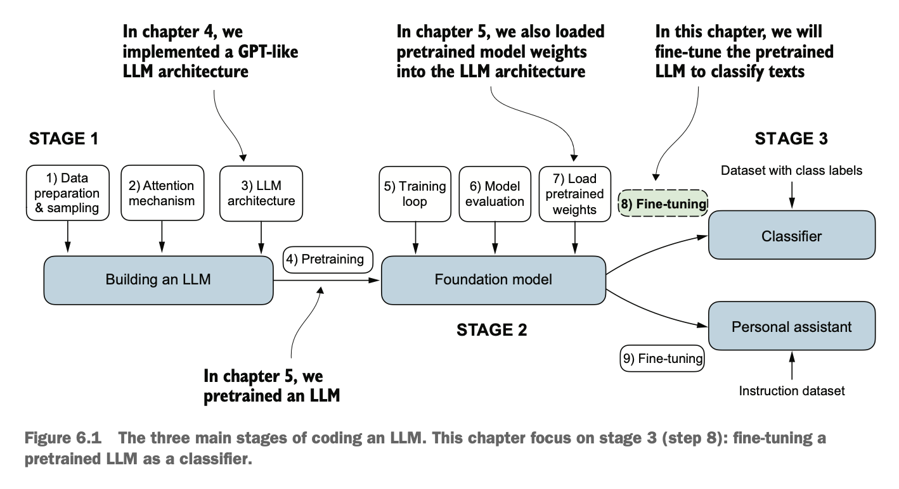

그림 6.1 LLM 코딩의 세 가지 주요 단계. 이 장에서는 3단계(8단계)인 사전 훈련된 LLM을 분류기로 미세조정하는 데 중점을 둡니다.

## 6.1 다양한 미세조정 범주

언어 모델을 미세조정하는 가장 일반적인 방법은 지시 미세조정(instruction fine-tuning)과 분류 미세조정(classification fine-tuning)입니다. 지시 미세조정은 그림 6.2에 설명된 대로 자연어 프롬프트에 설명된 작업을 이해하고 실행하는 능력을 향상시키기 위해 특정 지시를 사용하여 일련의 작업에 대해 언어 모델을 훈련시키는 것을 포함합니다.

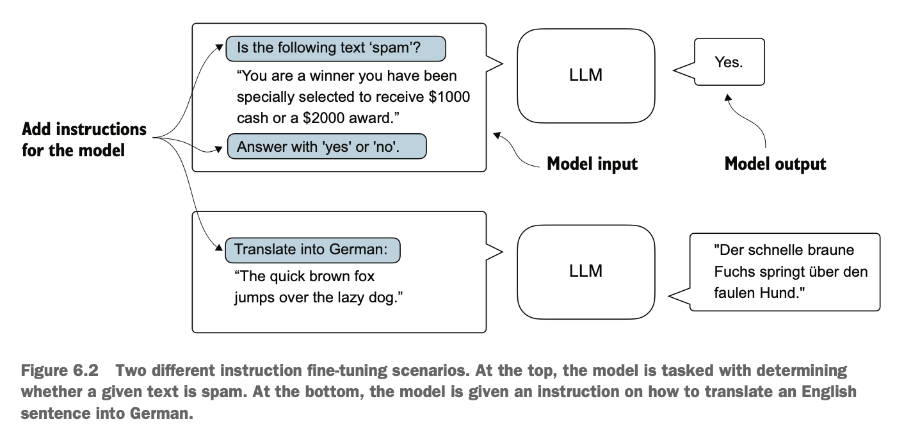

그림 6.2 두 가지 다른 지시 미세조정 시나리오. 위쪽에서는 모델이 주어진 텍스트가 스팸인지 확인하는 작업을 수행합니다. 아래쪽에서는 모델에 영어 문장을 독일어로 번역하는 방법에 대한 지시가 주어집니다.

기계 학습 배경 지식이 있다면 이미 익숙할 수 있는 개념인 분류 미세조정에서는 모델이 "스팸" 및 "스팸 아님"과 같은 특정 클래스 레이블 집합을 인식하도록 훈련됩니다. 분류 작업의 예는 LLM 및 이메일 필터링을 넘어 확장됩니다. 여기에는 이미지에서 다양한 식물 종 식별, 뉴스 기사를 스포츠, 정치, 기술과 같은 주제로 분류, 의료 영상에서 양성 및 악성 종양 구별 등이 포함됩니다.

핵심은 분류 미세조정된 모델은 훈련 중에 마주친 클래스를 예측하는 것으로 제한된다는 것입니다. 예를 들어, 그림 6.3에 설명된 대로 무언가가 "스팸"인지 "스팸 아님"인지를 결정할 수는 있지만 입력 텍스트에 대해 다른 어떤 것도 말할 수 없습니다.

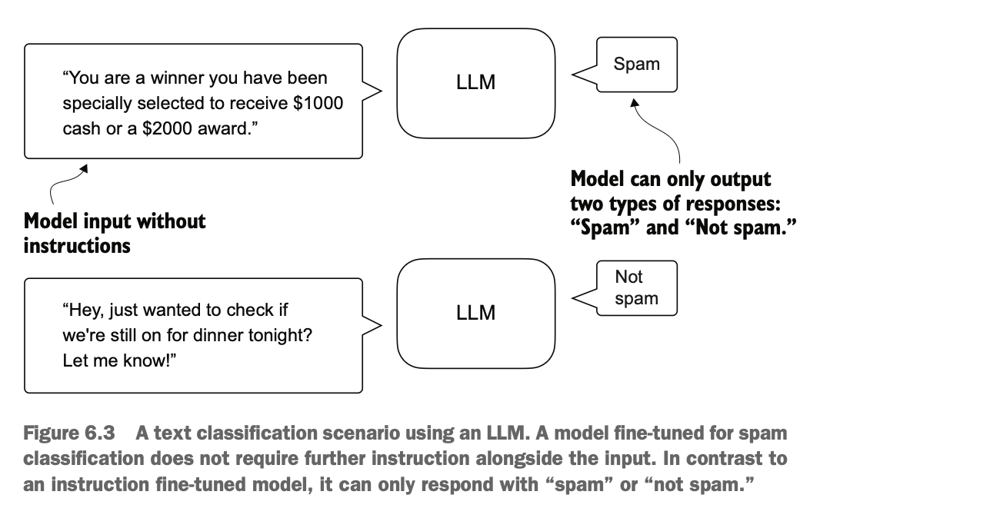

그림 6.3 LLM을 사용한 텍스트 분류 시나리오. 스팸 분류를 위해 미세조정된 모델은 입력과 함께 추가 지시가 필요하지 않습니다. 지시 미세조정된 모델과 달리 "스팸" 또는 "스팸 아님"으로만 응답할 수 있습니다.

그림 6.3에 묘사된 분류 미세조정된 모델과 달리, 지시 미세조정된 모델은 일반적으로 더 광범위한 작업을 수행할 수 있습니다. 분류 미세조정된 모델을 고도로 전문화된 것으로 볼 수 있으며, 일반적으로 다양한 작업에서 잘 작동하는 제너럴리스트 모델을 개발하는 것보다 전문화된 모델을 개발하는 것이 더 쉽습니다.

> **올바른 접근 방식 선택**
> 
> 지시 미세조정은 특정 사용자 지시에 따라 응답을 이해하고 생성하는 모델의 능력을 향상시킵니다. 지시 미세조정은 복잡한 사용자 지시에 따라 다양한 작업을 처리해야 하는 모델에 가장 적합하며 유연성과 상호 작용 품질을 향상시킵니다. 분류 미세조정은 감성 분석이나 스팸 탐지와 같이 데이터를 미리 정의된 클래스로 정밀하게 분류해야 하는 프로젝트에 이상적입니다.
> 
> 지시 미세조정은 더 다재다능하지만 다양한 작업에 능숙한 모델을 개발하려면 더 큰 데이터셋과 더 많은 계산 리소스가 필요합니다. 반면, 분류 미세조정은 데이터와 계산 능력이 덜 필요하지만 그 사용은 모델이 훈련된 특정 클래스에 국한됩니다.

## 6.2 데이터셋 준비

이전에 구현하고 사전 훈련한 GPT 모델을 수정하고 분류 미세조정할 것입니다. 그림 6.4에서 강조 표시된 대로 데이터셋을 다운로드하고 준비하는 것으로 시작합니다. 분류 미세조정의 직관적이고 유용한 예를 제공하기 위해 스팸 및 비스팸 메시지로 구성된 문자 메시지 데이터셋으로 작업할 것입니다.

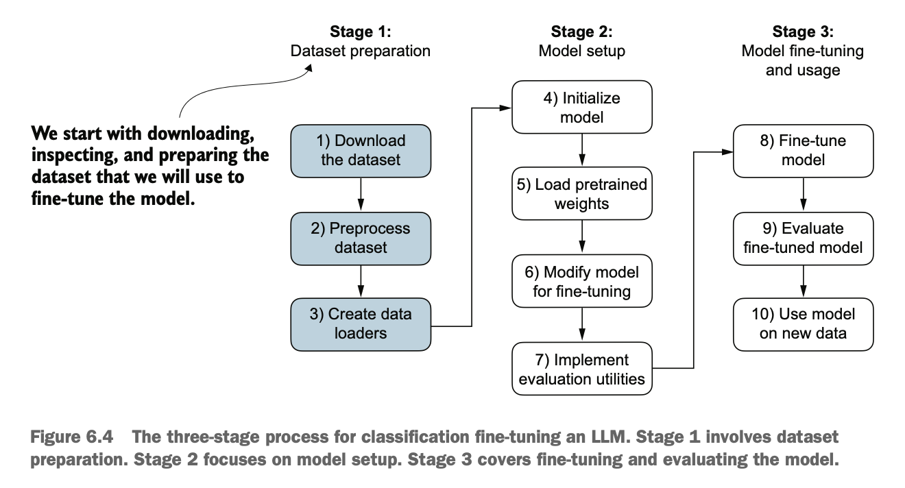

그림 6.4 LLM 분류 미세조정을 위한 3단계 프로세스. 1단계는 데이터셋 준비를 포함합니다. 2단계는 모델 설정에 중점을 둡니다. 3단계는 모델 미세조정 및 평가를 다룹니다.

> **참고** 문자 메시지는 일반적으로 이메일이 아닌 전화를 통해 전송됩니다. 그러나 동일한 단계가 이메일 분류에도 적용되며, 관심 있는 독자는 부록 B에서 이메일 스팸 분류 데이터셋에 대한 링크를 찾을 수 있습니다.

첫 번째 단계는 데이터셋을 다운로드하는 것입니다.

**리스팅 6.1 데이터셋 다운로드 및 압축 해제**

```python
import urllib.request
import zipfile
import os
from pathlib import Path

url = "https://archive.ics.uci.edu/static/public/228/sms+spam+collection.zip"
zip_path = "sms_spam_collection.zip"
extracted_path = "sms_spam_collection"
data_file_path = Path(extracted_path) / "SMSSpamCollection.tsv"


def download_and_unzip_spam_data(url, zip_path, extracted_path, data_file_path):
    if data_file_path.exists():
        print(f"{data_file_path}가 이미 존재합니다. 다운로드 및 압축 해제를 건너뜁니다.")
        return

    # 파일 다운로드
    with urllib.request.urlopen(url) as response:
        with open(zip_path, "wb") as out_file:
            out_file.write(response.read())

    # 파일 압축 해제
    with zipfile.ZipFile(zip_path, "r") as zip_ref:
        zip_ref.extractall(extracted_path)

    original_file_path = Path(extracted_path) / "SMSSpamCollection"
    os.rename(original_file_path, data_file_path) # .tsv 파일 확장자 추가
    print(f"파일이 다운로드되어 {data_file_path}로 저장되었습니다.")

download_and_unzip_spam_data(url, zip_path, extracted_path, data_file_path)
```

앞의 코드를 실행하면 데이터셋이 `sms_spam_collection` 폴더에 탭으로 구분된 텍스트 파일인 `SMSSpamCollection.tsv`로 저장됩니다. 다음과 같이 pandas DataFrame으로 로드할 수 있습니다.

```python
import pandas as pd
df = pd.read_csv(
    data_file_path, sep="\t", header=None, names=["Label", "Text"]
)
df  # Jupyter 노트북에서 데이터 프레임을 렌더링합니다. 또는 print(df)를 사용하세요.
```

그림 6.5는 스팸 데이터셋의 결과 데이터 프레임을 보여줍니다.

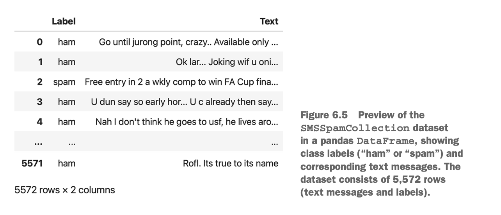

그림 6.5 pandas DataFrame의 SMSSpamCollection 데이터셋 미리보기. 클래스 레이블("ham" 또는 "spam")과 해당 문자 메시지를 보여줍니다. 데이터셋은 5,572개의 행(문자 메시지 및 레이블)으로 구성됩니다.

클래스 레이블 분포를 살펴보겠습니다.
```python
print(df["Label"].value_counts())
```

이전 코드를 실행하면 데이터에 "spam"보다 "ham"(즉, 스팸 아님)이 훨씬 더 많이 포함되어 있음을 알 수 있습니다.

```
Label
ham     4825
spam     747
Name: count, dtype: int64
```

단순화를 위해, 그리고 더 작은 데이터셋을 선호하기 때문에(LLM의 미세조정을 더 빠르게 할 수 있으므로), 각 클래스에서 747개의 인스턴스를 포함하도록 데이터셋을 언더샘플링하기로 선택합니다.

> **참고** 클래스 불균형을 처리하는 다른 여러 방법이 있지만, 이 책의 범위를 벗어납니다. 불균형 데이터를 다루는 방법을 탐색하는 데 관심이 있는 독자는 부록 B에서 추가 정보를 찾을 수 있습니다.

다음 리스팅의 코드를 사용하여 언더샘플링하고 균형 잡힌 데이터셋을 만들 수 있습니다.

**리스팅 6.2 균형 잡힌 데이터셋 생성**

```python
def create_balanced_dataset(df):
    # "spam" 인스턴스 수 계산
    num_spam = df[df["Label"] == "spam"].shape[0]
    # "spam" 인스턴스 수와 일치하도록 "ham" 인스턴스를 무작위로 샘플링
    ham_subset = df[df["Label"] == "ham"].sample(num_spam, random_state=123)
    # ham 서브셋과 "spam" 결합
    balanced_df = pd.concat([ham_subset, df[df["Label"] == "spam"]])
    return balanced_df

balanced_df = create_balanced_dataset(df)
print(balanced_df["Label"].value_counts())
```

이전 코드를 실행하여 데이터셋의 균형을 맞춘 후, 이제 스팸 및 비스팸 메시지의 양이 동일하다는 것을 알 수 있습니다.

```
Label
ham     747
spam    747
Name: count, dtype: int64
```

다음으로, "string" 클래스 레이블 "ham"과 "spam"을 각각 정수 클래스 레이블 0과 1로 변환합니다.

```python
balanced_df["Label"] = balanced_df["Label"].map({"ham": 0, "spam": 1})
```
이 과정은 텍스트를 토큰 ID로 변환하는 것과 유사합니다. 그러나 50,000개 이상의 단어로 구성된 GPT 어휘를 사용하는 대신, 우리는 단 두 개의 토큰 ID인 0과 1만 다룹니다.

다음으로, 데이터셋을 훈련용 70%, 검증용 10%, 테스트용 20%의 세 부분으로 나누기 위해 `random_split` 함수를 만듭니다. (이 비율은 기계 학습에서 모델을 훈련, 조정 및 평가하는 데 일반적입니다.)

**리스팅 6.3 데이터셋 분할**

```python
def random_split(df, train_frac, validation_frac):
    # 전체 DataFrame 셔플
    df = df.sample(frac=1, random_state=123).reset_index(drop=True)
    # 분할 인덱스 계산
    train_end = int(len(df) * train_frac)
    validation_end = train_end + int(len(df) * validation_frac)
    # DataFrame 분할
    train_df = df[:train_end]
    validation_df = df[train_end:validation_end]
    test_df = df[validation_end:]
    return train_df, validation_df, test_df

# 테스트 크기는 나머지인 0.2로 암시됨
train_df, validation_df, test_df = random_split(balanced_df, 0.7, 0.1)
```

나중에 재사용할 수 있도록 데이터셋을 CSV(쉼표로 구분된 값) 파일로 저장해 보겠습니다.

```python
train_df.to_csv("train.csv", index=None)
validation_df.to_csv("validation.csv", index=None)
test_df.to_csv("test.csv", index=None)
```

지금까지 데이터셋을 다운로드하고, 균형을 맞추고, 훈련 및 평가 하위 집합으로 분할했습니다. 이제 모델을 훈련하는 데 사용할 PyTorch 데이터 로더를 설정할 것입니다.

## 6.3 데이터 로더 생성

우리는 텍스트 데이터로 작업하면서 구현했던 것과 개념적으로 유사한 PyTorch 데이터 로더를 개발할 것입니다. 이전에는 슬라이딩 윈도우 기술을 사용하여 균일한 크기의 텍스트 청크를 생성한 다음, 보다 효율적인 모델 훈련을 위해 배치로 그룹화했습니다. 각 청크는 개별 훈련 인스턴스로 기능했습니다. 그러나 이제 우리는 다양한 길이의 문자 메시지가 포함된 스팸 데이터셋으로 작업하고 있습니다. 이러한 메시지를 텍스트 청크처럼 배치하려면 두 가지 기본 옵션이 있습니다.

- 데이터셋 또는 배치의 가장 짧은 메시지 길이로 모든 메시지를 자릅니다.
- 데이터셋 또는 배치의 가장 긴 메시지 길이로 모든 메시지를 채웁니다(패딩).

첫 번째 옵션은 계산적으로 저렴하지만, 짧은 메시지가 평균 또는 가장 긴 메시지보다 훨씬 작으면 상당한 정보 손실이 발생할 수 있으며, 잠재적으로 모델 성능을 저하시킬 수 있습니다. 따라서 우리는 모든 메시지의 전체 내용을 보존하는 두 번째 옵션을 선택합니다.

데이터셋에서 가장 긴 메시지의 길이에 모든 메시지를 채우는 배치를 구현하기 위해, 모든 짧은 메시지에 패딩 토큰을 추가합니다. 이를 위해 "<|endoftext|>"를 패딩 토큰으로 사용합니다.

그러나 각 문자 메시지에 문자열 "<|endoftext|>"를 직접 추가하는 대신, 그림 6.6에 설명된 대로 인코딩된 문자 메시지에 "<|endoftext|>"에 해당하는 토큰 ID를 추가할 수 있습니다. 50256은 패딩 토큰 "<|endoftext|>"의 토큰 ID입니다. 이전에 사용했던 tiktoken 패키지의 GPT-2 토크나이저를 사용하여 "<|endoftext|>"를 인코딩하여 토큰 ID가 올바른지 다시 확인할 수 있습니다.

```python
import tiktoken
tokenizer = tiktoken.get_encoding("gpt2")
print(tokenizer.encode("<|endoftext|>", allowed_special={"<|endoftext|>"}))
```

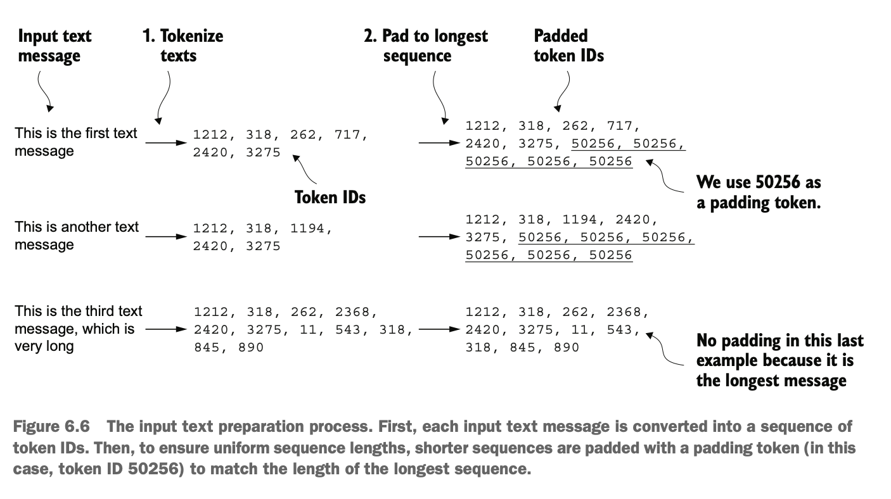

그림 6.6 입력 텍스트 준비 과정. 먼저, 각 입력 문자 메시지는 토큰 ID 시퀀스로 변환됩니다. 그런 다음, 균일한 시퀀스 길이를 보장하기 위해 짧은 시퀀스는 가장 긴 시퀀스의 길이에 맞게 패딩 토큰(이 경우 토큰 ID 50256)으로 채워집니다.

실제로 앞의 코드를 실행하면 `[50256]`이 반환됩니다.
데이터 로더를 인스턴스화하기 전에 데이터가 로드되고 처리되는 방식을 지정하는 PyTorch `Dataset`을 먼저 구현해야 합니다. 이를 위해 그림 6.6의 개념을 구현하는 `SpamDataset` 클래스를 정의합니다. 이 `SpamDataset` 클래스는 훈련 데이터셋에서 가장 긴 시퀀스를 식별하고, 문자 메시지를 인코딩하며, 다른 모든 시퀀스가 가장 긴 시퀀스의 길이에 맞게 패딩 토큰으로 채워지도록 보장하는 몇 가지 주요 작업을 처리합니다.

**리스팅 6.4 PyTorch Dataset 클래스 설정**

```python
import torch
from torch.utils.data import Dataset


class SpamDataset(Dataset):
    def __init__(self, csv_file, tokenizer, max_length=None, pad_token_id=50256):
        # 텍스트 미리 토큰화
        self.data = pd.read_csv(csv_file)
        self.encoded_texts = [
            tokenizer.encode(text) for text in self.data["Text"]
        ]

        if max_length is None:
            self.max_length = self._longest_encoded_length()
        else:
            self.max_length = max_length
            # 시퀀스가 max_length보다 길면 자름
            self.encoded_texts = [
                encoded_text[:self.max_length]
                for encoded_text in self.encoded_texts
            ]

        # 시퀀스를 가장 긴 시퀀스에 맞게 패딩
        self.encoded_texts = [
            encoded_text + [pad_token_id] * (self.max_length - len(encoded_text))
            for encoded_text in self.encoded_texts
        ]

    def __getitem__(self, index):
        encoded = self.encoded_texts[index]
        label = self.data.iloc[index]["Label"]
        return (
            torch.tensor(encoded, dtype=torch.long),
            torch.tensor(label, dtype=torch.long),
        )

    def __len__(self):
        return len(self.data)

    def _longest_encoded_length(self):
        max_length = 0
        for encoded_text in self.encoded_texts:
            encoded_length = len(encoded_text)
            if encoded_length > max_length:
                max_length = encoded_length
        return max_length
```

`SpamDataset` 클래스는 이전에 만든 CSV 파일에서 데이터를 로드하고, `tiktoken`의 GPT-2 토크나이저를 사용하여 텍스트를 토큰화하며, 가장 긴 시퀀스 또는 미리 정의된 최대 길이에 의해 결정되는 균일한 길이로 시퀀스를 채우거나 자를 수 있게 해줍니다. 이렇게 하면 각 입력 텐서가 동일한 크기가 되어 다음에 구현할 훈련 데이터 로더에서 배치를 만드는 데 필요합니다.

```python
train_dataset = SpamDataset(
    csv_file="train.csv",
    max_length=None,
    tokenizer=tokenizer
)
```

가장 긴 시퀀스 길이는 데이터셋의 `max_length` 속성에 저장됩니다. 가장 긴 시퀀스의 토큰 수가 궁금하다면 다음 코드를 사용할 수 있습니다.
```python
print(train_dataset.max_length)
```
코드는 `120`을 출력하며, 가장 긴 시퀀스가 120개 이하의 토큰을 포함함을 보여줍니다. 이는 문자 메시지의 일반적인 길이입니다. 모델은 컨텍스트 길이 제한이 주어지면 최대 1,024개의 토큰 시퀀스를 처리할 수 있습니다. 데이터셋에 더 긴 텍스트가 포함된 경우, 데이터가 모델의 지원되는 입력(컨텍스트) 길이를 초과하지 않도록 이전 코드에서 훈련 데이터셋을 만들 때 `max_length=1024`를 전달할 수 있습니다.

다음으로, 가장 긴 훈련 시퀀스의 길이에 맞게 검증 및 테스트 세트를 채웁니다. 중요하게도, 가장 긴 훈련 예제의 길이를 초과하는 모든 검증 및 테스트 세트 샘플은 이전에 정의한 `SpamDataset` 코드의 `encoded_text[:self.max_length]`를 사용하여 잘립니다. 이 잘림은 선택 사항입니다. 이러한 세트에 1,024개 토큰을 초과하는 시퀀스가 없는 경우 검증 및 테스트 세트 모두에 대해 `max_length=None`을 설정할 수 있습니다.

```python
val_dataset = SpamDataset(
    csv_file="validation.csv",
    max_length=train_dataset.max_length,
    tokenizer=tokenizer
)
test_dataset = SpamDataset(
    csv_file="test.csv",
    max_length=train_dataset.max_length,
    tokenizer=tokenizer
)
```

> **연습 6.1 컨텍스트 길이 늘리기**
> 
> 입력을 모델이 지원하는 최대 토큰 수로 채우고 예측 성능에 어떤 영향을 미치는지 관찰하세요.

데이터셋을 입력으로 사용하여 텍스트 데이터로 작업할 때와 유사하게 데이터 로더를 인스턴스화할 수 있습니다. 그러나 이 경우 대상은 텍스트의 다음 토큰이 아닌 클래스 레이블을 나타냅니다. 예를 들어, 배치 크기를 8로 선택하면 각 배치는 길이 120의 8개 훈련 예제와 각 예제의 해당 클래스 레이블로 구성됩니다(그림 6.7 참조).

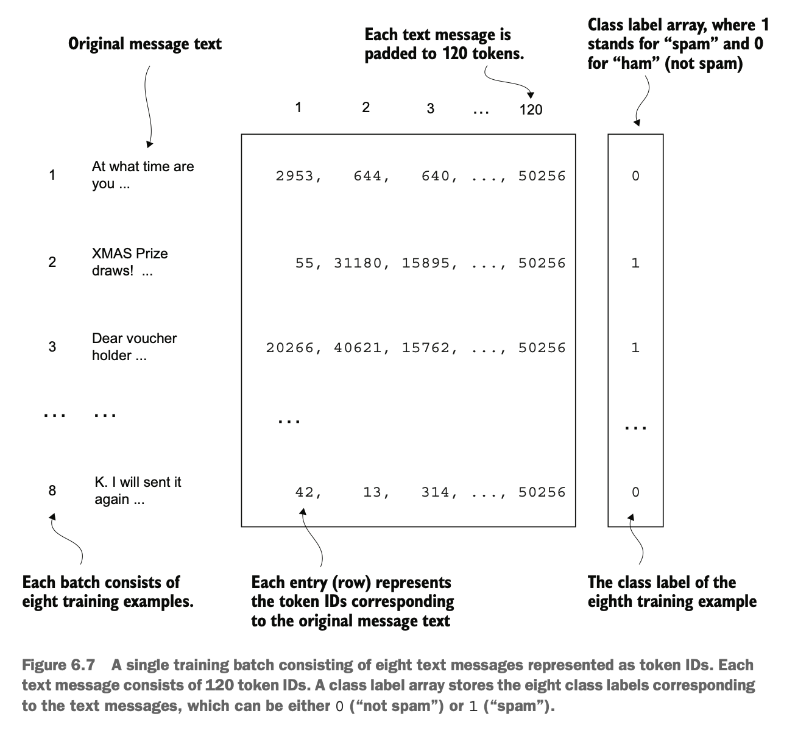

그림 6.7 토큰 ID로 표현된 8개의 문자 메시지로 구성된 단일 훈련 배치. 각 문자 메시지는 120개의 토큰 ID로 구성됩니다. 클래스 레이블 배열은 문자 메시지에 해당하는 8개의 클래스 레이블을 저장하며, 이는 0("스팸 아님") 또는 1("스팸")일 수 있습니다.

다음 리스팅의 코드는 크기 8의 배치로 문자 메시지와 레이블을 로드하는 훈련, 검증 및 테스트 세트 데이터 로더를 만듭니다.

**리스팅 6.5 PyTorch 데이터 로더 생성**

```python
from torch.utils.data import DataLoader

num_workers = 0 # 이 설정은 대부분의 컴퓨터와의 호환성을 보장합니다.
batch_size = 8

torch.manual_seed(123)

train_loader = DataLoader(
    dataset=train_dataset,
    batch_size=batch_size,
    shuffle=True,
    num_workers=num_workers,
    drop_last=True,
)

val_loader = DataLoader(
    dataset=val_dataset,
    batch_size=batch_size,
    num_workers=num_workers,
    drop_last=False,
)

test_loader = DataLoader(
    dataset=test_dataset,
    batch_size=batch_size,
    num_workers=num_workers,
    drop_last=False,
)
```

데이터 로더가 작동하고 예상 크기의 배치를 실제로 반환하는지 확인하기 위해 훈련 로더를 반복한 다음 마지막 배치의 텐서 차원을 인쇄합니다.

```python
for input_batch, target_batch in train_loader:
    pass
print("입력 배치 차원:", input_batch.shape)
print("레이블 배치 차원:", target_batch.shape)
```

출력은 다음과 같습니다.

```python
입력 배치 차원: torch.Size([8, 120])
레이블 배치 차원: torch.Size([8])
```

보시다시피, 입력 배치는 예상대로 각각 120개의 토큰을 가진 8개의 훈련 예제로 구성됩니다. 레이블 텐서는 8개의 훈련 예제에 해당하는 클래스 레이블을 저장합니다.

마지막으로, 데이터셋 크기에 대한 아이디어를 얻기 위해 각 데이터셋의 총 배치 수를 인쇄해 보겠습니다.

```python
print(f"{len(train_loader)}개의 훈련 배치")
print(f"{len(val_loader)}개의 검증 배치")
print(f"{len(test_loader)}개의 테스트 배치")
```

각 데이터셋의 배치 수는 다음과 같습니다.

```
130개의 훈련 배치
19개의 검증 배치
38개의 테스트 배치
```

이제 데이터를 준비했으므로 미세조정을 위해 모델을 준비해야 합니다.

## 6.4 사전 훈련된 가중치로 모델 초기화

스팸 메시지를 식별하기 위해 분류 미세조정을 위해 모델을 준비해야 합니다. 그림 6.8에서 강조 표시된 대로 사전 훈련된 모델을 초기화하는 것으로 시작합니다.


그림 6.8 LLM 분류 미세조정을 위한 3단계 프로세스. 1단계인 데이터셋 준비를 완료했으므로, 이제 스팸 메시지를 분류하기 위해 미세조정할 LLM을 초기화해야 합니다.

모델 준비 프로세스를 시작하기 위해 레이블이 없는 데이터를 사전 훈련하는 데 사용했던 것과 동일한 구성을 사용합니다.

```python
CHOOSE_MODEL = "gpt2-small (124M)"
INPUT_PROMPT = "Every effort moves"
```

```python
BASE_CONFIG = {
    "vocab_size": 50257,
    "context_length": 1024,
    "drop_rate": 0.0,
    "qkv_bias": True,
}
model_configs = {
    "gpt2-small (124M)": {"emb_dim": 768, "n_layers": 12, "n_heads": 12},
    "gpt2-medium (355M)": {"emb_dim": 1024, "n_layers": 24, "n_heads": 16},
    "gpt2-large (774M)": {"emb_dim": 1280, "n_layers": 36, "n_heads": 20},
    "gpt2-xl (1558M)": {"emb_dim": 1600, "n_layers": 48, "n_heads": 25},
}
BASE_CONFIG.update(model_configs[CHOOSE_MODEL])
```

다음으로, `gpt_download.py` 파일에서 `download_and_load_gpt2` 함수를 가져오고 사전 훈련(5장 참조)의 `GPTModel` 클래스와 `load_weights_into_gpt` 함수를 재사용하여 다운로드한 가중치를 GPT 모델에 로드합니다.

**리스팅 6.6 사전 훈련된 GPT 모델 로드**

```python
from gpt_download import download_and_load_gpt2
from chapter05 import GPTModel, load_weights_into_gpt

model_size = CHOOSE_MODEL.split(" ")[-1].lstrip("(").rstrip(")")
settings, params = download_and_load_gpt2(
    model_size=model_size, models_dir="gpt2"
)

model = GPTModel(BASE_CONFIG)
load_weights_into_gpt(model, params)
model.eval()
```

모델 가중치를 `GPTModel`에 로드한 후, 4장과 5장의 텍스트 생성 유틸리티 함수를 재사용하여 모델이 일관된 텍스트를 생성하는지 확인합니다.

```python
from chapter04 import generate_text_simple
from chapter05 import text_to_token_ids, token_ids_to_text
text_1 = "Every effort moves you"
token_ids = generate_text_simple(
    model=model,
    idx=text_to_token_ids(text_1, tokenizer),
    max_new_tokens=15,
    context_size=BASE_CONFIG["context_length"]
)
print(token_ids_to_text(token_ids, tokenizer))
```

다음 출력은 모델이 일관된 텍스트를 생성함을 보여주며, 이는 모델 가중치가 올바르게 로드되었음을 나타냅니다.

```
Every effort moves you forward.
The first step is to understand the importance of your work
```

모델을 스팸 분류기로 미세조정하기 전에, 지시를 사용하여 프롬프트를 통해 모델이 이미 스팸 메시지를 분류하는지 확인해 보겠습니다.

```python
text_2 = (
    "Is the following text 'spam'? Answer with 'yes' or 'no':"
    " 'You are a winner you have been specially"
    " selected to receive $1000 cash or a $2000 award.'"
)
token_ids = generate_text_simple(
    model=model,
    idx=text_to_token_ids(text_2, tokenizer),
    max_new_tokens=23,
    context_size=BASE_CONFIG["context_length"]
)
print(token_ids_to_text(token_ids, tokenizer))
```

모델 출력은 다음과 같습니다.

```python
Is the following text 'spam'? Answer with 'yes' or 'no': 'You are a winner
you have been specially selected to receive $1000 cash
or a $2000 award.'
The following text 'spam'? Answer with 'yes' or 'no': 'You are a winner
```

출력을 바탕으로 모델이 지시를 따르는 데 어려움을 겪고 있음이 분명합니다. 이 결과는 사전 훈련만 거쳤고 지시 미세조정이 부족하기 때문에 예상된 결과입니다. 이제 분류 미세조정을 위해 모델을 준비해 보겠습니다.

## 6.5 분류 헤드 추가

분류 미세조정을 준비하기 위해 사전 훈련된 LLM을 수정해야 합니다. 이를 위해 그림 6.9와 같이 원래 출력 레이어(숨겨진 표현을 50,257개의 어휘로 매핑)를 0("스팸 아님")과 1("스팸")의 두 클래스로 매핑하는 더 작은 출력 레이어로 교체합니다. 출력 레이어를 교체하는 것을 제외하고는 이전과 동일한 모델을 사용합니다.

> **출력 레이어 노드**
> 
> 이진 분류 작업을 다루고 있으므로 기술적으로 단일 출력 노드를 사용할 수 있습니다. 그러나 "Losses Learned-Optimizing Negative Log-Likelihood and Cross-Entropy in PyTorch"(https://mng.bz/NRZ2)에서 논의한 것처럼 손실 함수를 수정해야 합니다. 따라서 출력 노드 수가 클래스 수와 일치하는 보다 일반적인 접근 방식을 선택합니다. 예를 들어, 뉴스 기사를 "기술", "스포츠" 또는 "정치"로 분류하는 것과 같은 3개 클래스 문제의 경우 3개의 출력 노드를 사용합니다.

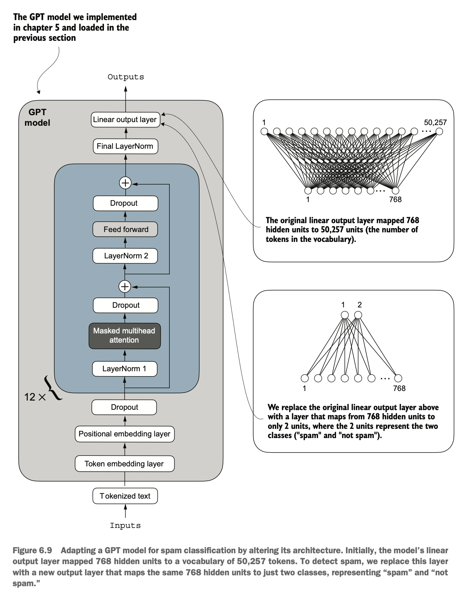

그림 6.9 아키텍처를 변경하여 스팸 분류를 위한 GPT 모델 조정. 처음에 모델의 선형 출력 레이어는 768개의 숨겨진 단위를 50,257개 토큰의 어휘에 매핑했습니다. 스팸을 탐지하기 위해 이 레이어를 동일한 768개의 숨겨진 단위를 "스팸"과 "스팸 아님"을 나타내는 단 두 개의 클래스에 매핑하는 새로운 출력 레이어로 교체합니다.

그림 6.9에 표시된 수정을 시도하기 전에 `print(model)`을 통해 모델 아키텍처를 인쇄해 보겠습니다.

```
GPTModel(
    (tok_emb): Embedding(50257, 768)
    (pos_emb): Embedding(1024, 768)
    (drop_emb): Dropout(p=0.0, inplace=False)
    (trf_blocks): Sequential(
    (11): TransformerBlock(
        (att): MultiHeadAttention(
            (W_query): Linear(in_features=768, out_features=768, bias=True)
            (W_key): Linear(in_features=768, out_features=768, bias=True)
            (W_value): Linear(in_features=768, out_features=768, bias=True)
            (out_proj): Linear(in_features=768, out_features=768, bias=True)
            (dropout): Dropout(p=0.0, inplace=False)
        )
        (ff): FeedForward(
            (layers): Sequential(
                (0): Linear(in_features=768, out_features=3072, bias=True)
                (1): GELU()
                (2): Linear(in_features=3072, out_features=768, bias=True)
            )
        )
        (norm1): LayerNorm()
        (norm2): LayerNorm()
        (drop_resid): Dropout(p=0.0, inplace=False)
    )
    )
    (final_norm): LayerNorm()
    (out_head): Linear(in_features=768, out_features=50257, bias=False)
)
```

이 출력은 4장에서 설명한 아키텍처를 깔끔하게 보여줍니다. 이전에 논의한 바와 같이, `GPTModel`은 임베딩 레이어 다음에 12개의 동일한 트랜스포머 블록(간결성을 위해 마지막 블록만 표시됨), 최종 `LayerNorm` 및 출력 레이어 `out_head`로 구성됩니다.

다음으로, `out_head`를 미세조정할 새로운 출력 레이어(그림 6.9 참조)로 교체합니다.

> **선택된 레이어 미세조정 vs. 모든 레이어 미세조정**
> 
> 사전 훈련된 모델로 시작하기 때문에 모든 모델 레이어를 미세조정할 필요는 없습니다. 신경망 기반 언어 모델에서 하위 레이어는 일반적으로 광범위한 작업 및 데이터셋에 적용 가능한 기본 언어 구조와 의미를 포착합니다. 따라서 미묘한 언어 패턴 및 작업별 기능에 더 특화된 마지막 레이어(즉, 출력에 가까운 레이어)만 미세조정하는 것으로도 모델을 새로운 작업에 적용하기에 충분한 경우가 많습니다. 좋은 부작용은 소수의 레이어만 미세조정하는 것이 계산적으로 더 효율적이라는 것입니다. 관심 있는 독자는 부록 B에서 미세조정할 레이어에 대한 실험을 포함한 더 많은 정보를 찾을 수 있습니다.

분류 미세조정을 위해 모델을 준비하려면 먼저 모델을 동결합니다. 즉, 모든 레이어를 훈련 불가능하게 만듭니다.

```python
for param in model.parameters():
    param.requires_grad = False
```

그런 다음, 원래 레이어 입력을 어휘 크기인 50,257 차원으로 매핑하는 출력 레이어(`model.out_head`)를 교체합니다(그림 6.9 참조).

**리스팅 6.7 분류 레이어 추가**

```python
torch.manual_seed(123)
num_classes = 2
model.out_head = torch.nn.Linear(
    in_features=BASE_CONFIG["emb_dim"],
    out_features=num_classes
)
```

코드를 더 일반적으로 유지하기 위해 "gpt2-small (124M)" 모델에서 768과 같은 `BASE_CONFIG["emb_dim"]`을 사용합니다. 따라서 더 큰 GPT-2 모델 변형으로 작업하기 위해 동일한 코드를 사용할 수도 있습니다.

이 새로운 `model.out_head` 출력 레이어는 기본적으로 `requires_grad` 속성이 `True`로 설정되어 있으므로 훈련 중에 업데이트될 유일한 레이어입니다. 기술적으로 방금 추가한 출력 레이어를 훈련하는 것으로 충분합니다. 그러나 실험에서 발견했듯이 추가 레이어를 미세조정하면 모델의 예측 성능이 눈에 띄게 향상될 수 있습니다. (자세한 내용은 부록 B를 참조하십시오.) 또한 이 블록을 출력 레이어에 연결하는 마지막 트랜스포머 블록과 최종 `LayerNorm` 모듈을 그림 6.10과 같이 훈련 가능하도록 구성합니다.

최종 `LayerNorm`과 마지막 트랜스포머 블록을 훈련 가능하게 만들려면 각각의 `requires_grad`를 `True`로 설정합니다.

```python
for param in model.trf_blocks[-1].parameters():
    param.requires_grad = True
for param in model.final_norm.parameters():
    param.requires_grad = True
```

> **연습 6.2 전체 모델 미세조정**
> 
> 마지막 트랜스포머 블록만 미세조정하는 대신 전체 모델을 미세조정하고 예측 성능에 미치는 영향을 평가하세요.

새로운 출력 레이어를 추가하고 특정 레이어를 훈련 가능 또는 훈련 불가능으로 표시했지만, 이전에 사용했던 것과 유사하게 이 모델을 계속 사용할 수 있습니다. 예를 들어, 이전에 사용했던 예제 텍스트와 동일한 예제 텍스트를 제공할 수 있습니다.

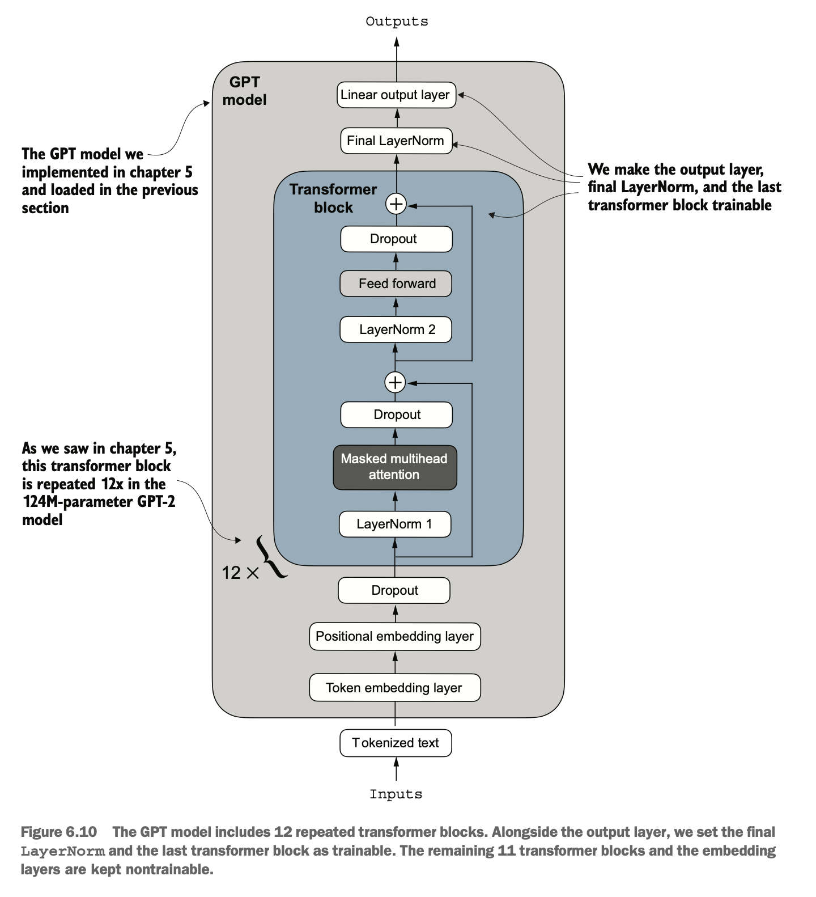

그림 6.10 GPT 모델에는 12개의 반복되는 트랜스포머 블록이 포함됩니다. 출력 레이어와 함께 최종 `LayerNorm`과 마지막 트랜스포머 블록을 훈련 가능하도록 설정합니다. 나머지 11개의 트랜스포머 블록과 임베딩 레이어는 훈련 불가능하게 유지됩니다.

```python
inputs = tokenizer.encode("Do you have time")
inputs = torch.tensor(inputs).unsqueeze(0)
print("입력:", inputs)
print("입력 차원:", inputs.shape) # shape: (batch_size, num_tokens)
```
`print` 출력은 앞의 코드가 입력을 4개의 입력 토큰으로 구성된 텐서로 인코딩함을 보여줍니다.

```python
입력: tensor([[5211, 345, 423, 640]])
입력 차원: torch.Size([1, 4])
```

그런 다음, 인코딩된 토큰 ID를 평소와 같이 모델에 전달할 수 있습니다.

```python
with torch.no_grad():
    outputs = model(inputs)
print("출력:
", outputs)
print("출력 차원:", outputs.shape)
```

출력 텐서는 다음과 같습니다.

```text
출력:
    tensor([[[-1.5854, 0.9904],
        [-3.7235, 7.4548],
        [-2.2661, 6.6049],
        [-3.5983, 3.9902]]])
출력 차원: torch.Size([1, 4, 2])
```

유사한 입력은 이전에 `[1, 4, 50257]`의 출력 텐서를 생성했을 것입니다. 여기서 50257은 어휘 크기를 나타냅니다. 출력 행의 수는 입력 토큰의 수(이 경우 4)에 해당합니다. 그러나 모델의 출력 레이어를 교체했기 때문에 각 출력의 임베딩 차원(열 수)은 이제 50,257 대신 2입니다.

우리는 이 모델을 미세조정하여 모델 입력이 "스팸"인지 "스팸 아님"인지를 나타내는 클래스 레이블을 반환하는 데 관심이 있다는 것을 기억하십시오. 4개의 출력 행을 모두 미세조정할 필요는 없으며, 대신 단일 출력 토큰에 집중할 수 있습니다. 특히, 그림 6.11에 표시된 대로 마지막 출력 토큰에 해당하는 마지막 행에 집중할 것입니다.

출력 텐서에서 마지막 출력 토큰을 추출하려면 다음 코드를 사용합니다.
```python
print("마지막 출력 토큰:", outputs[:, -1, :])
```
이것은 다음을 인쇄합니다.

마지막 출력 토큰: tensor([[-3.5983, 3.9902]])
아직 값을 클래스 레이블 예측으로 변환해야 합니다. 하지만 먼저 왜 마지막 출력 토큰에만 특히 관심이 있는지 이해해 보겠습니다.

우리는 이미 각 입력 토큰과 다른 모든 입력 토큰 간의 관계를 설정하는 어텐션 메커니즘과 GPT와 유사한 모델에서 일반적으로 사용되는 인과적 어텐션 마스크(3장 참조)의 개념을 탐색했습니다. 이 마스크는 토큰의 초점을 현재 위치와 그 이전 위치로 제한하여 각 토큰이 자신과 이전 토큰에 의해서만 영향을 받을 수 있도록 보장합니다(그림 6.12 참조).

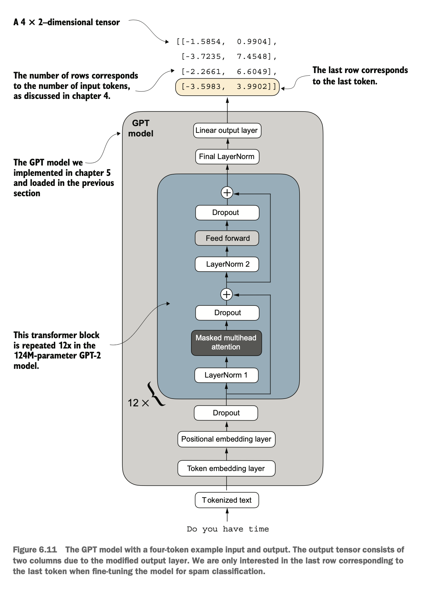

그림 6.11 4개 토큰 예제 입력 및 출력이 있는 GPT 모델. 출력 텐서는 수정된 출력 레이어로 인해 두 개의 열로 구성됩니다. 스팸 분류를 위해 모델을 미세조정할 때 마지막 토큰에 해당하는 마지막 행에만 관심이 있습니다.

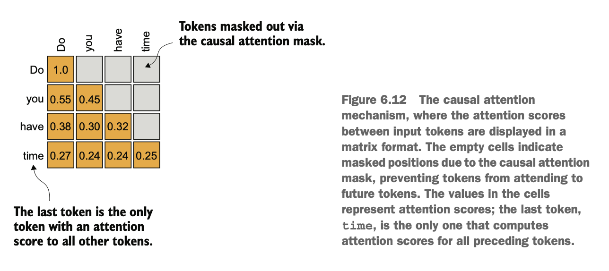

마지막 토큰은 다른 모든 토큰에 대한 어텐션 점수를 가진 유일한 토큰입니다.

인과적 어텐션 마스크를 통해 마스킹된 토큰.

그림 6.12 인과적 어텐션 메커니즘. 입력 토큰 간의 어텐션 점수가 행렬 형식으로 표시됩니다. 빈 셀은 인과적 어텐션 마스크로 인해 마스킹된 위치를 나타내며, 토큰이 미래 토큰에 주의를 기울이는 것을 방지합니다. 셀의 값은 어텐션 점수를 나타냅니다. 마지막 토큰인 `time`은 모든 이전 토큰에 대한 어텐션 점수를 계산하는 유일한 토큰입니다.

그림 6.12의 인과적 어텐션 마스크 설정을 감안할 때, 시퀀스의 마지막 토큰은 모든 이전 토큰의 데이터에 액세스할 수 있는 유일한 토큰이므로 가장 많은 정보를 축적합니다. 따라서 스팸 분류 작업에서는 미세조정 과정에서 이 마지막 토큰에 집중합니다.

이제 마지막 토큰을 클래스 레이블 예측으로 변환하고 모델의 초기 예측 정확도를 계산할 준비가 되었습니다. 이후 스팸 분류 작업을 위해 모델을 미세조정할 것입니다.

> **연습 6.3 첫 번째 토큰 vs. 마지막 토큰 미세조정**
> 
> 첫 번째 출력 토큰을 미세조정해 보세요. 마지막 출력 토큰을 미세조정하는 것과 비교하여 예측 성능의 변화를 확인하세요.

## 6.6 분류 손실 및 정확도 계산

모델을 미세조정하기 전에 남은 작은 작업은 단 하나입니다. 그림 6.13에 설명된 대로 미세조정 중에 사용할 모델 평가 함수를 구현해야 합니다.

평가 유틸리티를 구현하기 전에 모델 출력을 클래스 레이블 예측으로 변환하는 방법을 간략하게 논의해 보겠습니다. 이전에 우리는 소프트맥스 함수를 통해 50,257개의 출력을 확률로 변환한 다음 argmax 함수를 통해 가장 높은 확률의 위치를 반환하여 LLM이 생성한 다음 토큰의 토큰 ID를 계산했습니다. 그림 6.14와 같이 주어진 입력에 대해 모델이 "스팸" 또는 "스팸 아님" 예측을 출력하는지 계산하기 위해 여기서도 동일한 접근 방식을 취합니다. 유일한 차이점은 50,257차원 출력이 아닌 2차원 출력으로 작업한다는 것입니다.

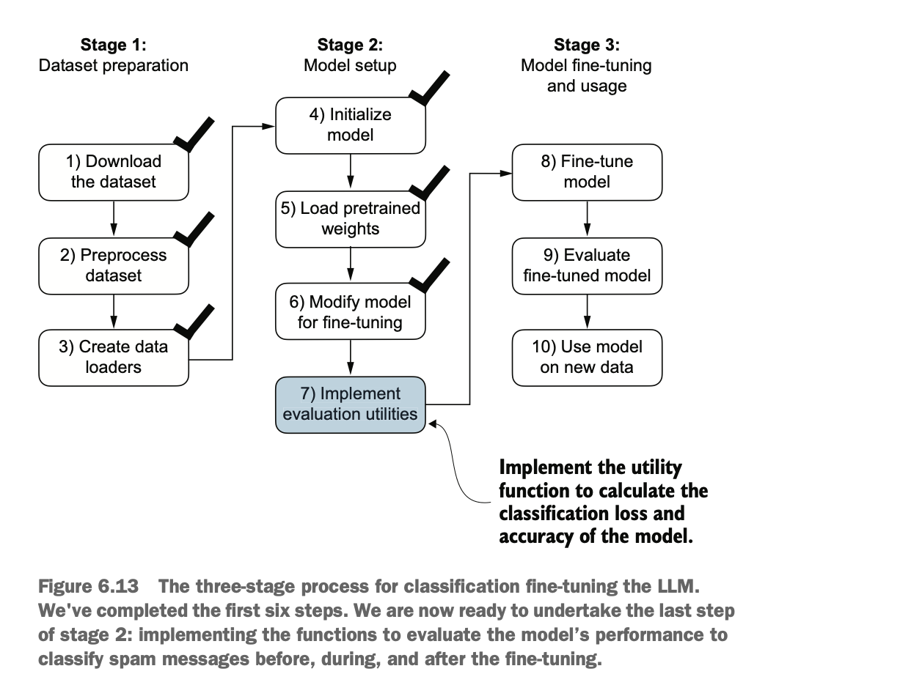

그림 6.13 LLM 분류 미세조정을 위한 3단계 프로세스. 처음 6단계를 완료했습니다. 이제 2단계의 마지막 단계인 미세조정 전, 중, 후에 스팸 메시지를 분류하는 모델의 성능을 평가하는 함수를 구현할 준비가 되었습니다.

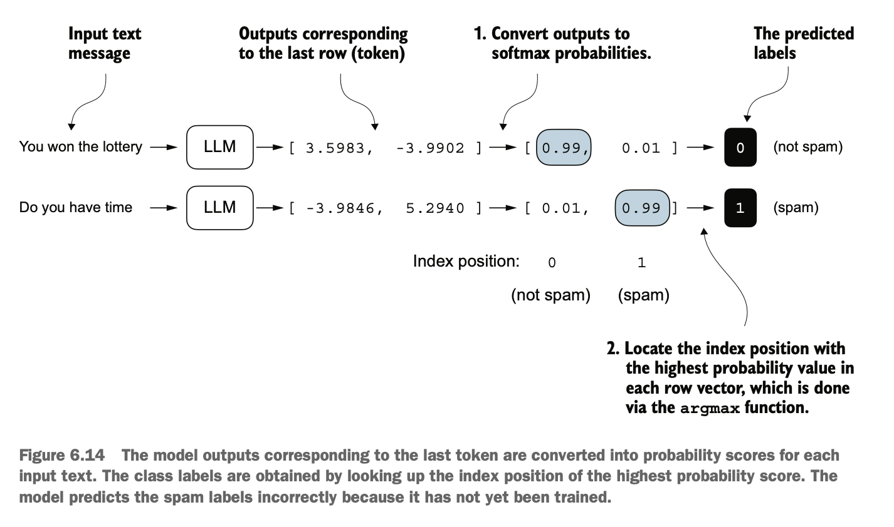

2. argmax 함수를 통해 각 행 벡터에서 가장 높은 확률 값을 가진 인덱스 위치를 찾습니다.

그림 6.14 마지막 토큰에 해당하는 모델 출력은 각 입력 텍스트에 대한 확률 점수로 변환됩니다. 클래스 레이블은 가장 높은 확률 점수의 인덱스 위치를 조회하여 얻습니다. 모델은 아직 훈련되지 않았기 때문에 스팸 레이블을 잘못 예측합니다.

구체적인 예를 사용하여 마지막 토큰 출력을 고려해 보겠습니다.

```python
print("마지막 출력 토큰:", outputs[:, -1, :])
```

마지막 토큰에 해당하는 텐서의 값은 다음과 같습니다.
마지막 출력 토큰: tensor([[-3.5983, 3.9902]])
클래스 레이블을 얻을 수 있습니다.

```python
probas = torch.softmax(outputs[:, -1, :], dim=-1)
label = torch.argmax(probas)
print("클래스 레이블:", label.item())
```

이 경우 코드는 1을 반환하며, 이는 모델이 입력 텍스트가 "스팸"이라고 예측함을 의미합니다. 가장 큰 출력이 가장 높은 확률 점수에 직접 해당하므로 여기서 소프트맥스 함수를 사용하는 것은 선택 사항입니다. 따라서 소프트맥스를 사용하지 않고 코드를 단순화할 수 있습니다.

```python
logits = outputs[:, -1, :]
label = torch.argmax(logits)
print("클래스 레이블:", label.item())
```

이 개념은 데이터셋 전체에서 정확한 예측의 백분율을 측정하는 분류 정확도를 계산하는 데 사용할 수 있습니다.

분류 정확도를 결정하기 위해 데이터셋의 모든 예제에 argmax 기반 예측 코드를 적용하고 `calc_accuracy_loader` 함수를 정의하여 정확한 예측의 비율을 계산합니다.

**리스팅 6.8 분류 정확도 계산**

```python
def calc_accuracy_loader(data_loader, model, device, num_batches=None):
    model.eval() # 모델을 평가 모드로 설정
    correct_predictions, num_examples = 0, 0

    if num_batches is None:
        num_batches = len(data_loader)
    else:
        num_batches = min(num_batches, len(data_loader))

    for i, (input_batch, target_batch) in enumerate(data_loader):
        if i < num_batches:
            input_batch, target_batch = input_batch.to(device), target_batch.to(device)

            with torch.no_grad():
                logits = model(input_batch)[:, -1, :]  # 마지막 출력 토큰의 로짓
            predicted_labels = torch.argmax(logits, dim=-1)

            num_examples += predicted_labels.shape[0]
            correct_predictions += (predicted_labels == target_batch).sum().item()
        else:
            break

    return correct_predictions / num_examples
```

효율성을 위해 10개 배치에서 추정된 다양한 데이터셋에 대한 분류 정확도를 결정하기 위해 함수를 사용해 보겠습니다.

```python
device = torch.device("cuda" if torch.cuda.is_available() else "cpu")
model.to(device)
torch.manual_seed(123)
train_accuracy = calc_accuracy_loader(
    train_loader, model, device, num_batches=10
)
val_accuracy = calc_accuracy_loader(
    val_loader, model, device, num_batches=10
)
test_accuracy = calc_accuracy_loader(
    test_loader, model, device, num_batches=10
)
print(f"훈련 정확도: {train_accuracy*100:.2f}%")
print(f"검증 정확도: {val_accuracy*100:.2f}%")
print(f"테스트 정확도: {test_accuracy*100:.2f}%")
```

`device` 설정을 통해 모델은 Nvidia CUDA 지원이 가능한 GPU가 있으면 자동으로 GPU에서 실행되고 그렇지 않으면 CPU에서 실행됩니다. 출력은 다음과 같습니다.

```
훈련 정확도: 46.25%
검증 정확도: 45.00%
테스트 정확도: 48.75%
```

보시다시피 예측 정확도는 이 경우 50%가 될 무작위 예측에 가깝습니다. 예측 정확도를 향상시키려면 모델을 미세조정해야 합니다.

그러나 모델 미세조정을 시작하기 전에 훈련 중에 최적화할 손실 함수를 정의해야 합니다. 우리의 목표는 모델의 스팸 분류 정확도를 최대화하는 것이며, 이는 앞의 코드가 비스팸의 경우 0, 스팸의 경우 1과 같은 올바른 클래스 레이블을 출력해야 함을 의미합니다.

분류 정확도는 미분 가능한 함수가 아니므로 정확도를 최대화하기 위한 프록시로 교차 엔트로피 손실을 사용합니다. 따라서 `calc_loss_batch` 함수는 모든 토큰 `model(input_batch)`이 아닌 마지막 토큰 `model(input_batch)[:, -1, :]`만 최적화하는 데 집중한다는 한 가지 조정을 제외하고는 동일하게 유지됩니다.

```python
def calc_loss_batch(input_batch, target_batch, model, device):
    input_batch, target_batch = input_batch.to(device), target_batch.to(device)
    logits = model(input_batch)[:, -1, :] # 마지막 출력 토큰의 로짓
    loss = torch.nn.functional.cross_entropy(logits, target_batch)
    return loss
```

이전에 정의한 데이터 로더에서 얻은 단일 배치에 대한 손실을 계산하기 위해 `calc_loss_batch` 함수를 사용합니다. 데이터 로더의 모든 배치에 대한 손실을 계산하기 위해 이전과 같이 `calc_loss_loader` 함수를 정의합니다.

**리스팅 6.9 분류 손실 계산**

```python
def calc_loss_loader(data_loader, model, device, num_batches=None):
    total_loss = 0.
    if len(data_loader) == 0:
        return float("nan")
    elif num_batches is None:
        num_batches = len(data_loader)
    else: # 배치 수가 데이터 로더의 배치를 초과하지 않도록 보장
        num_batches = min(num_batches, len(data_loader))
    for i, (input_batch, target_batch) in enumerate(data_loader):
        if i < num_batches:
            loss = calc_loss_batch(
                input_batch, target_batch, model, device
            )
            total_loss += loss.item()
        else:
            break
    return total_loss / num_batches
```

훈련 정확도를 계산하는 것과 유사하게, 이제 각 데이터 세트에 대한 초기 손실을 계산합니다.

```python
# 아직 훈련하지 않으므로 효율성을 위해 그래디언트 추적 비활성화
with torch.no_grad():
    train_loss = calc_loss_loader(
        train_loader, model, device, num_batches=5
    )
    val_loss = calc_loss_loader(val_loader, model, device, num_batches=5)
    test_loss = calc_loss_loader(test_loader, model, device, num_batches=5)
print(f"훈련 손실: {train_loss:.3f}")
print(f"검증 손실: {val_loss:.3f}")
print(f"테스트 손실: {test_loss:.3f}")
```

초기 손실 값은 다음과 같습니다.

```
훈련 손실: 2.453
검증 손실: 2.583
테스트 손실: 2.322
```

다음으로, 모델을 미세조정하기 위한 훈련 함수를 구현할 것입니다. 이는 훈련 세트 손실을 최소화하도록 모델을 조정하는 것을 의미합니다. 훈련 세트 손실을 최소화하면 전반적인 목표인 분류 정확도를 높이는 데 도움이 됩니다.

## 6.7 지도 데이터에 대한 모델 미세조정

사전 훈련된 LLM을 미세조정하고 스팸 분류 정확도를 향상시키려면 훈련 함수를 정의하고 사용해야 합니다. 그림 6.15에 설명된 훈련 루프는 사전 훈련에 사용했던 것과 동일한 전체 훈련 루프입니다. 유일한 차이점은 모델을 평가하기 위해 샘플 텍스트를 생성하는 대신 분류 정확도를 계산한다는 것입니다.

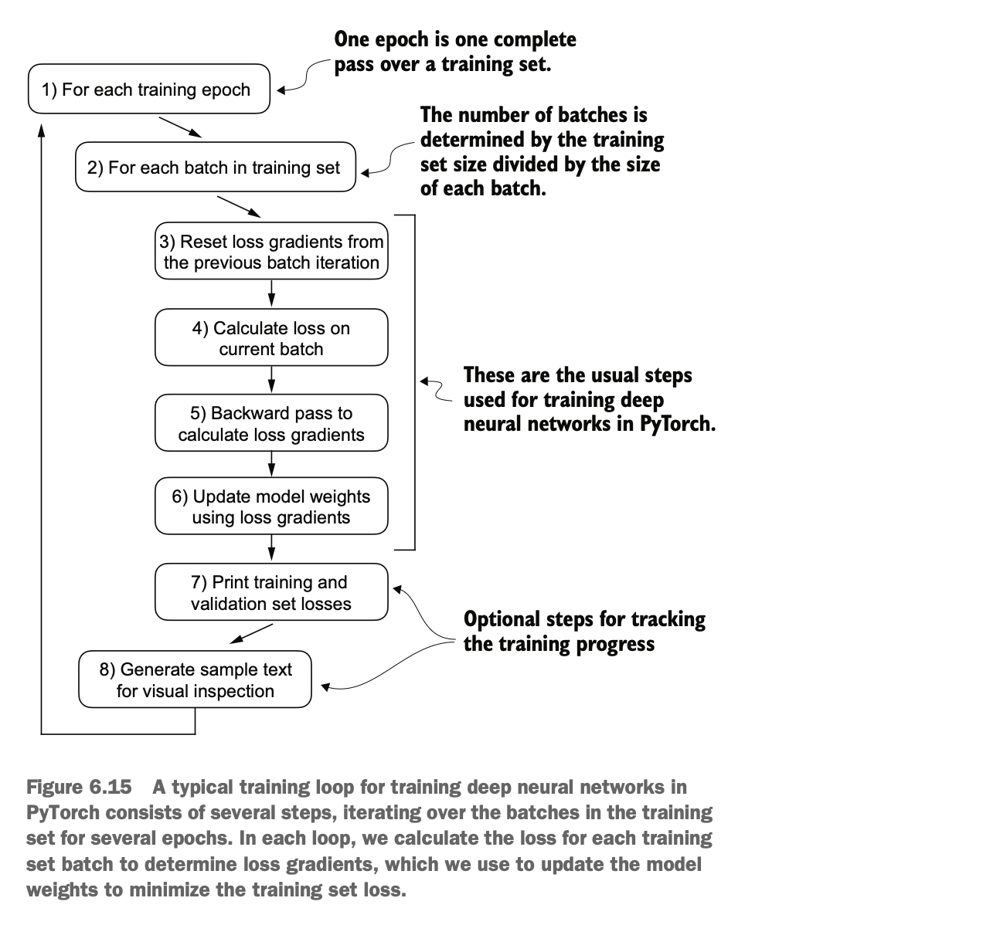

그림 6.15 PyTorch에서 심층 신경망을 훈련하기 위한 일반적인 훈련 루프는 여러 단계로 구성되며, 여러 에포크 동안 훈련 세트의 배치를 반복합니다. 각 루프에서 각 훈련 세트 배치의 손실을 계산하여 손실 그래디언트를 결정하고, 이를 사용하여 모델 가중치를 업데이트하여 훈련 세트 손실을 최소화합니다.

그림 6.15의 개념을 구현하는 훈련 함수는 모델 사전 훈련에 사용된 `train_model_simple` 함수와도 매우 유사합니다. 유일한 두 가지 차이점은 이제 토큰 수 대신 처리된 훈련 예제 수(`examples_seen`)를 추적하고, 샘플 텍스트를 인쇄하는 대신 각 에포크 후에 정확도를 계산한다는 것입니다.

**리스팅 6.10 스팸 분류를 위한 모델 미세조정**

```python
# 리스팅 6.10 스팸 분류를 위한 모델 미세조정
def train_classifier_simple(
    model, train_loader, val_loader, optimizer, device,
    num_epochs, eval_freq, eval_iter
):
    # 손실 및 처리된 예제를 추적하기 위한 리스트 초기화
    train_losses, val_losses, train_accs, val_accs = [], [], [], []
    examples_seen, global_step = 0, -1

    # 메인 훈련 루프
    for epoch in range(num_epochs):
        model.train()  # 모델을 훈련 모드로 설정

        for input_batch, target_batch in train_loader:
            optimizer.zero_grad()  # 이전 배치 반복의 손실 그래디언트 재설정

            # 이 배치의 손실 계산
            loss = calc_loss_batch(input_batch, target_batch, model, device)

            loss.backward()  # 손실 그래디언트 계산
            optimizer.step()  # 손실 그래디언트를 사용하여 모델 가중치 업데이트

            examples_seen += input_batch.shape[0]  # 처리된 예제 수 추적
            global_step += 1

            # 선택적 평가 단계
            if global_step % eval_freq == 0:
                train_loss, val_loss = evaluate_model(
                    model, train_loader, val_loader, device, eval_iter
                )
                train_losses.append(train_loss)
                val_losses.append(val_loss)

                print(
                    f"에포크 {epoch+1} (스텝 {global_step:06d}): "
                    f"훈련 손실 {train_loss:.3f}, 검증 손실 {val_loss:.3f}"
                )

        # 각 에포크 후 정확도 계산
        train_accuracy = calc_accuracy_loader(
            train_loader, model, device, num_batches=eval_iter
        )
        val_accuracy = calc_accuracy_loader(
            val_loader, model, device, num_batches=eval_iter
        )

        print(f"훈련 정확도: {train_accuracy*100:.2f}% | ", end="")
        print(f"검증 정확도: {val_accuracy*100:.2f}%")

        train_accs.append(train_accuracy)
        val_accs.append(val_accuracy)

    # 기록된 훈련 통계 반환
    return train_losses, val_losses, train_accs, val_accs, examples_seen
```

`evaluate_model` 함수는 사전 훈련에 사용했던 것과 동일합니다.

```python
def evaluate_model(model, train_loader, val_loader, device, eval_iter):
    model.eval()
    with torch.no_grad():
        train_loss = calc_loss_loader(
            train_loader, model, device, num_batches=eval_iter
        )
        val_loss = calc_loss_loader(
            val_loader, model, device, num_batches=eval_iter
        )
    model.train()
    return train_loss, val_loss
```

다음으로, 옵티마이저를 초기화하고, 훈련 에포크 수를 설정하고, `train_classifier_simple` 함수를 사용하여 훈련을 시작합니다. 훈련은 M3 MacBook Air 노트북 컴퓨터에서 약 6분, V100 또는 A100 GPU에서는 30초 미만이 걸립니다.

```python
import time
start_time = time.time()
torch.manual_seed(123)
optimizer = torch.optim.AdamW(model.parameters(), lr=5e-5, weight_decay=0.1)
num_epochs = 5
train_losses, val_losses, train_accs, val_accs, examples_seen = train_classifier_simple(
    model, train_loader, val_loader, optimizer, device,
    num_epochs=num_epochs, eval_freq=50,
    eval_iter=5,
)
end_time = time.time()
execution_time_minutes = (end_time - start_time) / 60
print(f"훈련 완료 시간: {execution_time_minutes:.2f}분.")
```

훈련 중에 표시되는 출력은 다음과 같습니다.

```
에포크 1 (스텝 000000): 훈련 손실 2.153, 검증 손실 2.392
에포크 1 (스텝 000050): 훈련 손실 0.617, 검증 손실 0.637
에포크 1 (스텝 000100): 훈련 손실 0.523, 검증 손실 0.557
훈련 정확도: 70.00% | 검증 정확도: 72.50%
에포크 2 (스텝 000150): 훈련 손실 0.561, 검증 손실 0.489
에포크 2 (스텝 000200): 훈련 손실 0.419, 검증 손실 0.397
에포크 2 (스텝 000250): 훈련 손실 0.409, 검증 손실 0.353
훈련 정확도: 82.50% | 검증 정확도: 85.00%
에포크 3 (스텝 000300): 훈련 손실 0.333, 검증 손실 0.320
에포크 3 (스텝 000350): 훈련 손실 0.340, 검증 손실 0.306
훈련 정확도: 90.00% | 검증 정확도: 90.00%
에포크 4 (스텝 000400): 훈련 손실 0.136, 검증 손실 0.200
에포크 4 (스텝 000450): 훈련 손실 0.153, 검증 손실 0.132
에포크 4 (스텝 000500): 훈련 손실 0.222, 검증 손실 0.137
훈련 정확도: 100.00% | 검증 정확도: 97.50%
에포크 5 (스텝 000550): 훈련 손실 0.207, 검증 손실 0.143
에포크 5 (스텝 000600): 훈련 손실 0.083, 검증 손실 0.074
훈련 정확도: 100.00% | 검증 정확도: 97.50%
훈련 완료 시간: 5.65분.
```

그런 다음 Matplotlib을 사용하여 훈련 및 검증 세트의 손실 함수를 플로팅합니다.

**리스팅 6.11 분류 손실 플로팅**

```python
import matplotlib.pyplot as plt

def plot_values(
    epochs_seen, examples_seen, train_values, val_values,
    label="loss"
):
    # 에포크에 대한 훈련 및 검증 손실 플롯
    fig, ax1 = plt.subplots(figsize=(5, 3))

    ax1.plot(epochs_seen, train_values, label=f"훈련 {label}")
    ax1.plot(
        epochs_seen, val_values, linestyle="-.",
        label=f"검증 {label}"
    )
    ax1.set_xlabel("에포크")
    ax1.set_ylabel(label.capitalize())
    ax1.legend()

    # 처리된 예제에 대한 두 번째 x축 생성
    ax2 = ax1.twiny()
    # 틱 정렬을 위한 보이지 않는 플롯
    ax2.plot(examples_seen, train_values, alpha=0)
    ax2.set_xlabel("처리된 예제")

    # 공간을 만들기 위해 레이아웃 조정
    fig.tight_layout()
    plt.savefig(f"{label}-plot.pdf")
    plt.show()


epochs_tensor = torch.linspace(0, num_epochs, len(train_losses))
examples_seen_tensor = torch.linspace(0, examples_seen, len(train_losses))

plot_values(epochs_tensor, examples_seen_tensor, train_losses, val_losses)
```

그림 6.16은 결과 손실 곡선을 플로팅합니다.

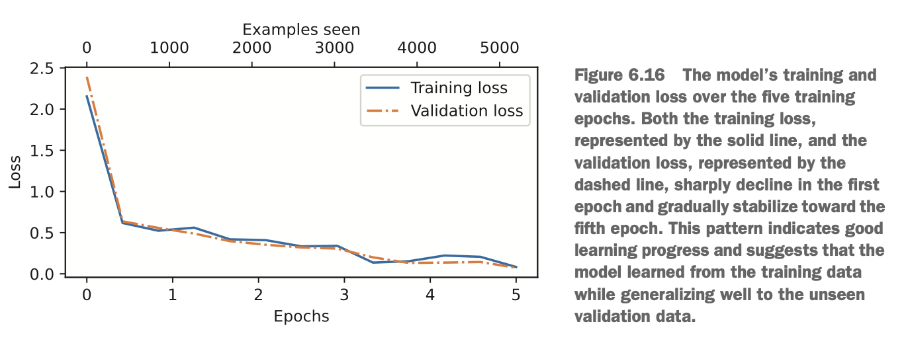

그림 6.16 5번의 훈련 에포크에 대한 모델의 훈련 및 검증 손실. 실선으로 표시된 훈련 손실과 파선으로 표시된 검증 손실 모두 첫 번째 에포크에서 급격히 감소하고 다섯 번째 에포크를 향해 점차 안정화됩니다. 이 패턴은 좋은 학습 진행 상황을 나타내며 모델이 훈련 데이터에서 학습하면서 보지 못한 검증 데이터에 잘 일반화되었음을 시사합니다.

그림 6.16의 급격한 하향 기울기를 바탕으로 모델이 훈련 데이터에서 잘 학습하고 있으며 과적합의 징후가 거의 없음을 알 수 있습니다. 즉, 훈련 손실과 검증 세트 손실 사이에 눈에 띄는 차이가 없습니다.

> **에포크 수 선택**
> 
> 이전에 훈련을 시작할 때 에포크 수를 5로 설정했습니다. 에포크 수는 데이터셋과 작업의 난이도에 따라 다르며 보편적인 해결책이나 권장 사항은 없지만, 5 에포크는 일반적으로 좋은 출발점입니다. 손실 플롯(그림 6.16 참조)에서 처음 몇 에포크 후에 모델이 과적합되면 에포크 수를 줄여야 할 수 있습니다. 반대로, 추세선이 추가 훈련으로 검증 손실이 개선될 수 있음을 시사하는 경우 에포크 수를 늘려야 합니다. 이 구체적인 경우, 조기 과적합의 징후가 없고 검증 손실이 0에 가깝기 때문에 5 에포크는 합리적인 수입니다.

동일한 `plot_values` 함수를 사용하여 이제 분류 정확도를 플로팅해 보겠습니다.

```python
epochs_tensor = torch.linspace(0, num_epochs, len(train_accs))
examples_seen_tensor = torch.linspace(0, examples_seen, len(train_accs))
plot_values(
    epochs_tensor, examples_seen_tensor, train_accs, val_accs,
    label="accuracy"
)
```

그림 6.17은 결과 정확도를 그래프로 나타냅니다. 모델은 4, 5 에포크 후에 비교적 높은 훈련 및 검증 정확도를 달성합니다. 중요하게도, 이전에 `train_classifier_simple` 함수를 사용할 때 `eval_iter=5`로 설정했는데, 이는 훈련 및 검증 성능 추정이 훈련 중 효율성을 위해 5개 배치만을 기반으로 함을 의미합니다.

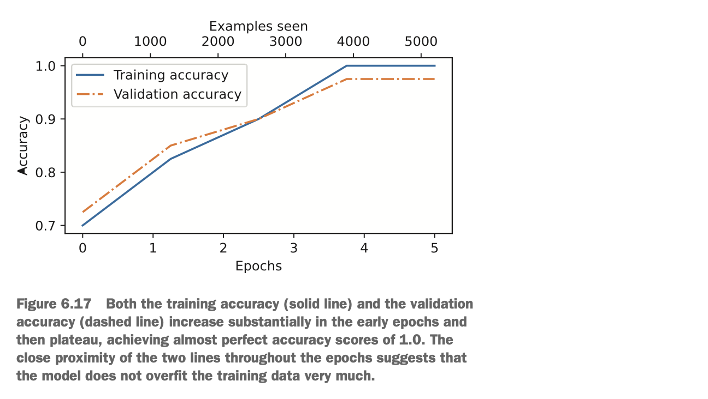

그림 6.17 훈련 정확도(실선)와 검증 정확도(파선) 모두 초기 에포크에서 상당히 증가한 다음 안정되어 거의 완벽한 1.0의 정확도 점수를 달성합니다. 에포크 전체에 걸쳐 두 선이 근접해 있다는 것은 모델이 훈련 데이터에 크게 과적합되지 않았음을 시사합니다.

이제 `eval_iter` 값을 정의하지 않고 다음 코드를 실행하여 전체 데이터셋에 대한 훈련, 검증 및 테스트 세트의 성능 지표를 계산해야 합니다.

```python
train_accuracy = calc_accuracy_loader(train_loader, model, device)
val_accuracy = calc_accuracy_loader(val_loader, model, device)
test_accuracy = calc_accuracy_loader(test_loader, model, device)
print(f"훈련 정확도: {train_accuracy*100:.2f}%")
print(f"검증 정확도: {val_accuracy*100:.2f}%")
print(f"테스트 정확도: {test_accuracy*100:.2f}%")
```

결과 정확도 값은 다음과 같습니다.

```
훈련 정확도: 97.21%
검증 정확도: 97.32%
테스트 정확도: 95.67%
```

훈련 및 테스트 세트 성능은 거의 동일합니다. 훈련 및 테스트 세트 정확도 간의 약간의 불일치는 훈련 데이터의 최소한의 과적합을 시사합니다. 일반적으로 검증 세트 정확도는 테스트 세트 정확도보다 다소 높습니다. 이는 모델 개발이 종종 검증 세트에서 잘 수행되도록 하이퍼파라미터를 조정하는 것을 포함하기 때문이며, 이는 테스트 세트에 효과적으로 일반화되지 않을 수 있습니다. 이러한 상황은 일반적이지만, 드롭아웃 비율(`drop_rate`)을 높이거나 옵티마이저 구성에서 `weight_decay` 매개변수를 조정하는 것과 같은 모델 설정을 조정하여 격차를 잠재적으로 최소화할 수 있습니다.

## 6.8 LLM을 스팸 분류기로 사용

모델을 미세조정하고 평가했으므로 이제 스팸 메시지를 분류할 준비가 되었습니다(그림 6.18 참조). 미세조정된 GPT 기반 스팸 분류 모델을 사용해 보겠습니다. 다음 `classify_review` 함수는 이전에 구현한 `SpamDataset`에서 사용했던 것과 유사한 데이터 전처리 단계를 따릅니다. 그런 다음 텍스트를 토큰 ID로 처리한 후, 함수는 6.6절에서 구현한 것과 유사하게 모델을 사용하여 정수 클래스 레이블을 예측한 다음 해당 클래스 이름을 반환합니다.

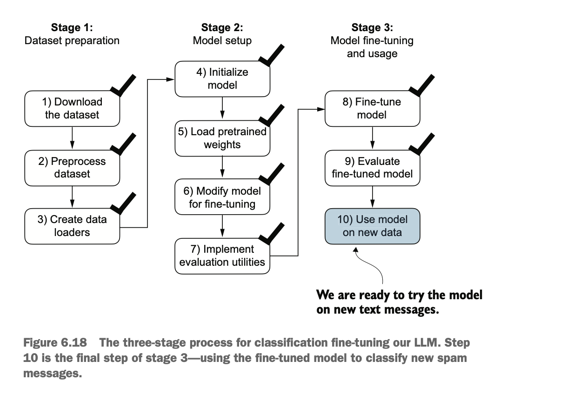

그림 6.18 LLM 분류 미세조정을 위한 3단계 프로세스. 10단계는 3단계의 마지막 단계로, 미세조정된 모델을 사용하여 새로운 스팸 메시지를 분류합니다.

**리스팅 6.12 새로운 텍스트를 분류하기 위해 모델 사용**

```python
def classify_review(
    text, model, tokenizer, device, max_length=None,
    pad_token_id=50256
):
    model.eval()

    # 모델에 대한 입력 준비
    input_ids = tokenizer.encode(text)
    supported_context_length = model.pos_emb.weight.shape[1]

    # 시퀀스가 너무 길면 자름
    input_ids = input_ids[:min(
        max_length, supported_context_length
    )]

    # 시퀀스를 가장 긴 시퀀스에 맞게 패딩
    input_ids += [pad_token_id] * (max_length - len(input_ids))

    # 배치 차원 추가
    input_tensor = torch.tensor(
        input_ids, device=device
    ).unsqueeze(0)

    # 그래디언트 추적 없이 모델 추론
    with torch.no_grad():
        # 마지막 출력 토큰의 로짓
        logits = model(input_tensor)[:, -1, :]
        predicted_label = torch.argmax(logits, dim=-1).item()

    # 분류된 결과 반환
    return "spam" if predicted_label == 1 else "not spam"
```

이 `classify_review` 함수를 예제 텍스트에 사용해 보겠습니다.

```python
text_1 = (
    "You are a winner you have been specially"
    " selected to receive $1000 cash or a $2000 award."
)
print(classify_review(
    text_1, model, tokenizer, device, max_length=train_dataset.max_length
))
```

결과 모델은 "spam"을 정확하게 예측합니다. 다른 예를 시도해 보겠습니다.

```python
text_2 = (
    "Hey, just wanted to check if we're still on"
    " for dinner tonight? Let me know!"
)
print(classify_review(
    text_2, model, tokenizer, device, max_length=train_dataset.max_length
))
```

모델은 다시 정확한 예측을 하고 "not spam" 레이블을 반환합니다.
마지막으로, 재훈련 없이 재사용할 수 있도록 모델을 저장해 보겠습니다.

```python
torch.save(model.state_dict(), "review_classifier.pth")

model_state_dict = torch.load("review_classifier.pth", map_location=device)
model.load_state_dict(model_state_dict)
```

## 요약

- LLM을 미세조정하는 데는 분류 미세조정과 지시 미세조정을 포함한 다양한 전략이 있습니다.
- 분류 미세조정은 LLM의 출력 레이어를 작은 분류 레이어로 교체하는 것을 포함합니다.
- 문자 메시지를 "스팸" 또는 "스팸 아님"으로 분류하는 경우, 새로운 분류 레이어는 두 개의 출력 노드로만 구성됩니다. 이전에는 어휘의 고유 토큰 수(즉, 50,256)와 동일한 수의 출력 노드를 사용했습니다.
- 사전 훈련에서처럼 텍스트의 다음 토큰을 예측하는 대신, 분류 미세조정은 모델이 "스팸" 또는 "스팸 아님"과 같은 올바른 클래스 레이블을 출력하도록 훈련합니다.
- 미세조정을 위한 모델 입력은 사전 훈련과 유사하게 토큰 ID로 변환된 텍스트입니다.
- LLM을 미세조정하기 전에 사전 훈련된 모델을 기본 모델로 로드합니다.
- 분류 모델을 평가하는 것은 분류 정확도(정확한 예측의 분수 또는 백분율)를 계산하는 것을 포함합니다.
- 분류 모델을 미세조정하는 것은 LLM을 사전 훈련할 때와 동일한 교차 엔트로피 손실 함수를 사용합니다.