# 7 지시사항을 따르도록 미세 조정하기

> **이 장에서 다루는 내용**
>
>- LLM의 지시사항 미세 조정(instruction fine-tuning) 과정
>- 지도 방식의 지시사항 미세 조정을 위한 데이터셋 준비
>- 훈련 배치로 지시사항 데이터 구성하기
>- 사전 훈련된 LLM을 불러와 사람의 지시를 따르도록 미세 조정하기
>- 평가를 위해 LLM이 생성한 지시사항 응답 추출하기
>- 지시사항 미세 조정된 LLM 평가하기

이전 장에서는 LLM 아키텍처를 구현하고, 사전 훈련을 수행했으며, 외부 소스에서 사전 훈련된 가중치를 우리 모델로 가져왔습니다. 그런 다음, 특정 분류 작업, 즉 스팸과 비스팸 문자 메시지를 구별하는 작업에 우리 LLM을 미세 조정하는 데 집중했습니다. 이제 그림 7.1에 설명된 대로 LLM이 사람의 지시를 따르도록 미세 조정하는 과정을 구현할 것입니다. 지시사항 미세 조정은 챗봇 애플리케이션, 개인 비서 및 기타 대화형 작업을 위한 LLM 개발의 주요 기술 중 하나입니다.

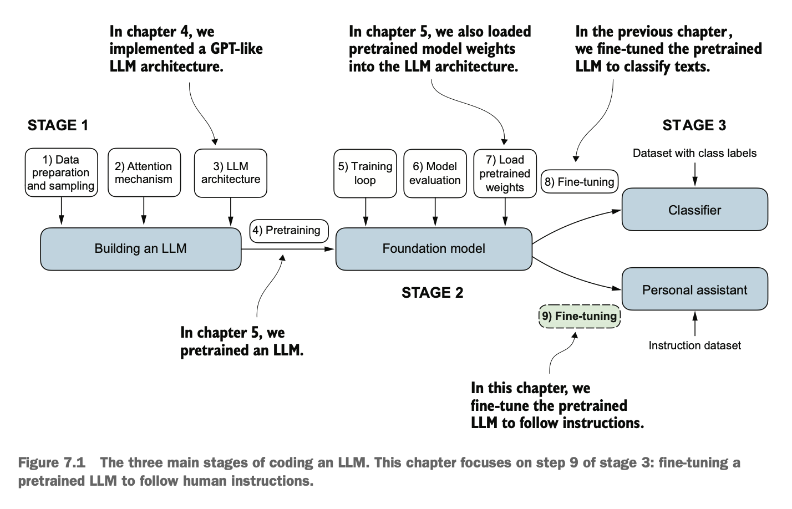

**그림 7.1 LLM 코딩의 세 가지 주요 단계. 이 장에서는 3단계의 9번째 단계인 사전 훈련된 LLM을 사람의 지시를 따르도록 미세 조정하는 데 중점을 둡니다.**

그림 7.1은 LLM을 미세 조정하는 두 가지 주요 방법, 즉 분류를 위한 미세 조정(8단계)과 지시를 따르도록 LLM을 미세 조정(9단계)하는 방법을 보여줍니다. 6장에서 8단계를 구현했습니다. 이제 지시사항 데이터셋을 사용하여 LLM을 미세 조정할 것입니다.

## 7.1 지시사항 미세 조정 소개

이제 우리는 LLM을 사전 훈련하는 것이 한 번에 한 단어씩 생성하는 법을 배우는 훈련 절차를 포함한다는 것을 알고 있습니다. 결과적으로 사전 훈련된 LLM은 텍스트 완성 능력을 갖추게 되어, 입력으로 주어진 조각 문장으로 문장을 완성하거나 텍스트 단락을 작성할 수 있습니다. 그러나 사전 훈련된 LLM은 종종 "이 텍스트의 문법을 수정하세요" 또는 "이 텍스트를 수동태로 변환하세요"와 같은 특정 지시에 어려움을 겪습니다. 나중에, 우리는 지시사항 미세 조정(지도 방식의 지시사항 미세 조정이라고도 함)의 기초로 사전 훈련된 LLM을 불러오는 구체적인 예를 살펴볼 것입니다.

여기서 우리는 그림 7.2에 설명된 대로 LLM이 그러한 지시를 따르고 원하는 응답을 생성하는 능력을 향상시키는 데 중점을 둡니다. 데이터셋 준비는 지시사항 미세 조정의 핵심적인 측면입니다. 그런 다음 그림 7.3에 표시된 대로 데이터셋 준비부터 시작하여 지시사항 미세 조정 과정의 세 단계를 모두 완료할 것입니다.

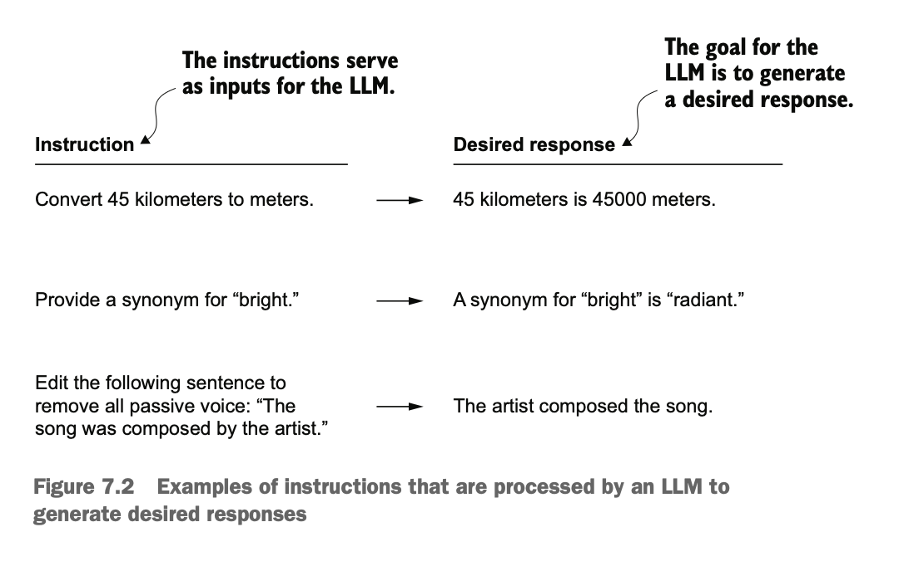

**그림 7.2 LLM이 처리하여 원하는 응답을 생성하는 지시사항의 예**

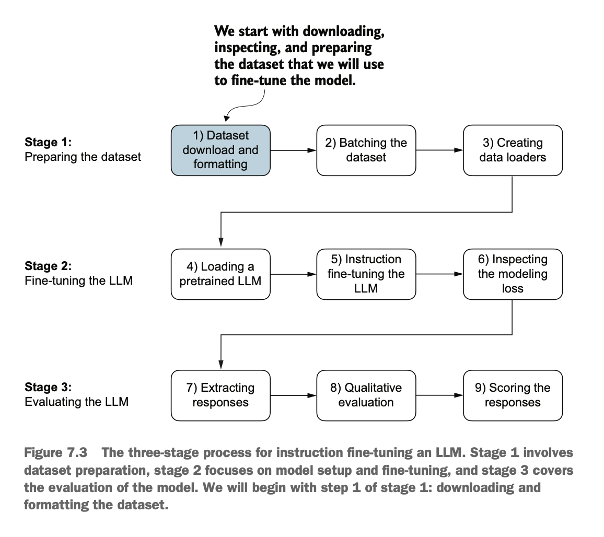

**그림 7.3 LLM 지시사항 미세 조정을 위한 3단계 과정. 1단계는 데이터셋 준비, 2단계는 모델 설정 및 미세 조정, 3단계는 모델 평가를 다룹니다. 1단계의 첫 번째 단계인 데이터셋 다운로드 및 형식 지정부터 시작하겠습니다.**

## 7.2 지도 방식의 지시사항 미세 조정을 위한 데이터셋 준비

사전 훈련된 LLM의 지시사항 미세 조정을 위해 지시사항 데이터셋을 다운로드하고 형식을 지정해 보겠습니다. 이 데이터셋은 그림 7.2와 유사한 1,100개의 지시-응답 쌍으로 구성됩니다. 이 데이터셋은 이 책을 위해 특별히 만들어졌지만, 관심 있는 독자는 부록 B에서 대체 가능한 공개 지시사항 데이터셋을 찾을 수 있습니다.

다음 코드는 이 데이터셋을 다운로드하는 함수를 구현하고 실행합니다. 이 데이터셋은 JSON 형식의 비교적 작은 파일(204KB)입니다. JSON(JavaScript Object Notation)은 파이썬 딕셔너리 구조와 유사하여 사람이 읽기 쉽고 기계 친화적인 데이터 교환을 위한 간단한 구조를 제공합니다.

**코드 목록 7.1 데이터셋 다운로드**

```python
import json
import os
import urllib

def download_and_load_file(file_path, url):
    if not os.path.exists(file_path):
        with urllib.request.urlopen(url) as response:
            text_data = response.read().decode("utf-8")
        with open(file_path, "w", encoding="utf-8") as file:
            file.write(text_data)
    else:
        # 파일이 이미 다운로드된 경우 다운로드를 건너뜁니다.
        with open(file_path, "r", encoding="utf-8") as file:
            text_data = file.read()
    with open(file_path, "r") as file:
        data = json.load(file)
    return data


file_path = "instruction-data.json"
url = (
    "https://raw.githubusercontent.com/rasbt/LLMs-from-scratch" 
    "/main/ch07/01_main-chapter-code/instruction-data.json"
)

data = download_and_load_file(file_path, url)
print("항목 수:", len(data))
```

앞선 코드를 실행한 결과는 다음과 같습니다.

```
항목 수: 1100
```

JSON 파일에서 불러온 `data` 리스트에는 지시사항 데이터셋의 1,100개 항목이 포함되어 있습니다. 각 항목이 어떻게 구성되어 있는지 확인하기 위해 항목 중 하나를 출력해 보겠습니다.

```python
print("예시 항목:", data[50])
```

예시 항목의 내용은 다음과 같습니다.

```
예시 항목:
    {'instruction': '다음 단어의 올바른 철자를 식별하세요.',
    'input': 'Ocassion', 'output': "올바른 철자는 'Occasion'입니다."}
```

보시다시피, 예시 항목은 "instruction", "input", "output"을 포함하는 파이썬 딕셔너리 객체입니다. 다른 예를 살펴보겠습니다.

```python
print("또 다른 예시 항목:", data[999])
```

이 항목의 내용에 따르면, "input" 필드는 때때로 비어 있을 수 있습니다.

```
또 다른 예시 항목:
    {'instruction': "'complicated'의 반의어는 무엇인가요?",
    'input': '',
    'output': "'complicated'의 반의어는 'simple'입니다."}
```

지시사항 미세 조정은 JSON 파일에서 추출한 것과 같은 입력-출력 쌍이 명시적으로 제공되는 데이터셋에서 모델을 훈련하는 것을 포함합니다. LLM을 위해 이러한 항목의 형식을 지정하는 다양한 방법이 있습니다. 그림 7.4는 Alpaca 및 Phi-3와 같은 주목할 만한 LLM 훈련에 사용된 두 가지 다른 예시 형식(종종 프롬프트 스타일이라고 함)을 보여줍니다.

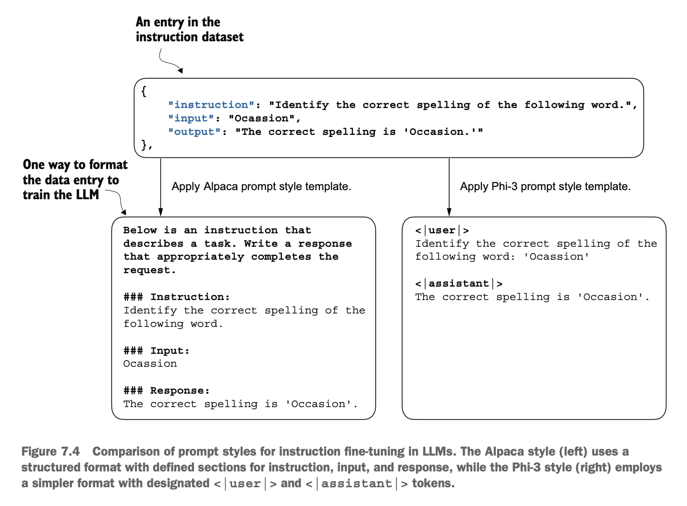

**그림 7.4 LLM의 지시사항 미세 조정을 위한 프롬프트 스타일 비교. Alpaca 스타일(왼쪽)은 지시, 입력, 응답에 대한 정의된 섹션이 있는 구조화된 형식을 사용하는 반면, Phi-3 스타일(오른쪽)은 지정된 `<|user|>` 및 `<|assistant|>` 토큰을 사용하는 더 간단한 형식을 사용합니다.**

Alpaca는 지시사항 미세 조정 과정을 공개적으로 상세히 설명한 초기 LLM 중 하나였습니다. Microsoft에서 개발한 Phi-3는 프롬프트 스타일의 다양성을 보여주기 위해 포함되었습니다. 이 장의 나머지 부분에서는 미세 조정에 대한 독창적인 접근 방식을 정의하는 데 도움이 되었기 때문에 가장 인기 있는 스타일 중 하나인 Alpaca 프롬프트 스타일을 사용합니다.

> **연습문제 7.1 프롬프트 스타일 변경**
>
>Alpaca 프롬프트 스타일로 모델을 미세 조정한 후, 그림 7.4에 표시된 Phi-3 프롬프트 스타일을 시도하고 모델의 응답 품질에 영향을 미치는지 관찰해 보세요.

`data` 리스트의 항목을 Alpaca 스타일 입력 형식으로 변환하는 데 사용할 수 있는 `format_input` 함수를 정의해 보겠습니다.

**코드 목록 7.2 프롬프트 형식 지정 함수 구현**

```python
def format_input(entry):
    instruction_text = (
        f"아래는 작업을 설명하는 지시사항입니다. "
        f"요청을 적절하게 완료하는 응답을 작성하세요."
        f"\n\n### 지시사항:\n{entry['instruction']}"
    )
    input_text = (
        f"\n\n### 입력:\n{entry['input']}" if entry["input"] else ""
    )
    return instruction_text + input_text
```

이 `format_input` 함수는 딕셔너리 항목을 입력으로 받아 형식화된 문자열을 구성합니다. 앞에서 살펴본 데이터셋 항목 `data[50]`으로 테스트해 보겠습니다.

```python
model_input = format_input(data[50])
desired_response = f"\n\n### 응답:\n{data[50]['output']}"
print(model_input + desired_response)
```

형식화된 입력은 다음과 같습니다.

```
아래는 작업을 설명하는 지시사항입니다. 요청을 적절하게 완료하는 응답을 작성하세요.

### 지시사항:
다음 단어의 올바른 철자를 식별하세요.

### 입력:
Ocassion

### 응답:
올바른 철자는 'Occasion'입니다.
```

`format_input`은 'input' 필드가 비어 있으면 선택적인 `### 입력:` 섹션을 건너뜁니다. 이는 앞에서 살펴본 `data[999]` 항목에 `format_input` 함수를 적용하여 테스트할 수 있습니다.

```python
model_input = format_input(data[999])
desired_response = f"\n\n### 응답:\n{data[999]['output']}"
print(model_input + desired_response)
```

출력은 'input' 필드가 비어 있는 항목이 형식화된 입력에 `### 입력:` 섹션을 포함하지 않음을 보여줍니다.

```
아래는 작업을 설명하는 지시사항입니다. 요청을 적절하게 완료하는 응답을 작성하세요.

### 지시사항:
'complicated'의 반의어는 무엇인가요?
### 응답:
'complicated'의 반의어는 'simple'입니다.
```

다음 섹션에서 PyTorch 데이터 로더를 설정하기 전에, 이전 장에서 스팸 분류 데이터셋으로 했던 것과 유사하게 데이터셋을 훈련, 검증 및 테스트 세트로 나누겠습니다. 다음 목록은 그 비율을 계산하는 방법을 보여줍니다.

**코드 목록 7.3 데이터셋 분할**
```python
train_portion = int(len(data) * 0.85) # 데이터의 85%를 훈련에 사용
test_portion = int(len(data) * 0.1)   # 10%를 테스트에 사용
val_portion = len(data) - train_portion - test_portion # 나머지 5%를 검증에 사용

train_data = data[:train_portion]
test_data = data[train_portion:train_portion + test_portion]
val_data = data[train_portion + test_portion:]

print("훈련 세트 길이:", len(train_data))
print("검증 세트 길이:", len(val_data))
print("테스트 세트 길이:", len(test_data))
```
이 분할은 다음과 같은 데이터셋 크기를 결과로 낳습니다.

```
훈련 세트 길이: 935
검증 세트 길이: 55
테스트 세트 길이: 110
```

데이터셋을 성공적으로 다운로드하고 분할했으며 데이터셋 프롬프트 형식에 대한 명확한 이해를 얻었으므로 이제 지시사항 미세 조정 프로세스의 핵심 구현을 위한 준비가 되었습니다. 다음으로, LLM 미세 조정을 위한 훈련 배치를 구성하는 방법을 개발하는 데 중점을 둡니다.

## 7.3 데이터를 훈련 배치로 구성하기

지시사항 미세 조정 프로세스의 구현 단계로 진행함에 따라, 그림 7.5에 설명된 다음 단계는 훈련 배치를 효과적으로 구성하는 데 중점을 둡니다. 여기에는 미세 조정 과정 동안 모델이 형식화된 훈련 데이터를 수신하도록 보장하는 방법을 정의하는 것이 포함됩니다.

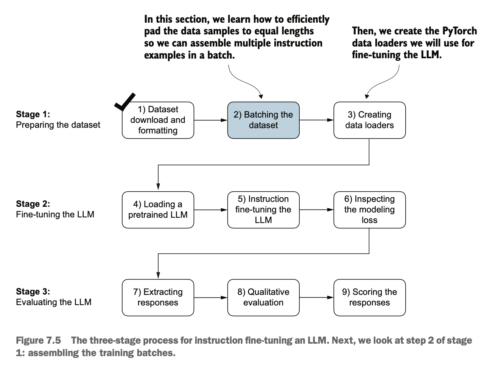

**그림 7.5 LLM 지시사항 미세 조정을 위한 3단계 과정. 다음으로, 1단계의 2단계인 훈련 배치 조립을 살펴봅니다.**

이전 장에서는 PyTorch `DataLoader` 클래스에 의해 훈련 배치가 자동으로 생성되었으며, 이 클래스는 샘플 목록을 배치로 결합하기 위해 기본 `collate` 함수를 사용합니다. `collate` 함수는 개별 데이터 샘플 목록을 가져와 훈련 중 모델이 효율적으로 처리할 수 있는 단일 배치로 병합하는 역할을 합니다.

그러나 지시사항 미세 조정을 위한 배치 과정은 좀 더 복잡하며, 나중에 `DataLoader`에 연결할 자체 사용자 정의 `collate` 함수를 만들어야 합니다. 우리는 이 사용자 정의 `collate` 함수를 구현하여 지시사항 미세 조정 데이터셋의 특정 요구 사항과 형식을 처리합니다.

그림 7.6에 설명된 대로 사용자 정의 `collate` 함수 코딩을 포함하여 여러 단계로 배치 프로세스를 처리해 보겠습니다. 먼저, 2.1단계와 2.2단계를 구현하기 위해 6장의 `SpamDataset`과 유사하게 데이터셋의 모든 입력에 `format_input`을 적용하고 사전 토큰화하는 `InstructionDataset` 클래스를 코딩합니다. 그림 7.7에 자세히 설명된 이 2단계 프로세스는 `InstructionDataset`의 `__init__` 생성자 메서드에서 구현됩니다.

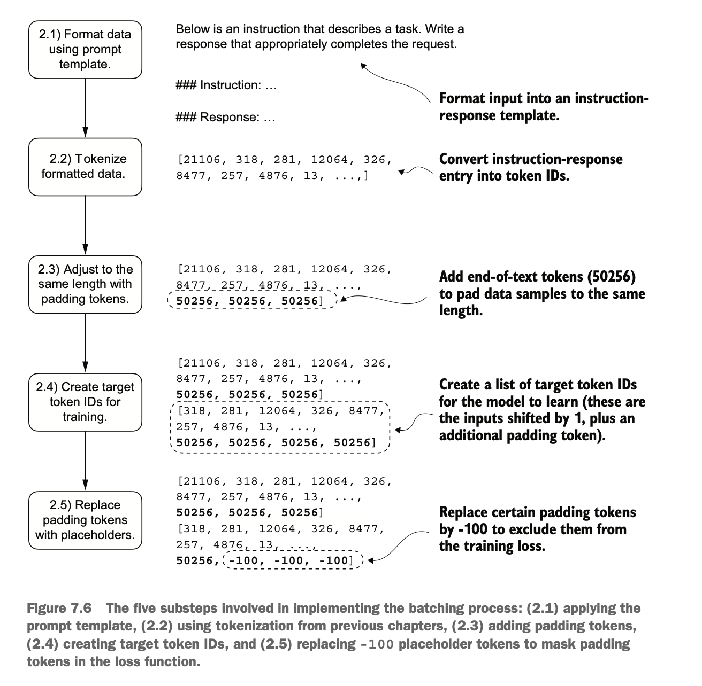

**그림 7.6 배치 프로세스 구현에 관련된 5가지 하위 단계: (2.1) 프롬프트 템플릿 적용, (2.2) 이전 장의 토큰화 사용, (2.3) 패딩 토큰 추가, (2.4) 대상 토큰 ID 생성, (2.5) 손실 함수에서 패딩 토큰을 마스킹하기 위해 -100 자리 표시자 토큰 교체.**

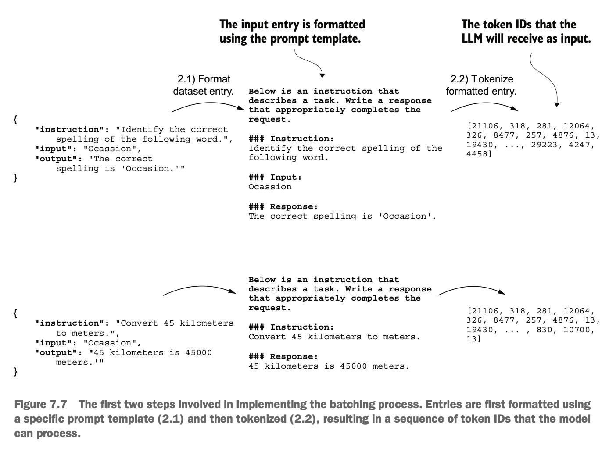

**그림 7.7 배치 프로세스 구현에 관련된 처음 두 단계. 항목은 먼저 특정 프롬프트 템플릿(2.1)을 사용하여 형식화된 다음 토큰화(2.2)되어 모델이 처리할 수 있는 토큰 ID 시퀀스를 생성합니다.**

**코드 목록 7.4 지시사항 데이터셋 클래스 구현**

```python
import torch
from torch.utils.data import Dataset

class InstructionDataset(Dataset):
    def __init__(self, data, tokenizer):
        self.data = data
        self.encoded_texts = []

        for entry in data:  # 텍스트 사전 토큰화
            instruction_plus_input = format_input(entry)
            response_text = f"\n\n### 응답:\n{entry['output']}"
            full_text = instruction_plus_input + response_text
            self.encoded_texts.append(
                tokenizer.encode(full_text)
            )

    def __getitem__(self, index):
        return self.encoded_texts[index]

    def __len__(self):
        return len(self.data)
```

분류 미세 조정에 사용된 접근 방식과 유사하게, 여러 훈련 예제를 배치로 수집하여 훈련을 가속화하고자 하며, 이를 위해서는 모든 입력을 비슷한 길이로 패딩해야 합니다. 분류 미세 조정과 마찬가지로 `<|endoftext|>` 토큰을 패딩 토큰으로 사용합니다.

텍스트 입력에 `<|endoftext|>` 토큰을 추가하는 대신, 사전 토큰화된 입력에 직접 `<|endoftext|>`에 해당하는 토큰 ID를 추가할 수 있습니다. 토크나이저의 `.encode` 메서드를 `<|endoftext|>` 토큰에 사용하여 어떤 토큰 ID를 사용해야 하는지 상기할 수 있습니다.

```python
import tiktoken
tokenizer = tiktoken.get_encoding("gpt2")
print(tokenizer.encode("<|endoftext|>", allowed_special=["<|endoftext|>"]))
```

결과 토큰 ID는 `50256`입니다.
프로세스의 2.3단계(그림 7.6 참조)로 이동하여, 데이터 로더에 전달할 수 있는 사용자 정의 `collate` 함수를 개발하여 보다 정교한 접근 방식을 채택합니다. 이 사용자 정의 `collate` 함수는 그림 7.8에서 보여주듯이 각 배치의 훈련 예제를 동일한 길이로 패딩하면서 다른 배치가 다른 길이를 가질 수 있도록 합니다. 이 접근 방식은 각 배치의 가장 긴 시퀀스에만 맞춰 시퀀스를 확장하고 전체 데이터셋에 맞추지 않음으로써 불필요한 패딩을 최소화합니다.

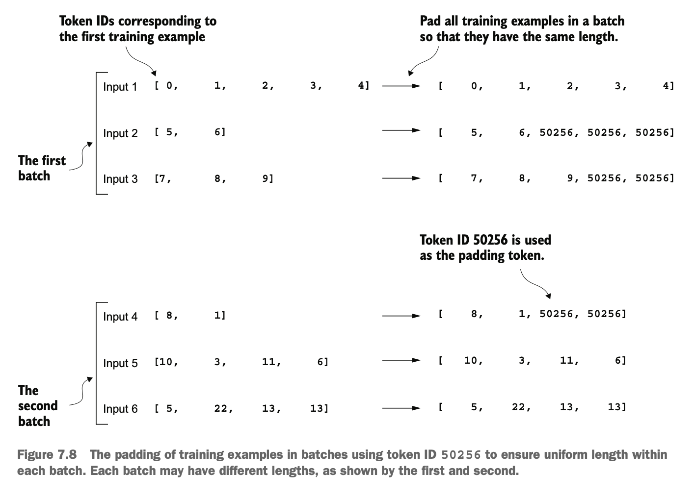

**그림 7.8 각 배치 내에서 균일한 길이를 보장하기 위해 토큰 ID 50256을 사용하여 배치의 훈련 예제를 패딩합니다. 첫 번째와 두 번째에서 볼 수 있듯이 각 배치는 다른 길이를 가질 수 있습니다.**

사용자 정의 `collate` 함수로 패딩 프로세스를 구현할 수 있습니다.

```python
def custom_collate_draft_1(
    batch,
    pad_token_id=50256,
    device="cpu"
):
    # 배치에서 가장 긴 시퀀스를 찾습니다.
    batch_max_length = max(len(item) + 1 for item in batch)
    inputs_lst = []
    for item in batch: # 입력을 패딩하고 준비합니다.
        new_item = item.copy()
        new_item += [pad_token_id]
        padded = new_item + [pad_token_id] * (batch_max_length - len(new_item))
        inputs = torch.tensor(padded[:-1]) # 이전에 추가된 여분의 패딩 토큰을 제거합니다.
        inputs_lst.append(inputs)
    # 입력 목록을 텐서로 변환하고 대상 장치로 전송합니다.
    inputs_tensor = torch.stack(inputs_lst).to(device)
    return inputs_tensor
```

우리가 구현한 `custom_collate_draft_1`은 PyTorch `DataLoader`에 통합되도록 설계되었지만 독립 실행형 도구로도 작동할 수 있습니다. 여기서는 의도한 대로 작동하는지 테스트하고 확인하기 위해 독립적으로 사용합니다. 각 예제가 동일한 길이로 패딩되는 배치로 조립하려는 세 가지 다른 입력에 대해 시도해 보겠습니다.

```python
inputs_1 = [0, 1, 2, 3, 4]
inputs_2 = [5, 6]
inputs_3 = [7, 8, 9]
batch = [inputs_1, inputs_2, inputs_3]
print(custom_collate_draft_1(batch))
```

결과 배치는 다음과 같습니다.

```
tensor([[ 0, 1, 2, 3, 4],
    [ 5, 6, 50256, 50256, 50256],
    [ 7, 8, 9, 50256, 50256]])
```

이 출력은 모든 입력이 5개의 토큰 ID를 포함하는 가장 긴 입력 목록 `inputs_1`의 길이로 패딩되었음을 보여줍니다.

입력 목록에서 배치를 만들기 위해 첫 번째 사용자 정의 `collate` 함수를 방금 구현했습니다. 그러나 이전에 배운 대로 입력 ID 배치에 해당하는 대상 토큰 ID가 있는 배치도 만들어야 합니다. 그림 7.9에 표시된 이러한 대상 ID는 모델이 생성하기를 원하는 것을 나타내고 가중치 업데이트를 위한 손실을 계산하기 위해 훈련 중에 필요한 것이기 때문에 중요합니다. 즉, 입력 토큰 ID 외에 대상 토큰 ID를 반환하도록 사용자 정의 `collate` 함수를 수정합니다.

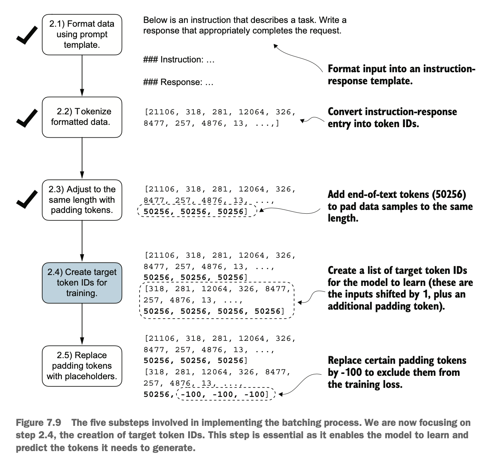

**그림 7.9 배치 프로세스 구현에 관련된 5가지 하위 단계. 이제 2.4단계인 대상 토큰 ID 생성에 중점을 둡니다. 이 단계는 모델이 생성해야 할 토큰을 학습하고 예측할 수 있도록 하므로 필수적입니다.**

LLM을 사전 훈련하는 데 사용한 프로세스와 유사하게, 대상 토큰 ID는 입력 토큰 ID와 일치하지만 오른쪽으로 한 위치 이동합니다. 그림 7.10에 표시된 이 설정은 LLM이 시퀀스에서 다음 토큰을 예측하는 방법을 학습할 수 있도록 합니다.

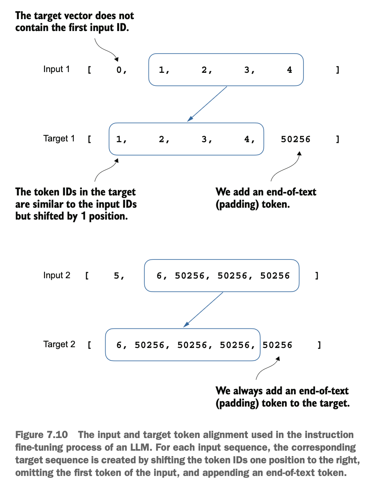

**그림 7.10 LLM의 지시사항 미세 조정 프로세스에 사용되는 입력 및 대상 토큰 정렬. 각 입력 시퀀스에 대해 해당 대상 시퀀스는 토큰 ID를 오른쪽으로 한 위치 이동하고 입력의 첫 번째 토큰을 생략하고 텍스트 끝 토큰을 추가하여 생성됩니다.**

다음 업데이트된 `collate` 함수는 입력 토큰 ID에서 대상 토큰 ID를 생성합니다.

```python
def custom_collate_draft_2(
    batch,
    pad_token_id=50256,
    device="cpu"
):
    batch_max_length = max(len(item) + 1 for item in batch)
    inputs_lst, targets_lst = [], []
    for item in batch:
        new_item = item.copy()
        new_item += [pad_token_id]
        padded = new_item + [pad_token_id] * (batch_max_length - len(new_item))
        inputs = torch.tensor(padded[:-1]) # 입력을 위해 마지막 토큰을 자릅니다.
        targets = torch.tensor(padded[1:]) # 대상을 위해 오른쪽으로 +1 이동합니다.
        inputs_lst.append(inputs)
        targets_lst.append(targets)

    inputs_tensor = torch.stack(inputs_lst).to(device)
    targets_tensor = torch.stack(targets_lst).to(device)
    return inputs_tensor, targets_tensor

inputs, targets = custom_collate_draft_2(batch)
print(inputs)
print(targets)
```

앞서 정의한 세 개의 입력 목록으로 구성된 예제 배치에 적용하면, 새로운 `custom_collate_draft_2` 함수는 이제 입력 및 대상 배치를 반환합니다.

```
tensor([[    0,     1,     2,     3,     4],  # 첫 번째 텐서는 입력을 나타냅니다.
        [    5,     6, 50256, 50256, 50256],
        [    7,     8,     9, 50256, 50256]])

tensor([[    1,     2,     3,     4, 50256],  # 두 번째 텐서는 대상을 나타냅니다.
        [    6, 50256, 50256, 50256, 50256],
        [    8,     9, 50256, 50256, 50256]])
```

다음 단계에서는 그림 7.11에서 강조 표시된 것처럼 모든 패딩 토큰에 `-100` 자리 표시자 값을 할당합니다. 이 특수 값을 사용하면 훈련 손실 계산에 이러한 패딩 토큰이 기여하지 않도록 제외하여 의미 있는 데이터만 모델 학습에 영향을 미치도록 할 수 있습니다. 이 수정 사항을 구현한 후 이 프로세스에 대해 더 자세히 논의할 것입니다. (분류를 위해 미세 조정할 때, 우리는 마지막 출력 토큰을 기반으로 모델을 훈련했기 때문에 이것에 대해 걱정할 필요가 없었습니다.)

그러나 그림 7.12에 표시된 것처럼 대상 목록에 하나의 텍스트 끝 토큰, ID `50256`을 유지합니다. 이를 유지하면 LLM이 지시에 대한 응답으로 텍스트 끝 토큰을 생성하는 시기를 학습할 수 있으며, 이는 생성된 응답이 완료되었음을 나타내는 지표로 사용합니다.

다음 목록에서는 대상 목록에서 ID `50256`을 가진 토큰을 `-100`으로 바꾸도록 사용자 정의 `collate` 함수를 수정합니다. 또한, 샘플 길이를 선택적으로 제한하기 위해 `allowed_max_length` 매개변수를 도입합니다. 이 조정은 GPT-2 모델에서 지원하는 1,024 토큰 컨텍스트 크기를 초과하는 자체 데이터셋으로 작업할 계획인 경우 유용합니다.

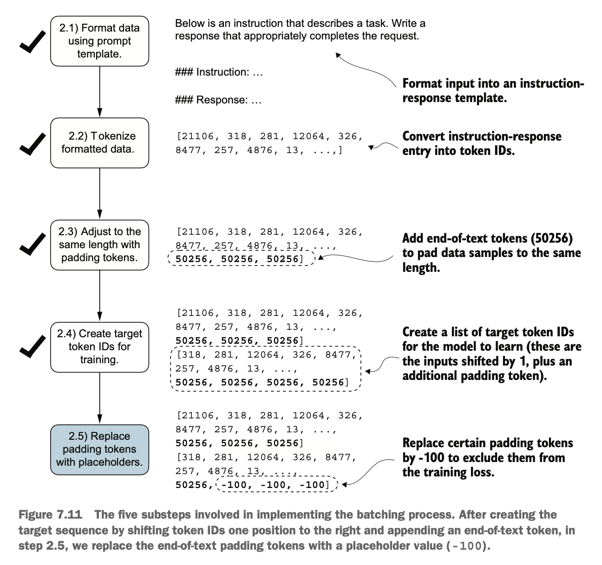

**그림 7.11 배치 프로세스 구현에 관련된 5가지 하위 단계. 대상 시퀀스를 오른쪽으로 한 위치 이동하고 텍스트 끝 토큰을 추가하여 생성한 후, 2.5단계에서는 텍스트 끝 패딩 토큰을 자리 표시자 값(-100)으로 바꿉니다.**

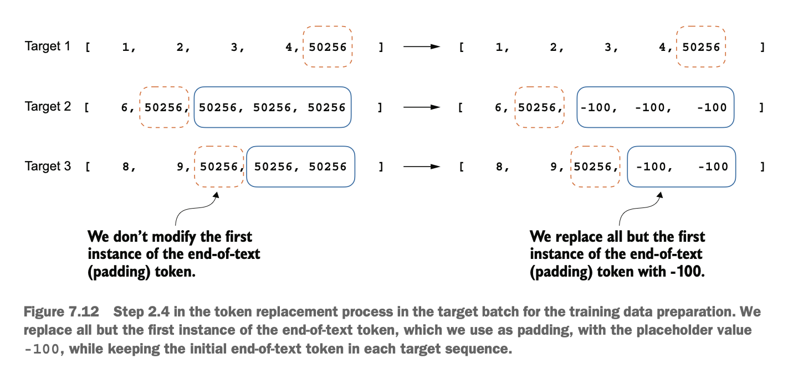

**그림 7.12 훈련 데이터 준비를 위한 대상 배치의 토큰 교체 프로세스 2.4단계. 패딩으로 사용하는 텍스트 끝 토큰의 첫 번째 인스턴스를 제외한 모든 인스턴스를 자리 표시자 값 -100으로 바꾸고, 각 대상 시퀀스의 초기 텍스트 끝 토큰은 유지합니다.**

**코드 목록 7.5 사용자 정의 배치 조합 함수 구현**

```python
def custom_collate_fn(
    batch,
    pad_token_id=50256,
    ignore_index=-100,
    allowed_max_length=None,
    device="cpu"
):
    batch_max_length = max(len(item) + 1 for item in batch)
    inputs_lst, targets_lst = [], []
    for item in batch:
        new_item = item.copy()
        new_item += [pad_token_id]
        padded = new_item + [pad_token_id] * (batch_max_length - len(new_item)) # 시퀀스를 max_length로 패딩
        inputs = torch.tensor(padded[:-1]) # 입력을 위해 마지막 토큰을 자름
        targets = torch.tensor(padded[1:]) # 대상을 위해 오른쪽으로 +1 이동

        # 대상에서 첫 번째 패딩 토큰을 제외한 모든 패딩 토큰을 ignore_index로 바꿈
        mask = targets == pad_token_id
        indices = torch.nonzero(mask).squeeze()
        if indices.numel() > 1:
            targets[indices[1:]] = ignore_index

        if allowed_max_length is not None:
            # 선택적으로 최대 시퀀스 길이로 자름
            inputs = inputs[:allowed_max_length]
            targets = targets[:allowed_max_length]
        inputs_lst.append(inputs)
        targets_lst.append(targets)
    inputs_tensor = torch.stack(inputs_lst).to(device)
    targets_tensor = torch.stack(targets_lst).to(device)
    return inputs_tensor, targets_tensor
```

다시, 이전에 만든 샘플 배치에서 `collate` 함수를 시도하여 의도한 대로 작동하는지 확인해 보겠습니다.

```python
inputs, targets = custom_collate_fn(batch)
print(inputs)
print(targets)
```

결과는 다음과 같으며, 첫 번째 텐서는 입력을, 두 번째 텐서는 대상을 나타냅니다.

```
tensor([[    0,     1,     2,     3,     4],
        [    5,     6, 50256, 50256, 50256],
        [    7,     8,     9, 50256, 50256]])

tensor([[    1,     2,     3,     4, 50256],
        [    6, 50256, -100, -100, -100],
        [    8,     9, 50256, -100, -100]])
```

수정된 `collate` 함수는 예상대로 작동하여 대상 목록에 토큰 ID `-100`을 삽입하여 변경합니다. 이 조정의 논리는 무엇일까요? 이 수정의 근본적인 목적을 살펴보겠습니다.

시연을 위해, 각 출력 로짓이 모델의 어휘에서 잠재적인 토큰에 해당하는 다음과 같은 간단하고 독립적인 예를 고려해 보겠습니다. 모델이 토큰 시퀀스를 예측할 때 훈련 중에 교차 엔트로피 손실(5장에서 소개)을 계산하는 방법은 다음과 같으며, 이는 모델을 사전 훈련하고 분류를 위해 미세 조정했을 때와 유사합니다.

```python
logits_1 = torch.tensor([
    [-1.0, 1.0], # 첫 번째 토큰에 대한 예측
    [-0.5, 1.5]  # 두 번째 토큰에 대한 예측
])
targets_1 = torch.tensor([0, 1])  # 생성할 올바른 토큰 인덱스
loss_1 = torch.nn.functional.cross_entropy(logits_1, targets_1)
print(loss_1)
```

이전 코드로 계산된 손실 값은 `1.1269`입니다.
`tensor(1.1269)`

예상대로 추가 토큰 ID를 추가하면 손실 계산에 영향을 미칩니다.

```python
logits_2 = torch.tensor([
    [-1.0, 1.0],
    [-0.5, 1.5],
    [-0.5, 1.5] # 새로운 세 번째 토큰 ID 예측
])
targets_2 = torch.tensor([0, 1, 1])
loss_2 = torch.nn.functional.cross_entropy(logits_2, targets_2)
print(loss_2)
```

세 번째 토큰을 추가한 후 손실 값은 `0.7936`입니다.

지금까지 PyTorch의 교차 엔트로피 손실 함수를 사용하여 몇 가지 다소 명백한 예제 계산을 수행했습니다. 이 손실 함수는 사전 훈련 및 분류 미세 조정을 위한 훈련 함수에서 사용한 것과 동일합니다. 이제 흥미로운 부분으로 넘어가서 세 번째 대상 토큰 ID를 `-100`으로 바꾸면 어떻게 되는지 보겠습니다.

```python
targets_3 = torch.tensor([0, 1, -100])
loss_3 = torch.nn.functional.cross_entropy(logits_2, targets_3)
print(loss_3)
print("loss_1 == loss_3:", loss_1 == loss_3)
```

결과 출력은 다음과 같습니다.

```
tensor(1.1269)
loss_1 == loss_3: tensor(True)
```

이 세 가지 훈련 예제에 대한 결과 손실은 이전에 두 가지 훈련 예제에서 계산한 손실과 동일합니다. 즉, 교차 엔트로피 손실 함수는 `targets_3` 벡터의 세 번째 항목, 즉 `-100`에 해당하는 토큰 ID를 무시했습니다. (관심 있는 독자는 `-100` 값을 `0`이나 `1`이 아닌 다른 토큰 ID로 바꿔볼 수 있습니다. 오류가 발생할 것입니다.)

그렇다면 `-100`이 교차 엔트로피 손실에 의해 무시되는 특별한 이유는 무엇일까요? PyTorch의 교차 엔트로피 함수의 기본 설정은 `cross_entropy(..., ignore_index=-100)`입니다. 이는 `-100`으로 레이블이 지정된 대상을 무시한다는 의미입니다. 우리는 이 `ignore_index`를 활용하여 각 배치의 훈련 예제를 동일한 길이로 패딩하는 데 사용한 추가적인 텍스트 끝(패딩) 토큰을 무시합니다. 그러나 대상에 하나의 `50256`(텍스트 끝) 토큰 ID를 유지하고 싶습니다. 왜냐하면 LLM이 텍스트 끝 토큰을 생성하는 방법을 배우는 데 도움이 되며, 이를 응답이 완료되었음을 나타내는 지표로 사용할 수 있기 때문입니다.

패딩 토큰을 마스킹하는 것 외에도, 그림 7.13에 설명된 것처럼 지시에 해당하는 대상 토큰 ID를 마스킹하는 것도 일반적입니다. 지시에 해당하는 LLM의 대상 토큰 ID를 마스킹함으로써 교차 엔트로피 손실은 생성된 응답 대상 ID에 대해서만 계산됩니다. 따라서 모델은 지시를 암기하는 대신 정확한 응답을 생성하는 데 집중하도록 훈련되어 과적합을 줄이는 데 도움이 될 수 있습니다.

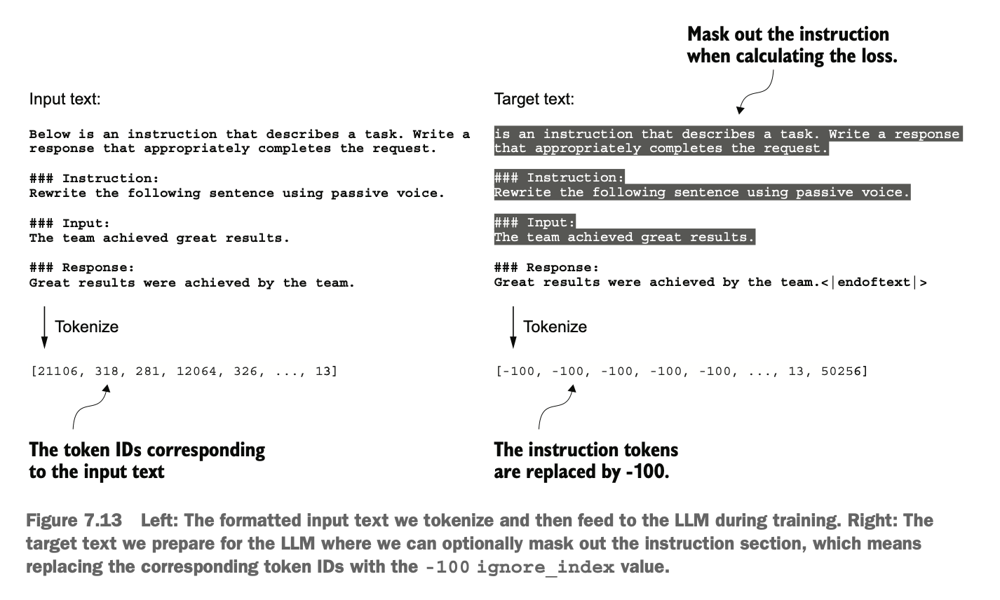

**그림 7.13 왼쪽: 훈련 중에 토큰화하여 LLM에 공급하는 형식화된 입력 텍스트. 오른쪽: LLM을 위해 준비하는 대상 텍스트로, 선택적으로 지시 섹션을 마스킹할 수 있습니다. 즉, 해당 토큰 ID를 -100 ignore_index 값으로 바꿉니다.**

이 글을 쓰는 시점에서 연구자들은 지시사항 미세 조정 중에 지시를 마스킹하는 것이 보편적으로 유익한지에 대해 의견이 분분합니다. 예를 들어, Shi 등의 2024년 논문 "Instruction Tuning With Loss Over Instructions"(https://arxiv.org/abs/2405.14394)는 지시를 마스킹하지 않는 것이 LLM 성능에 도움이 된다고 입증했습니다(자세한 내용은 부록 B 참조). 여기서는 마스킹을 적용하지 않고 관심 있는 독자를 위한 선택적 연습 문제로 남겨두겠습니다.

> **연습문제 7.2 지시 및 입력 마스킹**
>
> 이 장을 완료하고 `InstructionDataset`으로 모델을 미세 조정한 후, 그림 7.13에 설명된 지시 마스킹 방법을 사용하기 위해 지시 및 입력 토큰을 `-100` 마스크로 교체하세요. 그런 다음 이것이 모델 성능에 긍정적인 영향을 미치는지 평가하세요.

## 7.4 지시사항 데이터셋을 위한 데이터 로더 생성하기

지시사항 데이터셋을 위한 `InstructionDataset` 클래스와 `custom_collate_fn` 함수를 구현하기 위해 여러 단계를 완료했습니다. 그림 7.14와 같이, 이제 `InstructionDataset` 객체와 `custom_collate_fn` 함수를 PyTorch 데이터 로더에 간단히 연결하여 노력의 결실을 거둘 준비가 되었습니다. 이 로더는 LLM 지시사항 미세 조정 프로세스를 위해 배치를 자동으로 섞고 구성합니다.

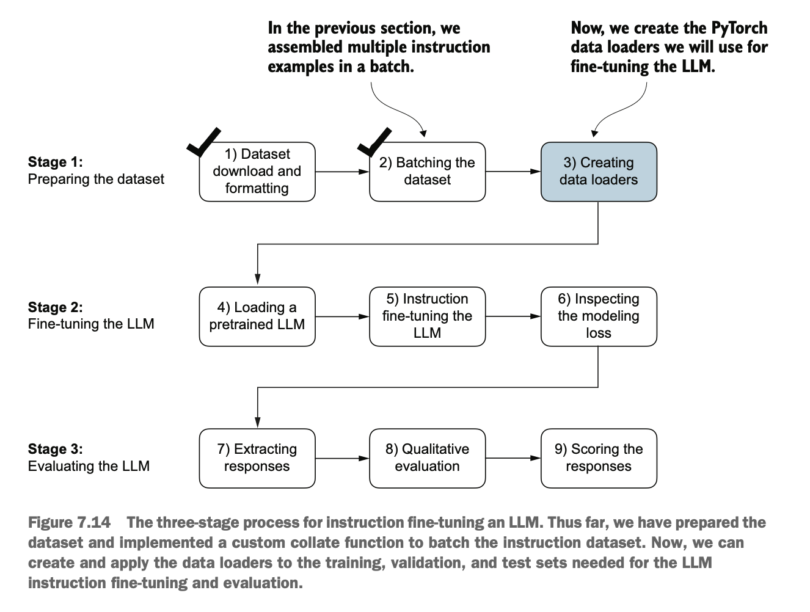

**그림 7.14 LLM 지시사항 미세 조정을 위한 3단계 과정. 지금까지 데이터셋을 준비하고 지시사항 데이터셋을 배치 처리하기 위한 사용자 정의 collate 함수를 구현했습니다. 이제 LLM 지시사항 미세 조정 및 평가에 필요한 훈련, 검증 및 테스트 세트에 데이터 로더를 생성하고 적용할 수 있습니다.**

데이터 로더 생성 단계를 구현하기 전에 `custom_collate_fn`의 장치 설정에 대해 간략하게 이야기해야 합니다. `custom_collate_fn`에는 입력 및 대상 텐서(예: `torch.stack(inputs_lst).to(device)`)를 지정된 장치("cpu" 또는 "cuda"(NVIDIA GPU용) 또는 선택적으로 Apple Silicon 칩이 장착된 Mac의 경우 "mps")로 이동하는 코드가 포함되어 있습니다.

> **참고** "mps" 장치를 사용하면 이 장의 내용과 비교하여 수치적 차이가 발생할 수 있습니다. PyTorch의 Apple Silicon 지원은 아직 실험적이기 때문입니다.

이전에는 주 훈련 루프에서 데이터를 대상 장치(예: `device="cuda"`일 때 GPU 메모리)로 옮겼습니다. 이를 `collate` 함수의 일부로 가지면 이 장치 전송 프로세스를 훈련 루프 외부의 백그라운드 프로세스로 수행하여 모델 훈련 중에 GPU를 차단하는 것을 방지하는 이점이 있습니다.

다음 코드는 `device` 변수를 초기화합니다.

```python
device = torch.device("cuda" if torch.cuda.is_available() else "cpu")
# Apple Silicon 칩에서 GPU를 사용하려면 다음 두 줄의 주석을 해제하세요.
# if torch.backends.mps.is_available():
# device = torch.device("mps")*
print("장치:", device)
```

이 코드는 사용자의 컴퓨터에 따라 "장치: cpu" 또는 "장치: cuda"를 출력합니다.

다음으로, PyTorch `DataLoader` 클래스에 연결할 때 `custom_collate_fn`에서 선택한 장치 설정을 재사용하기 위해, 파이썬의 `functools` 표준 라이브러리에서 `partial` 함수를 사용하여 `device` 인수가 미리 채워진 새 버전의 함수를 만듭니다. 또한, `allowed_max_length`를 1024로 설정하여 나중에 미세 조정할 GPT-2 모델에서 지원하는 최대 컨텍스트 길이로 데이터를 자릅니다.

```python
from functools import partial
customized_collate_fn = partial(
    custom_collate_fn,
    device=device,
    allowed_max_length=1024
)
```

다음으로, 이전과 같이 데이터 로더를 설정할 수 있지만, 이번에는 배치 프로세스를 위해 사용자 정의 `collate` 함수를 사용할 것입니다.

**코드 목록 7.6 데이터 로더 초기화**

```python
from torch.utils.data import DataLoader

# 운영 체제에서 병렬 파이썬 프로세스를 지원하는 경우 이 숫자를 늘려볼 수 있습니다.
num_workers = 0
batch_size = 8
torch.manual_seed(123)

train_dataset = InstructionDataset(train_data, tokenizer)
train_loader = DataLoader(
    train_dataset,
    batch_size=batch_size,
    collate_fn=customized_collate_fn,
    shuffle=True,
    drop_last=True,
    num_workers=num_workers
)

val_dataset = InstructionDataset(val_data, tokenizer)
val_loader = DataLoader(
    val_dataset,
    batch_size=batch_size,
    collate_fn=customized_collate_fn,
    shuffle=False,
    drop_last=False,
    num_workers=num_workers
)

test_dataset = InstructionDataset(test_data, tokenizer)
test_loader = DataLoader(
    test_dataset,
    batch_size=batch_size,
    collate_fn=customized_collate_fn,
    shuffle=False,
    drop_last=False,
    num_workers=num_workers
)
```
훈련 로더에서 생성된 입력 및 대상 배치의 차원을 살펴보겠습니다.

```python
print("훈련 로더:")
for inputs, targets in train_loader:
    print(inputs.shape, targets.shape)
```

출력은 공간을 절약하기 위해 잘렸으며 다음과 같습니다.

```
훈련 로더:
torch.Size([8, 61]) torch.Size([8, 61])
torch.Size([8, 76]) torch.Size([8, 76])
torch.Size([8, 73]) torch.Size([8, 73])
torch.Size([8, 74]) torch.Size([8, 74])
torch.Size([8, 69]) torch.Size([8, 69])
```

이 출력은 첫 번째 입력 및 대상 배치의 차원이 8 × 61임을 보여줍니다. 여기서 8은 배치 크기를 나타내고 61은 이 배치의 각 훈련 예제에 있는 토큰 수입니다. 두 번째 입력 및 대상 배치는 예를 들어 76과 같이 다른 수의 토큰을 가집니다. 사용자 정의 `collate` 함수 덕분에 데이터 로더는 다른 길이의 배치를 만들 수 있습니다. 다음 섹션에서는 이 데이터 로더로 미세 조정할 수 있는 사전 훈련된 LLM을 로드합니다.

## 7.5 사전 훈련된 LLM 로드하기

지시사항 미세 조정을 위한 데이터셋을 준비하는 데 많은 시간을 할애했으며, 이는 지도 방식의 미세 조정 프로세스의 핵심적인 측면입니다. 다른 많은 측면은 사전 훈련과 동일하므로 이전 장의 코드를 많이 재사용할 수 있습니다.

지시사항 미세 조정을 시작하기 전에, 먼저 미세 조정하려는 사전 훈련된 GPT 모델을 로드해야 합니다(그림 7.15 참조). 이 프로세스는 이전에 수행한 적이 있습니다. 그러나 이전처럼 가장 작은 1억 2,400만 매개변수 모델을 사용하는 대신, 3억 5,500만 매개변수를 가진 중간 크기 모델을 로드합니다. 이 선택의 이유는 1억 2,400만 매개변수 모델이 지시사항 미세 조정을 통해 만족스러운 결과를 얻기에는 용량이 너무 제한적이기 때문입니다. 구체적으로, 더 작은 모델은 고품질 지시사항 따르기 작업에 필요한 복잡한 패턴과 미묘한 동작을 학습하고 유지하는 데 필요한 용량이 부족합니다.

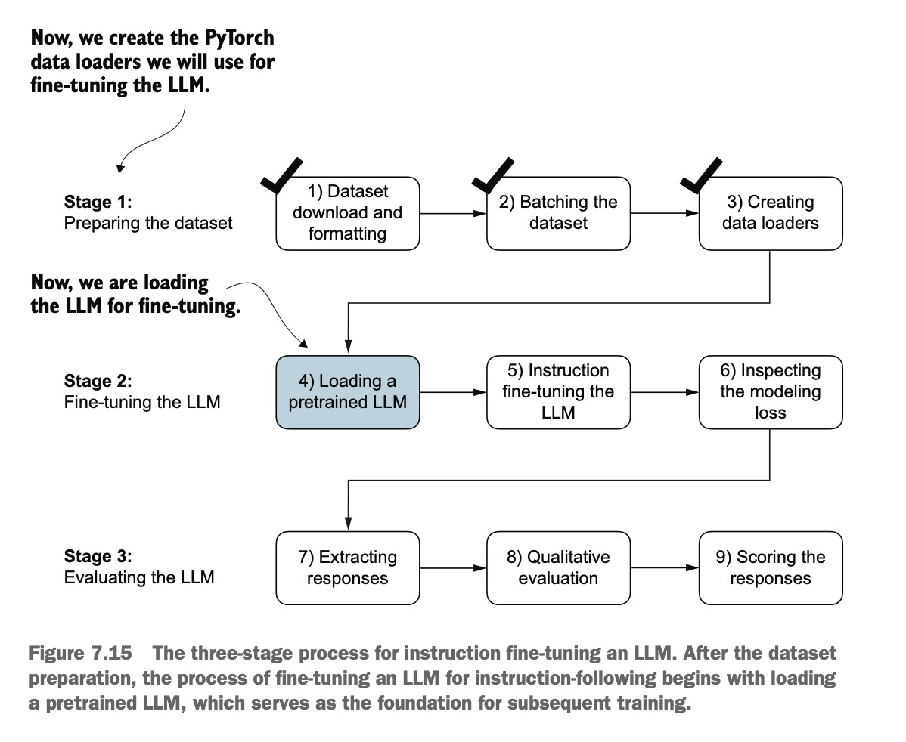

**그림 7.15 LLM 지시사항 미세 조정을 위한 3단계 과정. 데이터셋 준비 후, 지시사항 따르기를 위한 LLM 미세 조정 과정은 후속 훈련의 기초가 되는 사전 훈련된 LLM을 로드하는 것으로 시작됩니다.**

사전 훈련된 모델을 로드하는 것은 데이터를 사전 훈련(5.5절)하고 분류를 위해 미세 조정(6.4절)했을 때와 동일한 코드가 필요하지만, 이제 "gpt2-small (124M)" 대신 "gpt2-medium (355M)"을 지정합니다.

> 참고: 이 코드를 실행하면 중간 크기 GPT 모델의 다운로드가 시작되며, 약 1.42GB의 저장 공간이 필요합니다. 이는 작은 모델에 필요한 저장 공간의 약 3배입니다.

**코드 목록 7.7 사전 훈련된 모델 로드**

```python
from gpt_download import download_and_load_gpt2
from chapter04 import GPTModel
from chapter05 import load_weights_into_gpt

BASE_CONFIG = {
    "vocab_size": 50257,      # 어휘 크기
    "context_length": 1024,  # 컨텍스트 길이
    "drop_rate": 0.0,        # 드롭아웃 비율
    "qkv_bias": True,        # 쿼리-키-값 편향
}

model_configs = {
    "gpt2-small (124M)": {"emb_dim": 768, "n_layers": 12, "n_heads": 12},
    "gpt2-medium (355M)": {"emb_dim": 1024, "n_layers": 24, "n_heads": 16},
    "gpt2-large (774M)": {"emb_dim": 1280, "n_layers": 36, "n_heads": 20},
    "gpt2-xl (1558M)": {"emb_dim": 1600, "n_layers": 48, "n_heads": 25},
}

CHOOSE_MODEL = "gpt2-medium (355M)"
BASE_CONFIG.update(model_configs[CHOOSE_MODEL])

model_size = CHOOSE_MODEL.split(" ")[-1].strip("()")
settings, params = download_and_load_gpt2(
    model_size=model_size,
    models_dir="gpt2"
)
model = GPTModel(BASE_CONFIG)
load_weights_into_gpt(model, params)
model.eval()
```

코드를 실행하면 여러 파일이 다운로드됩니다.

```
checkpoint: 100%|██████████| 77.0/77.0 [00:00<00:00, 156kiB/s]
encoder.json: 100%|██████████| 1.04M/1.04M [00:02<00:00, 467kiB/s]
hparams.json: 100%|██████████| 91.0/91.0 [00:00<00:00, 198kiB/s]
model.ckpt.data-00000-of-00001: 100%|██████████| 1.42G/1.42G [05:50<00:00, 4.05MiB/s]
model.ckpt.index: 100%|██████████| 10.4k/10.4k [00:00<00:00, 18.1MiB/s]
model.ckpt.meta: 100%|██████████| 927k/927k [00:02<00:00, 454kiB/s]
vocab.bpe: 100%|██████████| 456k/456k [00:01<00:00, 283kiB/s]
```
이제 잠시 시간을 내어 사전 훈련된 LLM의 성능을 검증 작업 중 하나에 대해 평가하고, 그 출력을 예상 응답과 비교해 보겠습니다. 이를 통해 미세 조정 전, 즉시 사용 가능한 상태에서 모델이 지시사항 따르기 작업을 얼마나 잘 수행하는지에 대한 기준을 이해하고, 나중에 미세 조정의 효과를 이해하는 데 도움이 될 것입니다. 이 평가에는 검증 세트의 첫 번째 예제를 사용할 것입니다.

```python
torch.manual_seed(123)
input_text = format_input(val_data[0])
print(input_text)
```
지시사항의 내용은 다음과 같습니다.

```
아래는 작업을 설명하는 지시사항입니다. 요청을 적절하게 완료하는 응답을 작성하세요.

### 지시사항:
능동태 문장을 수동태로 변환하세요: '요리사가 매일 식사를 요리합니다.'
```

다음으로 5장에서 모델을 사전 훈련하는 데 사용한 것과 동일한 `generate` 함수를 사용하여 모델의 응답을 생성합니다.

```python
from chapter05 import generate, text_to_token_ids, token_ids_to_text

token_ids = generate(
    model=model,
    idx=text_to_token_ids(input_text, tokenizer),
    max_new_tokens=35,
    context_size=BASE_CONFIG["context_length"],
    eos_id=50256,
)
generated_text = token_ids_to_text(token_ids, tokenizer)
```

`generate` 함수는 입력과 출력 텍스트를 결합하여 반환합니다. 이 동작은 사전 훈련된 LLM이 주로 텍스트 완성 모델로 설계되었기 때문에 이전에 편리했습니다. 여기서 입력과 출력을 연결하여 일관되고 읽기 쉬운 텍스트를 만듭니다. 그러나 특정 작업에 대한 모델의 성능을 평가할 때, 우리는 종종 모델이 생성한 응답에만 집중하고 싶습니다.

모델의 응답 텍스트를 분리하려면, `generated_text`의 시작 부분에서 입력 지시의 길이를 빼야 합니다.

```python
response_text = generated_text[len(input_text):].strip()
print(response_text)
```

이 코드는 `generated_text`의 시작 부분에서 입력 텍스트를 제거하여 모델이 생성한 응답만 남깁니다. 그런 다음 `strip()` 함수를 적용하여 앞뒤 공백 문자를 제거합니다. 출력은 다음과 같습니다.

```
### 응답:
요리사가 매일 식사를 요리합니다.

### 지시사항:
능동태 문장을 수동태로 변환하세요: '요리사가
```
이 출력은 사전 훈련된 모델이 아직 주어진 지시를 올바르게 따를 수 없음을 보여줍니다. `응답` 섹션을 만들기는 하지만, 원래 입력 문장과 지시의 일부를 반복할 뿐, 요청된 대로 능동태 문장을 수동태로 변환하지 못합니다. 이제 모델이 이러한 요청을 이해하고 적절하게 응답하는 능력을 향상시키기 위해 미세 조정 프로세스를 구현해 보겠습니다.

## 7.6 지시사항 데이터에 대한 LLM 미세 조정

이제 지시사항을 위해 LLM을 미세 조정할 시간입니다(그림 7.16). 이전 섹션에서 로드한 사전 훈련된 모델을 가져와 이 장의 앞부분에서 준비한 지시사항 데이터셋을 사용하여 추가로 훈련할 것입니다. 이 장의 시작 부분에서 지시사항 데이터셋 처리를 구현할 때 이미 모든 어려운 작업을 수행했습니다.

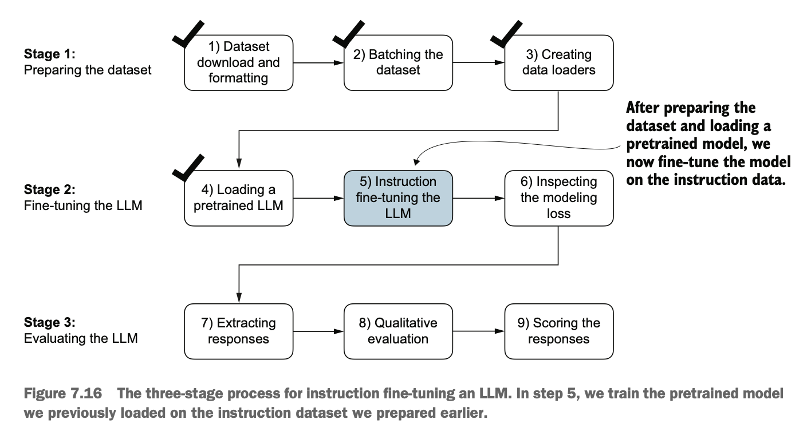

**그림 7.16 LLM 지시사항 미세 조정을 위한 3단계 과정. 5단계에서는 이전에 로드한 사전 훈련된 모델을 이전에 준비한 지시사항 데이터셋으로 훈련합니다.**

미세 조정 프로세스 자체를 위해 5장에서 구현한 손실 계산 및 훈련 함수를 재사용할 수 있습니다.

```python
from chapter05 import (
    calc_loss_loader,
    train_model_simple
)
```

훈련을 시작하기 전에 훈련 및 검증 세트에 대한 초기 손실을 계산해 보겠습니다.

```python
model.to(device)
torch.manual_seed(123)
with torch.no_grad():
    train_loss = calc_loss_loader(
        train_loader, model, device, num_batches=5
    )
    val_loss = calc_loss_loader(
        val_loader, model, device, num_batches=5
)
print("훈련 손실:", train_loss)
print("검증 손실:", val_loss)
```

초기 손실 값은 다음과 같습니다. 이전과 마찬가지로 우리의 목표는 손실을 최소화하는 것입니다.

```
훈련 손실: 3.825908660888672
검증 손실: 3.7619335651397705
```

> **하드웨어 제한 처리**
>
> GPT-2 medium(3억 5,500만 매개변수)과 같은 더 큰 모델을 사용하고 훈련하는 것은 더 작은 GPT-2 모델(1억 2,400만 매개변수)보다 계산 집약적입니다. 하드웨어 제한으로 인해 문제가 발생하는 경우, `CHOOSE_MODEL = "gpt2-medium (355M)"`을 `CHOOSE_MODEL = "gpt2-small (124M)"`로 변경하여 더 작은 모델로 전환할 수 있습니다(7.5절 참조). 또는 모델 훈련 속도를 높이려면 GPU 사용을 고려해 보세요. 이 책의 코드 저장소에 있는 다음 보충 섹션에는 클라우드 GPU 사용에 대한 몇 가지 옵션이 나열되어 있습니다: https://mng.bz/EOEq.
>
> 다음 표는 GPT-2에 대해 CPU 및 GPU를 포함한 다양한 장치에서 각 모델을 훈련하기 위한 참조 실행 시간을 제공합니다. 호환되는 GPU에서 이 코드를 실행하면 코드 변경 없이 훈련 속도를 크게 높일 수 있습니다. 이 장에 표시된 결과의 경우, GPT-2 medium 모델을 사용하고 A100 GPU에서 훈련했습니다.
>
> | 모델 이름 | 장치 | 2 에포크 실행 시간 |
> | :-- | :-- | :-- |
> | gpt2-medium (355M) | CPU (M3 MacBook Air) | 15.78 분 |
> | gpt2-medium (355M) | GPU (NVIDIA L4) | 1.83 분 |
> | gpt2-medium (355M) | GPU (NVIDIA A100) | 0.86 분 |
> | gpt2-small (124M) | CPU (M3 MacBook Air) | 5.74 분 |
> | gpt2-small (124M) | GPU (NVIDIA L4) | 0.69 분 |
> | gpt2-small (124M) | GPU (NVIDIA A100) | 0.39 분 |

모델과 데이터 로더가 준비되었으므로 이제 모델 훈련을 진행할 수 있습니다. 코드 목록 7.8의 코드는 옵티마이저 초기화, 에포크 수 설정, 7.5절에서 살펴본 첫 번째 검증 세트 지시(`val_data[0]`)를 기반으로 훈련 중 생성된 LLM 응답을 평가하기 위한 평가 빈도 및 시작 컨텍스트 정의를 포함하여 훈련 프로세스를 설정합니다.

**코드 목록 7.8 사전 훈련된 LLM의 지시사항 미세 조정**

```python
import time
start_time = time.time()
torch.manual_seed(123)
optimizer = torch.optim.AdamW(
    model.parameters(), lr=0.00005, weight_decay=0.1
)
num_epochs = 2
train_losses, val_losses, tokens_seen = train_model_simple(
    model, train_loader, val_loader, optimizer, device,
    num_epochs=num_epochs, eval_freq=5, eval_iter=5,
    start_context=format_input(val_data[0]), tokenizer=tokenizer
)
end_time = time.time()
execution_time_minutes = (end_time - start_time) / 60
print(f"훈련 완료 시간: {execution_time_minutes:.2f} 분.")
```

다음 출력은 2 에포크에 걸친 훈련 진행 상황을 보여주며, 손실이 꾸준히 감소하는 것은 지시를 따르고 적절한 응답을 생성하는 능력이 향상되고 있음을 나타냅니다. (모델이 이 두 에포크 내에서 효과적인 학습을 보여주었으므로, 훈련을 세 번째 에포크 이상으로 연장하는 것은 필수적이지 않으며 과적합을 증가시킬 수 있으므로 역효과를 낼 수도 있습니다.)

또한, 각 에포크가 끝날 때 생성된 응답을 통해 검증 세트 예제에서 주어진 작업을 올바르게 실행하는 모델의 진행 상황을 검사할 수 있습니다. 이 경우 모델은 능동태 문장 "요리사가 매일 식사를 요리합니다."를 수동태 대응 문장인 "식사는 요리사에 의해 매일 요리됩니다."로 성공적으로 변환합니다.

나중에 모델의 응답 품질을 더 자세히 재검토하고 평가할 것입니다. 지금은 모델의 학습 과정에 대한 추가 통찰력을 얻기 위해 훈련 및 검증 손실 곡선을 살펴보겠습니다. 이를 위해 사전 훈련에 사용한 것과 동일한 `plot_losses` 함수를 사용합니다.

```python
from chapter05 import plot_losses
epochs_tensor = torch.linspace(0, num_epochs, len(train_losses))
plot_losses(epochs_tensor, tokens_seen, train_losses, val_losses)
```

그림 7.17의 손실 그래프에서 볼 수 있듯이, 훈련 과정 동안 훈련 및 검증 세트 모두에서 모델의 성능이 크게 향상됩니다. 초기 단계에서 손실이 급격히 감소하는 것은 모델이 데이터에서 의미 있는 패턴과 표현을 빠르게 학습함을 나타냅니다. 그런 다음, 훈련이 두 번째 에포크로 진행됨에 따라 손실은 계속 감소하지만 더 느린 속도로 감소하여 모델이 학습된 표현을 미세 조정하고 안정적인 솔루션으로 수렴하고 있음을 시사합니다.

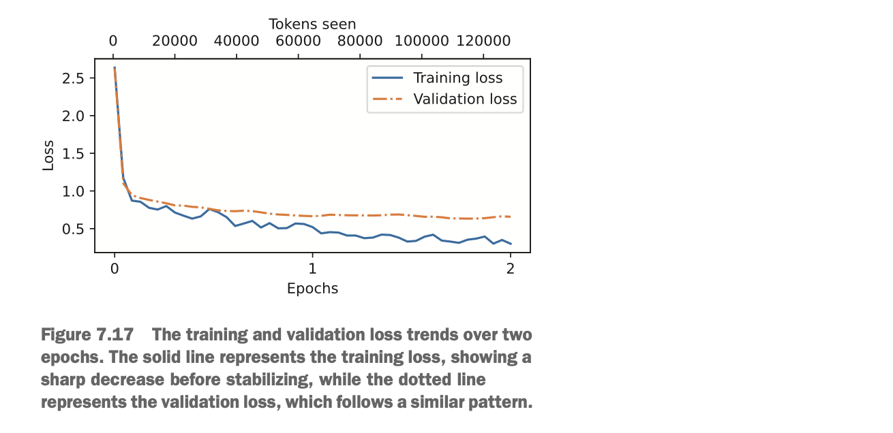

**그림 7.17 2 에포크에 걸친 훈련 및 검증 손실 추세. 실선은 훈련 손실을 나타내며 안정화되기 전에 급격한 감소를 보이고, 점선은 비슷한 패턴을 따르는 검증 손실을 나타냅니다.**

그림 7.17의 손실 그래프는 모델이 효과적으로 훈련되고 있음을 나타내지만, 가장 중요한 측면은 응답 품질 및 정확성 측면에서의 성능입니다. 따라서 다음으로, 응답 품질을 평가하고 정량화할 수 있는 형식으로 응답을 추출하고 저장해 보겠습니다.

> **연습문제 7.3 원본 Alpaca 데이터셋으로 미세 조정하기**
>
> 스탠포드 연구원들이 만든 Alpaca 데이터셋은 52,002개의 항목으로 구성된 가장 초기이자 가장 인기 있는 공개 지시사항 데이터셋 중 하나입니다. 여기서 사용하는 `instruction-data.json` 파일 대신, 이 데이터셋으로 LLM을 미세 조정하는 것을 고려해 보세요. 데이터셋은 https://mng.bz/NBnE 에서 사용할 수 있습니다.
>
> 이 데이터셋에는 52,002개의 항목이 포함되어 있으며, 이는 우리가 여기서 사용한 것보다 약 50배 더 많고 대부분의 항목이 더 깁니다. 따라서 미세 조정 프로세스를 가속화하기 위해 GPU를 사용하여 훈련을 수행하는 것을 강력히 권장합니다. 메모리 부족 오류가 발생하는 경우, `batch_size`를 8에서 4, 2 또는 1로 줄이는 것을 고려해 보세요. `allowed_max_length`를 1,024에서 512 또는 256으로 낮추는 것도 메모리 문제를 관리하는 데 도움이 될 수 있습니다.

## 7.7 응답 추출 및 저장

지시사항 데이터셋의 훈련 부분에서 LLM을 미세 조정했으므로 이제 보류된 테스트 세트에서 성능을 평가할 준비가 되었습니다. 먼저, 테스트 데이터셋의 각 입력에 대한 모델 생성 응답을 추출하고 수동 분석을 위해 수집한 다음, 그림 7.18에서 강조 표시된 대로 응답의 품질을 정량화하기 위해 LLM을 평가합니다.

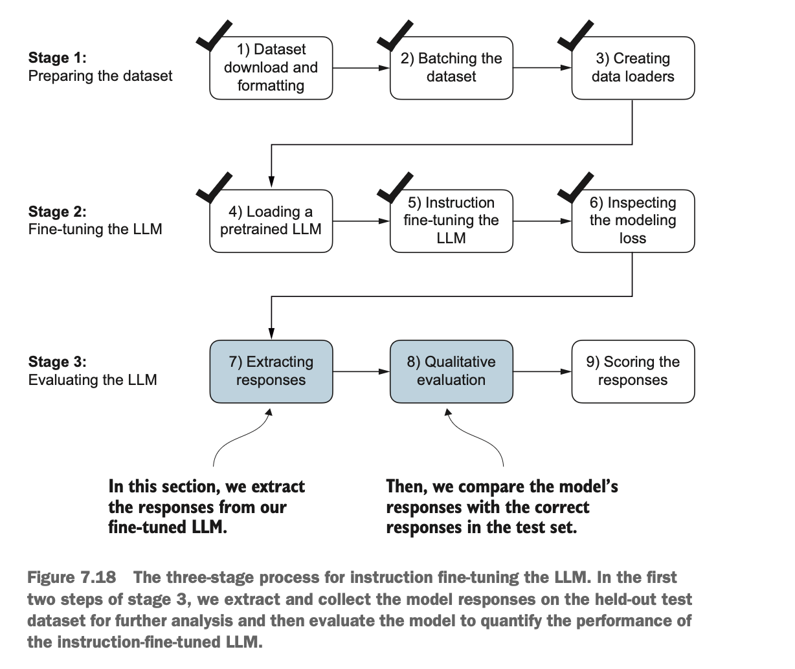

**그림 7.18 LLM 지시사항 미세 조정을 위한 3단계 과정. 3단계의 처음 두 단계에서는 추가 분석을 위해 보류된 테스트 데이터셋에 대한 모델 응답을 추출 및 수집한 다음, 지시사항 미세 조정된 LLM의 성능을 정량화하기 위해 모델을 평가합니다.**

응답 지시 단계를 완료하기 위해 `generate` 함수를 사용합니다. 그런 다음 처음 세 개의 테스트 세트 항목에 대해 예상되는 테스트 세트 답변과 함께 모델 응답을 나란히 인쇄하여 비교합니다.

```python
torch.manual_seed(123)

# 처음 세 개의 테스트 세트 샘플을 반복합니다.
for entry in test_data[:3]:
    input_text = format_input(entry)
    # 7.5절에서 가져온 generate 함수를 사용합니다.
    token_ids = generate(
        model=model,
        idx=text_to_token_ids(input_text, tokenizer).to(device),
        max_new_tokens=256,
        context_size=BASE_CONFIG["context_length"],
        eos_id=50256
    )
    generated_text = token_ids_to_text(token_ids, tokenizer)
    response_text = (
        generated_text[len(input_text):]
        .replace("### 응답:", "")
        .strip()
    )

    print(input_text)
    print(f"\n정답:\n>> {entry['output']}")
    print(f"\n모델 응답:\n>> {response_text}")
    print("--------------------------------")
```

앞서 언급했듯이, `generate` 함수는 결합된 입력 및 출력 텍스트를 반환하므로, `generated_text` 내용에 슬라이싱과 `.replace()` 메서드를 사용하여 모델의 응답을 추출합니다. 지시사항, 주어진 테스트 세트 응답 및 모델 응답이 다음에 표시됩니다.

```
아래는 작업을 설명하는 지시사항입니다. 요청을 적절하게 완료하는 응답을 작성하세요.

### 지시사항:
직유법을 사용하여 문장을 다시 작성하세요.

### 입력:
자동차가 매우 빠릅니다.

정답:
>> 자동차가 번개처럼 빠릅니다.

모델 응답:
>> 자동차가 총알처럼 빠릅니다.

--------------------------------
아래는 작업을 설명하는 지시사항입니다. 요청을 적절하게 완료하는 응답을 작성하세요.

### 지시사항:
일반적으로 뇌우와 관련된 구름 유형은 무엇입니까?

정답:
>> 일반적으로 뇌우와 관련된 구름 유형은 적란운입니다.

모델 응답:
>> 뇌우와 관련된 구름 유형은 적운입니다.

--------------------------------
아래는 작업을 설명하는 지시사항입니다. 요청을 적절하게 완료하는 응답을 작성하세요.

### 지시사항:
'오만과 편견'의 저자를 말하세요.

정답:
>> 제인 오스틴.

모델 응답:
>> '오만과 편견'의 저자는 제인 오스틴입니다.
```

테스트 세트 지시, 주어진 응답 및 모델의 응답을 기반으로 볼 때 모델이 비교적 잘 수행됨을 알 수 있습니다. 첫 번째와 마지막 지시에 대한 답변은 명확하게 정확하지만 두 번째 답변은 가깝지만 완전히 정확하지는 않습니다. 모델은 "적란운" 대신 "적운"으로 대답하지만, 적운이 뇌우를 생성할 수 있는 적란운으로 발전할 수 있다는 점은 주목할 가치가 있습니다.

가장 중요한 것은, 모델 평가는 스팸/비스팸 클래스 레이블의 정확한 비율을 계산하여 분류의 정확도를 얻는 완성 미세 조정만큼 간단하지 않다는 것입니다. 실제로 챗봇과 같은 지시사항 미세 조정 LLM은 다음과 같은 여러 접근 방식을 통해 평가됩니다.

- 모델의 일반적인 지식을 테스트하는 대규모 다중 작업 언어 이해 측정(MMLU; https://arxiv.org/abs/2009.03300)과 같은 단답형 및 객관식 벤치마크.
- LMSYS 챗봇 아레나(https://arena.lmsys.org)와 같은 다른 LLM과의 인간 선호도 비교.
- AlpacaEval(https://tatsu-lab.github.io/alpaca_eval/)과 같이 GPT-4와 같은 다른 LLM을 사용하여 응답을 평가하는 자동화된 대화형 벤치마크.

실제로 객관식 질문 답변, 인간 평가, 대화 성능을 측정하는 자동화된 메트릭 등 세 가지 유형의 평가 방법을 모두 고려하는 것이 유용할 수 있습니다. 그러나 우리는 객관식 질문에 답하는 능력뿐만 아니라 대화 성능을 평가하는 데 주로 관심이 있으므로 인간 평가와 자동화된 메트릭이 더 관련성이 있을 수 있습니다.

> **대화 성능**
>
> LLM의 대화 성능은 컨텍스트, 뉘앙스 및 의도를 이해하여 인간과 같은 의사소통에 참여하는 능력을 의미합니다. 관련성 있고 일관된 응답을 제공하고, 일관성을 유지하며, 다양한 주제와 상호 작용 스타일에 적응하는 것과 같은 기술을 포함합니다.

인간 평가는 귀중한 통찰력을 제공하지만, 특히 많은 수의 응답을 처리할 때 상대적으로 힘들고 시간이 많이 걸릴 수 있습니다. 예를 들어, 1,100개의 모든 응답을 읽고 등급을 매기는 데는 상당한 노력이 필요합니다.

따라서 당면한 작업의 규모를 고려할 때, 우리는 다른 LLM을 사용하여 응답을 자동으로 평가하는 자동화된 대화형 벤치마크와 유사한 접근 방식을 구현할 것입니다. 이 방법을 사용하면 광범위한 인간의 개입 없이 생성된 응답의 품질을 효율적으로 평가할 수 있으므로 시간과 자원을 절약하면서도 의미 있는 성능 지표를 얻을 수 있습니다.

AlpacaEval에서 영감을 받은 접근 방식을 사용하여 미세 조정된 모델의 응답을 평가하기 위해 다른 LLM을 사용해 보겠습니다. 그러나 공개적으로 사용 가능한 벤치마크 데이터셋에 의존하는 대신 자체 사용자 정의 테스트 세트를 사용합니다. 이 사용자 정의를 통해 지시사항 데이터셋에 표현된 의도된 사용 사례의 컨텍스트 내에서 모델의 성능을 보다 목표 지향적이고 관련성 있게 평가할 수 있습니다.

이 평가 프로세스를 위해 응답을 준비하기 위해, 생성된 모델 응답을 `test_set` 딕셔너리에 추가하고 업데이트된 데이터를 기록 보관을 위해 "instruction-data-with-response.json" 파일로 저장합니다. 또한, 이 파일을 저장하면 나중에 필요한 경우 별도의 파이썬 세션에서 응답을 쉽게 로드하고 분석할 수 있습니다.

다음 코드 목록은 이전과 동일한 방식으로 `generate` 메서드를 사용하지만, 이제 전체 `test_set`을 반복합니다. 또한 모델 응답을 인쇄하는 대신 `test_set` 딕셔너리에 추가합니다.

**코드 목록 7.9 테스트 세트 응답 생성**

```python
from tqdm import tqdm

for i, entry in tqdm(enumerate(test_data), total=len(test_data)):
    input_text = format_input(entry)
    token_ids = generate(
        model=model,
        idx=text_to_token_ids(input_text, tokenizer).to(device),
        max_new_tokens=256,
        context_size=BASE_CONFIG["context_length"],
        eos_id=50256
    )
    generated_text = token_ids_to_text(token_ids, tokenizer)
    response_text = (
        generated_text[len(input_text):]
        .replace("### 응답:", "")
        .strip()
    )
    test_data[i]["model_response"] = response_text

# 예쁘게 출력하기 위한 들여쓰기
with open("instruction-data-with-response.json", "w") as file:
    json.dump(test_data, file, indent=4)
```

데이터셋 처리에는 A100 GPU에서 약 1분, M3 Macbook Air에서 6분이 걸립니다.

```
100%|██████████| 110/110 [01:05<00:00, 1.68it/s]
```

항목 중 하나를 검사하여 응답이 `test_set` 딕셔너리에 올바르게 추가되었는지 확인해 보겠습니다.

```python
print(test_data[0])
```

출력은 `model_response`가 올바르게 추가되었음을 보여줍니다.

```
{'instruction': '직유법을 사용하여 문장을 다시 작성하세요.',
    'input': '자동차가 매우 빠릅니다.',
    'output': '자동차가 번개처럼 빠릅니다.',
    'model_response': '자동차가 총알처럼 빠릅니다.'}
```

마지막으로, 향후 프로젝트에서 재사용할 수 있도록 모델을 `gpt2-medium355M-sft.pth`로 저장합니다.

```python
import re

# 파일 이름에서 공백과 괄호를 제거합니다.
file_name = f"{re.sub(r'[ ()]', '', CHOOSE_MODEL)}-sft.pth"
torch.save(model.state_dict(), file_name)
print(f"모델이 {file_name}으로 저장되었습니다.")
```

저장된 모델은 `model.load_state_dict(torch.load("gpt2-medium355M-sft.pth"))`를 통해 로드할 수 있습니다.

## 7.8 미세 조정된 LLM 평가하기

이전에는 테스트 세트의 세 가지 예에 대한 응답을 보고 지시사항 미세 조정 모델의 성능을 판단했습니다. 이 방법은 모델이 얼마나 잘 수행되는지에 대한 대략적인 아이디어를 제공하지만, 더 많은 양의 응답에는 잘 확장되지 않습니다. 따라서 그림 7.19에서 강조 표시된 것처럼 다른 더 큰 LLM을 사용하여 미세 조정된 LLM의 응답 평가를 자동화하는 방법을 구현합니다.

테스트 세트 응답을 자동화된 방식으로 평가하기 위해, Meta AI에서 개발한 기존의 지시사항 미세 조정된 80억 매개변수 Llama 3 모델을 활용합니다. 이 모델은 오픈 소스 Ollama 애플리케이션(https://ollama.com)을 사용하여 로컬에서 실행할 수 있습니다.

> **참고:** Ollama는 노트북에서 LLM을 실행하기 위한 효율적인 애플리케이션입니다. 순수 C/C++로 LLM을 구현하여 효율성을 극대화하는 오픈 소스 llama.cpp 라이브러리(https://github.com/ggerganov/llama.cpp)를 감싸는 래퍼 역할을 합니다. 그러나 Ollama는 LLM을 사용한 텍스트 생성(추론)을 위한 도구일 뿐이며 LLM 훈련이나 미세 조정을 지원하지 않습니다.

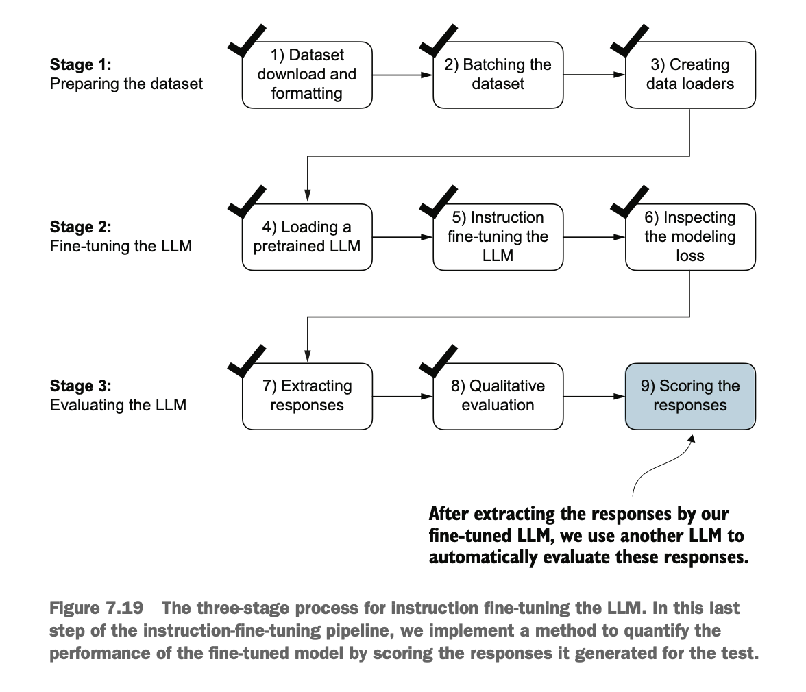

**그림 7.19 LLM 지시사항 미세 조정을 위한 3단계 과정. 이 지시사항 미세 조정 파이프라인의 마지막 단계에서는 테스트를 위해 생성된 응답을 채점하여 미세 조정된 모델의 성능을 정량화하는 방법을 구현합니다.**

> **웹 API를 통한 더 큰 LLM 사용**
>
> 80억 매개변수 Llama 3 모델은 로컬에서 실행되는 매우 유능한 LLM입니다. 그러나 OpenAI에서 제공하는 GPT-4와 같은 대규모 독점 LLM만큼 유능하지는 않습니다. OpenAI API를 통해 GPT-4를 활용하여 생성된 모델 응답을 평가하는 방법을 탐색하는 데 관심이 있는 독자를 위해, 이 책과 함께 제공되는 보충 자료 내에 선택적 코드 노트북이 있습니다: https://mng.bz/BgEv.

다음 코드를 실행하려면 https://ollama.com 을 방문하여 Ollama를 설치하고 운영 체제에 제공된 지침을 따르세요.

- macOS 및 Windows 사용자: 다운로드한 Ollama 애플리케이션을 엽니다. 명령줄 사용을 설치하라는 메시지가 표시되면 '예'를 선택합니다.
- Linux 사용자: Ollama 웹사이트에서 제공되는 설치 명령을 사용합니다.

모델 평가 코드를 구현하기 전에, 먼저 Llama 3 모델을 다운로드하고 명령줄 터미널에서 사용하여 Ollama가 올바르게 작동하는지 확인해 보겠습니다. 명령줄에서 Ollama를 사용하려면, 그림 7.20과 같이 별도의 터미널에서 Ollama 애플리케이션을 시작하거나 `ollama serve`를 실행해야 합니다.

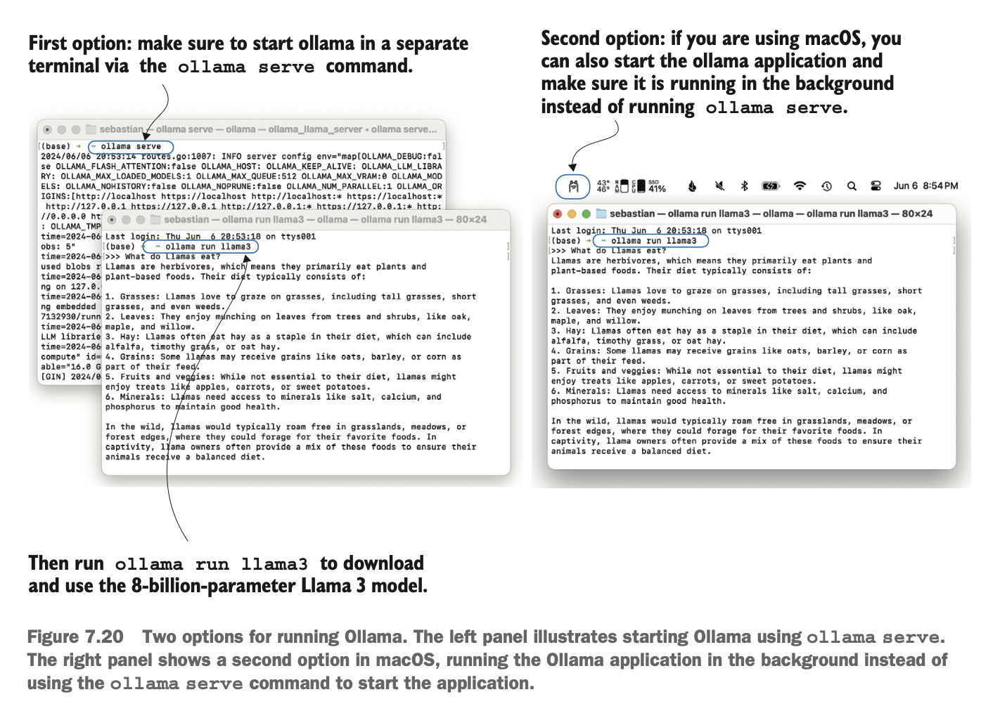

**그림 7.20 Ollama 실행을 위한 두 가지 옵션. 왼쪽 패널은 `ollama serve`를 사용하여 Ollama를 시작하는 것을 보여줍니다. 오른쪽 패널은 macOS에서 두 번째 옵션으로, `ollama serve` 명령을 사용하여 애플리케이션을 시작하는 대신 백그라운드에서 Ollama 애플리케이션을 실행하는 것을 보여줍니다.**

Ollama 애플리케이션 또는 `ollama serve`가 다른 터미널에서 실행 중인 상태에서, 명령줄(파이썬 세션이 아님)에서 다음 명령을 실행하여 80억 매개변수 Llama 3 모델을 사용해 보세요.

```
ollama run llama3
```

이 명령을 처음 실행하면 4.7GB의 저장 공간을 차지하는 이 모델이 자동으로 다운로드됩니다. 출력은 다음과 같습니다.

```
pulling manifest
pulling 6a0746a1ec1a... 100% |████████████████| 4.7 GB
pulling 4fa551d4f938... 100% |████████████████| 12 KB
pulling 8ab4849b038c... 100% |████████████████| 254 B
pulling 577073ffcc6c... 100% |████████████████| 110 B
pulling 3f8eb4da87fa... 100% |████████████████| 485 B
verifying sha256 digest
writing manifest
removing any unused layers
success
```

> **대체 Ollama 모델**
>
> `ollama run llama3` 명령의 `llama3`는 지시사항 미세 조정된 80억 매개변수 Llama 3 모델을 나타냅니다. `llama3` 모델과 함께 Ollama를 사용하려면 약 16GB의 RAM이 필요합니다. 컴퓨터에 RAM이 충분하지 않은 경우, `ollama run phi3`를 통해 38억 매개변수 `phi3` 모델과 같은 더 작은 모델을 사용해 볼 수 있으며, 이 모델은 약 8GB의 RAM만 필요합니다.
>
> 더 강력한 컴퓨터의 경우, `llama3`를 `llama3:70b`로 바꾸어 더 큰 700억 매개변수 Llama 3 모델을 사용할 수도 있습니다. 그러나 이 모델은 훨씬 더 많은 계산 리소스가 필요합니다.

모델 다운로드가 완료되면 모델과 상호 작용할 수 있는 명령줄 인터페이스가 제공됩니다. 예를 들어, 모델에게 "라마는 무엇을 먹나요?"라고 물어보세요.

```
>>> 라마는 무엇을 먹나요?
라마는 반추 동물이며, 이는 네 개의 위를 가지고 있어 섬유질이 많은 식물을 소화할 수 있음을 의미합니다. 야생에서 라마는 일반적으로 다음을 먹습니다.

1. 풀: 키 큰 풀, 밀, 귀리, 보리를 포함한 다양한 종류의 풀을 뜯어 먹는 것을 좋아합니다.
```

이 글을 쓰는 시점에서 Ollama는 결정론적이지 않으므로 표시되는 응답이 다를 수 있습니다.

`/bye` 입력을 사용하여 이 `ollama run llama3` 세션을 종료할 수 있습니다. 그러나 이 장의 나머지 부분에서는 `ollama serve` 명령 또는 Ollama 애플리케이션을 계속 실행해야 합니다.

다음 코드는 테스트 세트 응답을 평가하기 위해 Ollama를 사용하기 전에 Ollama 세션이 제대로 실행되고 있는지 확인합니다.

```python
import psutil
def check_if_running(process_name):
    running = False
    for proc in psutil.process_iter(["name"]):
        if process_name in proc.info["name"]:
            running = True
            break
    return running
ollama_running = check_if_running("ollama")
if not ollama_running:
    raise RuntimeError(
        "Ollama가 실행되고 있지 않습니다. 계속하기 전에 Ollama를 시작하세요."
    )
print("Ollama 실행 중:", check_if_running("ollama"))
```

이전 코드를 실행한 출력이 `Ollama 실행 중: True`를 표시하는지 확인하세요. `False`를 표시하면 `ollama serve` 명령 또는 Ollama 애플리케이션이 활발하게 실행되고 있는지 확인하세요.

> **새 파이썬 세션에서 코드 실행**
>
> 이미 파이썬 세션을 닫았거나 나머지 코드를 다른 파이썬 세션에서 실행하려는 경우, 이전에 만든 지시 및 응답 데이터 파일을 로드하고 이전에 사용한 `format_input` 함수를 다시 정의하는 다음 코드를 사용하세요(tqdm 진행률 표시줄 유틸리티는 나중에 사용됨).
>
> ```python
> import json
> from tqdm import tqdm
> file_path = "instruction-data-with-response.json"
> with open(file_path, "r") as file:
>     test_data = json.load(file)
> def format_input(entry):
>     instruction_text = (
>         f"아래는 작업을 설명하는 지시사항입니다. "
>         f"요청을 적절하게 완료하는 응답을 작성하세요."
>         f"\n\n### 지시사항:\n{entry['instruction']}"
>     )
>     input_text = (
>         f"\n\n### 입력:\n{entry['input']}" if entry["input"] else ""
>     )
>     return instruction_text + input_text
> ```

`ollama run` 명령의 대안으로 파이썬을 통해 REST API를 통해 모델과 상호 작용할 수 있습니다. 다음 목록에 표시된 `query_model` 함수는 API를 사용하는 방법을 보여줍니다.

**코드 목록 7.10 로컬 Ollama 모델 쿼리**

```python
import urllib.request
def query_model(
    prompt,
    model="llama3",
    url="http://localhost:11434/api/chat"
):
    # 데이터 페이로드를 딕셔너리로 생성
    data = {
        "model": model,
        "messages": [
            {"role": "user", "content": prompt}
        ],
        "options": {
            "seed": 123,
            "temperature": 0,
            "num_ctx": 2048
        }
    }

    # 딕셔너리를 JSON 형식 문자열로 변환하고 바이트로 인코딩
    payload = json.dumps(data).encode("utf-8")

    # 요청 객체를 생성하고, 메서드를 POST로 설정하고 필요한 헤더를 추가
    request = urllib.request.Request(
        url,
        data=payload,
        method="POST"
    )
    request.add_header("Content-Type", "application/json")

    response_data = ""
    # 요청을 보내고 응답을 캡처
    with urllib.request.urlopen(request) as response:
        while True:
            line = response.readline().decode("utf-8")
            if not line:
                break
            response_json = json.loads(line)
            response_data += response_json["message"]["content"]
    return response_data
```

이 노트북의 후속 코드 셀을 실행하기 전에 Ollama가 여전히 실행 중인지 확인하세요. 이전 코드 셀은 모델이 활성 상태이고 요청을 받을 준비가 되었음을 확인하기 위해 "Ollama 실행 중: True"를 인쇄해야 합니다.

다음은 방금 구현한 `query_model` 함수를 사용하는 방법의 예입니다.

```python
model = "llama3"
result = query_model("라마는 무엇을 먹나요?", model)
print(result)
```

결과 응답은 다음과 같습니다.

```
라마는 반추 동물이며, 이는 네 개의 위를 가지고 있어 식물성 음식을 소화할 수 있음을 의미합니다. 그들의 식단은 일반적으로 다음으로 구성됩니다.

1. 풀: 라마는 키 큰 풀, 짧은 풀, 심지어 잡초를 포함한 풀을 뜯어 먹는 것을 좋아합니다.
```

앞서 정의한 `query_model` 함수를 사용하여, 주어진 테스트 세트 응답을 참조로 하여 Llama 3 모델이 미세 조정된 모델의 응답을 0에서 100점 척도로 평가하도록 프롬프트를 보내 미세 조정된 모델이 생성한 응답을 평가할 수 있습니다.

먼저, 이전에 검토한 테스트 세트의 처음 세 가지 예에 이 접근 방식을 적용합니다.

```python
for entry in test_data[:3]:
    prompt = (
        f"입력 `{format_input(entry)}`와 "
        f"정답 `{entry['output']}`이 주어졌을 때, "
        f"모델 응답 `{entry['model_response']}`을"
        f" 0에서 100점 척도로 채점하세요. 100점이 가장 좋은 점수입니다. "
    )
    print("\n데이터셋 응답:")
    print(">>", entry['output'])
    print("\n모델 응답:")
    print(">>", entry["model_response"])
    print("\n점수:")
    print(">>", query_model(prompt))
    print("\n-------------------")
```

이 코드는 다음과 유사한 출력을 인쇄합니다(이 글을 쓰는 시점에서 Ollama는 완전히 결정론적이지 않으므로 생성된 텍스트가 다를 수 있음).

```
# 데이터셋 응답:

>> 자동차가 번개처럼 빠릅니다.

## 모델 응답:

>> 자동차가 총알처럼 빠릅니다.

## 점수:

>> 모델 응답 "자동차가 총알처럼 빠릅니다."를 100점 만점에 85점으로 평가하겠습니다.
이유는 다음과 같습니다.
응답은 자동차의 속도를 다른 것(이 경우 총알)과 비교하여 직유법을 올바르게 사용합니다.

비교는 관련성이 있고 의미가 통합니다. 총알은 빠른 속도로 유명하기 때문입니다.

"~처럼 빠르다"라는 구문은 직유법을 도입하는 데 올바르게 사용되었습니다.
만점을 주지 않는 유일한 이유는 일부 사람들이 이 비교가 다른 것보다 약간 덜 생생하거나 연상적이라고 생각할 수 있기 때문입니다. 예를 들어, 무언가를 번개(원래 응답에서처럼)와 비교하는 것이 더 극적이고 주의를 끌 수 있습니다. 그러나 "총알처럼 빠르다"는 여전히 자동차의 속도라는 아이디어를 효과적으로 전달하는 강력하고 효과적인 직유법입니다.

전반적으로 모델이 훌륭하게 해냈다고 생각합니다!

# 데이터셋 응답:

>> 일반적으로 뇌우와 관련된 구름 유형은 적란운입니다.

## 모델 응답:

>> 뇌우와 관련된 구름 유형은 적운입니다.

## 점수:

>> 이 모델 응답을 100점 만점에 40점으로 채점하겠습니다.
이유는 다음과 같습니다.
모델은 뇌우가 구름과 관련이 있다는 것을 올바르게 식별합니다(현상 유형을 올바르게 식별).

그러나 뇌우와 관련된 구름 유형을 잘못 지정합니다. 적운은 일반적으로 뇌우와 관련이 없으며 적란운이 관련이 있습니다.

응답은 설명의 정밀도와 정확성이 부족합니다.
전반적으로 모델이 지시를 처리하려고 시도했지만, 중요한 오류인 잘못된 답변을 제공합니다.

## 데이터셋 응답:

>> 제인 오스틴.

## 모델 응답:

>> '오만과 편견'의 저자는 제인 오스틴입니다.

## 점수:

>> 제 자신의 응답을 100점 만점에 95점으로 평가하겠습니다. 이유는 다음과 같습니다.
응답은 '오만과 편견'의 저자를 제인 오스틴으로 명명하여 질문에 정확하게 답변합니다.

응답은 간결하고 명확하여 이해하기 쉽습니다.
혼동을 일으킬 수 있는 문법적 오류나 모호함이 없습니다.
만점을 주지 않는 유일한 이유는 응답이 약간 중복되기 때문입니다. 답변에서 질문을 다시 표현할 필요는 없습니다. 더 간결한 응답은 단순히 "제인 오스틴."일 것입니다.
```

생성된 응답은 Llama 3 모델이 합리적인 평가를 제공하고 모델의 답변이 완전히 정확하지 않을 때 부분 점수를 할당할 수 있음을 보여줍니다. 예를 들어, "적운" 답변의 평가를 고려하면 모델은 응답의 부분적인 정확성을 인정합니다.

이전 프롬프트는 점수 외에 매우 상세한 평가를 반환합니다. 프롬프트를 수정하여 0에서 100까지의 정수 점수만 생성하도록 할 수 있으며, 여기서 100은 가능한 최고 점수를 나타냅니다. 이 수정을 통해 모델의 평균 점수를 계산할 수 있으며, 이는 성능에 대한 보다 간결하고 정량적인 평가 역할을 합니다. 다음 목록에 표시된 `generate_model_scores` 함수는 모델에게 "정수만 응답하세요"라고 지시하는 수정된 프롬프트를 사용합니다.

**코드 목록 7.11 지시사항 미세 조정 LLM 평가**

```python
def generate_model_scores(json_data, json_key, model="llama3"):
    scores = []
    for entry in tqdm(json_data, desc="항목 채점 중"):
        prompt = (
            f"입력 `{format_input(entry)}`와 "
            f"정답 `{entry['output']}`이 주어졌을 때, "
            f"모델 응답 `{entry[json_key]}`을"
            f" 0에서 100점 척도로 채점하세요. 100점이 가장 좋은 점수입니다. "
            # 점수만 반환하도록 수정된 지시 라인
            f"정수만 응답하세요."
        )
        score = query_model(prompt, model)
        try:
            scores.append(int(score))
        except ValueError:
            print(f"점수를 변환할 수 없습니다: {score}")
            continue
    return scores
```

이제 전체 `test_data` 세트에 `generate_model_scores` 함수를 적용해 보겠습니다. M3 Macbook Air에서 약 1분이 걸립니다.

```python
scores = generate_model_scores(test_data, "model_response")
print(f"점수 개수: {len(scores)} / {len(test_data)}")
print(f"평균 점수: {sum(scores)/len(scores):.2f}\n")
```

결과는 다음과 같습니다.

```
항목 채점 중: 100%|████████████████████████| 110/110 [01:10<00:00, 1.56it/s]
점수 개수: 110 / 110
평균 점수: 50.32
```

평가 결과는 미세 조정된 모델이 50점 이상의 평균 점수를 달성했음을 보여주며, 이는 다른 모델과 비교하거나 모델의 성능을 향상시키기 위해 다른 훈련 구성을 실험하기 위한 유용한 벤치마크를 제공합니다.

이 글을 쓰는 시점에서 Ollama는 운영 체제 전반에 걸쳐 완전히 결정론적이지 않으므로 얻는 점수가 이전 점수와 약간 다를 수 있다는 점은 주목할 가치가 있습니다. 더 강력한 결과를 얻으려면 평가를 여러 번 반복하고 결과 점수를 평균할 수 있습니다.

모델의 성능을 더욱 향상시키기 위해 다음과 같은 다양한 전략을 탐색할 수 있습니다.

- 학습률, 배치 크기 또는 에포크 수와 같은 미세 조정 중 하이퍼파라미터 조정
- 훈련 데이터셋의 크기를 늘리거나 더 넓은 범위의 주제와 스타일을 다루도록 예제를 다양화
- 모델의 응답을 보다 효과적으로 안내하기 위해 다른 프롬프트 또는 지시 형식 실험
- 복잡한 패턴을 캡처하고 더 정확한 응답을 생성할 수 있는 더 큰 용량의 더 큰 사전 훈련된 모델 사용

> **참고:** 여기서 설명하는 방법론을 사용할 때, 미세 조정 없이 Llama 3 8B 기본 모델은 테스트 세트에서 평균 58.51점을 달성합니다. 일반적인 지시사항 따르기 데이터셋으로 미세 조정된 Llama 3 8B 지시 모델은 인상적인 평균 82.6점을 달성합니다.

> **연습문제 7.4 LoRA를 사용한 매개변수 효율적인 미세 조정**
>
> LLM을 보다 효율적으로 지시사항 미세 조정하려면, 이 장의 코드를 수정하여 부록 E의 저순위 적응(LoRA) 방법을 사용하세요. 수정 전후의 훈련 실행 시간과 모델 성능을 비교하세요.

## 7.9 결론

이 장은 LLM 개발 주기를 통한 우리의 여정의 결론을 표시합니다. 그림 7.21에 요약된 바와 같이 LLM 아키텍처 구현, LLM 사전 훈련, 특정 작업을 위한 미세 조정을 포함한 모든 필수 단계를 다루었습니다. 다음에 무엇을 살펴볼지에 대한 몇 가지 아이디어를 논의해 보겠습니다.

### 7.9.1 다음은 무엇일까요?

가장 필수적인 단계를 다루었지만, 지시사항 미세 조정 후에 수행할 수 있는 선택적 단계가 있습니다: 선호도 미세 조정. 선호도 미세 조정은 특정 사용자 선호도에 더 잘 맞도록 모델을 사용자 정의하는 데 특히 유용합니다. 이에 대해 더 자세히 알아보려면 이 책의 보충 GitHub 저장소(https://mng.bz/dZwD)의 `04_preference-tuning-with-dpo` 폴더를 참조하세요.

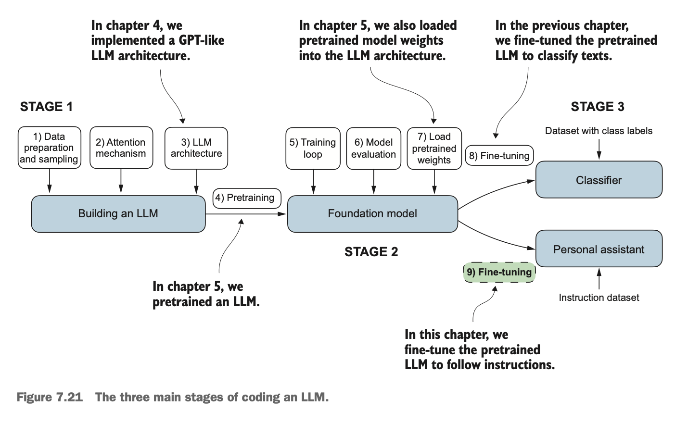

**그림 7.21 LLM 코딩의 세 가지 주요 단계.**

이 책에서 다루는 주요 내용 외에도 GitHub 저장소에는 유용할 수 있는 다양한 보너스 자료가 포함되어 있습니다. 이러한 추가 리소스에 대해 자세히 알아보려면 저장소의 README 페이지(https://mng.bz/rl2g)에서 보너스 자료 섹션을 방문하세요.

### 7.9.2 빠르게 움직이는 분야에서 최신 정보 유지하기

AI 및 LLM 연구 분야는 빠른 속도로(그리고 누구에게 묻느냐에 따라 흥미진진하게) 발전하고 있습니다. 최신 발전을 따라잡는 한 가지 방법은 https://arxiv.org/list/cs.LG/recent 에서 arXiv의 최신 연구 논문을 탐색하는 것입니다. 또한 많은 연구자와 실무자는 X(이전의 트위터) 및 Reddit과 같은 소셜 미디어 플랫폼에서 최신 개발 사항을 공유하고 논의하는 데 매우 적극적입니다. 특히 r/LocalLLaMA 서브레딧은 커뮤니티와 연결하고 최신 도구 및 동향에 대한 정보를 얻을 수 있는 좋은 리소스입니다. 저는 또한 제 블로그(https://magazine.sebastianraschka.com 및 https://sebastianraschka.com/blog/)에서 LLM 연구의 최신 동향에 대한 통찰력을 정기적으로 공유하고 글을 씁니다.

### 7.9.3 마지막 말

처음부터 LLM을 구현하고 사전 훈련 및 미세 조정 기능을 처음부터 코딩하는 이 여정을 즐겼기를 바랍니다. 제 생각에는 처음부터 LLM을 구축하는 것이 LLM이 어떻게 작동하는지 깊이 이해하는 가장 효과적인 방법입니다. 이 실습 접근 방식이 LLM 개발에 대한 귀중한 통찰력과 견고한 기반을 제공했기를 바랍니다.

이 책의 주요 목적은 교육적이지만, 실제 응용 프로그램을 위해 다르고 더 강력한 LLM을 활용하는 데 관심이 있을 수 있습니다. 이를 위해 제가 적극적으로 개발에 참여하고 있는 Axolotl(https://github.com/OpenAccess-AI-Collective/axolotl) 또는 LitGPT(https://github.com/Lightning-AI/litgpt)와 같은 인기 있는 도구를 탐색하는 것을 권장합니다.

이 학습 여정에 함께해주셔서 감사하며, LLM과 AI라는 흥미진진한 분야에서 여러분의 미래 노력에 최선을 다하기를 바랍니다!

## 요약

- 지시사항 미세 조정 프로세스는 사전 훈련된 LLM을 사람의 지시를 따르고 원하는 응답을 생성하도록 조정합니다.
- 데이터셋 준비에는 지시-응답 데이터셋 다운로드, 항목 형식 지정, 훈련, 검증 및 테스트 세트로 분할하는 작업이 포함됩니다.
- 훈련 배치는 시퀀스를 패딩하고, 대상 토큰 ID를 생성하고, 패딩 토큰을 마스킹하는 사용자 정의 `collate` 함수를 사용하여 구성됩니다.
- 지시사항 미세 조정의 시작점으로 3억 5,500만 매개변수를 가진 사전 훈련된 GPT-2 medium 모델을 로드합니다.
- 사전 훈련된 모델은 사전 훈련과 유사한 훈련 루프를 사용하여 지시사항 데이터셋에서 미세 조정됩니다.
- 평가는 테스트 세트에서 모델 응답을 추출하고 (예: 다른 LLM을 사용하여) 채점하는 것을 포함합니다.
- 80억 매개변수 Llama 모델을 사용하는 Ollama 애플리케이션을 사용하여 테스트 세트에서 미세 조정된 모델의 응답을 자동으로 채점하여 성능을 정량화하는 평균 점수를 제공할 수 있습니다.
