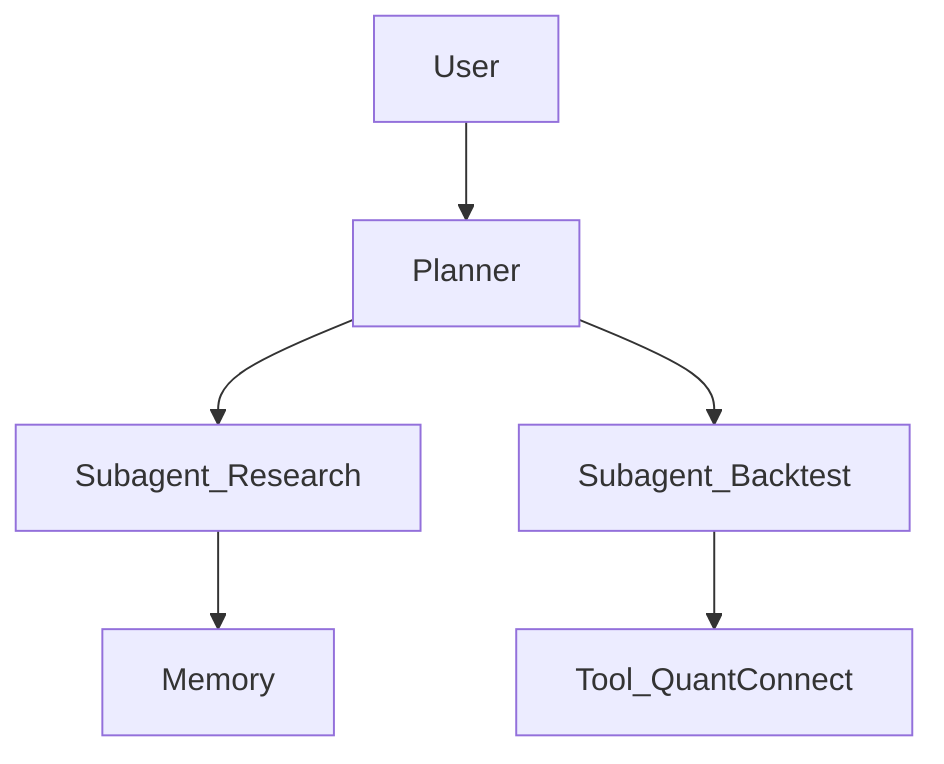

# [구현] Deep Agents — {{프로젝트/기능명}}

> ds4th study · Deep Agents 파트 · 구현 공유

## 메타 정보

| 항목 | 내용 |
|---|---|
| 공유 일자 | YYYY-MM-DD (토) 21:30 |
| 발표자 | {{이름}} |
| 다룬 학습 분량 | 어떤 이론 회차의 내용을 활용했는가 |
| 코드 위치 | `./` 또는 외부 저장소 링크 |

## 1. 구현 목표

* **무엇을** 만들었는가? (1\~2줄)
* **왜** 만들었는가? (퀀트 에이전트의 어떤 문제를 풀려 했는지)
* **어디까지** 구현했는가? (스코프 / Out-of-scope)

## 2. 아키텍처



* **사용한 Deep Agents 구성 요소**: `create_deep_agent`, Subagent, Middleware, Memory backend, ...
* **외부 의존성**: LLM provider, 데이터 소스, 백테스트 엔진, MCP 서버 등

## 3. 핵심 코드 / 스니펫

```python
# 가장 핵심이 되는 부분만 발췌. 전체 코드는 ./demo.py 등에 둔다.
```

* 위 코드의 **설계 결정 포인트** 1\~3개를 짧게 설명한다.

## 4. 데모 / 결과

* 실행 명령:
  ```bash
  python demo.py --query "..."
  ```
* 입력 → 출력 예시:

  ```
  > 사용자: 코스피 모멘텀 종목 5개 추천해줘
  < 에이전트: ...
  ```

* 스크린샷 / 로그: `./images/`

## 5. 무엇이 잘 되었나 / 안 되었나

| 구분 | 내용 |
|---|---|
| 잘 된 점 | _TBD_ |
| 막혔던 점 | _TBD_ |
| 우회한 방법 | _TBD_ |
| 다음에 시도할 것 | _TBD_ |

## 6. 회고

* **새로 배운 것**:
* **Deep Agents 의 한계 / 의외였던 점**:
* **퀀트 에이전트 다음 단계 아이디어**:

## 7. 참고

* 본인이 학습한 Deep Agents 이론 회차 README 링크
* 참고한 공식 예제 / 블로그 / 코드
