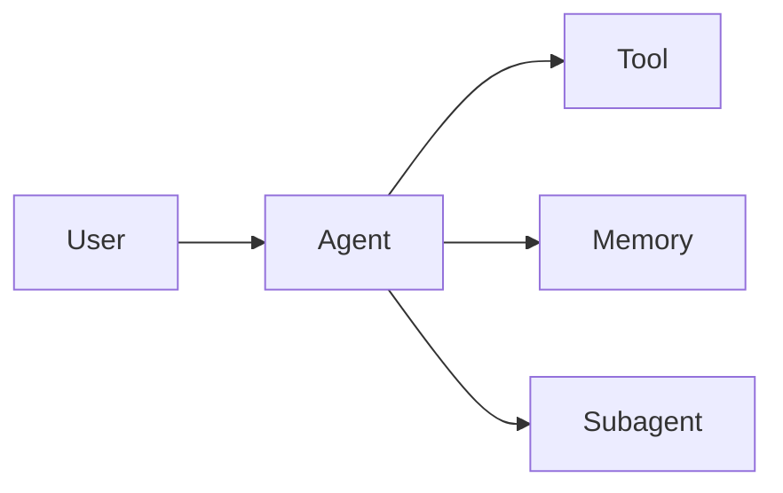

# [이론] Deep Agents — {{주제}}

> ds4th study · Deep Agents 파트 · 이론 발표

## 메타 정보

| 항목 | 내용 |
|---|---|
| 발표 일자 | YYYY-MM-DD (토) 08:30 |
| 발표자 | {{이름}} |
| 학습 범위 | 공식 문서 / Markdown 변환본의 어떤 섹션을 다루었는가 |
| 분량 (예상) | 1시간 이내 |

## 1. 학습한 자료

* 공식 문서 섹션: [링크](https://docs.langchain.com/oss/python/deepagents/overview)
* Markdown 변환본 섹션: [링크](https://github.com/restful3/langchain-docs/tree/main/deep-agents)
* (옵션) 추가 참고: 블로그/논문/영상

## 2. 핵심 개념 요약

> 이 섹션은 발표의 척추다. 청중이 이 글만 읽어도 핵심을 파악할 수 있도록 작성한다.

### 2.1 한 줄 요약
* {{한 문장으로 이번 학습 분량의 핵심을 정리}}

### 2.2 주요 용어
| 용어 | 정의 | 비고 |
|---|---|---|
| _Deep Agent_ | _TBD_ | _TBD_ |
| _Subagent_ | _TBD_ | _TBD_ |
| _Middleware_ | _TBD_ | _TBD_ |

### 2.3 핵심 개념 — 다이어그램

> 필요 시 본인 다이어그램으로 교체한다.

## 3. 코드 예시

> 공식 문서/Markdown 변환본의 예시를 그대로 옮기지 말고, **퀀트 도메인에 한 단계 적용한** 형태로 변형해 본다.

```python
# 예: create_deep_agent() 최소 호출 예시
from deepagents import create_deep_agent

agent = create_deep_agent(
    tools=[...],
    instructions="...",
)

result = agent.invoke({"messages": [{"role": "user", "content": "..."}]})
```

* 위 코드의 **무엇이 핵심인지** 1\~2줄로 설명한다.
* 실행 결과 / 로그 캡처가 있다면 첨부한다.

## 4. 퀀트 에이전트 적용 포인트

* 이번 분량을 퀀트 에이전트 구현에 어떻게 활용할 수 있는가?
* 어떤 부분이 직접 적용 가능하고, 어떤 부분이 적용하기 어려운가?

## 5. 토론 / 열린 질문

1. {{질문 1}}
2. {{질문 2}}
3. {{질문 3}}

## 6. 참고 링크

* [공식 문서 — Deep Agents Overview](https://docs.langchain.com/oss/python/deepagents/overview)
* [Markdown 변환본](https://github.com/restful3/langchain-docs/tree/main/deep-agents)
* (추가 자료)

## 7. 발표 자료

* 슬라이드: `./slides.pdf` 또는 `./slides.pptx`
* 코드: `./demo.py` 또는 `./demo.ipynb`
