# 실행 내용 정리

## 1. 로컬 모델로 확인 후, submit하는 방법.

**1. 소스코드를 다운 로드 받고 캐글 디렉토리로 이동합니다.**

```jsx
dkkim-mbp@workdisk~$> git clone https://github.com/restful3/ds4th_study.git
Cloning into 'ds4th_study'...
remote: Enumerating objects: 18747, done.
remote: Counting objects: 100% (737/737), done.
remote: Compressing objects: 100% (358/358), done.
remote: Total 18747 (delta 491), reused 596 (delta 379), pack-reused 18010 (from 3)
Receiving objects: 100% (18747/18747), 1.58 GiB | 18.19 MiB/s, done.
Resolving deltas: 100% (7029/7029), done.
Updating files: 100% (7295/7295), done.
dkkim-mbp@study~$>
dkkim-mbp@study~$> cd ds4th_study
dkkim-mbp@ds4th_study~$>
dkkim-mbp@ds4th_study~$> cd source/kaggle/llm-classification-finetuning
dkkim-mbp@llm-classification-finetuning~$>
dkkim-mbp@llm-classification-finetuning~$>
dkkim-mbp@llm-classification-finetuning~$> ls -alF
total 864
drwxr-xr-x@ 9 dkkim  admin     288 11월  7 21:22 ./
drwxr-xr-x@ 3 dkkim  admin      96 11월  7 20:56 ../
drwxr-xr-x@ 6 dkkim  admin     192 11월  7 21:22 .venv/
-rw-r--r--@ 1 dkkim  admin   13248 11월  7 20:56 baseline_local.py
-rw-r--r--@ 1 dkkim  admin   13019 11월  7 20:56 baseline.py
-rw-r--r--@ 1 dkkim  admin    2705 11월  7 20:56 download_model.py
-rw-r--r--@ 1 dkkim  admin  351378 11월  7 20:56 exploration.ipynb
-rw-r--r--@ 1 dkkim  admin   46022 11월  7 20:56 README.md
-rw-r--r--@ 1 dkkim  admin     420 11월  7 20:56 requirements.txt
dkkim-mbp@llm-classification-finetuning~$>
```

**2. 파이썬을 venc로 실행합니다.**

```jsx
dkkim-mbp@llm-classification-finetuning~$> python3 -m venv .venv
dkkim-mbp@llm-classification-finetuning~$> source .venv/bin/activate
(.venv) dkkim-mbp@llm-classification-finetuning~$>
(.venv) dkkim-mbp@llm-classification-finetuning~$>
(.venv) dkkim-mbp@llm-classification-finetuning~$>
```

**3. 필요한 라이브러리를 설치 합니다.**

```jsx
(.venv) dkkim-mbp@llm-classification-finetuning~$>
(.venv) dkkim-mbp@llm-classification-finetuning~$> pip install -r requirements.txt
Collecting torch>=2.0.0
  Using cached torch-2.8.0-cp39-none-macosx_11_0_arm64.whl (73.6 MB)
Requirement already satisfied: transformers>=4.30.0 in ./.venv/lib/python3.9/site-packages (from -r requirements.txt (line 3)) (4.57.1)
Requirement already satisfied: numpy>=1.24.0 in ./.venv/lib/python3.9/site-packages (from -r requirements.txt (line 4)) (2.0.2)
   <생략> ------------------
Successfully installed MarkupSafe-3.0.3 accelerate-1.10.1 anyio-4.11.0 appnope-0.1.4 argon2-cffi-25.1.0 argon2-cffi-bindings-25.1.0 arrow-1.4.0 asttokens-3.0.0 async-lru-2.0.5 attrs-25.4.0 babel-2.17.0 beautifulsoup4-4.14.2 bleach-6.2.0 cffi-2.0.0 comm-0.2.3 contourpy-1.3.0 cycler-0.12.1 debugpy-1.8.17 decorator-5.2.1 defusedxml-0.7.1 exceptiongroup-1.3.0 executing-2.2.1 fastjsonschema-2.21.2 fonttools-4.60.1 fqdn-1.5.1 h11-0.16.0 httpcore-1.0.9 httpx-0.28.1 importlib-metadata-8.7.0 importlib-resources-6.5.2 ipykernel-6.31.0 ipython-8.18.1 ipywidgets-8.1.8 isoduration-20.11.0 jedi-0.19.2 jinja2-3.1.6 joblib-1.5.2 json5-0.12.1 jsonpointer-3.0.0 jsonschema-4.25.1 jsonschema-specifications-2025.9.1 jupyter-1.1.1 jupyter-client-8.6.3 jupyter-console-6.6.3 jupyter-core-5.8.1 jupyter-events-0.12.0 jupyter-lsp-2.3.0 jupyter-server-2.17.0 jupyter-server-terminals-0.5.3 jupyterlab-4.4.10 jupyterlab-pygments-0.3.0 jupyterlab-server-2.28.0 jupyterlab-widgets-3.0.16 kaggle-1.7.4.5 kiwisolver-1.4.7 koreanize-matplotlib-0.1.1 lark-1.3.1 matplotlib-3.9.4 matplotlib-inline-0.2.1 mistune-3.1.4 mpmath-1.3.0 nbclient-0.10.2 nbconvert-7.16.6 nbformat-5.10.4 nest-asyncio-1.6.0 networkx-3.2.1 notebook-7.4.7 notebook-shim-0.2.4 overrides-7.7.0 pandas-2.3.3 pandocfilters-1.5.1 parso-0.8.5 pexpect-4.9.0 pillow-11.3.0 platformdirs-4.4.0 prometheus-client-0.23.1 prompt-toolkit-3.0.52 protobuf-6.33.0 psutil-7.1.3 ptyprocess-0.7.0 pure-eval-0.2.3 pycparser-2.23 pygments-2.19.2 pyparsing-3.2.5 python-dateutil-2.9.0.post0 python-json-logger-4.0.0 python-slugify-8.0.4 pytz-2025.2 pyzmq-27.1.0 referencing-0.36.2 rfc3339-validator-0.1.4 rfc3986-validator-0.1.1 rfc3987-syntax-1.1.0 rpds-py-0.27.1 scikit-learn-1.6.1 scipy-1.13.1 seaborn-0.13.2 send2trash-1.8.3 six-1.17.0 sniffio-1.3.1 soupsieve-2.8 stack-data-0.6.3 sympy-1.14.0 terminado-0.18.1 text-unidecode-1.3 threadpoolctl-3.6.0 tinycss2-1.4.0 tomli-2.3.0 torch-2.8.0 tornado-6.5.2 traitlets-5.14.3 tzdata-2025.2 uri-template-1.3.0 wcwidth-0.2.14 webcolors-24.11.1 webencodings-0.5.1 websocket-client-1.9.0 widgetsnbextension-4.0.15 zipp-3.23.0
WARNING: You are using pip version 21.2.4; however, version 25.3 is available.
You should consider upgrading via the '/Volumes/MBproWorkDisk/study/ds4th_study/source/kaggle/llm-classification-finetuning/.venv/bin/python3 -m pip install --upgrade pip' command.
(.venv) dkkim-mbp@llm-classification-finetuning~$>
(.venv) dkkim-mbp@llm-classification-finetuning~$>
```

**4. 모델을 다운로드합니다.**

```jsx
(.venv) dkkim-mbp@llm-classification-finetuning~$> python download_model.py
/Volumes/MBproWorkDisk/study/ds4th_study/source/kaggle/llm-classification-finetuning/.venv/lib/python3.9/site-packages/urllib3/__init__.py:35: NotOpenSSLWarning: urllib3 v2 only supports OpenSSL 1.1.1+, currently the 'ssl' module is compiled with 'LibreSSL 2.8.3'. See: https://github.com/urllib3/urllib3/issues/3020
  warnings.warn(
Downloading distilbert-base-uncased from HuggingFace...
This will be saved to: models/distilbert-base-uncased
============================================================

1. Downloading tokenizer...
✓ Tokenizer saved to models/distilbert-base-uncased

2. Downloading model...
✓ Model saved to models/distilbert-base-uncased

3. Verifying saved files...
Saved files: ['model.safetensors', 'tokenizer_config.json', 'special_tokens_map.json', 'config.json', 'tokenizer.json', 'vocab.txt']

✓ All required files present!

Model size: ~254.1 MB

4. Creating ZIP file...
Compressing models/ folder into models/distilbert-base-uncased.zip...
  Added: models/distilbert-base-uncased.zip
  Added: models/distilbert-base-uncased/model.safetensors
  Added: models/distilbert-base-uncased/tokenizer_config.json
  Added: models/distilbert-base-uncased/special_tokens_map.json
  Added: models/distilbert-base-uncased/config.json
  Added: models/distilbert-base-uncased/tokenizer.json
  Added: models/distilbert-base-uncased/vocab.txt

✓ ZIP file created: models/distilbert-base-uncased.zip
✓ ZIP size: ~233.8 MB

============================================================
DOWNLOAD AND COMPRESSION COMPLETE!
============================================================

Model saved in: /Volumes/MBproWorkDisk/study/ds4th_study/source/kaggle/llm-classification-finetuning/models/distilbert-base-uncased
ZIP file: /Volumes/MBproWorkDisk/study/ds4th_study/source/kaggle/llm-classification-finetuning/models/distilbert-base-uncased.zip

Compression ratio: 8.0%

Next steps:
1. Upload the ZIP file to Kaggle as a new dataset:
   - File: models/distilbert-base-uncased.zip
   - Title: distilbert-base-uncased
2. Add the dataset to your Kaggle notebook
3. Use the uploaded model in your notebook
(.venv) dkkim-mbp@llm-classification-finetuning~$>
(.venv) dkkim-mbp@llm-classification-finetuning~$>
```

**4-1. 확인 합니다.**

```jsx
(.venv) dkkim-mbp@llm-classification-finetuning~$>
(.venv) dkkim-mbp@llm-classification-finetuning~$> ls -alF
total 119648
drwxr-xr-x@ 13 dkkim  admin       416 11월  7 22:15 ./
drwxr-xr-x@  3 dkkim  admin        96 11월  7 20:56 ../
drwxr-xr-x@  8 dkkim  admin       256 11월  7 21:56 .venv/
-rw-r--r--@  1 dkkim  admin     13248 11월  7 20:56 baseline_local.py
-rw-r--r--@  1 dkkim  admin     13019 11월  7 20:56 baseline.py
drwxr-xr-x@  5 dkkim  admin       160 11월  7 22:15 data/
-rw-r--r--@  1 dkkim  admin      2705 11월  7 20:56 download_model.py
-rw-r--r--@  1 dkkim  admin    351378 11월  7 20:56 exploration.ipynb
-rw-r--r--@  1 dkkim  admin  59810797 10월  9  2024 llm-classification-finetuning.zip
drwxr-xr-x@  4 dkkim  admin       128 11월  7 22:20 models/
drwxr-xr-x@  2 dkkim  admin        64 11월  7 22:13 outputs/
-rw-r--r--@  1 dkkim  admin     46022 11월  7 20:56 README.md
-rw-r--r--@  1 dkkim  admin       420 11월  7 20:56 requirements.txt
(.venv) dkkim-mbp@llm-classification-finetuning~$> ls -alF models
total 491928
drwxr-xr-x@  4 dkkim  admin        128 11월  7 22:20 ./
drwxr-xr-x@ 13 dkkim  admin        416 11월  7 22:15 ../
drwxr-xr-x@  8 dkkim  admin        256 11월  7 22:20 distilbert-base-uncased/
-rw-r--r--@  1 dkkim  admin  245111735 11월  7 22:20 distilbert-base-uncased.zip
(.venv) dkkim-mbp@llm-classification-finetuning~$>
(.venv) dkkim-mbp@llm-classification-finetuning~$>
```

**5. 합습시킬 kaggle 데이터를 다운로드 합니다.**

```jsx
(.venv) dkkim-mbp@llm-classification-finetuning~$>
(.venv) dkkim-mbp@llm-classification-finetuning~$> kaggle competitions download -c llm-classification-finetuning
/Volumes/MBproWorkDisk/study/ds4th_study/source/kaggle/llm-classification-finetuning/.venv/lib/python3.9/site-packages/urllib3/__init__.py:35: NotOpenSSLWarning: urllib3 v2 only supports OpenSSL 1.1.1+, currently the 'ssl' module is compiled with 'LibreSSL 2.8.3'. See: https://github.com/urllib3/urllib3/issues/3020
  warnings.warn(
Downloading llm-classification-finetuning.zip to /Volumes/MBproWorkDisk/study/ds4th_study/source/kaggle/llm-classification-finetuning
  0%|                                                                                                                                   | 0.00/57.0M [00:00<?, ?B/s]
100%|██████████████████████████████████████████████████████████████████████████████████████████████████████████████████████████| 57.0M/57.0M [00:00<00:00, 1.26GB/s]
(.venv) dkkim-mbp@llm-classification-finetuning~$>
(.venv) dkkim-mbp@llm-classification-finetuning~$>
(.venv) dkkim-mbp@llm-classification-finetuning~$> ls -alF
total 119648
drwxr-xr-x@ 12 dkkim  admin       384 11월  7 22:14 ./
drwxr-xr-x@  3 dkkim  admin        96 11월  7 20:56 ../
drwxr-xr-x@  8 dkkim  admin       256 11월  7 21:56 .venv/
-rw-r--r--@  1 dkkim  admin     13248 11월  7 20:56 baseline_local.py
-rw-r--r--@  1 dkkim  admin     13019 11월  7 20:56 baseline.py
-rw-r--r--@  1 dkkim  admin      2705 11월  7 20:56 download_model.py
-rw-r--r--@  1 dkkim  admin    351378 11월  7 20:56 exploration.ipynb
-rw-r--r--@  1 dkkim  admin  59810797 10월  9  2024 llm-classification-finetuning.zip
drwxr-xr-x@  3 dkkim  admin        96 11월  7 21:52 models/
drwxr-xr-x@  2 dkkim  admin        64 11월  7 22:13 outputs/
-rw-r--r--@  1 dkkim  admin     46022 11월  7 20:56 README.md
-rw-r--r--@  1 dkkim  admin       420 11월  7 20:56 requirements.txt
(.venv) dkkim-mbp@llm-classification-finetuning~$>
```

**5-1. 해당 zip파일을 data디렉토리에 압축을 풉니다.**

```jsx
(.venv) dkkim-mbp@llm-classification-finetuning~$>
(.venv) dkkim-mbp@llm-classification-finetuning~$> mkdir data
(.venv) dkkim-mbp@llm-classification-finetuning~$>
(.venv) dkkim-mbp@llm-classification-finetuning~$> unzip -d data llm-classification-finetuning.zip
Archive:  llm-classification-finetuning.zip
  inflating: data/sample_submission.csv
  inflating: data/test.csv
  inflating: data/train.csv
(.venv) dkkim-mbp@llm-classification-finetuning~$>
(.venv) dkkim-mbp@llm-classification-finetuning~$>
(.venv) dkkim-mbp@llm-classification-finetuning~$>
(.venv) dkkim-mbp@llm-classification-finetuning~$> ls -alF data
total 371616
drwxr-xr-x@  5 dkkim  admin        160 11월  7 22:15 ./
drwxr-xr-x@ 13 dkkim  admin        416 11월  7 22:15 ../
-rw-r--r--@  1 dkkim  admin        237 10월  9  2024 sample_submission.csv
-rw-r--r--@  1 dkkim  admin      10658 10월  9  2024 test.csv
-rw-r--r--@  1 dkkim  admin  184175071 10월  9  2024 train.csv
(.venv) dkkim-mbp@llm-classification-finetuning~$>
```

**6. 로컬에서 학습 시켜 봅니다. (옵션)**

```jsx
(.venv) dkkim-mbp@llm-classification-finetuning~$>
(.venv) dkkim-mbp@llm-classification-finetuning~$> python baseline_local.py
/Volumes/MBproWorkDisk/study/ds4th_study/source/kaggle/llm-classification-finetuning/.venv/lib/python3.9/site-packages/urllib3/__init__.py:35: NotOpenSSLWarning: urllib3 v2 only supports OpenSSL 1.1.1+, currently the 'ssl' module is compiled with 'LibreSSL 2.8.3'. See: https://github.com/urllib3/urllib3/issues/3020
  warnings.warn(
Libraries imported successfully!
PyTorch version: 2.8.0
CUDA available: False
Random seeds set to 42

Configuration:
  Model: /Volumes/MBproWorkDisk/study/ds4th_study/source/kaggle/llm-classification-finetuning/models/distilbert-base-uncased
  Device: cpu
  Batch Size: 16
  Epochs: 1
✓ Model path exists: /Volumes/MBproWorkDisk/study/ds4th_study/source/kaggle/llm-classification-finetuning/models/distilbert-base-uncased
✓ Train data exists: /Volumes/MBproWorkDisk/study/ds4th_study/source/kaggle/llm-classification-finetuning/data/train.csv
✓ Test data exists: /Volumes/MBproWorkDisk/study/ds4th_study/source/kaggle/llm-classification-finetuning/data/test.csv
✓ Sample submission data exists: /Volumes/MBproWorkDisk/study/ds4th_study/source/kaggle/llm-classification-finetuning/data/sample_submission.csv

Loading data...
Train data shape: (57477, 9)
Test data shape: (3, 4)
Train size: 51729, Validation size: 5748
Dataset class defined
Model class defined

Loading tokenizer and model from: /Volumes/MBproWorkDisk/study/ds4th_study/source/kaggle/llm-classification-finetuning/models/distilbert-base-uncased
✓ Model loaded on: cpu
✓ Model parameters: 66,365,187
✓ Train batches: 3234, Val batches: 360, Test batches: 1
Training functions defined
Optimizer: AdamW (lr=2e-05)
Total training steps: 3234

============================================================
STARTING TRAINING
============================================================

Epoch 1/1
------------------------------------------------------------
Training:   0%|            (공백생략)                         | 0/3234 [00:00<?, ?it/s]
```

**6-1. 참고로 저는 노트북에서 5시간 걸렸습니다. 🙂**
 - 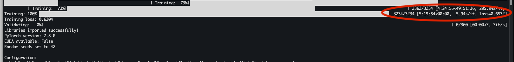


**7. 케글 페이지에서 "code"를 선택하고 우측에 "New Notebook"아이콘을 눌러서 추가합니다.**
 - 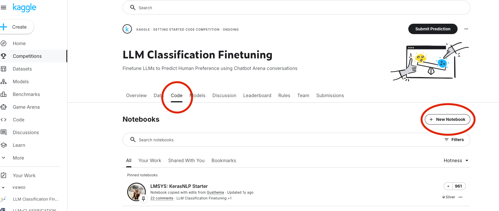
  **7-1. 노트북의 내용을 지우고 baseline.py의 내용을 붙여 넣습니다.**
    - 

**8. 모델을 추가 합니다. (로컬에서 다운받은 zip파일을 업로드)**
  -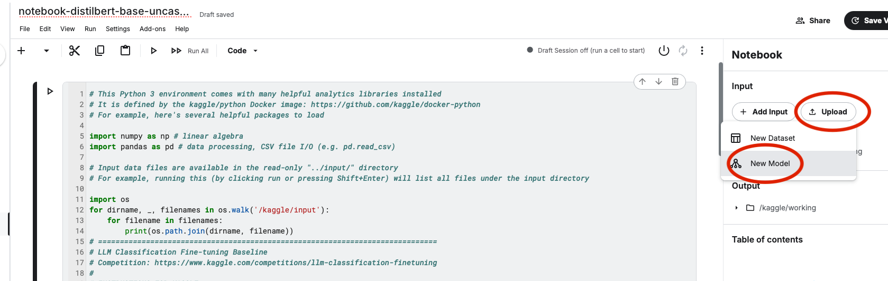 
  -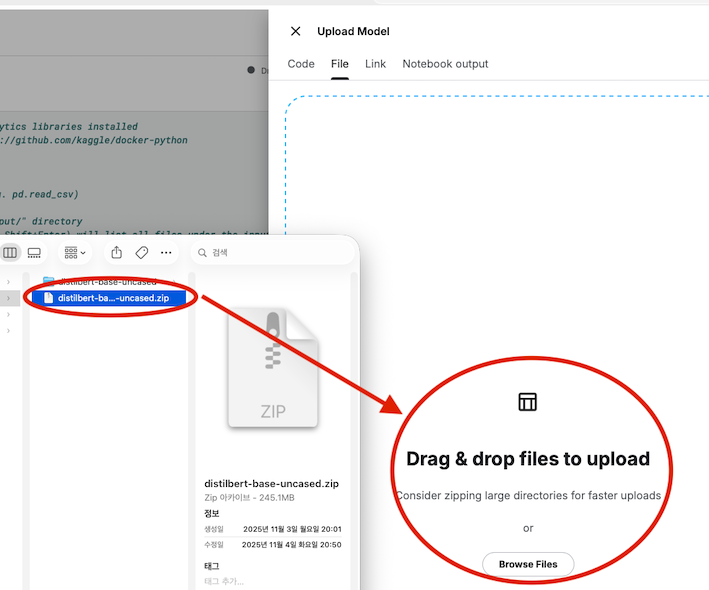

**8-1 모델 정보를 입력해서 추가 합니다.**
  - 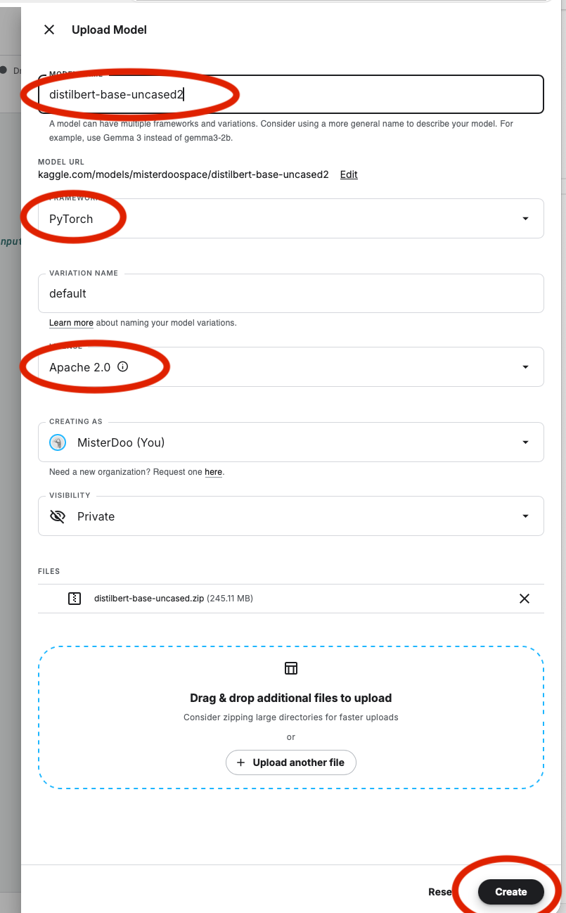

**8-2 기존 모델을 추가하는 방법.**
   - 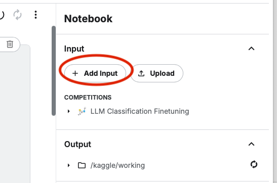
   - 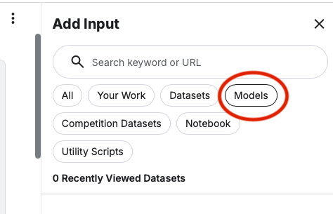
   - 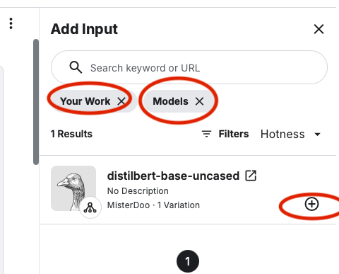
   - 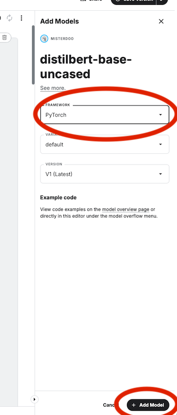

**8-3. 모델의 경로와 코드의 경로가 일치하는지 확인.**
   - 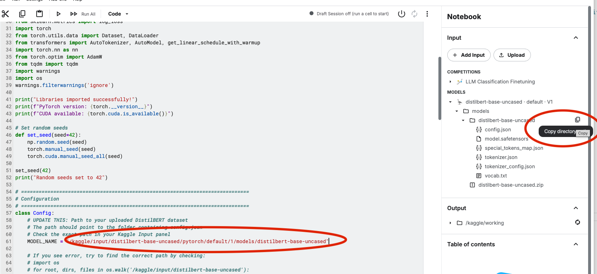

**9. 설정에서 인터넷을 off하시고, GPU를 선택하세요.**
   - 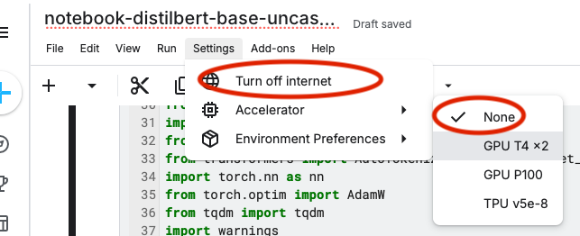
   - 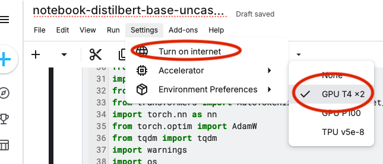
     **9-1. 전원을 키시면 됩니다. 이건 HW 전원입니다.**
        - 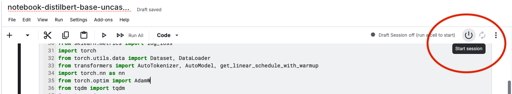

   **참고로 GPU를 사용할 수 있는 시간은 30시간입니다. Profile의 setting에서 확인. 1주일 마다 리셋된다고 합니다.**
      - 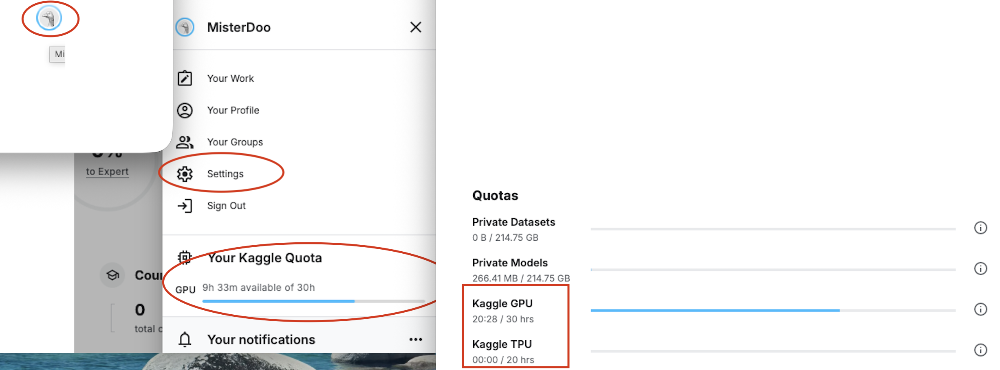

**10. 실행하시면 학습을 진행합니다.(16분 ... 자본의 힘입니다. 😎)**
    - 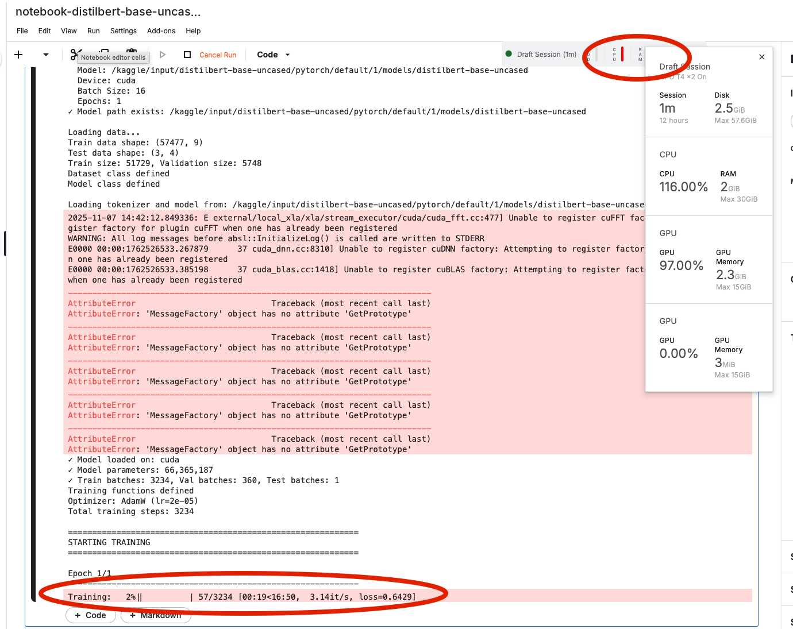

**11. 학습 완료**
   - 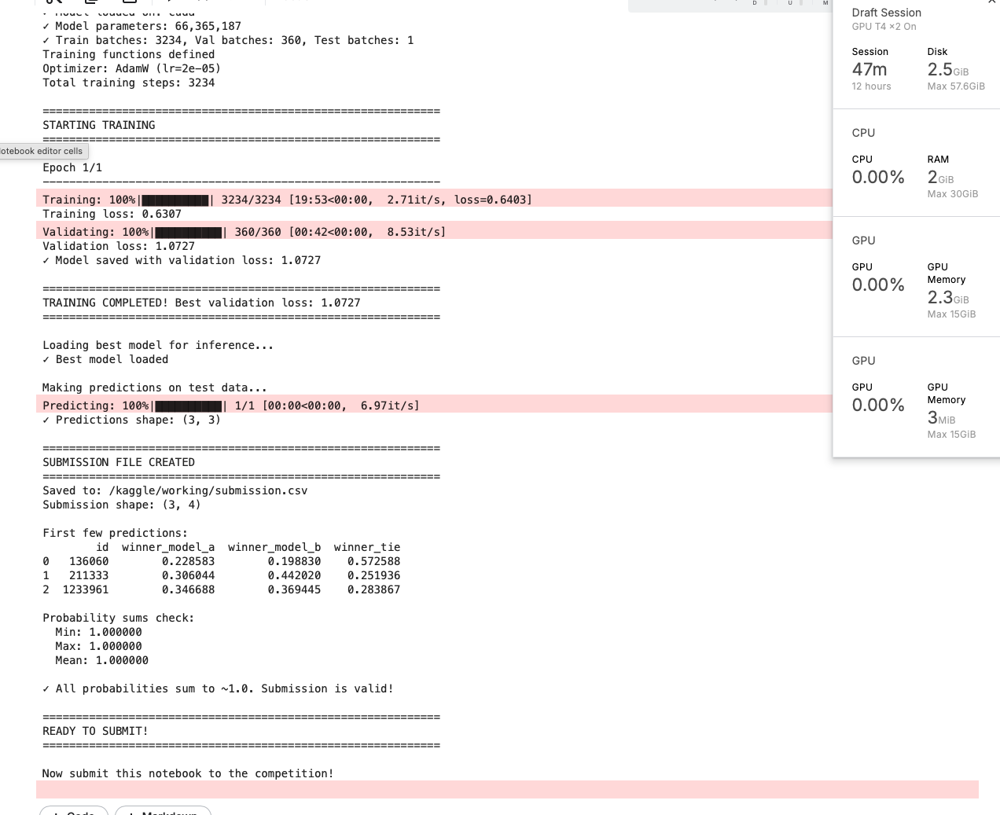
  

**12. Submit(제출)**
   - 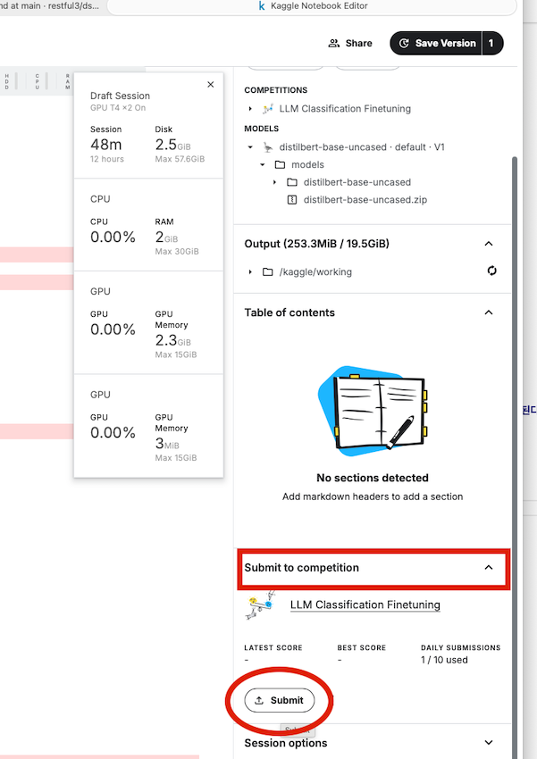

**12-1. Submit 확인, 제출 완료도 학습시킨 시간만큼 걸립니다.**
   - 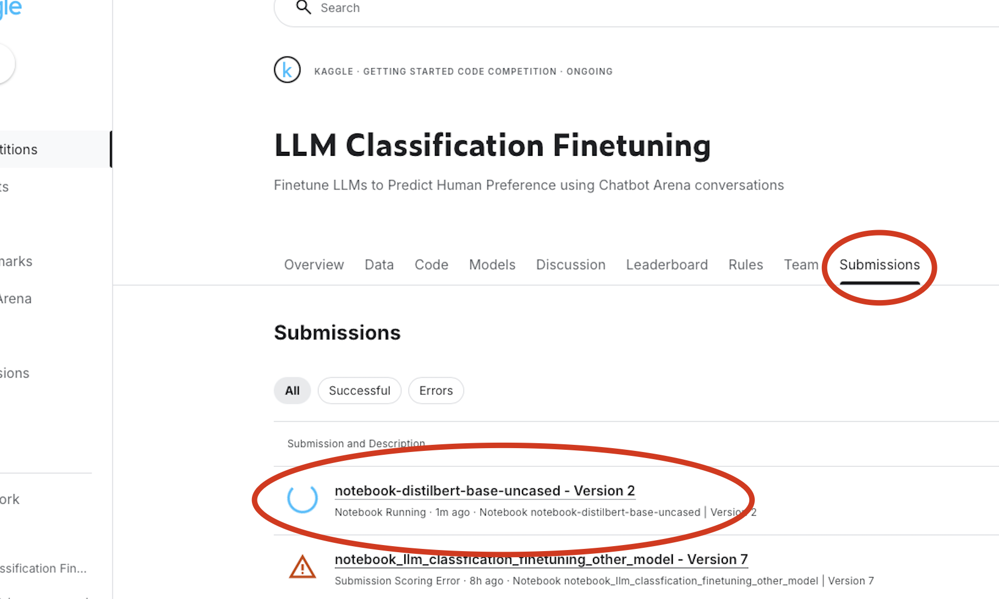


## 2. kaggle 웹에서 모델 변경 

**1. 모델 아이콘을 선택하면 다양한 모델이 나옵니다.**
   - 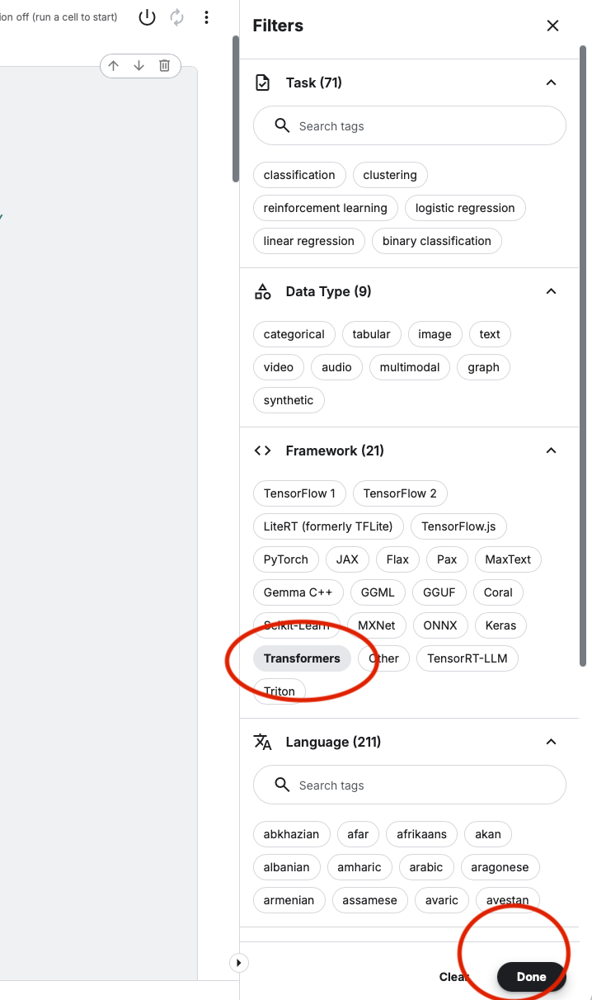
   
   **1-1. 선택 못하는 모델은 "xxxx models_page"로 가서 동의하시면 됩니다.**
    - 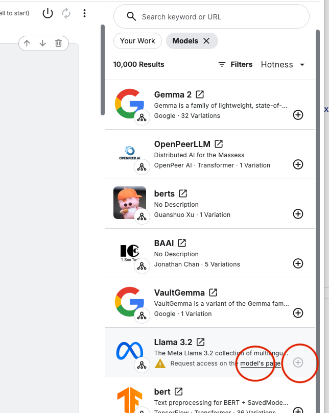
    - 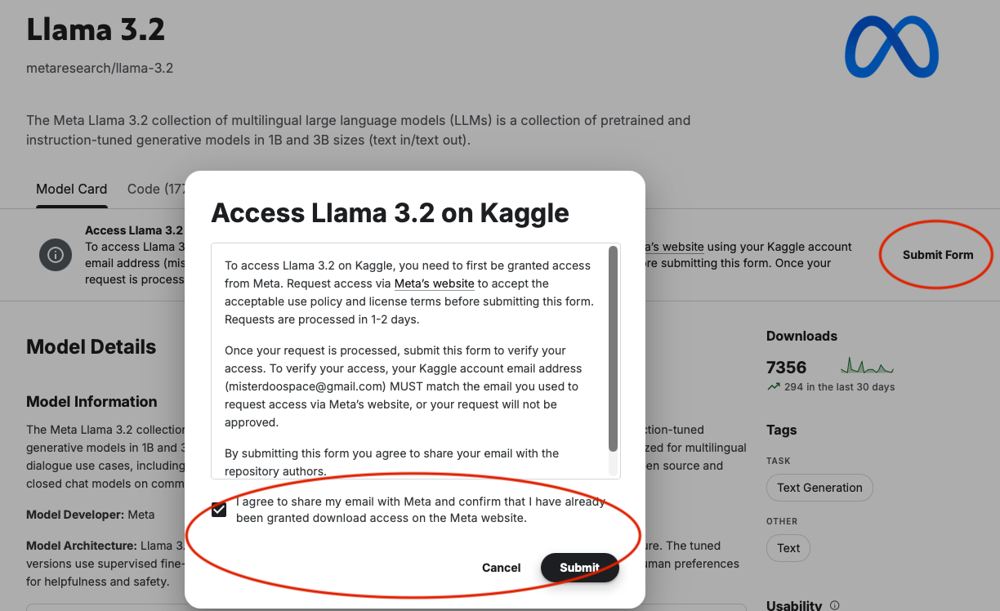
  
**2. 모델 옵션을 선택합니다.**
    - 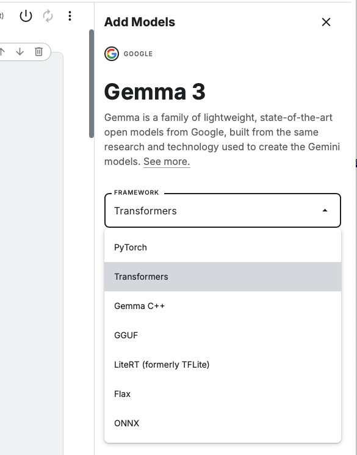
    - 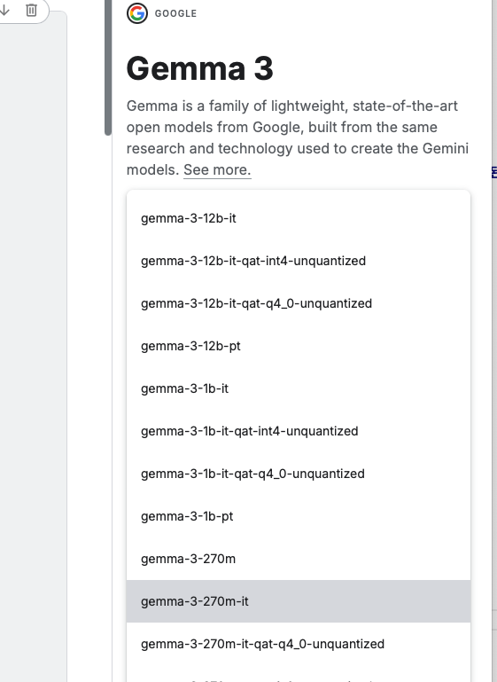

    - 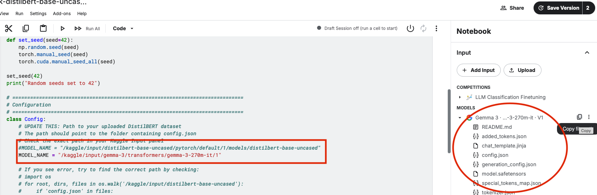

