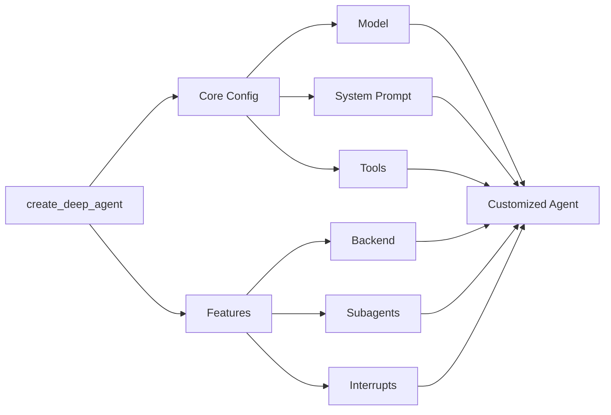

# Customize Deep Agents

Learn how to customize deep agents with system prompts, tools, subagents, and more



## Model

By default, `deepagents` uses `claude-sonnet-4-5-20250929`. You can customize the model used by passing any supported [model identifier string](https://platform.claude.com/docs/en/about-claude/models/overview) or [LangChain model object](https://docs.langchain.com/oss/python/integrations/chat).

> **Tip**
> Use the `provider:model` format (e.g., `openai:gpt-5`) to quickly switch between models.

### Model string

```python
from langchain.chat_models import init_chat_model
from deepagents import create_deep_agent

model = init_chat_model(model="openai:gpt-5")
agent = create_deep_agent(model=model)
```

### LangChain model object

```python
# ollama pull llama3.1
from langchain_ollama import ChatOllama
from langchain.chat_models import init_chat_model
from deepagents import create_deep_agent

model = init_chat_model(
    model="llama3.1",
    model_provider="ollama",
    temperature=0,
    # other params...
)

agent = create_deep_agent(model=model)
```

## System prompt

Deep agents come with a built-in system prompt inspired by Claude Code’s system prompt. The default system prompt contains detailed instructions for using the built-in planning tool, file system tools, and subagents.

Each deep agent tailored to a use case should include a custom system prompt specific to that use case.


```python
from deepagents import create_deep_agent

research_instructions = """\
You are an expert researcher. Your job is to conduct \
thorough research, and then write a polished report. \
"""

agent = create_deep_agent(
    system_prompt=research_instructions,
)
```

## Tools

In addition to custom tools you provide, deep agents include built-in tools for planning, file management, and subagent spawning.

```python
import os
from typing import Literal
from tavily import TavilyClient
from deepagents import create_deep_agent

tavily_client = TavilyClient(api_key=os.environ["TAVILY_API_KEY"])

def internet_search(
    query: str,
    max_results: int = 5,
    topic: Literal["general", "news", "finance"] = "general",
    include_raw_content: bool = False,
):
    """Run a web search"""
    return tavily_client.search(
        query,
        max_results=max_results,
        include_raw_content=include_raw_content,
        topic=topic,
    )

agent = create_deep_agent(
    tools=[internet_search]
)
```

---

<p align="center">
  <a href="02-quickstart.md">← Previous: Quickstart</a> • <a href="README.md">Table of Contents</a> • <a href="04-harness.md">Next: Agent Harness →</a>
</p>
