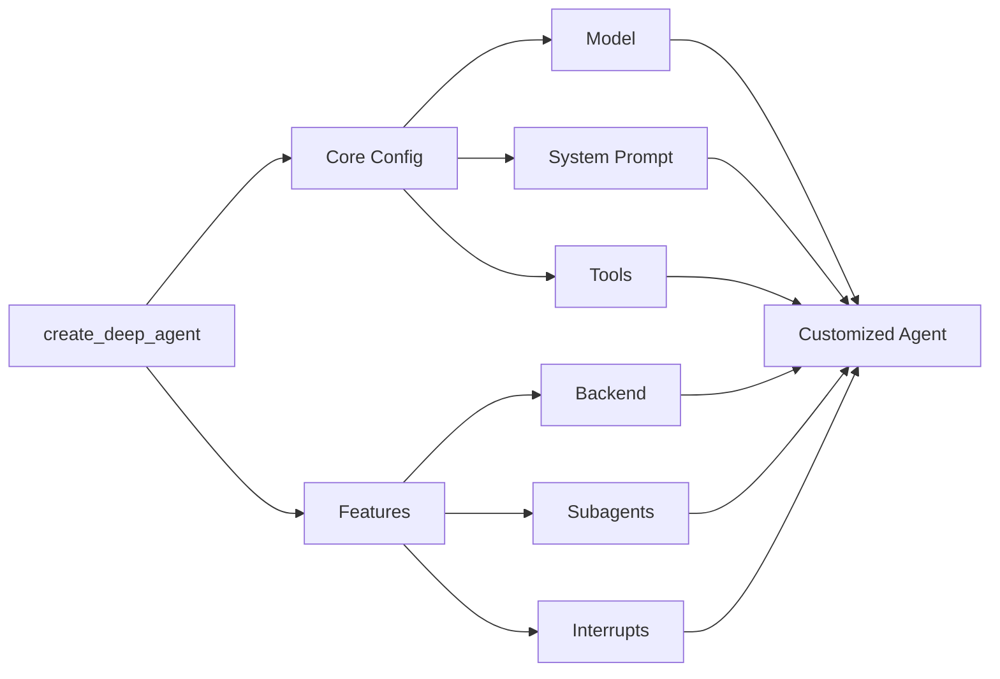

# Deep Agents 커스터마이징

시스템 프롬프트, 도구, 서브에이전트 등으로 deep agents를 커스터마이징하는 방법을 알아보세요



## 모델

기본적으로 `deepagents`는 `claude-sonnet-4-5-20250929`를 사용합니다. 지원되는 [모델 식별자 문자열](https://platform.claude.com/docs/en/about-claude/models/overview) 또는 [LangChain 모델 객체](https://docs.langchain.com/oss/python/integrations/chat)를 전달하여 사용할 모델을 커스터마이징할 수 있습니다.

> **Tip**
> `provider:model` 형식(예: `openai:gpt-5`)을 사용하여 모델 간에 빠르게 전환하세요.

### 모델 문자열

```python
from langchain.chat_models import init_chat_model
from deepagents import create_deep_agent

model = init_chat_model(model="openai:gpt-5")
agent = create_deep_agent(model=model)
```

### LangChain 모델 객체

```python
# ollama pull llama3.1
from langchain_ollama import ChatOllama
from langchain.chat_models import init_chat_model
from deepagents import create_deep_agent

model = init_chat_model(
    model="llama3.1",
    model_provider="ollama",
    temperature=0,
    # other params...
)

agent = create_deep_agent(model=model)
```

## 시스템 프롬프트

Deep agents는 Claude Code의 시스템 프롬프트에서 영감을 받은 내장 시스템 프롬프트와 함께 제공됩니다. 기본 시스템 프롬프트에는 내장 계획 도구, 파일 시스템 도구, 서브에이전트 사용에 대한 상세한 지침이 포함되어 있습니다.

각 사용 사례에 맞게 조정된 deep agent는 해당 사용 사례에 특화된 커스텀 시스템 프롬프트를 포함해야 합니다.


```python
from deepagents import create_deep_agent

research_instructions = """\
You are an expert researcher. Your job is to conduct \
thorough research, and then write a polished report. \
"""

agent = create_deep_agent(
    system_prompt=research_instructions,
)
```

## 도구

제공하는 커스텀 도구 외에도 deep agents는 계획 수립, 파일 관리, 서브에이전트 생성을 위한 내장 도구를 포함합니다.

```python
import os
from typing import Literal
from tavily import TavilyClient
from deepagents import create_deep_agent

tavily_client = TavilyClient(api_key=os.environ["TAVILY_API_KEY"])

def internet_search(
    query: str,
    max_results: int = 5,
    topic: Literal["general", "news", "finance"] = "general",
    include_raw_content: bool = False,
):
    """Run a web search"""
    return tavily_client.search(
        query,
        max_results=max_results,
        include_raw_content=include_raw_content,
        topic=topic,
    )

agent = create_deep_agent(
    tools=[internet_search]
)
```

---

<p align="center">
  <a href="02-quickstart_ko.md">← 이전: 빠른 시작</a> • <a href="README.md">목차</a> • <a href="04-harness_ko.md">다음: 에이전트 하네스 →</a>
</p>
