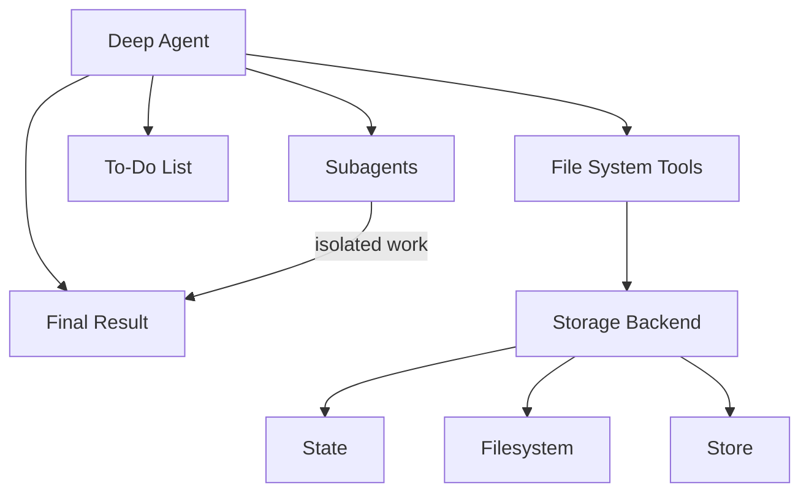

# Agent harness capabilities

We think of **deepagents** as an [“agent harness”](https://blog.langchain.com/agent-frameworks-runtimes-and-harnesses-oh-my/). It is the same core tool calling loop as other agent frameworks, but with built-in tools and capabilities.

This page lists out the components that make up the agent harness.

## File system access

The harness provides six tools for file system operations, making files first-class citizens in the agent’s environment:

| Tool | Description |
| :--- | :--- |
| `ls` | List files in a directory with metadata (size, modified time) |
| `read_file` | Read file contents with line numbers, supports offset/limit for large files |
| `write_file` | Create new files |
| `edit_file` | Perform exact string replacements in files (with global replace mode) |
| `glob` | Find files matching patterns (e.g., `**/*.py`) |
| `grep` | Search file contents with multiple output modes (files only, content with context, or counts) |

## Large tool result eviction

The `FilesystemMiddleware` automatically evicts large tool results to the file system when they exceed a token threshold, preventing context window saturation.

**How it works:**

* Monitors tool call results for size (default threshold: 20,000 tokens, configurable via `tool_token_limit_before_evict`)
* When exceeded, writes the result using the configured backend
* Replaces the tool result with a truncated preview and file reference
* Agent can read the full result from the file system as needed

## Pluggable storage backends

The harness abstracts file system operations behind a protocol, allowing different storage strategies for different use cases.

**Available backends:**

* **StateBackend** - Ephemeral in-memory storage
    * Files live in the agent’s state (checkpointed with conversation)
    * Persists within a thread but not across threads
    * Useful for temporary working files
* **FilesystemBackend** - Real filesystem access
    * Read/write from actual disk
    * Supports virtual mode (sandboxed to a root directory)
    * Integrates with system tools (ripgrep for grep)
    * Security features: path validation, size limits, symlink prevention
* **StoreBackend** - Persistent cross-conversation storage
    * Uses LangGraph’s `BaseStore` for durability
    * Namespaced per `assistant_id`
    * Files persist across conversations
    * Useful for long-term memory or knowledge bases
* **CompositeBackend** - Route different paths to different backends
    * Example: `/` → `StateBackend`, `/memories/` → `StoreBackend`
    * Longest-prefix matching for routing
    * Enables hybrid storage strategies

See **backends** for configuration details and examples.

## Task delegation (subagents)

The harness allows the main agent to create ephemeral “subagents” for isolated multi-step tasks.

**Why it’s useful:**

* **Context isolation** - Subagent’s work doesn’t clutter main agent’s context
* **Parallel execution** - Multiple subagents can run concurrently
* **Specialization** - Subagents can have different tools/configurations
* **Token efficiency** - Large subtask context is compressed into a single result

**How it works:**

* Main agent has a `task` tool
* When invoked, creates a fresh agent instance with its own context
* Subagent executes autonomously until completion
* Returns a single final report to the main agent
* Subagents are stateless (can’t send multiple messages back)

**Default subagent:**

* “general-purpose” subagent automatically available
* Has filesystem tools by default
* Can be customized with additional tools/middleware

**Custom subagents:**

* Define specialized subagents with specific tools
* Example: `code-reviewer`, `web-researcher`, `test-runner`
* Configure via `subagents` parameter

## Conversation history summarization

The harness automatically compresses old conversation history when token usage becomes excessive.

**Configuration:**

* Triggers at 85% of the model’s `max_input_tokens` from its model profile
* Keeps 10% of tokens as recent context
* Falls back to 170,000 tokens trigger / 6 messages kept if model profile is unavailable
* Older messages are summarized by the model

**Why it’s useful:**

* Enables very long conversations without hitting context limits
* Preserves recent context while compressing ancient history
* Transparent to the agent (appears as a special system message)

## Dangling tool call repair

The harness fixes message history when tool calls are interrupted or cancelled before receiving results.

**The problem:**

1. Agent requests tool call: “Please run X”
2. Tool call is interrupted (user cancels, error, etc.)
3. Agent sees `tool_call` in `AIMessage` but no corresponding `ToolMessage`
4. This creates an invalid message sequence

**The solution:**

* Detects `AIMessage` objects with `tool_calls` that have no results
* Creates synthetic `ToolMessage` responses indicating the call was cancelled
* Repairs the message history before agent execution

**Why it’s useful:**

* Prevents agent confusion from incomplete message chains
* Gracefully handles interruptions and errors
* Maintains conversation coherence

## To-do list tracking

The harness provides a `write_todos` tool that agents can use to maintain a structured task list.

**Features:**

* Track multiple tasks with statuses (`'pending'`, `'in_progress'`, `'completed'`)
* Persisted in agent state
* Helps agent organize complex multi-step work
* Useful for long-running tasks and planning

## Human-in-the-loop

The harness can pause agent execution at specified tool calls to allow human approval or modification. This feature is opt-in via the `interrupt_on` parameter.

**Configuration:**

* Pass `interrupt_on` to `create_deep_agent` with a mapping of tool names to interrupt configurations
* Example: `interrupt_on={"edit_file": True}` pauses before every edit
* Can provide approval messages or modify tool inputs

**Why it’s useful:**

* Safety gates for destructive operations
* User verification before expensive API calls
* Interactive debugging and guidance

## Prompt caching (Anthropic)

The harness enables Anthropic’s prompt caching feature to reduce redundant token processing.

**How it works:**

* Caches portions of the prompt that repeat across turns
* Significantly reduces latency and cost for long system prompts
* Automatically skipped for non-Anthropic models

**Why it’s useful:**

* System prompts (especially with filesystem docs) can be 5k+ tokens
* These repeat every turn without caching
* Caching provides ~10x speedup and cost reduction

---

  <a href="03-customization.md">← Previous: Customization</a> • <a href="README.md">Table of Contents</a> • <a href="05-backends.md">Next: Backends →</a>

