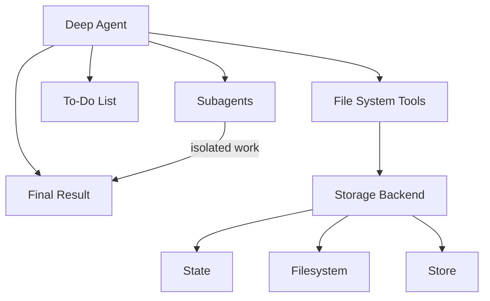

# 에이전트 하네스 기능

**deepagents**를 ["에이전트 하네스"](https://blog.langchain.com/agent-frameworks-runtimes-and-harnesses-oh-my/)라고 생각합니다. 다른 에이전트 프레임워크와 동일한 핵심 도구 호출 루프이지만, 내장 도구와 기능이 포함되어 있습니다.

이 페이지는 에이전트 하네스를 구성하는 컴포넌트들을 나열합니다.

## 파일 시스템 접근

하네스는 파일 시스템 작업을 위한 6개의 도구를 제공하여, 파일을 에이전트 환경에서 일급 시민으로 만듭니다:

| 도구 | 설명 |
| :--- | :--- |
| `ls` | 메타데이터(크기, 수정 시간)와 함께 디렉토리의 파일 나열 |
| `read_file` | 줄 번호와 함께 파일 내용 읽기, 큰 파일의 경우 오프셋/제한 지원 |
| `write_file` | 새 파일 생성 |
| `edit_file` | 파일에서 정확한 문자열 교체 수행 (전역 교체 모드 포함) |
| `glob` | 패턴과 일치하는 파일 찾기 (예: `**/*.py`) |
| `grep` | 여러 출력 모드로 파일 내용 검색 (파일만, 컨텍스트와 함께 내용, 또는 개수) |

## 대용량 도구 결과 제거

`FilesystemMiddleware`는 토큰 임계값을 초과하는 대용량 도구 결과를 자동으로 파일 시스템으로 제거하여 컨텍스트 윈도우 포화를 방지합니다.

**작동 방식:**

* 도구 호출 결과의 크기 모니터링 (기본 임계값: 20,000 토큰, `tool_token_limit_before_evict`를 통해 구성 가능)
* 초과 시, 구성된 백엔드를 사용하여 결과 작성
* 도구 결과를 잘린 미리보기와 파일 참조로 교체
* 에이전트는 필요에 따라 파일 시스템에서 전체 결과를 읽을 수 있음

## 플러그형 스토리지 백엔드

하네스는 다른 사용 사례에 다른 스토리지 전략을 허용하는 프로토콜 뒤에 파일 시스템 작업을 추상화합니다.

**사용 가능한 백엔드:**

* **StateBackend** - 임시 인메모리 스토리지
    * 파일은 에이전트 상태에 존재 (대화와 함께 체크포인트됨)
    * 스레드 내에서 유지되지만 스레드 간에는 유지되지 않음
    * 임시 작업 파일에 유용
* **FilesystemBackend** - 실제 파일시스템 접근
    * 실제 디스크에서 읽기/쓰기
    * 가상 모드 지원 (루트 디렉토리에 샌드박스됨)
    * 시스템 도구와 통합 (grep용 ripgrep)
    * 보안 기능: 경로 검증, 크기 제한, 심볼릭 링크 방지
* **StoreBackend** - 영구 크로스 대화 스토리지
    * 내구성을 위해 LangGraph의 `BaseStore` 사용
    * `assistant_id`별로 네임스페이스됨
    * 파일이 대화 간에 유지됨
    * 장기 메모리 또는 지식 베이스에 유용
* **CompositeBackend** - 다른 경로를 다른 백엔드로 라우팅
    * 예: `/` → `StateBackend`, `/memories/` → `StoreBackend`
    * 라우팅을 위한 최장 접두사 매칭
    * 하이브리드 스토리지 전략 활성화

구성 세부사항과 예제는 **backends**를 참조하세요.

## 작업 위임 (서브에이전트)

하네스는 메인 에이전트가 격리된 다단계 작업을 위한 임시 "서브에이전트"를 생성할 수 있게 합니다.

**유용한 이유:**

* **컨텍스트 격리** - 서브에이전트의 작업이 메인 에이전트의 컨텍스트를 어지럽히지 않음
* **병렬 실행** - 여러 서브에이전트가 동시에 실행 가능
* **전문화** - 서브에이전트가 다른 도구/구성을 가질 수 있음
* **토큰 효율성** - 큰 하위 작업 컨텍스트가 단일 결과로 압축됨

**작동 방식:**

* 메인 에이전트에 `task` 도구가 있음
* 호출 시, 자체 컨텍스트를 가진 새로운 에이전트 인스턴스 생성
* 서브에이전트가 완료까지 자율적으로 실행
* 메인 에이전트에게 단일 최종 보고서 반환
* 서브에이전트는 상태가 없음 (여러 메시지를 다시 보낼 수 없음)

**기본 서브에이전트:**

* "general-purpose" 서브에이전트가 자동으로 사용 가능
* 기본적으로 파일시스템 도구 보유
* 추가 도구/미들웨어로 커스터마이징 가능

**커스텀 서브에이전트:**

* 특정 도구를 가진 전문화된 서브에이전트 정의
* 예: `code-reviewer`, `web-researcher`, `test-runner`
* `subagents` 파라미터를 통해 구성

## 대화 히스토리 요약

하네스는 토큰 사용량이 과도해지면 오래된 대화 히스토리를 자동으로 압축합니다.

**구성:**

* 모델 프로필의 `max_input_tokens`의 85%에서 트리거
* 토큰의 10%를 최근 컨텍스트로 유지
* 모델 프로필을 사용할 수 없는 경우 170,000 토큰 트리거 / 6개 메시지 유지로 폴백
* 오래된 메시지는 모델에 의해 요약됨

**유용한 이유:**

* 컨텍스트 제한에 도달하지 않고 매우 긴 대화 가능
* 오래된 히스토리를 압축하면서 최근 컨텍스트 보존
* 에이전트에게 투명함 (특별한 시스템 메시지로 나타남)

## 끊어진 도구 호출 복구

하네스는 결과를 받기 전에 도구 호출이 중단되거나 취소된 경우 메시지 히스토리를 수정합니다.

**문제:**

1. 에이전트가 도구 호출 요청: "X를 실행해주세요"
2. 도구 호출이 중단됨 (사용자 취소, 오류 등)
3. 에이전트가 `AIMessage`에서 `tool_call`을 보지만 해당하는 `ToolMessage`가 없음
4. 이로 인해 유효하지 않은 메시지 시퀀스가 생성됨

**해결책:**

* 결과가 없는 `tool_calls`를 가진 `AIMessage` 객체 감지
* 호출이 취소되었음을 나타내는 합성 `ToolMessage` 응답 생성
* 에이전트 실행 전에 메시지 히스토리 복구

**유용한 이유:**

* 불완전한 메시지 체인으로 인한 에이전트 혼란 방지
* 중단과 오류를 우아하게 처리
* 대화 일관성 유지

## 할 일 목록 추적

하네스는 에이전트가 구조화된 작업 목록을 유지하는 데 사용할 수 있는 `write_todos` 도구를 제공합니다.

**기능:**

* 상태(`'pending'`, `'in_progress'`, `'completed'`)와 함께 여러 작업 추적
* 에이전트 상태에 유지됨
* 에이전트가 복잡한 다단계 작업을 정리하는 데 도움
* 장기 실행 작업과 계획에 유용

## Human-in-the-loop

하네스는 지정된 도구 호출에서 에이전트 실행을 일시 중지하여 사람의 승인 또는 수정을 허용할 수 있습니다. 이 기능은 `interrupt_on` 파라미터를 통해 옵트인됩니다.

**구성:**

* 도구 이름을 인터럽트 구성에 매핑하여 `create_deep_agent`에 `interrupt_on` 전달
* 예: `interrupt_on={"edit_file": True}`는 모든 편집 전에 일시 중지
* 승인 메시지를 제공하거나 도구 입력을 수정할 수 있음

**유용한 이유:**

* 파괴적인 작업에 대한 안전 게이트
* 비용이 많이 드는 API 호출 전 사용자 확인
* 대화형 디버깅 및 가이드

## 프롬프트 캐싱 (Anthropic)

하네스는 Anthropic의 프롬프트 캐싱 기능을 활성화하여 중복 토큰 처리를 줄입니다.

**작동 방식:**

* 턴 간에 반복되는 프롬프트 부분 캐시
* 긴 시스템 프롬프트의 지연 시간과 비용을 크게 줄임
* Anthropic이 아닌 모델에서는 자동으로 건너뜀

**유용한 이유:**

* 시스템 프롬프트 (특히 파일시스템 문서 포함)는 5k+ 토큰이 될 수 있음
* 캐싱 없이는 매 턴마다 반복됨
* 캐싱은 ~10배 속도 향상과 비용 절감 제공

---

  <a href="03-customization_ko.md">← 이전: 커스터마이징</a> • <a href="README.md">목차</a> • <a href="05-backends_ko.md">다음: 백엔드 →</a>

