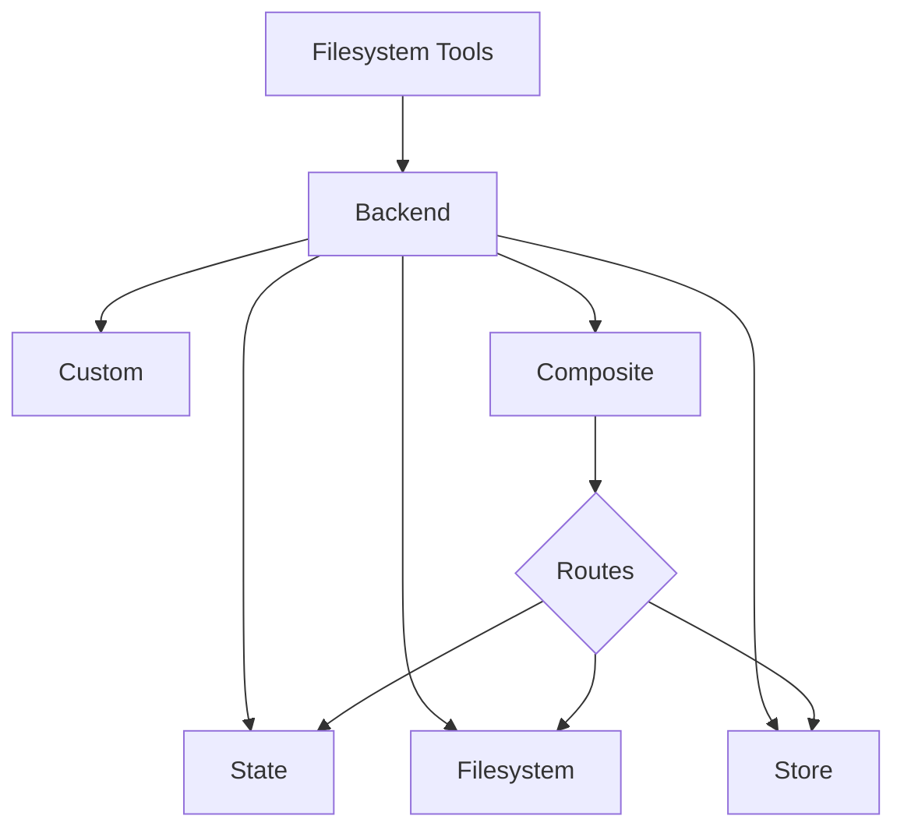

# 백엔드

deep agents를 위한 파일시스템 백엔드를 선택하고 구성하세요. 다른 백엔드로의 라우트를 지정하고, 가상 파일시스템을 구현하고, 정책을 적용할 수 있습니다.

Deep agents는 `ls`, `read_file`, `write_file`, `edit_file`, `glob`, `grep`과 같은 도구를 통해 에이전트에게 파일시스템 표면을 노출합니다. 이러한 도구들은 플러그형 백엔드를 통해 작동합니다.



이 페이지는 백엔드를 선택하는 방법, 다른 경로를 다른 백엔드로 라우팅하는 방법, 자체 가상 파일시스템(예: S3 또는 Postgres)을 구현하는 방법, 정책 훅을 추가하는 방법, 백엔드 프로토콜을 준수하는 방법을 설명합니다.

## 빠른 시작

deep agent와 함께 빠르게 사용할 수 있는 몇 가지 사전 구축된 파일시스템 백엔드입니다:

| 내장 백엔드 | 설명 |
| :--- | :--- |
| **기본값** | `agent = create_deep_agent()` <br><br> 상태에 임시 저장. 에이전트의 기본 파일시스템 백엔드는 langgraph 상태에 저장됩니다. 이 파일시스템은 단일 스레드에서만 유지됩니다. |
| **로컬 파일시스템 영속성** | `agent = create_deep_agent(backend=FilesystemBackend(root_dir="/Users/nh/Desktop/"))` <br><br> 이것은 deep agent에게 로컬 머신의 파일시스템에 대한 접근 권한을 부여합니다. 에이전트가 접근할 수 있는 루트 디렉토리를 지정할 수 있습니다. 제공된 모든 root_dir은 절대 경로여야 합니다. |
| **영구 저장소 (LangGraph store)** | `agent = create_deep_agent(backend=lambda rt: StoreBackend(rt))` <br><br> 이것은 에이전트에게 스레드 간에 유지되는 장기 저장소에 대한 접근 권한을 부여합니다. 여러 실행에 걸쳐 에이전트에 적용되는 장기 메모리나 지침을 저장하는 데 적합합니다. |
| **복합** | 기본적으로 임시, `/memories/`는 영구 저장. Composite 백엔드는 최대한 유연합니다. 파일시스템의 다른 경로가 다른 백엔드를 가리키도록 지정할 수 있습니다. 바로 붙여넣기 가능한 예제는 아래 Composite 라우팅을 참조하세요. |

## 내장 백엔드

### StateBackend (임시)

```python
# 기본적으로 StateBackend를 제공합니다
agent = create_deep_agent()

# 내부적으로는 다음과 같습니다
from deepagents.backends import StateBackend

agent = create_deep_agent(
    backend=(lambda rt: StateBackend(rt))   # 도구는 runtime.state를 통해 State에 접근합니다
)
```

**작동 방식:**
- 현재 스레드에 대한 LangGraph 에이전트 상태에 파일 저장.
- 체크포인트를 통해 동일한 스레드에서 여러 에이전트 턴에 걸쳐 유지됩니다.

**적합한 경우:**
- 에이전트가 중간 결과를 작성하는 스크래치 패드.
- 에이전트가 조금씩 다시 읽을 수 있는 대용량 도구 출력의 자동 제거.

### FilesystemBackend (로컬 디스크)

```python
from deepagents.backends import FilesystemBackend

agent = create_deep_agent(
    backend=FilesystemBackend(root_dir=".", virtual_mode=True)
)
```

**작동 방식:**
- 구성 가능한 `root_dir` 아래에서 실제 파일 읽기/쓰기.
- 선택적으로 `virtual_mode=True`를 설정하여 `root_dir` 아래에서 경로를 샌드박스하고 정규화할 수 있습니다.
- 보안 경로 해결 사용, 가능한 경우 안전하지 않은 심볼릭 링크 탐색 방지, 빠른 grep을 위해 ripgrep 사용 가능.

**적합한 경우:**
- 로컬 머신의 프로젝트
- CI 샌드박스
- 마운트된 영구 볼륨

### StoreBackend (LangGraph store)

```python
from langgraph.store.memory import InMemoryStore
from deepagents.backends import StoreBackend

agent = create_deep_agent(
    backend=(lambda rt: StoreBackend(rt)),   # 도구는 runtime.store를 통해 Store에 접근합니다
    store=InMemoryStore()
)
```

**작동 방식:**
- 런타임에서 제공하는 LangGraph `BaseStore`에 파일을 저장하여 스레드 간 영구 저장 가능.

**적합한 경우:**
- 이미 구성된 LangGraph store(예: Redis, Postgres, 또는 `BaseStore` 뒤의 클라우드 구현)로 실행할 때.
- LangSmith Deployment를 통해 에이전트를 배포할 때 (store가 에이전트에 자동으로 프로비저닝됨).

### CompositeBackend (라우터)

```python
from deepagents import create_deep_agent
from deepagents.backends import CompositeBackend, StateBackend, StoreBackend
from langgraph.store.memory import InMemoryStore

composite_backend = lambda rt: CompositeBackend(
    default=StateBackend(rt),
    routes={
        "/memories/": StoreBackend(rt),
    }
)

agent = create_deep_agent(
    backend=composite_backend,
    store=InMemoryStore()  # Store는 backend가 아닌 create_deep_agent에 전달
)
```

**작동 방식:**
- 경로 접두사에 따라 파일 작업을 다른 백엔드로 라우팅.
- 목록 및 검색 결과에서 원래 경로 접두사를 유지.

**적합한 경우:**
- 에이전트에게 임시 및 스레드 간 저장소를 모두 제공하고 싶을 때, `CompositeBackend`를 사용하면 `StateBackend`와 `StoreBackend`를 모두 제공할 수 있습니다
- 단일 파일시스템의 일부로 에이전트에 제공하려는 여러 정보 소스가 있을 때.
  - 예: 한 Store의 `/memories/`에 장기 메모리가 저장되어 있고 `/docs/`에서 접근 가능한 문서가 있는 커스텀 백엔드도 있습니다.

## 백엔드 지정

`create_deep_agent(backend=...)`에 백엔드를 전달합니다. 파일시스템 미들웨어가 모든 도구에 이를 사용합니다.

다음 중 하나를 전달할 수 있습니다:
1.  `BackendProtocol`을 구현하는 인스턴스 (예: `FilesystemBackend(root_dir=".")`), 또는
2.  팩토리 `BackendFactory = Callable[[ToolRuntime], BackendProtocol]` (`StateBackend` 또는 `StoreBackend`처럼 런타임이 필요한 백엔드용).

생략하면 기본값은 `lambda rt: StateBackend(rt)`입니다.

## 다른 백엔드로 라우팅

네임스페이스의 일부를 다른 백엔드로 라우팅합니다. `/memories/*`를 영구 저장하고 나머지는 임시로 유지하는 데 일반적으로 사용됩니다.

```python
from deepagents import create_deep_agent
from deepagents.backends import CompositeBackend, StateBackend, FilesystemBackend

composite_backend = lambda rt: CompositeBackend(
    default=StateBackend(rt),
    routes={
        "/memories/": FilesystemBackend(root_dir="/deepagents/myagent", virtual_mode=True),
    },
)

agent = create_deep_agent(backend=composite_backend)
```

**동작:**
- `/workspace/plan.md` → `StateBackend` (임시)
- `/memories/agent.md` → `/deepagents/myagent` 아래의 `FilesystemBackend`
- `ls`, `glob`, `grep`은 결과를 집계하고 원래 경로 접두사를 표시.

**참고:**
- 더 긴 접두사가 우선 (예: 라우트 `"/memories/projects/"`가 `"/memories/"`를 재정의할 수 있음).
- `StoreBackend` 라우팅의 경우, 에이전트 런타임이 store를 제공하는지 확인 (`runtime.store`).

## 가상 파일시스템 사용

원격 또는 데이터베이스 파일시스템(예: S3 또는 Postgres)을 도구 네임스페이스에 투영하는 커스텀 백엔드를 구축합니다.

**설계 가이드라인:**
- 경로는 절대 경로 (`/x/y.txt`). 스토리지 키/행에 매핑하는 방법을 결정.
- `ls_info`와 `glob_info`를 효율적으로 구현 (가능한 경우 서버 측 목록, 그렇지 않으면 로컬 필터).
- 누락된 파일이나 유효하지 않은 정규식 패턴에 대해 사용자가 읽을 수 있는 오류 문자열 반환.
- 외부 영속성의 경우, 결과에 `files_update=None` 설정; in-state 백엔드만 `files_update` dict를 반환해야 함.

**S3 스타일 개요:**

```python
from deepagents.backends.protocol import BackendProtocol, WriteResult, EditResult
from deepagents.backends.utils import FileInfo, GrepMatch

class S3Backend(BackendProtocol):
    def __init__(self, bucket: str, prefix: str = ""):
        self.bucket = bucket
        self.prefix = prefix.rstrip("/")

    def _key(self, path: str) -> str:
        return f"{self.prefix}{path}"

    def ls_info(self, path: str) -> list[FileInfo]:
        # _key(path) 아래의 객체 나열; FileInfo 항목 구축 (path, size, modified_at)
        ...

    def read(self, file_path: str, offset: int = 0, limit: int = 2000) -> str:
        # 객체 가져오기; 번호 매겨진 내용 또는 오류 문자열 반환
        ...

    def grep_raw(self, pattern: str, path: str | None = None, glob: str | None = None) -> list[GrepMatch] | str:
        # 선택적으로 서버 측 필터; 그렇지 않으면 나열하고 내용 스캔
        ...

    def glob_info(self, pattern: str, path: str = "/") -> list[FileInfo]:
        # 키 간에 경로에 상대적인 glob 적용
        ...

    def write(self, file_path: str, content: str) -> WriteResult:
        # 생성 전용 시맨틱 적용; WriteResult(path=file_path, files_update=None) 반환
        ...

    def edit(self, file_path: str, old_string: str, new_string: str, replace_all: bool = False) -> EditResult:
        # 읽기 → 교체 (고유성 존중 vs replace_all) → 쓰기 → 발생 횟수 반환
        ...
```

**Postgres 스타일 개요:**
- 테이블 `files(path text primary key, content text, created_at timestamptz, modified_at timestamptz)`
- 도구 작업을 SQL에 매핑:
  - `ls_info`는 `WHERE path LIKE $1 || '%'` 사용
  - `glob_info`는 SQL에서 필터링하거나 가져온 후 Python에서 glob 적용
  - `grep_raw`는 확장자 또는 마지막 수정 시간으로 후보 행을 가져온 다음 줄 스캔 가능

## 정책 훅 추가

백엔드를 서브클래싱하거나 래핑하여 엔터프라이즈 규칙을 적용합니다.

**선택된 접두사에서 쓰기/편집 차단 (서브클래스):**

```python
from deepagents.backends.filesystem import FilesystemBackend
from deepagents.backends.protocol import WriteResult, EditResult

class GuardedBackend(FilesystemBackend):
    def __init__(self, *, deny_prefixes: list[str], **kwargs):
        super().__init__(**kwargs)
        self.deny_prefixes = [p if p.endswith("/") else p + "/" for p in deny_prefixes]

    def write(self, file_path: str, content: str) -> WriteResult:
        if any(file_path.startswith(p) for p in self.deny_prefixes):
            return WriteResult(error=f"Writes are not allowed under {file_path}")
        return super().write(file_path, content)

    def edit(self, file_path: str, old_string: str, new_string: str, replace_all: bool = False) -> EditResult:
        if any(file_path.startswith(p) for p in self.deny_prefixes):
            return EditResult(error=f"Edits are not allowed under {file_path}")
        return super().edit(file_path, old_string, new_string, replace_all)
```

**범용 래퍼 (모든 백엔드와 작동):**

```python
from deepagents.backends.protocol import BackendProtocol, WriteResult, EditResult
from deepagents.backends.utils import FileInfo, GrepMatch

class PolicyWrapper(BackendProtocol):
    def __init__(self, inner: BackendProtocol, deny_prefixes: list[str] | None = None):
        self.inner = inner
        self.deny_prefixes = [p if p.endswith("/") else p + "/" for p in (deny_prefixes or [])]

    def _deny(self, path: str) -> bool:
        return any(path.startswith(p) for p in self.deny_prefixes)

    def ls_info(self, path: str) -> list[FileInfo]:
        return self.inner.ls_info(path)
    def read(self, file_path: str, offset: int = 0, limit: int = 2000) -> str:
        return self.inner.read(file_path, offset=offset, limit=limit)
    def grep_raw(self, pattern: str, path: str | None = None, glob: str | None = None) -> list[GrepMatch] | str:
        return self.inner.grep_raw(pattern, path, glob)
    def glob_info(self, pattern: str, path: str = "/") -> list[FileInfo]:
        return self.inner.glob_info(pattern, path)
    def write(self, file_path: str, content: str) -> WriteResult:
        if self._deny(file_path):
            return WriteResult(error=f"Writes are not allowed under {file_path}")
        return self.inner.write(file_path, content)
    def edit(self, file_path: str, old_string: str, new_string: str, replace_all: bool = False) -> EditResult:
        if self._deny(file_path):
            return EditResult(error=f"Edits are not allowed under {file_path}")
        return self.inner.edit(file_path, old_string, new_string, replace_all)
```

## 프로토콜 레퍼런스

백엔드는 `BackendProtocol`을 구현해야 합니다.

**필수 엔드포인트:**
- `ls_info(path: str) -> list[FileInfo]`
  - 최소한 `path`가 있는 항목 반환. 가능한 경우 `is_dir`, `size`, `modified_at` 포함. 결정적 출력을 위해 경로별로 정렬.
- `read(file_path: str, offset: int = 0, limit: int = 2000) -> str`
  - 번호 매겨진 내용 반환. 파일이 없으면 `"Error: File '/x' not found"` 반환.
- `grep_raw(pattern: str, path: Optional[str] = None, glob: Optional[str] = None) -> list[GrepMatch] | str`
  - 구조화된 일치 항목 반환. 유효하지 않은 정규식의 경우, `"Invalid regex pattern: ..."` 같은 문자열 반환 (예외 발생 안 함).
- `glob_info(pattern: str, path: str = "/") -> list[FileInfo]`
  - 일치하는 파일을 `FileInfo` 항목으로 반환 (없으면 빈 목록).
- `write(file_path: str, content: str) -> WriteResult`
  - 생성 전용. 충돌 시 `WriteResult(error=...)` 반환. 성공 시, `path` 설정하고 state 백엔드의 경우 `files_update={...}` 설정; 외부 백엔드는 `files_update=None` 사용.
- `edit(file_path: str, old_string: str, new_string: str, replace_all: bool = False) -> EditResult`
  - `replace_all=True`가 아닌 한 `old_string`의 고유성 적용. 찾을 수 없으면 오류 반환. 성공 시 발생 횟수 포함.

**지원 타입:**
- `WriteResult(error, path, files_update)`
- `EditResult(error, path, files_update, occurrences)`
- `FileInfo` 필드: `path` (필수), 선택적으로 `is_dir`, `size`, `modified_at`.
- `GrepMatch` 필드: `path`, `line`, `text`.

---

<p align="center">
  <a href="04-harness_ko.md">← 이전: 에이전트 하네스</a> • <a href="README.md">목차</a> • <a href="06-subagents_ko.md">다음: 서브에이전트 →</a>
</p>
