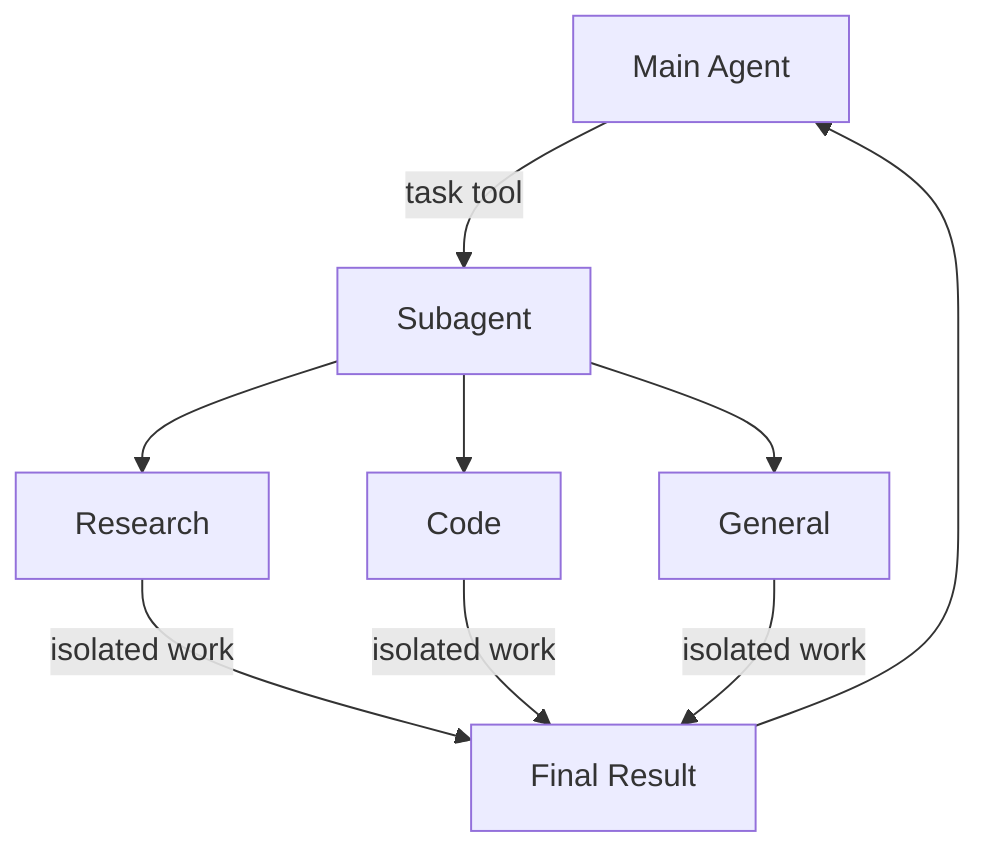

# Subagents

Learn how to use subagents to delegate work and keep context clean

Deep agents can create subagents to delegate work. You can specify custom subagents in the `subagents` parameter. Subagents are useful for [context quarantine](https://www.dbreunig.com/2025/06/26/how-to-fix-your-context.html#context-quarantine) (keeping the main agent’s context clean) and for providing specialized instructions.



## Why use subagents?

Subagents solve the **context bloat problem**. When agents use tools with large outputs (web search, file reads, database queries), the context window fills up quickly with intermediate results. Subagents isolate this detailed work—the main agent receives only the final result, not the dozens of tool calls that produced it.

**When to use subagents:**

- ✅ Multi-step tasks that would clutter the main agent’s context
- ✅ Specialized domains that need custom instructions or tools
- ✅ Tasks requiring different model capabilities
- ✅ When you want to keep the main agent focused on high-level coordination

**When NOT to use subagents:**

- ❌ Simple, single-step tasks
- ❌ When you need to maintain intermediate context
- ❌ When the overhead outweighs benefits

## Configuration

`subagents` should be a list of dictionaries or `CompiledSubAgent` objects. There are two types:

### SubAgent (Dictionary-based)

For most use cases, define subagents as dictionaries:

**Required fields:**

- **name** (str, required): Unique identifier for the subagent. The main agent uses this name when calling the `task()` tool.
- **description** (str, required): What this subagent does. Be specific and action-oriented. The main agent uses this to decide when to delegate.
- **system_prompt** (str, required): Instructions for the subagent. Include tool usage guidance and output format requirements.
- **tools** (list[Callable], required): Tools the subagent can use. Keep this minimal and include only what’s needed.

**Optional fields:**

- **model** (str | BaseChatModel): Override the main agent’s model. Use the format `'provider:model-name'` (for example, `'openai:gpt-4o'`).
- **middleware** (list[Middleware]): Additional middleware for custom behavior, logging, or rate limiting.
- **interrupt_on** (dict[str, bool]): Configure human-in-the-loop for specific tools. Requires a checkpointer.

### CompiledSubAgent

For complex workflows, use a pre-built LangGraph graph:

- **name** (str, required): Unique identifier for the subagent.
- **description** (str, required): What this subagent does.
- **runnable** (Runnable, required): A compiled LangGraph graph (must call `.compile()` first).

## Using SubAgent

```python
import os
from typing import Literal
from tavily import TavilyClient
from deepagents import create_deep_agent

tavily_client = TavilyClient(api_key=os.environ["TAVILY_API_KEY"])

def internet_search(
    query: str,
    max_results: int = 5,
    topic: Literal["general", "news", "finance"] = "general",
    include_raw_content: bool = False,
):
    """Run a web search"""
    return tavily_client.search(
        query,
        max_results=max_results,
        include_raw_content=include_raw_content,
        topic=topic,
    )

research_subagent = {
    "name": "research-agent",
    "description": "Used to research more in depth questions",
    "system_prompt": "You are a great researcher",
    "tools": [internet_search],
    "model": "openai:gpt-4o",  # Optional override, defaults to main agent model
}
subagents = [research_subagent]

agent = create_deep_agent(
    model="claude-sonnet-4-5-20250929",
    subagents=subagents
)
```

## Using CompiledSubAgent

For more complex use cases, you can provide your own pre-built LangGraph graph as a subagent:

```python
from deepagents import create_deep_agent, CompiledSubAgent
from langchain.agents import create_agent

# Create a custom agent graph
custom_graph = create_agent(
    model=your_model,
    tools=specialized_tools,
    prompt="You are a specialized agent for data analysis..."
)

# Use it as a custom subagent
custom_subagent = CompiledSubAgent(
    name="data-analyzer",
    description="Specialized agent for complex data analysis tasks",
    runnable=custom_graph
)

subagents = [custom_subagent]

agent = create_deep_agent(
    model="claude-sonnet-4-5-20250929",
    tools=[internet_search],
    system_prompt=research_instructions,
    subagents=subagents
)
```

## The general-purpose subagent

In addition to any user-defined subagents, deep agents have access to a `general-purpose` subagent at all times. This subagent:

- Has the same system prompt as the main agent
- Has access to all the same tools
- Uses the same model (unless overridden)

### When to use it

The general-purpose subagent is ideal for context isolation without specialized behavior. The main agent can delegate a complex multi-step task to this subagent and get a concise result back without bloat from intermediate tool calls.

> **Example**
> Instead of the main agent making 10 web searches and filling its context with results, it delegates to the general-purpose subagent: `task(name="general-purpose", task="Research quantum computing trends")`. The subagent performs all the searches internally and returns only a summary.

## Best practices

### Write clear descriptions

The main agent uses descriptions to decide which subagent to call. Be specific:

- ✅ **Good**: "Analyzes financial data and generates investment insights with confidence scores"
- ❌ **Bad**: "Does finance stuff"

### Keep system prompts detailed

Include specific guidance on how to use tools and format outputs:

```python
research_subagent = {
    "name": "research-agent",
    "description": "Conducts in-depth research using web search and synthesizes findings",
    "system_prompt": """You are a thorough researcher. Your job is to:

    1. Break down the research question into searchable queries
    2. Use internet_search to find relevant information
    3. Synthesize findings into a comprehensive but concise summary
    4. Cite sources when making claims

    Output format:
    - Summary (2-3 paragraphs)
    - Key findings (bullet points)
    - Sources (with URLs)

    Keep your response under 500 words to maintain clean context.""",
    "tools": [internet_search],
}
```

### Minimize tool sets

Only give subagents the tools they need. This improves focus and security:

```python
# ✅ Good: Focused tool set
email_agent = {
    "name": "email-sender",
    "tools": [send_email, validate_email],  # Only email-related
}

# ❌ Bad: Too many tools
email_agent = {
    "name": "email-sender",
    "tools": [send_email, web_search, database_query, file_upload],  # Unfocused
}
```

### Choose models by task

Different models excel at different tasks:

```python
subagents = [
    {
        "name": "contract-reviewer",
        "description": "Reviews legal documents and contracts",
        "system_prompt": "You are an expert legal reviewer...",
        "tools": [read_document, analyze_contract],
        "model": "claude-sonnet-4-5-20250929",  # Large context for long documents
    },
    {
        "name": "financial-analyst",
        "description": "Analyzes financial data and market trends",
        "system_prompt": "You are an expert financial analyst...",
        "tools": [get_stock_price, analyze_fundamentals],
        "model": "openai:gpt-5",  # Better for numerical analysis
    },
]
```

### Return concise results

Instruct subagents to return summaries, not raw data:

```python
data_analyst = {
    "system_prompt": """Analyze the data and return:
    1. Key insights (3-5 bullet points)
    2. Overall confidence score
    3. Recommended next actions

    Do NOT include:
    - Raw data
    - Intermediate calculations
    - Detailed tool outputs

    Keep response under 300 words."""
}
```

## Common patterns

### Multiple specialized subagents

Create specialized subagents for different domains:

```python
from deepagents import create_deep_agent

subagents = [
    {
        "name": "data-collector",
        "description": "Gathers raw data from various sources",
        "system_prompt": "Collect comprehensive data on the topic",
        "tools": [web_search, api_call, database_query],
    },
    {
        "name": "data-analyzer",
        "description": "Analyzes collected data for insights",
        "system_prompt": "Analyze data and extract key insights",
        "tools": [statistical_analysis],
    },
    {
        "name": "report-writer",
        "description": "Writes polished reports from analysis",
        "system_prompt": "Create professional reports from insights",
        "tools": [format_document],
    },
]

agent = create_deep_agent(
    model="claude-sonnet-4-5-20250929",
    system_prompt="You coordinate data analysis and reporting. Use subagents for specialized tasks.",
    subagents=subagents
)
```

**Workflow:**
1. Main agent creates high-level plan
2. Delegates data collection to data-collector
3. Passes results to data-analyzer
4. Sends insights to report-writer
5. Compiles final output

Each subagent works with clean context focused only on its task.

## Troubleshooting

### Subagent not being called

**Problem:** Main agent tries to do work itself instead of delegating.

**Solutions:**
Make descriptions more specific:

```python
# ✅ Good
{"name": "research-specialist", "description": "Conducts in-depth research on specific topics using web search. Use when you need detailed information that requires multiple searches."}

# ❌ Bad
{"name": "helper", "description": "helps with stuff"}
```

Instruct main agent to delegate:

```python
agent = create_deep_agent(
    system_prompt="""...your instructions...

    IMPORTANT: For complex tasks, delegate to your subagents using the task() tool.
    This keeps your context clean and improves results.""",
    subagents=[...]
)
```

### Context still getting bloated

**Problem:** Context fills up despite using subagents.

**Solutions:**
Instruct subagent to return concise results:

```python
system_prompt="""...

IMPORTANT: Return only the essential summary.
Do NOT include raw data, intermediate search results, or detailed tool outputs.
Your response should be under 500 words."""
```

Use filesystem for large data:

```python
system_prompt="""When you gather large amounts of data:
1. Save raw data to /data/raw_results.txt
2. Process and analyze the data
3. Return only the analysis summary

This keeps context clean."""
```

### Wrong subagent being selected

**Problem:** Main agent calls inappropriate subagent for the task.

**Solution:** Differentiate subagents clearly in descriptions:

```python
subagents = [
    {
        "name": "quick-researcher",
        "description": "For simple, quick research questions that need 1-2 searches. Use when you need basic facts or definitions.",
    },
    {
        "name": "deep-researcher",
        "description": "For complex, in-depth research requiring multiple searches, synthesis, and analysis. Use for comprehensive reports.",
    }
]
```

---

<p align="center">
  <a href="05-backends.md">← Previous: Backends</a> • <a href="README.md">Table of Contents</a> • <a href="07-human-in-the-loop.md">Next: Human-in-the-loop →</a>
</p>
