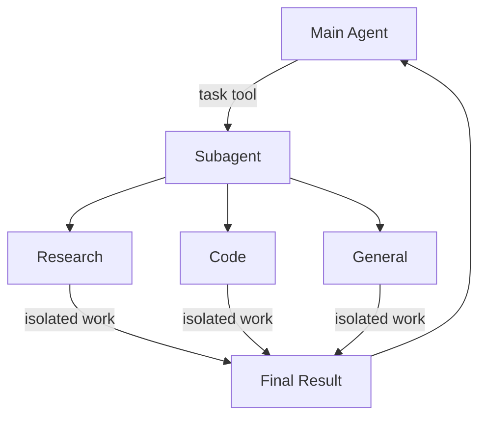

# 서브에이전트

서브에이전트를 사용하여 작업을 위임하고 컨텍스트를 깔끔하게 유지하는 방법 알아보기

Deep agents는 작업을 위임하기 위해 서브에이전트를 생성할 수 있습니다. `subagents` 파라미터에서 커스텀 서브에이전트를 지정할 수 있습니다. 서브에이전트는 [컨텍스트 격리](https://www.dbreunig.com/2025/06/26/how-to-fix-your-context.html#context-quarantine) (메인 에이전트의 컨텍스트를 깔끔하게 유지)와 전문화된 지침을 제공하는 데 유용합니다.



## 왜 서브에이전트를 사용하나요?

서브에이전트는 **컨텍스트 비대화 문제**를 해결합니다. 에이전트가 대용량 출력이 있는 도구(웹 검색, 파일 읽기, 데이터베이스 쿼리)를 사용할 때, 컨텍스트 윈도우가 중간 결과로 빠르게 채워집니다. 서브에이전트는 이 상세한 작업을 격리합니다—메인 에이전트는 그것을 생성한 수십 개의 도구 호출이 아닌 최종 결과만 받습니다.

**서브에이전트 사용 시점:**

- ✅ 메인 에이전트의 컨텍스트를 어지럽힐 다단계 작업
- ✅ 커스텀 지침이나 도구가 필요한 전문 분야
- ✅ 다른 모델 기능이 필요한 작업
- ✅ 메인 에이전트가 고수준 조정에 집중하기를 원할 때

**서브에이전트를 사용하지 않을 때:**

- ❌ 간단한 단일 단계 작업
- ❌ 중간 컨텍스트를 유지해야 할 때
- ❌ 오버헤드가 이점을 초과할 때

## 구성

`subagents`는 딕셔너리 또는 `CompiledSubAgent` 객체의 목록이어야 합니다. 두 가지 유형이 있습니다:

### SubAgent (딕셔너리 기반)

대부분의 사용 사례에서 서브에이전트를 딕셔너리로 정의합니다:

**필수 필드:**

- **name** (str, 필수): 서브에이전트의 고유 식별자. 메인 에이전트가 `task()` 도구를 호출할 때 이 이름을 사용합니다.
- **description** (str, 필수): 이 서브에이전트가 수행하는 작업. 구체적이고 행동 지향적이어야 합니다. 메인 에이전트가 언제 위임할지 결정하는 데 사용합니다.
- **system_prompt** (str, 필수): 서브에이전트에 대한 지침. 도구 사용 가이드와 출력 형식 요구사항을 포함합니다.
- **tools** (list[Callable], 필수): 서브에이전트가 사용할 수 있는 도구. 최소한으로 유지하고 필요한 것만 포함합니다.

**선택 필드:**

- **model** (str | BaseChatModel): 메인 에이전트의 모델을 재정의. `'provider:model-name'` 형식 사용 (예: `'openai:gpt-4o'`).
- **middleware** (list[Middleware]): 커스텀 동작, 로깅, 또는 속도 제한을 위한 추가 미들웨어.
- **interrupt_on** (dict[str, bool]): 특정 도구에 대한 human-in-the-loop 구성. 체크포인터가 필요합니다.

### CompiledSubAgent

복잡한 워크플로우의 경우, 사전 구축된 LangGraph 그래프를 사용합니다:

- **name** (str, 필수): 서브에이전트의 고유 식별자.
- **description** (str, 필수): 이 서브에이전트가 수행하는 작업.
- **runnable** (Runnable, 필수): 컴파일된 LangGraph 그래프 (먼저 `.compile()`을 호출해야 함).

## SubAgent 사용하기

```python
import os
from typing import Literal
from tavily import TavilyClient
from deepagents import create_deep_agent

tavily_client = TavilyClient(api_key=os.environ["TAVILY_API_KEY"])

def internet_search(
    query: str,
    max_results: int = 5,
    topic: Literal["general", "news", "finance"] = "general",
    include_raw_content: bool = False,
):
    """Run a web search"""
    return tavily_client.search(
        query,
        max_results=max_results,
        include_raw_content=include_raw_content,
        topic=topic,
    )

research_subagent = {
    "name": "research-agent",
    "description": "Used to research more in depth questions",
    "system_prompt": "You are a great researcher",
    "tools": [internet_search],
    "model": "openai:gpt-4o",  # 선택적 재정의, 기본값은 메인 에이전트 모델
}
subagents = [research_subagent]

agent = create_deep_agent(
    model="claude-sonnet-4-5-20250929",
    subagents=subagents
)
```

## CompiledSubAgent 사용하기

더 복잡한 사용 사례의 경우, 자체 사전 구축된 LangGraph 그래프를 서브에이전트로 제공할 수 있습니다:

```python
from deepagents import create_deep_agent, CompiledSubAgent
from langchain.agents import create_agent

# 커스텀 에이전트 그래프 생성
custom_graph = create_agent(
    model=your_model,
    tools=specialized_tools,
    prompt="You are a specialized agent for data analysis..."
)

# 커스텀 서브에이전트로 사용
custom_subagent = CompiledSubAgent(
    name="data-analyzer",
    description="Specialized agent for complex data analysis tasks",
    runnable=custom_graph
)

subagents = [custom_subagent]

agent = create_deep_agent(
    model="claude-sonnet-4-5-20250929",
    tools=[internet_search],
    system_prompt=research_instructions,
    subagents=subagents
)
```

## 범용 서브에이전트

사용자 정의 서브에이전트 외에도, deep agents는 항상 `general-purpose` 서브에이전트에 접근할 수 있습니다. 이 서브에이전트는:

- 메인 에이전트와 동일한 시스템 프롬프트를 가짐
- 동일한 모든 도구에 접근 가능
- 동일한 모델 사용 (재정의되지 않는 한)

### 사용 시점

범용 서브에이전트는 전문화된 동작 없이 컨텍스트 격리에 이상적입니다. 메인 에이전트는 복잡한 다단계 작업을 이 서브에이전트에게 위임하고 중간 도구 호출로 인한 비대화 없이 간결한 결과를 돌려받을 수 있습니다.

> **Example**
> 메인 에이전트가 10번의 웹 검색을 하고 결과로 컨텍스트를 채우는 대신, 범용 서브에이전트에게 위임합니다: `task(name="general-purpose", task="Research quantum computing trends")`. 서브에이전트가 내부적으로 모든 검색을 수행하고 요약만 반환합니다.

## 모범 사례

### 명확한 설명 작성

메인 에이전트는 어떤 서브에이전트를 호출할지 결정하는 데 설명을 사용합니다. 구체적으로 작성하세요:

- ✅ **좋음**: "Analyzes financial data and generates investment insights with confidence scores"
- ❌ **나쁨**: "Does finance stuff"

### 시스템 프롬프트를 상세하게 유지

도구 사용 방법과 출력 형식에 대한 구체적인 가이드 포함:

```python
research_subagent = {
    "name": "research-agent",
    "description": "Conducts in-depth research using web search and synthesizes findings",
    "system_prompt": """You are a thorough researcher. Your job is to:

    1. Break down the research question into searchable queries
    2. Use internet_search to find relevant information
    3. Synthesize findings into a comprehensive but concise summary
    4. Cite sources when making claims

    Output format:
    - Summary (2-3 paragraphs)
    - Key findings (bullet points)
    - Sources (with URLs)

    Keep your response under 500 words to maintain clean context.""",
    "tools": [internet_search],
}
```

### 도구 세트 최소화

서브에이전트에게 필요한 도구만 제공합니다. 이렇게 하면 집중력과 보안이 향상됩니다:

```python
# ✅ 좋음: 집중된 도구 세트
email_agent = {
    "name": "email-sender",
    "tools": [send_email, validate_email],  # 이메일 관련만
}

# ❌ 나쁨: 너무 많은 도구
email_agent = {
    "name": "email-sender",
    "tools": [send_email, web_search, database_query, file_upload],  # 집중되지 않음
}
```

### 작업별 모델 선택

다른 모델은 다른 작업에 뛰어납니다:

```python
subagents = [
    {
        "name": "contract-reviewer",
        "description": "Reviews legal documents and contracts",
        "system_prompt": "You are an expert legal reviewer...",
        "tools": [read_document, analyze_contract],
        "model": "claude-sonnet-4-5-20250929",  # 긴 문서를 위한 대용량 컨텍스트
    },
    {
        "name": "financial-analyst",
        "description": "Analyzes financial data and market trends",
        "system_prompt": "You are an expert financial analyst...",
        "tools": [get_stock_price, analyze_fundamentals],
        "model": "openai:gpt-5",  # 수치 분석에 더 나음
    },
]
```

### 간결한 결과 반환

서브에이전트에게 원시 데이터가 아닌 요약을 반환하도록 지시합니다:

```python
data_analyst = {
    "system_prompt": """Analyze the data and return:
    1. Key insights (3-5 bullet points)
    2. Overall confidence score
    3. Recommended next actions

    Do NOT include:
    - Raw data
    - Intermediate calculations
    - Detailed tool outputs

    Keep response under 300 words."""
}
```

## 일반적인 패턴

### 여러 전문화된 서브에이전트

다른 도메인을 위한 전문화된 서브에이전트 생성:

```python
from deepagents import create_deep_agent

subagents = [
    {
        "name": "data-collector",
        "description": "Gathers raw data from various sources",
        "system_prompt": "Collect comprehensive data on the topic",
        "tools": [web_search, api_call, database_query],
    },
    {
        "name": "data-analyzer",
        "description": "Analyzes collected data for insights",
        "system_prompt": "Analyze data and extract key insights",
        "tools": [statistical_analysis],
    },
    {
        "name": "report-writer",
        "description": "Writes polished reports from analysis",
        "system_prompt": "Create professional reports from insights",
        "tools": [format_document],
    },
]

agent = create_deep_agent(
    model="claude-sonnet-4-5-20250929",
    system_prompt="You coordinate data analysis and reporting. Use subagents for specialized tasks.",
    subagents=subagents
)
```

**워크플로우:**
1. 메인 에이전트가 고수준 계획 생성
2. 데이터 수집을 data-collector에게 위임
3. 결과를 data-analyzer에게 전달
4. 인사이트를 report-writer에게 전송
5. 최종 출력 컴파일

각 서브에이전트는 자신의 작업에만 집중하는 깨끗한 컨텍스트로 작동합니다.

## 문제 해결

### 서브에이전트가 호출되지 않음

**문제:** 메인 에이전트가 위임하는 대신 직접 작업을 수행하려 함.

**해결책:**
설명을 더 구체적으로 만들기:

```python
# ✅ 좋음
{"name": "research-specialist", "description": "Conducts in-depth research on specific topics using web search. Use when you need detailed information that requires multiple searches."}

# ❌ 나쁨
{"name": "helper", "description": "helps with stuff"}
```

메인 에이전트에게 위임하도록 지시:

```python
agent = create_deep_agent(
    system_prompt="""...your instructions...

    IMPORTANT: For complex tasks, delegate to your subagents using the task() tool.
    This keeps your context clean and improves results.""",
    subagents=[...]
)
```

### 컨텍스트가 여전히 비대화됨

**문제:** 서브에이전트를 사용해도 컨텍스트가 채워짐.

**해결책:**
서브에이전트에게 간결한 결과를 반환하도록 지시:

```python
system_prompt="""...

IMPORTANT: Return only the essential summary.
Do NOT include raw data, intermediate search results, or detailed tool outputs.
Your response should be under 500 words."""
```

대용량 데이터에 파일시스템 사용:

```python
system_prompt="""When you gather large amounts of data:
1. Save raw data to /data/raw_results.txt
2. Process and analyze the data
3. Return only the analysis summary

This keeps context clean."""
```

### 잘못된 서브에이전트가 선택됨

**문제:** 메인 에이전트가 작업에 부적절한 서브에이전트를 호출.

**해결책:** 설명에서 서브에이전트를 명확하게 구분:

```python
subagents = [
    {
        "name": "quick-researcher",
        "description": "For simple, quick research questions that need 1-2 searches. Use when you need basic facts or definitions.",
    },
    {
        "name": "deep-researcher",
        "description": "For complex, in-depth research requiring multiple searches, synthesis, and analysis. Use for comprehensive reports.",
    }
]
```

---

<p align="center">
  <a href="05-backends_ko.md">← 이전: 백엔드</a> • <a href="README.md">목차</a> • <a href="07-human-in-the-loop_ko.md">다음: Human-in-the-loop →</a>
</p>
